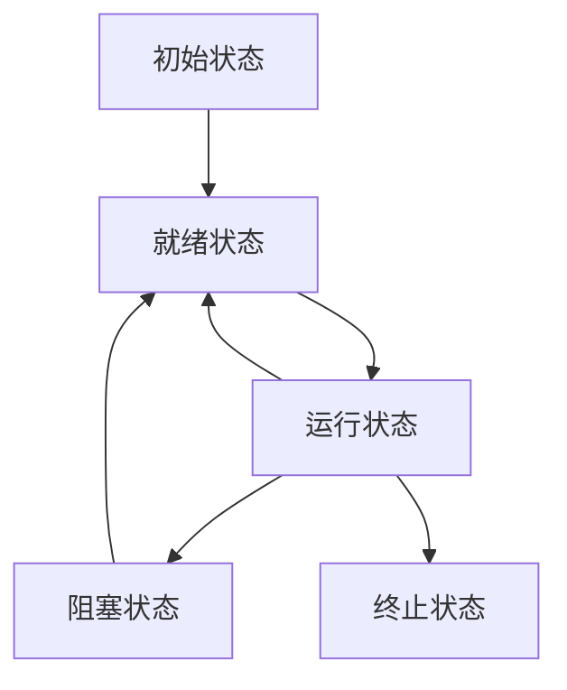
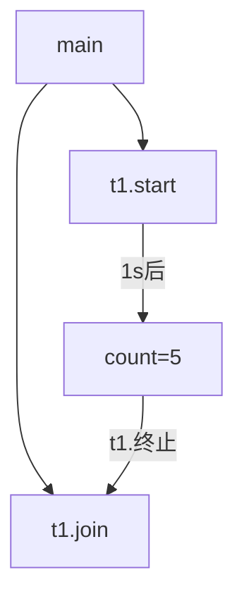
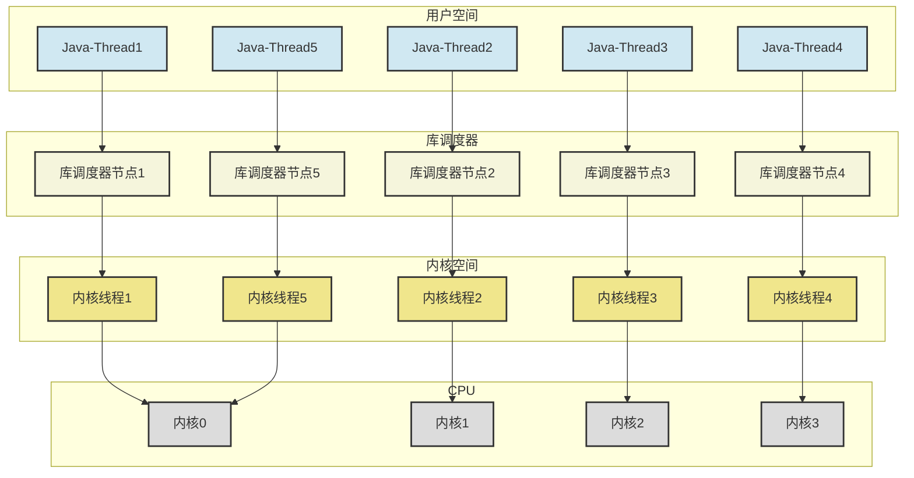
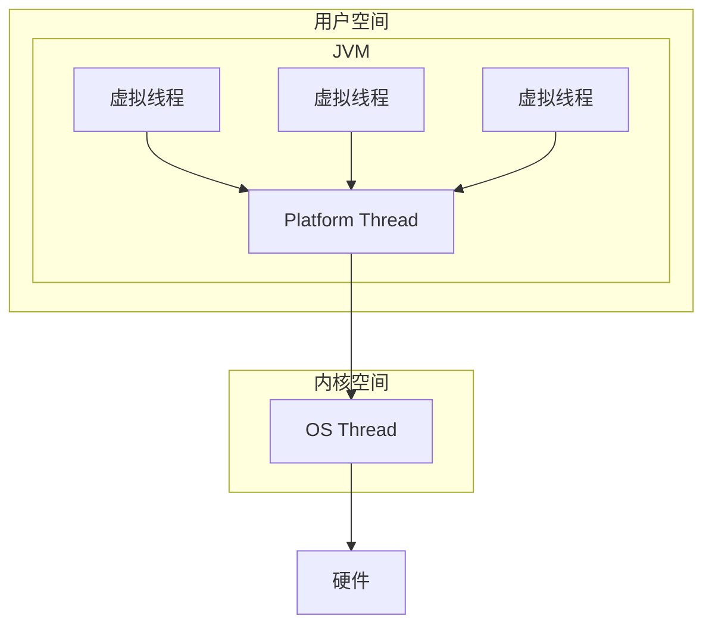
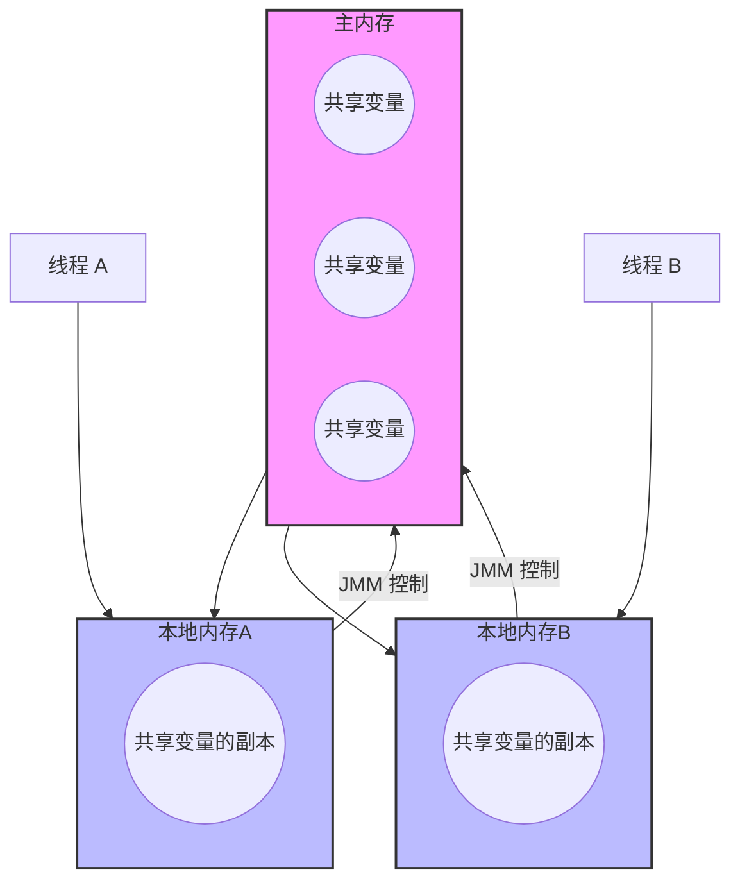

{: .no_toc }

<details close markdown="block">
  <summary>
    目录
  </summary>
  {: .text-delta }
- TOC
{:toc}
</details>

## 1. 并发编程的必要性与核心价值

在当代计算机体系结构中，并发编程已成为提升系统性能和用户体验的核心技术手段。随着摩尔定律的逐渐失效和多核处理器的普及，传统的单线程编程范式已无法充分发挥现代硬件的计算能力。并发编程通过合理的任务分解和并行执行，实现了计算资源的最大化利用。

并发编程的理论基础源于对计算资源的优化配置和任务执行效率的数学建模。从理论计算机科学的角度看，并发问题可抽象为资源调度、任务分配和同步协调三个核心问题。

在实际工程应用中，并发编程主要体现在以下三个方面的价值实现：

### 1.1 加快响应用户时间

多线程技术显著提升系统响应速度。以迅雷下载软件为例，用户普遍倾向于使用多线程下载而非单线程下载，原因是多个线程能够并行处理下载任务，从而获得更快的下载速度。

这一原理在Web开发中同样适用。在互联网项目开发中，网页响应时间每提升1秒，即可显著增加用户转化率。高性能Web前端优化实践表明，通过使用两到三个子域名加载静态资源，可以促使浏览器开启多个线程并行加载页面资源，进而提升网站的响应速度。

### 1.2 实现代码模块化和异步化

并发编程促进系统架构的模块化设计。以电商系统为例，订单处理与用户通知（短信、邮件发送）可以分解为独立模块，由不同线程并行执行。这种设计不仅提升系统性能，同时实现了程序结构的模块化、清晰化和简单化。

多线程应用开发具备众多优势，开发者在实际编程过程中将逐步体会到其强大功能和灵活性。

### 1.3 充分利用CPU资源

多核CPU的普及使得并发编程成为必然选择。当前市场上的CPU均采用多核设计，若继续使用单线程技术，无法充分利用CPU的多核特性。通过设计多线程程序，可以在多个CPU核心上同时运行多个线程，从而最大化CPU利用率，减少CPU空闲时间，提升系统并发处理能力。

时间管理的概念同样适用于CPU资源利用。正如乘坐地铁时人们会利用通勤时间阅读学习一样，并发执行任务相当于在同一时间段内完成多项工作。CPU资源同样需要充分利用，以发挥其最大运算能力。

单核CPU同样能够从并发编程中受益。以即时通讯软件QQ为例，聊天程序需要同时处理多项任务：接收键盘输入、网络数据传输、信息显示等。这些任务在很多情况下可以同时发生，若程序不支持并发处理，用户交流将被迫采用一问一答的串行模式。

## 2. 并发编程基础概念

### 2.1 进程和线程

#### 2.1.1 进程的概念与特征

进程是程序的动态执行实例。应用程序（App）由指令和数据组成，当程序未运行时，这些应用程序以二进制代码形式存储在磁盘等存储介质中。一旦程序启动执行，指令需要加载至CPU，数据需要加载至内存，同时还需要使用磁盘、网络等系统资源。从这个角度分析，进程负责加载指令、管理内存、管理I/O操作。

进程是程序运行的资源分配单位。当程序被运行时，其代码从磁盘加载至内存，此时系统创建一个进程。大多数程序支持同时运行多个实例进程（如记事本、浏览器等），部分程序仅支持单实例运行（如网易云音乐、360安全卫士等）。程序本身是静态的，而进程是动态的。进程分为系统进程和用户进程：系统进程执行操作系统功能，是运行中的操作系统本身；用户进程则由用户启动。

#### 2.1.2 线程的定义与特性

线程是CPU调度的最小单位。在有限的CPU资源下运行多个程序需要协调机制，即CPU调度。线程必须依赖于进程存在，是进程中的实体，也是CPU调度和分派的基本单位。相比于进程，线程是更小的、能独立运行的基本单位。

线程的资源占用极其有限。线程本身基本不拥有系统资源，仅保存运行必需的资源（如程序计数器、寄存器组和栈），但可以与同进程内的其他线程共享进程拥有的全部资源。一个进程可以包含多个线程，每个线程必须属于一个父进程。线程也被称为轻量级进程（Lightweight Process，LWP），早期Linux的线程实现实际上复用了进程机制，后来才发展出独立的API。

#### 2.1.3 进程与线程的区别

* **独立性差异**：进程基本相互独立，而线程存在于进程内部，是进程的子集'
* **资源共享**：进程拥有共享资源（如内存空间），供内部线程共享使用
* **通信复杂度**：进程间通信相对复杂
  * **进程通信机制**：同一计算机的进程通信称为IPC（Inter-process communication），不同计算机的进程通信需要通过网络并遵循共同协议（如HTTP）
  * **线程通信优势**：线程通信相对简单，因为它们共享进程内存，多个线程可以访问同一共享变量
* **性能特性**：线程更轻量级，线程上下文切换成本通常低于进程上下文切换

### 2.2 CPU核心数和线程数的关系

CPU核心数与线程数存在直接对应关系。当前主流CPU均采用多核设计，线程是CPU调度的最小单位。在同一时刻，一个CPU核心只能运行一个线程，即CPU核心数与同时运行的线程数呈1:1关系。例如，8核CPU可以同时执行8个线程的代码。

超线程技术改变了核心与线程的比例关系。Intel引入的超线程技术产生了逻辑处理器的概念，使核心数与线程数形成1:2的关系。例如，Windows任务管理器显示6个核心但具有12个逻辑处理器。

实际线程数可以远超CPU核心数。线程数可以远高于CPU核心数，这与上下文切换、线程阻塞等因素相关。Java提供了`Runtime.getRuntime().availableProcessors()`方法获取当前CPU核心数（注意：此处的核心数指逻辑处理器数）。

CPU核心数对并发编程具有重要意义。在并发编程中，性能优化往往与CPU核心数密切相关，因此获取当前CPU核心数是并发编程的重要环节。

### 2.3 上下文切换（Context switch）

上下文切换是多任务调度的必然结果。操作系统需要在多个进程（线程）之间进行调度，而每个线程使用CPU时都需要访问CPU资源（如CPU寄存器和程序计数器）。为确保线程在调度前后能够正常运行，操作系统引入了上下文切换机制，即CPU从一个进程或线程切换到另一个进程或线程时，需要保存和读取线程上下文。

上下文包含关键执行信息。上下文是CPU寄存器和程序计数器在特定时间点的内容。寄存器是CPU内部的小容量高速内存，通过快速访问常用值来加速程序执行。程序计数器是专用寄存器，指示CPU在指令序列中的位置，保存当前执行指令或下一条执行指令的地址。

上下文切换涉及三个主要步骤：

1. 暂停当前进程的处理，将其CPU状态（上下文）保存到内存
2. 从内存中获取下一个进程的上下文，并在CPU寄存器中恢复
3. 返回到程序计数器指示的位置，恢复进程执行

上下文切换具有显著的性能开销。从数据角度看，程序员的视角涉及方法调用过程中的局部变量与资源；线程的视角涉及方法调用栈中存储的各类信息。引发上下文切换的原因包括线程切换、进程切换、系统调用等。

上下文切换的成本较高。上下文切换是计算密集型操作，涉及数据在各种寄存器、缓存间的复制。就CPU时间而言，一次上下文切换大约需要5000~20000个时钟周期，而简单指令仅需几个到十几个时钟周期，由此可见上下文切换的巨大成本（因此需要减少线程数量，计算密集型应用的线程数通常不超过CPU核心数）。

### 2.4 并发和并行的区别

高速公路的比喻有助于理解并发与并行。假设高速公路A有8条并排车道，最大并行车辆数为8辆。当同时并排行走的车辆数量小于等于8辆时，车辆可以并行运行。CPU的工作原理类似：一个CPU相当于一条高速公路，核心数或线程数相当于并排车道数量；多个CPU相当于多条高速公路，每条高速公路具有多个并排车道。

并发概念必须基于时间单位。讨论并发时必须包含时间单位，即单位时间内的并发量。脱离时间单位讨论并发没有意义。

并发与并行具有本质区别：

**并发（Concurrent）**：应用能够交替执行不同任务。在单CPU核心下执行多线程时，并非真正同时执行多个任务。当开启两个线程时，系统以极快的速度在两个任务间切换，达到"同时执行"的效果。实际上，由于计算机速度极快，用户无法察觉这种切换。一般将线程轮流使用CPU的做法称为并发。总结为：微观串行，宏观并行。

**并行（Parallel）**：应用能够同时执行不同任务。例如，吃饭时可以同时打电话，这两件事可以真正同时执行。在多核CPU下，每个核心都可以调度运行线程，此时线程可以实现真正并行。

**核心区别**：

- 并发：本质是交替执行
- 并行：本质是同时执行

## 3. Java线程编程基础

### 3.1 Java程序的天然多线程特性

#### 3.1.1 Java程序的内在线程结构

Java程序本质上就是多线程程序。虽然Java程序从main()方法开始执行，按照既定代码逻辑运行，看似没有其他线程参与，但实际上Java程序天生就是多线程程序，因为执行main()方法的是名为main的线程。

以下代码演示了JVM中的所有线程：

```java
public class OnlyMain {
    public static void main(String[] args) {
        //Java 虚拟机线程系统的管理接口
        ThreadMXBean threadMXBean = ManagementFactory.getThreadMXBean();
        // 不需要获取同步的monitor和synchronizer信息，仅仅获取线程和线程堆栈信息
        ThreadInfo[] threadInfos = threadMXBean.dumpAllThreads(false, false);
        // 遍历线程信息，仅打印线程ID和线程名称信息
        for (ThreadInfo threadInfo : threadInfos) {
            System.out.println("[" + threadInfo.getThreadId() + "] " + threadInfo.getThreadName());
        }
    }
}
```

#### 3.1.2 JVM系统线程类型

如上一小节代码所示，JVM自动启动多个系统线程。即使Java程序没有用户自定义线程，实际上也存在多个JVM自行启动的线程，通常包括。

| 线程               | 描述                                           |
| ------------------ | ---------------------------------------------- |
| Monitor Ctrl-Break | 监控Ctrl-Break中断信号的                       |
| Attach Listener    | 内存dump，线程dump，类信息统计，获取系统属性等 |
| Signal Dispatcher  | 分发处理发送给JVM信号的线程                    |
| Finalizer          | 调用对象finalize方法的线程                     |
| Reference Handler  | 清除Reference的线程                            |
| main               | main线程，用户程序入口                         |

尽管这些线程在不同JDK版本中可能存在差异，但证明了Java程序天生就是多线程的。

### 3.2 线程的创建和启动

我们前面看到的线程都是JVM启动的系统线程。学习并发编程需要掌握如何创建和启动用户可控的线程。 创建和启动线程的主要方式如下：

#### 3.2.1 方式1：使用Thread类或继承Thread类

创建Thread对象，调用其start()方法，下面是一个例子

```java
// 构造方法的参数是给线程指定名字，推荐
Thread t1 = new Thread("t1") {
    @Override
    // run 方法内实现了要执行的任务
    public void run() {
        log.debug("Hello Thread");
    }
};
t1.start();
```

#### 3.2.2 方式2：使用Runnable接口实现任务分离

将线程与任务（要执行的代码）分离

- Thread代表线程
- Runnable代表可运行的任务（线程要执行的代码）

代码示例如下

```java
// 创建任务对象
Runnable task2 = new Runnable() {
    @Override
    public void run() {
        log.debug("hello");
    }
};
// 参数1 是任务对象; 参数2 是线程名字，推荐
Thread t2 = new Thread(task2, "t2");
t2.start();
```

Java 8以后可以使用lambda表达式简化代码：

```java
// 创建任务对象
Runnable task2 = () -> log.debug("hello");
// 参数1 是任务对象; 参数2 是线程名字，推荐
Thread t2 = new Thread(task2, "t2");
t2.start();
```

Runnable方式的优势

* **设计抽象**：Thread是Java中线程的唯一抽象，Runnable是任务（业务逻辑）的抽象。Thread可以接受任何Runnable实例并执行。
* **耦合度**：方式1将线程和任务合并，方式2将线程和任务分离。
* **灵活性**：Runnable使任务类脱离Thread继承体系，更灵活，更容易与线程池等高级API配合使用。

#### 3.2.3 方式3：使用FutureTask配合Thread

##### (1) 代码演示

FutureTask支持处理有返回结果的任务。FutureTask能够接收Callable类型的参数，用于处理需要返回结果的情况。

```java
// 创建任务对象
FutureTask<Integer> task3 = new FutureTask<>(
	// 实现了Callable<Integer>这个函数式接口
	() -> {
	    log.debug("hello");
	    return 100;
	}
);
// 参数1 是任务对象; 参数2 是线程名字，推荐
new Thread(task3, "t3").start();
// 主线程阻塞，同步等待 task 执行完毕的结果
Integer result = task3.get();
log.debug("结果是:{}", result);
```

##### (2) Runnable、Callable和Future
**Runnable的局限性**：Runnable接口只声明了run()方法，由于run()方法返回值为void类型，执行完任务后无法返回结果。

**Callable的优势**：Callable位于java.util.concurrent包下，也是一个接口，声明了call()方法。这是一个泛型接口，call()方法返回的类型是传递进来的V类型。

**Future的作用**：Future用于管理具体的Runnable或Callable任务的执行结果，包括取消、查询完成状态、获取结果等。可以通过get()方法获取执行结果，该方法会阻塞直到任务返回结果。

##### (3) FutureTask设计
Future只是接口，无法直接创建对象使用，因此引入了FutureTask。

Future具有如下特点：

* 实现了 Runnable 接口，因此可以用于创建 Thread。
* 实现了 Future 接口，因此可以用于获取 Callable 返回值。
* 构造参数是一个 Callable 对象，因此可以把 Callable 包装在 Runnable 内 （如代码倒数第二行的 task.get()）

在类层次结构上，FutureTask实现了RunnableFuture接口，RunnableFuture继承了Runnable接口和Future接口。因此FutureTask同时实现了Runnable和Future接口。
##### (4) FutureTask使用

通过一个线程运行Callable，但Thread不支持在构造方法中传递Callable实例，因此在编写代码时：

* 首先通过FutureTask将Callable包装成Runnable。
* 然后通过FutureTask获取Callable运行后的返回值。

### 3.3 run和start的区别与联系

Thread类的本质：

* Thread是Java中对线程概念的抽象。
* 通过new Thread()只是创建Thread实例，这是一个Java对象，尚未与操作系统中真正的线程关联。

start()方法的关键作用：

* 只有执行start()方法后，才真正启动线程。
* 从Thread源码可见，start()方法调用了start0()方法，而start0()是native方法，说明Thread#start与操作系统密切相关。

start()方法的具体机制：

* start()方法让线程进入就绪队列等待分配CPU，获得CPU后调用实现的run()方法。
* start()方法不能重复调用，否则会抛出异常。

run()方法的特点：

* run方法是业务逻辑实现的地方，本质上与任何类的成员方法无区别，可重复执行或单独调用。

## 4. Java线程的状态与生命周期

### 4.1 操作系统层面的五种状态




从操作系统层面描述线程状态：

- **初始状态**：仅在语言层面创建线程对象，尚未与操作系统线程关联
- **可运行状态**（就绪状态）：线程已创建（与操作系统线程关联），可由CPU调度执行
- **运行状态**：获得CPU时间片正在运行的状态。CPU时间片用完后，转换至【可运行状态】，导致线程上下文切换
- **阻塞状态**：
  - **进入阻塞**：调用阻塞API（如BIO读写文件）时，线程实际不使用CPU，导致上下文切换，进入【阻塞状态】
  - **退出阻塞**：BIO操作完成后，由操作系统唤醒阻塞线程，转换至【可运行状态】
  - **与可运行状态的区别**：对于【阻塞状态】的线程，只要不被唤醒，调度器就不考虑调度它们
- **终止状态**：线程执行完毕，生命周期结束，不再转换为其他状态

### 4.2 Java API层面的六种状态

从Java API层面，根据Thread.State枚举，Java中线程分为6种状态：

1. **初始(NEW)**：创建新线程对象，但尚未调用start()方法。
2. **运行(RUNNABLE)**：Java线程将就绪（ready）和运行（running）两种状态统称为"运行"。线程对象创建后，其他线程（如main线程）调用该对象的start()方法。该状态线程位于可运行线程池中，等待线程调度选中获取CPU使用权，此时处于就绪状态（ready）。就绪状态线程获得CPU时间片后变为运行状态（running）。Java只能识别RUNNABLE状态，而OS知道线程是否获取时间片，因此可以细分为ready/running两种状态。
3. **阻塞(BLOCKED)**：线程阻塞于锁。
   * 显示竞争Synchronized锁；wait/timedWait方法被唤醒时也会竞争Synchronized锁，进而进入阻塞状态
   * 获取Synchronized锁成功则离开Blocked状态
4. **等待(WAITING)**：进入该状态的线程需要等待其他线程做出特定动作（通知或中断）。
5. **超时等待(TIMED_WAITING)**：不同于WAITING，可在指定时间后自行返回。
   * 调用sleep/join/wait/LocksSupportpark*方法时进入等待状态*
   * sleep/join/wait时间到或被中断，wait被notify/notifyAll时，park被unPark时离开阻塞状态
6. **终止(TERMINATED)**：线程执行完毕。

### 4.3 线程方法介绍

#### 4.3.1 线程常用方法表

线程常见方法

| 方法名           | static | 功能说明                                                 | 注意                                                         |
| :--------------- | :----- | :------------------------------------------------------- | :----------------------------------------------------------- |
| start()          |        | 启动新线程，在新线程运行run方法中的代码                  | start方法只是让线程进入就绪，代码不一定立即运行（CPU时间片尚未分配）。每个线程对象的start方法只能调用一次，多次调用会抛出IllegalThreadStateException |
| run()            |        | 新线程启动后调用的方法                                   | 构造Thread对象时传递Runnable参数时，线程启动后调用Runnable中的run方法，否则默认不执行任何操作。可创建Thread子类对象覆盖默认行为 |
| join()           |        | 等待线程运行结束                                         |                                                              |
| join(long n)     |        | 等待线程运行结束，最多等待n毫秒                          |                                                              |
| getId()          |        | 获取线程长整型id                                         | id唯一                                                       |
| getName()        |        | 获取线程名                                               |                                                              |
| setName(String)  |        | 修改线程名                                               |                                                              |
| getPriority()    |        | 获取线程优先级                                           |                                                              |
| setPriority(int) |        | 修改线程优先级                                           | Java中规定线程优先级为1~10的整数，较高优先级能提高线程被CPU调度的概率 |
| getState()       |        | 获取线程状态                                             | Java线程状态用6个enum表示：NEW,RUNNABLE,BLOCKED,WAITING,TIMED_WAITING,TERMINATED |
| isInterrupted()  |        | 判断是否被中断                                           | 不会清除中断标记                                             |
| isAlive()        |        | 线程是否存活（尚未运行完毕）                             |                                                              |
| interrupt()      |        | 中断线程                                                 |                                                              |
| interrupted()    | static | 判断当前线程是否被中断                                   | 如果被中断线程正在 sleep，wait，join 会导致被中断的线程抛出 InterruptedException，并清除 中断标记 ；如果中断的正在运行的线程，则会设置中断标记；park 的线程被中断，也会设置中断标记 |
| currentThread()  | static | 获取当前正在执行的线程                                   | 会清除中断标记                                               |
| sleep(long n)    | static | 让当前执行的线程休眠n毫秒，休眠时让出CPU时间片给其他线程 |                                                              |
| yield()          | static | 提示线程调度器让出当前线程对CPU的使用                    |                                                              |

#### 4.3.2 避免使用的方法

这些方法已过时，容易破坏同步代码块，造成线程死锁。

| 方法名        | static | 功能说明             |
| :------------ | :----- | :------------------- |
| ~~stop()~~    |        | 停止线程运行         |
| ~~suspend()~~ |        | 挂起（暂停）线程运行 |
| ~~resume()~~  |        | 恢复线程运行         |

### 4.4 关键方法详解

#### 4.4.1 sleep与 yield方法

##### (1) sleep方法

- **状态转换**：调用sleep让当前线程从Running进入Timed Waiting状态（阻塞），不释放对象锁
- **中断处理**：其他线程可使用interrupt方法打断正在睡眠的线程，此时sleep方法抛出InterruptedException
- **执行时机**：睡眠结束后的线程未必立即得到执行
- **可读性建议**：建议用TimeUnit的sleep代替Thread的sleep以获得更好可读性
- **特殊情况**：sleep传入参数0时，效果与yield相同

```java
Thread t1 = new Thread(new Runnable() {
    @Override
    public void run() {

        try {
            Thread.sleep(3000);
        } catch (InterruptedException e) {
            throw new RuntimeException(e);
        }
        log.debug("执行完成");

    }
}, "t1");
t1.start();

log.debug("线程t1的状态："+t1.getState()); // RUNNABLE

try {
    Thread.sleep(500);
} catch (InterruptedException e) {
    throw new RuntimeException(e);
}

log.debug("线程t1的状态："+t1.getState()); // TIMED_WAITING

// t1.interrupt();
```

CPU资源利用：未利用CPU计算时，避免while(true)空转浪费CPU，可使用yield或sleep让出CPU使用权给其他程序。

```java
while(true) {
    try {
        Thread.sleep(50);
    } catch (InterruptedException e) {
        e.printStackTrace();
    }
}
```

替代方案：可用wait或条件变量达到类似效果。区别在于后两者需要加锁，并需要相应唤醒操作，一般适用于需要同步的场景。sleep适用于无需锁同步的场景。

##### (2) yield方法

- **资源释放**：yield释放CPU资源，让当前线程从Running进入Runnable状态，让优先级更高（至少相同）的线程获得执行机会，不释放对象锁
- **特殊情况**：假设当前进程只有main线程（唯一线程），调用yield后main线程继续运行，因为没有更高优先级线程
- **实现依赖**：具体实现依赖于操作系统的任务调度器

应用实例：ConcurrentHashMap#initTable方法使用了yield方法。

```java
private final Node<K,V>[] initTable() {
    Node<K,V>[] tab; int sc;
    while ((tab = table) == null || tab.length == 0) {
        if ((sc = sizeCtl) < 0)
            Thread.yield(); // lost initialization race; just spin
        else if (U.compareAndSwapInt(this, SIZECTL, sc, sc - 1)) {
            try {
                if ((tab = table) == null || tab.length == 0) {
                    int n = (sc > 0) ? sc : DEFAULT_CAPACITY;
                    //unchecked//
                    Node<K,V>[] nt = (Node<K,V>[])new Node<?,?>[n];
```

设计原理：ConcurrentHashMap中可能多个线程同时初始化table，但此时只允许一个线程执行初始化操作。其他线程需要阻塞或等待，但初始化操作很快。Doug Lea大师为避免阻塞或等待操作引发的上下文切换开销，让不执行初始化的线程执行yield()方法，让出CPU执行权，使执行初始化的线程更快完成。

#### 4.4.2 线程优先级

优先级的作用机制：线程优先级提示调度器优先调度该线程，但仅是提示，调度器可忽略。CPU繁忙时，高优先级线程获得更多时间片；CPU空闲时，优先级几乎无作用。

Java中的优先级设置：Java线程通过整型成员变量priority控制优先级，范围为1~10。线程构建时可通过setPriority(int)方法修改优先级，默认优先级为5。高优先级线程分配的时间片数量多于低优先级线程。

优先级设置策略：设置线程优先级时，频繁阻塞（休眠或I/O操作）的线程需要设置较高优先级，而偏重计算（需要较多CPU时间或计算）的线程设置较低优先级，确保处理器不会被独占。

系统差异：不同JVM和操作系统上，线程规划存在差异，有些操作系统甚至忽略线程优先级设定。

```java
Runnable task1 = () -> {
    int count = 0;
    for (;;) {
        System.out.println("t1---->" + count++);
    }
};
Runnable task2 = () -> {
    int count = 0;
    for (;;) {
        // Thread.yield();
        System.out.println("t2---->" + count++);
    }
};
Thread t1 = new Thread(task1, "t1");
Thread t2 = new Thread(task2, "t2");
// t1.setPriority(Thread.MIN_PRIORITY);
// t2.setPriority(Thread.MAX_PRIORITY);
t1.start();
t2.start();
```

#### 4.4.3 join方法

功能定义：join等待调用join方法的线程结束后，程序再继续执行，一般用于等待异步线程执行完结果后才能继续运行的场景。

##### (1) join的用途

问题示例：以下代码执行时，打印的count值是多少？

```java
private static int count = 0;

public static void main(String[] args) throws InterruptedException {
    log.debug("开始执行");

    Thread t1 = new Thread(() -> {
        log.debug("开始执行");
        SleepTools.second(1);
        count = 5;
        log.debug("执行完成");
    }, "t1");
    t1.start();
    log.debug("结果为:{}", count);
    log.debug("执行完成");
}
```

输出结果：

```bash
19:30:09.614 [main] DEBUG com.tuling.learnjuc.base.ThreadJoinDemo - 开始执行
19:30:09.660 [t1] DEBUG com.tuling.learnjuc.base.ThreadJoinDemo - 开始执行
19:30:09.660 [main] DEBUG com.tuling.learnjuc.base.ThreadJoinDemo - 结果为:0
19:30:09.662 [main] DEBUG com.tuling.learnjuc.base.ThreadJoinDemo - 执行完成
19:30:10.673 [t1] DEBUG com.tuling.learnjuc.base.ThreadJoinDemo - 执行完成
```

原因分析：

- **并行执行**：主线程和线程t1并行执行，t1线程需要1秒后才能计算出count=5
- **时序问题**：主线程开始就打印count结果，因此只能打印count=0

解决方案：

- **sleep方法**：用sleep行不行？为什么？
- **join方法**：用join，加在t1.start()之后即可

##### (2) join的使用

同步与异步的定义：以调用方角度，如果需要等待结果返回才能继续运行就是同步；不需要等待结果返回就能继续运行就是异步。




使用join的示例：

```java
private static int count = 0;

public static void main(String[] args) throws InterruptedException {
    log.debug("开始执行");

    Thread t1 = new Thread(() -> {
        log.debug("开始执行");
        SleepTools.second(1);
        count = 5;
        log.debug("执行完成");
    }, "t1");
    t1.start();

    //SleepTools.second(1);

    t1.join();

    log.debug("结果为:{}", count);
    log.debug("执行完成");
}
```

输出结果：

```bash
19:36:05.192 [main] DEBUG com.tuling.learnjuc.base.ThreadJoinDemo - 开始执行
19:36:05.235 [t1] DEBUG com.tuling.learnjuc.base.ThreadJoinDemo - 开始执行
19:36:06.239 [t1] DEBUG com.tuling.learnjuc.base.ThreadJoinDemo - 执行完成
19:36:06.239 [main] DEBUG com.tuling.learnjuc.base.ThreadJoinDemo - 结果为:5
19:36:06.240 [main] DEBUG com.tuling.learnjuc.base.ThreadJoinDemo - 执行完成
```

#### 4.4.3 守护线程

##### (1) 守护线程的使用

守护线程的定义：默认情况下，Java进程需要等待所有线程运行结束才会结束。守护线程是特殊线程，只要其他非守护线程运行结束，即使守护线程代码未执行完，也会强制结束。

代码示例：

```java
log.debug("开始运行...");
Thread t1 = new Thread(() -> {
    log.debug("开始运行...");
    SleepTools.second(3);
    log.debug("运行结束...");
}, "t1");

// 设置t1线程为守护线程
t1.setDaemon(true);
t1.start();
SleepTools.second(1);
log.debug("运行结束...");
```

输出结果：

```bash
21:21:58.104 [main] DEBUG com.tuling.learnjuc.base.DaemonThreadDemo - 开始运行...
21:21:58.143 [t1] DEBUG com.tuling.learnjuc.base.DaemonThreadDemo - 开始运行...
21:21:59.158 [main] DEBUG com.tuling.learnjuc.base.DaemonThreadDemo - 运行结束...
```

##### (2) 守护线程的应用场景

守护线程的重要作用：

- **垃圾回收**：JVM中垃圾回收器采用守护线程。如果程序中没有用户线程，就不会产生垃圾，垃圾回收器无需工作。
- **后台任务**：中间件的心跳检测、事件监听等涉及定时异步执行的场景可使用守护线程，因为这些是后台持续执行的任务，进程退出时这些任务不需要存在，守护线程可自动结束生命周期。

应用原则：从实际场景可以看出，对于不希望阻止JVM进程结束的后台任务，可采用守护线程。

## 5. 线程终止机制

### 5.1 线程自然终止

线程自然终止的两种情况：

- run()方法执行完成
- 抛出未处理的异常导致线程提前结束

### 5.2 废弃方法stop的危险性

stop()方法已被JDK废弃。调用stop方法无论run()中的逻辑是否执行完，都会释放CPU资源和锁资源，导致线程不安全。该方法会引发两个问题：

- **异常抛出**：立即抛出ThreadDeath异常，run()方法中任何执行指令都可能抛出ThreadDeath异常。
- **锁释放**：释放当前线程持有的所有锁，这种锁释放是不可控的。

危险示例：线程A执行转账逻辑（获得锁，1号账户减少100元，2号账户增加100元，释放锁）。若线程A刚执行完1号账户减少100元就被调用stop方法，释放锁资源和CPU资源，导致1号账户平白无故减少100元，引发严重问题。

模拟代码：正确方法是使用"中断机制"，通知线程中断，让线程自己处理终止逻辑。

```java
public class ThreadStopDemo {

    private static final Object lock = new Object();
    private static int account1 = 1000;
    private static int account2 = 0;

    public static void main(String[] args) {
        Thread threadA = new Thread(new TransferTask(), "threadA");
        threadA.start();

        // 等待线程A开始执行
        SleepTools.ms(50);
        // 假设在转账过程中，我们强制停止了线程A
        threadA.stop();

        //验证锁是否释放
        //      synchronized (lock){
        //          System.out.println("主线程加锁成功");
        //      }
    }

    static class TransferTask implements Runnable {
        @Override
        public void run() {
            synchronized (lock) {
                try {
                    System.out.println("开始转账...");
                    // 1号账户减少100元
                    account1 -= 100;
                    // 休眠100ms
                    SleepTools.ms(50);
                    // 假设在这里线程被stop了，那么2号账户将不会增加，且锁会被异常释放
                    System.out.println("1号账户余额: " + account1);
                    account2 += 100; // 2号账户增加100元
                    System.out.println("2号账户余额: " + account2);
                    System.out.println("转账结束...");
                } catch (Throwable t) {
                    System.out.println("线程A结束执行");
                    t.printStackTrace();
                }
            }
        }
    }
}
```

结论：实际应用中绝不能使用stop()方法终止线程，应采用安全的中断机制。

### 5.3 中断机制的原理与应用

#### 5.3.1 中断机制的基本概念

中断机制的安全原理：

1. **安全中止机制**：其他线程通过调用线程A的interrupt()方法进行中断操作。中断类似于其他线程对线程A的招呼："A，你要中断了"，不代表线程A立即停止工作，线程A完全可以不理会中断请求。

中断响应机制：线程通过检查自身中断标志位是否被置为true来进行响应。

1. **非阻塞状态下的中断检测**：线程通过isInterrupted()方法判断是否被中断，也可调用静态方法Thread.interrupted()判断当前线程是否被中断（会重置中断标识为false）。
2. **阻塞状态下的中断处理**：若线程处于阻塞状态（如调用thread.sleep、thread.join、obj.wait等），当检测到中断标示为true时，会在这些阻塞方法调用处抛出InterruptedException异常，并立即将线程中断标示位清除（重新设置为false）。

#### 5.3.2 中断处理的代码编写

正确做法：捕获异常，执行线程终止前的收尾逻辑。若希望InterruptedException继续被处理，通过Thread.currentThread().interrupt()恢复标志位。

错误做法：不建议使用自定义terminate vairable来中止线程运行。因为run()方法中有阻塞调用时无法快速检测这些变量，要先等待线程从阻塞调用返回。这种情况下，中断机制更优，因为：

1. 一般阻塞方法（如sleep等）本身就支持中断检查。
2. 检查中断状态与检查 terminate vairable 无区别，使用中断位状态可避免声明取消标志位，减少资源消耗。

#### 5.3.3 中断状态清空

##### (1) 中断正常运行的线程不会清空中断状态

```java
Thread t1 = new Thread(() -> {
    while(true) {
        Thread current = Thread.currentThread();
        boolean interrupted = current.isInterrupted();
        if(interrupted) {
            log.debug("中断状态: {}", interrupted);
            break;
        }
    }
}, "t1");
t1.start();

//中断线程t1
t1.interrupt();
log.debug("中断状态：{}",t1.isInterrupted());
```

输出结果：

```bash
20:45:17.596 [t1] DEBUG com.tuling.learnjuc.base.ThreadInterruptDemo - 中断状态: true
20:45:17.596 [main] DEBUG com.tuling.learnjuc.base.ThreadInterruptDemo - 中断状态：true
```

##### (2) 中断阻塞线程会清空中断状态

阻塞线程的中断处理：sleep、wait、join等方法都会让线程进入阻塞状态，中断线程会清空中断状态。以sleep为例：

```java
Thread t1 = new Thread(() -> {
    while(true) {
        try {
            Thread.sleep(2000);
        } catch (InterruptedException e) {
            e.printStackTrace();  // 假如解除下面的注释，就会恢复中断标志位，下一轮sleep又能继续抛出异常
            // Thread.currentThread().interrupt();
        }
    }
}, "t1");
t1.start();

Thread.sleep(100);

// 中断线程t1
t1.interrupt();
log.debug("中断状态：{}",t1.isInterrupted()); // 打印值为false，因为抛出中断异常的同时，会自动清空中断标志位
```

## 6. 线程调度机制与模型

### 6.1 线程调度机制

线程调度的定义：线程调度指系统为线程分配CPU使用权的过程，主要调度方式有两种：

* 协同式线程调度(Cooperative Threads-Scheduling)
* 抢占式线程调度(Preemptive Threads-Scheduling)

协同式线程调度的特点：使用协同式线程调度的多线程系统中，线程执行时间由线程自身控制，线程执行完工作后主动通知系统切换到其他线程。协同式线程调度的最大好处是实现简单，由于线程执行完工作后才通知系统切换，没有线程同步问题。缺点也很明显：若线程出现问题，程序会一直阻塞。

抢占式线程调度的特点：使用抢占式线程调度的多线程系统中，每个线程执行时间及是否切换都由系统决定。这种情况下，线程执行时间不可控，不会出现"一个线程导致整个进程阻塞"的问题。

Java线程调度方式：Java线程调度采用抢占式调度。Java中，Thread.yield()可让出CPU执行时间，但线程本身无法获取执行时间。获取CPU执行时间的唯一手段是设置线程优先级。Java设置了10个级别的程序优先级，当两个线程同时处于Ready状态时，优先级越高的线程越容易被系统选择执行。

### 6.2 Java线程模型

Java线程调度机制的技术基础：理解Java线程调度为何采用抢占式调度，需要了解Java中线程的实现模式。线程是操作系统层面的实体，需要理解Java线程与操作系统层面对应关系。

线程实现的三种主要方式：

1. 使用内核线程实现(1:1实现)
2. 使用用户线程实现(1:N实现)
3. 使用用户线程加轻量级进程混合实现(N:M实现）

#### 6.2.1 内核线程实现

使用内核线程实现的方式也称为1:1实现。

内核线程（Kernel-Level Thread，KLT）是直接由操作系统内核支持的线程，由内核完成线程切换，内核通过操纵调度器（Scheduler）对线程进行调度，并将线程任务映射到各个处理器上（使用内核态线程，具有直接执行CPU指令、访问网卡、磁盘、内存等OS底层硬件资源的权限）。

内核线程的优势：由于内核线程支持，每个线程成为独立调度单元。即使其中某个线程在系统调用中被阻塞，也不会影响整个进程继续工作，相关调度工作由操作系统处理，无需额外考虑。

内核线程的局限性：

- **系统调用开销**：由于基于内核线程实现，各种线程操作（如创建、析构及同步）都需要进行系统调用，代价较高，需要在用户态（User Mode）和内核态（Kernel Mode）间来回切换。
- **资源消耗**：每个语言层面的线程都需要内核线程支持，消耗一定的内核资源（如内核线程栈空间），因此系统支持的线程数量有限。

#### 6.2.2 CPU运行模式

现代操作系统的CPU模式：在现代操作系统中，CPU运行在两种截然不同的模式下：

##### (1) 内核态（Kernel Mode）

内核模式特性：在内核模式下，执行代码可完全无限制地访问底层硬件，可执行任何CPU指令和引用任何内存地址。内核模式通常为操作系统最低级别、最可信的功能保留。内核模式下的崩溃是灾难性的，会导致整个计算机瘫痪。

##### (2) 用户态（User Mode）

用户模式特性：在用户模式下，执行代码不能直接访问硬件或引用内存。用户模式下运行的代码必须委托给系统API访问硬件或内存。由于这种隔离提供的保护，用户模式下的崩溃总是可恢复的。计算机上运行的大多数代码在用户模式下执行。

#### 6.2.3 Linux系统中的线程实现

- **LinuxThreads**：linux/glibc包在2.3.2之前只实现了LinuxThreads
- **NPTL**(Native POSIX Thread Library)：为POSIX(Portable Operating System Interface,可移植操作系统接口)标准线程库
- **POSIX标准**：定义了一套线程操作相关函数库pthread，用于方便程序员操作管理线程
- **pthread_create**：类Unix操作系统（Unix、Linux、Mac OS X等）的创建线程函数（此方法创建内核态线程，然后将用户态线程与其一对一绑定）

```bash
# **查看命令**：可通过以下命令查看linux系统中使用的线程库实现
getconf GNU_LIBPTHREAD_VERSION
```

#### 6.2.4 用户线程实现

**用户线程的定义**：严格意义上的用户线程是完全建立在**用户空间**的线程库上，系统内核无法感知用户线程的存在及实现方式。用户线程的建立、同步、销毁和调度**完全**在用户态完成，无需内核帮助。

**用户线程的优势**：若程序实现得当，这种线程无需切换到内核态，操作可非常快速且低消耗，支持更大规模线程数量，部分高性能数据库的多线程由用户线程实现。

**用户线程的劣势**：用户线程的优势在于不需要系统内核支持，劣势也在于没有系统内核支持，所有线程操作需要用户程序自己处理。线程创建、销毁、切换和调度都是用户必须考虑的问题。由于操作系统只将处理器资源分配到进程，诸如"阻塞如何处理"、"多处理器系统中如何将线程映射到其他处理器上"等问题解决起来异常困难，甚至有些不可能实现。

**用户线程的应用现状**：由于使用用户线程实现的程序通常较复杂（线程态线程支持的各种线程调度管理，用户态线程库都需要重新实现），一般应用程序不倾向使用用户线程。Java语言曾经使用过用户线程，最终放弃。但近年来许多以高并发为卖点的新编程语言普遍支持用户线程，如Golang。例如"协程"也由用户态线程实现。

#### 6.2.5 混合实现

**N:M混合模式**：线程除了依赖内核线程实现和完全由用户程序实现外，还有将内核线程与用户线程一起使用的实现方式，称为N:M实现。

**混合模式的特点**：在混合实现下，既存在用户线程，也存在内核线程。用户线程完全建立在用户空间中，因此用户线程的创建、切换、析构等操作仍然廉价，可支持大规模用户线程并发。

**混合模式的优势**：可使用内核提供的线程调度功能及处理器映射，用户线程的系统调用通过内核线程完成。在混合模式中，用户线程与轻量级进程数量比不定，为N：M关系。

#### 6.2.6 Java线程的实现

Java线程实现的历史：

- JDK 1.2及以前：由用户态线程实现
- JDK 1.3开始：由内核态线程实现

现代Java线程模型：Java线程在早期Classic虚拟机上（JDK 1.2以前）使用用户线程实现。从JDK 1.3开始，主流商用Java虚拟机的线程模型普遍替换为基于操作系统原生线程模型实现，即采用1:1的线程模型。

HotSpot的实现：以HotSpot为例，每个Java线程直接映射到一个操作系统原生线程实现，中间没有额外间接结构，HotSpot本身不干涉线程调度，完全交给底层操作系统处理。

Java线程调度的本质：这就是Java线程调度采用抢占式调度的原因。Java中的线程优先级通过映射到操作系统原生线程实现，因此Java线程调度最终取决于操作系统。操作系统中线程优先级有时与Java中的不一一对应，所以Java优先级不是特别可靠（线程创建销毁开销大，所以要使用线程池）。



### 6.3 虚拟线程

#### 6.3.1 虚拟线程实现原理

虚拟线程技术：在**Java 21**中，引入了虚拟线程（Virtual Threads），是一种用户级线程。虚拟线程是Java中的轻量级线程，旨在解决传统线程模型的一些限制，提供更高效的并发处理能力，允许创建数千甚至数万个虚拟线程，而无需占用大量操作系统资源。



虚拟线程原理如下：

* 平台线程与内核态线程1:1映射
* 在平台线程基础上实现虚拟线程1:N映射，1个平台线程用**Folk-Join框架**挂着N个虚拟线程

#### 6.3.2 适用场景

- **阻塞式任务**：虚拟线程适用于执行阻塞式任务，在阻塞期间可将CPU资源让渡给其他任务
- **任务类型限制**：虚拟线程不适合CPU密集计算或非阻塞任务，虚拟线程不会运行更快，而是增加规模
- **资源特性**：虚拟线程是轻量级资源，用完即抛，不需要池化
- **框架支持**：通常不需要直接使用虚拟线程，Tomcat、Jetty、Netty、Spring boot等都已支持虚拟线程

#### 6.3.3 示例代码

```java
public class VTDemo {

    public static void main(String[] args) throws InterruptedException {

        // 创建平台线程
        Thread.ofPlatform().start(new Runnable() {
            @Override
            public void run() {
                System.out.println(Thread.currentThread());
            }
        });

        // 创建虚拟线程
        Thread vt = Thread.ofVirtual().start(new Runnable() {
            @Override
            public void run() {
                System.out.println(Thread.currentThread());
            }
        });
        //等待虚拟线程打印完毕再退出主程序
        vt.join();

    }
}
```

输出结果：

```bash
Thread[#22,Thread-0,5,main] #它是平台线程
VirtualThread[#23]/runnable@ForkJoinPool-1-worker-1 #它是虚拟线程，基于JDK11的Folk-Join框架
```

## 7. 线程间通信机制

多线程协作的重要性：在大多数情况下，单个线程工作的作用有限，更多时候需要多个线程协同工作，通过线程间通信或配合完成某项工作，这就需要线程间的通信、协调和协作机制。

### 7.1 volatile：最轻量级的通信/同步机制

#### 7.1.1 volatile使用演示

volatile的可见性保证：volatile保证不同线程对变量操作时的可见性，即一个线程修改某个变量的值后，新值对其他线程立即可见。

```java
public class VolatileDemo {
    private static volatile boolean stop = false;

    public static void main(String[] args) throws InterruptedException {
        Thread t1 = new Thread(new Runnable() {
            @Override
            public void run() {
                System.out.println("线程t1开始执行");
                int i = 0;
                while (!stop) {
                    i++;
                }
                System.out.println("跳出循环");
            }
        }, "t1");
        t1.start();

        Thread.sleep(1000);
        stop = true;
        System.out.println("主线程修改stop=true");

    }
}
```

volatile的作用对比：

* 不加volatile时，子线程无法感知主线程修改了stop的值，不会退出循环。
* 加了volatile后，子线程可感知主线程修改了stop的值，迅速退出循环。

volatile的局限性：

* volatile不能保证多线程同时写时的线程安全。
* volatile最适用的场景是一个线程写，多个线程读。

#### 7.1.2 Java内存模型与可见性

Java内存模型（JMM）的作用：Java线程间通信由Java内存模型（Java Memory Model，简称JMM）控制，JMM决定一个线程对共享变量的写入何时对另一个线程可见。

JMM的核心规定：**线程对共享变量的所有操作都必须在自己的本地内存中进行，不能直接从主内存读取**。**JMM通过控制主内存与每个线程的本地内存交互，为Java程序提供内存可见性保证**。

* volatile的可见性机制：volatile让线程从主内存（使用读屏障）读取，因此可读取其他线程对该变量的修改。

* 其他可见性机制：除了volatile，线程上下文切换（如通过Thread.yield()触发）也可读取该变量的修改。



### 7.2 Thread.join的同步作用

当一个线程调用另一个线程的join方法时：

* 当前线程阻塞等待被调用join方法的线程执行完毕才能继续执行，所以join的好处是保证线程执行顺序。

* 但若调用线程的join方法则失去并行意义，虽然存在多个线程，但本质还是串行。

join的实现基于等待通知机制。

### 7.3 等待/通知机制

#### 7.3.1 介绍

##### (1) 等待/通知机制与生产者消费者模型

线程协作的必要性：线程间需要相互配合完成某项工作。例如，一个线程修改对象值，另一个线程感知变化后执行相应操作。整个过程始于一个线程，最终执行由另一个线程完成。

* 前者是生产者。
* 后者是消费者。

这种模式隔离了"做什么"（what）和"怎么做"（How）。

##### (2) 传统方法的局限性

简单方法是让消费者线程不断循环检查变量是否符合预期，在while循环中设置不满足条件，条件满足时退出while循环完成工作。这种方法存在以下问题：

- **及时性问题**：难以确保及时性
- **资源浪费**：难以降低开销。若降低睡眠时间（如休眠1毫秒），消费者能更快发现条件变化，但可能消耗更多处理器资源，造成无端浪费

等待/通知机制的优势：等待/通知机制可很好地避免上述问题。

#### 7.3.2 Object#wait/notify/notifyAll机制

##### (1) 原理和API

机制原理：等待通知机制可基于对象的wait和notify方法实现。在一个线程内调用该线程锁对象的wait方法，线程将进入等待队列等待直到被唤醒。

- **notify()**：通知一个在对象上等待的线程，使其从wait方法返回，返回前提是该线程获取对象锁，未获得锁的线程重新进入WAITING状态
- **notifyAll()**：通知所有等待在该对象上的线程。尽可能使用notifyAll()，谨慎使用notify()，因为notify()只唤醒一个线程，无法确保被唤醒的线程正是需要的线程
- **wait()**: 调用该方法的线程进入WAITING状态，只有等待其他线程通知或被中断才会返回。注意：调用wait()方法后会释放对象锁
- **wait(long)**: 超时等待一段时间，参数时间为毫秒，即等待长达n毫秒，若无通知则超时返回
- **wait (long,int)**: 对超时时间更细粒度控制，可达纳秒级

##### (2) 等待方使用原则

等待方遵循原则：

1. 获取对象锁
2. 若条件不满足，调用对象wait()方法，被通知后仍检查条件
3. 条件满足则执行对应逻辑

```java
synchronized(对象) { // 先加对象锁
    while (条件不满足) { // 用while确保复杂场景下一直有唤醒机会，防止虚假唤醒
        对象.wait(); // wait瞬间解锁，进入阻塞等待被唤醒状态
    }
    对应的逻辑;
}
```

##### (3) 通知方使用原则

通知方遵循原则：

1. 获得对象锁
2. 改变条件
3. 通知所有等待在对象上的线程

```java
synchronized(对象) {
    改变条件
    对象.notifyAll();
}
```

##### (4) 具体示例

```java
public class WaitDemo {

    public static void main(String[] args) throws InterruptedException {
        Object locker = new Object();

        Thread t1 = new Thread(() -> {
            try {
                System.out.println("wait开始");
                synchronized (locker) { // 进入同步块
                    locker.wait(); // 进入阻塞状态同时解锁，使Thread 2能够进入同步块发送通知
                }
                System.out.println("wait结束");
            } catch (InterruptedException e) {
                e.printStackTrace();
            }
        });

        t1.start();

        //保证t1先启动，wait()先执行
        Thread.sleep(1000);

        Thread t2 = new Thread(() -> {
            synchronized (locker) { // 进入同步块
                System.out.println("notify开始");
                locker.notifyAll(); // 发送通知
                System.out.println("notify结束");
            }
        });

        t2.start();

    }
}
```

#### 7.3.3 传统等待通知机制的局限性

主要缺陷：

1. 必须配合synchronized使用
2. 不能明确指定唤醒哪个线程，要么调用notify()随机唤醒一个线程，要么调用notifyAll()唤醒所有线程

### 7.4 管道输入输出流

管道通信机制：Java线程中存在类似的管道机制，用于线程间数据传输，传输媒介为内存。

应用场景示例：通过Java应用生成文件，然后上传到云端。通常做法是先将文件写入本地磁盘，再从磁盘读取上传到云盘。但通过Java中的管道输入输出流可一步到位，避免写入磁盘这一步。

Java管道输入/输出流的四种具体实现：

- PipedOutputStream、PipedInputStream：面向字节
- PipedReader、PipedWriter：面向字符

代码示例：

```java
public class Piped {
    public static void main(String[] args) throws Exception {
        PipedWriter out = new PipedWriter();
        PipedReader in = new PipedReader();
        // 将输出流和输入流进行连接，否则在使用时会抛出IOException
        out.connect(in);

        Thread printThread = new Thread(new Print(in), "PrintThread");

        printThread.start();
        int receive = 0;
        try {
            while ((receive = System.in.read()) != -1) {
                out.write(receive);
            }
        } finally {
            out.close();
        }
    }

    static class Print implements Runnable {
        private PipedReader in;

        public Print(PipedReader in) {
            this.in = in;
        }

        @Override
        public void run() {
            int receive = 0;
            try {
                while ((receive = in.read()) != -1) {
                    System.out.print((char) receive);
                }
            } catch (IOException ex) {
            }
        }
    }
}
```

### 7.5 LockSupport的park/unpark机制

#### 7.5.1 LockSupport基本概念

LockSupport的功能：LockSupport是JDK中用来实现线程阻塞和唤醒的工具。线程调用park等待"许可"，调用unpark为指定线程提供"许可"。

设计机制：LockSupport类似于二元信号量（只有1个许可证可供使用）。若许可未被占用，当前线程获取许可并继续执行；若许可已被占用，当前线程阻塞，等待获取许可。

使用优势：使用LockSupport可在任何场合使线程阻塞，可指定任何线程唤醒，且不用担心阻塞和唤醒操作顺序，但要注意连续多次唤醒效果与一次唤醒相同。

#### 7.5.2 LockSupport#park/unpark使用实例

应用实例：Java锁和同步器框架的核心AQS(AbstractQueuedSynchronizer)通过调用LockSupport.park()和LockSupport.unpark()实现线程阻塞和唤醒。

```java
public class LockSupportDemo {
    public static void main(String[] args) throws InterruptedException {
        Thread parkThread = new Thread(new Runnable() {
            @Override
            public void run() {
                System.out.println("ParkThread开始执行");
                // 无『许可』时，当前线程暂停运行；有『许可』时，用掉它，当前线程恢复运行
                LockSupport.park();
                System.out.println("ParkThread执行完成");
            }
        });
        parkThread.start();

        Thread.sleep(1000);

        System.out.println("唤醒parkThread");
        // 给指定线程发放『许可』（多次连续调用 unpark 只会发放一个『许可』）
        LockSupport.unpark(parkThread);
    }
}
```

#### 7.5.3 LockSupport与传统机制的区别

##### (1) **差别1：配合要求**：park/unpark无需配合synchronize

代码编写简单

- LockSupport.park()和unpark()随时随地可调用
- wait和notify只能在synchronized代码段中调用

##### (2) **差别2：调用顺序**："先释放后调用"场景下的差别

LockSupport允许先调用unpark(Thread t)后调用park() 

* 若线程1先调用unpark(thread2)，线程2后调用park()，线程2不会阻塞
* 若线程1先调用notify，线程2后调用wait，线程2会被阻塞

