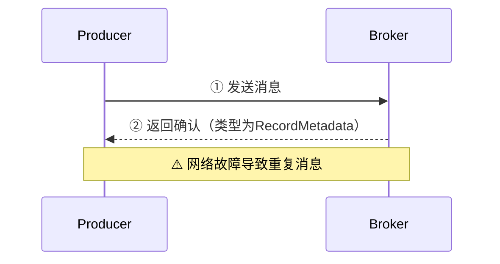

{: .no_toc }

<details close markdown="block">
  <summary>
    目录
  </summary>
  {: .text-delta }
- TOC
{:toc}
</details>

## 1. 内容概要

本文重点讲解 **Kafka 客户端**的消息处理机制，内容涵盖以下四个核心知识模块：

| 知识模块 | 说明 |
| ---- | ---- |
| API 快速入门 | HighLevel API 使用方法：生产者**三种发送方式**、消费者 **Pull 模式** |
| 消费者机制 | **消费者组**工作原理、**Offset 管理**（自动/手动提交）、重置策略 |
| 生产者机制 | **拦截器**、**序列化**、**分区路由**、**批量缓存**、**确认应答**、**幂等性**、**事务消息** |
| SpringBoot 集成 | 四步集成 Kafka：依赖、配置、KafkaTemplate、@KafkaListener |

为了帮助读者系统地掌握这些知识点，文章将按照**从入门到原理，再到实践**的逻辑展开：先通过快速入门掌握客户端基本用法，然后深入剖析消费者和生产者的内部机制，最后介绍 SpringBoot 集成方案，从而建立起对 Kafka 客户端工作原理的完整认知。

核心内容提炼（[`Youtube`](https://www.youtube.com/watch?v=NCFg0M2zn9k) `|` [`B站`](https://www.bilibili.com/video/BV1JrDVB8EPj)）：

<iframe width="560" height="315" src="https://www.youtube.com/embed/NCFg0M2zn9k?si=vUXy3qUR4d3UXFHy" title="YouTube video player" frameborder="0" allow="accelerometer; autoplay; clipboard-write; encrypted-media; gyroscope; picture-in-picture; web-share" referrerpolicy="strict-origin-when-cross-origin" allowfullscreen></iframe>

## 2. 客户端快速入门

### 2.1 API 架构与依赖管理

Kafka 客户端采用**分层 API 设计**，按照抽象层次的高低，提供两套 API：

| API 层级 | 核心特点 | 适用场景 |
| --- | --- | --- |
| **HighLevel API** | 封 Partition、Offset 等底层细节，提供简单易用的开发接口 | 企业开发的常规选择 |
| **LowLevel API** | 客户端自行管理 Partition、Offset，提供更精细的控制能力 | 对性能有**极致要求**的少数场景 |

**本文聚焦 HighLevel API**，掌握这套接口即可满足绝大多数业务需求。在实际开发中，要使用 Kafka 客户端，只需引入单个 Maven 依赖：

```xml
<dependency>
    <groupId>org.apache.kafka</groupId>
    <artifactId>kafka_2.13</artifactId>
    <version>3.8.0</version>
</dependency>
```

### 2.2 生产者消息发送

引入依赖后，即可通过 Kafka 提供的 **Producer** API 实现**消息发送**。不过在实际编码之前，我们需要先完成一项必要的环境准备工作——创建 Topic。

#### 前置准备：创建 Topic

Kafka 要求消息必须发送到已存在的 Topic 中。你可以使用以下命令手动创建，或参考配套案例中的自动化配置：

```bash
bin/kafka-topics.sh --bootstrap-server worker1:9092 \
  --create --topic sampleTopic --partitions 3 --replication-factor 2
```

#### 生产者代码实现

```java
public class MyProducer {

    private static final String BOOTSTRAP_SERVERS = "worker1:9092,worker2:9092,worker3:9092";
    private static final String TOPIC = "sampleTopic";

    public static void main(String[] args) throws ExecutionException, InterruptedException {

        // ------------------------------------------------
        // 第一步：初始化 Producer 配置
        // ------------------------------------------------
        Properties props = new Properties();
        // Kafka Broker 列表
        props.put(ProducerConfig.BOOTSTRAP_SERVERS_CONFIG, BOOTSTRAP_SERVERS);
        // Key 序列化器
        props.put(ProducerConfig.KEY_SERIALIZER_CLASS_CONFIG, 
                "org.apache.kafka.common.serialization.StringSerializer");
        // Value 序列化器
        props.put(ProducerConfig.VALUE_SERIALIZER_CLASS_CONFIG, 
                "org.apache.kafka.common.serialization.StringSerializer");
        Producer<String, String> producer = new KafkaProducer<>(props);


        // CountDownLatch 用于保证【方式三】异步回调全部执行完毕后再关闭资源
        CountDownLatch latch = new CountDownLatch(5);

        // 下面循环发送 5 条消息，依次演示三种不同的发送方式
        for (int i = 0; i < 5; i++) {
            // ------------------------------------------------
            // 第二步：构造 ProducerRecord
            //   - Topic：消息发送的目标主题
            //   - Key：  消息路由键，相同 Key 的消息会被分配到同一 Partition
            //   - Value：消息体
            // ------------------------------------------------
            ProducerRecord<String, String> record = new ProducerRecord<>(
		            TOPIC, Integer.toString(i), "MyProducer" + i);

            // ------------------------------------------------
            // 第三步：选择合适的方式发送消息
            //   以下三种方式可根据业务需求任选其一，此处为演示目的将它们并列展示
            // ------------------------------------------------

            // 【方式一】发后即忘（Fire-and-Forget）
            // 调用后立即返回，不关心服务端是否成功写入
            // 优点：吞吐量最高；缺点：无法感知发送失败，存在丢消息风险
            producer.send(record);
            System.out.println("message " + i + " sended");

            // 【方式二】同步发送（Synchronous）
            // 阻塞当前线程，等待 Broker 返回 RecordMetadata
            // 优点：可靠性最高，可获取 Topic / Partition / Offset 等元信息
            // 缺点：吞吐量较低，发送延迟大
            RecordMetadata recordMetadata = producer.send(record).get();
            String topic     = recordMetadata.topic();
            int    partition = recordMetadata.partition();
            long   offset    = recordMetadata.offset();
            String message   = recordMetadata.toString();
            System.out.println(
		            "message:[" + message + "] sended with topic:" + topic
                    + "; partition:" + partition + ";offset:" + offset);

            // 【方式三】异步发送（Asynchronous + Callback）
            // 调用后立即返回，Broker 确认写入后触发 onCompletion 回调
            // 兼顾吞吐量与可靠性，生产环境推荐使用
            producer.send(record, new Callback() {
                @Override
                public void onCompletion(RecordMetadata metadata, Exception e) {
                    if (e != null) {
                        // 发送异常处理：记录日志并进行业务补偿（如重试）
                        System.out.println("消息发送失败," + e.getMessage());
                        e.printStackTrace();
                    } else {
                        // 发送成功：记录写入位置，便于消息追踪
                        String topic   = metadata.topic();
                        long   offset  = metadata.offset();
                        String message = metadata.toString();
                        System.out.println("message:[" + message + "] sended with topic:" + topic
                                + ";offset:" + offset);
                    }
                    latch.countDown();
                }
            });
        }

        // 等待全部异步回调完成后释放 Producer 资源
        latch.await();
        producer.close();
    }
}
```

#### 生产者发送流程总结

通过上述示例代码，我们可以将生产者发送消息的完整流程概括为以下三个核心步骤：

| 步骤          | 核心操作                     | 说明                                                                                              |
| ----------- | ------------------------ | ----------------------------------------------------------------------------------------------- |
| ① 配置初始化 | 设置 Producer 必填属性         | 通过 **ProducerConfig** 管理配置项，必填项包括 **BOOTSTRAP_SERVERS_CONFIG**（Kafka 集群地址）和序列化器                 |
| ② 消息构建  | 创建 **ProducerRecord** 对象 | Kafka 消息采用 **Key-Value** 结构，Key 用于 **Partition 路由**，Value 为实际业务数据                               |
| ③ 消息发送  | 调用 **send()** 方法         | 支持三种发送方式：<br>• **发后即忘**：吞吐量最高，但可能丢消息<br>• **同步发送**：可靠性最高，获取写入元信息<br>• **异步发送**：兼顾吞吐量与可靠性，生产环境推荐 |

### 2.3 消费者消息消费

在引入必要的依赖后，就可以通过 Kafka 提供的 **Consumer** API 来实现**消息消费**功能了。下面我们通过一个完整的示例来演示消费者的实现过程。

**消费者代码实现：**

```java
public class MyConsumer {

    private static final String BOOTSTRAP_SERVERS = "worker1:9092,worker2:9092,worker3:9092";
    private static final String TOPIC  = "disTopic";
    private static final String GROUP_ID = "test";

    public static void main(String[] args) {

        // ------------------------------------------------
        // 第一步：初始化 Consumer 配置
        // ------------------------------------------------
        Properties props = new Properties();
        // 必填 - Kafka Broker 列表
        props.put(ConsumerConfig.BOOTSTRAP_SERVERS_CONFIG,
                BOOTSTRAP_SERVERS);
        // 必填 - 消费者组 ID，同组消费者分担各 Partition
        props.put(ConsumerConfig.GROUP_ID_CONFIG, GROUP_ID);
        // Key   反序列化器
        props.put(ConsumerConfig.KEY_DESERIALIZER_CLASS_CONFIG,
                "org.apache.kafka.common.serialization.StringDeserializer");
        // Value 反序列化器
        props.put(ConsumerConfig.VALUE_DESERIALIZER_CLASS_CONFIG, 
                "org.apache.kafka.common.serialization.StringDeserializer");

        Consumer<String, String> consumer = new KafkaConsumer<>(props);

        // ------------------------------------------------
        // 第二步：订阅 Topic（支持传入多个）
        // ------------------------------------------------
        consumer.subscribe(Collections.singletonList(TOPIC));

        // ------------------------------------------------
        // 第三步：轮询拉取消息（Pull 模式）
        //   - Consumer 主动拉取，由客户端控制消费速率
        //   - 超时 100ms 无新数据则返回空集合
        // ------------------------------------------------
        while (true) {

            ConsumerRecords<String, String> records =
                    consumer.poll(Duration.ofMillis(100));

            // ------------------------------------------------
            // 第四步：处理消息 & 提交 Offset
            // ------------------------------------------------
            for (ConsumerRecord<String, String> record : records) {
                System.out.printf("offset = %d, key = %s, value = %s%n",
                        record.offset(), record.key(), record.value());
            }

            // 【方式一】同步提交 Offset（推荐）
            //   - 阻塞等待 Broker 确认，保证不重复消费
            //   - 优点：可靠性高；缺点：吞吐量略低
            consumer.commitSync();

            // 【方式二】异步提交 Offset（按需启用）
            //   - 立即返回，Broker 在后台异步写入
            //   - 优点：吞吐量更高；缺点：失败时可能重复消费
            // consumer.commitAsync();
        }
    }
}
```

通过上述代码示例，我们可以将消费者的消息消费流程归纳为以下三个核心步骤。理解这些步骤有助于掌握 Kafka 消费者的工作原理：

| 步骤 | 核心操作 | 说明 |
| --- | --- | --- |
| ① 配置初始化 | 设置 Consumer 必填属性 | 通过 **ConsumerConfig** 管理配置项，必填项包括 **BOOTSTRAP_SERVERS_CONFIG**（Kafka 集群地址）和反序列化器 |
| ② 订阅与拉取 | 订阅 Topic，**poll()** 拉取消息 | 采用 **Pull 模式**，Consumer 主动从 Broker 拉取消息，客户端控制消费速率 |
| ③ 处理与提交 | 处理消息，**commitOffset()** 提交位点 | 处理完成后需向 Broker 提交 **Offset**，否则 Broker 会认为处理失败并重复推送 |

掌握了基本的消费流程后，我们还需要了解消费者的重要配置参数。

**配置参数说明：**

除了上述基础配置外，Kafka 消费者还提供了丰富的配置参数来控制运行行为。根据配置的不同作用范围，可以分为以下几类：

| 配置类别     | 影响范围           | 示例参数                                     |
| -------- | -------------- | ---------------------------------------- |
| 连接配置 | Broker 连接、消费者组 | `bootstrap.servers`、`group.id`           |
| 消费配置 | 拉取策略、消费速率      | `enable.auto.commit`、`auto.offset.reset` |
| 性能配置 | 批次大小、超时时间      | `max.poll.records`、`session.timeout.ms`  |

在实际应用中，建议根据业务需求合理选择配置参数，以达到性能和可靠性的最佳平衡。

> **官方配置文档**：[Apache Kafka Configuration](https://kafka.apache.org/documentation/#configuration)
>
> 由于配置项数量较多，建议先掌握上述核心参数，然后在需要时查阅官方文档了解更多配置选项。

## 3. 消费者核心机制

Kafka 的设计精髓在于：在网络不稳定、服务随时崩溃的复杂场景下，如何保证消息的高并发与高吞吐。理解这些问题需要建立在基础模型之上。

**消费者组**是 Kafka 最重要的机制，因此首先梳理。

### 3.1 消费者组工作原理

#### (1) 消费者组配置

Consumer 必须配置 **GROUP_ID_CONFIG** 属性以指定所属消费者组：

| 配置项        | 作用                                                                                                                                  |
| ---------- | ----------------------------------------------------------------------------------------------------------------------------------- |
| `group.id` | **消费者所属消费者组的唯一标识符**。<br>• **使用组管理功能**：通过 `subscribe(topic)` 订阅主题时为必填项。<br>• **使用 Kafka 偏移量管理**：Kafka-based offset management 时为必填项。 |

```java
public static final String GROUP_ID_CONFIG = "group.id";
public static final String GROUP_ID_DOC = "A unique string that identifies the consumer group this consumer belongs to. This property is required if the consumer uses either the group management functionality by using <code>subscribe(topic)</code> or the Kafka-based offset management strategy.";
```

完成消费者组的基本配置后，还需要进一步配置消费者的成员身份。**成员身份配置**涉及**GROUP_INSTANCE_ID_CONFIG**，该配置用于设置消费者实例身份，支持静态成员和动态成员两种模式：

| 配置项 | 说明 |
| --- | --- |
| `group.instance.id` | **消费者实例的唯一标识符**（由最终用户提供，必须为非空字符串）。<br>• **静态成员**（设置此项）：消费者组内任何时刻仅允许一个具有此 ID 的实例存在，可配合更大的 `session.timeout.ms` 避免 rebalance。<br>• **动态成员**（不设置）：消费者以动态成员身份加入组（传统行为）。 |

```java
public static final String GROUP_INSTANCE_ID_CONFIG = "group.instance.id";
public static final String GROUP_INSTANCE_ID_DOC = "A unique identifier of the consumer instance provided by the end user. Only non-empty strings are permitted. If set, the consumer is treated as a static member, which means that only one instance with this ID is allowed in the consumer group at any time. This can be used in combination with a larger session timeout to avoid group rebalances caused by transient unavailability (e.g. process restarts). If not set, the consumer will join the group as a dynamic member, which is the traditional behavior.";
```

#### (2) 分组消费机制

了解消费者组的配置方式后，我们深入探讨分组消费的具体工作机制。下图展示了 Kafka 的消费模型：

**消费模型示意**


基于上述消费模型架构，Kafka 采用分层消息推送策略：

**消息推送规则**

| 维度 | 推送策略 | 说明 |
| --- | --- | --- |
| **消费者组内** | 每条消息仅推送一次 | 通过**分区级负载均衡**实现：一个 Partition 同一时刻仅被组内一个 Consumer 消费，组内消费者**协同分担**不同 Partition 的消费任务 |
| **消费者组间** | 每个组独立推送 | 不同消费者组**互不影响**独立消费：每个消费者组均可消费全量消息，从而实现**消息广播**效果 |

**消息分发流程**

在理解推送策略的基础上，我们进一步观察消息从生产者到消费者的完整分发流程：

1. Producer 将消息均匀分发至 Topic 的各个 Partition
2. 各消费者组**独立订阅**并接收 Topic 消息
3. 每个消费者组内通过 Rebalance 机制将 Partition **分配**给组内消费者实例，实现**并行消费**

### 3.2 消费偏移量管理

消费偏移量（Offset）是 Kafka 消费者机制的核心概念，它记录了消费者组在每个分区中的消费进度。下面首先通过整体概览来理解 Offset 管理的全貌。


接下来，我们将从 Offset 的提交方式、管理中的关键问题以及提交策略选择三个方面进行详细讲解。

#### (1) Offset 提交方式

理解了 Offset 的基本概念后，实际运维中如何查看当前消费状态呢？可通过以下命令进行查询：

```shell
[oper@worker1 bin]$ ./kafka-consumer-groups.sh --bootstrap-server worker1:9092 --describe --group test
```

执行上述命令后，可以看到详细的消费状态信息。下面对输出内容进行解读：


掌握了如何查看 Offset 后，接下来介绍 Kafka 提供的两种提交方式：

| 提交方式     | 实现方式                                    | 优点       | 缺点             |
| -------- | --------------------------------------- | -------- | -------------- |
| **自动提交** | 配置 `enable.auto.commit=true`            | 无需手动管理   | 可能丢失已处理但未提交的消息 |
| **手动提交** | 调用 `commitSync()` 或 `commitAsync()`     | 精确控制提交时机 | 需要业务代码处理       |

**核心配置项**：

| 配置项 | 作用 |
| --- | --- |
| `enable.auto.commit` | 控制消费者是否自动提交 offset。<br>• **true（默认）**：在后台按 `auto.commit.interval.ms` 指定频率定期提交，无需手动管理，但可能丢失已处理但未提交的消息<br>• **false**：需业务代码显式调用提交方法 |

```java
public static final String ENABLE_AUTO_COMMIT_CONFIG = "enable.auto.commit";
private static final String ENABLE_AUTO_COMMIT_DOC = "If true the consumer's offset will be periodically committed in the background.";
```

#### (2) Offset 管理的关键问题

在实际使用中，Offset 管理涉及两个关键问题需要特别注意。

##### ① 问题一：Partition 与 Consumer 的对应关系

Offset 以 **<消费者组, 分区>** 为维度独立记录。这意味着同一时刻，一个 Partition 仅能被同一消费者组内的**一个** Consumer 消费，这种机制确保了消息在消费者组内不会被重复处理。

##### ② 问题二：Offset 数据安全性

除了对应关系，另一个需要重点关注的问题是 Offset 的数据安全性。虽然 Offset 最终存储在 Broker 端的 `__consumer_offsets` Topic 中，但其推进进度是由**客户端消费者控制**的，这种设计可能导致 Offset 与实际消费进度不一致。

为了应对 Offset 丢失或不可用的情况，Kafka 提供了 `ConsumerConfig.AUTO_OFFSET_RESET_CONFIG` 参数作为**兜底策略**。当消费者组首次消费或服务端找不到对应 Offset 时，将按照以下策略重置消费位置：

| 选项           | 行为             | 说明                                                            |
| ------------ | -------------- | ------------------------------------------------------------- |
| **earliest** | 自动设置为最早 Offset | 从 Partition 的起始位置开始消费，可读取历史全量消息                               |
| **latest**   | 自动设置为最新 Offset | 从 Partition 的最新位置开始消费，仅接收新产生的消息（**默认**）                       |
| **none**     | 抛出异常           | 如果找不到 Offset，向 Consumer 抛出 `NoOffsetForPartitionException` 异常 |

#### (3) Offset 提交策略对比

理解了 Offset 管理的关键问题后，如果选择手动提交，还需要根据业务场景在同步和异步两种提交方式之间做出选择。

| 提交方式 | 可靠性 | 性能 | 典型特征 |
| --- | --- | --- | --- |
| **commitAsync()** | 低（可能丢消息） | 高 | 不阻塞消费线程，提交失败不重试 |
| **commitSync()** | 高（保证不丢消息） | 低 | 阻塞直到提交成功或重试失败 |

这两种方式的核心差异体现在执行时序和容错能力上：

- **异步提交**：消费与提交并行执行。如果消息处理失败但 Offset 已提交，消息将**永久丢失**，无法重试
- **同步提交**：先处理后提交。如果业务处理失败则不提交 Offset，消息可**重新消费**；但会阻塞消费线程，降低吞吐量

> **生产实践**：当 Broker 端的 Offset 管理无法满足业务需求时，可将 Offset 存储到外部系统（如 Redis、数据库），在业务处理成功后**同步提交 Offset**，确保 Offset 不超前于实际处理进度。

## 4. 生产者核心机制


### 4.1 拦截器机制

#### (1) 机制说明

**拦截器（Interceptor）** 是 Producer 端的消息处理组件，在消息发送到 Kafka 集群**之前**对消息进行拦截处理。通过拦截器，可以修改消息内容（如添加时间戳、统一格式）或记录发送状态（如成功/失败统计）。

在实际使用中，拦截器不应引入耗时操作，否则会影响发送性能。

配置方面，拦截器通过 `interceptor.classes` 配置项指定，支持配置多个拦截器形成拦截器链，这些拦截器会按配置顺序依次执行。

**配置参数说明**：

| 配置项 | 作用 |
| --- | --- |
| **interceptor.classes** | 拦截器类的全限定名列表，用逗号分隔。每个拦截器需实现 **ProducerInterceptor** 接口，在消息发送到 Broker 之前可拦截并修改消息内容。典型应用包括：统一添加时间戳、消息格式转换、发送统计等。**默认为空**（未配置拦截器） |

下面看一下 Kafka 官方源码中对该配置的定义：

```java
public static final String INTERCEPTOR_CLASSES_CONFIG = "interceptor.classes";

public static final String INTERCEPTOR_CLASSES_DOC = "A list of classes to use as interceptors. Implementing the <code>org.apache.kafka.clients.producer.ProducerInterceptor</code> interface allows you to intercept (and possibly mutate) the records received by the producer before they are published to the Kafka cluster. By default, there are no interceptors.";
```

**拦截器接口方法**：

| 方法                                                                | 触发时机                          | 典型用途                                                       |
| ----------------------------------------------------------------- | ----------------------------- | ---------------------------------------------------------- |
| `configure(Map<String, ?> configs)`                               | Producer **初始化时**，拦截器实例化后立即调用 | 读取完整配置（包括 Kafka 官方配置和自定义配置），完成拦截器**初始化**逻辑                |
| `onSend(ProducerRecord<K, V> record)`                             | **序列化之后**、发送到 Kafka 集群之前      | 修改消息内容（如添加时间戳、统一字段格式）、过滤不符合要求的消息（**返回 null** 可丢弃该消息）       |
| `onAcknowledgement(RecordMetadata metadata, Exception exception)` | 收到 Broker **应答后**（无论成功或失败）    | 记录发送结果（**metadata 为 null** 表示发送失败）、统计发送成功率、监控异常类型、记录发送延迟指标 |
| `close()`                                                         | Producer **关闭时**，拦截器即将销毁前调用   | 释放拦截器占用的资源（如关闭文件句柄、断开数据库连接、清理线程池等）                         |

> **💡 拦截器链执行顺序**：当配置了多个拦截器时，会按配置顺序依次调用每个拦截器的 `onSend()` 方法。但在调用 `onAcknowledgement()` 时，则会按**相反顺序**执行（类似栈的 **LIFO** 原则）。

#### (2) 拦截器实现

自定义拦截器需实现 **`ProducerInterceptor<K, V>`** 接口，并重写其核心方法：

```java
public class MyInterceptor implements ProducerInterceptor {
    // 发送消息时触发
    @Override
    public ProducerRecord onSend(ProducerRecord producerRecord) {
        System.out.println("prudocerRecord : " + producerRecord.toString());
        return producerRecord;
    }

    // 收到服务端响应时触发
    @Override
    public void onAcknowledgement(RecordMetadata recordMetadata, Exception e) {
        System.out.println("acknowledgement recordMetadata:" + recordMetadata.toString());
    }

    // 连接关闭时触发
    @Override
    public void close() {
        System.out.println("producer closed");
    }

    // 整理配置项
    @Override
    public void configure(Map<String, ?> map) {
        System.out.println("=====config start======");
        for (Map.Entry<String, ?> entry : map.entrySet()) {
            System.out.println("entry.key:" + entry.getKey() + " === entry.value: " + entry.getValue());
        }
        System.out.println("=====config end======");
    }
}
```

实现好拦截器后，接下来需要在 Producer 配置中通过 `interceptor.classes` 指定拦截器类的**全限定名**（多个拦截器用**逗号分隔**）：

```java
props.put(ProducerConfig.INTERCEPTOR_CLASSES_CONFIG, "com.roy.kfk.basic.MyInterceptor");
```


#### (3) 适用场景

下面列举拦截器在**消息发送链路**中的典型应用场景：

| 应用场景 | 功能说明 | 实现要点 |
| --- | --- | --- |
| **统一添加时间戳** | 自动为消息注入**发送时间**、**创建时间**、**业务时间**等维度信息，支持消息追踪与时序分析 | 在 `onSend()` 中修改消息 **Header** 或 **Value** |
| **消息格式转换** | 统一消息字段格式（日期格式、字段命名、数据类型等），确保符合业务标准 | 在 `onSend()` 中对 `ProducerRecord` 执行**格式化转换** |
| **发送统计与监控** | 采集发送性能指标（**成功率**、**失败率**、**延迟**、**TPS**），支持实时监控与告警 | 在 `onAcknowledgement()` 中根据 `metadata` 和 `exception` **统计结果** |
| **消息过滤** | 拦截不符合规则的消息（敏感词、非法数据、重复消息等） | 在 `onSend()` 中**返回 null** 丢弃消息 |
| **消息审计** | 记录消息发送**全链路日志**（发送前状态、发送结果、关键参数），支持问题排查与审计 | 在 `onSend()` 和 `onAcknowledgement()` 中**记录详细日志** |

> **⚠️ 性能警告**：拦截器逻辑必须保持**轻量级**，避免执行耗时操作（**数据库查询**、**网络请求**、**复杂计算**等）。此类操作会严重阻塞 **Producer 发送线程**，降低整体吞吐量并增加延迟。

#### (4) 与序列化机制配合

拦截器并非孤立工作，它与序列化机制协作可以构建更强大的**消息处理流水线**。在消息发送到 Kafka 集群之前，会依次经过**拦截器处理**和**序列化转换**两个阶段。

##### ① 协作场景

拦截器与序列化器在不同场景下的职责分工如下：

| 应用场景          | 拦截器职责                          | 序列化器职责           | 协作价值            |
| ------------- | ------------------------------ | ---------------- | --------------- |
| **POJO 对象传输** | 在序列化前统一添加时间属性、业务字段             | 将 POJO 对象转换为字节数组 | 实现**对象级别的消息增强** |
| **消息加密**      | 对消息内容进行加密处理（如 **AES**、**RSA**） | 将加密后的数据转换为字节数组   | 实现**端到端的安全传输**  |
| **消息压缩**      | 根据消息类型选择压缩策略并执行压缩              | 将压缩后的数据转换为字节数组   | **降低网络传输带宽消耗**  |

> **💡 技术约束**：Kafka Broker 只能接收和存储**字节数组**（`byte[]`）。任何复杂对象（**POJO**、**自定义类型**等）必须先经过序列化器转换为字节数组才能发送。因此，拦截器在 `onSend()` 中处理的对象类型**必须与序列化器的输入类型匹配**。

##### ② 处理流程

具体来说，拦截器与序列化器的配合流程如下：

```
原始对象（POJO）
    ↓
拦截器处理（添加属性、加密等）
    ↓
序列化器转换（对象 → 字节数组）
    ↓
发送到 Kafka 集群
```

序列化机制的工作原理将在下一节详细介绍。

### 4.2 序列化机制

#### (1) 机制说明

**序列化（Serialization）** 是将对象转换为**字节数组**的过程，是实现 Kafka 消息**网络传输**与**持久化存储**的基础。由于 Kafka Broker 仅能接收和存储**字节数组**，因此 Producer 发送的消息必须先经**序列化器**转换为二进制数据。

在实际使用中，Producer 需通过 `KEY_SERIALIZER_CLASS_CONFIG` 和 `VALUE_SERIALIZER_CLASS_CONFIG` 分别配置 **Key 序列化器**与 **Value 序列化器**。

##### ① Producer 序列化配置

| 配置项 | 作用 |
| --- | --- |
| **key.serializer** | **Key 序列化器**的全限定类名，需实现 **Serializer** 接口。用于将 **Key** 转换为字节数组，**相同 Key** 的消息会路由到同一 Partition |
| **value.serializer** | **Value 序列化器**的全限定类名，需实现 **Serializer** 接口。用于将**实际业务数据**转换为字节数组，便于**网络传输和持久化存储** |

相关源码：

```java
public static final String KEY_SERIALIZER_CLASS_CONFIG = "key.serializer";
public static final String KEY_SERIALIZER_CLASS_DOC = "Serializer class for key that implements the <code>org.apache.kafka.common.serialization.Serializer</code> interface.";

public static final String VALUE_SERIALIZER_CLASS_CONFIG = "value.serializer";
public static final String VALUE_SERIALIZER_CLASS_DOC = "Serializer class for value that implements the <code>org.apache.kafka.common.serialization.Serializer</code> interface.";
```

理解了配置方式后，我们还需要明确 **Key 与 Value 的职责差异**：

| 维度 | Key | Value |
| --- | --- | --- |
| **主要用途** | **消息路由**：决定消息发送到哪个 Partition | **数据承载**：存储实际业务消息内容 |
| **是否必填** | 可选（未指定时 Kafka 自动选择 Partition） | 必填 |
| **序列化目的** | 转换为字节数组后进行 Hash 计算，确定目标分区 | 转换为字节数组以便网络传输和磁盘存储 |
| **一致性要求** | 相同 Key 必须序列化为相同字节数组，确保路由一致 | 需与 Consumer 的反序列化器匹配，确保数据正确还原 |

> **💡 路由机制**：指定 Key 时，Kafka 对序列化后的字节数组进行 **Hash 计算**，再根据 Partition 数量取模确定目标分区。这确保了**相同 Key 的消息始终分配到同一 Partition**，保证消息的顺序性。

##### ② Consumer 反序列化配置

与 Producer 的序列化过程相对应，Consumer 负责**反序列化**，将字节数组还原为原始对象。因此，Consumer 需配置与 Producer 匹配的反序列化器：

| 配置项 | 作用 |
| --- | --- |
| **key.deserializer** | **Key 反序列化器**的全限定类名，需实现 **Deserializer** 接口。用于将字节数组还原为 Key 对象，**必须与 Producer 的 key.serializer 匹配** |
| **value.deserializer** | **Value 反序列化器**的全限定类名，需实现 **Deserializer** 接口。用于将字节数组还原为 Value 对象，**必须与 Producer 的 value.serializer 匹配** |

相关源码：

```java
public static final String KEY_DESERIALIZER_CLASS_CONFIG = "key.deserializer";
public static final String KEY_DESERIALIZER_CLASS_DOC = "Deserializer class for key that implements the <code>org.apache.kafka.common.serialization.Deserializer</code> interface.";

public static final String VALUE_DESERIALIZER_CLASS_CONFIG = "value.deserializer";
public static final String VALUE_DESERIALIZER_CLASS_DOC = "Deserializer class for value that implements the <code>org.apache.kafka.common.serialization.Deserializer</code> interface.";
```

> **⚠️ 匹配警告**：Producer 的序列化器与 Consumer 的反序列化器**必须严格匹配**，否则会导致反序列化失败，数据无法正确还原。

##### ③ 自定义序列化实现

虽然 Kafka 为常用基础数据类型（**String**、**Integer**、**Long**、**Byte** 等）提供了默认序列化实现，但在实际业务中，我们往往需要使用**自定义 POJO** 作为消息类型，这时就需要实现**自定义序列化器**。

**序列化设计核心思想**：将业务数据转换为**紧凑的二进制格式**，关键在于合理处理**定长类型**与**变长类型**：

| 属性类型     | 特点                        | 序列化方式                             | 反序列化方式             |
| -------- | ------------------------- | --------------------------------- | ------------------ |
| **定长类型** | Integer、Long、Double 等原始类型 | **直接转换为固定长度**的二进制数组               | 按固定字节数读取并还原        |
| **变长类型** | String、集合、自定义对象等          | **先写入长度标识**（Integer/Long），再写入数据本身 | 先读取长度标识，再按指定长度读取数据 |


上图直观地展示了 POJO 序列化的基本流程：先序列化定长字段，再序列化变长字段（带长度标识），最终组合成完整的字节数组。

#### (2) 序列化机制的应用价值

了解了序列化的基本原理后，我们还需要关注其在实际应用中的价值。高效的序列化实现是**高并发分布式系统的重要优化手段**，选择合适的序列化方式能显著提升**网络传输效率**和**磁盘存储利用率**。

**序列化方式对比：**

为了更好地理解不同序列化方式的适用场景，下面以 User 对象为例，对比两种常用序列化方式：

| 序列化方式 | 优点 | 缺点 | 适用场景 |
| --- | --- | --- | --- |
| **JSON 字符串** | 实现简单，可读性好，跨语言支持 | **占用空间大**（约 2-3 倍），序列化/反序列化速度慢 | 开发测试环境、跨系统数据交换 |
| **二进制字段序列化** | **占用空间小**，序列化/反序列化速度快，带宽利用率高 | 实现复杂，可读性差，需手动处理版本兼容性 | **高并发生产环境**、对性能有严格要求的场景 |

Kafka 在日志文件存储中采用了**高效的二进制序列化设计**，这是 Kafka 实现**高吞吐量**和**低延迟**的关键技术之一。

**序列化思想的广泛应用：**

需要指出的是，序列化的核心思想并非 Kafka 独有，在多个分布式框架中均有广泛应用：

| 框架 | 应用场景 | 实现要点 |
| --- | --- | --- |
| **Hadoop MapReduce** | 自定义数据类型序列化 | 按字段类型分别序列化，支持 **Writable** 接口 |
| **Netty** | 网络通信防粘包、拆包 | 定制**长度+数据体**的序列化机制 |

这些框架的序列化基础思想与 Kafka 一脉相承：**定长类型直接转换，变长类型先写长度再写数据**。在此基础上，实际应用中还可进一步集成**数据压缩算法**（如 **Snappy**、**LZ4**、**Zstd**），从而进一步提升数据传输效率和存储利用率。

### 4.3 分区分配策略


在了解序列化和缓冲机制后，接下来需要解决**消息路由问题**：消息如何分配到具体的分区？这涉及**两个核心问题**：

- **生产者端**：Producer 如何根据消息的 **Key** 选择 **Partition**？
- **消费者端**：Consumer 节点能否决定自己消费哪些 **Partition** 的消息？

要回答上述问题，我们需要深入理解 Kafka 的分区分配机制——**生产者端**通过分区器决定消息的路由目标，而**消费者端**则通过分配策略建立消费者与分区的对应关系。下面我们分别探讨这两个核心环节。

#### (1) 生产者端分区器


##### ① 配置参数

| 配置项 | 作用 |
| --- | --- |
| **partitioner.class** | **分区器类**的全限定名，决定消息发送到哪个分区。默认使用 **Sticky 策略**（有 **Key** 则按 **Hash** 分配，无 **Key** 则粘性分配）；也可指定 **RoundRobinPartitioner** 或实现 **Partitioner 接口**自定义分区策略 |

相关源码：

```java
public static final String PARTITIONER_CLASS_CONFIG = "partitioner.class";

private static final String PARTITIONER_CLASS_DOC = "A class to use to determine which partition to be send to when produce the records. Available options are:" +
    "<ul>" +
        "<li>If not set, the default partitioning logic is used. " +
        "This strategy will try sticking to a partition until at least " + BATCH_SIZE_CONFIG + " bytes is produced to the partition. It works with the strategy:" +
            "<ul>" +
                "<li>If no partition is specified but a key is present, choose a partition based on a hash of the key</li>" +
                "<li>If no partition or key is present, choose the sticky partition that changes when at least " + BATCH_SIZE_CONFIG + " bytes are produced to the partition.</li>" +
            "</ul>" +
        "</li>" +
        "<li><code>org.apache.kafka.clients.producer.RoundRobinPartitioner</code>: This partitioning strategy is that " +
        "each record in a series of consecutive records will be sent to a different partition(no matter if the 'key' is provided or not), " +
        "until we run out of partitions and start over again. Note: There's a known issue that will cause uneven distribution when new batch is created. " +
        "Please check KAFKA-9965 for more detail." +
        "</li>" +
    "</ul>" +
    "<p>Implementing the <code>org.apache.kafka.clients.producer.Partitioner</code> interface allows you to plug in a custom partitioner.";
```

##### ② 分区策略对比

在了解配置参数后，我们来看看 Kafka 如何通过 **Partitioner 接口**实现不同的分区分配策略。开发者不仅可以使用默认实现，还能根据业务需求自定义分配逻辑。

**策略演进：** Kafka 3.2.0 之前提供三种默认实现：`RoundRobinPartitioner`、`DefaultPartitioner` 和 `UniformStickyPartitioner`。目前后两种已标记为过期，统一替换为默认的 **Sticky 策略**，以提供更好的性能表现。

**默认策略的工作方式：**

| 策略 | 工作机制 | 特点 | 适用场景 |
| --- | --- | --- | --- |
| **Sticky 策略**（默认） | 为生产者分配一个分区后，尽可能**持续使用该分区**，直到满足以下条件之一：<br>• 该分区的 `batch.size`（默认 **16K**）已满<br>• 该分区的消息等待时间达到 `linger.ms`（默认 **0ms**） | **提升批量发送效率**，减少网络请求次数 | **生产环境首选**，追求**高吞吐量** |
| **RoundRobinPartitioner** | 在各个 **Partition** 间**轮询发送**，每条消息依次分配到不同分区 | 分配均匀，但**未考虑消息大小**和 **Broker** 性能差异 | 测试环境，对均匀性有特殊要求的场景 |

> **💡 性能优化**：Sticky 策略通过**延迟分区切换**，让更多消息累积到同一个 **Batch** 中，从而提升**批量发送效率**和**网络吞吐量**。

##### ③ 自定义分区器

除了使用默认策略外，开发者还可以通过实现 **Partitioner 接口**来满足特定的业务需求。在自定义实现中，我们可以访问 **Topic** 的所有 **Partition** 信息（通过 `cluster` 参数获取），并在 `partition` 方法中实现灵活的分区选择逻辑。

```java
//获取所有的Partition信息。List<PartitionInfo> partitions = cluster.partitionsForTopic(topic);
```

**自定义分区器的典型应用场景：**

- 按**业务规则**路由（如按**用户 ID**、**地区**等）
- 实现特殊的**负载均衡策略**
- 与**外部系统**集成，根据**实时状态**动态选择分区

#### (2) 消费者端分区分配策略

理解了生产者如何发送消息后，我们再来看看消费者端如何接收消息。在消费者组中，一个关键问题是如何在**多个 Consumer 实例**和**多个 Partition**之间建立合理的分配关系——这正是 **`partition.assignment.strategy`** 配置项要解决的问题。

##### ① 配置参数

| 配置项 | 作用 |
| --- | --- |
| **partition.assignment.strategy** | **分区分配策略类列表**。支持 **Range**（按范围，简单但可能不均衡）、**RoundRobin**（轮询，分配更均衡）、**Sticky**（粘性，**Rebalance** 时保持原分配）、**CooperativeSticky**（协作粘性，增量式**重平衡**更平滑）；默认为 **[RangeAssignor, CooperativeStickyAssignor]** |

相关源码：

```java
public static final String PARTITION_ASSIGNMENT_STRATEGY_CONFIG = "partition.assignment.strategy";

private static final String PARTITION_ASSIGNMENT_STRATEGY_DOC = "A list of class names or class types, " +
    "ordered by preference, of supported partition assignment strategies that the client will use to distribute " +
    "partition ownership amongst consumer instances when group management is used. Available options are:" +
    "<ul>" +
    "<li><code>org.apache.kafka.clients.consumer.RangeAssignor</code>: Assigns partitions on a per-topic basis.</li>" +
    "<li><code>org.apache.kafka.clients.consumer.RoundRobinAssignor</code>: Assigns partitions to consumers in a round-robin fashion.</li>" +
    "<li><code>org.apache.kafka.clients.consumer.StickyAssignor</code>: Guarantees an assignment that is " +
    "maximally balanced while preserving as many existing partition assignments as possible.</li>" +
    "<li><code>org.apache.kafka.clients.consumer.CooperativeStickyAssignor</code>: Follows the same StickyAssignor " +
    "logic, but allows for cooperative rebalancing.</li>" +
    "</ul>" +
    "<p>The default assignor is [RangeAssignor, CooperativeStickyAssignor], which will use the RangeAssignor by default, " +
    "but allows upgrading to the CooperativeStickyAssignor with just a single rolling bounce that removes the RangeAssignor from the list.</p>" +
    "<p>Implementing the <code>org.apache.kafka.clients.consumer.ConsumerPartitionAssignor</code> " +
    "interface allows you to plug in a custom assignment strategy.</p>";
```

##### ② 分配策略对比

Kafka 内置了多种分配策略，它们在绝大多数场景下都能提供优秀的性能表现。同时，对于有特殊需求的场景，开发者也可以通过继承 `AbstractPartitionAssignor` 抽象类来实现自定义策略。

**三种主要分区分配策略对比：**

| 策略 | 分配原则 | 示例（**10 个分区**，**3 个消费者**） | 优点 | 缺点 |
| --- | --- | --- | --- | --- |
| **Range 策略** | **按分区范围**分配 | consumer1：**0-3**<br>consumer2：**4-6**<br>consumer3：**7-9** | 实现简单，**按 Topic 独立分配** | 分区数不能被消费者数整除时，**分配可能不均衡** |
| **RoundRobin 策略** | **轮询分配** | consumer1：**0、3、6、9**<br>consumer2：**1、4、7**<br>consumer3：**2、5、8** | **分配更均衡**，避免倾斜 | 需要消费者订阅相同的 **Topic** 集合 |
| **Sticky 策略** | **粘性分配**，遵循两个原则：<br>1. **初始均匀**：开始时尽量保持分区分配均匀<br>2. **保持稳定**：分区分配尽可能与上一次保持一致 | consumer3 宕机时，保持 consumer1 和 consumer2 原有分配，将 **7-9** 分区尽量平均分配 | **减少 Rebalance 时的数据迁移**，保持消费稳定性 | 初始分配可能不够均衡 |

> **💡 稳定性优化**：Sticky 策略在 **Rebalance** 时**最大限度保留原有分配关系**，只迁移必要的分区，有效减少**消费位移重复提交**和**消息重复处理**的风险。

##### ③ 默认配置与自定义场景

**默认配置说明：**

对于大多数应用场景，官方默认提供的 **RangeAssignor + CooperativeStickyAssignor** 组合策略已经足够高效：
- **RangeAssignor**：作为降级选项，确保向后兼容
- **CooperativeStickyAssignor**：**增量式重平衡**，避免"**stop-the-world**"式的全量重分配

深入理解这些分配算法，不仅有助于我们在实际业务中做出更合理的选择，也能帮助我们更好地理解 **MQ 场景**的设计思想，并横向对比其他 **MQ 产品**（如 **RocketMQ**）的分配策略差异。

当然，在某些特殊场景下，我们仍然需要自定义策略来满足特定需求。

**自定义分区器的应用场景：**

当部署环境的服务器配置**不一致**时，可以通过自定义消费者分区器，让性能更好的服务器上的 **Consumer** 消费更多消息，性能较弱的服务器消费较少消息，从而**更合理地利用服务器资源**，提升整体消费速度。

### 4.4 缓存机制

Kafka 生产者采用**批量发送策略**应对高并发场景：**消息先在客户端缓存积累**，达到一定规模后**批量发送至服务端**。这种设计有效**降低网络 IO 频次**，**提升吞吐性能**，是 Kafka 实现高性能的核心机制之一。

#### (1) 发送缓存


##### ① 批量发送策略

若在高并发场景下每条消息都单独发送，会对 **Broker** 造成巨大的**网络压力**和**请求开销**。为此，Kafka 生产者引入了**缓存机制**：

**核心设计思想**：
- **消息暂存**：消息先暂存于**客户端缓存**，而非立即发送
- **批量积累**：缓存达到一定规模后**批量发送**
- **减少开销**：大幅降低**网络请求次数**和**系统调用开销**

**缓存触发条件**（满足任一即发送）：
1. **Batch 大小达到阈值**：由 `batch.size` 参数控制（默认 **16KB**）
2. **等待时间超时**：由 `linger.ms` 参数控制（默认 **0ms**）

##### ② 核心组件

了解了批量发送的策略思想后，我们来看其实现架构。Kafka 消息缓存机制由两个核心组件协同工作：**RecordAccumulator（记录累加器）** 和 **Sender（发送线程）**。

```java
// 1. 记录累加器初始化
int batchSize = Math.max(1, config.getInt(ProducerConfig.BATCH_SIZE_CONFIG));
this.accumulator = new RecordAccumulator(logContext, batchSize, this.compressionType, lingerMs(config),
    retryBackoffMs, deliveryTimeoutMs, partitionerConfig, metrics, PRODUCER_METRIC_GROUP_NAME, time, apiVersions,
    transactionManager, new BufferPool(this.totalMemorySize, batchSize, metrics, time, PRODUCER_METRIC_GROUP_NAME));

// 2. 数据发送线程初始化
this.sender = newSender(logContext, kafkaClient, this.metadata);
```

**RecordAccumulator 工作机制**

**RecordAccumulator** 作为消息缓存的**核心容器**，负责暂存所有待发送消息并**按分区组织批次**。

**内部数据结构**：
- **按分区分片**：为每个 **Topic-Partition** 维护一个独立的 `Deque<ProducerBatch>` 双端队列
- **批次封装**：每个 Deque 中存储若干 **ProducerBatch** 对象
- **消息归组**：同一分区的消息被聚合到同一个 **Batch** 中

**消息流转流程**：

| 步骤 | 操作 | 说明 |
| ---- | ---- | ---- |
| 1 | **消息接收** | Producer 调用 `send()` 方法发送消息 |
| 2 | **分区路由** | 根据消息 **key**（或**轮询策略**）确定目标分区 |
| 3 | **队列定位** | 找到对应分区的 **Deque 队列** |
| 4 | **批次存入** | 将消息写入队列尾部的 **ProducerBatch** |
| 5 | **唤醒发送** | Batch 满或新建 Batch 时，唤醒 **Sender 线程** |


##### ③ 核心配置参数

理解了 RecordAccumulator 的工作机制后，我们来看控制其行为的关键配置参数：

| 配置项 | 作用 |
| --- | --- |
| **buffer.memory** | **Producer 总缓冲内存大小**（默认 **32MB**）。控制 **RecordAccumulator** 可用的最大内存，若发送速度持续快于网络传输速度，超过此限制将阻塞 `MAX_BLOCK_MS_CONFIG` 时长后抛出异常 |
| **batch.size** | **单个 ProducerBatch 字节上限**（默认 **16KB**）。控制**批处理大小**，值越大吞吐量越高但延迟也会相应增加；与 `linger.ms` 配合使用可优化批处理效果 |

为了更深入理解这些参数的设计意图，让我们查看相关源码定义：

```java
// RecordAccumulator缓冲区大小
public static final String BUFFER_MEMORY_CONFIG = "buffer.memory";

private static final String BUFFER_MEMORY_DOC = "The total bytes of memory the producer can use to buffer records waiting "
    + "to be sent to the server. If records are sent faster than they can be delivered to the server the producer will "
    + "block for <code>" + MAX_BLOCK_MS_CONFIG + "</code> after which it will throw an exception."
    + "<p>"
    + "This setting should correspond roughly to the total memory the producer will use, but is not a hard bound since "
    + "not all memory the producer uses is used for buffering. Some additional memory will be used for compression (if "
    + "compression is enabled) as well as for maintaining in-flight requests.";

// 缓冲区每一个batch的大小
public static final String BATCH_SIZE_CONFIG = "batch.size";

private static final String BATCH_SIZE_DOC = "The producer will attempt to batch records together into fewer requests "
    + "whenever multiple records are being sent to the same partition. This helps performance on both the client and the "
    + "server. This configuration controls the default batch size in bytes. "
    + "<p>"
    + "No attempt will be made to batch records larger than this size. "
    + "<p>"
    + "Requests sent to brokers will contain multiple batches, one for each partition with data available to be sent. "
    + "<p>"
    + "A small batch size will make batching less common and may reduce throughput (a batch size of zero will disable "
    + "batching entirely). A very large batch size may use memory a bit more wastefully as we will always allocate a "
    + "buffer of the specified batch size in anticipation of additional records."
    + "<p>"
    + "Note: This setting gives the upper bound of the batch size to be sent. If we have fewer than this many bytes "
    + "accumulated for this partition, we will 'linger' for the <code>linger.ms</code> time waiting for more records to "
    + "show up. This <code>linger.ms</code> setting defaults to 0, which means we'll immediately send out a record even "
    + "the accumulated batch size is under this <code>batch.size</code> setting.";
```

> **📌 注意**：`MAX_BLOCK_MS_CONFIG` 默认值为 **60 秒**，超过此时间将抛出 `TimeoutException`。

#### (2) 发送线程

##### ① Sender 线程职责

在消息缓存架构中，如果说 RecordAccumulator 是"蓄水池"，那么 Sender 线程就是"水泵"。每个 `KafkaProducer` 实例对应**一个独立的 Sender 线程**，负责从 **RecordAccumulator** 中**批量读取消息**并发送至 **Kafka 集群**。


**Sender 发送策略**

| 序号  | 策略              | 说明                                                               |
| --- | --------------- | ---------------------------------------------------------------- |
| 1   | **按需读取**        | Sender 仅获取**已满足发送条件**的 **ProducerBatch**，而非一次性发送所有缓存             |
| 2   | **双重触发**        | **Batch 满**或 `linger.ms` 超时均会触发发送，避免消息长时间滞留                        |
| 3   | **Inflight 队列** | 以 **Broker** 为维度管理**未确认请求**，支持并发发送                               |
| 4   | **异步确认**        | 发送后立即返回，**Broker 响应后从队列移除**                                      |
| 5   | **并发限制**        | 每个连接最多缓存 `MAX_IN_FLIGHT_REQUESTS_PER_CONNECTION`（默认 **5**）个未确认请求 |

> **🎯 设计目的**：通过**批量发送**和**流水线处理**降低**网络 IO 延迟**。需要注意的是，**Inflight 队列**虽然允许同时存在多个未确认请求，但可能导致**消息乱序**。

##### ② 发送线程配置

Sender 线程的行为可以通过以下关键参数进行调优：

| 配置项 | 作用 |
| --- | --- |
| **linger.ms** | **发送等待时长**（毫秒，默认 **0**）。Producer 等待指定时间以积累更多消息形成批次，**增加吞吐量但会延迟消息发送**；与 `batch.size` 配合使用优化批处理效果 |
| **max.in.flight.requests.per.connection** | **单连接最大未确认请求数**（默认 **5**）。大于 **1** 时可能导致乱序；**启用幂等性时必须 ≤ 5** 以保证消息顺序性 |

同样，我们通过源码来理解这些参数的具体实现：

```java
public static final String LINGER_MS_CONFIG = "linger.ms";

private static final String LINGER_MS_DOC =
    "The producer groups together any records that arrive in between request transmissions "
    + "into a single batched request. Normally this occurs only under load when records arrive "
    + "faster than they can be sent out. However in some circumstances the client may want to "
    + "reduce the number of requests even under moderate load. This setting accomplishes this by "
    + "adding a small amount of artificial delay&mdash;that is, rather than immediately sending out "
    + "a record, the producer will wait for up to the given delay to allow other records to be sent "
    + "so that the sends can be batched together. This can be thought of as analogous to Nagle's "
    + "algorithm in TCP. This setting gives the upper bound on the delay for batching: once we get "
    + "<code>" + BATCH_SIZE_CONFIG + "</code> worth of records for a partition it will be sent "
    + "immediately regardless of this setting, however if we have fewer than this many bytes "
    + "accumulated for this partition we will 'linger' for the specified time waiting for more "
    + "records to show up. This setting defaults to 0 (i.e. no delay). Setting <code>"
    + LINGER_MS_CONFIG + "=5</code>, for example, would have the effect of reducing the number of "
    + "requests sent but would add up to 5ms of latency to records sent in the absence of load.";


public static final String MAX_IN_FLIGHT_REQUESTS_PER_CONNECTION =
    "max.in.flight.requests.per.connection";

private static final String MAX_IN_FLIGHT_REQUESTS_PER_CONNECTION_DOC =
    "The maximum number of unacknowledged requests the client will send on a single connection "
    + "before blocking. Note that if this configuration is set to be greater than 1 and "
    + "<code>enable.idempotence</code> is set to false, there is a risk of message reordering "
    + "after a failed send due to retries (i.e., if retries are enabled); if retries are disabled "
    + "or if <code>enable.idempotence</code> is set to true, ordering will be preserved. "
    + "Additionally, enabling idempotence requires the value of this configuration to be less "
    + "than or equal to " + MAX_IN_FLIGHT_REQUESTS_PER_CONNECTION_FOR_IDEMPOTENCE + ". "
    + "If conflicting configurations are set and idempotence is not explicitly enabled, "
    + "idempotence is disabled.";
```

##### ③ Selector IO 组件

了解了 Sender 线程的配置参数后，我们来看支撑其高效网络通信的底层组件——**Selector**。

**Selector 组件**（基于 Java NIO）是 Sender 与 Kafka Broker 进行网络通信的基础：

**工作机制**：
- **IO 多路复用**：单个线程管理多个网络连接
- **非阻塞 IO**：通过 `wakeup()` 机制唤醒 Sender 线程处理事件
- **事件驱动**：Batch 满或新建 Batch 时触发唤醒

以下源码展示了唤醒机制的触发时机：

```java
// org.apache.kafka.clients.producer.KafkaProducer#doSend
if (result.batchIsFull || result.newBatchCreated) {
    log.trace("Waking up the sender since topic {} partition {} is either full or getting a new batch",
        record.topic(), appendCallbacks.getPartition());
    this.sender.wakeup();
}
```

#### (3) 性能优化建议

掌握了缓存机制的核心组件和配置参数后，我们来看看如何在实际场景中进行性能调优。

生产者缓存机制是 Kafka **高性能架构**的基石。通过合理调优相关参数，可以在不同场景下显著提升系统性能：

| 场景特征 | 优化建议 | 预期效果 |
| --- | --- | --- |
| **消息体较大**（>1KB） | **增大 `batch.size`**（如 32KB-64KB） | 提升 Batch 利用率，减少请求数量 |
| **消息量巨大**（百万级/秒） | **增大 `buffer.memory`**（如 64MB-128MB） | 避免缓存不足导致阻塞，提升吞吐 |
| **网络延迟较高** | **提升 `max.in.flight.requests.per.connection`**（如 10） | 增加并发发送能力，充分利用带宽 |
| **对延迟敏感** | **降低 `linger.ms`**（如 1-5ms） | 减少消息等待时间 |
| **吞吐优先** | **提高 `linger.ms`**（如 10-50ms） | 增加 Batch 积累机会，提升吞吐 |

> **⚖️ 权衡要点**：`batch.size` 和 `linger.ms` 是**吞吐与延迟**的核心平衡点。参数调优需根据业务场景的实际负载特征进行测试验证，建议在测试环境中进行充分的性能压测后再应用到生产环境。

### 4.5 应答机制

Producer 将消息发送到 Broker 后，需要确认消息是否成功写入。Kafka 通过 **`acks` 参数**控制**确认范围**，需要在**消息可靠性**与**发送性能**之间进行权衡。


#### (1) 配置说明

| 配置项 | 作用 |
| --- | --- |
| **acks** | **确认应答级别**，控制 Producer 收到多少确认才算发送成功。可选值：**0**（不等待确认，**最快但可能丢数据**）、**1**（**Leader 确认即可**，Leader 故障时可能丢数据）、**all** 或 **-1**（**所有 ISR 副本确认**，**最安全但最慢**）；**启用幂等性时必须设为 all** |

为了更深入理解 `acks` 参数的工作机制，让我们看看其源码定义：

```java
public static final String ACKS_CONFIG = "acks";

private static final String ACKS_DOC = "The number of acknowledgments the producer requires the leader to have received "
    + "before considering a request complete. This controls the durability of records that are sent. The following "
    + "settings are allowed: "
    + "<ul>"
    + "<li><code>acks=0</code> If set to zero then the producer will not wait for any acknowledgment from the server "
    + "at all. The record will be immediately added to the socket buffer and considered sent. No guarantee can be "
    + "made that the server has received the record in this case, and the <code>retries</code> configuration will not "
    + "take effect (as the client won't generally know of any failures). The offset given back for each record will "
    + "always be set to <code>-1</code>."
    + "<li><code>acks=1</code> This will mean the leader will write the record to its local log but will respond "
    + "without awaiting full acknowledgement from all followers. In this case should the leader fail immediately after "
    + "acknowledging the record but before the followers have replicated it then the record will be lost."
    + "<li><code>acks=all</code> This means the leader will wait for the full set of in-sync replicas to acknowledge "
    + "the record. This guarantees that the record will not be lost as long as at least one in-sync replica remains "
    + "alive. This is the strongest available guarantee. This is equivalent to the acks=-1 setting."
    + "</ul>"
    + "<p>"
    + "Note that enabling idempotence requires this config value to be 'all'. "
    + "If conflicting configurations are set and idempotence is not explicitly enabled, idempotence is disabled.";
```

结合上述源码定义，我们可以通过表格形式更清晰地对比三种配置的实际表现：

**acks 三种配置对比：**

| 配置值 | 确认范围 | 可靠性 | 性能 | 数据返回 |
| ---- | ---- | ---- | ---- | ---- |
| acks = 0 | **无需等待** | **最低**（可能丢消息） | **最高** | **无元数据** |
| acks = 1 | **Leader 写入成功** | **中等**（**Leader 故障可能丢消息**） | 高 | 返回 Partition、Offset |
| acks = all（或 -1） | **Leader + 所有 ISR 副本** | **最高**（**保证不丢消息**） | 最低 | 返回 Partition、Offset |

> **💡 验证要点**：从对比表可以看出，`acks=0` 时 Producer **无法获取** Partition、Offset 等元数据。

#### (2) 生产环境建议

**场景推荐配置：**

| 场景类型 | 推荐配置 | 说明 |
| ---- | ---- | ---- |
| 日志传输 | acks = 1 | 允许个别消息丢失，**性能与可靠性平衡**，**应用范围最广** |
| 金融交易 | acks = all | 数据敏感，**不允许消息丢失**，需配合 `min.insync.replicas` 使用 |
| 实时监控 | acks = 0 | 对数据准确性要求低，**追求极致性能** |

当 `acks = all`（或 `-1`）时，还可以通过 **`min.insync.replicas` 参数**进一步控制**最少同步副本确认数量**。该参数在 **Broker 端配置**，可以有效避免因个别副本故障导致生产者阻塞。下面是该参数的详细配置说明：

**配置说明：**

```text
min.insync.replicas
When a producer sets acks to "all" (or "-1"), min.insync.replicas specifies the minimum number of replicas that must acknowledge a write for the write to be considered successful. If this minimum cannot be met, then the producer will raise an exception (either NotEnoughReplicas or NotEnoughReplicasAfterAppend).
When used together, min.insync.replicas and acks allow you to enforce greater durability guarantees. A typical scenario would be to create a topic with a replication factor of 3, set min.insync.replicas to 2, and produce with acks of "all". This will ensure that the producer raises an exception if a majority of replicas do not receive a write.

Type:	int
Default:	1
Valid Values:	[1,...]
Importance:	high
Update Mode:	cluster-wide
```

在生产环境中，通常会配合使用上述参数以实现高可用。下面是一个典型的高可用配置示例：

**高可用配置示例：**

| 配置项 | 推荐值 | 说明 |
| ---- | ---- | ---- |
| replication.factor | 3 | **Topic 副本总数** |
| min.insync.replicas | 2 | **至少 2 个副本确认**（含 Leader） |
| acks | all | **等待所有 ISR 副本确认** |

> **💡 典型场景**：创建副本因子为 **3** 的 Topic，设置 `min.insync.replicas = 2`、`acks = all`，确保**大多数副本**成功写入后返回。如果少于 **2** 个副本确认，Producer 会抛出异常。

#### (3) 机制边界

了解完应答机制的配置细节后，还需要明确其适用边界，避免在实际应用中产生误解：

> **⚠️ 重要说明**：acks 应答机制保证 **Broker 成功接收并持久化消息**，但不保证 **Producer 端后续处理**不丢失。Producer 拿到响应后的业务逻辑（如**数据库更新失败**）仍需自行处理，Kafka **不参与这一环节**。


### 4.6 幂等性保证

#### (1) 问题场景

当 `acks` 设置为 **1** 或 **all** 时，Producer 发送消息需要获取 Broker 返回的 `RecordMetadata`，这个过程涉及**两次跨网络请求**：




**问题**：在高并发场景下，网络不稳定时可能出现**步骤①成功但步骤②失败**的情况。此时 Producer 误以为发送失败，会触发重试（由 `RETRIES_CONFIG` 控制，默认 `Integer.MAX_VALUE`），最终导致 **Broker 收到重复消息**。

**目标**：无论 Producer 发送多少次重复数据，Broker **只保留一条**

#### (2) 幂等性配置

针对上述重复消息问题，Kafka 提供了**幂等性机制**，通过 **`enable.idempotence` 参数**即可启用。

##### ① 基本配置

| 配置项 | 作用 |
| --- | --- |
| **enable.idempotence** | **是否启用幂等性**。设置为 **true** 保证 **exactly-once** 语义，需配合 **acks=all**、**retries>0**、**max.in.flight.requests.per.connection≤5**；**默认自动启用**（配置无冲突时） |

相关源码：

```java
public static final String ENABLE_IDEMPOTENCE_CONFIG = "enable.idempotence";

public static final String ENABLE_IDEMPOTENCE_DOC = "When set to 'true', the producer will ensure that exactly one copy of "
    + "each message is written in the stream. If 'false', producer retries due to broker failures, etc., may write duplicates "
    + "of the retried message in the stream. "
    + "Note that enabling idempotence requires <code>" + MAX_IN_FLIGHT_REQUESTS_PER_CONNECTION + "</code> to be less than "
    + "or equal to " + MAX_IN_FLIGHT_REQUESTS_PER_CONNECTION_FOR_IDEMPOTENCE + " (with message ordering preserved for any "
    + "allowable value), <code>" + RETRIES_CONFIG + "</code> to be greater than 0, and <code>" + ACKS_CONFIG + "</code> must "
    + "be 'all'. "
    + "<p>"
    + "Idempotence is enabled by default if no conflicting configurations are set. "
    + "If conflicting configurations are set and idempotence is not explicitly enabled, idempotence is disabled. "
    + "If idempotence is explicitly enabled and conflicting configurations are set, a <code>ConfigException</code> is thrown.";
```

##### ② 相关参数

```java
// max.in.flight.requests.per.connection should be less than or equal to 5 when idempotence producer enabled to ensure message ordering
private static final int MAX_IN_FLIGHT_REQUESTS_PER_CONNECTION_FOR_IDEMPOTENCE = 5;

/** <code>max.in.flight.requests.per.connection</code> */
public static final String MAX_IN_FLIGHT_REQUESTS_PER_CONNECTION = "max.in.flight.requests.per.connection";

private static final String MAX_IN_FLIGHT_REQUESTS_PER_CONNECTION_DOC =
    "The maximum number of unacknowledged requests the client will send on a single connection before blocking."
    + " Note that if this config is set to be greater than 1 and <code>enable.idempotence</code> is set to false, there is a risk of"
    + " message re-ordering after a failed send due to retries (i.e., if retries are enabled)."
    + " Additionally, enabling idempotence requires this config value to be less than or equal to "
    + MAX_IN_FLIGHT_REQUESTS_PER_CONNECTION_FOR_IDEMPOTENCE + "."
    + " If conflicting configurations are set and idempotence is not explicitly enabled, idempotence is disabled.";
```

#### (3) 消息传递语义

要深入理解 Kafka 幂等性机制的实现原理，我们首先需要了解分布式系统中的**消息传递语义**，这是理解幂等性的理论基础。

##### ① 分布式数据传递语义

分布式数据传递存在**三种语义**：

| 语义 | 说明 | 优点 | 缺点 | 适用场景 |
| ---- | ---- | ---- | ---- | ---- |
| **at-least-once** | **至少一次** | 保证数据不丢失 | 可能重复 | 允许重复的业务 |
| **at-most-once** | **最多一次** | 保证数据不重复 | 可能丢失 | 允许丢失的业务 |
| **exactly-once** | **精确一次** | 数据不丢不重 | 实现复杂 | **敏感业务数据** |

**业务示例**：银行存款 100 元

| 语义 | 行为 | 业务影响 |
| ---- | ---- | ---- |
| **at-least-once** | **重试直到成功** | 存款可能被记录多次，银行损失 |
| **at-most-once** | **发送一次不重试** | 存款可能丢失，客户损失 |
| **exactly-once** | **精确记录一次** | 双方满意，但实现复杂 |

> **📌 结论**：`at-least-once` 和 `at-most-once` 实现简单但都有缺陷，敏感业务需要 **exactly-once** 语义。

##### ② Kafka 配置与语义对应

明确了三种基本语义后，接下来看看 Kafka 的不同配置如何对应这些语义：

| 配置 | 对应语义 | 说明 |
| ---- | ---- | ---- |
| **acks = 0** | **at-most-once** | 无需确认，不存在幂等性问题 |
| **acks = 1 或 all** | **at-least-once** | 保证至少写入一次，但可能重复 |
| **enable.idempotence = true** | **exactly-once** | 保证精确一次，需要配合 `acks = all` |

通过上表可以看出，Kafka 默认提供的是 `at-least-once` 语义，只有启用幂等性才能达到 `exactly-once`。那么，Kafka 是如何实现 **exactly-once** 语义的呢？

##### ③ Kafka 幂等性实现

Kafka 通过**三个核心概念**实现 **exactly-once** 语义：

###### 核心概念

| 概念 | 说明 | 作用 |
| ---- | ---- | ---- |
| **PID（Producer ID）** | 每个 Producer 初始化时分配唯一 ID，对用户不可见 | 标识 Producer 身份 |
| **Sequence Number** | 每个 `<PID, Partition>` 维护从 0 开始单调递增的序号 | 标识消息发送顺序 |
| **Broker 端序列号（SN）** | Broker 为每个 `<PID, Partition>` 维护**当前最大序号** | 判断消息是否重复 |

###### Broker 端处理逻辑

| 条件 | 判断结果 | Broker 行为 |
| ---- | ---- | ---- |
| `SequenceNumber == SN + 1` | **正常消息** | **接收消息**，更新 `SN = SN + 1` |
| `SequenceNumber <= SN` | **重复消息** | **拒绝写入**，避免重复 |
| `SequenceNumber > SN + 1` | **数据丢失** | **抛出异常** `OutOfOrderSequenceException` |


上图展示了 Broker 如何通过序列号判断消息是否重复。值得一提的是，这个机制的实现有版本差异：

> **📝 版本说明**：如果是 Kafka 2.x 或更早版本，还需要配合 `max.in.flight.requests.per.connection <= 5` 的配置，以确保消息顺序。在较新版本中，Kafka 已经优化了相关机制。

###### 配置组合

| 配置组合 | 保证语义 | 说明 |
| ---- | ---- | ---- |
| `enable.idempotence = true` + `acks = all` | **exactly-once** | Broker 端保证只持久化一条（at-most-once）+ Leader 和同步副本都写入成功（at-least-once） |

从上表可以看出，`exactly-once` 实际上是 `at-most-once` 和 `at-least-once` 的结合体。

> **⚠️ 注意事项**：开启幂等性后，无论 Producer 向同一 Partition 发送多少条消息，都能保证 **exactly-once** 语义。但这是否意味着消息就绝对安全了呢？

### 4.7 消息压缩

Kafka 生产者支持对消息进行**压缩处理**，通过减少数据体积来**降低网络传输带宽消耗**和**Broker 端存储压力**。由于压缩以**批次为单位**进行，**批次越大**压缩效果越明显，这也是 Kafka 实现**高吞吐量**的重要优化手段之一。

下面将从配置参数、算法选择、Broker 端处理和 Consumer 端解压四个方面，全面介绍 Kafka 的压缩机制。

#### (1) 压缩配置

生产者通过 **`compression.type` 参数**指定压缩算法。首先来看核心配置参数。

##### ① 核心配置参数

| 配置项 | 作用 |
| --- | --- |
| **compression.type** | **压缩算法类型**。可选 **none**（不压缩）、**gzip**、**snappy**、**lz4**、**zstd**；**以批次为单位压缩**，批次越大压缩率越高；需在 **CPU 开销**与**网络/存储节省**之间权衡 |

相关源码：

```java
/** <code>compression.type</code> */
public static final String COMPRESSION_TYPE_CONFIG = "compression.type";

private static final String COMPRESSION_TYPE_DOC = "The compression type for all data generated by the producer. "
    + "The default is none (i.e. no compression). Valid "
    + "values are <code>none</code>, <code>gzip</code>, <code>snappy</code>, <code>lz4</code>, or <code>zstd</code>. "
    + "Compression is of full batches of data, so the efficacy of batching will also impact the compression ratio "
    + "(more batching means better compression).";
```

##### ② 压缩工作原理

了解了配置参数后，我们来看压缩的具体工作过程。理解压缩的工作时机和范围，有助于更好地配置压缩参数。

**压缩与批次的关系**如下：

| 环节 | 说明 |
| ---- | ---- |
| **压缩时机** | 在 **Batch 满足发送条件**后，Sender 线程发送前进行压缩 |
| **压缩范围** | **整个 ProducerBatch** 而非单条消息 |
| **压缩效果** | **批次越大**，数据相似度越高，压缩比越好 |
| **解压位置** | **Broker** 保持压缩存储，**Consumer** 端自动解压 |

> **🎯 优化要点**：压缩效果与 **`batch.size`** 和 **`linger.ms`** 参数密切相关。**批次越大**，压缩率越高，越能体现压缩的优势。

#### (2) 压缩算法对比

Kafka 支持**多种压缩算法**。除 **none**（不压缩）外，还有四种可选算法，各有优劣。下面通过对比表格帮助您选择合适的算法。


##### ① 算法特性对比

从压缩比、性能和资源消耗三个维度对比这四种算法：

| 算法 | 压缩比 | 吞吐量 | CPU消耗 | 综合评价 |
| ---- | ---- | ---- | ---- | ---- |
| **zstd** | **最高** | 中等 | 中等 | **压缩效果最佳**，适合带宽受限场景 |
| **lz4** | 中等 | **最高** | **最低** | **性能最优**，适合高吞吐低延迟场景 |
| **snappy** | 中等 | 高 | 低 | **均衡之选**，性能与压缩比较平衡 |
| **gzip** | 高 | 低 | **高** | 压缩比较好但 CPU 开销大 |

##### ② 选择建议

基于上述特性，不同场景下的推荐选择如下：

| 场景特征 | 推荐算法 | 原因 |
| ---- | ---- | ---- |
| **带宽受限**（如跨机房传输） | **zstd** 或 **gzip** | 高压缩比可显著减少网络流量 |
| **CPU 资源紧张** | **lz4** 或 **snappy** | CPU 开销低，不会成为性能瓶颈 |
| **高吞吐低延迟** | **lz4** | 最快的压缩/解压速度 |
| **通用场景** | **lz4** 或 **snappy** | 性能与压缩比的较好平衡 |

> **⚠️ 注意事项**：压缩会增加 **CPU 开销**和**序列化/反序列化时间**。如果 CPU 已是瓶颈或消息体很小（< 1KB），压缩可能**适得其反**。建议根据实际场景进行**压测验证**。

#### (3) Broker 端压缩处理

消息到达 Broker 后，Broker 也可以配置压缩策略。不过，其默认行为是**保留 Producer 端的压缩格式**，避免不必要的处理开销。下面来看具体配置。

##### ① 配置参数说明

```text
compression.type
Specify the final compression type for a given topic. This configuration accepts the standard compression codecs ('gzip', 'snappy', 'lz4', 'zstd'). It additionally accepts 'uncompressed' which is equivalent to no compression; and 'producer' which means retain the original compression codec set by the producer.

Type: string
Default: producer
Valid Values: [uncompressed, zstd, lz4, snappy, gzip, producer]
Server Default Property: compression.type
Importance: medium
```

##### ② 配置行为详解

Broker 端的不同配置值会产生不同的处理行为和性能影响：

| 配置值 | 行为 | 性能影响 |
| ---- | ---- | ---- |
| **producer**（默认） | **保留 Producer 压缩格式**，不做任何处理 | **无额外开销**，**推荐配置** |
| **uncompressed** | **解压缩**后以未压缩格式存储 | 增加 CPU 开销，存储空间增大 |
| **指定算法**（如 gzip） | **解压后重新压缩**为指定算法 | **二次压缩**，CPU 开销大，**不推荐** |

> **📌 最佳实践**：保持 Broker 端配置为 **`producer`**（默认值），避免**不必要的解压和重新压缩**操作，减少 CPU 开销和延迟。

#### (4) Consumer 端解压缩

对于消费者而言，解压缩过程**完全透明**。Kafka 会**自动识别并解压**消息，用户无需关心具体的压缩算法。下面来看消息从生产到消费的完整流转过程。

##### ① 消息流转过程

压缩消息从生产到消费的完整流转过程，体现了 Kafka "端到端压缩"的设计理念：

| 阶段 | 处理方式 | 说明 |
| ---- | ---- | ---- |
| **Producer 发送** | **压缩整个 Batch** | 标记压缩算法标识 |
| **Broker 存储** | **保持压缩格式** | **不解压**直接存储，节省磁盘 |
| **Broker 传输** | **保持压缩格式** | **不解压**直接发送，节省带宽 |
| **Consumer 接收** | **自动识别并解压** | 根据消息头中的算法标识自动选择解压器 |

##### ② 自动解压机制

Consumer 如何实现自动解压？Kafka 通过枚举类型自动识别压缩算法并解压：

```java
// Consumer 端自动识别压缩算法并解压
// CompressionType 枚举类定义了支持的压缩算法
public enum CompressionType {
    NONE(0, "none", GZIPInputStream::new),
    GZIP(1, "gzip", GZIPInputStream::new),
    SNAPPY(2, "snappy", SnappyInputStream::new),
    LZ4(3, "lz4", LZ4BlockInputStream::new),
    ZSTD(4, "zstd", ZstdInputStream::new);
}
```

> **🔧 版本兼容性**：确保 **Kafka 客户端版本**与 **服务端版本**匹配，避免因压缩算法不支持导致解压失败。新版本 Kafka 引入的压缩算法（如 **zstd**）需要 **2.1.0+** 版本支持。

### 4.8 事务机制

#### (1) 幂等性与事务机制

**幂等性机制**仅能解决**单生产者写入单分区**的幂等性问题。但在实际应用中，生产者往往需要一次发送**多条消息**，并为不同消息指定不同的 **Key**，这导致消息会写入**多个分区**。由于这些分区可能分布在**不同的 Broker** 上，生产者需要对**多个 Broker 同时保证**消息的幂等性，此时幂等性机制**无法覆盖**这种跨分区的场景。


**核心问题**：多条消息发送到不同分区时，如何保证原子性？

**问题定义：**

| 维度 | 描述 |
| --- | --- |
| **幂等性机制局限** | 仅保证**单分区内**的 **Exactly-Once** 语义 |
| **多分区场景需求** | 跨多个 Broker 的**多条消息**需要**原子性写入** |
| **事务机制目标** | 保证一批消息**要么全部成功**，要么**全部失败**，支持**整体重试**，避免消息重复 |

针对这一问题，Kafka 引入了**事务机制**，通过实现**跨分区的原子性写入**，保证**多条消息要么全部提交成功，要么全部回滚失败**。

#### (2) 事务 API 使用

##### ① 核心事务 API

Kafka 事务机制为 Producer 提供了**四个核心 API**，用于控制事务的完整生命周期：

```java
// 1 初始化事务
void initTransactions();

// 2 开启事务
void beginTransaction() throws ProducerFencedException;

// 3 提交事务
void commitTransaction() throws ProducerFencedException;

// 4 放弃事务（类似于回滚事务的操作）
void abortTransaction() throws ProducerFencedException;
```

**API 调用流程：**

| 步骤 | API | 作用 |
| --- | --- | --- |
| **1** | `initTransactions()` | 向 **Transaction Coordinator** 注册 Producer，获取 **PID** 并初始化事务状态 |
| **2** | `beginTransaction()` | 开启**新事务**，后续发送的消息都属于该事务 |
| **3** | `commitTransaction()` | **提交事务**，将事务中的所有消息**写入**对应 Partition |
| **4** | `abortTransaction()` | **放弃事务**，回滚事务中的所有消息，**不写入**任何 Partition |

##### ② 事务回滚示例

下面通过具体示例演示**事务回滚**机制的工作过程：

```java
public class TransactionErrorDemo {

    private static final String BOOTSTRAP_SERVERS = "worker1:9092,worker2:9092,worker3:9092";
    private static final String TOPIC = "disTopic";

    public static void main(String[] args) throws ExecutionException, InterruptedException {

        // ------------------------------------------------
        // 第一步：初始化 Producer 配置
        // ------------------------------------------------
        Properties props = new Properties();
        // Kafka Broker 列表
        props.put(ProducerConfig.BOOTSTRAP_SERVERS_CONFIG,
                BOOTSTRAP_SERVERS);
        // 事务 ID（必须唯一）
        props.put(ProducerConfig.TRANSACTIONAL_ID_CONFIG,
                "111");
        // Key   序列化器
        props.put(ProducerConfig.KEY_SERIALIZER_CLASS_CONFIG,
                "org.apache.kafka.common.serialization.StringSerializer");
        // Value 序列化器
        props.put(ProducerConfig.VALUE_SERIALIZER_CLASS_CONFIG,
                "org.apache.kafka.common.serialization.StringSerializer");

        Producer<String, String> producer = new KafkaProducer<>(props);

        // ------------------------------------------------
        // 第二步：初始化并开启事务
        //   - initTransactions()：向事务协调器注册 Producer
        //   - beginTransaction()：开启新事务
        // ------------------------------------------------
        producer.initTransactions();
        producer.beginTransaction();

        // ------------------------------------------------
        // 第三步：发送消息并演示事务回滚
        // ------------------------------------------------
        for (int i = 0; i < 5; i++) {

            ProducerRecord<String, String> record =
                    new ProducerRecord<>(TOPIC, Integer.toString(i), "MyProducer" + i);

            // 异步发送消息
            producer.send(record);

            // 当发送到第 4 条消息时（索引为 3），主动放弃事务
            // 此时之前发送的所有消息都会一起回滚，不会写入 Broker
            if (i == 3) {
                System.out.println("error - aborting transaction");
                producer.abortTransaction();
                break;  // 事务已回滚，退出循环
            }
        }

        System.out.println("message sended");

        // ------------------------------------------------
        // 第四步：等待观察结果
        // ------------------------------------------------
        try {
            Thread.sleep(10000);
        } catch (Exception e) {
            e.printStackTrace();
        }

        // 注意：由于调用了 abortTransaction()，这里不需要（也不能）提交事务
        // producer.commitTransaction();

        producer.close();
    }
}
```

**执行结果分析：**

| 阶段 | 行为 | 结果 |
| --- | --- | --- |
| **发送前 3 条消息** | 消息进入**事务缓冲区** | **未写入** Broker，仅在内存缓存 |
| **发送第 4 条消息（索引 3）** | 触发 `abortTransaction()` | **事务回滚**，缓冲区清空 |
| **Consumer 观察** | 订阅 `disTopic` 的消费者 | **接收不到任何消息** |

> **⚠️ 测试要点**：建议先启动一个订阅 `disTopic` 的消费者，再启动该生产者。当发送到第 4 条消息时（索引为 3），生产者主动放弃事务，之前发送的所有消息会一起回滚，**消费者无法接收到任何消息**。

#### (3) 事务机制核心特性

为了确保事务的**安全性**与**一致性**，Kafka 事务机制提供了**PID绑定**和**跨会话事务恢复**两个核心特性（如图所示）：


##### ① TransactionId 与 PID 唯一绑定

| 特性维度 | 说明 |
| --- | --- |
| **绑定关系** | 一个 **transactional.id** 唯一绑定一个 **PID（Producer ID）** |
| **隔离机制** | 如果当前 Producer 的事务**未提交**，而另一个使用**相同 transactional.id** 的新 Producer 启动，旧 Producer 会**立即失效**（`ProducerFencedException`），无法继续发送消息 |
| **防止僵尸实例** | 避免**多个 Producer 实例**同时使用同一事务 ID 发送消息，导致事务状态混乱 |

##### ② 跨会话事务恢复

| 特性维度 | 说明 |
| --- | --- |
| **问题场景** | Producer 实例**异常宕机**，事务**未正常提交**，导致事务状态**悬而未决** |
| **恢复机制** | 新的**相同 transactional.id** 的 Producer 实例启动时，会检查并处理旧事务，保证旧事务**要么提交，要么终止**（**事务补齐**） |
| **恢复价值** | 新 Producer 实例可以从**干净的状态**开始工作，避免旧事务影响新消息的发送 |

> **📚 深入学习**：关于消息事务的详细实现机制，可参考 Apache 官方文档：[KIP-98 - Exactly Once Delivery and Transactional Messaging](https://cwiki.apache.org/confluence/display/KAFKA/KIP-98+-+Exactly+Once+Delivery+and+Transactional+Messaging#KIP98ExactlyOnceDeliveryandTransactionalMessaging-AnExampleApplication)

#### (4) 标准事务处理模式

掌握了事务机制的核心特性后，接下来我们看看生产者如何采用**标准的事务处理模式**来确保**异常安全性**与**资源正确释放**：

生产者发送**多条消息**时，应当采用**标准的事务处理模式**，以确保**异常安全性**与**资源正确释放**：

##### ① 标准模板

下面给出生产者事务处理的标准代码模板：

```java
public class TransactionProducer {

    private static final String BOOTSTRAP_SERVERS = "worker1:9092,worker2:9092,worker3:9092";
    private static final String TOPIC = "disTopic";

    public static void main(String[] args) throws ExecutionException, InterruptedException {

        // ------------------------------------------------
        // 第一步：初始化 Producer 配置
        // ------------------------------------------------
        Properties props = new Properties();
        // Kafka Broker 列表
        props.put(ProducerConfig.BOOTSTRAP_SERVERS_CONFIG,
                BOOTSTRAP_SERVERS);
        // 事务 ID（必须唯一）
        props.put(ProducerConfig.TRANSACTIONAL_ID_CONFIG,
                "111");
        // Key   序列化器
        props.put(ProducerConfig.KEY_SERIALIZER_CLASS_CONFIG,
                "org.apache.kafka.common.serialization.StringSerializer");
        // Value 序列化器
        props.put(ProducerConfig.VALUE_SERIALIZER_CLASS_CONFIG,
                "org.apache.kafka.common.serialization.StringSerializer");

        Producer<String, String> producer = new KafkaProducer<>(props);

        // ------------------------------------------------
        // 第二步：初始化并开启事务
        // ------------------------------------------------
        producer.initTransactions();
        producer.beginTransaction();

        // ------------------------------------------------
        // 第三步：发送消息并提交事务
        // ------------------------------------------------
        try {
            for (int i = 0; i < 5; i++) {
                ProducerRecord<String, String> record =
                        new ProducerRecord<>(TOPIC, Integer.toString(i), "MyProducer" + i);
                // 异步发送消息
                producer.send(record);
            }

            // 所有消息发送成功后，提交事务
            producer.commitTransaction();

        } catch (ProducerFencedException e) {
            // 如果 Producer 被隔离
            //（同一个 transactional.id 的其他 Producer 实例启动），
            // 则回滚当前事务
            producer.abortTransaction();
        } finally {
            // 无论成功或失败，都要关闭 Producer
            producer.close();
        }
    }
}
```

##### ② 异常处理说明

使用事务时，需要正确处理不同类型的异常：

| 异常类型 | 触发条件 | 处理方式 |
| --- | --- | --- |
| **ProducerFencedException** | 相同 **transactional.id** 的**新 Producer 实例**启动，当前实例被**隔离** | 必须**回滚事务**（`abortTransaction()`），当前实例**无法继续发送消息** |
| **KafkaException** | 其他 Kafka 相关异常（**网络超时**、**Broker 不可用**等） | 根据业务场景决定**重试**或**回滚事务** |

> **📌 重要说明**：生产者事务机制保证了 **Producer 发送消息的安全性**（**跨分区的原子性写入**），但**并不保证**已提交的消息一定能被所有消费者消费。Consumer 端的消费语义由 **Consumer 的配置**（如 `enable.auto.commit`、`isolation.level` 等）决定。

##### ③ transactional.id 配置建议

合理配置 `transactional.id` 对事务机制的正常运行至关重要：

| 维度 | 建议 | 说明 |
| --- | --- | --- |
| **唯一性** | 必须保证**全局唯一** | 避免多个 Producer 实例使用相同 ID 导致相互隔离 |
| **业务关联** | 建议包含**业务标识** | 如 `order-service-transactional-id`，便于运维管理 |
| **稳定性** | 不应频繁变更 | 稳定的 **transactional.id** 支持**跨会话事务恢复** |

## 5. 消息流转总结

在掌握了事务机制的关键配置后，我们已经了解了 Kafka 客户端的核心参数。然而，参数的繁杂容易让人迷失细节，关键在于理解其背后的设计理念。

为了避免陷入参数的海洋，建议遵循以下学习思路：

| 序号 | 思路 | 说明 |
| --- | --- | --- |
| 1 | **建立消息流转模型** | 理解 Producer 和 Consumer 的完整消息流转过程 |
| 2 | **从设计角度理解** | 重点关注**高可用**和**高并发**两个设计目标 |
| 3 | **填充具体参数** | 在理解模型的基础上，参考 `ProducerConfig`、`ConsumerConfig` 和 `CommonClientConfig` 的文档补充参数细节 |


## 6. SpringBoot 集成实践

学习 Kafka 时，应从多个角度建立完整的**数据流转模型**，通过模型回顾设计细节并验证理解。掌握消息流转模型后，理解 Kafka 的应用生态会更加容易。

SpringBoot 集成 Kafka 非常简单，只需四个步骤：

### 6.1 添加依赖

#### (1) 依赖说明

**Spring-Kafka** 是 Spring 生态系统提供的 Kafka 集成框架。它基于 Spring Boot 的自动配置机制，大幅简化了 Kafka Producer 和 Consumer 的开发工作。该框架封装了 Kafka 原生客户端 API，提供了与 Spring 生态无缝集成的消息发送与消费能力。

下面来看一下它的核心特性。

| 特性维度 | 说明 |
| --- | --- |
| **自动配置** | 基于 spring-kafka 依赖，Spring Boot 自动配置 KafkaTemplate（Producer）和 @KafkaListener（Consumer） |
| **属性化配置** | 通过 `application.properties` 或 `application.yml` 统一管理 Kafka 连接参数和行为策略 |
| **监听器注解** | 通过 `@KafkaListener` 注解声明式消费消息，支持分区分配、偏移量提交、异常处理 |
| **事务支持** | 集成 Spring 事务管理机制，实现 Kafka 事务与本地事务的协调 |
| **生产者封装** | 提供 KafkaTemplate 模板类，简化消息发送操作，支持同步和异步两种发送方式 |

基于上述特性，Spring-Kafka 为开发者带来了显著的使用优势。

> **💡 设计优势**：Spring-Kafka 通过自动配置和模板化封装，开发者无需关心 Kafka 原生客户端的线程管理、连接池维护、序列化处理等底层细节，可以专注于业务逻辑实现。

#### (2) Maven 依赖配置

了解核心特性后，接下来需要在项目中引入相应的依赖。

在 Spring Boot 项目的 `pom.xml` 中添加 spring-kafka 依赖：

```xml
<dependency>
    <groupId>org.springframework.kafka</groupId>
    <artifactId>spring-kafka</artifactId>
</dependency>
```

### 6.2 配置连接参数

接下来，我们需要在 `application.properties` 中配置 Kafka 的**连接参数**和**行为策略**。以下是完整的配置示例：

```properties
###########【Kafka集群】###########
spring.kafka.bootstrap-servers=worker1:9092,worker2:9093,worker3:9093

###########【初始化生产者配置】#########
# 重试次数
spring.kafka.producer.retries=0
# 应答级别:多少个分区副本备份完成时向生产者发送ack确认(可选0、1、all/-1)
spring.kafka.producer.acks=1
# 批量大小
spring.kafka.producer.batch-size=16384
# 提交延时
spring.kafka.producer.properties.linger.ms=0
# 生产端缓冲区大小
spring.kafka.producer.buffer-memory = 33554432
# Kafka提供的序列化和反序列化类
spring.kafka.producer.key-serializer=org.apache.kafka.common.serialization.StringSerializer
spring.kafka.producer.value-serializer=org.apache.kafka.common.serialization.StringSerializer

###########【初始化消费者配置】#########
# 默认的消费组ID
spring.kafka.consumer.properties.group.id=defaultConsumerGroup
# 是否自动提交offset
spring.kafka.consumer.enable-auto-commit=true
# 提交offset延时(接收到消息后多久提交offset)
spring.kafka.consumer.auto-commit-interval=1000
# 当kafka中没有初始offset或offset超出范围时将自动重置offset
# earliest:重置为分区中最小的offset;
# latest:重置为分区中最新的offset(消费分区中新产生的数据);
# none:只要有一个分区不存在已提交的offset,就抛出异常;
spring.kafka.consumer.auto-offset-reset=latest
# 消费会话超时时间(超过这个时间consumer没有发送心跳,就会触发rebalance操作)
spring.kafka.consumer.properties.session.timeout.ms=120000
# 消费请求超时时间
spring.kafka.consumer.properties.request.timeout.ms=180000
# Kafka提供的序列化和反序列化类
spring.kafka.consumer.key-deserializer=org.apache.kafka.common.serialization.StringDeserializer
spring.kafka.consumer.value-deserializer=org.apache.kafka.common.serialization.StringDeserializer
```

上述配置涵盖了 Kafka 集群连接、生产者行为和消费者行为的完整参数。为了更好地理解每个参数的作用，下面对核心配置项进行详细说明：

**核心配置参数详解：**

| 配置类别 | 核心参数 | 作用说明 |
| --- | --- | --- |
| **集群连接** | `bootstrap-servers` | **Kafka Broker 地址列表**，用于建立初始连接。建议配置多个 Broker 以实现**高可用**，客户端会自动发现集群中的所有 Broker |
| **生产者配置** | `acks` | **确认应答级别**，控制消息持久性的严格程度：<br>• **acks=0**：发送后不等待确认（最快，可能丢消息）<br>• **acks=1**：Leader 写入成功即确认（默认，折中方案）<br>• **acks=all/-1**：所有 ISR 副本写入成功才确认（最安全，性能较低） |
| | `retries` | **重试次数**，发送失败时的自动重试次数。设置为 **0** 表示不重试，可根据业务可靠性要求调整 |
| | `batch-size` | **批量发送大小**（字节），消息缓存达到此阈值时触发批量发送。默认 **16384**（**16KB**），增大可提升吞吐量但会增加延迟 |
| | `linger.ms` | **发送延迟时间**（毫秒），等待更多消息积累成批的超时时间。默认 **0**，适当调高（如 **10-100ms**）可显著提升批量发送效率 |
| | `buffer-memory` | **生产者缓冲区总大小**（字节），控制所有分区批量发送的内存上限。默认 **33554432**（**32MB**），内存充足时可适当增大 |
| | `key-serializer` / `value-serializer` | **序列化器**，将 Java 对象转换为字节数组以便网络传输。常用 `StringSerializer`、`IntegerSerializer` 或**自定义序列化器** |
| **消费者配置** | `group.id` | **消费者组 ID**，标识消费者所属的消费者组。同一组内消费者**分担消费**不同分区，不同组可**独立消费**全量消息 |
| | `enable-auto-commit` | **自动提交开关**，控制是否由 Kafka 自动管理 Offset 提交。默认 **true**，设置为 **false** 需手动调用提交方法 |
| | `auto-commit-interval` | **自动提交间隔**（毫秒），自动提交模式下 Offset 提交的频率。默认 **1000ms** |
| | `auto-offset-reset` | **Offset 重置策略**，当无有效 Offset 时的重置行为：<br>• **earliest**：从最早位置开始（可消费历史消息）<br>• **latest**：从最新位置开始（仅接收新消息，**默认**）<br>• **none**：抛出异常（需手动处理） |
| | `session.timeout.ms` | **会话超时时间**（毫秒），Consumer 超过此时间未发送心跳则被判定为失效，触发 **Rebalance**。默认 **120000ms**（**2 分钟**） |
| | `request.timeout.ms` | **请求超时时间**（毫秒），Consumer 发起请求的最大等待时间。默认 **180000ms**（**3 分钟**） |
| | `key-deserializer` / `value-deserializer` | **反序列化器**，将字节数组还原为 Java 对象。需与 **生产者序列化器**对应 |

> **💡 配置建议**：上述配置参数直接对应 Kafka 原生的 **Producer** 和 **Consumer** 参数。理解了**消息流转模型**后，这些参数的含义就比较清晰了。在实际生产环境中，建议根据具体的**业务场景**（如**可靠性要求**、**吞吐量需求**）和**集群规模**进行针对性调优。
>
> **⚠️ 注意**：参数调优需要在**性能**和**可靠性**之间找到平衡点，建议先在测试环境中验证调优效果。


### 6.3 编写生产者与消费者

在完成**依赖配置**和**参数设置**后，接下来就可以开始编写实际的消息处理代码了。**Spring-Kafka** 为此提供了两个核心工具：**KafkaTemplate** 用于生产者发送消息，**@KafkaListener** 注解用于消费者接收消息，这让消息的**发送**与**消费**变得十分便捷。

#### (1) 生产者实现

##### ① KafkaTemplate 概述

**KafkaTemplate** 是 Spring-Kafka 提供的**生产者模板类**，封装了 **Kafka Producer** 的底层 API，提供了**简洁的消息发送接口**。通过 **依赖注入**机制，开发者无需手动管理 **Producer 实例**的创建与生命周期。

**核心特性：**

| 特性维度 | 说明 |
| --- | --- |
| **自动注入** | Spring Boot 自动配置 **KafkaTemplate** Bean，支持按 **泛型类型**注入（如 `KafkaTemplate<String, String>`） |
| **简化发送** | 提供 **send()** 方法的多种重载形式，支持**指定 Topic**、**Partition**、**Key**、**Timestamp** 等参数 |
| **异步支持** | 底层基于 **Kafka Producer** 的**异步发送机制**，支持 **ListenableFuture** 或 **CompletableFuture** 回调 |
| **事务集成** | 与 **Spring 事务管理器**无缝集成，支持 **@Transactional** 注解声明式事务 |

##### ② 基础发送实现

在了解 KafkaTemplate 的核心特性后，下面通过一个具体的例子来看**最简单的消息发送**方式：

```java
@RestController
public class KafkaProducer {
    @Autowired
    private KafkaTemplate<String, Object> kafkaTemplate;

    // 发送消息
    @GetMapping("/kafka/normal/{message}")
    public void sendMessage1(@PathVariable("message") String normalMessage) {
        kafkaTemplate.send("topic1", normalMessage);
    }
}
```

**代码说明：**

| 组件 | 作用 |
| --- | --- |
| `@RestController` | 标识该类为 **Spring MVC REST 控制器**，提供 **HTTP 接口** |
| `@Autowired` | 自动注入 **KafkaTemplate** 实例，由 Spring Boot 容器管理 |
| `@GetMapping` | 定义 **HTTP GET 请求**映射，通过 URL 参数传递消息内容 |
| `kafkaTemplate.send()` | 发送消息到指定 **Topic**，**Key** 为 **null**，由默认分区器分配分区 |

##### ③ 高级发送方式

掌握了基础发送方式后，**KafkaTemplate** 还提供了多种 **send()** 方法重载，以满足不同场景下更精细的消息控制需求：

| 方法签名 | 说明 | 使用场景 |
| --- | --- | --- |
| `send(String topic)` | 仅指定 **Topic**，**Key** 和 **Value** 由后续参数指定 | **简单发送**，依赖默认分区策略 |
| `send(String topic, V data)` | 指定 **Topic** 和 **消息内容** | **最常用**的发送方式 |
| `send(String topic, K key, V data)` | 指定 **Topic**、**Key** 和 **消息内容** | **需要分区路由**的场景（如按用户 ID 分区） |
| `send(String topic, Integer partition, K key, V data)` | 显式指定 **目标分区** | **强制分区**的场景（如特定分区写入特定数据） |
| `send(ProducerRecord<K, V> record)` | 发送完整的 **ProducerRecord 对象** | **需要精确控制**所有消息属性（如 **Headers**、**Timestamp**） |

> **💡 最佳实践**：生产环境建议**指定 Key** 以利用 **Sticky 分区策略**提升批量发送效率。如需保证**消息顺序**，应确保**相同 Key 的消息**路由到**同一分区**。

#### (2) 消费者实现

##### ① @KafkaListener 注解概述

**@KafkaListener** 是 Spring-Kafka 提供的**声明式消费注解**，基于 **Spring AOP** 机制自动创建 **MessageListenerContainer**，监听指定 **Topic** 并**回调处理方法**。开发者无需手动管理 **Consumer 实例**和**线程池**。

**核心特性：**

| 特性维度 | 说明 |
| --- | --- |
| **声明式监听** | 通过 **注解配置**即可实现消息消费，无需编写 **Consumer 启动**和**轮询逻辑** |
| **自动分区分配** | **Consumer Group** 内的监听器自动参与 **Rebalance**，**动态分配分区** |
| **灵活的消息处理** | 支持多种**消息参数类型**（如 `ConsumerRecord`、`String`、自定义对象等） |
| **并发控制** | 通过 **concurrency** 参数指定**监听器并发数**，对应 **Consumer 实例数量** |
| **异常处理** | 支持**自定义错误处理器**，处理消费过程中的**异常情况** |
| **事务支持** | 与 **Spring 事务管理器**集成，支持 **消费-处理-发送**的**端到端事务** |

##### ② 基础消费实现

理解了 @KafkaListener 的核心特性后，下面通过一个具体的例子来看**最简单的消息消费**方式：

```java
@Component
public class KafkaConsumer {
    // 消费监听
    @KafkaListener(topics = {"topic1"})
    public void onMessage1(ConsumerRecord<?, ?> record) {
        // 消费的哪个topic、partition的消息,打印出消息内容
        System.out.println("简单消费：" + record.topic() + "-" + record.partition() + "-" + record.value());
    }
}
```

**代码说明：**

| 组件 | 作用 |
| --- | --- |
| `@Component` | 标识该类为 **Spring 组件**，由容器扫描并管理 |
| `@KafkaListener` | 声明**消息监听器**，指定监听的 **Topic** 列表 |
| `ConsumerRecord<?, ?>` | **Kafka 原生消息对象**，包含 **Topic**、**Partition**、**Offset**、**Key**、**Value**、**Headers** 等完整元数据 |
| `record.topic()` | 获取消息所属的 **Topic 名称** |
| `record.partition()` | 获取消息所属的 **分区编号** |
| `record.value()` | 获取**消息内容**（Value 部分） |

##### ③ 消息参数类型

在实际使用中，**@KafkaListener** 的**监听方法**支持多种**消息参数类型**，Spring-Kafka 会自动进行**类型转换**。开发者可以根据业务需要选择最合适的方式：

| 参数类型 | 说明 | 适用场景 |
| --- | --- | --- |
| `ConsumerRecord<K, V>` | **完整的消息对象**，包含所有元数据 | 需要访问 **Headers**、**Timestamp**、**Offset** 等详细信息 |
| `V`（直接指定 Value 类型） | **仅消息内容**（如 `String`、自定义对象） | 仅关注消息内容，无需元数据的**简单场景** |
| `Message<?>` | **Spring 消息抽象**，支持 **Headers** 操作 | 需要与 **Spring Messaging** 生态集成的场景 |
| `List<ConsumerRecord<K, V>>` | **批量消息**，需要配置 **batchListener** | **批量消费**场景，提升吞吐量 |

如果只需要获取消息内容，可以直接使用 String 类型作为参数，这样代码会更加简洁：

```java
@KafkaListener(topics = {"topic1"})
public void onMessage2(String message) {
    // 直接获取消息内容（Value）
    System.out.println("接收到消息：" + message);
}
```

而对于需要提升吞吐量的场景，则可以使用批量消费方式：

```java
@KafkaListener(topics = {"topic1"}, batch = "true")
public void onMessage3(List<ConsumerRecord<?, ?>> records) {
    // 批量处理多条消息
    records.forEach(record -> {
        System.out.println("批量消息：" + record.value());
    });
}
```

##### ④ 并发消费配置

在实际应用中，为了进一步提高消费吞吐量，可以通过 **concurrency** 参数指定**监听器并发数**。每个并发对应一个独立的 **Consumer 实例**：

```java
@KafkaListener(topics = {"topic1"}, concurrency = "3")
public void onMessage4(ConsumerRecord<?, ?> record) {
    System.out.println("并发消费：" + record.value());
}
```

需要注意的是，并发数与分区数之间存在以下约束关系：

| 场景 | 并发数 | 分区数 | 分配结果 |
| --- | --- | --- | --- |
| **并发 ≤ 分区** | **3** | **6** | 每个 **Consumer** 分配 **2 个分区** |
| **并发 > 分区** | **5** | **3** | **3 个 Consumer** 各分配 **1 个分区**，**2 个 Consumer** 空闲 |

> **⚠️ 注意事项**：**并发数不应超过 Topic 分区数**，否则会导致部分 **Consumer 实例**空闲，浪费资源。

#### (3) 完整集成示例

最后，通过一个完整的示例来演示**生产者与消费者的集成**。这个例子涵盖了前面介绍的各种**发送方式**和**消费模式**，帮助读者建立完整的认知：

```java
// ==================== 生产者端 ====================
@RestController
public class KafkaProducer {

    @Autowired
    private KafkaTemplate<String, String> kafkaTemplate;

    // 方式1：简单发送（仅指定 Topic）
    @GetMapping("/send/simple/{message}")
    public String sendSimple(@PathVariable String message) {
        kafkaTemplate.send("topic1", message);
        return "简单发送成功";
    }

    // 方式2：带 Key 的发送（利用分区策略）
    @GetMapping("/send/with-key/{key}/{message}")
    public String sendWithKey(@PathVariable String key, @PathVariable String message) {
        kafkaTemplate.send("topic1", key, message);
        return "带Key发送成功";
    }

    // 方式3：指定分区发送
    @GetMapping("/send/with-partition/{partition}/{message}")
    public String sendWithPartition(@PathVariable int partition, @PathVariable String message) {
        kafkaTemplate.send("topic1", partition, null, message);
        return "指定分区发送成功";
    }
}

// ==================== 消费者端 ====================
@Component
public class KafkaConsumer {

    // 模式1：基础消费（获取完整元数据）
    @KafkaListener(topics = {"topic1"}, groupId = "group1")
    public void consumeWithMetadata(ConsumerRecord<String, String> record) {
        System.out.printf("模式1 - Topic: %s, Partition: %d, Offset: %d, Key: %s, Value: %s%n",
            record.topic(), record.partition(), record.offset(), record.key(), record.value());
    }

    // 模式2：直接获取消息内容
    @KafkaListener(topics = {"topic1"}, groupId = "group2")
    public void consumeDirectly(String message) {
        System.out.println("模式2 - 消息内容：" + message);
    }

    // 模式3：并发消费（3个Consumer实例）
    @KafkaListener(topics = {"topic1"}, groupId = "group3", concurrency = "3")
    public void consumeConcurrently(ConsumerRecord<String, String> record) {
        System.out.println("模式3 - 并发消费：" + record.value());
    }
}
```

> **📌 集成总结**：SpringBoot 集成 Kafka 的本质是在 **Spring 框架**中自动构建 **Producer** 和 **Consumer**。一旦理解了 **Kafka 消息流转模型**，这些封装和配置的逻辑就变得十分直观，开发者可以快速上手并灵活应用。

## 7. 总结


至此，我们已经系统学习了 **Kafka 客户端消息处理机制**。从 **生产者 API** 到 **消费者机制**，再到 **SpringBoot 实战集成**，形成了完整的知识体系。

为了方便回顾，本文的核心内容可以概括为三个层次：

| 学习层次        | 核心收获                                                                             |
| ----------- | -------------------------------------------------------------------------------- |
| **掌握客户端基础** | 熟练使用 **HighLevel API**：生产者的三种发送方式、消费者的 **Pull 模式**，以及 Offset 的提交与重置策略          |
| **理解关键机制**  | 深入理解**消费者组**、**消息序列化**、**分区路由**、**批量缓存**、**确认应答**、**幂等性**、**事务消息**等核心机制 |
| **具备实战能力**  | 掌握 **SpringBoot** 集成 Kafka 的四步流程，理解参数含义与调优方法，能够根据业务场景选择合适的可靠性配置                  |


