{: .no_toc }

<details close markdown="block">
  <summary>
    目录
  </summary>
  {: .text-delta }
- TOC
{:toc}
</details>

费曼学习法以**输出导向**为核心，通过"**教是最好的学**"理念。有助于系统性解决学习发展问题，显著提升学习效率和应用能力。本书不仅帮助读者理解、掌握和实践费曼学习法，更在最后一章给出四个案例，为读者在工作中应用费曼学习法提供参考。


## 1. 费曼学习法的核心理念与基础原理

### 1.1 费曼学习法的起源与发展

**费曼学习法是诺贝尔物理学奖得主理查德·费曼创造的一套完整的学习体系**，它以"以教代学"为核心机制，通过输出倒逼输入的方式，实现高效的知识内化和深度理解。

这种输出式学习机制不仅解决了学习过程中知识快速遗忘、难以坚持、效率低下等普遍困扰，更重要的是，它揭示了深度学习的本质规律——**最好的学习就是输出**。这一理念从根本上颠覆了传统的学习认知，为学习者提供了明确的方向指引。

**费曼学习法的核心理念可以通过一个简单的公式表达：**

```
深度学习 = 知识输入 × 输出表达 × 反馈修正
```

这种输出式学习机制要求我们"大胆分享给别人听"，这并非为了炫技，而是为了通过教学过程加深自身的记忆和理解。当你能够将复杂的概念用简单易懂的语言表达清楚时，说明你真正掌握了这个知识。

**费曼本人的教学成就就是这一方法有效性的最佳证明**：

- **教学背景**：诺贝尔物理学奖得主，理论物理学家
- **教学特色**：深入浅出、通俗易懂、风趣幽默
- **教学效果**：学生喜爱、效果显著、广受推崇
- **方法传播**：从个人教学风格发展为系统化的学习理论

费曼的教学实践证明，真正的理解不是记住复杂的术语和公式，而是能够用简单的语言向任何人解释清楚。正是这种教学理念，逐渐演变成了今天我们所熟知的费曼学习法。

### 1.2 学习的五个核心步骤与哲学基础

**费曼学习法构建了一个从输入到输出的完整学习闭环**，通过五个系统化步骤实现深度学习：确立目标 → 理解对象 → 以教代学 → 回顾反思 → 简化吸收。

这一方法论基于费曼的核心洞察："当你能够把高深的理论让几岁的小孩子都能听明白的时候，那么你就算是把这个知识学到位了。"

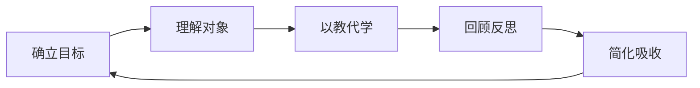

#### 五个步骤的详细解析：

1. **确立目标**：明确学习方向和预期成果
2. **理解对象**：深入掌握学习内容的核心概念
3. **以教代学**：通过输出倒逼输入，检验理解程度
4. **回顾反思**：发现知识盲点，完善认知结构
5. **简化吸收**：提炼精华，形成个人化的知识体系

#### 哲学精髓："先读厚，再读薄"

这一理念体现了费曼学习法的深刻哲学思考，它包含两个关键阶段：

**第一阶段：把书读厚**
- **核心做法**：将新知识与现有认知建立连接
- **思维方式**：全方位思考，产生新的组合知识
- **实践挑战**：90%的学习者未能真正完成这一步
- **失败原因**：被动接受知识，缺乏主动思考

> **关键洞察**：真正的学习不是信息的简单积累，而是知识的有机重构。

**第二阶段：把书读薄**
- **核心目标**：提炼知识精华，总结本质规律
- **更高价值**：将知识上升为智慧的过程
- **长期效益**：为后续学习建立知识连接点

#### 经典案例的启示

人类历史上最智慧的作品都体现了"简化"的力量：

| 经典作品     | 字数规模       | 流传时间     | 智慧密度 |
| ------------ | -------------- | ------------ | -------- |
| 《道德经》   | 约5000字       | 2500余年     | 极高     |
| 《孙子兵法》 | 约6000字       | 2500余年     | 极高     |
| 现代论文     | 数万至数十万字 | 数年至数十年 | 相对较低 |

这个对比清楚地表明：**真正的智慧在于精炼，不在于冗长**。只有当你能够将复杂的知识体系简化为核心要点时，才算真正掌握了这些知识，并且能够在未来的学习中建立起知识间的有效连接。

### 1.3 大脑学习机制与思维模式转换

**费曼学习法深刻理解并利用了大脑的双重学习机制**：熟悉度模式和创新连接模式。这两种模式的协同作用是实现深度学习的关键。

#### 大脑学习的物理原理

正如费曼基于物理学背景所洞察的：物质不会凭空产生或消失，知识也是如此。我们的大脑通过将**旧有信息**与**新知识**进行创造性连接，形成全新的概念和认知结构。

```
知识转化过程：
旧知识 + 新信息 → 大脑连接重构 → 新概念 → 记忆存储 → 行动应用
```

#### 大脑的两种学习模式

**模式一：熟悉度连接模式**
- **特点**：大脑倾向于在已知概念间建立联系
- **机制**：基于相关性和经验形成的自动化连接
- **例子**：看到裙子 → 想到美女；听到下雨 → 想到雨伞
- **优势**：提高处理效率，减少认知负担
- **局限**：容易陷入思维定势，抑制创新

**模式二：创新连接模式**
- **特点**：在不同概念间强行建立新的联系
- **机制**：跨越常规边界，进行创造性联想
- **例子**：洗澡时的浮力现象 → 验证王冠真伪的方法
- **优势**：产生创新思维，突破认知局限
- **挑战**：需要刻意练习，克服思维惯性

#### 思维模式对学习效果的影响

| 思维模式         | 特征表现                   | 学习效果   | 创新能力 |
| ---------------- | -------------------------- | ---------- | -------- |
| **熟悉度主导**   | 倾向已知领域，寻求安全感   | 稳定但有限 | 较低     |
| **创新连接主导** | 跨领域思考，乐于尝试新连接 | 波动但深入 | 较高     |
| **平衡模式**     | 两者结合，适时切换         | 稳定且深入 | 很高     |

> **费曼的洞察**：当大脑长期处于熟悉度模式时，创造力会受到抑制；而激活创新连接模式，则能产生强大的创新能力。

#### 创新连接的典型案例

**阿基米德的"尤里卡时刻"**：
- **情境**：需要验证王冠是否为纯金制造
- **挑战**：不能破坏王冠，但需要准确测量
- **创新连接**：洗澡时观察到的排水现象 ↔ 物体体积测量
- **解决方案**：利用排水法测量王冠体积，计算密度
- **成果**：发现浮力定律，解决了实际问题

这个例子完美展示了**跨领域创新**的力量：将日常生活观察与科学问题解决相结合，创造出全新的解决方案。

#### 学习启示

**费曼学习法的关键创新**在于它主动激活大脑的创新连接模式：

1. **输出过程**强迫我们重新组织知识结构
2. **教学情境**要求我们在不同概念间建立桥梁
3. **简化表达**促使我们找到知识的本质连接
4. **反馈修正**不断优化我们的概念网络

通过这种方式，学习不再是被动的信息接收，而是主动的知识重构和创新过程。

### 1.4 主动学习的必要性与常见误区

**信息爆炸时代的现实挑战**要求我们必须从被动学习转向主动学习，掌握终身学习的能力。

#### 时代背景的深刻变化

**从工业时代到信息时代的学习变革**：

| 时代特征     | 工业时代             | 信息时代           |
| ------------ | -------------------- | ------------------ |
| **知识特性** | 相对稳定，更新缓慢   | 快速迭代，半衰期短 |
| **学习方式** | 一次性学习，终身受用 | 持续学习，及时更新 |
| **社会需求** | 标准化知识人才       | 创新能力型人才     |
| **成功模式** | 学历导向             | 能力导向           |

残酷的现实是：**大学毕业时的知识，可能在毕业当天就已经过时了**。如果缺乏持续学习能力，我们必将在职场中处处碰壁。

#### 理论与实践的巨大鸿沟

以金融投资领域为例：
- **学校所学**：理论模型、公式推导、历史案例
- **实战所需**：市场判断、风险控制、心理素质
- **差距分析**：理论知识 ≠ 实战能力，需要大量实践验证

这个例子充分说明：**真正的学习必须与实际应用紧密结合**。

#### 传统学习的三大误区

**误区一：默默学习（输入导向）**
- **表现**：痴迷于增加阅读量，追求学习时长
- **心理**：相信量变必然导致质变
- **问题**：缺乏输出反馈，无法检验理解程度
- **结果**：投入大量时间，效果微乎其微

**误区二：教条主义（权威导向）**
- **表现**：盲目相信书本和专家观点
- **心理**：认为印刷的文字都是真理
- **问题**：缺乏批判性思维，不敢质疑
- **结果**：视野狭窄，无法灵活应用

**误区三：标准化应用（规则导向）**
- **表现**：生搬硬套知识，寻找标准答案
- **心理**：习惯于应试教育的思维模式
- **问题**：不懂变通，缺乏创新能力
- **结果**：无法应对复杂多变的现实问题

#### 标准答案陷阱

传统教育培养了我们对"标准答案"的依赖：
- **考试思维**：习惯于寻找唯一正确答案
- **现实挑战**：大多数问题没有标准答案
- **能力缺失**：缺乏处理复杂问题的能力
- **转型困难**：从学生思维到职场思维的转换困难

> **关键洞察**：现实世界是一个开放式问题的集合，而非标准化考试的延续。

### 1.5 学习观念的转变与价值重塑

**真正的学习应该立即与世界建立连接并获得有效反馈**，实现学习与成长的同步，而非为了未来的模糊目标。

#### 传统学习观念的问题

**中国英语教育的典型问题**：
- **学习投入**：十多年的学习时间
- **实际效果**：绝大多数人无法进行有效交流
- **核心问题**：重知识积累，轻实践应用
- **具体表现**：擅长背单词、做阅读，缺乏听说能力

正如与外国友人的交流中发现：他们认为我们的英语考试很难，特别是完形填空，甚至连许多外国人都觉得困难。这充分说明**我们的学习方式与实际应用严重脱节**。

#### 学习观念的根本转变

**错误观念**：学习不是为了现在，而是为了未来
- **典型表述**："今天不好好学习，明天就比别人差一个阶层"
- **潜在问题**：学习被推迟到未来，与当下成长脱节
- **结果**：学习变成了一种负担而非成长工具

**正确观念**：学习必须与成长同步
- **核心理念**：学习要立即与世界建立连接
- **实践要求**：获得及时有效的反馈
- **根本目的**：改变自己，而非超越他人

#### 学习与成长的良性循环

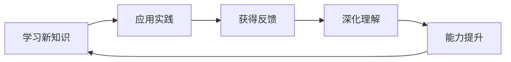

#### 两种学习导向的对比

| 学习导向     | 目标设定 | 动力来源 | 评价标准  | 长期效果  |
| ------------ | -------- | -------- | --------- | --------- |
| **比较导向** | 超越他人 | 外部竞争 | 排名/分数 | 焦虑/倦怠 |
| **成长导向** | 改变自己 | 内在驱动 | 能力提升  | 持续进步  |

#### 费曼学习法培养的核心能力

**远见（Vision）**是通过系统性学习建立的宏观认知框架，它让学习者在复杂环境中能够预见趋势、把握方向。这种能力的培养依赖于对知识的整体性理解和对发展规律的深刻洞察。

**穿透力（Insight）**是透过碎片信息看清事物本质的能力，它通过深度思考和反复验证得以强化。在实际应用中，穿透力帮助学习者快速抓住问题核心，避免被表面现象所干扰。

**智慧（Wisdom）**是汲取知识精华并形成个人独特系统的最高层次能力。它通过知识整合和创新发展，最终将学习成果转化为指导实际行动的系统性智慧。

#### 学习的最终价值

费曼学习法的终极目标不是获取更多知识，而是**培养一种全新的认知方式**：

- **从被动接受到主动建构**
- **从记忆存储到理解应用**
- **从知识积累到智慧生成**
- **从个体学习到与世界连接**

这种学习观念的转变，将帮助我们在信息爆炸的时代保持清醒，在快速变化的环境中持续成长，最终实现个人价值和社会价值的统一。

## 2. 目标确立与学习规划的艺术

基于对费曼学习法核心理念的深入理解，我们知道学习需要从被动接受转向主动建构。要实现这一转变，首先需要建立有效的目标导向学习系统。

### 2.1 正反馈机制与马太效应在学习中的应用

**正反馈机制是维持长期学习动力的核心引擎**，它通过即时满足感和成就感建立学习的良性循环，为费曼学习法的实施提供持续的内在动力支持。

#### 信息时代的学习挑战

在当今信息爆炸的时代，我们面临着前所未有的学习环境：
- **知识碎片化**：信息分散，难以形成系统化认知
- **信息过载**：海量信息让人难以选择和聚焦
- **学习方式转变**：从被动接受到主动建构的必要性

面对这些挑战，我们需要依靠**主观能动性**在各种信息中穿梭、汇聚、提炼，最终形成自己的知识体系。

#### 知识记忆 vs 真正理解

费曼明确指出：**记住知识和了解知识之间存在巨大差别**。

| 学习层次     | 特征表现             | 持续时间           | 应用能力 |
| ------------ | -------------------- | ------------------ | -------- |
| **死记硬背** | 机械记忆定义、公式   | 短期，考试后遗忘   | 几乎为零 |
| **表面理解** | 能解释概念，缺乏深度 | 中期，需要重复复习 | 有限     |
| **深度理解** | 能举一反三，灵活应用 | 长期，内化为能力   | 强大     |

现实中，很多人能够背诵各种定义，但却不知道如何应用，这种知识只是用来应付考试的工具，在实际生活中几乎毫无用处。

#### 正反馈机制的核心作用

**正反馈机制**是学习过程中最容易被忽视的关键因素。我们常常只顾学习，却不知道如何获得有效的反馈，最终导致学习无法持续。

**正反馈循环的工作原理**：

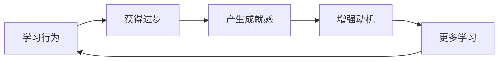

#### "学霸现象"背后的心理学机制

**案例一：解题达人**
- **表面观察**：痴迷于做各种难题
- **深层动机**：通过解决难题获得自信和成就感
- **心理机制**：正反馈强化了学习行为
- **最终结果**：越做越有兴趣，形成良性循环

**案例二：表扬追求者**
- **表面观察**：努力刷题以获得老师表扬
- **深层动机**：外部认可带来的满足感
- **类比理解**：与健身房拍照发朋友圈的心理机制相似
- **关键洞察**：即时反馈是持续行动的强大驱动力

#### 马太效应在学习中的积极意义

这种现象在学习中表现为**马太效应**：早期获得正反馈的学习者更容易建立学习优势，形成良性循环。具体表现为：

1. **起步优势**：早期获得正反馈的学习者
2. **动力增强**：成功体验激发更多学习动力
3. **能力提升**：持续学习带来能力快速提升
4. **优势扩大**：与其他学习者的差距进一步拉大

#### 建立有效正反馈的策略

**个人学习中的正反馈建立**：
- **设定可达成的短期目标**：每个小目标的完成都是一次正反馈
- **记录学习进步**：可视化成长过程，增强成就感
- **寻找学习伙伴**：相互鼓励，共享学习成果
- **立即应用所学**：在实践中验证学习效果

**费曼学习法提供的正反馈机制**：
- **教学输出**：能够教会他人本身就是强大的正向反馈
- **简化能力**：将复杂概念简单化证明深度理解
- **问题解决**：用所学知识解决实际问题带来成就感

通过建立有效的正反馈机制，我们可以将学习从负担转变为乐趣，从被动接受转变为主动探索，最终实现可持续的终身学习。

### 2.2 学习主动性与兴趣培养策略

基于正反馈机制，**费曼学习法通过主动创造优势累积来激活学习主动性**，让优势累积成为持续学习的内在动力。

#### 优势累积的学习机制

费曼学习法的核心策略就是主动创造正向的学习循环：

1. **单点突破**：在某个知识点上建立压倒性优势
2. **输出驱动**：通过教学输出来强化优势地位
3. **信心建立**：成功体验产生强大的学习动力
4. **优势扩展**：将单点优势逐步扩展到整体领域

#### 单点突破策略的实施方法

**选择突破点的原则**：
- **兴趣导向**：选择真正感兴趣的知识点
- **难度适中**：既不会太容易，也不会过于困难
- **实用性强**：能够快速应用到实践中
- **可扩展性**：为后续学习提供基础和桥梁

**实施步骤**：

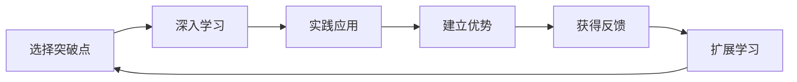

#### 连锁反应的典型案例

**数学优势带动整体学习**的真实案例：

**背景情况**：
- **初始状态**：学生学习跟不上，整体成绩落后
- **干预措施**：专注数学学科，强化专项训练
- **时间周期**：不到一年的持续努力

**转变过程**：
1. **数学成绩提升**：从班级落后 → 班级前十 → 班级第一 → 年级第一
2. **学习兴趣增强**：对数学产生浓厚兴趣和自信心
3. **整体学习改善**：其他学科成绩也显著提升
4. **学习态度转变**：从被动学习转变为主动探索

**深层原因分析**：
- **信心迁移效应**：数学成功增强了整体学习信心
- **学习方法迁移**：数学学习的方法应用到其他学科
- **学习习惯养成**：专注和持续努力成为习惯

#### 主动学习的激发机制

**自主设计作业的创新案例**：

**传统模式的问题**：
- **作业性质**：被动完成，缺乏内在动机
- **心理感受**：负担和压力，缺乏成就感
- **学习效果**：应付差事，难以深入理解

**创新模式的优势**：
- **作业性质**：主动设计，发挥创造性
- **心理感受**：成就感驱动，乐在其中
- **学习效果**：深度理解，知识内化

**创新实践的具体做法**：

1. **自主设计**：学生自己设计作业内容
2. **质量展示**：优秀作业进行班级展览
3. **同伴交换**：学生之间相互交换作业
4. **质量竞争**：为了设计出更难的题目而努力学习

**实践效果**：
- **学习内卷**：良性竞争推动学习氛围
- **作品化思维**：将作业从苦差事转变为作品
- **学习动力**：内在驱动力替代外部压力
- **成绩提升**：全区领先的显著成果

### 2.3 SMART目标设定与科学规划方法

**学习主动性的缺失是效果不佳的根本原因**，通过科学的目标设定可以有效激发内在学习动力。

#### 主动性缺失的根源分析

**现象观察**：
- **家长困惑**：投入大量时间和金钱，效果却不理想
- **学生状态**：被动应付，缺乏主动性和兴趣
- **结果困境**：学习效果差，产生抵触情绪

**根本原因**：
1. **目标缺失**：缺乏明确的学习目标和意义
2. **被动状态**：在无意识中完成学习任务
3. **负面联想**：将学习等同于苦差事和负担

#### 目标设定的心理学原理

**学习目标的三个层次**：

| 目标层次     | 特征表现           | 动力来源 | 持续效果       |
| ------------ | ------------------ | -------- | -------------- |
| **无目标**   | 应付差事，被动完成 | 外部压力 | 短期，易中断   |
| **外部目标** | 为了奖励或避免惩罚 | 外部激励 | 中期，易波动   |
| **内部目标** | 出于兴趣和成长需求 | 内在驱动 | 长期，稳定持续 |

#### SMART原则在学习中的应用

**SMART原则详解**：

- **S (Specific) 明确性**：目标具体清晰，不含糊
- **M (Measurable) 可衡量性**：有明确的评估标准
- **A (Achievable) 可实现性**：目标具有挑战性但可达成
- **R (Relevant) 相关性**：与个人兴趣和发展方向相关
- **T (Time-bound) 时限性**：有明确的时间框架

**错误目标vs正确目标对比**：

| 学习目标     | 错误表述   | 正确表述                              |
| ------------ | ---------- | ------------------------------------- |
| **语言学习** | "学好英语" | "3个月内能够进行10分钟的日常英语对话" |
| **技能掌握** | "学会编程" | "2个月内完成一个简单的个人网站开发"   |
| **知识获取** | "多读书"   | "每月阅读2本专业书籍并写出读书笔记"   |

#### 科学规划的实施策略

**分阶段规划法**：、

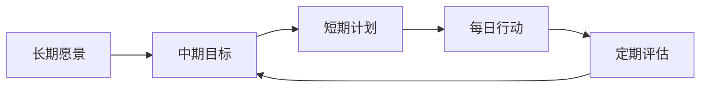

**弹性调整机制**：
- **定期检查**：每周评估目标完成情况
- **灵活调整**：根据实际情况调整目标和计划
- **持续优化**：不断改进学习方法和工作流程

通过科学的目标设定和规划，我们可以将模糊的学习愿望转化为具体的行动计划，将被动学习转变为主动探索，最终实现高效而愉悦的学习体验。

### 2.4 目标调整与方向选择策略

**远大志向是学习动力的根本源泉**，通过建立具体的学习愿景来激发内在学习动机。

#### 目标缺失导致的学习困境

**常见的学生困惑**：
- "学这些数学有什么用？"
- "背政治就是浪费时间"
- "这些东西与我的未来有什么关系？"

这些问题的背后反映了一个深层次问题：**缺乏与个人未来连接的具体愿景**。

#### 志向驱动的学习案例

**案例一：未来的物理学家**
- **起始点**：初二时立志成为物理学家
- **行为表现**：主动阅读爱因斯坦等相关著作
- **他人视角**：同学们认为行为"怪异"
- **实际效果**：成绩始终遥遥领先
- **最终成就**：北大物理系 → 博士后 → 科学家

**案例二：未来的程序员**
- **逻辑连接**：数学基础 → 编程能力 → 职业目标
- **内在驱动**：对编程的强烈兴趣
- **学习态度**：从被动接受转为主动探索
- **效果体现**：数学学习有了明确的意义和价值

#### 愿景连接的建立策略

**家长的角色转变**：

| 传统做法                 | 创新做法               | 效果对比            |
| ------------------------ | ---------------------- | ------------------- |
| "为了你好"的抽象说教     | 帮助探索个人兴趣和愿景 | 外部压力 → 内在驱动 |
| "以后找好工作"的模糊目标 | 建立具体的职业发展愿景 | 遥远空洞 → 清晰具体 |
| 关注短期成绩提升         | 关注长期能力发展       | 表面效果 → 深层改变 |

**愿景连接的建立步骤**：
1. **兴趣探索**：发现孩子的真实兴趣点
2. **职业了解**：深入了解相关职业的实际情况
3. **路径规划**：明确从当前到目标的发展路径
4. **意义连接**：建立当前学习与未来目标的具体连接

#### 成长导向的思维模式

**职场成功的启示**：
与其花费大量时间补充短板，不如将长板做大做强。这一原则在学习中同样适用。

**成功的关键要素**：
- **专注度**：在有限领域深耕细作
- **优势突出**：形成个人核心竞争力
- **持续发展**：在优势领域不断精进

"成功不在于你做了多少事，而在于你把哪些事情做好了。"

#### 方向迷失的解决方案

**脱离课堂后的普遍困境**：
- 失去外部指导和学习进度
- 不知道该在哪些方面发力
- 缺乏自主选择的能力和信心

#### "答案在于问题"的发现方法

**寻找学习方向的关键问题**：

| 问题类型       | 探索目的                   | 引导方向     |
| -------------- | -------------------------- | ------------ |
| **价值判断**   | "对我来说最重要的是什么？" | 确定优先级   |
| **兴趣导向**   | "我对哪个方向更感兴趣？"   | 发现内在动力 |
| **好奇心驱动** | "哪些领域让我充满好奇？"   | 激发探索欲   |

**实际案例的启发**：

**爱因斯坦阅读者**：
- **行为特征**：初二时主动阅读爱因斯坦传记
- **内在动机**：对物理的强烈好奇心
- **学习效果**：物理学成绩自然优秀
- **深层原理**：兴趣是最好的老师

**历史爱好者**：
- **早期表现**：小时候喜欢阅读小说和人物传记
- **学科表现**：历史成绩突出
- **职业延伸**：投资领域（历史研究的实际应用）
- **持续发展**：兴趣爱好贯穿整个职业生涯

#### 资源聚焦的策略思维

**现实约束的认知**：
- **时间资源**：每个人都只有24小时/天
- **精力资源**：注意力是有限的宝贵资源
- **机会成本**：选择一个方向意味着放弃其他方向

**聚焦策略的价值**：

```
普通人 + 时间聚焦 = 专业人才
专业人才 + 持续精进 = 行业专家
行业专家 + 创新突破 = 领军人物
```

通过明确学习方向和聚焦资源投入，我们可以在有限的时间内取得最大的学习效果，实现从普通到优秀的转变。

### 2.5 科学规划与弹性调整机制

**目标错误是规划失败的根本原因**，只有通过SMART原则设定科学目标，并建立灵活的调整机制，才能确保学习规划的有效执行。

#### 规划失败的常见原因

**目标与规划的脱节现象**：
- **制定目标时**：热血沸腾，充满动力
- **执行过程中**：一塌糊涂，难以坚持
- **根本问题**：缺乏具体可行的行动路线图

#### 规划的构成要素

**完整的规划包含以下要素**：
1. **行动路线**：从起点到终点的具体路径
2. **阶段划分**：将大目标分解为可执行的小步骤
3. **进度安排**：每个阶段的时间分配和里程碑
4. **资源调配**：时间、精力、财务等资源的合理分配
5. **风险预案**：应对困难和挑战的备选方案

#### 案例对比：减肥规划

**失败的减肥规划**：
- **目标**：减肥（明确但无具体规划）
- **执行**：饿了两天就放弃
- **结果**：暴饮暴食，比原来更胖
- **问题**：缺乏循序渐进的科学方案

**成功的减肥规划**：

| 时间周期 | 具体措施       | 预期效果      | 评估标准     |
| -------- | -------------- | ------------- | ------------ |
| **每日** | 控制饮食摄入量 | 形成热量赤字  | 体重记录     |
| **每周** | 安排3-4次运动  | 消耗大于摄入  | 运动完成率   |
| **每月** | 整体方案调整   | 稳定减重3-5斤 | 体重变化趋势 |

#### 目标错误的识别方法

**需要警惕的错误目标模式**：

**案例：不切实际的财务目标**
- **目标设定**：24岁毕业，30岁实现千万身家
- **行动方案**：疯狂学习炒股技术，购买投机书籍
- **问题分析**：
  - **不具体**：缺乏明确的实现路径
  - **不可量化**：无法设定合理的阶段性指标
  - **不可达成**：时间框架与现实严重不符
  - **不相关**：投机思维与价值创造脱节
- **结果导向**：走上投资歧途，适得其反

#### 反思与调整的重要性

**持续反思的必要性**：
- **方向检查**：确保始终在正确的道路上
- **进度评估**：及时发现问题和偏差
- **策略调整**：根据实际情况优化方案
- **止损机制**：及时停止错误的努力方向

### 2.6 兴趣驱动与学习内动力的培养

**兴趣和天赋是学习成功的关键要素**，应该在擅长的领域深耕细作，而非执着于弥补短板。

#### 目标合理性分析案例

**案例反思：外语学习的目标设定**

**原始目标**："学好一门外语"

**SMART分析发现的问题**：
- **不可量化**："学好"的标准模糊，无法衡量
- **缺乏相关性**：工作和生活中都不使用
- **无积极意义**：无法获得成就感和满足感
- **缺乏兴趣**：对学习内容本身不感兴趣

**结论**：这是一个从根本上就错误的目标

#### 长板vs短板的战略选择

**传统思维模式**：

```
个人能力 = 短板长度（木桶理论）
学习策略 = 补齐短板
发展路径 = 全面发展
```

**创新思维模式**：

```
个人竞争力 = 长板长度×优势深度
学习策略 = 强化长板
发展路径 = 差异化竞争
```

#### 职业转型的成功案例

**财经记者的转型历程**：

**第一阶段：媒体行业的专业发展**
- **起点**：电视台财经记者
- **策略**：在专业领域深耕细作
- **成果**：建立媒体行业护城河

**第二阶段：跨行业的能力迁移**
- **转型方向**：从媒体转向金融企业
- **能力迁移**：媒体资源 + 金融专业能力
- **竞争优势**：复合型人才的市场稀缺性

**第三阶段：优势整合的价值创造**
- **核心优势**：媒体影响力 + 金融专业度
- **市场定位**：财经领域的意见领袖
- **长期发展**：独特个人品牌和专业地位

#### 转型策略的启示

**成功转型的关键要素**：
1. **识别核心优势**：找到自己真正的天赋和兴趣
2. **战略性放弃**：敢于放弃不适合的领域
3. **差异化竞争**：在交叉领域创造独特价值
4. **持续深耕**：在优势领域不断精进

**避免的错误路径**：
- **盲目补短**：在不擅长领域浪费大量时间
- **同质化竞争**：在拥挤赛道上与优势者竞争
- **缺乏战略**：没有清晰的发展规划

通过兴趣驱动的学习策略和长板思维，我们可以在最适合自己的领域取得突破性发展，实现个人价值的最大化。</think>

## 3. 输出驱动与深度学习策略

在建立了明确的学习目标和正反馈机制后，费曼学习法的核心实践环节——输出驱动学习，就成为实现深度理解的关键。本章将系统阐述如何通过多元化输出策略实现知识的深度内化。

### 3.1 复述学习的科学机制与三阶段方法

**复述是费曼学习法的核心环节**，它通过三阶段递进式方法实现从短期记忆到长期记忆的深度转化，为后续的教学输出奠定坚实基础。

#### 复述的神经科学原理

**记忆深化的科学机制**：

| 学习方式       | 大脑活跃度 | 记忆留存率 | 理解深度   |
| -------------- | ---------- | ---------- | ---------- |
| **默读**       | 低         | 5-10%      | 表面理解   |
| **朗读**       | 中等       | 20-30%     | 初步理解   |
| **复述**       | 高         | 50-70%     | 深度理解   |
| **教学式复述** | 极高       | 90%+       | 创造性理解 |

复述之所以如此有效，是因为它激活了大脑的多个区域：
- **听觉皮层**：处理自己发出的声音
- **运动皮层**：控制说话的肌肉运动
- **前额叶皮层**：进行信息整合和逻辑组织
- **海马体**：强化记忆编码和存储

#### 实践案例：说书人的学习法

**老齐说书过程的启示**：
1. **知识转化**：将书本内容转化为口语化表达
2. **风格内化**：用个人语言风格重新组织信息
3. **举例强化**：结合个人经历和案例说明
4. **深度记忆**：通过多种感官刺激形成根深蒂固的记忆

这个过程完美诠释了**费曼学习法的实践应用**：当你能够用通俗易懂的语言向他人讲解复杂概念时，说明你已经真正掌握了这个知识。

#### 第一次复述的三阶段方法论

**阶段一：印象复述（自由表达）**
- **目标**：激活初步记忆，识别知识盲点
- **方法**：凭印象自由说出所学内容
- **要点**：不要担心不准确，重点是表达出来
- **效果**：快速发现哪些知识还不扎实

**阶段二：问题导向复述（深度思考）**
- **时间安排**：复述后静置5-10分钟
- **具体操作**：写下对知识点的理解和疑问
- **核心问题**：
  - 哪些地方我还不清楚？
  - 为什么会有这样的结论？
  - 这个知识与已知概念如何关联？
- **解决策略**：查找原文，解决疑惑

**阶段三：创造融合复述（知识重构）**
- **核心技巧**：使用解释、类比、举例等方法
- **目标**：将个人观点融入复述内容
- **评价标准**：能否用自己的话重新表达？
- **最终状态**：准备对外输出个人观点

#### 复述过程的可视化流程

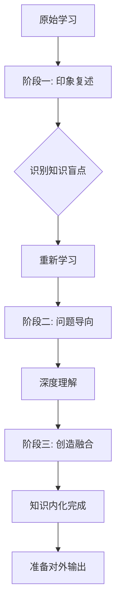

#### 复述技巧的进阶应用

**从被动复述到主动创造**：

1. **模仿阶段**：重复作者的观点和表述
2. **理解阶段**：用自己的话解释相同内容
3. **应用阶段**：结合个人经验举例说明
4. **创造阶段**：提出新的见解和应用方向

**质量评估标准**：
- **准确性**：是否准确传达了核心概念？
- **清晰性**：语言是否简单易懂？
- **完整性**：是否涵盖了重要知识点？
- **创造性**：是否加入了个人独特见解？

通过系统性的三阶段复述，我们可以实现知识的深度内化，为后续的教学输出打下坚实基础。这不仅是记忆强化的过程，更是理解和创造的开始。

### 3.2 系统化学习与以教代学的核心价值

**系统化学习通过分类、筛选和归纳将零散知识转化为结构化认知体系**，实现知识的高效内化和灵活应用。

#### 系统化学习的三层处理机制

**第一层：知识分类（分类整理）**
- **目的**：确认知识来源，建立分类体系
- **方法**：按主题、领域、重要性进行归类
- **工具**：标签系统、文件夹、知识库
- **效果**：形成有序的知识结构

**第二层：知识筛选（去伪存真）**
- **目的**：识别和排除假知识、过时信息
- **标准**：可靠性、实用性、时效性
- **挑战**：信息过载时代的辨识能力
- **结果**：保留核心有用的知识

**第三层：知识归纳（体系构建）**
- **目的**：确立分析逻辑，形成思维导图
- **过程**：从点到线，从线到面，从面到体
- **产出**：个人化的知识体系
- **价值**：知识的深度整合和结构化

#### 知识融合的两个关键问题

**老齐的知识融合法则**：
每当学习新知识时，问自己两个核心问题：

**问题一：认知连接**
- **具体内容**："这个知识与我之前的哪些认知相吻合？"
- **目的**：建立新旧知识的连接
- **方法**：寻找相似性、对比差异性、发现关联性
- **效果**：将孤立知识融入已有认知网络

**问题二：应用预设**
- **具体内容**："这个知识我大概会在哪些场合使用？"
- **目的**：预设具体的应用场景
- **方法**：情境模拟、案例设想、实践规划
- **效果**：提高知识的可检索性和实用性

#### 知识内化的场景化策略

**经济周期学习案例**：

**学习过程**：
1. **理论学习**：理解经济周期的基本概念
2. **历史回顾**：联想到煤老板的兴起与衰落
3. **模式识别**：总结强周期的特征信号
4. **应用规划**：设计未来机会的识别和把握策略

**内化效果**：
- **理论联系实际**：抽象概念变得具体可感
- **模式化思维**：形成可复用的认知模板
- **前瞻性规划**：为未来机会做好准备
- **快速识别**：在复杂环境中抓住关键信号

#### 以教代学的实践检验价值

**理论与实践的差距验证**：

**学徒案例分析**：
- **学习前状态**：自我感觉"学得很好"
- **实践挑战**：开始创作专业内容
- **发现的问题**：
  - 理解深度不足，仅为一知半解
  - 许多概念理解存在错误
  - 无法将知识转化为实际应用
- **持续修正**：在日常创作中不断完善知识体系

**关键启示**：
> **真正的理解不是"知道"，而是"能用"**。

#### 系统化学习的操作流程

**系统化学习包含以下八个关键步骤：**

1. **新知识输入**：有选择性地获取高质量信息，建立初步认知
2. **分类整理**：按照主题、领域、重要性进行归类，形成有序的知识结构
3. **筛选验证**：识别和排除假知识、过时信息，保留核心有用的知识
4. **归纳整合**：确立分析逻辑，形成思维导图，实现知识的深度整合
5. **建立连接**：将新旧知识建立联系，形成个人化的知识网络
6. **预设应用**：设想具体的应用场景，提高知识的可检索性和实用性
7. **教学输出**：通过教学强化理解，检验知识的掌握程度
8. **反馈修正**：根据他人反馈不断完善认知结构，实现知识的持续优化

#### 知识管理的最佳实践

**从被动接受到主动建构**：

1. **输入阶段**：有选择性地获取高质量信息
2. **处理阶段**：系统化整理和深度思考
3. **输出阶段**：通过教学强化理解
4. **反馈阶段**：根据实践调整认知结构
5. **循环迭代**：不断完善知识体系

通过这种系统化的学习方式，我们可以将碎片化的信息转化为结构化的知识体系，实现真正意义上的深度学习和智慧生成。

### 3.3 学习留存率金字塔与教学输出的神经科学机制

**教学输出是最高效的学习方式**，其90%的留存率得到了认知神经科学的充分验证和支持。

#### 学习金字塔的神经科学基础

**不同学习方式的大脑激活程度对比**：

| 学习方式     | 大脑激活区域         | 神经连接强度 | 记忆编码深度 | 留存率 |
| ------------ | -------------------- | ------------ | ------------ | ------ |
| **被动听讲** | 主要激活听觉皮层     | 弱，单一通道 | 表层处理     | 5%     |
| **阅读学习** | 视觉皮层 + 语言区    | 中等，双通道 | 初步理解     | 10%    |
| **视听结合** | 视觉 + 听觉 + 语言区 | 中强，多通道 | 整合处理     | 20%    |
| **小组讨论** | 语言区 + 前额叶      | 强，交互式   | 深度加工     | 50%    |
| **实践应用** | 运动皮层 + 感觉区    | 很强，体验式 | 程序性记忆   | 75%    |
| **教学输出** | 全脑网络激活         | 极强，重构式 | 创造性理解   | 90%+   |

#### 费曼教学理念的核心洞察

**"茶壶理论"的彻底颠覆**：
费曼认为不存在"茶壶里煮饺子，有货倒不出来"的情况。如果你无法用简单语言向他人解释清楚某个概念，说明你自己对这个概念的理解还不够深入。

这种观点基于**神经可塑性原理**：
- **知识重构过程**：教学时大脑需要重新组织信息结构
- **简化表达需求**：激活概念提炼和语言组织的高级认知功能
- **互动反馈机制**：通过他人反应验证和完善理解

#### 多模态学习效果可视化

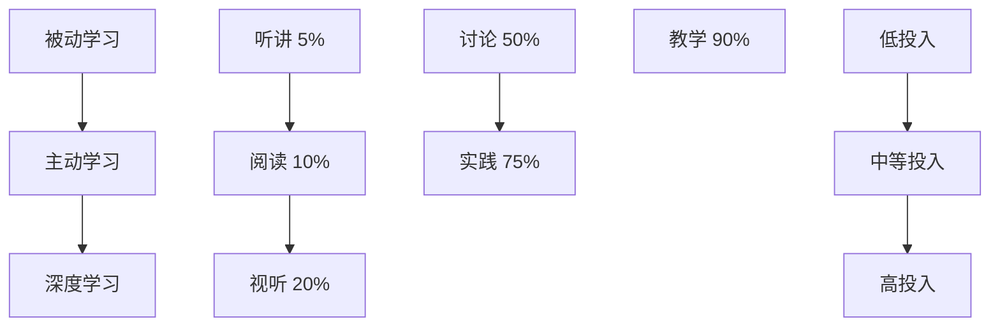

#### 深入浅出的教学技巧

**类比迁移教学法**：
将复杂概念通过简单类比来解释，这是费曼教学法的精髓。

**典型案例分析**：

| 复杂概念       | 传统解释方法     | 费曼类比法           | 效果对比 |
| -------------- | ---------------- | -------------------- | -------- |
| **汽车变速箱** | 技术参数、齿轮比 | 自行车变速齿轮       | 直观易懂 |
| **相对论**     | 数学公式推导     | 火车和观察者思维实验 | 生动有趣 |
| **量子力学**   | 波函数方程       | 盒子里的猫           | 形象深刻 |

#### 企业培训的费曼模式

**"一人学习，全员受益"的创新模式（某企业的MBA培训实践案例）**：
- **传统做法**：多人参加MBA培训，效果分散
- **创新做法**：选拔一人参加，要求其回来全员教学
- **压力机制**：讲明白企业报销，讲不明白个人承担
- **惊人效果**：该员工学习效果最佳，成为公司核心领导

**成功机制的深层分析**：

1. **学习压力**：承担向全员教学的责任，形成必须深度理解的外部压力
2. **深度理解需求**：为了能够教会他人，必须超越表面理解，达到深度掌握
3. **教学准备过程**：系统梳理知识结构，准备教学材料和讲解方案
4. **知识重构优化**：将学到的知识重新组织，形成个人化的知识体系
5. **简化表达能力**：将复杂概念转化为简单易懂的语言，提炼知识精华
6. **成功教学**：通过清晰表达让其他同事理解，验证掌握程度
7. **个人能力提升**：在准备和教学过程中实现认知能力的质的飞跃
8. **组织价值创造**：通过知识传递实现学习效果的最大化，提升整体团队能力

**费曼教学法的核心价值**：
1. **深度理解**：只有真正理解才能教会他人
2. **知识重构**：教学过程本身就是深度学习
3. **简化能力**：提炼复杂概念的本质
4. **互动验证**：通过他人反馈验证理解程度

这种教学方法将传统的单向知识传递转化为双向互动的价值创造过程，实现个人成长和组织发展的双赢。

### 3.4 多元化输出策略与内容创作的心理机制

**多模态输出方式能够最大化学习效果**，通过不同媒介激活大脑的多元认知通道，实现知识的深度内化。

#### 输出媒介的认知心理学分析

**老齐输出实践的发展轨迹**：
- **第一阶段**：博客写作 → 结构化思维训练
- **第二阶段**：公众号运营 → 读者反馈驱动优化
- **第三阶段**：音频节目（喜马拉雅）→ 口语化表达强化
- **第四阶段**：知识社群 → 互动式深度学习

#### 输出过程的认知强化机制

**输出驱动的深度学习循环**：

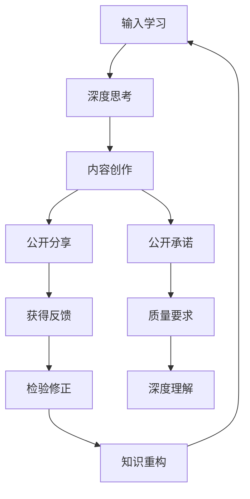

**输出过程中的认知挑战**：
- **内容验证**：需要确保观点经得起推敲
- **质疑应对**：准备应对他人挑战的充分论证
- **时间验证**：通过实践检验观点的正确性
- **持续改进**：根据反馈不断完善认知体系

#### 优质内容的四维评估模型

**高质量输出的核心要素矩阵**：

| 评估维度       | 具体标准               | 质量等级       | 认知效果     |
| -------------- | ---------------------- | -------------- | ------------ |
| **语言简洁性** | 通俗易懂，避免专业术语 | 初级→中级→高级 | 降低认知门槛 |
| **表达精准度** | 无歧义，逻辑清晰       | 模糊→准确→精确 | 提高信息质量 |
| **内容深度**   | 提供独特洞察和新视角   | 表面→深入→创新 | 增加价值密度 |
| **个人特色**   | 融入个人理解和体验     | 复制→整合→创造 | 体现独特价值 |

#### 多媒体输出的神经科学优势

**不同媒介的大脑激活模式对比**：

| 媒介类型     | 激活脑区            | 认知负荷 | 记忆编码   | 学习效果 |
| ------------ | ------------------- | -------- | ---------- | -------- |
| **纯文字**   | 视觉皮层 + 语言区   | 中等     | 符号编码   | 基础理解 |
| **音频输出** | 听觉皮层 + 运动皮层 | 中高     | 声音编码   | 听觉记忆 |
| **视频录制** | 全脑多区域激活      | 高       | 多模态编码 | 深度记忆 |

#### 口语化输出的认知挑战

**"文字→口语"转换的认知难度**：

口语化输出比书面表达要求更高，因为：

1. **实时性要求**：需要即时组织和表达观点
2. **简洁性需求**：口语必须更加简洁明了
3. **互动性适应**：需要考虑听众的理解和反应
4. **流畅性保持**：需要维持自然的语言节奏

**认知加工的深度差异**：
- **书面表达**：可以反复修改，精雕细琢
- **口语表达**：需要实时处理，一次成型
- **难度提升**：口语输出要求更深度的理解和掌握

#### 现代数字工具的应用策略

**个人输出平台的选择矩阵**：

| 平台类型        | 特点优势           | 适用内容           | 学习效果 | 推荐指数 |
| --------------- | ------------------ | ------------------ | -------- | -------- |
| **博客/公众号** | 深度分析，长期保存 | 理论思考，系统总结 | ★★★★☆    |          |
| **短视频平台**  | 快速传播，视觉冲击 | 核心观点，快速入门 | ★★★☆☆    |          |
| **音频平台**    | 伴随学习，情感连接 | 故事分享，经验传承 | ★★★★☆    |          |
| **知识社群**    | 互动讨论，深度交流 | 案例分析，问题解答 | ★★★★★    |          |

#### 输出频率与质量的平衡策略

**每日输出习惯的建立**：
- **时间投入**：每天15-30分钟的微输出
- **内容规模**：微博规模的短内容（200-500字）
- **质量要求**：确保每天都有新思考和新感悟
- **持续优化**：通过小步快跑实现能力提升

**长期输出的复利效应**：
```
每日思考 × 持续输出 × 反馈修正 = 能力指数级增长
```

#### 费曼输出法的心理机制

**社会学习理论的应用**：
- **观察学习**：通过他人反馈学习改进
- **自我效能**：成功输出增强自信心
- **社会认同**：获得认可形成持续动力

**认知失调理论的运用**：
- **承诺一致性**：公开承诺促进深度理解
- **自我验证**：通过输出验证个人认知
- **心理舒适区**：持续挑战扩大认知边界

通过多元化的输出策略，我们可以最大化学习效果，将被动输入转化为主动创造，实现真正的知识内化和能力提升。

### 3.5 互动式深度复述与社会化学习策略

**第二次复述是社会学习的核心环节**，通过真实互动环境检验知识的深度理解，并在交流中实现认知的进一步升华。

#### 从独白到对话的学习进化

**第一次复述 vs 第二次复述的认知差异**：

| 复述类型       | 受众对象         | 心理状态 | 认知要求 | 学习效果 |
| -------------- | ---------------- | -------- | -------- | -------- |
| **第一次复述** | 自我（虚拟听众） | 相对放松 | 自我验证 | 基础巩固 |
| **第二次复述** | 他人（真实听众） | 适度紧张 | 深度理解 | 显著提升 |

**互动复述的心理机制**：
- **社会压力**：真实听众带来质量要求
- **即时反馈**：获得即时的理解和质疑
- **认知重构**：根据他人反应调整表达方式
- **记忆强化**：互动过程强化记忆编码

#### 学习场景的社交化设计

**小组讨论的深度学习价值**：

**自然学习环境的构建**：
- **学习共同体**：志同道合的学习者群体
- **共同目标**：相似的学习主题和进度
- **安全氛围**：开放包容的交流环境
- **建设性质疑**：有益的挑战和讨论

**工作场所的学习机会识别**：

| 工作场景     | 学习时机 | 交流方式 | 知识检验 | 价值获取 |
| ------------ | -------- | -------- | -------- | -------- |
| **茶歇时间** | 轻松氛围 | 随意交流 | 初步验证 | 关系建立 |
| **午餐聚会** | 共餐环境 | 主题讨论 | 深度探讨 | 经验分享 |
| **项目会议** | 正式场合 | 专业交流 | 专业验证 | 能力展示 |
| **团队建设** | 团队活动 | 案例分享 | 实践检验 | 团队协作 |

#### 交流对象的选择策略

**理想学习伙伴的特征矩阵**：

| 伙伴类型     | 倾听能力 | 反馈质量     | 经验分享 | 学习效果 |
| ------------ | -------- | ------------ | -------- | -------- |
| **智者导师** | 极佳     | 高质量指导   | 深度经验 | ★★★★★    |
| **同辈学友** | 良好     | 建设性质疑   | 相互启发 | ★★★★☆    |
| **好奇新手** | 优秀     | 简单直接提问 | 新鲜视角 | ★★★☆☆    |
| **专业专家** | 专业     | 权威验证     | 前沿知识 | ★★★★☆    |

**需要避免的交流对象**：
- **杠精型**：习惯性反驳，缺乏建设性
- **不耐烦型**：时间焦虑，无法专注倾听
- **批判型**：过度挑剔，打击学习信心
- **自大型**：垄断话题，不给予表达机会

#### 话题匹配的智能策略

**"知音匹配"原则**：
有效的知识交流需要建立在共同兴趣和理解基础之上。

**话题相关性矩阵**：

| 对方背景         | 合适话题           | 避免话题     | 交流效果 |
| ---------------- | ------------------ | ------------ | -------- |
| **技术专业人士** | 专业技能、行业趋势 | 日常生活细节 | ★★★★★    |
| **管理者**       | 战略思维、团队建设 | 技术细节     | ★★★★☆    |
| **创业者**       | 商业模式、创新思维 | 传统管理     | ★★★★★    |
| **学生群体**     | 学习方法、职业规划 | 复杂业务     | ★★★☆☆    |

**极端案例分析**：
- **错误案例**：向未婚单身男性讲解育儿经验
- **问题分析**：缺乏共同体验和需求基础
- **正确做法**：从对方的实际需求和经验出发

#### 互动学习的社交心理学

**维果茨基社会学习理论的应用**：

**最近发展区(ZPD)的实践**：
- **独立学习区**：已经掌握的知识
- **最近发展区**：通过他人帮助可以达到的水平
- **潜在发展区**：未来可能达到的高度

**学习脚手架的搭建**：

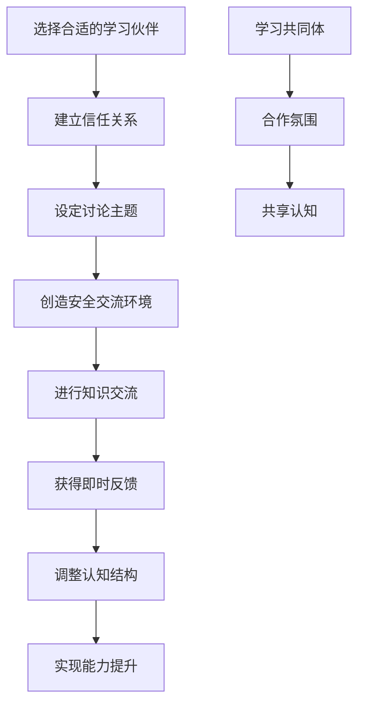

#### 互动技巧的系统性训练

**有效复述的四个关键技能**：

1. **倾听技巧**：
   - **积极倾听**：全身心关注对方表达
   - **确认理解**：及时复述对方观点
   - **情感共鸣**：理解对方的情绪和需求

2. **提问技巧**：
   - **开放式问题**：促进深度思考
   - **澄清式问题**：确保理解准确性
   - **引导式问题**：帮助对方梳理思路

3. **表达技巧**：
   - **结构化表达**：先总后分，层次清晰
   - **举例说明**：用具体案例解释抽象概念
   - **互动交流**：适时停顿，邀请反馈

4. **反馈技巧**：
   - **建设性质疑**：提出有价值的疑问
   - **肯定贡献**：认可对方的观点价值
   - **补充完善**：提供额外的信息和视角

#### 社交学习环境的构建策略

**学习共同体的建设要素**：

| 要素类型     | 具体内容         | 建设方法           | 维护策略         |
| ------------ | ---------------- | ------------------ | ---------------- |
| **共同目标** | 相似的学习主题   | 定期确定讨论话题   | 跟踪学习进度     |
| **互信关系** | 开放包容的氛围   | 破冰活动，个人分享 | 定期团建活动     |
| **交流规则** | 建设性的讨论标准 | 制定交流准则       | 及时纠正不当行为 |
| **持续机制** | 规律的学习安排   | 固定时间地点       | 建立提醒机制     |

通过系统化的互动学习策略，我们可以将个人的学习过程转化为社会化的知识共建过程，在交流和分享中实现认知的飞跃式发展。

### 3.6 高质量反馈机制的构建与学习环境的系统化优化

**反馈是认知成长的加速器**，通过科学的反馈处理机制和优化的学习环境，可以实现知识的深度重构和能力的持续提升。

#### 反馈处理的认知心理学框架

**反馈响应的三阶段思考模型**：

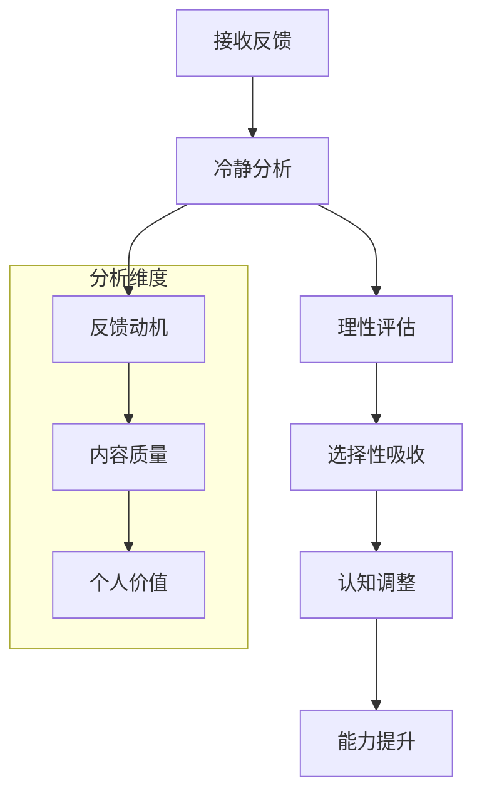

**关键问题的深度分析**：
1. **动机分析**："他为什么反对我的看法？"
   - 表达方式问题：沟通技巧不当
   - 知识内容问题：事实性错误或理解偏差
   - 价值观冲突：根本观点的分歧

2. **理由评估**："他评价基于什么理由？"
   - 事实依据：是否有可靠的数据支撑
   - 逻辑推理：论证过程是否严密
   - 经验基础：是否来自相关领域的实践经验

3. **改进策略**："我需要怎么化解矛盾？"
   - 知识补充：识别和填补知识空白
   - 表达优化：改进沟通和表达方式
   - 视角调整：考虑多角度的理解

#### 反馈质量的分类识别系统

**反馈类型的智能识别**：

| 反馈类型       | 特征表现           | 价值评估 | 处理策略           |
| -------------- | ------------------ | -------- | ------------------ |
| **建设性反馈** | 客观分析、具体建议 | 极高     | 认真研究，积极采纳 |
| **情感性反馈** | 主观感受、情绪表达 | 中等     | 理解动机，选择吸收 |
| **攻击性反馈** | 人身攻击、恶意挑衅 | 无效     | 忽略处理，避免争辩 |
| **误解性反馈** | 概念混淆、理解偏差 | 中等     | 澄清解释，帮助理解 |

#### 高质量反馈的特征识别

**查理·芒格式的建设性反对**：
芒格经常反对巴菲特的观点，但这种反对具有以下特征：
- **基于事实**：依托可靠的数据和研究
- **逻辑严密**：论证过程清晰合理
- **目标一致**：为了更好的决策结果
- **尊重态度**：反对观点但不反对个人

**高质量反馈的识别标准**：

| 评估维度     | 具体指标                 | 权重 | 评分标准 |
| ------------ | ------------------------ | ---- | -------- |
| **事实基础** | 有数据支撑，符合客观实际 | 30%  | 1-10分   |
| **逻辑性**   | 论证严密，因果关系清晰   | 25%  | 1-10分   |
| **建设性**   | 提供改进建议，促进发展   | 25%  | 1-10分   |
| **相关性**   | 与主题高度相关，切中要害 | 20%  | 1-10分   |

#### 学习平台的反馈质量对比

**不同平台的用户群体特征分析**：

| 平台类型       | 用户质量       | 讨论深度   | 反馈价值 | 学习效果 |
| -------------- | -------------- | ---------- | -------- | -------- |
| **专业社群**   | 高专业度       | 深度探讨   | 极高     | ★★★★★    |
| **知识星球**   | 高质量用户     | 建设性质疑 | 很高     | ★★★★★    |
| **公众号评论** | 质量参差不齐   | 表面交流   | 一般     | ★★★☆☆    |
| **短视频平台** | 大众化，情绪化 | 浅层互动   | 较低     | ★★☆☆☆    |

**平台选择策略**：
- **高质量学习**：选择专业社群和付费知识平台
- **广度验证**：适度关注大众平台的反馈
- **深度交流**：重点投入时间和精力于高质量平台

#### 富兰克林写作法的神经科学原理

**富兰克林方法的三阶段认知机制**：

**第一阶段：剪抄重组（信息解码）**
- **神经机制**：激活视觉皮层和语言区
- **认知过程**：将文字信息转换为大脑内部表征
- **学习效果**：初步理解和记忆编码

**第二阶段：记忆重组（信息重构）**
- **神经机制**：激活海马体和前额叶皮层
- **认知过程**：打乱顺序后重新组织逻辑结构
- **学习效果**：深度理解和灵活运用

**第三阶段：创造性复述（信息创造）**
- **神经机制**：激活全脑网络，特别是创意区域
- **认知过程**：加入个人理解和创新表达
- **学习效果**：完全内化和能力转化

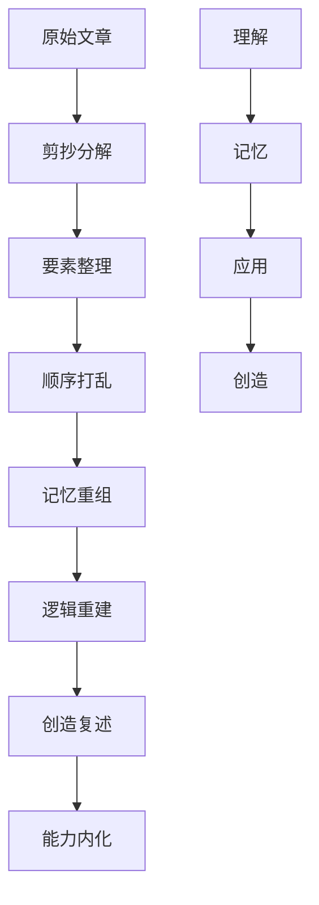

#### 学习社群的建设与管理

**高效读书会的运营策略**：

**社群发展的四个阶段**：

1. **形成期**：成员相互认识，建立基本信任
2. **风暴期**：观点碰撞，建立讨论规则
3. **规范期**：形成稳定的学习交流模式
4. **执行期**：高效运转，产生深度学习效果

**社群价值的创造机制**：

| 价值类型     | 创造方式               | 维护策略       | 长期效果     |
| ------------ | ---------------------- | -------------- | ------------ |
| **认知价值** | 思想碰撞，新观点产生   | 鼓励建设性质疑 | 知识边界拓展 |
| **情感价值** | 相互激励，学习动力维持 | 关注成员成长   | 持续学习习惯 |
| **社交价值** | 人际网络，资源分享     | 组织线下活动   | 职业发展支持 |
| **实践价值** | 查漏补缺，能力提升     | 案例分析讨论   | 实际问题解决 |

#### 同业交流的专业化策略

**投资领域的专业交流模式**：

**基金经理交流的深度价值**：
- **信息互补**：不同视角的信息共享
- **观点验证**：通过辩论验证投资逻辑
- **风险识别**：发现个人认知盲点
- **策略优化**：综合多方面改进投资方法

**专业交流的反馈循环**：

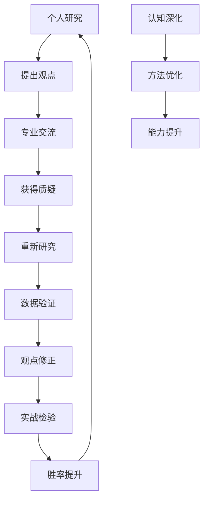

**争议性讨论的积极意义**：
- **压力测试**：检验观点的可靠性
- **盲点发现**：识别个人认知局限
- **思维拓展**：接触不同的思考模式
- **知识完善**：补充遗漏的信息和角度

通过系统化的反馈机制构建，我们可以为费曼学习法的实施提供最佳的外部支持条件，最大化学习效果和成长速度。

## 4. 学习效果评估与知识内化

通过输出驱动的学习实践，我们已经掌握了费曼学习法的核心技巧。然而，要实现真正的知识内化，还需要建立科学的学习效果评估体系，通过反思和修正来不断完善认知结构。

### 4.1 反思学习与查漏补缺的科学方法

**反思学习是知识内化的关键环节**，它将学习过程中的错误转化为宝贵的认知资产，通过系统化的行动导向反思机制实现知识的深度重构和优化。

#### 反思学习的神经科学基础

**元认知能力的发展**：反思学习激活大脑的前额叶皮层，这是负责元认知（思考关于思考）的关键区域。当我们进行反思时，大脑实际上在进行以下认知活动：

| 认知过程     | 大脑区域        | 功能表现           | 对学习的影响         |
| ------------ | --------------- | ------------------ | -------------------- |
| **自我监控** | 前额叶皮层      | 评估自己的理解程度 | 识别知识盲点         |
| **错误检测** | 前扣带皮层      | 发现不一致和错误   | 及时修正认知偏差     |
| **知识重构** | 海马体 + 新皮层 | 重新组织记忆网络   | 形成更稳固的知识连接 |
| **策略调整** | 顶叶皮层        | 制定改进方案       | 优化学习方法         |

#### 行动导向反思的四步框架

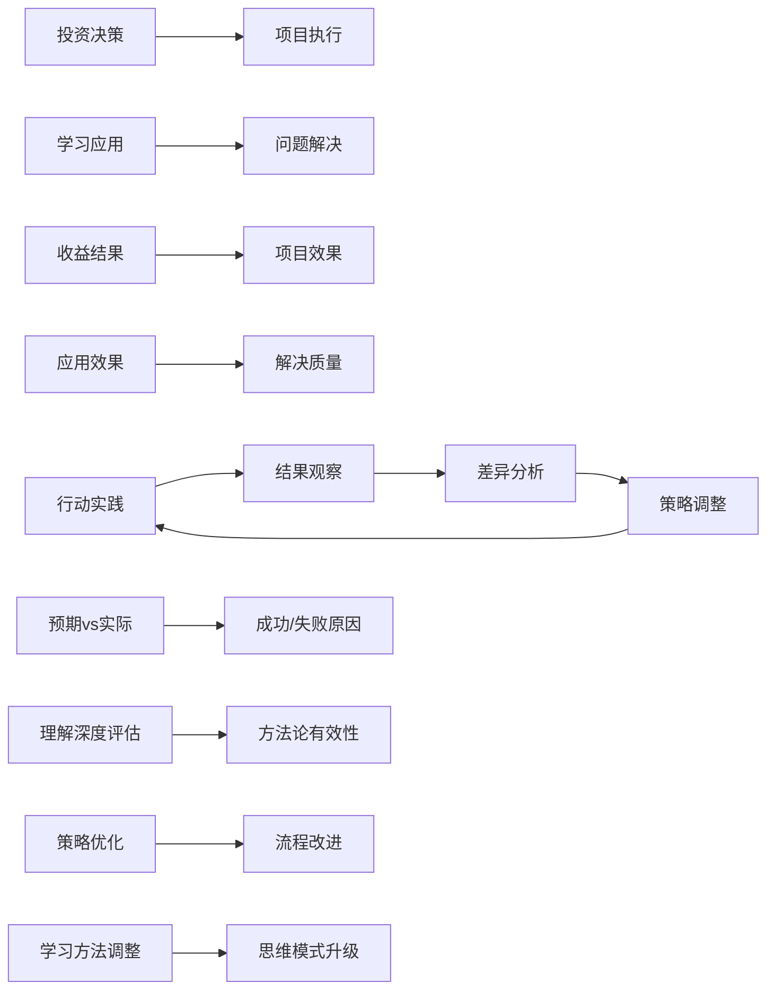

#### 投资领域的反思实践案例

**投资复盘的系统化方法**：

**第一阶段：数据收集与客观记录**
- **决策记录**：详细记录每次投资决策的理由、时机、预期
- **结果追踪**：客观记录实际结果，不受情绪影响
- **市场环境**：记录当时的市场条件和外部因素

**第二阶段：多维度差异分析**
- **预期vs实际**：分析预期与现实的差距及原因
- **时机判断**：评估进入和退出时机的准确性
- **风险管理**：检视风险控制措施的有效性

**第三阶段：深层原因挖掘**
- **认知偏差**：识别是否受到锚定效应、确认偏误等影响
- **情绪因素**：分析贪婪、恐惧等情绪对决策的干扰
- **知识缺口**：发现理解不足或信息缺失的领域

**第四阶段：系统性改进方案**
- **决策流程优化**：建立更科学的投资决策框架
- **知识补充**：针对性地学习缺失的专业知识
- **纪律建设**：强化投资纪律和风险控制

#### 项目管理的AAR反思模型

**After Action Review（行动后评估）**的标准化流程：

| 反思维度     | 核心问题                     | 分析方法     | 改进措施         |
| ------------ | ---------------------------- | ------------ | ---------------- |
| **目标达成** | 我们是否达成了预期目标？     | 结果对比分析 | 调整目标设定方法 |
| **过程执行** | 哪些做法是有效的？哪些无效？ | 过程效果评估 | 强化有效做法     |
| **问题识别** | 遇到了哪些意想不到的问题？   | 问题分类统计 | 建立预警机制     |
| **经验总结** | 我们学到了什么新东西？       | 知识提取整理 | 建立经验库       |
| **未来应用** | 下次如何做得更好？           | 改进方案制定 | 更新标准流程     |

#### 学习中的信息质量识别体系

**四类关键风险信息的识别与处理**：

**风险类型一：错误数据（Data Integrity Risk）**
- **识别特征**：数据来源不可靠、统计方法错误、计算偏差
- **验证方法**：交叉验证、权威数据源对比、逻辑一致性检查
- **处理策略**：立即剔除，重新寻找可靠数据源
- **预防措施**：建立可信信息源清单，培养数据敏感度

**风险类型二：逻辑漏洞（Logic Flaw Risk）**
- **识别特征**：片面论证、因果倒置、以偏概全、偷换概念
- **验证方法**：逻辑推理测试、反例验证、前提条件检查
- **处理策略**：重新构建论证框架，补充缺失环节
- **预防措施**：学习逻辑学基础，培养批判性思维

**风险类型三：过时知识（Knowledge Obsolescence Risk）**

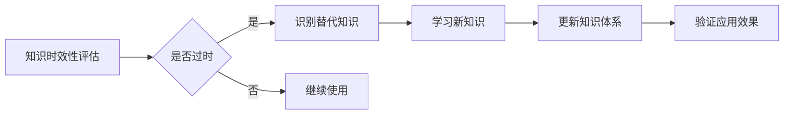

- **时效性判断标准**：
  - **基础理论**：一般具有较长生命周期（10年以上）
  - **应用技术**：更新周期较短（2-5年）
  - **市场数据**：快速变化（几个月到一年）
  - **法规政策**：突发性变化（即时生效）

**风险类型四：权威分歧（Authority Conflict Risk）**

**权威观点冲突的处理矩阵**：

| 冲突类型     | 处理策略         | 判断标准               | 应用建议             |
| ------------ | ---------------- | ---------------------- | -------------------- |
| **理论分歧** | 深入研究理论基础 | 逻辑严密性、实证支持   | 选择更合理的理论框架 |
| **经验分歧** | 分析背景差异     | 适用条件、时代背景     | 结合自身情况选择     |
| **数据分歧** | 验证数据来源     | 样本大小、统计方法     | 采用更可靠的数据     |
| **方法分歧** | 对比效果评估     | 实际应用效果、成本效益 | 选择适合自身的方法   |

#### 反思质量的评估标准

**高质量反思的五个维度**：

1. **深度性**：是否触及问题的根本原因，而非停留在表面现象
2. **系统性**：是否考虑了问题的多个方面和相互关系
3. **行动导向**：是否产生了具体的改进措施和行动计划
4. **可迁移性**：是否总结出了可复用的经验和模式
5. **持续性**：是否建立了长期改进的机制和文化

#### 反思工具与技术

**数字化反思工具的应用**：

- **反思日志模板**：标准化的反思记录格式
- **数据分析工具**：用于量化分析学习效果
- **思维导图软件**：可视化反思过程和结果
- **同伴反馈系统**：收集他人的观察和建议

通过建立科学的反思学习机制，我们可以将每一次的学习实践都转化为深度认知提升的机会，真正实现从经验到智慧的根本性转变。

### 4.2 争议话题学习与批判性思维培养

**争议话题是深度学习的催化剂**，它通过激发认知冲突和思维碰撞，推动学习者从被动接受转向主动建构，实现认知能力的质的飞跃。

#### 争议性学习的认知科学原理

**认知失调理论的应用**：当面对相互矛盾的观点时，大脑会产生认知失调状态，这种不适感会激发强烈的认知动机，促使我们重新审视和重构已有的认知结构。

1. **接触争议观点**：接触到与自己既有认知相矛盾的新观点或信息
2. **产生认知失调**：大脑出现不一致状态，产生心理不适感
3. **激发认知动机**：不适感驱动强烈的求知欲，渴望解决认知冲突
4. **信息搜集与分析**：主动寻找更多信息，深入分析不同观点的依据
5. **认知重构**：重新组织已有的认知结构，整合新旧知识
6. **形成新的理解**：建立更加全面、深入的知识认知框架
7. **认知能力提升**：通过这一过程实现批判性思维和深度理解能力的提升

#### 封闭式vs开放式问题的思维对比

**中美教育模式的深层差异分析**：

| 教育维度     | 封闭式模式（中国式） | 开放式模式（美国式） | 思维能力培养         |
| ------------ | -------------------- | -------------------- | -------------------- |
| **问题类型** | 标准答案问题         | 开放式问题           | 记忆 vs 创造         |
| **评价标准** | 对错分明             | 多元化评价           | 绝对思维 vs 相对思维 |
| **学习过程** | 接受-记忆-复现       | 质疑-探索-建构       | 被动吸收 vs 主动建构 |
| **师生关系** | 权威-服从            | 平等-对话            | 依赖 vs 独立         |
| **错误态度** | 避免犯错             | 允许试错             | 完美主义 vs 成长思维 |

#### 费曼式质疑学习法

**从知识到新知识的螺旋式上升循环**：

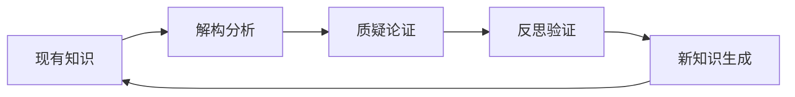


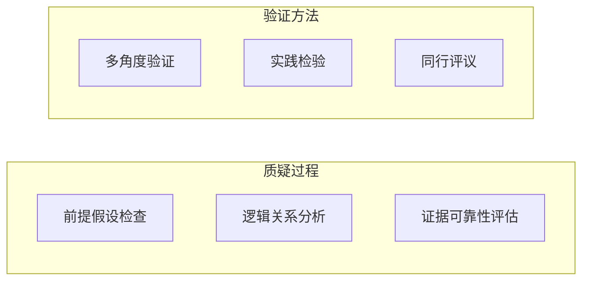

**费曼的质疑哲学**：
- **普遍怀疑**：不轻易相信任何既定结论，包括教科书内容
- **时间相对性**：认识到知识的时代性和局限性
- **证据优先**：以实证和逻辑作为判断标准，而非权威
- **开放心态**：随时准备接受更优秀的解释和理论

#### 多角度学习的交叉验证策略

**投资领域的跨学派对话**：

**价值投资 vs 量化投资的对话矩阵**：

| 对话维度     | 价值投资观点                   | 量化投资观点                 | 融合洞察                       |
| ------------ | ------------------------------ | ---------------------------- | ------------------------------ |
| **市场本质** | 市场短期是投票机，长期是称重机 | 市场行为存在统计规律，可预测 | 市场既有价值回归，也有统计特征 |
| **分析方法** | 基本面分析，定性判断           | 数据挖掘，定量模型           | 定性与定量相结合               |
| **风险管理** | 安全边际，分散投资             | 风险模型，动态调整           | 多层次风险管理体系             |
| **时间尺度** | 长期持有，穿越周期             | 多时间框架，短期交易         | 长短结合的灵活策略             |

**自上而下 vs 自下而下的协同效应**：

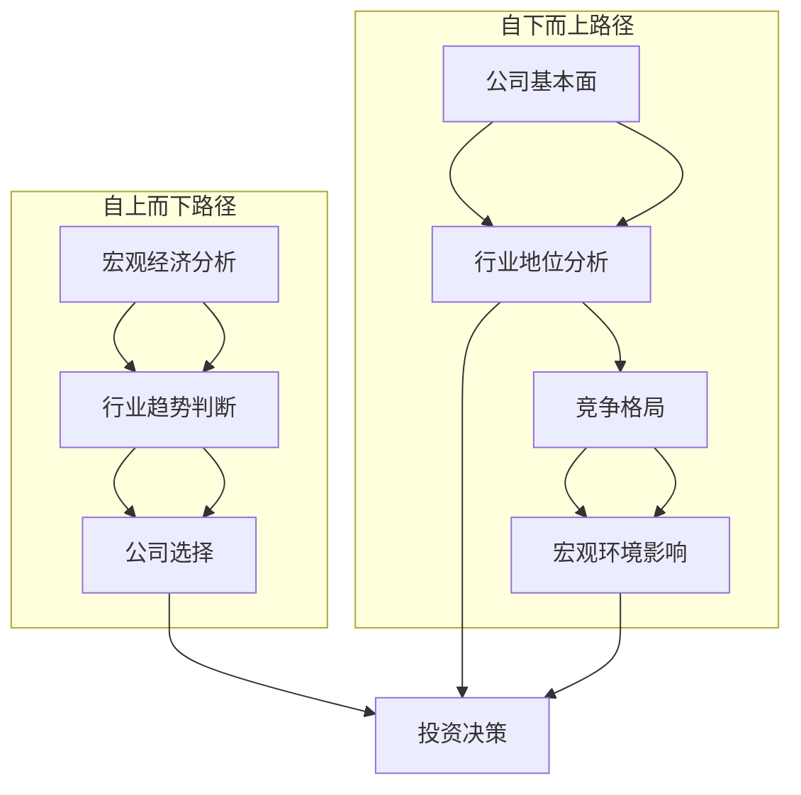

#### 批判性思维的五层修炼

**第一层：事实辨析能力**
- **数据可信度评估**：来源权威性、采集方法、样本代表性
- **信息完整性检查**：是否存在选择性呈现、信息遗漏
- **时间敏感性分析**：数据的时效性和更新频率

**第二层：逻辑推理能力**
- **论证结构分析**：识别前提、推理过程、结论
- **逻辑谬误检测**：以偏概全、因果倒置、虚假二分法等
- **假设识别**：发现隐藏的、未明说的假设条件

**第三层：多元视角能力**
- **利益相关者分析**：不同角色的立场和诉求
- **文化背景理解**：历史、文化、社会环境的影响
- **时空维度思考**：短期vs长期、局部vs全局的权衡

**第四层：系统思考能力**
- **相互联系识别**：发现要素间的复杂关系
- **动态变化理解**：系统的演化规律和趋势
- **反馈机制分析**：正反馈和负反馈的作用

**第五层：创造性整合能力**
- **对立统一**：在矛盾中寻找更高层次的统一
- **跨界融合**：不同领域知识的创造性组合
- **创新突破**：提出新的假设和解决方案

#### 争议话题的学习实践框架

**争议性话题的深度探索流程**：

**步骤一：争议点识别**
- 识别核心争议点：分歧的本质是什么？
- 分析争议类型：事实分歧、价值观分歧、方法论分歧
- 评估争议重要性：对学习目标的影响程度

**步骤二：多源信息收集**
- **正方观点**：收集支持性论据和证据
- **反方观点**：收集反对性论据和证据
- **中立分析**：寻找客观的第三方分析
- **历史背景**：了解争议的发展历程

**步骤三：批判性分析**

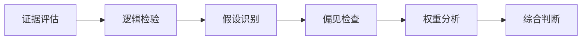

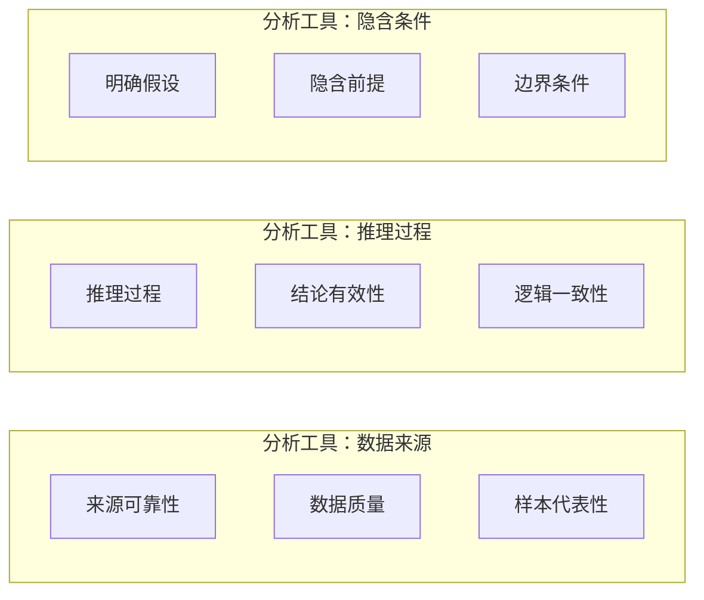

**步骤四：立场形成与表达**

- 基于分析形成个人观点
- 准备支持论据和反驳预案
- 学会有理有据地表达观点
- 保持开放心态，随时准备修正

#### 争议性学习的环境营造

**建设性争议的对话原则**：

| 对话原则     | 具体表现         | 避免行为             | 效果目标     |
| ------------ | ---------------- | -------------------- | ------------ |
| **尊重差异** | 认真倾听不同观点 | 轻视、嘲笑、打断     | 建立信任氛围 |
| **事实为基** | 用证据支持观点   | 情绪化表达、人身攻击 | 提高讨论质量 |
| **逻辑清晰** | 明确论证思路     | 模糊表达、偷换概念   | 促进深度思考 |
| **开放心态** | 愿意接受批评     | 固执己见、拒绝反思   | 实现共同成长 |
| **建设导向** | 寻求解决方案     | 纯粹否定、破坏性质疑 | 创造积极价值 |

通过系统性的争议话题学习，我们可以培养出真正的批判性思维能力，这不仅提升了学习效果，更为我们在复杂多变的现实世界中做出明智决策奠定了坚实基础。

### 4.3 学习留存率提升的科学策略

基于认知神经科学的研究，**学习留存率是衡量学习效果的核心指标**。不同学习方式的大脑激活程度和记忆编码深度存在显著差异，其中教学输出能达到90%以上的留存率，实现知识的真正内化和转化。

#### 认知负荷理论与学习效率优化

**认知负荷的三种类型及其管理**：

**1. 内在认知负荷（Intrinsic Load）**
- **定义**：学习内容本身固有的难度
- **影响因素**：概念复杂性、先验知识要求
- **优化策略**：分解复杂概念、循序渐进

**2. 外在认知负荷（Extraneous Load）**
- **定义**：由教学方式和呈现形式产生的负荷
- **影响因素**：信息组织方式、界面设计、教学形式
- **优化策略**：优化信息结构、减少无关干扰

**3. 相关认知负荷（Germane Load）**
- **定义**：用于构建新知识结构的认知资源
- **影响因素**：学习策略、元认知能力
- **优化策略**：促进深度思考、鼓励知识整合

#### 学习效率的时序优化策略

**焦虑水平与学习效率的倒U型关系**：

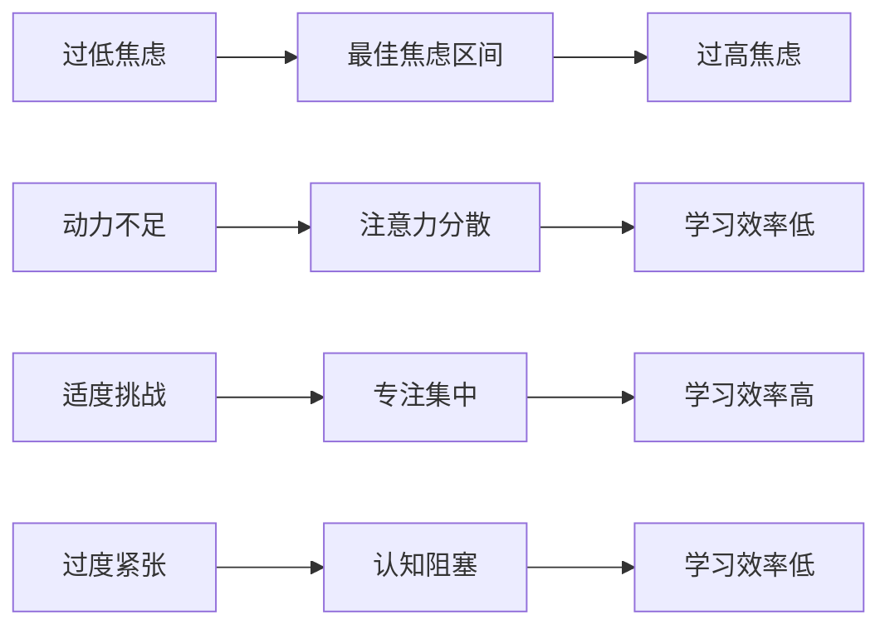

**常态学习vs突击学习的效果对比**：

| 学习方式     | 知识编码深度           | 记忆巩固效果     | 长期保持率 | 迁移应用能力 |
| ------------ | ---------------------- | ---------------- | ---------- | ------------ |
| **常态学习** | 深度、多层次的语义编码 | 充分的巩固和整合 | 60-80%     | 强           |
| **突击学习** | 浅层、单一的感觉编码   | 缺乏有效巩固     | 10-20%     | 弱           |
| **间隔重复** | 深度编码 + 强化巩固    | 最优的记忆巩固   | 80-90%     | 很强         |

#### 多模态学习的协同效应

**多感官通道的信息整合**：

**视觉-听觉-动觉的协同学习机制**：

```mermaid
graph TD
    A[视觉输入] --> D[多模态整合]
    B[听觉输入] --> D
    C[动觉输入] --> D
    D --> E[深度编码]
    E --> F[强记忆痕迹]
```

```mermaid
graph TD
    subgraph "处理过程"
        A1[文字识别] --> A2[视觉理解]
        B1[语音处理] --> B2[听觉理解]
        C1[动作执行] --> C2[肌肉记忆]
    end
```


**实践案例：费曼学习法的多模态应用**：

1. **阅读理解（视觉）**：阅读文字材料，理解基本概念
2. **录音复述（听觉）**：录下自己的讲解，回听评估
3. **动手练习（动觉）**：通过实际操作加深理解
4. **教学输出（多模态）**：向他人讲解，激活所有感官

#### 社会化学习对留存率的促进作用

**维果茨基社会建构理论的应用**：

**最近发展区（ZPD）的协作学习**：

| 学习阶段     | 独立水平       | 协作学习水平     | 潜在发展水平     |
| ------------ | -------------- | ---------------- | ---------------- |
| **初始阶段** | 能理解基本概念 | 在引导下深入分析 | 独立深度思考     |
| **发展阶段** | 能简单应用     | 在讨论中灵活应用 | 创造性综合应用   |
| **成熟阶段** | 能系统应用     | 在交流中优化方法 | 开创新的应用领域 |

**同伴学习的认知优势**：

- **认知重构**：向他人解释需要重新组织知识结构
- **多元视角**：不同背景的学习者提供多样化的观点
- **社会动机**：同伴关系提供了学习的内在动力
- **即时反馈**：能够及时获得理解程度的反馈

#### 学习效果的最大化策略组合

**学习金字塔的实践应用指南**：

**90%留存率的实现路径**：

```mermaid
graph TD
    A[被动学习] --> B[主动学习]
    B --> C[互动学习]
    C --> D[输出学习]

    A1[听讲5%] --> A2[阅读10%]
    B1[视听20%] --> B2[讨论50%]
    C1[实践75%] --> C2[教学90%]

    D1[知识内化] --> D2[能力提升] --> D3[智慧生成]
```

**具体实施策略**：

**阶段一：建立基础（10-20%留存率）**
- 预习材料，建立基本认知框架
- 主动阅读，标记关键概念和疑问
- 初步理解，形成第一印象

**阶段二：深化理解（50%留存率）**
- 参与讨论，交流不同观点和理解
- 提出问题，通过辩论澄清模糊概念
- 连接已有知识，建立意义关联

**阶段三：实践应用（75%留存率）**
- 案例分析，将理论应用于具体情境
- 模拟训练，在实践中检验理解程度
- 问题解决，运用所学知识解决实际问题

**阶段四：教学输出（90%+留存率）**
- 准备教学材料，系统梳理知识结构
- 向他人讲解，用简单语言解释复杂概念
- 回答提问，应对挑战性质疑和问题
- 评估反馈，根据反馈进一步完善理解

通过这种系统化的多模态学习策略，我们可以将学习留存率从传统的10%左右提升到90%以上，实现真正意义上的深度学习和知识内化。这不仅提高了学习效率，更为终身学习能力的培养奠定了坚实基础。

### 4.4 碎片化信息时代的系统化学习策略

**信息过载时代的核心挑战是从海量信息中构建知识体系**，需要通过系统化的学习策略避免知识的碎片化和表面化。

#### 碎片化学习的认知陷阱

**信息过载与选择困难的恶性循环**：

```mermaid
graph TD
    A[信息爆炸] --> B[选择焦虑]
    B --> C[浅层浏览]
    C --> D[知识碎片化]
    D --> E[理解不深]
    E --> F[应用困难]
    F --> G[学习焦虑]
    G --> A

    H[系统化学习] --> I[知识整合]
    I --> J[深度理解]
    J --> K[灵活应用]
    K --> L[学习成就感]
    L --> H
```

**费曼的"大海中的鱼"比喻**：
现代学习者就像从鱼缸被放入大海的鱼，虽然有无穷无尽的食物（信息），但却因为选择困难而饿死。这个比喻深刻揭示了信息时代的学习困境。

#### 学习产出比的量化评估

**ROI（Return on Investment）学习模型**：

| 投入要素     | 量化指标   | 产出要素     | 量化指标     | ROI计算       |
| ------------ | ---------- | ------------ | ------------ | ------------- |
| **时间投入** | 学习小时数 | **知识获取** | 理解概念数量 | 概念/小时     |
| **精力投入** | 专注度评分 | **技能提升** | 应用能力等级 | 等级/专注度   |
| **财务投入** | 学习费用   | **机会价值** | 实际收益     | 收益/费用     |
| **机会成本** | 放弃的价值 | **长期影响** | 职业发展     | 影响指数/成本 |

**高效学习的产出特征**：
- **高密度**：单位时间内获得的知识量
- **高深度**：知识的理解程度和应用能力
- **高关联**：新知识与已有知识网络的连接度
- **高迁移**：知识在不同情境下的应用能力

#### 填鸭式学习的神经科学分析

**短期记忆vs长期记忆的神经机制**：

**填鸭式学习的问题**：
- **海马体过载**：短时间内大量信息涌入，超出处理能力
- **LTP缺乏**：缺乏长期增强效应，记忆痕迹微弱
- **睡眠整合不足**：没有充分时间进行记忆巩固
- **语义网络缺失**：新知识无法与已有知识建立有效连接

**科学学习的记忆巩固机制**：

```mermaid
graph LR
    A[编码阶段] --> B[巩固阶段]
    B --> C[提取阶段]
    C --> D[再巩固阶段]
    D --> E[长期存储]
```

### 4.5 知识简化的科学方法与实践技巧

**知识简化是将复杂信息转化为可理解、可应用、可传播的形式的过程**，这是费曼学习法的核心能力。

#### 知识简化的认知机制

**抽象层次理论与知识压缩**：

| 简化层次   | 处理方式     | 认知要求   | 产出特征   | 应用场景 |
| ---------- | ------------ | ---------- | ---------- | -------- |
| **数据层** | 去除冗余信息 | 选择性注意 | 关键数据点 | 快速参考 |
| **信息层** | 识别核心模式 | 模式识别   | 结构化信息 | 学习理解 |
| **知识层** | 建立概念联系 | 概念化理解 | 体系化知识 | 深度学习 |
| **智慧层** | 提炼基本原则 | 元认知思考 | 原理性指导 | 决策应用 |

#### 费曼知识简化四步法

**第一步：知识分解（Decomposition）**
- **目标**：将复杂知识拆解为基础组件
- **方法**：
  - 识别核心概念和关键术语
  - 分析概念间的逻辑关系
  - 发现知识的基本构成要素
- **产出**：概念清单和关系图

**第二步：结构重组（Reorganization）**
- **目标**：按照逻辑关系重新组织知识结构
- **方法**：
  - 建立层次化的知识框架
  - 识别因果链条和逻辑流程
  - 构建概念间的网络关系
- **产出**：思维导图或概念图

**第三步：简化表达（Simplification）**
- **目标**：用简单的语言和类比解释复杂概念
- **方法**：
  - 寻找生活中的类比和隐喻
  - 使用简洁明确的表述
  - 避免专业术语或进行解释
- **产出**：通俗易懂的解释

**第四步：验证反馈（Verification）**
- **目标**：验证简化的准确性和有效性
- **方法**：
  - 向非专业人士讲解
  - 收集反馈和疑问
  - 根据反馈进一步完善
- **产出**：经过验证的简化版本

#### 商业模式简化的投资实践

**投资领域的"一句话测试"**：

**优秀商业模式的简化特征**：
- **价值主张清晰**：明确解决什么问题
- **盈利模式简单**：清楚如何赚钱
- **可扩展性强**：能够快速复制和放大
- **护城河深厚**：具有可持续竞争优势

**商业模式简化的实践框架**：

1. **复杂商业模式分析**：深入分析原有商业模式的所有组成部分和运作机制
2. **核心价值识别**：明确商业模式为客户解决的核心问题和创造的核心价值
3. **盈利机制梳理**：梳理清楚收入的来源、成本结构和利润产生方式
4. **关键成功因素**：识别商业模式成功运行的关键要素和核心竞争力
5. **一句话表达**：用简洁明了的语言概括商业模式的本质和优势
6. **投资人验证**：向潜在投资者或利益相关者讲解，验证理解深度
7. **模式简化完成**：最终形成清晰、易懂、有说服力的商业模式表述

**其中的简化标准如下 **

1. **谁：目标客户** - 明确商业模式的核心服务对象是谁
2. **什么：提供价值** - 明确为客户提供什么具体的产品或服务价值
3. **如何：实现方式** - 明确通过什么方式实现价值的创造和传递
4. **为什么：核心优势** - 明确为什么这个商业模式能够成功并持续发展

### 4.6 知识内化与实践应用的完整闭环

**知识内化是学习者将外部信息转化为内部认知结构的过程**，而实践应用则是检验和强化内化效果的关键环节。

#### 知识内化的神经机制

**记忆巩固的多阶段理论**：

```mermaid
graph LR
    A[初始学习] --> B[短期记忆]
    B --> C[工作记忆]
    C --> D[长期记忆]
    D --> E[知识内化]
```

#### 实践驱动学习（PBL）的系统化应用

**问题导向学习的实施框架**：

| 学习阶段     | 核心任务     | 认知过程   | 实践活动           | 评估标准             |
| ------------ | ------------ | ---------- | ------------------ | -------------------- |
| **问题识别** | 发现真实问题 | 情境感知   | 实地调研、访谈     | 问题的真实性和重要性 |
| **知识构建** | 搜集相关信息 | 信息整合   | 资料研究、专家咨询 | 知识的完整性和相关性 |
| **方案设计** | 制定解决方案 | 创造性思维 | 头脑风暴、原型制作 | 方案的创新性和可行性 |
| **实践验证** | 实施解决方案 | 执行监控   | 小规模实验、试点   | 实施效果和过程质量   |
| **反思改进** | 总结经验教训 | 元认知反思 | 复盘总结、文档化   | 经验的可迁移性       |

#### 知识吸收能力的差异化培养

**个体差异的识别与适应**：

**学习风格与知识吸收效率的关系**：

| 学习风格   | 优势领域   | 知识吸收特点     | 优化策略           | 适合的学习环境 |
| ---------- | ---------- | ---------------- | ------------------ | -------------- |
| **视觉型** | 图表、图像 | 空间关系理解强   | 大量使用视觉化工具 | 图文并茂的环境 |
| **听觉型** | 讨论、讲解 | 语言信息处理快   | 增加听讲和讨论     | 互动交流的环境 |
| **阅读型** | 文字、书籍 | 文字信息吸收快   | 提供阅读材料       | 安静阅读的环境 |
| **动觉型** | 实践、操作 | 体验式学习效果好 | 增加实践机会       | 动手操作的环境 |

#### 职业驱动的知识内化模式

**行业环境对学习的推动作用**：

**高学习成长行业的特征**：
- **快速变化**：技术和知识更新频繁
- **复杂问题**：需要多学科知识解决
- **协作文化**：重视知识分享和团队学习
- **容错环境**：允许试错和创新实验

**被动学习的主动转化策略**：

```mermaid
graph LR
    A[被动接受工作] --> B[观察学习机会]
    B --> C[主动提问思考]
    C --> D[记录学习心得]
    D --> E[分享交流验证]
    E --> F[实践应用固化]
    F --> G[知识内化完成]
```


```mermaid
graph LR
    subgraph "转化工具"
        B1[标杆学习]
        B2[最佳实践观察]

        C1[深度思考]
        C2[批判性分析]

        D1[学习日志]
        D2[知识图谱]

        E1[同伴讨论]
        E2[导师指导]
    end
```

#### 终身学习能力的构建

**学习生态系统的发展**：

**个人学习系统的组成要素**：

1. **输入系统**：信息筛选和获取机制
2. **处理系统**：知识整理和内化方法
3. **输出系统**：知识表达和应用渠道
4. **反馈系统**：效果评估和改进机制
5. **更新系统**：知识刷新和结构优化

通过构建完整的知识内化和实践应用闭环，我们可以将每一次学习都转化为能力的提升和智慧的增长，真正实现学习型人生的构建。这种系统化的学习方式不仅提高了学习效率，更为我们在快速变化的时代中保持竞争力提供了坚实基础。

## 5. 费曼学习法的实践应用与终身学习

经过前面四个章节的系统学习，我们已经全面掌握了费曼学习法的理论基础和核心方法。本章将把这些理论知识转化为具体的实践流程，并探讨如何将费曼学习法融入终身学习体系，实现持续的个人成长。

### 5.1 费曼学习法十大实践流程详解

**费曼学习法的实践精髓体现在一套完整的十步操作流程中**，这一流程从兴趣激发到实践验证，构建了从感性认识到理性应用的完整学习闭环，为学习者提供了清晰的行动指南。

#### 十步流程的整体架构设计

**费曼学习法的螺旋式上升模型**：

```mermaid
graph TD
    A[兴趣驱动] --> B[单点突破]
    B --> C[即时记录]
    C --> D[复述验证]
    D --> E[分享输出]
    E --> F[应用预设]
    F --> G[结构整合]
    G --> H[教学输出]
    H --> I[反馈修正]
    I --> J[实践验证]
    J --> K[新兴趣点]
    K --> A
```

#### 第一阶段：学习启动与基础构建

**步骤1：兴趣驱动——内在动机的激发**

**兴趣的科学原理**：
- **多巴胺奖励机制**：兴趣激活大脑的奖励系统，产生愉悦感
- **注意力聚焦效应**：兴趣资源使注意力资源更加集中和持久
- **记忆编码优化**：情绪化的学习体验增强记忆编码深度

**兴趣发现的实践方法**：

| 发现途径       | 具体做法                   | 效果特征         | 适用人群       |
| -------------- | -------------------------- | ---------------- | -------------- |
| **好奇心追踪** | 记录日常疑问和探索欲望     | 天然、持久、强烈 | 好奇心强的人   |
| **成就感反馈** | 关注能带来满足感的活动     | 正反馈、易坚持   | 目标导向的人   |
| **价值连接**   | 寻找与个人价值观相关的领域 | 意义感强、动力足 | 价值观明确的人 |
| **社交影响**   | 受榜样或同伴影响产生兴趣   | 群体驱动、易模仿 | 社交性强的人   |

**步骤2：由点及面——突破点的战略选择**

**突破点选择的决策矩阵**：

| 评估维度     | 权重 | 评分标准（1-10分）               | 计算方法       | 选择标准     |
| ------------ | ---- | -------------------------------- | -------------- | ------------ |
| **兴趣强度** | 30%  | 5-10分 passionate, 1-4分 mild    | 兴趣×0.3       | ≥7分优先     |
| **难易程度** | 25%  | 1-3分容易, 4-7分适中, 8-10分困难 | (11-难度)×0.25 | 适中难度优先 |
| **实用性**   | 20%  | 1-10分按实用程度递增             | 实用性×0.2     | ≥6分优先     |
| **扩展性**   | 15%  | 1-10分按扩展潜力递增             | 扩展性×0.15    | ≥6分优先     |
| **资源可得** | 10%  | 1-10分按资源丰富度递增           | 资源×0.1       | ≥6分优先     |

**步骤3：随时记录——知识捕获的系统化**

**多维度记录系统**：

**记录内容分类**：
1. **概念记录**：新概念、专业术语、核心观点
2. **疑问记录**：不理解的地方、矛盾的观点
3. **联想记录**：与已知知识的联系、应用场景
4. **感悟记录**：个人见解、情感反应、启发思考
5. **方法论记录**：学习方法、思考技巧、工作流程

**数字化记录工具的应用**：

```mermaid
graph LR
    A[即时输入] --> B[结构化存储]
    B --> C[智能检索]
    C --> D[关联分析]
    D --> E[知识输出]
```


```mermaid
graph LR
    subgraph "输入工具"
        A1[语音记录]
        A2[文字记录]
        A3[图像记录]
        A4[视频记录]
    end

    subgraph "存储平台"
        B1[云笔记]
        B2[知识库]
        B3[标签系统]
        B4[分类体系]
    end
```

#### 第二阶段：深度理解与表达练习

**步骤4：章节复述——理解深度的检验**

**复述质量评估的五级标准**：

| 复述等级         | 表现特征       | 理解深度 | 记忆效果 | 应用能力 |
| ---------------- | -------------- | -------- | -------- | -------- |
| **一级（复现）** | 能重复原文内容 | 表面理解 | 短期记忆 | 无法应用 |
| **二级（解释）** | 能解释概念含义 | 初步理解 | 中期记忆 | 有限应用 |
| **三级（举例）** | 能举出具体例子 | 深度理解 | 长期记忆 | 灵活应用 |
| **四级（联系）** | 能联系其他知识 | 系统理解 | 深层记忆 | 迁移应用 |
| **五级（创造）** | 能提出新观点   | 创造理解 | 内化记忆 | 创新应用 |

**步骤5：分享输出——表达能力的锻炼**

**分享内容的黄金结构**：

```mermaid
graph TD
    A[引子] --> B[核心观点]
    B --> C[支撑论证]
    C --> D[实例说明]
    D --> E[总结升华]

    A1[问题引入] --> A
    A2[故事开场] --> A
    A3[数据震撼] --> A

    B1[一句话概括] --> B
    B2[关键信息] --> B
    B3[价值主张] --> B

    C1[逻辑链条] --> C
    C2[数据支撑] --> C
    C3[对比分析] --> C
```

**100字分享的精炼技巧**：
- **标题吸引**：使用疑问句、数字、对比等方式
- **观点鲜明**：一句话明确核心观点
- **论据精简**：选择最有说服力的1-2个论据
- **结尾有力**：呼吁行动或引发思考

**步骤6：应用思考——情境预设的技巧**

**应用场景树的设计方法**：

```mermaid
graph LR
    A[核心知识] --> B[直接应用场景]
    A --> C[间接应用场景]
    A --> D[创新应用场景]

    B --> B1[工作场景]
    B --> B2[学习场景]
    B --> B3[生活场景]

    C --> C1[类比迁移]
    C --> C2[方法论借鉴]
    C --> C3[思维模式应用]

    D --> D1[跨界融合]
    D --> D2[问题重构]
    D --> D3[新的解决方案]
```

#### 第三阶段：系统整合与教学输出

**步骤7：思维导图——知识结构的可视化**

**思维导图的层次化设计**：

| 导图层次     | 内容要素   | 视觉设计           | 功能作用     |
| ------------ | ---------- | ------------------ | ------------ |
| **中心主题** | 核心概念   | 大字体、中心位置   | 确立学习焦点 |
| **一级分支** | 主要模块   | 粗线条、不同颜色   | 构建知识框架 |
| **二级分支** | 具体内容   | 细线条、相关图标   | 详细知识要点 |
| **三级分支** | 细节信息   | 最细线条、简洁文字 | 补充说明材料 |
| **关联线**   | 跨分支联系 | 虚线、箭头表示     | 建立知识连接 |

**步骤8：第二次复述——教学输出的准备**

**教学对象的选择策略**：

| 对象类型         | 选择标准           | 交流方式               | 预期效果             |
| ---------------- | ------------------ | ---------------------- | -------------------- |
| **初学者**       | 完全不了解该领域   | 最简单的语言、大量类比 | 检验基础知识掌握     |
| **同级别学习者** | 有一定了解但不深入 | 讨论式、互动式交流     | 相互启发、共同提升   |
| **专家级**       | 深度了解该领域     | 深入探讨、质疑挑战     | 检验理解深度和创新性 |
| **跨界人士**     | 不同领域背景       | 跨界应用、类比思考     | 发现新的应用可能     |

#### 第四阶段：反馈完善与实践验证

**步骤9：查漏补缺——知识体系的完善**

**反馈处理的四步法**：

```mermaid
graph TD
    A[收集反馈] --> B[分类分析]
    B --> C[优先级排序]
    C --> D[制定改进计划]
    D --> E[实施完善]

    A1[理解性反馈] --> A
    A2[结构性反馈] --> A
    A3[应用性反馈] --> A
    A4[创新性反馈] --> A

    B1[频次统计] --> B
    B2[重要性评估] --> B
    B3[可行性分析] --> B
```

**步骤10：实践应用——知识价值的实现**

**实践验证的风险管理**：

| 风险等级     | 定义特征           | 应对策略             | 成果评估     |
| ------------ | ------------------ | -------------------- | ------------ |
| **低风险**   | 成本低、可逆性强   | 大胆尝试、快速迭代   | 关注学习收获 |
| **中风险**   | 中等成本、部分可逆 | 小规模试点、分步推进 | 成本收益分析 |
| **高风险**   | 高成本、不可逆     | 充分准备、专家咨询   | 全面风险评估 |
| **极高风险** | 可能造成重大损失   | 慎重考虑、延迟实施   | 是否执行决策 |

#### 十步流程的个性化定制

**不同学习者的流程调整**：

**学生群体的优化方案**：
- 强化步骤1：结合课程要求寻找兴趣点
- 优化步骤4：增加练习题和考试模拟
- 突出步骤8：组织学习小组和讨论会
- 重视步骤10：结合课程项目进行实践

**职场人士的优化方案**：
- 聚焦步骤2：选择与工作相关的突破点
- 强化步骤6：重点预设工作应用场景
- 优化步骤9：寻求同事和专家的反馈
- 突出步骤10：直接应用于实际工作

**创业者的优化方案**：
- 强化步骤1：基于市场需求和机会寻找学习方向
- 优化步骤3：建立商业模式的记录系统
- 突出步骤5：通过产品或服务验证学习效果
- 重视步骤10：将学习成果转化为商业价值

通过系统化的十步实践流程，费曼学习法从抽象的理论转化为可操作的实践指南，为学习者提供了清晰的学习路径和有效的行动指南。这种结构化的方法不仅提高了学习效率，更重要的是培养了学习者的自主学习能力和终身学习习惯。

### 5.2 学习心态优化与思维模式培养

**学习心态是决定学习效果的根本因素**，通过培养绿灯思维和成长型思维，可以显著提升学习效率和学习质量。

#### 双色灯思维的神经机制

**思维模式对学习的影响机制**：

```mermaid
graph TD
    A[信息输入] --> B{思维模式}
    B -->|红灯思维| C[防御机制]
    B -->|绿灯思维| D[开放机制]

    C --> C1[选择性过滤]
    C1 --> C2[认知固化]
    C2 --> C3[学习停滞]

    D --> D1[全面接收]
    D1 --> D2[认知重构]
    D2 --> D3[持续成长]
```

**红灯思维的表现特征**：
- **防御性反应**：遇到不同观点时立即产生抵触情绪
- **确认偏误**：只寻找支持自己观点的证据
- **权威依赖**：过分依赖既有知识和权威观点
- **封闭性学习**：拒绝接受新信息和新方法

**绿灯思维的培养策略**：

| 培养维度     | 具体做法             | 实践技巧               | 预期效果       |
| ------------ | -------------------- | ---------------------- | -------------- |
| **认知层面** | 认识思维的局限性     | 定期反思自己的思维模式 | 提高元认知能力 |
| **情绪层面** | 管理学习中的负面情绪 | 深呼吸、正念练习       | 减少防御性反应 |
| **行为层面** | 主动接触不同观点     | 多与不同背景的人交流   | 扩大认知边界   |
| **习惯层面** | 建立开放学习习惯     | 每天接触新领域知识     | 形成长期优势   |

#### 成长型思维vs固定型思维

**德韦克思维理论的深度应用**：

**固定型思维模式**：
- **信念**：认为能力是天生的、固定的
- **行为**：避免挑战、害怕失败、轻易放弃
- **结果**：学习停滞、潜力受限、成长缓慢

**成长型思维模式**：
- **信念**：认为能力可以通过努力提升
- **行为**：拥抱挑战、从失败中学习、坚持不懈
- **结果**：持续进步、潜力发挥、快速成长

**思维模式转换的四步法**：

```mermaid
graph LR
    A[识别思维模式] --> B[挑战固定思维]
    B --> C[重构思维框架]
    C --> D[实践成长思维]
    D --> E[形成新习惯]
```


```mermaid
graph LR
    subgraph "挑战策略"
        B1[质疑固有信念]
        B2[寻找相反证据]
        B3[分析成长可能性]
    end

    subgraph "重构方法"
        C1[积极语言转换]
        C2[努力价值强调]
        C3[过程导向思维]
    end
```

#### 纵向拓展学习的系统化策略

**兴趣导向的拓展学习模型**：

**第一步：兴趣识别**
- **发现触发点**：在学习过程中发现特别感兴趣的知识点
- **深度挖掘**：围绕兴趣点进行深度探索
- **关联分析**：寻找兴趣点与学习目标的关系

**第二步：拓展路径设计**

```mermaid
graph LR
    A[核心兴趣点] --> B[直接拓展]
    A --> C[间接拓展]
    A --> D[交叉拓展]

    B --> B1[深度挖掘]
    B --> B2[历史脉络]
    B --> B3[前沿发展]

    C --> C1[应用领域]
    C --> C2[相关学科]
    C --> C3[实践案例]

    D --> D1[跨学科融合]
    D --> D2[方法论迁移]
    D --> D3[创新应用]
```

**第三步：学习资源整合**
- **知识网络构建**：建立兴趣点与相关知识的连接
- **学习资源搜集**：收集相关的书籍、课程、专家
- **学习计划制定**：设计系统的拓展学习路径

### 5.3 学习体系构建与知识管理

**系统化的学习体系是终身学习的基础设施**，它通过结构化的知识管理和高效的学习流程，实现知识的持续积累和应用。

#### 费曼五步学习体系的深度解析

**第一步：笔记记录系统**

**科学笔记的HEADING原则**：

| 原则              | 具体要求   | 实践方法               | 效果提升     |
| ----------------- | ---------- | ---------------------- | ------------ |
| **H (Hierarchy)** | 层次化结构 | 使用标题、列表、缩进   | 信息组织清晰 |
| **E (Essential)** | 精要提炼   | 抓住核心观点和关键概念 | 记忆负担减轻 |
| **A (Active)**    | 主动记录   | 用自己的话重新表述     | 深度理解增强 |
| **D (Diagram)**   | 图表化     | 使用思维导图、流程图   | 视觉记忆强化 |
| **I (Indexed)**   | 索引化     | 建立标签和分类系统     | 检索效率提升 |
| **N (Narrative)** | 故事化     | 加入个人感悟和应用场景 | 情感连接增强 |
| **G (Growth)**    | 成长性     | 预留更新和扩展空间     | 知识动态发展 |

**第二步：知识筛选与整理**

**信息过滤的ABC方法**：

1. **信息输入**
2. **相关性过滤**：与目标相关；重要性
3. **可靠性过滤**：来源权威性；证据充分性
4. **实用性过滤**：应用价值；可操作性
5. **时效性过滤**：信息新鲜度；发展趋势
6. **知识入库**

**第三步：结构化归纳与个人见解形成**

**知识结构化的五个层次**：

| 层次       | 处理方式   | 认知目标 | 产出特征       | 应用价值   |
| ---------- | ---------- | -------- | -------------- | ---------- |
| **数据层** | 去重、排序 | 信息整理 | 清晰的数据列表 | 快速参考   |
| **信息层** | 分类、关联 | 理解关系 | 结构化信息网络 | 系统认知   |
| **知识层** | 提炼、整合 | 深度理解 | 概念化知识体系 | 问题分析   |
| **智慧层** | 抽象、升华 | 创新应用 | 原理性指导框架 | 决策支持   |
| **见解层** | 质疑、创新 | 个人创造 | 独特观点和方法 | 差异化优势 |

**第四步：输出发布的质量标准**

**优质输出的五个维度**：

1. **简洁性**：用最少文字传达核心信息
2. **准确性**：确保信息正确无误
3. **深度性**：提供有价值的洞察和观点
4. **独特性**：体现个人特色和原创思考
5. **实用性**：对读者有实际应用价值

**第五步：简化记忆与应用预设**

**知识简化的SIR模型**：

```mermaid
graph LR
    A[知识输入] --> B[简化 Simplify]
    B --> C[想象 Imagine]
    C --> D[关联 Relate]
    D --> E[应用 Apply]

    B1[抓住核心] --> B
    B2[删除冗余] --> B
    B3[类比说明] --> B

    C1[应用场景] --> C
    C2[使用时机] --> C
    C3[可能效果] --> C

    D1[现有知识] --> D
    D2[个人经历] --> D
    D3[未来规划] --> D
```

#### 学习目标的三个层次

**从解释到预测的认知升级**：

| 层次       | 核心能力     | 学习特征         | 应用场景           | 评价标准           |
| ---------- | ------------ | ---------------- | ------------------ | ------------------ |
| **解释层** | 现象分析能力 | 理解已有知识     | 复盘分析、问题诊断 | 能清楚说明"为什么" |
| **解决层** | 问题解决能力 | 应用知识解决问题 | 实际工作、项目管理 | 能有效解决"怎么办" |
| **预测层** | 趋势预判能力 | 基于规律推断趋势 | 战略规划、投资决策 | 能准确预测"会怎样" |

#### 个人学习系统的构建

**数字时代的学习生态系统**：

**系统架构的六大模块**：

1. **输入模块**
   - 信息源管理：RSS订阅、专业网站、专家追踪
   - 内容筛选：智能算法 + 人工筛选
   - 质量评估：可信度、权威性、时效性判断

2. **处理模块**
   - 知识整理：自动分类、标签化、关联
   - 深度理解：概念解析、逻辑分析、价值评估
   - 创新思考：跨界联想、问题重构、方案创新

3. **存储模块**
   - 结构化存储：知识库、数据库、文档系统
   - 智能检索：全文搜索、语义搜索、关联推荐
   - 版本管理：知识更新、历史记录、变更追踪

4. **输出模块**
   - 内容创作：写作、演讲、视频制作
   - 知识分享：社交媒体、专业平台、内部培训
   - 价值转化：咨询服务、产品开发、商业应用

5. **反馈模块**
   - 效果评估：学习成果、应用效果、影响力
   - 质量改进：用户反馈、同行评议、专家指导
   - 系统优化：流程改进、工具升级、方法更新

6. **更新模块**
   - 知识刷新：定期更新、持续学习、前沿跟踪
   - 能力提升：技能训练、思维升级、视野拓展
   - 系统迭代：架构优化、功能增强、体验改善

通过构建完整的个人学习系统，我们可以将费曼学习法从单一的技巧升级为可持续的终身学习体系，实现知识的系统化管理、高效学习和价值转化。这不仅提高了个人竞争力，更为适应快速变化的时代提供了强大的学习基础设施。

### 5.4 自我效能理论与学习动力激发

**自我效能感是驱动学习的核心心理因素**，通过科学的方法建立和增强自我效能感，可以形成强大的学习动力和持续的学习行为。

#### 自我效能感的形成机制

**班杜拉自我效能理论的四个信息来源**：

**成功经验**：个体亲身经历的成功体验，通过设置渐进式目标、积累小成功来强化。

**替代经验**：观察他人成功获得的经验，通过寻找合适榜样、学习成功案例来获得。

**言语说服**：来自他人的鼓励和支持，通过寻求导师指导、建立支持网络来增强。

**生理和情绪状态**：个体的身心状态对效能判断的影响，通过情绪管理、压力调节来优化。

#### 马太效应在学习中的表现

**学习优势的累积效应模型**：

```mermaid
graph TD
    A[初始优势] --> B[成功体验]
    B --> C[自我效能提升]
    C --> D[学习动机增强]
    D --> E[努力程度增加]
    E --> F[学习成果提高]
    F --> A

    G[初始劣势] --> H[失败体验]
    H --> I[自我效能降低]
    I --> J[学习动机减弱]
    J --> K[努力程度下降]
    K --> L[学习成果降低]
    L --> G
```

**打破负向循环的策略**：

1. **冷启动策略**
   - 选择相对容易的切入点
   - 设置可实现的小目标
   - 通过快速成功建立信心

2. **外部支持策略**
   - 寻求专业指导和帮助
   - 加入学习社群获得支持
   - 利用外部资源弥补不足

3. **归因重塑策略**
   - 将失败归因于努力不够而非能力不足
   - 将成功归因于能力和努力的结合
   - 建立成长型思维模式

4. **环境优化策略**
   - 创造有利于学习的环境
   - 减少负面影响因素
   - 增加正面激励因素

#### 第三次复述的热情创造机制

**从被动学习到主动创造的转变**：

**热情激发的三个层次**：

| 层次         | 特征表现           | 驱动因素         | 行为模式           | 效果评价 |
| ------------ | ------------------ | ---------------- | ------------------ | -------- |
| **兴趣层次** | 对学习内容感兴趣   | 好奇心、求知欲   | 主动探索、深入挖掘 | 积极参与 |
| **激情层次** | 对学习充满热情     | 成就感、价值感   | 全情投入、享受过程 | 深度沉浸 |
| **创造层次** | 激发创造力和想象力 | 使命感、自我实现 | 创新应用、价值创造 | 变革影响 |

**热情创造的实践路径**：

**第一步：发现个人学习风格**
- **视觉型**：通过图像、图表激发学习热情
- **听觉型**：通过讨论、讲解保持学习兴趣
- **动觉型**：通过实践、操作增强学习动力
- **阅读型**：通过深度阅读获得学习满足

**第二步：建立学习与价值的连接**
- **职业价值**：学习与职业发展的直接关联
- **个人成长**：学习对个人能力提升的作用
- **社会贡献**：学习对解决社会问题的意义
- **创新创造**：学习对新想法产生的促进作用

**第三步：创造学习仪式和习惯**
- **固定时间**：建立规律的学习时间安排
- **专门空间**：创造舒适的学习环境
- **学习仪式**：形成开始学习的特定习惯
- **奖励机制**：设置学习成就的奖励系统

### 5.5 知识焦虑时代的系统性解决方案

**知识焦虑是信息时代的普遍现象**，通过系统化的学习策略，可以将焦虑转化为学习的动力，实现从信息过载到知识掌控的转变。

#### 知识焦虑的根源分析

**信息过载的认知机制**：

```mermaid
graph TD
    A[信息爆炸] --> B[注意力分散]
    B --> C[学习浅层化]
    C --> D[知识碎片化]
    D --> E[应用困难]
    E --> F[学习焦虑]
    F --> G[学习效率下降]
    G --> H[更多学习需求]
    H --> A

    I[系统化学习] --> J[注意力聚焦]
    J --> K[深度学习]
    K --> L[知识整合]
    L --> M[灵活应用]
    M --> N[学习成就感]
    N --> O[学习动力增强]
    O --> I
```

**知识焦虑的四大特征**：
1. **时间焦虑**：总觉得学习时间不够用
2. **内容焦虑**：担心错过重要信息
3. **方法焦虑**：不确定学习方法的正确性
4. **效果焦虑**：担心学习投入没有回报

#### 碎片化学习的系统化改造

**从碎片化到体系化的转型策略**：

**第一步：需求分析和目标设定**
- **学习需求评估**：识别真正的学习需求
- **优先级排序**：确定学习重点和次序
- **目标设定**：制定具体、可衡量的学习目标

**第二步：知识体系构建**
- **领域划分**：将学习内容按照领域分类
- **结构设计**：建立知识的层级结构
- **连接建立**：构建知识间的关联网络

**第三步：学习流程优化**

| 学习环节     | 碎片化问题 | 系统化解决方案     | 效果提升         |
| ------------ | ---------- | ------------------ | ---------------- |
| **信息获取** | 随机、无序 | 目标导向、精选来源 | 信息质量提高     |
| **知识理解** | 表面、浅层 | 深度思考、关联分析 | 理解深度增强     |
| **记忆巩固** | 临时、短期 | 系统复习、间隔重复 | 记忆持久性改善   |
| **应用实践** | 缺乏、零散 | 情境模拟、项目驱动 | 应用能力显著提升 |

#### 聚焦战略的实施方法

**80/20法则在学习中的应用**：

**核心知识的识别标准**：

1. **基础性**：该领域的基础和核心概念
2. **通用性**：在多个情境下都能应用
3. **影响力**：对其他知识有支撑作用
4. **实用性**：在实际工作和生活中常用
5. **前沿性**：代表该领域的最新发展

**聚焦学习的实施框架**：

```mermaid
graph LR
    A[领域确定] --> B[核心识别]
    B --> C[学习计划]
    C --> D[实践验证]
    D --> E[效果反馈]
    E --> F[重点调整]
    F --> B
```

```mermaid
graph LR
    subgraph "核心特征"
        B1[基础性]
        B2[通用性]
        B3[影响力]
        B4[实用性]
        B5[前沿性]
    end

    subgraph "学习策略"
        C1[深度聚焦]
        C2[持续投入]
        C3[系统掌握]
    end
```


#### 变现导向的学习价值评估

**学习成果的价值转化路径**：

**学习变现的五个层次**：

| 层次         | 变现形式         | 能力要求     | 市场价值 | 实现难度 |
| ------------ | ---------------- | ------------ | -------- | -------- |
| **基础应用** | 提高工作效率     | 掌握基本技能 | 中等     | 较低     |
| **专业服务** | 咨询、培训       | 专业深度     | 较高     | 中等     |
| **产品创造** | 开发产品或服务   | 创新能力     | 高       | 较高     |
| **知识产品** | 课程、书籍、内容 | 系统化能力   | 很高     | 很高     |
| **平台生态** | 建立学习平台     | 整合能力     | 极高     | 极高     |

**学习ROI的评估方法**：

**量化指标**：
- **时间投入**：学习总小时数
- **财务投入**：学习相关费用
- **技能提升**：能力等级变化
- **收入增长**：实际收入增加
- **机会价值**：新机会的价值

**质化指标**：
- **认知提升**：思维方式的变化
- **影响力扩大**：在领域内的认可度
- **网络价值**：人脉资源的发展
- **生活品质**：生活满意度的提高

### 5.6 终身学习实践与知行合一

**真正的学习改变来自于持续的行动实践**，通过知行合一的学习方式，实现从知识获取到智慧生成的根本性转变。

#### 知行合一的深层内涵

**王阳明心学在现代学习中的应用**：

```mermaid
graph LR
    A[知] --> B[行]
    B --> C[真知]
    C --> A
```

**知行脱节的表现和原因**：

| 表现形式     | 典型特征        | 产生原因      | 解决方法      |
| -------- | ----------- | --------- | --------- |
| **知而不行** | 理论知识丰富但行动力弱 | 害怕失败、缺乏动力 | 小步快跑、即时反馈 |
| **行而不知** | 勤奋实践但缺乏理论指导 | 经验主义、方法缺乏 | 理论学习、方法优化 |
| **知行相悖** | 理论与实践不一致    | 认知偏差、环境限制 | 反思调整、环境优化 |
| **知行不深** | 理解和应用都停留在表面 | 缺乏深度思考    | 深度学习、刻意练习 |

#### 实践验证的系统性方法

**风险可控的实践框架**：

**三级验证体系**：

1. **思想实验**
   - **目的**：在头脑中模拟应用场景
   - **方法**：情景设定、逻辑推演、结果预测
   - **优点**：零成本、快速迭代
   - **局限**：与现实有差距

2. **小规模实验**
   - **目的**：在可控环境中验证理论
   - **方法**：试点项目、A/B测试、模拟实践
   - **优点**：风险可控、反馈真实
   - **局限**：范围有限、代表性问题

3. **全面应用**
   - **目的**：在真实环境中全面实施
   - **方法**：项目实施、流程变革、生活改变
   - **优点**：效果真实、影响深远
   - **局限**：风险较高、投入较大

#### 实践案例：投资学习的验证路径

**从理论到实践的投资学习系统**：

```mermaid
graph TD
    A[理论学习] --> B[模拟交易]
    B --> C[小额实践]
    C --> D[策略优化]
    D --> E[规模应用]
    E --> F[持续改进]

    A1[投资理论] --> A
    A2[分析方法] --> A
    A3[风险管理] --> A

    B1[虚拟账户] --> B
    B2[历史数据回测] --> B
    B3[策略验证] --> B

    C1[5-10%资金] --> C
    C2[单品种验证] --> C
    C3[纪律执行] --> C
```

**实践验证的关键要素**：

1. **资金管理**：明确风险承受能力，设置止损线
2. **纪律执行**：严格按照既定策略执行，不受情绪影响
3. **数据记录**：详细记录每次决策的过程和结果
4. **反思总结**：定期分析成功和失败的原因
5. **策略优化**：根据实践结果不断完善投资策略

#### 学习动机的深层分析

**内在动机vs外在动机**：

**内在动机的特征和培养**：

| 动机类型       | 驱动因素           | 表现特征           | 持续性 | 激励效果 |
| -------------- | ------------------ | ------------------ | ------ | -------- |
| **好奇心驱动** | 求知欲、探索欲     | 主动学习、深入研究 | 持久   | 强       |
| **成就动机**   | 能力提升、成功体验 | 目标导向、挑战自我 | 较持久 | 较强     |
| **自主动机**   | 自主选择、控制感   | 主动规划、自我管理 | 持久   | 强       |
| **价值动机**   | 意义感、贡献欲     | 长期投入、深度钻研 | 很持久 | 很强     |

**外在动机的转化策略**：

1. **内化过程**：将外部要求转化为内在需求
2. **价值连接**：找到任务与个人价值的连接点
3. **自主选择**：在框架内给予选择的空间
4. **能力反馈**：强调能力提升而非外部奖励

#### 学习效果的长期追踪

**学习成果的评估体系**：

**四维度评估框架**：

```mermaid
graph LR
    A[学习投入] --> B[过程评估]
    B --> C[结果评估]
    C --> D[影响评估]
    D --> E[改进优化]
    E --> A

    A1[时间投入] --> A
    A2[精力投入] --> A
    A3[资源投入] --> A

    B1[学习效率] --> B
    B2[理解深度] --> B
    B3[参与度] --> B

    C1[知识掌握] --> C
    C2[能力提升] --> C
    C3[行为改变] --> C

    D1[工作绩效] --> D
    D2[生活质量] --> D
    D3[社会贡献] --> D
```

**终身学习的实践承诺**

**从"知道"到"做到"的行动清单**：

**立即行动**：
1. **选择一个学习领域**：基于兴趣和需求
2. **制定学习计划**：具体、可衡量、有时限
3. **开始实践**：从小事做起，立即行动
4. **记录过程**：建立学习日志，追踪进展
5. **寻求反馈**：定期获取他人意见和指导

**持续改进**：
1. **定期反思**：每周总结学习效果
2. **调整策略**：根据反馈优化学习方法
3. **扩展应用**：寻找新的应用场景
4. **分享经验**：通过教学巩固理解
5. **持续学习**：建立终身学习习惯

通过系统化的实践和持续的改进，我们可以将费曼学习法从理论转化为真正改变学习和生活的强大工具，实现知行合一的终极目标。

## 6. 结语：构建学习型人生

费曼学习法不仅仅是一种学习方法，更是一种全新的认知方式和人生哲学。从核心理念的"以教代学"，到目标确立的正反馈机制；从输出驱动的深度学习，到效果评估的系统反思；从实践流程的十步指南，到终身学习的知行合一——这一完整的学习体系为我们提供了应对信息时代挑战的强大武器。

真正的学习不是知识的简单积累，而是认知能力的持续提升和智慧的不断生成。当我们能够将复杂的概念用简单的语言表达清楚，当我们能够在实践中灵活运用所学知识，当学习成为一种内在需求和生活方式时，我们就真正构建起了属于自己的学习型人生。

让我们以费曼学习法为指南，在这个充满挑战和机遇的时代中，成为终身学习者，实现个人价值的最大化，为社会贡献自己的智慧和力量。正如费曼所证明的那样：最好的学习就是教会他人，最好的成长就是持续学习。

**开启你的费曼学习之旅，让每一次学习都成为一次认知的飞跃，每一次分享都成为一次智慧的升华。**

## 7. 附录：费曼学习法应用案例

### 7.1 技术能力提升

**解决问题**：**快速掌握新技术**，避免纸上谈兵

**应用要点**：
- **目标聚焦**：设定**可编码验证**的技术目标，选择**快速出成果**方向
- **实践驱动**：以**大量编码练习**为核心，通过调试排错建立**技术直觉**
- **持续反馈**：**每天编码总结**，获得**即时反馈**
- **深度阅读**：研读**优秀开源代码**，理解**设计模式**和**最佳实践**
- **输出验证**：通过**实际项目**验证理解，发现**知识盲点**

**学习步骤**：

| 阶段         | 具体操作                                                 | 产出成果                   | 时间安排   |
| ------------ | -------------------------------------------------------- | -------------------------- | ---------- |
| **基础建立** | 掌握**核心概念**，搭建**开发环境**，完成第一个demo       | **可运行的入门项目**       | 第1-2周    |
| **大量编码** | **每天编码练习**，完成**多个小项目**，训练**调试排错**   | **5-8个小型项目作品**      | 第1-3个月  |
| **代码阅读** | 研读**优质开源项目**，分析**代码结构**，理解**设计思想** | **代码分析笔记和模式总结** | 第2-4个月  |
| **项目实战** | 参与**实际项目开发**，承担**功能模块**，接受**代码审查** | **完整的项目功能模块**     | 第4-6个月  |
| **问题解决** | 解决**复杂技术问题**，记录**解决方案**，建立**技术文档** | **问题解决案例库**         | 第6-8个月  |
| **知识整合** | 用**自己语言重构**知识体系，准备**技术分享**，回答提问   | **技术分享材料和FAQ文档**  | 第8-12个月 |

**效果**：**12个月**内从新手成长为能**独立承担复杂技术项目开发**的工程师

### 7.2 业务知识内化

**解决问题**：**深入理解业务逻辑**，能向**不同背景**的人清晰表达

**应用要点**：
- **价值导向**：选择创造**直接业务价值**的领域，明确学习对**业务结果**的影响
- **输出倒逼**：以**教学和应用**驱动，通过向他人解释验证**理解深度**
- **数据驱动**：结合**业务数据分析**，建立**量化指标**验证学习效果
- **迭代优化**：建立**持续反馈机制**，根据实践结果调整学习策略
- **场景构建**：设想**具体应用场景**，建立业务知识调用的"**信号树**"机制

**学习步骤**：

| 阶段           | 具体操作                                                     | 产出成果                         | 时间安排 |
| -------------- | ------------------------------------------------------------ | -------------------------------- | -------- |
| **目标确立**   | 确定**价值创造点**，收集**业务数据案例**，设定**可量化目标** | **价值导向的学习清单和业务指标** | 第1-2周  |
| **知识构建**   | 建立**业务知识框架**，制作**可视化图表**，设想**应用场景**   | **业务知识体系和心理表象**       | 第2-4周  |
| **第一次复述** | 用**自己语言解释**业务逻辑，准备向不同背景人员讲解           | **业务讲解材料和可视化表达**     | 第3-5周  |
| **实践验证**   | 参与**实际业务操作**，用**数据验证**理解，记录**效果反馈**   | **业务实践案例和效果数据**       | 第4-8周  |
| **教学实践**   | 向**新员工**、**跨部门同事**、**合作伙伴**讲解业务，收集质疑 | **教学反馈和知识盲点清单**       | 第6-10周 |
| **持续迭代**   | 根据反馈**优化理解**，建立**异常处理机制**，形成**业务直觉** | **完整的业务认知体系和应用指南** | 持续进行 |

**效果**：**3个月**内成为**业务专家**，能创造**实际业务价值**并向不同背景人员清晰解释

### 7.3 问题解决与决策

**解决问题**：**系统性分析复杂问题**，做出**有依据**的决策

**应用要点**：
- **问题分级**：按**紧急程度**和**影响范围**分类，避免对所有问题使用相同复杂度
- **输出导向分析**：以**向他人讲解**为目标，迫使思考更加**系统和深入**
- **简化学理逻辑**：用**一句话**说明问题本质，无法简化说明理解不够深入
- **争议激发思考**：**主动质疑**自己的分析，寻找**反例**和不同观点
- **快速原型验证**：通过**小范围实践**检验方案有效性，建立**反馈循环**
- **场景化应用**：设想**具体执行情境**，建立"**信号树**"机制触发正确应对

**学习步骤**：

| 阶段           | 具体操作                                               | 产出成果                       | 时间周期   |
| -------------- | ------------------------------------------------------ | ------------------------------ | ---------- |
| **快速诊断**   | **15分钟快速分级**，确定问题性质和应对策略深度         | **问题分类标签和策略选择**     | 第1次遇到  |
| **知识收集**   | 收集**相关信息**，识别**数据可靠性**，建立**事实清单** | **可靠信息源和数据验证表**     | 即时完成   |
| **框架构建**   | 搭建**分析结构**，将复杂问题拆解为**3-5个子问题**      | **问题分析树和逻辑关系图**     | 1-3小时    |
| **第一轮输出** | 用**自己语言解释**问题本质，准备向他人讲解             | **问题简述和讲解思路**         | 完成分析后 |
| **争议激发**   | **主动寻找反例**，质疑每个假设，邀请他人挑战           | **质疑清单和盲点识别**         | 讲解过程中 |
| **方案原型**   | 制作**最小可行方案**，在安全环境**小范围测试**         | **原型方案和初步反馈**         | 1-2周迭代  |
| **教学验证**   | 向**不同背景人员**讲解方案，根据反馈**优化理解**       | **教学记录和认知更新**         | 持续进行   |
| **模板沉淀**   | 总结**成功模式**，建立**个人问题解决工具箱**           | **可复用的分析模板和决策框架** | 长期积累   |

**效果**：**3个月**内形成**个人问题解决方法论**，具备**系统性分析**和**决策能力**

### 7.4 投资能力提升

**解决问题**：**理论知识丰富但实战能力差**、**无法建立投资体系**、**易受市场情绪影响**、**缺乏独立判断能力**

**应用要点**：
- **实盘验证理解**：通过**真实市场操作**验证投资理论，用**市场反馈**检验**认知深度**
- **输出倒逼深度思考**：**定期复盘总结**，向他人解释投资逻辑，迫使每个决策都有**清晰依据**
- **简化投资哲学**：将**复杂投资理论**简化为**可操作原则**，无法简单说明说明理解不够深入
- **争议激发独立判断**：**主动质疑**投资逻辑，寻找**反例**和不同观点，建立**多角度验证机制**
- **建立信号树体系**：**预设市场情境**和应对策略，训练**快速识别投资机会与风险**的能力
- **教学验证认知**：通过**指导他人投资**检验理解，发现**知识盲点**，强化投资逻辑

**学习步骤**：

| 阶段           | 具体操作                                                     | 产出成果                           | 时间安排   |
| -------------- | ------------------------------------------------------------ | ---------------------------------- | ---------- |
| **理论基础**   | **系统学习投资理论**，建立**基本分析框架**，设定**投资理念和风险偏好** | **个人投资哲学陈述和风险控制体系** | 第1-2周    |
| **第一轮输出** | 用**自己语言解释**投资理论，准备向他人讲解**核心投资逻辑**   | **投资理论讲解材料和逻辑框架图**   | 第2-3周    |
| **小额实战**   | **小资金实盘操作**，记录**每笔决策理由**，建立**交易日志和情绪记录** | **实盘交易日志和决策理由清单**     | 第1-3个月  |
| **深度复盘**   | **定期复盘分析**，对比**预期与实际结果**，总结**成功失败模式** | **复盘报告和投资模式总结**         | 持续进行   |
| **争议检验**   | **主动寻找反例**，质疑投资逻辑，与他人**辩论观点**，寻找**认知盲点** | **质疑清单和认知更新记录**         | 第2-4个月  |
| **体系重构**   | 基于**实践反馈重构**投资体系，简化**复杂理论**，形成**可操作规则** | **个人投资体系说明书和操作手册**   | 第4-6个月  |
| **教学验证**   | **指导他人投资**，回答投资问题，通过**教学检验理解深度**     | **投资指导记录和知识盲点清单**     | 第6-9个月  |
| **规模化实践** | **逐步扩大投资规模**，在**不同市场环境**中验证投资体系       | **规模化投资成果和体系适应性分析** | 第9-12个月 |

**效果**：**12个月**内建立**完整个人投资体系**，具备**独立判断能力**和**稳定盈利能力**，能在**不同市场环境**中保持**理性决策**

