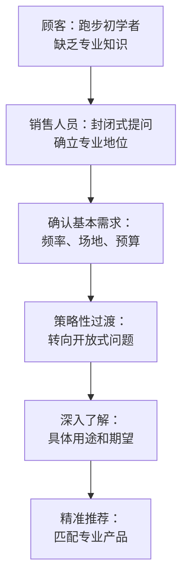
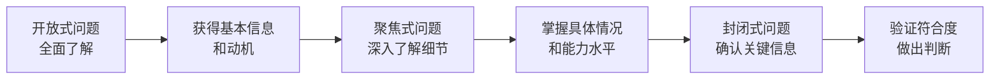
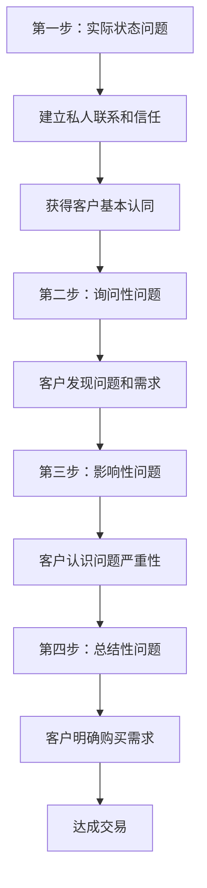

{: .no_toc }

<details close markdown="block">
  <summary>
    目录
  </summary>
  {: .text-delta }
- TOC
{:toc}
</details>
# 提问技巧

[德]赫尔曼.施尔

沟通失败往往源于提问不当，而优秀的提问者总能在短时间内获取更多有效信息。提问是工作和日常沟通的关键技能。本文将从基本原理到高阶策略，从日常交流到专业销售，系统剖析科学提问的实现路径，助您快速建立信任、了解需求、达成共识，让每次对话都朝着预期方向发展。

## 1 提问的效果

### 1.1 提问的重要性和基础价值

沟通理论表明：**掌握提问能力是实现目标的关键技能**。没有提问就没有信息交流，缺乏有效互动就无法得出结论、说服他人或解决问题。

#### 1.1.1 提问：交流的本质与起点

**提问构成交流的基本形式**。在实际对话中，提问总是作为开启对话的起点，如同在与对方之间开启一扇沟通的大门。两人交谈时若无相互提问，对话难免偏离主题。因此，提问不仅是交流的手段，更是交流的本质。

**有效提问创造积极的沟通环境**。通过恰当的提问技巧，可以营造良好的谈话氛围，深入了解对方和自己的信息需求。提问能够帮助谈话双方：

- 达成共识与理解
- 有效传递信息
- 清晰展示问题
- 创造自我介绍空间
- 明确表达动机
- 增强说服效果
- 引导对话方向

#### 1.1.2 提问引导对话的艺术

**提问者掌握对话的主动权**。这一定理强调：提问者天然处于引导对话的位置。

**提问具有导向作用**。通过精心设计的问题，我们可以将谈话引向特定方向。例如，"您也想存钱么？"这样的问题几乎无法被否定，从而有效引导对话走向预期主题。

**每个问题都需要回应**，这就使得被询问者必须基于提问内容进行思考和分析。通过巧妙的提问，我们可以将对方注意力引导至特定话题，从而高效实现沟通目标。

##### 提问引导的具体应用

| 引导类型 | 提问示例 | 作用机制 |
|---------|----------|----------|
| 需求探索 | "我有什么可以帮助您的么？" | 引导对方列举具体需求 |
| 意愿询问 | "您找……？" | 促使对方明确表达愿望 |
| 选择引导 | "您想要x，还是更喜欢y？" | 引导对方在预设选项中决策 |

##### 提问导向作用的适用场景

提问的导向功能在以下情况下尤为显著：

- **聚焦注意力**：引导对方关注特定问题
- **突破困境**：帮助谈话摆脱僵局或偏离主题
- **回归正题**：中断当前话题，重新聚焦核心议题

由此可见，**有目的的提问是引导对话方向的有效策略**。这一策略不仅适用于日常交流，更是专业沟通中的核心技能。

为了更有效地引导对话，我们需要深入理解问题的本质。**这正是准确定义问题发挥关键作用的时刻**。

#### 1.1.3 定义问题的核心作用

**精准定义问题是成功解决的关键**。只有通过深入提问，我们才能真正认识问题本质。在说服过程中，清晰的问题定义是极其有用的工具——通过精心设计的问题，我们可以建立共识意识，为成功奠定坚实基础。

**深度提问促进正确理解**。理想情况下，通过提问让谈话对象明确问题所在。即便对方已经意识到问题存在，深入提问依然意义重大——在回答过程中，对方能够理清思路，获得更准确的理解。

##### 准确定义问题的重要性

精准的问题定义在以下场景中尤为重要：

- **项目洽谈**：明确需求和期望
- **咨询对话**：识别核心关切点
- **销售交流**：理解客户真实需求

因此，**准确把握问题本质是有效沟通的前提条件**。

#### 1.1.4 排除误解的关键策略

**提问是避免误解的有效手段**。正如德国著名儿童节目的台词所言："谁不提问，就是犯傻"。提问能够确保双方话题一致，帮助彼此准确把握情境、明确目标。

**误解会导致沟通失败**。最令人尴尬的沟通场景莫过于：向客户详细描述产品特性，却发现对方对此完全不感兴趣。这提醒我们：**在回答问题前必须先完整理解问题**。

**古语有云**："问题的正确解决方法比正确问题的错误解决方法更糟糕。"这强调了准确提问的重要性。

##### 消除误解的有效问题类型

以下几类问题特别适合消除谈话过程中的误解：

- **情景性问题和信息性问题**：了解具体背景和相关信息
- **理性问题**：探讨逻辑关系和因果关系
- **引导性问题**：确认理解和达成共识
- **确认性问题**：验证信息的准确性和完整性

通过这些问题，**我们可以及时发现并消除沟通中的潜在误解**。

#### 1.1.5 寻找解决方法的智慧

**目的性提问是寻找解决方案的基础**。通过有针对性的提问，我们可以深入了解客户或谈话对象的需求、痛点和期望，为后续提供合适的解决方案奠定基础。

**研究表明**：以解决问题为导向的提问策略是销售谈话成功的重要保障。

**从逻辑顺序看，提问功能的实现遵循着清晰的递进关系**：首先是开启对话通道，继而掌握对话主导权，然后准确界定问题本质，进而消除理解偏差，最终才能导向有效解决方案的制定。**这一机制在实践中体现为：解决问题的能力是目的明确提问的主要功能，但其效果取决于前述各个环节的协同作用**。

### 1.2 主动倾听：有效提问的前提条件

> "倾听是说服对方的最佳方式之一。"
> ——迪思·拉斯克

#### 1.2.1 主动倾听的本质与价值

**主动倾听是对话成功的基础**。缺乏积极主动的倾听，对话难以顺利进行。只有真正倾听的人才能真正提问并有效引导对话。主动倾听向对方传递重要信号：**您设身处地为其着想，完全理解其立场**。

**主动倾听的核心在于感知对方的内在状态**。这要求我们不仅听到话语内容，更要理解对方的情绪、需求、态度等深层信息，并给予积极反馈。

#### 1.2.2 主动倾听的实施方法

主动倾听的实施过程可以分为两个关键步骤：

##### 第一步：全面接收信息

**接收对方传递的全部信息**。这不仅包括口头表达的内容，还涵盖非语言信息：

- **眼神交流**：关注度和投入程度的重要指标
- **肢体动作**：反映对方的舒适度和参与状态
- **表情和姿势**：传递情感态度和内心反应

##### 第二步：理解和反馈

**深入理解信息含义并给予反馈**。具体包括：

1. **分析信息关联性**：理解各类信息之间的内在联系
2. **感知对方状态**：体会对方的真实感受和需求
3. **传递反馈**：通过语言或非语言方式表达理解

通过这一过程，我们向对方传达：**我理解并接受您的问题、感受和愿望**。对方因此感受到被理解、被尊重。

##### 有效反馈的具体手段

**眼神交流**：表达兴趣和专注，是建立连接的重要方式。

**语言反馈**：
- 中性的"是"表示关注
- "啊哈"等感叹词显示跟进
- 简要重复重点语句确认理解

**语调呼应**：关注对方的语调变化并做出适当回应，在对方长时停顿时给予必要关注。

**适时提问**：运用开放性情景问题或引导性问题，帮助对方更充分地表达，深化相互理解。

#### 1.2.3 包含"我"的信息传递技巧

**"我"的表达方式建立信任关系**。传递包含"我"的信息是主动倾听的重要手段，能够创造开放氛围，赢得谈话伙伴的信任。这类表达直接传递个人感受和经历：

- "我对复杂的手机不太在行。"
- "我对换挡也很有经验。"

##### 避免急于评价和解决问题

**常见误区**：当对方描述问题时，我们往往倾向于立即分析评价并给出解决方案。这种做法反而破坏了开放对话的氛围，可能导致不必要地丧失可信度。

**"我"表达的优势**：
- 表达个人思想和经验
- 给予对方亲切感
- 鼓励对方敞开心扉
- 促进更深入的问题探讨
- 为后续行动提供重要依据

通过"我"的表达，我们展现了真诚的倾听态度，让对方感受到被尊重和理解。

#### 1.2.4 主动倾听的价值和注意事项

##### 主动倾听的核心价值

**心理学研究揭示了主动倾听的深远价值**：

| 价值维度 | 具体表现 | 实际效果 |
|---------|----------|----------|
| 关系深化 | "对方非常了解我"的感受 | 改善和深化双方关系 |
| 间接影响 | 通过深度倾听建立连接 | 创造更多间接影响的机会 |
| 需求识别 | 帮助对方认识真实需求 | 为目的导向提问提供基础 |

##### 实施注意事项

**真诚态度胜过技巧运用**。主动倾听不是机械性工具或表演技巧，如果缺乏真诚的接受和关切，无法取得预期效果。在讨论问题、态度、感受和期望时，对方需要感受到真正的理解与支持。

**核心原则**：主动倾听是反馈接收到的信息，同时避免立即给出建议或评价。这意味着：

- **语言转换**：将"你/您"的表达转换为"我"的表达
- **情绪控制**：避免流露出不良情绪，因为谈话目的不总是立即解决问题
- **耐心维持**：建立信任氛围后，不要急于关闭已开启的对话大门

##### 总结

**主动倾听是成功对话的重要前提**。通过向对方表达对其处境的理解，我们创造了宝贵的信任基础，这不仅有利于深入交流，也为有效提问策略提供了重要支撑。

**最终结论**：主动倾听是对提问技巧的重要补充，两者结合能够显著提升沟通效果和说服力。
## 2 提问的基本类型

**您是否能够通过一个"提问策略"获得成功，首先取决于您运用哪种提问类型。**由此可见，重要的是区分不同的提问类型，并对其优缺点做出正确的评估。

### 2.1 提问系统学基础

#### 2.1.1 提问分类的理论框架

**如果向100位语言或修辞学家询问提问分类系统，可能会得到100种不同的答案，但请不要为此感到困惑。** 虽然它们的名称可能不尽相同，但基本系统却是相同的。

**决定提问类型选择的关键因素在于：每种提问类型对答案可能性的限制程度和限制方式。** 不同提问类型的本质区别在于它们为回答者提供的自由度范围。

#### 2.1.2 提问类型的谱系分析

**根据答案开放程度，提问类型形成了连续的谱系分布：**

| 答案限制程度 | 区域划分 | 答案可能性 | 典型特征 |
|-------------|---------|-----------|---------|
| **完全限制** | A区 | 唯一正确答案 | 极端情况下只有一个有意义答案 |
| **部分限制** | B区 | 有限明确选择 | 两种或以上，但有明确限制 |
| **完全开放** | C区 | 无限自由选择 | 完全自由组织答案 |

**这种谱系分析为我们理解提问策略提供了系统性框架，帮助我们根据具体沟通需求选择最合适的提问方式。**

#### 2.1.3 提问技巧的系统分类

**为了更清晰地理解不同提问类型的特点，我们建立一个基于答案开放程度的谱系模型。**这个模型将帮助您根据具体沟通目标选择最合适的提问方式：

**核心分类标准：答案开放程度**
- 完全开放式：答案空间最大，鼓励自由表达
- 一般开放式：有方向性引导，但仍保持开放
- 聚焦式：目标明确，答案范围相对限定
- 选择式：提供预设选项，引导决策
- 封闭式：是非判断，答案唯一

**基于这些标准，提问类型可以精确排列如下：**

| 提问类型 | 答案限制程度 | 核心特点 | 最佳使用场景 | 沟通效果 |
|---------|-------------|---------|-------------|---------|
| **完全开放式** | 无限制 | 答案自由发散 | 探索性对话、创意讨论 | 获得广泛信息、激发思考 |
| **一般开放式** | 轻度引导 | 方向性开放 | 深度访谈、需求调研 | 获取深入观点、促进交流 |
| **聚焦式** | 部分限制 | 目标明确 | 获取特定事实信息 | 精准信息收集 |
| **选择式** | 有限选择 | 提供明确选项 | 引导决策、加速流程 | 加快决策过程、减少犹豫 |
| **封闭式** | 单一答案 | 是非判断 | 确认事实、验证信息 | 简单直接、快速确认 |

**这个系统分类表明**，提问类型谱系从完全开放到完全封闭，为沟通者提供了丰富的工具选择。**在实际应用中，熟练掌握不同提问类型的切换使用，是提升沟通效率的关键技巧。**

### 2.2 闭合式或封闭式提问

#### 2.2.1 封闭式提问的核心特征

**封闭式提问的核心特征在于限制回答者的答案范围，因此也有人称之为"封闭式提问"。**然而，这种分类方式需要更深层的理解。

**从结构功能分析，封闭式提问对谈话进程产生特定的约束效应。**这类提问能够快速确定事物的本质和关键信息，但也正因为其明确的指向性，回答者在作出选择后往往难以调整立场。**理解这一特性有助于我们在合适的时机运用封闭式提问，发挥其快速确认的优势**。

**重要提醒：**虽然封闭式提问具有明确的优势，但使用不当也可能导致意外结果，因此需要谨慎权衡使用时机和方式。

#### 2.2.2 经典封闭式问题

**经典封闭式问题的结构特征：句首通常包含助动词，形成是非判断结构。**

| 典型句式 | 示例 | 回答模式 | 适用场景 |
|---------|------|---------|---------|
| 您想要...？ | "您想要了解更多吗？" | 是/否 | 需求确认 |
| 您去...？ | "您去参加会议吗？" | 是/否 | 行动确认 |
| 您是...？ | "您是负责人吗？" | 是/否 | 身份确认 |
| 您会...？ | "您会使用这个系统吗？" | 是/否 | 能力确认 |

**核心特点：**这类问题的回答通常为"是"或"不是"，对于确认特定概念或信息非常有效。在需要快速决策的场合，它能显著简化沟通流程。

**⚠️ 使用风险：**
大量案例表明，过度使用封闭式提问是沟通失败的重要原因之一。**大多数人倾向选择"更方便"或"更容易回答"的答案，导致提问者往往得到否定回复。**

#### 2.2.3 封闭式提问的效用与应用场景

**基于上述分析，封闭式提问的最佳应用场景包括：**
- 特定信息的澄清和强调
- 附加信息的确认
- 重要细节的验证

**特别是在需要快速获得信息并迅速做出决策时，封闭式提问是最佳选择。**

##### 封闭式提问的全面效用分析

| 优势维度 | 具体表现 | 适用条件 | 注意事项 |
|---------|---------|---------|---------|
| **效率优势** | 快速获得确认信息 | 时间紧迫、需要快速决策 | 避免在探索阶段使用 |
| **流程优势** | 简化沟通流程 | 目标明确、信息清晰 | 可能遗漏重要细节 |
| **场景优势** | 适合正式场合 | 商务谈判、事实确认 | 需配合其他提问类型 |
| **决策优势** | 便于快速决策 | 多选一、二选一情况 | 确保选项覆盖充分 |

##### 潜在风险与规避策略

| 风险类型 | 具体表现 | 规避策略 | 建议替代方案 |
|---------|---------|---------|-------------|
| **交流阻碍** | 限制深度表达 | 适度使用，配合开放式问题 | 先开放后封闭的组合策略 |
| **否定倾向** | 容易获得否定回答 | 调整问题表述方式 | 使用选择式问题替代 |
| **探索受限** | 不适合发现新信息 | 在探索阶段避免使用 | 改用开放式或聚焦式问题 |

#### 2.2.4 封闭式提问的谈话情景分析

##### 专家-新手咨询情景

**经典案例：运动鞋销售咨询**

**情景描述：**销售人员在为初学者顾客提供运动鞋购买咨询时，顾客对跑步鞋的专业特点缺乏了解。

**沟通策略：**销售人员通过封闭式提问确立专业权威地位，同时有效引导对话进程。

**对话流程管理：**


**关键成功要素：**
- 通过封闭式问题快速建立专业形象
- 把握节奏，适时转向开放式提问
- 在信息收集和产品推荐间找到平衡点

##### 问题诊断与原因排查

**实际案例：部门责任归属调查**

**挑战情境：**度假期间部门出现问题，员工们要么沉默不语，要么推卸责任。

**解决方案：**运用封闭式提问进行系统性排除法分析。

**结构化调查流程：**

| 调查阶段 | 核心任务 | 封闭式提问策略 | 预期成果 |
|---------|---------|---------------|---------|
| **1. 假设形成** | 基于观察识别可能原因 | "是不是因为..."<br>"是否涉及..." | 建立初步假设清单 |
| **2. 逐一排查** | 系统性排除无关因素 | "可以排除A吗？"<br>"B因素有关吗？" | 缩小问题范围 |
| **3. 症结锁定** | 确定根本原因 | "所以核心原因是X？" | 明确问题症结 |
| **4. 方案制定** | 针对性解决问题 | "这个方案可行吗？" | 达成解决共识 |

##### 封闭式提问的使用原则

**⚠️ 重要限制：**
- **信息发现局限：**封闭式问题主要适用于确认事实，不适合探索深层需求、动机或背景信息
- **心理影响考量：**连续使用封闭式问题容易让对方产生"被审讯"感，影响沟通氛围

**🎯 最佳时机：**
- **谈话收尾阶段：**用于确认决定或总结要点
- **关键信息验证：**当需要确认具体事实时
- **决策推动时刻：**当需要促进决策进程时

**❌ 避免场景：**
- **对话开场：**避免使用"现在您想购买这个产品吗？"这类问题
- **深度探索：**不适合发现新信息或探索性对话

**💡 实践智慧：**
经验证明，在需要确认事实或达成谈判目标时，封闭式问题能够显著简化沟通过程。**其以结论为导向的特性，有助于突出谈话重点并抓住关键信息。**

**关键建议：**大多数人倾向于过度使用封闭式问题，而忽略了开放式问题的价值。**成功的沟通者需要在两者间找到恰当平衡。**

#### 2.2.5 启发性问题

**启发性问题通过精心设计的语言结构，在不施加压力的情况下引导谈话方向。**这里需要强调，这种"引导"是积极的、建设性的引导，而非强制性的操控。

##### 构成要素与影响机制

**启发性问题的核心结构：陈述句 + 影响性词汇 + 疑问形式**

| 影响词汇类型 | 典型词汇 | 作用机制 | 使用效果 |
|-------------|---------|---------|---------|
| **确定性词汇** | 一定、肯定是、确实是 | 建立事实确认感 | 减少疑虑，增强信心 |
| **引导性词汇** | 不是吗、也、大概、可能 | 暗示共识存在 | 引发认同感 |
| **暗示性词汇** | 显然、当然、自然 | 假设理所当然 | 降低心理阻抗 |

##### 应用场景与最佳实践

**最佳使用时机：**
- 当对方表现出犹豫不决时
- 需要帮助对方建立信心时
- 希望在不知不觉中引导话题时

**预期效果：**
通过启发性问题的巧妙设计，谈话伙伴会自然地被引导至特定结论，感觉这个结论是自己思考得出的，而非被强加的。

**💡 策略价值：**
当提问者希望在保持和谐氛围的同时引导谈话方向时，启发性问题具有独特的吸引力。

#### 2.2.6 选择性问题

**选择性问题是一种高度优化的封闭式提问形式，通过预设选项引导决策过程。**其核心特征是要求谈话对象在两个或多个明确选项中做出选择。

##### 经典案例与理论支撑

**希尔顿酒店传奇案例：**
康德拉·希尔顿向员工传授的服务智慧：
- ❌ 错误方式："您要鸡蛋么？"
- ✅ 正确方式："您想要太阳蛋还是炒蛋？"

**案例分析：**

| 提问方式 | 心理机制 | 成功率 | 客户体验 |
|---------|---------|-------|---------|
| **开放式** | 客户需要主动思考 | 较低 | 可能感到压力 |
| **是非问** | 容易否定回答 | 一般 | 容易流失销售机会 |
| **选择式** | 预设接受前提 | 极高 | 感受专业引导 |

##### 选择性问题的战略优势

**相比经典封闭式问题，选择性问题具有更强结果导向性：**
1. **决策引导：**不仅要求做出决定，还提供明确的选择框架
2. **预设前提：**默认客户已经接受基本概念，只需要选择具体形式
3. **掌控对话：**通过选项设计直接引导对话走向

##### 实战应用场景

| 应用领域 | 具体案例 | 设计要点 | 预期效果 |
|---------|---------|---------|---------|
| **销售谈判** | "您想在本季度还是下季度合作？" | 时间框架选择 | 推进合作进程 |
| **服务安排** | "保险从12月1日起还是12月15日起生效？" | 具体日期选择 | 确保服务落地 |
| **产品选择** | "您喜欢蓝色还是黑色样式？" | 外观偏好选择 | 促进购买决定 |
| **方案确认** | "您接受A方案还是B方案？" | 解决方案选择 | 推动决策执行 |

**🎯 核心价值：**选择性问题是掌握对话主动权的直接手段，通过巧妙设计选项框架，可以在保持客户自主性的同时实现引导目标。

#### 2.2.7 其他封闭式问题形式

**除了启发性问题和选择性外，封闭式提问还包含多种特殊形式，**每种形式都具有独特的作用机制和应用场景。**掌握这些变体形式，有助于在具体沟通中选择最合适的提问策略。**

##### 封闭式问题形式的综合分类

| 问题类型 | 核心功能 | 典型句式 | 使用场景 | 注意事项 |
|---------|---------|---------|---------|---------|
| **反问** | 强化观点、制造修辞效果 | "难道不是吗？" | 演讲、辩论 | 不需要真实回答 |
| **否定式问题** | 引导特定回应 | "您不觉得...吗？" | 确认共识 | 可能引发防御心理 |
| **反射式问题** | 转移消极话题 | "您是指...吗？" | 处理负面反馈 | 需要技巧和敏感度 |
| **确认性问题** | 保证谈话成果 | "所以您的意思是..." | 总结归纳 | 确保理解准确 |
| **激励性问题** | 鼓励继续对话 | "您最近获得了...吧？" | 客户关系维护 | 答案通常已知 |
| **导向性问题** | 引导注意力 | "关于这一点..." | 话题转换 | 目的性要明确 |
| **试探性问题** | 收集特殊信息 | "您对...感兴趣吧？" | 需求调研 | 可开放可封闭 |

##### 详细应用指南

**1. 反问**
- **本质特征：**以陈述句形式表达，无需真实回答的修辞手法
- **核心功能：**
  - ✅ 获得谈话伙伴的关注
  - ✅ 引导对话方向
  - ✅ 强调某个观点
  - ✅ 创造修辞效果

**2. 否定式问题**
- **使用风险：**语法结构复杂，容易产生对我们不利的回答
- **常见误区示例：**
  - ❌ "您没有兴趣和我一同出去呢？"
  - ❌ "您不觉得这很有意思吗？"
  - ❌ "这不是您的箱子吗？"

**3. 反射式问题**
- **应用场景：**当对方做出消极陈述时，通过关注其他方面转移话题
- **经典案例：**
  - 对方："您的证件号码不应该是2吧！"
  - 反射："您觉得是其他9个数字吗？"

**4. 确认性问题**
- **核心价值：**特别适用于保证谈话的部分成果，验证理解准确性
- **实用示例：**
  - "至此我们可以确定，您想购买一份人寿保险，并且想把它同无就业能力保险挂钩？"

**5. 激励性问题**
- **特点：**答案在提问前已清楚，目的不是获得信息而是激励对话
- **应用技巧：**
  - "您是不是最近刚获得了……的奖励？"
  - "您这位专业人士也这么认为吗？"

**6. 导向性问题**
- **作用：**将听众注意力转移到特定话题或谈话点上
- **使用原则：**答案通常是提问者熟悉或希望得到的内容

**7. 试探性问题**
- **灵活性：**既可封闭也可开放，取决于具体需求
- **应用示例：**
  - 封闭式："您对于简化程序比较感兴趣，对吧？"
  - 开放式："在此之前，您是怎样寄送大型货物的呢？"

**🎯 实践建议：**
根据谈话目标、对象特征和具体场景，灵活选择最适合的封闭式问题变体，能够显著提升沟通效果。

### 2.3 开放式提问

#### 2.3.1 开放式提问的基本特征

**开放式提问的核心特征是为回答者提供广阔的答案空间，从而获得丰富信息和深入见解。**与封闭式提问形成鲜明对比，开放式问题能够激发对话对象的思考和表达。

##### 概念辨析与术语澄清

**常见称谓及其局限性：**
- "开放的问题" - 含义相对明确
- "特殊疑问句" - 容易产生困惑

**困惑产生的原因分析：**

1. **答案范围理解偏差：**
   - 误解：开放式问题=完全无限制
   - 事实：虽然答案空间广阔，但仍存在主题边界

2. **句式特征误导：**
   - **正向关联：**多数开放式问题以特殊疑问词开头（谁、怎样、什么、为什么、何时、何地、哪个、多少）
   - **反向误解：**并非所有特殊疑问词开头的句子都是开放式问题
   - **关键判断：**是否要求回答者超越简单事实，进行思考、分析或表达观点

##### 开放式问题的判断标准

| 判断维度 | 开放式问题特征 | 封闭式问题特征 |
|---------|---------------|---------------|
| **答案要求** | 需要完整句子解释 | 简单词语或是否回答 |
| **思维深度** | 要求思考和分析 | 简单事实确认 |
| **信息量** | 丰富、多层次 | 单一、具体 |
| **回答时间** | 需要思考和表达 | 快速反应 |

#### 2.3.2 开放式提问的效用分析

**实践证明，当提问者希望获得深入见解或多角度信息时，开放式问题是最佳选择。**通过开放式提问，谈话者被鼓励进行更深层次的思考和表达。

##### 核心效用机制

**关键特征：**开放式问题无法用简单的"是"或"否"来回答，必须通过完整的句子表达观点或解释情况。

**价值对比：**
- **开放式提问：**获得内容深刻、信息丰富的准确表述
- **客套话交流：**流于表面、缺乏实质内容

**最终目标：**通过开放式问题获得对谈话进程真正有价值的信息和洞察。

##### 开放式提问的全方位优势分析

| 优势类型 | 具体表现 | 最佳应用场景 | 预期效果 |
|---------|---------|-------------|---------|
| **深度信息获取** | 获得深入、详细信息 | 需求调研、深度访谈 | 全面了解情况 |
| **对话促进功能** | 鼓励对方表达观点 | 建立关系、破冰环节 | 增进相互理解 |
| **思维激发作用** | 促进思考和反思 | 头脑风暴、创意讨论 | 激发创新思维 |
| **关系建立效果** | 表现对对方的重视 | 客户服务、团队管理 | 建立信任关系 |
| **情感连接功能** | 了解态度和感受 | 冲突解决、心理辅导 | 深化情感共鸣 |

**💡 战略价值：**
开放式提问不仅仅是收集信息的工具，更是建立深度人际关系、促进思维发展和推动问题解决的重要方法。

#### 2.3.3 聚焦式问题

**聚焦式问题代表了一种特殊的开放式问题形式，其独特之处在于答案范围相对有限，但仍需要完整句子回答。**与典型开放式问题相比，聚焦式问题虽然答案选择较少，但依然要求回答者超越简单的是非判断。

##### 聚焦式问题的分类与特征

**核心区别：**
- **封闭式问题：**可以用"是/否"回答
- **聚焦式问题：**需要具体信息，但答案选择相对有限
- **开放式问题：**答案空间广阔，鼓励深入表达

##### 聚焦式问题的典型应用

| 问题类型 | 典型问句 | 答案特征 | 信息收集目标 |
|---------|---------|---------|-------------|
| **状态询问** | "您怎么样？" | 简短状态描述 | 了解当前状况 |
| **事实确认** | "您的汽车是什么颜色的？" | 具体属性信息 | 获取准确数据 |
| **时间信息** | "您什么时候出生的？" | 具体时间点 | 确认时间信息 |
| **个人资料** | "您多大年纪了？" | 具体数字信息 | 收集基础数据 |
| **地点确认** | "您住在哪里？" | 地理位置 | 确定空间信息 |
| **关系询问** | "谁开车送您来的？" | 具体人物信息 | 了解社交关系 |
| **方式询问** | "您乘什么交通工具过来的？" | 具体方式 | 确认行动方式 |
| **计划询问** | "您明天做什么？" | 具体活动安排 | 了解未来计划 |

##### 聚焦式问题的应用特点

**优势：**
- ✅ 精准获取特定信息
- ✅ 回答简洁明了
- ✅ 适合快速信息收集
- ✅ 减少理解偏差

**局限性：**
- ❌ 不适合展开深度对话
- ❌ 回答通常只需一个或少数词汇
- ❌ 限制了表达的空间
- ❌ 可能影响对话流畅性

##### 信息类问题的特殊价值

**聚焦式问题的特殊形式——信息类问题，在谈话分析阶段发挥着关键作用。**

**核心功能：**
- **事实收集：**获取准确的基础信息
- **分析基础：**为后续深入分析提供数据支撑
- **谈话推进：**通过信息收集推动谈话进程

**重要性体现：**
信息类问题的答案在谈话的"分析阶段"至关重要，**因为研究这些信息是为了使谈话能够继续进行并达到预期目标。**

**🎯 使用建议：**
聚焦式问题适合在需要快速收集具体信息的场景中使用，但要注意与其他类型问题的配合，以保持对话的丰富性和深度。

#### 2.3.4 反问的特殊应用

**反问是开放式问题中的一种特殊策略工具，主要用于争取思考时间和转移对话焦点。**这种技巧在面对复杂问题或需要谨慎回答时特别有价值。

##### 反问的核心机制

**应用场景：**当被提问者无法立即给出合理答案时，通过反问可以：
- **争取思考时间：**避免草率给出第一反应
- **重新掌控对话：**按照自己的意愿引导话题
- **促使对方澄清：**要求对方进一步解释问题

**价值原理：**
反问的目的不是获得信息，而是为回答者创造思考空间。**通过这种方式，谈话伙伴会仔细思考自己的回答方式，而不是冲动地给出第一反应。**

##### 反问的实用技巧

**最佳应用时机：**
- 需要时间思考复杂问题时
- 对方问题不够明确时
- 希望引导对话方向时

**常用反问句式：**
- "我的理解正确吗？"——确认理解，争取澄清时间
- "这个您是怎么理解的？"——要求对方进一步解释
- "您能具体说明一下吗？"——要求提供更多细节
- "关于这一点，您的具体期望是什么？"——重新聚焦话题

**⚠️ 使用注意事项：**
- **频率控制：**不可以频繁使用，否则显得回避问题
- **真诚度：**要表现出真正希望了解的态度
- **时机把握：**在确实需要思考或澄清时使用

#### 2.3.5 完全开放式问题

**完全开放式问题为谈话伙伴提供最大程度的回答自由度，能够激发广泛而深入的信息分享。**这种问题形式是探索性对话和创意讨论的理想工具。

##### 完全开放式问题的特征

**核心特点：**
- **最大自由度：**谈话伙伴可以完全自由地回答问题
- **信息广度：**在任何情况下都可以获得广泛的信息
- **深度探索：**鼓励多角度、多层次的思考

##### 典型应用示例

| 问题类型 | 典型问句 | 预期回答特征 | 适用场景 |
|---------|---------|-------------|---------|
| **观点询问** | "关于计划进行的改革您持什么观点？" | 全面立场分析 | 政策讨论、战略规划 |
| **经验分享** | "在...方面您有哪些经验呢？" | 详细经历描述 | 专家咨询、经验交流 |
| **看法了解** | "您对...的情况是怎么看的？" | 多角度分析 | 现状评估、问题诊断 |
| **评价询问** | "您认为这个建议如何？" | 综合评价 | 方案评估、决策支持 |

##### 潜在风险与应对策略

**可能出现的挑战：**
- **信息含量低：**偶尔可能出现缺乏实质内容的回答
- **回答过于宽泛：**可能偏离具体话题
- **时间成本高：**需要更多时间进行讨论

**💡 实践洞察：**
虽然完全开放式问题有时可能产生信息含量较少的回答，但这并非常态。**大多数情况下，谈话对方都会在开放式问题的引导下给出范围广泛且信息丰富的答案。**

##### 深度对话价值

**促进深入交流：**
在完全开放式问题的基础上，谈话很容易进一步深入发展，**因为范围广泛、内容丰富的答案为后续对话提供了大量切入点和话题拓展机会。**

**🎯 战略应用：**
完全开放式问题是开启深度对话、激发创造性思维和建立全面理解的关键工具，适合在需要探索未知领域或收集多角度观点时使用。

#### 2.3.6 开放式提问的质量要点

**开放式提问的核心原则：问题质量的关键不在于疑问词的选择，而在于提问的目的性和针对性。**

##### 疑问词与开放性的关系分析

**案例对比分析：**

**案例1：聚焦式问题**
- **问题：**"您的汽车是哪种颜色的？"
- **分析：**虽然以"哪种"开头，但可以通过简短的颜色说明回答，属于聚焦式问题
- **特点：**目标明确，答案选择有限

**案例2：开放式问题**
- **问题：**"您对电子数据处理系统有哪些要求？"
- **分析：**同样以"哪些"开头，但答案可能性众多，目的性相对宽泛
- **特点：**答案空间广阔，鼓励详细表达

##### 疑问词开放性程度分类

**基于大量实践观察，不同疑问词具有不同的开放性特征：**

| 开放性程度 | 疑问词 | 问题特征 | 典型应用 |
|-----------|-------|---------|---------|
| **最开放** | 为什么、怎么样、如何、什么 | 鼓励深入思考和详细解释 | 原因分析、过程描述、观点表达 |
| **中等开放** | 哪个、怎样、何时 | 有一定方向性，但仍允许多种回答 | 选择分析、方式说明、时间确认 |
| **较聚焦** | 哪里、谁 | 目标明确，答案相对具体 | 地点确认、人物信息 |

**💡 重要发现：**
- "谁"、"哪里"等疑问词通常具有更强的聚焦性
- "怎样"、"为什么"、"哪个"既可用于聚焦式问题，也可用于完全开放式问题
- **关键判断标准：**问题的意图和语境比单纯疑问词更重要

#### 2.3.7 开放式提问的谈话情景应用

##### 产品咨询与购物情景

**典型场景：相机购买咨询**

**情景描述：**顾客对相机感兴趣，但缺乏专业知识和明确偏好。

**开放式提问策略：**
- "这架相机有哪些特殊功能呢？"
- "它特别适合哪种用途？"
- "这款相机的优点是什么？"

**策略优势：**
1. **信息获取：**了解相机的详细特性和功能
2. **专业判断：**评估导购人员的专业水平
3. **兴趣激发：**通过专业回答激发购买兴趣
4. **对话发展：**从单一问题发展为深入对话

**对比分析：**

| 顾客状态 | 提问策略 | 最佳问题类型 | 预期效果 |
|---------|---------|-------------|---------|
| **缺乏了解** | 探索性提问 | 开放式问题 | 获取全面信息，激发兴趣 |
| **需求明确** | 验证性提问 | 是非问句 | 确认产品特性是否符合期望 |

##### 面试与人才评估情景

**实际应用：人事部门了解应聘者**

**开放式提问策略：**
- "您为什么想得到这份工作？"
- "您对这个职位的哪个方面感兴趣？"

**策略目的：**
为应聘者提供全方位自我介绍的机会，了解其动机、兴趣和适合度。

**面试提问的递进流程：**



**流程优势：**
1. **层次化推进：**从广泛了解逐步聚焦到关键信息
2. **信息全面：**避免遗漏重要信息
3. **效率平衡：**既保证深度又控制时间
4. **决策支撑：**为最终判断提供充分依据

**🎯 应用原则：**
在具体应用中，应根据谈话目标和对象特征，灵活运用不同类型的开放式问题，并配合其他提问技巧，形成完整的沟通策略。

#### 2.3.8 开放式提问的注意事项

##### 时间管理与对话掌控

**重要原则：**并非所有开放式问题都能立即获得广泛信息。**提问时需要给谈话伙伴留出充分的思考和表达时间，同时谨慎引导对话进程，直到真正关心的核心话题出现。**

##### "为什么"提问的特殊风险

**⚠️ 关键提醒：**使用疑问词"为什么"时需要格外谨慎，**因为这类问句通常无意识地隐含着责备或质疑的意味。**

##### 提问方式的优化对比

| 场景 | 不推荐问法 ❌ | 优化问法 ✅ | 效果差异 |
|------|-------------|-----------|---------|
| **迟到情况** | "您为什么迟到？" | "是什么原因让您来晚了？" | 从责备转向理解 |
| **行为询问** | "您为什么这么做？" | "您这样做的意图是什么呢？" | 从质疑转向探索 |
| **反对意见** | "您为什么反对这个方案？" | "您对方案有什么顾虑？" | 从对抗转向倾听 |

**💡 改进原理：**
- 将焦点从"原因"转向"过程"、"意图"或"顾虑"
- 减少潜在的对抗性和责备意味
- 增强合作探索的氛围

##### 开放式提问的战略价值

**核心功能总结：**
完全开放式提问是以特殊疑问词开头的特殊疑问句，**提问者通过这种方式可以：**

1. **信息收集：**收集全面信息和多样化观点
2. **关系建立：**促使谈话伙伴分享个人信息和感受
3. **深度理解：**把握事件之间的内在联系
4. **能力评估：**估测谈话伙伴的知识水平和思维深度

**最终目标：**
基于通过开放式问题获得的深入认识，**为后续其他提问策略的制定和实施奠定坚实基础。**

**🎯 实践智慧：**
成功的开放式提问不仅在于技巧运用，更在于创造一个安全、尊重的对话环境，让谈话伙伴愿意真诚地分享想法和感受。

### 2.4 其他提问类型

**正如前文所述，提问类型的多样性和系统性关系极为丰富，形成了复杂的理论框架。**虽然是否将所有类型都进行精确分类并非核心问题，但了解这些不同的提问策略有助于我们更全面地理解沟通技巧。

**核心洞察：**各种提问类型之间的本质区别主要体现在**答案范围的开放程度**和**思维引导的深度**两个维度上。

#### 2.4.1 苏格拉底的"助产术"

**历史背景：**
"助产术"(希腊语：Maieutikē)或苏格拉底法是西方哲学中最古老、最系统的提问方法之一。**苏格拉底运用这一方法传授哲学思想，其效果令人印象深刻。**

##### 核心理念与比喻

**"助产术"的深刻比喻：**
苏格拉底将自己比作思想的"接生婆"，**他的角色不是直接灌输知识，而是帮助他人"接生"出自己内在的思想和真理。**

##### 苏格拉底助产术的三种核心方法

| 方法名称 | 核心机制 | 具体应用 | 预期效果 |
|---------|---------|---------|---------|
| **讽刺法** | 揭示矛盾，暴露无知 | 通过连续提问让谈话伙伴陷入自我矛盾 | 发现思维盲点和无知领域 |
| **归纳法** | 从个别到一般 | 借助具体事例展示普遍规律 | 理解抽象概念和普遍原理 |
| **助产法** | 从具体到抽象 | 从具体案例上升到正确概念定义 | 形成准确的概念理解 |

##### "助产术"的哲学基础

**核心教育理念：**
"助产术"的基本态度是**在整个认知过程中为学习者提供支持和帮助**，**因为人们只会真正接受和内化那些自己发现的事物。**

##### 现代应用价值与实践意义

**苏格拉底法在现代各领域的应用：**

| 应用领域 | 具体实践 | 核心目标 | 实现效果 |
|---------|---------|---------|---------|
| **教育领域** | 启发式教学、探究式学习 | 激发主动思考 | 避免被动接受，培养批判性思维 |
| **管理咨询** | 问题诊断、解决方案探索 | 引导自我发现问题 | 提升解决方案的可行性和执行力 |
| **心理治疗** | 认知行为疗法、心理分析 | 促进自我觉察 | 加深自我理解和内心成长 |
| **团队建设** | 复盘讨论、创新工作坊 | 激发集体智慧 | 促进团队深度思考和创意交流 |

##### 苏格拉底提问的实践效果

**通过苏格拉底式的提问，可以实现：**

1. **深度思考促进：**引导对方思考问题的本质和根本原因
2. **思维盲点发现：**帮助对方发现自己的认知局限和盲点
3. **自主结论达成：**引导对方通过自己的思考得出结论
4. **内化效果增强：**建立更强的学习内化和长期记忆效果

**🎯 现代价值：**
苏格拉底的"助产术"不仅是历史遗产，更是现代沟通、教育和领导力发展的重要工具，其核心思想在今天的知识管理和个人发展中仍具有重要指导意义。
## 3 说服过程中的提问

### 3.1 提问在销售中的核心价值与重要性

#### 3.1.1 提问对销售成功的根本意义

**掌握客户的真实购买动机是销售成功的根本前提**。顾客购买产品并非偶然行为，而是基于特定需求和动机的理性决策过程。销售人员必须通过有效提问来深入了解这些动机，才能制定针对性的销售策略。

**系统化的提问技巧能够显著提升销售效果**。目的性问题不仅能够帮助销售人员准确把握客户需求，还能引导客户认识到产品的真正价值，从而建立信任关系并促进成交。

**影响性问题的运用体现了销售人员的专业水平**。通过巧妙设计的影响性问题，销售人员能够帮助客户认识到解决问题的紧迫性，这种提问艺术是区分普通销售员和销售专家的关键标志。

**让客户充分认识产品效用需要科学的方法**。简单的产品介绍远不如通过有针对性的提问引导客户自主发现产品价值来得有效，这种方法能够增强客户的购买决心和满意度。

#### 3.1.2 客户深入分析的价值与方法

**全面了解客户是制定有效销售策略的基础**。为什么提问对销售如此重要？答案非常简单：只有通过系统性的提问和分析，销售人员才能真正了解客户的思想类型、需求特点和决策模式，为后续的销售过程奠定坚实基础。

**缺乏深入分析的销售行为如同医生未诊脉就开药方**。特别是在销售需要咨询的产品和服务时，放弃深入调查工作的销售人员，就像医生没有询问病人病史就开具药方一样，不仅无法解决客户问题，还会损害专业形象。

**科学的分析过程需要专业的提问技巧支撑**。全面透彻的客户分析离不开有针对性的提问，这种分析能够揭示客户的真实需求、潜在顾虑和购买动机，为销售人员提供宝贵的信息支持。

#### 3.1.3 提问技巧对销售过程的多重意义

##### 分析对销售过程的价值

**系统的提问分析能够为销售决策提供全面的信息支持**。在理想情况下，以分析为目的的对话通过精心设计的问题，能够帮助销售人员获取大量与销售相关的关键信息，包括客户的具体情况、问题痛点、决策流程以及购买时间安排等。

##### 提问技巧的积极影响

**有效的提问能够激发客户的自我认知和需求意识**。通过合适的提问，客户能够从全局角度审视自身情况，产生解决问题的迫切感，这种内在驱动力比销售人员的外部推动更加有效，同时也能提高决策的质量和安全性。

##### 成功销售人员的谈话模式

**专业的销售对话遵循科学的问答流程**。一名成功的销售专家会在销售前期对客户情况进行全面分析，深入了解客户的核心需求和特殊问题。积极的销售对话通常按照以下模式展开：

###### 专业的销售对话流程

1. **销售人员提出针对性问题**
2. **客户提供详细信息回答**
3. **销售人员基于回答深入询问**
4. **客户提供更多信息反馈**
5. **销售人员与客户共同寻求解决方案**

###### 专业模式带来的核心价值

**这种科学的对话模式创造了多重价值**：

●**销售人员获得丰富而准确的客户信息**

●**客户更加清晰地认识自身需求**

●**客户深刻体会解决问题的紧迫性**

●**客户建立起做出决策的安全感**

#### 3.1.4 消极谈话模式的问题与后果

**然而，实际销售中普遍存在不专业的对话模式**。大多数销售人员会过早终止分析性谈话，错误地认为自己已经掌握了足够信息。这种不专业的做法导致大量宝贵时间被浪费，也无法为客户提供更多有价值的产品、系统或服务选择。

**不专业的谈话模式存在明显缺陷**：

1. **销售人员提出表面性问题**
2. **客户提供有限信息回答**
3. **销售人员错误认为已完全掌握情况**
4. **直接转向传统推销模式**

**这种低效模式导致的后果十分严重**：

●**销售人员仅获得片面信息**
●**客户对自身需求认识模糊**
●**客户未能意识到问题的紧迫性**
●**客户缺乏决策的信心和安全感**

**浅层分析严重影响销售效果**。如果销售分析停留在表面层面，就无法准确识别客户的真实问题。销售人员在论证过程中往往只关注表面问题，忽视了深层次的预防需求，从而无法准确把握客户的决策比例。

**尽管存在这些问题，很多客户最终还是会购买产品**。但从逻辑角度分析，优秀销售人员应该将专业说服力提供给客户，而客户通常能够识别这种说服力无法真正解决根本问题。结果必然导致客户满意度下降，重复购买意愿降低。

### 3.2 产品销售与解决方案销售的根本区别

#### 3.2.1 产品销售的特征与局限性

**产品销售的本质是简单的商品交易模式**。从某种意义上说，"产品销售"这个名称并不完全准确，因为它不仅包括具体产品的销售，更多时候涉及服务或复杂产品系列的销售。

**产品销售的核心是单向的产品信息传递**。销售过程主要围绕介绍产品（服务或产品系列）的优点展开，销售人员倾向于大力宣传产品特色，却很少关注客户的具体情况和实际需求。

**提问在产品销售中处于次要地位**。由于产品销售主要依赖产品本身的吸引力，销售人员通常不需要深入了解客户信息就能完成交易，这使得系统性提问在产品销售中的作用被大大削弱。

#### 3.2.2 解决方案销售的核心特征

**解决方案销售将客户需求置于销售过程的中心位置**。与产品销售不同，解决方案销售不会直接向客户推销产品，而是专注于识别并提供客户可能尚未意识到的解决方案。

**深入的客户分析是解决方案销售的前提条件**。为了有效实施解决方案销售，销售人员必须获取大量关于客户的详细信息，包括业务背景、面临挑战、未来规划等多个维度。

**解决方案销售本质上是一种专业咨询服务**。基于这一特点，解决方案销售通常被称为"咨询式销售"。在这种模式下，"销售"的概念被重新定义为为客户提供专业咨询服务的活动。

#### 3.2.3 两种销售模式的特征对比

##### 产品销售的特征分析

**产品销售具有以下明显特征**：

- 产品或服务相对简单，易于理解
- 价格是决策的核心因素
- 销售人员扮演供货商角色
- 通常在第一次或第二次接触中完成交易
- 对话内容较为浅显，深度有限
- 购买决策的长期影响较小
- 与客户的关系往往是短期的、交易性的

##### 解决方案销售的特征分析

**解决方案销售呈现出完全不同的特征**：

- 产品或服务较为复杂，需要专业知识
- 问题解决方案的价值比价格更重要
- 销售人员担任专业顾问角色
- 通常需要多次深入沟通后才能达成交易
- 对话内容复杂而深入
- 购买决策对客户产生长远影响
- 与客户建立长期合作关系

#### 3.2.4 两种销售模式的优劣分析

**解决方案销售在客户忠诚度方面具有显著优势**。采用解决方案销售模式的客户，被竞争对手抢走的可能性远低于产品销售客户。同时，由于价格因素在解决方案销售中的重要性相对较低，销售人员能够更好地控制价格风险。

**专业培训是解决方案销售成功的关键**。虽然价格因素仍然需要考虑，但只有接受过专业培训的销售人员才能准确分析客户需求，并将分析结果转化为真正有价值的解决方案。

#### 3.2.5 两种销售模式的综合对比

##### 产品销售与解决方案销售综合对比

| **对比维度** | **普通产品销售** | **解决方案销售** |
|------------|----------------|----------------|
| **核心价值** | 价格最为重要 | 解决方案最为重要 |
| **角色定位** | 外勤工作=销售人员 | 外勤工作=顾问 |
| **销售动机** | 销售人员主动"推"动订单 | 解决方案唤起客户购买愿望 |
| **关注重点** | 产品本身最为重要 | 沟通过程的价值最为重要 |
| **能力要求** | 需要优秀的表达能力 | 需要专业的问题解决能力 |
| **销售周期** | 通常单次接触完成销售 | 通常需要多次接触完成销售 |
| **决策方式** | 销售人员在场时直接决定 | 需要多方讨论后共同决定 |
| **决策持久性** | 决策可能随情况改变而动摇 | 决策具有较高稳定性和持久性 |
| **记忆效果** | 客户一周后仅记住少数要点 | 客户长期记忆需求和解决方案 |
| **重复联系** | 强行推销降低重复联系可能 | 专业服务提高重复联系概率 |
| **价值认知** | 价格敏感度高，价值意识较弱 | 价值意识强烈，价格敏感度低 |
| **客户关系** | 关系通常较为短暂 | 建立长期合作关系 |
| **生产者关系** | 销售人员与生产者联系紧密 | 销售人员与生产者关系相对独立 |
| **风险控制** | 错误风险相对较低 | 错误风险相对较高 |
| **外部影响** | 受外部因素影响较小 | 受外部因素影响较大 |
| **专业程度** | 谨慎程度适中 | 专业谨慎程度很高 |
| **需求特点** | 需求发展较快、主要涉及客户个人、包含强烈情感因素 | 需求发展较慢、受多因素影响、通常有理性支撑 |
| **销售内容** | 主要涉及产品介绍和演示 | 重点在于需求分析和方案讨论 |
| **客户忠诚度** | 客户容易转向其他供应商 | 客户很少转向其他供应商 |

##### 深度对比分析

| **对比维度** | **普通产品销售** | **解决方案销售** |
|------------|----------------|----------------|
| **描述重点** | 侧重产品功能和特性描述，强调技术规格和工作原理 | 侧重应用场景和使用方法描述，强调问题解决可能性和方案带来的核心价值 |
| **转换倾向** | 客户倾向变化时销售人员较难获知 | 客户可能在不告知情况下转换供应商 |
| **差异化策略** | 供应商间差异主要体现在价格上 | 通过解决方案的独特性建立差异化优势 |

#### 3.2.6 实际案例分析：洗衣机销售对比

##### 传统产品销售案例

**让我们通过一个具体场景来理解产品销售**。假设您需要购买一台新洗衣机。下班途中，您偶然经过一家商店，橱窗里正好展示着您需要的洗衣机。您走进店内咨询销售人员。

在这种情况下，销售人员会详细介绍洗衣机的各种特色功能，但之前并未询问您的实际需求。"丝织品洗护、手洗模式、羊毛制品清洗程序、智能控制键、全自动操作、不锈钢滚筒、快速洗涤程序……"

销售人员滔滔不绝地介绍产品特点，最后给出了这台功能丰富洗衣机的价格。

回到家后，您向配偶描述了整个购买过程。当得知价格后，对方感到惊讶，并想了解产品的具体优势。但由于您只在店里看了一次，虽然当时很兴奋，但只能记住产品的一小部分特点。

最终，价格与您记忆中的产品功能不匹配，因此您决定到其他商店比较购买。

##### 解决方案销售案例

**与此形成鲜明对比的是解决方案销售模式**。第二天，您来到另一家商店。

与前家店不同，这家店的销售人员采用解决方案导向的方法，首先询问几个深入了解情况的问题，从中了解到您的旧洗衣机功能完好，但您刚搬进一栋老式住宅的四楼，放置洗衣机的浴室空间非常有限。

###### 问题分析与解决方案制定

**基于这一信息，销售人员和您共同分析**：您的核心需求不是购买一台普通的洗衣机，而是找到解决空间限制的洗衣方案。

最终，销售人员向您展示了一台完美适合您浴室空间的上掀盖式洗衣机，并详细介绍了其核心优势：节能节水、配备衣物保护程序、脱水系统噪音极低（对四楼住户特别重要）等。

###### 解决方案销售的显著效果

**效果对比十分明显**：在销售人员仔细分析您的居住环境后，您对其介绍更感兴趣，也更容易记住相关的产品优势。

#### 3.2.7 真正销售专家的策略分析

**真正的销售专家都会先提问后解答**。这种做法非常聪明，因为精心设计的问题能够帮助销售人员准确了解客户的动机、目标和挑战，为深入分析客户需求奠定坚实基础。

**基于客户购买行为的基本规律**，通常情况下，顾客购买商品的根本原因是他们认为这样能够解决自身面临的问题。

### 3.3 销售研究的重要发现

#### 3.3.1 大规模调查研究的关键发现

**一项历时十年的权威研究为销售方法提供了科学依据**。来自美国赫斯维特创新研究院的研究表明，在著名社会心理学家尼尔·拉克汉姆的领导下，100多名研究人员对10,000多名销售人员在27个国家进行的35,000次销售对话进行了深入分析。

**这项规模空前的研究得出了重要结论**：

●**真正的销售专家将需求分析和产品演示视为成交的基础**

●**销售专家在成交阶段始终保持主动控制权**

●**专家销售人员会主动询问客户是否还有其他相关考虑**

●**成功的销售人员善于在深入讨论业务前总结重点**

●**与传统教科书建议相反**，**销售专家不会简单询问客户是否签约**，**而是建议下一步的具体行动**

#### 3.3.2 销售专家的核心策略

##### "合适的下一步"策略解析

**这一策略的核心在于**，"合适的下一步"指的是在理想情况下客户自然要进行的后续业务活动，同时也推动谈判向最终成功方向发展。

##### 成交时机的精准把握

**实践证明**，销售专家在首次接触时就会积极促成交易，他们遵循的是基于机会的行动哲学。只要客户具备进行下一步（包括最终成交）的所有必要条件，专家销售人员就会抓住时机促成客户做出购买决定。

#### 3.3.3 提问与销售成功的关联性

**研究明确表明**，有目的的提问与销售成功之间存在直接关联。某些提问类型的成功率明显高于其他类型，这项研究中的提问分类方法远超传统的"开放式"和"封闭式"问题分类。

### 3.4 销售谈话中的沟通技巧

#### 3.4.1 征求客户同意的重要意义

**建立良好的沟通氛围需要专业的开始方式**。在将对话提升到咨询层面之前，首先应当征求客户同意。这不仅是基本的职业礼仪，更有助于营造舒适和谐的谈话环境。

**例如**："您是否希望进行一次深入的咨询？在为您提供专业建议之前，为了确保我能给您提供最优质的服务，我可以询问几个具体问题吗？"

#### 3.4.2 提问的基本原则

**核心原则非常明确**：真正提出问题的人，也将获得有价值的回答。

**由此可见**，普通销售人员与专业销售人员的根本区别在于是否有计划地运用提问技巧，以及是否带着明确目的进行提问。

**值得注意的是**，存在多种不同类型的提问方式。在熟悉本书介绍的各类提问方法后，请思考以下问题：

**与说明过程相关的提问从内容角度可以划分为哪些主要类型？**

### 3.5 四种核心提问类型详解

**在进行说服性对话时，我们需要遵循一个系统化的提问流程。**这个流程包含四个递进阶段，每个阶段都有特定的提问类型对应：

```
情景性问题 → 询问性问题 → 影响性问题 → 总结性问题
```

**这个流程的设计理念：**从建立了解到推动决策，每一步都为下一步奠定基础。

#### 3.5.1 情景性问题：建立对话基础

##### 定义与核心功能

**情景性问题，也称为实际状况问题**，其主要作用是全面了解客户的实际情况。首要任务是让客户主动谈论自己的情况，提供个人信息。这一基础步骤至关重要。

##### 实际应用案例分析

**以洗衣机购买为例**，采用解决方案销售导向的销售人员会首先通过情景性问题深入了解客户对洗衣机感兴趣的具体原因，如搬家需求、空间限制等。

**可以认为**，优秀销售人员的咨询策略完全建立在这些宝贵的基础信息之上。

##### 情景性问题示例集锦

###### 洗衣机购买典型问题

- "您对洗衣机有什么具体要求？"
- "您购买洗衣机的目的是什么？"
- "您最看重洗衣机的哪些功能？"

###### 通用商务情景问题

- "您在公司中负责哪个业务领域？"
- "您之前从事什么具体工作？"
- "您从什么时候开始负责这个领域？"
- "在您目前的职位中，您最喜欢哪个方面？"
- "自从……以来，发生了哪些变化（改善、提升等）？"
- "您目前与哪家供应商合作？"
- "您当初是如何选择这家供应商的？"
- "您最欣赏他们的哪些方面？"

###### 决策相关情景问题

- "您的预算范围是多少？"
- "您的决策流程是怎样的？"
- "还有哪些人参与决策过程？"
- "您计划何时做出决定？"
- "您的家人如何参与决策过程？"
- "您在这个项目上投入了多长时间？"
- "您的使用者如何评价这个产品？"
- "您的公司最近有什么变化？"
- "您的长期规划是怎样的？"

##### 情景性问题的使用技巧

**实践表明**，情景问题是开启对话的理想工具。理想情况下，客户在回答提升对话的问题后，会立即提供关于其生活或工作状况的丰富信息。从中您可以了解客户的购买动机、期望和目标等。

**但要注意引导使用频率**。过度频繁使用情景问题会使客户感到厌烦甚至愤怒，因为他们很快会产生被审问的感觉。

##### 情景性问题的功能定位

**可以总结**，情景问题不直接促成交易，而是为客户打开一扇了解其生活世界的大门。当客户透露个人信息后，销售人员可以适时转换到了解困难和挑战的问题。

#### 3.5.2 询问性问题：挖掘问题本质

##### 功能与应用时机

**具体来说**，通过情景性问题，销售人员对客户及其情况有了初步了解。理想状况是，您已经对问题解决方案有了基本思路。

##### 实际应用案例

**以洗衣机案例为证**，上文提到的销售人员可以轻松发现客户新房空间有限的问题，下一步的关键是强化客户对这一问题的认识，然后展示您的解决方案。

##### 询问性问题示例集锦

- "您现有的洗衣机存在什么问题？"
- "这款产品对您有哪些用途？"
- "改进后的产品会对您有多大帮助？"
- "您希望达到什么效果？"
- "如果可能的话，您希望这款产品如何改进？"
- "您目前使用的产品存在哪些不足？"
- "如果产品要达到完美标准，需要解决哪些问题？"
- "您对现有供应商有哪些不满？"
- "您对他们的服务有哪些意见？"
- "服务、配送和售后都满意吗？"
- "您对供应商来说有多重要？"
- "关于产品：什么因素阻碍您实现目标？"

##### 询问性问题的使用策略

**作为销售人员**，如果在谈话开始时就明确了问题所在，不要犹豫，应该继续深入询问。因为进一步的询问能获得更多信息，同时向客户表明您真正关心并理解他们的情况。

##### "优势问题"的巧妙运用

**特别值得注意的是**，所谓的"优势问题"是询问性提问的良好开始，例如：

"您现有洗衣机有哪些特别出色的功能？"

##### 询问性问题的功能总结

**由此可见**，询问性提问首先让客户表达他们的问题和相应需求，为下一种提问类型——影响性问题——做好完美过渡。

#### 3.5.3 影响性问题：强化解决方案价值

##### 定义与战略重要性

**接下来介绍的是影响性问题**，也称为确认问题。这一阶段被称为意义阶段。

**具体来说**，销售人员获得足够的客户信息和特殊问题了解后，就可以提出影响性问题。

##### 影响性问题的核心理念

**影响性问题的核心理念值得我们深入理解。**与直接说服不同，这种提问方式旨在引导客户自主发现问题解决的必要性和紧迫性。**通过这种启发式的提问策略，我们能够将销售对话提升到更高的层次，让客户基于自身认知做出购买决策。**

##### 影响性问题应用案例

###### 洗衣机购买案例

**在这个具体场景中**，尽管客户对洗衣机感兴趣，但仍在犹豫。不过他们对现状（搬家、旧洗衣机等）和具体问题（空间有限）有清楚认识。

**销售人员可以提出的影响性问题**：

"浴室里放这么大的洗衣机已经占用了很大空间。还放得下烘干机、晾衣架和其他物品吗？"

###### 固定钉购买案例

**另一个例子**，潜在客户在寻找合适的墙面固定钉。他们已经了解自己的情况（墙面老旧且薄）和问题（传统固定钉不适用）。

**销售人员可以提出的影响性问题**：

"如果墙上的画作掉落摔坏会很可惜。这幅画一定很贵重吧？"

##### 积极影响性问题示例

- "这对您或您的公司意味着什么？"
- "解决方案对您的客户有什么好处？"
- "通过这一点，您能获得哪些好处？"
- "借此还能解决哪些其他问题？"
- "这个问题对生产力有多大影响？"
- "要让产品更经济运行，需要改变哪些因素？"
- "如果解决了问题，会产生什么效果？"
- "要达到理想状态，这对[您的公司]/[其他客户]/[您的情况]/[竞争状况]意味着什么？"

##### 消极影响性问题示例

- "如果无法实现这一点，对公司意味着什么？"
- "如果没有这个解决方案，您的客户会怎么说？"
- "如果我们不做任何改进，现状会如何？"
- "这样会产生什么困难？"
- "假设一下，如果您决定不……，会产生什么影响？"

##### 影响性问题的使用注意事项

###### 风险控制

**即使考虑了相关风险，影响性问题也不是没有问题的**。如果销售人员连续提出多个影响性问题，可能会让已经意识到问题的客户感到更加不安。

###### 使用频率控制

**因此**，适用于情景性问题的原则同样适用于影响性问题：少即是好。

###### 适用对象分析

**另外建议**，影响性问题对逻辑思维强的客户特别有效。

##### 影响性问题的功能

**由此可见**，影响性问题应该让客户认识到寻找问题解决方案的紧迫性，否则将面临负面影响。通过影响性问题，可以自然过渡到销售对话的最高点：效用问题。

#### 3.5.4 总结性问题：推动决策落地

##### 功能与目的

**以实践为例**，想象您作为销售人员，通过不同类型问题（询问性问题、影响性问题等）了解了客户的一些情况，也清楚了困扰客户的具体问题。

**这意味着**，通过您的问题，客户已经意识到不解决问题的影响和后果。

**因此**，效用问题会促使客户将需求转化为具体的购买要求。

##### 总结性问题示例集锦

###### 洗衣机购买总结问题

"购买解决空间问题的洗衣机后，腾出的空间您能用来做什么？"

###### 固定钉购买总结问题

"有了这种特殊固定钉，您还能在家里的墙上固定哪些物品？"

##### 总结性问题的功能价值

**可以总结**，效用问题以最小的代价获得客户结论的愿望，并帮助客户了解可能的结果。通过总结性问题，提问者转变为问题确认者。

### 3.6 需求分析的价值总结

#### 3.6.1 销售人员视角的多重优势

**从销售人员角度分析**，需求分析带来明显优势：

- 销售人员提供问题解决方案而非简单产品
- 很少出现分歧，因为产品演示完全满足需求
- 价格讨论减少，因为其他咨询项目降低了价格的重要性
- 协商时间显著缩短
- 销售过程更轻松，因为不是强迫做事，而是支持客户解决问题

#### 3.6.2 客户视角的显著收益

**从客户角度观察**，需求分析同样带来显著好处：

- 客户对销售人员的信任度大幅提升
- 客户要求提高，需要更多专业服务
- 客户获得决策安全感
- 客户在决策中建立安全感
- 客户购买后产生良好感受

#### 3.6.3 个性化销售的长期价值

**最终**，基于需求分析的效用理论具有很强的有效性，强调个性化，推动客户购买，并让客户在决策中获得安全感。

**这种个性化方法不仅解决当前销售问题，更重要的是建立长期客户关系**。通过专业的需求分析和服务，销售人员能够赢得客户的长期信任，为未来的业务发展奠定坚实基础。

## 4 实际销售中的应用

### 4.1 销售提问技巧的实际应用价值

#### 4.1.1 影响性问题在销售成功中的关键作用

**影响性问题是销售成功的核心驱动因素。** 深入分析表明，不触及客户实际效用的销售谈话往往难以取得实质性成果。影响性问题能够揭示问题的深层影响，使客户充分认识问题的严重性，从而为解决方案的价值认知奠定基础。

#### 4.1.2 典型销售对话分析：缺乏影响性问题的局限性

**不使用影响性问题的销售对话往往难以深入挖掘客户真实需求。** 以下通过一家中小型机械制造公司的销售咨询案例，展示传统销售对话的局限性：

*表：无影响性问题的销售对话效果对比分析*

| 对话阶段 | 销售人员提问 | 客户回应 | 问题识别效果 | 后续影响 |
|---------|------------|---------|-------------|---------|
| 情景了解 | "您在使用迈尔曼机械公司的产品吗？" | "是的，三台。" | 仅了解表面现状 | 缺乏深度洞察 |
| 需求探询 | "它们操作起来难吗？" | "的确很难，不过我已经学会如何应付了。" | 客户回避真实痛点 | 问题被轻描淡写 |
| 影响挖掘 | ❌ **缺少影响性提问** | (内心想法：我有点小问题了) | 未能揭示问题严重性 | 错售机会流失 |
| 方案展示 | "我们可以通过转换系统轻松解决这些问题。" | "这个要多少钱？12万欧元？这么多！" | 客户关注价格而非价值 | 价格敏感性过高 |

#### 4.1.3 对话过程的详细分析

让我们深入分析这个对话的完整过程：

**第一轮：情景性问题**
- 销售人员："您在使用迈尔曼机械公司的产品吗？"
- 客户回应："是的，三台。"
- *分析*：仅获得基本信息，未触及任何问题点

**第二轮：询问性问题**
- 销售人员："它们操作起来难吗？"
- 客户回应："的确很难，不过我已经学会如何应付了。"
- *分析*：客户承认存在困难，但轻描淡写，内心真实想法（我有点小问题了）未被挖掘

**第三轮：直接跳转解决方案**
- 销售人员："我们可以通过转换系统轻松解决这些问题。"
- 客户反应："这个要多少钱？12万欧元？这么多！"
- *分析*：由于缺乏对问题严重性的认知，客户仅关注价格，无法理解解决方案的真正价值

**关键教训**：
这个案例清楚地展示了缺乏影响性提问的严重后果：
- 客户未能充分认识问题的真实影响
- 销售人员错失了建立价值认知的机会
- 价格敏感性压倒了对解决方案价值的理解
- 潜在的深层业务影响完全未被揭示

### 4.2 影响性问题的深度应用策略

#### 4.2.1 成功销售对话：影响性问题的威力

**影响性问题能够深入挖掘客户痛点并揭示真实需求。** 让我们通过同一个客户的对话案例，展示影响性问题如何改变谈话走向：

##### 第一层：基础询问性问题
- 销售人员："迈尔曼机械的产品操作起来难吗？"
- 客户回应："非常难，不过我们已经是知道如何对付了。"
- *分析*：客户承认存在困难，但认为自己已有解决方案

##### 第二层：初步影响性提问
- 销售人员："您说非常难，那么这对您的生产会产生什么影响？"
- 客户回应："几乎没什么影响，因为我们有三位专家。"
- *分析*：客户仅看到表面问题，未意识到深层风险

##### 第三层：深入影响性提问
- 销售人员："如果您只有三位专家，不会导致生产出现瓶颈吗？"
- 客户回应："只有当一位专家离开时才会出现那种问题。"
- *分析*：客户开始意识到潜在风险，但仍轻视问题严重性

##### 第四层：具体化影响性问题
- 销售人员："这听起来像是这种困难会导致操作机器的过程中波动性很大。是这样吗？"
- 客户回应："一定的，操作机器的工人对迈尔曼机械公司的机器毫无兴趣，因此也干不了多久。"
- *关键突破*：客户开始表达人员流失的实际问题

##### 第五层：成本量化影响性提问
- 销售人员："培训成本方面的波动意味着什么呢？"
- 客户详细回应："直到新的机器操作工可以熟练且有效地工作，在前3至4个月减产的情况下需要大概4000欧元。具体数据为，另外一项特殊的迈尔曼培训课程需要花费1200欧元，总的来说，每一名机械操作工的培训需要花费6000多欧元。统计数据显示，仅今年我们就已经培训了5位工人了。"
- *重大进展*：客户开始量化问题成本，认识到问题的严重性

##### 第六层：系统性影响分析
- 销售人员："也就是说在不到半年的时间里公司车间要支付30000欧元。如果考虑到您半年内培训5位工人的话，那么可以推断我估计工作在生产生产线上的专家数量也不有3位那么多。这会导致多大的损失呢？"
- 客户回应："原则上不会出现亏损。如果我们生产上出现瓶颈，就会增加工时，或者将工作转给其他公司。"
- *分析*：客户仍在寻找替代方案，但对问题的认知已经大大加深

##### 第七层：替代方案成本分析
- 销售人员："增加工时不会持续抬高成本吗？"
- 客户回应："是的，增加工时我们需要支出更多。而且，即使如此，工人们也还是厌倦了周末加班工作。由此可证，也许这对量波动性高的原因之一吧。"
- *重要发现*：客户开始认识到人力成本和员工满意度的双重影响

##### 第八层：质量风险影响性提问
- 销售人员："如果您把工作转给其他公司，也不一定会更便宜。我们换一个角度考虑。如果将工作转包给其他公司，那么是否会造成不良影响（比如对质量）？"
- 客户强烈回应："这最令我头痛。自己内部生产的话，我可以100%保证质量，但是委外生产，质量我就难以保证，事实是我们已经将工作转让给别人了。"
- *关键痛点*：质量控制是客户最关心的问题

##### 第九层：交货时间风险分析
- 销售人员："如果转包给外面的公司，您是否会规定交货日期？"
- 客户情绪化回应："您还是别说了！我刚刚扮演了三个小时的供应商等待，结果只发现我交货延期。"
- *深刻影响*：客户直接表达了对外包供应商的不满和交货延误的痛苦

##### 第十层：问题全面总结
- 销售人员系统总结："也就是说，使用迈尔曼机械公司的产品会让您今年仅在培训上就得投入30000欧元。如果出现生产瓶颈，那么会导致增加工时或者迫使您把工作转给其他公司。而转包商会上交一部分质量低下的产品，并且不会准时交货。"
- 客户完全认同："这样看来，问题的确不小！"
- *最终突破*：客户终于认识到问题的整体严重性

**关键转折点**：
- 销售人员："现在我明白为什么解决这个问题对您如此重要了。"
- *分析*：此时销售人员获得了客户的完全认同，为后续解决方案展示奠定了坚实基础

##### 影响性提问策略总结

| 提问层次 | 问题焦点 | 客户认知变化 | 关键突破 |
|---------|---------|-------------|---------|
| 第1层 | 基础困难识别 | 承认存在操作困难 | 轻描淡写，认为可应对 |
| 第2层 | 生产影响评估 | 认为影响很小 | 仅看到表面影响 |
| 第3层 | 资源瓶颈风险 | 开始考虑风险 | 仍认为问题可控 |
| 第4层 | 操作稳定性 | 认识到人员流失问题 | 开始表达具体困扰 |
| 第5层 | 成本量化 | 计算培训成本 | 数字化问题影响 |
| 第6层 | 系统性损失 | 承认高昂成本 | 寻找替代方案 |
| 第7层 | 替代方案成本 | 认识到加班成本 | 发现员工满意度问题 |
| 第8层 | 质量控制风险 | 表达质量担忧 | 揭示核心痛点 |
| 第9层 | 交货时间风险 | 情绪化回应 | 表达强烈不满 |
| 第10层 | 问题全貌总结 | 完全认同问题严重性 | 接受解决必要性 |

### 4.3 销售提问系统的架构与实施策略

#### 4.3.1 提问系统的核心架构框架

**为了更直观地理解销售提问系统的运作流程，我们将其可视化为以下流程图：**



**流程关键特征：**
- **递进性**：每一步都为下一步创造条件
- **逻辑性**：严格遵循客户心理变化规律
- **灵活性**：可根据实际情况调整节奏

##### 系统要素详细解析

**第一步：实际状态问题**
- **目的**：与客户建立私人联系和基础信任
- **特点**：开放式、低压力、聚焦现状
- **效果**：获得客户基本信息的认同

**第二步：询问性问题**
- **目的**：让客户发现自己的问题所在和潜在需求
- **特点**：引导式、启发式、问题导向
- **效果**：客户开始意识到存在改进空间

**第三步：影响性问题**
- **目的**：对客户的问题和需求进行深度分析，使客户明确问题的直接和间接影响
- **特点**：深入式、影响导向、后果聚焦
- **效果**：客户充分认识问题的严重性和解决的必要性

**第四步：总结性问题**
- **目的**：让客户明确表达出自己的需求，并接受产品作为最佳解决方案
- **特点**：确认式、价值导向、行动推动
- **效果**：客户主动表达购买意愿

##### 系统运行的核心特点

1. **递进性**：四个步骤环环相扣，每一步都是下一步的基础
2. **逻辑性**：严格遵循客户认知变化的逻辑顺序
3. **灵活性**：根据客户反应灵活调整提问策略
4. **完整性**：覆盖从建立关系到达成交易的完整流程
5. **高效性**：通过系统性提问最大化销售转化率

#### 4.3.2 深层策略：四步销售心理引导机制

**销售提问系统背后蕴含着深层次的心理学和沟通策略。** 这不仅仅是一套提问技巧，更是一套完整的客户心理引导和决策促进机制：

*表：销售提问系统四步心理策略深度解析*

| 策略步骤 | 核心行动 | 心理学原理 | 策略目的 | 预期客户心理变化 |
|---------|---------|-----------|---------|-----------------|
| 第一步 | 运用实际状态问题 | 建立关系原理 | 与客户建立私人联系和信任基础 | 从陌生人转变为可信赖的对话者 |
| 第二步 | 运用询问性问题 | 认知失调理论 | 让客户发现自己问题和潜在需求 | 从现状满足转向问题意识觉醒 |
| 第三步 | 运用影响性问题 | 痛点放大效应 | 对问题进行深度分析，揭示多重影响 | 从问题认知转向痛苦感知 |
| 第四步 | 运用总结性问题 | 解决方案锚定 | 让客户接受产品为最佳解决方案 | 从痛苦感知转向购买决策 |

##### 四步策略的详细运作机制

**第一步：关系建立机制**
- 销售人员运用实际状态问题，与客户建立私人联系
- 心理效应：打破陌生人防御心理，建立基础信任
- 关键成功因素：真诚、专业、同理心的表达

**第二步：问题唤醒机制**
- 询问性问题让客户了解其问题所在和潜在需求
- 心理效应：从无意识到有意识的问题识别
- 关键成功因素：恰当的问题时机和引导方式

**第三步：影响放大机制**
- 销售人员借助影响性问题对各自的问题和需求进行分析
- 心理效应：从小问题到大痛苦的认知转变
- 关键成功因素：系统性的影响挖掘和量化分析

**第四步：决策引导机制**
- 销售人员通过总结性问题让客户接受产品是最佳解决方案
- 心理效应：从问题认知到解决方案认同的决策闭环
- 关键成功因素：价值匹配和行动动机的建立

##### 策略实施的关键成功因素

1. **时机把握**：每一步的实施都需要准确把握客户的心理状态
2. **问题设计**：问题需要具备针对性和递进性
3. **倾听技巧**：通过有效倾听捕捉客户的真实需求和顾虑
4. **灵活调整**：根据客户反应及时调整策略和提问方式
5. **价值匹配**：确保产品价值与客户需求的高度匹配

### 4.4 各类问题类型的专业提问策略与实施建议

#### 4.4.1 询问性问题的系统化实施策略

##### 准备工作的核心原则

**充分准备是成功运用询问性问题的基础。** 基于大量实践经验，专业的销售人员在与客户开始关于客户情况和问题的谈话之前，必须系统性地进行准备工作：

> 🎯 **销售人员自问的核心问题**
>
> "基于我的产品和服务能力，我可以为客户解决哪些具体问题？"

##### 询问性问题的准备框架

**系统化的准备工作能够显著提升询问效果。** 销售人员应该建立完整的问题准备体系：

> 💡 **询问性问题准备清单**
>
> **1. 潜在问题识别**
> - 记下三个通过自己产品和服务可以解决的客户潜在问题
> - 针对每个问题分析其严重程度和影响范围
> - 评估问题解决的紧迫性和商业价值
>
> **2. 询问性问题设计**
> - 针对每个潜在问题设计3-5个询问性问题的例子
> - 确保问题能够有效识别客户的潜在问题
> - 问题应该具备开放性和引导性
>
> **3. 优势问题准备**
> - 设计几个优势问题的例子作为询问性问题的基础
> - 准备相关的成功案例和数据支撑
> - 确保能够清楚表达产品相对于竞争对手的独特优势

##### 询问性问题的实施技巧

1. **时机把握**：在建立基本信任后，逐步引入询问性问题
2. **渐进式提问**：从宽泛问题逐步聚焦到具体问题
3. **积极倾听**：关注客户回答中的关键信息和隐含需求
4. **灵活调整**：根据客户反应及时调整问题的深度和方向

#### 4.4.2 影响性问题的专业实施策略

##### 影响性问题的特殊性和挑战性

**影响性问题是专业销售的核心技能，需要专门的准备和训练。** 影响性问题具有以下特点：
- **专业性**：是专业提问策略的核心部分，技术要求较高
- **非常规性**：在日常沟通交流中几乎不会使用，需要专门训练
- **高难度**：对销售人员的问题设计能力和时机把握能力要求极高

##### 影响性问题的准备策略

**自然运用影响性问题需要充分的预演和准备。** 在特定的对话情境中自然地提出影响性问题，需要系统性的准备工作：

> ⚠️ **影响性问题准备的黄金法则**
>
> - **预先演练**：在谈话之前事先写出几个问题范例并进行演练
> - **能力匹配**：只询问客户那些您可以真正解决的问题
> - **真实性**：确保问题的提出基于真实的关心和专业的分析

##### 影响性问题的深度分析框架

**全面的影响性问题需要从多个维度进行分析。** 销售人员在设计影响性问题时应该考虑以下核心维度：

> 📋 **影响性问题设计的多维度分析框架**
>
> **1. 解决困难分析**
> - 解决这个问题还存在哪些技术和操作困难？
> - 这些困难对客户的日常运营会产生什么影响？
> - 客户当前是否有足够的能力和资源来应对这些困难？
>
> **2. 负面影响评估**
> - 这个问题给客户带来了哪些具体的负面影响？
> - 这些影响在时间、成本、质量等方面的具体表现是什么？
> - 影响的严重程度和紧迫性如何评估？
>
> **3. 未来威胁预测**
> - 未来还会出现哪些会对客户造成威胁的负面结果？
> - 这些威胁发生的概率和可能造成的损失有多大？
> - 客户对这些潜在威胁是否有足够的认识和准备？
>
> **4. 认知盲区识别**
> - 哪些负面结果客户还没有意识到？
> - 客户对问题严重性的认知是否存在偏差？
> - 如何帮助客户建立更完整的问题认知框架？
>
> **5. 回答对比分析**
> - 客户可能的回答有哪些？每种回答代表了什么认知水平？
> - 如何根据客户的回答设计下一步的提问策略？
> - 如何确保回答的真实性和完整性？

##### 影响性问题的实施技巧

1. **渐进式深入**：从表层影响逐步深入到根本影响
2. **量化引导**：引导客户用具体数字量化问题影响
3. **多维视角**：从不同角度（成本、时间、质量、风险等）分析影响
4. **情绪共鸣**：在分析影响时关注客户的情感反应
5. **证据支撑**：用数据和案例支撑影响性问题的分析

对于每个识别出的困难，至少准备一种影响性问题的具体例子，并进行充分的演练和优化。

#### 4.4.3 总结性问题的专业应用策略

##### 总结性问题的掌握难度递进

**总结性问题在不同场景中的掌握难度存在显著差异。** 总结性问题具有以下特点：
- **私人场景**：相对容易掌握，可以快速学习和应用
- **专业销售**：需要更高技巧，需要系统的训练和实践

##### 从私人场景到专业场景的过渡训练

**场景化训练是掌握总结性问题的有效方法。** 通过循序渐进的场景训练，可以逐步提升总结性问题的应用能力：

> 📋 **私人场景中的总结性问题示例**
>
> **1. 价值确认类问题**
> - "您为什么觉得购买立体声装置是好的？"
>
> **2. 功能优势类问题**
> - "新立体声装置有哪些您的旧机器不具备的功能？"
>
> **3. 影响范围类问题**
> - "家里其他人会对此感到高兴吗？"
>
> **训练目标**：通过私人场景建立基础的总结性问题意识，然后逐步过渡到专业销售场景

##### 专业销售中的总结性问题实战案例

**实际销售场景中的总结性问题需要更加专业和深入的技巧。** 以下通过一个办公设备销售的完整案例，展示总结性问题在专业销售中的系统应用：

##### 办公设备销售对话的全过程分析

###### **第一阶段：问题识别**
- 销售人员："您每天要处理的信函中大概有多少错字？"
- 客户回应："有几个。比其他办公室要少，但是比我希望的要多。"
- *分析*：发现客户对现状不满，存在改进空间

**第二阶段：影响挖掘**
- 销售人员："比您希望的要多。意思是说如果这些错误发生在客户信函中，会造成问题或误解吗？"
- 客户回应："这种错误极其少见。您看，所有重要文件在发出之前都由我本人亲自审核。"
- *分析*：客户建立了质量控制机制，但存在时间成本问题

**第三阶段：隐含问题挖掘**
- 销售人员敏锐地抓住关键点："这不是要花费很多时间吗？"
- 客户承认："要花太多时间了。但是总比把一封有错误的文件寄出去好多了，特别是出现供货数量的错误。"
- *重大发现*：客户最担心的是供货数量错误

**第四阶段：影响优先级确认**
- 销售人员深入分析："意思是说，供货数量上的错误带来的影响比文中其他错误的影响要严重得多？"
- 客户认同："哦，是的。如果我们只发错一个产品，那么会对我们造成不利影响或者让客户觉得我们漫不经心、马马虎虎。因此如果我每天抽出两个小时监控供货数据会好一些，尽管我已经有很多的其他事情要做。"
- *关键信息*：客户每天花费2小时监控供货，且这已经影响到了其他重要工作

**第五阶段：解决方案价值探索**
- 销售人员提出效用问题："设想一下，如果您可以将花在供货监控上的时间节省下来，您会做什么？"
- 客户表达需求："我会对办公室员工进行培训。"

**第六阶段：总结性价值确认**
- 销售人员："这会提高他们的工作效率吗？"
- 客户详细解释："会在很大程度上提高工作效率。您看，只有某些员工完全不知道如何操作系统，导致所有人都无法独立工作。这些员工自己无法胜任，因此必须等我有时时间去做这些事情。"
- *深层问题*：员工培训不足导致整体效率低下，形成恶性循环

##### 深入挖掘：从个人影响到团队影响

**持续的影响性提问能够逐步揭示问题的深层影响和后果。** 基于客户的回应，销售人员进入更深层的影响挖掘：

**第七阶段：系统性影响确认**
- 销售人员提出影响性问题："也就是说，您在供货监控上花费的时间，会导致瓶颈发生，这也会阻碍其他人的工作？"
- 客户坦率承认："当然了。我完全在超负荷工作。"
- *重要发现*：问题已经从个人工作效率影响扩展到团队效率影响

**第八阶段：总结性价值展望**
- 销售人员提出总结性问题："那么如果您减少花费在供货监控上的时间，不仅您自己可以获得解放，您的员工的工作效率也会得到提升。"
- 客户认同："是这样的。"
- *认知进展*：客户开始认识到解决方案的多重价值

**第九阶段：积极影响探索**
- 销售人员继续提问："好吧，我已经了解到，如果减少您在供货监控上花费的时间就可以消除目前的瓶颈。那么将错误率最小化会不会在其他方面也有积极的影响？"
- 客户积极回应："肯定会的。员工非常讨厌校对这项工作。因此，如果没有那么多需要修正的错误，就会对激励员工有促进作用。"
- *意外发现*：质量问题不仅影响效率，还影响员工士气

**第十阶段：成本效益确认**
- 销售人员进一步分析："减少修改错误的时间可能也会帮助节省开支。"
- 客户完全认同："没错。这正是我们部门目前优先考虑的。"
- *关键突破*：客户完全认同了解决方案的成本效益价值

### 4.4 系统总结：问题全貌的完整构建

#### 问题全貌的系统性总结

**当影响性提问揭示出多重问题层面后，系统化的总结能够帮助客户形成完整的问题认知。**这种全景式的问题梳理不仅能让客户清楚地看到各个问题点之间的关联，更能为后续的解决方案展示奠定坚实基础。**通过结构化的总结框架，销售人员可以确保客户对问题的严重性和紧迫性有全面而深刻的理解**。

> 💡 **系统总结的完整框架**
>
> **销售人员完整阐述**：
> "好的，让我为您总结一下目前的整体情况：
>
> **1. 直接成本影响**
> - 目前的错误率导致昂贵的修改工作
> - 影响员工工作积极性
>
> **2. 业务风险影响**
> - 如果出现错误，特别是供货数量方面的错误，将会导致进一步的业务损失
> - 影响客户满意度和公司声誉
>
> **3. 时间成本影响**
> - 为了预防此类错误发生，您每天需要花费大概两个小时监控供货数据
> - 这严重阻碍了您将时间投入到更重要的员工培训工作中
>
> **4. 系统性影响**
> - 缺乏员工培训恰恰会导致您的部门出现生产瓶颈
> - 进一步降低整个团队的工作效率
> - 形成恶性循环"

#### 客户认知转变的关键时刻

**至此，客户完全认识到问题的严重性**：
- 客户回应："这样看来，修改工作上的消耗已经对我们造成了非常大的影响。无论如何我们不能忽视这些问题了，必须对其采取措施。"
- *认知突破*：客户从被动应对转向主动解决

#### 产品解决方案的适时引入

**基于客户的完整认识，销售人员适时展示产品解决方案**：
- 销售人员："很好，那么请允许我向您展示一下我们的文档生成器如何帮助您减少错误修改时间，解决这些问题……"
- *时机把握*：在客户完全认同问题严重性的最佳时机引入解决方案
- *价值对接*：确保产品功能与客户问题的精准匹配

#### 总结性问题的核心价值与实施原则

##### 总结性问题的双重价值分析

**总结性问题具有双重价值：既是信息收集工具，也是说服手段。** 通过深入分析，总结性问题在销售过程中发挥着以下关键作用：

*表：总结性问题的双重价值分析*

| 价值维度 | 对销售人员的作用     | 对客户的作用    | 最终效果     |
| ---- | ------------ | --------- | -------- |
| 信息收集 | 更全面了解客户情况和需求 | 明确自身问题和挑战 | 建立完整问题画像 |
| 说服促进 | 引导客户认识问题严重性  | 理解解决方案的价值 | 促进购买决策   |
| 关系深化 | 展现专业性和同理心    | 感受到被理解和重视 | 增强信任关系   |

##### 效用导向的核心特点

**总结性问题的核心特点是以效用为导向**，通过以下方式实现价值传递：
- **直接效用展现**：明确展示解决方案能够带来的具体好处
- **间接效用影响**：帮助客户理解不解决问题会带来的负面影响
- **综合效用评估**：从多个维度全面评估解决方案的整体价值
- **长期效用展望**：展示解决方案的长远价值和持续效益

### 4.5 销售提问技巧的实施限制与成功建议

#### 4.5.1 效用问题的关键限制原则

##### 真实效用的硬性要求

**无法提供真实效用的问题会导致销售失败。** 销售人员必须严格遵守以下原则：

> ⚠️ **效用问题的黄金法则**
>
> **"您只能在可以提供具体效用的题目范围内提出效用问题。"**
>
> **违反此原则的后果**：
> - 客户信任度严重受损
> - 销售人员专业性受到质疑
> - 销售机会彻底丧失
> - 企业品牌形象受损

##### 效用能力评估标准

在提出任何效用问题之前，销售人员应该诚实回答以下问题：
1. 我们的产品/服务是否真的能够解决这个问题？
2. 我们是否有成功案例和数据支撑？
3. 我们是否能够兑现承诺的价值？
4. 客户是否真的能够从中获益？

#### 4.5.2 成功实施的综合建议体系

##### 系统化准备的基础要求

**成功运用销售提问技巧需要系统化的准备和持续的实践。** 建立完整的准备体系是成功的关键：

> 🎯 **销售提问技巧的成功实施框架**
>
> **第一步：产品与服务能力梳理**
> - 全面了解自己可以提供的服务和产品范围
> - 明确每种产品/服务的核心优势和独特价值
> - 识别最适合解决的问题类型和客户群体
>
> **第二步：问题解决方案矩阵构建**
> - 制订出可以提供解决方案的问题列表
> - 针对每类问题设计完整的问题解决路径
> - 准备相应的成功案例和数据支撑
>
> **第三步：多层级问题体系设计**
> - 设计询问性问题识别客户潜在需求
> - 准备影响性问题揭示问题严重性
> - 构建总结性问题确认解决方案价值
>
> **第四步：持续优化与实践**
> - 通过实际销售应用不断优化问题设计
> - 收集客户反馈持续改进提问策略
> - 建立个人问题库和最佳实践案例库

##### 专业能力提升建议

1. **持续学习**：不断学习新的提问技巧和沟通心理学
2. **实践演练**：定期进行角色扮演和实战演练
3. **经验总结**：建立个人销售案例库，总结成功经验
4. **同行交流**：与优秀销售人员分享经验，相互学习
5. **客户反馈**：重视客户反馈，从中学习改进机会

##### 长期成功的关键因素

**最理想的销售提问技巧建立在最扎实的准备工作基础之上。** 真正的销售专家需要：

- **深度产品理解**：对产品/服务了如指掌
- **敏锐客户洞察**：能够准确识别客户真实需求
- **灵活应变能力**：根据情况调整提问策略
- **真诚专业态度**：以客户为中心，提供真实价值
- **持续改进意识**：不断学习和提升专业能力

**祝您在销售提问技巧的实践应用中取得卓越成功！** 🎉
