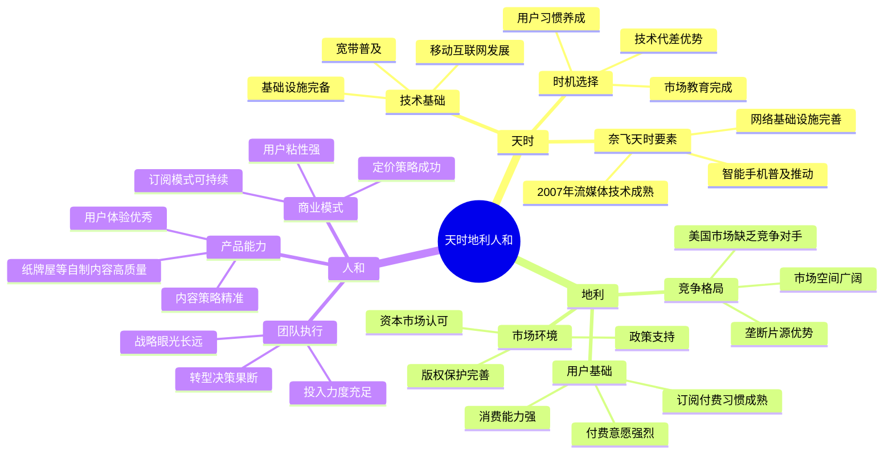

{: .no_toc }

<details close markdown="block">
  <summary>
    目录
  </summary>
  {: .text-delta }
- TOC
{:toc}
</details>
# 高增长科技股投资法：马克·马哈尼


这本书是华尔街25年资深互联网分析师的力作，为我们再现了那个时代的辉煌与企业的起起伏伏。

它超越了传统的价值投资框架，为投资者和科技从业者提供了一套系统的思维工具：

* 如何识别具有强大护城河的科技企业
* 如何理解行业周期规律
* 如何在巨大波动中保持理性

无论是寻求长期价值创造的投资者，还是身处变革浪潮的科技从业者，都将从这本实战指南中获得穿越周期的智慧。

## 第一部分: 科技股投资大师的崛起与投资理念

### 1. 投资大师背景与行业洞察

#### 1.1 作者介绍与专业背景

**马克·马哈尼（Mark Mahaney）**，一位具备25年华尔街从业经验的资深互联网分析师，是《高增长科技股投资法》一书的作者。他曾担任"互联网女皇"玛丽·米克尔（摩根斯坦利首席分析师，以其年度互联网趋势报告著称）的首席助理，并被机构投资者连续6年评选为华尔街顶级科技股分析师。其投资洞察力在业界享有盛誉，连凯茜·伍德（"木头姐"）和彼得·林奇等知名投资大师都经常向其咨询投资建议。马哈尼在书中结合丰富的实战案例，深入剖析了其在科技股投资领域的成功经验和核心方法论。

#### 1.2 科技股投资的挑战与机遇

**科技股投资具有高波动性、高弹性与高风险并存的复杂特征**，对投资者的专业能力提出了严峻考验。成功的科技股投资要求投资者具备精准识别优质企业的能力、制定长期投资策略的耐心以及有效管理风险的专业素养。区别于市场中普遍存在的概念炒作与题材投机行为，马哈尼始终坚持长期投资科技股的理性策略，认为短期投机行为往往会导致错失重要投资机会。

**商业模式强大的企业构成了科技股投资成功的核心要素**。马哈尼建议投资者重点关注具备独特价值主张、拥有技术领先优势、用户增长势头强劲且市场份额稳固的优质公司。下表展示了马哈尼长期推荐且表现卓越的科技股投资案例：

| 公司名称 | 投资建议     | 长期表现   | 核心竞争优势               |
| -------- | ------------ | ---------- | -------------------------- |
| 谷歌     | 持续买入评级 | 数十倍增长 | 搜索技术垄断、广告收入稳定 |
| 亚马逊   | 坚定看多     | 数十倍增长 | 电商龙头地位、云计算优势   |
| Facebook | 长期买入     | 数十倍增长 | 社交网络效应、广告精准投放 |
| 奈飞     | 持续推荐     | 数十倍增长 | 流媒体内容优势、全球化扩张 |

#### 1.3 科技股投资的现实困境

**科技股投资的核心难点在于业绩波动剧烈、产业壁垒可能快速消失以及新技术冲击带来的基本面不确定性**，导致股价呈现大幅波动特征。以英伟达（NVIDIA）为例，该公司在发展历程中曾经历两次暴跌90%和一次暴跌70%的剧烈波动。这种波动性不仅对投资者的心理承受能力提出严峻挑战，甚至连公司创始人也难以准确预测未来发展趋势。比尔·盖茨多次减持微软股票、马斯克频繁减持特斯拉股份等行为，均体现了科技股投资固有的不确定性特征。

**针对科技股的高风险属性，投资者普遍采用分散化持仓和阶段性投机策略进行风险管理**，然而这种保守策略往往导致投资者错失科技股最具爆发力的上涨阶段。尽管资深投资者老齐同样看好科技行业的长期发展前景，特别是技术革命临近时期科技股可能带来的超额收益，但如何精准选择优质标的成为制约投资成功的关键瓶颈。

### 2. 职业生涯的起伏与行业变迁

#### 2.1 投资生涯的挫折与成长

**华尔街投资分析师的职业生涯充满起伏与挑战，即便是行业顶尖分析师也难以避免职业挫折**。马哈尼在其25年职业生涯中遭遇了多次重大挑战：

| 时间       | 事件类型 | 具体情况                               | 影响                                                |
| ---------- | -------- | -------------------------------------- | --------------------------------------------------- |
| 2003年     | 职业转折 | 互联网泡沫破裂后被摩根斯坦利解雇       | 终止了其担任互联网女皇玛丽·米克尔首席助理的五年任期 |
| 对冲基金期 | 困境     | 未能提供有效的对冲投资建议             | 被对冲基金管理团队终止合作                          |
| 花旗集团期 | 变故     | 在成功组建华尔街领先的互联网研究团队后 | 遭遇职位变动                                        |

**这些职业挫折对马哈尼的个人生活造成了重大冲击，但也塑造了他的投资哲学和职业韧性**。投资市场的不确定性具有普遍性特征，成功之路往往充满坎坷，只有在正确道路上坚持不懈、抵御风雨，才能最终实现投资目标。

#### 2.2 互联网行业的历史性机遇

**马哈尼的职业生涯轨迹与互联网行业的发展周期高度吻合**，充分体现了科技行业的时代特征：


**马哈尼深感幸运能够完整见证互联网行业25年的发展历程**，从1998年至今跨越了四分之一个世纪的历史周期。这种职业经历类似于20年代关注汽车行业的分析师、50年代关注航空业的分析师以及70年代关注有线电视的分析师，他们都把握住了时代发展的重大机遇，充分享受了技术革命带来的时代红利。

#### 2.3 与投资大师的互动经历

**2015年，已退休的传奇基金经理彼得·林奇主动联系马哈尼咨询Groupon投资前景**，这一事件充分体现了马哈尼在投资界的专业权威地位。当时Groupon作为典型的"林奇式价值股票"正遭受科技投资者的大规模抛售，市场表现远低于行业平均水平，但其资产负债表状况依然健康且正在积极推进业务转型。

**马哈尼基于深入的财务分析和行业研究，建议彼得·林奇避免投资Groupon，而应重点关注谷歌和亚马逊等优质科技股**。这一投资建议不仅展现了马哈尼对科技股投资机会的独到判断力，也体现了他为投资者利益负责的专业操守。与彼得·林奇等投资大师的直接专业交流，进一步验证了马哈尼投资方法论的可信度和实用价值。

### 3. 投资成功与失败的案例分析

#### 3.1 成功的投资案例

**在25年的投资研究生涯中，马哈尼成功推荐了众多表现卓越的科技股投资标的**，其中包括：

| 公司名称         | 初始业务模式     | 转型路径                      | 增长倍数 | 成功关键因素                           |
| ---------------- | ---------------- | ----------------------------- | -------- | -------------------------------------- |
| 奈飞（Netflix）  | 传统DVD租赁服务  | 从DVD租赁转型为全球流媒体平台 | 数十倍   | 内容优势、全球化扩张、用户习惯培养     |
| 亚马逊（Amazon） | 专业在线书店     | 扩展为综合性电商+云计算双巨头 | 数十倍   | 电商龙头地位、AWS云计算优势、生态体系  |
| Priceline        | 在线旅游预订平台 | 深化服务、全球化扩张          | 数十倍   | 商业模式创新、市场timing准确、用户粘性 |

这些成功的投资案例充分验证了马哈尼对科技股长期发展前景的准确判断力，以及其长期价值投资理念的有效性。

#### 3.2 投资失误的坦诚反思

**即便具备丰富的投资经验和专业分析能力，马哈尼仍然坦诚面对并公开承认自己的投资失误**，体现了专业投资人的诚实品格和职业操守：

**重要投资失败案例**：
- **蓝围裙（Blue Apron）**：在线生鲜配送服务公司，获得投资推荐后股价持续大幅下跌，投资者损失程度高达93%
- **推特（Twitter）**：2016年9月发布卖出评级时股价为18.49美元，基于估值过高判断建议卖出，但随后股价意外上涨69%
- **谷歌（Google）**：2004年10月因股价短期上涨50%认为估值过高而给出卖出评级，但谷歌最终实现了数十倍的股价增长

**马哈尼没有刻意维护专家的完美形象，而是选择诚实地分享自己的投资过失和教训**。他明确告知投资者，即便是顶级专业分析师也会犯下投资错误，其中某些错误甚至属于不可原谅的严重过失。这种坦诚务实的态度为投资者提供了宝贵的风险教育素材。

#### 3.3 科技股的惊人回报统计

**互联网行业涌现了大量超高回报股票，投资收益远超传统行业水平**。根据马哈尼的统计数据，截至2020年底：

#### 互联网科技股回报分层统计

| 回报梯队 | 回报倍数 | 股票数量 | 典型代表企业                      | 企业特征                     |
| -------- | -------- | -------- | --------------------------------- | ---------------------------- |
| 第一梯队 | 1000倍+  | 2只      | 亚马逊（Amazon）、奈飞（Netflix） | 生态系统型科技巨头           |
| 第二梯队 | 500倍    | 1只      | -                                 | 行业绝对领先地位的企业       |
| 第三梯队 | 400倍    | 1只      | -                                 | 特定细分市场的垄断性企业     |
| 第四梯队 | 300倍    | 2只      | -                                 | 细分市场领先企业             |
| 第五梯队 | 10倍     | 23只     | -                                 | 各科技细分领域的行业龙头企业 |

**彼得·林奇在其1989年出版的经典著作《彼得林奇的成功投资》中重点强调了寻找10倍股投资标的的重要性**，而互联网行业实际创造的投资回报远超这一预期目标。值得注意的是，彼得·林奇曾自称具有"技术恐惧症"，在2000年千禧年版本的著作前言中对互联网发展持谨慎怀疑态度，但仍将亚马逊列为表现最为突出的500只科技股之一。

**市场对科技股的价值判断往往存在明显的时间滞后效应**。以投资后的两年时间维度评估，亚马逊股价下跌了90%，但从长期投资角度分析，这反而成为了极具前瞻性的投资决策。当时摩根士丹利的策略分析师曾公开质疑亚马逊永远无法实现盈利目标，但多年后亚马逊展现出强劲的自由现金流创造能力和持续盈利能力。

### 4. 科技行业的市场动态与投资哲学

#### 4.1 科技巨头的主导地位

**纳斯达克指数近年来的优异表现主要归功于科技巨头的强劲市场表现**。FAANG股票组合（Facebook/Meta、苹果、谷歌、亚马逊、微软）加上英伟达和特斯拉在纳斯达克总市值中占比接近50%，这些核心科技股的价格上涨直接推动了纳斯达克指数的整体上升。

**统计分析显示，如果扣除科技巨头的表现贡献，纳斯达克指数近年来的表现相比A股市场并无明显优势**，这充分表明标普500指数和纳斯达克指数的上涨动力主要来源于科技股板块的推动作用。

除了传统科技巨头外，部分新兴科技企业也实现了爆发式增长：
- **Airbnb（爱彼迎）**：共享住宿服务平台的领导者，股价呈现持续上涨趋势
- **DoorDash**：美国外卖配送行业的领先企业，股价实现了170倍的惊人增长

#### 4.2 互联网行业的胜者为王规律

**作为一名资深的互联网行业分析师，马哈尼自称为坚定的"大多头"，深信互联网在创造财富方面的巨大潜力**。这种观点与《大空头》中的悲观立场形成鲜明对比。互联网以惊人的成长速度持续创造财富价值，马哈尼在25年的职业生涯中见证了众多企业从创业公司成长为全美乃至全球性的科技巨头。

**彼得·林奇早在互联网行业发展初期就准确预见了未来的产业格局**，他认为互联网将像历史上的铁路、电话、电视等革命性技术一样，催生大量新兴巨头企业，但只有极少数企业能够最终生存下来，呈现"胜者为王、赢家通吃"的市场特征。目前这一判断正在成为现实：

**美国市场格局**：谷歌、亚马逊等企业在各自细分领域几乎不存在有效竞争对手
**中国市场格局**：腾讯、阿里巴巴、美团等企业已成为各自行业的标志性企业
**行业发展趋势**：每个细分领域通常只有1-2家企业能够最终获得成功

#### 4.3 市值结构的历史性变迁

**科技企业的崛起改变了美国股市的市值结构和经济方向**。1999年，全美市值最大的企业包括：

| 1999年市值最大企业 | 当前地位 | 当前科技巨头市值 |
| ------------------ | -------- | ---------------- |
| 微软               | 仍在前列 | 苹果             |
| 通用电气           | 地位下降 | 英伟达           |
| 思科               | 地位下降 | 谷歌             |
| 埃克森美孚         | 地位下降 | 微软             |
| 沃尔玛             | 仍在前列 | 亚马逊           |
| 英特尔             | 地位下降 | 脸书、特斯拉     |

**在中国市场，能够在世界500强中排名靠前的非国有企业基本都是互联网企业**，包括腾讯、阿里、美团、京东、拼多多、小米等。只有依靠互联网的东风，企业才能打破国企垄断，而且互联网企业往往只需要几年时间就能完成传统企业需要几十年才能实现的成长。

#### 4.4 科技行业的残酷现实

**互联网行业的成功背后隐藏着大量失败案例，可谓"一将功成万骨枯"**。投资失败的企业包括：

**美国市场失败案例**：
- **雅虎**：曾经的互联网门户巨头，如今已风光不再
- **众多互联网创业公司**：在互联网泡沫中倒闭

**中国市场失败案例**：
- **人人网、开心网**：社交网络先驱，最终衰落
- **拉手团购**：千团大战中的失败者
- **国美、苏宁**：传统零售电商化失败

**雅虎的失败案例尤其具有教育意义**。1999年第四季度，雅虎股价高歌猛进，CEO蒂姆·库格尔将成功秘诀归结为"不招聘傻瓜"，但这种简单化的结论并未揭示真正的成功因素。随着互联网泡沫破裂，雅虎股价暴跌，CEO也被扫地出门。

**eBay在互联网熊市中的表现形成了鲜明对比**。在2001-2004年的互联网熊市中，当其他公司暴跌时，eBay却逆势上涨6倍，CEO梅格·惠特曼被视为最优秀的职业经理人。但现在eBay的市值还不到亚马逊的2%，这说明互联网企业保持长期领先极其困难。

**老齐作为科技行业大多头的投资策略是采用一级市场打法**，即"乱枪打鸟"，买入一些赛道或风格的组合。虽然这种方式无法获得直接押中亚马逊、谷歌等公司的超高收益，但能够通过组合中的伟大公司收益来弥补失败公司的损失。

#### 4.5 科技股投资的核心原则

**投资科技股的第一课是必须容忍回撤**。股价始终在波动，时而大涨，时而大跌，这是投资者无法控制的因素。如果无法忍受波动，最好避免投资股票。

**股票价格的决定因素可以用以下思维导图表示**：


**每股收益**：反映公司基本面，主要看收入、盈利、自由现金流
**估值**：反映市场对公司未来的看法和情绪

**市场情绪受两个主要因素影响**：市场整体表现和公司近期表现。当大盘走势良好时，估值通常较高；当公司好消息频出时，市场情绪积极。

**股市存在自我强化的特征**：越涨好消息越多，越跌坏消息越多。大多数投资者被美好故事吸引而高位接盘，被坏消息吓跑而低位割肉。

### 5. 投资失败的深度案例分析

#### 5.1 蓝围裙案例的深刻教训

**优秀的基本面研究虽然重要，但无法完全克服市场固有的不确定性**。马哈尼深刻认识到，即便是具备卓越基本面分析能力的投资者，最终仍然可能成为失败的选股者，因为这两者之间存在着一个优秀心理学家的认知差距。

**成功的投资决策需要同时满足两个关键条件**：准确识别企业的基本面状况和发展前景，同时确保这些基本面因素尚未被市场充分反映和定价。

**通过简单的数学模型可以直观说明基本面研究的局限性**：
- 假设某股票当前每股盈利为1美元，市场给予15倍市盈率估值，股价为15美元
- 投资者通过深入研究认为未来三年盈利将保持10%的年均增长，达到1.33美元
- 在估值倍数保持不变的情况下，理论股价应上涨至19.97美元
- 但如果市场情绪恶化导致估值倍数降至10倍，实际股价将跌至13.3美元

**尽管投资者对基本面的判断完全准确，但最终仍然可能面临投资亏损的结局**。

**马哈尼认为股价的大部分波动走势与基本面因素关联性较弱，而与市场整体风险偏好密切相关**。华尔街投资界的传统认知认为，影响股价的因素主要包括三个方面：约三分之一来源于基本面的变动，约三分之一来源于行业环境的变动，约三分之一来源于整个市场的系统性变动。

**2020年新冠疫情爆发初期的市场表现充分说明了市场情绪在股价决定中的主导作用**：
- 标普500指数在短短一个月内暴跌34%
- 几乎所有科技股都遭受重创，只有Zoom逆势上涨50%
- 市场资金开始大规模追捧"居家办公"相关概念股
- 中国市场同步出现了"在家隔离吃零食"等消费主题的投资炒作

**这些剧烈的市场波动与企业基本面状况毫无关联，完全是投资者群体情绪波动的直接反映**。

**2017年蓝围裙IPO失败案例成为马哈尼职业生涯中最为痛心的投资失误**：


**关键时间节点详情**：
- **2017年6月29日**：正式上市，发行价每股10美元，募集资金3亿美元，初始估值19亿美元
- **CEO宣称**：供应链体系已全面打通，过去两年收入实现超过10倍增长
- **上市后不到一个月**：首席运营官宣布离职
- **5个月内**：开始大规模裁员，CEO宣布辞职
- **上市半年内**：股价跌至4美元，跌幅60%
- **上市一年半**：股价跌至0.66美元，累计跌幅90%
- **反向股票分割**：为避免退市风险，实施1:15反向分割
- **2020年3月**：股价跌至历史低点0.15美元
- **疫情期间**：被归类为"疫情受益概念股"，一个月上涨5倍，随后下跌一半

#### 5.2 蓝围裙失败原因深度分析

**从表面数据来看，蓝围裙的基本面指标显得相当强劲**：

| 指标类型 | 具体数据                     | 说明                                           |
| -------- | ---------------------------- | ---------------------------------------------- |
| 营业收入 | 单季2.45亿美元(年化10亿美元) | 营收规模可观                                   |
| 用户基础 | 100万活跃用户                | 用户基础稳固                                   |
| 市场空间 | 1.3万亿美元                  | 目标市场巨大（覆盖全美零售熟食和餐饮服务市场） |
| 竞争地位 | O2O领域领先，竞争对手少      | 处于市场领先地位                               |
| 市场认可 | 投行争相参与承销             | 上市认可度较高                                 |

**深入分析显示，导致蓝围裙投资失败的核心因素主要包括以下几个方面**：


**这次失败经历促使马哈尼对科技行业投资的护城河理论进行深刻反思**：
- 仅仅处于市场领先地位远远不够，必须建立真实有效的竞争护城河
- 这一认识与巴菲特价值投资理论中的护城河理念高度吻合
- 护城河的本质在于构建"只有你能做到，而竞争对手无法复制"的核心能力

**科技行业有效护城河的分类体系**：

| 护城河类型   | 作用机制         | 典型案例           | 防护效果                   |
| ------------ | ---------------- | ------------------ | -------------------------- |
| 商业模式优势 | 网络效应强化价值 | 腾讯微信社交网络   | 用户迁移成本极高，形成垄断 |
| 用户行为粘性 | 改变用户习惯路径 | 支付宝支付习惯植入 | 成为用户默认选择，替代困难 |
| 生态系统壁垒 | 构建完整服务链   | 美团外卖服务生态链 | 一站式服务，竞争者难以复制 |
| 规模经济效应 | 大规模降低成本   | 云计算等基础设施   | 成本优势形成价格壁垒       |

### 6. 其他失败案例与投资启示

#### 6.1 Zulily案例的商业模式局限性分析

**Zulily作为一家专注于服务年轻母亲和幼儿群体的闪购电商平台**，其失败案例为投资者提供了关于商业模式可行性的重要启示：

**公司发展历程概述**：

| 时间点     | 事件     | 股价/估值  | 备注                                                         |
| ---------- | -------- | ---------- | ------------------------------------------------------------ |
| 2013年11月 | IPO上市  | 每股22美元 | 募集资金2.5亿美元，高价发行                                  |
| 上市后     | 股价翻倍 | 最高41美元 | 公司市值一度接近50亿美元                                     |
| 2015年8月  | 被收购   | 每股19美元 | 被电视购物平台Liberty Interactive收购，当时实际股价12-13美元，相比高点跌幅超过60% |

**创始团队背景介绍**：
- 创始人此前通过在线珠宝销售业务获得创业成功
- 因经历一次不愉快的在线购物体验而萌生创办Zulily的想法
- 创始人具备敏锐的商业洞察力，对商业模式设计极为专注

**马哈尼的投资分析过程**：
- 马哈尼初步判断公司基本面状况良好，但估值水平明显过高
- 最初给予中性投资评级，建议等待更合理的买入时机
- 2014年6月股价回调50%后，给予买入评级并设定50美元目标价
- 然而半年后股价不涨反跌，马哈尼被迫下调投资评级

**业务失败的深层次原因分析**：


**Zulily案例向投资者揭示了一个残酷的现实：对于科技股投资而言，用户增长是支撑股价上涨的核心要素**：
- 当用户增长停止后，投资者必须关注单用户收入是否能够持续增长
- 如果单用户收入增长停滞，则需要重点关注单用户利润水平的提升
- 一旦用户、收入、利润等关键指标全部停止增长，市场估值将面临严重下行压力

#### 6.2 高朋案例的护城河缺失问题

**Groupon（中文名称：高朋网）作为团购行业的开创者和鼻祖，其失败案例具有重要的典型性意义**：

**企业发展历程回顾**：
- 2011年11月成功上市，恰逢全球团购业务热潮的高峰期
- 当时中国市场正处于激烈的"千团大战"竞争阶段
- 作为继谷歌之后规模最大的IPO之一，发行价设定为每股20美元
- 上市后两周内股价上涨至26美元，达到阶段性高点
- 随后股价进入漫长的下跌通道，累计跌幅超过90%
- 到2013年时股价已经下跌80%，CEO安德鲁·梅森被董事会解雇
- 2020年为避免退市风险，公司被迫实施反向股票分割

**马哈尼对高朋的投资建议分析**：
- 2013年高朋股价已经下跌80%的情况下，马哈尼仍然给予"持有"评级
- 这种评级实际上反映了其对公司前景的谨慎和不看好态度
- 主动建议彼得·林奇避免投资高朋股票

**业务失败的深层次原因**：


**反向股票分割作为重要的危险信号**：
- 根据马哈尼的深入研究，历史上实施反向股票分割的公司后续发展基本持续恶化
- Priceline是极少数成功转型的例外案例
- 对于投资者而言，任何实施反向股票分割的企业都应保持谨慎距离

**高朋案例为投资者提供了重要启示**：前期扩张越激进的企业，后期崩盘往往越惨烈。缺乏有效护城河的商业模式注定无法实现长期可持续发展。

**马哈尼建议彼得·林奇避免投资高朋的深层原因**：正是基于对商业模式的深刻理解和准确判断，一个缺乏核心竞争力、用户粘性不足的团购网站，根本无法在长期的市场竞争中获得成功。
## 第二部分: 科技股投资成功案例与陷阱规避

### 1. 科技巨头成功案例：Facebook、Netflix、Google的制胜策略

#### 1.1 Facebook(Meta)：财务奇迹与股价波动

在深入分析了科技投资领域的失败案例之后，我们转向那些实现了持续增长的科技巨头，探寻它们成功的核心策略。Facebook正是这样一个典型案例——它创造了罕见的持续增长奇迹，同时也经历了剧烈的股价波动，完美展现了科技股投资的双刃剑特性。然而需要强调的是，即使在这些看似成功的科技企业上实现持续盈利，依然面临着巨大的挑战性。

**Facebook卓越的财务表现**

| 财务指标 | 具体表现                               | 稀缺性评估 |
| -------- | -------------------------------------- | ---------- |
| 收入增长 | 连续35个季度保持30%+增速               | 极其罕见   |
| 盈利能力 | 营运利润率维持在40%+                   | 同样难得   |
| 现金流   | 2016-2020年每年至少100亿美元自由现金流 | 强劲稳定   |

**Facebook股价极端波动轨迹**


**Facebook面临的持续争议与挑战**

| 争议类型 | 具体表现               | 市场反应       |
| -------- | ---------------------- | -------------- |
| 内容政策 | 擦边内容、政治敏感信息 | 用户信任度下降 |
| 隐私保护 | 用户数据安全问题       | 监管压力增大   |
| 最大争议 | 2018年隐私事件         | 股价下跌43%    |

**股价波动背后的基本面分析**

面对股价的持续下跌，扎克伯格给出的解释深入而直接：公司在安全防护和隐私保护方面进行了大量战略性投入，同时坚持不削减新产品开发的投资力度，这些决策不可避免地影响了短期的盈利能力。特别是在连续3个季度出现营收增速下滑的背景下，尽管扎克伯格反复提醒投资者要着眼长远发展，但资本市场往往缺乏足够的战略耐心。当业绩增长从30%的高位降至10%时，华尔街立即作出了用脚投票的决定。

**投资启示：进攻性投资vs防御性投资的战略价值**

- **作者评价标准**：互联网公司关注收入增速+营运利润率的组合
- **Facebook独特优势**：500亿美元市值仍能保持20%+35%=55%组合，极其罕见
- **市场反应**：即便如此优质，预期转折仍无法阻止投资者抛售

**核心投资原则：市场错误定价时，优质公司提供最佳上车机会。**

Facebook收入增速下降源于进攻性投资而非防御性投资，这些投入短期损害盈利预期，但长期将巩固竞争优势。这一案例对国内芯片制造企业具有重要参考意义：2024年下半年开始的持续资本开支短期造成增收不增利，但长期属于进攻性投资，将带来更大产能和盈利。

**深度基本面分析的关键性**

深入分析可以发现，表面上相似的收入减少现象，实际上可能反映截然不同的基本面状况。从宏观经济的角度来看，经济增长速度的放缓并非总是衰退的表现，有时反而是主动进行结构性调整的信号，为后续的可持续发展奠定坚实基础。然而，资本往往表现出明显的短视特征，缺乏长远的战略眼光。当资本力量主导决策时，通常会以短期利益最大化作为出发点，难以进行真正意义上的长远战略布局。

#### 1.2 Netflix：用户增长与预期管理困境

Netflix作为流媒体先驱，展现了强劲的业务增长，但也面临预期管理挑战，反映了科技股投资的复杂性。

**Netflix商业模式与市场表现**

早在新冠疫情全面爆发之前，流媒体消费已经逐渐成为全球用户的共识选择，而Netflix作为这一趋势的先行者和主要推动者，自然成为了最大的受益者之一。其独特的商业模式和市场表现数据充分说明了这一点：

| 商业指标   | 具体数据                        | 市场地位                            |
| ---------- | ------------------------------- | ----------------------------------- |
| 会员费标准 | 月费8.99美元，年费超过100美元   | 显著高于国内主流视频网站            |
| 用户规模   | 2020年底突破2亿付费会员         | 全球流媒体市场的绝对领先者          |
| 股价表现   | 2016-2020年从111美元涨至531美元 | 累计涨幅达375%，为同期市场指数的4倍 |

**Netflix股价剧烈波动时间线**


**预期管理困境的根源分析**

深入分析Netflix股价暴跌的根本原因，可以发现市场预期的过度膨胀是主要推手。在2018年中期之前的持续暴涨过程中，华尔街对Netflix的用户增长预期不断攀升，已经远远超出了公司的实际增长能力。当财报显示实际新增用户仅为67.4万人，远低于华尔街普遍预期的120万人时，这种巨大的预期差直接导致了股价的崩盘式下跌。值得注意的是，实际增长数据约为预期的一半，而股价的跌幅也大致相当，这种高度相关性充分说明了市场预期管理的重要性。

**华尔街预期膨胀的恶性循环**


**用户增长预测的客观挑战**

| 挑战类型   | 具体表现                               | 难度评估 |
| ---------- | -------------------------------------- | -------- |
| 季节性因素 | 第二季度增长最慢，需与户外运动争夺时间 | 中等     |
| 历史数据   | Netflix经常错误预估用户增长数据        | 高       |
| 全球复杂性 | 需考虑各国家和地区状况                 | 极高     |
| 随机性影响 | 爆款剧集、世界杯等事件影响             | 高       |

**2019年再次大跌的双重冲击**

- **主要原因**：用户增量低于预期
- **额外冲击**：竞争对手迪士尼推出流媒体业务，市场担忧影响

**竞争影响评估的时间滞后性**

有时股价暴跌与公司基本面无关，仅因竞争对手变化。几个季度后，市场发现迪士尼业务并未对Netflix产生负面影响，股价回升。但当时确实难以判断是否有冲击。

**对比案例：拼多多对阿里的影响**

| 影响评估 | 当时观点                                 | 实际结果             |
| -------- | ---------------------------------------- | -------------------- |
| 市场定位 | 拼多多走下沉市场，阿里往天猫进军，无冲突 | 几年后阿里影响相当大 |
| 业务影响 | 往上走走不动，淘宝被冲击七零八落         | 冲击程度远超预期     |

#### 1.3 Google：持续增长与市场预期转折

Google展现了罕见的持续增长能力，但即便如此，市场预期的转变仍会导致股价波动。

**Google 2016-2020年稳定增长表现**

在大多数投资者的印象中，Google的股价似乎一直在稳步上涨，而2016年到2020年期间的表现确实印证了这一印象。通过具体数据分析，我们可以更清晰地看到Google在这一阶段的卓越表现：

| 表现维度 | 具体数据                                      | 市场比较                           |
| -------- | --------------------------------------------- | ---------------------------------- |
| 股价涨幅 | 从731美元涨至1735美元，累计涨幅达140%         | 显著超越同期标普500指数表现        |
| 增长记录 | 连续50个季度（长达12年半）保持20%以上收入增速 | 这一惊人记录直至疫情冲击才被终结   |
| 规模成就 | 2019年收入达到1620亿美元                      | 成功跻身全球收入最高的10大企业行列 |

**Google增速的全球意义**

随着基数扩大，维持增长越发困难。Google增速相当于全球经济增速的4-10倍，体现了其业务模式的强大。

**预期转折对股价的重大影响**

尽管常识显示Google表现优异，但当增速降至20%以下时，股价仍从1300美元跌至1000美元出头，跌幅超过20%。

| 影响维度 | 具体情况                      | 市场意义                       |
| -------- | ----------------------------- | ------------------------------ |
| 实际增速 | 降至19%（仍很高）             | 基本面依然强劲                 |
| 市场反应 | 单日暴跌7%，蒸发590亿美元市值 | 超过标普500成分股75%企业的市值 |
| 持续影响 | 股价继续走低，处于调整状态    | 市场过度反应                   |

**基本面健康与市场预期的脱节**

仔细阅读Google报告发现经营状态一切正常：

- **核心业务强劲**：移动搜索、YouTube、云服务增长强劲
- **问题所在**：仅略低于市场预期
- **快速恢复**：二季度收入增长回到22%，股价扭转趋势

**科技股投资的最佳时机**

这些公司最佳买入时机是在暴跌之后，等所有利空消息爆出，投资者极度悲观时。相反，即使骑上超级大牛股，也不一定能坚持到最后，中间会有无数次心理考验。

### 2. 亚马逊：大牛股传奇与投资启示

#### 2.1 亚马逊股价奇迹与暴跌考验

亚马逊创造了投资史上最惊人的回报之一，但其历程也包含了极端的风险考验，体现了长期投资的价值与挑战。

**亚马逊IPO投资的惊人回报**

在投资界，一个经常被讨论的假设性问题是：如果在某家公司IPO时投资1000美元，最终能够获得多大的回报？亚马逊的案例给出了令人震撼的答案，其投资回报率远远超出了大多数人的想象：

| 时间节点 | 投资价值      | 投资回报率     | 累计涨幅             |
| -------- | ------------- | -------------- | -------------------- |
| 初期投资 | 1000美元      | -              | 作为比较基准         |
| 2021年初 | 1,832,920美元 | 高达183,192%   | 约为原始投资的1832倍 |
| 2025年   | 进一步增长15% | 回报率继续提升 | 累计涨幅达到约2100倍 |

**亚马逊在科技股中的极端地位**

| 对比标的 | 相对表现         | 时间差异       |
| -------- | ---------------- | -------------- |
| 苹果     | 比苹果涨幅多一倍 | 同期比较       |
| 微软     | 跟微软在伯仲之间 | 微软多跑了11年 |

**2001年生死存亡的历史性考验**

即使是这样的超级大牛股，在2001年也遭遇了生死存亡的重大考验。当时股价一度暴跌超过90%，投资者需要整整10年的时间才能看到股价重新爬出这个巨大的"天坑"。这一经历充分说明了即便是最优质的投资标的，也可能面临极端的市场风险和周期性调整。

**2001-2011年期间的关键发展事实：**

- **业务的持续增长**：在这看似漫长的10年期间，亚马逊的核心业务始终保持有序增长，在线零售市场的规模不断扩大
- **战略性新业务布局**：2006-2007年间，公司果断推出了革命性的云服务(AWS)和电子阅读器Kindle，这些举措在当时看来都颇具前瞻性和意外性
- **新增长点的成功转化**：这些创新业务最终都成为了亚马逊重要的新增长引擎，为后续的爆发式增长奠定了基础

**投资时机的理性分析**

作者认为2001年抄底亚马逊不现实，但到2006年：

| 评估维度 | 具体情况                             | 投资价值                |
| -------- | ------------------------------------ | ----------------------- |
| 基本面   | 完全修复，表现极为扎实               | 优质标的                |
| 股价修复 | 仅修复一半，离2000年高点仍有较大距离 | 被低估                  |
| 后续回报 | 2006年介入到2020年涨72倍             | 持有到2025年能涨120多倍 |

**亚马逊投资历程的完整波动轨迹**


**亚马逊历次重大波动统计**

| 时间   | 跌幅    | 原因           | 恢复情况     | 投资启示   |
| ------ | ------- | -------------- | ------------ | ---------- |
| 2001年 | 90%以上 | 互联网泡沫破裂 | 10年爬出天坑 | 极端考验   |
| 2008年 | 50%     | 市场整体调整   | 恢复并创新高 | 市场因素   |
| 2011年 | 超过30% | 市场调整       | 恢复         | 短期波动   |
| 2014年 | 超过30% | 市场调整       | 恢复         | 短期波动   |
| 2018年 | 超过30% | 市场调整       | 恢复         | 短期波动   |
| 2022年 | 超过30% | 市场整体调整   | 恢复         | 周期性调整 |

**核心投资原则**

这些下跌都不是亚马逊业务出现问题，而是市场整体调整导致。市场调整总会发生，再好的股票也有令人失望的时刻。

**投资者心理的双重挑战**

**下跌拿不住与大涨拿不住的深层心理分析：**

- **面对下跌的恐惧心理**：当股价出现大幅下跌时，投资者往往会产生强烈的恐慌情绪，容易在低点非理性地抛售优质股票
- **面对上涨的贪婪心理**：当股价持续上涨时，投资者又容易被贪婪心理驱使，总想着在高点做波段操作赚取更多差价，这本质上是一种变相的贪婪行为
- **最终结果**：许多真正的大牛股一旦在中途被卖出，投资者往往再也没有合适的机会重新上车。这种情况下，投资者通常自以为聪明，实际上却聪明反被聪明误，错失了真正的财富增长机会

**投资决策的客观性约束**

客观而言，今天是开了上帝视角才这么说。站在当时看，投资者不知道亚马逊未来情况，也不知道美股会一直上涨。如果拿的不是亚马逊而是雅虎，那就是完全不同的故事了。

#### 2.2 财报季波动：短期交易风险与数据统计

财报季交易看似具有信息优势，但实际胜率不高，即使是表现最好的公司也无法避免短期波动风险。

**财报前买入的潜台词深度分析**

作者最为反感的问题之一就是在财报公布前询问是否应该买入某只股票。尽管这个问题表面上看起来合理，提问者通常是基金经理希望优化投资组合并寻找合适的买入时点，但通过深入沟通后发现，很多人的真实潜台词其实是：希望在财报发布前买入股票，等待利好消息释放后股价上涨时迅速卖出，从而赚取短期交易差价。这种操作在国内通常被称为"买预期卖现实"的交易策略。

**短期交易的四大结构性劣势**

| 劣势类型         | 具体表现                                     | 风险程度 |
| ---------------- | -------------------------------------------- | -------- |
| 预期判断复杂性   | 需同时看对基本面和市场预期、预期差           | 高       |
| 短期波动影响因素 | 受消息、资金面、政策面、竞争对手等多因素影响 | 极高     |
| 信息劣势         | 个人投资者处于信息末端，机构有数据优势       | 高       |
| 交易本身难度     | 即使事先知道财报，也难猜对市场反应           | 中等     |

**A股市场奇葩案例：**
美国大选期间川大智胜涨停、葫芦娃拉出7个涨停板等，体现了短期波动的随机性。

**亚马逊财报季波动的数据统计分析**

以财报表现最为强劲的亚马逊为例，2015-2018年发布16次季报：

| 波动类型 | 出现次数 | 具体案例                            | 累计影响 |
| -------- | -------- | ----------------------------------- | -------- |
| 大涨     | 4次      | 单日涨幅达10%                       | 显著正向 |
| 大跌     | 4次      | 2015年Q4当日暴跌8%，连续三天跌幅13% | 显著负向 |
| 具体案例 | -        | 2018年Q4当日跌8%，连续三天跌14%     | 严重负向 |

**概率分析的核心结论**

从数据统计概率看，季报后大涨和大跌概率相同，小涨和小跌概率也相同。这还是基本面表现最好的公司，换成其他公司可能出现下跌概率超过上涨概率的情况。

**短期交易的决策逻辑分析**


**投资与交易的本质区别**

老齐观点：投资和交易是两回事：

| 交易类型 | 思维模式                   | 胜率评估 | 赔率管理                   |
| -------- | -------------------------- | -------- | -------------------------- |
| 投资     | 先考虑胜率，再考虑赔率     | 相对较高 | 风险可控                   |
| 交易     | 胜率极低，无法通过指标改善 | 极低     | 只能通过止损不止盈改变赔率 |

**关键风险控制原则**

即使千挑万选择时点，胜率也不到50%，跟扔鞋效果差不多。关键中的关键，必须设置止损保护。

### 3. 科技股投资陷阱识别：财报交易与基本面分析

#### 3.1 财报季交易误区与风险分析

季度业绩预测极其困难，财报季前后进行短线交易是重大错误，应该专注长线基本面分析。

**核心投资原则**

季度业绩难以预测，在季报前后进行短线交易是重要错误。投资者应该专注于长线基本面，忽略短期股价波动，因为短期波动随机性极强，主要体现心理变化，与基本面关系不大。

**权威观点的一致性**

几乎所有优秀金融书籍都告诉大家要长期投资而不要短期交易，这反映了投资界的共识。

**投资与交易的本质区别**

老齐强调：投资和交易是两回事：

| 交易类型 | 优先级考虑               | 胜率特点 | 赔率管理策略           |
| -------- | ------------------------ | -------- | ---------------------- |
| 投资     | 先考虑胜率，再考虑赔率   | 相对较高 | 风险可控               |
| 交易     | 无法通过任何指标改善胜率 | 极低     | 不断止损不止盈改变赔率 |

**风险控制的关键性**

在做短线交易前必须明白，即使千挑万选的择时点，胜率也不到50%，实际效果与扔鞋差不多。关键中的关键，必须设置止损保护。

#### 3.2 Snapchat案例：预期差拐点投资实战应用

Snapchat案例充分展示了预期差投资策略的有效性，以及过分关注短期财报数据可能错失重大机会的风险。

**Snapchat基本面转折的关键节点**

2019年4月，Snapchat（阅后即焚应用）发布了备受关注的第一季度财务报告，这份报告成为了公司基本面转折的重要标志：

| 财务指标   | 实际表现                   | 市场预期   | 超预期幅度                 |
| ---------- | -------------------------- | ---------- | -------------------------- |
| 营业收入   | 3.2亿美元                  | 3.06亿美元 | 超出预期1400万美元         |
| 净亏损情况 | 亏损幅度比预期少2000万美元 | -          | 实现显著改善               |
| 日活跃用户 | 新增400万用户              | -          | 创造了过去一年来的最大增幅 |

**市场反应与基本面的明显背离**

从基本面的角度来看，这份财报数据确实非常强劲，按照常理推断，业绩超预期应该推动股价大幅上涨才对。然而市场的实际反应却完全出乎意料：财报发布后的第一个交易日，股价不涨反跌，大跌6%；在接下来的两个交易日中，跌势进一步加剧，累计跌幅达到了10%。这种异常的市场走势让许多短线交易者措手不及，纷纷因恐慌而选择止损卖出股票。

**长期价值释放的完整时间线**


**作者的专业跟踪过程**

作者在2019年4月财报披露前一直给予跑赢大盘评级，很早就关注这家企业：

| 跟踪维度   | 具体情况                                            | 投资价值                 |
| ---------- | --------------------------------------------------- | ------------------------ |
| 公司价值   | 曾拒绝Facebook和谷歌两次天价收购，看似错过300亿美元 | 2021年市值超过1000亿美元 |
| 基本面优势 | 用户增长快，活跃度高                                | 长期潜力                 |
| 投资评级   | 在买入和持有评级间切换                              | 专业认可                 |

**长期困境与市场误判**

结果令人失望，从2017年近30美元一路跌至4.8美元。华尔街认为阅后即焚完全过时：

| 问题类型   | 具体表现                         | 市场反应     |
| ---------- | -------------------------------- | ------------ |
| 产品问题   | 智能眼镜不吸引人，安卓手机体验差 | 用户流失     |
| 管理层动荡 | 多位高管相继离职                 | 公司不稳定   |
| 估值崩溃   | 市销率从上市时20倍跌至5倍        | 市场失去信心 |

**基本面拐点的识别**

2019年风向突然变化，Snap在安卓平台重新设计程序，改进用户体验，在开发者论坛听取正面反馈。作者推断基本面拐点即将到来。

**科技股投资的重要思路：抓拐点**

- **业绩由差变好**：股价往往弹性十足
- **业绩由好转差**：跌幅也十分巨大
- **核心原理**：预期差问题

**预期管理的投资逻辑**

| 预期水平 | 业绩表现         | 股价反应 | 投资机会 |
| -------- | ---------------- | -------- | -------- |
| 高预期时 | 即使业绩很好     | 也难大涨 | 谨慎观望 |
| 低预期时 | 给点阳光就能灿烂 | 容易大涨 | 积极布局 |

**Snap 2019年大涨的秘密**

华尔街预期足够低，大家都不看好这家公司。

**华尔街预期判断方法**

作者提供思路：财报发布前：

| 市场信号   | 预期判断                                   | 投资建议     |
| ---------- | ------------------------------------------ | ------------ |
| 股价涨幅大 | 市场预期过高（大家都觉得业绩好，提前买入） | 谨慎         |
| 股价下跌   | 市场预期较差                               | 寻找机会     |
| 指数同理   | 同样逻辑适用                               | 参考市场整体 |

**短期波动的随机性**

Snap业绩超预期后还跌几天，这正说明短期波动确实很随机，按理性逻辑无法解释。

#### 3.3 Chewy与Uber案例：限售股解禁与基本面判断教训

Chewy和Uber案例进一步证明了财报不是影响股价的唯一因素，限售股解禁等非基本面因素同样可能导致重大股价波动。

**Chewy的财报超预期暴跌案例**

美国宠物电商平台Chewy，2020年二季报显示：

| 财务指标     | 实际表现                 | 市场预期   | 表现评估           |
| ------------ | ------------------------ | ---------- | ------------------ |
| 营收         | 17亿美元                 | 16.4亿美元 | 高6000万美元，超4% |
| 收入增长率   | 从Q1的46%加速至47%       | -          | 增长加速           |
| 用户增长     | 新增160万，总用户1660万  | 好于预期   | 用户增长强劲       |
| 基础财务指标 | 毛利率、EBITDA等明显改善 | -          | 财务健康           |

**市场反应的极端性**

在这样强劲的数据公布后，Chewy股价大跌10%，任何短线交易者在这种情况下都会选择止损。

**长期价值的体现**

3个月后，Chewy股价竟上涨50%。

**历史对比分析：Pets.com失败案例**

为了理解Chewy案例，作者讲述了pets.com（宠物在线）的故事：

| 对比维度 | Pets.com                | Chewy         | 本质差异           |
| -------- | ----------------------- | ------------- | ------------------ |
| IPO时间  | 2000年2月               | 2019年6月     | 互联网泡沫vs成熟期 |
| IPO价格  | 11美元                  | 22美元        | 不同时代背景       |
| 首日表现 | 涨30%至14美元           | 涨59%至35美元 | 都受追捧           |
| 收入规模 | 仅600万美元             | 35亿美元      | 天壤之别           |
| 市值峰值 | 3亿美元                 | -             | 严重不符基本面     |
| 最终结果 | 9个月后跌至0.19美元破产 | 持续经营      | 完全不同命运       |

**从上市到破产仅9个月**，这种事在A股会让投资者骂娘，但在美股却比比皆是。

**Chewy与pets.com的本质区别**

回到Chewy公司分析：

| 评估维度   | Chewy情况                                                    | 投资价值     |
| ---------- | ------------------------------------------------------------ | ------------ |
| IPO情况    | 2019年6月22美元IPO，首日涨至35美元，涨幅59%                  | 市场认可     |
| 基本面差异 | 上市时收入已达35亿美元                                       | 实体业务扎实 |
| 管理团队   | CEO精通市场推广、物流、产品等环节，高管多来自亚马逊、全食超市 | 专业团队     |
| 长期看好   | 基于以上因素，作者非常看好                                   | 投资价值高   |

**Chewy股价的发展轨迹**


**Uber的基本面好转与股价下跌悖论**

Uber上市前一年（2018年）自由现金流-20亿美元，2019年亏损翻倍至-49亿美元，净亏损超80亿美元，但IPO市值高达750亿美元。随后几个月遭遇巨额抛售。

**2020年疫情冲击**

疫情初期暴跌至13.7美元，比开盘价45美元跌70%。

**基本面转折的明确信号**

2019年11月财报已显示数据好转：

| 转折信号 | 具体表现                   | 重大意义         |
| -------- | -------------------------- | ---------------- |
| 亏损缩小 | 持续缩小且好于预期         | 基本面改善       |
| 盈利承诺 | 宣布2021年可实现EBITDA盈利 | 重大转折点       |
| 历史意义 | 对持续巨亏多年的企业       | 意味着基本面转折 |

**市场反应的困惑**

这些消息并没让Uber迎来股价表现，仍在接下来2天跌13%，说明投资者担忧不来自基本面盈利好转。

**真正原因：限售股解禁**

- **解禁规模**：财报发布后，早期投资者和内部员工股锁定期结束，7.5亿股不受限制
- **市场冲击**：引发股价大跌
- **行业规律**：科技企业限售股是影响股价重要因素，限售期结束往往引发大规模变现和市场抛压

**核心投资教训**

财报只是影响股价的一个因素，还有太多其他影响因素。这些都是短期困扰，会导致股价大幅波动。如果投资者没有短期扛住波动的能力，最好不要投资科技股。

### 4. 科技股投资估值哲学：收入导向与成长性评估

#### 4.1 市场有效性与近因偏差认知误区

市场并非完全无效或有效，而是大部分高效但存在因近因偏差导致的局部无效，这为敏锐投资者提供了机会。

**华尔街资深分析师的深刻洞察**

一位经验丰富的华尔街分析师曾经说过一句发人深省的话："我们真的非常幸运，因为市场并非完全有效，否则我们这些分析师早就失业了。"这句话虽然是半开玩笑的语气，但却深刻揭示了市场定价机制的复杂性和投资机会的来源。

**市场有效性理论解析**

| 理论观点 | 核心含义                     | 投资启示                 |
| -------- | ---------------------------- | ------------------------ |
| 市场有效 | 充分定价，任何研究都是徒劳的 | 基金经理无法跑出超额收益 |
| 市场无效 | 存在可挖掘的投资机会         | 主动投资仍有价值         |

**作者的平衡观点**

作者不认同绝对观点，认为市场大部分高度有效，但存在一些无效部分，原因是给了当下数据更高权重，科学术语称为"近因偏差"。

**近因偏差的定义与影响**

近因偏差指大部分投资者因近期事件而过度反应的现象。

**第三方预测机构的失效案例**

| 机构类型            | 提供服务     | 实际效果       | 最终结果 |
| ------------------- | ------------ | -------------- | -------- |
| Netflix用户增长预测 | 付费预测数据 | 从未预测准确过 | 后来倒闭 |

**投资启示**

预测性信息往往是市场扰动而非有效指导。

#### 4.2 收入导向估值哲学与估值模型

科技股估值应该更关注收入而非利润，因为收入是成长性的根本体现，也是未来现金流的基础。

**传统估值方法在科技股领域的局限性**

著名投资大师彼得·林奇在他的投资理念中一直教导投资者要重点关注企业的盈利指标，这一传统价值投资理念在过去确实被证明是有效的。然而，当我们面对科技股这一特殊投资领域时，作者的观点有所不同，认为应该给予收入指标更多的关注权重。

**DCF模型的逻辑链条深入解析**

作者进一步解释了DCF模型（现金流折现模型）背后的逻辑关系：盈利确实非常重要，这一点毋庸置疑，正如巴菲特反复强调的自由现金流同样至关重要。整个投资行业都在使用DCF模型来评估企业价值，其核心逻辑是将企业未来的预期现金流折算到今天的现值。

**收入在整个价值链条中的基础性地位**

要理解DCF模型，就必须认识到收入在整个价值创造链条中的基础性地位。自由现金流必须以企业盈利为前提，而企业盈利又必须以稳定的收入为基础。如果一家公司连最基本的收入都无法保证，那么就不可能实现可持续的盈利，更谈不上产生自由现金流，甚至可能无法维持正常的经营活动。

**科技企业的特殊性质**

在科技行业中，我们经常看到一个独特的现象：许多科技企业在发展的早期阶段可能没有实现盈利，甚至现金流为负，但只要能够保持持续的收入增长，市场仍然会给予它们很高的估值。这说明投资者更看重企业的成长潜力而非短期盈利能力。

**企业盈利的三种实现路径**

作者深入分析后指出，企业可以通过三种不同的方式来实现盈利目标：

| 获取方式 | 具体实现方法                                                 | 对企业成长性的影响                       | 推荐程度     |
| -------- | ------------------------------------------------------------ | ---------------------------------------- | ------------ |
| 增加收入 | 扩大市场份额、开发新产品、进入新市场                         | 最健康、最可持续的增长方式               | 高度推荐     |
| 降低成本 | 节衣缩食、压缩运营开支、优化资源配置                         | 可能对未来的成长性产生负面影响           | 谨慎使用     |
| 金融工程 | 调整财务报表、进行并购重组、出售亏损资产、增加一次性收入、实施利润转移等 | 属于短期行为，不可持续，可能损害长期价值 | 坚决避免依赖 |

**利润表的可调整性**

利润表可以调整，调整空间还挺大，因此看利润表时要与资产负债表和现金流量表做比对。

**科技企业的风险信号**

对于科技企业，如果走到降低成本或借助金融工程增加利润的程度，就存在巨大风险。

**科技企业投资价值的核心**

科技企业最大投资价值在于成长性，成长性从收入体现。如果科技企业开始节衣缩食、压缩成本，就没有成长性了。老齐认同这个逻辑。

#### 4.3 收入增长估值模型与阿里巴巴案例分析

收入增长与估值倍数存在可量化的线性关系，这为科技股估值提供了科学依据和实战指导。

**基本估值原则**

一般情况下，收入增长越快，科技股估值越高。

**彼得·林奇的PEG概念**

彼得·林奇提出PEG（市盈率增长率）概念，认为利润增长率最好与估值倍数匹配，如20%利润增长对应20倍市盈率比较合理。

**作者的收入增长估值模型**

收入增长与估值倍数也存在线性关系，基本是1:1到2:1的关系：

| 增长类型   | 收入增长率 | 合理估值倍数 | 关系比例 |
| ---------- | ---------- | ------------ | -------- |
| 低增长情况 | 5%         | 5倍          | 1:1      |
| 高增长情况 | 40%        | 20倍         | 1:0.5    |

**估值可视化应用**

可以画一条线，线下企业都是低估的，具有高收入、低估值特性。

**2022年估值图谱分析**

作者2022年做的图显示：

| 估值区域 | 代表企业                | 收入增长  | 估值水平    | 投资机会 |
| -------- | ----------------------- | --------- | ----------- | -------- |
| 低估区域 | Google、Netflix、Amazon | 高增长    | 合理偏低    | 价值投资 |
| 明显低估 | 阿里巴巴                | 20%多增长 | 不到5倍估值 | 重大机会 |

**阿里巴巴的验证案例**

回看阿里巴巴走势，确实处于当时历史最低点，到2025年已涨一倍还多，验证了收入增长估值模型的有效性。

### 5. 科技股投资战略思维：成长导向与价值投资理念差异

#### 5.1 科技股投资与价值投资理念差异分析

科技股投资与传统价值投资采用了截然不同的思维维度和评估框架，投资者必须清晰地理解并区分这两种投资理念在本质上的差异，才能在复杂的投资环境中做出正确的决策。

**传统投资教科书的经典观点**

传统投资教科书一直以来都在教导投资者要将注意力集中在以下几个核心方面：
- 企业利润的最大化实现
- 股票回购计划的执行
- 分红政策的制定和执行

**科技股投资的独特思维模式**

然而，科技股投资者需要采用完全不同的角度来思考问题，因为科技股投资的核心关注点是企业的成长性潜力，而不仅仅是当前的盈利能力。

**成长性的根本来源分析**

企业的成长性必须通过可持续的收入增长来实现，如果缺乏收入的持续增长，那么任何利润增长都缺乏坚实的基础，从长远来看是毫无意义的。

**股票回购和分红政策的重要警示信号**

对于真正的科技企业而言，大规模的股票回购和高比例的分红政策往往不是应该优先考虑的事项。一旦出现企业过度倾向于这些财务操作的情况，往往说明公司可能已经找不到新的业务增长方向或投资机会。

**作者的双重视角和辩证观点**

作者特别强调，股票回购和分红这两个财务操作本身并没有错，它们确实是在为股东创造价值，但却与科技股投资的根本初衷可能存在背离。真正优秀的科技企业应该将更多的资源和精力投入到创新增长中，而不是简单地通过财务手段来回报股东。

**价值股转化的可能性**

可以把科技股当成价值股考虑，正如巴菲特投资苹果。苹果给大量股票回购和分红，长期维持高ROE水平，巴菲特赚到很多钱。

**思维维度的本质差异**

价值股投资与科技股投资不是同一思考维度：

| 对比维度 | 价值股投资   | 科技股投资 | 巴菲特案例                                     |
| -------- | ------------ | ---------- | ---------------------------------------------- |
| 关注焦点 | 估值不能太贵 | 成长性     | -                                              |
| 投资逻辑 | 价值回归     | 收入增长   | 买苹果时10几倍市盈率，大笔减持时超过30倍市盈率 |

**科技股投资的核心特征**

| 投资类型   | 关注焦点   | 估值方法 | 时间维度 | 风险特征 |
| ---------- | ---------- | -------- | -------- | -------- |
| 科技股投资 | 成长性     | 收入增长 | 长期视角 | 高波动性 |
| 价值投资   | 估值合理性 | 盈利能力 | 价值回归 | 低波动性 |

**投资策略选择的思考框架**


**混合投资策略的可能性**

在实际投资中，投资者可以采用混合策略，但必须清楚区分不同股票采用的不同投资逻辑，避免思维混乱导致决策错误。
## 第三部分：科技股增长的核心要素与市场空间

### 1. 科技股增长的驱动力：内生与外延式增长

#### 1.1 科技企业增长的两种模式

**科技公司通过内生性增长和外延式增长两种模式获得发展，其中内生性增长最有价值。**

根据作者的研究分析，可以推断出科技公司通过推出新产品而获得内生性增长显然是最有价值的，然而科技股上的并购案例也是相当多的，这被称为外延式增长。也就是说，通过吸收能产生利润的公司进来，从而提升业绩。这种策略也能推升股价上涨，正如他在担任分析师的25年当中，所见证的一些成功的并购案。

**收入是判断并购成功与否的核心指标，决定企业的市场竞争力。**

成功的并购案例包括：
- **eBay收购贝宝**：提升了长期价值
- **谷歌收购YouTube**：增强了平台内容生态
- **Facebook收购Instagram**：扩大了社交网络版图

当然失败的并购也不少，这个在后面会讲到。

那么并购能不能成功，究其原因收入也是一个重要的原因，或者说收入是最符合市场审美的指标。不只是短期，乃至长期也是如此。

**eBay和雅虎的失败案例充分说明了收入稳定增长的重要性。**

失败的并购案例警示：
- **eBay和雅虎**：并购策略出现问题
- **问题表现**：保持盈利能力但收入增长不稳定
- **最终结果**：市场竞争力逐渐下降

相比之下，priceline（美国版携程）的成功经验：
- **盈利状况**：盈利能力并不突出
- **收入表现**：维持了10年的收入增速
- **成功原因**：与收购booking有重要关系

#### 1.2 收入增速与投资估值的关系

**互联网四小强中只有亚马逊成功的原因在于其持续的业务创新能力。**

根据作者的观察，现在的部分年轻人可能从来都没用过雅虎和eBay了，然而放在20年前，也就是作者年轻的时候，这两个产品是非常火爆的，完全不亚于现在的亚马逊和谷歌。这倒是实话，当时的互联网四小强，分别是亚马逊，美国在线，eBay和雅虎，而现在也只有亚马逊，仍然在纳斯达克七小强里面。

**1999年底的市值数据显示美国在线的互联网霸主地位，但最终被时代所淘汰。**

如果当时做个投票，作者敢肯定大家不会认为最后成功的会是亚马逊，因为当时反而争议最大的就是他。

**1999年底互联网四小强市值对比：**

| 公司     | 市值（亿美元） | 市场地位     |
| -------- | -------------- | ------------ |
| 美国在线 | 1930           | 互联网第一股 |
| 雅虎     | 970            | 第二强       |
| 亚马逊   | 340            | 争议较大     |
| eBay     | 80             | 最小市值     |

美国在线的市值是后面三小强的总和还要多，因此当之无愧是互联网第一股，地位不可撼动。

**历史告诉我们，短期市值领先并不能保证长期成功，关键在于持续的业务增长。**

然而到了2015年和2017年，这两位老大哥（美国在线和雅虎），最终纷纷还是躲不开被收购的命运。

#### 1.3 互联网时代的企业估值逻辑

**eBay在互联网泡沫期的强劲表现证明了基本面强劲的重要性。**

再看eBay，这其实就是淘宝的原型，虽然他当年市值最低，但却势头最猛，特别是在互联网泡沫期，他顶着纳指暴跌的压力，逆势涨了51倍。这充分说明了当年的一种奇迹，究其原因主要是eBay的基本面太猛了。

**eBay的财务数据显示了其超级成长期的特征。**

**eBay超级成长期关键财务指标（2000-2004年）：**

| 财务指标                   | 表现数据       | 说明             |
| -------------------------- | -------------- | ---------------- |
| 年平均收入增速             | 超过70%        | 超级增长特征     |
| GMV增速                    | 接近70%        | 交易规模快速扩张 |
| 息税摊销前利润率（2004年） | 41%            | 盈利能力强劲     |
| 重大并购                   | 2002年收购贝宝 | 战略布局成功     |

这充分说明了这就是一个妥妥的超级成长期。

**Skype收购案例显示了战略性投资决策的重要性与风险。**

但是2005年末，eBay宣布以30亿美元价格，收购skype，这实际上是当时最先出现的互联网通信软件，最早实现了视频通话功能，然而这玩意最后没干好，2年之后，eBay就为此减记了14亿美元。那么如果他要干成了，很可能就是现在阿里加上腾讯了。

### 2. 互联网巨头的兴衰：eBay与雅虎的案例研究

#### 2.1 eBay：从辉煌到增长的瓶颈

**GMV增长率跌破30%是eBay股价表现的重要分水岭。**

对于eBay这种电商网站来说，毫无疑问GMV就是核心指标。只要GMV高速增长，其他就都不是问题。然而随着整个的规模扩大，增长率也必然往下掉。

**eBay GMV增长率变化轨迹：**
- **最初3年**：70%高速增长
- **中间3年**：30%稳健增长
- **第三个三年开始**：13%增速下滑
- **2008年金融危机**：1%增长
- **2009年**：-4%负增长
- **金融危机后**：回升至10%左右

**eBay股价表现与市场对比（2005-2015年）：**

| 投资标的    | 10年涨幅       | 表现评价     |
| ----------- | -------------- | ------------ |
| eBay        | 0%（不再上涨） | 增长停滞     |
| 标普500指数 | +71%           | 市场平均回报 |
| 亚马逊      | +600%（6倍）   | 超级表现     |

增速跌到30%以下是个重要的分水岭，伴随着增长率持续下行，eBay股价的超级行情也就逐渐结束了。从2005年之后，表现就很不好了。

#### 2.2 戴维斯双杀：估值与增速的致命关系

**估值下降是导致eBay股价停滞的核心原因，体现了戴维斯双杀的威力。**

深入分析eBay的股价表现，在2005年到2015年，虽然他的业绩增速依然有10-20%，然而股价却不增长了，究其原因问题出在哪？主要就是估值下降了。

**估值倍数与增长率的关系决定了股价表现，30%是重要的增长阈值。**

因为2005年之前，大家都是按照你80%增速，给的你估值，但后来你业绩降得太快，因此估值也就大打折扣。基于我们之前给过大家一个最简单的投资公式，股价=每股盈利X市盈率，或者股价=每股收入X市销率，后面的市盈率和市销率就都是市场的估值倍数，说白了就是投资者对于这只股票的预期增长率。

**估值与增长率的数学关系：**
- **高估值预期**：50倍估值意味着投资者预期50%以上甚至80%以上的增速成长
- **估值下调**：一旦维持不住这个增速，估值就要下降
- **下降幅度**：增速降一半，估值降幅甚至会达到70%

**30%是成长股的重要判断标准，低于此阈值会触发估值逻辑的切换。**

不同增速区间的估值逻辑：
- **30%以上增速**：按成长股评估，主要看收入
- **30%以下增速**：不再是成长股，估值逻辑切换到利润和自由现金流

**戴维斯双杀是成长股暴跌的主要原因。**

戴维斯双杀的影响因素：
- **业绩下滑**：增速跌破30%
- **估值下杀**：业绩和估值双重打击
- **下跌幅度**：动辄跌70%
- **关键变量**：之前估值越高，价格下杀幅度越大

所以很多成长性公司，一旦增速跌破30%的时候，都往往是暴跌的下场。那些动辄跌70%的公司，归根结底都是戴维斯双杀，也就是杀业绩的同时，杀了估值。

#### 2.3 雅虎：从互联网霸主到被收购的命运

**雅虎从互联网霸主到被收购的命运充分说明了增长速度的决定性作用。**

接下来我们看看雅虎，这实际上是第一代互联网帮主，在90年代的时候，堪称是垄断性企业之一，具体来看94年才创办，2年后就上市了，而且上市首日，股价就飙升了150%，这些都堪称奇迹。

**雅虎的历史数据显示了其曾经的辉煌与1000倍的市盈率。**

雅虎巅峰时期的关键数据：
- **1999年12月**：被纳入标普500成分股
- **市值**：接近1000亿美元
- **市盈率**：1000倍
- **2000年1月**：上市以来累计上涨35倍

但当时没有人觉得不妥，反而觉得标普没有雅虎，就是不完美的。

**雅虎的衰落并非因为市场环境恶化，而是自身增长能力的丧失。**

**雅虎市值变化对比：**

| 时间点       | 市值（亿美元） | 变化幅度            |
| ------------ | -------------- | ------------------- |
| 1999年巅峰期 | 1000           | 基准点              |
| 2016年被收购 | 48             | 下跌98%（仅为1/20） |

**同期其他科技公司表现：**
- **谷歌**：市值增加5000亿美元
- **Facebook**：市值增加3500亿美元
- **市场环境**：美国、纳斯达克、互联网都在高速增长

显然雅虎的衰落不是因为市场环境不好，而是自身增长能力的丧失。

**雅虎的财务数据显示其盈利能力依然良好，但增长率下降是致命问题。**

**雅虎财务表现（2000-2015年）：**
- **息税摊销前利润率**：33%（依然盈利强劲）
- **自由现金流**：比较不错（在科技公司中难得）
- **结论**：仍然是一家很赚钱的公司

**增长率从70-80%降至12%以下是雅虎衰落的核心原因。**

**雅虎收入增速变化轨迹：**
- **2006年之前**：20%以上，动辄70-80%
- **2007年开始**：降至12%
- **之后时期**：再也没超过2位数

**雅虎用了13年时间消化千倍估值，体现了高增长停止的严重后果。**

估值消化历程：
- **高增长停止**：无法维持千倍估值水平
- **股价下跌**：持续下跌至2013年见底
- **消化时间**：13年时间消化上千倍估值
- **停滞期**：2006-2015年，10年股价不涨

**科技公司的高增长具有阶段性特征，需要寻找第二增长曲线。**

所以从雅虎的股价表现来看，我们还是得出了那个结论，科技股买的就是高增速。有高增速在，高估值就不是问题，一旦高增速无法维持，那么高估值就会要了你的命。动辄损失个70-80%也都是常态。

**科技企业增长的3年规律：高增长3年后增速减半，6年后基本见顶。**

**科技企业增长规律的时间线：**


**第二增长曲线成功案例：**

| 公司   | 第一增长曲线 | 第二增长曲线 | 蛰伏期              | 后期表现 |
| ------ | ------------ | ------------ | ------------------- | -------- |
| 亚马逊 | 3C业务       | 云服务业务   | -                   | 持续增长 |
| 微软   | 软件业务     | 云服务/AI    | -                   | 重焕活力 |
| 英伟达 | 显卡业务     | AI算力芯片   | 2000-2013年（13年） | 涨100倍  |

**投资观察要点：**
- **3年高增长**：需要开始警惕
- **6年高增长**：基本接近顶部
- **第二增长曲线**：关注企业新业务布局
- **蛰伏期价值**：长期布局可能带来巨大回报

所以大家可以去数一数，一个公司的增长阶段，提前识别增长拐点。

#### 2.4 投资要点总结：识别增长拐点的关键信号

**持续高增长企业是优质股票，长期投资仍能获得良好收益。**

**投资要点总结：识别增长拐点的关键信号**

| 要点                  | 关键内容                   | 投资启示                       |
| --------------------- | -------------------------- | ------------------------------ |
| **1. 长期高增长价值** | 企业能保持长时间高速增长   | 发现优质股票，仍能获得良好收益 |
| **2. 增长放缓风险**   | 收入增长大幅放缓（降一半） | 危险信号，即使仍是高速增长     |
| **3. 估值承受能力**   | 估值水平决定承受能力       | 低估值能容忍降速，高估值很危险 |
| **4. 估值增速比较**   | 增速vs估值的安全边际       | 增速>估值安全，增速<估值危险   |

**具体操作要点：**

**🔍 增长放缓信号识别：**
- 收入增长降一半是危险信号
- 不要认为降速后仍是高增长就安全
- 平稳降速可接受，急速降速需警惕

**📊 估值风险评估：**
- **低估值企业**：降速一半还可容忍
- **高估值企业**：降速一半非常危险
- **时间因素**：3-4个季度内降速一半说明严重问题

**⚖️ 安全边际判断：**
- **30%重要坎**：增速低于30%且向下，引发剧烈调整
- **市场比较**：个股估值vs市场整体估值
- **贝塔波动**：估值不高于市场，降速后跟随市场波动

投资者应综合运用这四个要点，提前识别增长拐点，规避风险。

### 3. 持续增长企业的成功之道：Priceline与奈飞

#### 3.1 Priceline：十年百倍的增长奇迹

**Priceline的成功证明了持续强劲增长的巨大投资价值。**

**Priceline股价表现时间线：**


**尽管市场质疑，Priceline的强劲业绩证明了其投资价值。**

市场分歧对比：
- **巴伦周刊（2013年）**：警告股价太高，风险较大
- **作者观点**：最大多头之一，写文章驳斥
- **实际表现**：长期证明作者判断正确

**强劲的预定金额增长和高利润率是Priceline成功的核心要素。**

**Priceline关键财务指标：**

| 财务指标     | 表现水平 | 评价         |
| ------------ | -------- | ------------ |
| 预定金额增速 | 30-50%   | 增长强劲     |
| 息税前利润率 | 20-40%   | 盈利能力优秀 |
| 估值水平     | 15-25倍  | 相对保守     |

**Priceline独特的投资判断标准：增长率与利润率之和超过50%。**

作者的投资筛选公式：
- **增长率 + 利润率 > 50%** = 好公司
- **逻辑**：要么增速很快，要么很赚钱
- **Priceline**：30-50%增速 + 20-40%利润率 = 远超50%

**估值水平相对较低提供了安全边际，避免了大幅下修风险。**

**Priceline估值优势分析：**
- **估值倍数**：15-25倍（大幅低于收入增速）
- **行业对比**：科技股通常估值>增速，Priceline相反
- **风险控制**：不存在估值大幅下修风险
- **结果**：业绩增长全部反映在股价上

这种低估值为投资者提供了充足的安全边际。

#### 3.2 市场空间决定增长天花板

**市场空间是预测未来增速的关键因素。**

那么问题来了，怎么预测未来的增速呢？其实主要是看市场潜力，因为priceline所处的是一个1.5万亿美元产值的全球旅游市场，这意味着即便他高速增长这么多年，也只占了全市场份额的5%。所以未来的空间还依旧很大。

**Priceline的案例显示了市场份额与增长潜力的关系。**

**Priceline市场空间分析：**

| 分析维度         | 具体数据                | 投资含义     |
| ---------------- | ----------------------- | ------------ |
| **市场总规模**   | 1.5万亿美元全球旅游市场 | 天花板极高   |
| **当前市场份额** | 仅占5%                  | 增长空间巨大 |
| **历史增长表现** | 连续10年强劲增长        | 证明可行性   |
| **估值水平**     | 15-25倍（低于增长速度） | 安全边际充足 |

**增速放缓后的表现变化（2018年后）：**

**业绩表现对比：**
- **收入增速**：从30-50%降至10%+
- **股价表现**：基本与标普500同步
- **超额收益**：大幅减少
- **保护因素**：估值一直不高

**估值保护的重要性：**
- **高估值风险**：估值高出增速很多，一旦增速下滑，估值下修压力很大
- **低估值优势**：估值保护使得增速放缓后仍能避免大幅下跌
- **投资启示**：估值与增速的合理比例是长期投资的关键

这充分说明了市场空间决定增长天花板，而估值水平决定了风险控制能力。

#### 3.3 奈飞：从DVD租赁到流媒体帝国的转型

**奈飞从传统租赁业务成功转型为流媒体企业，实现了420倍的股价增长。**

**奈飞发展历程的关键数据：**

| 发展阶段      | 时间跨度    | 关键指标         | 评价             |
| ------------- | ----------- | ---------------- | ---------------- |
| **DVD租赁期** | 2002年上市  | 传统业务模式     | 不符合巴菲特审美 |
| **现金流期**  | 2002-2020年 | 18年无正向现金流 | 长期投入期       |
| **股价表现**  | 2002-2020年 | 涨420倍          | 超级回报         |

**奈飞的成功转型充分说明了市场规模对企业发展的重要性。**

**市场规模对比分析：**

| 业务类型    | 市场规模                   | 天花板高度 | 增长潜力 |
| ----------- | -------------------------- | ---------- | -------- |
| **DVD租赁** | 局部市场                   | 有限       | 饱和     |
| **流媒体**  | 全球4000亿美元影视娱乐市场 | 极高       | 巨大     |

创投圈智慧："你得到有鱼的地方去钓鱼，你的生意市场规模决定了你的天花板。"

**奈飞业务转型路径：**


**转型成功的关键因素：**
- **市场机会**：误打误撞进入流媒体领域
- **规模效应**：全球4000亿美元市场打开天花板
- **模式创新**：从传统租赁到数字订阅
- **时机把握**：抓住了技术变革的机遇

这种转型展示了市场规模对企业发展的决定性作用。

#### 3.4 奈飞的增长动力：订阅模式的魅力

**奈飞连续8年20%以上的增速是非常罕见的优秀表现。**

**奈飞转型时期（2012-2013年）业务结构变化：**
- **DVD租赁业务**：收入稳步下滑（传统业务退出）
- **流媒体业务**：连续8年近30%高速增长（新业务崛起）
- **整体收入**：连续8年保持20%+增速（转型成功）

**奈飞增长表现的对比数据：**

| 增长指标           | 奈飞表现     | 市场平均                 | 超越幅度     |
| ------------------ | ------------ | ------------------------ | ------------ |
| **流媒体收入增速** | 连续8年近30% | -                        | 超常规增长   |
| **整体收入增速**   | 连续8年20%+  | 标普500 5-7%（20年平均） | 高3-4倍      |
| **年新增用户**     | 千万级别     | -                        | 规模效应显著 |
| **业务持续性**     | 8年高增长    | 多数业务3年增速减半      | 极其罕见     |

**奈飞增长动力的核心分析：**
- **收入增长**：流媒体业务成为主要增长引擎
- **用户增量**：年增千万级别用户支撑收入增长
- **增长持续性**：打破了"3年增速减半"的行业规律
- **市场地位**：这种增速水平在标普500中极其罕见

**市场对比结论：**
标普500过去20年平均收入增长仅5-7%，奈飞的增速表现确实令人惊叹。这种持续高增长在科技行业也是非常少见的存在。

**投资者对奈飞的长期预期容忍了短期现金流的恶化。**

而且奈飞的新增订阅用户数据，也在持续增长。基本都是一年上千万的增量。由此可见收入和用户增量，是奈飞股价持续走高的真正原因。在这种增长面前，没有人会去关注他的自由现金流在持续恶化。因为投资者坚信，奈飞只是在做投资，一旦他不投资了，就会赚到大把的自由现金流。

**奈飞的投资逻辑类比了个人收入增长与财富积累的关系。**

举个不恰当的例子，一个人的收入每年都是20%增长，今年5万，明年6万，后年7万2，但他却存不下什么钱，有点钱都请客送礼了，甚至还管父母亲戚借了很多钱。但大家都觉得这不是事，因为都知道他后面会赚很多钱，只要他爬到高位就会变得很富有。

#### 3.5 订阅商业模式的独特优势

**持续高增长直接对应股价持续上涨。**

作者总结了3个要点，第一，奈飞和priceline一样，如果持续高增长，就代表股价会持续上涨。你不需要担心之前的涨幅，因为他后面还会继续涨。

**订阅商业模式具有收入透明、用户粘性强的独特优势。**

第二订阅的商业模式非常棒，因为收入很透明，用户粘性也很强，旱涝保收。所以增速就取决于新用户的增长状况。甚至当存量用户越来越多的时候，用户自己就会去宣传，因此他的营销费用反逐渐降低。

**股票市场的长期预期容忍了短期的现金流亏损。**

第三股票市场的预期是长期的，在强劲的增长预期面前，所以短期的自由现金流亏损，并不引人关注，或者说投资者对他的忍耐度很强。

### 4. 科技股投资的核心要素：创新与市场空间

#### 4.1 第二增长曲线：科技股投资的关键逻辑

**第二增长曲线是科技股投资中最重要的逻辑，能够重新打开企业的增长天花板。**

接下来作者讲了一下第二增长曲线，这是科技股投资当中，最重要的一个逻辑，也就是企业找到了一个全新的业务，而这个业务正在快速增长。使得企业重新打开了增长的天花板，比如之前我们说的，亚马逊的云服务，英伟达的人工智能算力芯片，还有腾讯的微信，阿里的支付宝等等。

**第二增长曲线的成功案例：**
- **亚马逊**：云服务业务
- **英伟达**：人工智能算力芯片
- **腾讯**：微信业务
- **阿里**：支付宝业务
- **奈飞**：提价策略

**奈飞通过提价策略实现了第二增长曲线，体现了运营策略创新的重要性。**

而奈飞的第二增长曲线，也在2017年出现，在2018年初之后，它实现了6个月股价翻倍。但当时奈飞，并没有干什么新业务，而只是采取了提价策略，把9.99美元的订阅费提升到了10.99美元。用户才多出1美元，所以边际影响非常小，这次提价非常成功，因为用户流失很少。但对收入和利润的贡献非常直接。

**提价策略显示了定价能力的重要性，能够带来直接的利润增长。**

这里多说一句，由于成本是固定的，你并不用对提价多付出什么，所以提价的部分，就是你的纯利润。因此对于奈飞来说，他又不损失用户数量，那么提价之后，利润增长非常的快。

**具备定价能力的企业才是优质投资标的。**

所以老齐一直给大家灌输一个思想，能够涨价的生意才是好生意，一个只能不断降价，不断打价格战的生意，就别投了。

**第二增长曲线通常来源于新产品、新服务或运营策略的创新。**

一般来说，第二增长曲线，都与新产品新服务推出有关，或者是他的运营策略发生变化，比如区域扩大，要么就是奈飞这样的，干脆就是简单粗暴地提价。

**A股市场也存在具备定价能力的优质企业。**

在A股市场上，也有很多这种企业，比如茅台，比如榨菜。茅台是因为买的人不喝，喝的人不买，所以越提价，卖的反而越好。而榨菜是因为单价太便宜了。3-4块钱一包，涨个5毛钱，也不太引人关注。所以对销量影响不大。

**大多数企业缺乏定价能力，提价困难。**

但对于绝大多数企业来说，提价是挺困难的，比如号称中国版奈飞的爱奇艺，要想涨会员费，会被骂死。

#### 4.2 20%增长法则：科技股投资的重要参考

**特定事件导致的业绩暴增往往不可持续，需要辩证看待。**

对于业绩增速来说，我们也要辩证的去看，有时候业绩暴增，不一定都是好事，比如新冠疫情，让亚马逊这种线上零售业务需求暴增，因为大量实体店关门，大家都转向了线上购买，导致亚马逊的收入增长从26%，提升到了40%。

**同比增速的统计规律决定了高增长的不可持续性。**

但这种因为特定事件导致的收入大增，也意味着到2021年的时候，他的增速会大幅下滑。果然2021年第一季度，他的增速就又跌回了24%。永远记住，同比增速这个数据，是跟上一年进行的比较。因为上一年数据基数低，所以他下一年就容易实现高增长，如果上一年基数很高，那么下一年就比较困难。这跟公司本身无关，是统计上的一些规律。

**20%收入增长是科技股跑赢市场的重要阈值。**

作者总结，20%是个坎，如果能持续实现20%高收入增长的科技股，基本都是股价大涨的。因为这一指标，比标普500的成分股，要高了3-4倍。

**20%增长法则的关键数据：**
- **增长阈值**：20%收入增长
- **相对优势**：比标普500高3-4倍
- **稀缺性**：只有2%的企业能维持5年
- **年度数量**：每年约10只股票
- **长期表现**：基本跑赢基准

**持续20%增长的企业非常稀缺，但长期表现优异。**

同样也是非常稀缺的，只有2%的企业，能维持5年实现20%的收入增长。也就是说每年只有10只股票，能实现这个速度。那么可以想见，这些股票，也长期会跑赢基准。

**20%增长法则并非总是有效，短期表现具有不确定性。**

但这里也要说明的是，他们只是长期跑赢，而并不总是跑赢，根据作者统计，从1994年到2020年期间的27年当中，15年跑赢，8年跑输，4年跑平。这也就是投资最困难的地方。任何规律都是建立在长期基础上的，即便你是高增长，短期的结论也是不确定的。

**投资需要耐心等待均值回归，避免追涨杀跌。**

最后作者的结论就是，永远不要孤立使用，20%收入增长法则。有的时候，即便是最好的企业，他也可能不涨，甚至反而下跌，跑输市场。我们也没别的办法只能耐心等待。坚信他长期会均值回归。这就叫天之道损有余而补不足。千万别干人之道，损不足而奉有余，那就成了追涨杀跌。看什么短期涨的好就买什么，最后必然损失惨重。

#### 4.3 科技股增长的四大核心要素

**产品创新和市场空间是推动科技股增长的两大核心要素。**

既然我们知道，推动科技股上涨的重要因素是收入，那么影响收入的因素有哪些呢？作者总结了4个核心要素：

**科技股增长的四大核心要素：**


#### 4.4 产品创新与商业模式的迭代

**亚马逊的云服务业务是第二增长曲线的典型成功案例。**

作者举了亚马逊的例子，因为亚马逊推出新产品是最多的，比如2006年他的云服务业务，就是他典型的第二增长曲线，作者甚至说，这是一个跟iphone时刻比肩的事情。

**产品创新也有失败案例，体现了业务迭代的风险。**

但其实亚马逊也推出过很多的新产品，比如出过一款手机叫做fire，用来跟苹果竞争，但最后卖的不好，也推出过一个拍卖平台，用来打击eBay的业务，这个也没成功。

**Kindle电子阅读器的成功也体现了时代局限性对业务的影响。**

作者比较喜欢的是他的kindle 电子阅读器，2007年推出来，当时销量确实不错，火了一阵。但后来也就沦为了盖方便面的工具。至少在中国是这样。因为Kindle的阅读体验，远没有各种pad更好。所以后面也就没什么人买了。

**所有业务都有时代局限性，需要持续创新。**

所以还是那句话， 好业务，其实都有他的时代局限性。

**亚马逊云业务的成功使其转型为全球最大的云服务提供商。**

对于亚马逊来说，他的云业务增长速度是非常快的。远快于他零售业务增长。所以亚马逊已经不是一个网上卖东西的企业，而成为了一家全球最大的云服务提供商，其实阿里巴巴也一样，在沿着亚马逊的道路前进，至少现在阿里巴巴是，国内最大的云服务提供商。

**云服务市场格局显示了亚马逊的领先地位。**

那么啥事云服务，说白了就是建立服务器机房，做基础设施投入，然后客户可以使用你的服务器存储数据，也可以租你的CPU进行计算。其实云服务也不是亚马逊发明的，他只是刚好把这个东西做成了而已，目前他占了全世界云服务的40%，其次是微软云和谷歌云，然后就是咱们的阿里云和华为云。

### 5. 科技企业案例分析：从谷歌到优步的市场空间评估

#### 5.1 创新力驱动：维持高增长的核心动力

**创新力是维持收入高增长的最主要动力，包括产品创新和商业模式创新。**

创新力才是维持收入高增长的最主要动力，而这个创新力，不光是产品创新，还包括商业模式创新，比如奈飞的创始人，里德哈斯廷斯就把奈飞打造出了一个很好的商业模式，正如我们讲了，他1997年创立，之前只是个DVD租赁公司，那会根本就没有流媒体的说法，因为技术水平达不到。

**技术进步是商业模式创新的重要前提条件。**

大家还都没有网呢，你拿什么支持流媒体，到2007年，宽带普及率才50%。所以那会他只能专注于DVD的租赁，并通过邮寄的方式实现。

**流媒体与DVD租赁业务的成本结构差异巨大。**

到了2007年，慢慢的可以有视频放在网上播放了，然后他就开始此消彼长，逐渐降低DVD邮寄的比例，增加网络订阅用户数量。这两个业务的天花板完全不同，成本也差距巨大。网络订购用户，甚至边际成本为0，而且营销传播力极强。要远比他发展线下的邮寄用户省时省力的多。

**转型过程体现了投资者短期主义与经营者长期视野的差异。**

但转型是痛苦的，从2006年开始，投资者看到的情况是奈飞的新增用户数量，开始放缓。统计显示大盘涨了14%，他却下跌了5%。所以这就是资本和经营者的差距，因为二级市场的投资者，往往都是短视的。因为他们选择太多，你今天不好，我就不投你，去投别人了。

**经营者必须牺牲短期利益为长远发展做布局。**

但经营者，特别是创始人，通常没那么多选择，他们必须得想尽一切办法，把公司搞好，所以有的时候，就得牺牲短期利益，为长远发展做布局。

**基础设施投入和短期表现恶化是长期成功的必要代价。**

奈飞拥抱流媒体的时候，需要做大量的基础设施投入，至少要花掉4000万美元，相当于他要把一年的利润，全都扔进去，也需要把更多地营销经历放在线上用户的拓展上，所以自然就影响他线下DVD用户的开发，那会投资者甚至都认为，奈飞是瞎烧钱，不知道他在搞什么东西。

**创新初期往往表现不佳，需要时间验证和优化。**

另外，任何创新，一开始都是很丑陋的，正如老齐当年是第二批视频网站的从业者，2010年加盟的酷6网，当时烧钱就是个无底洞，而且体验还非常不好，没啥内容。搞了一堆所谓拍客，号称UGC，但内容质量非常差，页面也搞的乱七八糟，所谓广告，跟牛皮癣一样让人讨厌。

**技术进步需要基础设施完备，时机选择至关重要。**

直到后来爱奇艺腾讯入局，专注于长视频内容之后，体验感才逐渐上来。但后来没想到风水轮流转，抖音B站小红书出来，又回到了短视频和UGC方向，但由于技术代差，当下的短视频跟2010年的短视频，无论是质量还是数量，完全不可同日而语，甚至是几何级跨越，所以对长视频冲击巨大。

**这给我们一个启示，有的时候并不是方向不对，而是时间不对。**

因为技术和基础设施不完备的时候，就属于天时不到。这时候你再努力，再烧钱，也是很难干出来的。

#### 5.2 天时地利人和：科技企业成功的三大要素

**奈飞的成功体现了天时地利人和的完美结合。**



**不同行业的天时地利人和分析。**

```mermaid
  mindmap
    root((不同行业的天时地利人和分析))
      中国视频网站
        天时：✓具备
        地利：✗版权保护不足
        人和：✗自制剧能力弱
        结果：举步维艰，无法实现奈飞式增长
      人工智能领域
        天时：✓算力具备
        地利：✓政策支持，资本认可
        人和：✗优秀产品和强烈需求待寻找
        潜力：要素具备程度较高，发展可期
```


#### 5.3 Stitch Fix与Spotify：商业模式的创新与挑战

**商业模式创新需要有用户增长数据的支撑才能转化为股价表现。**

作者接着又讲了一家stitch fix公司，2011年创立，是一家个性化服装穿搭服务公司。也就是靠一套算法，实现在线造型师功能，为你搭配衣服。然后再售卖商品。用户拿到商品后，3天内，你要不喜欢可以退货。这实际上就把商品和服务结合了起来，把路边的服装店搬到了线上。他的业绩也是很不错，年收入10亿美元，活跃用户200万，收入持续20%增长，但这次作者错了，他2017年底给出买入评级之后，股价先跌了一个34%，然后又涨了一个50%，2年过去了，股价只有26美元。

**核心用户指标下降预示着未来增长放缓的风险。**

由此可见高收入增长，并没有带来股价上涨。那么为什么会出现这个现象呢，究其原因就是他的核心用户指标，在下降，因为新增用户从12万，降到了5.4万。这使得投资者认为，他未来的收入增速，也会掉下来。

**特殊事件可能导致用户爆发式增长，但需要判断可持续性。**

老齐补充一下，从2020年疫情来了，这种商业模式才被消费者广泛认可，新增活跃用户，瞬间达到了104万，新增用户达到24万，破除了之前大家的担忧。股价也大涨了8倍，并在2021年初见顶，随后跌去了98%。

**商业模式创新的可持续性是投资判断的关键。**

这个案例告诉我们，有的时候用户的巨大增长，并非是来自于他的业务创新，制造了新的需求，而只是因为发生了一些特殊事件。所以我们在研究商业模式创新的时候，还得仔细想想，他是否具备可持续性。当然这个很难，有时候创始人和深度从业者也不知道

**Spotify通过并购投入播客领域，体现了第二增长曲线的战略布局。**

还有的企业会通过并购实现产品创新，比如Spotify这类似于美国版的喜马拉雅，也可以说是腾讯音乐，他在2019年，投入了巨资，进行播客领域的收购，还花费了10亿美元请来了一些著名的播客创作者，这10亿美元，相当于他2016-2019年自由现金流的总和还要多，也就是说把3年多赚来的钱，全都扔进去了，他孤注一掷，就是要学奈飞，搞个音频上的流媒体出来。然后也想每月9.99美元，收会员费。

**Spotify的商业模式创新取得了初步成功。**

这家公司2006年创立，先进入英国市场，2011年才进入美国，这一年他有了100万付费用户，2020年底的时候，达到了1.5亿用户，月活也有3.5亿人。他给用户提供了2种模式，一种是免费+广告的模式，另一种是付费模式。他现在是最大的音乐服务平台。

**Spotify播客业务的投入获得了显著的用户增长和市场表现。**

那么他斥巨资搞播客这个事，成功了吗？统计表明成功了，因为播客的新业务开拓，让他的用户增长速度，首次超过了50%，也获得了更多地广告收入，毛利率也提升了。股价在2020年暴涨了3倍，但随后又跌了80%，到2022年见底，之后又涨了10倍。

**美国股票市场的高波动性需要投资者具备强大的心理承受能力。**

所以美国股票这个波动幅度，确实挺有意思。没有一颗大心脏，你肯定受不了。

#### 5.4 中美市场环境差异：同样的商业模式，不同的命运

**同样的商业模式在中美市场表现出截然不同的结果，体现了市场环境的重要性。**

其实这些公司，在中国市场，也都有对应的产品和企业，但有意思的是，同样的业务，在美国容易成功的，在咱们这就很艰难，特别是这种有版权的付费订阅。

**版权保护不足是阻碍付费订阅业务发展的重要因素。**

我们轻松就能搞到盗版，所以不愿意在原创内容这个事上面花钱。因此国内的付费订阅，地利应该还没到。

**工具性科技产品在中国更容易成功，体现了用户基础的重要性。**

但也有些生意，美国搞不成，我们却做的很大，比如eBay和贝宝，就明显输给了淘宝和支付宝，高朋也没有干过美团，甚至优步都输给了滴滴，腾讯就不说了，美国的Skype，WhatsApp都没有微信这个体量。

**中美市场商业模式成功要素的对比分析：**

| 业务类型 | 美国表现 | 中国表现 | 成功要素             |
| -------- | -------- | -------- | -------------------- |
| 付费订阅 | 成功     | 困难     | 版权保护、用户习惯   |
| 电商平台 | 失败     | 成功     | 用户基础、本地化     |
| 社交工具 | 失败     | 成功     | 用户规模、网络效应   |
| 出行服务 | 失败     | 成功     | 市场适应性、政策环境 |

老齐总结，就是工具性的科技，我们这边更容易成功，毕竟我们的用户基础在这摆着呢。特别是跟生活息息相关的工具。一旦全民使用，是一个非常大的体量。

#### 5.5 推特的教训：缺乏创新力导致增长停滞

**推特的衰落充分说明了创新力对科技公司长期发展的重要性。**

推特的案例，就是推特，这是一个微笑曲线，也就是上市以来，先跌了3年，又涨了3年，直到2020年，才回到了2014年的位置上。那么为啥表现这么糟糕，因为股价长达4-5年都在IPO价格之下运行。

**成长期过后增长率大幅下降是推特股价长期疲软的根本原因。**

主要就是因为推特的成长期过了，他2013年上市，而我们都知道，2013年都已经是微信的天下了，微博的热度早就过了。数据显示微博热度最高的时候是2010年到2012年。推特也是同样的逻辑。

**推特的收入增速从116%大幅降至20%，导致了估值水平的相应下降。**

他的收入也从2013年的第四季度，就开始放缓，从116%的收入增速，降至2016年第二季度的20%，这也导致了估值从17倍，降到了5倍。接着收入增速继续恶化，直到2020年疫情来了，推特的收入增速才出现了反弹。

**推特在互联网大平台中基本面数据最弱，主要体现在收入增长方面。**

可以说在这些互联网大平台当中，推特的基本面数据是最弱的。并不是利润方面差，主要就是收入增长方面，差了很多。

**推特缺乏产品创新和快速迭代，界面多年没有明显变化。**

所以根据作者的投资框架，如果收入增速不行，他也就始终没有给出太好的评级。那么为啥推特收入不行，作者说是创新力不足，没有看到他有什么快速迭代。界面永远都是那一套。

**微博的发展轨迹与推特相似，都体现了缺乏创新力的后果。**

正如中国的微博其实也一样，10几年前啥样，现在还是啥样，除了公知们吵架，实在没啥用处。

**用户规模和使用频率的不足限制了推特的广告收入能力。**

推特的用户数，也远远小于Facebook和谷歌，这让他无法在使用频率上，和他们抗衡。而这又是广告商非常看重的，所以他吸引广告的能力就很弱。一大堆匿名用户，天天在上面吵架，哪个广告商也不会重视这样的产品。

**马斯克的收购为推特提供了退市机会，但其基本业务问题依然存在。**

后来也得亏马斯克这个冤大头，带有政治目的的把推特给私有化退市了。否则到现在，估计依旧会比较差。看微博就知道了，2014年上市，从20多跌到10美元，然后涨到142美元，然后就是一路暴跌，最低跌到7美元，也就是说跌了95%下去，现在才9美元，现在微博的收入根本就不增长了。

#### 5.6 业务增长拐点：投资者必须关注的关键指标

**科技公司的增长具有阶段性，需要不断寻找第二增长曲线。**

所以我们总结，科技这个行业，其实全都靠创新来驱动收入的，只有收入才能驱动股价走势，再好的业务，也不能混一辈子，通常就是3年，然后你就得去想其他的办法。才能获得第二增长曲线。

**单一业务吃一辈子的想法不现实，投资者需要提前识别增长拐点。**

想一个业务吃一辈子，这是不现实的。那么作为投资者我们要提前去洞悉这种业务增速的拐点，包括了增速向下的拐点，也包括新业务在布局期，即将出现的向上的拐点。

**增长拐点信息无法从财报中获得，需要通过管理层调研获取。**

这个都是在财报上看不出来的，你只能去找企业的管理层调研。让他们给你说说，究竟最近在搞一些什么东西。

**投资判断需要依靠投资者自身的分析能力和判断力。**

然后就得靠你的判断力了，其实科技公司，日常的创新产品不少，一年里面都得有几十个想法，但是真的能成为第二增长曲线的，却十分有限。

#### 5.7 判断业务潜力的两大关键：收入基数与市场空间

**收入基数和市场空间是判断业务潜力的两个关键维度。**

那么怎么去判断一个业务到底有没有潜力呢，作者说主要是看2点，第一是收入的基数，第二是市场空间。

**市场空间决定了业务增长的潜力上限。**

如果已经是一个100亿美元收入了，那么他还能不能高速成长，这个得看他到底在多大的市场当中，如果是一个500亿美元的市场，那他几乎不可能快速增长了。甚至可能都不会增长了，因为份额已经足够高了。

**市场空间与收入基数的关系：**

| 收入基数  | 市场空间  | 增长潜力 |
| --------- | --------- | -------- |
| 100亿美元 | 500亿美元 | 有限     |
| 100亿美元 | 1万亿美元 | 巨大     |

**小市场限制了企业的发展空间，大市场提供了持续增长的潜力。**

但如果他要在一个1万亿美元的市场当中，其实也只占了 1%，所以增长还是有很大潜力的。所以这一下思路就全都打开了，你的新业务，要进入的是一个怎样的市场，就决定了你能切到多大的蛋糕。

**市场规模直接决定了企业的收入天花板。**

比如你开个小超市，周围三公里就是你的收入天花板了。这种生意，投资人是不会感兴趣的。但如果你说我干个中央厨房，以后给全国的餐馆做预制菜的配送，那这个天花板一下就打开了。

#### 5.8 谷歌：巨大市场空间支撑持续增长

**谷歌在万亿美元广告市场中的份额证明了巨大市场空间的支撑作用。**

作者举了谷歌的例子，谷歌的2024年收入达到了3500亿美元，其中3000亿是广告收入，400亿是谷歌云，其他占了100多亿美元。这么大的体量， 是否不容易增长了呢？

**谷歌在巨大的广告市场中仍有充足的增长空间。**

谷歌总给大家讲，他是在一个全球万亿美元的广告市场当中。而这些年，他也依旧保持了10%的广告业务收入增速。所以你如果单看谷歌，他已经几乎垄断了所有的在线广告，但是如果放在整个广告行业当中，还有很大的空间可以去做。

**谷歌的发展战略体现了对市场空间的充分认知。**

谷歌本身也是这个意思，谁说以后所有的广告，不会都变成线上呢。在作者写这本书的时候，全球15%的广告开支，已经都进入了谷歌的腰包。而如今这个比例应该还在进一步的抬升。

**谷歌解决了传统广告浪费的问题，提供了更高效的广告服务。**

之前就有人看到了谷歌的颠覆性，说谷歌向所有广告商提供了优质的市场推广渠道，更好的衡量，更好的分析，更多的控制以及最好的结果。比如有零售行业的高管吐槽，按照之前广告行业的常识，花在广告上的钱，至少有一半都是被浪费的，但问题是，我们不知道是哪一半，谷歌所做的，就是解决这个问题，避免广告费的浪费。

**谷歌的历史表现体现了高增长企业的优异回报。**

数据显示，2004年8月19日，谷歌以85美元的发行价上市以来，在2014年拆过一次股，到了2020年，他的实际股价涨幅已经超过了40倍。而同期的标普500，只涨了17倍。

**谷歌不同时期的超额收益表现：**

| 时间段      | 跑赢市场倍数 |
| ----------- | ------------ |
| 2005-2010年 | 43倍         |
| 2010-2015年 | 2倍          |
| 2015-2020年 | 3倍          |

**收入增长速度是决定股价表现的关键因素。**

如果分时间段去看，2005年到2010年，谷歌跑赢市场43倍，2010年到2015年跑赢2倍，2015到2020年跑赢3倍。那么为什么在2010年之前，跑赢这么多，主要原因是他收入增长太快了。

**收入规模达到250亿美元后，增长速度会显著放缓。**

数据显示2009年之前，他是主要的增长期，也是在2009年，他达到了250亿美元的收入水平。过了250亿美元，这些巨头们收入增速就基本都降到了20-30%的水平。

**谷歌通过更好的用户体验获得了搜索引擎市场的主导地位。**

在谷歌成立之前，其实很多搜索引擎就已经存在了，比如雅虎原来就有搜索引擎，但很显然谷歌后来更受欢迎，也逐渐吃下了整个市场份额，全球接近70%，在一些市场超过90%，大家也都知道主要是因为中国不能用，否则这个份额肯定更高，如果谷歌在国内能用的话，估计就不会有人用百度了。

**谷歌持续的研发投入和并购策略支撑了其技术领先地位。**

谷歌的页面虽然没啥变化，但是他每年在研发方面的投入都是500亿美元，而且还并购了很多公司进来，比如YouTube，还有doubleclick，这些都提高了他的广告价值。

**巨大的市场空间是谷歌持续增长的决定性因素。**

但作者坚信，巨大的市场空间，才是谷歌高增长的决定性因素。也就是说，尽管你体量如此之大了，但离天花板仍有巨大的空间。Facebook其实也一样。这种巨大的空间，给投资者带来更高的风险偏好。

**移动互联网的兴起为谷歌创造了新的增长机会。**

当年其实谷歌也遭遇了一定的挫折，比如当移动互联网出现的时候，大家觉得谷歌的互联网入口地位在下降，但最后大家发现，手机连接的服务和商品更多，应用场景更大， 吸引用户注意力时间也更长。

**移动互联网扩大了广告市场，为谷歌带来了先发优势。**

所以在移动互联网上，广告的空间更大了。谷歌反而具备了较大的先发优势。搜索不一定非得靠搜索页实现，其他多种方案也能实现搜索和广告引流的功能。

**作者对谷歌的投资经历体现了投资认知的重要性。**

作者对于谷歌一开始就很看好，上市第二天就预测谷歌会成为贝塔之王。但他也犯下过巨大的错误，在谷歌发布第一份财报之后，下调到了卖出评级。

**投资分析中容易犯的三个典型错误。**

他觉得短期内50%的涨幅太大了，还是雅虎的基本面更好。后来他也反省，犯了3个错误：
1. **过分关注短期表现**
2. **对某只股票的预判不够客观，对雅虎有偏爱**
3. **低估了谷歌对于行业的颠覆性以及潜在市场机会**

**投资认错和改错的重要性。**

一开始他企图维护自己的正确性，还跟人进行争辩，看空谷歌的股价，但几个月后，就开始认错，改错，把评级上调到买入，并在随后16年里，基本维持了买入评级。

#### 5.9 优步：营收增长与利润的平衡艺术

**优步的案例说明了营收增长与利润平衡的重要性。**

再看优步，这家公司大家都很熟悉了，也进入到中国市场，大家也都用过，还叫做人民优步，一眨眼都是10年前的事了，所以他成名很早，但是到了2020年才上市。

**优步的业务范围超出了最初的出行领域，包含了外卖和货运。**

他的愿景就是改变全社会的出行方式。他当时说，自己在一个5万亿美元的巨大的出行市场当中，而且全球市场前景广阔。可以无限把模式复制到任何地方去。但其实后来证明，优步还是低估了自己的业务范围，他不光是出行，还有外卖和货运，也都可以去做。

**新冠疫情对优步的股价造成了巨大冲击，体现了外部风险的影响。**

不过非常不巧，2020年，他刚上市后不久，就遭遇了新冠疫情，导致股价暴跌，从最高48美元，跌到13.7美元，跌掉了70%，随后开始反弹很快涨回到了65美元，但之后又跌了一个70%，再然后涨了4倍。

**优步的实际收入增长超出了预期，但股价却出现了相反的表现。**

作者对于基本面的预测是，2022年可能会达到250亿美元的收入体量，而且他觉得未来还有很大的增长空间，从事后来看，2022年优步实现了319亿美元的收入，比2021年涨了80%，那为何还会引发股价的暴跌呢？

**优步的财务数据显示了营收增长与亏损扩大的矛盾。**

统计显示，作者认为2022 年他至少250亿美元的营收，但实际上2022 年优步创造了，319亿美元的营收，增速是80%，然而这一年他的股价却又跌了一个70%，究其原因问题出在哪呢？仔细看财报，发现这一年他在利润上净亏损了90亿美元，亏损扩大了。

**利润转正后股价相应回升，体现了市场对盈利能力的关注。**

而到了2023年，营收到了373亿美元，增长17%，利润也翻正了，所以股价也就回去了。2024年440亿美元，营收继续增长18%。他的股价也涨到了93美元。

**优步的案例强调了营收增长与利润平衡的重要性。**

由此可见优步的例子也告诉我们，重点要看营收增速，但是利润也不能太差。因为营收和利润劈叉太大的话，也会影响股价表现。

#### 5.10 市场空间的信息来源与估值逻辑

**招股说明书是获取市场空间信息的重要来源。**

那么很多人都会问，一般在哪看市场空间的数字，作者说，招股说明书里会有，因为上市公司通常都会自己提供。

**Spotify的估值逻辑体现了市场空间与收入规模的关系。**

比如之前讲的那个，Spotify，也就是美国喜马拉雅和腾讯音乐，他在招股书里就提到了两个数字，一个是全球音乐产业收入160亿美元，另一个是全球电台广告收入是280亿美元，加起来，就是我Spotify的市场空间，440亿美元。

**市场估值的经验法则：收入通常占市场空间的20%左右。**

虽然也还行，但是肯定跟谷歌和Facebook这些公司没法比，大家会算，你的收入，一般占这个市场20%就了不得了，100亿美元收入，对应平均6倍市销率，那么就是600亿美元的估值。

**Spotify的股价走势验证了估值与收入增长的关系。**

那么后来Spotify的股价怎么样了，这个标准应验了吗？

**Spotify的股价变化反映了市场对其未来增长预期的调整。**

在2021年，刚好就是在600亿美元市值的时候，阶段性到顶，然后暴跌了近8成。主要也是因为22年和23年亏损扩大了。到了2024年营收到157亿美元，增速是18%，净利润也翻正了，有11亿美元。

**盈利能力恢复后，市场重新给予Spotify更高的估值。**

于是这个规律就又回来了，大家觉得他2025年还能维持一个15%-18%的收入增长，那么收入就能到185亿，6倍市销率，应该可以给到1100亿的估值。

**Spotify当前的市场表现超过了传统的估值预期。**

反正截止录这期内容为止，也就是2025年中期，Spotify已经达到了1350亿美元的总市值。说明市场其实是更加乐观的。

#### 5.11 投资策略：关注巨大市场空间下的企业

**投资于巨大市场空间下的企业能获得更好的安全边际。**

作者说，我们应该把更多地精力，放在那些巨大市场空间下的企业，因为这样你会获得一定的安全边际，否则一个企业可能增长1-2年之后，就到天花板了，那么你踩不准节奏，可能就会吃到巨大的亏损。

**开拓新业务进入新领域的不确定性很大，需要谨慎评估。**

毕竟开拓出一个新的业务，进入一个全新的领域是很难的。不确定性也非常大。

**市场空间本身也会随着技术发展而不断扩大。**

另外一点就是，这个市场可能也会有变化，比如Spotify，由于智能手机的普及，每个人手机上都得有个听歌的应用吧，那么这个市场也会随着智能手机的数量而增长。

**分析师的业绩预测存在不确定性，需要理性看待。**

他觉得未来能有1260亿美元的潜在市场收入空间。而他当时才几十亿美元，所以就还好。

这些分析师在做业绩预测的时候，其实也都是拍一个数字，比如他就认为，2020年底，Spotify有3.5亿用户，10年翻倍应该不过分，7亿用户，每年100美元，那么就是700亿美元的收入。

**科技股投资面临技术颠覆的不确定性，难以精确预测。**

但其实这种线性外推的逻辑，并不严谨。不过这种科技股，也没法严谨，因为他也不知道未来会不会有其他的技术形式出现，颠覆掉现在的产品。

### 6. 规模效应与投资法则：科技股增长的内在逻辑

#### 6.1 规模效应的四大优势

**规模效应为科技企业带来四大核心优势。**

科技股投资，还要注重规模效应，他会给企业带来四大好处：

**规模效应的四大优势：**

```mermaid
mindmap
  root((规模效应))
    更好的用户体验
      核心逻辑
        强者恒强
        群体效应提升效率
      形成机制
        用户规模增大
        产品使用效率提升
      典型表现
        统一标准降低学习成本
        网络协同效应
    单位经济优势
      成本结构优化
        摊薄固定成本
        边际成本递减
      定价能力提升
        亚马逊低价策略
        规模采购优势
      竞争壁垒
        成本优势难以复制
        新进入者门槛高
    市场议价能力
      产业链地位提升
        对供应商议价能力
        对渠道控制力
      具体案例
        奈飞：用户越多，买内容越便宜
        平台型企业的双边议价
      商业模式优势
        利润空间扩大
        合作伙伴更多选择
    网络效应与粘性
      网络效应特征
        用户价值随规模增加
        正反馈循环形成
      用户粘性强化
        转换成本提高
        习惯形成依赖
      中国成功案例
        微信：社交网络效应
        支付宝：支付生态
        美团：生活服务平台
```

#### 6.2 市场空间与选股法则

**市场空间和选股法则决定了科技股投资的策略方向。**

最后总结，市场空间越大，企业获得高增长的机会也就越大，这就是科技股和成长股的核心。

**科技股投资的核心法则：优先选择市场份额小但市场空间大的企业。**

而选股上，也有个重要法则，优先找那些市场份额很小，但市场空间很大的企业。这样他增长起来才会更快。

**产品力是企业成功的最终保障。**

当然老齐还得补充一点，就是产品力确实有优势。
## 第四部分：用户导向型CEO领导力估值策略与投资方法论

### 1. 用户导向：科技企业成功的根本法则

#### 1.1 核心理念：用户导向与投资者导向的战略分野

**用户导向是科技企业构建核心竞争力的基石**。大量成功案例反复证明，坚持用户导向的企业能够实现可持续的长期价值创造，而过度关注短期财务表现的企业往往会在未来的竞争中失去优势。在现实商业环境中，许多企业从消费者导向转向投资者导向的战略转变，往往预示着灾难性后果的开始。

**投资者导向企业的典型特征：**
- CEO过度担忧短期财报表现，对大规模资本投入决策犹豫不决
- 持续削减研发费用，以降低短期成本压力
- 短期财务数据表现良好，但长期竞争优势逐渐侵蚀

#### 1.2 案例分析：国美苏宁与京东的战略分野

**战略选择的不同路径决定了企业的最终命运**。国美和苏宁与京东的对比，生动展示了用户导向与投资者导向的战略差异。当京东大规模投资建设仓储物流体系时，这两家企业因财报压力选择收缩线上业务，最终导致截然不同的市场结局：国美作为曾经的市场领导者率先掉队，苏宁虽坚持多年，最终也难以避免退出市场的命运。

**关键发展节点对比：**

| 时间            | 京东关键举措                                 | 国美苏宁战略选择                       | 业绩对比     |
| --------------- | -------------------------------------------- | -------------------------------------- | ------------ |
| **2007年**      | 获得今日资本1000万美元投资，全力投入自建物流 | 维持线下门店为主，线上投入谨慎         | 起步差距     |
| **2008-2009年** | 加大物流投入                                 | 受制于门店成本压力，线上投入不足营收3% | 投入差距扩大 |
| **2010年**      | 建成全国物流网络，仓储超100万㎡              | 国美线上销售额28亿元 vs 京东102亿元    | 3.6倍差距    |
| **2012年**      | 物流投入超50亿元                             | 苏宁易购刚刚起步                       | 战略差距凸显 |
| **2017年**      | 营收3623亿元，净利润50亿元                   | 国美首次亏损6.21亿元                   | 盈利能力分化 |
| **2020年**      | 市值突破1000亿美元                           | 国美市值蒸发95%（700亿→30亿港元）      | 市场地位逆转 |

**战略投入差异分析：**

```mermaid
graph LR
  A[京东：用户导向] --> B[持续15年投入<br>营收的10-15%]
  B --> C[物流和技术研发]
  C --> D[3倍以上库存周转效率]
  D --> E[当日达配送体验]

  F[国美苏宁：投资者导向] --> G[线上投入长期低于2%]
  G --> H[依赖线下门店扩张]
  H --> I[传统零售模式]
  I --> J[竞争优势逐渐丧失]
```

#### 1.3 战略权衡：短期财务压力与长期竞争优势

**亚马逊与eBay的战略对比生动诠释了用户导向的长期价值**。2000年代初期，亚马逊巨资投入当日达物流系统建设，虽面临巨大现金流压力，连续多年亏损，却为未来发展奠定了不可复制的竞争优势。eBay CEO多纳霍曾公开承认亚马逊物流已成为行业不可逆转的潮流，这一判断最终被市场充分验证。

### 2. 用户导向战略的长期价值验证

#### 2.1 时间检验：商业模式优劣的最终裁决

**时间是检验商业模式优劣的终极标准**。到2021年初，亚马逊市值达到eBay的40倍，这一结果与20年前的市场预期形成鲜明对比。当时投资者普遍认为：

| 当时市场主流观点     | 实际发展结果                 |
| -------------------- | ---------------------------- |
| eBay轻资产模式更盈利 | 亚马逊重资产模式获得超额回报 |
| 亚马逊可能烧钱倒闭   | 亚马逊成为全球最大市值公司   |
| 京东2010年濒临破产   | 京东成为中国电商巨头         |

这种预期与现实的巨大反差，深刻揭示了用户导向战略的长期价值创造能力。

#### 2.2 转折点分析：用户增长趋势的决定性影响

**2008年成为战略转折的关键年份**。数据显示，亚马逊活跃用户数呈现爆发式增长，而eBay增长乏力，两者差距迅速拉大。尽管华尔街投资者当时仍固守传统观念，持续质疑亚马逊的盈利能力，但用户增长趋势已明确预示着战略格局的变化。

**用户增长数据对比（2005-2010）：**

| 年份   | 亚马逊活跃用户数 | 年增长率 | eBay活跃用户数 | 年增长率 | 市场地位变化       |
| ------ | ---------------- | -------- | -------------- | -------- | ------------------ |
| 2005年 | 5,900万          | -        | 1.81亿         | -        | eBay领先3.1倍      |
| 2007年 | 7,600万          | 28.8%    | 2.23亿         | 23.2%    | 差距缩小至2.9倍    |
| 2008年 | 1.0亿            | 31.6%    | 2.38亿         | 6.7%     | **关键转折点**     |
| 2009年 | 1.3亿            | 30.0%    | 2.44亿         | 2.5%     | 增速差距显著拉大   |
| 2010年 | 1.6亿            | 23.1%    | 2.48亿         | 1.6%     | 亚马逊增长动能强劲 |

**财务表现分化对比（2005-2015）：

| 指标             | 亚马逊           | eBay            | 增长倍数对比  |
| ---------------- | ---------------- | --------------- | ------------- |
| **营收**         | 85亿→1070亿美元  | 45亿→90亿美元   | **6.3倍差距** |
| **市值**         | 200亿→3000亿美元 | 280亿→300亿美元 | **10倍差距**  |
| **用户购买频次** | 7次→23次/年      | 5-6次（停滞）   | **4倍差距**   |

**核心战略差异分析：

| 维度         | 亚马逊用户导向战略       | eBay投资者导向战略   |
| ------------ | ------------------------ | -------------------- |
| **资金投入** | 营收的10-15%投入物流技术 | 营销费用占比约25%    |
| **用户体验** | 持续优化配送体验         | 缺乏用户体验深度投资 |
| **用户粘性** | 年购买频次提升3倍        | 基本停滞不前         |
| **长期结果** | 建立强大护城河           | 逐渐失去竞争优势     |

#### 2.3 飞轮效应：用户需求驱动的创新循环机制

**亚马逊飞轮理论的核心在于用户需求驱动的业务创新循环**。亚马逊始终坚持从客户需求出发进行业务创新，这种理念已经成为企业的文化基因：

**飞轮理论核心循环机制：

```mermaid
graph LR
    A[用户需求洞察] --> B[自身业务痛点]
    B --> C[创新解决方案]
    C --> D[基础设施投入]
    D --> E[服务能力提升]
    E --> F[闲置资源发现]
    F --> G[新业务机会]
    G --> A

    style A fill:#e1f5fe
    style G fill:#c8e6c9
```

**飞轮理论典型案例实践：

```mermaid
graph TD
    subgraph AWS云计算业务
        A1[大规模数据处理需求] --> A2[自建数据中心] --> A3[发现闲置计算资源] --> A4[AWS云服务诞生]
    end

    subgraph FBA物流服务
        B1[物流配送效率需求] --> B2[建设仓储网络] --> B3[优化配送体系] --> B4[FBA物流服务开放]
    end

    subgraph Amazon Pay支付服务
        C1[用户支付便捷需求] --> C2[整合支付系统] --> C3[优化支付体验] --> C4[Amazon Pay独立业务]
    end
```

**核心创新逻辑：
1. **从自身需求出发**：当亚马逊需要大量数据处理和存储能力时，大规模投入基础设施建设
2. **发现闲置资源价值**：将闲置的计算资源租给客户，意外发现云计算业务的巨大潜力
3. **识别市场痛点**：用户需求中往往隐藏着公司的发展方向和商业机会

**市场痛点识别是创业成功的金钥匙**。正如投资界老齐所强调的，社会中的不便之处就是市场痛点，解决这些痛点就是伟大的创业机会。支付宝的成功充分验证了这一理念：当其他电商企业抱怨信用卡体系不完善时，马云主动创建支付宝，不仅解决了自身的发展瓶颈，还开辟了全新的业务领域。

### 3. 战略平衡：短期亏损与长期价值的艺术

#### 3.1 Prime会员：用户导向战略的经典案例

**Prime会员服务的推出充分展现了用户导向战略的战略勇气**。当亚马逊推出年费79美元的会员快递服务时，内部计算显示该费用仅能支持6次特殊快递服务，但贝索斯坚持提供全年无限次服务。这一"看似不合理"的决策直接导致股价当日暴跌15%，充分体现了市场对短期亏损的恐惧。

**Prime服务的战略价值链：

```mermaid
graph LR
    A[年费79美元<br>无限次快递] --> B[用户购买频次提升]
    B --> C[配送成本下降]
    C --> D[用户体验改善]
    D --> E[用户粘性增强]
    E --> F[复购率提高]
    F --> G[营收规模扩大]
    G --> H[规模效应显现]
    H --> I[成本进一步降低]
    I --> A
```

#### 3.2 投资回报：用户体验的长期价值创造

**短期的战略投入最终转化为长期竞争优势**。尽管Prime会员服务初期代价高昂，但通过建立良性循环实现了持续价值创造：

1. **用户粘性效应**：Prime会员年消费额是非会员的2-3倍
2. **规模经济效应**：用户增长带来配送成本持续下降
3. **生态系统效应**：Prime Video、Music等服务进一步强化用户粘性
4. **网络效应**：更多用户吸引更多商家入驻，形成正向循环

#### 3.3 投资方向：可持续与不可持续烧钱的核心差异

**资金投入的方向决定了烧钱的可持续性**。短期投入本身并不可怕，关键在于投入的领域和目的：

**可持续投资 vs 不可持续投入：

| 投资类型         | 目标导向     | 资金用途           | 用户效果             | 长期结果       |
| ---------------- | ------------ | ------------------ | -------------------- | -------------- |
| **可持续投资**   | 用户价值提升 | 基础设施、产品体验 | 粘性增强、忠诚度提升 | 竞争壁垒建立   |
| **不可持续投入** | 短期增长     | 价格补贴、促销活动 | 价格敏感用户聚集     | 补贴停止即流失 |

**典型案例对比：

**✅ 可持续投资案例 - 亚马逊Prime：**
- 投入用户体验基础设施建设
- 用户获得更好服务，形成习惯和依赖
- 即使竞争对手提供更低价，用户仍选择留在平台

**❌ 不可持续投入案例 - Groupon高朋团购：**
- 大幅折扣补贴获取用户
- 用户只关心优惠，对平台无忠诚度
- 补贴一旦停止，用户立即流向竞争对手

**投资验证的核心要点**：
- 用户体验投资效果无法通过传统财务指标量化
- 投资者需要深入分析用户构成、留存率和平台粘性
- 定性分析往往比定量分析更能揭示真实投资价值

### 4. 平台转型战略分析：Zillow案例研究

#### 4.1 Zillow发展历程：从巅峰到转型的完整轨迹

**Zillow的发展历程生动诠释了平台企业转型的复杂性和挑战**。作为美国领先的房产交易平台，Zillow经历了从信息平台到交易商的典型转型路径，为我们提供了宝贵的战略教训。

**Zillow发展时间线：

```mermaid
timeline
    title Zillow发展历程
    section 初创期
        2006 : Rich Barton创立<br>开创在线房产估值
    section 高速成长期
        2011 : 上市发行价$20<br>首日大涨80%至$36
        2013-2014 : 股价飙升至$160<br>市值超300亿美元
    section 盘整期
        2015-2018 : 长期盘整<br>市值蒸发90%
    section 疫情泡沫期
        2020-2021 : 疫情刺激在线交易<br>股价$40→$230涨6倍
    section 回归现实期
        2022至今 : 股价暴跌至$45<br>回归疫情前水平
```

**关键财务数据变化（2015-2023）：

| 年份       | 营收       | 同比增长 | 净利润         | 毛利率 | 业务模式特征             |
| ---------- | ---------- | -------- | -------------- | ------ | ------------------------ |
| **2015年** | 4.23亿美元 | -        | 年亏1-3亿美元  | 80-85% | 广告业务为主，轻资产模式 |
| **2019年** | 27.9亿美元 | +560%    | 年亏1-3亿美元  | 80-85% | 广告模式达到高峰期       |
| **2021年** | 81.5亿美元 | +192%    | 年亏5.21亿美元 | 35-45% | 转型交易业务，营收峰值   |
| **2023年** | 20.1亿美元 | -75%     | 年亏10亿美元+  | 35-45% | 营收回落，亏损持续扩大   |

**财务数据分析：

- **营收波动剧烈**：从4.23亿增至81.5亿（增长19倍），然后回落至20.1亿（下降75%）
- **盈利状况恶化**：转型后亏损从1-3亿扩大至10亿+，盈利能力持续下降
- **毛利率大幅下降**：从广告业务的80-85%降至交易业务的35-45%
- **转型代价高昂**：短期营收增长但长期盈利能力受损，商业模式转型效果不佳

#### 4.2 商业模式演进：从轻资产到重资产的转型尝试

**Zillow的商业模式演进经历了从流量收费到交易介入的完整过程**。最初的成功转型带来了显著的盈利能力提升：

**成功的广告模式特征：
- **高毛利率**：在线房地产广告毛利率达80%以上
- **轻资产运营**：无需大规模资金投入，现金流优秀
- **市场规模**：房地产广告市场规模达100-200亿美元
- **护城河**：作为流量入口具有定价权和用户粘性

#### 4.3 战略转折：进入交易环节的致命决策

**2018年4月成为Zillow的关键转折点**。Zillow决定直接进入房产交易环节，为卖家提供服务并收取更高佣金。这一战略转型面临着巨大挑战：

```mermaid
graph TD
    A[转型交易业务] --> B[大量资本投入]
    A --> C[产业链整合]
    A --> D[广告业务冲击]

    B --> E[队伍和基础设施建设]
    C --> F[运营复杂度大幅提升]
    D --> G[核心收入来源受损]

    E --> H[市场反应：当日跌5%]
    F --> H
    G --> I[一年内累计跌42%]
```

#### 4.4 失败根源：平台定位的根本性错误

**平台转型失败的核心在于角色定位的根本性错误**。尽管Zillow股价在2021年因疫情泡沫涨了6倍创历史新高，但转型并未真正成功。2021年营收达81.5亿美元的峰值后，随后几年迅速回落至20亿美元水平，甚至不如2020年的表现，净利润持续扩大亏损。

**转型失败的五大根本原因：

```mermaid
mindmap
  root((Zillow转型失败))
    经纪人抵制
      全美房地产经纪人协会谴责
      多州协会呼吁抵制
      广告投放下降30-40%
      核心收入受冲击
    资本效率低下
      每套房占用30-50万美元
      持有时间6-12个月
      年化收益率仅8-12%
      资金回报率大幅下降
    房价波动风险
      2022年房价下跌10-15%
      房产组合账面亏损
      Zestimate算法失效
      巨额减值损失
    运营复杂性超预期
      大量本地运营人员需求
      各州法规差异巨大
      边际成本不降反升
      规模效应难以实现
    品牌定位混乱
      从中立平台转向交易商
      用户信任度下降
      利益冲突担忧
      生态关系破坏
```

| 失败因素         | 具体表现                                                     | 关键影响           |
| ---------------- | ------------------------------------------------------------ | ------------------ |
| **经纪人抵制**   | 全美房地产经纪人协会公开谴责<br>多州协会呼吁抵制<br>广告投放下降30-40% | 核心收入来源受冲击 |
| **资本效率低下** | 每套房占用资金30-50万美元<br>持有时间6-12个月<br>年化收益率仅8-12% | 资金回报率大幅下降 |
| **房价波动风险** | 2022年房价下跌10-15%<br>房产组合账面亏损<br>Zestimate算法失效 | 巨额减值损失       |
| **运营复杂性**   | 大量本地运营人员需求<br>各州法规差异巨大<br>边际成本不降反升 | 规模效应难以实现   |
| **品牌定位混乱** | 从中立平台转向交易商<br>用户信任度下降<br>利益冲突担忧       | 生态关系破坏       |

**核心教训：平台中立性的战略价值

**投资界老齐的观点得到了市场验证**：平台下场抢生意存在根本性战略风险。平台作为房产交易的信息入口，抢夺经纪人的"饭碗"必然引发行业抵制，最终导致客户数量和营收的双重损失。

**核心战略启示**：
1. **坚守平台定位**：平台型企业应保持中立，通过服务生态系统参与者创造价值
2. **避免与生态伙伴直接竞争**：与合作伙伴建立共赢关系而非零和博弈
3. **发挥流量入口优势**：深耕信息服务和连接功能，而非亲自下场交易
4. **尊重行业规律**：理解并适应行业的专业分工和价值链结构

### 5. 最佳商业模式的核心特征分析

#### 5.1 平台与会员模式：科技行业的双引擎

**科技行业最优秀的商业模式呈现出平台化与会员化的双重特征**。这两种模式共同具备低营销成本、用户自然增长的内在优势，形成了可持续的竞争优势。

**典型成功商业模式分析：

| 企业类型   | 商业模式          | 关键指标                              | 核心优势              |
| ---------- | ----------------- | ------------------------------------- | --------------------- |
| **亚马逊** | 生态平台+会员     | Prime会员消费2-3倍<br>留存率90%+      | 网络效应+规模效应     |
| **奈飞**   | 纯会员订阅        | 日均观看2小时<br>月流失率<2%          | 内容护城河+用户粘性   |
| **苹果**   | 硬件入口+服务生态 | 服务毛利率65-70%<br>生命周期价值极高  | 高端用户基础+生态闭环 |
| **微软**   | 企业级订阅        | Office 365留存率95%+<br>年费$99/用户  | 转换成本+协同效应     |
| **Costco** | 仓储+会员制       | 商品毛利率10-12%<br>会员费贡献75%利润 | 低价格高复购率        |

**最佳商业模式的四大核心要素：

```mermaid
graph TD
    A[最佳商业模式] --> B[高转换成本]
    A --> C[网络效应]
    A --> D[规模效应]
    A --> E[数据驱动]

    B --> B1[用户离开成本<br>远高于留存成本]
    C --> C1[平台价值随用户数<br>指数级提升]
    D --> D1[边际成本递减<br>规模越大盈利越强]
    E --> E1[用户数据持续优化<br>产品服务体验]
```

#### 5.2 商业模式升级：从产品销售到服务订阅

**从卖产品到卖服务的转型打开了企业发展空间的天花板**。这种商业模式升级带来了三重价值创造：

```mermaid
graph TD
    subgraph 产品销售局限
        A1[一次性收入] --> A2[用户关系短期] --> A3[增长天花板明显]
    end

    subgraph 服务订阅优势
        B1[持续性收入] --> B2[用户关系长期] --> B3[增长空间无限]
    end
```

**服务模式的价值创造机制：
1. **收入增长维度**：用户增长带来持续性收入流
2. **收益提升维度**：会员费提价能力创造额外收益空间
3. **确定性维度**：用户粘性大幅提升，增长可预测性增强

#### 5.3 提价能力：商业模式护城河的核心指标

**奈飞的案例完美诠释了提价能力与用户增长的协同效应**。从2013年的$7.99涨到2019年的$13.99，期间用户不仅没有流失，年增量反而从1100万增加到3700万，增长速度显著提升。

**提价能力的战略价值：
- **最佳企业的标志**：具备提价能力且不影响用户增长的企业拥有最强大的护城河
- **用户粘性体现**：愿意接受涨价的用户对产品具有真正依赖
- **品牌价值确认**：提价能力是品牌价值和用户认可的直接体现
- **定价权优势**：拥有定价权的企业在竞争中占据主动地位

**投资标准的核心**：寻找那些能够在提高价格的同时保持用户增长的优秀企业，这类企业往往具有最强的长期竞争优势。

### 6. 长期主义战略：成功CEO的核心思维模式

#### 6.1 用户满意度的渐进式提升路径

**用户满意度的提升需要战略耐心和持续投入**。这一过程本质上是短期利益与长期利益的战略博弈：

```mermaid
graph TD
    A[用户满意度提升] --> B[短期投入]
    A --> C[长期竞争优势]
    A --> D[增长机会把握]

    B --> B1[财务报表压力]
    C --> C1[竞争壁垒建立]
    D --> D1[时间窗口机遇]

    B1 --> E[投资决策：短期报表美观 vs 长期竞争优势]
```

**战略决策的关键考量：
- **短期投入压力**：资金投入会让当期财务报表表现不佳
- **长期价值创造**：这些投入将在未来转化为不可复制的竞争优势
- **机会成本分析**：过度关注短期报表美观可能错失关键的改善机会

#### 6.2 CEO战略定力：应对短期压力的核心能力

**优秀CEO必须具备应对短期压力的强大战略定力**。对于创业者和企业领导者来说，关键是要建立正确的认知框架：

| 短期压力       | 正确应对策略                 | 长期结果           |
| -------------- | ---------------------------- | ------------------ |
| **股价暴跌**   | 专注用户和收入增长           | 估值自然修复       |
| **华尔街质疑** | 坚持长期战略方向             | 证明价值后获得认可 |
| **财报压力**   | 持续投入核心能力建设         | 建立可持续竞争优势 |
| **市场波动**   | 做好事情，财务结果会随之而来 | 实现长期价值创造   |

**CEO战略定力的核心要素：
1. **超越短期思维**：不被季度财报和短期股价波动影响
2. **聚焦长期价值**：始终将用户价值和长期竞争力放在首位
3. **坚持战略定力**：在市场质疑时仍能坚持既定战略方向
4. **结果导向思维**：相信"先做好事，钱自然不会差"

#### 6.3 科技股投资：从价值投资到创业思维的转变

**科技股投资需要具备创业思维，而非传统价值投资思维**。成功的科技股投资者必须理解：科技成长股与传统红利股的根本区别在于投资逻辑：

**投资思维的根本差异：

```mermaid
graph TD
    subgraph 红利股特征 - 传统价值投资
        B1[买当下] --> B2[稳定现金流] --> B3[可预测收益]
    end

    subgraph 科技股特征 - 创业思维投资
        D1[买未来] --> D2[从无到有创造] --> D3[改变世界的过程]
    end
```

**科技股投资的核心逻辑：
- **投资未来而非现在**：关注企业未来的价值创造潜力
- **拥抱变革创新**：理解技术进步和商业模式创新带来的颠覆性机会
- **容忍短期波动**：接受高成长性带来的高波动性特征
- **长期价值视角**：以5-10年的时间跨度评估企业价值

### 7. CEO领导力：科技企业成功的决定性因素

#### 7.1 核心论断：投资就是投人

**CEO是科技企业成功的最关键要素**。任何一个伟大的科技公司背后，都必须有一位具有远见卓识的CEO。企业的市场地位不会凭空获得，必须在激烈的市场竞争中打拼出来。

**价值创造的传递链：

```mermaid
graph TD
    A[优秀CEO] --> B[创新业务]
    B --> C[收入增长]
    C --> D[基本面改善]
    D --> E[股价上涨]

    subgraph 核心驱动因素
        F[战略眼光] --> A
        G[执行能力] --> A
        H[学习适应] --> A
    end
```

**风险投资的核心原则验证：

**投资界老齐的风投经验充分验证了"投资就是投人"的原则**。在创业投资中，项目本身的重要性往往不如操盘人的能力关键：

| 投资评估维度   | 核心关注点               | 长期价值体现     |
| -------------- | ------------------------ | ---------------- |
| **CEO能力**    | 业务调整能力、学习适应力 | 战略转型成功概率 |
| **团队质量**   | 核心团队稳定性和能力互补 | 持续创新和执行力 |
| **创始人意愿** | 将事情做好的强烈动机     | 长期坚持和突破   |
| **认知水平**   | 对市场和行业的深度理解   | 战略决策的准确性 |

**投资决策的核心逻辑：
1. **选对管理团队，投资成功一半**：优秀的CEO能够带领企业穿越周期
2. **把钱交给有能力的人**：信任管理团队创造更大价值的能力
3. **关注操盘人而非项目**：好的人才能在变化中找到正确的方向

#### 7.2 创始人素质识别：专业评估框架

**通过行为模式和思维特征精准识别创始人素质**。经验丰富的投资者能够快速识别两类高风险创始人：一类缺乏基本沟通能力、行业认知和影响力；另一类过度理想化，缺乏实操能力和执行细节把控能力。

**CEO素质评估的五维框架：

```mermaid
mindmap
  root((CEO素质评估))
    战略思维能力(30%)
      3-5年战略路径规划
      行业趋势和竞争格局预判
      市场机会识别和把握能力
      内外部资源整合配置
    执行落地能力(25%)
      承诺与实际完成对比
      核心团队建设和稳定性
      成本控制和流程优化
      危机时刻决策质量
    学习适应能力(20%)
      接受新知识和认知更新
      从失败中学习和改进
      跨界知识整合应用
      技术趋势理解和应用
    品格诚信度(15%)
      承诺兑现和诚信记录
      对待利益相关者公平性
      企业社会责任坚持
      压力下道德底线坚守
    沟通影响力(10%)
      愿景传达和团队激励
      投资人员工客户关系管理
      媒体演讲和行业影响力
      个人品牌建设能力
```

**详细评估指标体系：

| 核心维度     | 权重 | 关键评估指标                                            | 验证方式                         |
| ------------ | ---- | ------------------------------------------------------- | -------------------------------- |
| **战略思维** | 30%  | 3-5年战略清晰度、10年愿景、行业预判准确性、资源配置能力 | 商业计划书深度分析、行业专家访谈 |
| **执行落地** | 25%  | 历史目标达成率、团队稳定性、运营效率、危机决策质量      | 历史业绩核查、团队成员访谈       |
| **学习适应** | 20%  | 认知更新速度、失败转化能力、跨界整合水平、技术理解力    | 失败案例深度分析、技术对话       |
| **品格诚信** | 15%  | 承诺兑现记录、利益分配公平性、道德标准坚持、危机品格    | 上下游调研、竞争对手反馈         |
| **沟通影响** | 10%  | 愿景表达力、关系管理能力、公众形象建设                  | 公开演讲观察、投资者反馈         |

**专业识别方法论：

**多维度交叉验证体系**

- **历史业绩深度分析**：核查过往项目的实际成果和成长轨迹
- **行业口碑调查**：收集竞争对手、合作伙伴、行业协会的真实评价
- **团队成员访谈**：与核心管理团队进行多轮深度交流
- **客户及供应商调研**：了解业务伙伴对CEO领导力的真实看法
- **公开信息验证**：分析媒体报道、演讲记录、社会活动等公开行为

**情境压力测试框架**

- **危机应对模拟**：设计突发危机场景，观察决策思路和应对策略
- **失败案例复盘**：深入讨论过往失败经历，检验反思深度和学习能力
- **核心假设质疑**：挑战其核心商业假设，测试思维灵活性和开放性
- **资源约束测试**：设置资源限制条件，考察创新能力和应变水平

**理想创始人画像：

**连续创业者特征**：
- 拥有2-3次连续创业经历，至少包含一次成功和一次失败经历
- 失败经历转化为宝贵经验，而非单纯的时间浪费
- 成功经历建立了行业认知和人脉资源网络

**现实主义思维模式**：
- 优先分析风险和挑战，而非只谈市场机遇
- 理想主义与现实主义并重，有理论指导更有实践验证
- 能够抓住商业本质，具备第一性原理思考能力

**品格与专注**：
- 生活作风朴素低调，不追求表面成功象征
- 专注长期价值创造，而非短期套现机会
- 在失败中建立了坚韧品格和广泛人脉网络

#### 7.3 成功CEO的核心特质：偏执执行与战略坚持

**年轻化趋势下的成功特质分析**。科技企业CEO正呈现出明显的年轻化趋势，但成功要素却呈现出惊人的一致性：

| 成功CEO      | 创业年龄         | 关键成功时期 | 核心特质表现         |
| ------------ | ---------------- | ------------ | -------------------- |
| **扎克伯格** | 19岁（Facebook） | 20-30岁      | 对社交产品的极致追求 |
| **马斯克**   | 20多岁（PayPal） | 30-50岁      | 对未来技术的执着投入 |
| **黄仁勋**   | 30岁（NVIDIA）   | 40-60岁      | 对芯片技术的持续深耕 |

**偏执执行力的具体体现：

```mermaid
mindmap
  root((偏执执行力))
    产品偏执
      马化腾：产品完美主义
        对产品细节极度苛求
        必须完全满意才肯放过
        用户体验的极致追求
      乔布斯：用户体验至上
        对设计和交互的执着
        简约美学的坚持
        改变世界的产品理想
    战略坚持
      马云：阿里云12年亏损坚持
        面对内部质疑继续投入
        长期价值创造的信念
        中国云计算市场的开拓
      贝索斯：长期主义投资
        连续多年亏损仍坚持投入
        市场短期主义vs长期主义
        物流和基础设施的持续建设
    技术深耕
      黄仁勋：AI算力芯片死磕
        多年坚持GPU技术路线
        AI浪潮来临的技术储备
        计算卡市场的垄断地位
      马斯克：电动汽车长期投入
        产能地狱的坚持穿越
        自动驾驶技术的持续研发
        新能源汽车产业的重塑
```

**偏执执行力的战略价值：

1. **产品偏执**：对产品细节和用户体验的极致追求，形成差异化竞争优势
2. **战略坚持**：在质疑和反对声中坚持既定方向，实现长期价值创造
3. **技术深耕**：在关键技术领域持续投入，建立不可逾越的技术壁垒

**核心洞察**：成功的科技企业CEO都具备某种程度的"偏执"，这种偏执不是盲目固执，而是基于深刻理解的坚定执行和长期坚持。

### 8. 长期主义思维：成功CEO的战略思维模式

#### 8.1 长期主义的核心价值与稀缺性

**长期主义思维是优秀CEO最稀缺也最宝贵的竞争力**。在科技创业领域，真正的价值创造来自于"破局思维"：

```mermaid
graph LR
    A[创业破局] --> B[做不一样的事情]
    A --> C[挑战世俗观念]
    A --> D[承受巨大压力]

    B --> B1[传统路径：同质化竞争]
    B --> B2[创新路径：差异化突破]

    C --> C1[市场质疑]
    C --> C2[投资者不理解]

    D --> D1[财务压力]
    D --> D2[舆论质疑]
    D --> D3[团队动摇]

    B2 --> E[长期主义定力]
    C2 --> E
    D3 --> E

    E --> F[长期价值创造]
```

**破局思维的四大维度：
1. **差异化创造**：与别人做不同的事情是生存和发展的前提
2. **逆向思维**：在众人怀疑时坚持，在众人狂热时冷静
3. **长期视角**：忍受短期痛苦换取长期竞争优势
4. **战略定力**：在外部压力下保持战略方向不变

#### 8.2 时间跨度思维：扎克伯格与马云的远见

**长期主义的本质体现在时间跨度的思考上**。成功CEO的共同特点是具有超越常规的时间维度思考：

| 时间维度     | 常规思维     | 长期主义思维 | 竞争优势       |
| ------------ | ------------ | ------------ | -------------- |
| **1-3年**    | 季度财报表现 | 战略布局投入 | 建立基础能力   |
| **3-5年**    | 产品迭代     | 商业模式创新 | 形成差异化优势 |
| **5-10年**   | 市场份额     | 生态系统构建 | 建立护城河     |
| **10年以上** | 行业地位     | 改变世界愿景 | 创造全新价值   |

**典型长期主义实践：

**扎克伯格的5-12年思维**：
- Facebook第一份财报就明确表示投资决策都是为了创造长期价值
- 经常思考未来5-12年能给世界带来什么改变
- 不被季度财报压力左右，坚持长期投资方向

**马云的10年布局思维**：
- "当下热门生意都很拥挤，但布局10年的生意一点都不拥挤"
- 很少有人愿意考虑10年后的事情，也没人愿意等10年
- 这种时间跨度思维创造了阿里巴巴的竞争优势

#### 8.3 长期主义者的心态特质

**真正的长期主义者享受创造过程本身**。优秀的企业家往往具有以下心态特征：

**内在驱动机制：
- **过程导向**：享受解决问题的过程，而非仅仅追求最终结果
- **使命驱动**：相信自己在做有意义的事情，有改变世界的愿景
- **持续学习**：在漫长的过程中不断学习和成长
- **延迟满足**：能够承受短期的不确定性以换取长期回报

**心理韧性表现：
- **抗压能力**：面对质疑和挫折时保持坚定
- **自我激励**：不需要外界认可也能保持前进动力
- **专注投入**：长期聚焦于核心目标和价值创造
- **耐心坚持**：相信时间的力量，坚持长期复利效应

**核心洞察**：真正的长期主义者不是在忍受时间，而是在利用时间创造价值。他们的心态决定了他们能够看到别人看不到的机会，坚持别人无法坚持的路线。

### 9. 战略愿景：CEO的前瞻性思维能力

#### 9.1 愿景能力的战略价值

**卓越CEO必须具备强大的愿景能力和前瞻性预判能力**。真正的企业家眼光永远投向未来，而非停留在当下。奈飞CEO哈斯廷斯的远见就是典型案例：

**前瞻性判断的时间验证：

| 时间节点        | 哈斯廷斯的判断       | 当时市场认知     | 现在的验证             |
| --------------- | -------------------- | ---------------- | ---------------------- |
| **2000年代初**  | 不能只做DVD租赁      | 市场领先地位稳固 | 流媒体成为主流         |
| **2005-2010年** | 用户生成视频将是关键 | 投资者质疑不理解 | 抖音、B站崛起          |
| **2010年后**    | 内容原创是核心竞争力 | 购买内容更经济   | 奈飞原创内容成为护城河 |

**前瞻性判断的价值创造：
- **超前市场认知**：在他人还未看清趋势时提前布局
- **技术预判能力**：准确判断技术发展方向和应用场景
- **商业模式重构**：主动颠覆现有模式，创造新的价值空间

#### 9.2 哈斯廷斯的远见：多屏联动时代的预见

**哈斯廷斯2007年的超前洞察令人印象深刻**。在当时的技术环境下，他预测奈飞将形成多屏联动的生态系统：

**2007年的技术环境背景：
- **iPhone尚未发布**：智能手机概念还未普及
- **手机功能有限**：主要用途是收发邮件
- **黑莓主导市场**：以邮件功能著称
- **移动网络缓慢**：3G网络还未普及

**哈斯廷斯的三大预测：
1. **多屏内容消费**：用户将在手机、电脑、电视屏之间无缝切换
2. **付费订阅模式**：用户愿意为优质内容付费订阅
3. **内容联动体验**：跨设备的个性化推荐和观看体验

**战略价值**：在技术限制重重的情况下，能够准确预见用户体验的发展方向，这种前瞻性思维是卓越CEO的核心能力。

#### 9.3 体系化战略思维：成功CEO的内在特质

**成功的科技CEO都具有体系化的战略思维框架**。他们脑海中形成了完整的商业逻辑和技术发展路线图：

**体系化思维的特征：

```mermaid
mindmap
  root((体系化战略思维))
    5年发展规划
      产品迭代路径
        功能完善和技术升级
        用户体验持续优化
        产品线扩展策略
      市场扩张策略
        地域市场选择顺序
        目标用户群体扩展
        竞争格局应对方案
      团队能力建设
        核心人才引进计划
        组织架构演进设计
        企业文化培育方向
    10年愿景
      行业变革预判
        技术趋势和社会变革
        市场需求演变方向
        监管环境变化预期
      社会价值创造
        解决重大社会问题
        推动行业技术进步
        创造就业和经济价值
      生态系统构建
        上下游合作伙伴关系
        开放平台战略设计
        行业标准制定参与
    技术发展路线图
      关键技术选择
        核心技术栈确定
        新兴技术跟踪布局
        技术合作与并购策略
      技术壁垒建设
        专利和知识产权布局
        技术标准和生态控制
        核心技术护城河构建
      创新投入规划
        研发费用占比目标
        创新团队组织架构
        技术风险控制机制
    商业模式演进
      收入模式多元化
        核心业务盈利模式
        新兴收入增长点
        变现方式的创新
      竞争优势强化
        差异化价值主张
        成本结构优化
        客户粘性提升策略
      可持续增长机制
        业务复制能力建设
        规模效应实现路径
        长期盈利能力保障
```

**愿景与短视的对比：

| 维度         | 体系化战略思维CEO        | 短视思维CEO      |
| ------------ | ------------------------ | ---------------- |
| **目标设定** | 10年愿景分解为阶段性目标 | 关注短期财务指标 |
| **资源配置** | 长期能力建设投入优先     | 短期盈利最大化   |
| **危机应对** | 将危机转化为机遇         | 被动应对危机     |
| **团队激励** | 激发长期使命感           | 物质激励为主     |
| **决策逻辑** | 基于未来趋势             | 基于当前数据     |

**愿景投资验证：

**一级市场投资的"偷袭"测试法**：
- 在闲聊中询问创始人对未来的愿景和规划
- 如果创始人从未深入思考过这个问题，往往缺乏远大理想
- 真正优秀的企业家对企业愿景有清晰、深刻的认识
- 愿景的深度和广度直接决定了企业发展的高度

**核心洞察**：要想将生意做到天时地利人和的境界，CEO的愿景能力是决定性因素。优秀的愿景不仅是目标的设定，更是对未来的深刻理解和系统性规划。

### 10. 创始人股东信：定性分析的重要信息源

#### 10.1 贝索斯股东信的长期主义演进

**创始人股东信是理解企业战略的重要窗口**。众所周知，巴菲特每年都会写致股东信，其实亚马逊贝索斯也会写。作者收集了他很多股东信中的观点：

- **1997年**：提到长期主义和对用户满意度的痴迷
- **2000年**：承认投资错误，但提醒投资者市场长期是称重机
- **2013年**：提到亚马逊9大业务进展，云服务、会员计划、智能手机、生鲜配送构想
- **2014年**：变成电商、会员、云业务三大支柱，寻找第四支柱业务

#### 10.2 定性分析vs定量分析的重要性

**定性分析比定量分析更重要**。因此，投资科技股一定要看创始人写的致股东信，甚至比看财务报表、听业绩报告更重要。其实定量分析不出太多东西，更多都是定性的研究。

### 11. 创业团队的完整性与能力平衡

#### 11.1 团队完整性的重要性

**团队完整性决定企业发展上限**。除了CEO外，还要看创业团队中的其他人。如果只有CEO很牛，其他都是混子，这个团队不能投。还有一种团队要么全是技术，要么全是营销，这种也要谨慎。

**能力过度集中会导致思维短板**：
- 光有技术：容易闭门造车，过于偏执
- 光有营销：往往没有长期竞争力

#### 11.2 理想团队配置：技术与营销的平衡

**最理想的团队搭配**。最理想的搭配是既有技术负责人，也有营销负责人，CEO是产品经理还擅长用户运营。腾讯的团队就是较为完美的团队。

**阿里巴巴的特殊案例**。相比之下，阿里巴巴比较特殊，马云既不懂技术也不懂产品，这点给作者留下深刻印象。但他领导的企业却在中国短兵相接中打败了eBay和亚马逊。这话说的倒也客观，如果说百度还吃到了政策红利，那么阿里真是一刀一枪死磕出来的，是亚马逊被赶出市场的地区。

### 12. 投资决策的核心：CEO研究的重要性

#### 12.1 CEO作为最重要的"股票代码"

**CEO是投资决策的核心要素**。最后作者还是强调了那句话：一个股票最重要的代码就是它的CEO。你即便啥都不研究，也得好好研究一下这个CEO的各种讲话。企业都是人创造的，所以人的因素是所有因素的本源。

### 13. 科技股估值：重要性与方法论反思

#### 13.1 估值在科技股投资中的实际重要性

**科技股估值并没有传统投资中那么重要**。至于估值问题，是那些假装专业的投资者最爱谈论的问题，但其实科技股估值并没有那么重要。科技股上蹿下跳的股价表现，大多数时候都无法用估值去解释。

#### 13.2 科技股的周期性特征

**科技股呈现出周期性特征**。往往会出现一个怪现象：越涨反而估值越低，越跌估值越高。也就是周期股的特征时不时会在科技股上出现。主要就是因为它们的业绩变化实在太大。

**数据显示估值差异**。过去20年中，纳斯达克平均估值都是20倍以上，标普500是15倍。2025年中期，纳斯达克40倍估值，标普500是25倍。这说明科技股通常比其他股票更贵，主要因为增速不一样：其他股票10%增速就不得了，科技股通常30-100%增速。

#### 13.3 高增速预期与戴维斯双杀风险

**高增速预期带来估值风险**。因为高增速会带来更高估值，人们相信在如此高增速下，几年后估值会下来。但实际情况恐怕并非如此。想的挺好，但后面先掉下来的往往是增速，然后形成戴维斯双杀，股价暴跌70%，甚至最狠能到90%。

**跌幅计算的误区**。这里得多说一句，有人说等它跌一半再买就安全了。那么想想从100跌到10块，这是90%，等它跌到50再买，从50跌到10块可不是跌40%，而是跌80%。所以账要算清楚。即便从20买跌到10块，也是跌了50%下去。

**科技股估值的系统性方法**：

**1. 分阶段估值法（适用于成长期企业）**：
- **第一阶段**（0-3年）：用户增长、收入增长率为主要指标，PE不重要
- **第二阶段**（3-5年）：关注盈利转折点，PS、EV/Sales相对估值
- **第三阶段**（5年+）：成熟期估值，PE、PEG、现金流折现等传统方法适用

**2. 情景分析法**：
- **乐观情景**：假设增速持续，市场份额扩大，盈利能力提升
- **基准情景**：基于行业平均水平和历史数据的中性假设
- **悲观情景**：考虑竞争加剧、增速放缓、盈利下调的风险
- 每种情景下计算合理估值区间，取交集确定安全边际

**3. 分部估值法（适用于多元化企业）**：
- 将不同业务板块分别估值（如AWS、广告、云计算等）
- 高成长业务采用高倍数，成熟业务采用行业平均倍数
- 加总得出整体估值，再考虑总部成本和协同效应

**风险控制的核心策略**：

**1. 投资组合分散化**：
- **行业分散**：避免过度集中于单一科技细分行业
- **阶段分散**：组合中包含早期、成长期、成熟期企业
- **地域分散**：不同市场环境的科技企业风险特征不同
- **时间分散**：分批建仓，避免单一时点集中投入

**2. 动态仓位管理**：
- **核心仓位**（30-40%）：基本面最强的头部科技企业，长期持有
- **卫星仓位**（20-30%）：高成长性企业，适度轮动操作
- **投机仓位**（10-20%）：高弹性个股，严格止损纪律
- **现金储备**（10-20%）：应对市场波动和机会捕捉

**3. 关键指标监控**：
- **增速变化**：季度环比增速是否持续放缓
- **毛利率趋势**：竞争是否导致盈利能力下降
- **用户指标**：活跃用户、付费率、留存率变化
- **现金流**：自由现金流能否覆盖资本支出
- **竞争格局**：市场份额变化和新竞争者威胁

**4. 止损和止盈纪律**：
- **技术止损**：股价跌破关键支撑位或重要均线
- **基本面止损**：核心业务指标持续恶化3个季度以上
- **估值止盈**：PE超过行业均值2倍以上考虑减仓
- **事件驱动**：CEO离职、核心业务受冲击等重大利空

**实战应用案例**：
- **特斯拉2020-2022年**：从$80涨至$1200再跌至$150，体现典型戴维斯双杀
- **Zoom疫情期间**：营收从4亿增至40亿，PE从100倍降至30倍，股价反而上涨
- **Meta元宇宙转型**：市场预期过度乐观，投入产出不匹配导致估值重估

#### 13.4 科技股投资的最大困难

**恐惧心理是投资科技股的最大困难**。所以面对这种暴跌，任何上车点都是灾难。而且在暴跌过程中会传出各种坏消息，恨不得公司马上就要死掉了。即便英伟达、特斯拉、Facebook这种公司，也有好几次出现破产危机。这种恐惧才是投资科技股最大的困难。

**历史投资案例深度分析**：

**1. 成功案例：亚马逊的长期主义胜利**
- **2000年互联网泡沫**：股价从$107跌至$6，跌幅94%
- **市场质疑**：连续8年亏损，现金流危机，分析师普遍看空
- **坚守理由**：用户持续增长，飞轮效应显现，物流投入形成壁垒
- **最终结果**：2003年实现盈利，2020年市值增长300倍+

**2. 失败案例：WeWork的估值崩塌**
- **峰值估值**：2019年估值470亿美元，营收仅30亿美元
- **核心问题**：商业模式本质是房地产中介，包装成科技公司
- **创始人风险**：亚当·诺依曼个人品牌过度依赖，治理结构混乱
- **教训总结**：识别伪科技公司，关注盈利模式和现金流可持续性

**3. 转型案例：微软的云业务重生**
- **危机时期**：2010-2013年错失移动互联网，股价停滞
- **转型关键**：萨提亚·纳德拉上任，全面转向云业务
- **投资逻辑**：企业服务护城河深厚，云转型具有网络效应
- **成功验证**：市值从3000亿增至2.8万亿美元，增长9倍

**4. 周期案例：芯片行业的周期波动**
- **英伟达2021-2022**：从$140涨至$333，再跌至$108
- **波动原因**：加密货币挖矿需求变化，游戏市场周期性
- **应对策略**：长期看好AI算力需求，短期控制仓位波动
- **投资启示**：理解行业周期，利用波动降低成本

**投资纪律的实战应用**：

**恐惧贪婪指数监控**：
- **极度贪婪**（PE>80，市场情绪沸腾）：减仓至30%以下
- **贪婪**（PE 50-80，市场乐观）：维持40-50%仓位
- **中性**（PE 30-50，市场平衡）：60-70%标准仓位
- **恐惧**（PE 20-30，市场悲观）：80%以上重仓
- **极度恐惧**（PE<20，市场恐慌）：接近满仓机会

**关键决策点识别**：
- **买入信号**：优秀企业股价腰斩，核心业务未受损，CEO增持
- **卖出信号**：估值极度泡沫，核心业务出现拐点，竞争对手超越
- **持有信号**：基本面稳定，估值合理，持续创新投入
- **观察信号**：业务转型期，需要3-6个月观察验证

**心理建设要点**：
- **接受波动**：科技股年化波动率30-50%属正常范围
- **长期视角**：优秀科技公司5-10年维度复合收益率可达15-25%
- **逆向思维**：市场恐慌时寻找机会，市场狂热时保持冷静
- **持续学习**：技术变革快速，需要不断更新行业认知

**核心投资原则总结**：
1. **投人胜过投模式**：优秀CEO能适应变化，调整战略
2. **用户导向是根本**：真正创造用户价值的企业能穿越周期
3. **商业模式定长期**：平台和会员模式具有持续竞争优势
4. **估值安全边际**：再好的企业也要考虑买入成本
5. **组合风险分散**：单一科技股最大仓位不超过投资组合的20%
## 第五部分：科技股投资方法论与实践策略

### 1. 估值基础与超额收益获取策略

#### 1.1 估值与增速匹配原理

**科技股估值的核心在于估值与增速的统一性**。市场对估值水平的判断本质上反映了对企业未来增长的预期，一个20倍估值的股票意味着市场预期其能实现20%的每股收益增长。关键问题是这一增长能否持续以及能持续几年。三年后增速减半时，估值会如何变化？理想状态是找到低估值、高增速的股票，即使未来三年增速减半，估值仍能与现有水平匹配，这才是科技股真正的安全边际。

#### 1.2 投资时机与预期管理

**业绩增长和估值提升是股市稳定的双重保障**。当任一要素缺失时，股市就处于不稳定状态，此时应避免重仓，甚至考虑逐渐减仓或清仓。以纳斯达克40倍估值为例，其利润能否维持40%的年增长？2025年第一季度实际营收增长率仅为10%左右。科技股估值本质上是对增长预期的反映，估值过高表明对未来业绩预期过高，企业增长不再与自身赛跑，而是要与投资者心理预期赛跑，这极易导致不及预期的情况出现。

**优质投资机会往往出现在市场整体下跌时期**。2022年底纳斯达克大幅下跌时，众多公司出现了良好的投资机会。虽然我们在当时开始逐步买入美股，但遗憾的是未能坚持持有，到2023年底前已全部卖出。主要原因在于估值重回历史高位，此时股价上涨完全依赖业绩驱动，一旦业绩下滑就会出现戴维斯双杀。因此，最佳买入时机应该是估值能够提升且业绩持续增长的时期。

**预期管理与股价表现的关键指标**：

- **财报前股价上涨** → 市场在买入预期 → 预期过高表现 → 相对危险
- **财报前股价下跌** → 预期相对不高 → 反而相对安全 → 值得关注

**适用投资标的**：
这一逻辑同样适用于指数投资，包括：
- 纳斯达克指数
- 恒生科技指数
- 中概1000/2000指数
- 双创指数
- （这些指数都可以理解为一只科技股）

#### 1.3 超额收益获取策略

**跑赢指数的关键要素**：

| 核心要素 | 要求条件             | 实例说明                      | 风险提示                          |
| -------- | -------------------- | ----------------------------- | --------------------------------- |
| 收入增速 | 明显快于市场平均水平 | 纳斯达克40倍PE对应20%利润增长 | 需找到同样40倍PE但40%增长的科技股 |
| 估值水平 | 不能过度透支         | 寻找估值相对增长有优势的公司  | 避免高估值陷阱                    |

**股价预测三要素模型**：

| 要素     | 特征                 | 可预测性                   | 实际影响         |
| -------- | -------------------- | -------------------------- | ---------------- |
| 股息率   | 相对固定             | 高                         | 稳定收益来源     |
| 增长率   | 分析师预测八九不离十 | 中高                       | 收益主要来源     |
| 估值变动 | 隐藏未来预期         | 低（顶尖心理学家也难预测） | 最大不确定性因素 |

**估值逻辑示例**：
- 100美元股票 + 25倍估值 + 25%盈利增速 + 1%股息
- 理论一年后价格：125 + 1 = 126美元
- 前提条件：估值不变
- 现实挑战：估值不可能保持不变

**估值变动的深层逻辑**：
估值变动反映了投资者对未来的复杂预期：
- **短期**：下一年高增长 → 估值上升
- **中期**：再下一年可能放缓 → 估值下降
- **其他因素**：多种因素影响 → 投资者大众心理变化

#### 1.4 Facebook估值案例分析

**Facebook的增长奇迹与估值实践**：Facebook在2016-2020年间展现出了超越市场的增长能力。根据作者长期研究经验，估值倍数低于增长率的情况极少出现，一旦发现往往是潜力巨大的投资机会。因此，估值贵不是根本问题，关键在于估值与增速是否匹配，以及增速能否持续。

**Facebook 2016-2020年增长表现**：

| 年份     | 收入增长率 | 股价表现  | 标普500指数表现 | 超额收益 |
| -------- | ---------- | --------- | --------------- | -------- |
| 2016     | 54%        | -         | -               | -        |
| 2017     | 47%        | -         | -               | -        |
| 2018     | 37%        | -         | -               | -        |
| 2019     | 27%        | -         | -               | -        |
| 2020     | 22%        | -         | -               | -        |
| **总计** | -          | **+161%** | **+84%**        | **+77%** |

**2017年预测与实际表现对比分析**：

| 指标类型     | 预测指标     | 2017年预测值 | 实际表现      | 偏差幅度 | 分析结论         |
| ------------ | ------------ | ------------ | ------------- | -------- | ---------------- |
| **盈利指标** | 每股收益     | 4.51美元     | 5.4美元       | +20%     | **预测偏保守**   |
| **增长预期** | 2018年增长率 | 38%          | -             | -        | 需验证持续性     |
| **估值参数** | 估值倍数     | 28倍         | -             | -        | 合理估值区间     |
| **价格预测** | 目标价       | 175美元      | 217美元(峰值) | +24%     | **峰值达到预期** |
| **价格结果** | 年底收盘价   | -            | 122美元       | -30%     | **市场波动影响** |
| **估值结果** | 年底市盈率   | 28倍(预期)   | <20倍         | -29%     | **外部冲击影响** |

**外部因素对估值的影响**：2018年中美第一轮贸易战和美联储缩表影响了市场风险偏好，进而影响估值。Facebook 2018年底市盈率跌至20倍以下，明显低于作者使用的28倍参数。通过这个案例，我们可以了解分析师的计算方法和目标价来源，基本面逻辑和盈利判断具有参考价值，但最后的估值预测意义不大。

**估值参考的历史局限性**：分析师的目标价主要通过线性外推得出，参考因素包括：

- 公司历史估值水平
- 整个市场估值水平
- 行业平均估值水平

但这些参考意义有限，因为估值变动包含了大量信息，既反映当下也预示未来。很多人抱怨今年业绩高增长但估值却下降，可能因为投资者预期明年增长放缓，提前兑现收益。

**神级企业的估值压力分析**：

```mermaid
mindmap
  root((神级企业估值压力))
    估值过高影响
      信息差消失
      好公司≠好收益
    唯一解决方案
      超长期高速增长
      化解估值压力
    稀有性
      科技企业中凤毛麟角
      仅亚马逊和奈飞成功
    估值风险案例：奈飞
      2016-2020年：70倍+估值，5倍涨幅
      2025年现状：
        营收增速降至10%
        利润增速降至20%
        估值达到增速2倍
      潜在风险：50-70%下跌幅度
```

**神级企业对比分析**：

| 神级企业   | 2016-2020年估值水平 | 股价涨幅     | 2025年增速现状  | 估值与增速关系 | 潜在下跌风险 |
| ---------- | ------------------- | ------------ | --------------- | -------------- | ------------ |
| **亚马逊** | 高估值              | 显著上涨     | -               | -              | 相对稳定     |
| **奈飞**   | 70倍+               | 5倍(120→600) | 营收10% 利润20% | 估值=2倍增速   | **50-70%**   |

### 2. 长期投资标准与未盈利企业估值方法

#### 2.1 优质企业识别标准

**优质科技企业的核心特征**：
长期看好的公司需具备优质增长率和三大增长来源。

**优质增长率标准**：
- 利润增长
- 收入增长
- 利润收入同时增长（最理想）

**三大增长来源详解**：

```mermaid
mindmap
  root((三大增长来源))
    持续的业务创新
      新产品开发
      技术迭代升级
      商业模式创新
    巨大的市场天花板
      市场规模潜力
      行业渗透率
      国际化空间
    用户的吸引力和粘性
      用户增长规模
      用户留存率
      用户付费意愿
```

**投资时机与风险管控**：

| 投资策略     | 关键要素           | 实施要点         | 风险提示           |
| ------------ | ------------------ | ---------------- | ------------------ |
| **买入时机** | 利润增长与估值匹配 | 寻找估值合理区间 | 评估增长可持续性   |
| **风险管控** | 未来估值下降应对   | 制定多元化策略   | 奈飞亚马逊极其稀有 |

**业务增长曲线分析**：

| 公司类型     | 增长曲线数量     | 持续时间      | 典型案例     | 投资启示             |
| ------------ | ---------------- | ------------- | ------------ | -------------------- |
| **神级企业** | 多条连续增长曲线 | 超长期        | 亚马逊       | 科技领域最多增长曲线 |
| **普通企业** | 有限增长曲线     | 通常3年后减半 | 绝大多数公司 | 需理性评估增长持续性 |

**未盈利企业估值挑战**：
- 纳斯达克约有三分之一企业不赚钱
- 作者追踪的互联网企业上市时甚至没有盈利
- 典型案例：蓝围裙、爱彼迎、DoorDash等

#### 2.2 未盈利企业估值方法

**四维比较估值法详解**：

| 估值维度       | 评估内容     | 比较方法                 | 实例说明                 | 关键指标           |
| -------------- | ------------ | ------------------------ | ------------------------ | ------------------ |
| **规模**       | 公司规模大小 | 寻找相似规模的可比公司   | 按市值、收入规模分类对比 | 市值、收入规模     |
| **增速**       | 收入增长速度 | 对比增长率相近的公司     | 高增长公司对高增长公司   | 收入增长率         |
| **毛利率**     | 盈利能力指标 | 寻找毛利率水平相当的企业 | 体现业务模式盈利能力     | 毛利率水平         |
| **营运利润率** | 运营效率指标 | 对比EBITDA或营运利润率   | 反映资产运营效率         | EBITDA、营运利润率 |

**估值操作原则**：
- **核心方法**：找到类似公司进行比较
- **具体应用**：如果优步市销率估值为4倍，在线外卖平台也采用4倍市销率
- **关键逻辑**：相似业务模式应有相似估值水平

**外部冲击下的估值调整流程**：

```mermaid
flowchart TD
    A[外部冲击事件] --> B{评估影响性质}
    B -->|短期影响| C[关注业务恢复能力]
    B -->|长期影响| D[重新评估商业模式]
    C --> E{收入高增长能否持续？}
    D --> E
    E -->|能持续| F[确定盈利路径]
    E -->|难持续| G[降低估值预期]
    F --> H{投资者是否相信故事？}
    G --> H
    H -->|相信| I[实现巨大市值增长]
    H -->|怀疑| J[估值受限或下跌]
```

**市场环境的决定性因素**：

| 市场环境       | 流动性状况 | 风险偏好   | 对未盈利企业影响 | 典型表现     |
| -------------- | ---------- | ---------- | ---------------- | ------------ |
| **充裕流动性** | 资金充裕   | 高风险偏好 | 愿意为未来下注   | 支持高市值   |
| **紧张流动性** | 资金紧张   | 低风险偏好 | 要求即时盈利     | 估值大幅压缩 |

**"仓廪实而知礼节"的投资启示**：
- **投资心理**：衣食无忧后才愿意博取高收益，这是人之常情
- **市场表现**：近年来美股表现良好才出现未盈利企业高市值现象
- **地区差异**：目前A股和港股很难支持无利润却有巨大市值的情况

#### 2.3 投资验证逻辑

**未盈利企业投资四大验证逻辑框架**：

```mermaid
mindmap
  root((未盈利企业投资验证))
    商业模式可验证性测试
      类似商业模式是否已盈利？
      寻找成功先例+参考同行经验
      案例：Facebook UGC模式验证Snap和推特
      投资逻辑：高毛利率+固定边际成本
    业务线盈利能力分析
      是否有盈利业务线？
      细分业务收入分析+成本结构拆解
      挑战：企业披露有限，需要自主调研
      投资价值：调整运营权重可盘活资源
    规模效应与盈利潜力评估
      规模能否实现盈利？
      固定成本分析+盈亏平衡点计算
      案例：Redfin房产应用（2016年亏损2300万）
      投资逻辑：小规模巨亏→规模化盈利
    管理层盈利措施验证
      管理层是否积极作为？
      资产出售策略+运营效率提升+成本控制
      优步案例：2018年17%息税前利润率
      验证结果：2023年盈利18.9亿
```

**四大验证逻辑实施指南**：

| 验证维度       | 核心问题                 | 验证方法                             | 关键指标                   | 成功标准         |
| -------------- | ------------------------ | ------------------------------------ | -------------------------- | ---------------- |
| **商业模式**   | 类似商业模式是否已盈利？ | 寻找成功先例、参考同行经验           | 毛利率、边际成本           | 找到盈利先例     |
| **业务线分析** | 是否有盈利业务线？       | 细分业务收入分析、成本结构拆解       | 各业务线收入占比、成本结构 | 存在盈利潜力业务 |
| **规模效应**   | 规模能否实现盈利？       | 固定成本分析、盈亏平衡点计算         | 固定成本占比、盈亏平衡点   | 规模化后可盈利   |
| **管理层**     | 管理层是否积极作为？     | 资产出售策略、运营效率提升、成本控制 | 资产处置情况、成本控制力度 | 积极采取盈利措施 |

**典型验证案例分析**：

**优步盈利验证历程**：

| 时间节点     | 财务表现                 | 关键举措           | 验证意义         |
| ------------ | ------------------------ | ------------------ | ---------------- |
| **2018年**   | 17%息税前利润率          | -                  | 显示基础盈利能力 |
| **亏损分析** | 货运和自动驾驶亏损6.89亿 | 研发费用近20亿     | 识别亏损源头     |
| **验证期**   | 持续优化运营             | 资产出售、成本控制 | 管理层积极作为   |
| **2023年**   | 盈利18.9亿               | 多项措施见效       | **验证成功**     |

#### 2.4 优步案例分析

**管理层措施的有效性验证**：优步逐渐卖出不能盈利的资产，提升运营能力，在大幅提升收入的同时，亏损扩大幅度有限。作者认为优步的做法已得到验证，公司正朝着盈利方向改变。他相信管理团队未来还有优化空间，最终帮助优步实现盈利。

**优步发展历程与财务表现时间线**：

```mermaid
timeline
    title 优步发展历程与财务表现
    section 早期阶段
        2016年 : 亏损2300万美元<br>规模效应初步显现
        2018年 : 息税前利润率17%<br>货运和自动驾驶亏损6.89亿<br>研发费用近20亿美元
    section 转型期
        2019年11月 : 作者确定黄金买点<br>巨大市场空间认可
        2020年 : 疫情冲击<br>股价一个月暴跌64%
    section 盈利验证期
        2023年 : 实现18.9亿美元盈利<br>股价大涨近150%
        2024年 : 盈利暴增至98.6亿美元<br>股价反而下跌2%
```

**预测验证结果**：

| 预测内容       | 预测时间 | 实际结果             | 验证状态         |
| -------------- | -------- | -------------------- | ---------------- |
| **2023年盈利** | 2019年   | 18.9亿美元           | **✓ 验证正确**   |
| **持续增长**   | 2019年   | 2024年盈利98.6亿美元 | **✓ 超预期实现** |

**预期拐点投资的核心教训**：

| 投资阶段   | 财务表现             | 股价反应       | 市场逻辑             | 投资启示               |
| ---------- | -------------------- | -------------- | -------------------- | ---------------------- |
| **2023年** | 实现18.9亿美元盈利   | **大涨近150%** | 基于预期提前反应     | **股价涨幅最猛阶段**   |
| **2024年** | 盈利暴增至98.6亿美元 | **下跌2%**     | 预期已兑现，无新故事 | **利润大增但股价不涨** |

**投资核心难题分析**：
股价往往基于投资者预期做出反应，当市场认为你会变好时会提前行动。等到业绩实际兑现时，股价反而可能不再上涨。这凸显了把握市场预期节奏的重要性。

#### 2.5 投资方法论

**科技股投资四大验证逻辑清单**：

| 验证维度     | 具体内容                             | 验证标准           | 重要程度 |
| ------------ | ------------------------------------ | ------------------ | -------- |
| **商业先例** | 寻找类似公司，看是否有成功先例       | 找到盈利的商业模式 | ★★★★☆    |
| **业务分析** | 寻找内部盈利业务                     | 存在盈利潜力业务线 | ★★★★☆    |
| **规模效应** | 分析规模效应，看成本是否固定         | 固定成本占比较高   | ★★★☆☆    |
| **管理层**   | 观察管理层为盈利努力的意愿和调整空间 | 积极采取盈利措施   | ★★★☆☆    |

**重要投资原则**：
- 这四个逻辑只是参考，不代表必然
- 科技股投资没有必然，主要看能否讲好一个足够性感的故事并逐步实现

**故事驱动与价值实现的平衡策略**：

```mermaid
mindmap
  root((故事驱动投资策略))
    资本市场短期反应
      足够性感的故事→短期投票
      不在乎短期盈利状况
    长期价值实现
      必须逐步兑现承诺
      否则信仰崩塌
    投资心得
      避免精确性陷阱
      不要过度依赖现金流折现
```

**现金流折现模型的适用性对比**：

| 估值方法           | 适用场景     | 科技股适用性   | 原因分析                                   |
| ------------------ | ------------ | -------------- | ------------------------------------------ |
| **现金流折现模型** | 固定收益市场 | **完全不适用** | 太多因素影响增长率，微小错误让结果面目全非 |
| **相对估值法**     | 科技股估值   | **部分适用**   | 需结合成长性、市场预期等多重因素           |
| **故事驱动法**     | 高成长科技股 | **较为适用**   | 符合科技股投资的心理预期特征               |

**科技股与价值股投资策略对比**：

**基础公式**：长期预期收益率 = 初始股息率 + 增长率 ± 估值变动

| 投资策略   | 关注焦点   | 收益率公式 | 投资要点                             | 典型特征                    | 操作建议                       |
| ---------- | ---------- | ---------- | ------------------------------------ | --------------------------- | ------------------------------ |
| **价值股** | 初始股息率 | 股息率为主 | 抓住高股息率<br>不要期待高增长率     | 股息率高=估值低<br>稳定收益 | 低估值时买入<br>享受分红收益   |
| **科技股** | 增长率     | 增长率为主 | 增长是否足够快<br>估值相对增长有优势 | 高增长潜力<br>估值合理匹配  | 关注增长持续性<br>把握预期节奏 |

**核心投资建议**：
- **价值股**：不要期待增长率，抓住初始股息率即可，初始股息率足够高意味着估值足够低
- **科技股**：不用管初始股息率，重点考虑增长是否足够快，估值相对增长是否有足够优势

#### 2.6 估值实战要点

**静态估值与动态增长的辩证关系**：

| 估值状态       | 增长表现       | 投资价值               | 关键判断                     |
| -------------- | -------------- | ---------------------- | ---------------------------- |
| **看起来贵**   | 高增长且可持续 | 相对合理，可能越贵越涨 | 关键看增速是否维持           |
| **看起来便宜** | 增速放缓       | 实际可能更贵           | 静态估值在科技股投资中不明智 |

**核心投资逻辑**：
- 高增长科技股的"贵"只是相对的，很快会被增长消化
- 关键要看估值与增长是否匹配
- 在科技股上算静态估值不明智

**危险信号识别与案例分析**：

**宁德时代估值陷阱警示**：

| 时间点     | 股价   | 估值水平    | 增速表现     | 实际价值     | 投资者行为     |
| ---------- | ------ | ----------- | ------------ | ------------ | -------------- |
| **高点**   | 80→360 | 100-200倍PE | 100%以上增速 | 相对合理     | 觉得太贵不敢买 |
| **下跌中** | 240    | 30多倍PE    | 10%左右增速  | **实际更贵** | 大量资金冲进来 |
| **结果**   | 130多  | 15倍PE      | -            | 巨大亏损     | 陷入估值陷阱   |

**科技股投资关键原则**：
- 买的是高增长，不要太在意绝对估值水平
- 50倍还是100多倍都不重要，重要的是与增速是否匹配

**高增长股票预警信号清单**：

```mermaid
mindmap
  root((高增长股票预警信号))
    危险信号组合
      增速上不去甚至开始下降
      但仍维持很高估值水平
      估值开始下降趋势
    市场表现特征
      股价借助市场情绪逆势上涨
      资金抱团推高股价
      基本是强弩之末
    后续风险
      后面可能出现暴跌
      估值与增速双重下杀
```

**长期投资规律与短期影响因素**：

**长期统计规律**：
- 标普500指数年化回报率：10-11%
- 根据72法则：约7年翻一倍
- 有基本面驱动逻辑支撑

**短期影响因素重要性对比**：

| 影响因素     | 长期相关性 | 短期（1-3年）影响 | 投资建议 |
| ------------ | ---------- | ----------------- | -------- |
| **业绩增长** | 高         | 中等              | 长期关注 |
| **宏观利率** | 中         | 高                | 短期重点 |
| **GDP增长**  | 中         | 高                | 短期重点 |
| **政策变化** | 中低       | 很高              | 短期关键 |
| **市场情绪** | 低         | 很高              | 短期主导 |

**投资启示**：
- 收入和每股收益增长率与股价长期涨幅相关性实际上很低
- 特别是1-3年短期维度，有太多因素比业绩更重要
- 需要平衡长期基本面与短期市场因素

### 3. 买卖时机把握与风险控制

#### 3.1 买入时机识别

**优质股票打折买入的核心标准**：

```mermaid
mindmap
  root((打折买入标准))
    优质股票标准
      收入持续20%以上增长
      业务基本面强劲
      行业地位稳固
    打折识别双标准
      自身对比标准
        正常价位回调20-30%
        先涨1倍后回调不算
      大盘对比标准
        大盘上涨时个股下跌20-30%
        大盘微跌时个股下跌20-30%
    市场机会特征
        科技股波动巨大
        30%以上回调每两年出现一次
        不用担心买不到，需耐心等待
```

**科技股回调统计数据与投资信号**：

| 统计指标     | 数据表现                    | 投资含义       | 操作建议           |
| ------------ | --------------------------- | -------------- | ------------------ |
| **回调频率** | 30%以上回调每2年出现1次     | 机会经常出现   | 保持耐心，不必着急 |
| **回调幅度** | 亚马逊、Facebook等经常超30% | 市场正常现象   | 视为买入良机       |
| **调整时长** | 平均2个月结束               | 时间窗口明确   | 在2个月内分批建仓  |
| **买入信号** | 2个月30%回调                | 可靠的买入指标 | 开始建仓           |

**熊市黄金买入机会分析**：

**市场特征**：
- 熊市泥沙俱下时才是真正的黄金买入机会
- 市场风险偏好极低时往往有捡漏机会
- 最大挑战：自己不被恐慌情绪传染

**成功买入案例对比**：

| 案例时间   | 标的         | 买入时机   | 估值水平       | 后续表现     | 收益情况       |
| ---------- | ------------ | ---------- | -------------- | ------------ | -------------- |
| **2024年** | 恒生科技指数 | 市场恐慌期 | 最低15倍市盈率 | 市场情绪恢复 | **一年翻一倍** |
| **2018年** | Facebook     | 大幅下跌期 | 跌去43%        | 长期增长验证 | **7年5倍收益** |

**核心投资策略**：
- **市场下跌时寻找机会**：优质股票在市场恐慌时打折
- **坚持质量标准**：只买收入持续20%以上增长的企业
- **耐心等待时机**：科技股回调是常态，不必急于一时
- **克服情绪影响**：熊市机会最大，但要避免被恐慌情绪传染

#### 3.2 长期持有挑战

**长期持有的心理与现实挑战**：

| 挑战维度       | 具体表现         | 真实案例                             | 持有难度 | 投资启示             |
| -------------- | ---------------- | ------------------------------------ | -------- | -------------------- |
| **心理折磨**   | 巨大波动过山车   | 2022年末4年后仍亏30%                 | 极高     | 需要超凡心理素质     |
| **时间考验**   | 多次买入时机失误 | 奈飞2018、2019年买入，2022年仍亏30%+ | 很高     | 长期投资非常困难     |
| **信息不对称** | 当时难判断基本面 | 疫情期爱彼迎、特斯拉破产威胁         | 极高     | 暴跌时买入说易行难   |
| **账户影响**   | 重仓账户难以忘记 | 重仓科技股被市场折磨                 | 很高     | 账户管理影响持有决策 |

**关键统计数据**：
- 过山车次数：2次（疫情活久见 + 22年暴跌）
- 最大亏损期：2022年末时，4年过去可能还赔30%
- 事后完美：从2022年末买入现在赚7倍（当时写书时未到2022年末）

**科技股长期持有困境分析**：

```mermaid
mindmap
  root((长期持有困境))
    投资时机困境
      两次大跌买入都未成功
      直到第三次才成功
      奈飞案例：2018、2019年买入，2022年仍亏30%+
    波动幅度困境
      2021年奈飞从700美元跌到170美元
      估计谁都扛不住
      营收增速大幅下滑：2022年仅增长6%
      利润下滑近10%
    信息不对称困境
      当时难以判断公司是否出问题
      现在看完美vs当时看困难
      科技股要趁暴跌去买但实际很困难
    时间周期困境
      投资周期：3-4年
      表现模式：先涨50-60%，再亏30%
      结果：绝大多数人都拿不住
```

**奈飞长期持有困境详细分析**：

| 时间阶段        | 股价表现             | 基本面状况              | 持有挑战     | 投资者心理     |
| --------------- | -------------------- | ----------------------- | ------------ | -------------- |
| **2018-2019年** | 两次大跌时买入       | 看似合理价位            | 市场恐慌     | 困难但可以坚持 |
| **2021年**      | 从700美元跌到170美元 | 营收增速6%，利润下滑10% | 过于惨烈     | 几乎无人能扛住 |
| **2022年**      | 相比买入点仍亏30%+   | 基本面开始恢复          | 长期亏损考验 | 信心严重受挫   |

**账户管理对投资决策的影响**：

| 账户类型     | 忘记可能性 | 坚持持有难度 | 投资建议         | 心理压力 |
| ------------ | ---------- | ------------ | ---------------- | -------- |
| **轻仓账户** | 可能忘记   | 相对容易     | 适合长期持有     | 较小     |
| **重仓账户** | 不可能忘记 | 极其困难     | 需要强大心理素质 | 极大     |

**市场波动中的恐吓消息案例分析**：

| 公司       | 时间     | 传闻内容     | 基本面实际情况   | 市场反应         |
| ---------- | -------- | ------------ | ---------------- | ---------------- |
| **爱彼迎** | 疫情期间 | 面临直接破产 | 旅游业务中断     | 投资者恐慌性抛售 |
| **特斯拉** | 2018年   | 即将破产     | 收入和利润都不行 | 股价大幅下跌     |

**投资现实残酷性总结**：
- 科技股投资理论简单，执行困难
- 暴跌时买入说易行难
- 投资者不仅要承受股价波动，还要面对各种负面消息的心理冲击

#### 3.3 持有与卖出策略

**优步持有决策的完整挑战链**：

```mermaid
timeline
    title 优步持有决策挑战全过程
    section 初期判断
        2019年11月 : 确定黄金买点<br>认为巨大市场空间
    section 第一个考验
        反弹38% : 卖不卖的抉择<br>按长期逻辑继续持有
    section 第二个考验
        2020年疫情 : 股价一个月暴跌64%<br>利润没了倒亏50%<br>优步倒闭消息传来
    section 第三个考验
        2021年 : 一年后涨5倍到60美元<br>历史新高，走不走？
```

**投资决策的关键节点分析**：

| 决策节点        | 市场状况     | 投资者心理    | 理性决策 | 实际结果     |
| --------------- | ------------ | ------------- | -------- | ------------ |
| **反弹38%时**   | 获利了结诱惑 | 害怕利润消失  | 长期持有 | 错过部分收益 |
| **暴跌64%时**   | 恐慌蔓延     | 倒亏50%的痛苦 | 继续坚持 | **赌对了**   |
| **涨5倍新高时** | 获利巨大     | 害怕回调      | 再次抉择 | 新的考验     |

**投资的概率本质与分散化策略**：

**核心投资认知**：
- 投资股票本质上是概率游戏，科技股尤其如此
- 想每只股票都成功难度太大，甚至不可能

**科技股投资现实数据**：

| 投资策略       | 成功概率 | 风险程度 | 收益潜力 | 适合人群   |
| -------------- | -------- | -------- | -------- | ---------- |
| **个股精选**   | 低       | 高       | 极高     | 专业投资者 |
| **指数投资**   | 中高     | 低       | 中高     | 普通投资者 |
| **科技股基金** | 中       | 中高     | 高       | 一般投资者 |

**分散化投资的优势分析**：

| 优势类型     | 具体表现             | 实际效果           | 投资信心       |
| ------------ | -------------------- | ------------------ | -------------- |
| **风险分散** | 100只股票 vs 1只股票 | 个别破产不影响整体 | 更容易坚持持有 |
| **概率覆盖** | 总有成功企业跑出来   | 整体收益稳定       | 减少择时压力   |
| **心理优势** | 不担心个股暴雷       | 更有利于抄底       | 建立投资信心   |

**PEG指标在科技股投资中的实证研究**：

**研究方法**：将彼得林奇PEG指标叠加在科技巨头上与指数对比

**核心发现**：
- PEG小于1（估值小于增速）时跑赢指数概率更大
- 持续时间更长
- 低买高卖原则在科技股中依然有效

**投资应用指南**：

| PEG水平     | 投资建议     | 预期收益       | 风险程度 |
| ----------- | ------------ | -------------- | -------- |
| **PEG < 1** | 强烈推荐买入 | 跑赢指数概率大 | 相对较低 |
| **PEG = 1** | 可以考虑买入 | 与指数持平     | 中等     |
| **PEG > 1** | 谨慎投资     | 可能跑输指数   | 较高     |

**经典投资原则的验证**：
- 低买高卖在科技股投资中仍然适用
- 打折买入是获取超额收益的重要来源
- 唯一例外：奈飞等超级成长股

#### 3.4 卖出时机判断

**基本面恶化的核心卖出信号**：

```mermaid
mindmap
  root((卖出信号识别))
    收入增长大幅下滑
      比前一年下滑50%→立即卖出
      下降到20%以下→坚决卖出
    降速的致命影响
      不再是高增长科技股
      之前高估值变成毒药
    市场类型差异
      美股：20%临界点
      A股：30%临界点
      高估值股：更高敏感度
```

**关键卖出标准表**：

| 市场类型 | 降速临界点 | 卖出时机        | 风险特征     | 补充说明                 |
| -------- | ---------- | --------------- | ------------ | ------------------------ |
| 美股市场 | 20%        | 增速降至20%以下 | 高估值变毒药 | 一旦跌破即失去高增长属性 |
| A股市场  | 30%        | 增速降至30%以下 | 更为敏感     | 30%打破高增长神话        |
| 高估值股 | 更高敏感度 | 稍一降速即卖    | PEG远大于1   | 投资者随时准备跑路       |

**预期变化与股价调整的时差分析**：股价暴跌往往发生在预期变化而非实际业绩恶化时。

**推特案例分析**：

| 时间节点 | 收入增速 | 股价表现   | 市场反应 | 关键启示     |
| -------- | -------- | ---------- | -------- | ------------ |
| IPO时期  | 60%      | -          | -        | 高增长预期   |
| 2015年   | -        | 暴跌       | 预期变化 | 股价提前反应 |
| 2017年初 | <10%     | 已不怎么跌 | 业绩兑现 | 预期已兑现   |

**预期放缓的双重警示信号**：
1. **预期收入增速放缓**
2. **收入增速放缓至20%以内**

高估值股票，PEG远高于1的股票本身高估，投资者随时准备跑路，一看增速放缓往往树倒猢狲散。

**估值水平对降速影响的缓冲作用**：估值水平对降速有一定缓冲作用。

**Yelp案例深度分析**：

| 年份       | 收入增长率 | 股价表现       | 市场阶段 | 关键特征          |
| ---------- | ---------- | -------------- | -------- | ----------------- |
| 2012       | 60%+       | 上涨           | 上市初期 | 15美元上市        |
| 2013       | 60%+       | 上涨           | 高增长期 | 持续上涨          |
| 2014       | 开始放缓   | -              | 转折期   | 逐渐放缓          |
| 2015       | 46%        | 暴跌开始       | 风险暴露 | 从近100美元开始跌 |
| 2016       | 30%        | 跌至20美元以下 | 恐慌期   | 暴跌发生期        |
| 2016下半年 | 持续放缓   | 基本不跌       | 预期转变 | 市场彻底死心      |

**市场预期彻底转变的标志判断**：市场预期彻底转变时股价下跌基本结束。到2016年下半年基本不怎么跌了，但收入增速仍持续放缓，一直持续到2019年。也就是说，当大家对其彻底死心，再也不认为它是高增长科技股时，股价下跌基本结束。后面即使收入再下降，也不会有太大影响。

**A股市场的特殊性**：
- 对降速更为敏感，30%是更稳妥的分界线
- 收入增速降到30%就会打破高增长神话
- 投资者可能改变对科技股看法，回到价值股估值逻辑重新评估，即看盈利和自由现金流
- 股票最后阶段涨幅往往靠疯狂情绪推动，一旦业绩不及预期，情绪没了，也会瞬间暴跌

**情绪推动与基本面脱钩的风险**：投资者因超预期而购买，也会因不及预期而卖出，买卖行为直接影响股价变动。那些10倍大牛股会一直创造超预期业绩。

### 4. 投资哲学与未来展望

#### 4.1 后疫情时代机遇

**危机中的分化与机遇**：疫情后市场出现明显分化。

```mermaid
timeline
    title 后疫情时代市场演变与机遇
    section 疫情冲击期
        2020年 : 市场明显分化<br>部分企业业务中断消失<br>部分企业危机中受益
        2021年 : 全球增速仅3%<br>20%收入增长企业成稀缺资源<br>各路资金疯狂抢购科技股
    section 价值重估期
        2022年低点 : 美国科技股迎来大爆发<br>作者预测验证成功
        2022-2023 : 经济减速期反而股市表现最好<br>欧美日股市创新高
    section 资金循环期
        2023-2024 : 天时地利人和统一<br>资金进入正循环反馈<br>科技股与利率脱敏
        未来展望 : 新旧动能转换<br>科技股成为稀缺资源<br>中国也会出现类似趋势
```

**增长稀缺性的价值重估**：作者判断非常正确，2022年低点过后美国科技股迎来大爆发。我们也认同这个逻辑，未来中国也会出现。

**经济环境变化对比**：

| 经济环境         | 财富分配特征   | 资金流向 | 对科技股影响         |
| ---------------- | -------------- | -------- | -------------------- |
| 以前(高速增长期) | 干什么都赚钱   | 财富分散 | 资金汇聚不到股市     |
| 现在(经济减速期) | 干什么都不赚钱 | 资金集中 | 优质科技股成稀缺资源 |

**经济减速中的股市机会**：经济减速期往往是股市表现最好的时期。股市反而容易出现不错行情。我们看到欧美日股市往往不是经济高速增长期表现最好，反而经济减弱、国家大放水时表现最好。当风险偏好提升越多，投资者对高增长诉求越强烈。科技股更容易讲故事，点燃市场热情，这也正是国家乐于看到的新旧动能转换。

**资金正循环的形成机制**：当天时地利人和统一起来时，资金会进入正循环反馈。至于利率提升，作者也看到未来5-10年利率会大幅提升，对科技股有挑战，但这不是必然的，更重要的是基本面情况。这个也说对了，这几年美国持续高利率，但科技股未受任何影响，甚至整个股市都与利率脱敏。

#### 4.2 投资核心哲学

**投资诚实的价值**：投资诚实地面对错误是成长的关键。作者毫不掩饰自己的错误决定和市场误判，把很多严重投研错误揭露出来给大家看，非常坦诚。这也是投资科技股我们必须面对的状况，它本身是概率游戏。

**成长投资的策略差异**：高成长科技股投资需要不同于价值投资的策略。价值投资可以精选个股，因为强者恒强，能通过对现有优势的研究确定其价值，预测未来投资收益。而高成长科技股投资更多要"乱枪打鸟"，差不多是那个方向，就要打出一排散弹，否则很难打中最好目标。

**真实成长的本质特征**：本书最大意义在于揭示了收入和营收增速在科技股投资中的作用。诚如作者所说，买科技就是买成长，那么靠节约成本和金融工程得来的利润增长就毫无意义。我们认为这就是本书最重要的一句话。
