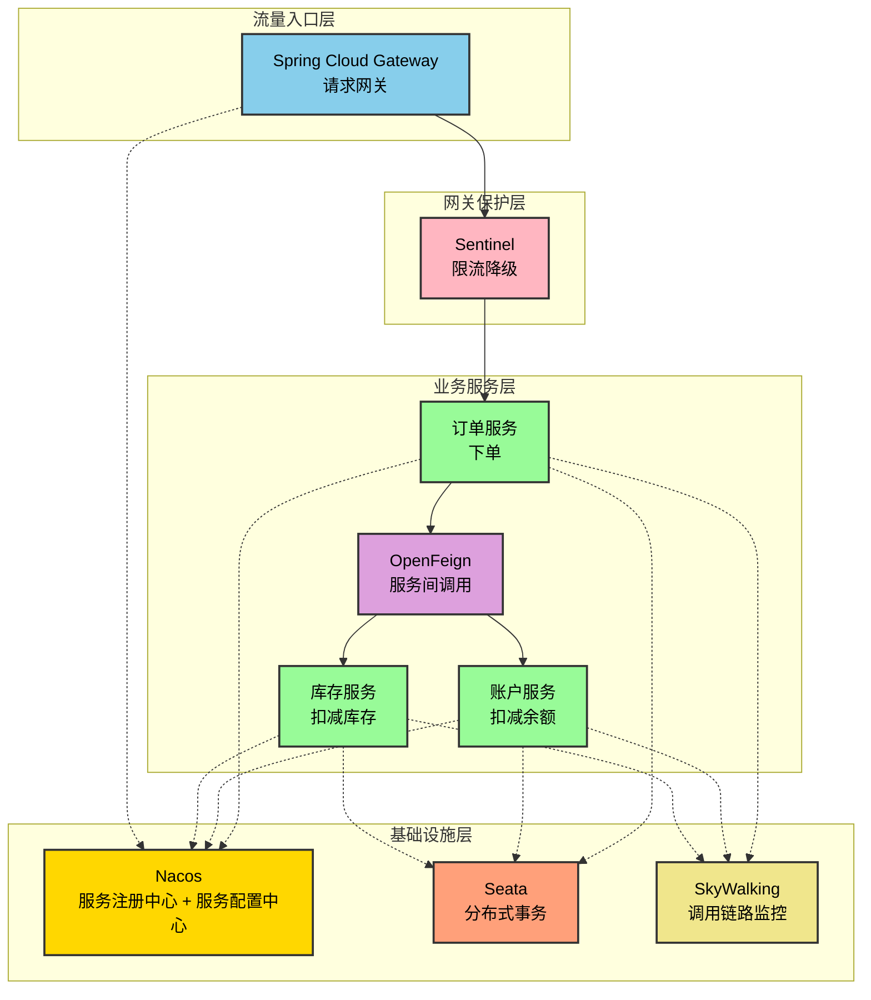
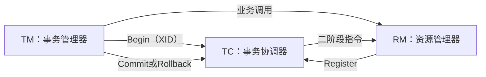
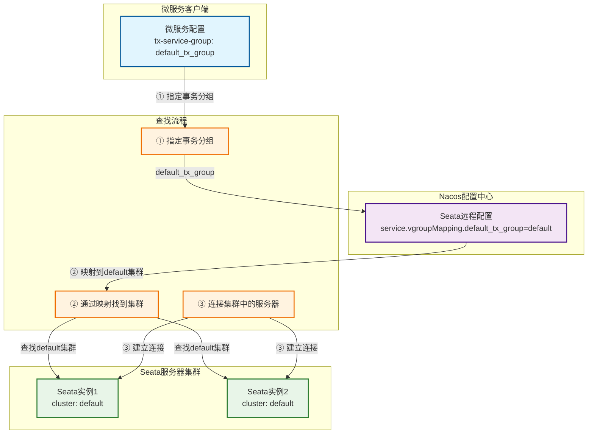
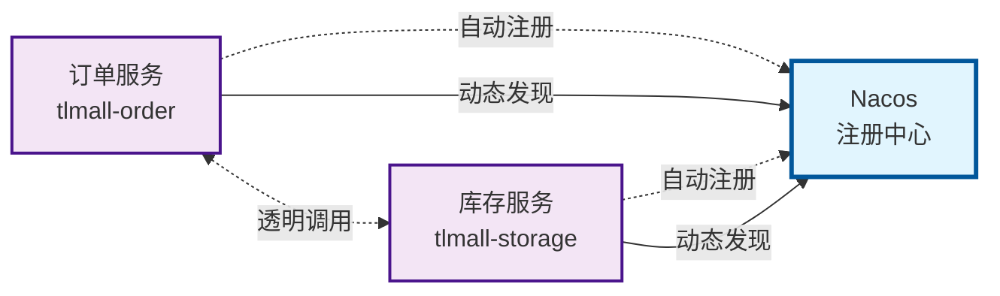
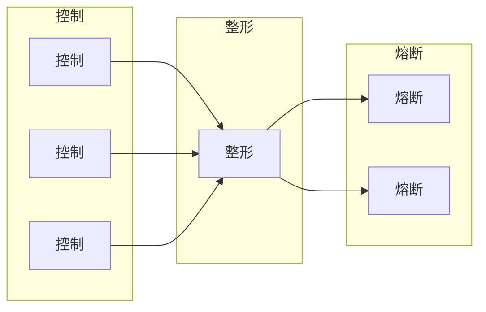

{: .no_toc }

<details close markdown="block">
  <summary>
    目录
  </summary>
  {: .text-delta }
- TOC
{:toc}
</details>

## 1. 介绍

**掌握Spring Cloud Alibaba的最有效途径是通过实战项目快速入门。**

Spring Cloud学习曲线陡峭，要掌握大量组件配置和集成技巧，传统学习方式耗时，缺乏原理实践、难以建立完整认知。本文通过一个MVP项目解决这个问题。它有三个特点：

- **快速上手**：项目完整、短小精悍、涵盖微服务核心组件、避免学习碎片化。
- **快速实践**：基于Spring Cloud Alibaba 2023.x最新版本，展示快速可部署的微服务应用雏形。
- **可扩展性**：项目架构灵活，可根据实际业务需求修改适配。

覆盖的中间件：

| 中间件               | 用途                           |
| -------------------- | ------------------------------ |
| Nacos                | 注册中心（服务发现，配置托管） |
| OpenFeign            | 调用封装、负载均衡             |
| Sentinel             | 限流、熔断降级                 |
| Spring Cloud Gateway | 微服务网关                     |
| Seata                | 分布式事务                     |
| Skywalking           | 服务链路追踪                   |

MVP是经典的Demo场景。它模拟一个下单场景，由订单服务（用户下单）通过微服务中间件来调用库存服务（扣减库存）、账户服务（扣减余额）。调用关系如下图，实线表示调用关系，虚线表示依赖关系。



## 2. 技术选择

### 2.1 介绍

微服务技术栈众多，深入MVP介绍之前，先补充一个简要的技术栈选型，包括两部分：

1. 不同Spring Cloud技术栈比较
2. Spring Cloud与其它技术栈比较

### 2.1 不同Spring Cloud技术栈

主要有两种：

1. **Alibaba技术栈**：Spring Boot + Spring Cloud Alibaba + Spring Cloud Gateway
2. **Netflix技术栈**：Spring Boot + Spring Cloud Netflix + Spring Cloud Gateway

差别在于中间这一块：Spring Cloud Alibaba还是Spring Cloud Netflix， 前者优势如下

|              | **Spring Cloud Alibaba的优势**                           |
| ------------ | -------------------------------------------------------- |
| **维护状态** | 持续活跃维护，而Spring Cloud Netflix已于2020年停止维护   |
| **功能性能** | 性能、组件数量精简、集群规模、分布式事务事务方面更具优势 |
| **社区支持** | 国内得到更广泛的使用，技术社区非常活跃                   |

详细对比如下

|                    | Spring Cloud Alibaba                           | Spring Cloud Netflix             | 提升点           |
| ------------------ | ---------------------------------------------- | -------------------------------- | ---------------- |
| **维护状态**       | 活跃维护，各组件仍在快速迭代                   | 2020年已停止维护，技术债务风险高 | 避免技术过时风险 |
| **本土化支持**     | 文档完善，无缝整合阿里云生态                   | 英文文档为主，国内社区渐冷       | 降低学习运维成本 |
| **服务发现与配置** | Nacos统一服务发现和配置管理，延迟也更低        | Eureka、Config、Bus三套组件分离  | 复杂度降低       |
| **熔断限流**       | Sentinel 性能损耗仅1ms，支持热点参数和集群限流 | Hystrix损耗约5ms，功能单一       | 性能功能提升     |
| **分布式事务**     | 内置Seata                                      | 无此能力                         | 解耦复杂难题     |
| **通信协议**       | 原生整合Dubbo高性能RPC                         | 仅支持HTTP（Feign）              | 提升调用性能     |
| **高可用验证**     | Nacos支持百万级实例和双11考验                  | Eureka大规模集群稳定性不足       | 生产环境支撑更强 |
| **配置动态推送**   | Nacos配置变更毫秒级生效                        | 依赖Git Webhook延迟高            | 实时响应配置变更 |
| **组件数量**       | Nacos替代三套组件                              | 组件繁多，维护成本高             | 运维效率提升     |
| **人才储备**       | 国内主流技术栈，招聘维护成本低                 | 技术团队转向，人才稀缺           | 长期维护更有保障 |

关于Spring Cloud Netflix另有一套学习笔记：<https://github.com/fangkun119/manning-smia/tree/master/note>

### 2.2 Spring Cloud与其它技术栈比较

Java生态中Spring Cloud是主流技术栈。但是还有其它技术栈、活跃于各类场景。特性总结如下。

| 维度               | Spring Cloud       | Quarkus/Micronaut       | Vert.x             | Dubbo               | Istio + Spring Boot    |
| ------------------ | ------------------ | ----------------------- | ------------------ | ------------------- | ---------------------- |
| **启动速度**       | 慢（秒级）         | **极快（毫秒级）**      | 快                 | 中等                | 慢                     |
| **内存占用**       | 高                 | **极低**                | 低                 | 中等                | 高                     |
| **学习曲线**       | 平缓               | 陡峭                    | 陡峭               | 中等                | **极陡峭**             |
| **社区生态**       | **最丰富**         | 较小                    | 中等               | 国内强              | 云原生生态             |
| **云原生适配**     | 良好               | **优秀**                | 良好               | 一般                | **卓越**               |
| **多编程语言支持** | 差                 | 一般                    | **优秀**           | 差                  | **卓越**               |
| **运维复杂度**     | 中等               | 低                      | 中等               | 中等                | **极高**               |
| **适用场景**       | **传统企业级应用** | **Serverless/边缘计算** | **高并发异步场景** | **内部RPC密集系统** | **大型多语言混合架构** |

## 2. Spring Cloud Alibaba中间件版本组合

### 2.1 介绍

微服务包含数量众多的中间件，中间件之间的兼容性很重要。[官网](https://sca.aliyun.com/docs/2023/overview/version-explain/) 提供组件版本建议，我们根据官方建议来选择中间件版本作为MVP项目。

### 2.2 新版组合

目前 Spring Cloud Alibaba 官网给出的最近建议是 2023.0.x


包含如下的中间件组合

| 框架                 | 版本       |
| -------------------- | ---------- |
| Spring Boot          | 3.2.4      |
| Spring Cloud         | 2023.0.1   |
| Spring Cloud Alibaba | 2023.0.1.0 |

项目使用Spring Cloud Alibaba 2023.0.1.0会自动导入如下版本的依赖

| Spring Cloud Alibaba Version | Sentinel Version | Nacos Version | RocketMQ Version | Seata Version |
| ---------------------------- | ---------------- | ------------- | ---------------- | ------------- |
| 2023.0.1.0                   | 1.8.6            | 2.3.2         | 5.1.4            | 2.0.0         |

具体到mvn.pom中，可以使用如下配置

```xml
<spring.boot.version>3.2.4</spring.boot.version>  
<spring-cloud.version>2023.0.1</spring-cloud.version>  
<spring-cloud-alibaba.version>2023.0.1.0</spring-cloud-alibaba.version>

<dependency>  
    <groupId>org.springframework.boot</groupId>  
    <artifactId>spring-boot-starter-parent</artifactId>  
    <version>${spring.boot.version}</version>  
    <type>pom</type>  
    <scope>import</scope>  
</dependency>  
<!-- Spring Cloud依赖 -->  
<dependency>  
    <groupId>org.springframework.cloud</groupId>  
    <artifactId>spring-cloud-dependencies</artifactId>  
    <version>${spring-cloud.version}</version>  
    <type>pom</type>  
    <scope>import</scope>  
</dependency>  
  
<!-- Spring Cloud Alibaba依赖 -->  
<dependency>  
    <groupId>com.alibaba.cloud</groupId>  
    <artifactId>spring-cloud-alibaba-dependencies</artifactId>  
    <version>${spring-cloud-alibaba.version}</version>  
    <type>pom</type>  
    <scope>import</scope>  
</dependency>
```

需要说明，上面使用2023年版本的，只是微服务项目中Maven依赖。它们负责与中间件交互，而中间件本身仍在持续的版本更新升级。
### 2.3 旧版组合

旧版通过[官网](https://sca.aliyun.com/docs/2023/overview/version-explain/)顶部的下拉列表进行选择，使用方法相同


## 3.  开发环境搭建及中间件

### 3.1 介绍

与单体应用不同，除了项目代码和数据库，还需要一套微服务中间件，本节介绍环境搭建过程，包括：

* 项目代码
* Hostname配置
* 数据库
* 微服务中间件：Nacos，Seata，Sentinel，SkyWalking

### 3.2 代码

代码：[https://github.com/fangkun119/spring-cloud-alibaba-2023-demo](https://github.com/fangkun119/spring-cloud-alibaba-2023-demo)

Postman Collection：[https://github.com/fangkun119/postman-workspace](https://github.com/fangkun119/postman-workspace)

### 3.3 域名配置

在/etc/hosts中添加域名配置，让微服务和中间件之间统一通过域名来访问，放后续的配置管理统一有序

```txt
# 微服务127.0.0.1       tlmall-frontend
127.0.0.1       tlmall-order
127.0.0.1       tlmall-account
127.0.0.1       tlmall-storage
127.0.0.1       tlmall-gateway

# 微服务中间件127.0.0.1       tlmall-mysql
127.0.0.1       tlmall-nacos-server
127.0.0.1       tlmall-seata-server
127.0.0.1       tlmall-sentinel-dashboard
127.0.0.1       tlmall-skywalking-server
```

注意：测试时某些梯子会覆盖这里的配置、导致微服务和中间件启动失败，或出现503错误。需要关掉梯子才能保证网络畅通。
### 3.4 MySQL
#### (1) 安装/使用/删除

**介绍**

选择使用MySQL来存储业务数据和Seata事务数据。在Mac上使用Homebrew安装和管理MySQL，因为它提供了“一键式”封装，操作便捷。由于网络问题，需要把Homebrew切换到国内源来进行加速，参考下面链接

- <https://docs.brew.sh/Installation>
- <https://mirrors.tuna.tsinghua.edu.cn/help/homebrew/>

**安装MySQL**

```bash
brew install mysql          # 安装嘴型版本8.x
brew services start mysql   # 启动MySQL并设为开机自启动brew services list          # 检查服务状态brew services restart mysql # 重启服务brew services stop mysql    # 停止MySQL服务
```

**访问MySQL**

使用命令行

```
mysqladmin -u root password 'root'          # 更改root密码
mysql -u root -p                            # 登录MySQL
mysql -V                                    # 查看版本
mysql -u root -p -e "SHOW DATABASES;"       # 执行单条SQL语句
mysql -u root -p mydb < /path/to/backup.sql # 执行SQL文件
mysqldump -u root -p mydb > backup.sql      # 导出数据库
```

使用客户端：用Homebrew安装MySQL Workbench，安装后就能从“应用程序”中点击图表启动Work Bench

```bash
# 安装mysqlworkbench
brew install mysqlworkbench

# 删除mysqlworkbench
brew uninstall --cask mysqlworkbench
```

**删除MySQL**

```bash
mysqldump -u root -p --all-databases > ~/mysql_backup.sql # 备份重要数据
brew services stop mysql        # 停止服务
brew uninstall mysql            # 卸载
rm -rf /opt/homebrew/var/mysql  # 清理数据文件，释放存储空间
rm -rf /opt/homebrew/etc/my.cnf # 删除配置文件，防止以后安装不同版本的MySQL发生冲突
mysql --version                 # 检查、应提示command not found
brew list | grep mysql          # 应无输出（除了mysqlworkbench无其它输出)

## 如果停止服务失败，执行下面的命令，删除服务启动时留下的临时标记文件，防止干扰以后新安装的MySQL启动rm -f ~/Library/LaunchAgents/homebrew.mxcl.mysql.plist
```

#### (2) 数据库建表

建表脚本：[microservices/sql/init.sql](https://github.com/fangkun119/spring-cloud-alibaba-2023-demo/blob/main/microservices/sql/init.sql)

使用MySQL命令行工具，就可以将脚本中的数据导入到MySQL

```
_______________________________________________________
$ /KendeMacBook-Air/ ken@KendeMacBook-Air.local:~/Code/idea/spring-cloud-alibaba-2023-demo/sql/ 
$ cd ~/Code/idea/spring-cloud-alibaba-2023-demo/sql
_______________________________________________________
$ /KendeMacBook-Air/ ken@KendeMacBook-Air.local:~/Code/idea/spring-cloud-alibaba-2023-demo/sql/ 
$ mysql -u root -p < init.sql
Enter password: 
```


使用MySQL Workbench连接数据库，可以看到三个新建的数据库，以及6张新建的表。

| Schema                  | Tables            |
| ----------------------- | ----------------- |
| tlmall_account (用户)   | account, undo_log |
| tlmall_order （订单）   | order, undo_log   |
| tlmall_storage （库存） | storage, undo_log |

它们分别用于接下来要实现的三个微服务：账号服务、订单服务、库存服务。

每个微服务各有两张表：业务数据表、以及这些微服务处理事务时要用到的undo_log表。其中用户表、库存表里各有一条初始数据，可以使用SQL进行查询。

### 3.5 Nacos

Nacos有两个作用：服务发现、配置中心。Nacos的全称是dynamic Naming And Configuration Service，官网是<https://nacos.io/>。使用章节2.1中提到的[Nacos 2.3.2](https://nacos.io/docs/v2.3/what-is-nacos/?spm=5238cd80.2ef5001f.0.0.3f613b7cxEFwzm) 。

以下是安装、配置和启动过程过程。

**安装Nacos**

从[下载页面](https://nacos.io/download/release-history/)下载、解压、打开并阅读启动脚本`bin/startup.sh`（Windows下是 `bin/startup.cmd`），修改不符合开发环境的部分即可。具体如下。

```bash
export MODE="standalone"  # 从cluster集群环境改为standalong单机部署
```

**启动Nacos**

执行Nacos自带的启动脚本

```bash
__________________________________________________________________
$ /KendeMacBook-Air/ ken@KendeMacBook-Air.local:~/Code/mid-wares/nacos/
$ bash bin/startup.sh
```

检查日志、确定无报错

```
__________________________________________________________________
$ /KendeMacBook-Air/ ken@KendeMacBook-Air.local:~/Code/mid-wares/nacos/
$ ls logs/
access_log.log config-client-request.log    config-dump.log              config-trace.log
_______________________________________________________
$ /KendeMacBook-Air/ ken@KendeMacBook-Air.local:~/logs/seata/
$ ls ~/logs/nacos/
config.log naming.log
```

在浏览器打开 `http://tlmall-nacos-server:8848/nacos/` 就能看到Nacos界面了
### 3.6 Seata

#### (1) 基础知识

##### 官方文档

事务用来保证整个操作的原子性，但这些事务是发生在多个服务多instance上，而Spring的`@transactional`注解只适用于单台机器，因此需要分布式中间件。

Seata是Spring Claude Alibaba内置的分布式事务中间件，官方文档如下

- 部署指南： <https://seata.apache.org/zh-cn/docs/v2.0/ops/deploy-guide-beginner>
- 配置参数：<https://seata.apache.org/zh-cn/docs/v2.0/user/configurations>

##### AT事务模式

Seata 支持 AT，TCC，Sega，XA [四种种分布式事务模式](https://seata.apache.org/zh-cn/docs/overview/what-is-seata)，本Demo使用[AT模式](https://seata.apache.org/zh-cn/docs/dev/mode/at-mode/) 。

AT 采用两阶段提交，共有三个角色：TC、TM、RM。他们的角色如下

| 角色   | 全称                                  | Demo中的模块                 | 职责概览                                                     |
| ------ | ------------------------------------- | ---------------------------- | ------------------------------------------------------------ |
| **TC** | Transaction Coordinator<br>事务协调器 | Seata                        | 维护全局事务状态（XID），驱动两阶段提交（2PC），管理全局锁，协调分支事务的注册、提交或回滚。 |
| **TM** | Transaction Manager<br>事务管理器     | 订单服务                     | 定义全局事务边界，负责发起/结束全局事务（begin/commit/rollback），向 TC 注册并决策最终状态。 |
| **RM** | Resource Manager<br>资源管理器        | 订单服务库存服务<br>账户服务 | 管理本地资源（通常是数据库），负责分支事务的注册、执行、UndoLog 记录、本地锁申请、上报状态给 TC，并按 TC 指令完成二阶段（提交或回滚）。 |

之间的关系如下



AT事务分为两阶段：

**第一阶段**：**注册 + 执行**。具体说就是，TM发起全局事务并获得XID（事务ID），各服务生成UndoLog并注册分支事务，然后提交本地业务数据到数据库。

在我们的例子中，订单服务同时承担

| 步骤 | 参与方             | 关键动作                                                     | 说明                                            |
| ---- | ------------------ | ------------------------------------------------------------ | ----------------------------------------------- |
| 1    | **TM**（订单服务） | `@GlobalTransactional` 拦截，向 **TC** 发起 `begin` 请求。   | TC 生成 **XID**（全局事务ID）并返回给 TM。      |
| 2    | **TM**             | 将 **XID** 通过 RPC 上下文透传给下游服务（订单、库存、账户服务）。 | 每个分支事务都携带 XID。                        |
| 3a   | **RM**（订单服务） | 插入订单记录前，生成UndoLog，注册分支事务到 TC。             | TC 记录分支信息，分配 **BranchId**。            |
| 3b   | **RM**（库存服务） | 扣减库存时，生成 UndoLog，注册分支事务到 TC。                | 同 3a。                                         |
| 3c   | **RM**（账户服务） | 扣减余额时，生成 UndoLog，注册分支事务到 TC。                | 同 3a。                                         |
| 4    | **RM** 各本地事务  | 提交本地事务（业务 SQL + UndoLog 一并提交），释放本地锁。    | 数据已真实落库，但处于“**可回滚**”状态。        |
| 5    | **TC**             | 等待所有分支上报结果，记录全局事务状态为“**Begin** → **Committed**（或 **Rollbacked**）”。 | 若全部分支一阶段成功，TC 标记为“待二阶段提交”。 |

**第二阶段**：**提交或回滚**

| 决策     | 参与方 | 关键动作                                                     | 说明                                                    |
| -------- | ------ | ------------------------------------------------------------ | ------------------------------------------------------- |
| **提交** | **TC** | 向 **订单RM、库存RM、账户RM** 发送 `branchCommit` 请求。     | RM 异步删除对应 UndoLog，释放全局锁。                   |
|          | **RM** | **订单服务**：删除订单 UndoLog<br>**库存服务**：删除库存 UndoLog<br>**账户服务**：删除账户 UndoLog<br>无需修改业务数据。 | 非常轻量，纯清理操作。                                  |
| **回滚** | **TC** | 向 **订单RM、库存RM、账户RM** 发送 `branchRollback` 请求。   | 若有任一分支一阶段失败或 TM 触发回滚，TC 自动决策回滚。 |
|          | **RM** | **订单服务**：根据 UndoLog 生成 `DELETE` 反向 SQL，删除订单记录<br>**库存服务**：根据 UndoLog 生成 `UPDATE` 反向 SQL，恢复库存数量<br>**账户服务**：根据 UndoLog 生成 `UPDATE` 反向 SQL，恢复账户余额<br>执行补偿，删除 UndoLog，释放全局锁。 | 保证数据一致性，各 RM 独立执行补偿。                    |

##### 事务数据存储

Seata 需要存储来管理分布式事务，共有4种方式存储分布式事务数据，有4中存储方式

|                         | 存储位置                  | 优点         | 缺点                                              |
| ----------------------- | ------------------------- | ------------ | ------------------------------------------------- |
| File                    | 本地文件 root.data        | 高性能       | 只支持单节点署                                    |
| DB                      | 数据库                    | 支持多节点   | 性能相对较弱                                      |
| Redis (Seata 1.3及以上) | Redis （Seata 1.3及以上） | 性能较高     | 有事务信息丢失风险，需搭配合适的的redis持久化配置 |
| Raft (Seata 2.0及以上)  | 多Seata TC之间同步        | 最理想的实现 | 在2.0中还不够成熟稳定                             |

##### 事务分组

不同业务的事务需要相互独立管理，Seata在逻辑上抽象为"事务分组"。

下图展示了Demo使用的事务分组"default_tx_group"的配置方式：

* **微服务客户端**：通过`tx-service-group`配置指定使用的事务分组（如default_tx_group）。
* **Nacos配置中心**：通过`service.vgroupMapping`建立事务分组与物理集群的映射关系。
* **Seata服务器集群**：通过`cluster`配置将自己注册到对应的集群中。

其中`service.vgroupMapping`是一个多对多配置，逻辑分组和物理集群被解耦，可以灵活分配。



更多内容请阅读[官方文档](https://seata.apache.org/zh-cn/docs/v2.0/user/txgroup/transaction-group)

#### (2) 前期准备

共三步：下载Seata、数据库建表、创建专属的Nacos命名空间

##### 下载Seata

根据章节2.2，先跑通了Seata 2.2.0（也可以考虑调研使用更新的版本、功能更强）

下载[2.2.0的压缩包](https://seata.apache.org/release-history/seata-server/)并解压及完成了安装

```bash
_______________________________________________________
$ /KendeMacBook-Air/ ken@KendeMacBook-Air.local:~/Code/mid-wares/
$ ls | grep seata
seata
seata-server-2.0.0.zip
_______________________________________________________
$ /KendeMacBook-Air/ ken@KendeMacBook-Air.local:~/Code/mid-wares/
$ ls seata
bin        Dockerfile lib        logs       target
conf       ext        LICENSE    script
```

##### 建库建表

Seata需要存储它自己的事务配置。

因为选用了DB模式，需要建库建表。 建表脚本在 `seata\script\server\db\` 目录中，根据数据库类型选择即可。

```bash
_______________________________________________________
$ /KendeMacBook-Air/ ken@KendeMacBook-Air.local:~/Code/mid-wares/
$ mysql -u root -p -e 'CREATE DATABASE seata_2_0_0 DEFAULT CHARACTER SET utf8mb4;'
Enter password:
_______________________________________________________
$ /KendeMacBook-Air/ ken@KendeMacBook-Air.local:~/Code/mid-wares/
$ mysql -u root -p seata_2_0_0 < seata/script/server/db/mysql.sql
Enter password:
```

用MySQL Workbench重连接数据库，就能看到新建的数据库seata_2_0_0，数据库中共有4张表

- branch_table
- distributed_lock
- global-table
- lock_table

##### 创建Seata专用的Nacos命名空间

创建Seata专用的命名空间，把它与负责业务功能微服务用的区分开


注意，创建后会生成一个“命名空间ID”，如上面截图中的“495eb87-4……“，接下来要用这个ID
#### (3) 编写本地配置

**conf/application.yml**

为了把Seata注册到Nacos，需要把`seata/conf/application.yml`中 seata 下面的 config 和 registry 改成如下配置，config用于配置托管，registry用于服务发现。

```yml
seata:
  # seata启动时如何从哪里读取配置
  # type支持nacos、consul、apollo、zk、etcd3
  config:
    type: nacos
    nacos:
      server-addr: tlmall-nacos-server:8848
      namespace: {fill_in_your_seata_namespace_id} # 填入上一小节为seata创建的命名空间ID
      group: SEATA_GROUP
      data-id: seataServer.properties
  # seata如何注册自己、从而让微服务发现自己
  # type支持nacos, eureka, redis, zk, consul, etcd3, sofa
  registry:
    type: nacos
    nacos:
      application: seata-server
      server-addr: tlmall-nacos-server:8848
      namespace: {fill_in_your_seata_namespace_id} # 填入上一小节为seata创建的命名空间ID
      group: SEATA_GROUP
      cluster: default # 该seata节点属于default集群
```

说明：

| 配置项      | 说明                                                         |
| ----------- | ------------------------------------------------------------ |
| `namespace` | 填入第(2)小节中在Nacos为Seata创建的Namesapce的ID❗️            |
| `group`     | 下一小节将在Nacos创建名为`SEATA_GROUP`的分组                 |
| `data-id`   | 下一小节将在Nacos上传名为`seataServer.properties`的远程配置  |
| `cluster`   | 表示这个Seata节点属于名为`default` 的集群，这是使用Nacos注册中心时专用的配置方法（不同注册中心配置不一样），详见[官方文档](https://seata.apache.org/zh-cn/docs/v2.0/user/txgroup/transaction-group) |

事务存储配置，将统一放在Nacos，本地的不再需要注释掉

```yml
seata:
  # store:
  #  # support: file 、 db 、 redis 、 raft
  #  mode: file
  #  server:
  #    service-port: 8091 #If not configured, the default is '${server.port} + 1000'
```

修改后的完整配置：[midwares/dev/local/seata/conf/application.yml](https://github.com/fangkun119/spring-cloud-alibaba-2023-demo/blob/main/midwares/dev/local/seata/conf/application.yml)

最后再检查下端口，检查是否被占用

```bash
_______________________________________________________
$ /KendeMacBook-Air/ ken@KendeMacBook-Air.local:~/Code/mid-wares/seata/
$ cat conf/application.yml | grep " port:" --color -B2  #从配置文件找到端口

server:
  port: 7091
____________________________________________________________
$ /KendeMacBook-Air/ ken@KendeMacBook-Air.local:~/Code/mid-wares/
$ lsof -i :7091 # 没有输出表示没被占用
```

**conf/logback-spring.xml**

通常不用修改。遇到问题需要debug时，可打开部分DEBUG日志进行排查。

```xml
<configuration>

    <!-- ...... -->    

    <!-- 以下是用于Debug的日志 -->

    <!-- Seata IO -->
    <logger name="io.seata" level="DEBUG"/>
    
    <!-- Nacos 和 MySQ -->
    <logger name="com.alibaba.nacos" level="DEBUG"/>
    <logger name="com.mysql.cj.jdbc" level="DEBUG"/>

    <!-- Raft --> 
    <logger name="com.alipay.sofa.jraft" level="DEBUG"/>

    <!-- 配置加载 -->
    <logger name="io.seata.config" level="DEBUG"/>
    <logger name="io.seata.common.util.ConfigurationUtils" level="DEBUG"/>
    <logger name="io.seata.common.util.ConfigurationFactory" level="DEBUG"/>
    <logger name="io.seata.config.ConfigurationCache" level="DEBUG"/>
    <logger name="io.seata.config.ConfigurationCacheManager" level="DEBUG"/>
    <logger name="io.seata.config.ConfigurationChangeListener" level="DEBUG"/>
    <logger name="io.seata.config.ConfigurationChangeListenerManager" level="DEBUG"/>
    <logger name="io.seata.config.ConfigurationChangeListenerManagerImpl" level="DEBUG"/>
</configuration>
```

完整配置：[midwares/dev/local/seata/conf/logback-spring.xml](https://github.com/fangkun119/spring-cloud-alibaba-2023-demo/blob/main/midwares/dev/local/seata/conf/logback-spring.xml)

#### (4) 上传远程配置

接下来补充Nacos上的远程配置，步骤如下

* 根据官方模板根据需求进行修改，目标是使用AT事务模式并将事务信息存储在MySQL
* 生成配置文件`seataServer.properties`
* 上传到Nacos
##### 修改配置模板

配置模板来自安装包（内容见[midwares/dev/local/seata/script/config-center/config.txt](https://github.com/fangkun119/spring-cloud-alibaba-2023-demo/blob/main/midwares/dev/local/seata/script/config-center/config.txt)），拷贝之后就可修改。

```bash
________________________________________________________
$ /KendeMacBook-Air/ ken@KendeMacBook-Air.local:~/Code/mid-wares/seata/
$ cd script/config-center/
________________________________________________________
$ /KendeMacBook-Air/ ken@KendeMacBook-Air.local:~/Code/mid-wares/seata/script/config-center/
$ cp config.txt config-nacos.txt # 拷贝
________________________________________________________
$ /KendeMacBook-Air/ ken@KendeMacBook-Air.local:~/Code/mid-wares/seata/script/config-center/
$ vim config-nacos.txt # 在拷贝文件上修改、防止改坏了不能回退
```

修改过程如下：

**(1) 事务存储配置**

事务存储方式改为db

```properties
store.mode=db
store.lock.mode=db
store.session.mode=db
```

修改数据库用户名密码

```properties
store.db.user=root     # 改成与数据库一致的用户名
store.db.password=root # 改成与数据库一致的密码 
```

修改数据库连接配置，本Demo是MySQL 8.x因此用8.x的Driver Library和连接串

```properties
store.db.driverClassName=com.mysql.cj.jdbc.Driver
store.db.url=jdbc:mysql://tlmall-mysql:3306/seata_2_0_0?useUnicode=true&rewriteBatchedStatements=true&useSSL=false&characterEncoding=utf8&allowPublicKeyRetrieval=true
```

如果是MySQL 5.x、要改成5的数据库连接方式

```properties
# mysql5.x
store.db.driverClassName=com.mysql.jdbc.Driver
store.db.url=jdbc:mysql://tlmall-mysql:3306/seata_2_0_0?useUnicode=true&rewriteBatchedStatements=true
```

注意上面的`store.db.url`要和数据库的实际连接串一致

更多内容参考[官方FAQ](https://seata.apache.org/zh-cn/docs/overview/faq/#12)

**(2) 事务分组配置**

添加事务分组（逻辑概念）到Seata集群（物理概念）的映射

```properties
# 事务分组default_tx_group使用default集群service.vgroupMapping.default_tx_group=default
```

原理如下：

* 在`小节3.5.(2)`，Seata节点通过本地配置`registry.nacos.cluster=default`将它注册到`default`集群中
* 在`小节3.5.(3)`，上面这行配置指定`default_tx_group`这个事务分组会使用`default`集群
* 这样后续微服务就可以通过`seata.tx-service-group=default_tx_group`来指定事务使用`default_tx_group`这个事务分组来进行管理

详细的介绍参考官方文档：[事务分组介绍](https://seata.apache.org/zh-cn/docs/user/txgroup/transaction-group/)

**(3) 开启熔断降级**

推荐但不强制

```properties
service.enableDegrade=true
```

**(4) 去掉不需要的配置**

```text
server.raft.*             # 已经使用了db模式
store.file.*              # 已经使用了db模式
store.redis.*             # 已经使用了db模式
service.default.grouplist # 使用注册中心时不需要（有注释说明）
```

**(5) 修改数据库用户名密码**

改成和自己数据库一样的值

```properties
store.db.user=root
store.db.password=root
store.db.driverClassName=com.mysql.cj.jdbc.Driver
```

**(5) 关闭`server.enableParallelRequestHandle`** (仅限2.0.0在开发环境)

这是处理2.0.0的bug （[链接](https://github.com/apache/incubator-seata/issues/6445)），即使用db模式（不开启raft）时也会强制加载raft并触发另一个Jar包缺失故障。彻底解决这个问题还需要更多调研，这里暂不继续深入。

```properties
server.enableParallelRequestHandle=false
```

**(6) 删除Seata Server地址配置（托管给Nacos服务发现）**

配置项`service.default.grouplist`用来定义Seata 服务端（TC）的地址，让客户端（TM 和 RM）通过该地址进行通信。 因为使用了Nacos服务发现，这个配置项不需要，把它注释掉。

```
# service.default.grouplist=127.0.0.1 # 使用Nacos服务发现时、不需要此配置
```

##### 生成配置文件

修改完成之后，过滤注释去掉空行，就得到了用来上传Nacos的`seataServer.properties`文件

```bash
______________________________________________________
$ /KendeMacBook-Air/ ken@KendeMacBook-Air.local:~/Code/mid-wares/seata/script/config-center/
$ cat config-nacos.txt | grep -v '^#' | grep -v '^$' | sort > seataServer.properties
```

之后就可以上传到Nacos了，完整配置见[midwares/dev/remote/nacos/seata/SEATA_GROUP/seataServer.properties](https://github.com/fangkun119/spring-cloud-alibaba-2023-demo/blob/main/midwares/dev/remote/nacos/seata/SEATA_GROUP/seataServer.properties)
##### **上传配置**

打开Nacos Console UI：`http://tlmall-nacos-server:8848/nacos/` 可以找到在`3.5.(1)`小节创建的命名空间seata。接下来在这个命名空间下上传Seata的远程配置


步骤1：在 "配置管理" -> "配置列表" 中，将命名空间切换到 "seata"，然后点击“创建配置


步骤2：填写创建表单，内容如下

| 配置项                         | 说明                                                         |
| ------------------------------ | ------------------------------------------------------------ |
| `命名空间`、`Data ID`、`Group` | 都要和Seata本地配置[midwares/dev/local/seata/conf/application.yml](https://github.com/fangkun119/spring-cloud-alibaba-2023-demo/blob/main/midwares/dev/local/seata/conf/application.yml)一致 |
| `配置内容`                     | 填入先前准备的[seataServer.properties](https://github.com/fangkun119/spring-cloud-alibaba-2023-demo/blob/main/midwares/dev/remote/nacos/seata/SEATA_GROUP/seataServer.properties)文件中的内容 |


点击“创建“，远程配置上传完毕。


#### (5) 启动Seata

启动Seata

```bash
_______________________________________________________
$ /KendeMacBook-Air/ ken@KendeMacBook-Air.local:~/Code/mid-wares/seata/bin/
$ mkdir -p ~/logs/seata/
_______________________________________________________
$ /KendeMacBook-Air/ ken@KendeMacBook-Air.local:~/Code/mid-wares/seata/bin/
$ bash seata-server.sh start
```

检查日志

```bash
_______________________________________________________
$ /KendeMacBook-Air/ ken@KendeMacBook-Air.local:~/Code/mid-wares/seata/bin/
$ ls ~/logs/seata/
seata_gc.log  seata-server.8091.all.log  seata-server.8091.error.log  seata-server.8091.warn.log
```

关闭Seata

```bash
_______________________________________________________
$ /KendeMacBook-Air/ ken@KendeMacBook-Air.local:~/Code/mid-wares/seata/bin/
$ bash seata-server.sh stop
```

Seata控制台：访问 `http://tlmall-seata-server:7091/`即可，初始用户名和密码都是seata

### 3.7 Sentinel

#### (1) 下载Consol UI

Sentinel用于支持流控降级，它由两部分组成：

- Sentinel控制台：它负责：（1）管理和推送流量规则；（2）监控和管理机器状态。
- Java Client Library： 供微服务中的Spring Cloud Service载入以进行流控。

先把Sentinel控制台安装和启动起来。

根据章节2.2，版本选择1.8.6。在 <https://github.com/alibaba/Sentinel/releases/tag/1.8.6> 下载 [sentinel-dashboard-1.8.6.jar](https://github.com/alibaba/Sentinel/releases/download/1.8.6/sentinel-dashboard-1.8.6.jar)。

#### (2) 脚本封装和启动

使用如下命令即可启动：

```bash
java -Dserver.port=8888 -Dcsp.sentinel.dashboard.server=tlmall-sentinel-dashboard:8888 -Dproject.name=sentinel-dashboard -jar sentinel-dashboard-1.8.6.jar
```

为了方便以后操作，对这个命令进行了脚本封装，目录结构和脚本内容如下

```bash
______________________________________________________
$ /KendeMacBook-Air/ ken@KendeMacBook-Air.local:~/Code/mid-wares/sentinel/
$ cat start.sh

port="8888"

mkdir -p ./log

echo "java -Dserver.port=${port} -Dcsp.sentinel.dashboard.server=tlmall-sentinel-dashboard:8888 -Dproject.name=sentinel-dashboard -jar ./bin/sentinel-dashboard-1.8.6.jar 2>&1 > log/log.txt &"
nohup java -Dserver.port=${port} -Dcsp.sentinel.dashboard.server=tlmall-sentinel-dashboard:8888 -Dproject.name=sentinel-dashboard -jar ./bin/sentinel-dashboard-1.8.6.jar 2>&1 > log/log.txt &

______________________________________________________
$ /KendeMacBook-Air/ ken@KendeMacBook-Air.local:~/Code/mid-wares/sentinel/
$ cat stop.sh
#!/bin/bash

jps | grep "sentinel-dashboard-1.8.6.jar$" | awk '{print $1}' | xargs kill
```

然后使用bash/start.sh命令来启动sentinel

```bash
______________________________________________________
$ /KendeMacBook-Air/ ken@KendeMacBook-Air.local:~/Code/mid-wares/sentinel/
$ bash start.sh
java -Dserver.port=8888 -Dcsp.sentinel.dashboard.server=tlmall-sentinel-dashboard:8888 -Dproject.name=sentinel-dashboard -jar ./bin/sentinel-dashboard-1.8.6.jar 2>&1 > log/log.txt &
______________________________________________________
$ /KendeMacBook-Air/ ken@KendeMacBook-Air.local:~/Code/mid-wares/sentinel/
$ tail -n10 log/log.txt
2025-11-15 14:15:56.633  INFO 2537 --- [           main] o.apache.catalina.core.StandardService   : Starting service [Tomcat]
2025-11-15 14:15:56.633  INFO 2537 --- [           main] org.apache.catalina.core.StandardEngine  : Starting Servlet engine: [Apache Tomcat/9.0.60]
2025-11-15 14:15:56.654  INFO 2537 --- [           main] o.a.c.c.C.[Tomcat].[localhost].[/]       : Initializing Spring embedded WebApplicationContext
2025-11-15 14:15:56.654  INFO 2537 --- [           main] w.s.c.ServletWebServerApplicationContext : Root WebApplicationContext: initialization completed in 291 ms
2025-11-15 14:15:56.674  INFO 2537 --- [           main] c.a.c.s.dashboard.config.WebConfig       : Sentinel servlet CommonFilter registered
2025-11-15 14:15:56.853  INFO 2537 --- [           main] o.s.b.w.embedded.tomcat.TomcatWebServer  : Tomcat started on port(s): 8888 (http) with context path ''
2025-11-15 14:15:56.856  INFO 2537 --- [           main] c.a.c.s.dashboard.DashboardApplication   : Started DashboardApplication in 0.634 seconds (JVM running for 0.761)
2025-11-15 14:16:01.264  INFO 2537 --- [nio-8888-exec-1] o.a.c.c.C.[Tomcat].[localhost].[/]       : Initializing Spring DispatcherServlet 'dispatcherServlet'
2025-11-15 14:16:01.265  INFO 2537 --- [nio-8888-exec-1] o.s.web.servlet.DispatcherServlet        : Initializing Servlet 'dispatcherServlet'
2025-11-15 14:16:01.265  INFO 2537 --- [nio-8888-exec-1] o.s.web.servlet.DispatcherServlet        : Completed initialization in 0 ms
```

启动后，通过 `http://tlmall-sentinel-dashboard:8888/` 来访问控制台，用户名和密码都是sentinel

### 3.8 SkyWalking

#### (1) 下载

SkyWalking用于追踪微服务调用链路，根据章节`2.2`，版本将使用10.0.1。 下载地址在 <https://skywalking.apache.org/downloads/>。

将下载两部分内容

| 压缩包                                                       | 说明                                                         |
| ------------------------------------------------------------ | ------------------------------------------------------------ |
| SkyWalking APM <br>[[apache-skywalking-apm-10.0.1.tar.gz](https://archive.apache.org/dist/skywalking/10.0.1/apache-skywalking-apm-10.0.1.tar.gz)] | APM是Application Performance Monitoring的缩写，包含如下两部分：<br>1. 分析平台（SkyWalking OAP：Observability Analysis Platform）<br>2. Web UI |
| Java Agent <br>[[apache-skywalking-java-agent-9.3.0.tgz](https://archive.apache.org/dist/skywalking/java-agent/9.3.0/apache-skywalking-java-agent-9.3.0.tgz)] | 是探针，用来从微服务中采集数据，后续将会把它与各个微服务整个。 |

#### (2) 构成

下图是它们之间的关系。由于仅仅是演示如何让微服务集成SkyWalking，就不为SkyWalking搭建数据库了，使用它内置的H2内存数据库。

```text
┌────────────────────────────────────┐
│           APM系统                  │
│                                    │
│  ┌─────────┐    ┌──────────────┐   │
│  │ Agent   │───▶│ OAP          │   │
│  │ (采集)   │    │ (分析平台)    │   │
│  └─────────┘    └──────┬───────┘   │
│        ▲               │           │
│        │               ▼           │
│        │         ┌─────────┐       │
│        │         │Storage  │       │
│        │         │（存储)   │       │
│        │         └────┬────┘       │
│        │              │            │
│        └───── UI ─────┘            │
│           (可视化)                  │
│                                    │
└────────────────────────────────────┘
① Agent → OAP：数据采集
② OAP → Storage：持久化
③ OAP ← Storage：读取历史数据（本例使用内置的内存数据库，不另外搭建）
④ UI ↔ OAP：查询展示
```

接下来两小节所说的SkyWalking ，其实指的都是APM里面的OAP和UI。

而Agent部分则是以LIB的形式，在微服务开发时，集成到各个微服务中。

#### (3) 配置

共有两步：

1. 解压 `apache-skywalking-apm-10.0.1.tar.gz`
2. 修改 `webapp/application.yml` ，把UI端口从8080改成一个不会发生冲突的端口，例如18080执行过程

```bash
_______________________________________________________
$ /KendeMacBook-Air/ ken@KendeMacBook-Air.local:~/Code/mid-wares/
$ tar xvfz apache-skywalking-apm-10.0.1.tar.gz
x apache-skywalking-apm-bin/webapp/skywalking-webapp.jar
...
x apache-skywalking-apm-bin/zipkin-LICENSE
_______________________________________________________
$ cd apache-skywalking-apm-bin/
_______________________________________________________
$ /KendeMacBook-Air/ ken@KendeMacBook-Air.local:~/Code/mid-wares/apache-skywalking-apm-bin/
$ vim webapp/application.yml
```

#### (4) 启动

运行脚本 `bin/startup.sh` （MAC下）就可以启动SkyWalking OAP和UI了

```bash
_______________________________________________________
$ /KendeMacBook-Air/ ken@KendeMacBook-Air.local:~/Code/mid-wares/apache-skywalking-apm-bin/
$ bash bin/startup.sh
_______________________________________________________
$ /KendeMacBook-Air/ ken@KendeMacBook-Air.local:~/Code/mid-wares/apache-skywalking-apm-bin/
$ ps
  PID TTY           TIME CMD
  886 ttys000    0:00.01 -bash
  ...
  3985 ttys006    0:43.05 /usr/bin/java -Xms256M -Xmx4096M -Doap.logDir=/Users/ken/Code/mid-wares/apache-skywalking-apm-bin/logs -cla
  3986 ttys006    0:01.46 /usr/bin/java -Xms256M -Xmx1024M -Dwebapp.logDir=/Users/ken/Code/mid-wares/apache-skywalking-apm-bin/logs -

```

检查日志 (需要在bin/startup.sh当中加一行sleep 10， 使OAP先于UI启动， 才会完全无报错)

```bash
_______________________________________________________
$ /KendeMacBook-Air/ ken@KendeMacBook-Air.local:~/Code/mid-wares/apache-skywalking-apm-bin/
$ tail -n6 logs/*
==> logs/oap.log <==

==> logs/skywalking-oap-server.log <==
oap.external.http.host                     |   0.0.0.0
oap.external.http.port                     |   12800
oap.internal.comm.host                     |   0.0.0.0
oap.internal.comm.port                     |   11800

2025-11-15 15:56:13,785 - com.linecorp.armeria.internal.common.JavaVersionSpecific - 45 [armeria-eventloop-kqueue-5-1] INFO  [] - Using the APIs optimized for: Java 12+

==> logs/skywalking-webapp.log <==
2025-11-15 15:56:13,097 - com.linecorp.armeria.common.Flags - 1572 [main] INFO  [] - defaultUnhandledExceptionsReportIntervalMillis: 10000 (default)
2025-11-15 15:56:13,344 - com.linecorp.armeria.common.Flags - 1572 [main] INFO  [] - useOpenSsl: true (default)
2025-11-15 15:56:13,653 - com.linecorp.armeria.common.Flags - 562 [main] INFO  [] - Using OpenSSL: BoringSSL, 0x1010107f
2025-11-15 15:56:13,653 - com.linecorp.armeria.common.Flags - 1572 [main] INFO  [] - dumpOpenSslInfo: false (default)
2025-11-15 15:56:13,809 - com.linecorp.armeria.common.util.SystemInfo - 260 [main] INFO  [] - hostname: kendemacbook-air.local (from 'hostname' command)
2025-11-15 15:56:13,822 - com.linecorp.armeria.server.Server - 808 [armeria-boss-http-*:18080] INFO  [] - Serving HTTP at /[0:0:0:0:0:0:0:0%0]:18080 - http://127.0.0.1:18080/

==> logs/webapp-console.log <==
```

在浏览器打开`http://tlmall-skywalking-server:18080/`就能看到SkyWalking UI的界面了

### 3.9 中间件批量操作

到目前为止，如下基础组件已经准备完毕，供后续的微服务代码编写调试使用，整理如下：

| 组件       | 用途                                                     | 访问地址                    | 端口             |
| ---------- | -------------------------------------------------------- | --------------------------- | ---------------- |
| MySQL      | 微服务业务数据<br>微服务事务的Undolog<br>Seata内数据存储 | `tlmall-mysql`              | `MySQL Jdbc默认` |
| Nacos      | 服务发现、配置管理                                       | `tlmall-nacos-server`       | `8848`           |
| Seata      | 分布式事务                                               | `tlmall-seata-server`       | `7091`           |
| Sentinel   | 流控降级                                                 | `tlmall-sentinel-dashboard` | `8888`           |
| SkyWalking | 调用链路追踪                                             | `tlmall-skywalking-server`  | `18080`          |

为了方便用脚本批量操作，把它们放在同一个目录下

```bash
_______________________________________________________
$ /KendeMacBook-Air/ ken@KendeMacBook-Air.local:~/Code/mid-wares/
$ ls
apache-skywalking-apm-bin seata                     start_all.sh
nacos                     sentinel                  stop_all.sh
_______________________________________________________
$ /KendeMacBook-Air/ ken@KendeMacBook-Air.local:~/Code/mid-wares/
$ pwd
/Users/ken/Code/mid-wares
```

脚本如下，可以一键式完成微服务组件的批量启动和关闭

* [midwares/dev/local/start_all.sh](https://github.com/fangkun119/spring-cloud-alibaba-2023-demo/blob/main/midwares/dev/local/start_all.sh)
* [midwares/dev/local/stop_all.sh](https://github.com/fangkun119/spring-cloud-alibaba-2023-demo/blob/main/midwares/dev/local/stop_all.sh)

启动效果：

```bash
_______________________________________________________
$ /KendeMacBook-Air/ ken@KendeMacBook-Air.local:~/Code/mid-wares/
$ bash start_all.sh
=== 启动微服务中间件环境 ===
1. 启动MySQL...
==> Successfully started `mysql` (label: ho
2. 启动Nacos...

......

=== 启动完成! ===
访问地址:
- Nacos:
  http://tlmall-nacos-server:8848/nacos/
- Seata:
  http://tlmall-seata-server:7091/
- Sentinel:
  http://tlmall-sentinel-dashboard:8888/
- SkyWalking:
  http://tlmall-skywalking-server:18080/
```

关闭效果：

```bash
_______________________________________________________
$ /KendeMacBook-Air/ ken@KendeMacBook-Air.local:~/Code/mid-wares/
$ bash stop_all.sh
=== 关闭微服务中间件环境 ===
1. 关闭SkyWalking...

......

SkyWalking端口 (18080):
✓ 已关闭

MySQL服务状态:
mysql   none

=== 所有中间件已关闭! ===
清理残留进程...
清理完成!
```

## 4.  用Nacos实现微服务注册和发现

### 4.1 Nacos服务发现介绍

在微服务架构中，如果采用硬编码方式配置服务间的调用地址和端口，会面临一系列问题：

- **维护成本高**：服务地址变更时，需要同步修改所有调用方配置
- **扩展性差**：新增服务实例或调整端口配置时，影响面广
- **负载均衡困难**：无法灵活实现服务的水平扩展和负载分配
- **运维复杂**：生产环境中服务部署和迁移变得困难重重

引入服务注册与发现机制，通过动态注册中心来解决上述问题，原理如下：



### 4.2 注册微服务

将三个微服务 `tlmall-storage`, `tlmall-order`，`tlmall-account`到Nacos注册中心，过程如下。

首先以`tlmall-storage` 为例子演示步骤

**(1) 引入Maven依赖**

在pom.xml中添加 `nacos-discovery` 依赖

```xml
<!--nacos-discovery注册中心依赖-->
<dependency>
    <groupId>com.alibaba.cloud</groupId>
    <artifactId>spring-cloud-starter-alibaba-nacos-discovery</artifactId>
</dependency>
```

**(2) 装配 `nacos-discovery` 的Bean**

在主类上添加 `@EnableDiscoveryClient`注解，让微服务启动后自动装配Nacos Discovery的Bean。这一步其实也可以跳过，因为Nacos实现了自动装配。

```java
import org.springframework.cloud.client.discovery.EnableDiscoveryClient;

@EnableDiscoveryClient
public class TlmallStorageApplication {
    ...
}
```

**(3) 配置Nacos注册中心的地址**

在application.yml中添加nacos discovery的配置，让微服务启动后能够找到Nacos注册中心

```yml
spring:
  cloud:
    nacos:
      discovery:
        server-addr: tlmall-nacos-server:8848
```

**(4) 检查服务注册**

启动库存服务，在Nacos Console页面的 “服务列表” 中可以找到 `tlmall-storage`


同样的步骤注册 `tlmall-order`和`tlmall-account`，让这两个微服务也启动


就可以看到它们都出现在Naocs的服务列表中了


最终代码如下

| 步骤     | 引入Maven依赖                                                | 装配Beans                                                    | 配置Nacos Registry地址                                       |
| -------- | ------------------------------------------------------------ | ------------------------------------------------------------ | ------------------------------------------------------------ |
| 订单服务 | [microservices/.../tlmall-order/pom.xml](https://github.com/fangkun119/spring-cloud-alibaba-2023-demo/blob/main/microservices/tlmall-order/pom.xml) | [microservices/.../tlmallorder/TlmallOrderApplication.java](https://github.com/fangkun119/spring-cloud-alibaba-2023-demo/blob/main/microservices/tlmall-order/src/main/java/org/springcloudmvp/tlmallorder/TlmallOrderApplication.java) | [microservices/tlmall-order/src/main/resources/application.yml](https://github.com/fangkun119/spring-cloud-alibaba-2023-demo/blob/main/microservices/tlmall-order/src/main/resources/application.yml) |
| 库存服务 | [microservices/.../tlmall-storage/pom.xml](https://github.com/fangkun119/spring-cloud-alibaba-2023-demo/blob/main/microservices/tlmall-storage/pom.xml) | [microservices/.../tlmallstorage/TlmallStorageApplication.java](https://github.com/fangkun119/spring-cloud-alibaba-2023-demo/blob/main/microservices/tlmall-storage/src/main/java/org/springcloudmvp/tlmallstorage/TlmallStorageApplication.java) | [microservices/tlmall-storage/src/main/resources/application.yml](https://github.com/fangkun119/spring-cloud-alibaba-2023-demo/blob/main/microservices/tlmall-storage/src/main/resources/application.yml) |
| 账户服务 | [microservices/.../tlmall-account/pom.xml](https://github.com/fangkun119/spring-cloud-alibaba-2023-demo/blob/main/microservices/tlmall-account/pom.xml) | [microservices/.../tlmallaccount/TlmallAccountApplication.java](https://github.com/fangkun119/spring-cloud-alibaba-2023-demo/blob/main/microservices/tlmall-account/src/main/java/org/spcloudmvp/tlmallaccount/TlmallAccountApplication.java) | [microservices/tlmall-account/src/main/resources/application.yml](https://github.com/fangkun119/spring-cloud-alibaba-2023-demo/blob/main/microservices/tlmall-account/src/main/resources/application.yml) |

这些代码有一点和上面介绍的步骤不太一样，在application.yml中，没有直接配Nacos注册中心的地址，而是替换成这样的配置（以tlmall-order为例）

```yml
spring:
  application:
    name: tlmall-order
  cloud:
    nacos:
      config:
        server-addr: tlmall-nacos-server:8848
        file-extension: yml
  config:
    import:
      - nacos:nacos-discovery.yml # 加载Nacos public命名空间下同名的远程配置
# ...
```

这里的`nacos:nacos-discovery.yml`对应Nacos配置中心同名的远程配置


其内容正是上面`步骤(3)`中所要求的Nacos服务发现注册中心的地址

代码链接：[midwares/dev/remote/nacos/public/DEFAULT_GROUP/nacos-discovery.yml](https://github.com/fangkun119/spring-cloud-alibaba-2023-demo/blob/main/midwares/dev/remote/nacos/public/DEFAULT_GROUP/nacos-discovery.yml)

```yml
spring:
  cloud:
    nacos:
      discovery:
        server-addr: tlmall-nacos-server:8848
```

这涉及到Nacos的另一个功能：配置托管。将在后续章节中详细展开。

### 4.3 调用微服务

#### (1) 介绍

微服务注册到Nacos之后，接下来解决如何调用的问题。本Demo是由`tlmall-order` 调用`tlmall-storage`和`tlmall-account`，因此所有改动都在`tlmall-order`上。但它不是直接调用，还需要借助Spring Cloud Load Balancer，具体有两步：

1. 通过Nacos注册找到要调用的服务。
2. 通过Spring Cloud Load Balancer（[文档](https://docs.spring.io/spring-cloud-commons/reference/spring-cloud-commons/loadbalancer.html)）选择具体的实例。

`Spring Cloud LoadBalancer`是

- 由SpringCloud官方提供的一个开源的、简单易用的客户端负载均衡器
- 包含在`springcloud-commons`中用它来替换了以前的Ribbon组件。

相比较于Ribbon，Spring Cloud LoadBalancer不仅支持RestTemplate、还支持Spring Web Flux提供的WebClient现响应式异步请求。

#### (2) 步骤演示

**添加Maven依赖**

向 `tlmall-order` 的  `pom.xml` 中添加Load Balancer依赖

```xml
<!-- loadbalancer负载均衡器依赖-->
<dependency>
	<groupId>org.springframework.cloud</groupId>
    <artifactId>spring-cloud-loadbalancer</artifactId>
</dependency>
```

**开启Spring Cloud Load Balancer**

向  `tlmall-order` 的 `application.yml` 中添加配置开启Spring Cloud Load Balancer

```yml
spring:
  cloud:
    loadbalancer:
      nacos:
        enabled: true
```

**为RestTemplate Bean添加负债均衡**

用 `@LoadBalanced` 注解来装配 `RestTemplate` Bean，这样RestTemplate Bean就具备了负载均衡功能， 底层是用拦截器来实现的。

```java
import org.springframework.cloud.client.loadbalancer.LoadBalanced;  
import org.springframework.context.annotation.Bean;  
import org.springframework.context.annotation.Configuration;  
import org.springframework.web.client.RestTemplate;

@Configuration  
public class RestConfig {  
    @Bean  
    @LoadBalanced 
    RestTemplate restTemplate(){  
        return new RestTemplate();  
    }  
}
```

**调用下游服务**

原本Order Service的RestTemplate只能通过下游地址和端口来调用，例如 ：

```java
// 未整合Nacos和LoadBalancer时，只能通过域名和端口调用下游String storage_url = "http://localhost:8010/storage/reduce-stock";  
Integer storageCode = restTemplate.postForObject(storage_url,storageDTO, Result.class).getCode();
```

当我们整合了Nacos和Spring Cloud Load Balancer之后，就可以下游在Nacos中的服务名（见4.2.(4) 小节）来调用。这样下游的部署就能与上游解耦。

```java
// 整合了Nacos和LoadBalaner后，使用微服务名tlmall-storage调用String storage_url = "http://tlmall-storage/storage/reduce-stock";  
Integer storageCode = restTemplate.postForObject(storage_url,storageDTO, Result.class).getCode();
```

**测试**

启动 `tlmall-order`，`tlmall-storage`, `tlmall-frontend` 三个应用


可以看到 `tlmall-order` 和 `tlmall-storage` 都注册在了Nacos


启动`tlmall-frontent` 通过 `localhost:8080` 的页面发起下单调用


检查日志，可以看到分布式调用通过Nacos上的服务名成功完成

```log
INFO 53005 --- [tlmall-order-01] [nio-8030-exec-1] com.alibaba.nacos.client.naming          : init new ips(1) service: DEFAULT_GROUP@@tlmall-storage -> [{"instanceId":"172.20.10.11#8010#DEFAULT#DEFAULT_GROUP@@tlmall-storage","ip":"172.20.10.11","port":8010,"weight":1.0,"healthy":true,"enabled":true,"ephemeral":true,"clusterName":"DEFAULT","serviceName":"DEFAULT_GROUP@@tlmall-storage","metadata":{"preserved.register.source":"SPRING_CLOUD","IPv6":"[2409:891f:90a5:4fff:3427:2ab9:9b0f:3900]"},"ipDeleteTimeout":30000,"instanceHeartBeatInterval":5000,"instanceHeartBeatTimeOut":15000}]
INFO 53005 --- [tlmall-order-01] [nio-8030-exec-1] com.alibaba.nacos.client.naming          : current ips:(1) service: DEFAULT_GROUP@@tlmall-storage -> [{"instanceId":"172.20.10.11#8010#DEFAULT#DEFAULT_GROUP@@tlmall-storage","ip":"172.20.10.11","port":8010,"weight":1.0,"healthy":true,"enabled":true,"ephemeral":true,"clusterName":"DEFAULT","serviceName":"DEFAULT_GROUP@@tlmall-storage","metadata":{"preserved.register.source":"SPRING_CLOUD","IPv6":"[2409:891f:90a5:4fff:3427:2ab9:9b0f:3900]"},"ipDeleteTimeout":30000,"instanceHeartBeatInterval":5000,"instanceHeartBeatTimeOut":15000}]
INFO 53005 --- [tlmall-order-01] [nio-8030-exec-1] o.t.t.service.impl.OrderServiceImpl      : [createOrder] orderId: 16
```

同样如果启动多个 `tlmall-storage` (使用不同的端口避免端口冲突)，不仅同样可以看到调用成功，还能看到请求被发往不同的实例，说明Load Balancer可以起到负载均衡的作用。

#### (3) 缺点和问题

上述实现方式存在两个问题：

1. 代码可读性差
2. 参数复杂时，URL难以维护，一旦要更换下游的API，就需要到处寻找相关的URL进行修改

下一章使用OpenFeign来解决这个问题。

#### (4) 最终代码

| 步骤                           | 代码链接                                                     |
| ------------------------------ | ------------------------------------------------------------ |
| Maven依赖                      | [microservices/tlmall-order/pom.xml](https://github.com/fangkun119/spring-cloud-alibaba-2023-demo/blob/main/microservices/tlmall-order/pom.xml) |
| 开启Spring Cloud Load Balancer | [microservices/tlmall-order/src/main/resources/application.yml](https://github.com/fangkun119/spring-cloud-alibaba-2023-demo/blob/main/microservices/tlmall-order/src/main/resources/application.yml)<br>[midwares/dev/remote/nacos/public/DEFAULT_GROUP/tlmall-order.yml](https://github.com/fangkun119/spring-cloud-alibaba-2023-demo/blob/main/midwares/dev/remote/nacos/public/DEFAULT_GROUP/tlmall-order.yml) |
| 为RestTemplate添加负载均衡     | [microservices/tlmall-order/src/main/java/org/springcloudmvp/tlmallorder/config/RestConfig.java](https://github.com/fangkun119/spring-cloud-alibaba-2023-demo/blob/main/microservices/tlmall-order/src/main/java/org/springcloudmvp/tlmallorder/config/RestConfig.java) |
| 通过Nacos注册中心调用下游服务  | [microservices/tlmall-order/src/main/java/org/springcloudmvp/tlmallorder/service/impl/OrderServiceImpl.java](https://github.com/fangkun119/spring-cloud-alibaba-2023-demo/blob/main/microservices/tlmall-order/src/main/java/org/springcloudmvp/tlmallorder/service/impl/OrderServiceImpl.java) |

与`4.2`一样，最终版本的代码会和上面介绍的方法略有不同

不同点1：开启Spring Cloud Loader Balancer的配置被上传到了Nacos上

* 用本地配置导入Naco上的远程配置：[microservices/tlmall-order/src/main/resources/application.yml](https://github.com/fangkun119/spring-cloud-alibaba-2023-demo/blob/main/microservices/tlmall-order/src/main/resources/application.yml
* Nacos远程配置内容：[midwares/dev/remote/nacos/public/DEFAULT_GROUP/tlmall-order.yml](https://github.com/fangkun119/spring-cloud-alibaba-2023-demo/blob/main/midwares/dev/remote/nacos/public/DEFAULT_GROUP/tlmall-order.yml)

不同点2：本节使用的是下面的方法2，但是最终版本已经切换到了方法3来使用OpenFeigh调用下游

```java
// 方法2：使用Nacos + Load Balaner  
// 可以使用微服务名tlmall-account代替localhost:8020  
String storage_url = "http://tlmall-storage/storage/reduce-stock";  
Integer storageCode = restTemplate.postForObject(storage_url,storageDTO, Result.class).getCode();

// ...

// 方法2：使用Nacos + Load Balaner
// 可以使用微服务名tlmall-account代替localhost:8020
String account_url = "http://tlmall-account/account/reduce-balance";
Integer accountCode = restTemplate.postForObject(account_url, accountDTO, Result.class).getCode();
```

这些差异将在后续章节详细介绍
## 5.  用OpenFeign封装远程调用

### 5.1 介绍

[OpenFeign](https://docs.spring.io/spring-cloud-openfeign/docs/current/reference/html/)让远程API调用想在调用本地对象一样简单直观。它是集成在Spring Cloud中的声明式HTTP客户端工具，通过声明式编程模型、生成代理对象，便捷直观的完成调用，也便于代码维护。例子如下。

```java
// openFeign远程调用orderService为代理对象
R result = orderService.findOrderByUserId(id);
```

OpenFeigh的全称是Spring Cloud OpenFeign，来自Netflix的Feign，在Feign的基础上进行了增强，支持Spring MVC注解等，使用更加方便。

### 5.2 步骤演示

依然是让`tlmall-order`调用`tlmall-storage`和`tlmall-account`，只需要改动`tlmall-order`

**(1) 引入Maven依赖**

添加到子Pom即可，因为包括在Spring Cloud Alibaba之中，因此不需要在父Pom添加

```xml
<!-- openfeign远程调用 -->  
<dependency>  
    <groupId>org.springframework.cloud</groupId>  
    <artifactId>spring-cloud-starter-openfeign</artifactId>  
</dependency>
```

**(2) 装配OpenFeign的Bean**

主类上添加注解即可

```java
@SpringBootApplication
@EnableFeignClients
public class TlmallOrderApplication {
	//...
}
```

**(3) 编写OpenFeign客户端**

有两个下游要调用，因此为它们各写一个客户端：`StorageServiceFeignClient` 和 `AccountServiceFeignClient`。因为是声明式编程，写一个接口类添加必要的注解即可，框架会生成实现类。

```java
// 用来调用库存服务的客户端  
@FeignClient(name = "tlmall-storage" /*下游微服务名*/)  
public interface StorageServiceFeignClient {  

    @PostMapping("/storage/reduce-stock" /*下游URL*/)  
    Result<?> reduceStock(  
            @RequestBody  
            StorageDTO productReduceStockDTO);  

}
```

```java
// 用来调用账户服务的客户端  
@FeignClient(name = "tlmall-account" /*下游微服务名*/)  
public interface AccountServiceFeignClient {  
  
    @PostMapping("/account/reduce-balance" /*下游URL*/)  
    Result<?> reduceBalance(  
            @RequestBody  
            AccountDTO accountReduceBalanceDTO);  
      
}
```


**(4) 调用下游服务**

修改 `OrderServiceImpl` 类，注入刚才编写的两个Client，然后向调用本地方法一样调用这两个Client即可，它们会替我们完成远程调用。

```java
@Service  
public class OrderServiceImpl implements OrderService {  
    @Autowired  
    private AccountServiceFeignClient accountService;  
  
    @Autowired  
    private StorageServiceFeignClient storageService;  

    // ...
  
    @Override  
    @GlobalTransactional(name = "createOrder", rollbackFor = Exception.class)  
    public Result<?> createOrder(String userId, String commodityCode, Integer count) {  
        // ... 
        
        // 方法3：使用OpenFeign远程调用  
        // 进一步减少硬编码，向调用本地API一样调用Rest API  
        Integer storageCode = storageService.reduceStock(storageDTO).getCode();  
        if (storageCode.equals(COMMON_FAILED.getCode())) {  
            throw new BusinessException("stock not enough");  
        }  
  
        // ... 
        
        Integer accountCode = accountService.reduceBalance(accountDTO).getCode();  
        if (accountCode.equals(COMMON_FAILED.getCode())) {  
            throw new BusinessException("balance not enough");  
        }  
  
        // ...
    }
```


**(5) 测试**

启动三个微服务，启动`tlmall-frontent` 通过 `localhost:8080` 的页面发起下单调用，可以看到库存和余额都再扣减了 。如果多启动几个下游实例（端口错开），能够看到请求发往不同的下游 ，说明Load Balancer也在起作用 。


## 6. 用Nacos实现微服务配置托管

### 6.1 Nacos配置托管介绍

单体应用被拆分成各种微服务之后，配置也会变得过于分散难以维护。配置中心把它们收集在一起、规范管理，同时还能动态更新。 Nacos配置中心的文档见 [链接](https://sca.aliyun.com/docs/2023/user-guide/nacos/advanced-guide/)

概括来说，配置托管需要完成如下步骤

**(1) 在本地配置文件中填写要从Nacos中导入哪些远程托管配置**

SpringBoot 2.4开始支持通过 `spring.config.import` 完成导入、这是对云原生多配置管理的支持。而老版本的SpringBoot则需要通过`bootstrap.yml`。

```yml
spring:
  application:  
    name: tlmall-order
  config:
    import:
      # 微服务业务配置
      - optional:nacos:${spring.application.name}.yml
      # 数据库公用配置
      - optional:nacos:db-common.yml?group=DEFAULT_GROUP&refreshEnabled=true
```

说明如下

* `${spring.application.name}`就是Spring Boot配置文件的占位符，它会把同名配置项的值替换进来。上面例子中就是`tlmall-order`。
* `nacos:tmall-order.yml`是替换后的值，会让微服务从Nacos加载默认分组下data-id为`tlmall-order.yml`的配置。
* `optional`则表示该配置并非强制，找不到时也会继续尝试启动。

分组也可以显示配置，例如下面一条配置`optional:nacos:db-common.yml?group=DEFAULT_GROUP`，而`refreshEnabled`则表示是否开启动态刷新配置。推荐显示的指定分组。

**(2) 在Nacos配置分组**

配置分组（Group）是Nacos对配置集的逻辑分组，主要解决以下问题：

1. 区分相同 Data ID 的配置：当多个配置集具有相同的 Data ID 时，可通过不同的 Group 进行区分。例如 AB 测试中的实验组与对照组 。
2. 多应用场景隔离：不同应用或组件使用相同配置项时（如  database_url  或  MQ_Topic ），可通过 Group 隔离 。
3. 模块化配置管理：将配置按功能模块分组，便于管理和维护。例如  DATABASE  组管理数据库配置， MIDDLEWARE  组管理 Redis、MQ 配置。
4. 灰度发布与动态切换：通过动态切换 Group 实现不同环境的配置快速切换，支持灰度发布场景 

虽然可以不指定分组，全部使用DEFAULT_GROUP，但这并不建议，会导致配置缺乏组织，不利于维护。即便可以通过Namespace来隔离环境，同一环境内仍然会需要通过分组来区分不同的业务域。

###  6.2上传配置到Nacos

接下来介绍如何把配置上传到Nacos

**创建或选择已有的Namespace**

如下图，可以点击“创建配置”，也可以选择按钮上方已有的Namespace。


**创建配置项**

步骤如下：

1. 填入“配置分组”（Group）和“配置名称”（Data ID）
2. 勾选“配置格式”
3. 填入配置内容

以db-common.yml为例，填入的就是各个微服务连接MySQL的配置，内容与先前的本地配置一样


其它微服务和公用配置是上传方法相同。
### 6.3 配置汇总

**微服务配置**

如下图，给`tlmall-account`、`tlmall-storage`、…… 等使用。有些是某个微服务专用的，有些是多个微服务都要用的（例如访问数据库）、被单独抽出来。

位于`public`命名空间的`DEFAULT_GROUP`下。


内容（点击链接可见）和用途如下

| Data ID                                                      | 范围     | 用途                |
| ------------------------------------------------------------ | -------- | ------------------- |
| [db-common.yml](https://github.com/fangkun119/spring-cloud-alibaba-2023-demo/blob/main/midwares/dev/remote/nacos/public/DEFAULT_GROUP/db-common.yml "db-common.yml") | 公用     | 微服务链接数据库    |
| [nacos-discovery.yml](https://github.com/fangkun119/spring-cloud-alibaba-2023-demo/blob/main/midwares/dev/remote/nacos/public/DEFAULT_GROUP/nacos-discovery.yml "nacos-discovery.yml") | 公用     | 微服务注册到Nacos   |
| [seata-client.yml](https://github.com/fangkun119/spring-cloud-alibaba-2023-demo/blob/main/midwares/dev/remote/nacos/public/DEFAULT_GROUP/seata-client.yml "seata-client.yml") | 公用     | 微服务访问Seata API |
| [sentinel-dashboard.yml](https://github.com/fangkun119/spring-cloud-alibaba-2023-demo/blob/main/midwares/dev/remote/nacos/public/DEFAULT_GROUP/sentinel-dashboard.yml "sentinel-dashboard.yml") | Sent     | 微服务访问Sentinel  |
| [tlmall-account.yml](https://github.com/fangkun119/spring-cloud-alibaba-2023-demo/blob/main/midwares/dev/remote/nacos/public/DEFAULT_GROUP/tlmall-account.yml "tlmall-account.yml") | 账户服务 | 账户服务配置        |
| [tlmall-storage.yml](https://github.com/fangkun119/spring-cloud-alibaba-2023-demo/blob/main/midwares/dev/remote/nacos/public/DEFAULT_GROUP/tlmall-storage.yml "tlmall-storage.yml") | 库存服务 | 库存服务配置        |
| [tlmall-order.yml](https://github.com/fangkun119/spring-cloud-alibaba-2023-demo/blob/main/midwares/dev/remote/nacos/public/DEFAULT_GROUP/tlmall-order.yml "tlmall-order.yml") | 订单服务 | 订单服务配置        |
| [tlmall-gateway.yml](https://github.com/fangkun119/spring-cloud-alibaba-2023-demo/blob/main/midwares/dev/remote/nacos/public/DEFAULT_GROUP/tlmall-gateway.yml "tlmall-gateway.yml") | 网关服务 | 网关服务配置        |

**中间件配置**

如下图，是中间件自己的配置，只有Seata。它位于命名空间`seata`的`SEATA_GROUP`下。


内容和用途如下表。

| Data ID                                                      | 范围 | 用途              |
| ------------------------------------------------------------ | ---- | ----------------- |
| [seataServer.properties](https://github.com/fangkun119/spring-cloud-alibaba-2023-demo/blob/main/midwares/dev/remote/nacos/seata/SEATA_GROUP/seataServer.properties "seataServer.properties") | 公用 | 中间件Seata的配置 |
## 7.  用Seata AT模式实现分布式事务

小节`3.5`介绍了相关的分布式事务基础知识、Seata的搭建和配置。本节将Demo中的三个微服务接入到Seata。

场景是在下单事务中，订单服务接到前端的请求，调用库存服务扣减库存，然后再调用账户服务扣减余额。如果过程中任何一步失败，则进行事务回滚。

### 7.1 事务发起者(TM)

#### (1) 步骤和代码

订单服务（`tlmall-order`）是Demo中的事务发起者，它既承担了TM（Transaction Manager）又承担来了RM（Resource Manager）的职责。接入Seata的步骤如下。

**引入Maven依赖**

```xml
<!-- seata 依赖-->  
<dependency>  
    <groupId>com.alibaba.cloud</groupId>  
    <artifactId>spring-cloud-starter-alibaba-seata</artifactId>  
</dependency>
```

代码见： [microservices/tlmall-order/pom.xml](https://github.com/fangkun119/spring-cloud-alibaba-2023-demo/blob/main/microservices/tlmall-order/pom.xml)

**创建Undo Log表（仅AT模式）**


在3.3小节和业务表一起创建，SQL见 [microservices/sql/init.sql](https://github.com/fangkun119/spring-cloud-alibaba-2023-demo/blob/main/microservices/sql/init.sql)

**添加Seata Client配置**


上传到了Nacos，然后通过下面的本地配置来导入

```yml
spring: 
  config:
    import:
      - optional:nacos:seata-client.yml
```

内容见

* [midwares/dev/remote/nacos/public/DEFAULT_GROUP/seata-client.yml](https://github.com/fangkun119/spring-cloud-alibaba-2023-demo/blob/main/midwares/dev/remote/nacos/public/DEFAULT_GROUP/seata-client.yml)
* [microservices/tlmall-order/src/main/resources/application.yml](https://github.com/fangkun119/spring-cloud-alibaba-2023-demo/blob/main/microservices/tlmall-order/src/main/resources/application.yml)

**添加全局分布式事务注解**

```java
package org.springcloudmvp.tlmallorder.service.impl;

import io.seata.core.context.RootContext;
import io.seata.spring.annotation.GlobalTransactional;
// ...

@Service
public class OrderServiceImpl implements OrderService {

	@Override
    @GlobalTransactional(name = "createOrder", rollbackFor = Exception.class)
    public Result<?> createOrder(String userId, String commodityCode, Integer count) {
	    ...
	}
}
```

#### (2) @GlobalTransactional注解在AT一阶段的操作

在调用createOrder方法时，`@GlobalTransactional` 的AOP拦截器会起作用，它会把每个SQL执行，每个远程调用，都当做一个分支事务。

以先执行一个SQL，再执行一个远程调用为例，执行它将做如下操作：

1. TM（事务管理器：order service）发请求给TC（事务协调器：Seata）开启全局事务并获取XID，绑定到当前线程上下文
2. 执行本地SQL：获取执行前数据，向TC请求要修改数据的全局锁，执行SQL但不提交，获取修改后的数据，生成Undo Log插入Undo Log表
3. 向TC注册分支事务，提交数据库事务，释放被修改数据全局锁
4. 发起远程调用，将XID传递给下游服务，使它们也能加入这个全局事务
5. 等所有远程调用执行完毕后，进入二阶段。

是否同时使用 `@Transactional` 注解

1. 绝大多数情况下，只使用 `@GlobalTransactional` 就已经足够。多条 SQL 执行会被注册为多个分支事务，跟着全局事务在二阶段一起生效或回滚，也能达到相同的效果，使用 `@Transactional` 并不是很有必要。
2. 同时使用 `@GlobalTransactional` 和 `@Transactional`，会把方法里的多个SQL执行合并为一个分支事务。
	* 如果这些SQL是紧密耦合在一起的操作，可以提升性能。
	* 如果不是、或者与远程调用交错执行，则不建议这么做。

#### (3) @GlobalTransactional注解在AT二阶段的操作

如果全局事务成功，即该所在方法、所有远程调用都成功，执行下面的操作：

* TM 向 TC 发起“全局提交”请求，然后结束工作。
* TC 后续异步指导各个 RM（资源管理者，执行SQL的微服务）删除 Undo Log

如果全局事务失败，即所在方法或任何一个远程调用失败，执行下面操作：

* TM 向 TC 发起全局回滚请求，然后结束工作。
* TC 后续指导各个 RM 执行补偿（回滚）操作，为了防止其它事务写同一行数据产生数据不一致，TC 会确保正在回滚的操作具有最高优先级，确保数据的最终一致性。

### 7.2 事务参与者(RM)

#### (1) 步骤和代码

库存服务（`tlmall-storage`）和账户服务（`tlmall-account`）承担了 RM（Resource Manager）的职责。接入`Seata`步骤如下

**引入Maven依赖**

```xml
<!-- seata 依赖-->  
<dependency>  
    <groupId>com.alibaba.cloud</groupId>  
    <artifactId>spring-cloud-starter-alibaba-seata</artifactId>  
</dependency>
```

代码：

[microservices/tlmall-storage/pom.xml](https://github.com/fangkun119/spring-cloud-alibaba-2023-demo/blob/main/microservices/tlmall-storage/pom.xml)

[microservices/tlmall-account/pom.xml](https://github.com/fangkun119/spring-cloud-alibaba-2023-demo/blob/main/microservices/tlmall-account/pom.xml)

**创建UndoLog表（仅AT模式）**

库存服务、账户服务各有一张表。

与`7.3 事务发起者`相同，在`3.3小节`和业务表一起创建，SQL见 [microservices/sql/init.sql](https://github.com/fangkun119/spring-cloud-alibaba-2023-demo/blob/main/microservices/sql/init.sql)


**添加Seata Client配置**

与 `7.3 事务发起者`  相同， 都是导入Nacos上Data ID为`seata-client.yml`的远程配置，代码内容见：

* [midwares/dev/remote/nacos/public/DEFAULT_GROUP/seata-client.yml](https://github.com/fangkun119/spring-cloud-alibaba-2023-demo/blob/main/midwares/dev/remote/nacos/public/DEFAULT_GROUP/seata-client.yml)
* [midwares/dev/remote/nacos/public/DEFAULT_GROUP/tlmall-account.yml](https://github.com/fangkun119/spring-cloud-alibaba-2023-demo/blob/main/midwares/dev/remote/nacos/public/DEFAULT_GROUP/tlmall-account.yml)
* [midwares/dev/remote/nacos/public/DEFAULT_GROUP/tlmall-storage.yml](https://github.com/fangkun119/spring-cloud-alibaba-2023-demo/blob/main/midwares/dev/remote/nacos/public/DEFAULT_GROUP/tlmall-storage.yml)

**为扣减库存（或扣减余额）的方法添加单机事务注解 `@Transactional`**

库存服务

```java
@Override
@Transactional
public void reduceStock(String commodityCode, Integer count) throws BusinessException {
	// ...
}
```

账户服务

```java
@Override
@Transactional
public void reduceBalance(String userId, Integer price) throws BusinessException {
	// ...
}
```

完整代码：

* [microservices/tlmall-storage/src/.../StorageServiceImpl.java](https://github.com/fangkun119/spring-cloud-alibaba-2023-demo/blob/main/microservices/tlmall-storage/src/main/java/org/springcloudmvp/tlmallstorage/service/impl/StorageServiceImpl.java)
* [microservices/tlmall-account/src/.../AccountServiceImpl.java](https://github.com/fangkun119/spring-cloud-alibaba-2023-demo/blob/main/microservices/tlmall-account/src/main/java/org/spcloudmvp/tlmallaccount/service/impl/AccountServiceImpl.java)

#### (2) @Transactional注解在AT一阶段的操作

`@Transactional` 是 Spring 的单机事务注解，负责本地事务回滚。但是Seata会通过AOP代理，拦截它执行的SQL，生成Undo Log，这样在全局事务需要回滚时，该本地事务做完成的操作也会被回滚。

它在AT一阶段会执行如下操作：

1. 在执行SQL前，执行准备工作，包括：关闭本地事务的自动提交，捕获要执行的SQL，获取SQL执行前的数据，向事务协调器（TC：Seata）发起请求获得要修改数据的全局锁。
2. 执行本地SQL，但不提交本地事务因此对其它数据库连接不可见
3. 查询数据库，获得修改后的数据
4. 构建Undo Log并插入Undo Log表
5. 如果有其它远程调用，会把XID传给下游服务，并等待其返回。
6. Seata代理的本地事务提交，包括：注册分支事务，请求TC释放被修改数据的全局锁，执行数据库提交

`@Transaction`注解不参与AT二阶段，AT二阶段都是由TM的@GlobalTransactional来处理的

### 7.3 测试

首先在 `http://tlmall-frontend:8080/order` 正常下单，下单成功


然后在数据库修改余额，把余额改成1，不够购买单价为2的商品，以便能够再次触发事务回滚

```sql
UPDATE tlmall_account.account SET money = 1 where user_id = 'fox'
```

再次下单，这次下单失败，事务回滚


日志如下


### 7.4 Seata 2.0.0 的问题

当事务失败触发回滚时，抛出的是 RuntimeException，而不是能够精准表达事务回滚的 BusinessException。

这使得我们在代码中用了个 `rollbackFor = Exception.class`

```java
@Override  
@GlobalTransactional(name = "createOrder", rollbackFor = Exception.class)  
public Result<?> createOrder(String userId, String commodityCode, Integer count) {
	
}
```

而实际产品中，应当将事务异常（需要回滚）与其它异常区分开，以便精准判断什么时候需要回滚。

这是Seata 2.0.0的问题，需要使用更新的版本来解决这个问题。

## 8. 用Sentinel实现流量控制

### 8.1 Sentinel介绍

Sentinel 是面向分布式、多语言异构化服务架构的流量治理组件，主要以流量为切入点，从多个维度帮助开发者保障微服务的稳定性。

在微服务架构中，服务间复杂的调用关系带来了严重稳定性风险：

* **服务雪崩效应**：单个服务的故障或过载会迅速影响整个系统
* **连锁反应**：一个服务性能下降会导致依赖它的多个服务同时受影响
* **恶意流量威胁**：如刷单等异常行为可能压垮关键业务接口。

为应对这些问题，Sentinel提供如下核心功能：

* **流量控制**：通过规则限制入口流量（如QPS阈值、并发数限制）。
* **流量整形**：对流量进一步调整（如匀速排队），确保平滑进入系统，避免突发流量冲击。
* **熔断降级**：当资源故障时（如下游服务宕机），熔断器触发，直接拒绝请求，防止故障扩散。
* **系统负载保护**：基于系统Load、CPU使用率等实时指标进行自适应保护。
* **热点参数防护**：识别并精细化控制频繁访问的热点参数。



下面是一些典型应用场景：

1. 库存服务响应缓慢导致订单服务连锁反应
2. 订单接口面临刷单攻击需要限流保护
3. 服务依赖出现故障时保证业务连续性

Sentinel安装见`3.6小节`，中间件启动脚本见`第3章`

```
_______________________________________________________
$ /KendeMacBook-Air/ ken@KendeMacBook-Air.local:~/Code/mid-wares/
$ bash start_all.sh
=== 启动微服务中间件环境 ===

...

=== 启动完成! ===
访问地址:
- Nacos:
  http://tlmall-nacos-server:8848/nacos/
- Seata:
  http://tlmall-seata-server:7091/
- Sentinel:
  http://tlmall-sentinel-dashboard:8888/
- SkyWalking:
  http://tlmall-skywalking-server:18080/
```

按脚本提示即可访问Sentinel，默认用户名和密码都是sentinel

### 8.2 微服务集成Sentinel

Sentinel官方文档见[https://sentinelguard.io/zh-cn/docs/dashboard.html](https://sentinelguard.io/zh-cn/docs/dashboard.html)， 但是更新度不够，有陈旧内容，以下面步骤为准

Demo只为`tlmall-order`集成了`Sentinel`，如果要让其它服务也集成，步骤相同。

**引入依赖**

```xml
<!-- sentinel 依赖-->
<dependency>
    <groupId>com.alibaba.cloud</groupId>
    <artifactId>spring-cloud-starter-alibaba-sentinel</artifactId>
</dependency>
```

代码: [microservices/tlmall-order/pom.xml](https://github.com/fangkun119/spring-cloud-alibaba-2023-demo/blob/main/microservices/tlmall-order/pom.xml)

**添加sentinel控制台配置**

配置同样放在了Nacos，完整代码如下

上传到Nacos的远程配置（完整代码见[midwares/dev/remote/nacos/public/DEFAULT_GROUP/sentinel-dashboard.yml](https://github.com/fangkun119/spring-cloud-alibaba-2023-demo/blob/main/midwares/dev/remote/nacos/public/DEFAULT_GROUP/sentinel-dashboard.yml)）

```yml
spring:
  cloud:
    sentinel:
      transport:
        # 添加sentinel的控制台地址
        dashboard: tlmall-sentinel-dashboard:8888
```

导入Nacos远程配置（完整代码见[microservices/tlmall-order/src/main/resources/application.yml)](https://github.com/fangkun119/spring-cloud-alibaba-2023-demo/blob/main/microservices/tlmall-order/src/main/resources/application.yml)）

```yml
spring:
  config:
    import:
      - optional:nacos:sentinel-dashboard.yml
```

**配置需要保护的Resource**

Demo使用Spring MVC实现的Controller，不需要配置，引入Sentinel依赖就会自动支持。

其它情况，可以使用 `@SentinelResource` 或者 `@SentinelRestTemplate`  注解

**验证**

启动微服务，先通过`tlmall-frontend:8080`进行一次下单，然后登录`http://tlmall-sentinel-dashboard:8888/` ，就能看到`tlmall-order`出现在Sentinel Dashboard的列表中


上面的数值都是统计值，默认为0，需要一定数量的API触发，才能它们的数值增加

在下单的同时，在Chrome的DevTool中捕捉API调用，得到curl命令如下

```bash
curl 'http://tlmall-gateway:18888/order/create' \
  -H 'Accept: application/json, text/javascript, */*; q=0.01' \
  -H 'Accept-Language: zh-CN,zh;q=0.9' \
  -H 'Connection: keep-alive' \
  -H 'Content-Type: application/x-www-form-urlencoded; charset=UTF-8' \
  -H 'Origin: http://localhost:8080' \
  -H 'Referer: http://localhost:8080/' \
  -H 'User-Agent: Mozilla/5.0 (Macintosh; Intel Mac OS X 10_15_7) AppleWebKit/537.36 (KHTML, like Gecko) Chrome/143.0.0.0 Safari/537.36' \
  --data-raw 'userId=fox&commodityCode=1&count=1' \
  --insecure
```

将这个curl命令导入到Postman Collection（也可以直接导入[https://github.com/fangkun119/postman-workspace](https://github.com/fangkun119/postman-workspace)上的Postman Collection），就可以用于接下来的测试了


同时也能从curl命令找到所访问的Restful Resource为`/order/create`

### 8.3 流量控制


点击`/order/create` 右边的`+流控`按钮，填入下面的配置，点击`新增`


点击`新增`就把流控规则创建好了，这样每秒钟最多只能请求一次


用PostMan连续快速发送下单请求，可以看到请求被Sentinel阻塞


论其底层原理：

* 其实是微服务开启Sentinal控制台端口，让Sentinal把流控规则推送过来，然后由微服务的Sentinal Lib来实施流量控制。
* 这也意味着，上面的QPS，并不是一个微服务所有instance的总QPS，而是该微服务中每个instance的QPS。
* 如果要以整个微服务为粒度限流，则需要集群限流，会需要额外的配置和部署。

## 9. 用Spring Cloud Gateway创建API网关

### 9.1 微服务网关的作用

微服务架构需引入API网关，以解决客户端直接调用微服务的问题，并实现系统API的统一管理与高效服务。  直接调用微服务存在以下痛点：  

- 客户端需处理多微服务的请求，增加代码与配置复杂度，维护成本高；  
- 各微服务认证方式不同，客户端需适配，认证复杂；  
- 跨域请求与调用链（如防火墙、浏览器不友好协议）增加调用复杂性；  
- 项目迭代时微服务重构困难。  

API网关作为系统统一入口，提供简单有效的API路由管理，通过内部服务路由中转给客户端统一服务，实现与业务解耦的公用逻辑，主要功能包括认证、鉴权、路由转发、安全策略、防刷、流量控制、监控日志等。

### 9.2 Spring Cloud Gateway介绍

Spring Cloud Gateway是Spring Cloud官方推出的第二代网关框架，用于取代Netflix Zuul，为微服务架构提供API路由管理，并基于Filter实现基本功能，其技术实现为响应式架构。  

具体而言：  

- 定位：作为Spring Cloud官方的第二代网关框架，旨在替代Netflix Zuul；  
- 核心目标：为微服务架构提供简单且有效的API路由管理方式，通过Filter机制实现安全认证、监控、限流等网关基本功能；  
- 技术实现：由WebFlux + Netty + Reactor构建响应式API网关，不支持在传统servlet容器中运行，也无法构建为war包。

官方文档是：[https://docs.spring.io/spring-cloud-gateway/reference/](https://docs.spring.io/spring-cloud-gateway/reference/)

### 9.3 微服务网关创建步骤

#### (1) 构建网关应用

在IDEA的项目中添加一个模块（module）名为`tlmall-gateway`


添加Spring Cloud Gateway Maven依赖，同时和其它模块一样、也添加Nacos注册中心、配置中心、负载均衡器依赖

```xml
<!-- gateway网关 -->  
<dependency>  
    <groupId>org.springframework.cloud</groupId>  
    <artifactId>spring-cloud-starter-gateway</artifactId>  
</dependency>  
  
<!--nacos-discovery  注册中心依赖-->  
<dependency>  
    <groupId>com.alibaba.cloud</groupId>  
    <artifactId>spring-cloud-starter-alibaba-nacos-discovery</artifactId>  
</dependency>  
  
<!-- loadbalancer 负载均衡器依赖-->  
<dependency>  
    <groupId>org.springframework.cloud</groupId>  
    <artifactId>spring-cloud-loadbalancer</artifactId>  
</dependency>  
  
<!-- nacos-config 配置中心依赖 -->  
<dependency>  
    <groupId>com.alibaba.cloud</groupId>  
    <artifactId>spring-cloud-starter-alibaba-nacos-config</artifactId>  
</dependency>
```

本地配置 `application.yml` ，除了端口等配置以外，它会从 Nacos 导入远程配置，包括网关配置`tlmall-gateway.yml` 

```yml
server:  
  port: 18888  
spring:  
  application:  
    name: tlmall-gateway  
  cloud:  
    nacos:  
      config:  
        server-addr: tlmall-nacos-server:8848  
        file-extension: yml  
  config:  
    import:  
      - optional:nacos:${spring.application.name}.yml  
      - nacos:nacos-discovery.yml
```

#### (2) 为微服务添加网关配置

编写并上传`tlmall-gateway.yml` 到Nacos


只写Gateway路由配置即可，其它配置在本地

```yml
spring:  
  cloud:  
    gateway:  
      #设置路由：路由id、路由到微服务的uri、断言  
      routes:  
        - id: order_route  #路由ID，全局唯一，建议配置服务名  
          uri: lb://tlmall-order  #lb 整合负载均衡器loadbalancer  
          predicates:  
            - Path=/order/**   # 断言，路径相匹配的进行路由  
  
        - id: storage_route   #路由ID，全局唯一，建议配置服务名  
          uri: lb://tlmall-storage  #lb 整合负载均衡器loadbalancer  
          predicates:  
            - Path=/storage/**   # 断言，路径相匹配的进行路由  
  
        - id: account_route   #路由ID，全局唯一，建议配置服务名  
          uri: lb://tlmall-account  #lb 整合负载均衡器loadbalancer  
          predicates:  
            - Path=/account/**   # 断言，路径相匹配的进行路由
```

#### (3) 完整代码

项目模块代码：[microservices/tlmall-gateway](https://github.com/fangkun119/spring-cloud-alibaba-2023-demo/tree/main/microservices/tlmall-gateway)

上传到Nacos的远程配置：[midwares/dev/remote/nacos/public/DEFAULT_GROUP/tlmall-gateway.yml](https://github.com/fangkun119/spring-cloud-alibaba-2023-demo/blob/main/midwares/dev/remote/nacos/public/DEFAULT_GROUP/tlmall-gateway.yml)

## 10. 使用Skywalking监控

### 10.1 介绍

SkyWalking是分布式系统的应用程序性能监视工具，请求头到底层服务所有环节进行监控，为微服务、云原生架构和基于容器（Docker、K8s、Mesos）架构而设计。是观察性分析平台和应用性能管理系统，提供一体化解决方案，包括：

* 分布式追踪
* 服务网格遥测分析
* 度量聚合
* 可视化

SkyWalking架构如下：底部是数据处理、存储、可视化看板，已经在3.7小节搭建完成；顶部是数据采集部分，本章将初步探索，让微服务接入SkyWalking的Agent探针，来可视化微服务调用链路。


### 10.2 微服务整合SkyWalking

方法较简单：通过JVM参数，让微服务载入SkyWalking Agent JAR包及配置，采集监控数据发送给SkyWalking OAP。

#### 10.2.1 准备SkyWalking Agent JAR包

首先是JAR包，它来自SkyWalking的官网，我们使用的版本是9.3.0，具体见3.7小节，解压后如下

```bash
_______________________________________________________
$ /KendeMacBook-Air/ ken@KendeMacBook-Air.local:~/Code/mid-wares/
$ tar xvfz apache-skywalking-java-agent-9.3.0.tgz
x skywalking-agent/
x skywalking-agent/activations/
x skywalking-agent/activations/apm-toolkit-kafka-activation-9.3.0.jar
……
x skywalking-agent/licenses/LICENSE-asm.txt
```

但是SkyWalking 9.3.0有一个Bug（[Issue链接](https://github.com/apache/skywalking/issues/10509)），需要将解压得到的`optional-plugins/apm-spring-cloud-gateway-4.x-plugin-9.3.0.jar` 拷贝到`plugins`目录下，否则它无法监控Spring Cloud Gateway。

```bash
_______________________________________________________
$ /KendeMacBook-Air/ ken@KendeMacBook-Air.local:~/Code/mid-wares/skywalking-agent/
$ cp optional-plugins/apm-spring-cloud-gateway-4.x-plugin-9.3.0.jar plugins/
```


#### 10.2.2 配置JVM参数

接下来需要给微服务添加JVM参数，包括：

* 解压后 `skywalking-agent.jar` 的路径
* 微服务名称
* SkyWalking OAP的地址和端口

以我本地环境的`下单服务`为例，参数如下

```
-javaagent:/Users/ken/Code/mid-wares/skywalking-agent/skywalking-agent.jar
-DSW_AGENT_NAME=tlmall-order
-DSW_AGENT_COLLECTOR_BACKEND_SERVICES=tlmall-skywalking-server:11800
```

接下来在IDEA给微服务添加JVM参数（Add VM Configuration）

(1) `tlmall-gateway`


(2) `tlmall-order`


(3) `tlmall-storage`


(4) `tlmall-account`


#### 10.2.3 测试

启动微服务，可以在启动日志里看到与SkyWalking相关的日志


访问SkyWalking控制台，可以看到微服务已经接入SkyWalking


用PoskMan向订单服务发请求，可以在Trace中看到这个请求的调用链路


