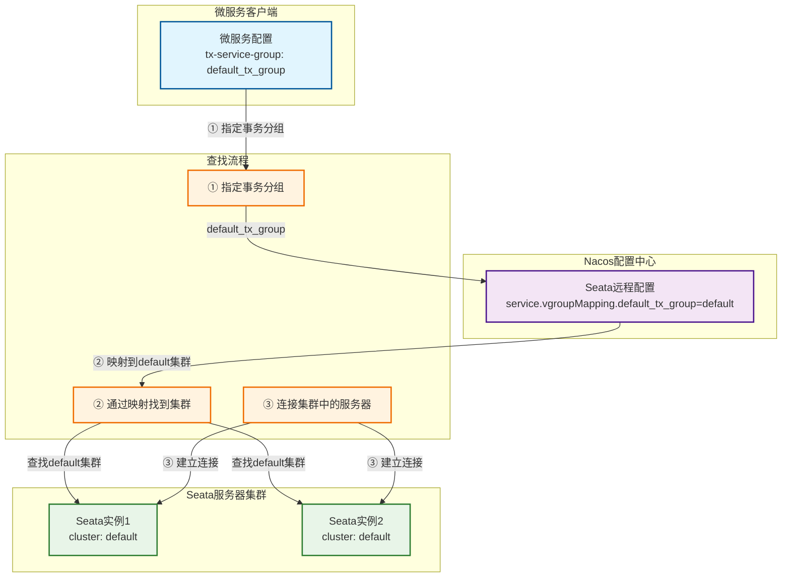

{: .no_toc }

<details close markdown="block">
  <summary>
    目录
  </summary>
  {: .text-delta }
- TOC
{:toc}
</details>


## 1. 介绍

### 1.1 章节概要

本文讲解 **Spring Cloud Alibaba MVP 项目**的环境搭建，涵盖以下核心内容：

| 环境要素 | 说明 |
| ---- | ---- |
| **项目代码** | MVP 微服务项目源码及 Postman 测试集合 |
| **Hostname 配置** | 微服务与中间件的域名映射配置 |
| **数据库** | MySQL 安装、建表及数据初始化 |
| **微服务中间件** | **四大中间件**：Nacos、Seata、Sentinel、SkyWalking |

> **环境搭建定位**：微服务架构相较于单体应用，除**项目代码**和**数据库**外，还需部署一套**微服务中间件**来支撑服务治理、分布式事务、流量防护和链路追踪。

### 1.2 配套资源

| 资源类型           | 说明                               | 链接                                                                                                                   |
| -------------- | -------------------------------- | -------------------------------------------------------------------------------------------------------------------- |
| **项目源码**       | Spring Cloud Alibaba 2023 完整示例代码 | [github.com/fangkun119/spring-cloud-alibaba-2023-demo](https://github.com/fangkun119/spring-cloud-alibaba-2023-demo) |
| **Postman 集合** | API 测试用例集合，便于快速验证功能              | [github.com/fangkun119/postman-workspace](https://github.com/fangkun119/postman-workspace)                           |

## 2. Hostname 域名配置

> **配置目标**：通过统一域名访问，实现**微服务**与**中间件**之间的解耦，便于配置管理和环境迁移。

### 2.1 配置说明

| 配置维度 | 说明 | 价值 |
| ---- | ---- | ---- |
| **配置位置** | `/etc/hosts` 文件 | 本地域名解析，无需 DNS 服务 |
| **命名规范** | `tlmall-{服务名}` 格式 | 语义清晰、易于识别和管理 |
| **访问方式** | 域名替代 IP 地址 | 配置统一、环境迁移无需修改代码 |

### 2.2 配置内容

在 `/etc/hosts` 文件中添加以下域名映射：

```txt
# 微服务域名
127.0.0.1       tlmall-frontend
127.0.0.1       tlmall-order
127.0.0.1       tlmall-account
127.0.0.1       tlmall-storage
127.0.0.1       tlmall-gateway

# 中间件域名
127.0.0.1       tlmall-mysql
127.0.0.1       tlmall-nacos-server
127.0.0.1       tlmall-seata-server
127.0.0.1       tlmall-sentinel-dashboard
127.0.0.1       tlmall-skywalking-server
```

**域名分类汇总**：

| 类别 | 域名列表 | 用途 |
| ---- | ---- | ---- |
| **业务微服务** | `tlmall-frontend`<br>`tlmall-order`<br>`tlmall-account`<br>`tlmall-storage`<br>`tlmall-gateway` | 前端应用、订单服务、账户服务、库存服务、API 网关 |
| **微服务中间件** | `tlmall-mysql`<br>`tlmall-nacos-server`<br>`tlmall-seata-server`<br>`tlmall-sentinel-dashboard`<br>`tlmall-skywalking-server` | 数据库、注册中心、分布式事务、流控降级、链路追踪 |

### 2.3 ⚠️ 注意事项

| 问题类型 | 现象 | 解决方案 |
| ---- | ---- | ---- |
| **代理软件干扰** | 某些**梯子**（VPN/代理）会覆盖 `/etc/hosts` 配置 | **测试时关闭代理软件**，确保本地 hosts 配置生效 |
| **服务启动失败** | 微服务或中间件无法启动、日志提示连接错误 | 检查代理软件状态，确认 hosts 配置未被篡改 |
| **503 错误** | 服务调用时出现 HTTP 503 错误 | 验证域名解析是否生效：`ping tlmall-nacos-server` |

**排查命令**：

```bash
# 验证域名解析是否生效
ping tlmall-nacos-server
ping tlmall-mysql

# 查看hosts配置
cat /etc/hosts | grep tlmall
```

## 3. MySQL 数据库

### 3.1 安装与配置

选择使用 **MySQL** 存储业务数据和 **Seata** 事务数据。

在 **Mac** 上使用 **Homebrew** 安装和管理 MySQL，因为它提供了"一键式"封装，操作便捷。

**前置准备**：由于网络问题，建议将 Homebrew 切换到**国内源**进行加速：

- [Homebrew 官方安装文档](https://docs.brew.sh/Installation)
- [清华大学镜像源](https://mirrors.tuna.tsinghua.edu.cn/help/homebrew/)

#### (1) 安装 MySQL

```bash
brew install mysql          # 安装嘴型版本8.x
brew services start mysql   # 启动MySQL并设为开机自启动brew services list          # 检查服务状态brew services restart mysql # 重启服务brew services stop mysql    # 停止MySQL服务
```

#### (2) 访问MySQL

使用命令行

```
mysqladmin -u root password 'root'          # 更改root密码
mysql -u root -p                            # 登录MySQL
mysql -V                                    # 查看版本
mysql -u root -p -e "SHOW DATABASES;"       # 执行单条SQL语句
mysql -u root -p mydb < /path/to/backup.sql # 执行SQL文件
mysqldump -u root -p mydb > backup.sql      # 导出数据库
```

**图形化客户端**：安装 **MySQL Workbench**（官方可视化管理工具），安装完成后从"应用程序"点击图标启动。

```bash
# 安装mysqlworkbench
brew install mysqlworkbench

# 删除mysqlworkbench
brew uninstall --cask mysqlworkbench
```

#### (3) 删除MySQL

```bash
mysqldump -u root -p --all-databases > ~/mysql_backup.sql # 备份重要数据
brew services stop mysql        # 停止服务
brew uninstall mysql            # 卸载
rm -rf /opt/homebrew/var/mysql  # 清理数据文件，释放存储空间
rm -rf /opt/homebrew/etc/my.cnf # 删除配置文件，防止以后安装不同版本的MySQL发生冲突
mysql --version                 # 检查、应提示command not found
brew list | grep mysql          # 应无输出（除了mysqlworkbench无其它输出)

## 如果停止服务失败，执行下面的命令，删除服务启动时留下的临时标记文件，防止干扰以后新安装的MySQL启动rm -f ~/Library/LaunchAgents/homebrew.mxcl.mysql.plist
```

### 3.2 数据库初始化

#### (1) 建表脚本

脚本位置：[microservices/sql/init.sql](https://github.com/fangkun119/spring-cloud-alibaba-2023-demo/blob/main/microservices/sql/init.sql)

#### (2) 数据导入

使用 MySQL 命令行工具导入脚本：

```bash
cd ~/Code/idea/spring-cloud-alibaba-2023-demo/sql
mysql -u root -p < init.sql
Enter password:
```

#### (3) 数据库结构

导入成功后，使用 **MySQL Workbench** 连接数据库，可以看到**三个数据库**和**六张表**：

| 数据库 | 业务表 | 事务表 | 对应服务 |
| ---- | ---- | ---- | ---- |
| `tlmall_account` | account | undo_log | 账户服务 |
| `tlmall_order` | order | undo_log | 订单服务 |
| `tlmall_storage` | storage | undo_log | 库存服务 |

**表结构说明：**

- **业务表**：存储各微服务的业务数据（账户、订单、库存）
- **undo_log 表**：Seata 分布式事务的**回滚日志**，用于事务补偿

**初始数据**：账户表和库存表中各有一条初始数据，可通过 SQL 查询验证。

## 4. Nacos 注册中心

### 4.1 核心功能

**Nacos**（**Dynamic Naming and Configuration Service**）是阿里巴巴开源的**服务发现**和**配置管理**平台。

> **核心价值**：Nacos 提供**两大核心能力**——**服务注册发现**与**动态配置管理**，是微服务架构的**基础设施**。

| 功能模块 | 说明 | 典型场景 |
| -------- | ---- | ---- |
| **服务发现** | 支持 DNS 与 RPC 服务发现，实现服务注册与健康检查 | 微服务注册中心、服务实例管理 |
| **配置管理** | 动态配置服务，支持配置版本管理、灰度发布 | 配置中心、动态参数调整 |

**官方文档**：[nacos.io](https://nacos.io/)

### 4.2 安装部署

**版本选择**：使用章节 1.1 推荐的 **Nacos 2.3.2**

**下载地址**：[Nacos Release History](https://nacos.io/download/release-history/)

#### (1) 修改启动模式

解压后编辑启动脚本 `bin/startup.sh`（Windows 为 `bin/startup.cmd`），将部署模式从**集群模式**改为**单机模式**：

```bash
export MODE="standalone"  # 从 cluster 集群环境改为 standalone 单机部署
```

> **配置说明**：集群模式需要多台机器搭建，单机模式适合开发测试环境

#### (2) 执行启动脚本

```bash
cd ~/Code/mid-wares/nacos
bash bin/startup.sh
```

#### (3) 检查日志

```bash
# 检查 nacos 日志目录
ls ~/logs/nacos/
# 输出：config.log naming.log

# 检查应用日志
ls logs/
# 输出：access_log.log config-client-request.log config-dump.log config-trace.log
```

> **日志说明**：确认无报错信息，重点关注 **`naming.log`**（服务发现日志）和 **`config.log`**（配置管理日志）

### 4.3 访问控制台

| 访问信息 | 值 | 说明 |
| -------- | --- | ---- |
| **访问地址** | `http://tlmall-nacos-server:8848/nacos/` | 使用域名配置访问 |
| **默认用户名** | `nacos` | 首次登录使用默认账号 |
| **默认密码** | `nacos` | 首次登录使用默认密码 |

## 4. Seata 分布式事务

### 4.1 核心概念

#### (1) 为什么需要 Seata

**事务管理困境**：传统 Spring 的 `@Transactional` 注解只能保证**单机事务**的原子性，无法解决**多服务多实例**之间的分布式事务一致性问题。

**解决方案**：Seata 是 **Spring Cloud Alibaba** 内置的**分布式事务中间件**，专门解决微服务架构下的数据一致性难题。

**官方文档**：

| 文档类型 | 链接 |
| --- | --- |
| 部署指南 | <https://seata.apache.org/zh-cn/docs/v2.0/ops/deploy-guide-beginner> |
| 配置参数 | <https://seata.apache.org/zh-cn/docs/v2.0/user/configurations> |

#### (2) AT 模式核心架构

##### 核心角色

**模式选择**：Seata 支持 **AT、TCC、Saga、XA** [四种分布式事务模式](https://seata.apache.org/zh-cn/docs/overview/what-is-seata)，本 Demo 使用 **AT 模式**，其优势在于**无业务侵入**、**使用简便**。

**三大核心角色**：

| 角色     | 全称                                   | Demo 中的模块      | 职责概览                                                                        |
| ------ | ------------------------------------ | -------------- | --------------------------------------------------------------------------- |
| **TC** | **Transaction Coordinator**<br>事务协调器 | Seata 服务器      | 维护全局事务状态（XID），驱动**两阶段提交（2PC）**，管理全局锁，协调分支事务的注册、提交或回滚                        |
| **TM** | **Transaction Manager**<br>事务管理器     | 订单服务           | 定义全局事务边界，负责发起/结束全局事务（begin/commit/rollback），向 TC 注册并决策最终状态                  |
| **RM** | **Resource Manager**<br>资源管理器        | 订单服务、库存服务、账户服务 | 管理本地资源（数据库），负责分支事务的注册、执行、**UndoLog 记录**、本地锁申请、上报状态给 TC，并按 TC 指令完成二阶段（提交或回滚） |

##### 角色协作关系


##### AT 模式两阶段提交

AT 模式通过**两阶段提交**保证分布式事务一致性，**第一阶段**自动记录回滚日志（UndoLog）并提交本地事务，**第二阶段**根据决策异步提交或回滚。

###### 第一阶段：注册 + 执行

| 步骤     | 参与方          | 关键动作                                             | 说明                            |
| ------ | ------------ | ------------------------------------------------ | ----------------------------- |
| **1**  | **TM**（订单服务） | `@GlobalTransactional` 拦截，向 **TC** 发起 `begin` 请求 | TC 生成 **XID**（全局事务 ID）并返回给 TM |
| **2**  | **TM**       | 将 **XID** 通过 RPC 上下文透传给下游服务（订单、库存、账户服务）          | 每个分支事务都携带 XID                 |
| **3a** | **RM**（订单服务） | 插入订单记录前，生成 UndoLog，注册分支事务到 TC                    | TC 记录分支信息，分配 **BranchId**     |
| **3b** | **RM**（库存服务） | 扣减库存时，生成 UndoLog，注册分支事务到 TC                      | 同 3a                          |
| **3c** | **RM**（账户服务） | 扣减余额时，生成 UndoLog，注册分支事务到 TC                      | 同 3a                          |
| **4**  | **RM** 各本地事务 | 提交本地事务（业务 SQL + UndoLog 一并提交），释放本地锁              | **数据已真实落库，但处于"可回滚"状态**        |
| **5**  | **TC**       | 等待所有分支上报结果，记录全局事务状态                              | 若全部分支一阶段成功，TC 标记为"待二阶段提交"     |

###### 第二阶段：提交或回滚

**场景一：全局事务提交**

若所有分支一阶段均成功，TC 决策提交，进入异步清理流程：

| 参与方 | 关键动作 | 说明 |
| --- | --- | --- |
| **TC** | 向 **订单 RM、库存 RM、账户 RM** 发送 `branchCommit` 请求 | RM 异步删除对应 UndoLog，释放全局锁 |
| **RM** | **订单服务**：删除订单 UndoLog<br>**库存服务**：删除库存 UndoLog<br>**账户服务**：删除账户 UndoLog<br>无需修改业务数据 | **非常轻量，纯清理操作** |

**场景二：全局事务回滚**

若有任一分支一阶段失败或 TM 触发回滚，TC 决策回滚，进入补偿流程：

| 参与方 | 关键动作 | 说明 |
| --- | --- | --- |
| **TC** | 向 **订单 RM、库存 RM、账户 RM** 发送 `branchRollback` 请求 | 若有任一分支一阶段失败或 TM 触发回滚，TC 自动决策回滚 |
| **RM** | **订单服务**：根据 UndoLog 生成 `DELETE` 反向 SQL，删除订单记录<br>**库存服务**：根据 UndoLog 生成 `UPDATE` 反向 SQL，恢复库存数量<br>**账户服务**：根据 UndoLog 生成 `UPDATE` 反向 SQL，恢复账户余额<br>执行补偿，删除 UndoLog，释放全局锁 | **保证数据一致性，各 RM 独立执行补偿** |

#### (3) 事务数据存储

**Seata 需要持久化事务数据**以管理全局事务状态，共有**四种存储方式**：

| 存储方式 | 存储位置 | 优点 | 缺点 |
| --- | --- | --- | --- |
| **File** | 本地文件 `root.data` | 高性能 | 只支持**单节点部署** |
| **DB** | 数据库 | 支持多节点 | 性能相对较弱 |
| **Redis**<br>（Seata 1.3+） | Redis | 性能较高 | 有事务信息丢失风险，需搭配合适的 Redis 持久化配置 |
| **Raft**<br>（Seata 2.0+） | 多 Seata TC 之间同步 | 最理想的实现 | 在 2.0 版本中还不够成熟稳定 |

> **本 Demo 选择**：使用 **DB 模式**存储事务数据，平衡了**可靠性**与**部署复杂度**。

#### (4) 事务分组

**设计理念**：不同业务的事务需要**相互独立管理**，Seata 在逻辑上抽象为"**事务分组**"。

**配置架构**：下图展示了 Demo 使用的事务分组 `default_tx_group` 的配置方式：

**三层解耦设计**：

| 配置层 | 配置方式 | Demo 示例 | 说明 |
| --- | --- | --- | --- |
| **微服务客户端** | 通过 `tx-service-group` 指定事务分组 | `tx-service-group: default_tx_group` | 指定使用的事务分组 |
| **Nacos 配置中心** | 通过 `service.vgroupMapping` 建立映射 | `default_tx_group=default` | 建立事务分组与物理集群的映射关系 |
| **Seata 服务器集群** | 通过 `cluster` 注册到集群 | `cluster: default` | Seata 实例将自己注册到对应集群 |

> **核心价值**：`service.vgroupMapping` 是**多对多配置**，逻辑分组和物理集群被解耦，实现**灵活分配**和**独立扩展**。



更多内容请阅读[官方文档](https://seata.apache.org/zh-cn/docs/v2.0/user/txgroup/transaction-group)

### 4.2 安装准备

**三步准备**：下载 Seata → 数据库建表 → 创建专属 Nacos 命名空间

#### (1) 下载 Seata

**版本选择**：根据文档[《Spring Cloud Alibaba上手 02：MVP项目介绍》]() 的版本规划，本 Demo 使用 **Seata 2.0.0**（也可调研使用更新的版本，功能更强）。

**下载地址**：<https://seata.apache.org/release-history/seata-server/>

**安装验证**：

```bash
# 解压后验证目录结构
ls ~/Code/mid-wares/seata
# 输出：bin  conf  lib  logs  script  ...

# 验证关键目录
ls ~/Code/mid-wares/seata/script/server/db/
# 输出：mysql.sql  postgresql.sql  oracle.sql  ...
```

#### (2) 建库建表

**建库目的**：Seata 需要存储**自己的事务配置数据**（非业务数据）。

**建表脚本**：位于 `seata/script/server/db/` 目录，根据数据库类型选择对应脚本。

**执行建库建表**：

```bash
_______________________________________________________
$ /KendeMacBook-Air/ ken@KendeMacBook-Air.local:~/Code/mid-wares/
$ mysql -u root -p -e 'CREATE DATABASE seata_2_0_0 DEFAULT CHARACTER SET utf8mb4;'
Enter password:
_______________________________________________________
$ /KendeMacBook-Air/ ken@KendeMacBook-Air.local:~/Code/mid-wares/
$ mysql -u root -p seata_2_0_0 < seata/script/server/db/mysql.sql
Enter password:
```

用MySQL Workbench重连接数据库，就能看到新建的数据库seata_2_0_0，数据库中共有4张表

| 表名 | 用途 |
| --- | --- |
| `branch_table` | 分支事务表，记录每个分支事务的状态信息 |
| `distributed_lock` | 分布式锁表，用于全局锁的控制和协调 |
| `global_table` | 全局事务表，记录全局事务的整体状态 |
| `lock_table` | 全局锁表，记录分支事务注册的锁信息 |

#### (3) 创建Seata专用的Nacos命名空间

创建Seata专用的命名空间，把它与负责业务功能微服务用的区分开


> **⚠️ 重要提示**：创建后会生成一个"命名空间 ID"，如截图中的 `495eb87-4……`，后续配置需要使用此 ID。

### 4.3 本地配置

#### (1) application.yml 配置

**配置目标**：编辑 `seata/conf/application.yml`，将 Seata 注册到 Nacos。配置分为**两部分**：

| 配置类型 | 功能 | 说明 |
| --- | --- | --- |
| **config** | 配置托管 | Seata 启动时从 Nacos 读取配置 |
| **registry** | 服务发现 | Seata 将自己注册到 Nacos，让微服务可以发现它 |

```yml
seata:
  # seata 启动时从哪里读取配置
  # type 支持 nacos、consul、apollo、zk、etcd3
  config:
    type: nacos
    nacos:
      server-addr: tlmall-nacos-server:8848
      namespace: {fill_in_your_seata_namespace_id} # 填入上一节为 Seata 创建的命名空间 ID
      group: SEATA_GROUP
      data-id: seataServer.properties

  # seata 如何注册自己、从而让微服务发现自己
  # type 支持 nacos、eureka、redis、zk、consul、etcd3、sofa
  registry:
    type: nacos
    nacos:
      application: seata-server
      server-addr: tlmall-nacos-server:8848
      namespace: {fill_in_your_seata_namespace_id} # 填入上一节为 Seata 创建的命名空间 ID
      group: SEATA_GROUP
      cluster: default # 该 Seata 节点属于 default 集群
```

**关键配置说明**：

| 配置项 | 说明 |
| --- | --- |
| `namespace` | **填入上一节在 Nacos 为 Seata 创建的命名空间 ID** ⚠️ |
| `group` | 下一节将在 Nacos 创建名为 `SEATA_GROUP` 的分组 |
| `data-id` | 下一节将在 Nacos 上传名为 `seataServer.properties` 的远程配置 |
| `cluster` | 表示此 Seata 节点属于 `default` 集群（Nacos 注册中心专用配置） |

**注释本地存储配置**：

> 事务存储配置统一放在 Nacos，本地配置不再需要：

```yml
seata:
  # store:
  #  # support: file 、 db 、 redis 、 raft
  #  mode: file
  #  server:
  #    service-port: 8091 # If not configured, the default is '${server.port} + 1000'
```

**完整配置**：[midwares/dev/local/seata/conf/application.yml](https://github.com/fangkun119/spring-cloud-alibaba-2023-demo/blob/main/midwares/dev/local/seata/conf/application.yml)

**端口检查：**

```bash
cat conf/application.yml | grep " port:" --color -B2
# 从配置文件找到端口：7091

lsof -i :7091
# 没有输出表示未被占用
```

#### (2) logback-spring.xml 配置（可选）

通常无需修改。遇到问题需要 debug 时，可打开部分 DEBUG 日志：

```xml
<configuration>

    <!-- ...... -->    

    <!-- 以下是用于Debug的日志 -->

    <!-- Seata IO -->
    <logger name="io.seata" level="DEBUG"/>
    
    <!-- Nacos 和 MySQ -->
    <logger name="com.alibaba.nacos" level="DEBUG"/>
    <logger name="com.mysql.cj.jdbc" level="DEBUG"/>

    <!-- Raft --> 
    <logger name="com.alipay.sofa.jraft" level="DEBUG"/>

    <!-- 配置加载 -->
    <logger name="io.seata.config" level="DEBUG"/>
    <logger name="io.seata.common.util.ConfigurationUtils" level="DEBUG"/>
    <logger name="io.seata.common.util.ConfigurationFactory" level="DEBUG"/>
    <logger name="io.seata.config.ConfigurationCache" level="DEBUG"/>
    <logger name="io.seata.config.ConfigurationCacheManager" level="DEBUG"/>
    <logger name="io.seata.config.ConfigurationChangeListener" level="DEBUG"/>
    <logger name="io.seata.config.ConfigurationChangeListenerManager" level="DEBUG"/>
    <logger name="io.seata.config.ConfigurationChangeListenerManagerImpl" level="DEBUG"/>
</configuration>
```

完整配置：[midwares/dev/local/seata/conf/logback-spring.xml](https://github.com/fangkun119/spring-cloud-alibaba-2023-demo/blob/main/midwares/dev/local/seata/conf/logback-spring.xml)

### 4.4 远程配置

> **配置目标**：在 Nacos 上配置 Seata 远程参数，实现**配置托管**和**动态更新**。

#### (1) 修改配置模板

**配置来源**：基于官方模板 `config.txt` 进行定制化修改

```bash
________________________________________________________
$ /KendeMacBook-Air/ ken@KendeMacBook-Air.local:~/Code/mid-wares/seata/
$ cd script/config-center/
________________________________________________________
$ /KendeMacBook-Air/ ken@KendeMacBook-Air.local:~/Code/mid-wares/seata/script/config-center/
$ cp config.txt config-nacos.txt # 拷贝备份
________________________________________________________
$ /KendeMacBook-Air/ ken@KendeMacBook-Air.local:~/Code/mid-wares/seata/script/config-center/
$ vim config-nacos.txt # 在备份文件上修改
```

**配置项修改清单**：

| 配置类别 | 配置项 | 配置值 | 说明 |
|---------|--------|--------|------|
| **事务存储** | `store.mode` | `db` | 使用数据库存储 |
| | `store.lock.mode` | `db` | 锁存储方式 |
| | `store.session.mode` | `db` | 会话存储方式 |
| **数据库连接** | `store.db.driverClassName` | `com.mysql.cj.jdbc.Driver` | MySQL 8.x 驱动 |
| | `store.db.url` | `jdbc:mysql://tlmall-mysql:3306/seata_2_0_0?useUnicode=true&rewriteBatchedStatements=true&useSSL=false&characterEncoding=utf8&allowPublicKeyRetrieval=true` | 连接串 |
| | `store.db.user` | `root` | 数据库用户名 |
| | `store.db.password` | `root` | 数据库密码 |
| **事务分组** | `service.vgroupMapping.default_tx_group` | `default` | 分组映射到集群 |
| **熔断降级** | `service.enableDegrade` | `true` | 开启熔断保护（推荐） |
| **Bug 修复** | `server.enableParallelRequestHandle` | `false` | 修复 2.0.0 版本 Raft 强制加载 bug |

> 💡 **MySQL 5.x 配置**：如果使用 MySQL 5.x，需修改驱动和连接串：
> ```properties
> store.db.driverClassName=com.mysql.jdbc.Driver
> store.db.url=jdbc:mysql://tlmall-mysql:3306/seata_2_0_0?useUnicode=true&rewriteBatchedStatements=true
> ```

**需要删除的配置项**：

| 配置项 | 删除原因 |
|--------|----------|
| `server.raft.*` | 已使用 db 模式，无需 Raft 配置 |
| `store.file.*` | 已使用 db 模式，无需文件存储配置 |
| `store.redis.*` | 已使用 db 模式，无需 Redis 配置 |
| `service.default.grouplist` | 使用 Nacos 服务发现，无需手动指定 TC 地址 |

#### (2) 生成配置文件

**生成命令**：修改完成后，过滤注释和空行，生成用于上传 Nacos 的 `seataServer.properties` 文件：

```bash
______________________________________________________
$ /KendeMacBook-Air/ ken@KendeMacBook-Air.local:~/Code/mid-wares/seata/script/config-center/
$ cat config-nacos.txt | grep -v '^#' | grep -v '^$' | sort > seataServer.properties
```

**配置文件**：完整配置见 [midwares/dev/remote/nacos/seata/SEATA_GROUP/seataServer.properties](https://github.com/fangkun119/spring-cloud-alibaba-2023-demo/blob/main/midwares/dev/remote/nacos/seata/SEATA_GROUP/seataServer.properties)

#### (3) 上传远程配置

**步骤 1**：打开 **Nacos控制台**（`http://tlmall-nacos-server:8848/nacos/`），找到在章节 `4.2.(3)` 创建的 **Seata 专用命名空间**。


**步骤 1**：在"配置管理" → "配置列表"中，将命名空间切换至 **seata**，点击"创建配置"。


**步骤 2**：填写配置表单：

| 配置项                            | 说明                                                                                                                                                                               |
| ------------------------------ | -------------------------------------------------------------------------------------------------------------------------------------------------------------------------------- |
| **命名空间**、**Data ID**、**Group** | 与 Seata 本地配置 [application.yml](https://github.com/fangkun119/spring-cloud-alibaba-2023-demo/blob/main/midwares/dev/local/seata/conf/application.yml) 保持一致                        |
| **配置内容**                       | 填入先前准备的 [seataServer.properties](https://github.com/fangkun119/spring-cloud-alibaba-2023-demo/blob/main/midwares/dev/remote/nacos/seata/SEATA_GROUP/seataServer.properties) 文件内容 |

配置页面截图


**步骤 3**：点击"创建"，完成远程配置上传。


### 4.5 Seata 启动与验证

**启动命令**：

```bash
_______________________________________________________
$ /KendeMacBook-Air/ ken@KendeMacBook-Air.local:~/Code/mid-wares/seata/bin/
$ mkdir -p ~/logs/seata/
_______________________________________________________
$ /KendeMacBook-Air/ ken@KendeMacBook-Air.local:~/Code/mid-wares/seata/bin/
$ bash seata-server.sh start
```

检查日志

```bash
_______________________________________________________
$ /KendeMacBook-Air/ ken@KendeMacBook-Air.local:~/Code/mid-wares/seata/bin/
$ ls ~/logs/seata/
seata_gc.log  seata-server.8091.all.log  seata-server.8091.error.log  seata-server.8091.warn.log
```

关闭Seata

```bash
_______________________________________________________
$ /KendeMacBook-Air/ ken@KendeMacBook-Air.local:~/Code/mid-wares/seata/bin/
$ bash seata-server.sh stop
```

**访问控制台**：

| 访问信息 | 值 |
| --- | --- |
| **访问地址** | `http://tlmall-seata-server:7091/` |
| **默认用户名** | `seata` |
| **默认密码** | `seata` |

## 5. Sentinel 流量防护

### 5.1 核心架构

**Sentinel** 是阿里开源的**流量控制与熔断降级**组件，用于保障微服务系统的**稳定性**。

> **核心价值**：Sentinel 通过**流量控制**、**熔断降级**、**系统负载保护**三大能力，防止微服务系统因流量激增或依赖故障而发生**雪崩效应**。

**架构组成**：

| 组件 | 职责 | 典型场景 |
| --- | --- | --- |
| **Sentinel 控制台** | ① 管理和推送流量规则<br>② 实时监控服务状态 | 规则配置、流量监控 |
| **Java Client Library** | 微服务集成，实现流控功能 | 服务调用保护 |

### 5.2 下载与安装

**版本选择**：根据文档[《Spring Cloud Alibaba上手 02：MVP项目介绍》]() 的版本规划，本 Demo 使用 **Sentinel 1.8.6**

**下载资源**：

| 资源类型 | 链接 |
| --- | --- |
| **下载地址** | [github.com/alibaba/Sentinel/releases/tag/1.8.6](https://github.com/alibaba/Sentinel/releases/tag/1.8.6) |
| **下载文件** | [sentinel-dashboard-1.8.6.jar](https://github.com/alibaba/Sentinel/releases/download/1.8.6/sentinel-dashboard-1.8.6.jar) |

### 5.3 启动配置

**启动命令**：

```bash
java -Dserver.port=8888 -Dcsp.sentinel.dashboard.server=tlmall-sentinel-dashboard:8888 -Dproject.name=sentinel-dashboard -jar sentinel-dashboard-1.8.6.jar
```

**脚本封装**：为便于管理，创建启动和停止脚本

```bash
______________________________________________________
$ /KendeMacBook-Air/ ken@KendeMacBook-Air.local:~/Code/mid-wares/sentinel/
$ cat start.sh

port="8888"

mkdir -p ./log

echo "java -Dserver.port=${port} -Dcsp.sentinel.dashboard.server=tlmall-sentinel-dashboard:${port} -Dproject.name=sentinel-dashboard -jar ./bin/sentinel-dashboard-1.8.6.jar 2>&1 > log/log.txt &"

nohup java -Dserver.port=${port} -Dcsp.sentinel.dashboard.server=tlmall-sentinel-dashboard:8888 -Dproject.name=sentinel-dashboard -jar ./bin/sentinel-dashboard-1.8.6.jar 2>&1 > log/log.txt &

______________________________________________________
$ /KendeMacBook-Air/ ken@KendeMacBook-Air.local:~/Code/mid-wares/sentinel/
$ cat stop.sh
#!/bin/bash

jps | grep "sentinel-dashboard-1.8.6.jar$" | awk '{print $1}' | xargs kill
```


**完整代码**：[https://github.com/fangkun119/spring-cloud-alibaba-2023-demo/tree/main/midwares/dev/local/sentinel](https://github.com/fangkun119/spring-cloud-alibaba-2023-demo/tree/main/midwares/dev/local/sentinel)

### 5.4 启动验证

**执行启动**：

```bash
______________________________________________________
$ /KendeMacBook-Air/ ken@KendeMacBook-Air.local:~/Code/mid-wares/sentinel/
$ bash start.sh
java -Dserver.port=8888 -Dcsp.sentinel.dashboard.server=tlmall-sentinel-dashboard:8888 -Dproject.name=sentinel-dashboard -jar ./bin/sentinel-dashboard-1.8.6.jar 2>&1 > log/log.txt &
```

**检查日志**：

```bash
______________________________________________________
$ /KendeMacBook-Air/ ken@KendeMacBook-Air.local:~/Code/mid-wares/sentinel/
$ tail -n10 log/log.txt
INFO 2537 --- [           main] o.apache.catalina.core.StandardService   : Starting service [Tomcat]
INFO 2537 --- [           main] org.apache.catalina.core.StandardEngine  : Starting Servlet engine: [Apache Tomcat/9.0.60]
INFO 2537 --- [           main] o.a.c.c.C.[Tomcat].[localhost].[/]       : Initializing Spring embedded WebApplicationContext
INFO 2537 --- [           main] w.s.c.ServletWebServerApplicationContext : Root WebApplicationContext: initialization completed in 291 ms
INFO 2537 --- [           main] c.a.c.s.dashboard.config.WebConfig       : Sentinel servlet CommonFilter registered
INFO 2537 --- [           main] o.s.b.w.embedded.tomcat.TomcatWebServer  : Tomcat started on port(s): 8888 (http) with context path ''
INFO 2537 --- [           main] c.a.c.s.dashboard.DashboardApplication   : Started DashboardApplication in 0.634 seconds (JVM running for 0.761)
INFO 2537 --- [nio-8888-exec-1] o.a.c.c.C.[Tomcat].[localhost].[/]       : Initializing Spring DispatcherServlet 'dispatcherServlet'
INFO 2537 --- [nio-8888-exec-1] o.s.web.servlet.DispatcherServlet        : Initializing Servlet 'dispatcherServlet'
INFO 2537 --- [nio-8888-exec-1] o.s.web.servlet.DispatcherServlet        : Completed initialization in 0 ms
```

### 5.5 访问控制台

**访问地址**：`http://tlmall-sentinel-dashboard:8888/`

| 访问信息 | 值 |
|---------|-----|
| **访问地址** | `http://tlmall-sentinel-dashboard:8888/` |
| **默认用户名** | `sentinel` |
| **默认密码** | `sentinel` |

## 6. SkyWalking 链路追踪

### 6.1 核心架构

**SkyWalking** 是 **Apache 基金会**开源的**应用性能监控系统**（APM），专注于**微服务调用链路追踪**与**可观测性**。

> **核心价值**：SkyWalking 提供**分布式链路追踪**、**服务拓扑分析**、**性能指标监控**三大能力，帮助开发者快速定位微服务调用链路中的**性能瓶颈**和**故障点**。

**架构组成**：

| 组件 | 职责 | 部署方式 |
| --- | --- | --- |
| **Agent** | 探针程序，以 **JAR 包**形式集成到微服务，负责采集调用链数据 | 后续集成到各微服务 |
| **OAP** | **Observability Analysis Platform**，接收 Agent 数据并进行分析 | 本节部署 |
| **Web UI** | 可视化界面，展示链路追踪结果 | 本节部署 |
| **Storage** | 存储层（本示例使用 **H2 内存数据库**） | 内置，无需额外部署 |

> **部署说明**：本节主要部署 **OAP** 和 **Web UI**，Agent 后续集成到各微服务中

**工作流程**：

```text
┌────────────────────────────────────┐
│           APM系统                  │
│                                    │
│  ┌─────────┐    ┌──────────────┐   │
│  │ Agent   │───▶│ OAP          │   │
│  │ (采集)   │    │ (分析平台)    │   │
│  └─────────┘    └──────┬───────┘   │
│        ▲               │           │
│        │               ▼           │
│        │         ┌─────────┐       │
│        │         │Storage  │       │
│        │         │（存储)   │       │
│        │         └────┬────┘       │
│        │              │            │
│        └───── UI ─────┘            │
│           (可视化)                  │
│                                    │
└────────────────────────────────────┘
① Agent → OAP：数据采集与上报
② OAP → Storage：数据持久化
③ OAP ← Storage：读取历史数据（本例使用内置 H2 内存数据库）
④ UI ↔ OAP：查询与展示
```

> **架构定位**：**Agent** 负责无侵入数据采集，**OAP** 是核心分析引擎，**Storage** 提供数据持久化，**Web UI** 实现可视化呈现。四者协同形成完整的**可观测性体系**。

### 6.2 下载与准备

**版本选择**：根据 [《Spring Cloud Alibaba上手 02：MVP项目介绍》]() 的版本规划，本 Demo 使用 **SkyWalking 10.0.1**

**下载地址**：<https://skywalking.apache.org/downloads/>

**下载资源**：

| 资源名称 | 下载包 | 包含内容 |
| --- | --- | --- |
| **SkyWalking APM** | [apache-skywalking-apm-10.0.1.tar.gz](https://archive.apache.org/dist/skywalking/10.0.1/apache-skywalking-apm-10.0.1.tar.gz) | **OAP** 分析平台 + **Web UI** 可视化界面 |
| **Java Agent** | [apache-skywalking-java-agent-9.3.0.tgz](https://archive.apache.org/dist/skywalking/java-agent/9.3.0/apache-skywalking-java-agent-9.3.0.tgz) | 探针程序，后续集成到各微服务 |

> **版本说明**：**APM 10.0.1** 包含服务端组件（OAP + Web UI），**Java Agent 9.3.0** 为客户端探针，版本号独立管理

### 6.3 环境配置

配置流程分为**两步**：解压安装包 → 修改 UI 端口

#### (1) 解压安装包

```bash
_______________________________________________________
$ /KendeMacBook-Air/ ken@KendeMacBook-Air.local:~/Code/mid-wares/
$ tar xvfz apache-skywalking-apm-10.0.1.tar.gz
x apache-skywalking-apm-bin/webapp/skywalking-webapp.jar
...
x apache-skywalking-apm-bin/zipkin-LICENSE
_______________________________________________________
$ cd apache-skywalking-apm-bin/
```

#### (2) 修改 Web UI 端口

编辑 `webapp/application.yml`，将 UI 端口从 `8080` 改为 `18080`（避免端口冲突）：

```bash
_______________________________________________________
$ /KendeMacBook-Air/ ken@KendeMacBook-Air.local:~/Code/mid-wares/apache-skywalking-apm-bin/
$ vim webapp/application.yml
```

> **端口说明**：**8080** 端口常见冲突（如 Spring Boot 默认端口），改为 **18080** 确保启动顺利

### 6.4 启动服务

启动流程分为**三步**：执行启动脚本 → 验证进程状态 → 检查运行日志

#### (1) 执行启动脚本

使用官方提供的启动脚本启动

```bash
_______________________________________________________
$ /KendeMacBook-Air/ ken@KendeMacBook-Air.local:~/Code/mid-wares/apache-skywalking-apm-bin/
$ bash bin/startup.sh
```

> **启动提示**：需要在 `bin/startup.sh` 中添加 `sleep 10`，使 **OAP** 先于 **Web UI** 启动，避免连接报错

```bash
_______________________________________________________
$ /KendeMacBook-Air/ ken@KendeMacBook-Air.local:~/Code/mid-wares/apache-skywalking-apm-bin/
$ cat bin/startup.sh
#!/usr/bin/env sh

PRG="$0"
PRGDIR=`dirname "$PRG"`
OAP_EXE=oapService.sh
WEBAPP_EXE=webappService.sh

"$PRGDIR"/"$OAP_EXE" 1> /dev/null &

sleep 10

"$PRGDIR"/"$WEBAPP_EXE" 1> /dev/null &
```

#### (2) 验证进程状态

```bash
_______________________________________________________
$ /KendeMacBook-Air/ ken@KendeMacBook-Air.local:~/Code/mid-wares/apache-skywalking-apm-bin/
$ ps
  PID TTY           TIME CMD
  886 ttys000    0:00.01 -bash
  ...
  3985 ttys006    0:43.05 /usr/bin/java -Xms256M -Xmx4096M -Doap.logDir=/Users/ken/Code/mid-wares/apache-skywalking-apm-bin/logs -cla
  3986 ttys006    0:01.46 /usr/bin/java -Xms256M -Xmx1024M -Dwebapp.logDir=/Users/ken/Code/mid-wares/apache-skywalking-apm-bin/logs -
```

> **进程说明**：启动后会生成**两个 Java 进程**——**OAP 服务**（内存 4096M）和 **Web UI 服务**（内存 1024M）

#### (3) 检查运行日志

```bash
_______________________________________________________
$ /KendeMacBook-Air/ ken@KendeMacBook-Air.local:~/Code/mid-wares/apache-skywalking-apm-bin/
$ tail -n6 logs/*
==> logs/oap.log <==

==> logs/skywalking-oap-server.log <==
oap.external.http.host                     |   0.0.0.0
oap.external.http.port                     |   12800
oap.internal.comm.host                     |   0.0.0.0
oap.internal.comm.port                     |   11800

2025-12-15 15:56:13,785 - com.linecorp.armeria.internal.common.JavaVersionSpecific - 45 [armeria-eventloop-kqueue-5-1] INFO  [] - Using the APIs optimized for: Java 12+

==> logs/skywalking-webapp.log <==
2025-12-15 15:56:13,097 - com.linecorp.armeria.common.Flags - 1572 [main] INFO  [] - defaultUnhandledExceptionsReportIntervalMillis: 10000 (default)
2025-12-15 15:56:13,344 - com.linecorp.armeria.common.Flags - 1572 [main] INFO  [] - useOpenSsl: true (default)
2025-12-15 15:56:13,653 - com.linecorp.armeria.common.Flags - 562 [main] INFO  [] - Using OpenSSL: BoringSSL, 0x1010107f
2025-12-15 15:56:13,653 - com.linecorp.armeria.common.Flags - 1572 [main] INFO  [] - dumpOpenSslInfo: false (default)
2025-12-15 15:56:13,809 - com.linecorp.armeria.common.util.SystemInfo - 260 [main] INFO  [] - hostname: kendemacbook-air.local (from 'hostname' command)
2025-12-15 15:56:13,822 - com.linecorp.armeria.server.Server - 808 [armeria-boss-http-*:18080] INFO  [] - Serving HTTP at /[0:0:0:0:0:0:0:0%0]:18080 - http://127.0.0.1:18080/

==> logs/webapp-console.log <==
```

### 6.5 访问控制台

**关键端口信息**：

| 端口类型 | 端口号 | 用途说明 |
| --- | --- | --- |
| **Web UI** | `18080` | 浏览器访问控制台 |
| **OAP HTTP** | `12800` | Agent 数据上报（HTTP 协议） |
| **OAP gRPC** | `11800` | Agent 数据上报（gRPC 协议） |

**访问地址**：`http://tlmall-skywalking-server:18080/`

> **首次访问**：首次打开 Web UI 可能无数据展示，需等待微服务集成 Agent 并产生调用后，才能看到链路追踪信息

## 7. 中间件批量操作

### 7.1 中间件汇总

至此，MVP 项目所需的**五大中间件**已全部部署完成，汇总如下：

| 中间件            | 核心功能                                           | 访问地址                                     | 端口      |
| -------------- | ---------------------------------------------- | ---------------------------------------- | ------- |
| **MySQL**      | **业务数据存储**<br>事务 UndoLog<br>Seata 事务数据 | `tlmall-mysql`                           | `3306`  |
| **Nacos**      | **服务注册与发现**<br>**配置中心管理**                      | `http://tlmall-nacos-server:8848/nacos/` | `8848`  |
| **Seata**      | **分布式事务协调**                                    | `http://tlmall-seata-server:7091/`       | `7091`  |
| **Sentinel**   | **流量控制与降级**                                    | `http://tlmall-sentinel-dashboard:8888/` | `8888`  |
| **SkyWalking** | **调用链路追踪**                                     | `http://tlmall-skywalking-server:18080/` | `18080` |

> **架构定位**：**MySQL** 提供**数据持久化**，**Nacos** 负责**服务治理**与**配置管理**，**Seata** 保障**分布式事务一致性**，**Sentinel** 实现**流量防护**，**SkyWalking** 提供**可观测性**。五者协同形成完整的**微服务基础设施体系**。

### 7.2 目录结构

为便于**统一管理**，将所有中间件存放在 `/Users/ken/Code/mid-wares/` 目录：

```bash
_______________________________________________________
$ /KendeMacBook-Air/ ken@KendeMacBook-Air.local:~/Code/mid-wares/
$ ls
apache-skywalking-apm-bin seata                     start_all.sh
nacos                     sentinel                  stop_all.sh
_______________________________________________________
$ /KendeMacBook-Air/ ken@KendeMacBook-Air.local:~/Code/mid-wares/
$ pwd
/Users/ken/Code/mid-wares
```

> **目录说明**：包含**五大中间件**安装目录 + **两个管理脚本**（start_all.sh、stop_all.sh）

### 7.3 批量操作脚本

提供**一键启动**和**一键关闭**脚本，简化中间件管理：

| 脚本名称 | 核心功能 | 适用场景 |
| --- | --- | --- |
| **start_all.sh** | **批量启动**所有中间件 | 开发环境快速启动 |
| **stop_all.sh** | **批量关闭**所有中间件 | 环境切换或释放资源 |

> **脚本链接**：[GitHub Repository](https://github.com/fangkun119/spring-cloud-alibaba-2023-demo/tree/main/midwares/dev/local)

#### 7.3.1 批量启动

执行 `start_all.sh` 脚本，按**顺序启动**所有中间件：

```bash
_______________________________________________________
$ /KendeMacBook-Air/ ken@KendeMacBook-Air.local:~/Code/mid-wares/
$ bash start_all.sh
=== 启动微服务中间件环境 ===
1. 启动MySQL...
==> Successfully started `mysql` (label: ho
2. 启动Nacos...

......

=== 启动完成! ===
访问地址:
- Nacos:
  http://tlmall-nacos-server:8848/nacos/
- Seata:
  http://tlmall-seata-server:7091/
- Sentinel:
  http://tlmall-sentinel-dashboard:8888/
- SkyWalking:
  http://tlmall-skywalking-server:18080/
```

#### 7.3.2 批量关闭

执行 `stop_all.sh` 脚本，**安全关闭**所有中间件并**清理残留进程**：

```bash
_______________________________________________________
$ /KendeMacBook-Air/ ken@KendeMacBook-Air.local:~/Code/mid-wares/
$ bash stop_all.sh
=== 关闭微服务中间件环境 ===
1. 关闭SkyWalking...

......

SkyWalking端口 (18080):
✓ 已关闭

MySQL服务状态:
mysql   none

=== 所有中间件已关闭! ===
清理残留进程...
清理完成!
```

## 8. 总结

本文系统讲解 **Spring Cloud Alibaba MVP 项目**的环境部署，通过**五大中间件安装** → **配置优化** → **批量管理**的完整流程，帮助读者快速搭建微服务基础设施。

| 学习层次 | 核心收获 |
| --- | --- |
| **建立体系化认知** | 理解 MySQL、Nacos、Seata、Sentinel、SkyWalking 五大中间件的**架构定位**与**协同关系**，掌握**端口规划**、**配置要点**、**启动顺序** |
| **掌握实战能力** | 熟练完成中间件的**安装配置**、**服务启动**、**故障排查**，具备独立搭建开发环境的能力 |
| **提升工程效率** | 掌握批量操作脚本（start_all.sh、stop_all.sh），实现环境**一键启停**，为后续开发提供可复用的基础设施 |

**后续展望**：至此，MVP 项目的**基础设施层**已就绪，下一篇将进入**微服务开发**阶段，完成订单、库存、账户三大服务的构建与集成。

