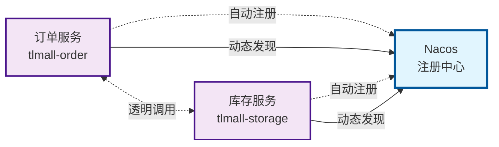

{: .no_toc }

<details close markdown="block">
  <summary>
    目录
  </summary>
  {: .text-delta }
- TOC
{:toc}
</details>

## 1.  介绍

### 1.1 文档概要

本文系统讲解 **Nacos 服务注册与发现机制**，涵盖以下核心内容：

| 知识模块 | 核心要点 |
| ---- | ---- |
| **硬编码方式的痛点** | 维护成本高、扩展性差、负载均衡困难、运维复杂四大核心挑战 |
| **服务注册与发现机制** | 自动注册、动态发现、健康检查、负载均衡四大核心能力 |
| **微服务注册实践** | 引入依赖 → 装配 Bean → 配置地址 → 验证注册，**四步法**完成服务接入 |
| **服务间调用实践** | LoadBalancer + **服务名**替代硬编码，实现调用与地址**完全解耦** |
| **配置优化方案** | Nacos 配置中心统一管理，配置变更**实时生效**，**无需重启** |

本文从**理论机制**（注册与发现原理）、**注册实践**（服务接入步骤）、**调用实践**（负载均衡调用）三个维度系统阐述 **Nacos 服务治理**，帮助读者构建**动态服务发现**的完整认知框架。

### 1.2 配套资源

| 资源类型           | 说明                               | 链接                                                                                                                   |
| -------------- | -------------------------------- | -------------------------------------------------------------------------------------------------------------------- |
| **项目源码**       | Spring Cloud Alibaba 2023 完整示例代码 | [github.com/fangkun119/spring-cloud-alibaba-2023-demo](https://github.com/fangkun119/spring-cloud-alibaba-2023-demo) |
| **Postman 集合** | API 测试用例集合，便于快速验证功能              | [github.com/fangkun119/postman-workspace](https://github.com/fangkun119/postman-workspace)                           |

## 2. Nacos 服务注册与发现

**微服务架构**中，服务间调用地址和端口的配置方式，直接影响系统的**可维护性**和**可扩展性**。本节阐述 **Nacos 注册与发现机制**如何解决 **硬编码方式**带来的核心挑战。

### 2.1 硬编码方式的痛点

采用**硬编码方式**配置服务调用时，会面临以下挑战：

| 挑战维度 | 具体问题 | 核心影响 |
| --- | --- | --- |
| **维护成本高** | 服务地址变更时，需同步修改所有调用方配置 | 配置分散，易出错，回归成本高 |
| **扩展性差** | 新增服务实例或调整端口时，影响面广 | 无法快速水平扩展，响应业务变化慢 |
| **负载均衡困难** | 无法灵活实现服务的水平扩展和负载分配 | 流量分配不均，资源利用率低 |
| **运维复杂** | 生产环境中服务部署和迁移变得困难重重 | 运维效率低，故障恢复慢 |

### 2.2 服务注册与发现机制

引入**服务注册与发现机制**，通过**动态注册中心**解决上述问题。

**核心思路：**

> 服务启动时**自动注册**到注册中心，调用方通过**服务名**动态发现目标实例，实现**调用与地址解耦**。

**架构原理：**



**机制价值：**

| 价值维度 | 说明 |
| --- | --- |
| **调用解耦** | 服务调用使用**服务名**而非具体地址，下游部署变更不影响上游 |
| **动态感知** | 实时感知服务实例的**上线、下线、健康状态**，自动调整调用策略 |
| **负载均衡** | 配合负载均衡器，实现请求在多个实例间的**智能分配** |
| **运维简化** | 服务部署、扩容、迁移无需修改配置，降低运维复杂度 |

## 3. 注册微服务到 Nacos

本章演示如何将三个微服务（`tlmall-storage`、`tlmall-order`、`tlmall-account`）注册到 **Nacos 注册中心**。以 `tlmall-storage` 为例，完整流程包含四个步骤。

### 3.1 微服务注册概述

**微服务注册流程**包含两个核心环节：

| 环节 | 说明 | 涉及组件 |
| --- | --- | --- |
| **1. 服务注册** | 服务启动时向 Nacos Server 上报服务名、IP、端口等元数据 | **Nacos Client** → **Nacos Server** |
| **2. 健康检查** | Client 主动发送心跳，Server 检测超时实例并自动剔除 | **Nacos Client** ↔ **Nacos Server** |

**核心机制**：

> 服务启动时，**Nacos Client** 自动将服务名、IP、端口、权重等元数据注册到 **Nacos Server**，并通过心跳机制维持注册状态。Nacos Server 实时维护服务实例的健康状态，自动剔除不健康实例，确保服务调用方获取到的服务列表始终准确可用。

**Nacos 服务注册特性**：

| 特性 | 说明 |
| --- | --- |
| **自动注册** | 引入 `spring-cloud-starter-alibaba-nacos-discovery` 依赖并配置 `server-addr` 后，服务启动时自动完成注册 |
| **动态感知** | 实时感知服务实例的生命周期变化（上线、下线、健康状态），自动更新服务列表 |
| **心跳维持** | Client 默认每 **5 秒**发送心跳，Server **15 秒**未收到心跳则判定实例不健康并剔除 |
| **临时实例** | Spring Cloud 默认使用临时实例（服务停止后自动从列表移除），也支持持久化实例（需手动下线） |

### 3.2 实现步骤演示

#### (1) 引入 Maven 依赖

在 `pom.xml` 中添加 **Nacos Discovery** 依赖：

```xml
<!--nacos-discovery注册中心依赖-->
<dependency>
    <groupId>com.alibaba.cloud</groupId>
    <artifactId>spring-cloud-starter-alibaba-nacos-discovery</artifactId>
</dependency>
```

#### (2) 装配 Nacos Discovery Bean

在主类上添加 `@EnableDiscoveryClient` 注解，启用服务发现功能：

```java
import org.springframework.cloud.client.discovery.EnableDiscoveryClient;

@EnableDiscoveryClient
public class TlmallStorageApplication {
    ...
}
```

> **说明**：此步骤可省略，**Spring Cloud Alibaba** 已实现自动装配。

#### (3) 配置 Nacos 注册中心地址

在 `application.yml` 中添加 Nacos Discovery 配置，指定注册中心地址：

```yml
spring:
  cloud:
    nacos:
      discovery:
        server-addr: tlmall-nacos-server:8848
```

#### (4) 验证服务注册

**启动库存服务**，在 **Nacos Console** 的"服务列表"中可查看到 `tlmall-storage`：


按照相同步骤，将 `tlmall-order` 和 `tlmall-account` 也注册到 Nacos：


三个微服务均成功注册后，**Nacos 服务列表**显示如下：


### 3.3 配置优化：使用 Nacos 配置中心

上述步骤在 `application.yml` 中**直接配置** Nacos 地址。实际项目中，推荐使用 **Nacos 配置中心**统一管理。

**配置方式**：以 `tlmall-order` 为例，在 `application.yml` 中导入远程配置：

```yml
spring:
  application:
    name: tlmall-order
  cloud:
    nacos:
      config:
        server-addr: tlmall-nacos-server:8848
        file-extension: yml
  config:
    import:
      - nacos:nacos-discovery.yml # 加载Nacos public命名空间下的远程配置
# ...
```

**远程配置内容**：

在 **Nacos 配置中心**创建 `nacos-discovery.yml`，内容为服务发现地址配置：


配置文件链接：[midwares/dev/remote/nacos/public/DEFAULT_GROUP/nacos-discovery.yml](https://github.com/fangkun119/spring-cloud-alibaba-2023-demo/blob/main/midwares/dev/remote/nacos/public/DEFAULT_GROUP/nacos-discovery.yml)

```yml
spring:
  cloud:
    nacos:
      discovery:
        server-addr: tlmall-nacos-server:8848
```

> **优势**：配置托管到 **Nacos 配置中心**后，修改注册中心地址无需重启服务，**配置变更实时生效**。相关内容将在后续章节详细展开。

代码链接：[midwares/dev/remote/nacos/public/DEFAULT_GROUP/nacos-discovery.yml](https://github.com/fangkun119/spring-cloud-alibaba-2023-demo/blob/main/midwares/dev/remote/nacos/public/DEFAULT_GROUP/nacos-discovery.yml)

```yml
spring:
  cloud:
    nacos:
      discovery:
        server-addr: tlmall-nacos-server:8848
```

这涉及到Nacos的另一个功能：配置托管。将在后续文档中详细展开。

### 3.3 代码汇总

三个微服务的完整配置如下：

| 微服务 | Maven 依赖 | 装配 Bean | 配置 Nacos 地址 |
| ---- | ---- | ---- | ---- |
| **订单服务** | [pom.xml](https://github.com/fangkun119/spring-cloud-alibaba-2023-demo/blob/main/microservices/tlmall-order/pom.xml) | [TlmallOrderApplication.java](https://github.com/fangkun119/spring-cloud-alibaba-2023-demo/blob/main/microservices/tlmall-order/src/main/java/org/springcloudmvp/tlmallorder/TlmallOrderApplication.java) | [application.yml](https://github.com/fangkun119/spring-cloud-alibaba-2023-demo/blob/main/microservices/tlmall-order/src/main/resources/application.yml) |
| **库存服务** | [pom.xml](https://github.com/fangkun119/spring-cloud-alibaba-2023-demo/blob/main/microservices/tlmall-storage/pom.xml) | [TlmallStorageApplication.java](https://github.com/fangkun119/spring-cloud-alibaba-2023-demo/blob/main/microservices/tlmall-storage/src/main/java/org/springcloudmvp/tlmallstorage/TlmallStorageApplication.java) | [application.yml](https://github.com/fangkun119/spring-cloud-alibaba-2023-demo/blob/main/microservices/tlmall-storage/src/main/resources/application.yml) |
| **账户服务** | [pom.xml](https://github.com/fangkun119/spring-cloud-alibaba-2023-demo/blob/main/microservices/tlmall-account/pom.xml) | [TlmallAccountApplication.java](https://github.com/fangkun119/spring-cloud-alibaba-2023-demo/blob/main/microservices/tlmall-account/src/main/java/org/spcloudmvp/tlmallaccount/TlmallAccountApplication.java) | [application.yml](https://github.com/fangkun119/spring-cloud-alibaba-2023-demo/blob/main/microservices/tlmall-account/src/main/resources/application.yml) |

**版本差异说明**：

最终代码与上述演示步骤存在一处差异：**Nacos 注册中心地址未直接配置在 `application.yml` 中**，而是通过 **Nacos 配置中心**统一管理。这种配置方式具有更好的**可维护性**和**灵活性**。

## 4. 通过 Nacos 调用微服务

微服务注册到 Nacos 后，接下来解决**服务间调用**问题。本节演示 `tlmall-order` 如何通过 **Nacos** + **Spring Cloud LoadBalancer** 调用 `tlmall-storage` 和 `tlmall-account`。

### 4.1 调用机制概述

**服务调用流程**包含两个核心步骤：

| 步骤 | 说明 | 涉及组件 |
| --- | --- | --- |
| **1. 服务发现** | 通过 Nacos 注册中心查找目标服务 | **Nacos Discovery** |
| **2. 负载均衡** | 从多个服务实例中选择具体实例进行调用 | **Spring Cloud LoadBalancer** |

**Spring Cloud LoadBalancer** 介绍：

| 特性 | 说明 |
| --- | --- |
| **定位** | Spring Cloud 官方提供的**客户端负载均衡器** |
| **演进** | 用于替换已停止维护的 **Ribbon** 组件 |
| **优势** | 支持 **RestTemplate** 和 **WebClient**（响应式异步请求） |
| **文档** | [官方文档](https://docs.spring.io/spring-cloud-commons/reference/spring-cloud-commons/loadbalancer.html) |

### 4.2 实现步骤演示

#### (1) 添加 Maven 依赖

在 `tlmall-order` 的 `pom.xml` 中添加 **Spring Cloud LoadBalancer** 依赖：

```xml
<!-- loadbalancer负载均衡器依赖-->
<dependency>
	<groupId>org.springframework.cloud</groupId>
    <artifactId>spring-cloud-loadbalancer</artifactId>
</dependency>
```

#### (2) 4.2.2 开启负载均衡功能

在 `tlmall-order` 的 `application.yml` 中配置启用负载均衡：

```yml
spring:
  cloud:
    loadbalancer:
      nacos:
        enabled: true
```

#### (3) 为 RestTemplate 添加负载均衡

使用 `@LoadBalanced` 注解装配 `RestTemplate` Bean，使其具备**负载均衡能力**（底层通过**拦截器**实现）：

```java
import org.springframework.cloud.client.loadbalancer.LoadBalanced;
import org.springframework.context.annotation.Bean;
import org.springframework.context.annotation.Configuration;
import org.springframework.web.client.RestTemplate;

@Configuration
public class RestConfig {
    @Bean
    @LoadBalanced
    RestTemplate restTemplate(){
        return new RestTemplate();
    }
}
```

#### (4) 通过服务名调用下游服务

**调用方式对比**：

| 场景 | 调用方式 | 说明 |
| --- | --- | --- |
| **未整合 Nacos** | `http://localhost:8010/storage/reduce-stock` | 使用**具体地址+端口**，依赖硬编码 |
| **整合 Nacos + LoadBalancer** | `http://tlmall-storage/storage/reduce-stock` | 使用**服务名**，实现调用与地址解耦 |

**代码对比**：

```java
// 未整合Nacos和LoadBalancer时，只能通过域名和端口调用下游
String storage_url = "http://localhost:8010/storage/reduce-stock";
Integer storageCode = restTemplate.postForObject(storage_url,storageDTO, Result.class).getCode();
```

```java
// 整合了Nacos和LoadBalancer后，使用微服务名tlmall-storage调用
String storage_url = "http://tlmall-storage/storage/reduce-stock";
Integer storageCode = restTemplate.postForObject(storage_url,storageDTO, Result.class).getCode();
```

> **优势**：使用**服务名**替代硬编码地址，下游服务部署变更时无需修改上游代码，实现**服务调用解耦**。

#### (5) 测试验证

**步骤1：启动服务**

启动 `tlmall-order`、`tlmall-storage`、`tlmall-frontend` 三个应用：


**步骤2：验证服务注册**

在 **Nacos Console** 中确认两个服务已成功注册：


**步骤3：发起下单调用**

通过 `tlmall-frontend` 页面（`localhost:8080`）发起下单请求：


**步骤4：验证调用成功**

检查日志，确认**服务名调用**成功：

```log
INFO 53005 --- [tlmall-order-01] [nio-8030-exec-1] com.alibaba.nacos.client.naming          : init new ips(1) service: DEFAULT_GROUP@@tlmall-storage -> [{"instanceId":"172.20.10.11#8010#DEFAULT#DEFAULT_GROUP@@tlmall-storage","ip":"172.20.10.11","port":8010,"weight":1.0,"healthy":true,"enabled":true,"ephemeral":true,"clusterName":"DEFAULT","serviceName":"DEFAULT_GROUP@@tlmall-storage","metadata":{"preserved.register.source":"SPRING_CLOUD","IPv6":"[2409:891f:90a5:4fff:3427:2ab9:9b0f:3900]"},"ipDeleteTimeout":30000,"instanceHeartBeatInterval":5000,"instanceHeartBeatTimeOut":15000}]
INFO 53005 --- [tlmall-order-01] [nio-8030-exec-1] com.alibaba.nacos.client.naming          : current ips:(1) service: DEFAULT_GROUP@@tlmall-storage -> [{"instanceId":"172.20.10.11#8010#DEFAULT#DEFAULT_GROUP@@tlmall-storage","ip":"172.20.10.11","port":8010,"weight":1.0,"healthy":true,"enabled":true,"ephemeral":true,"clusterName":"DEFAULT","serviceName":"DEFAULT_GROUP@@tlmall-storage","metadata":{"preserved.register.source":"SPRING_CLOUD","IPv6":"[2409:891f:90a5:4fff:3427:2ab9:9b0f:3900]"},"ipDeleteTimeout":30000,"instanceHeartBeatInterval":5000,"instanceHeartBeatTimeOut":15000}]
INFO 53005 --- [tlmall-order-01] [nio-8030-exec-1] o.t.t.service.impl.OrderServiceImpl      : [createOrder] orderId: 16
```

**负载均衡验证**：

启动多个 `tlmall-storage` 实例（使用不同端口），观察请求被分发到不同实例，验证 **LoadBalancer** 的负载均衡能力。

### 4.3 当前方案的局限性

基于 **RestTemplate + LoadBalancer** 的调用方式存在以下不足：

| 局限性 | 具体表现 | 影响 |
| --- | --- | --- |
| **代码可读性差** | URL 以字符串形式拼接，缺乏结构化管理 | 维护困难，易出错 |
| **URL 维护成本高** | 参数复杂时 URL 拼接繁琐，API 变更需全局查找替换 | 重构风险高，测试成本大 |

**解决方案**：后续文档将使用 **OpenFeign** 声明式 HTTP 客户端解决上述问题。

### 4.4 代码汇总

#### (1) 代码链接

| 步骤                           | 代码链接                                                                                                                                                                                                                                                                                                                                                                                                               |
| ---------------------------- | ------------------------------------------------------------------------------------------------------------------------------------------------------------------------------------------------------------------------------------------------------------------------------------------------------------------------------------------------------------------------------------------------------------------ |
| Maven依赖                      | [microservices/tlmall-order/pom.xml](https://github.com/fangkun119/spring-cloud-alibaba-2023-demo/blob/main/microservices/tlmall-order/pom.xml)                                                                                                                                                                                                                                                                    |
| 开启Spring Cloud Load Balancer | [microservices/tlmall-order/src/main/resources/application.yml](https://github.com/fangkun119/spring-cloud-alibaba-2023-demo/blob/main/microservices/tlmall-order/src/main/resources/application.yml)<br>[midwares/dev/remote/nacos/public/DEFAULT_GROUP/tlmall-order.yml](https://github.com/fangkun119/spring-cloud-alibaba-2023-demo/blob/main/midwares/dev/remote/nacos/public/DEFAULT_GROUP/tlmall-order.yml) |
| 为RestTemplate添加负载均衡          | [microservices/tlmall-order/src/main/java/org/springcloudmvp/tlmallorder/config/RestConfig.java](https://github.com/fangkun119/spring-cloud-alibaba-2023-demo/blob/main/microservices/tlmall-order/src/main/java/org/springcloudmvp/tlmallorder/config/RestConfig.java)                                                                                                                                            |
| 通过Nacos注册中心调用下游服务            | [microservices/tlmall-order/src/main/java/org/springcloudmvp/tlmallorder/service/impl/OrderServiceImpl.java](https://github.com/fangkun119/spring-cloud-alibaba-2023-demo/blob/main/microservices/tlmall-order/src/main/java/org/springcloudmvp/tlmallorder/service/impl/OrderServiceImpl.java)                                                                                                                    |

#### (2) 版本差异说明

最终代码与前几章的演示存在两处差异，均为**配置管理优化**：

##### 差异1：LoadBalancer 配置托管到 Nacos

| 配置位置 | 演示版本 | 最终版本 |
| --- | --- | --- |
| **本地配置** | `application.yml` 中直接配置 | 导入远程配置：`nacos:tlmall-order.yml` |
| **Nacos 远程配置** | 无 | [tlmall-order.yml](https://github.com/fangkun119/spring-cloud-alibaba-2023-demo/blob/main/midwares/dev/remote/nacos/public/DEFAULT_GROUP/tlmall-order.yml) |

##### 差异2：调用方式升级

**本节演示**：使用 **RestTemplate + 服务名** 调用

**最终版本**：升级到 **OpenFeign** 声明式调用（将在后续章节详细展开）

**调用方式演进**：

```java
// 方法2：本节演示（RestTemplate + Nacos + LoadBalancer）
String storage_url = "http://tlmall-storage/storage/reduce-stock";
Integer storageCode = restTemplate.postForObject(storage_url, storageDTO, Result.class).getCode();

// 方法3：最终版本（OpenFeign 声明式调用）
// 优势：接口化管理、参数映射、可读性更强
// 详细实现见后续章节
```

> **说明**：上述差异反映了**配置管理演进**（从本地到 Nacos 配置中心）和**调用方式升级**（从 RestTemplate 到 OpenFeign），相关内容将在后续章节详细介绍。


## 5. 总结

本文系统讲解 **Nacos 服务注册与发现机制**，从理论机制、注册实践、调用实践到配置优化，形成完整学习闭环：

| 学习层次 | 核心收获 |
| ---- | ---- |
| **建立体系化认知** | 理解硬编码四大痛点（维护成本高、扩展性差、负载均衡困难、运维复杂）、服务注册与发现四大能力（自动注册、动态发现、健康检查、负载均衡）、Nacos + LoadBalancer 协同架构 |
| **掌握实战能力** | 熟练运用**四步法**完成服务注册（引入依赖 → 装配 Bean → 配置地址 → 验证注册）、通过**服务名**实现调用解耦、使用 Nacos 配置中心实现**配置实时生效** |
| **优化技术决策** | 理解服务注册中心的**基础设施定位**、掌握临时实例**心跳机制**（5秒心跳、15秒超时）和**自动剔除**策略、具备生产环境服务治理与配置管理的选型能力 |

