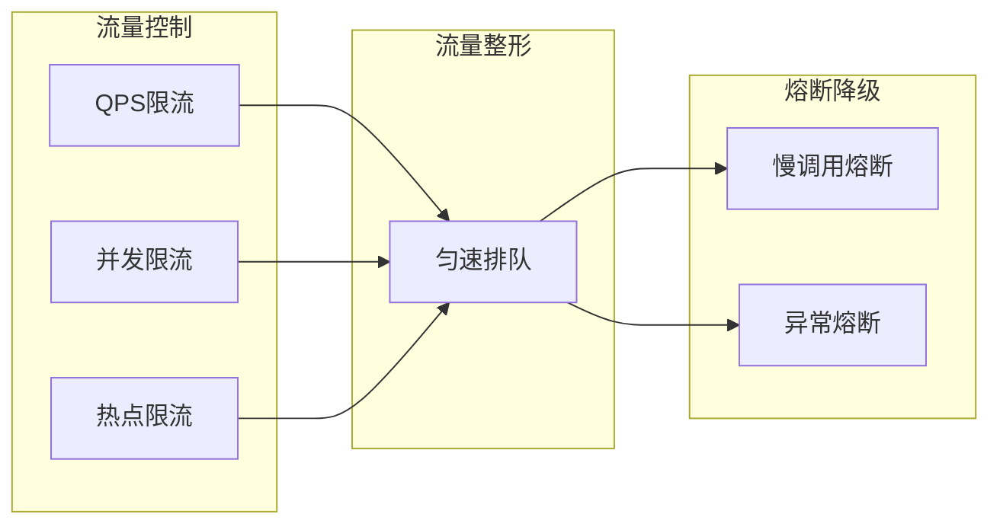

{: .no_toc }

<details close markdown="block">
  <summary>
    目录
  </summary>
  {: .text-delta }
- TOC
{:toc}
</details>


## 1. 介绍
### 1.1 文档概要

本文系统讲解 **Sentinel 流量治理组件**，涵盖**核心原理**与**实战整合**：

| 知识模块         | 核心内容                                                           |
| ------------ | -------------------------------------------------------------- |
| **稳定性挑战与方案** | 微服务架构三大风险（**服务雪崩**、**连锁反应**、**恶意流量**）及 Sentinel 解决思路           |
| **核心能力**     | 流量控制、流量整形、熔断降级、系统负载保护、热点参数防护                                   |
| **微服务整合实战**  | **Spring Cloud Alibaba** 集成 Sentinel：依赖配置、Dashboard 接入、受保护资源设置 |
| **流控规则实战**   | **Sentinel Dashboard** 规则配置、QPS 阈值设置、**推拉模式**工作机制              |
| **压测与验证**    | **Postman** 压测验证、流控阻塞观察、**单实例限流粒度**说明                          |

本文从**原理认知**到**实战应用**，帮助读者系统掌握 **Sentinel** 流量治理能力，构建微服务**稳定性保障**体系。

### 1.2 配套资源

#### (1) 项目源码

| 资源类型           | 说明                               | 链接                                                                                                                   |
| -------------- | -------------------------------- | -------------------------------------------------------------------------------------------------------------------- |
| **项目源码**       | Spring Cloud Alibaba 2023 完整示例代码 | [github.com/fangkun119/spring-cloud-alibaba-2023-demo](https://github.com/fangkun119/spring-cloud-alibaba-2023-demo) |
| **Postman 集合** | API 测试用例集合，便于快速验证功能              | [github.com/fangkun119/postman-workspace](https://github.com/fangkun119/postman-workspace)                           |

#### (2) 环境搭建

见文档：[Spring Cloud Alibaba上手 02：中间件环境]()

## 2. Sentinel 功能

### 2.1 组件定位

**Sentinel** 是面向分布式、多语言异构化服务架构的**流量治理组件**，主要以**流量**为切入点，从多个维度帮助开发者保障微服务的稳定性。

### 2.2 稳定性挑战

在微服务架构中，服务间复杂的调用关系带来了**严重的稳定性风险**：

| 风险类型 | 说明 | 影响 |
| --- | --- | --- |
| **服务雪崩效应** | 单个服务的故障或过载 | 迅速影响整个系统 |
| **连锁反应** | 一个服务性能下降 | 导致依赖它的多个服务同时受影响 |
| **恶意流量威胁** | 如刷单等异常行为 | 可能压垮关键业务接口 |

### 2.3 核心功能

为应对上述问题，Sentinel 提供**五大核心能力**：

| 功能 | 说明 | 典型配置 |
| --- | --- | --- |
| **流量控制** | 通过规则限制入口流量 | QPS 阈值、并发数限制 |
| **流量整形** | 对流量进一步调整，确保平滑进入系统 | 匀速排队、拒绝策略 |
| **熔断降级** | 当资源故障时，熔断器触发，直接拒绝请求 | 下游服务宕机时防止故障扩散 |
| **系统负载保护** | 基于系统实时指标进行自适应保护 | 系统 Load、CPU 使用率 |
| **热点参数防护** | 识别并精细化控制频繁访问的热点参数 | 商品 ID、用户 ID |

**治理流程**：流量控制 → 流量整形 → 熔断降级



### 2.4 典型应用场景

Sentinel 在以下场景中发挥关键作用：

| 场景 | Sentinel 作用 |
| --- | --- |
| **库存服务响应缓慢** | 触发熔断，防止订单服务连锁反应 |
| **订单接口刷单攻击** | 通过限流规则保护关键业务接口 |
| **服务依赖故障** | 自动降级，保证业务连续性 |

## 3. 微服务整合

> **重要说明**：Sentinel 官方文档（<https://sentinelguard.io/zh-cn/docs/dashboard.html>）更新度不够，存在陈旧内容。以下步骤为经过验证的最新实践，**以本文为准**。

### 3.1 整合范围

本项目仅为 **`tlmall-order`** 服务集成了 **Sentinel**，其他服务的集成步骤相同，可参照执行。

### 3.2 整合步骤

#### (1) 引入依赖

在 `pom.xml` 中添加 **Sentinel 依赖**：

```xml
<!-- sentinel 依赖-->
<dependency>
    <groupId>com.alibaba.cloud</groupId>
    <artifactId>spring-cloud-starter-alibaba-sentinel</artifactId>
</dependency>
```

**完整代码**：[microservices/tlmall-order/pom.xml](https://github.com/fangkun119/spring-cloud-alibaba-2023-demo/blob/main/microservices/tlmall-order/pom.xml)

#### (2) 配置 Sentinel 控制台

配置采用 **Nacos 远程配置** 方式，分两步完成：

**步骤一：上传配置到 Nacos**

创建 `sentinel-dashboard.yml` 配置文件并上传到 Nacos

```yml
spring:
  cloud:
    sentinel:
      transport:
        # 添加sentinel的控制台地址
        dashboard: tlmall-sentinel-dashboard:8888
```

完整代码：[midwares/dev/remote/nacos/public/DEFAULT_GROUP/sentinel-dashboard.yml](https://github.com/fangkun119/spring-cloud-alibaba-2023-demo/blob/main/midwares/dev/remote/nacos/public/DEFAULT_GROUP/sentinel-dashboard.yml)

**步骤二：导入 Nacos 远程配置**

在 `application.yml` 中导入上述配置

```yml
spring:
  config:
    import:
      - optional:nacos:sentinel-dashboard.yml
```

完整代码：[microservices/tlmall-order/src/main/resources/application.yml](https://github.com/fangkun119/spring-cloud-alibaba-2023-demo/blob/main/microservices/tlmall-order/src/main/resources/application.yml)
#### (3) 配置受保护资源

**Spring MVC 场景**：本项目使用 Spring MVC Controller，**引入依赖后自动支持**，无需额外配置。

**其他场景**：可使用以下注解显式指定受保护资源

| 注解 | 说明 |
| --- | --- |
| `@SentinelResource` | 方法级别保护 |
| `@SentinelRestTemplate` | RestTemplate 调用保护 |

### 3.3 验证整合效果

#### (1) 服务注册验证

启动微服务后，通过以下步骤验证：

| 步骤 | 操作 | 预期结果 |
| ---- | ---- | ---- |
| 1 | 通过 `tlmall-frontend:8080` 发起一次下单请求 | 触发服务调用 |
| 2 | 登录 **Sentinel Dashboard**：`http://tlmall-sentinel-dashboard:8888/` | 进入控制台 |
| 3 | 查看服务列表 | `tlmall-order` 出现在列表中 |

Sentinel控制台界面如下


第一次调用只会触发被保护资源注册到Sentinel上，后续调用才会有统计值

#### (2) API 调用捕获

在下单过程中，使用 **Chrome DevTool** 捕获 API 调用，生成 curl 命令：

```bash
curl 'http://tlmall-gateway:18888/order/create' \
  -H 'Accept: application/json, text/javascript, */*; q=0.01' \
  -H 'Accept-Language: zh-CN,zh;q=0.9' \
  -H 'Connection: keep-alive' \
  -H 'Content-Type: application/x-www-form-urlencoded; charset=UTF-8' \
  -H 'Origin: http://localhost:8080' \
  -H 'Referer: http://localhost:8080/' \
  -H 'User-Agent: Mozilla/5.0 (Macintosh; Intel Mac OS X 10_15_7) AppleWebKit/537.36 (KHTML, like Gecko) Chrome/143.0.0.0 Safari/537.36' \
  --data-raw 'userId=fox&commodityCode=1&count=1' \
  --insecure
```

#### (3) Postman 测试准备

将 curl 命令导入 **Postman Collection**，也可以直接导入现成的 [Postman Workspace](https://github.com/fangkun119/postman-workspace)，用于后续测试。


## 4. 流量控制


微服务API调用，触发被保护资源注册到Sentinel之后，就会显示在控制台“簇点链路”中。


点击`/order/create` 右边的`+流控`按钮，填入下面的配置，点击`新增`


点击`新增`就把流控规则创建好了，这样每秒钟最多只能请求一次


用PostMan连续快速发送下单请求，可以看到请求被Sentinel阻塞


Sentinel 流控的工作机制如下：

**推拉模式**：微服务启动时开启与 Sentinel Dashboard 的通信端口，Dashboard 将流控规则**推送**至微服务，由微服务内的 **Sentinel Lib** 在本地执行流量控制。

**限流粒度**：上述配置的 QPS 阈值作用于**单个服务实例**，而非整个微服务的所有实例总和。

> **集群限流**：如需以整个微服务为粒度进行限流，需使用 **Sentinel 集群限流**功能（企业版），需要额外购买并配置。

## 5. 总结

本文系统讲解 **Sentinel 流量治理组件**，从**核心原理**到**实战应用**的完整闭环，帮助读者：

| 学习层次 | 核心收获 |
| ---- | ---- |
| **建立稳定性认知** | 理解微服务**三大风险**（服务雪崩、连锁反应、恶意流量）及 **Sentinel 五大治理能力** |
| **掌握整合实战** | 熟练 **Spring Cloud Alibaba** 项目集成 Sentinel：依赖配置、Dashboard 接入、受保护资源设置 |
| **精通流控应用** | 掌握 Dashboard 规则配置、QPS 阈值设置、Postman 压测验证，理解**推拉模式**与**限流粒度** |

