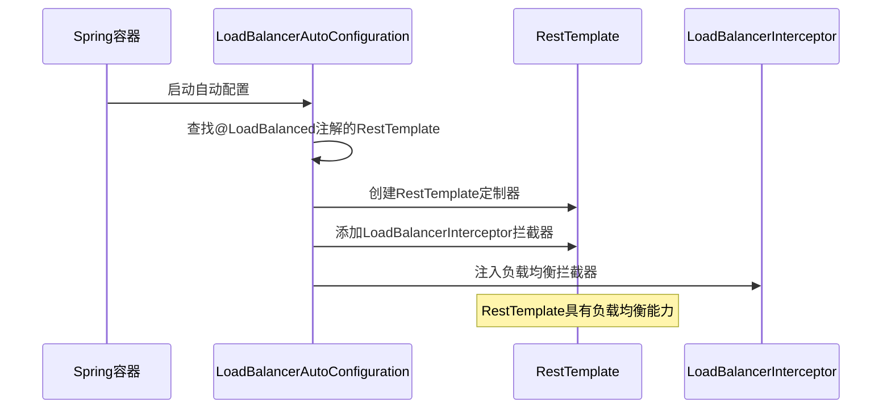

{: .no_toc }

<details close markdown="block">
  <summary>
    目录
  </summary>
  {: .text-delta }
- TOC
{:toc}
</details>

## 1. 导读

### 1.1 本文介绍

在 Spring Cloud Alibaba 微服务架构中，当从 Nacos 获取到目标服务的实例列表后，需要通过负载均衡机制选择合适的实例发起调用，而这一过程正是由 Spring Cloud LoadBalancer 完成的。

本文系统介绍 Spring Cloud LoadBalancer，完整呈现知识体系，演示复杂问题的处理过程，重点从以下三个方面展开。

| 维度       | 内容                                                                        |
| -------- | ------------------------------------------------------------------------- |
| **基础理论** | - Spring Cloud LoadBalancer 在微服务系统中的定位和作用<br>- 快速上手<br>- 内置负载均衡策略         |
| **实践应用** | - 负载均衡策略的配置和切换方法<br>- 自定义负载均衡算法<br>- 不同业务场景下的策略选择建议                       |
| **问题解决** | - `@LoadBalanced` 注解在特定场景下的使用陷阱<br>- Bean 初始化时序问题导致的调用失败<br>- 问题定位思路和解决方案 |

在兼顾快速上手与深度理解的同时，本文通过源码分析和问题调试演示，全方位剖析 Spring Cloud LoadBalancer。

### 1.2 配套资料

**代码仓库**

本文配套代码位于 [spring-cloud-alibaba-2023-nacos](https://github.com/fangkun119/spring-cloud-alibaba-2023-nacos/) 仓库，主要涉及以下两个模块：

| 模块名称 | 代码路径                                                                                                                                                   |
| ---- | ------------------------------------------------------------------------------------------------------------------------------------------------------ |
| 用户服务 | [microservices/tlmall-nacos-demo-user](https://github.com/fangkun119/spring-cloud-alibaba-2023-nacos/tree/main/microservices/tlmall-nacos-demo-user)   |
| 订单服务 | [microservices/tlmall-nacos-demo-order](https://github.com/fangkun119/spring-cloud-alibaba-2023-nacos/tree/main/microservices/tlmall-nacos-demo-order) |

**环境搭建**

微服务环境搭建请参考本系列笔记《Spring Cloud Alibaba 02：完整 Demo 搭建》中的第 3.3 至 3.5 小节。

```text
3.3 域名配置
3.4 MySQL
3.5 Nacos
```

**测试工具**

Postman 请求集合见 [postman-workspace](https://github.com/fangkun119/postman-workspace)，本文使用以下请求进行测试：


## 2. 快速上手

### 2.1 介绍

使用Spring Cloud LoadBalancer前，先了解其作用机制与工作原理。

#### (1) 作用

Spring Cloud LoadBalancer是Spring Cloud Commons提供的客户端负载均衡器，主要功能包括：

- **实例选择**：根据负载均衡算法，从下游服务的多个实例中进行选择，提升系统可用性和性能
- **服务发现**：从Nacos注册中心获取下游服务的实例列表，以结合负载均衡策略发起调用

官方文档位于：<https://docs.spring.io/spring-cloud-commons/reference/spring-cloud-commons/loadbalancer.html>

#### (2) 原理

Spring Cloud LoadBalancer执行流程如下，以`订单服务`调用`用户服务`为例：

```text
- 订单服务服务发起调用
- LoadBalancer拦截器拦截
- LoadBalancer访问Nacos注册中心
- Nacos注册中心返回下游服务实例列表
- LoadBalancer通过负载均衡算法(轮询/随机/权重)选择实例
- 订单服务对请求下游服务具体实例
```

具体如下图所示：


通过客户端负载均衡机制，LoadBalancer无需额外部署负载均衡服务器，降低系统复杂度。

### 2.2 快速配置

在Spring Cloud Alibaba中，通过以下是三步可以快速配置LoadBalancer。


#### (1) 引入Maven依赖

在项目的pom.xml文件中添加LoadBalancer Starter依赖：

```xml
<dependency>
    <groupId>org.springframework.cloud</groupId>
    <artifactId>spring-cloud-starter-loadbalancer</artifactId>
</dependency>
```

这个依赖引入了LoadBalancer的核心功能，包括负载均衡实现，并整合服务发现机制。

#### (2) 开启Nacos负载均衡策略

在`application.yml`配置文件中开启Nacos负载均衡

```yaml
spring:
  cloud:
    loadbalancer:
      # 启用Nacos提供的负载均衡策略
      nacos:
        enabled: true
```

注意`spring.cloud.loadbalancer.nacos.enable`这个配置：

| 配置值 | 策略说明 | 适用场景 |
| --- | --- | --- |
| `true` | 开启Nacos负载均衡策略，优先从本地集群或同地域中选取实例 | 官方推荐，减少网络延迟 |
| `false` | 根据其他配置决定策略 | 自定义配置场景 |

这个配置其实来自Nacos，它把Nacos的负载均衡算法，注入到Spring Cloud LoadBalancer中，实现基于Nacos实例元数据的负载均衡策略。

#### (3) 配置@LoadBalanced注解

在`RestTemplate`类上添加`@LoadBalanced`注解，它就具备了负载均衡能力。

```java
@Bean
@LoadBalanced // 注入负载均衡能力
public RestTemplate restTemplate() {
    return new RestTemplate();
}
```

具体包括：

| 功能           | 说明                             |
| ------------ | ------------------------------ |
| **服务名解析**    | 识别服务名（例如`tlmall-order`）并获取实例列表 |
| **负载均衡策略应用** | 根据配置的具体策略，从实例列表中选择目标实例         |

#### (4) 调用方式变化

配置完成后，服务调用的方式发生入明显变化：

| 调用方式     | 配置前              | 配置后                    |
| -------- | ---------------- | ---------------------- |
| **目标地址** | `localhost:8010` | `tlmall-order`(微服务名称)  |
| **底层处理** | 直接连接指定IP和端口      | LoadBalancer解析服务名并选择实例 |
| **实例选择** | 固定单个实例           | 根据负载均衡算法动态选择           |

实际调用示例：

```java
// 配置前：硬编码IP和端口
restTemplate.getForObject("http://localhost:8010/api/order", Order.class);

// 配置后：使用微服务名称
restTemplate.getForObject("http://tlmall-order/api/order", Order.class);
```

另外注意[服务启动类](https://github.com/fangkun119/spring-cloud-alibaba-2023-nacos/blob/main/microservices/tlmall-nacos-demo-user/src/main/java/org/nacosdemo/tlmalluser/TlmallUserApplication.java)，它并没有添加`@EnableDiscoveryClient`注解，就可以让RestTemplate具备从Nacos获取实例列表的能力。

### 2.3 环境准备与验证

接下来是测试环境搭建。这个环境来演示Spring Cloud LoadBalancer的各种特性，进而深入了解。
#### (1) 测试场景

包括两个微服务：用户服务（`tlmall-order`）和订单服务（`tlmall-order`）。


用户服务（`tlmall-user`）会调用订单服务（`tlmall-order`）获取用户的所有订单。

#### (2) 环境搭建

微服务运行需要搭建中间件环境，复用先前的即可。

搭建过程参考《Spring Cloud Alibaba 02：完整Demo搭建》中`3.3`到`3.5`这三个小节。

```text
3.3 域名配置
3.4 MySQL
3.5 Nacos
```


演示代码Repo如下，`git clone`下来分别导入到IDEA和Postman

- <https://github.com/fangkun119/spring-cloud-alibaba-2023-nacos>
- <https://github.com/fangkun119/postman-workspace>

启动MySQL和Nacos。

```bash
_______________________________________________________
$ /KendeMacBook-Air/ ken@KendeMacBook-Air.local:~/Code/mid-wares/nacos/
$ brew services start mysql
==> Successfully started `mysql` (label: homebrew.mxcl.mysql)
_______________________________________________________
$ /KendeMacBook-Air/ ken@KendeMacBook-Air.local:~/Code/mid-wares/nacos/
$ bash bin/startup.sh
/Library/Java/JavaVirtualMachines/jdk-17.jdk/Contents/Home/bin/java   -Xms512m -Xmx512m -Xmn256m -Dnacos.standalone=true -Dnacos.member.list= -Xlog:gc*:file=/Users/ken/Code/mid-wares/nacos/logs/nacos_gc.log:time,tags:filecount=10,filesize=100m -Dloader.path=/Users/ken/Code/mid-wares/nacos/plugins,/Users/ken/Code/mid-wares/nacos/plugins/health,/Users/ken/Code/mid-wares/nacos/plugins/cmdb,/Users/ken/Code/mid-wares/nacos/plugins/selector -Dnacos.home=/Users/ken/Code/mid-wares/nacos -jar /Users/ken/Code/mid-wares/nacos/target/nacos-server.jar  --spring.config.additional-location=file:/Users/ken/Code/mid-wares/nacos/conf/ --logging.config=/Users/ken/Code/mid-wares/nacos/conf/nacos-logback.xml --server.max-http-header-size=524288
nacos is starting with standalone
nacos is starting. you can check the /Users/ken/Code/mid-wares/nacos/logs/start.out
```

如果需要关闭中间件，可参考如下命令。

```bash
_______________________________________________________
$ /KendeMacBook-Air/ ken@KendeMacBook-Air.local:~/Code/mid-wares/nacos/
$ bash bin/shutdown.sh
The nacosServer(41623
41892
42897) is running...
Send shutdown request to nacosServer(41623
41892
42898) OK
_______________________________________________________
$ /KendeMacBook-Air/ ken@KendeMacBook-Air.local:~/Code/mid-wares/nacos/
$ brew services stop mysql
Stopping `mysql`... (might take a while)
==> Successfully stopped `mysql` (label: homebrew.mxcl.mysql)
_______________________________________________________
$ /KendeMacBook-Air/ ken@KendeMacBook-Air.local:~/Code/mid-wares/nacos/
$  brew services list | grep mysql
mysql   none
_______________________________________________________
$ /KendeMacBook-Air/ ken@KendeMacBook-Air.local:~/Code/mid-wares/nacos/
$ jps | grep -i nacos
```

#### (3) 环境验证

启动`tlmall-nacos-demo-order`和`tlmall-nacos-demo-user`两个微服务，可以看到他们的端口分别是8060和8050。


用Postman向8050端口的用户服务发送请求，用户服务从订单服务获取会员所有订单并返回给Postman。


## 3. 内置负载均衡策略

### 3.1 策略介绍

#### (1) 功能

LoadBalancer提供了三种内置负载均衡策略：**轮询(RoundRobin)**、**随机(Random)**、**基于Nacos的集群优先策略**，分别适用于不同的业务场景。功能分别如下：

| 策略类型        | 实现类                    | 选择逻辑                            | 适用场景           |
| ----------- | ---------------------- | ------------------------------- | -------------- |
| **轮询策略**    | RoundRobinLoadBalancer | 按顺序依次选择每个实例,循环往复，但要求**实例数不少于2** | 实例性能相近，请求量均匀分布 |
| **随机策略**    | RandomLoadBalancer     | 随机选择一个服务实例                      | 实例性能差异小，无需优先级  |
| **Nacos策略** | NacosLoadBalancer      | 优先候选同集群同区域实例，然后按权重随机            | 多机房部署，需要就近访问   |

#### (2) 优先级

使用哪个负载均衡策略，框架是如何选择的呢？ 取决于两类配置：

**第1类配置**：`spring.cloud.loadbalancer.nacos.enable`配置，它其实属于Nacos

```yml
spring:
  cloud:
    loadbalancer:
      nacos:
        enabled: true
```

**第2类配置**：服务启动类上的`@LoadBalancerClients`注解，它属于Spring Cloud LoadBalancer

```java
@SpringBootApplication
@LoadBalancerClients(
	// ……
)
public class TlmallUserApplication {
    public static void main(String[] args) {
        SpringApplication.run(TlmallUserApplication.class, args);
    }
}
```

根据是否使用这两类配置，共得到4个组合

|                              | Nacos配置为`true`          | Nacos配置为`false`                 |
| ---------------------------- | ----------------------- | ------------------------------- |
| **使用`@LoadBalancerClients`** | ⚠️ 冲突，行为不可预测            | ✅ 使用`@LoadBalancerClients`配置的策略 |
| **没有`@LoadBalancerClients`** | ✅ 使用`NacosLoadBalancer` | ✅ 使用轮询策略兜底                      |

从上表可以看出

|         | **配置**   | **行为**           |
| ------- | -------- | ---------------- |
| **组合1** | 两类配置都使用  | 可能产生冲突，表现为运行时bug |
| **组合4** | 两类配置都不使用 | 使用轮询策略兜底         |

#### (3) NacosLoadBalancer策略逻辑

接下来了解Nacos内置策略的执行逻辑，它分两步执行：

- 第一步：优先把相同`cluster-name`实例列入候选列表，如果没有则使用全局实例兜底
- 第二步：采用加权随机的方式、从候选列表中选择具体的实例

权重用来让性能更好的实例承担更多请求。通过Nacos控制台配置 ，默认为等权重，如下图第4列。


整个流程如下：


这样的好处是：

* 避免跨集群网络调用的延迟
* 当前集群发生故障，可以自动切换到其它集群
* 还可以用权重配置让性能更高的机器承担更多流量

下面是配置样例：

```yml
spring:
  cloud:
    nacos:
      discovery:
        cluster-name: HZ  # 当前应用所属集群
    loadbalancer:
      nacos:
        enabled: true        # 启用Nacos负载均衡，同机房同地域优先，全局兜底
        # cluster-only: true # 强制只路由同集群，禁用降级策略
```

这些策略开关的用途如下：

| 配置项                        | 值         | 路由范围           | 降级策略   | 适用场景         |
| -------------------------- | --------- | -------------- | ------ | ------------ |
| `enabled: false`           | **false** | 全局所有实例         | 无（纯全局） | 流量均匀打散，测试环境  |
| `cluster-only: true`       | **true**  | 仅限同集群          | 禁止降级   | 严格数据局部性，金融交易 |
| `cluster-only: false` (默认) | **false** | 同集群 → 同地域 → 全局 | 自动降级   | 生产环境标准部署     |

### 3.2 策略配置

#### (1) 推荐的方法

如果不使用默认的 `NacosLoadBalancer`，可按照以下方法进行配置。

**步骤 1**：关闭 Nacos 自带的负载均衡策略

```yml
spring:
  cloud:
    loadbalancer:
      nacos:
        enabled: false # 设置为false关闭Nacos对负载均衡的配置
```


**步骤 2**：编写一个负载均衡策略 Bean，类型为`ReactorLoadBalancer<ServiceInstance>`，注意不要加 `@Configuration` 注解，避免被父上下文扫描到而导致全局共享。

以内置的随机策略为例，代码如下：

```java
// 注意，不要加@Configuration
public class RandomLoadBalancerConfig {
    @Bean
    public ReactorLoadBalancer<ServiceInstance> reactorServiceInstanceLoadBalancer(
            Environment environment, LoadBalancerClientFactory loadBalancerClientFactory) {
        String name = environment.getProperty(LoadBalancerClientFactory.PROPERTY_NAME);
        return new RandomLoadBalancer(
                loadBalancerClientFactory.getLazyProvider(name, ServiceInstanceListSupplier.class), name);
    }
}
```

编写过程模仿`NacosLoadBalancerClientConfiguration`的 `nacosLoadBalancer`方法即可，只是我们不添加 `@Beaan`注解因此也就不需要`@ConditionalOnMissingBean`注解：


**步骤 3**：在服务启动类上 `@LoadBalancerClients` 注解设定策略生效范围。

可以单用 `defaultConfiguration` 属性设置全局策略。

```java
@SpringBootApplication
// 设置全局的负载均衡策略
@LoadBalancerClients(defaultConfiguration = RandomLoadBalancerConfig.class)
public class TlmallUserApplication {
    public static void main(String[] args) {
        SpringApplication.run(TlmallUserApplication.class, args);
    }
}
```

可以单用`value` 属性根据服务名（例如`tlmall-order`）根据微服务名配置策略

```java
@LoadBalancerClients(value = {  
        @LoadBalancerClient(name = "tlmall-order", configuration = IPHashLoadBalancerConfig.class)
})
@SpringBootApplication  
public class TlmallUserApplication {  
    public static void main(String[] args) {  
        SpringApplication.run(TlmallUserApplication.class, args);  
    }  
}
```

自定义策略也可以用这个注解配置进来。

#### (2) 不推荐的方法

如果使用 OpenFeign，也可以将负载均衡配置在 OpenFeign 生成的 Client 接口上，但不推荐这样做。

```java
// 不推荐的配置方法
@FeignClient(name = "tlmall-account")
@LoadBalancerClient(
	name = "tlmall-account", 
	configuration = RandomLoadBalancerConfig.class)
public interface AccountServiceFeignClient {
    @PostMapping("/account/reduce-balance")
    Result<?> reduceBalance(@RequestBody AccountDTO accountReduceBalanceDTO);
}
```

因为存在两个风险：

| 风险类型          | 举例                                                                                           | 后果                |
| ------------- | -------------------------------------------------------------------------------------------- | ----------------- |
| **职责混乱**      | 例如：<br>- 其他配置要求对 `tlmall-account` 使用 `NacosLoadBalancer`<br>- 这个配置却要求使用 `RandomLoadBalancer` | 配置冲突，无法确定使用哪种策略   |
| **Bean 重复加载** | 不同配置都为同一个Client配置了负载均衡策略，会产生重复的Bean                                                          | 引发 Bean 冲突或配置覆盖问题 |

官方推荐采用**配置集中管理**的方式，即统一配置在服务启动类上方的 `@LoadBalancerClients` 注解中。

### 3.3 实验演示

用实验来验证和演示上一小节的内容，也是本地开发调试的方法参考。

#### (1) 环境部署

环境拓扑如下，启动两个订单服务实例，端口分别是8060和8061，来验证各种配置下生效的策略。


首先创建第二个用户服务实例，步骤如下：

1. 把 `TlmallOrderApplication` 的 Run Configuration 复制一份出来
2. 给两份Run Configuration分别添加`-Dserver.port=8060`和`-Dserver.port=8061`的`VM Options`

配置如下，启动后订单服务两个实例的端口分别是`8060`和`8061`。


在Nacos控制台同样可以验证，两个实例均已注册。


#### (2) NacosLoadBalancer策略演示

配置 `spring.cloud.loadbalancer.nacos.enabled=true`时，将使用NacosLoadBalancer策略覆盖默认的RoundLoadBalancer。演示步骤如下。

修改用户服务的[application.yml](https://github.com/fangkun119/spring-cloud-alibaba-2023-nacos/blob/main/microservices/tlmall-nacos-demo-user/src/main/resources/application.yml)，将`spring.cloud.loadbalancer.nacos.enabled`设为`true`。

```yml
loadbalancer:  
  nacos:  
    enabled: true
```

在`NacosLoadBalancer.java` 下面这一行的位置打断点。


重启用户服务，用Postman发请求，观察` instance  `对象的`instanceId`字段，就能看出来再往哪个实例发请求。


连续发送多个请求，可以观察到，路由是随机的，这也是因为我们在Nacos控制台中给两个实例的权重是相同的。

#### (3) 兜底策略演示

配置 `spring.cloud.loadbalancer.nacos.enabled=false`时，如果不指定其它负载均衡策略，将使用`RoundRobinLoadBalancer`兜底。演示如下。

修改用户服务的[application.yml](https://github.com/fangkun119/spring-cloud-alibaba-2023-nacos/blob/main/microservices/tlmall-nacos-demo-user/src/main/resources/application.yml)，将`spring.cloud.loadbalancer.nacos.enabled`设为`false`。

```yml
loadbalancer:  
  nacos:  
    enabled: false
```

确保没有配置任何策略。

```java
@SpringBootApplication  
// 负载均衡策略配置  
// 方法1：指定一个全局统一的策略  
// @LoadBalancerClients(defaultConfiguration = RandomLoadBalancerConfig.class)  
// 方法2：为特定下游指定特定策略  
// @LoadBalancerClients(value = {  
//     @LoadBalancerClient(name = "tlmall-order", configuration = IPHashLoadBalancerConfig.class)
// })   
public class TlmallUserApplication {  
    public static void main(String[] args) {  
        SpringApplication.run(TlmallUserApplication.class, args);  
    }  
}
```

在`RoundRobinLoadBalancer` 这一行的位置打断点。


用Postman连续向用户服务发请求，观察内存栈中`instanceId` 字段，可以看到端口在8060和8061之间轮询。


说明`Spring Cloud LoadBalancer`使用了`RoundRobinBalancer`轮询策略进行兜底。

#### (4) 策略配置演示

配置 `spring.cloud.loadbalancer.nacos.enabled=false`时，可以指定其它负载均衡策略，覆盖用来兜底的`RoundRobinLoadBalancer`。演示如下。

修改用户服务的[application.yml](https://github.com/fangkun119/spring-cloud-alibaba-2023-nacos/blob/main/microservices/tlmall-nacos-demo-user/src/main/resources/application.yml)，将`spring.cloud.loadbalancer.nacos.enabled`设为`false`。

```yml
loadbalancer:  
  nacos:  
    enabled: false
```

添加策略配置Bean，该配置使用的是内置的`RandomLoadBalancer`。

```java
// 注意，不要加@Configuration以避免被容器啥扫描的到，这样可以接下来通过@LoadBalancerClients注解来指定这个Bean的生效范围
public class RandomLoadBalancerConfig {  
    @Bean  
    public ReactorLoadBalancer<ServiceInstance> reactorServiceInstanceLoadBalancer(  
            Environment environment, LoadBalancerClientFactory loadBalancerClientFactory) {  
        String name = environment.getProperty(LoadBalancerClientFactory.PROPERTY_NAME);  
        return new RandomLoadBalancer(  
                loadBalancerClientFactory.getLazyProvider(name, ServiceInstanceListSupplier.class), name);  
    }  
}
```

开启策略配置，下面两种方法任意一种都可以，让这个Balancer生效。

```java
@SpringBootApplication  
// 方法1：指定一个全局统一的策略  
// @LoadBalancerClients(defaultConfiguration = RandomLoadBalancerConfig.class)  
// 方法2：为特定下游指定特定策略  
// @LoadBalancerClients(value = {  
//     @LoadBalancerClient(name = "tlmall-order", configuration = IPHashLoadBalancerConfig.class)
// })   
public class TlmallUserApplication {  
    public static void main(String[] args) {  
        SpringApplication.run(TlmallUserApplication.class, args);  
    }  
}
```

在`RandomLoadBalancer` 的`choose`方法中打断点。


重启用户服务，使用Postman连续发送请求


从`serviceInstanceResponse.serviceInstance.innstancdId`中可以看出，是随机选取实例发送的。

### 3.4 源码定位

定位源码，可以更深入理解负载均衡的实现，有助于编码和解决问题。 接下来阅读三段源码，验证上一小节的三个内容呢。

#### (1) 兜底策略

Spring Cloud Load Balancer默认兜底策略是RoundRobinLoadBalancer。

首先查阅[Spring Cloud LoadBalancer官方文档](https://docs.spring.io/spring-cloud-commons/reference/spring-cloud-commons/loadbalancer.html)，找到策略类`RandomLoadBalancer`和 `RoundRobinLoadBalancer` 。


考虑到它的Bean都是自动装配的，那么通常有用于装配的Configuration类，搜索结果中前三个最接近。


在第三个即`LoadBalancerClientConfiguration`类中，找到如下代码，这里配置了负载均衡策略Bean。

```java
@Configuration(proxyBeanMethods = false)  
@ConditionalOnDiscoveryEnabled  
public class LoadBalancerClientConfiguration {  
  
    @Bean  
    @ConditionalOnMissingBean    
    public ReactorLoadBalancer<ServiceInstance> reactorServiceInstanceLoadBalancer(Environment environment,  
          LoadBalancerClientFactory loadBalancerClientFactory) {  
       String name = environment.getProperty(LoadBalancerClientFactory.PROPERTY_NAME);  
       return new RoundRobinLoadBalancer(  
             loadBalancerClientFactory.getLazyProvider(name, ServiceInstanceListSupplier.class), name);  
    }
    // ...
}
```

从代码中的`@ConditionalOnMissingBean`可看出，假如容器中没有装配其它策略Bean，就会使用`RoundRobinLoadBalancer` 作为默认值，兜底策略就是使用这种方式实现的。 

也正因为如此，在配置时要避免添加`@Configuration`防止被容器扫到。然后把它们全部交给`@LoadBalancerClients`管理 ，避免产生冲突。

```java
// 注意，不要加@Configuration以避免被容器啥扫描的到，这样可以接下来通过@LoadBalancerClients注解来指定这个Bean的生效范围
public class RandomLoadBalancerConfig {  
    @Bean  
    public ReactorLoadBalancer<ServiceInstance> reactorServiceInstanceLoadBalancer(  
            Environment environment, LoadBalancerClientFactory loadBalancerClientFactory) {  
        String name = environment.getProperty(LoadBalancerClientFactory.PROPERTY_NAME);  
        return new RandomLoadBalancer(  
                loadBalancerClientFactory.getLazyProvider(name, ServiceInstanceListSupplier.class), name);  
    }  
}
```

#### (2) 全部内置策略

继续上一小节的代码，可以看出：负载均衡Bean实现的接口是`ReactorLoadBalancer`，它上一层接口是 `ReactiveLoadBalancer<T>` 。

查找这两个接口的实现类，共有三个：

- `RoundRobinLoadBalancer`
- `RandomLoadBalancer`
- `NacosLoadBalancer`

前两个来自Spring Cloud Load Balancer，最后一个来自Nacos，具体如下图：


表示继承和接口实现关系的类图如下


#### (3) NacosLoadBalancer策略逻辑

找到`NacosLoadBalancer.java`，其中的`Mono<Response<ServiceInstance>> choose(Request requeust)`是用来`@override`接口的主方法，它通过`this::getInstanceResponse`来实现

```java
@Override  
public Mono<Response<ServiceInstance>> choose(Request request) {  
    ServiceInstanceListSupplier supplier = serviceInstanceListSupplierProvider  
          .getIfAvailable(NoopServiceInstanceListSupplier::new);  
    return supplier.get(request).next().map(this::getInstanceResponse);  
}
```

点击进入 `private Response<ServiceInstance> getInstanceResponse(List<ServiceInstance> serviceInstances)` 方法，可以看到它会：

* 先确定后续范围（`instanceToChoose`）：初始为全局实例，然后尝试用同集群实例覆盖
* 再通过`getHostByRandomWeight3`根据权重和健康状况选择实例

代码如下，加了注释方便理解

```java
private Response<ServiceInstance> getInstanceResponse(  
       List<ServiceInstance> serviceInstances) {  
    if (serviceInstances.isEmpty()) {  
       log.warn("No servers available for service: " + this.serviceId);  
       return new EmptyResponse();  
    }  
  
    try {  
       String clusterName = this.nacosDiscoveryProperties.getClusterName();  
	     // 最终确定的候选实例列表，初始值为所有实例
       List<ServiceInstance> instancesToChoose = serviceInstances;  
       
       // 尝试用同集群下游实例列表进行覆盖
       if (StringUtils.isNotBlank(clusterName)) {  
          // 根据元数据nacos.clcuster查找同集群的下游实例
          List<ServiceInstance> sameClusterInstances = serviceInstances.stream() 
                .filter(serviceInstance -> {  
                   String cluster = serviceInstance.getMetadata()  
                         .get("nacos.cluster");  
                   return StringUtils.equals(cluster, clusterName);  
                }).collect(Collectors.toList());
		      // 如果找到，则覆盖候选列表
          if (!CollectionUtils.isEmpty(sameClusterInstances)) {  
             instancesToChoose = sameClusterInstances;  
          }  
       }
       else {  
          log.warn(  
                "A cross-cluster call occurs，name = {}, clusterName = {}, instance = {}",  
                serviceId, clusterName, serviceInstances);  
       }
       
       // 从候选列表随机选取（其实是加权随机、根据在Nacos控制台配置的实例权重）
       instancesToChoose = this.filterInstanceByIpType(instancesToChoose);  
       ServiceInstance instance = NacosBalancer  
             .getHostByRandomWeight3(instancesToChoose);  
  
       return new DefaultResponse(instance);  
    }  
    catch (Exception e) {  
       log.warn("NacosLoadBalancer error", e);  
       return null;  
    }  
}
```

而它调用的`getHostByRandomWeight3`，执行步骤如下，不再赘述。

| 步骤 | 操作 | 说明 |
| --- | --- | --- |
| 1 | 类型转换 | 将 Spring Cloud 的 ServiceInstance 转换为 Nacos 原生的 Instance 对象 |
| 2 | 提取权重 | 从 metadata 中读取 nacos.weight 作为实例权重 |
| 3 | 健康检查 | 从 metadata 中读取 nacos.healthy 确保只选健康实例 |
| 4 | 加权选择 | 调用 getHostByRandomWeight2() 根据权重随机选实例 |
| 5 | IPv6 转换 | 如果启用了 IPv6，通过 convertIPv4ToIPv6() 转换地址 |
| 6 | 返回 | 返回 NacosServiceInstance 对象 |

## 4. 自定义负载均衡策略

### 4.1 例子 - IP Hash策略

三种内置负载均衡策略无法满足特殊业务需求时，就需要自定义负载均衡策略。 例如如果希望缓存命中优化，让同一个IP请求发问同一个实例，就可以考虑IP Hash负载均衡。

它的计算过程如下

```
Hash(IP地址) % 服务实例数量 = 目标实例索引
```

需要编写一个类，来实现该策略，供框架使用。
### 4.2 实现思路

首先面对的一个问题是，要怎样实现这个策略类，才能整合到框架中被框架调用？

回顾上一章阅读过的`RandomLoadBalancer`和`RoundRobinLoadBalancer`，不难发现这两个类高度相似。具体包括：

- 构造函数参数相同（`ServiceInstanceListSupplier`、服务名称)
- 核心方法相同（`choose`方法返回`ServiceInstance`）
- 差异仅在于实例选择的算法逻辑

因此初步确定实现思路相对加单


挑选`RandomLoadBalancer`作为实现参考，原因是：

- 代码结构简洁，易于理解
- 选择逻辑集中在一个方法中
- 不涉及复杂的索引计算

### 4.3 策略实现与配置

#### (1) 添加依赖

相比`RandomLoadBalancer`，主要差别是要编写IP Hash的算法，涉及到下面三部分

1. **获取客户端IP**：需要从HttpServletRequest中提取真实IP地址。
2. **Hash算法选择**：使用Apache Commons Codec的DigestUtils或JDK的hashCode方法。
3. **取模运算**：对服务实例列表大小进行取模，得到合法的索引值。

为此检查Apache Commons依赖，确保它包含在pom.xml中。

```xml
<dependency>
    <groupId>org.apache.commons</groupId>
    <artifactId>commons-lang3</artifactId>
</dependency>
```

接下来实现该策略，分为三步：实现LoadBalancer接口、配置Bean方法、指定生效范围。

#### (2) 第一步：编写自定义负载均衡策略

模仿Spring Cloud Load Balancer内置的RandomLoadBalancer，编写自定义策略类IPHashLoadBalancer


差别集中在`getInstanceResponse(List<ServiceInstance> instances)`方法，RandomLoadBalancer从参数`instances`中随机选一个实例，而`IPHashLoadBalancer`则根据请求IP来选择实例。

```java
private Response<ServiceInstance> getInstanceResponse(  
        List<ServiceInstance> instances, String ipAddress) {  
    if (instances.isEmpty()) {  
        // 候选实例列表为空的情况  
        if (log.isWarnEnabled()) {  
            log.warn("No servers available for service: " + this.serviceId);  
        }  
        return new EmptyResponse();  
    } else if (Objects.nonNull(ipAddress) && !ipAddress.isEmpty()) {  
        // 根据IP Hash负载均衡选择实例  
        int hash = ipAddress.hashCode();  
        int index = Math.abs(hash) % instances.size(); // 用Math.abs防止负数取模得到负索引  
        ServiceInstance instance = instances.get(index);  
        return new DefaultResponse(instance);  
    } else {  
        // 没有IP，随机选择实例，实际应用中需要考虑更多影响  
        // - 假如只是资源复用等考虑希望发到同一台instance上，这样不失为一个方法，避免把大量请求集中发给同一台机器  
        // - 假如同一个用户的请求必须发给同一台Instance，那么就要整体考虑，例如机器重启添加实例等都会打破约束
        int index = ThreadLocalRandom.current().nextInt(instances.size());  
        ServiceInstance instance = instances.get(index);  
        return new DefaultResponse(instance);  
    }  
}
```

如何获取 `ipAddress`？由于 `choose` 方法返回 `Mono` 在其他线程执行，无法使用基于 `ThreadLocal` 的 `RequestContextHolder`。⚠️ 下面的代码仅供演示，完整实现应通过 Reactor Context 传递上下文。


```java
@Override  
public Mono<Response<ServiceInstance>> choose(Request loadBalancerAdaptorRequest) {  
    // 获取supplier  
    ServiceInstanceListSupplier supplier = serviceInstanceListSupplierProvider  
            .getIfAvailable(NoopServiceInstanceListSupplier::new);  
  
    // 获取Client IP，这里仅供演示如何实现自定义LoadBalancer  
    // 可靠且符合Reactor的做法是  
    // 注入一个上下文传递Bean，用Reactor Context把WebFilter写入的IP传递到这里并取出  
    RequestAttributes attributes = RequestContextHolder.getRequestAttributes();  
    String ipAddress = extractIP(attributes);  
    log.info("X-CLIENT-IP：" + ipAddress);  
  
    // 返回Mono  
    return supplier.get(loadBalancerAdaptorRequest).next()  
            .map(serviceInstances -> processInstanceResponse(  
                    supplier, serviceInstances, ipAddress));  
}
```

获取IP的代码如下，为了能够切换不同的IP，方便演示，改成从X-CLIENT-IP Header提取IP

```java
private static String extractIP(RequestAttributes attributes) {  
    //  检查  
    if (Objects.isNull(attributes)) {  
        log.warn("ServletRequestAttributes is null");  
        return null;  
    }  
    if (! (attributes instanceof ServletRequestAttributes)) {  
        log.warn("only available of servlet request");  
        return null;  
    }  
    // 提取ServletRequestAttributes  
    ServletRequestAttributes servletRequestAttributes = (ServletRequestAttributes) attributes;  
    // 方法1：从HTTP Header “X-CLIENT-IP”提取IP，方便演示  
    return servletRequestAttributes.getRequest().getHeader(X_CLIENT_IP);  
    // 方法2：返回客户端IP，实际应用还需要考虑网关转发等情况，从请求头中找到转发前的原始IP  
    // return servletRequestAttributes.getRequest().getRemoteAddr();}
```

代码地址：[tlmall-nacos-demo-user/.../tlmalluser/loadbalancer/IPHashLoadBalancer.java](https://github.com/fangkun119/spring-cloud-alibaba-2023-nacos/blob/main/microservices/tlmall-nacos-demo-user/src/main/java/org/nacosdemo/tlmalluser/loadbalancer/IPHashLoadBalancer.java)

#### (2) 第二步：创建配置类

模仿`Spring Cloud Load Balancer`自带的`LoadBalancerClientConfiguration`中`reactorServiceInstanceLoadBalancer`方法，编写一个自定义配置类`IPHashLoadBalancerConfig`类。


自定义配置类代码如下。

```java
// 注意：  
// 不添加@Configuration注解以防止被自动扫到  
// 而是通过服务启动类上的@LoadBalancerClients注解来指定Bean生效范围  
public class IPHashLoadBalancerConfig {  
    // 没有@ConditionOnMissingBean注解，因为它不是兜底的Bean
    @Bean  
    public ReactorLoadBalancer<ServiceInstance> reactorServiceInstanceLoadBalancer(  
            Environment environment, LoadBalancerClientFactory loadBalancerClientFactory) {  
        String name = environment.getProperty(LoadBalancerClientFactory.PROPERTY_NAME);  
        return new IPHashLoadBalancer(  
                loadBalancerClientFactory.getLazyProvider(name, ServiceInstanceListSupplier.class), name);  
    }  
}
```

与框架自带的配置类相同，它也装配了一个ReactorLoadBalancer Bean，但是有两点不同：

- **没有@Configuration**，这样可以在下一步定义生效范围，从而避免全局生效。
- **没有@ConditionOnMissingBean**，因为它不是兜底策略，在生效范围内不论有没有其它Bean都要生效。

#### (3) 第三步：指定生效范围

在服务启动类上，用`@LoadBalancerClients` 注解指定策略生效范围

```java
// 方法1：指定一个全局统一的策略  
// @LoadBalancerClients(defaultConfiguration = IPHashLoadBalancerConfig.class)  
// 方法2：为特定下游指定特定策略  
@LoadBalancerClients(value = {  
     @LoadBalancerClient(name = "tlmall-order", configuration = IPHashLoadBalancerConfig.class)
})
@SpringBootApplication  
public class TlmallUserApplication {  
    public static void main(String[] args) {  
        SpringApplication.run(TlmallUserApplication.class, args);  
    }  
}
```

### 4.4 实验演示

首先确保[application.yml](https://github.com/fangkun119/spring-cloud-alibaba-2023-nacos/blob/main/microservices/tlmall-nacos-demo-user/src/main/resources/application.yml)中Nacos Load Balancer是关闭的

```yml
loadbalancer:  
  nacos:  
    enabled: false
```

在自动定义策略类`IPHashLoadBalancer`中打断点如下


重启用户服务，用Postman向它发送请求，通过X-CLIENT-IP Header传入IP地址“10.231.52.62”


可以看到代码走到了断点处，其中的ipAddress变量和Postman传入的相同


取消断点，更换不同的X-CLIENT-IP进行测试，日志中都能够打印正确的IP


## 6. @LoadBalanced注解时序问题与解决方案

### 6.1 问题复现

#### (1) 背景代码

很可能微服务初始化阶段就要访问其它微服务，例如：**拉取个性化配置**，**同步最新数据字典**等等。那么，使用下面`RestTemplate`加`@LoadBalanced`传统的方法，可以顺利初始化吗？

```java
@Bean  
@LoadBalanced  
public RestTemplate restTemplate() {  
	return new RestTemplate();  
}
```

完整代码见下面两个文件，把标记为“用于分析 @LoadBalanced 底层实现”的两个方法的注释解除，并按注释中的方法操作，即可进行实验。

- [microservices/tlmall-nacos-demo-user/.../tlmalluser/config/RestConfig.java](https://github.com/fangkun119/spring-cloud-alibaba-2023-nacos/blob/main/microservices/tlmall-nacos-demo-user/src/main/java/org/nacosdemo/tlmalluser/config/RestConfig.java)
- [microservices/tlmall-nacos-demo-user/.../tlmalluser/service/UserService.java](https://github.com/fangkun119/spring-cloud-alibaba-2023-nacos/blob/main/microservices/tlmall-nacos-demo-user/src/main/java/org/nacosdemo/tlmalluser/service/UserService.java)

#### (2) 故障演示

然而，启动阶段通过Spring Cloud Load Balancer调用下游，会返回`BeanCreationException`以及`caused by Connection refused`，日志如下。


从日志看，`tlmall-user` 直接将 `http://tlmall-order/order/getOrder` 作为 URL 访问导致失败，而不是通过 Nacos 解析服务名后访问实例。

这说明执行此代码时，`@LoadBalanced` 注解尚未生效，RestTemplate 还不具备负载均衡和服务发现能力。

那么 `@LoadBalanced` 注解何时生效？需要从其底层机制和源码入手分析。

### 6.2 负载均衡注入机制

#### (1) 概述

`@LoadBalanced` 注解通过定制器机制为 RestTemplate 注入负载均衡能力。

工作流程为：

- 使用 `@LoadBalanced` 注解标记 RestTemplate
- Spring Cloud LoadBalancer 在启动阶段自动发现并处理这些 Bean
- 定制器为 RestTemplate 添加负载均衡拦截器

后续请求时，拦截器执行服务名解析和实例选择。具体过程如下：


接下来是代码阅读顺序



按照这个顺序阅读具体代码

#### (2) 标记注解：@LoadBalanced

从 `@LoadBalanced` 代码开始，它是一个作为限定符的注解，用于标记需要负载均衡的 RestTemplate，供框架后续处理。


那么RestTemplate Bean被它标记，就说明在Bean初始化时，会有代码根据这个标记找到它并进行定制。
#### (3) 自动配置类：LoadBalancerAutoConfiguration

接下来寻找这些定制操作，和 `3.4`小节的思路一样，从自动配置找起。


由于这是通用功能，应关注最顶层的三个配置类。在`LoadBalancerAutoConfiguration`中查找使用`@LoadBalanced`注解的代码，定位到`org.springframework.cloud.client.loadbalancer` 包的 `LoadBalancerAutoConfiguration`类。代码如下：

```java
@LoadBalanced
@Autowired(required = false)
private List<RestTemplate> restTemplates = new ArrayList<>();

@Bean  
public SmartInitializingSingleton loadBalancedRestTemplateInitializerDeprecated(  
       ObjectProvider<List<RestTemplateCustomizer>> restTemplateCustomizers) {  
    return () -> restTemplateCustomizers.ifAvailable(customizers -> {  
       for (RestTemplate restTemplate : restTemplates) {  
          for (RestTemplateCustomizer customizer : customizers) {  
             customizer.customize(restTemplate);  
          }  
       }  
    });  
}
```

这段代码创建了一个`SmartInitializingSingleton`类型的Bean，它通过回调接口在某个时间点执行了以下操作。

```text
用注入的 RestTemplateCustomizer 给注入的 RestTemplate 执行定制化操作 
```

注意到`List<RestTemplate>`添加了`@LoadBalanced`注解，这表名只有用`@LoadBalanced`注解过的RestTemplate Bean才能注入到这个列表中，例如下面这个

```java
@Bean  
@LoadBalanced  
public RestTemplate restTemplate() {  
	return new RestTemplate();  
}
```

搞清楚这一点，接下来的问题就只剩两个了：

* RestTemplateCustomizer对RestTemplate做了什么？
* 是在什么时候点做的？

接下来先解决第一个问题。
#### (4) 定制器：RestTemplateCustomizer

**思路**

接下来查找与负载均衡相关的`RestTemplateCustomizer`。

根据上一小节的分析：

- 它通过依赖注入使用，必然是Bean
- 功能与负载均衡相关，应位于Spring Cloud LoadBalancer包中

因此需要在Spring Cloud LoadBalancer包中查找`RestTemplateCustomizer`类型的Bean。

**查找**

同样优先从自动配置类中查找，在`org.springframework.cloud.client.loadbalancer`包的`LoadBalancerAutoConfiguration`中找到了内部类`LoadBalancerInterceptorConfig`，该类定义了一个`RestTemplateCustomizer` Bean。代码如下：

```java
@AutoConfiguration  
@Conditional(RetryMissingOrDisabledCondition.class)  
static class LoadBalancerInterceptorConfig {
	@Bean  
	public LoadBalancerInterceptor loadBalancerInterceptor(LoadBalancerClient loadBalancerClient,  
	       LoadBalancerRequestFactory requestFactory) {  
	    return new LoadBalancerInterceptor(loadBalancerClient, requestFactory);  
	}

    @Bean  
    @ConditionalOnMissingBean    
    public RestTemplateCustomizer restTemplateCustomizer(LoadBalancerInterceptor loadBalancerInterceptor) {  
	   // 把LoadBalancerInterceptor添加到RestTemplate的拦截器列表中
       return restTemplate -> {  
          List<ClientHttpRequestInterceptor> list = new ArrayList<>(restTemplate.getInterceptors());  
          list.add(loadBalancerInterceptor);  
          restTemplate.setInterceptors(list);  
       };  
    }  
}
```

**操作**

接下来分析这个Bean的功能。从上述代码可以看出：
- `RestTemplate`维护了一个`interceptor`列表
- 该Bean会将`LoadBalancerInterceptor`添加到`interceptor`列表中

由于`LoadBalancerInterceptor`通过依赖注入使用，说明它也是一个Bean。同时看到它与`RestTemplateCustomizer`在同一位置定义，类型是`LoadBalancerInterceptor`

接下来重点研究它的功能。
#### (5) 拦截器：LoadBalancerInterceptor

LoadBalancerInterceptor类核心方法是intercept，代码如下。

```java
package org.springframework.cloud.client.loadbalancer;
// ...

public class LoadBalancerInterceptor implements BlockingLoadBalancerInterceptor {
	// ...

	@Override
	public ClientHttpResponse intercept(HttpRequest request, byte[] body, ClientHttpRequestExecution execution)
			throws IOException {
		URI originalUri = request.getURI();
		// 从url中取出服务名，例如从http://tlmall-order/order/取出tlmall-order
		String serviceName = originalUri.getHost();
		Assert.state(serviceName != null, "Request URI does not contain a valid hostname: " + originalUri);
		// 用服务名
		return loadBalancer.execute(serviceName, requestFactory.createRequest(request, body, execution));
	}
}
```

LoadBalancerInterceptor从URL中提取服务名（即Nacos中的Service ID，如`tlmall-order`），然后委托给LoadBalancerClient处理。接下来分析LoadBalancerClient的实现。

#### (6) 拦截操作：BlockingLoadBalancerClient

查看源代码可知，`LoadBalancerClient`是一个接口，其实现类在Spring Cloud LoadBalancer包中只有`BlockingLoadBalancerClient`。


核心代码如下，其中`choose`方法根据服务名选择具体实例。

```java
@Override  
public <T> T execute(String serviceId, LoadBalancerRequest<T> request) throws IOException {  
    String hint = getHint(serviceId);  
    LoadBalancerRequestAdapter<T, TimedRequestContext> lbRequest = new LoadBalancerRequestAdapter<>(request,  
          buildRequestContext(request, hint));  
    Set<LoadBalancerLifecycle> supportedLifecycleProcessors = getSupportedLifecycleProcessors(serviceId);  
    supportedLifecycleProcessors.forEach(lifecycle -> lifecycle.onStart(lbRequest));  
    ServiceInstance serviceInstance = choose(serviceId, lbRequest);  
    if (serviceInstance == null) {  
       supportedLifecycleProcessors.forEach(lifecycle -> lifecycle.onComplete(  
             new CompletionContext<>(CompletionContext.Status.DISCARD, lbRequest, new EmptyResponse())));  
       throw new IllegalStateException("No instances available for " + serviceId);  
    }  
    return execute(serviceId, serviceInstance, lbRequest);  
}
```

现已明确，`@LoadBalanced`注解触发了对RestTemplate的定制操作，使其能够根据服务名获取实例列表。这一能力是RestTemplate访问下游服务的基础。

厘清该能力的注入时机，即可定位问题根源。

### 6.3 问题根源定位

#### (1) 回顾和分析

依然从自动配置类LoadBalancerAutoConfiguration入手，但这次重点关注"定制化操作"的执行时机。

```java
public class LoadBalancerAutoConfiguration {  
    @LoadBalanced  
    @Autowired(required = false)  
    private List<RestTemplate> restTemplates = Collections.emptyList();  
  
    // ...
  
    @Bean  
    public SmartInitializingSingleton loadBalancedRestTemplateInitializerDeprecated(  
	          ObjectProvider<List<RestTemplateCustomizer>> restTemplateCustomizers) {  
	   // 函数式接口SmartInitializingSingleton的实现类
       return () -> restTemplateCustomizers.ifAvailable(customizers -> {  
          for (RestTemplate restTemplate : restTemplates) {  
             for (RestTemplateCustomizer customizer : customizers) {  
                customizer.customize(restTemplate);  
             }  
          }  
       });  
    }
    
    // ...
}
```

该"定制化操作"并非在Bean组装时执行，而是通过返回一个实现了函数式接口 `SmartInitializingSingleton`的Bean，在随后某个特定时机触发。

接下来查看`SmartInitializingSingleton`的源代码。

```java
public interface SmartInitializingSingleton {  
  void afterSingletonsInstantiated();  
}
```

这个方法就是`afterSingletonsInstantiated`，它所执行对的操作就是上面lambda表达式中定义的RestTemplate定制化操作。

那么接下来要搞清楚afterSingletonsInstantiated方法是什么时候被调用的。

#### (2) SmartInitializingSingleton后置方法执行时机

##### **执行时机**

从方法名`afterSingletonsInstantiated`可知，该方法在所有单例Bean初始化后执行。通过大模型查询Spring框架源码可确认其具体执行时机：

> Q: SmartInitializingSingleton Bean 的 afterSingletonsInstantiated 方法是什么时候执行的?
> 
> A: 在 Spring 容器完成所有**非懒加载单例 Bean**的实例化、依赖注入和初始化回调（如 `@PostConstruct`）之后，但在 `ApplicationContext` 刷新完成（即发布 `ContextRefreshedEvent` 事件）**之前**执行。

至此，问题根源已明确：

- 负载均衡能力注入发生在Bean实例化之后
- 远程调用发生在Bean实例化过程中

因此远程调用时，`RestTemplate`尚未具备负载均衡能力，无法将URL中的服务名解析为具体实例的IP地址和端口，导致调用失败。

##### **源码验证**

为进一步验证并学习相关知识，查询源码阅读思路：

> Q：如何阅读Spring源码，目标是了解SmartInitializingSingleton的afterSingletonsInstantiated方法何时执行。
> 
> A：…… (内容较长、先略去)

根据大模型提供的信息，找到相关的代码：

**步骤1**：找到方法执行的触发位置

`DefaultListableBeanFactory`类的`preInstantiateSingletons`方法末尾位置，它属于`spring-beans`这个包。


**步骤2**：阅读触发代码

代码如下，可以看到：

- 它首先通过`getBean → doGetBean`来把所有“non-lazy-init“的Bean装配完成
- 然后对其中类型是`SmartInitializingSingleton`的bean，调用`afterSingletonsInstantiated` 方法

由此可以看出，RestTemplate在装配完成之后，定制器才会给它添加负载均衡能力。

```java
@Override  
public void preInstantiateSingletons() throws BeansException {  
    if (logger.isTraceEnabled()) {  
       logger.trace("Pre-instantiating singletons in " + this);  
    }  
  
    // Iterate over a copy to allow for init methods which in turn register new bean definitions.  
    // While this may not be part of the regular factory bootstrap, it does otherwise work fine.    List<String> beanNames = new ArrayList<>(this.beanDefinitionNames);  
  
    // Trigger initialization of all non-lazy singleton beans...  
    for (String beanName : beanNames) {  
       RootBeanDefinition bd = getMergedLocalBeanDefinition(beanName);  
       if (!bd.isAbstract() && bd.isSingleton() && !bd.isLazyInit()) {  
          if (isFactoryBean(beanName)) {  
             Object bean = getBean(FACTORY_BEAN_PREFIX + beanName);  
             if (bean instanceof SmartFactoryBean<?> smartFactoryBean && smartFactoryBean.isEagerInit()) {  
                getBean(beanName);  
             }  
          }  
          else {  
             getBean(beanName);  
          }  
       }  
    }  
  
    // Trigger post-initialization callback for all applicable beans...  
    for (String beanName : beanNames) {  
       Object singletonInstance = getSingleton(beanName);  
       if (singletonInstance instanceof SmartInitializingSingleton smartSingleton) {  
          StartupStep smartInitialize = getApplicationStartup().start("spring.beans.smart-initialize")  
                .tag("beanName", beanName);  
          // 这里调用 SmartInitializingSingleton 的 afterSingletonsInstantiated 方法
          smartSingleton.afterSingletonsInstantiated();  
          smartInitialize.end();  
       }  
    }  
}
```

通过调用栈进一步分析，`DefaultListableBeanFactory.preInstantiateSingletons()`在`AbstractApplicationContext.refresh()`方法中被调用，具体调用顺序如下：

```text
AbstractApplicationContext.refresh()
→ AbstractApplicationContext.finishBeanFactoryInitialization(beanFactory) 
→ DefaultListableBeanFactory.preInstantiateSingletons()
  // 通过接口 ConfigurableListableBeanFactory 来调用
→ SmartInitializingSingleton.afterSingletonsInstantiated()
→ RestTemplateCustomizer.customize(RestTemplate)
```

查看`AbstractApplicationContext.refresh()`源码可知，该方法先执行`bean post-processors`处理，然后在末尾位置调用`finishBeanFactoryInitialization()`。由此可得出：

- `finishBeanFactoryInitialization()`在`bean post-processors`之后调用，此时容器中的单例Bean已完成装配
- 调用`finishBeanFactoryInitialization()`时`refresh()`方法尚未结束，`ContextRefreshedEvent`事件还未发布

`AbstractApplicationContext.refresh()`源代码如下：

```java
@Override  
public void refresh() throws BeansException, IllegalStateException {  
    this.startupShutdownLock.lock();  
    try {  
       this.startupShutdownThread = Thread.currentThread();  
  
       StartupStep contextRefresh = this.applicationStartup.start("spring.context.refresh");  
  
       // Prepare this context for refreshing.  
       prepareRefresh();  
  
       // Tell the subclass to refresh the internal bean factory.  
       ConfigurableListableBeanFactory beanFactory = obtainFreshBeanFactory();  
  
       // Prepare the bean factory for use in this context.  
       prepareBeanFactory(beanFactory);  
  
       try {  
          // Allows post-processing of the bean factory in context subclasses.  
          postProcessBeanFactory(beanFactory);  
  
          StartupStep beanPostProcess = this.applicationStartup.start("spring.context.beans.post-process"); 
          // Invoke factory processors registered as beans in the context.  
          invokeBeanFactoryPostProcessors(beanFactory);  
          // Register bean processors that intercept bean creation.  
          registerBeanPostProcessors(beanFactory);  
          beanPostProcess.end();  
  
          // Initialize message source for this context.  
          initMessageSource();  
  
          // Initialize event multicaster for this context.  
          initApplicationEventMulticaster();  
  
          // Initialize other special beans in specific context subclasses.  
          onRefresh();  
  
          // Check for listener beans and register them.  
          registerListeners();  
  
          // Instantiate all remaining (non-lazy-init) singletons.  
          finishBeanFactoryInitialization(beanFactory);   
          // Last step: publish corresponding event.  
          finishRefresh();  
       }  catch (RuntimeException | Error ex ) {  
          // ...
       }  finally {  
          // ...
       }  
    } finally {  
	    // ...
    }  
}
```

##### **实验验证**

最后通过实验来验证，步骤如下：

使用普通的RestTemplate装配方式，完整代码见用户服务的[RestConfig.java](https://github.com/fangkun119/spring-cloud-alibaba-2023-nacos/blob/main/microservices/tlmall-nacos-demo-user/src/main/java/org/nacosdemo/tlmalluser/config/RestConfig.java)

```java
@Configuration  
@LoadBalancerClients(defaultConfiguration = RandomLoadBalancerConfig.class)  
public class RestConfig {  
  
    /**  
     * 用于分析 @LoadBalanced 底层实现  
     *  
     * RestTemplate默认装配方法  
     *   在Spring Boot启动阶段  
     *   - 只是一个默认的RestTemplate  
     *   - 并没有Spring Boot LoadBalancer注入  
     *   - 因此无法调用下游  
     *   要Spring Boot启动完成之后，才可以正常使用  
     */  
      @Bean  
      @LoadBalanced      public RestTemplate restTemplate() {  
        return new RestTemplate();  
      }
}
```

让某个Bean在装配阶段（依赖注入完成后）执行初始化操作，该操作需要访问远程微服务。

例如对用户服务的[UserService.java](https://github.com/fangkun119/spring-cloud-alibaba-2023-nacos/blob/main/microservices/tlmall-nacos-demo-user/src/main/java/org/nacosdemo/tlmalluser/service/UserService.java)进行如下修改：

```java
@Service  
@Slf4j  
public class UserService implements InitializingBean {  
    @Autowired  
    @Qualifier(RestConfig.EARLY_BALANCER_INJECTED) 
    private RestTemplate restTemplate;  
  
    public UserService() {  
    }  
  
    // ……
   
    @Override  
    public void afterPropertiesSet() throws Exception {  
		String url = "http://tlmall-order/order/getOrder?userId=fox";  
		String result = restTemplate.getForObject(url, String.class);  
    }  
}
```

给`LoadBalancerAutoConfiguration`的`SmartInitializingSingleton`中打断点


给`UserService`的`afterPropertiesSet()`方法打断点。


使用Debug模式启动并请求用户服务，观察结果：

- `UserService`的`afterPropertiesSet()`方法断点先被触发，说明第一个断点位置的定制化操作尚未执行
- 断点处`RestTemplate`的拦截器列表（`interceptors`）为空，证实定制化操作未执行，无法将服务名转换为实例IP端口


至此问题核心已定位：Bean初始化阶段，RestTemplate尚未注入负载均衡能力，无法解析服务名。

#### (3)  结合Spring Bean生命周期

结合Spring Bean生命周期分析问题：


时序冲突根源如下：

- 业务代码需求（图中步骤`D`）：Bean初始化阶段调用其他服务
- 框架设计要求（图中步骤`I`）：所有Bean初始化完成后才注入拦截器

业务代码需在步骤`D`访问下游服务，但此时步骤`I`尚未执行，拦截器未注入，导致无法解析服务名和访问实例。

### 6.4 解决方法

#### (1) 方法 - 设计避免

通过源码分析可知，Spring Cloud LoadBalancer不支持在Bean装配阶段注入负载均衡能力。官方从设计层面未提供此支持，相关讨论见：<https://github.com/spring-cloud/spring-cloud-netflix/issues/3910>

针对该问题，可考虑两种解决思路：

- **提前注入**：Bean装配阶段注入负载均衡能力，通过**定制RestTemplate Bean**实现
- **延后请求**：将对下游服务的请求延后至Spring Boot启动完成后执行，例如监听`ApplicationReadyEvent`事件

这两种思路各有利弊，建议遵循以下原则：**优先从架构设计上避免问题，即服务启动阶段、避免通过LoadBalancer调用下游**。

如无法避免，可参考下面方案

#### (2) 方法2 - 定制RestTemplate Bean

##### 原理基础

通过源码分析可知`@LoadBalanced`注解的工作原理：

- @LoadBalanced注解使LoadBalancerInterceptorConfig将LoadBalancerInterceptor添加到RestTemplate拦截器列表
- LoadBalancerInterceptor通过注入LoadBalancerClient和LoadBalancerRequestFactory创建

##### 代码实现

参照该机制，不难创建一个具有负载均衡能力的RestTemplate Bean

```java
@Bean(EARLY_BALANCER_INJECTED)
public RestTemplate earlyBalanceInjectedTemplate(
	LoadBalancerClient loadBalancerClient, LoadBalancerRequestFactory requestFactory) {
    // 实例化RestTemplate
    RestTemplate restTemplate = new RestTemplate();
    // 添加拦截器
    LoadBalancerInterceptor loadBalancerInterceptor
            = new LoadBalancerInterceptor(loadBalancerClient, requestFactory);
    restTemplate.getInterceptors().add(loadBalancerInterceptor);
    return restTemplate;
}
```

**注意**：不要添加`@LoadBalanced`注解，避免Spring Cloud LoadBalancer重复添加拦截器。

##### 使用示例

使用示例：在UserService装配阶段使用该RestTemplate：

```java
@Component
@Slf4j
public class UserService implements InitializingBean {
    @Autowired
    @Qualifier(RestConfig.EARLY_BALANCER_INJECTED)
    private RestTemplate restTemplate;

    @Autowired
    private LoadBalancerClient loadBalancerClient;

    // ...

    @Override
    public void afterPropertiesSet() throws Exception {
        log.info("自定义RestTemplate在afterPropertiesSet()期间调用下游服务");
        // log.info("初始化需要大约30秒时间"); // 模拟慢调用，以便观测它是否会过早注册到Nacos接收请求  
		// Thread.sleep(30000);
        String url = "http://tlmall-order/order/getOrder?userId=fox";
        String result = restTemplate.getForObject(url, String.class);
        log.info("自定义RestTemplate远程服务调用成功: " + result);
    }
```

完整代码参考：

- [tlmall-nacos-demo-user/.../config/RestConfig.java](https://github.com/fangkun119/spring-cloud-alibaba-2023-nacos/blob/main/microservices/tlmall-nacos-demo-user/src/main/java/org/nacosdemo/tlmalluser/config/RestConfig.java)
- [tlmall-nacos-demo-user/.../service/UserService.java](https://github.com/fangkun119/spring-cloud-alibaba-2023-nacos/blob/main/microservices/tlmall-nacos-demo-user/src/main/java/org/nacosdemo/tlmalluser/service/UserService.java)
- 
##### 实验验证

步骤1：参考UserService.java](https://github.com/fangkun119/spring-cloud-alibaba-2023-nacos/blob/main/microservices/tlmall-nacos-demo-user/src/main/java/org/nacosdemo/tlmalluser/service/UserService.java)的类注释，让相关代码生效

步骤2：启动订单服务（`tlmall-order`）和用户服务（`tlmall-user`）

日志显示该方法成功执行并从订单服务获取数据

```
INFO 83341 --- [tlmall-user] [main] o.n.tlmalluser.service.UserService : 自定义RestTemplate在afterPropertiesSet()期间调用下游服务
……
INFO 83341 --- [tlmall-user] [main] o.n.tlmalluser.service.UserService : 自定义RestTemplate远程服务调用成功: {"code":2001,"message":"接口调用成功","data":[……]}
```

步骤3：模拟慢调用场景

将UserService这两行代码的注释取消掉

```java
log.info("初始化需要大约30秒时间"); // 模拟慢调用，以观测是否会过早注册到Nacos接收上游请求
Thread.sleep(30000);
```

重启用户服务，可以看到在被阻塞的30秒，用户服务（`tlmall-user`）并未注册到 Nacos，不会过早暴露给上游。


##### 优缺点

通过上面的代码和实验分析，该方法的优缺点如下：

优点：
- **启动可靠性**：成功获取启动数据时服务启动成功，访问失败或超时时服务启动失败。
- **注册时机**：即使数据加载耗时较长，也不会过早将实例注册到Nacos，避免过早暴露给上游。
* **自动请求拒绝**：启动阶段，若上游因缓存未更新而发送请求，服务尚未准备就绪会直接返回失败，上游将重试其他实例。

缺点：
- ⚠️ 框架耦合：与Spring Cloud LoadBalancer框架实现存在耦合。
- ⚠️ 维护成本：LoadBalancer版本升级时，原有实现可能失效，需要相应调整。
- 
#### (3) 方法3：监听ApplicationReadyEvent

##### 分析思路

根据 `6.3.(3)` 的分析，监听 `ApplicationReadyEvent`（或使用 `CommandLineRunner`）时负载均衡能力已就绪，可以正常访问下游服务。

**关键问题**在于，实例已经注册到 Nacos，若数据加载耗时较长，上游可能向正在初始化的实例发送请求，导致并发问题。

两种常见思路：

**方法1：异步加载并手动处理并发**

例子：[StartupASyncLoader.java](https://github.com/fangkun119/spring-cloud-alibaba-2023-nacos/blob/main/microservices/tlmall-nacos-demo-user/src/main/java/org/nacosdemo/tlmalluser/listener/StartupASyncLoader.java)

问题：⚠️ 需要对并发请求进行降级处理（如使用兜底数据），业务上不一定能接受

**方法2：同步加载并手动注册**

例子：[DeprecatedSyncLoader.java](https://github.com/fangkun119/spring-cloud-alibaba-2023-nacos/blob/main/microservices/tlmall-nacos-demo-user/src/main/java/org/nacosdemo/tlmalluser/listener/DeprecatedSyncLoader.java)

问题：⚠️ [官方配置](https://sca.aliyun.com/docs/2022/user-guide/nacos/advanced-guide/)仅提供 `register-enabled=false` 关闭注册功能，使用后服务变成只能发现其他服务但不能被发现的纯客户端。因此还需额外实现：手动注册、心跳维持、优雅下线、元数据更新、健康状态切换、…… 。 ❌ 这使得该方法难以完整覆盖所有场景，并且与Nacos耦合度过高。

##### 折衷方案

通过调整健康状态缓解问题（假定只需要考虑Nacos注册中心）


但它具有如下局限性 ⚠️：

* **并发问题**：同样在启动阶段，上游依然有可能发送请求过来（例如实例重启、但是上游的实例缓存还没有更新），但是与上一个方法不同的是，**此时服务已经能够接收上游请求、可以引起并发问题**。这意味着要手动拒绝这些请求，避免同步问题。
* **干扰监控**：设置”healthy=false“会干扰监控，难以区分"正常不可用"和"异常不可用"。

关于K8S：

* 需要说明，该方法单纯基于Nacos来编写，实际应用中，可能需要考虑实际部署环境，例如是否要考虑Kubernates的Rediness Probe等，来确保确确实可以在启动阶段关闭对上游的暴露⚠️。

##### 代码实现

[tlmall-nacos-demo-user/.../listener/StartupSyncLoader.java](https://github.com/fangkun119/spring-cloud-alibaba-2023-nacos/blob/main/microservices/tlmall-nacos-demo-user/src/main/java/org/nacosdemo/tlmalluser/listener/StartupSyncLoader.java)

##### 实验演示

步骤1：按照[StartupSyncLoader.java](https://github.com/fangkun119/spring-cloud-alibaba-2023-nacos/blob/main/microservices/tlmall-nacos-demo-user/src/main/java/org/nacosdemo/tlmalluser/listener/StartupSyncLoader.java)的类注释让实验代码生效

步骤2：启动服务，在模拟慢速数据加载阶段，服务健康状态为 `false`


步骤3：等待服务完成启动数据加载

步骤4：等待服务将健康状态设为 `true`


##### 优缺点

结合上述代码分析和实验，该方法的优缺点如下：

优点：
- **实现简单**：使用 Spring 标准的 `ApplicationReadyEvent` 或 `CommandLineRunner`，代码直观易懂
- **能力就绪**：RestTemplate 负载均衡能力已完全就绪，可正常访问下游服务
- **框架解耦**：只需要调用健康状态切换，不依赖框架**深层**实现，耦合度相对较低。

缺点：
- ⚠️ **并发风险**：服务已能接收流量，对于因上游缓存滞后等原因漏过来的请求，需要手动拒绝来避免并发问题
- ⚠️ **监控干扰**：设置 `healthy=false` 会干扰监控，难以区分"正常不可用"和"异常不可用"

#### (4) 方法推荐

综合可行性、可靠性及潜在风险，三种解决方案对比如下：

| 解决方案 | 可行性评级 | 推荐等级 | 关键优势 / 潜在风险 |
|----------|------------|----------|---------------------|
| **方法1：设计避免** | ⭐⭐⭐⭐⭐ | ✅ **最佳实践** | ✅ 从架构层面规避问题<br>❌ 并非所有业务场景都适用 |
| **方法2：定制 RestTemplate Bean** | ⭐⭐⭐⭐ | ✅ **可行方案** | ✅ 功能完整、运行可靠<br>⚠️ 与框架实现存在耦合，升级时需关注 |
| **方法3：ApplicationReadyEvent + 健康状态切换** | ⭐⭐ | ❌ **不推荐** | ⚠️ 需手动处理并发请求<br>⚠️ 干扰健康监控指标<br>⚠️ 增加系统复杂度 |

**决策建议**：

- **首选策略**：优先从架构设计角度规避，避免在 Bean 初始化阶段发起远程调用
- **备选策略**：若设计规避不可行，采用方法2。尽管存在框架耦合，但经过验证功能可靠
- **规避策略**：方法3引入的并发控制和监控干扰问题难以彻底解决，不建议在生产环境使用

## 7.  总结

本文系统介绍 Spring Cloud LoadBalancer 客户端负载均衡器，通过**理论讲解 + 实验演示 + 源码分析 + 问题解决**的完整闭环，帮助读者：

- **建立体系化认知**：从快速上手到源码定位，完整理解 LoadBalancer 的原理与实现
- **掌握实践能力**：能够配置切换内置策略、实现自定义负载均衡算法
- **解决生产问题**：针对 Bean 初始化时序问题，提供三种可行方案及决策建议

**配套代码**：[spring-cloud-alibaba-2023-nacos](https://github.com/fangkun119/spring-cloud-alibaba-2023-nacos)

