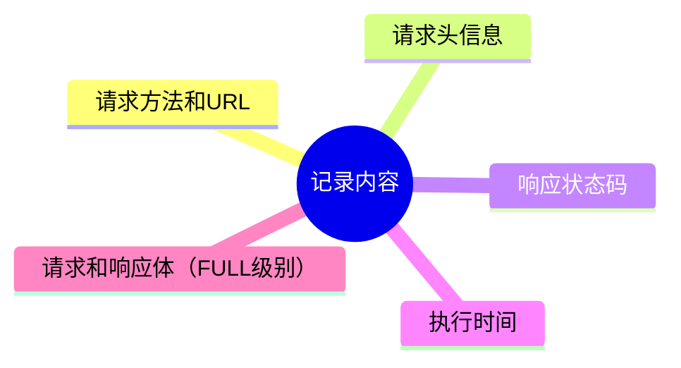
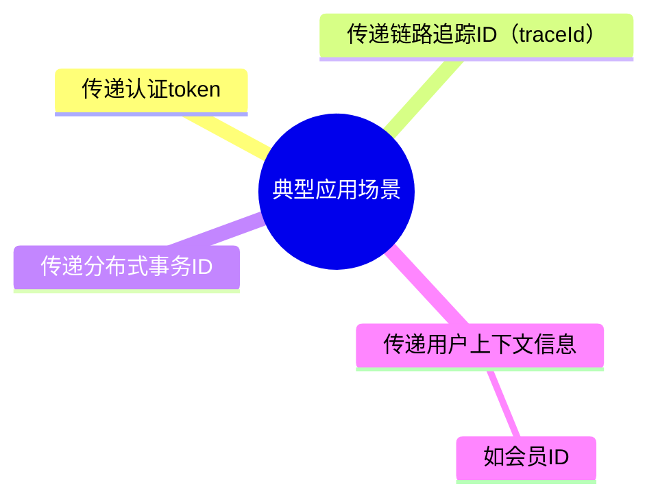
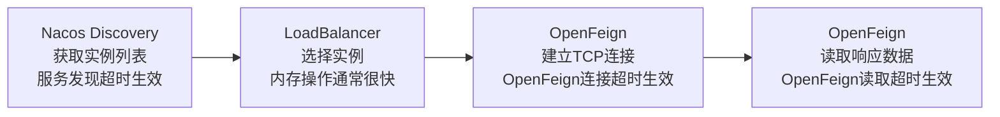
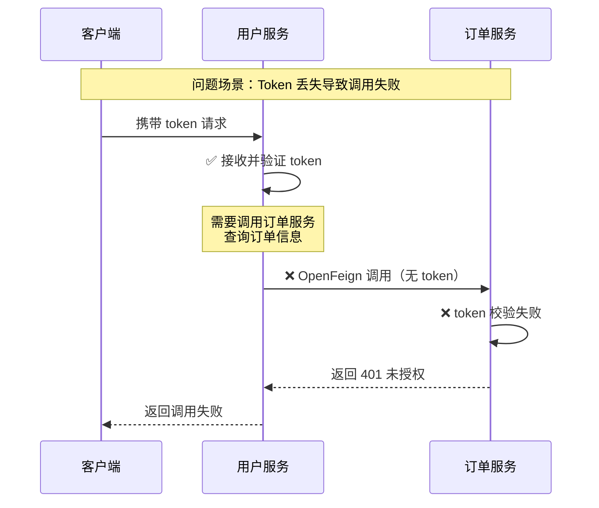

{: .no_toc }

<details close markdown="block">
  <summary>
    目录
  </summary>
  {: .text-delta }
- TOC
{:toc}
</details>


本文系统介绍OpenFeign的使用方法与扩展配置，涵盖认证Token传递、性能优化等核心场景，覆盖绝大多数实际使用要点。

**配套代码**：[spring-cloud-alibaba-2023-nacos](https://github.com/fangkun119/spring-cloud-alibaba-2023-nacos)（本文主要涉及以下两个模块）

* [tlmall-nacos-demo-order](https://github.com/fangkun119/spring-cloud-alibaba-2023-nacos/tree/main/microservices/tlmall-nacos-demo-order)（复用以前的代码）
* [tlmall-openfeign-demo-user](https://github.com/fangkun119/spring-cloud-alibaba-2023-nacos/tree/main/microservices/tlmall-openfeign-demo-user)（OpenFeign Demo新增）

**Postman Collection**见[postman-workspace](https://github.com/fangkun119/postman-workspace)，本文使用以下请求进行测试


**前置知识要求**：本文依赖注册中心、负载均衡等基础知识，需要搭建Nacos等微服务中间件作为测试环境。具体准备工作可参考本系列前三篇文章。

## 1 OpenFeign基础

### 1.1 OpenFeign介绍

#### (1) 功能与定位

OpenFeign是一个声明式、模板化的HTTP客户端。开发者只需定义一个接口类，即可创建远程调用客户端，使用体验与本地方法调用完全一致。

它具有如下优势：

| 优势 | 说明 |
| :--- | :--- |
| **调用体验简洁** | 远程调用像调用本地方法一样简单 |
| **透明化处理** | 开发者无需关注底层HTTP请求细节 |

#### (2) 演进历程

OpenFeign由Netflix Feign演进而来，在原有基础上进行了增强。它支持Spring MVC注解，使代码更加标准化，大幅提升了开发体验。

#### (3) 底层实现原理

尽管调用方式看起来像本地调用，但底层实际通过**代理对象**实现远程通信：

| 机制 | 说明 |
| :--- | :--- |
| **代理机制** | 使用JDK动态代理生成接口的实现类 |
| **请求处理** | 代理对象负责发起远程调用请求，获取数据并返回 |
| **透明设计** | 整个过程对开发者透明，无需关心底层实现细节 |

### 1.2 为什么需要OpenFeign

#### (1) 传统方式的缺陷

LoadBalancer + RestTemplate组合在微服务调用中存在明显不足。

代码示例：

```java
// 步骤1：构建具有负载均衡能力的RestTemplate
@Bean
@LoadBalanced
public RestTemplate restTemplate() {
    return new RestTemplate();
}

// 步骤2：发起远程调用
String url = "http://tlmall-order01/order/getOrder?userId=" + userId;
Result result = restTemplate.getForObject(url, Result.class);
```

主要痛点如下：

| 痛点          | 说明                    |
| :---------- | :-------------------- |
| **URL拼装复杂** | 需要手动拼接请求URL，参数复杂时更加困难 |
| **代码可读性差**  | 调用逻辑混乱，难以理解和维护        |
| **对接体验不统一** | 不同开发者的调用风格不一致         |
| **维护成本高**   | 业务逻辑和调用逻辑混在一起         |

#### (2) OpenFeign的优点

OpenFeign提供了声明式HTTP客户端，有效解决了传统方式的问题。

**优势一：简洁的接口定义**

通过注解定义接口即可创建HTTP客户端，无需手动拼装URL。

```java
@FeignClient(value = "tlmall-order",path = "/order-demo")
public interface OrderFeignService {
    @GetMapping("/orders")
    public Result<?> getOrder(@RequestParam("userId") String userId);
}
```

**优势二：本地化的调用体验**

远程调用像本地方法调用一样简单直观。

```java
// 本地方法调用
R result = orderService.findOrderByUserId(id);

// OpenFeign远程调用（orderService为代理对象）
R result = orderService.findOrderByUserId(id);
```

**优势三：规范统一的架构**

| 优势 | 说明 |
| :--- | :--- |
| **统一体验** | 所有远程调用采用统一的编码风格 |
| **易于维护** | 业务逻辑和调用逻辑有效分离 |

### 1.3 测试环境搭建

#### (1) 微服务中间件

首先需要搭建微服务中间件作为测试环境，复用先前的即可。

搭建过程参考《Spring Cloud Alibaba 02：完整Demo搭建》中`3.3`到`3.5`这三个小节。


```text
3.3 域名配置
3.4 MySQL
3.5 Nacos
```


演示代码Repo如下，`git clone`下来分别导入到IDEA和Postman

- <https://github.com/fangkun119/spring-cloud-alibaba-2023-nacos>
- <https://github.com/fangkun119/postman-workspace>

启动MySQL和Nacos。

```bash
_______________________________________________________
$ /KendeMacBook-Air/ ken@KendeMacBook-Air.local:~/Code/mid-wares/nacos/
$ brew services start mysql
==> Successfully started `mysql` (label: homebrew.mxcl.mysql)
_______________________________________________________
$ /KendeMacBook-Air/ ken@KendeMacBook-Air.local:~/Code/mid-wares/nacos/
$ bash bin/startup.sh
/Library/Java/JavaVirtualMachines/jdk-17.jdk/Contents/Home/bin/java   -Xms512m -Xmx512m -Xmn256m -Dnacos.standalone=true -Dnacos.member.list= -Xlog:gc*:file=/Users/ken/Code/mid-wares/nacos/logs/nacos_gc.log:time,tags:filecount=10,filesize=100m -Dloader.path=/Users/ken/Code/mid-wares/nacos/plugins,/Users/ken/Code/mid-wares/nacos/plugins/health,/Users/ken/Code/mid-wares/nacos/plugins/cmdb,/Users/ken/Code/mid-wares/nacos/plugins/selector -Dnacos.home=/Users/ken/Code/mid-wares/nacos -jar /Users/ken/Code/mid-wares/nacos/target/nacos-server.jar  --spring.config.additional-location=file:/Users/ken/Code/mid-wares/nacos/conf/ --logging.config=/Users/ken/Code/mid-wares/nacos/conf/nacos-logback.xml --server.max-http-header-size=524288
nacos is starting with standalone
nacos is starting. you can check the /Users/ken/Code/mid-wares/nacos/logs/start.out
```

如果需要关闭中间件，可参考如下命令。

```bash
_______________________________________________________
$ /KendeMacBook-Air/ ken@KendeMacBook-Air.local:~/Code/mid-wares/nacos/
$ bash bin/shutdown.sh
The nacosServer(41623
41892
42897) is running...
Send shutdown request to nacosServer(41623
41892
42898) OK
_______________________________________________________
$ /KendeMacBook-Air/ ken@KendeMacBook-Air.local:~/Code/mid-wares/nacos/
$ brew services stop mysql
Stopping `mysql`... (might take a while)
==> Successfully stopped `mysql` (label: homebrew.mxcl.mysql)
_______________________________________________________
$ /KendeMacBook-Air/ ken@KendeMacBook-Air.local:~/Code/mid-wares/nacos/
$  brew services list | grep mysql
mysql   none
_______________________________________________________
$ /KendeMacBook-Air/ ken@KendeMacBook-Air.local:~/Code/mid-wares/nacos/
$ jps | grep -i nacos
```

#### (2) 环境验证

实验场景如下：用户服务（`tlmall-user-openfeign`）通过 Nacos 注册中心，从两个订单服务实例（`tlmall-order`，端口分别为 8060 和 8061）中选择一个进行调用。


#### 验证步骤

**步骤 1：启动两个订单服务实例**

使用 `tlmall-nacos-demo-order` 模块配置两个实例，端口分别为 8060 和 8061。


配置方法：

- 复制 Run Configuration，分别添加 `-Dserver.port=8060` 和 `-Dserver.port=8061` 的 VM Options
- 或参考《Spring Cloud Alibaba 04：LoadBalancer深入》的 `3.3.(1)` 小节

**步骤 2：启动用户服务**

启动 `tlmall-openfeign-demo-user` 模块下的 `TlmallUserOpenfeignDemoApplication`，服务将在 8050 端口启动。


**步骤 3：验证 Nacos 注册**

登录 Nacos 控制台，确认以下实例已成功注册：

- 2 个 `tlmall-order` 实例
- 1 个 `tlmall-user-openfeign` 实例


服务名称通过 `spring.application.name` 配置：

```yaml
spring:
  application:
    name: tlmall-user-openfeign
```

**步骤 4：测试服务调用**

使用 Postman 向用户服务（8050 端口）发送 GET 和 POST 请求，验证 OpenFeign 能否成功调用订单服务。

GET 请求示例：


POST 请求示例：


### 1.4 OpenFeign集成步骤

共分以下四步
#### (1) 引入依赖

注意OpenFeign和LoadBalancer两个依赖都需要引入

```xml
<!-- openfeign 远程调用 -->
<dependency>
    <groupId>org.springframework.cloud</groupId>
    <artifactId>spring-cloud-starter-openfeign</artifactId>
</dependency>

<!-- loadbalancer 负载均衡器依赖-->  
<dependency>  
    <groupId>org.springframework.cloud</groupId>  
    <artifactId>spring-cloud-loadbalancer</artifactId>  
</dependency>
```

如果忘记引入LoadBalancer依赖，会提示"No Feign Client LoadBalancer"错误

```text
Caused by: java.lang.IllegalStateException: No Feign Client for loadBalancing defined. Did you forget to include spring-cloud-starter-loadbalancer?
```

#### (2) 添加启动类注解

在启动类上添加`@EnableFeignClients`注解，开启OpenFeign功能。

```java
@SpringBootApplication
@EnableDiscoveryClient
// 开启openFeign功能
@EnableFeignClients
public class TlmallUserOpenfeignDemoApplication {

    public static void main(String[] args) {
        SpringApplication.run(TlmallUserOpenfeignDemoApplication.class, args);
    }
}
```

这个注解扫描所有被`@FeignClient`注解修饰的接口，为它们创建 JDK 动态代理对象，并将这些代理对象作为 Bean 注册到 Spring 的 IOC 容器中。

默认扫描范围是启动类所在的包、以及它的子包，也可以同过注解的`basePackages`属性指定扫描包路径。

#### (3) 编写Feign客户端接口

定义一个接口，使用`@FeignClient`注解指定微服务名称和接口路径。

代码示例：

```java
@FeignClient(value = "tlmall-order", path = "/")
public interface OrderFeignService {
    @GetMapping("/orders")
    public Result<?> getOrder(@RequestParam("userId") String userId);
}
```

在这个例子中：

| 注解              | 作用                          |
| --------------- | --------------------------- |
| `@FeignClient`  | 标记这是一个Feign客户端，value属性指定服务名 |
| `@GetMapping`   | 指定HTTP请求的类型和路径              |
| `@RequestParam` | 指定请求参数的传递方式                 |

其实`@GetMapping` 和`@RequestParam`都是Spring MVC的注解。

#### (4) 业务调用

在Controller中注入Feign客户端接口，像调用本地方法一样调用远程服务。

代码示例：

```java
@Slf4j  
@RestController  
@RequestMapping("/users")  
public class UserController {  
    @Autowired  
    private OrderFeignService orderService;  

    @GetMapping(value = "/{userId}/orders")  
    public Result<?> getUserOrders(  
            @PathVariable("userId") String userId) {  
        log.info("根据userId:" + userId + "查询订单信息");  
  
        // 使用openFeign调用订单服务  
        Result result = orderService.getOrder(userId);  
        return result;  
    }
    
    // …… 其它代码   
}
```

代码说明：

| 要点   | 说明                                    |
| ---- | ------------------------------------- |
| 注入方式 | 使用`@Autowired`注解注入Feign客户端接口          |
| 调用方式 | 直接调用接口方法，无需关心远程调用细节                   |
| 底层实现 | Spring容器会为Feign接口生成代理对象，代理对象负责实际的远程调用 |

## 2 编写OpenFeign接口调用REST API

### 2.1 方法

OpenFeign的接口编写遵循Spring MVC的注解规范，包括如下部分。

指定HTTP请求类型和路径：

| 注解                | 作用          |
| ----------------- | ----------- |
| `@RequestMapping` | 通用的HTTP请求映射 |
| `@GetMapping`     | GET请求映射     |
| `@PostMapping`    | POST请求映射    |

指定参数：

| 注解               | 作用                        |
| ---------------- | ------------------------- |
| `@RequestParam`  | URL问号后的参数（如`?userId=123`） |
| `@RequestHeader` | 传递单个Http Header           |
| `@PathVariable`  | URL路径中的参数（如`/user/{id}`）  |
| `@RequestBody`   | 请求体（用于POST请求）             |
| `@HeaderMap`     | 传递多个Http Header           |

要与被调用服务的Controller保持一致。

OpenFeign 4.x版本对各种参数组合都有完善的支持。如果被调用服务Controller使用Spring MVC注解编写，通常情况可以考虑直接复制，然后在进行修改和特殊处理。

接下来的三个小结快速介绍如何编写。

### 2.2 GET请求

GET请求用于查询数据，不修改服务器状态

* 参数全部在URL中，不放在body里
* URL长度有限制，参数过多不适合使用GET请求

Feign Client对GET请求提供了完善的支持，例子如下。

被调用服务[tlmall-nacos-demo-order](https://github.com/fangkun119/spring-cloud-alibaba-2023-nacos/tree/main/microservices/tlmall-nacos-demo-order)中[OrderController](https://github.com/fangkun119/spring-cloud-alibaba-2023-nacos/blob/main/microservices/tlmall-nacos-demo-order/src/main/java/org/nacosdemo/tlmallorder/controller/OrderController.java)类中的方法。

```java
@RestController
@RequestMapping("/")
@Slf4j
public class OrderController {

    @GetMapping("/get-demo-1/orders")
    public Order getOrder(@RequestParam("userId") String userId) {
        // 业务逻辑
    }
    
    // ……
}
```

调用方[tlmall-openfeign-demo-user](https://github.com/fangkun119/spring-cloud-alibaba-2023-nacos/tree/main/microservices/tlmall-openfeign-demo-user)的Feign Client接口[OrderFeignService](https://github.com/fangkun119/spring-cloud-alibaba-2023-nacos/blob/main/microservices/tlmall-openfeign-demo-user/src/main/java/org/nacosdemo/tlmalluseropenfeigndemo/feign/OrderFeignService.java)中的方法。

```java
@FeignClient(value = "tlmall-order",  path = "/")  
public interface OrderFeignService {

    @GetMapping("/get-demo-1/orders")
    Order getOrder(@RequestParam("userId") String userId);
    
    // ……

}
```

因为被调用服务的controller接口是使用Spring MVC编写的，这个Feign Client与它完全一致，除了它只是个接口，不需要实现代码，不需要加Public以外。
### 2.3 POST请求

POST请求通常用于传递复杂对象，常用于创建或更新资源。

  - 数据放在请求体中，以JSON格式传输
  - 可以传递复杂的对象结构

OpenFeign对POST请求的支持同样完善，例如下面的例子。

被调用服务[tlmall-nacos-demo-order](https://github.com/fangkun119/spring-cloud-alibaba-2023-nacos/tree/main/microservices/tlmall-nacos-demo-order)中[OrderController](https://github.com/fangkun119/spring-cloud-alibaba-2023-nacos/blob/main/microservices/tlmall-nacos-demo-order/src/main/java/org/nacosdemo/tlmallorder/controller/OrderController.java)类中的方法。

```java
@RestController
@RequestMapping("/")
@Slf4j
public class OrderController {

    @PostMapping("/post-demo-1/orders")
    public Result post1(@RequestBody OrderRequest request) {
      // 业务逻辑
    }

    // 其它方法
}
```

调用方[tlmall-openfeign-demo-user](https://github.com/fangkun119/spring-cloud-alibaba-2023-nacos/tree/main/microservices/tlmall-openfeign-demo-user)的Feign Client接口[OrderFeignService](https://github.com/fangkun119/spring-cloud-alibaba-2023-nacos/blob/main/microservices/tlmall-openfeign-demo-user/src/main/java/org/nacosdemo/tlmalluseropenfeigndemo/feign/OrderFeignService.java)中的方法。

```java
@FeignClient(value = "tlmall-order",  path = "/")  
public interface OrderFeignService {

	@PostMapping("/post-demo-1/orders")
	Result post1(@RequestBody OrderRequest request);

	// 其它方法
}
```

同样，这个Feign Client中的接口与被调用方Controller对应方法的注解的完全一致。

### 2.4 使用Request Param和Path Param

请求路径中有可能使用`Request Param`和`Path Param`，例如：

| 参数类型              | 示例                                       |
| :---------------- | :--------------------------------------- |
| **Request Param** | `POST /post-demo2/orders?token={token}`  |
| **Path Param**    | `POST /post-demo3/users/{userId}/orders` |

这些使用Spring MVC的注解 `RequestParam` 和`PathParam`即可。

下面是例子：

```java
@FeignClient(value = "tlmall-order",  path = "/")
public interface OrderFeignService {
	
	// ……

    @PostMapping("/post-demo-2/orders")  
    Result<?> post2(@RequestBody OrderDTO orderDTO,@RequestParam("token") String token);  
  
    @PostMapping(value = "/post-demo-3/orders")  
    Result<?> post3(@RequestBody OrderDTO orderDTO, @PathVariable("userId") String userId);  
}
```

同样与被调用接口方法的注解完全一致。完整代码：

| 角色 | 项目 | 组件 | 链接 |
| :--- | :--- | :--- | :--- |
| **被调用服务** | tlmall-nacos-demo-order | OrderController | [查看代码](https://github.com/fangkun119/spring-cloud-alibaba-2023-nacos/blob/main/microservices/tlmall-nacos-demo-order/src/main/java/org/nacosdemo/tlmallorder/controller/OrderController.java) |
| **调用方** | tlmall-openfeign-demo-user | OrderFeignService | [查看代码](https://github.com/fangkun119/spring-cloud-alibaba-2023-nacos/blob/main/microservices/tlmall-openfeign-demo-user/src/main/java/org/nacosdemo/tlmalluseropenfeigndemo/feign/OrderFeignService.java) |

## 3 OpenFeign框架结构与调用流程

本节介绍 OpenFeign 的框架结构和调用流程，不仅有助于理解其设计原理，也为后续通过扩展点实现定制功能打下基础。

### 3.1 RPC视角下的OpenFeign

从RPC（Remote Procedure Call，远程过程调用）的角度理解OpenFeign，有助于更好地掌握其工作原理和架构设计。

**RPC的核心概念**

RPC的核心思想是**像调用本地方法一样调用远程服务**，使分布式通信更加简单直观。常见的RPC框架包括Dubbo、gRPC、OpenFeign等。

**OpenFeign在RPC生态中的定位**

| 定位               | 说明                        |
| ---------------- | ------------------------- |
| 声明式HTTP客户端       | 通过接口定义即可创建远程调用客户端         |
| 基于HTTP的RPC框架     | 依托HTTP协议实现远程过程调用          |
| Spring Cloud标准组件 | 与Spring生态无缝集成，是微服务调用的首选方案 |

**与其他RPC框架的对比**

|      框架       |  通信协议  | 核心优势               | 主要局限        |
| :----------- | :---- | :----------------- | :---------- |
|   **Dubbo**   | RPC协议  | 性能优异，支持多种协议        | 协议通用性较差     |
| **OpenFeign** | HTTP协议 | 通用性强，与Spring生态深度集成 | 性能相对Dubbo略低 |
|   **gRPC**    | HTTP/2 | 跨语言支持好，性能高         | 学习成本较高      |

### 3.2 整体调用流程架构

OpenFeign的调用流程涉及多个核心组件，每个组件都有其特定的职责和作用。 

首先从RPC调用过程来看，要经过如下步骤

| 步骤  |  阶段  | 说明                       |
| :- | :-- | :----------------------- |
|  1  | 代理调用 | 客户端（会员服务）通过代理对象调用Feign接口 |
|  2  | 注解解析 | 代理对象解析注解，构建HTTP请求        |
|  3  | 请求处理 | 经过编码、拦截器、客户端等处理          |
|  4  | 发送请求 | 发起HTTP请求到服务端（订单服务）       |
|  5  | 服务处理 | 服务端处理请求并返回响应             |
|  6  | 响应解码 | 客户端接收响应并解码返回结果           |

在这个过程中，要经过OpenFeign组件的分层处理，具体如下


这些组件层的职责如下：

| 组件层                     | 主要职责                               |
| :---------------------- | :--------------------------------- |
| **@FeignClient方法**      | 流程起点，定义在接口中的远程调用方法                 |
| **JDK Proxy**           | 拦截接口调用，转发给InvocationHandle实现远程调用分发 |
| **Contract**            | 解析注解和参数，理解方法意图，创建MethodHandler     |
| **MethodHandler**       | 核心协调者，将方法调用转为HTTP请求并处理响应           |
| **RequestTemplate**     | 构造请求的URL、方法、Header和Body            |
| **Encoder**             | 将方法参数序列化为HTTP请求格式（如JSON）           |
| **Decoder**             | 将HTTP响应反序列化为Java对象                 |
| **Interceptors、Logger** | 请求前后拦截处理（添加Header、日志、重试等）          |
| **Feign.Client**        | 执行实际HTTP请求，集成负载均衡和熔断功能             |
| **远程Server**            | 接收处理请求并返回HTTP响应                    |
| **Response Bean**       | 解码后的Java对象，作为方法返回值                 |

解下来详细介绍这些组件。

### 3.3 核心组件介绍

#### (1) 代理对象

先看最顶部的代理对象，它是 OpenFeign 的核心组件，使用 JDK 动态代理生成，负责拦截接口方法调用并转换为远程调用。

工作原理如下：

| 步骤  | 操作       | 说明                                                                 |
| :-- | :------- | :----------------------------------------------------------------- |
| 1   | **拦截调用** | 调用 Feign 接口方法时，实际执行的是代理对象的 `invoke` 方法                             |
| 2   | **解析注解** | `invoke` 方法读取方法上的 Spring MVC 注解（如 `@RequestMapping`、`@GetMapping`） |
| 3   | **构建请求** | 根据注解信息组装完整的 HTTP 请求（URL、参数、请求头等）                                   |
| 4   | **委托执行** | 将构建好的请求委托给后续组件完成实际的远程调用                                            |

#### (2) 编解码器

在看偏底部位置的编解码器，负责**请求**和**响应**的序列化与反序列化，是数据正确传输的保证。

**编码器（Encoder）**

| 属性       | 说明                 |
| :------- | :----------------- |
| **作用**   | 将Java对象编码为HTTP请求格式 |
| **支持格式** | JSON、XML、Protobuf等 |
| **常见实现** | Jackson、Gson等      |

**解码器（Decoder）**

| 属性 | 说明 |
| :--- | :--- |
| **作用** | 将HTTP响应解码为Java对象 |
| **支持格式** | 与编码器对应 |
| **处理流程** | 读取响应 → 解析数据 → 转换为对象 |

#### (3) 日志组件

编解码器下方是日志组件，它记录请求和响应的详细信息，用于问题排查和性能监控。

##### 记录内容



##### 日志级别

OpenFeign 提供四种日志级别，记录的信息量依次递增：

| 日志级别 | 说明 |
| :--- | :--- |
| **NONE** | 不记录任何日志（默认） |
| **BASIC** | 记录请求方法、URL、响应状态、执行时间 |
| **HEADERS** | 记录 BASIC 级别 + 请求头和响应头 |
| **FULL** | 记录所有信息，包括请求体和响应体 |

#### (4) 拦截器

与日志组件并列的还有拦截器，它在请求发送前对请求进行额外处理，常用于参数传递和请求头修改。

##### 典型应用场景



##### 实现方式

拦截器通过实现 `RequestInterceptor` 接口，在 `apply` 方法中修改 `RequestTemplate`（如添加、删除或修改请求头等）。

**步骤一：实现拦截器**

```java
import feign.RequestInterceptor;
import feign.RequestTemplate;

public class MyRequestInterceptor implements RequestInterceptor {

    @Override
    public void apply(RequestTemplate template) {
        // 在这里添加自定义逻辑
        template.header("X-Request-ID", "12345"); // 示例：添加自定义 Header
        System.out.println("请求被 MyRequestInterceptor 拦截了！");
    }
}
```

**步骤二：注册为 Bean**

```java
import feign.RequestInterceptor;

/**
 * 配置方式说明：
 * - 方式1（推荐）：通过@FeignClientn的configuration属性来指定生效的Client，这里不添加@Configuration以免被容器扫到。例如：@FeignClient(name = "tlmall-order", configuration = OrderFeignConfig.class)
 * - 方式2（慎用）：添加@Configuration注解，让配置全局生效
 */
public class FeignConfig {
    // 注册请求拦截器
    @Bean
    public RequestInterceptor myRequestInterceptor() {
        return new MyRequestInterceptor();
    }
}
```

#### (5) 客户端组件

拦截器和日志组件下方是客户端组件 **Feign.Client**，它负责发起实际的 HTTP 请求，是影响 OpenFeign 性能的关键因素。

##### 默认实现

OpenFeign 默认使用 JDK 的 `HttpURLConnection`：

| 特性         | 说明               |
| :--------- | :--------------- |
| ❌ **性能较低** | 没有连接池，每次请求都创建新连接 |
| ❌ **功能受限** | 不适合高并发场景         |
| ❌ **生产环境** | 强烈不推荐使用          |

##### 推荐方案

在生产环境中，建议替换为以下高性能客户端：

| 客户端 | 特点 |
| :--- | :--- |
| ✅ **Apache HttpClient 5** | 性能优异，功能完善，连接池管理强大 |
| ✅ **OkHttp** | 性能优异，API 简洁易用 |

#### (6) 负载均衡器

客户端需要使用负载均衡器，以便在多个服务实例中选择一个进行调用，实现请求的均衡分配。

OpenFeign整合了Spring Cloud LoadBalancer，自动从注册中心获取服务实例列表，并根据负载均衡策略选择实例。

#### (7) 契约层

契约层定义了注解的解析规则，决定 OpenFeign 支持哪些注解类型。

**默认契约（Spring MVC）**

OpenFeign 默认使用 Spring MVC 契约，支持 Spring MVC 注解：

| 特性       | 说明                                               |
| :------- | :----------------------------------------------- |
| **支持注解** | `@RequestMapping`、`@GetMapping`、`@PostMapping` 等 |
| **适用场景** | 最常用的配置，适合大多数 Spring Boot 项目                      |
| **开发体验** | 无需额外配置，使用熟悉的 Spring MVC 注解                       |

**原生契约（Feign）**

也可通过配置切换到 Feign 原生契约，支持 Feign 自带的注解：

| 特性       | 说明                            |
| :------- | :---------------------------- |
| **支持注解** | `@RequestLine`、`@Param` 等原生注解 |
| **适用场景** | 特殊需求或非 Spring MVC 环境          |
| **注意事项** | 需要手动拼装 URL，应用场景较少             |

### 3.4 完整调用流程示例

接下来通过完整的调用示例，理解OpenFeign的整个调用链路。

**场景**：用户服务通过Nacos注册中心调用订单服务的getOrder方法，把请求发给两个订单服务之一（端口分别是8060和8061）


用户服务调用订单服务的getOrder方法

```java
@FeignClient(value = "tlmall-order",  path = "/")  
public interface OrderFeignService {

    @GetMapping("/get-demo-1/orders                      ")
    Order getOrder(@RequestParam("userId") String userId);
    
    // ……

}
```

调用过程如下：

| 步骤  | 阶段    | 说明                                                  |
| :-- | :---- | :-------------------------------------------------- |
| 1   | 代理拦截  | 用户服务通过代理对象调用 `OrderFeignService.getOrder()`         |
| 2   | 注解解析  | 代理对象解析 `@GetMapping` 注解，确定 HTTP 请求类型和路径             |
| 3   | 请求构建  | 组装 URL 参数、请求头、请求体等                                  |
| 4   | 编码处理  | 将请求对象编码为 HTTP 格式                                    |
| 5   | 拦截器处理 | 记录日志、修改请求头（如添加 token）、其他自定义处理                       |
| 6   | 负载均衡  | 从 Nacos 获取订单服务实例列表（8060、8061），根据策略选择一个实例（假设选择 8060） |
| 7   | 发起请求  | 使用客户端组件（如 HttpClient 5）向订单服务 8060 发起 HTTP GET 请求    |
| 8   | 服务端处理 | 订单服务接收请求、解码、调用 getOrder 方法、查询数据库、编码结果为 HTTP 响应      |
| 9   | 响应处理  | 客户端接收 HTTP 响应、解码为 Java 对象、返回给调用方                    |

这个过程中，会影响性能的因素有：

| 性能因素        | 说明                             |
| :---------- | :----------------------------- |
| **客户端组件性能** | HttpClient 5 和 OkHttp 性能优于默认实现 |
| **编解码效率**   | Jackson 和 Gson 性能优于普通 JSON 解析  |
| **日志级别**    | FULL 级别日志会影响性能                 |
| **拦截器处理**   | 复杂的拦截器逻辑会增加调用开销                |

## 4 OpenFeign重要扩展点

理解了 OpenFeign 的分层结构后，更容易理解如何通过扩展点实现定制功能。本节介绍 4 个最常用的扩展点及其配置方法。

### 4.1 日志配置

#### (1)  用途

日志配置对于问题排查和性能监控至关重要。

* 生产环境需要简洁的日志以节省性能。
* 开发环境则需要详细的日志便于调试。
* 当遇到生产环境问题时，可能还需要为特定端点打印详细日志以排查问题。

因此，日志配置是必须掌握的重要扩展点。

#### (2) 日志级别说明

配置日志扩展点前，需要先了解 OpenFeign 的四种日志级别。不同级别记录的信息量不同，适用场景各异：

| 日志级别 | 记录内容 | 适用场景 | 性能影响 |
| :--- | :--- | :--- | :--- |
| **NONE**（默认） | 不记录任何日志 | - | 性能最优 |
| **BASIC** | 请求方法、URL、响应状态码、执行时间 | 适合生产环境 | 记录必要信息，性能影响较小 |
| **HEADERS** | BASIC 级别 + 请求头和响应头 | 用于问题排查 | 中等 |
| **FULL** | 所有信息，包括请求体和响应体 | 适合开发环境和问题定位 | 对性能有一定影响 |

日志级别有两种配置方式：

| 配置方式         | 特点               |
| :----------- | :--------------- |
| **Java Bean配置**  | 通过配置类定义，灵活但不够便捷  |
| **YAML配置（⭐️首选）** | 推荐方式，便于统一管理和动态更新 |

#### (3) Java Bean配置方式

Java Bean配置方式灵活度高，所有扩展点都支持，但它不是首选方式。

该配置方式支持全局配置和局部配置两种方式。

| 配置类型 | 生效范围 |
| :--- | :--- |
| **全局配置** | 对所有 Feign Client 生效 |
| **局部配置** | 只对指定的 Feign Client 生效 |

如果全局配置和局部配置都作用于同一个Feign Client时，局部配置会覆盖全局配置。

**全局配置**

在配置类上添加 `@Configuration` 注解，该类中定义的所有配置都是全局配置，对所有 Feign Client 接口生效。示例如下：

```java
// 全局配置：该类中的所有配置 Bean 对所有 Feign 客户端生效
@Configuration
public class FeignConfig {
    @Bean
    public Logger.Level feignLoggerLevel() {
        return Logger.Level.FULL;
    }
}
```

**局部配置**

局部配置的关键是**不要**添加 `@Configuration` 注解，避免配置类被 Spring 容器自动扫描和加载。

```java
// 局部配置：不要添加 @Configuration 注解
public class OrderFeignConfig {
    @Bean
    public Logger.Level feignLoggerLevel() {
        return Logger.Level.FULL;
    }
}
```

然后在需要使用该配置的 Feign Client 接口中，通过 `@FeignClient` 注解的 `configuration` 属性指定配置类：

```java
@FeignClient(
    name = "order-service",
    configuration = OrderFeignConfig.class  // 指定局部配置类
)
public interface OrderFeignService {
    // ...
}
```

#### (4) YAML配置方式

**优势**

YAML 配置是**首选方式**，支持统一管理和动态更新。

| 优势 | 说明 |
| :--- | :--- |
| **统一管理** | 所有配置集中在一个文件中，便于维护，避免散落在代码各处 |
| **动态更新** | 可托管在 Nacos 配置中心，热加载实时生效。生产环境排查问题时，临时调整日志级别，特别方便 |


YAML 配置方式同样支持全局和局部配置，二者的区别仅在于配置键名：全局配置使用 `default`，局部配置使用微服务名称。

**全局配置示例**

```yaml
spring:
  cloud:
    openfeign:
      client:
        config:
          default:  # 对所有微服务生效
            logger-level: FULL
```

**局部配置示例**

```yaml
spring:
  cloud:
    openfeign:
      client:
        config:
          order-service:  # 仅对 order-service 生效
            logger-level: BASIC
```

**配置项说明**

| 配置键 | 生效范围 |
| :--- | :--- |
| `default` | 对所有微服务生效 |
| `微服务名称` | 只对指定微服务生效 |
| `logger-level` | 日志级别（NONE、BASIC、HEADERS、FULL） |

从例子可以看出，YAML 配置结构清晰，便于快速查看各微服务的配置级别，维护方便。

#### (5) 常见问题 - 遗漏Spring Boot日志级别配置

仅配置 Feign 的日志级别可能仍无法看到日志输出。

例如，即使将 Feign 日志级别设置为 FULL，控制台也可能没有 DEBUG 日志输出。这是因为还需要配置 Spring Boot 的日志级别。

```yaml
# 配置 Spring Boot 日志级别，允许 DEBUG 日志输出
logging:
  level:
    org.tuling.tlmalluseropenfeigndemo.feign: debug
```

原因：OpenFeign 采用双层日志控制机制：

| 框架          | 配置项           | 作用                                |
| :---------- | :------------ | :-------------------------------- |
| Feign       | Logger.Level  | 控制记录哪些内容（NONE/BASIC/HEADERS/FULL） |
| Spring Boot | logging.level | 控制日志框架是否允许输出 DEBUG 级别日志           |

两者必须同时配置才能生效。

### 4.2 超时时间配置

#### (1) 用途及说明

超时配置对于防止调用阻塞和及时发现问题非常重要，必须掌握

OpenFeign提供了两个超时配置，分别对应连接和读取两个阶段。

| 超时类型 | 定义 | 单位 | 用途 |
| :--- | :--- | :--- | :--- |
| **连接超时** | 建立TCP连接的超时时间 | 毫秒 | 防止由于网络问题导致TCP连接建立耗时过长 |
| **读取超时** | 读取响应数据的超时时间 | 毫秒 | 从连接建立时开始应用，当返回响应花费太长时间时触发 |

OpenFeign、Spring Cloud LoadBalancer和Nacos Discovery在超时控制上的分工。

| 组件                            | 控制阶段     | 超时作用                       |
| :---------------------------- | :------- | :------------------------- |
| **Nacos Discovery**           | 服务发现阶段   | 从注册中心获取服务实例列表的超时时间         |
| **Spring Cloud LoadBalancer** | 服务实例选择阶段 | 从缓存的实例列表中选择可用实例（通常很快，内存操作） |
| **OpenFeign**                 | HTTP通信阶段 | **TCP连接建立**和**数据读取**的超时时间  |

执行过程




说明：三者控制的阶段不同，是互补关系而非覆盖关系。

#### (2) 配置方式

超时时间配置支持Java Bean和YAML两种方式，推荐使用YAML配置。

##### Java Bean配置方式

通过配置类定义，灵活度高但不够便捷，适用于需要动态配置的场景。

该配置方式支持全局配置和局部配置，两者的区别在于配置类是否添加`@Configuration`注解。

| 配置类型 | 注解要求 | 生效范围 |
| :--- | :--- | :--- |
| **全局配置** | 添加`@Configuration`注解 | 对所有Feign Client生效 |
| **局部配置** | 不添加`@Configuration`注解 | 只对指定的Feign Client生效 |

优先级：局部配置优先级高于全局配置。当同一Feign Client同时存在两者时，局部配置会覆盖全局配置。

**局部配置示例（推荐）**

配置类不添加`@Configuration`注解，并在`@FeignClient`中指定该配置类。

```java
// 局部配置类：不要添加 @Configuration 注解
public class OrderFeignConfig {
    @Bean
    public Request.Options options() {
        return new Request.Options(3000, 5000);
    }
}
```

然后在`@FeignClient`注解中指定配置类：

```java
@FeignClient(
    name = "tlmall-order",
    configuration = OrderFeignConfig.class  // 指定局部配置类
)
public interface OrderFeignService {
    // ...
}
```

**全局配置示例（谨慎使用）**

在配置类上添加`@Configuration`注解，该配置自动对所有Feign Client生效。

```java
@Configuration
public class FeignConfig {
    @Bean
    public Request.Options options() {
        // 配置超时时间（单位：毫秒）
        // 第1个参数：连接超时
        // 第2个参数：读取超时
        return new Request.Options(3000, 5000);
    }
}
```

##### YAML配置方式（⭐️首选）

YAML配置便于统一管理和动态更新，且配置更简洁直观，是首选。它同样支持全局配置和局部配置，通过配置键`default`或微服务名称来区分。

**全局配置示例**

使用`default`作为配置键，对所有Feign Client生效。

```yaml
spring:
  cloud:
    openfeign:
      client:
        config:
          default:  # 全局配置
            connectTimeout: 3000  # 连接超时（毫秒）
            readTimeout: 5000     # 读取超时（毫秒）
```

**局部配置示例**

使用微服务名称作为配置键，仅对指定的Feign Client生效。

```yaml
spring:
  cloud:
    openfeign:
      client:
        config:
          tlmall-order:  # 局部配置，仅对服务名tlmall-order生效
            connectTimeout: 2000
            readTimeout: 3000
```

**全局配置 vs 局部配置**

| 配置类型 | 配置键 | 生效范围 |
| :--- | :--- | :--- |
| **全局配置** | `default` | 对所有Feign Client生效 |
| **局部配置** | 微服务名称（如`tlmall-order`） | 只对指定的Feign Client生效 |

优先级：局部配置优先级高于全局配置。同时配置时，局部配置会覆盖全局配置。
#### (3) 配置建议

| 环境       | 连接超时  | 读取超时   | 说明         |
| :------- | :---- | :----- | :--------- |
| **生产环境** | 2-5秒  | 10-30秒 | 确保稳定性，避免误判 |
| **开发环境** | 可适当缩短 | 可适当缩短  | 便于快速发现问题   |

通用原则：根据实际业务调整，避免过长或过短

### 4.3 客户端组件配置

#### (1) 默认客户端的缺陷

##### 性能局限

客户端组件是OpenFeign性能的关键因素。默认实现存在明显性能缺陷，生产环境基本都需要替换，因此这是必须掌握的配置。

OpenFeign默认使用JDK的`HttpURLConnection`作为HTTP客户端。虽然功能稳定，但在高并发场景下局限明显。

| 局限点      | 说明                       |
| :------- | :----------------------- |
| **无连接池** | 每次请求都创建新的TCP连接，资源开销大     |
| **性能低下** | 不支持连接复用和HTTP/2，高并发表现差    |
| **设计老旧** | 基于JDK 1.1实现，API设计过时，功能受限 |

##### 扩展点机制

为了解决默认客户端的性能问题，OpenFeign通过`feign.Client`接口提供了扩展点，允许开发者替换为高性能的HTTP客户端实现。

```java
package feign;

public interface Client {
    Response execute(Request request, Request.Options options) throws IOException;
}
```

开发者可以通过以下两种方式替换默认实现：

| 替换方式     | 说明                            | 适用场景            |
| :------- | :---------------------------- | :-------------- |
| 自定义实现    | 直接实现`Client`接口                | 需要完全定制HTTP客户端行为 |
| 使用第三方客户端 | 集成Apache HttpClient 5、OkHttp等 | 绝大多数场景（推荐）      |

##### 默认实现定位

`feign.Client`接口通过内部类`Default`提供了基于`HttpURLConnection`的默认实现。

```java
package feign;

public interface Client {
    Response execute(Request var1, Request.Options var2) throws IOException;

    // 内部类Default提供了Client的默认实现
    public static class Default implements Client {

        // 其它代码

        public Response execute(
                Request request, Request.Options options) throws IOException {
            HttpURLConnection connection = this.convertAndSend(request, options);
            return this.convertResponse(connection, request);
        }

        // 其它代码
    }
}
```

##### 验证方法

在`feign.Client.Default`内部类的`execute`方法中打断点，发起请求后如果进入该断点，说明使用的是默认客户端。


#### (2) Apache HttpClient5（推荐）

##### HttpClient5介绍

Apache HttpClient 5是基于Apache HttpComponents项目开发的新一代HTTP客户端，提供了强大、灵活且高效的功能来处理HTTP请求。

| 优势        | 说明                |
| :-------- | :---------------- |
| **连接池支持** | 复用TCP连接，减少建立连接的开销 |
| **性能优异**  | 适合高并发场景，吞吐量高      |
| **功能完善**  | 支持各种HTTP特性和协议     |

##### 启用步骤

按照如下步骤可以启动并切换到HttpClient5。

**第一步：引入依赖**

在`pom.xml`中添加HttpClient5依赖

```xml
<!-- OpenFeign -->
<dependency>
    <groupId>org.springframework.cloud</groupId>
    <artifactId>spring-cloud-starter-openfeign</artifactId>
</dependency>

<!-- Apache HttpClient5 -->
<dependency>
    <groupId>io.github.openfeign</groupId>
    <artifactId>feign-hc5</artifactId>
</dependency>
```

**第二步：开启HttpClient5**

在YAML配置中启用Http5客户端

```yaml
spring:
  cloud:
    openfeign:
      httpclient:  # feign client使用 Apache HttpClient5
        hc5:
          enabled: true # 默认为true，引入依赖后自动生效
```

##### 验证步骤

**首先验证`hc5.enabled` 默认值是否为true**

查看`FeignAutoConfiguration.HttpClient5FeignConfiguration`自动配置类，可以找到Http5客户端的开启配置项

```yaml
spring.cloud.openfeign.httpclient.hc5.enabled
```

该配置项与前述YAML配置一致。Bean装配代码如下


从下面这个注解可以看出，该配置的默认值为true

```java
@ConditionalOnProperty(
    value = "spring.cloud.openfeign.httpclient.hc5.enabled",
    havingValue = "true",
    matchIfMissing = true  // 默认值为true，引入依赖后自动生效
)
```


**接下来验证使用客户端是否生效**

方法：在`ApacheHttp5Client`的`execute`方法打断点，发起请求，看是否进入该断点。


#### (3) OkHttp配置

##### OKHttp介绍

OkHttp是另一个优秀的高性能客户端组件。

| 对比维度                   | 说明            |
| :--------------------- | :------------ |
| 相比默认实现                 | 性能提升显著        |
| HttpClient 5 vs OkHttp | 性能相当          |
| 选择建议                   | 根据团队经验和项目需求选择 |

##### 启用步骤

按照如下步骤可以启动并切换到OkHttp。

引入依赖

```xml
<dependency>
    <groupId>com.squareup.okhttp3</groupId>
    <artifactId>okhttp</artifactId>
</dependency>
```

YAML配置：

```yaml
spring:
  cloud:
    openfeign:
      httpclient: # 注意要显示地禁掉http client5，因为它是默认生效的
        hc5:
          enabled: false
      okhttp: # feign client使用 okhttp
        enabled: true
```

**注意事项**：

HttpClient和OkHttp是平级的，只能启用一个。

启用OkHttp时，需要**显示地禁用HttpClient**，因为它的配置是默认开启的，而OKHttp Client则不是。

##### 验证步骤

首先在FeignAutoConfiguration中，查看OKHttp Client的配置“spring.cloud.openfeign.okhttp.enabled”，它并不是默认开启的


然后在`feign.okhttp.OkHttpClient` 的`execute`方法中打断点，发请求验证配置是否生效。


### 4.4 拦截器配置

#### (1) 应用场景

拦截器是OpenFeign最重要的扩展点之一，在实际业务中有广泛的应用场景。

**典型场景**：为请求添加统一的HTTP Header，例如：

- 传递认证Token
- 传递链路追踪ID（TraceId）
- 传递用户上下文信息（如会员ID）
- 传递分布式事务ID（XID）

**问题场景示例**

用户服务调用订单服务，来查询订单时，所有请求都需要携带认证Token。


然而，当用户服务调用订单服务时，OpenFeign默认不会透传原始请求中的Token，导致Token丢失和调用失败。完整调用链路如下：



OpenFeign不会自动透传HTTP Header，需要通过拦截器机制来解决这个问题。

#### (2) 方案比较

针对这个问题，最直接的方案是在接口中添加参数。

```java
@RequestMapping(value = "/api/test", method = RequestMethod.GET)
String callApiTest(
    @RequestParam(value = "name") String name,
    @RequestHeader(value = "token") String token // 手动添加参数
);
```

但这种方式存在明显缺点（❌）：

| 缺点 | 说明 |
| :--- | :--- |
| **代码侵入性强** | 需要修改所有接口方法 |
| **影响接口调用方** | 改变接口签名 |
| **维护成本高** | 修改范围大，容易遗漏 |
| **生产风险高** | 可能导致运行时错误 |

更**推荐**的方案是使用**拦截器**（✅）：

| 优点 | 说明 |
| :--- | :--- |
| **无侵入性** | 不修改接口定义 |
| **统一处理** | 集中管理所有请求 |
| **易于维护** | 修改一处即可全局生效 |
| **零影响** | 对调用方完全透明 |

#### (3) 拦截器扩展点

OpenFeign 提供了两个拦截器扩展点：`RequestInterceptor` 和 `ResponseInterceptor`。

##### RequestInterceptor（请求拦截器）

请求拦截器在发起 HTTP 调用**之前**执行，常用于添加或修改请求信息。

```java
package feign;

public interface RequestInterceptor {

  /**
   * 每次请求前调用。通过 {@link RequestTemplate} 的方法添加数据。
   */
  void apply(RequestTemplate template);
}
```

##### ResponseInterceptor（响应拦截器）

响应拦截器在接收 HTTP 调用**之后**执行，常用于处理或修改响应信息。

```java
package feign;

public interface ResponseInterceptor {
    Object intercept(InvocationContext invocationContext, Chain chain) throws Exception;

    // 其它代码
}
```

#### (4) 拦截器实现与配置

以请求拦截器为例，实现 Token 透传功能。该拦截器从上游请求中获取 `Authorization` 请求头，并添加到下游请求中。

##### 编写拦截器

实现 `RequestInterceptor` 接口，在 `apply` 方法中完成请求头透传。

```java
// 注意：此处不添加 @Component 注解，后续通过配置类或YAML来装配
@Slf4j
public class FeignAuthRequestInterceptor implements RequestInterceptor {
    @Override
    public void apply(RequestTemplate template) {
        // 从上游请求中获取 Access Token
        ServletRequestAttributes attributes =
            (ServletRequestAttributes) RequestContextHolder.getRequestAttributes();

        if (attributes != null) {
            HttpServletRequest request = attributes.getRequest();
            String accessToken = request.getHeader("Authorization");
            log.info("从 Request 中解析请求头: {}", accessToken);

            // 将 Access Token 设置到下游请求
            template.header("Authorization", accessToken);
        }
    }
}
```

##### 配置拦截器

拦截器需要配置后才能生效，支持 Java 配置和 YAML 配置两种方式。

**方式一：Java 配置**

```java
/**
 * 配置方式说明：
 * - 方式1（推荐）：通过@FeignClientn的configuration属性来指定生效的Client，这里不添加@Configuration以免被容器扫到。例如：@FeignClient(name = "tlmall-order", configuration = OrderFeignConfig.class)
 * - 方式2（慎用）：添加@Configuration注解，让配置全局生效
 */
public class FeignConfig {
    @Bean
    public RequestInterceptor tokenInterceptor() {
        return new FeignAuthRequestInterceptor();
    }
}
```

**方式二：YAML 配置**

```yaml
spring:
  cloud:
    openfeign:
      client:
        config:
          default:  # default 表示全局配置；微服务名（如 tlmall-order）表示局部配置
            request-interceptors:
              - com.example.interceptor.FeignAuthRequestInterceptor
```

#### (5) 验证拦截器

在拦截器的 `apply` 方法中打断点。


重启服务并发起调用，观察：

1. 是否进入断点（验证拦截器生效）
2. Access Token 是否成功添加到下游请求头中（验证功能正确）

## 5 OpenFeign扩展点补充

除了上面4个重要扩展点以外，压缩配置和编解码配置也可能用到。另外为了兼容老项目，也可能需要了解契约配置。

### 5.1 压缩配置

#### (1) 介绍说明

压缩配置通过减少网络传输数据量来提升调用性能，特别适用于以下场景：

- 数据量较大的请求和响应
- 带宽有限的网络环境
- 需要优化传输性能的场景

OpenFeign 内置 GZIP 压缩功能，支持对请求和响应进行压缩。相关配置类位于 `spring-cloud-openfeign-core` 的 `org.springframework.cloud.openfeign.encoding` 包中：

- `FeignAcceptGzipEncodingAutoConfiguration`
- `FeignContentGzipEncodingAutoConfiguration`

通过查看这些自动配置类，可以了解压缩功能的实现原理和配置选项。


#### (2) 配置方式

通过 YAML 可以灵活配置压缩行为：

```yaml
spring:
  cloud:
    openfeign:
      # 配置 GZIP 数据压缩
      compression:
        request:
          enabled: true  # 启用请求压缩
          mime-types: text/xml,application/xml,application/json  # 需要压缩的媒体类型
          min-request-size: 1024  # 最小请求压缩阈值（字节）
        response:
          enabled: true  # 启用响应压缩
```

从配置示例可以看出，OpenFeign 支持有选择性地对指定内容进行压缩。

**注意事项**：

- 压缩会增加 CPU 开销
- 对于小数据量，压缩可能得不偿失
- 建议根据实际情况调整压缩阈值

### 5.2 编解码器配置

#### (1) 默认编码器

编解码器负责 Java 对象与 HTTP 消息体之间的转换，是 OpenFeign 的核心组件。

**默认配置**

OpenFeign 通过 `FeignClientsConfiguration` 自动配置 Jackson 编解码器，无需手动引入。

```java
package org.springframework.cloud.openfeign;

@Configuration(proxyBeanMethods = false)
public class FeignClientsConfiguration {
    // 配置编码器：将 Java 对象编码为 HTTP 请求体
	@Bean
	@ConditionalOnMissingBean
	@ConditionalOnMissingClass("org.springframework.data.domain.Pageable")
	public Encoder feignEncoder(ObjectProvider<AbstractFormWriter> formWriterProvider,
	       ObjectProvider<HttpMessageConverterCustomizer> customizers) {
	    return springEncoder(formWriterProvider, encoderProperties, customizers);
	}

    // 配置解码器：将 HTTP 响应体解码为 Java 对象
	@Bean
	@ConditionalOnMissingBean
	public Decoder feignDecoder(ObjectProvider<HttpMessageConverterCustomizer> customizers) {
	    return new OptionalDecoder(new ResponseEntityDecoder(new SpringDecoder(messageConverters, customizers)));
	}
}
```

**默认配置优势**

| 优势 | 说明 |
|:-----|:-----|
| **性能优异** | Jackson 是业界最快的 JSON 库之一 |
| **功能完善** | 支持复杂对象、泛型、日期格式等 |
| **无缝集成** | 与 Spring Boot 生态深度集成 |
| **零配置** | 开箱即用，无需额外设置 |

#### (2) 自定义编解码器

**何时需要自定义**

绝大多数场景下，默认配置已完全满足需求。仅在以下特殊情况才需要自定义编解码器：

| 场景                 | 需要的编解码器       |
| :----------------- | :------------ |
| 传输 XML 格式数据        | JAXB          |
| 使用 Protobuf 高性能序列化 | protobuf-java |
| 团队技术栈统一使用 Gson     | Gson          |
| 需要自定义序列化逻辑         | 自定义实现         |

这些编解码器具有如下特点

| 数据格式         | 编解码器          | 特点                         | 适用场景              |
| :----------- | :------------ | :------------------------- | :---------------- |
| **JSON**     | Jackson       | 性能优异，功能完善，Spring Boot 默认集成 | 通用 API 调用（默认选择）   |
| **JSON**     | Gson          | Google 出品，API 简洁，使用方便      | 需要更灵活的 API 操作     |
| **XML**      | JAXB          | 用于 XML 格式数据传输，官方提供支持       | 需要传输 XML 格式数据     |
| **Protobuf** | protobuf-java | 二进制序列化格式，高性能               | 内部高性能服务调用（需双方都支持） |

**扩展点接口**

如需自定义编解码器，实现以下两个核心接口即可：

编码器接口：`feign.codec.Encoder`

```java
package feign.codec;

// 编码器：将 Java 对象转换为 HTTP 请求体
public interface Encoder {
	void encode(Object object, Type bodyType, RequestTemplate template) throws EncodeException;
}
```

解码器接口：`feign.codec.Decoder`

```java
package feign.codec;

// 解码器：将 HTTP 响应体转换为 Java 对象
public interface Decoder {
    Object decode(Response response, Type type) throws IOException, DecodeException, FeignException;
}
```

#### (2) 配置演示

配置自定义编解码器大致需要以下步骤

**编解码器**

引入编解码器依赖、或者实现编解码器.

以Gson为例，OpenFeign为它提供了编解码器


```xml
<dependency>
    <groupId>io.github.openfeign</groupId>
    <artifactId>feign-gson</artifactId>
</dependency>
```

可以看到它实现了扩展点接口

```java
package feign.gson;  
  
public class GsonDecoder implements Decoder {
	// ……
}
```

```java
package feign.gson;  
  
public class GsonEncoder implements Encoder {
	// ……
}
```

**配置编解码器**

编解码器支持 Java 配置和 YAML 配置两种方式，任选其一即可。

方式一：YAML 配置

```yaml
spring:
  cloud:
    openfeign:
      client:
        config:
          default:  # default 表示全局配置；微服务名表示局部配置
            encoder: feign.gson.GsonEncoder
            decoder: feign.gson.GsonDecoder
```

方式二：Java 配置

```java
/**
 * 配置方式说明：
 * - 方式1（推荐）：通过@FeignClientn的configuration属性来指定生效的Client，这里不添加@Configuration以免被容器扫到。例如：@FeignClient(name = "tlmall-order", configuration = OrderFeignConfig.class)
 * - 方式2（慎用）：添加@Configuration注解，让配置全局生效
 */
public class FeignConfig {
    @Bean
    public Encoder feignEncoder() {
        return new GsonEncoder();
    }

    @Bean
    public Decoder feignDecoder() {
        return new GsonDecoder();
    }
}
```


### 5.3 契约配置

#### (1) 介绍

契约配置决定了 OpenFeign 支持哪些注解。默认支持 Spring MVC 注解，也支持切换到 OpenFeign 原生注解。两种契约对比如下：

#### (2) 切换到原生契约

有两种方式

通过 YAML 配置切换到原生契约（推荐）：

```yaml
spring:
  cloud:
    openfeign:
      client:
        config:
          tlmall-order:  # 局部配置：填入微服务名；全局配置：填入default
            # 连接超时时间
            connectTimeout: 3000
            # 请求处理超时时间
            readTimeout: 5000
            #指定Feign原生注解契约配置
            contract: feign.Contract.Default  
```

可以使用Java Bean切换

```java
/**
 * 配置方式说明：
 * - 方式1（推荐）：通过@FeignClientn的configuration属性来指定生效的Client，这里不添加@Configuration以免被容器扫到。例如：@FeignClient(name = "tlmall-order", configuration = OrderFeignConfig.class)
 * - 方式2（慎用）：添加@Configuration注解，让配置全局生效
 */
public class FeignConfig {
	@Bean
	public Contract feignContract() {
	    return new Contract.Default(); // 切换到Feign原生契约
	}
}
```

#### (3) 使用原生契约

使用原生契约时，需要使用 `@RequestLine` 和 `@Param` 注解定义接口：

```java
import feign.Param;
import feign.RequestLine;

@FeignClient(value = "tlmall-order", path = "/order")
public interface OrderFeignService {
    @RequestLine("GET /getOrder?userId={userId}")
    Result<?> getOrder(@Param("userId") String userId);
}
```

注意事项：

| 注意事项 | 说明 |
|:--------|:-----|
| **注解失效** | 切换契约后，原有的 Spring MVC 注解将失效 |
| **接口重定义** | 所有接口需要使用原生注解重新定义 |
| **使用建议** | 一般不推荐切换，除非有特殊需求 |

## 6. 总结

本文系统介绍 Spring Cloud Alibaba OpenFeign 微服务调用组件，通过**基础讲解 + 实战演示 + 框架分析 + 扩展配置**的完整闭环，帮助读者：

- **建立体系化认知**：从快速上手到框架原理，完整理解 OpenFeign 的调用链路与核心组件
- **掌握实践能力**：熟练使用 Spring MVC 注解编写 Feign 接口，配置日志、超时、拦截器等关键扩展点
- **优化生产应用**：掌握客户端组件选型、编解码器配置、压缩优化等生产环境必备技能

**配套代码**：[spring-cloud-alibaba-2023-nacos](https://github.com/fangkun119/spring-cloud-alibaba-2023-nacos)

