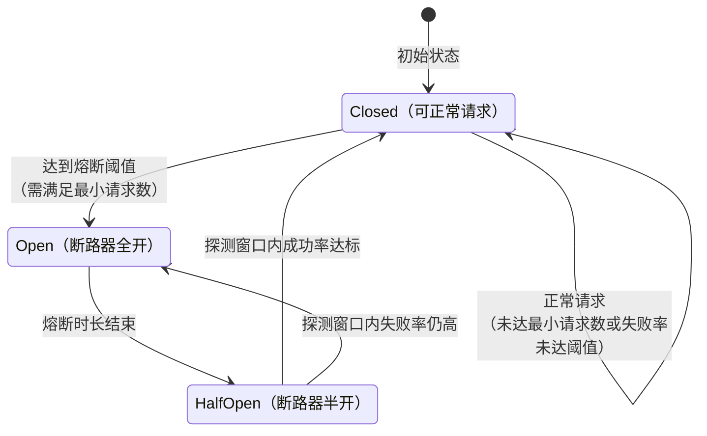
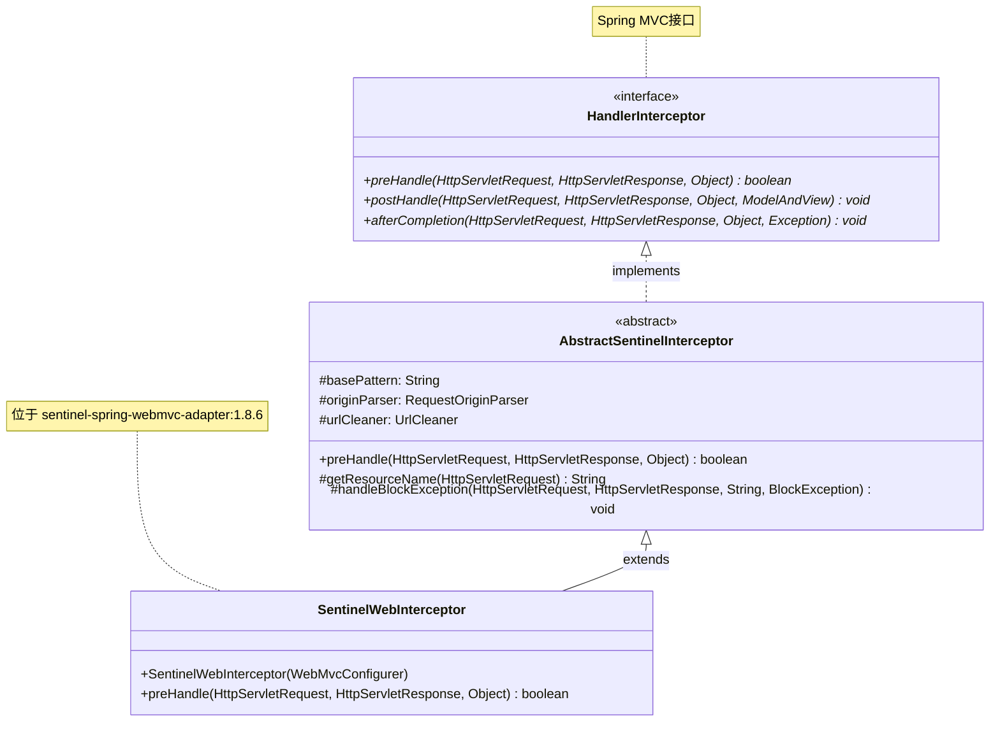
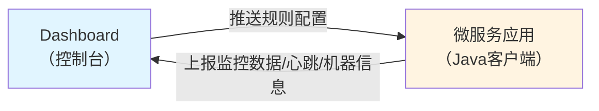
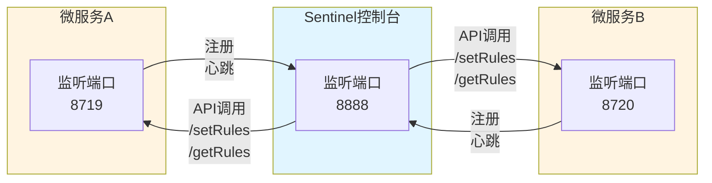
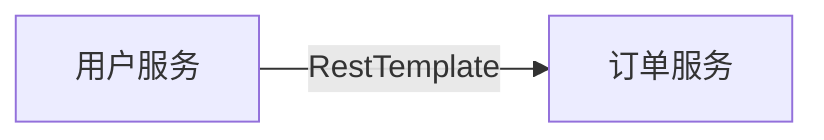
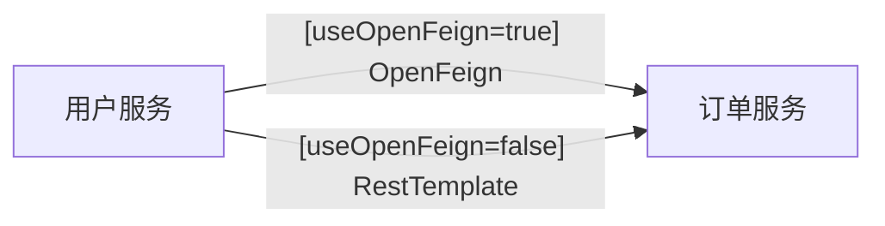
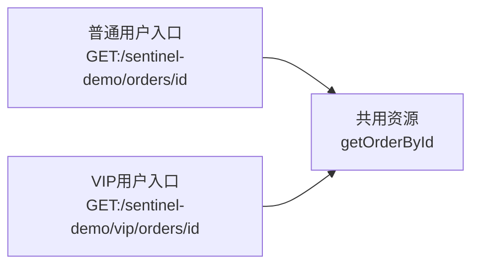

{: .no_toc }

<details close markdown="block">
  <summary>
    目录
  </summary>
  {: .text-delta }
- TOC
{:toc}
</details>

## 1. 介绍

### 1.1 内容概要

本文讲解阿里巴巴开源的 **Sentinel 流量控制组件**，涵盖以下知识模块

| 知识模块              | 说明                                        |
| ----------------- | ----------------------------------------- |
| **服务雪崩解决方案**      | 超时、限流、隔离、熔断四种策略                           |
| **Sentinel 使用方法** | 5 种整合：API、注解、Starter、RestTemplate、Feign   |
| **Sentinel 工作原理** | Slot 责任链（7 核心 Slot）、调用链路、SPI 扩展机制         |
| **Sentinel 规则配置** | 流控、熔断降级、热点参数、系统保护、授权规则、集群规则介绍             |
| **规则持久化**         | 原始模式、拉模式、推模式三种及自定义实现                      |
| **实战应用示例**        | API 注解、Starter 自动配置、RestTemplate/Feign 整合 |

本文从 **知识讲解**、**实操步骤**、**代码整合**、**框架源码** 四个维度系统阐述 **Sentinel**，帮助读者全面掌握其原理与应用。

### 1.2 配套代码及环境

**GitHub 仓库**：[spring-cloud-alibaba-2023-sentinel](https://github.com/fangkun119/spring-cloud-alibaba-2023-sentinel)

**模块说明**：

| 模块 | 覆盖内容 |
| ---- | ---- |
| **sentinel-api-annotation-demo** | Sentinel 原生整合：API 和 AOP 注解 |
| **microservice-demo-tlmall-user** | Sentinel 微服务整合（上游服务）、规则配置演示 |
| **microservice-demo-tlmall-order** | Sentinel 微服务整合（下游服务）、规则演示、规则配置 |

**微服务环境搭建**：复用先前文档环境，参考《Spring Cloud Alibaba 02：完整Demo搭建》以下小节：

```text
3.3 域名配置
3.4 MySQL
3.5 Nacos
3.7 Sentinel
```

## 2. 背景问题：服务雪崩

### 2.1 故障场景

从故障演化过程和资源耗尽机制两个维度，分析服务雪崩的形成原因。

**服务雪崩**是微服务调用中常见的 **级联故障现象**，表现为：

| 阶段 | 现象 |
| ---- | ---- |
| **故障触发** | 服务提供者不可用，导致调用者 **随之不可用** |
| **故障扩散** | 影响 **逐级放大**，最终波及整个系统 |

**形成机制**（故障由下至上逐级传播）：

| 环节 | 说明 |
| ---- | ---- |
| **资源耗尽** | 同步调用 **阻塞线程池**，调用者自身陷入不可用状态 |
| **流量放大** | 上游重试（用户/代码重试） **进一步加剧压力** |


**共享线程池问题**：当多个下游调用共享同一线程池时：

| 问题 | 后果 |
| ---- | ---- |
| **线程池耗尽** | 某一下游故障占用 **全部线程**，其他下游调用受阻 |
| **全局瘫痪** | 所有下游调用失败，**无法返回降级数据** |

下图展示商品评论服务故障导致共享线程池耗尽的场景：商品服务、价格服务调用失败，用户请求无法响应。


### 2.2 四种解决方案

解决服务雪崩的核心思路：**快速释放资源，避免线程阻塞**。具体方案包括：超时机制、流量控制、资源隔离、熔断降级。

#### (1) 超时机制

设定请求的最大等待时间，避免线程无限阻塞。

| 分析角度   | 说明                         |
| ------ | -------------------------- |
| **作用** | **快速释放线程资源**，抑制资源耗尽        |
| **局限** | 只能缓解无法根除（超时时间内线程 **仍被占用**） |

#### (2) 流量控制

从预防层面限制 QPS，避免流量突增导致服务故障。

| 分析角度   | 说明                    |
| ------ | --------------------- |
| **措施** | **限制业务访问 QPS**，防止流量突增 |
| **思路** | **预防层面**解决雪崩问题        |

#### (3) 资源隔离

**核心思路**：按业务维度独立划分线程池等资源，将故障影响限制在局部范围，避免蔓延至其他模块。

**三种隔离类型：**

| 类型 | 说明 |
| ---- | ---- |
| **进程隔离** | 不同服务部署在独立进程，通过服务边界隔离 |
| **线程隔离** | 同一服务内，为**不同下游**调用分配**独立线程池** |
| **信号量隔离** | 使用信号量进行更细粒度的并发控制 |

**应用示例：商品详情服务**

商品详情页需聚合多个下游服务，为避免相互影响，分配独立线程池：

| 下游服务 | 线程数 |
| ---- | ---- |
| **商品服务** | 30 |
| **价格服务** | 30 |
| **商品评论服务** | 20 |

**隔离效果**（商品评论服务故障时）：

| 影响层面 | 结果 |
| ---- | ---- |
| **局部故障** | 仅耗尽评论服务的 20 个线程 |
| **其他正常** | 商品、价格服务 **不受影响**，正常调用 |
| **降级响应** | 返回商品描述 ✓ + 价格 ✓ + 评论（缺失） |

**核心价值**：

资源隔离配合降级策略，确保**服务降级但不完全不可用**。这种"部分可用"策略是大促保障系统稳定的关键手段。

#### (4) 熔断降级

**核心思路**：当服务出现持续异常时，主动切断调用并返回降级数据，避免无谓的等待和资源浪费。

**生活类比**：电路保险丝——电流过载时保险丝熔断保护电路。软件熔断器同理，服务异常时"熔断"阻止故障蔓延。

**三种状态：**

| 状态 | 说明 | 请求处理 |
| ---- | ---- | ---- |
| **Closed**（关闭） | 正常状态 | 正常调用下游服务 |
| **Open**（打开） | 熔断状态 | 不调用下游，直接返回降级数据 |
| **Half-Open**（半开） | 探测恢复 | 放行一个探测请求，根据结果决定后续状态 |

**工作流程：**



**执行逻辑：**

| 阶段   | 状态                        | 触发条件                                  | 请求处理              |
| ---- | ------------------------- | ------------------------------------- | ----------------- |
| ① 正常 | Closed                    | 服务正常，未达熔断条件                           | 正常调用下游            |
| ② 熔断 | Closed → Open             | 统计时长内 **异常达阈值**（如异常比例 > 50%），且满足最小请求数 | -                 |
| ③ 保持 | Open                      | 熔断时长内保持打开                             | **不调用下游**，返回降级数据  |
| ④ 探测 | Half-Open                 | 熔断时长结束                                | **放行一个探测请求**      |
| ⑤ 决策 | Half-Open → Closed / Open | 探测结果                                  | 成功 → 关闭；失败 → 重新计时 |


**降级本质**：熔断后通过 `fallback` 返回备选数据（缓存、默认值、简化接口等）。

### 1.2 配套代码

示例代码来自 [spring-cloud-alibaba-2023-sentinel](https://github.com/fangkun119/spring-cloud-alibaba-2023-sentinel/tree/main) 仓库，涉及以下模块：

| 代码模块                                                                                                                                                          | 说明                                                        |
| ------------------------------------------------------------------------------------------------------------------------------------------------------------- | --------------------------------------------------------- |
| [sentinel-api-annotation-demo](https://github.com/fangkun119/spring-cloud-alibaba-2023-sentinel/tree/main/sentinel-examples/sentinel-api-annotation-demo)     | **Sentinel API** 使用；**实现原理理解**；**@SentinelResource 注解示例** |
| [microservice-demo-tlmall-order](https://github.com/fangkun119/spring-cloud-alibaba-2023-sentinel/tree/main/sentinel-examples/microservice-demo-tlmall-order) | **Sentinel Starter 自动保护 MVC 接口**                          |
| [microservice-demo-tlmall-user](https://github.com/fangkun119/spring-cloud-alibaba-2023-sentinel/tree/main/sentinel-examples/microservice-demo-tlmall-user)   | **RestTemplate**、**OpenFeign 接口保护**                       |

### 1.3 环境依赖

本文依赖 **Nacos**、**MySQL**、**Sentinel 控制台** 及域名配置，环境搭建参考《Spring Cloud Alibaba 02：完整Demo搭建》以下章节：

```text
3.3 域名配置
3.4 MySQL
3.5 Nacos
3.7 Sentinel
```

## 3. Sentinel 介绍

### 3.1 作用定位

Sentinel 是阿里巴巴开源的分布式服务架构 **流量控制组件**，保障系统运行期间的稳定性和可用性，**避免服务雪崩**。

**Sentinel 与服务雪崩解决方案的对应关系：**

| 解决方案 | 提供方 | 说明 |
| ---- | ---- | ---- |
| **流量控制** | **Sentinel** | 限制系统流量，防止超出处理能力而崩溃 |
| **熔断降级** | **Sentinel** | 服务不可用时返回降级数据，保证核心业务运行 |
| **超时机制** | OpenFeign + **Sentinel** | 整合后返回 fallback 降级数据 |
| **资源隔离** | 系统设计 | 依赖系统设计和实现 |

四种方案组合形成完整的服务雪崩预防体系，其中 Sentinel 是核心，提供 **流量控制** 和 **熔断降级** 两大关键能力。

### 3.2 发展历程

官网：<https://sentinelguard.io/zh-cn/docs/introduction.html>

| 年份            | 里程碑                                             |
| ------------- | ----------------------------------------------- |
| **2012**      | 诞生于阿里，入口流量控制                                    |
| **2013-2017** | 内部快速发展，成为基础技术模块，覆盖核心场景                          |
| **2018**      | 正式开源                                            |
| **2019**      | 推出 C++ 版本，支持 Service Mesh（Envoy 集群流控）           |
| **2020**      | 推出 Go 版本，向云原生演进                                 |
| **2021**      | 朝 2.0 云原生决策中心演进，推出 Rust 版本                      |
| **2022**      | 品牌升级为**流量治理**，制定 OpenSergo 标准，涵盖流量路由、流控降级、过载保护等 |

### 3.3 核心概念

资源（Resource）和规则（Rule）是 Sentinel 的两大核心概念，其使用、配置和实现都围绕它们展开。

#### (1) 资源

**资源** 是能被 Sentinel API 保护的 **对象或代码片段**。

**资源类型：**

| 类型   | 说明                   |
| ---- | -------------------- |
| 接口方法 | Controller 的 HTTP 接口 |
| 普通方法 | Service 层的业务方法       |
| 代码片段 | 特定的逻辑代码              |
| 其他标识 | 方法签名、URL、服务名称等       |

**核心**：需要保护的代码都可定义为资源，Sentinel 通过资源识别和管理保护目标。

#### (2) 规则

**规则** 是针对资源的 **保护策略**，涵盖流量控制、熔断降级、热点参数限流和系统保护，支持 **动态实时调整**。

**功能体系：**

| 功能分类 | 具体功能 | 核心说明 | 典型场景 |
| ---- | ---- | ---- | ---- |
| **流量控制** | **QPS 限流** | 限制 QPS 或并发线程数 | 秒杀、API 限流 |
| | **流量整形** | 匀速排队或预热平滑流量突增 | 大促预热、削峰 |
| | **热点防护** | 针对热点参数细粒度限流 | 商品 ID 限流、防刷单 |
| **熔断降级** | 熔断降级 | 异常比例或响应时间超阈值时快速失败 | 依赖故障、慢查询、超时 |
| **系统负载保护** | **自适应过载保护** | 系统负载（load1/CPU/RT）超阈值时触发保护 | 负载过高、资源耗尽 |
| **流量路由** | 流量路由 | 按请求特征分发流量（1.8.6+） | 灰度发布、蓝绿部署 |

**核心设计理念：**

| 核心理念 | 说明 |
| ---- | ---- |
| **多层次防护** | **预防**（流量路由、控制）→ **应对**（熔断降级）→ **整体保护**（系统负载） |
| **快速失败** | 快速释放资源，避免线程阻塞 |
| **降级优于不可用** | 宁可返回部分数据，也要保证核心功能可用 |

## 4. Sentinel 整合方式概述

本文介绍 Sentinel 的 5 种使用方式：

| 分类  | 使用方式                             | 保护对象            | 适用场景            | 优缺点                                |
| --- | -------------------------------- | --------------- | --------------- | ---------------------------------- |
| 原生  | **Sentinel API**                 | 任意代码、方法、接口      | 学习原理、精细控制       | ✅ 完全掌控底层、灵活性最高<br>❌ 侵入性强、维护成本高     |
| 原生  | **@SentinelResource**            | Spring Boot 方法  | 业务方法保护、补充保护     | ✅ 低侵入、统一异常处理<br>❌ 需额外依赖、配置复杂       |
| 微服务 | **Spring Cloud Alibaba Starter** | HTTP 接口         | 微服务项目           | ✅ 自动配置、开箱即用<br>❌ 仅保护 HTTP 接口       |
| 微服务 | **RestTemplate**                 | RestTemplate 调用 | RestTemplate 调用 | ✅ 自动拦截、细粒度控制<br>❌ 仅适用 RestTemplate |
| 微服务 | **OpenFeign**                    | Feign 接口        | Feign 调用        | ✅ 声明式、集成负载均衡<br>❌ 学习成本高            |

## 5. Sentinel 原生整合(方式1~2)

本节介绍 Sentinel 的两种原生使用方式（API 和注解），它们不依赖任何微服务组件，既可用于普通 Spring Boot 应用，也可作为微服务架构的补充方案。

### 5.1 方式1：Sentinel API

#### (1) 介绍

**核心思路**：通过编程方式定义资源和规则，是 Sentinel 最基础的使用方式。

**适用场景：**

| 场景类型 | 说明 |
| ---- | ---- |
| **学习理解原理** | 深入理解 Sentinel 的工作机制和底层实现 |
| **精确控制资源** | 少数需要精细控制资源保护逻辑的业务场景 |

**配套代码**：[sentinel-api-annotation-demo](https://github.com/fangkun119/spring-cloud-alibaba-2023-sentinel/tree/main/sentinel-examples/sentinel-api-annotation-demo)

#### (2) 使用步骤

##### 步骤1：引入依赖

在 `pom.xml` 中添加 `sentinel-core` 依赖：

```xml
<dependency>
    <groupId>com.alibaba.csp</groupId>
    <artifactId>sentinel-core</artifactId>
    <version>1.8.6</version>
</dependency>
```

**版本说明：**

| 要点         | 说明                                                                              |
| ---------- | ------------------------------------------------------------------------------- |
| **版本对应关系** | 具体版本号取决于所使用的 **Spring Cloud Alibaba 版本**                                        |
| **官方文档**   | 通过 [版本说明文档](https://sca.aliyun.com/docs/2023/overview/version-explain) 查询对应映射关系 |

##### 步骤2：定义受保护的资源

使用 Sentinel API 将代码定义为资源，关键代码如下：

```java
@RestController
@Slf4j
@RequestMapping(SENTINEL_API_DEMO)
public class SentinelAPIDemo {
    // REST API : /sentinel/api-demo/hello-world
    public static final String RESOURCE_NAME_HELLOW_WORLD = SENTINEL_API_DEMO + HELLO_WORLD;

    @RequestMapping(value = HELLO_WORLD)
    public String hello() {
        // 受保护的资源: ”/sentinel/api-demo/hello-world"
        try (Entry entry = SphU.entry(RESOURCE_NAME_HELLOW_WORLD)) {
            // 受保护的业务逻辑
            log.info("hello world");
            return "hello world";
        } catch (BlockException e) {
            // Sentinel流控时抛出此异常
            log.info("blocked!");
            return "流控异常：" + e.getRule();
        } catch (Throwable e) {
            // 捕获业务代码抛出的异常
            log.info("exception");
            return "处理异常：" + e.getMessage();
        }
    }
}
```

完整代码链接：[SentinelAPIDemo.java](https://github.com/fangkun119/spring-cloud-alibaba-2023-sentinel/blob/main/sentinel-examples/sentinel-api-annotation-demo/src/main/java/org/sentineldemo/nativedemo/controller/SentinelAPIDemo.java)

资源定义的核心要点：

| 要点         | 说明                                 | 代码示例                                  |
| ---------- | ---------------------------------- | ------------------------------------- |
| **定义资源名称** | 通过 `SphU.entry()` 方法为代码片段命名        | `SphU.entry(API_DEMO + HELLO_WORLD)`  |
| **资源保护方式** | 使用 try-with-resources 确保资源自动释放     | `try (Entry entry = SphU.entry(...))` |
| **流控异常处理** | 捕获 `BlockException` 处理 Sentinel 流控 | `catch (BlockException e)`            |
| **业务异常处理** | 捕获 `Throwable` 处理业务代码异常            | `catch (Throwable e)`                 |
| **规则生效条件** | 必须配置流控规则才能产生保护效果                   | 通过 `FlowRuleManager.loadRules()` 加载规则 |

**API 方式的特点：**

| 特点          | 说明                                      | 权衡与适用场景                              |
| ----------- | --------------------------------------- | ------------------------------------ |
| **保护粒度灵活**  | 从**细粒度**的代码片段（如关键算法）到**粗粒度**的方法或 API 接口 | 开发者可根据实际需求自由选择保护范围                   |
| **代码侵入性较高** | 需要在业务代码中显式编写 Sentinel 调用逻辑              | 与**注解方式**相比增加了复杂度，但提供更**底层和灵活**的控制能力 |

**对理解 Sentinel 和查找源码的帮助：**

API调用与**通过框架整合**、源码执行路径高度一致 —— 熟悉 API 流程后，查找源码时可以沿着已知链路快速导航，精准定位到 `ContextUtil`、`SphU`、`SlotChain` 等核心组件，从而高效排查问题。

##### 步骤3：配置流控规则

定义资源后，还需配置流控规则才能生效。规则配置包含以下核心参数：

| 参数           | 说明                          |
| ------------ | --------------------------- |
| **resource** | 受保护的资源名称                    |
| **grade**    | 流控类型（QPS 或并发线程数）            |
| **count**    | 流控阈值（如 QPS=1 表示每秒仅允许 1 个请求） |

**配置示例：**

```java

@Component
public class SentinelRuleConfig {
    // 定义流控规则
    @PostConstruct
    public static void initFlowRules() {
        List<FlowRule> rules = new ArrayList<>();
        // REST API: "/sentinel/api-demo/hello-world"
        rules.add(getQPSRule(
                SentinelAPIDemo.RESOURCE_NAME_HELLOW_WORLD, 1));
        // REST API: "/sentinel/annotation/method-handler-demo/hello-world"
        rules.add(getQPSRule(
                SentinelAnnotationMethodHandlerDemo.RESOURCE_NAME_HELLO_WORLD, 1));
        // REST API: "/sentinel/annotation/class-handler-demo/hello-world"
        rules.add(getQPSRule(
                SentinelAnnotationClassHandlerDemo.RESOURCE_NAME_HELLO_WORLD, 1));
        FlowRuleManager.loadRules(rules);
    }

    // 辅助方法
    private static FlowRule getQPSRule(final String RESOURCE_NAME, final int QPS) {
        // 构建Rule
        FlowRule rule = new FlowRule();
        // 受保护的资源
        rule.setResource(RESOURCE_NAME);
        // 规则内容
        rule.setGrade(RuleConstant.FLOW_GRADE_QPS);
        rule.setCount(QPS);
        // 返回
        return rule;
    }
}
```

**提示**：通过 `RuleConstant` 可以配置更多流控常量，后续笔记将详细讲解各种流控规则的配置方法。

完整代码链接：[SentinelRuleConfig.java](https://github.com/fangkun119/spring-cloud-alibaba-2023-sentinel/blob/main/sentinel-examples/sentinel-api-annotation-demo/src/main/java/org/sentineldemo/nativedemo/config/SentinelRuleConfig.java)

##### 验证效果

**流控效果验证**：

上一节配置的流控规则将 QPS 上限设为 1。

在 1 秒内连续发送 2 个请求时，第二个请求会被流控并返回"流控异常"提示。


**断点调试验证：**

通过断点调试可以看到，Sentinel 抛出 `FlowException` 异常（`BlockException` 的子类）。

捕获该异常后，可执行自定义的流控处理逻辑。


#### (3) Sentinel 拦截器（框架调用 API 的方式）

实际项目中，通常不会采用硬编码方式，而是通过框架拦截器机制（如 Spring MVC 的 `HandlerInterceptor`）实现接口的自动资源保护。

##### 拦截器：SentinelWebInterceptor

通过查看 `HandlerInterceptor` 的实现类，可以找到 `SentinelWebInterceptor`。


该类位于 `sentinel-spring-webmvc-adapter:1.8.6` 包下：


##### 配置类：SentinelWebMvcConfig

接下来查看拦截器的 Bean 装配方式。

通过关键词 `Sentinel` 和 `Config` 搜索，可以找到内部类 `SentinelWebAutoConfiguration.SentinelWebMvcConfig`。

这个类的`sentinelWebInterceptor`把拦截器装配成Bean。


该配置类位于 `spring-cloud-starter-alibaba-sentinel:2023.0.1.0` 包下，负责将 `SentinelWebInterceptor` 装配为 Bean。

##### 拦截器执行逻辑

查看 `SentinelWebInterceptor` 的继承关系：它继承了 `AbstractSentinelInterceptor` 抽象类，并实现了 Spring MVC 的 `HandlerInterceptor` 接口。



完整源码：[AbstractSentinelInterceptor.java](https://github.com/alibaba/Sentinel/blob/1.8.6/sentinel-adapter/sentinel-spring-webmvc-adapter/src/main/java/com/alibaba/csp/sentinel/adapter/spring/webmvc/AbstractSentinelInterceptor.java)

通过源码可以清晰看到拦截器利用 Sentinel API 实现流控的完整流程，如下图。


接下来看具体的执行步骤：

**请求执行前的流控（preHandle 方法）：**

| 步骤         | 说明                                                           |
| ---------- | ------------------------------------------------------------ |
| ① 获取资源名称   | 通过 `getResourceName(request)` 解析 URL 作为资源标识                  |
| ② 进入上下文    | 通过 `ContextUtil.enter(contextName, origin)` 初始化调用上下文，支持来源解析  |
| ③ 资源保护     | 通过 `SphU.entry()` 进入资源保护（流控的核心入口）                            |
| ④ 存储 Entry | 通过 `request.setAttribute()` 存储 Entry 对象，供后续清理使用              |
| ⑤ 异常处理     | 捕获 `BlockException` 异常，调用 `handleBlockException()` 执行自定义处理逻辑 |

**请求完成后的清理（afterCompletion 方法）：**

| 步骤         | 说明                                     |
| ---------- | -------------------------------------- |
| ① 获取 Entry | 从 request 属性中获取 Entry 对象               |
| ② 退出资源保护   | 调用 `entry.exit()` 退出资源保护               |
| ③ 清理上下文    | 执行 `ContextUtil.exit()` 清理上下文，确保资源正确释放 |


**API 与源码的对应关系：**

熟悉 API 方式后，可以快速定位源码中的关键调用：

| 源码中的调用                     | API 方式的对应                |
| -------------------------- | ------------------------ |
| `SphU.entry()`             | 资源定义                     |
| `BlockException`           | 流控异常                     |
| `ContextUtil.enter/exit()` | 上下文管理                    |
| `entry.exit()`             | try-with-resources 的资源释放 |


**拦截器的本质：**

通过上述分析可见，拦截器的本质是将 API 方式的资源保护逻辑封装为 Spring MVC 通用组件，实现 HTTP 接口的自动化流控保护。

### 5.2 方式2：`@SentinelResource`注解

#### (1) 介绍

Sentinel 提供了 `@SentinelResource` 注解用于资源保护。相比直接使用 API，注解方式具有更低的业务侵入性和更好的可维护性。

```java
@RestController  
@Slf4j  
@RequestMapping(SENTINEL_ANNOTATION_CLASS_HANDLER_DEMO)  
public class SentinelAnnotationClassHandlerDemo {  

    @SentinelResource(value = RESOURCE_NAME_HELLO_WORLD,  
            blockHandler = "handleBlockException", 
            blockHandlerClass = ExceptionUtil.class,  
            fallback = "handleFallbackException", 
            fallbackClass = ExceptionUtil.class)  
    @RequestMapping(HELLO_WORLD)  
    public String helloWorld() {  
        // …… 接口业务代码 ……
    }  
}
```

配套代码：

| 项目模块                                                                                                                                                      | 说明                        |
| --------------------------------------------------------------------------------------------------------------------------------------------------------- | ------------------------- |
| [sentinel-api-annotation-demo](https://github.com/fangkun119/spring-cloud-alibaba-2023-sentinel/tree/main/sentinel-examples/sentinel-api-annotation-demo) | Sentinel API 和 AOP 注解演示实例 |


#### (2) 整合步骤

使用 `@SentinelResource` 注解需要以下步骤（适用于普通 Spring Boot 应用）：

##### 步骤1：引入依赖

引入 Sentinel AOP 扩展依赖：

```xml
<dependency>
    <groupId>com.alibaba.csp</groupId>
    <artifactId>sentinel-annotation-aspectj</artifactId>
    <version>1.8.6</version>
</dependency>
```

版本说明：具体版本号取决于所使用的 **Spring Cloud Alibaba 版本**

建议通过 [官方版本说明文档](https://sca.aliyun.com/docs/2023/overview/version-explain) 查询对应的版本映射关系。

##### 步骤2：配置切面

启用 `@SentinelResource` 注解的切面支持

```java
@Configuration
public class SentinelAOPConfig {
    @Bean
    public SentinelResourceAspect sentinelResourceAspect() {
        return new SentinelResourceAspect();
    }
}
```

若使用 Spring Cloud Alibaba 整合包，此配置会自动装配.

完整代码：[SentinelAOPConfig.java](https://github.com/fangkun119/spring-cloud-alibaba-2023-sentinel/blob/main/sentinel-examples/sentinel-api-annotation-demo/src/main/java/org/sentineldemo/nativedemo/config/SentinelAOPConfig.java)

##### 步骤3：使用注解保护资源

使用 `@SentinelResource` 注解有两种方式：

**方式一：使用当前类处理异常**

```java
@RestController
@RequestMapping(SENTINEL_ANNOTATION_METHOD_HANDLER_DEMO)  
public class SentinelAnnotationMethodHandlerDemo {

    @SentinelResource(  
            value = RESOURCE_NAME_HELLO_WORLD,  
            blockHandler = "handleBlockException", // 不指定blockHandlerClass  
            fallback = "handleFallbackExcewption"  // 不指定fallbackClass  
    )  
    @RequestMapping(HELLO_WORLD)  
    public String helloWorld() {  
        // …… 接口业务代码 ……
    }
    
	public String handleBlockException(BlockException e) {
		// …… BlockException处理逻辑 ……
	} 
	
	public String handleFallbackExcewption(Throwable e) {
		// …… 其它异常处理逻辑 ……
	} 
}
```

**方式二：使用独立类处理异常**

```java
@RestController  
@Slf4j  
@RequestMapping(SENTINEL_ANNOTATION_CLASS_HANDLER_DEMO)  
public class SentinelAnnotationClassHandlerDemo {  

    @SentinelResource(value = RESOURCE_NAME_HELLO_WORLD,  
            blockHandler = "handleBlockException", 
            blockHandlerClass = ExceptionUtil.class,  
            fallback = "handleFallbackException", 
            fallbackClass = ExceptionUtil.class)  
    @RequestMapping(HELLO_WORLD)  
    public String helloWorld() {  
        // …… 接口业务代码 ……
    }  
}
```

完整代码：

| 类名                                    | GitHub 链接                                                                                                                                                                                                                                                           | 说明         |
| ------------------------------------- | ------------------------------------------------------------------------------------------------------------------------------------------------------------------------------------------------------------------------------------------------------------------- | ---------- |
| `SentinelAnnotationMethodHandlerDemo` | [SentinelAnnotationMethodHandlerDemo.java](https://github.com/fangkun119/spring-cloud-alibaba-2023-sentinel/blob/main/sentinel-examples/sentinel-api-annotation-demo/src/main/java/org/sentineldemo/nativedemo/controller/SentinelAnnotationMethodHandlerDemo.java) | 异常处理方法在当前类 |
| `SentinelAnnotationClassHandlerDemo`  | [SentinelAnnotationClassHandlerDemo.java](https://github.com/fangkun119/spring-cloud-alibaba-2023-sentinel/blob/main/sentinel-examples/sentinel-api-annotation-demo/src/main/java/org/sentineldemo/nativedemo/controller/SentinelAnnotationClassHandlerDemo.java)   | 异常处理方法在独立类 |
| `ExceptionUtil`                       | [ExceptionUtil.java](https://github.com/fangkun119/spring-cloud-alibaba-2023-sentinel/blob/main/sentinel-examples/sentinel-api-annotation-demo/src/main/java/org/sentineldemo/nativedemo/exception/ExceptionUtil.java)                                              | 异常处理工具类    |


上述两种方式都使用了 `@SentinelResource` 注解，该注解包含以下核心属性：

| 属性                 | 说明                       | 必填 | 缺省值                 |
| ------------------ | ------------------------ | -- | ------------------- |
| value              | 资源名称                     | 是  | -                   |
| blockHandler       | 处理 `BlockException` 的方法名 | 否  | `""`                |
| blockHandlerClass  | `blockHandler` 所在的类      | 否  | 当前类                 |
| fallback           | 处理所有异常的方法名               | 否  | `""`                |
| fallbackClass      | `fallback` 所在的类          | 否  | 当前类                 |
| exceptionsToTrace  | 需要追踪的异常类型                | 否  | `{Throwable.class}` |
| exceptionsToIgnore | 需要忽略的异常类型                | 否  | `{}`                |


**异常处理机制：**

`blockHandler` 和 `fallback` 具有不同的职责分工：

| 处理机制             | 职责描述                                        |
| ---------------- | ------------------------------------------- |
| **blockHandler** | 处理 **Sentinel 流控异常**（`BlockException` 及其子类） |
| **fallback**     | 作为**兜底机制**处理其他所有异常（包括业务异常、系统异常等）            |


当两者同时配置时，框架按优先级判断异常类型：`BlockException` 调用 `blockHandler`，其他异常调用 `fallback`。

##### 步骤4：配置流控规则

为注解保护的资源设置流量阈值

```java

@Component
public class SentinelRuleConfig {  
    // 定义流控规则  
    @PostConstruct  
    public static void initFlowRules() {  
        List<FlowRule> rules = new ArrayList<>();  
        // REST API: "/sentinel/annotation/method-handler-demo/hello-world"  
		rules.add(getQPSRule(
			SentinelAnnotationMethodHandlerDemo.RESOURCE_NAME_HELLO_WORLD, 1));  
		// REST API: "/sentinel/annotation/class-handler-demo/hello-world"  
		rules.add(getQPSRule(
			SentinelAnnotationClassHandlerDemo.RESOURCE_NAME_HELLO_WORLD, 1));  
		FlowRuleManager.loadRules(rules);
    }  
  
    // 辅助方法  
    private static FlowRule getQPSRule(final String RESOURCE_NAME, final int QPS){
        // 构建Rule  
        FlowRule rule = new FlowRule();  
        // 受保护的资源  
        rule.setResource(RESOURCE_NAME);  
        // 规则内容  
        rule.setGrade(RuleConstant.FLOW_GRADE_QPS);  
        rule.setCount(QPS);  
        // 返回  
        return rule;  
    }  
}
```

##### 步骤5：效果验证

**访问测试接口**：频繁请求该 API，观察流控和异常处理效果。

| 请求场景           | 执行结果                | 进入的处理方法          |
| -------------- | ------------------- | ---------------- |
| **第一次请求**      | 正常执行，但因除零异常被捕获      | `handleFallback` |
| **第二次请求（1秒内）** | 触发流控规则（QPS=1），请求被限流 | `handleBlock`    |


根据流控异常处理方法，返回如下Response

```java
// 处理流控异常
public static String handleBlockException(BlockException e) {
    return "流控异常: " + e.getRule();
}
```


**断点调试建议：**

通过断点调试可以直观地理解 Sentinel 的工作流程：

| 调试目标         | 操作步骤                               | 观察重点           |
| ------------ | ---------------------------------- | -------------- |
| **业务异常处理流程** | 在 `handleFallbackException` 方法设置断点 | 业务异常的调用栈和异常类型  |
| **流控异常触发时机** | 在 `handleBlockException` 方法设置断点    | 流控异常的触发时机和规则信息 |


通过断点分析不同异常类型的处理路径，可以深入理解 Sentinel 的异常处理机制。

> **注意**：`@SentinelResource` 注解不提供**断路器**功能，该功能需整合微服务后才能使用。

#### (3) @SentinelResource注解源码

**切面配置入口：**

通过切面配置类 [SentinelAOPConfig.java](https://github.com/fangkun119/spring-cloud-alibaba-2023-sentinel/blob/main/sentinel-examples/sentinel-api-annotation-demo/src/main/java/org/sentineldemo/nativedemo/config/SentinelAOPConfig.java) 可以看到，AOP 切面由 `SentinelResourceAspect` 类实现。接下来以 `SentinelResourceAspect` 为入口开始查找。

```java
@Configuration
public class SentinelAOPConfig {
    @Bean
    public SentinelResourceAspect sentinelResourceAspect() {
        return new SentinelResourceAspect();
    }
}
```

**核心工作流程：**

查看 `SentinelResourceAspect` 类的源码，其核心工作流程如下：


流程中每个步骤所做的操作如下：

| 执行阶段       | 详细说明                                                                            |
| ---------- | ------------------------------------------------------------------------------- |
| 1. 切面拦截    | 通过 `@Pointcut("@annotation(SentinelResource)")` 拦截所有带 `@SentinelResource` 注解的方法 |
| 2. 进入资源保护  | 调用 `entry = SphU.entry(resourceName, ...)` 向 Sentinel 注册资源，开始流量统计               |
| 3. 执行业务方法  | 执行 `return pjp.proceed()` 调用被注解保护的原始业务方法                                        |
| 4a. 处理流控异常 | 捕获 `BlockException` 后调用 `handleBlockException()` 方法，由 `blockHandler` 处理流控异常     |
| 4b. 处理业务异常 | 捕获其他 `Throwable` 异常后调用 `handleFallback()` 方法，由 `fallback` 处理业务异常                |
| 5. 退出资源保护  | 执行 `entry.exit(1, pjp.getArgs())` 释放资源，完成流量统计                                   |


核心工作原理：`SentinelResourceAspect` 通过 **AspectJ 切面**在方法调用前后插入 Sentinel 保护逻辑：

| 阶段    | 操作说明                                                                            |
| ----- | ------------------------------------------------------------------------------- |
| 进入方法前 | 通过 `SphU.entry()` 定义资源并触发流控检查                                                   |
| 捕获异常后 | 根据异常类型分发到对应的处理方法：<br>- `BlockException` → `blockHandler`<br>- 其他异常 → `fallback` |
| 方法执行后 | 通过 `entry.exit()` 完成统计并释放资源                                                     |


完整源码：[SentinelResourceAspect.java (v1.8.6)](https://github.com/alibaba/Sentinel/blob/1.8.6/sentinel-extension/sentinel-annotation-aspectj/src/main/java/com/alibaba/csp/sentinel/annotation/aspectj/SentinelResourceAspect.java)

## 6. Sentinel 微服务整合(方式3~5)

本节介绍 Sentinel 与微服务框架的三种整合方式，适用于生产环境的自动化流量控制。

### 6.1 基础知识

#### (1) 环境依赖

环境依赖如下（搭建步骤参考本文 1.3 小节）：

- 微服务域名配置
- MySQL
- Nacos 服务注册中心（初始用户名/密码：nacos/nacos）
- Sentinel 控制台（初始用户名/密码：sentinel/sentinel）

本文使用 Sentinel 1.8.6（[下载地址](https://github.com/alibaba/Sentinel/releases/download/1.8.6/sentinel-dashboard-1.8.6.jar)）。

启动命令如下（若端口冲突可通过 `-Dserver.port=新端口` 指定）：

```bash
java -Dserver.port=8888 -Dcsp.sentinel.dashboard.server=tlmall-sentinel-dashboard:8888 -Dproject.name=sentinel-dashboard -jar sentinel-dashboard-1.8.6.jar
```

启动成功后，通过 `http://localhost:8888` 或 `http://tlmall-sentinel-dashboard:8888/` 访问 Sentinel 控制台。

#### (2) 组件构成

Sentinel 由两部分组成，协同实现流量控制：

| 组件名称           | 角色      | 描述                                                                                                                                                 |
| -------------- | ------- | -------------------------------------------------------------------------------------------------------------------------------------------------- |
| 核心库（Java 客户端）  | 微服务加载的库 | 不依赖任何框架/库，支持 Java 8 及以上版本，对 Dubbo / Spring Cloud 等框架有较好支持（见 [主流框架适配](https://sentinelguard.io/zh-cn/docs/open-source-framework-integrations.html)） |
| 控制台（Dashboard） | 独立服务    | 规则配置推送、流量监控、机器管理                                                                                                                                   |


**官方文档：**

- [快速入门](https://sentinelguard.io/zh-cn/docs/quick-start.html)
- [主流框架适配](https://sentinelguard.io/zh-cn/docs/open-source-framework-integrations.html)

**Java 客户端与控制台的协作机制：**



**规则推送问题：** 规则无法推送（控制台配置的规则在微服务端不生效）

这是一个常见问题，通过前面介绍的协作机制可以理解原因

| 部署架构         | 问题描述   | 根本原因               |
| ------------ | ------ | ------------------ |
| 控制台在云端，应用在本地 | 规则推送失败 | 控制台无法访问本地应用的推送监听端口 |

解决方法有三种

| 方法   | 部署方式               | 适用场景 |
| ---- | ------------------ | ---- |
| 本地部署 | 控制台和应用都部署在本地       | 开发测试 |
| 云端部署 | 微服务部署到与控制台相同的云环境   | 生产环境 |
| 端口映射 | 通过端口转发或 VPN 打通网络访问 | 临时调试 |

#### (3) 通信机制

##### 配置地址和端口

微服务需配置控制台地址和监听端口：

```yml
spring:
  cloud:
    sentinel:
      transport:
        dashboard: localhost:8888  # 控制台地址
        port: 8719                 # 微服务监听端口（接收控制台推送）
```

端口配置说明：

| 配置项        | 说明                        | 注意事项       |
| ---------- | ------------------------- | ---------- |
| **明确指定端口** | 避免端口计算的不确定性               | 生产环境必须明确指定 |
| **多实例部署**  | 端口自动累加（8719、8720、8721...） | 每个实例依次递增   |


##### 触发微服务注册

新启动的微服务不会立即注册到控制台，而是在被保护资源首次访问时才触发注册。


##### 微服务与控制台通信

微服务注册到控制台后，通过心跳维持活跃状态，并提供两个 API 供控制台推送和拉取规则。

| 通信方向          | API 端点      | 说明          |
| ------------- | ----------- | ----------- |
| **控制台 → 微服务** | `/setRules` | 控制台推送规则到微服务 |
| **微服务 → 控制台** | `/getRules` | 控制台从微服务拉取规则 |


完整通信关系：



### 6.2 方式3：使用 Spring Cloud Alibaba Starter

#### (1) 介绍

Spring Cloud Alibaba 提供了 `spring-cloud-starter-alibaba-sentinel` 整合包，通过自动配置保护微服务的 MVC 接口，同时可结合 `@SentinelResource` 注解保护非 MVC 接口。

| 保护对象         | 实现方式                   | 适用场景               |
| ------------ | ---------------------- | ------------------ |
| **MVC 接口**   | 自动配置拦截器                | 所有 HTTP 接口自动被保护    |
| **非 MVC 接口** | `@SentinelResource` 注解 | Service 层方法或其他业务逻辑 |


官方文档：[Spring Cloud Alibaba Sentinel 整合指南](https://github.com/alibaba/spring-cloud-alibaba/wiki/Sentinel)

配套代码：

| 模块                                                                                                                                                            | 说明       |
| ------------------------------------------------------------------------------------------------------------------------------------------------------------- | -------- |
| [microservice-demo-tlmall-order](https://github.com/fangkun119/spring-cloud-alibaba-2023-sentinel/tree/main/sentinel-examples/microservice-demo-tlmall-order) | 订单服务整合示例 |

#### (2) 整合步骤

##### 步骤1：引入Sentinel Starter依赖

```xml
<!-- Sentinel Starter依赖-->
<dependency>
    <groupId>com.alibaba.cloud</groupId>
    <artifactId>spring-cloud-starter-alibaba-sentinel</artifactId>
</dependency>
```

完整代码：[sentinel-examples/microservice-demo-tlmall-order/pom.xml](https://github.com/fangkun119/spring-cloud-alibaba-2023-sentinel/tree/main/sentinel-examples/microservice-demo-tlmall-order/pom.xml)

##### 步骤2：配置保护资源

Spring Cloud Alibaba Starter 通过自动配置机制为微服务提供流量保护。接入后，应用自动创建 Sentinel 拦截器，对 HTTP 接口进行资源注册和流控保护。

**资源保护机制：**

| 资源类型     | 保护方式                   | 配置要求      | 适用场景                 | 参考代码                                                                                                                                                                                                                                                                                                                                                                                        |
| -------- | ---------------------- | --------- | -------------------- | ------------------------------------------------------------------------------------------------------------------------------------------------------------------------------------------------------------------------------------------------------------------------------------------------------------------------------------------------------------------------------------------- |
| MVC 接口   | 自动埋点注册                 | 无需额外配置    | Controller 层 HTTP 接口 | [pom.xml](https://github.com/fangkun119/spring-cloud-alibaba-2023-sentinel/blob/main/sentinel-examples/microservice-demo-tlmall-order/pom.xml "pom.xml")<br>[OrderController.java](https://github.com/fangkun119/spring-cloud-alibaba-2023-sentinel/blob/main/sentinel-examples/microservice-demo-tlmall-order/src/main/java/org/sentineldemo/tlmall/order/controller/OrderController.java) |
| 非 MVC 接口 | `@SentinelResource` 注解 | 需在方法上添加注解 | Service 层业务方法        | [OrderServiceImpl.java](https://github.com/fangkun119/spring-cloud-alibaba-2023-sentinel/blob/main/sentinel-examples/microservice-demo-tlmall-order/src/main/java/org/sentineldemo/tlmall/order/service/impl/OrderServiceImpl.java)                                                                                                                                                         |


**MVC 接口自动埋点原理：**

| 步骤         | 说明                                                         |
| ---------- | ---------------------------------------------------------- |
| MVC 接口自动保护 | Starter 自动注册 `CommonFilter` 拦截器，所有 HTTP 请求自动成为 Sentinel 资源 |
| 资源名称生成     | URL 路径自动作为资源标识（如 `/sentinel-demo/orders`）                  |
| 流量统计       | 实时统计 QPS、响应时间等指标                                           |
| 规则生效       | 通过控制台配置的流控规则直接对 MVC 接口生效                                   |


**非 MVC 接口使用示例：**

```java
@Service
public class OrderServiceImpl implements OrderService {
    @Autowired
    private OrderMapper orderMapper;

    @SentinelResource(value = "getOrderById",blockHandler = "handleException")
    @Override
    public Result<?> getOrderById(Integer id) {

        Order order = orderMapper.getOrderById(id);
        return Result.success(order);
    }
    
    // …… 其它代码 ……
}
```

##### 步骤3：添加配置

**配置内容：**

```yaml
spring:
  cloud:
    sentinel:
      transport:
        # Sentinel 控制台访问地址
        dashboard: tlmall-sentinel-dashboard:8888
        # 应用监听端口，接收控制台推送的规则
        port: 8719
      filter:
        # 将 HTTP 方法添加到资源名前缀（默认 false）
        http-method-specify: true
```

完整代码：[application.yml](https://github.com/fangkun119/spring-cloud-alibaba-2023-sentinel/blob/main/sentinel-examples/microservice-demo-tlmall-order/src/main/resources/application.yml "application.yml")

**配置参数说明：**

| 配置项                   | 说明                            | 功能                           |
| --------------------- | ----------------------------- | ---------------------------- |
| `dashboard`           | Sentinel 控制台的访问地址             | 指定微服务连接的控制台位置                |
| `port`                | 应用监听端口（默认 8719）               | 接收控制台推送的规则                   |
| `http-method-specify` | 是否将 HTTP 方法添加到资源名前缀（默认 false） | 区分同一 URL 的不同 HTTP 方法，实现细粒度流控 |


**更多配置项**：可查看 `spring-cloud-starter-alibaba-sentinel` 的 `spring-configuration-metadata.json` 文件。


**配置工作原理：**

`spring.cloud.sentinel.transport.port` 配置使应用启动 HTTP Server，与 Sentinel 控制台建立双向通信：

| 环节   | 说明                                   |
| ---- | ------------------------------------ |
| 规则推送 | 控制台将规则数据推送到应用的 HTTP Server           |
| 规则注册 | HTTP Server 接收规则后注册到 Sentinel 的规则管理器 |
| 实时生效 | 规则立即在应用内存中生效，对后续请求进行流量控制             |


##### 步骤4：验证与测试

**启动订单服务：**

确保 Sentinel 控制台已启动，然后启动订单服务。


订单服务并未立即注册到 Sentinel 控制台。


**首次访问接口（触发注册）：**

访问 `GET http://localhost:8060/sentinel-demo/orders?userId=fox` 触发资源注册。


**查看注册结果：**

刷新 Sentinel 控制台，订单服务和资源已成功注册。由于开启了 `http-method-specify` 配置，资源名包含 HTTP 方法前缀（如 `GET:/sentinel-demo/orders`），可为不同方法配置独立的流控规则。


**配置流控规则：**

点击"+流控"按钮设置流控策略。


**流控规则参数说明：**

| 参数          | 说明                                                    | 示例值                         |
| ----------- | ----------------------------------------------------- | --------------------------- |
| 资源名         | 被保护的接口 API 路径                                         | `GET:/sentinel-demo/orders` |
| 针对来源        | 指定流控规则生效的调用方，默认为 `default`。当多个微服务调用同一资源时，可针对特定微服务设置阈值 | `default` 或微服务名称            |
| 阈值类型        | 流控阈值的计算方式                                             | QPS 或并发线程数                  |
| 单机阈值        | 触发流控的阈值数值                                             | 1                           |
| 阈值类型 - QPS  | 当每秒访问接口的次数超过阈值时触发限流                                   | QPS > 1 时限流                 |
| 阈值类型 - 并发线程 | 当处理该资源的并发线程数超过阈值时触发限流                                 | 并发线程数 > 1 时限流               |


**规则添加后的界面展示**


**验证流控效果：**

快速频繁访问该接口，触发限流返回。


#### (3) 自动配置实现机制

`spring-cloud-starter-alibaba-sentinel` 通过 Spring Boot 自动配置机制完成组件注册。代码入口位于 `org.springframework.boot.autoconfigure.AutoConfiguration.imports` 文件，其中的 `SentinelWebAutoConfiguration` 负责 Spring MVC 接口资源保护的自动配置。

[AutoConfiguration.imports 源码](https://github.com/alibaba/spring-cloud-alibaba/blob/2023.0.1.0/spring-cloud-alibaba-starters/spring-cloud-starter-alibaba-sentinel/src/main/resources/META-INF/spring/org.springframework.boot.autoconfigure.AutoConfiguration.imports)


**自动配置流程：**


**核心类信息：**

| 类                              | 所属框架                 | 职责                                             | JAR 包                                                | 源码                                                                                                                                                                                                                       |
| ------------------------------ | -------------------- | ---------------------------------------------- | ---------------------------------------------------- | ------------------------------------------------------------------------------------------------------------------------------------------------------------------------------------------------------------------------ |
| `SentinelWebAutoConfiguration` | Spring Cloud Alibaba | 创建拦截器和配置对象 Bean                                | spring-cloud-starter-alibaba-sentinel-2023.0.1.0.jar | [GitHub](https://github.com/alibaba/spring-cloud-alibaba/blob/2023.0.1.0/spring-cloud-alibaba-starters/spring-cloud-starter-alibaba-sentinel/src/main/java/com/alibaba/cloud/sentinel/SentinelWebAutoConfiguration.java) |
| `SentinelWebMvcConfigurer`     | Spring Cloud Alibaba | 将拦截器注册到 MVC 拦截器链                               | spring-cloud-starter-alibaba-sentinel-2023.0.1.0.jar | [GitHub](https://github.com/alibaba/spring-cloud-alibaba/blob/2023.0.1.0/spring-cloud-alibaba-starters/spring-cloud-starter-alibaba-sentinel/src/main/java/com/alibaba/cloud/sentinel/SentinelWebMvcConfigurer.java)     |
| `SentinelWebInterceptor`       | Sentinel 核心项目        | 从请求提取资源名，处理 HTTP 方法前缀                          | sentinel-spring-webmvc-6x-adapter-1.8.6.jar          | [GitHub](https://github.com/alibaba/Sentinel/blob/1.8.6/sentinel-adapter/sentinel-spring-webmvc-6x-adapter/src/main/java/com/alibaba/csp/sentinel/adapter/spring/webmvc/SentinelWebInterceptor.java)                     |
| `AbstractSentinelInterceptor`  | Sentinel 核心项目        | 执行流控校验（`ContextUtil.enter()` + `SphU.entry()`） | sentinel-spring-webmvc-6x-adapter-1.8.6.jar          | [GitHub](https://github.com/alibaba/Sentinel/blob/1.8.6/sentinel-adapter/sentinel-spring-webmvc-6x-adapter/src/main/java/com/alibaba/csp/sentinel/adapter/spring/webmvc/AbstractSentinelInterceptor.java)                |


#### (4) 监控端点配置

流控规则保存在应用内存中，通过暴露监控端点可以实时查看流控规则状态，便于监控和问题排查。

**引入 Actuator 依赖（[pom.xml](https://github.com/fangkun119/spring-cloud-alibaba-2023-sentinel/blob/main/sentinel-examples/microservice-demo-tlmall-order/pom.xml "pom.xml")）：**

```xml
<dependency>
    <groupId>org.springframework.boot</groupId>
    <artifactId>spring-boot-starter-actuator</artifactId>
</dependency>
```

**暴露监控端点（[application.yml](https://github.com/fangkun119/spring-cloud-alibaba-2023-sentinel/blob/main/sentinel-examples/microservice-demo-tlmall-order/src/main/resources/application.yml "application.yml")）：**

```yaml
management:
  endpoints:
    web:
      exposure:
        include: 'sentinel'
```

**配置参数说明：**

| 配置项                                         | 说明                | 示例值                      |
| ------------------------------------------- | ----------------- | ------------------------ |
| `management.endpoints.web.exposure.include` | 暴露的监控端点，多个端点用逗号分隔 | `sentinel` 或 `'*'`（暴露所有） |


**获取流控配置：**

访问 `http://localhost:8060/actuator/sentinel` 获取流控配置：


### 6.3 方式4：Sentinel 整合 RestTemplate

#### (1) 介绍

##### 使用场景

尽管微服务间调用更多使用 OpenFeign，但 RestTemplate 在以下场景仍具有优势：

| 场景               | 说明                                 |
| ---------------- | ---------------------------------- |
| **第三方服务调用**      | 外部服务无 Controller 暴露，不便于编写 Feign 接口 |
| **动态 URL 构建**    | 需要在运行时动态决定请求的 URL 和路径              |
| **灵活参数拼装**       | 需要灵活拼装请求参数或处理复杂查询条件                |
| **非标准 REST API** | 调用不符合 RESTful 规范的外部 API            |
| **文件上传下载**       | 处理文件流、大文件传输等场景更直接                  |
| ……               | ……                                 |


##### 保护粒度

通过 `@SentinelRestTemplate` 注解为 RestTemplate 提供流控保护，支持服务级和接口级两种保护粒度：

| 保护粒度 | 资源名称格式                               | 保护范围         | 示例                                              |
| ---- | ------------------------------------ | ------------ | ----------------------------------------------- |
| 服务级别 | `httpmethod:schema://host:port`      | 针对整个微服务的所有调用 | `GET:http://order-service`                      |
| 接口级别 | `httpmethod:schema://host:port/path` | 针对具体接口的调用    | `GET:http://order-service/sentinel-demo/orders` |

##### 配套代码

Spring Cloud Alibaba Sentinel 通过 `@SentinelRestTemplate` 注解为 RestTemplate 提供流控保护，在构造 RestTemplate Bean 时添加该注解即可启用。

**示例场景**：

用户服务 `tlmall-user-sentinel-demo` 通过 RestTemplate 调用订单服务 `tlmall-order-sentinel-demo`，查询指定用户的订单列表。



**配套代码：**

| 微服务名                         | 说明   | 代码链接                                                                                                                                                          |
| ---------------------------- | ---- | ------------------------------------------------------------------------------------------------------------------------------------------------------------- |
| `tlmall-order-sentinel-demo` | 订单服务 | [microservice-demo-tlmall-order](https://github.com/fangkun119/spring-cloud-alibaba-2023-sentinel/tree/main/sentinel-examples/microservice-demo-tlmall-order) |
| `tlmall-user-sentinel-demo`  | 用户服务 | [microservice-demo-tlmall-user](https://github.com/fangkun119/spring-cloud-alibaba-2023-sentinel/tree/main/sentinel-examples/microservice-demo-tlmall-user)   |

**前置条件**：

用户服务已整合 Nacos 注册中心与 Spring Cloud LoadBalancer，可通过微服务名 `tlmall-order-sentinel-demo` 调用下游订单服务。具体方法可参考《Spring Cloud Alibaba 04：LoadBalancer 深入》及上述代码链接。

**下一步**：

为用户服务的 RestTemplate 添加 `@SentinelRestTemplate` 注解，开启流控保护。

#### (2) 整合步骤

##### 步骤1：保护RestTemplate

在 RestTemplate Bean 上添加 `@SentinelRestTemplate` 注解启用流控保护：

```java
@Configuration  
public class RestTemplateConfig {  
    @Bean  
    @LoadBalanced    
    @SentinelRestTemplate(  
		blockHandler = "handleBlockException",  
        blockHandlerClass = ExceptionUtil.class,  
        fallback = "handleFallback",  
        fallbackClass = ExceptionUtil.class  
    )  
    public RestTemplate restTemplate() {  
        return new RestTemplate();  
    }  
}
```

完整代码：[RestTemplateConfig.java](https://github.com/fangkun119/spring-cloud-alibaba-2023-sentinel/blob/main/sentinel-examples/microservice-demo-tlmall-user/src/main/java/org/sentineldemo/tlmall/user/config/RestTemplateConfig.java)

**注解参数说明：**

| 参数                  | 功能描述             | 异常处理范围                    |
| ------------------- | ---------------- | ------------------------- |
| `blockHandler`      | 流控异常处理方法         | 处理除熔断外的 `BlockException`  |
| `blockHandlerClass` | 流控异常处理类（可分离到独立类） | 指定 `blockHandler` 方法所在的类  |
| `fallback`          | 熔断异常处理方法         | 处理熔断异常 `DegradeException` |
| `fallbackClass`     | 熔断异常处理类（可分离到独立类） | 指定 `fallback` 方法所在的类      |

**BlockException 子类及触发场景：**

| 异常类名                 | 异常类型     | 触发场景                              | 规则类型   | 例如                               |
| -------------------- | -------- | --------------------------------- | ------ | -------------------------------- |
| FlowException        | 流控异常     | **QPS 超过阈值**或**并发线程数**超过限制        | 流控规则   | QPS > 1 或并发线程 > 5                |
| DegradeException     | 熔断降级异常   | **异常比例**超标、**异常数**超限或**慢调用比例**过高  | 熔断降级规则 | 异常比例 > 50%、异常数 > 5、慢调用比例 > 50%   |
| AuthorityException   | 授权异常     | 调用方在**黑白名单**中被拒绝访问                | 授权规则   | 来源应用 `appA` 在黑名单中                |
| ParamFlowException   | 热点参数限流异常 | **热点参数**的值超过限流阈值                  | 热点参数规则 | 参数 `userId=100` 的 QPS > 1        |
| SystemBlockException | 系统保护异常   | **系统负载**过高（LOAD1、CPU 使用率、平均 RT 等） | 系统保护规则 | LOAD1 > 10、CPU > 80%、RT > 1000ms |

##### 步骤2：编写异常处理类

`@SentinelRestTemplate` 注解的 RestTemplate 捕获异常时，根据异常类型选择处理方法：`DegradeException` 使用 `fallback`，其他 `BlockException` 使用 `blockHandler`。

异常处理类需实现这两类方法：

| 异常类型   | 异常类                | 处理方法           |
| ------ | ------------------ | -------------- |
| 熔断异常   | `DegradeException` | `fallback`     |
| 其它流控异常 | `BlockException`   | `blockHandler` |

**方法签名规范：**

```java
public class ExceptionUtil {
    public static SentinelClientHttpResponse handleBlockException(
            HttpRequest request,
            byte[] body,
            ClientHttpRequestExecution execution,
            BlockException e) {
		// ……
    }

    public static SentinelClientHttpResponse handleFallback(
            HttpRequest request,
            byte[] body,
            ClientHttpRequestExecution execution,
            BlockException e) {
        // ……
    }

    // …… 辅助方法 ……
}
```

**方法签名要求**：

| 约束项       | 要求说明                                                               |
| --------- | ------------------------------------------------------------------ |
| **参数要求**  | 前三个参数固定（与 `ClientHttpRequestInterceptor#intercept` 一致），最后一个是异常类型参数 |
| **返回值类型** | 必须是 `SentinelClientHttpResponse` 或实现 `ClientHttpResponse` 接口的类     |
| **方法修饰符** | 必须是公共静态方法（`public static`）                                         |

完整代码：[ExceptionUtil.java](https://github.com/fangkun119/spring-cloud-alibaba-2023-sentinel/blob/main/sentinel-examples/microservice-demo-tlmall-user/src/main/java/org/sentineldemo/tlmall/user/exception/ExceptionUtil.java)

##### 步骤3：RestTemplate调用

示例代码：

```java
@RestController  
@RequestMapping("/sentinel-demo/users")  
@Slf4j  
public class UserController{  
  
    @Autowired  
    private RestTemplate restTemplate;  
  
    @Autowired  
    private OrderFeignService orderService;  
  
    @RequestMapping(value = "/{userId}/orders")  
    public Result<?> getOrderByUserId(  
            @PathVariable("userId") String userId) {  
        log.info("根据userId:" + userId + "查询订单信息");  
  
        // 方法1: RestTemplate调用下游，它被两个注解标注过  
        // * @LoadBalanced - 整合了负载均衡和Nacos服务名解析  
        // * @SentinelRestTemplate - 整合了Sentinel流量保护
        String url = "http://tlmall-order-sentinel-demo/sentinel-demo/orders?userId=" + userId;  
        Result result = restTemplate.getForObject(url, Result.class);  
  
        return result;  
    }  
}
```

完整代码：[UserController.java](https://github.com/fangkun119/spring-cloud-alibaba-2023-sentinel/blob/main/sentinel-examples/microservice-demo-tlmall-user/src/main/java/org/sentineldemo/tlmall/user/controller/UserController.java)，[application.yml](https://github.com/fangkun119/spring-cloud-alibaba-2023-sentinel/blob/main/sentinel-examples/microservice-demo-tlmall-user/src/main/resources/application.yml "application.yml")

##### 步骤4：开启Sentinel保护开关(可省略)

可以在`application.yml`中显式开启配置

```yml
# 开启sentinel对resttemplate的支持，true为开启（默认值），false为关闭
resttemplate: 
  sentinel: 
    enabled: true
```

也可以省略这一步，因为默认值为true，相关源码如下


#### (3) 设置规则及验证

##### 步骤1：准备工作

本小节通过下游订单服务的异常触发上游调用方用户服务 RestTemplate 的熔断。

**操作步骤**：修改 `OrderController.java`，使订单服务在请求参数 `userId` 为 `illegal` 时返回异常响应。

```java
@RestController  
@RequestMapping("/sentinel-demo")  
@Slf4j  
public class OrderController {  
    @Autowired  
    private OrderService orderService;  
  
    @GetMapping("/orders")  
    public Result<?> getOrders(  
            @NotNull  
            @RequestParam("userId")  
            String userId) {  
        try {  
            // 用于模拟下游频繁异常，触发上游用户服务Sentinel熔断  
            if (StringUtils.equalsIgnoreCase(userId, "illegal")) {  
                throw new RuntimeException("uncatch exception triggered");
            }
            // 获取属于某用户的订单  
            log.info("根据userId:" + userId + "查询订单信息");  
            return orderService.getOrderByUserId(userId);  
        } catch (BusinessException e) {  
            return Result.failed(e.getMessage()); 
        }  
    }
    
    // …… 其它代码 ……
   
}
```

##### 步骤2：配置流控和熔断规则

**启动服务**：确保 Nacos 和 Sentinel 控制台已启动，然后启动订单服务和用户服务


**触发调用**：访问用户服务的 API，触发对订单服务的调用

`GET http://localhost:8050/sentinel-demo/users/fox/orders`


**查看资源**：在 Sentinel 控制台「簇点链路」中，可以看到两个新增资源，分别对应不同的资源粒度，可按需选择配置规则


| 资源名                                                          | 调用对象     | 资源粒度        |
| ------------------------------------------------------------ | -------- | ----------- |
| `GET:http://tlmall-order-sentinel-demo`                      | 订单服务     | 微服务粒度       |
| `GET:http://tlmall-order-sentinel-demo/sentinel-demo/orders` | 订单服务 API | REST API 粒度 |

**配置规则**：点击 `GET:http://tlmall-order-sentinel-demo/sentinel-demo/order` 右侧的「+流控」和「+熔断」来配置。

**流控规则**：QPS 阈值为 1


**熔断规则**：每 2 秒内请求数 ≥ 2 时，若有 1 次异常，则熔断 10 秒


##### 步骤3：验证流控规则

快速连续请求用户服务 `GET:http://localhost:8050/sentinel-demo/users/fox/orders`（该接口调用订单服务 `GET:http://tlmall-order-sentinel-demo/sentinel-demo/orders?userId=fox`），当 QPS 超过阈值时触发流控：


##### 步骤4：验证熔断规则

请求用户服务 `GET:http://localhost:8050/sentinel-demo/users/illegal/orders` 并传入黑名单用户 `illegal`，触发订单服务异常：


连续触发异常达到阈值，用户服务进入熔断状态：


#### (4) 源码调用链路分析

**核心类：**

| 文件                           | 作用                                           | GitHub链接                                                                                                                                                                                                                                               |
| ---------------------------- | -------------------------------------------- | ------------------------------------------------------------------------------------------------------------------------------------------------------------------------------------------------------------------------------------------------------ |
| `SentinelProtectInterceptor` | 拦截 RestTemplate 请求，执行流控和熔断检查                 | [SentinelProtectInterceptor.java](https://github.com/alibaba/spring-cloud-alibaba/blob/2023.0.1.0/spring-cloud-alibaba-starters/spring-cloud-starter-alibaba-sentinel/src/main/java/com/alibaba/cloud/sentinel/custom/SentinelProtectInterceptor.java) |
| `SentinelBeanPostProcessor`  | 扫描带 `@SentinelRestTemplate` 注解的 Bean，为其添加拦截器 | [SentinelBeanPostProcessor.java](https://github.com/alibaba/spring-cloud-alibaba/blob/2023.0.1.0/spring-cloud-alibaba-starters/spring-cloud-starter-alibaba-sentinel/src/main/java/com/alibaba/cloud/sentinel/custom/SentinelBeanPostProcessor.java)   |
| `SentinelRestTemplate` 注解    | 标记需要保护的 RestTemplate，配置异常处理方法                | [SentinelRestTemplate.java](https://github.com/alibaba/spring-cloud-alibaba/blob/2023.0.1.0/spring-cloud-alibaba-starters/spring-cloud-starter-alibaba-sentinel/src/main/java/com/alibaba/cloud/sentinel/annotation/SentinelRestTemplate.java)         |

`SentinelBeanPostProcessor` 实现了 `BeanPostProcessor` 接口，工作流程如下：

| 阶段   | 操作描述                                                |
| ---- | --------------------------------------------------- |
| 扫描阶段 | 找到所有带 `@SentinelRestTemplate` 注解的 RestTemplate Bean |
| 织入阶段 | 将 `SentinelProtectInterceptor` 添加到这些 Bean 的拦截器列表中   |

拦截逻辑位于 `SentinelProtectInterceptor`，核心功能是捕获并处理 `BlockException` 异常。

```java
public class SentinelProtectInterceptor implements ClientHttpRequestInterceptor {  
	// …… 其它代码 ……
	
    @Override  
	public ClientHttpResponse intercept(HttpRequest request, byte[] body, ClientHttpRequestExecution execution) throws IOException {  
	    
		// …… 其它代码 ……      
    
        try {
			// URL粒度或者微服务名粒度的资源 
			hostEntry = SphU.entry(hostResource, EntryType.OUT);  
	        if (entryWithPath) {  
				hostWithPathEntry = SphU.entry(hostWithPathResource, EntryType.OUT);  
	        }
	        // 请求下游
			response = execution.execute(request, body);  
			return response;  
       } catch (Throwable e) {  
          if (BlockException.isBlockException(e)) {  
             return handleBlockException(request, body, execution, (BlockException) e);  
          } else {  
	         // …… 透传IOException,RuntimeException或用IOException 包装其它异常 ……
          }  
       } finally {  
	       // …… 释放资源 hostWithPathEntry 和 hostEntry ……
       }
    }  
}
```

`handleBlockException` 方法根据异常类型分发处理：熔断异常（`DegradeException`）调用 `fallback`，其它流控异常调用 `blockHandler`。

```java
private ClientHttpResponse handleBlockException(HttpRequest request, byte[] body, ClientHttpRequestExecution execution, BlockException ex) {  
    Object[] args = new Object[] { request, body, execution, ex };  
    // handle degrade
    if (isDegradeFailure(ex)) {  
       Method fallbackMethod = extractFallbackMethod(sentinelRestTemplate.fallback(),  
             sentinelRestTemplate.fallbackClass());  
       if (fallbackMethod != null) {  
          return (ClientHttpResponse) methodInvoke(fallbackMethod, args);  
       } else {  
          return new SentinelClientHttpResponse();  
       }  
    }
    // handle flow  
    Method blockHandler = extractBlockHandlerMethod(  
          sentinelRestTemplate.blockHandler(),  
          sentinelRestTemplate.blockHandlerClass());  
    if (blockHandler != null) {  
       return (ClientHttpResponse) methodInvoke(blockHandler, args);  
    } else {  
       return new SentinelClientHttpResponse();  
    }
}
```

熔断异常的判断逻辑如下：

```java
private boolean isDegradeFailure(BlockException ex) {  
    return ex instanceof DegradeException;  
}
```

#### (5) 总结和对比

**`@SentinelRestTemplate` 异常处理机制总结：**

| 异常类型               | 说明                          | 处理方式                     |
| ------------------ | --------------------------- | ------------------------ |
| `BlockException`   | 流控异常（非熔断）                   | 调用 `blockHandler`        |
| `DegradeException` | 熔断降级异常（`BlockException` 子类） | 调用 `fallback`            |
| 其他异常               | 业务异常等                       | 直接抛出（或包裹在 IOException 中） |

**`@SentinelRestTemplate` 与 `@SentinelResource` 的区别：**

| 注解                      | 异常处理策略                  |
| ----------------------- | ----------------------- |
| `@SentinelRestTemplate` | 非 `BlockException` 直接抛出 |
| `@SentinelResource`     | 所有异常都由 `fallback` 处理    |

### 6.4 方式5：Sentinel整合OpenFeign

#### (1) 介绍

微服务之间调用主要通过 OpenFeign 完成。

**配套服务：**

| 服务名                          | 说明   | 代码链接                                                                                                                                                          |
| ---------------------------- | ---- | ------------------------------------------------------------------------------------------------------------------------------------------------------------- |
| `tlmall-order-sentinel-demo` | 订单服务 | [microservice-demo-tlmall-order](https://github.com/fangkun119/spring-cloud-alibaba-2023-sentinel/tree/main/sentinel-examples/microservice-demo-tlmall-order) |
| `tlmall-user-sentinel-demo`  | 用户服务 | [microservice-demo-tlmall-user](https://github.com/fangkun119/spring-cloud-alibaba-2023-sentinel/tree/main/sentinel-examples/microservice-demo-tlmall-user)   |

用户服务已整合 Nacos 注册中心和 OpenFeign，可通过服务名调用订单服务。具体实现详见《Spring Cloud Alibaba 05：OpenFeign 详解》和配套源码 [microservice-demo-tlmall-user](https://github.com/fangkun119/spring-cloud-alibaba-2023-sentinel/tree/main/sentinel-examples/microservice-demo-tlmall-user)。

**示例场景**：

本节升级 `UserController`，支持通过 OpenFeign 调用订单服务：



在请求中添加 `useOpenFeign=true` 参数即可切换到 OpenFeign 调用模式：

```text
GET http://localhost:8050/sentinel-demo/users/fox/orders?useOpenFeign=true
```

#### (2) 整合步骤

##### 步骤1：开启保护

在 `application.yml` 中开启 Sentinel 对 Feign 的保护：

```yml
feign:
  sentinel:
    enabled: true   # 必须显式配置，默认为 false
```

完整代码：[application.yml](https://github.com/fangkun119/spring-cloud-alibaba-2023-sentinel/blob/main/sentinel-examples/microservice-demo-tlmall-user/src/main/resources/application.yml)

##### 步骤2：指定降级逻辑

`@FeignClient` 可配置降级逻辑，触发限流或业务异常时返回降级数据。

**支持两种配置方式：**

| 方式       | 配置属性              | 实现要求               | 适用场景   |
| -------- | ----------------- | ------------------ | ------ |
| **直接实现** | `fallback`        | 实现 Feign 接口        | 简单降级场景 |
| **工厂模式** | `fallbackFactory` | 实现 FallbackFactory | 需要异常信息 |

**使用 `fallback` 属性的示例：**

```java
// 用OpenFeign声明的客户端，用于调用下游微服务  
@FeignClient(  
        // 指定下游服务的微服务名  
        value = "tlmall-order-sentinel-demo",  
        // 下游微服务Rest API的Base Path  
        path = "/sentinel-demo",  
        // 被流控或者熔断时，返回降级数据的Service类（或使用fallbackFactory属性指定Service工厂）  
        fallback = FallbackOrderFeignService.class)  
public interface OrderFeignService {  
    @GetMapping("/orders")  
    Result<?> getOrders(@RequestParam("userId") String userId);

	// …… 其它方法 ……
}
```

**完整代码**：[OrderFeignService.java](https://github.com/fangkun119/spring-cloud-alibaba-2023-sentinel/blob/main/sentinel-examples/microservice-demo-tlmall-user/src/main/java/org/sentineldemo/tlmall/user/feign/OrderFeignService.java)

##### 步骤3：实现降级逻辑

**使用 `fallback` 属性时**，需创建一个实现 Feign 接口的类作为降级实现：

```java
// 必须使用 @Component 交给 Spring 管理
@Component
public class FallbackOrderFeignService implements OrderFeignService {  
    @Override  
    public Result getOrders(String userId) {  
        return Result.failed("FeignClient熔断降级");  
    }  
  
    @Override  
    public Result<?> getOrderById(Integer id) {  
        return Result.failed( "FeignClient熔断降级" );  
    }  
  
    @Override  
    public Result<?> addOrder(OrderDTO orderDTO) {  
        return Result.failed( "FeignClient熔断降级" );  
    }  
}
```

**使用 `fallbackFactory` 属性时**，需创建一个实现 `FallbackFactory` 接口的工厂类：

```java
@Component  
public class FallbackOrderFeignServiceFactory implements FallbackFactory<OrderFeignService> {  
    @Override  
    public OrderFeignService create(Throwable throwable) {  
        return new OrderFeignService() {  
            @Override  
            public Result<?> getOrders(String userId) {  
                return Result.failed( "FeignClient熔断降级" );  
            }  
  
            @Override  
            public Result<?> getOrderById(Integer id) {  
                return Result.failed( "FeignClient熔断降级" );  
            }  
  
            @Override  
            public Result<?> addOrder(OrderDTO orderDTO) {  
                return Result.failed( "FeignClient熔断降级" );  
            }  
        };  
    }  
}
```

**`fallbackFactory` 相比 `fallback` 的优势：**

| 优势        | 说明             |
| --------- | -------------- |
| ✅ 异常信息可获取 | 便于排查问题         |
| ✅ 差异化处理   | 支持根据异常类型进行不同处理 |
| ✅ 降级逻辑灵活  | 可基于异常上下文定制     |

**完整代码：**

| 配置方式              | 实现接口/类型                              | 代码链接                                                                                                                                                                                                                                                           |
| ----------------- | ------------------------------------ | -------------------------------------------------------------------------------------------------------------------------------------------------------------------------------------------------------------------------------------------------------------- |
| `fallback`        | `OrderFeignService`                  | [FallbackOrderFeignService.java](https://github.com/fangkun119/spring-cloud-alibaba-2023-sentinel/blob/main/sentinel-examples/microservice-demo-tlmall-user/src/main/java/org/sentineldemo/tlmall/user/exception/FallbackOrderFeignService.java)               |
| `fallbackFactory` | `FallbackFactory<OrderFeignService>` | [FallbackOrderFeignServiceFactory.java](https://github.com/fangkun119/spring-cloud-alibaba-2023-sentinel/blob/main/sentinel-examples/microservice-demo-tlmall-user/src/main/java/org/sentineldemo/tlmall/user/exception/FallbackOrderFeignServiceFactory.java) |

#### (3) 验证流控熔断

##### 验证1：限流异常降级

**添加流控规则**：QPS 阈值为 1

点击 `GET:http://tlmall-order-sentinel-demo/sentinel-demo/order` 右侧的「+流控」填入配置


连续快速请求用户服务：

```text
GET http://localhost:8050/sentinel-demo/users/fox/orders?useOpenFeign=true
```

由于指定了 `useOpenFeign=true`，用户服务会通过 OpenFeign 调用订单服务：

```text
GET http://tlmall-order-sentinel-demo/sentinel-demo/orders?userId=fox
```

当 QPS 超过阈值时触发限流，返回降级数据，响应如下：


##### 验证2：验证业务异常降级

请求用户服务：

| 操作项          | 描述                                       |
| ------------ | ---------------------------------------- |
| 传入黑名单用户      | 传入用户名「illegal」，触发订单服务异常，进而导致用户服务异常       |
| 使用 OpenFeign | 添加参数 `useOpenFeign=true`，通过 OpenFeign 调用 |

```text
GET:http://localhost:8050/sentinel-demo/users/illegal/orders?useOpenFeign=true
```

`@FeignClient` 注解的 `fallback` 参数生效，返回降级数据。


在框架中的 `SentinelInvocationHandler` 类打断点，可以观察到异常类型是 `InternalServerError`。


**说明降级对业务异常有效。**

##### 验证3：验证熔断异常降级

**添加熔断配置**：2 秒内请求数 ≥ 2 时，1 个异常触发熔断

点击「簇点链路」中 `GET:http://tlmall-order-sentinel-demo/sentinel-demo/order` 右侧的「+限流」填入配置。


使用 `useOpenFeign=true` 让请求通过 OpenFeign 发送，并使用黑名单用户 `illegal` 触发下游调用异常。

```text
GET:http://localhost:8050/sentinel-demo/users/illegal/orders?useOpenFeign=true
```

在 `SentinelInvocationHandler` 中发起远程调用后的位置打条件断点 `ex instanceof BlockException`：


使用 `GET:http://localhost:8050/sentinel-demo/users/illegal/orders?useOpenFeign=true` 连续多次触发业务异常，使代码进入断点位置。

可以看到异常类型是 `DegradeException`，下一行 `rule` 的内容是先前配置的降级规则。


**说明降级生效。**

让程序继续运行，同样返回降级数据。


**说明降级对限流异常、业务异常、熔断异常都有效。**

#### (4) 源码链路分析

Sentinel 通过**组件替换**将流控保护注入 OpenFeign：构建 Feign 客户端时替换默认的 `InvocationHandler` 和 `Contract`，在 RPC 调用时插入流控检查与降级逻辑。

> **核心思想**：Sentinel 在 Feign 的**方法调用层面**实施保护，而非拦截 HTTP 请求——在动态代理执行实际 HTTP 调用前后完成流控检查和统计。

**完整执行流程分为两个阶段：**

##### 阶段1：启动和构建阶段

**配置生效 → Bean 注册 → 组件替换**，这一阶段在应用启动时完成：


**启动阶段：自动配置逻辑**

`SentinelFeignAutoConfiguration` 是 Sentinel 与 OpenFeign 整合的入口配置类，通过条件注解判断是否启用 Sentinel 增强：

```java
@Configuration(proxyBeanMethods = false)
@ConditionalOnClass({ SphU.class, Feign.class })  // ① 必须同时存在 Sentinel 和 Feign
public class SentinelFeignAutoConfiguration {

    @Bean
    @Scope("prototype")  // ② 每个 Feign 客户端独立的 Builder 实例
    @ConditionalOnMissingBean  // ③ 用户未自定义 Feign.Builder
    @ConditionalOnProperty(name = "feign.sentinel.enabled")  // ④ 配置开关
    public Feign.Builder feignSentinelBuilder() {
        return SentinelFeign.builder();  // 返回增强的 Builder
    }
}
```

**关键配置说明：**

| 配置项                                                | 作用                                        |
| -------------------------------------------------- | ----------------------------------------- |
| `feign.sentinel.enabled=true`                      | 启用 Sentinel 对 OpenFeign 的流控保护功能           |
| `@Scope("prototype")`                              | 每个 `@FeignClient` 使用独立的 Builder 实例，避免状态污染 |
| `@ConditionalOnClass({ SphU.class, Feign.class })` | 必须同时引入 Sentinel 和 Feign 依赖才能生效            |
| `@ConditionalOnMissingBean`                        | 用户未自定义 `Feign.Builder` 时才使用默认实现           |

**构建阶段：核心组件替换**

当 Spring 容器为 `@FeignClient` 创建代理对象时，会调用 `SentinelFeign.Builder.internalBuild()` 方法，完成以下两个核心组件的替换：

```java
public static final class Builder extends Feign.Builder {
    private Contract contract;  // 原始 Contract（通常由 MVC 注解驱动）
    private ApplicationContext applicationContext;  // Spring 容器上下文

    @Override
    public Feign internalBuild() {
        // ━━━━━━━━━━━━━━━━━━━━━━━━━━━━━━━━━━━━━━━
        // 替换 ①：InvocationHandlerFactory（拦截器工厂）
        // ━━━━━━━━━━━━━━━━━━━━━━━━━━━━━━━━━━━━━━━
        super.invocationHandlerFactory(new InvocationHandlerFactory() {
            @Override
            public InvocationHandler create(Target target,
                    Map<Method, MethodHandler> dispatch) {

                // 从 Spring 容器获取 FallbackFactory
                FallbackFactory fallbackFactory = extractFallbackFactory(target);

                // 返回 Sentinel 增强的 InvocationHandler
                if (fallbackFactory != null) {
                    return new SentinelInvocationHandler(target, dispatch, fallbackFactory);
                }
                return new SentinelInvocationHandler(target, dispatch);
            }
        });

        // ━━━━━━━━━━━━━━━━━━━━━━━━━━━━━━━━━━━━━━━
        // 替换 ②：Contract（元数据解析器）
        // ━━━━━━━━━━━━━━━━━━━━━━━━━━━━━━━━━━━━━━━
        super.contract(new SentinelContractHolder(contract));

        return super.internalBuild();
    }
}
```

组件替换对照表：

| 被替换组件                              | Sentinel 替换组件               | 触发时机        | 核心作用           |
| ---------------------------------- | --------------------------- | ----------- | -------------- |
| `InvocationHandlerFactory.Default` | `SentinelInvocationHandler` | **每次方法调用时** | 执行流控检查与降级逻辑    |
| `Contract.Default`                 | `SentinelContractHolder`    | **接口解析时**   | 保存方法元数据用于构建资源名 |

**元数据存储机制：SentinelContractHolder**

Sentinel 需要根据 Feign 接口的 HTTP 方法、URL 路径构建资源名称，但运行时 `InvocationHandler` 无法直接获取。`SentinelContractHolder` 在解析接口时将元数据存入静态 Map，供流控检查使用：

```java
public class SentinelContractHolder implements Contract {
    // 静态 Map：存储所有 Feign 接口的方法元数据
    // Key 格式：类全名 + Feign.configKey（示例："com.OrderServicegetOrders(GET)"）
    public final static Map<String, MethodMetadata> METADATA_MAP = new HashMap<>();

    private final Contract delegate;  // 委托原始 Contract 进行解析

    @Override
    public List<MethodMetadata> parseAndValidateMetadata(Class<?> targetType) {
        // ① 委托原始 Contract 完成解析（保留原有逻辑）
        List<MethodMetadata> metadatas = delegate.parseAndValidateMetadata(targetType);

        // ② 将解析结果同步存入静态 Map（供 Sentinel 使用）
        metadatas.forEach(metadata ->
            METADATA_MAP.put(targetType.getName() + metadata.configKey(), metadata)
        );

        return metadatas;  // ③ 返回原始结果，不影响 Feign 正常流程
    }
}
```

元数据存储示例：

```java
// Feign 接口定义
@FeignClient(value = "order-service", path = "/orders")
public interface OrderFeignService {
    @GetMapping("/list")
    Result<?> getOrders(@RequestParam("userId") String userId);
}

// 解析后 METADATA_MAP 中存储的内容
// Key:   "com.example.OrderFeignServicegetOrders(GET)"
// Value: MethodMetadata {
//          template: { method: GET, path: /list },
//          returnType: Result<?>,
//          parameters: [userId]
//        }
```

##### 阶段2：运行阶段

**方法调用 → 流控检查 → HTTP 执行 → 降级处理**，这一阶段在每次 Feign 调用时执行：


这个过程封装在 `SentinelInvocationHandler` 类中，它是核心拦截器，每次 Feign 方法调用都会经过以下流程：

```java
public class SentinelInvocationHandler implements InvocationHandler {
    private final Target<?> target;  // Feign 目标（包含服务名、URL）
    private final Map<Method, MethodHandler> dispatch;  // 方法→处理器映射
    private FallbackFactory fallbackFactory;  // 降级工厂（可选）

    @Override
    public Object invoke(Object proxy, Method method, Object[] args) throws Throwable {
        // ━━━━━━━━━━━━━━━━━━━━━━━━━━━━━━━━━━━━━━━
        // 前置处理：Object 方法直接透传
        // ━━━━━━━━━━━━━━━━━━━━━━━━━━━━━━━━━━━━━━━
        if ("equals".equals(method.getName())) return handleEquals(args);
        if ("hashCode".equals(method.getName())) return hashCode();
        if ("toString".equals(method.getName())) return toString();

        MethodHandler methodHandler = this.dispatch.get(method);

        // ━━━━━━━━━━━━━━━━━━━━━━━━━━━━━━━━━━━━━━━
        // Sentinel 流控保护（仅处理 HardCodedTarget）
        // ━━━━━━━━━━━━━━━━━━━━━━━━━━━━━━━━━━━━━━━
        if (target instanceof Target.HardCodedTarget hardCodedTarget) {
            // ① 从元数据 Map 获取方法元数据
            String metadataKey = hardCodedTarget.type().getName()
                              + Feign.configKey(hardCodedTarget.type(), method);
            MethodMetadata methodMetadata = SentinelContractHolder.METADATA_MAP.get(metadataKey);

            if (methodMetadata == null) {
                // 无元数据 → 直接调用（不保护）
                return methodHandler.invoke(args);
            }

            // ② 构建资源名称（Sentinel 资源标识符）
            String resourceName = buildResourceName(methodMetadata, hardCodedTarget);
            // 示例：GET:http://order-service/orders/list

            Entry entry = null;
            try {
                // ③ 进入 Sentinel 上下文
                ContextUtil.enter(resourceName);

                // ④ 创建 Entry（触发流控检查）
                entry = SphU.entry(resourceName, EntryType.OUT, 1, args);
                //      └─ EntryType.OUT：表示出站调用（RPC 场景）

                // ⑤ 执行实际的 HTTP 调用
                return methodHandler.invoke(args);

            } catch (Throwable ex) {
                // ━━━━━━━━━━━━━━━━━━━━━━━━━━━━━━━━━━━━━━━
                // 异常处理：所有异常都会进入 fallback
                // ━━━━━━━━━━━━━━━━━━━━━━━━━━━━━━━━━━━━━━━
                if (!BlockException.isBlockException(ex)) {
                    // 非流控异常 → 记录异常统计（用于熔断规则）
                    Tracer.traceEntry(ex, entry);
                }

                if (fallbackFactory != null) {
                    // 有 fallback → 执行降级逻辑
                    Object fallbackInstance = fallbackFactory.create(ex);  // 传入异常
                    return fallbackMethodMap.get(method).invoke(fallbackInstance, args);
                } else {
                    // 无 fallback → 直接抛出异常
                    throw ex;
                }
            } finally {
                // ⑥ 退出资源保护（更新统计）
                if (entry != null) {
                    entry.exit(1, args);  // batchCount=1（一次调用）
                }
                ContextUtil.exit();
            }
        }

        // 非 HardCodedTarget → 直接调用
        return methodHandler.invoke(args);
    }

    private String buildResourceName(MethodMetadata metadata, Target.HardCodedTarget target) {
        return metadata.template().method().toUpperCase()  // HTTP 方法
             + ":" + target.url()                           // 服务 URL
             + metadata.template().path();                  // 接口路径
    }
}
```

##### 源码链接

上述代码所属 JAR 包：`spring-cloud-starter-alibaba-sentinel-2023.0.1.0.jar`（2023.x 分支）

| 类名                               | 源码文件                                | 查看源码                                                                                                                                                                                                                           |
| -------------------------------- | ----------------------------------- | ------------------------------------------------------------------------------------------------------------------------------------------------------------------------------------------------------------------------------ |
| `SentinelFeignAutoConfiguration` | SentinelFeignAutoConfiguration.java | [GitHub ↗](https://github.com/alibaba/spring-cloud-alibaba/blob/2023.x/spring-cloud-alibaba-starters/spring-cloud-starter-alibaba-sentinel/src/main/java/com/alibaba/cloud/sentinel/feign/SentinelFeignAutoConfiguration.java) |
| `SentinelFeign.Builder`          | SentinelFeign.java                  | [GitHub ↗](https://github.com/alibaba/spring-cloud-alibaba/blob/2023.x/spring-cloud-alibaba-starters/spring-cloud-starter-alibaba-sentinel/src/main/java/com/alibaba/cloud/sentinel/feign/SentinelFeign.java)                  |
| `SentinelInvocationHandler`      | SentinelInvocationHandler.java      | [GitHub ↗](https://github.com/alibaba/spring-cloud-alibaba/blob/2023.x/spring-cloud-alibaba-starters/spring-cloud-starter-alibaba-sentinel/src/main/java/com/alibaba/cloud/sentinel/feign/SentinelInvocationHandler.java)      |
| `SentinelContractHolder`         | SentinelContractHolder.java         | [GitHub ↗](https://github.com/alibaba/spring-cloud-alibaba/blob/2023.x/spring-cloud-alibaba-starters/spring-cloud-starter-alibaba-sentinel/src/main/java/com/alibaba/cloud/sentinel/feign/SentinelContractHolder.java)         |

包路径：`com.alibaba.cloud.sentinel.feign`

#### (5) 总结和对比

##### 异常处理差别

与 `@SentinelRestTemplate` 相比，OpenFeign 的异常处理更全面：

**对比表格**：

| 异常类型                           | OpenFeign 处理方式 | RestTemplate 处理方式 |
| ------------------------------ | -------------- | ----------------- |
| **流控异常**（FlowException）        | ✅ fallback 处理  | ✅ blockHandler 处理 |
| **熔断异常**（DegradeException）     | ✅ fallback 处理  | ✅ fallback 处理     |
| **业务异常**（NullPointerException） | ✅ fallback 处理  | ❌ 直接抛出            |
| **网络异常**（ConnectException）     | ✅ fallback 处理  | ❌ 直接抛出            |
| **超时异常**（TimeoutException）     | ✅ fallback 处理  | ❌ 直接抛出            |

##### 代码对比

**保护 RestTemplate 时的异常处理**

```java
// SentinelProtectInterceptor（RestTemplate）—— 仅处理流控异常
try {
    return execution.execute(request, body);
} catch (Throwable e) {
    if (BlockException.isBlockException(e)) {  // ← 仅处理 BlockException
        return handleBlockException(...);
    }
    throw e;  // ← 其他异常直接抛出
}
```

**保护 OpenFeign 时的异常处理**

```java
// SentinelInvocationHandler（OpenFeign）—— 捕获所有异常
try {
    return methodHandler.invoke(args);
} catch (Throwable ex) {  // ← 捕获 Throwable，包含所有异常类型
    if (fallbackFactory != null) {
        return fallbackFactory.create(ex).invoke(args);  // ← 所有异常都走 fallback
    }
    throw ex;
}
```

##### 框架设计考量

**为什么 OpenFeign 这样设计？**

| 设计考量                       | 详细说明                                           |
| -------------------------- | ---------------------------------------------- |
| **微服务间调用可靠性要求高**           | OpenFeign 用于服务间调用，网络抖动、下游异常需降级                 |
| **FallbackFactory 提供异常信息** | 通过 `fallbackFactory.create(ex)` 获取异常原因，实现差异化降级 |
| **RestTemplate 用于外部调用**    | 外部服务稳定性不可依赖，异常应直接暴露                            |

## 7. Sentinel 工作原理

### 7.1 Sentinel 的设计思路

[官网](https://sentinelguard.io/zh-cn/docs/basic-implementation.html) 介绍了 Sentinel 的设计思路，总结如下：

#### (1) 核心概念：Resource → Entry → SlotChain

在 Sentinel 中，每个资源都对应一个唯一的资源名称和一个 `Entry` 实例。

Entry 的创建方式灵活多样：

| 创建方式         | 说明/示例                              |
| ------------ | ---------------------------------- |
| **框架适配自动创建** | Web MVC、Dubbo、gRPC 等主流框架自动适配       |
| **注解方式**     | 使用 `@SentinelResource` 注解显式声明      |
| **API 调用方式** | 通过 `SphU.entry(resourceName)` 手动创建 |

每个 `Entry` 在执行时会通过插槽链依次调用各个 Slot 的功能，为该资源提供完整的保护能力。

#### (2) 核心Slot类型与职责

Sentinel 的插槽链由多个功能各异的 Slot 组成，它们按固定顺序执行，共同实现流量控制、熔断降级、系统保护等功能。

| Slot 名称              | 功能     | 说明                                     |
| -------------------- | ------ | -------------------------------------- |
| `NodeSelectorSlot`   | 调用链路管理 | 记录服务间的调用关系，形成树状结构，便于追踪请求来源和基于调用链路限流    |
| `ClusterBuilderSlot` | 统计数据存储 | 收集并存储每个资源的运行数据（响应时间、并发量等），为限流决策提供数据依据  |
| `StatisticSlot`      | 实时指标统计 | 不断统计和更新资源的各项运行指标，为后续规则判断提供实时数据         |
| `FlowSlot`           | 流量控制   | 当请求量超过设定阈值（如 QPS=100）时，拦截多余请求，保护系统不被压垮 |
| `AuthoritySlot`      | 黑白名单控制 | 根据请求来源判断是否允许访问，只让白名单内的请求通过，拒绝黑名单来源     |
| `DegradeSlot`        | 熔断降级   | 当服务出现故障或响应过慢时，自动切断流量，返回降级结果，让服务有时间恢复   |
| `SystemSlot`         | 系统负载保护 | 监控服务器整体健康状态（CPU、内存等），负载过高时限制总流量，避免系统崩溃 |

这些 Slot 的执行顺序如下，有助于理解规则的生效优先级：


**核心思路**：Slot 链遵循"分治"与"协作"的设计理念，各 Slot 专注于单一职责，通过有序协作实现完整的流量治理能力。

**执行顺序**：遵循"由准备到执行、由局部到全局"的层次化逻辑：

| 阶段 | 涉及 Slot | 核心作用 |
| ---- | ---- | ---- |
| **数据准备** | NodeSelectorSlot、ClusterBuilderSlot | 构建调用链路和统计节点 |
| **指标统计** | StatisticSlot | 持续更新实时数据，为后续决策提供依据 |
| **规则拦截** | FlowSlot、AuthoritySlot、DegradeSlot | 基于统计数据执行流控、授权、降级等拦截逻辑 |
| **系统保护** | SystemSlot | 从全局视角进行最后的安全防护 |

**设计优势**：

分层处理确保每步都有充分的数据支撑，并通过"早拦截早返回"策略提升性能。例如请求触发流控（**FlowSlot**）后不会进入降级处理（**DegradeSlot**），避免无效计算。整体设计在准确性与效率之间达到平衡。

#### (3) 理解流控(FlowSlot)

##### 源码列表

Sentinel 流量控制的核心实现位于 `sentinel-core-1.8.6` 模块，主要涉及以下源码文件：

| 源码文件                     | GitHub 路径                                                                                                                                                                                                   | 说明           |
| ------------------------ | ----------------------------------------------------------------------------------------------------------------------------------------------------------------------------------------------------------- | ------------ |
| `FlowSlot.java`          | [alibaba/Sentinel@1.8.6/.../FlowSlot.java](https://github.com/alibaba/Sentinel/tree/1.8.6/sentinel-core/src/main/java/com/alibaba/csp/sentinel/slots/block/flow/FlowSlot.java)                              | 流量控制 Slot 入口 |
| `FlowRuleChecker.java`   | [alibaba/Sentinel@1.8.6/.../FlowRuleChecker.java](https://github.com/alibaba/Sentinel/tree/1.8.6/sentinel-core/src/main/java/com/alibaba/csp/sentinel/slots/block/flow/FlowRuleChecker.java)                | 流控规则检查器      |
| `FlowRule.java`          | [alibaba/Sentinel@1.8.6/.../FlowRule.java](https://github.com/alibaba/Sentinel/tree/1.8.6/sentinel-core/src/main/java/com/alibaba/csp/sentinel/slots/block/flow/FlowRule.java)                              | 流控规则定义类      |
| `DefaultController.java` | [alibaba/Sentinel@1.8.6/.../DefaultController.java](https://github.com/alibaba/Sentinel/tree/1.8.6/sentinel-core/src/main/java/com/alibaba/csp/sentinel/slots/block/flow/controller/DefaultController.java) | 快速失败模式的流控控制器 |

##### 核心职责

**核心定位**：**FlowSlot** 是 Sentinel 流量控制的核心执行者，根据预设规则和 **StatisticSlot** 收集的实时统计数据，判断请求是否应被拦截。

**设计原则**：遵循单一职责原则，专注于流控规则检查：

```java:FlowSlot.java
@Spi(order = Constants.ORDER_FLOW_SLOT)
public class FlowSlot extends AbstractLinkedProcessorSlot<DefaultNode> {
    private final FlowRuleChecker checker;  // ← 委托给 checker 进行规则检查

    @Override
    public void entry(Context context, ResourceWrapper resourceWrapper,
                     DefaultNode node, int count, boolean prioritized, Object... args)
                     throws Throwable {
        // ① 检查流控规则
        checkFlow(resourceWrapper, context, node, count, prioritized);

        // ② 继续传递给下一个 Slot
        fireEntry(context, resourceWrapper, node, count, prioritized, args);
    }

    void checkFlow(...) throws BlockException {
        checker.checkFlow(ruleProvider, resource, context, node, count, prioritized);
    }
}
```

**职责分解：**

| 步骤     | 说明                                                                       |
| ------ | ------------------------------------------------------------------------ |
| ① 规则检查 | 调用 `checkFlow()` 方法，委托 `FlowRuleChecker` 检查当前请求是否满足流控规则                  |
| ② 决策传递 | 不满足规则 → 抛出 `FlowException` 中断请求<br>满足规则 → 通过 `fireEntry()` 继续传递给下一个 Slot |

##### 执行流程

FlowSlot 的流量控制执行流程如下图所示：


**源码实现：**

```java:FlowRuleChecker.java
public void checkFlow(Function<String, Collection<FlowRule>> ruleProvider,
                     ResourceWrapper resource, Context context,
                     DefaultNode node, int count, boolean prioritized)
                     throws BlockException {
    // Step 1: 获取该资源的所有流控规则
    Collection<FlowRule> rules = ruleProvider.apply(resource.getName());

    if (rules != null) {
        // Step 2: 遍历每个规则进行判断
        for (FlowRule rule : rules) {
            if (!canPassCheck(rule, context, node, count, prioritized)) {
                // Step 3: 任意规则不通过即抛出异常，不再检查后续规则
                throw new FlowException(rule.getLimitApp(), rule);
            }
        }
    }
    // Step 4: 所有规则通过，请求继续执行
}
```

**执行要点**：流控规则的检查采用"短路机制"，即任意一个规则触发限流即立即抛出 `FlowException` 拦截请求，后续规则不再检查。

##### 流控规则的核心参数

`FlowRule` 定义了流控规则的核心参数，通过配置这些参数决定限级行为：

| 参数                | 参数说明                  | 可选值                                                               | 配置示例                                   |
| ----------------- | --------------------- | ----------------------------------------------------------------- | -------------------------------------- |
| `grade`           | **阈值类型**：限流统计的维度      | `0` = 线程数限流<br>`1` = QPS 限流（默认）                                   | `grade=1`                              |
| `count`           | **限流阈值**：触发限流的临界值     | 正整数                                                               | QPS 模式：`count=100`<br>线程数模式：`count=10` |
| `strategy`        | **流控策略**：基于调用关系的限流模式  | `0` = 直接拒绝（默认）<br>`1` = 关联限流<br>`2` = 链路限流                        | `strategy=0`                           |
| `controlBehavior` | **流控效果**：QPS 超限后的处理策略 | `0` = 快速失败（默认）<br>`1` = Warm Up 预热<br>`2` = 匀速排队<br>`3` = 预热+匀速排队 | `controlBehavior=0`                    |
| `limitApp`        | **限流来源**：针对调用来源进行流控   | `default`（所有来源）<br>`other`（其他来源）<br>或具体调用方名称                      | `limitApp=default`                     |

##### 限流维度的统计来源

| 阈值类型（grade）    | 统计量获取                              | 典型应用场景                                 |
| -------------- | ---------------------------------- | -------------------------------------- |
| `0`：线程数限流      | `node.curThreadNum()`<br>（当前并发线程数） | 业务处理耗时长、容易耗尽线程池的场景<br>如：大量数据库查询、文件上传下载 |
| `1`：QPS 限流（默认） | `node.passQps()`<br>（每秒通过的请求数）     | 保护系统容量，常规的流量控制场景<br>如：API 接口限流、防止系统过载  |

源码实现：`avgUsedTokens()` 方法根据 `grade` 参数选择不同的统计维度：

```java:DefaultController.java
private int avgUsedTokens(Node node) {
    if (node == null) return 0;
    // 根据 grade 选择统计维度
    return grade == RuleConstant.FLOW_GRADE_THREAD
        ? node.curThreadNum()    // ← 线程数：当前并发线程数
        : (int)(node.passQps()); // ← QPS：每秒通过的请求数
}
```

##### 快速失败模式的判断逻辑

快速失败模式（`controlBehavior=0`）是默认的流控效果，其判断逻辑简洁高效：

```java:DefaultController.java
@Override
public boolean canPass(Node node, int acquireCount, boolean prioritized) {
    int curCount = avgUsedTokens(node);  // ← 获取当前使用量

    // 判断公式：当前量 + 申请量 > 阈值？
    if (curCount + acquireCount > count) {
        return false;  // ← 超过阈值，拒绝请求
    }
    return true;  // ← 通过请求
}
```

**判断公式：**

```
请求通过 = (当前统计量 + 申请量) ≤ 设定阈值
```

**示例演示**（假设阈值 `count=10`）：

| 限流类型   | 统计量获取                 | 判断示例                                                                   |
| ------ | --------------------- | ---------------------------------------------------------------------- |
| QPS 限流 | `node.passQps()`      | 当前 QPS=9，申请1个 → 9+1=10 ≤ 10 ✓ 通过<br>当前 QPS=10，申请1个 → 10+1=11 > 10 ✗ 拒绝 |
| 线程数限流  | `node.curThreadNum()` | 当前线程=9，申请1个 → 9+1=10 ≤ 10 ✓ 通过<br>当前线程=10，申请1个 → 10+1=11 > 10 ✗ 拒绝     |

##### 总结

FlowSlot 通过 "获取规则 → 遍历检查 → 阈值判断 → 决策传递" 四步实现流量控制。

**设计精髓：**

| 设计要点     | 说明                                                                               |
| -------- | -------------------------------------------------------------------------------- |
| **组件拆分** | 将复杂的流控逻辑拆解为职责明确的独立组件（`FlowRule` 规则定义、`FlowRuleChecker` 规则检查器、`Controller` 流控控制器） |
| **架构设计** | 高内聚、低耦合，各组件各司其职                                                                  |
| **扩展机制** | 借助策略模式支持多种流控效果（快速失败、Warm Up、匀速排队等）                                               |

这种设计使得 Sentinel 能够灵活应对多种流控场景，同时保证代码的可维护性和可扩展性。

#### (4) 理解熔断(DegradeSlot)

##### 源码列表

Sentinel 熔断降级的核心实现位于 `sentinel-core-1.8.6` 模块，主要涉及以下源码文件：

| 源码文件                              | GitHub 路径                                                                                                                                                                                                                            | 说明           |
| --------------------------------- | ------------------------------------------------------------------------------------------------------------------------------------------------------------------------------------------------------------------------------------ | ------------ |
| `DegradeSlot.java`                | [alibaba/Sentinel@1.8.6/.../DegradeSlot.java](https://github.com/alibaba/Sentinel/tree/1.8.6/sentinel-core/src/main/java/com/alibaba/csp/sentinel/slots/block/degrade/DegradeSlot.java)                                              | 熔断降级 Slot 入口 |
| `DegradeRuleManager.java`         | [alibaba/Sentinel@1.8.6/.../DegradeRuleManager.java](https://github.com/alibaba/Sentinel/tree/1.8.6/sentinel-core/src/main/java/com/alibaba/csp/sentinel/slots/block/degrade/DegradeRuleManager.java)                                | 熔断规则管理器      |
| `CircuitBreaker.java`             | [alibaba/Sentinel@1.8.6/.../CircuitBreaker.java](https://github.com/alibaba/Sentinel/tree/1.8.6/sentinel-core/src/main/java/com/alibaba/csp/sentinel/slots/block/degrade/circuitbreaker/CircuitBreaker.java)                         | 熔断器接口        |
| `AbstractCircuitBreaker.java`     | [alibaba/Sentinel@1.8.6/.../AbstractCircuitBreaker.java](https://github.com/alibaba/Sentinel/tree/1.8.6/sentinel-core/src/main/java/com/alibaba/csp/sentinel/slots/block/degrade/circuitbreaker/AbstractCircuitBreaker.java)         | 熔断器抽象基类      |
| `ResponseTimeCircuitBreaker.java` | [alibaba/Sentinel@1.8.6/.../ResponseTimeCircuitBreaker.java](https://github.com/alibaba/Sentinel/tree/1.8.6/sentinel-core/src/main/java/com/alibaba/csp/sentinel/slots/block/degrade/circuitbreaker/ResponseTimeCircuitBreaker.java) | 慢调用比例熔断器     |
| `ExceptionCircuitBreaker.java`    | [alibaba/Sentinel@1.8.6/.../ExceptionCircuitBreaker.java](https://github.com/alibaba/Sentinel/tree/1.8.6/sentinel-core/src/main/java/com/alibaba/csp/sentinel/slots/block/degrade/circuitbreaker/ExceptionCircuitBreaker.java)       | 异常比例/异常数熔断器  |
| `DegradeRule.java`                | [alibaba/Sentinel@1.8.6/.../DegradeRule.java](https://github.com/alibaba/Sentinel/tree/1.8.6/sentinel-core/src/main/java/com/alibaba/csp/sentinel/slots/block/degrade/DegradeRule.java)                                              | 熔断规则定义类      |

##### 核心职责

**核心定位**：**DegradeSlot** 是 Sentinel 熔断降级的核心执行者，根据预设规则判断资源状态（响应过慢、异常过多），自动切断流量防止故障扩散。

**设计原则**：遵循单一职责原则，专注于熔断规则检查：

```java:DegradeSlot.java
@Spi(order = Constants.ORDER_DEGRADE_SLOT)
public class DegradeSlot extends AbstractLinkedProcessorSlot<DefaultNode> {

    @Override
    public void entry(Context context, ResourceWrapper resourceWrapper, DefaultNode node, int count,
                      boolean prioritized, Object... args) throws Throwable {
        // ① 检查熔断规则
        performChecking(context, resourceWrapper);

        // ② 继续传递给下一个 Slot
        fireEntry(context, resourceWrapper, node, count, prioritized, args);
    }

    void performChecking(Context context, ResourceWrapper r) throws BlockException {
        // 获取该资源的所有熔断器
        List<CircuitBreaker> circuitBreakers = DegradeRuleManager.getCircuitBreakers(r.getName());
        if (circuitBreakers == null || circuitBreakers.isEmpty()) {
            return;
        }
        // 遍历每个熔断器进行判断
        for (CircuitBreaker cb : circuitBreakers) {
            if (!cb.tryPass(context)) {
                throw new DegradeException(cb.getRule().getLimitApp(), cb.getRule());
            }
        }
    }

    @Override
    public void exit(Context context, ResourceWrapper r, int count, Object... args) {
        Entry curEntry = context.getCurEntry();
        // 如果已有异常（被其他 Slot 拦截），直接返回
        if (curEntry.getBlockError() != null) {
            fireExit(context, r, count, args);
            return;
        }
        List<CircuitBreaker> circuitBreakers = DegradeRuleManager.getCircuitBreakers(r.getName());
        if (circuitBreakers == null || circuitBreakers.isEmpty()) {
            fireExit(context, r, count, args);
            return;
        }

        // ③ 请求完成，通知熔断器更新状态
        if (curEntry.getBlockError() == null) {
            for (CircuitBreaker circuitBreaker : circuitBreakers) {
                circuitBreaker.onRequestComplete(context);
            }
        }

        fireExit(context, r, count, args);
    }
}
```

职责分解：

| 阶段    | 步骤     | 说明                                                                |
| ----- | ------ | ----------------------------------------------------------------- |
| entry | ① 规则检查 | 遍历熔断器列表，检查每个熔断器的状态                                                |
|       | ② 决策传递 | 熔断器打开 → 抛出 `DegradeException`<br>熔断器关闭/半开 → 通过 `fireEntry()` 继续传递 |
| exit  | ③ 状态更新 | 请求正常完成 → 调用 `onRequestComplete()` 通知熔断器更新统计和状态                    |

##### 熔断器状态机

熔断器采用经典的三状态模型，通过状态转换实现资源的自动保护与恢复：

```java:AbstractCircuitBreaker.java
@Override
public boolean tryPass(Context context) {
    // 关闭状态：直接通过
    if (currentState.get() == State.CLOSED) {
        return true;
    }
    // 打开状态：超时后转为半开进行探测
    if (currentState.get() == State.OPEN) {
        return retryTimeoutArrived() && fromOpenToHalfOpen(context);
    }
    // 半开状态：拒绝后续请求
    return false;
}
```

**状态转换说明：**

| 当前状态          | 触发条件                        | 转换后状态         | 说明                      |
| ------------- | --------------------------- | ------------- | ----------------------- |
| CLOSED（关闭）    | 慢调用比例/异常比例/异常数超过阈值          | OPEN（打开）      | 资源不稳定，熔断器打开，拒绝所有请求      |
| OPEN（打开）      | 超过熔断时长（`timeWindow`）后到达重试时间 | HALF_OPEN（半开） | 允许单个探测请求，判断资源是否恢复       |
| HALF_OPEN（半开） | 探测请求成功（RT 正常/无异常）           | CLOSED（关闭）    | 资源已恢复，熔断器关闭，恢复正常流量      |
| HALF_OPEN（半开） | 探测请求失败（RT 超时/有异常）           | OPEN（打开）      | 资源仍未恢复，重新进入熔断状态，等待下一次探测 |

##### 熔断策略

Sentinel 支持三种熔断策略，由 `DegradeRule.grade` 字段指定：

```java:DegradeRule.java
/**
 * Circuit breaking strategy (0: average RT, 1: exception ratio, 2: exception count).
 */
private int grade = RuleConstant.DEGRADE_GRADE_RT;
```

| 策略类型                  | 常量值                                 | 判断依据  | 触发条件                  |
| --------------------- | ----------------------------------- | ----- | --------------------- |
| 慢调用比例（RT 模式）          | `DEGRADE_GRADE_RT = 0`              | 慢调用比例 | 慢调用比例 ≥ 阈值，且最小请求数达到要求 |
| 异常比例（Exception Ratio） | `DEGRADE_GRADE_EXCEPTION_RATIO = 1` | 异常比例  | 异常比例 ≥ 阈值，且最小请求数达到要求  |
| 异常数（Exception Count）  | `DEGRADE_GRADE_EXCEPTION_COUNT = 2` | 异常数   | 异常数 ≥ 阈值，且最小请求数达到要求   |

**判断逻辑示例：**

```java:ResponseTimeCircuitBreaker.java
private void handleStateChangeWhenThresholdExceeded(long rt) {
    List<SlowRequestCounter> counters = slidingCounter.values();
    long slowCount = 0;
    long totalCount = 0;
    for (SlowRequestCounter counter : counters) {
        slowCount += counter.slowCount.sum();
        totalCount += counter.totalCount.sum();
    }
    if (totalCount < minRequestAmount) {
        return;  // 最小请求数不足，不触发熔断
    }
    double currentRatio = slowCount * 1.0d / totalCount;
    if (currentRatio > maxSlowRequestRatio) {
        transformToOpen(currentRatio);  // 慢调用比例超过阈值，转为 OPEN 状态
    }
}
```

| 熔断策略  | 阈值含义      | 判断公式                                           | 备注                    |
| ----- | --------- | ---------------------------------------------- | --------------------- |
| 慢调用比例 | 最大允许慢调用比例 | `slowCount / totalCount > maxSlowRequestRatio` | 慢调用：RT > maxAllowedRt |
| 异常比例  | 最大允许异常比例  | `exceptionCount / totalCount > threshold`      | 阈值范围：(0, 1]           |
| 异常数   | 最大允许异常数   | `exceptionCount > threshold`                   | 统计周期：statIntervalMs   |

##### 执行流程

熔断降级的完整执行流程如下：

```
① 请求进入 → DegradeSlot.entry()
    ↓
② 获取熔断器列表
    ↓
③ 遍历熔断器，调用 tryPass() 判断
    ├─ CLOSED → 通过
    ├─ OPEN → 检查重试时间
    │   ├─ 未到达 → 拒绝，抛出 DegradeException
    │   └─ 已到达 → 转为 HALF_OPEN，允许探测
    └─ HALF_OPEN → 拒绝（探测请求进行中）
    ↓
④ 请求完成 → DegradeSlot.exit()
    ↓
⑤ 调用 onRequestComplete() 更新统计
    ├─ CLOSED：统计指标，超阈值则转为 OPEN
    ├─ HALF_OPEN：探测结果判定
    │   ├─ 成功 → 转为 CLOSED，重置统计
    │   └─ 失败 → 转为 OPEN
    └─ OPEN：无操作（等待重试）
```

##### 总结

DegradeSlot 通过 "获取熔断器 → 状态检查 → 探测判定 → 状态转换" 四步实现熔断降级。

设计精髓：

| 设计要点   | 说明                                                 |
| ------ | -------------------------------------------------- |
| 状态机抽象  | 将熔断逻辑抽象为状态机组件（`CircuitBreaker`），通过状态转换实现资源的自动保护与恢复 |
| 实时统计   | 通过滑动窗口实时统计资源指标（慢调用、异常），支持灵活的熔断策略配置                 |
| 半开探测   | 采用半开状态探测机制，避免资源恢复后仍被持续熔断                           |
| 规则统一管理 | 通过 `DegradeRuleManager` 统一管理规则，支持动态加载和热更新          |

**设计优势**：资源不稳定时 **快速切断流量** 防止故障扩散，资源恢复后 **自动解除熔断** 实现服务自愈。

### 7.2 自定义 Slot

Sentinel 的插槽链通过 **SPI 机制** 自动加载，只需两步即可扩展自定义插槽。

#### (1) 扩展示例：请求耗时统计插槽

**实现自定义插槽**

```java
package com.example.slot;

import com.alibaba.csp.sentinel.context.Context;
import com.alibaba.csp.sentinel.node.DefaultNode;
import com.alibaba.csp.sentinel.slotchain.AbstractLinkedProcessorSlot;
import com.alibaba.csp.sentinel.slotchain.ResourceWrapper;
import com.alibaba.csp.sentinel.spi.Spi;

/**
 * 自定义插槽：统计每个请求的耗时
 */
@Spi(order = -7500) // 位于 LogSlot(-8000) 之后，StatisticSlot(-7000) 之前
public class RequestTimeSlot extends AbstractLinkedProcessorSlot<DefaultNode> {

    private final ThreadLocal<Long> startTime = new ThreadLocal<>();

    @Override
    public void entry(Context context, ResourceWrapper resourceWrapper, 
            DefaultNode node, int count, boolean prioritized, Object... args
	        ) throws Throwable {
        startTime.set(System.currentTimeMillis());
        fireEntry(context, resourceWrapper, node, count, prioritized, args);
    }

    @Override
    public void exit(Context context, ResourceWrapper resourceWrapper, 
		    int count, Object... args) {
        Long start = startTime.get();
        try {
            if (start != null) {
                long elapsed = System.currentTimeMillis() - start;
                System.out.printf("[RequestTimeSlot] 资源: %s, 耗时: %dms%n",
                        resourceWrapper.getName(), elapsed);
            }
        } finally {
            startTime.remove(); // 防止 ThreadLocal 内存泄漏
        }
        fireExit(context, resourceWrapper, count, args);
    }
}
```

#### (2) 注册配置

在 `resources/META-INF/services/` 目录下创建文件：

```
# 文件名：com.alibaba.csp.sentinel.slotchain.ProcessorSlot
# 内容：自定义插槽的全限定类名
com.example.slot.RequestTimeSlot
```

**核心机制**：**DefaultSlotChainBuilder** 通过 SPI 扫描所有 **ProcessorSlot** 实现，按 `@Spi(order)` 升序排列后自动组装成链，无需手动注册。

#### (3) 插槽顺序参考

| 插槽                  | Order 值   | 作用        |
| ------------------- | --------- | --------- |
| NodeSelectorSlot    | -10000    | 构建调用链节点   |
| ClusterBuilderSlot  | -9000     | 构建集群节点    |
| LogSlot             | -8000     | 异常日志记录    |
| **RequestTimeSlot** | **-7500** | **自定义统计** |
| StatisticSlot       | -7000     | 核心统计      |
| AuthoritySlot       | -6000     | 授权检查      |
| SystemSlot          | -5000     | 系统保护      |
| FlowSlot            | -2000     | 流量控制      |
| DegradeSlot         | -1000     | 熔断降级      |

#### (4) 要点总结

| 要点               | 说明                                        |
| ---------------- | ----------------------------------------- |
| `order` 控制顺序     | 数值越小越先执行，自定义插槽通常放在 `-8000` 到 `-7000` 之间   |
| `fireEntry/Exit` | 必须调用以传递给下一个插槽，否则链路断裂                      |
| ThreadLocal 清理   | `exit()` 中必须 `remove()`，防止线程池复用导致数据污染     |
| 异常处理             | `entry()` 抛出的异常会阻断链路，`exit()` 应捕获异常避免影响后续 |

## 8. Sentinel规则配置

### 8.1 概述

#### (1) 本章内容

前文介绍了 Sentinel 的整合方式和核心原理，本章重点讲解 **Sentinel 控制台的规则配置实战**，涵盖**流控、熔断、热点、系统、授权**等多种规则类型。

本章涵盖的规则类型：

| 规则类型          | 说明                         |
| ------------- | -------------------------- |
| **流控规则**      | 限制 QPS 或并发线程数，防止系统过载       |
| **熔断降级规则**    | 服务异常时自动切断调用，返回降级数据         |
| **热点参数规则**    | 针对频繁访问的参数值进行细粒度限流          |
| **系统保护规则**    | 从整体维度保护系统（CPU、RT、负载等）      |
| **授权规则**      | 基于调用方的黑白名单进行访问控制           |
| **集群规则（仅介绍）** | 开源版本未完全实现，AHAS 企业版提供集群流控能力 |

**实验环境：**

**环境配置**：沿用前几章环境（Nacos、Sentinel 控制台及示例代码），使用 **JMeter** 模拟真实流量场景，通过控制台实时监控 **QPS** 和响应时间，直观验证规则效果。

#### (2) 开源版本与企业版差异

**版本类型**：**开源版本**和 **AHAS 企业版**。

**版本对比：**

| 对比维度 | 开源版本 | AHAS 企业版 |
| ---- | ---- | ---- |
| **适用场景** | 学习测试、简单场景 | 生产环境、复杂场景 |
| **规则持久化** | 规则仅存内存，重启丢失 | 支持规则持久化，保障生产稳定性 |
| **监控存储** | 仅存 5 分钟，需自行扩展 | 支持长期存储，提供完整监控历史和趋势分析 |
| **集群流控** | 提供框架但需自行实现 | 开箱即用，自动管理 Token Server，实现集群维度统一流控 |
| **控制台部署** | 单机部署，无高可用 | 高可用部署，保障控制台稳定性 |
| **成本** | 免费 | 付费 |

> **产品说明**：**AHAS**（Application High Availability Service）是阿里云提供的 **应用高可用服务**，在开源 Sentinel 基础上提供一站式流量防护解决方案。

### 8.2 准备工作

#### 8.2.1 工具准备

##### (1) 簇点链路功能

簇点链路是 Sentinel 控制台的核心功能，用于展示和管理微服务的所有监控**资源**（API 接口、方法等），支持实时查看资源状态并**快速配置流控规则**。


簇点链路功能：

| 功能       | 说明                          |
| -------- | --------------------------- |
| **资源展示** | 以树状结构显示当前微服务的所有监控资源         |
| **实时监控** | 展示每个资源的 QPS、响应时间等实时指标       |
| **规则配置** | 支持流控、熔断、热点等规则的快速配置，推荐使用列表视图 |

##### (2) `JMeter`压测工具

JMeter 是 Apache 开源的 **性能压测工具**，用于模拟多用户并发访问和测试系统负载能力。

**安装步骤：**

| 步骤   | 操作说明                                                         |
| ---- | ------------------------------------------------------------ |
| ① 下载 | 从 [官网](https://jmeter.apache.org/download_jmeter.cgi) 下载最新版本 |
| ② 解压 | 解压到本地目录                                                      |
| ③ 启动 | 运行 `bin/jmeter.sh`（Linux/Mac）或 `bin/jmeter.bat`（Windows）     |

**启动命令：**

```bash
# Linux/Mac
bash bin/jmeter.sh

# Windows
bin/jmeter.bat
```

> **注意**：GUI 模式仅用于测试创建和调试，压测时请使用 CLI 模式：
>
> ```bash
> jmeter -n -t [jmx file] -l [results file] -e -o [Path to web report folder]
> ```

**启动界面：**


**创建线程组：**

右键点击"测试计划" → 添加 → 线程（用户） → 线程组


**线程组参数配置：**

示例配置：**线程数 60**、**Ramp-Up 时间 10 秒**、**循环次数 1**


| 参数                          | 数值  | 含义                        |
| --------------------------- | --- | ------------------------- |
| 线程数 (Number of Threads)     | 60  | 总共启动 60 个虚拟用户             |
| Ramp-Up 时间 (Ramp-Up Period) | 10秒 | 在 10 秒内逐步启动所有线程（每秒启动6个）   |
| 循环次数 (Loop Count)           | 1   | 每个线程只执行一次测试任务（永久循环表示持续压测） |

随后在整个配置过程中，可以随时，按 **Cmd + S**（Mac）或 **Ctrl + S**（Windows）进行保存。

**创建 HTTP 请求：**

右键点击线程组 → 添加 → 取样器 → HTTP 请求


配置请求参数：

| 参数名称          | 示例值                                                     | 说明               |
| ------------- | ------------------------------------------------------- | ---------------- |
| **请求名称**      | 订单服务：获取订单                                               | 自定义请求的显示名称       |
| **HTTP 请求方法** | GET                                                     | 请求方法（GET/POST 等） |
| **HTTP 请求路径** | `http://localhost:8060/sentinel-demo/orders?userId=fox` | 完整的请求 URL        |


**创建结果监听器：**

右键点击 HTTP 请求 → 添加 → 监听器 → 查看结果树


**执行压测：**

配置完成后，点击顶部 **启动按钮（▶️）** 执行压测，在"查看结果树"中观察请求响应。

例如下图的结果示例

| 结果类型 | 说明                   |
| ---- | -------------------- |
| 成功请求 | 正常响应，未触发流控           |
| 限流请求 | 被 Sentinel 拦截，返回流控提示 |


##### (3) Sentinel实时监控

Sentinel 控制台提供 **实时监控功能**，但需要注意 **数据存储时限** 和 **时间同步要求**。

在使用 JMeter 压测的同时，可配合 **实时监控**，观察 **流控** 和 **熔断规则** 的效果。


**实时监控特点：**

| 特点        | 说明                                       |
| --------- | ---------------------------------------- |
| **数据存储**  | 仅存储最近 5 分钟内的监控数据，数据保存在内存中                |
| **持久化扩展** | 如需长期存储，需自行实现 MetricRepository 接口，或使用AHAS |
| **时间同步**  | 控制台与微服务应用机器**时间必须保持一致**，否则无法获取监控数据       |
| **监控指标**  | 实时显示 QPS、响应时间等关键性能指标                     |

##### (4) 查看微服务的生效规则

微服务启动时会开启 **Sentinel 监听端口**，通过该端口可调用 **API** 获取**当前生效的规则**。端口配置项为 `spring.cloud.sentinel.transport.port`，**多实例部署**时端口**逐一递增**。

例子如下：

```bash
$ curl http://localhost:8720/getRules?type=flow
[{
  "clusterConfig": {
    "acquireRefuseStrategy": 0,
    "clientOfflineTime": 2000,
    "fallbackToLocalWhenFail": true,
    "resourceTimeout": 2000,
    "resourceTimeoutStrategy": 0,
    "sampleCount": 10,
    "strategy": 0,
    "thresholdType": 0,
    "windowIntervalMs": 1000
  },
  "clusterMode": false,
  "controlBehavior": 2,
  "count": 10.0,
  "grade": 1,
  "limitApp": "default",
  "maxQueueingTimeMs": 500,
  "resource": "GET:/sentinel-demo/orders",
  "strategy": 0,
  "warmUpPeriodSec": 5
}]
```

#### 8.2.2 代码准备

##### (1) 流控异常处理优化

默认情况下，当请求触发 **流控** 时，Sentinel 返回 "Blocked by Sentinel (flow limiting)"，由 `DefaultBlockExceptionHandler` 处理。

**默认行为：**

```java
public class DefaultBlockExceptionHandler implements BlockExceptionHandler {
    @Override
    public void handle(HttpServletRequest request, HttpServletResponse response, BlockException e) throws Exception {
        // HTTP 429 Too Many Requests
        response.setStatus(429);
        PrintWriter out = response.getWriter();
        out.print("Blocked by Sentinel (flow limiting)");
        out.flush();
        out.close();
    }
}
```

**自定义异常处理器：**

为了提供 **业务友好** 的提示信息，需要自定义 `BlockExceptionHandler` 实现统一的异常管理。

**实现步骤：**

| 步骤     | 说明                            |
| ------ | ----------------------------- |
| ① 创建类  | 实现 `BlockExceptionHandler` 接口 |
| ② 添加注解 | 使用 `@Component` 交由 Spring 管理  |
| ③ 区分异常 | 针对不同异常类型返回友好提示                |

**代码示例：**

```java
@Slf4j
@Component
public class CustomizedBlockExceptionHandler implements BlockExceptionHandler {
    @Override
    public void handle(HttpServletRequest request, HttpServletResponse response, BlockException e) throws Exception {
        log.info("BlockException：", e.getRule());

        Result result = null;
        if (e instanceof FlowException) {
            result = Result.failed("接口限流");
        } else if (e instanceof DegradeException) {
            result = Result.failed("服务降级");
        } else if (e instanceof ParamFlowException) {
            result = Result.failed("热点参数限流");
        } else if (e instanceof SystemBlockException) {
            result = Result.failed("触发系统保护规则");
        } else if (e instanceof AuthorityException) {
            result = Result.failed("授权规则不通过");
        }

        // 返回 JSON 数据
        response.setStatus(500);
        response.setCharacterEncoding("utf-8");
        response.setContentType(MediaType.APPLICATION_JSON_VALUE);
        new ObjectMapper().writeValue(response.getWriter(), result);
    }
}
```

完整代码：[CustomizedBlockExceptionHandler.java](https://github.com/fangkun119/spring-cloud-alibaba-2023-sentinel/blob/main/sentinel-examples/microservice-demo-tlmall-order/src/main/java/org/sentineldemo/tlmall/order/sentinel/exception/handler/CustomizedBlockExceptionHandler.java)

**相关源码：**

| 类                            | 职责                                         | GitHub 地址（Sentinel 1.8.6）                                                                                                                                                                                                          |
| ---------------------------- | ------------------------------------------ | ---------------------------------------------------------------------------------------------------------------------------------------------------------------------------------------------------------------------------------- |
| SentinelWebAutoConfiguration | 注入 `BlockExceptionHandler` Bean，不存在时使用默认实现 | [SentinelWebAutoConfiguration.java](https://github.com/alibaba/Sentinel/blob/1.8.6/sentinel-adapter/sentinel-spring-webmvc-adapter/src/main/java/com/alibaba/csp/sentinel/adapter/spring/webmvc/SentinelWebAutoConfiguration.java) |
| AbstractSentinelInterceptor  | 捕获异常后调用容器中的 `BlockExceptionHandler` 实例处理   | [AbstractSentinelInterceptor.java](https://github.com/alibaba/Sentinel/blob/1.8.6/sentinel-adapter/sentinel-spring-webmvc-adapter/src/main/java/com/alibaba/csp/sentinel/adapter/spring/webmvc/AbstractSentinelInterceptor.java)   |

### 8.3 流控规则

首先是流控规则


#### 8.3.1 介绍

流控规则是 Sentinel 的核心功能，通过限制请求速率或并发线程数，保护系统不被过载流量击垮。

**规则配置参数说明**

通过微服务的 `/getRules` API 可获取当前生效的流控规则：

```bash
$ curl http://localhost:8720/getRules?type=flow
[{
  "clusterConfig": {
    "acquireRefuseStrategy": 0,
    "clientOfflineTime": 2000,
    "fallbackToLocalWhenFail": true,
    "resourceTimeout": 2000,
    "resourceTimeoutStrategy": 0,
    "sampleCount": 10,
    "strategy": 0,
    "thresholdType": 0,
    "windowIntervalMs": 1000
  },
  "clusterMode": false,
  "controlBehavior": 2,
  "count": 10.0,
  "grade": 1,
  "limitApp": "default",
  "maxQueueingTimeMs": 500,
  "resource": "GET:/sentinel-demo/orders",
  "strategy": 0,
  "warmUpPeriodSec": 5
}]
```

**核心参数含义：**

| 参数                  | 说明                                 | 示例值                         |
| ------------------- | ---------------------------------- | --------------------------- |
| `resource`          | 资源名称，即限流规则的作用对象                    | `GET:/sentinel-demo/orders` |
| `count`             | 限流阈值                               | `10.0`（QPS=10）              |
| `grade`             | 阈值类型：`1`=QPS，`0`=并发线程数             | `1`                         |
| `strategy`          | 流控策略：`0`=直接，`1`=关联，`2`=链路          | `0`                         |
| `controlBehavior`   | 流控行为：`0`=快速失败，`1`=Warm Up，`2`=排队等待 | `2`                         |
| `limitApp`          | 流控针对的调用方                           | `default`（所有调用方）            |
| `warmUpPeriodSec`   | 预热时长（秒），仅 Warm Up 模式生效             | `5`                         |
| `maxQueueingTimeMs` | 排队超时时间（毫秒），仅排队等待模式生效               | `500`                       |

**流控策略（strategy）：**

| 模式     | 说明                | 适用场景              |
| ------ | ----------------- | ----------------- |
| **直接** | 针对当前资源限流          | 单独保护某个接口          |
| **关联** | 当关联资源达到阈值时对当前资源限流 | 保护关联资源（如写操作影响读操作） |
| **链路** | 针对指定入口资源限流        | 区分不同调用链路          |

**流控行为（controlBehavior)：**

| 效果          | 说明            | 适用场景       |
| ----------- | ------------- | ---------- |
| **快速失败**    | 超过阈值直接拒绝      | 系统容量明确的场景  |
| **Warm Up** | 从小阈值逐步增大到最大阈值 | 防止突发流量冲击系统 |
| **排队等待**    | 请求匀速通过，超时则拒绝  | 间歇性突发流量削峰  |

> **官方文档**：[流控规则详解](https://sentinelguard.io/zh-cn/docs/flow-control.html)

#### 8.3.2 配置流控目标

##### (1) 直接流控

**直接流控**是 Sentinel 最基础的流控方式，针对资源本身通过 **QPS 限流**（限制每秒请求数）或 **线程数限流**（限制并发线程数）两种维度保护系统。

###### 基于QPS

配置示例如下：要求对该资源每秒请求数不能超过 2，流控效果为"快速失败"。


使用 JMeter 压测，每秒超过 2 个请求时会被立即拒绝。


###### 基于线程数

通过限制同时处理的线程数实现 **信号量隔离**，超过阈值的请求会被立即拒绝，适合保护基于线程池的资源。

**配置示例：** 要求对该资源的请求最大并发不超过 1，流控效果为"快速失败"。


**测试方案：** 使用 JMeter 进行压测，配置如下：


| 配置项      | 说明                     |
| -------- | ---------------------- |
| **并发度**  | 60 秒内从 1 增加到 60        |
| **循环次数** | 永远（每个线程发送请求后继续发送下一个请求） |

**执行结果：**

初始阶段：JMeter并发度较低时，所有请求成功


并发提升：随着JMeter并发度提高，失败率快速上升


##### (2) 基于关联资源流控

**关联流量控制**：当关联资源达到阈值时，对当前资源进行流控。

**应用场景：**

资源的性能瓶颈不一定在自身，而可能是关联资源（如数据库并发度）。当关联资源达到阈值时，需要对使用它的 API 进行限流，避免资源过度争抢。

**典型示例：**

| 场景       | 说明                           |
| -------- | ---------------------------- |
| **读写竞争** | 当写库操作达到并发阈值时，对读数据的请求进行限流     |
| **依赖保护** | 当下游服务（如数据库、缓存）达到负载上限时，限制上游调用 |

**工作原理：** 当关联资源 A 达到阈值时，对资源 B 进行流控，保护关联资源不被过载调用击垮。

**配置示例**：当 `GET:/sentinel-demo/orders/{id}` 达到阈值（QPS=2）时，对 `GET:/sentinel-demo/orders` 进行限流。


**测试方案：**

修改 JMeter 的 HTTP 请求路径，对关联资源 `http://localhost:8060/sentinel-demo/orders/25` 进行压测。


**压测配置：**

- 并发度：5（大于限流阈值 2）
- 循环次数：永远（持续压测）


**执行结果：**

关联资源：`/sentinel-demo/orders/25` 请求始终成功


主资源：`/sentinel-demo/orders?userId=fox` 进入限流状态


##### (3) 基于调用链路流控

**链路流量控制**：针对指定入口资源进行流控，当多个入口调用同一资源时，可实现对特定入口的限流。

**应用场景：**

当资源 A 和 B 都调用资源 C 时，可以设置入口资源为 A。当 C 达到阈值时，仅对入口资源 A 进行流控，而不影响资源 B。

**配置说明：**

Sentinel 1.8.6 版本需要配置 `spring.cloud.sentinel.web-context-unify` 为 `false`。

```properties
spring:
  cloud:
    sentinel:
      # 根据不同的 URL 进行链路限流
      web-context-unify: false
```

完整配置：[application.yml](https://github.com/fangkun119/spring-cloud-alibaba-2023-sentinel/blob/main/sentinel-examples/microservice-demo-tlmall-order/src/main/resources/application.yml)

**版本变更说明：**

| 版本           | 变更内容                                             |
| ------------ | ------------------------------------------------ |
| **1.6.3 之前** | 默认不收敛 context，每个 URL 拥有独立的调用链路上下文，链路限流直接生效       |
| **1.6.3**    | 默认收敛所有 URL 的入口 context，导致链路限流不生效                 |
| **1.7.0**    | 引入 `WEB_CONTEXT_UNIFY` 参数，配置为 `false` 可启用链路限流    |
| **1.8.6**    | 使用 `spring.cloud.sentinel.web-context-unify` 配置项 |


**测试场景：**

普通用户入口和 VIP 用户入口都调用共用资源 `getOrderById`。当 `getOrderById` 达到 QPS 阈值时，仅对普通用户入口进行限流，VIP 用户保持畅通。

调用链路示意：



相关代码：

| 入口     | 资源路径                                 | 源码                                                                                                                                                                                                                                  |
| ------ | ------------------------------------ | ----------------------------------------------------------------------------------------------------------------------------------------------------------------------------------------------------------------------------------- |
| 普通用户   | `GET:/sentinel-demo/orders/{id}`     | [OrderController.java](https://github.com/fangkun119/spring-cloud-alibaba-2023-sentinel/blob/main/sentinel-examples/microservice-demo-tlmall-order/src/main/java/org/sentineldemo/tlmall/order/controller/OrderController.java)     |
| VIP 用户 | `GET:/sentinel-demo/vip/orders/{id}` | [VIPController.java](https://github.com/fangkun119/spring-cloud-alibaba-2023-sentinel/blob/main/sentinel-examples/microservice-demo-tlmall-order/src/main/java/org/sentineldemo/tlmall/order/controller/VIPController.java)         |
| 共用资源   | `getOrderById`                       | [OrderServiceImpl.java](https://github.com/fangkun119/spring-cloud-alibaba-2023-sentinel/blob/main/sentinel-examples/microservice-demo-tlmall-order/src/main/java/org/sentineldemo/tlmall/order/service/impl/OrderServiceImpl.java) |

**配置流控规则**

调用普通用户和 VIP 用户的 API 后，在簇点链路中可以看到调用链。


**配置说明：**

点击共用资源 `getOrderById` 右侧的 `+流控`，配置流控规则：当共用资源达到 QPS=2 时，对普通用户入口 `GET:/sentinel-demo/orders/{id}` 进行限流。


**测试方案：**

使用 JMeter 发起并发度 5 的请求，触发限流阈值。


**执行结果：**

普通用户 API：触发公共服务 `getOrderById` 的限流


VIP 用户 API：请求正常完成，不受影响


##### (4) 基于特定来源流控

###### 介绍

Sentinel 支持**基于调用方来源**的**精细化流控**，通过从 `HttpServletRequest` 中提取业务数据作为 **来源标识（origin）**，实现**来源级别**的**差异化保护策略**。

核心机制：

| 维度       | 说明                                                             |
| -------- | -------------------------------------------------------------- |
| **来源标识** | 通过实现 **`RequestOriginParser`** 接口，从请求中提取业务数据作为 **`origin`** 参数 |
| **标识来源** | 可来自 **用户 ID**、**服务名称**、**请求头** 等任意业务字段                         |
| **流控策略** | 针对不同 **`origin`** 配置独立的流控或熔断规则                                 |

支持的数据提取维度：

| 提取维度     | 示例                          | 典型场景          |
| -------- | --------------------------- | ------------- |
| **请求参数** | `userId`、`serviceId`        | 用户级限流、服务间调用控制 |
| **请求头**  | `User-Agent`、`X-Service-Id` | 防爬虫、API 访问控制  |
| **服务标识** | `Service Instance Name`     | 微服务调用来源流控     |

**核心要点：**

| 要点        | 说明                                                           |
| --------- | ------------------------------------------------------------ |
| **默认行为**  | Sentinel 默认不解析请求来源，需通过实现 **`RequestOriginParser`** 接口自定义提取逻辑 |
| **返回值处理** | **`parseOrigin`** 方法返回 **`null`** 时，表示该来源不受限流规则限制            |

###### 使用示例

**步骤1：实现 `RequestOriginParser` 接口**

创建 `RequestOriginParser` 实现类，从请求中提取来源标识：

```java
@Component
public class MyRequestOriginParser implements RequestOriginParser {

    @Override
    public String parseOrigin(HttpServletRequest request) {
        // 从请求参数中获取 userId 作为来源标识
        String userId = request.getParameter("userId");
        return userId; // 返回来源标识，返回 null 表示不限制
    }
}
```

**工作机制**：访问 `/sentinel-demo/orders?userId={userId}` 时，自动提取 `userId` 参数作为 `origin`。

完整代码：[CustomizedRequestOriginParser.java](https://github.com/fangkun119/spring-cloud-alibaba-2023-sentinel/blob/main/sentinel-examples/microservice-demo-tlmall-order/src/main/java/org/sentineldemo/tlmall/order/sentinel/origin/parser/CustomizedRequestOriginParser.java)

**步骤2：查看来源调用情况**

通过 Sentinel 为各个微服务提供的 HTTP API 查看不同 `origin` 对同一资源的调用情况：


**端口配置说明**：Sentinel 监听端口通过 `spring.cloud.sentinel.transport.port` 配置，多实例部署时**依次递增**（8719、8720、8721...）。

**步骤3：配置来源流控规则**

在 Sentinel 控制台为资源配置来源流控规则：


配置说明：

| 配置项                  | 值                           |
| -------------------- | --------------------------- |
| **资源**               | `GET /sentinel-demo/orders` |
| **来源应用（`origin`的值）** | `fox`                       |
| **阈值类型**             | QPS                         |
| **单机阈值**             | 3                           |

该配置表示：对来源为 `fox` 的请求设置 QPS=3 的流控阈值，其他来源不限流。

**步骤4：验证效果**

**验证 `origin` 为 `fox` 的限流效果**

使用 `http://localhost:8060/sentinel-demo/orders?userId=fox` 进行压测：


限流效果：每秒仅 3 个请求成功，其余请求被限流：


**验证其他 `origin` 不受限制**

使用 `http://localhost:8060/sentinel-demo/orders?userId=rabbit` 进行压测：


验证结果：请求未被限流：


###### 相关源码

| 源码类                                     | GitHub 源码链接                                                                                                                                                                                          | 功能说明                                                                                           |
| --------------------------------------- | ---------------------------------------------------------------------------------------------------------------------------------------------------------------------------------------------------- | ---------------------------------------------------------------------------------------------- |
| **`SentinelWebAutoConfiguration.java`** | [源码链接](https://github.com/alibaba/spring-cloud-alibaba/blob/2023.x/spring-cloud-alibaba-sentinel/src/main/java/com/alibaba/cloud/sentinel/web/SentinelWebAutoConfiguration.java)                     | 根据容器中是否存在 **RequestOriginParser Bean**，决定向 **`Optional<RequestOriginParser>`** 注入真实对象还是 `null` |
| **`AbstractSentinelInterceptor.java`**  | [源码链接](https://github.com/alibaba/Sentinel/blob/1.8.6/sentinel-adapter/sentinel-spring-webmvc-adapter/src/main/java/com/alibaba/csp/sentinel/adapter/spring/webmvc/AbstractSentinelInterceptor.java) | 根据 **RequestOriginParser**是否为`null`，决定 **`parseOrigin`** 方法是否提取 `origin`                       |

#### 8.3.3 配置流控效果

##### (1) 概览

Sentinel 提供三种流控效果：**快速失败**、**预热（Warm Up）** 和 **匀速排队**，分别适用于不同的流量场景。


**三种流控效果对比**：

| 流控效果            | 核心特点               | 典型场景             | 核心价值              |
| --------------- | ------------------ | ---------------- | ----------------- |
| **快速失败**        | **立即拒绝**超阈值请求      | 系统容量已确定（压测明确）    | 简单直接，**负载可控**     |
| **预热（Warm Up）** | 从**较小阈值**逐步增大到最大阈值 | **突发流量冲击**、缓存冷启动 | 给系统**预热时间**，避免被打垮 |
| **匀速排队**        | 请求按**固定间隔**匀速通过    | 间歇性突发流量          | **削峰填谷**，平滑处理     |

##### (2) 快速失败(默认)

**工作原理**：请求超过阈值时立即拒绝并抛出 `FlowException`，不进行排队。

**特点**：

| 优点            | 局限                      |
| ------------- | ----------------------- |
| **配置简单、负载可控** | **无法应对突发流量**，超阈值请求会全部失败 |

**适用场景**：

| 场景         | 典型案例                            |
| ---------- | ------------------------------- |
| **系统容量明确** | 通过压测确定系统能承受的精确 QPS（如数据库连接池上限已知） |
| **实时性要求高** | 无法接受排队延迟（如在线交易、支付接口）            |

**配置步骤**：

| 步骤 | 操作                         |
| -- | -------------------------- |
| ①  | 通过 JMeter 等工具压测确定系统处理能力    |
| ②  | 在控制台配置 QPS 阈值（如 QPS=100）   |
| ③  | 通过 `blockHandler` 处理被拒绝的请求 |

**说明**：本文前述流控案例均采用快速失败效果（默认配置）。

##### (3) 预热(Warm Up)

**工作原理**：当系统长期处于低水位（如缓存冷启动），流量突然增加可能瞬间压垮系统。Warm Up 通过"冷启动"让流量缓慢增加，在预热时长内从较小阈值逐步增大到最大阈值，适合如下场景。

| 场景        | 典型案例                 |
| --------- | -------------------- |
| **缓存预热**  | 系统启动后逐步加载热点数据，避免缓存击穿 |
| **防突发冲击** | 秒杀活动开始时，流量从 0 突增到峰值  |
| **平滑扩容**  | 服务扩容后逐步承接流量，避免新实例被压垮 |

**预热过程**：

| 阶段       | 阈值变化                  | 说明               |
| -------- | --------------------- | ---------------- |
| **冷启动**  | `初始阈值 = 最大阈值 ÷ 冷加载因子` | **避免冷系统直接承受高负载** |
| **预热阶段** | 从初始阈值线性增长到最大阈值        | 在预热时长内逐步放开       |
| **稳定阶段** | 维持最大阈值                | **系统已充分预热**      |

**测试验证**：

配置预热规则：QPS最终阈值10，预热时长5秒

> 备注：冷加载因子（codeFactor）为默认值3，就是说5秒内，QPS阈值从3.3增加到10


配置JMeter：持续压测10秒，每秒20个请求，总共200个请求 

压测结果：共压测了3轮，每轮流量突增立刻触发预热规则，QPS在5秒内从3增加到10


##### (4) 匀速排队

**功能用途**：

匀速排队模式专门用于应对突发流量冲击，通过强制请求排队实现削峰填谷。其典型应用场景包括：

| 场景类别        | 核心价值                 | 实际应用           |
| :---------- | :------------------- | :------------- |
| **消息队列消费**  | 限流消费速率，避免下游服务被突发流量打垮 | MQ 消费者限流以保护数据库 |
| **间歇性突发流量** | 削峰填谷，平滑流量波动          | 定时任务批处理、秒杀活动   |
| **数据库保护**   | 控制查询频率，防止连接池耗尽       | 复杂查询接口、报表导出    |

**工作原理**：

匀速排队的底层实现采用**漏桶算法（Leaky Bucket）**：通过严格控制请求放行的时间间隔，强制流量以恒定速率通过系统。

```
请求流入 → [桶内排队] → 漏桶匀速流出（固定间隔）
                      ↑
                请求间隔 = 1000ms / QPS阈值
```

其中有两个核心参数

| 参数         | 功能说明            | 计算方式                      |
| :--------- | :-------------- | :------------------------ |
| **QPS 阈值** | 决定请求放行的时间间隔     | QPS=10 → 每 100ms 放行 1 个请求 |
| **超时时间**   | 请求在队列中允许等待的最长时间 | 超时后抛出 `FlowException`     |

而`请求间隔` 则等于 `1000ms / QPS阈值`，下面是一些例子

| QPS 阈值 | 请求间隔  | 适用场景           |
| :----- | :---- | :------------- |
| 10     | 100ms | 低频接口（如管理后台查询）  |
| 100    | 10ms  | 中频接口（如普通业务接口）  |
| 1000   | 1ms   | 高频接口（**算法上限**） |

> ⚠️ **限制**：QPS 阈值最大支持 **1000**，这是算法实现的硬性上限，受限于系统最小时间粒度（1ms）。

**测试验证**：

首先配置流控规则：QPS为10，每100ms放行一个请求


然后配置JMeter：每秒20个请求，持续10秒，总共200个请求


压测结果：可以看到"通过QPS"均匀的维持在10左右


### 8.4 熔断规则

接下来是熔断规则


#### (1) 概述

##### 功能用途

**熔断降级**类似电路中的**熔断器**，是保证系统高可用的重要机制。当检测到下游服务出现异常时，通过暂时切断不稳定的依赖服务调用，**快速失败**以防止局部故障扩散到整个系统。

官方文档：[Sentinel 熔断降级](https://sentinelguard.io/zh-cn/docs/circuit-breaking.html)

核心价值

| 价值维度     | 说明                       |
| -------- | ------------------------ |
| **故障隔离** | 暂时切断不稳定的依赖服务调用，避免故障扩散    |
| **防止雪崩** | 避免局部故障导致线程资源耗尽，防止整体系统不可用 |
| **快速失败** | 服务异常时快速返回，避免长时间阻塞等待      |

**典型应用场景**

| 场景类别           | 核心价值          | 典型案例               |
| -------------- | ------------- | ------------------ |
| **第三方 API 调用** | 隔离外部依赖故障      | 支付时调用银联 API、短信网关调用 |
| **数据库查询**      | 防止慢查询占用连接池    | 商户信息查询、报表导出等复杂查询   |
| **弱依赖服务**      | 非核心功能降级时保障主流程 | 推荐服务、积分查询等辅助功能     |

##### 核心属性

Sentinel 熔断降级规则（`DegradeRule`）核心属性如下

| 属性名称                 | 功能说明                                                    | 默认值      |
| -------------------- | ------------------------------------------------------- | -------- |
| `resource`           | 资源名，即规则的作用对象                                            | -        |
| `grade`              | 熔断策略类型：**慢调用比例**（0）、**异常比例**（1）、**异常数**（2）              | 慢调用比例（0） |
| `count`              | **慢调用比例模式**下为慢调用临界 **RT**；<br>**异常比例/异常数模式**下为对应的**阈值** | -        |
| `timeWindow`         | 熔断时长，单位为 **秒**                                          | -        |
| `minRequestAmount`   | 熔断触发的最小请求数，请求数小于该值时不会熔断（**1.7.0** 引入）                   | 5        |
| `statIntervalMs`     | 统计时长，单位为 **ms**（如 60×1000 代表分钟级，**1.8.0** 引入）           | 1000     |
| `slowRatioThreshold` | 慢调用比例阈值，仅慢调用比例模式有效（**1.8.0** 引入）                        | -        |

通过微服务的Sentinel监听端口上的`getRules`API获取熔断规则，

##### 策略类型

Sentinel 提供三种熔断策略：**慢调用比例**、**异常比例** 和 **异常数**，分别针对不同的故障场景进行熔断。

| 熔断策略      | 触发条件               | 阈值参数                                       | 典型场景                 |
| --------- | ------------------ | ------------------------------------------ | -------------------- |
| **慢调用比例** | 统计时长内**慢调用比例**超过阈值 | `count`（RT 临界值）、`slowRatioThreshold`（比例阈值） | 数据库**慢查询**、第三方接口响应超时 |
| **异常比例**  | 统计时长内**异常比例**超过阈值  | `count`（异常比例阈值，如 0.5 表示 50%）               | 下游服务**不稳定**、异常率偏高    |
| **异常数**   | 统计时长内**异常总数**超过阈值  | `count`（异常数阈值）                             | 异常**数量**敏感场景（如支付失败）  |

> 💡 **状态转换机制**：熔断器状态转换遵循 **Closed → Open → Half-Open → Closed/Open** 流程，详见本文 2.2 节"熔断降级"部分。

接下来的小节逐一介绍

#### (2) 慢调用比例熔断

##### 策略说明

**慢调用比例**熔断关注接口的响应时间性能。当统计时长内，响应时间超过阈值的**慢调用比例**达到设定值时，自动触发熔断保护。

**典型应用场景**：数据库慢查询、第三方 API 慢调用、缓存查询超时等。

##### 核心参数

| 参数                   | 说明                     | 示例                    |
| -------------------- | ---------------------- | --------------------- |
| `count`（慢调用临界 RT）    | 响应时间超过该值则统计为慢调用（单位：ms） | `500`（500ms 以上为慢调用）   |
| `slowRatioThreshold` | 慢调用比例阈值（0.0~1.0）       | `0.5`（50% 的请求为慢调用时熔断） |
| `minRequestAmount`   | 触发熔断的最小请求数             | `5`（请求数不足 5 时不熔断）     |
| `statIntervalMs`     | 统计时长（单位：ms）            | `1000`（1 秒内统计）        |
| `timeWindow`         | 熔断时长（单位：秒）             | `10`（熔断 10 秒后尝试恢复）    |

通过微服务的 Sentinel 监听端口可获取参数值，`grade=0`代表**慢调用比例熔断**策略

```bash
$ curl http://localhost:8720/getRules?type=degrade
[{
  "count": 101.0,
  "grade": 0,
  "limitApp": "default",
  "minRequestAmount": 5,
  "resource": "GET:/sentinel-demo/circuit-breaker/slow-request/orders",
  "slowRatioThreshold": 0.2,
  "statIntervalMs": 1000,
  "timeWindow": 3
}]
```

##### 工作机制

核心参数对应的工作机制如下

```
统计阶段：在 statIntervalMs 时长内统计请求
  ├─ 请求数 ≥ minRequestAmount
  ├─ 慢调用数（RT > count）占比 > slowRatioThreshold
  └─ 触发熔断
    ↓
熔断阶段（持续 timeWindow 秒）
  ├─ 所有请求直接返回降级数据
  └─ 不调用下游服务
    ↓
探测恢复阶段（Half-Open 状态）
  ├─ 放行探测请求
  ├─ RT < count：结束熔断，恢复正常
  └─ RT ≥ count：重新计时，继续熔断
```

##### 配置示例

**配置规则**

**资源配置**：在 Sentinel 控制台为 `GET:/sentinel-demo/circuit-breaker/slow-request/orders` 配置慢调用比例熔断规则。

**规则参数**：

- 时间窗口：**1 秒**内请求数 ≥ **5**
- 慢调用阈值：响应时间超过 **90ms** 的比例达到 **20%**
- 熔断时长：触发 **3 秒**熔断


为模拟慢调用场景，接口在执行过程中会休眠 100ms：

```java
@RestController
@RequestMapping("/sentinel-demo/circuit-breaker")
public class CircuitBreakDemoController {
    @Autowired
    private OrderService orderService;

    @GetMapping("/slow-request/orders")
    public Result<List<OrderDTO>> slowRequest() {
        try {
            Thread.sleep(100);
        } catch (InterruptedException e) {
            e.printStackTrace();
        }
        return Result.success(Collections.emptyList());
    }

    // ……
}
```

完整代码：[CircuitBreakDemoController.java](https://github.com/fangkun119/spring-cloud-alibaba-2023-sentinel/blob/main/sentinel-examples/microservice-demo-tlmall-order/src/main/java/org/sentineldemo/tlmall/order/controller/CircuitBreakDemoController.java)

**压测验证**

配置 JMeter 参数，压测目标设置为 `/sentinel-demo/circuit-breaker/slow-request/orders`：


每秒 20 个请求，持续 10 秒，总计发送 200 个请求。


执行三轮压测，每一轮 10 秒压测中都会连续触发三次时长为 3 秒的熔断。


#### (3) 异常比例熔断

##### 策略说明

**异常比例**熔断关注请求的异常率。当统计时长内，**异常请求比例**超过设定阈值时，自动触发熔断保护。异常比例阈值范围为 `[0.0, 1.0]`，代表 `0% - 100%`。

**典型应用场景**：下游服务不稳定、异常率偏高、第三方接口故障等。

##### 核心参数

| 参数                 | 说明              | 示例                  |
| ------------------ | --------------- | ------------------- |
| `count`（异常比例阈值）    | 异常比例阈值（0.0~1.0） | `0.5`（异常率达 50% 时熔断） |
| `minRequestAmount` | 触发熔断的最小请求数      | `5`（请求数不足 5 时不熔断）   |
| `statIntervalMs`   | 统计时长（单位：ms）     | `1000`（1 秒内统计）      |
| `timeWindow`       | 熔断时长（单位：秒）      | `10`（熔断 10 秒后尝试恢复）  |

通过微服务的 Sentinel 监听端口可获取参数值，`grade=1`代表慢**异常比例熔断**策略

```bash
$ curl http://localhost:8720/getRules?type=degrade
[{
  "count": 0.4,
  "grade": 1,
  "limitApp": "default",
  "minRequestAmount": 5,
  "resource": "GET:/sentinel-demo/circuit-breaker/exception-prone/orders",
  "slowRatioThreshold": 1.0,
  "statIntervalMs": 1000,
  "timeWindow": 3
}]
```

##### 工作机制

核心参数对应的工作机制如下

```
统计阶段：在 statIntervalMs 时长内统计请求
  ├─ 请求数 ≥ minRequestAmount
  ├─ 异常比例（异常数/总请求数） > count
  └─ 触发熔断
    ↓
熔断阶段（持续 timeWindow 秒）
  ├─ 所有请求直接返回降级数据
  └─ 不调用下游服务
    ↓
探测恢复阶段（Half-Open 状态）
  ├─ 放行探测请求
  ├─ 请求成功：结束熔断，恢复正常
  └─ 请求失败：重新计时，继续熔断
```

##### 配置示例

在 Sentinel 控制台为 `GET:/sentinel-demo/circuit-breaker/exception-prone/orders` 资源配置**异常比例**熔断规则：1 秒内请求数 ≥ 5，且异常比例达到 40% 时，触发 3 秒熔断。


为模拟慢调用场景，接口在执行过程中会有 50% 概率抛出异常。

```java
@RestController
@RequestMapping("/sentinel-demo/circuit-breaker")
public class CircuitBreakDemoController {

	AtomicInteger atomicInteger = new AtomicInteger(0);  
	
	@GetMapping("/exception-prone/orders")  
	public Result<List<OrderDTO>> exceptionProneRequest() {  
	    atomicInteger.getAndIncrement();  
	    if (atomicInteger.get() % 2 == 0){  
	        //模拟异常和异常比率  
	        int i = 1/0;  
	    }  
	    return Result.success(Collections.emptyList());  
	}

    // ……
}
```

完整代码：[CircuitBreakDemoController.java](https://github.com/fangkun119/spring-cloud-alibaba-2023-sentinel/blob/main/sentinel-examples/microservice-demo-tlmall-order/src/main/java/org/sentineldemo/tlmall/order/controller/CircuitBreakDemoController.java)

**压测验证**

配置 JMeter 参数，压测目标设置为 `GET:/sentinel-demo/circuit-breaker/exception-prone/orders`


每秒 20 个请求，持续 10 秒，总计发送 200 个请求。


执行一轮压测，可以看到每次异常比例上升，都会触发 3 秒钟的熔断。


在 JMeter 中可以看到因为异常而失败请求。


也可以看到因为熔断而失败的请求。


#### (4) 异常数熔断

##### 策略说明

**异常数熔断**是最简单的熔断策略，直接配置异常数阈值，当单位时间内**异常总数**达到阈值时触发熔断。

**典型应用场景**：支付失败次数限制、验证码错误次数限制等对异常数量敏感的场景。

> ⚠️ **注意**：异常降级仅针对业务异常，对 Sentinel 限流降级本身的异常（`BlockException`）不生效。

##### 核心参数

| 参数                 | 说明          | 示例                 |
| ------------------ | ----------- | ------------------ |
| `count`（异常数阈值）     | 异常数阈值       | `5`（异常数达 5 时熔断）    |
| `minRequestAmount` | 触发熔断的最小请求数  | `5`（请求数不足 5 时不熔断）  |
| `statIntervalMs`   | 统计时长（单位：ms） | `1000`（1 秒内统计）     |
| `timeWindow`       | 熔断时长（单位：秒）  | `10`（熔断 10 秒后尝试恢复） |


通过微服务的 Sentinel 监听端口可获取参数值，`grade=2`代表**异常数熔断**策略

```bash
$ curl http://localhost:8720/getRules?type=degrade
[{
  "count": 2.0,
  "grade": 2,
  "limitApp": "default",
  "minRequestAmount": 5,
  "resource": "GET:/sentinel-demo/circuit-breaker/exception-prone/orders",
  "slowRatioThreshold": 1.0,
  "statIntervalMs": 1000,
  "timeWindow": 3
}]
```

##### 工作机制

核心参数对应的工作机制如下

```
统计阶段：在 statIntervalMs 时长内统计请求
  ├─ 请求数 ≥ minRequestAmount
  ├─ 异常数（异常总数） > count
  └─ 触发熔断
    ↓
熔断阶段（持续 timeWindow 秒）
  ├─ 所有请求直接返回降级数据
  └─ 不调用下游服务
    ↓
探测恢复阶段（Half-Open 状态）
  ├─ 放行探测请求
  ├─ 请求成功：结束熔断，恢复正常
  └─ 请求失败：重新计时，继续熔断
```

##### 配置示例

在 Sentinel 控制台为 `GET:/sentinel-demo/circuit-breaker/exception-prone/orders` 资源配置**异常数**熔断规则：1 秒内请求数 ≥ 5，且异常数达到 2 时，触发 3 秒熔断。


如上一小节所述，这个接口有 50% 概率抛出异常（完整代码：[CircuitBreakDemoController.java](https://github.com/fangkun119/spring-cloud-alibaba-2023-sentinel/blob/main/sentinel-examples/microservice-demo-tlmall-order/src/main/java/org/sentineldemo/tlmall/order/controller/CircuitBreakDemoController.java)）。

**压测验证**

配置 JMeter 参数，压测目标设置为 `GET:/sentinel-demo/circuit-breaker/exception-prone/orders`。


每秒 10 个请求，持续 20 秒，总计发送 200 个请求。


执行一轮压测，可以看到异常数达到阈值，就会立刻触发 3 秒的熔断。


### 8.5 热点规则

第三类是热点规则


#### (1) 规则介绍

**热点参数限流**（Param Flow Control）是比普通流控更精细化的流量控制策略。它会统计方法调用中的**参数值**，识别出频繁访问的**热点参数**，并针对这些热点参数值设置独立的流控阈值。


**典型应用场景**：

| 场景类别       | 核心价值        | 典型案例                                                 |
| ---------- | ----------- | ---------------------------------------------------- |
| **用户级防护**  | 防止单用户刷接口    | 订单查询接口以用户 ID 为参数，对恶意高频用户单独限流，避免挤占正常用户资源              |
| **热点数据隔离** | 防止爆款商品拖垮系统  | 商品详情接口以商品 ID 为参数，针对爆款商品精准控制流量，防止其独占系统资源              |
| **来源风险控制** | 防止恶意爬虫或渠道过载 | 网关接口以客户端 IP 为参数，识别异常高频访问源并单独限流，避免因个别异常 IP 影响其他正常用户访问 |


**官方文档**：[Sentinel 热点参数限流](https://sentinelguard.io/zh-cn/docs/parameter-flow-control.html)

#### (2) 代码支持

热点参数限流规则生效需满足以下两个关键前提：

| 约束条件     | 说明                                                      |
| -------- | ------------------------------------------------------- |
| **注解标记** | 必须使用 `@SentinelResource("resourceName")` 注解标注方法，否则规则不生效 |
| **参数类型** | 仅支持基本数据类型（String、int、long 等）                            |

**支持的数据类型**：


**代码示例**：

```java
@Service
public class OrderServiceImpl implements OrderService {
    @Autowired
    private OrderMapper orderMapper;

    @SentinelResource(value = "getOrderById", blockHandler = "handleException")
    @Override
    public Result<?> getOrderById(Integer id) {
        Order order = orderMapper.getOrderById(id);
        return Result.success(order);
    }

    // ……
}
```

完整代码：[OrderServiceImpl.java](https://github.com/fangkun119/spring-cloud-alibaba-2023-sentinel/blob/main/sentinel-examples/microservice-demo-tlmall-order/src/main/java/org/sentineldemo/tlmall/order/service/impl/OrderServiceImpl.java)

#### (3) 规则配置

热点参数流控通过**阈值分级**机制，为同一资源的不同参数值设置差异化的流控阈值，实现更精细化的流量控制。

**工作原理**：

| 阈值类型     | 说明          | 优先级     |
| -------- | ----------- | ------- |
| **统一阈值** | 所有请求共享的基础阈值 | 低       |
| **参数阈值** | 特定参数值的专属阈值  | 高（优先匹配） |


**配置示例**：下图展示了资源 `getOrderById` 的热点参数流控配置：


**配置说明**：

| 配置项      | 值                                  | 说明                                  |
| -------- | ---------------------------------- | ----------------------------------- |
| **资源名称** | `getOrderById`                     | 对应 `@SentinelResource` 注解的 value 属性 |
| **参数索引** | `0`                                | 选择第一个参数 `Integer id` 作为热点参数         |
| **统一阈值** | QPS=5                              | 所有请求的默认流控阈值                         |
| **参数阈值** | `id=25` → QPS=1<br>`id=24` → QPS=2 | 特定参数值的专属阈值（优先级更高）                   |

**流控效果**：

| 请求类型           | QPS 阈值 | 说明               |
| -------------- | ------ | ---------------- |
| **通用请求**       | 5      | 所有请求的默认限制        |
| **热点请求 id=25** | 1      | 更严格的限制（优先匹配参数阈值） |
| **热点请求 id=24** | 2      | 更严格的限制（优先匹配参数阈值） |

#### (4) 实验验证

**压测配置**：60 秒压测，每秒 10 个请求，总计 600 个请求。


**场景一：请求非热点参数 id=23**


流量被限制在 **QPS=5**：


**场景二：请求热点参数 id=25**


流量被限制在 **QPS=1**：


### 8.6 系统规则

第四类是系统规则


#### (1) 规则介绍

系统规则是 Sentinel 的 **兜底保护机制**，从整体维度控制系统入口流量，防止系统被拖垮。

**核心定位：**

| 维度       | 说明                                           |
| -------- | -------------------------------------------- |
| **保护范围** | 应用整体维度（非单个资源维度），仅对入口流量生效                     |
| **保护目标** | 在保证系统稳定的前提下，让系统尽可能跑在最大吞吐量                    |
| **保护手段** | 从单台机器的 Load、CPU usage、RT、线程数和入口 QPS 五个维度综合监控 |

**核心特点：**

| 特点        | 说明                     |
| --------- | ---------------------- |
| **兜底保护**  | 各种规则处理后系统仍扛不住时的最后防线    |
| **自适应保护** | 结合多个系统指标，动态调整保护策略      |
| **统一限流**  | 所有接口的入口流量统一控制，确保系统整体稳定 |

**规则类型：**

| 阈值类型          | 触发条件                 | 适用平台            | 参考配置               | 配置说明                            |
| ------------- | -------------------- | --------------- | ------------------ | ------------------------------- |
| **Load**      | load1 超阈值且并发线程数超系统容量 | Linux/Unix-like | CPU cores × 2.5    | 系统容量 = maxQps × minRt，需同时满足两个条件 |
| **CPU usage** | CPU 使用率超阈值           | 全平台（1.5.0+）     | 0.0-1.0（0.8 = 80%） | 建议 0.7-0.9                      |
| **RT**        | 入口流量平均 RT 超阈值        | 全平台             | 毫秒                 | 达到即触发                           |
| **线程数**       | 入口流量并发线程数超阈值         | 全平台             | 按负载能力设置            | 达到即触发                           |
| **入口 QPS**    | 入口流量 QPS 超阈值         | 全平台             | 按处理能力设置            | 达到即触发                           |

**与资源规则的对比：**

| 对比维度 | 系统规则       | 资源规则        |
| ---- | ---------- | ----------- |
| 保护对象 | 整个应用的入口流量  | 单个资源（接口/方法） |
| 保护粒度 | 应用级别       | 资源级别        |
| 适用场景 | 系统整体过载保护   | 单个接口流量控制    |
| 触发条件 | 任意系统指标达到阈值 | 单个资源指标达到阈值  |

**官方文档：** [系统自适应保护](https://sentinelguard.io/zh-cn/docs/system-adaptive-protection.html)

#### (2) 实验验证

**配置系统规则：** 入口QPS阈值为5


**压测配置**：60 秒压测，每秒 10 个请求，总计 600 个请求。


**流控效果**：观察监控，可以看到QPS始终被控制在5


### 8.7 授权规则

第五类是授权规则


#### (1) 规则介绍

**授权规则**（Authority Rule）通过**黑白名单机制**实现基于**调用方**的访问控制，本质上是对基于**来源**的流控规则的扩展应用。

**调用方身份**通过自定义 **`RequestOriginParser` Bean** 从 **请求** 中提取 **`origin` 参数**进行标识。

**黑白名单配置模式**（二选一）：

| 配置模式      | 通过规则                      |
| --------- | ------------------------- |
| **白名单模式** | 只有**请求来源**位于白名单内时才可通过     |
| **黑名单模式** | **请求来源**位于黑名单时不通过，其余的请求通过 |

**官方文档：** [来源访问控制](https://sentinelguard.io/zh-cn/docs/origin-authority-control.html)

#### (2) 代码支持

授权规则与 `8.3.2.(4)` 小节「基于特定来源流控」的实现原理类似：

| 实现步骤       | 说明                                                                                               |
| ---------- | ------------------------------------------------------------------------------------------------ |
| **提取来源标识** | 通过自定义 **`RequestOriginParser` Bean** 从 **`HttpServletRequest`** 中提取 **`origin` 参数**，用于标识**调用来源** |
| **配置黑白名单** | 提取出的 **`origin` 值**在 **Sentinel 控制台**用于配置**黑白名单规则**                                              |

**参考代码：** [CustomizedRequestOriginParser.java](https://github.com/fangkun119/spring-cloud-alibaba-2023-sentinel/blob/main/sentinel-examples/microservice-demo-tlmall-order/src/main/java/org/sentineldemo/tlmall/order/sentinel/origin/parser/CustomizedRequestOriginParser.java)

**监控数据查看：** 通过 **Sentinel** 为各微服务提供的 **HTTP API**，可查看不同 **`origin`** 对同一资源的**调用统计**。 

#### (3) 实验验证

为[`/sentinel-demo/orders`](GET:/sentinel-demo/orders)这个资源配置白名单`fox`和`rabbit`，建议在`簇点链路`中进行配置，以避免`资源名`拼写错误。


由上一节 [CustomizedRequestOriginParser.java](https://github.com/fangkun119/spring-cloud-alibaba-2023-sentinel/blob/main/sentinel-examples/microservice-demo-tlmall-order/src/main/java/org/sentineldemo/tlmall/order/sentinel/origin/parser/CustomizedRequestOriginParser.java)可知，白名单匹配的 `origin` 参数来自请求的 `userId` 参数。

用白名单中的 `rabbit` 访问该资源，请求成功：


用不在白名单的 `tiger` 访问该资源，请求被拒绝：


### 8.8 集群规则简介

最后是集群流控


集群流控是 `AHAS 企业版` 的专属功能，开源版 Sentinel 控制台未实现此功能，因此本节仅做概念性介绍。

**AHAS Sentinel 云上版本特性**

AHAS Sentinel 提供开箱即用的全自动托管集群流控能力，核心优势包括：

| 特性类别       | 功能说明                             |
| ---------- | -------------------------------- |
| **自动化管理**  | 无需手动指定或分配 token server，自动管理连接状态  |
| **多维度流控**  | 支持分钟/小时级别的细粒度流控，以及大流量低延时场景的高性能流控 |
| **服务网格支持** | 集成 Istio/Envoy 场景的 Mesh 流控能力     |

**参考文档**

| 文档类型 | 链接地址                                                                              |
| ---- | --------------------------------------------------------------------------------- |
| 介绍文档 | <https://sentinelguard.io/zh-cn/docs/cluster-flow-control.html>                   |
| 规则配置 | <https://help.aliyun.com/zh/ahas/user-guide/configure-cluster-flow-control-rules> |

## 9. 规则持久化

### 9.1 开源版本的问题

#### (1) 原始模式（默认）

**原始模式**是 Sentinel Dashboard 的默认行为，不做任何修改时，规则推送流程如下：


工作流程：

| 步骤       | 说明                              |
| -------- | ------------------------------- |
| **规则推送** | Dashboard 通过 API 将用户配置的规则推送至客户端 |
| **内存存储** | 客户端直接将规则更新到内存中                  |
| **即时生效** | 规则立即生效，无需额外配置                   |

可通过微服务启动时、开放给Sentinel的监听端口来验证：

```bash
# 查看流控规则
curl http://localhost:8720/getRules?type=flow

# 设置流控规则
curl http://localhost:8720/setRules -d '{"resource":"order","count":2,...}'
```

优缺点分析：

| 优点                    | 缺点                  |
| --------------------- | ------------------- |
| **简单无依赖**：无需额外组件，开箱即用 | **规则易丢失**：应用重启后规则消失 |
| **配置方便**：无需持久化配置      | **仅限测试**：不能用于生产环境   |

#### (2) 规则丢失问题

开源版本的规则存储在微服务内存中，**微服务重启**就会导致**规则丢失**。

生产环境需要实现**规则持久化**，核心思路是**扩展写数据源（WritableDataSource）**。


#### (3) 源码调用链

##### ModifyRulesCommandHandler

> `com.alibaba.csp.sentinel.command.handler.ModifyRulesCommandHandler#handle`

**`ModifyRulesCommandHandler`** 是 Sentinel 规则修改的核心处理器。当 Dashboard 推送规则时，会调用其 `handle` 方法，这是实现规则持久化的关键扩展点。


下面分析该类的调用链路，了解它是如何被触发的。

##### 启动加载

`ModifyRulesCommandHandler` 的注册过程发生在 Sentinel 核心模块的启动阶段，通过 SPI 机制自动完成加载和注册：


##### 请求处理

应用启动完成后，当 Dashboard 推送规则变更时，请求处理流程如下：


##### 核心类说明

| 类名                          | 所属模块                           | 职责                                         | GitHub链接                                                                                                                                                                                     |
| --------------------------- | ------------------------------ | ------------------------------------------ | -------------------------------------------------------------------------------------------------------------------------------------------------------------------------------------------- |
| `CommandCenterInitFunc`     | sentinel-transport-common      | 初始化命令中心，实现 `InitFunc` 接口                   | [源码](https://github.com/alibaba/Sentinel/blob/1.8.6/sentinel-transport/sentinel-transport-common/src/main/java/com/alibaba/csp/sentinel/transport/init/CommandCenterInitFunc.java)           |
| `SimpleHttpCommandCenter`   | sentinel-transport-simple-http | HTTP 命令中心实现，管理端口监听和请求分发                    | [源码](https://github.com/alibaba/Sentinel/blob/1.8.6/sentinel-transport/sentinel-transport-simple-http/src/main/java/com/alibaba/csp/sentinel/transport/command/SimpleHttpCommandCenter.java) |
| `ServerThread`              | sentinel-transport-simple-http | 服务端线程，接受 Socket 连接                         | _(SimpleHttpCommandCenter 内部类)_                                                                                                                                                              |
| `HttpEventTask`             | sentinel-transport-simple-http | HTTP 请求处理任务，解析请求并调用 Handler                | [源码](https://github.com/alibaba/Sentinel/blob/1.8.6/sentinel-transport/sentinel-transport-simple-http/src/main/java/com/alibaba/csp/sentinel/transport/command/http/HttpEventTask.java)      |
| `CommandHandlerProvider`    | sentinel-transport-common      | 通过 SPI 加载所有 `CommandHandler`               | [源码](https://github.com/alibaba/Sentinel/blob/1.8.6/sentinel-transport/sentinel-transport-common/src/main/java/com/alibaba/csp/sentinel/command/CommandHandlerProvider.java)                 |
| `ModifyRulesCommandHandler` | sentinel-transport-common      | 规则修改处理器，`@CommandMapping(name="setRules")` | [源码](https://github.com/alibaba/Sentinel/blob/1.8.6/sentinel-transport/sentinel-transport-common/src/main/java/com/alibaba/csp/sentinel/command/handler/ModifyRulesCommandHandler.java)      |

规则持久化的本质是**存储**与**传输**：先将规则保存到持久化介质，再将规则同步给微服务。根据传输方式的不同，分为**推模式**和**拉模式**两种。

接下来两个小节分别介绍

### 9.2 拉模式思路

#### (1) 核心思路

**拉模式**是一种轻量级的规则同步方案。

微服务客户端主动从规则管理中心定期轮询拉取规则，规则中心可以是 RDBMS、文件等持久化存储。


**核心思路**：客户端**定期轮询**规则中心，将持久化的规则**加载**到内存。

| 维度     | 说明                                                                                 |
| ------ | ---------------------------------------------------------------------------------- |
| **优势** | **简单易用**：无需配置中心，零依赖                                                                |
| **代价** | **一致性弱**：各实例拉取时间不同，规则可能不一致<br>**实时性差**：依赖轮询间隔，无法即时生效<br>**性能开销**：频繁拉取会增加网络和 CPU 压力 |

#### (2) 实现参考

官方提供了基于文件的拉模式实现方案，通过定时读取**文件**实现规则同步。

参考资源：

- **官方Demo**: [sentinel-demo-dynamic-file-rule](https://github.com/alibaba/Sentinel/tree/master/sentinel-demo/sentinel-demo-dynamic-file-rule)
- **文件数据源**: [sentinel-datasource-extension 源码](https://github.com/alibaba/Sentinel/tree/master/sentinel-extension/sentinel-datasource-extension)

实现原理：

- **文件监听**：实现 `ReadableDataSource` 接口，定时读取本地文件中的规则配置
- **规则解析**：将文件内容解析为 Sentinel 规则对象（如 `FlowRule`）
- **规则加载**：调用 `FlowRuleManager.loadRules()` 将规则加载到内存

### 9.3 推模式思路及实现

#### (1) 核心思路

**推模式**是生产环境的推荐方案。

配置中心主动推送规则变更，微服务通过监听器实时接收。


**核心思路**：规则**推送**至**Nacos持久化**，微服务监听配置变更并自动加载。

| 维度     | 说明                                              |
| ------ | ----------------------------------------------- |
| **优势** | **实时性高**：规则变更即时推送，毫秒级生效<br>**一致性保障**：所有实例规则同步更新 |
| **代价** | **架构依赖**：需要额外部署 Nacos 等配置中心组件                   |

实现过程分为两步：

| 步骤                         | 说明                       |
| -------------------------- | ------------------------ |
| **① Sentinel 控制台 → Nacos** | 将规则推送到 Nacos 配置中心进行持久化存储 |
| **② Nacos → 微服务**          | 规则更新后，Nacos 主动通知微服务并触发同步 |

接下来详细介绍这两个步骤的具体实现。

#### (2) 微服务监听Nacos

###### 官方支持

官方提供了完整的实现方案，可监听Nacos配置变更。一旦Sentinel规则发生变化，立即自动同步到微服务内存

参考资源：

| 资源类型             | 描述                                                                                                                             |
| ---------------- | ------------------------------------------------------------------------------------------------------------------------------ |
| **官方文档**         | [动态规则配置文档](https://sentinelguard.io/zh-cn/docs/dynamic-rule-configuration.html)                                                |
| **官方Demo**       | [sentinel-demo-nacos-datasource](https://github.com/alibaba/Sentinel/tree/master/sentinel-demo/sentinel-demo-nacos-datasource) |
| **DataSource实现** | [sentinel-datasource-nacos 源码](https://github.com/alibaba/Sentinel/blob/master/sentinel-extension/sentinel-datasource-nacos/)  |

实现原理：

| 步骤       | 说明                                                                                                 |
| -------- | -------------------------------------------------------------------------------------------------- |
| **接口实现** | `NacosDataSource` 实现 **ReadableDataSource** 接口，复用 **配置中心** 的原生监听机制                                 |
| **订阅配置** | 微服务启动时向 Nacos **注册监听器**，自动订阅 **配置变更事件**                                                            |
| **规则同步** | 配置更新后，监听器 **接收** JSON 格式的流控规则，**解析** 后调用 **FlowRuleManager.loadRules()**把规则**加载** 到内存，实现 **毫秒级同步** |

###### 使用步骤

**步骤1：添加依赖**

在 `pom.xml` 中引入 Nacos 数据源依赖：

```xml
<!-- 使用 Nacos 持久化 Sentinel 规则配置 -->
<dependency>
    <groupId>com.alibaba.csp</groupId>
    <artifactId>sentinel-datasource-nacos</artifactId>
</dependency>
```

完整配置见：[microservice-demo-tlmall-order/pom.xml](https://github.com/fangkun119/spring-cloud-alibaba-2023-sentinel/blob/main/sentinel-examples/microservice-demo-tlmall-order/pom.xml)

**步骤2：配置规则持久化**

在 `application.yml` 中配置 Sentinel 规则的 Nacos 数据源：

```yml
spring:
  application:
    name: tlmall-order-sentinel-demo
  cloud:
    sentinel:
      datasource:
        flow-rules:  # 流控规则数据源
          nacos:
            server-addr: tlmall-nacos-server:8848
            username: nacos
            password: nacos
            dataId: ${spring.application.name}-flow-rules
            groupId: SENTINEL_GROUP  # 注意：需与 Nacos 配置中的 group 一致
            data-type: json
            rule-type: flow
```

**`rule-type`** 支持的规则类型：

| 枚举值            | 配置值            | 规则类型        |
| -------------- | -------------- | ----------- |
| `FLOW`         | `flow`         | 流量控制规则（限流）  |
| `DEGRADE`      | `degrade`      | 熔断降级规则      |
| `AUTHORITY`    | `authority`    | 授权规则（黑白名单）  |
| `SYSTEM`       | `system`       | 系统保护规则      |
| `PARAM_FLOW`   | `param-flow`   | 热点参数规则      |
| `GW_FLOW`      | `gw-flow`      | 网关流量控制规则    |
| `GW_API_GROUP` | `gw-api-group` | 网关 API 分组规则 |

完整枚举定义见：[RuleType.java](https://github.com/alibaba/spring-cloud-alibaba/blob/2023.x/spring-cloud-alibaba-starters/spring-cloud-starter-alibaba-sentinel/src/main/java/com/alibaba/cloud/sentinel/datasource/RuleType.java)

**步骤3：在 Nacos 中创建规则配置**

**流控规则示例（JSON 格式）：**

```json
[
    {
        "clusterConfig": {
            "acquireRefuseStrategy": 0,
            "clientOfflineTime": 2000,
            "fallbackToLocalWhenFail": true,
            "resourceTimeout": 2000,
            "resourceTimeoutStrategy": 0,
            "sampleCount": 10,
            "strategy": 0,
            "thresholdType": 0,
            "windowIntervalMs": 1000
        },
        "clusterMode": false,
        "controlBehavior": 2,
        "count": 10,
        "grade": 1,
        "limitApp": "default",
        "maxQueueingTimeMs": 500,
        "resource": "GET:/sentinel-demo/orders",
        "strategy": 0,
        "warmUpPeriodSec": 5
    }
]
```

在 Nacos 控制台创建配置时，需注意：

| 配置项                    | 说明                                             |
| ---------------------- | ---------------------------------------------- |
| **命名空间、Data ID、Group** | 必须与 `application.yml` 中的配置一致（未配置则使用 Nacos 缺省值） |
| **配置内容**               | 填入上述 JSON 规则                                   |
| **配置格式**               | 选择 JSON 格式                                     |

**Nacos 配置界面：**


**配置创建成功：**


###### 效果验证

**初始状态**：新启动的中间件（Nacos、Sentinel），无任何微服务注册


**启动订单服务后**：通过 Sentinel 监控端口查看，已自动从 Nacos 加载流控规则


**触发 API 调用**：调用订单服务 API，完成 Sentinel 注册


**验证规则生效**：Sentinel 控制台显示从 Nacos 加载的流控规则


#### (3) 推送规则到Nacos

##### 问题和需求

托管在 Nacos 上的 Sentinel 规则虽然可以实时推送到微服务，但存在 **使用不便** 的问题：规则以 JSON 格式编写，**缺乏可视化编辑界面**，编写和维护成本较高。


##### 方案①：修改Sentinel控制台（❌）

修改 Sentinel 控制台，将 Nacos 作为其后端存储，实现规则的加载和推送功能。

| 方案特点   | 说明                                   |
| ------ | ------------------------------------ |
| **优势** | 用户可借助 Sentinel **成熟的 Web 界面**可视化编辑规则 |
| **劣势** | 每次升级版本需**重新合并代码**，维护成本高              |

处于对维护成本的考虑，继续寻找其它方法。

##### 方案②：添加WritableDataSource（✅）

###### 思路

鉴于方案①的局限性，推模式改由**微服务端与 Nacos 直接通信**，Sentinel 控制台不再参与。


**核心优势**：这个方法并不需要修改Sentinel的源码，代码侵入小，更容易维护

###### 代码实现

本方案通过三个核心类实现规则持久化，它们基于 **Spring 生命周期**和 **Sentinel的静态注册类**协同工作。

**核心类与职责：**

| 类 | 代码位置 | 职责 | 加载时机 |
|---|---------|------|---------|
| **SentinelNacosDataSourceConfiguration** | [GitHub ↗](https://github.com/fangkun119/spring-cloud-alibaba-2023-sentinel/blob/main/sentinel-examples/microservice-demo-tlmall-order/src/main/java/org/sentineldemo/tlmall/order/sentinel/datasource/SentinelNacosDataSourceConfiguration.java) | `@Configuration` 配置类，创建 `SentinelNacosDataSourceHandler` Bean | Spring Boot 启动时 |
| **SentinelNacosDataSourceHandler** | [GitHub ↗](https://github.com/fangkun119/spring-cloud-alibaba-2023-sentinel/blob/main/sentinel-examples/microservice-demo-tlmall-order/src/main/java/org/sentineldemo/tlmall/order/sentinel/datasource/SentinelNacosDataSourceHandler.java) | 实现 `SmartInitializingSingleton`，注册各规则类型的 `WritableDataSource` | 所有 Bean 初始化完成后的回调 |
| **NacosWritableDataSource** | [GitHub ↗](https://github.com/fangkun119/spring-cloud-alibaba-2023-sentinel/blob/main/sentinel-examples/microservice-demo-tlmall-order/src/main/java/org/sentineldemo/tlmall/order/sentinel/datasource/NacosWritableDataSource.java) | 实现 `WritableDataSource<T>` 接口，将规则写入 Nacos 配置中心 | 由 Handler 动态创建并注册 |

###### 实现原理

Spring Boot 启动后，这三个类会将 `NacosWritableDataSource` 注册到 Sentinel 的 `WritableDataSourceRegistry` 中：


[`WritableDataSourceRegistry`](https://github.com/alibaba/sentinel/blob/1.8.6/sentinel-transport/sentinel-transport-common/src/main/java/com/alibaba/csp/sentinel/transport/util/WritableDataSourceRegistry.java) 是 Sentinel 提供的静态注册表：

```java
public final class WritableDataSourceRegistry {

    private static WritableDataSource<List<FlowRule>> flowDataSource = null;
    private static WritableDataSource<List<AuthorityRule>> authorityDataSource = null;
    private static WritableDataSource<List<DegradeRule>> degradeDataSource = null;
    private static WritableDataSource<List<SystemRule>> systemSource = null;

    public static synchronized void registerFlowDataSource(WritableDataSource<List<FlowRule>> datasource) {
        flowDataSource = datasource;
    }

    public static WritableDataSource<List<FlowRule>> getFlowDataSource() {
        return flowDataSource;
    }
    
    // ……其它getter、setter方法……
}
```

**规则同步流程：**

规则变更触发 [`ModifyRulesCommandHandler`](https://github.com/alibaba/sentinel/blob/1.8.6/sentinel-transport/sentinel-transport-common/src/main/java/com/alibaba/csp/sentinel/command/handler/ModifyRulesCommandHandler.java) 执行 `handle` 方法，通过 `WritableDataSourceRegistry` 获取已注册的数据源，将规则持久化到 Nacos。

```java
@CommandMapping(name = "setRules", desc = "modify the rules, accept param: type={ruleType}&data={ruleJson}")
public class ModifyRulesCommandHandler implements CommandHandler<String> {

    @Override
    public CommandResponse<String> handle(CommandRequest request) {

        // …… 前置解析检查操作 ……

        if (FLOW_RULE_TYPE.equalsIgnoreCase(type)) {
	        // 处理流控规则变更
	        // ① 解析规则
            List<FlowRule> flowRules = JSONArray.parseArray(data, FlowRule.class);
            // ② 加载新规则使其生效
            FlowRuleManager.loadRules(flowRules);
            // ③ 如果 WritableDataSourceRegistry 中有 WritableDataSource 则写入对应目标
            if (!writeToDataSource(
		            WritableDataSourceRegistry.getFlowDataSource(), // 静态方法
		            flowRules)) {
                result = WRITE_DS_FAILURE_MSG;
            }
            return CommandResponse.ofSuccess(result);
        } else if (AUTHORITY_RULE_TYPE.equalsIgnoreCase(type)) {
            // 处理权限规则变更
            // ……
        } else if (DEGRADE_RULE_TYPE.equalsIgnoreCase(type)) {
	        // 处理降级规则变更
	        // ……
        } else if (SYSTEM_RULE_TYPE.equalsIgnoreCase(type)) {
	        // 处理系统规则变更
	        // ……
        } else {
	        return CommandResponse.ofFailure(new IllegalArgumentException("invalid type"));
	    }
    }

	// 如果有 WritableDataSource，就执行写操作
    private <T> boolean writeToDataSource(WritableDataSource<T> dataSource, T value) {
        if (dataSource != null) {
            try {
                dataSource.write(value);
            } catch (Exception e) {
                RecordLog.warn("Write data source failed", e);
                return false;
            }
        }
        return true;
    }

	// 常量定义
	private static final String FLOW_RULE_TYPE = "flow";
	// ……
}
```

###### 实验演示

**步骤 1：验证规则加载**

启动订单服务，它会自动从 Nacos 加载持久化的规则。访问受保护的 API 触发 Sentinel 后，在控制台可看到已加载的流控规则：


**步骤 2：修改规则并验证同步**

点击规则右侧的「编辑」按钮，将流控效果从「排队等待」改为「快速失败」，单机阈值从 10 调整为 15，保存修改：


**步骤 3：验证 Nacos 配置更新**

进入 Nacos 控制台查看对应的远程配置：


可以看到持久化规则已同步更新：


至此，Sentinel 规则持久化功能已完整实现。

## 10. 总结

本文系统介绍 **Sentinel 流量防护组件**，通过原理讲解 + 整合方式 + 工作机制 + 规则配置 + 持久化的完整闭环，帮助读者：

| 学习层次 | 核心收获 |
|---------|---------|
| **建立体系化认知** | 理解服务雪崩四种解决方案、**Sentinel** 核心架构（**Slot 责任链**、**SPI 扩展**）及五种整合方式 |
| **掌握实践能力** | 熟练运用 **API**、**注解**、**Starter**、**RestTemplate**、**Feign** 整合方式，掌握 **流控**、**熔断降级**、**热点参数**、**系统保护** 等规则配置 |
| **优化生产应用** | 掌握 **规则持久化** 三种模式，理解开源版与 **AHAS** 企业版差异，具备生产环境流量防护方案设计能力 |

配套代码：[spring-cloud-alibaba-2023-sentinel](https://github.com/fangkun119/spring-cloud-alibaba-2023-sentinel)