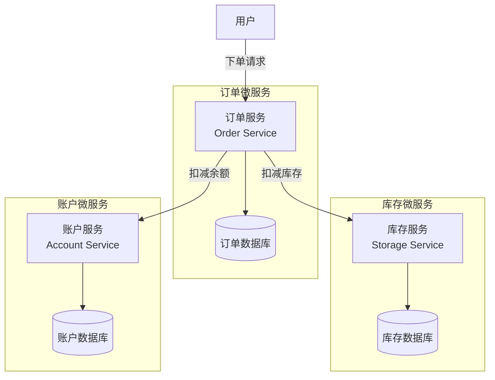

{: .no_toc }

<details close markdown="block">
  <summary>
    目录
  </summary>
  {: .text-delta }
- TOC
{:toc}
</details>

## 1. 内容介绍

### 1.1 文档概要

本文讲解 **Seata 分布式事务框架**，涵盖以下知识模块：

| 知识模块      | 说明                                                                 |
| --------- | ------------------------------------------------------------------ |
| Seata基础回顾 | **Seata** 介绍、**版本选择策略**、分布式事务需求场景、**AT 模式**工作流程、微服务整合实战、常见问题排查     |
| AT 模式设计原理 | **传统 2PC 协议**三大缺陷、**Seata AT 改进思路**、**两阶段提交**机制、**undo log** 镜像与回滚 |
| 事务隔离与并发控制 | **全局锁**写隔离机制、**读写隔离**策略（读未提交/读已提交）、**脏读写防护**编码要领                   |
| 适用场景评估    | **业务特性**与**性能要求**匹配、布式事务替代方案和对比分析                                  |

本文从**基础回顾**、**原理剖析**、**隔离机制**、**适用评估**四个维度系统阐述 **Seata AT 模式**，帮助读者构建完整的**分布式事务**认知框架。

### 1.2 配套资源

#### (1) 项目源码

| 资源类型           | 说明                               | 链接                                                                                                                   |
| -------------- | -------------------------------- | -------------------------------------------------------------------------------------------------------------------- |
| **项目源码**       | Spring Cloud Alibaba 2023 完整示例代码 | [github.com/fangkun119/spring-cloud-alibaba-2023-demo](https://github.com/fangkun119/spring-cloud-alibaba-2023-demo) |
| **Postman 集合** | API 测试用例集合，便于快速验证功能              | [github.com/fangkun119/postman-workspace](https://github.com/fangkun119/postman-workspace)                           |

#### (2) 环境搭建

[Spring Cloud Alibaba上手 03：中间件环境]()

本文使用Seata 2.0.0

#### (3) 前置知识

[Spring Cloud Alibaba上手 06：Seata]()

## 2. 基础知识回顾

### 2.1 Seata 介绍

**Seata**（Simple Extensible Autonomous Transaction Architecture）是阿里巴巴开源的分布式事务解决方案，致力于提供高性能且简单易用的分布式事务服务。

**工作原理**

| 维度       | 说明                                 |
| -------- | ---------------------------------- |
| **应用场景** | 微服务架构中，一次业务操作需要跨多个服务访问不同下游服务作为数据源  |
| **协调机制** | 通过 **TC（全局事务协调器）** 协调各服务的 **分支事务** |
| **达成目标** | 确保跨服务数据操作的 **原子性** 和 **一致性**       |

**特性概览**

| 特性维度 | 说明 |
| --- | --- |
| **核心能力** | 提供**全局事务协调**能力，通过 **AT 模式**实现业务零侵入 |
| **事务模式** | 支持 **AT、TCC、Saga、XA** 四种模式，**AT 模式**为官方推荐 |
| **技术架构** | 基于 **TC（事务协调器）**、**TM（事务管理器）**、**RM（资源管理器）** 三组件协作 |

**相关文档**

| 文档名称 | 链接 |
| --- | --- |
| 官网文档 | <https://seata.apache.org/zh-cn/docs/overview/what-is-seata/> |
| AT 模式详解 | <https://seata.apache.org/zh-cn/docs/dev/mode/at-mode> |

### 2.2 版本选择与注意事项

> **生产环境强烈建议选择稳定的 1.7.x 版本，2.0.0 版本存在较多已知问题，仅适合学习体验使用。**

#### (1) 版本选择建议

| 版本        | 适用场景         | 关键特性                                                                    | 风险提示         |
| --------- | ------------ | ----------------------------------------------------------------------- | ------------ |
| **1.7.0** | ✅ **生产环境推荐** | **AT 模式成熟**，经过大规模生产验证，支持 Spring Cloud Alibaba 2022.x                    | 风险较低         |
| **2.0.0** | ⚠️ **学习体验**  | 全新 **Remoting 协议**，支持 **Spring Boot 3.x** 和 Spring Cloud Alibaba 2023.x | 新协议稳定性和兼容性问题 |
| **2.2+**  | 🔮 **未来可用**  | 预期修复 2.0.0 的已知问题，提供更好的稳定性                                               | 建议等待社区验证后再升级 |

#### (2) 2.0.0 版本的主要问题

**2.0.0 版本**从 1.x 升级到 2.x 时引入了全新的 **Remoting 协议**，带来以下技术风险：

| 风险类型        | 具体问题                                | 生产环境影响         |
| ----------- | ----------------------------------- | -------------- |
| **配置兼容性风险** | 新协议的配置项与 1.x 版本差异较大，需重新适配配置文件 | 配置迁移成本高，易出错    |
| **协议稳定性不足** | 新 **Remoting 协议**在初期版本中 bug 频发      | 容易引发生产环境故障     |
| **版本成熟度**    | 作为 2.x 首个大版本，生态和配套工具尚在完善中         | 官方不建议在生产环境直接使用 |

#### (3) 版本兼容性对照

| **Spring Cloud 版本** | **Seata 版本** | **备注** |
| --- | --- | --- |
| 2021.0.6 | 1.7.0 | 官方建议版本 |
| Spring Boot 3.x + Spring Cloud Alibaba 2022 | 2.0.0 | 需注意兼容性 |

> **重要提醒**：使用阿里巴巴组件时，务必仔细核对与 **Spring Cloud** 的版本兼容性，避免因版本不匹配导致的兼容性问题。相关文档：<https://sca.aliyun.com/docs/2022/overview/version-explain/>

### 2.3 分布式事务需求

#### (1) 问题引入：何时需要分布式事务

**业务场景**：一次业务操作需要跨多个数据源或跨多个系统进行远程调用，就会产生分布式事务问题。

**典型场景**：**电商下单**业务涉及三个微服务的协同：



#### (2) 问题分析：无分布式事务的场景

本文通过**下单业务场景**的实际演示，验证 **Seata** 在余额不足情况下能够正确回滚库存扣减操作，从而实现分布式事务的原子性保障。

##### ① 正常流程（余额充足）

业务执行流程和数据变化追踪：

```
执行前：库存 24 个，账户余额 20 元
操作：购买 1 个商品（单价 2 元）
执行后：库存 23 个，账户余额 18 元
结果：✅ 调用成功，数据正常变更
```

##### ② 异常流程（余额不足）

业务执行流程和问题重现：

```
执行前：库存 23 个，账户余额 18 元
操作：购买 10 个商品（总价 20 元）
预期问题：余额不足，需要回滚库存扣减
实际结果：❌ 库存被扣减，账户余额不变
问题结论：数据不一致，分布式事务问题产生
```

##### ③ 本地事务 vs 分布式事务

**新需求**：下单逻辑需要保证数据一致性，当账户余额不够时，库存回滚，下单失败。

| 解决方案 | 是否可行 | 原因分析 |
| --- | --- | --- |
| **Spring 本地事务** | ❌ 不可行 | 只能解决单数据源事务，无法跨微服务 |
| **Seata 分布式事务** | ✅ 官方推荐 | 业务零侵入，支持跨服务数据一致性保障 |

#### (3) 解决方案：引入 Seata 后

引入 Seata 后：事务回滚验证

业务执行流程和事务回滚验证：

```
执行前：库存 23 个，账户余额 18 元
操作：购买 10 个商品（总价 20 元）
预期问题：余额不足，需要回滚库存扣减
实际结果：✅ 库存仍为 23 个（已回滚），账户余额不变
验证结论：✅ 事务正确回滚，分布式事务生效
```

**效果对比**：

| 对比维度      | 无分布式事务      | 引入 Seata   |
| --------- | ----------- | ---------- |
| **库存扣减**  | ✅ 扣减（数据不一致） | ❌ 回滚（数据一致） |
| **账户余额**  | ❌ 不变        | ❌ 不变       |
| **数据一致性** | ❌ 不一致       | ✅ 一致       |

### 2.4 Seata AT 模式的工作流程

#### (1) AT 模式三大角色

**Seata** 通过 **TM**、**TC**、**RM** 三大组件的紧密协作，实现全局事务的完整生命周期管理。

**组件职责与协作关系**：

| 组件 | 全称 | 核心职责 | 协作关系 |
| --- | --- | --- | --- |
| **TC** | Transaction Coordinator | **事务协调者**：维护全局和分支事务状态，驱动全局事务提交或回滚 | 驱动 RM 执行第二阶段提交或回滚；协调 TM 的全局事务状态 |
| **TM** | Transaction Manager | **事务管理器**：定义全局事务范围，开始全局事务、提交或回滚 | 通过 XID 向 TC 申请/提交/回滚全局事务 |
| **RM** | Resource Manager | **资源管理器**：管理分支事务资源，向 TC 注册分支并报告状态 | 封装数据库资源（JDBC 增强层），响应 TC 指令执行提交或回滚 |

**实战场景：电商下单业务**

以订单服务下单为例，调用库存服务扣减库存、账户服务扣减余额：

| 服务          | 角色              | 职责说明                                |
| ----------- | --------------- | ----------------------------------- |
| **订单服务**    | **TM** + **RM** | 发起全局事务（向 TC 申请 XID），正常时通知提交，异常时通知回滚 |
| **库存服务**    | **RM**          | 向 TC 注册分支后提交本地事务，响应 TC 指令执行提交或回滚    |
| **账户服务**    | **RM**          | 向 TC 注册分支后提交本地事务，响应 TC 指令执行提交或回滚    |
| **Seata服务** | **TC**          | 维护全局事务和分支事务信息，协调各分支的统一提交或回滚         |

#### (2) AT 模式工作流程

**Seata AT 模式**通过**两阶段提交**保证分布式事务一致性：**第一阶段**自动记录回滚日志并提交本地事务，**第二阶段**根据决策异步提交或回滚。

##### ① 第一阶段：注册 + 执行

**执行流程


**操作步骤**：

| 步骤 | 参与方 | 关键动作 | 说明 |
| --- | --- | --- | --- |
| **1** | **TM**（订单服务） | `@GlobalTransactional` 拦截，向 **TC** 发起 `begin` 请求 | TC 生成 **XID**（全局事务 ID）并返回给 TM |
| **2** | **TM** | 将 **XID** 通过 RPC 上下文透传给下游服务（订单、库存、账户服务） | 每个分支事务都携带 XID |
| **3a** | **RM**（订单服务） | 插入订单记录前，生成 UndoLog，注册分支事务到 TC | TC 记录分支信息，分配 **BranchId** |
| **3b** | **RM**（库存服务） | 扣减库存时，生成 UndoLog，注册分支事务到 TC | 同 3a |
| **3c** | **RM**（账户服务） | 扣减余额时，生成 UndoLog，注册分支事务到 TC | 同 3a |
| **4** | **RM** 各本地事务 | 提交本地事务（业务 SQL + UndoLog 一并提交），释放本地锁 | **数据已真实落库，但处于"可回滚"状态** |
| **5** | **TC** | 等待所有分支上报结果，记录全局事务状态 | 若全部分支一阶段成功，TC 标记为"待二阶段提交" |

**关键机制说明**：

| 机制特性 | 说明 |
| --- | --- |
| **先注册后提交** | 每个微服务**先向 TC 注册分支**，然后**再提交本地事务**（这是 AT 模式与 2PC 的关键区别） |
| **UndoLog 记录** | 在执行业务 SQL 前，记录数据的前置镜像（before image）和后置镜像（after image） |
| **本地立即提交** | 分支事务无需等待其他分支，可立即提交，释放本地锁，提升性能 |
| **上下文传递** | 全局事务 ID（XID）贯穿整个调用链路，确保事务上下文传递 |

##### ② 第二阶段：提交或回滚

**场景一：全局事务提交**

若所有分支一阶段均成功，TC 决策提交，进入异步清理流程：

**执行流程**：


**操作步骤**：

| 参与方 | 关键动作 | 说明 |
| --- | --- | --- |
| **TC** | 向 **订单 RM、库存 RM、账户 RM** 发送 `branchCommit` 请求 | RM 异步删除对应 UndoLog，释放全局锁 |
| **RM** | **订单服务**：删除订单 UndoLog<br>**库存服务**：删除库存 UndoLog<br>**账户服务**：删除账户 UndoLog<br>无需修改业务数据 | **非常轻量，纯清理操作** |

**场景二：全局事务回滚**

若有任一分支一阶段失败或 TM 触发回滚，TC 决策回滚，进入补偿流程：

**执行流程**：


**操作步骤**：

| 参与方 | 关键动作 | 说明 |
| --- | --- | --- |
| **TC** | 向 **订单 RM、库存 RM、账户 RM** 发送 `branchRollback` 请求 | 若有任一分支一阶段失败或 TM 触发回滚，TC 自动决策回滚 |
| **RM** | **订单服务**：根据 UndoLog 生成 `DELETE` 反向 SQL，删除订单记录<br>**库存服务**：根据 UndoLog 生成 `UPDATE` 反向 SQL，恢复库存数量<br>**账户服务**：根据 UndoLog 生成 `UPDATE` 反向 SQL，恢复账户余额<br>执行补偿，删除 UndoLog | **保证数据一致性，各 RM 独立执行补偿** |

**回滚细节说明**：

| 细节维度           | 说明                            |
| -------------- | ----------------------------- |
| **回滚范围**       | 只有真正提交的分支才需要执行回滚操作（如库存服务）     |
| **未提交分支**      | 未提交的分支（如订单信息、账户信息）因本地事务失败无需回滚 |
| **UndoLog 作用** | 记录了前置镜像和后置镜像，为数据恢复提供依据        |

**UndoLog 作用** ，记录了前置镜像和后置镜像，为数据恢复提供依据

| 阶段 | undo log 处理 | 作用说明 |
| --- | --- | --- |
| **一阶段** | 记录 before/after image，与业务 SQL 一并提交 | 为二阶段回滚提供数据恢复能力 |
| **二阶段提交** | 异步删除 undo log | 回滚日志已无实际用途，释放存储空间 |
| **二阶段回滚** | 根据 undo log 生成反向 SQL，恢复数据 | 将数据库状态回滚到事务开始前的状态 |

### 2.5 Seata中间件安装和配置

完整步骤实操：[Spring Cloud Alibaba上手 03：中间件环境 - 5.2 Seata安装配置](#52-安装配置)

### 2.6 微服务整合 Seata AT 模式

本文讲解微服务如何整合 **Seata AT 模式**，涵盖以下知识模块：

| 知识模块 | 说明 |
| --- | --- |
| **整合场景** | 电商下单业务，订单服务作为事务发起者，库存和账户服务作为事务参与者 |
| **事务发起者** | **订单服务**：添加 `@GlobalTransactional` 注解，开启全局事务 |
| **事务参与者** | **库存/账户服务**：添加 `@Transactional` 注解，参与分支事务 |
| **配置要点** | **undo_log 表**、**Seata 客户端配置**、**Nacos 命名空间** |

> **整合定位**：通过简单的依赖引入和注解配置，微服务即可接入 Seata 分布式事务体系，实现跨服务的数据一致性保障。

#### (1) 业务场景与角色划分

**业务场景**：用户下单时，订单服务调用库存服务扣减库存，调用账户服务扣减账户余额。

**角色划分**：

| 服务类型 | Seata 角色 | 职责说明 |
| --- | --- | --- |
| **订单服务** | **TM + RM** | 作为全局事务发起者（TM），同时管理本地资源（RM） |
| **库存服务** | **RM** | 作为事务参与者，管理库存资源的分支事务 |
| **账户服务** | **RM** | 作为事务参与者，管理账户资源的分支事务 |

#### (2) 事务发起者整合：订单服务

**整合步骤**：

| 步骤 | 操作内容 | 核心要点 |
| --- | --- | --- |
| **步骤 1** | 引入 Seata 依赖 | 添加 `spring-cloud-starter-alibaba-seata` |
| **步骤 2** | 创建 undo_log 表 | 在订单数据库中创建回滚日志表 |
| **步骤 3** | 配置 Seata 客户端 | 连接 Nacos 注册中心和配置中心 |
| **步骤 4** | 添加全局事务注解 | 在下单方法上添加 `@GlobalTransactional` |

##### ① 步骤 1：引入 Seata 依赖

在订单服务的 `pom.xml` 中添加 Seata 依赖：

```
<!-- seata 依赖-->
<dependency>
    <groupId>com.alibaba.cloud</groupId>
    <artifactId>spring-cloud-starter-alibaba-seata</artifactId>
</dependency>
```

##### ② 步骤 2：创建 undo_log 表

在订单服务对应的数据库中创建 `undo_log` 表（**仅 AT 模式需要**）：

```
-- for AT mode you must to init this sql for you business database. the seata server not need it.
CREATE TABLE IF NOT EXISTS `undo_log`
(
    `branch_id`     BIGINT       NOT NULL COMMENT 'branch transaction id',
    `xid`           VARCHAR(128) NOT NULL COMMENT 'global transaction id',
    `context`       VARCHAR(128) NOT NULL COMMENT 'undo_log context,such as serialization',
    `rollback_info` LONGBLOB     NOT NULL COMMENT 'rollback info',
    `log_status`    INT(11)      NOT NULL COMMENT '0:normal status,1:defense status',
    `log_created`   DATETIME(6)  NOT NULL COMMENT 'create datetime',
    `log_modified`  DATETIME(6)  NOT NULL COMMENT 'modify datetime',
    UNIQUE KEY `ux_undo_log` (`xid`, `branch_id`)
) ENGINE = InnoDB AUTO_INCREMENT = 1 DEFAULT CHARSET = utf8mb4 COMMENT ='AT transaction mode undo table';
ALTER TABLE `undo_log` ADD INDEX `ix_log_created` (`log_created`);
```

##### ③ 步骤 3：配置 Seata 客户端

**配置目标**：将 Seata 配置托管到 **Nacos 配置中心**，实现配置统一管理和动态更新。

> **⚠️ 重要提示**：需在 Nacos 控制台创建 Seata 专用命名空间（如 `seata`），与业务微服务隔离。确保客户端与服务端的 **namespace** 和 **group** 一致。

**Nacos 配置中心**创建 `seata-client.yml`：

```

seata:
  # seata 服务分组，要与服务端配置service.vgroup_mapping的后缀对应
  tx-service-group: default_tx_group
  registry:
    # 指定nacos作为注册中心
    type: nacos
    nacos:
      application: seata-server
      server-addr: tlmall-nacos-server:8848
      namespace: seata
      group: SEATA_GROUP

  config:
    # 指定nacos作为配置中心
    type: nacos
    nacos:
      server-addr: tlmall-nacos-server:8848
      namespace: seata
      group: SEATA_GROUP
      data-id: seataServer.properties
```

**微服务的 application.yml** 引入 seata-client.yml：

```
spring:
  config:
    import:
      - optional:nacos:${spring.application.name}.yml
      - optional:nacos:db-common.yml    #数据库公共配置
      - nacos:nacos-discovery.yml
      - optional:nacos:seata-client.yml
```

##### ④ 步骤 4：添加全局事务注解

在订单服务的下单方法上添加 `@GlobalTransactional` 注解：

```
    @GlobalTransactional(name="createOrder",rollbackFor=Exception.class)
    public Result<?> createOrder(String userId, String commodityCode, Integer count) {
```

#### (3) 事务参与者整合：库存、账户服务

**整合步骤**：

| 步骤 | 操作内容 | 与订单服务的差异 |
| --- | --- | --- |
| **步骤 1** | 引入 Seata 依赖 | 相同 |
| **步骤 2** | 创建 undo_log 表 | 相同（在各服务对应的数据库中创建） |
| **步骤 3** | 配置 Seata 客户端 | 相同 |
| **步骤 4** | 添加本地事务注解 | **使用 `@Transactional` 而非 `@GlobalTransactional`** |

> **核心区别**：事务参与者只需使用 **Spring 本地事务** `@Transactional`，Seata 会自动拦截并管理分支事务。

**步骤 4：添加本地事务注解**

在库存服务的扣减库存方法上添加 `@Transactional` 注解：

```
@Transactional
public void reduceStock(String commodityCode, Integer count)
```


#### (4) 服务启动与测试验证

##### ① 测试步骤

**测试目标**：验证 Seata 分布式事务在成功和失败场景下的正确性。

**测试场景**

| 测试场景 | 业务操作 | 预期结果 | 验证要点 |
|---------|---------|---------|---------|
| **成功场景** | 正常下单 → 扣库存 → 扣余额 | 所有操作成功，数据一致性 | ✅ 库存扣减、余额扣减、订单创建均成功 |
| **失败场景** | 下单 → 扣库存成功 → 扣余额失败 | 事务回滚，数据恢复 | ✅ 库存恢复原值、余额不变、订单未创建 |

**测试执行**

**步骤 1：准备测试数据**

```
初始状态：库存 24 个，账户余额 20 元
```

**步骤 2：执行成功场景**

```
操作：购买 1 个商品（单价 2 元）
预期结果：
  - 库存：24 → 23 ✅
  - 余额：20 → 18 ✅
  - 订单：创建成功 ✅
```

**步骤 3：执行失败场景**

```
操作：购买 10 个商品（总价 20 元）
预期结果：
  - 库存：保持不变（已回滚）✅
  - 余额：保持不变 ✅
  - 订单：创建失败 ✅
```

##### ② 异常类型问题

**问题表现**：

| 问题类型         | 具体现象                                                                                     | 生产影响                     |
| -------------- | ---------------------------------------------------------------------------------------- | ------------------------ |
| **异常信息丢失** | 事务回滚成功，但最外层代码无法捕获原始 **BusinessException**，只能捕获 **RuntimeException**                          | 业务层无法精准处理业务异常，影响用户体验      |
| **异常链断裂**  | 异常堆栈信息丢失，难以排查问题根因                                                                             | 增加故障排查难度，延长故障恢复时间         |
**详细分析**：[Seata 2.0.0 异常处理问题分析](https://blog.csdn.net/yusewuhen/article/details/137963453)

**版本建议**：

* **Seata 2.0.0** 版本存在已知问题，不建议在生产环境使用
* 具体版本参考2.2小节（版本选择与注意事项）

### 2.7 Seata 2.0 常见问题与解决

**Seata 2.0** 在生产环境中常见三类问题：**事务分组配置缺失**、**数据库连接失败**、**客户端索引越界**。以下是问题分析与解决方案。

#### (1) 事务分组配置缺失问题

**错误信息：**
```
io.seata.config.exception.ConfigNotFoundException: service.vgroupMapping.default_tx_group configuration item is required
```

**问题分析与解决思路：**

| 问题维度 | 具体说明 | 解决方案 |
| --- | --- | --- |
| **根本原因** | 客户端无法拉取 `service.vgroupMapping.default_tx_group=default` 配置，导致无法找到集群名为 `default` 的 **Seata Server** 服务 | 检查配置缺失项 |
| **排查思路 1** | 客户端事务分组配置缺失 | 检查微服务端是否配置 `seata.tx-service-group=default_tx_group` |
| **排查思路 2** | 命名空间与分组不匹配 | 检查 Server 端和 Client 端的 `namespace` 和 `group` 配置是否对应，特别注意 `seataServer.properties` 中的分组是否为 `SEATA_GROUP` |

#### (2) 数据库连接失败问题

**错误信息：**
```
com.mysql.jdbc.exceptions.jdbc4.CommunicationsException: Communications link failure
```

**问题分析与解决思路：**

| 问题维度 | 具体说明 | 解决方案 |
| --- | --- | --- |
| **根本原因** | **Seata Server** 无法连接到数据库 | 检查数据库连接配置 |
| **排查思路 1** | JDBC 配置错误 | 检查 `seataServer.properties` 中 `jdbc` 相关配置是否正确（URL、用户名、密码） |
| **排查思路 2** | 版本兼容性问题 | 检查 JDBC 驱动版本与 **MySQL** 版本是否匹配 |

#### (3) 更多问题参考

**官方 Issues 是排查问题的最佳资源**，以下是典型案例：

| 问题类型 | 错误信息 | 官方参考 |
| --- | --- | --- |
| **客户端索引越界** | `Index 0 out of bounds for length 0` | [Apache Seata #6546](https://github.com/apache/incubator-seata/issues/6546) |

## 3. Seata AT 设计原理

### 3.1 传统两阶段提交协议（2PC）

**传统两阶段提交协议（2PC，Two-Phase Commit）** 是业界处理分布式事务的经典方案，为理解 **Seata AT 模式**的改进设计提供基础参照。

#### (1) 2PC 协议工作机制

##### ① 参与方角色

共两个

| 角色     | 全称                  | 职责说明                       |
| ------ | ------------------- | -------------------------- |
| **TM** | Transaction Manager | **事务管理器**：协调全局事务的提交或回滚     |
| **RM** | Resource Manager    | **资源管理器**：管理分支事务资源（如数据库连接） |

##### ② 第一阶段：预提交（Prepare）

**TM** 通知各 **RM** 准备提交事务分支：各个 **RM** 执行 SQL 但不提交本地事务，SQL已执行但数据对外不可见，资源被锁定。

| 操作         | 说明                       |
| ---------- | ------------------------ |
| **本地事务状态** | 各 RM 执行业务 SQL，但**事务未提交** |
| **资源状态**   | **数据库连接对象未释放**，锁资源未释放    |

然后**RM** 向 **TM** 返回 prepare 成功或失败

##### ③ 第二阶段：提交或回滚（Commit/Rollback）

**TM** 根据第一阶段各 RM 的 prepare 结果，决定全局事务的最终结果：

| 场景 | TM 决策 | RM 操作 |
| --- | --- | --- |
| **全部 prepare 成功** | 全局提交 | 所有 RM 提交事务分支 |
| **任一 prepare 失败** | 全局回滚 | 所有 RM 回滚事务分支 |

**ACID 特性保障**：

> 2PC 方案下，全局事务的 **ACID 特性**（原子性、一致性、隔离性、持久性）依赖于各 **RM**（如 MySQL）的本地事务能力。各事务分支的 ACID 特性共同构成全局事务的 ACID 特性。

#### (2) 传统 2PC 的三大问题

**传统 2PC 协议**在实际应用中存在**同步阻塞**、**单点故障**、**数据不一致**三大缺陷，这正是 **Seata AT 模式**需要改进的核心痛点。

| 问题类型      | 具体表现                                                 | 严重后果                                |
| --------- | ---------------------------------------------------- | ----------------------------------- |
| **同步阻塞**  | 第一阶段 RM **锁定资源**，直到第二阶段才释放 | **资源耗尽**，系统吞吐量严重下降              |
| **单点故障**  | **TM 故障**后，参与者 RM 一直阻塞等待             | 所有 RM 处于锁定资源状态，**系统瘫痪**     |
| **数据不一致** | 第二阶段 TM 崩溃，**部分收到** commit，部分未收到     | 有的分支已提交，有的分支已回滚 → **数据不一致** |

**问题场景示例**：

```
场景：第二阶段 TM 发送 commit 请求时崩溃

步骤 1：通知订单库 RM commit ✅ 成功
步骤 2：TM 崩溃 ❌
步骤 3：库存库 RM 未收到 commit 请求，超时后回滚

结果：订单库已提交，库存库已回滚 → 数据不一致
```


### 3.2 Seata AT 两阶段的改进

#### (1) 设计思路

**Seata AT 模式**是一种改进后的**两阶段提交协议**，在保证分布式事务 **ACID 特性**的同时，实现了对业务的**零侵入**。

**实现思路：**

| 阶段 | 操作 | 特点 |
| --- | --- | --- |
| **第一阶段** | 业务数据和回滚日志在**同一个本地事务**中提交 | 立即释放锁和连接资源 |
| **第二阶段** | 根据全局事务结果，**异步**完成提交或回滚 | 高效、低延迟 |

#### (2) 环境要求

**Seata AT 模式**的运行环境要求：

| 环境要求      | 具体内容                       | 说明                        |
| --------- | -------------------------- | ------------------------- |
| **数据库支持** | 基于支持本地 **ACID 事务**的关系型数据库  | MySQL、Oracle等             |
| **访问方式**  | Java 应用必须通过 **JDBC** 访问数据库 | 因为 **RM** 是对 **JDBC** 的增强 |

#### (3) 一阶段设计

##### ① 执行流程

**一阶段**的操作流程如下图：


**核心创新**：业务数据和 **undo log** 回滚日志记录在**同一个本地事务**中提交，立即释放本地锁和连接资源。

**关键问题**：一阶段如何对业务 **SQL** 进行解析，转换成 **undo log** 并同时入库？

##### ② SQL 解析机制

**一阶段**通过对 **SQL** 的解析生成**前置镜像**和**后置镜像**，构建完整的 **undo log** 以支持后续的回滚操作。

**不同 SQL 语句的镜像生成规则：**

| SQL 类型 | 前置镜像 | 后置镜像 | 说明 |
| --- | --- | --- | --- |
| **UPDATE** | ✅ 查询原值 | ✅ 查询新值 | 完整记录变更前后状态 |
| **INSERT** | ❌ 无原数据 | ✅ 查询新值 | 记录插入的数据 |
| **DELETE** | ✅ 查询原值 | ❌ 无新数据 | 记录被删除的数据 |
| **SELECT** | ❌ 无强制性 | ❌ 无 | 查询操作不生成镜像 |

**版本差异说明：**

- **早期版本**：正常情况也需要上报分支状态
- **当前版本**：仅异常时上报，正常执行无额外上报开销

##### ③ 实例解析

仍以**订单服务**调用**库存服务**、**账户服务**为例：

**业务场景**：库存 23 个，账户余额 18 元，商品单价 2 元。购买 10 个商品导致余额不足，扣减失败触发分布式事务回滚。

**RM（库存服务）**的具体执行流程：

```
1. SQL 解析
   ↓
2. 查询前置镜像：SELECT 库存 FROM table WHERE id = ?  → 结果：23
   ↓
3. 执行业务逻辑：UPDATE table SET 库存 = 库存 - 10 WHERE id = ?
   ↓
4. 查询后置镜像：SELECT 库存 FROM table WHERE id = ?  → 结果：13
   ↓
5. 插入 undo log：INSERT INTO undo_log (before_image, after_image) VALUES (23, 13)
   ↓
6. 向 TC 注册分支事务
   ↓
7. 提交本地事务（业务表 + undo log 表一起提交）
   ↓
✅ 数据库可见：库存已从 23 变为 13
```

**断点验证：**

通过打断点实际测试，可验证一阶段的提交行为：

```
测试场景：库存 23 个，余额 18 元（不足以购买 10 个商品）

执行过程：
1. 打断点观察：库存从 23 变成 13（已扣减）
2. 余额不足触发回滚：库存从 13 恢复到 23
3. 最终结果：库存仍为 23

结论验证：✅ 第一阶段本地事务确实已提交，数据可见
```

**验证结论：**

- ✅ 一阶段本地事务**立即提交**，数据已持久化到数据库
- ✅ **undo log** 记录了完整的**前置镜像**和**后置镜像**
- ✅ 通过 **undo log** 可实现数据的**精确回滚**

#### (4) 二阶段设计

**二阶段**根据全局事务结果执行不同的清理策略：**提交异步化**实现快速完成，**回滚**通过一阶段的回滚日志进行反向补偿。

##### ① 全局事务成功

**分布式事务操作成功**，则 **TC** 通知 **RM** 异步删除 **undo log**。


**简化策略**：只需删除 **undo log**，无需其他操作。

```
TM 通知 TC 提交全局事务
    ↓
TC 通知各分支：全局提交
    ↓
分支执行：
  1. 查询 undo log
  2. 删除 undo log（已无用）
  3. 提交本地事务
    ↓
✅ 全局事务完成
```

##### ② 全局事务失败

**分布式事务操作失败**时，**TM** 向 **TC** 发送回滚请求，**RM** 通过 **XID** 和 **Branch ID** 定位回滚日志，生成反向 **SQL** 执行回滚。

**复杂策略**：需检查数据一致性，避免脏数据问题。

```
TM 向 TC 发送回滚请求
    ↓
TC 通过 XID 和 Branch ID 找到对应分支
    ↓
分支回滚执行：
  1. 查询 undo log（获取前置镜像、后置镜像）
  2. 检查当前数据库值是否与后置镜像一致
  3. 一致 → 执行反向 SQL（13 → 23）
  4. 不一致 → 抛出异常，人工介入
  5. 删除 undo log
  6. 提交本地事务
    ↓
✅ 分支回滚完成
```

##### ③ 脏数据检测机制及预防

**问题场景**：当前数据库值与后置镜像不一致

```
示例：
- undo log 记录：前置镜像 23，后置镜像 13
- 当前数据库实际值：10
- 问题分析：在全局事务期间，其他操作修改了数据（如其他服务接口扣减了库存）

处理策略：
1. 检测到脏数据
2. 回滚失败
3. 通过失败接口发送通知（邮件/定时通知）
4. 人工介入处理
```

**避免人工介入的预防措施**：

| 预防层面     | 具体措施                                             |
| -------- | ------------------------------------------------ |
| **技术保障** | **第 4 章**介绍的 **Seata 并发控制和事务隔离机制**，从技术手段上避免脏数据产生 |
| **设计编码** | 避免在全局事务期间通过其他接口操作同一资源                            |

##### ④ 源码验证

**Seata** 源码中包含复杂的判断逻辑（`dataValidationAndGoOn` 方法）：

| 判断条件 | 处理逻辑 |
| --- | --- |
| **前置镜像 = 后置镜像** | 不需要回滚（数据未实际变更） |
| **前置镜像 ≠ 后置镜像** | 查询当前数据并与后置镜像比较<br>• 当前数据 = 后置镜像 → **继续执行回滚**<br>• 当前数据 ≠ 后置镜像 → 继续比较：<br>&nbsp;&nbsp;&nbsp;&nbsp;- 当前数据 = 前置镜像 → 不需要回滚<br>&nbsp;&nbsp;&nbsp;&nbsp;- 当前数据 ≠ 前置镜像 → 抛出脏数据异常 |

> **镜像说明**：**前置镜像**（SQL 执行前的原始数据）与 **后置镜像**（SQL 执行后的新数据）

**相关源码位置（Seata 2.0.0）：**

| 核心类                         | GitHub 链接                                                                                                                                             | 关键方法                                      |
| --------------------------- | ----------------------------------------------------------------------------------------------------------------------------------------------------- | ----------------------------------------- |
| **AbstractUndoExecutor**    | [GitHub链接](https://github.com/apache/incubator-seata/blob/2.0.0/rm-datasource/src/main/java/io/seata/rm/datasource/undo/AbstractUndoExecutor.java)    | `dataValidationAndGoOn()` - 脏数据检测**核心逻辑** |
| **UndoLogManager**          | [GitHub链接](https://github.com/apache/incubator-seata/blob/2.0.0/rm-datasource/src/main/java/io/seata/rm/datasource/undo/UndoLogManager.java)          | `undo()` - 二阶段回滚总入口                       |
| **BranchUndo**              | [GitHub链接](https://github.com/apache/incubator-seata/blob/2.0.0/rm-datasource/src/main/java/io/seata/rm/datasource/undo/BranchUndo.java)              | 接口定义，理解 undo 操作抽象                         |
| **MySQLUndoDeleteExecutor** | [GitHub链接](https://github.com/apache/incubator-seata/blob/2.0.0/rm-datasource/src/main/java/io/seata/rm/datasource/undo/MySQLUndoDeleteExecutor.java) | DELETE 回滚实现示例                             |

**阅读路径：**

| 步骤    | 类/方法                                           | 内容概括               |
| ----- | ---------------------------------------------- | ------------------ |
| **1** | `BranchUndo` 接口                                | undo 操作的抽象设计       |
| **2** | `AbstractUndoExecutor.dataValidationAndGoOn()` | 掌握**脏数据检测的核心判断逻辑** |
| **3** | 具体实现类（如 `MySQLUndoDeleteExecutor`）             | 不同 SQL 类型的回滚策略     |

####  (5) 流程回顾

回顾整个 **AT 模式**两阶段的执行流程：


## 4. Seata AT 事务隔离

### 4.1 问题与解决思路

**分布式事务隔离性**面临两大挑战：

| 问题类型 | 场景描述 | 风险 |
| --- | --- | --- |
| **写写冲突** | 两个全局事务同时修改同一数据 | 脏写、数据覆盖 |
| **读写冲突** | 事务修改过程中，其他事务读取数据 | 脏读、数据不一致 |

**解决方案**：

| 隔离类型    | 核心机制                  | 实现方式                                                                     |
| ------- | --------------------- | ------------------------------------------------------------------------ |
| **写隔离** | **全局锁**实现串行化          | • 本地提交前必须先获取全局锁<br>• 持有全局锁的事务才能提交<br>• 其他事务等待或回滚，避免脏写                    |
| **读隔离** | 默认**读未提交**，可选**读已提交** | • **默认**：可读取未提交数据（性能优先）<br>• **可选**：`SELECT FOR UPDATE` + Seata 注解实现读已提交 |

> **读未提交（Read Uncommitted）**：可以读取到其他事务**未提交**的修改数据，可能读取到脏数据（Dirty Read）
>
> **读已提交（Read Committed）**：只能读取到其他事务**已提交**的数据，避免脏读问题，是大多数数据库的默认隔离级别

**本章内容**

| 小节      | 主题    | 核心内容                                |
| ------- | ----- | ----------------------------------- |
| **4.2** | 写隔离机制 | 全局锁机制、本地提交前获取规则、并发控制实例、隔离级别特性       |
| **4.3** | 读隔离机制 | 默认读未提交、`SELECT FOR UPDATE` 实现读已提交原理 |
| **4.4** | 编码要领  | 防止脏读和脏写场景下的注解选择与使用规范                |

**官方文档**

| 内容       | 链接                                                                                                                                                                                 |
| -------- | ---------------------------------------------------------------------------------------------------------------------------------------------------------------------------------- |
| **隔离机制** | [https://seata.apache.org/zh-cn/docs/overview/what-is-seata/#%E5%86%99%E9%9A%94%E7%A6%BB](https://seata.apache.org/zh-cn/docs/overview/what-is-seata/#%E5%86%99%E9%9A%94%E7%A6%BB) |
| **编码指导** | [https://seata.apache.org/zh-cn/docs/overview/faq#4](https://seata.apache.org/zh-cn/docs/overview/faq#4)                                                                           |

### 4.2 写隔离机制

#### (1) 机制介绍

**写隔离机制**：多个全局事务并发修改同一数据时，通过**全局锁**实现**串行化控制**。本地事务提交前必须先获取全局锁，未获取到则不能提交，从而避免脏写问题。

```
获取全局锁流程：
尝试获取全局锁
    ↓
成功 → 提交本地事务 → 释放本地锁
    ↓
失败（超时）→ 回滚本地事务 → 释放本地锁
```

#### (2) 原理分析

**场景设置**：两个全局事务 tx1 和 tx2 并发执行，同时更新表 A 的字段 M（初始值 1000）

##### ① **正常流程**：两个事务按序提交


| 时间点 | tx1 操作                | tx2 操作                | 全局锁状态    | 数据库值 |
| --- | --------------------- | --------------------- | -------- | ---- |
| T1  | 获取本地锁 ✅               | -                     | 未涉及      | 1000 |
| T2  | 执行 UPDATE：M = M - 100 | -                     | 未涉及      | 1000 |
| T3  | **获取全局锁 ✅**（一阶段）    | -                     | 被 tx1 持有 | 1000 |
| T4  | 提交本地事务（一阶段）         | -                     | 被 tx1 持有 | 900  |
| T5  | 释放本地锁                 | 获取本地锁 ✅               | 被 tx1 持有 | 900  |
| T6  | -                     | 执行 UPDATE：M = M - 100 | 被 tx1 持有 | 900  |
| T7  | -                     | **尝试获取全局锁 ❌**         | 被 tx1 持有 | 900  |
| T8  | -                     | 等待全局锁...              | 被 tx1 持有 | 900  |
| T9  | **二阶段提交**，释放全局锁        | -                     | 已释放      | 900  |
| T10 | -                     | **获取全局锁 ✅**（一阶段）    | 被 tx2 持有 | 900  |
| T11 | -                     | 提交本地事务（一阶段）         | 被 tx2 持有 | 800  |

##### ② **回滚流程：tx1 二阶段回滚**


当 tx1 进入**二阶段回滚**时，需要重新获取**本地锁**以执行反向补偿 SQL。此时 tx2 仍持有本地锁（正在等待全局锁），导致 tx1 的回滚暂时阻塞并持续重试。

| 步骤 | 操作 | 说明 |
| --- | --- | --- |
| **① 回滚阻塞** | tx1 二阶段回滚，尝试获取本地锁失败 | tx2 持有本地锁，tx1 无法获取 |
| **② 持续重试** | tx1 持续重试获取本地锁 | 等待 tx2 释放本地锁 |
| **③ 等待超时** | tx2 等待全局锁超时，回滚本地事务 | 达到超时时间限制 |
| **④ 释放锁** | tx2 回滚本地事务，释放本地锁 | 释放本地锁资源 |
| **⑤ 完成回滚** | tx1 成功获取本地锁，执行回滚 | 最终成功完成反向补偿 |

**执行顺序**：

| 事务 | 操作说明 |
| --- | --- |
| **tx2** | 持有本地锁，等待全局锁超时后先回滚本地事务，释放本地锁 |
| **tx1** | 等待 tx2 释放本地锁后，获取锁并完成二阶段回滚 |

> **核心保证**：全局锁确保了两个全局事务的**串行化执行**。tx1 在二阶段结束前一直持有全局锁，tx2 必须等待，因此**不会发生脏写**。

### 4.3 读隔离机制
#### (1) 机制介绍

**Seata AT 模式提供两种读隔离级别：**

| 隔离级别 | 默认状态 | 实现方式 | 数据可见性 |
| --- | --- | --- | --- |
| **读未提交** | ✅ **默认隔离级别** | 无需额外配置 | 可读取其他事务**未提交**的数据 |
| **读已提交** | 需手动实现 | **SELECT FOR UPDATE** + **全局锁注解** | 仅读取其他事务**已提交**的数据 |
##### ① 默认读未提交

**隔离级别定义：**

> **读未提交（Read Uncommitted）**：可以读取到其他事务**未提交**的修改数据

**Seata 实现：**

在数据库本地事务隔离级别为 **读已提交（Read Committed）** 或以上的基础上，Seata（AT 模式）的默认全局隔离级别是 **读未提交（Read Uncommitted）**。

**适用场景：**

- 对数据一致性要求不高的查询场景
- 高并发读取场景，允许脏读

##### ② 实现读已提交

**隔离级别定义：**

> **读已提交（Read Committed）**：只能读取到其他事务**已提交**的数据

**实现方式：**

通过 **SELECT FOR UPDATE** 语句配合全局锁注解，实现读已提交隔离。

| 实现方式 | 注解组合 | 适用场景 | 核心机制 |
| --- | --- | --- | --- |
| **方式 1** | `@GlobalLock` + `@Transactional` | 只需读取已提交数据，无需完整分布式事务 | 查询时获取全局锁，确保读到已提交数据 |
| **方式 2** | `@GlobalTransactional` | 需要全局事务保护的业务场景 | 在全局事务中查询，自动获取全局锁 |

**代码示例**：

```java
// 方式 1：@GlobalLock + @Transactional（轻量级方案，只需读取已提交数据）
@GlobalLock
@Transactional
public void method1() {
    // 查询时带上 for update，会获取全局锁
    SELECT * FROM table WHERE id = 1 FOR UPDATE;

    // 只有获取到全局锁后才能继续执行
    // 确保读到的是全局事务已提交的数据
}

// 方式 2：@GlobalTransactional（完整全局事务保护）
@GlobalTransactional
public void method2() {
    // 查询时带上 for update，会获取全局锁
    SELECT * FROM table WHERE id = 1 FOR UPDATE;

    // 只有获取到全局锁后才能继续执行
    // 确保读到的是全局事务已提交的数据
}
```


#### (2) 原理分析

##### ① 执行机制

当业务需要保证全局的**读已提交**隔离级别时，**Seata** 通过拦截 **`SELECT FOR UPDATE`** 语句实现。


**核心机制**：**Seata JDBC 层**在执行 **`SELECT FOR UPDATE`** 前，先申请**全局锁**。

| 执行步骤 | 操作说明 | 处理结果 |
| --- | --- | --- |
| **① 拦截并申请全局锁** | **JDBC 代理层**向 **TC** 申请全局锁 | 成功：继续执行<br>失败：进入等待 |
| **② 全局锁冲突处理** | 全局锁被持有，释放本地行锁 | 回滚本地 `SELECT FOR UPDATE` |
| **③ 重试机制** | 以**本地事务**为单位持续重试 | 持续重试直到获取全局锁 |
| **④ 获取成功并返回** | 执行查询并返回结果 | 返回已提交的数据 |

##### ② 设计原则

**设计权衡**：**Seata JDBC 代理层**仅对 **`SELECT FOR UPDATE`** 进行全局锁校验，普通查询不涉及全局锁，以保诖性能。

| 设计维度 | 策略 | 原因 |
| --- | --- | --- |
| **代理范围** | 仅拦截 `SELECT FOR UPDATE` | 平衡一致性与性能，避免所有查询阻塞 |
| **阻塞策略** | 等待全局锁释放（可配置超时） | 确保读取到已提交数据 |
| **适用场景** | 强一致性读取需求 | 按需使用，不影响默认读未提交的高性能 |

##### ③ 关键理解

**思考问题**：Seata AT 模式的隔离级别是读已提交还是读未提交？

**正确回答**：需要从**两个视角**理解

| 视角 | 隔离级别 | 说明 |
| --- | --- | --- |
| **本地事务（分支）** | 读已提交 | 分支事务提交后，其他事务可读到已提交数据 |
| **全局事务** | **默认**读未提交 | 全局事务未提交时，已提交的分支数据对其他全局事务可见 |

> **关键点**：必须明确是从**本地事务角度**还是**全局事务角度**，单独说任何一个都是不准确的。

### 4.4 编码要领

#### (1) 目标与难点

**目标**：使用 Seata 框架保证分布式事务的隔离性。

**难点**：Seata AT 模式在一阶段提交本地事务后，数据库默认隔离级别无法防止脏读和脏写，需引入额外机制加强隔离。

#### (2) 防止脏读

**目标**：防止**读取**到其他事务**未提交**的数据（**胀读**）。

根据是否需要分布式事务，有两种方案：

| 场景        | 场景说明                              | 实现方式                                                   | 核心机制                |
| --------- | --------------------------------- | ------------------------------------------------------ | ------------------- |
| 事务调用链中读操作 | 方法已在 **@GlobalTransactional调用链**中 | `SELECT ... FOR UPDATE`                                | 全局事务自动获取全局锁 + 本地锁   |
| 独立读操作     | 无需分布式事务，只需读取已提交数据                 | `@GlobalLock + @Transactional + SELECT ... FOR UPDATE` | 仅校验全局锁，不生成 XID，性能更优 |

**核心差异**：`@GlobalLock` 只校验全局锁（**不生成 XID、不注册分支、不提交**），开销远低于完整全局事务。

#### (3) 防止脏写

**目标**：防止**修改**其他事务**未提交**的数据（**脏写**）。

| 场景        | 场景说明                              | 实现方式                               |
| --------- | --------------------------------- | ---------------------------------- |
| 事务调用链中写操作 | 方法已在 **@GlobalTransactional调用链**中 | 普通的 `@Transactional` 即可            |
| 独立写操作     | 方法独立于任何分布式事务，但需修改数据               | **必须添加 `@GlobalTransactional` 注解** |

**核心机制**：Seata AT 模式通过**全局锁**实现写隔离，防止脏写。本地事务提交前必须先获取全局锁，若数据已被其他全局事务锁定，则等待或超时回滚。

**写操作约束**：UPDATE/INSERT/DELETE 操作必须记录 `undo_log` 才能支持二阶段回滚，因此必须在全局事务（`@GlobalTransactional`）中执行，**不能**使用仅适用于读操作的 `@GlobalLock`。

#### (4) 对比说明

##### ① 调用链判断标准

**核心判据**：XID（全局事务 ID）能否传递到当前方法。

**包含范围**：

| 调用类型 | 说明 | XID 传递方式 |
| --- | --- | --- |
| **单机方法调用** | 同一服务内的方法嵌套调用 | 通过线程上下文传递 |
| **跨服务 RPC 调用** | 微服务之间的远程调用 | 通过 RPC 框架自动透传 |

##### ② 注解选择策略

根据**操作类型**和**调用链状态**，选择合适的注解组合：

**决策树**：

```
是否在全局事务调用链中？
├─ 是 → XID 已存在
│  ├─ 读操作 → SELECT ... FOR UPDATE
│  └─ 写操作 → @Transactional
│
└─ 否 → XID 不存在
   ├─ 读操作（需要读到已提交数据） → @GlobalLock + @Transactional + FOR UPDATE
   └─ 写操作（必须回滚） → @GlobalTransactional
```

**关键约束**：

| 维度 | 说明 |
| --- | --- |
| **写操作** | UPDATE/INSERT/DELETE **必须**在全局事务中执行（需记录 `undo_log` 支持回滚） |
| **读操作** | 默认读未提交，需要读已提交时使用 `FOR UPDATE` 配合全局锁机制 |

##### ③ 注解特性对比

| 注解 | 适用场景 | 支持操作 | 分支注册 | 回滚能力 | 性能开销 |
| --- | --- | --- | --- | --- | --- |
| **@GlobalTransactional** | 完整分布式事务业务流程 | 读 + 写 | ✅ 是 | ✅ 两阶段回滚 | **较高** |
| **@GlobalLock** | 仅需读取已提交数据的场景 | **仅读**（SELECT FOR UPDATE） | ❌ 否 | ❌ 无需回滚 | **较低** |

> **性能差异原因**：`@GlobalTransactional` 需生成 XID、注册分支、执行两阶段提交，而 `@GlobalLock` 仅校验全局锁，不注册分支事务。

## 5. Seata AT 适用评估

### 5.1 适用场景评估

**评估框架**：从**业务特性**、**性能指标**、**成本约束**三个维度综合评估 Seata AT 模式的适用性。

| 场景特征 | 适用性判断 | 评估依据 | 实施建议 |
| --- | --- | --- | --- |
| **简单业务逻辑** | ✅ **推荐使用** | 逻辑清晰、性能要求不高、快速交付 | 大多数企业场景，**直接采用 AT 模式** |
| **高性能要求** | ⚠️ **谨慎评估** | 高并发、低延迟要求，Seata 存在锁竞争和 RPC 开销 | 评估性能指标，**优先考虑 RocketMQ 等替代方案** |
| **复杂分布式事务** | ⚠️ **综合评估** | 业务复杂度高，需权衡 AT/TCC/Saga 多种模式 | 根据场景选择 **AT（简单）/TCC（性能）/Saga（长事务）** |

> **关键决策点**：如果**性能不是瓶颈**，优先选择 **Seata AT 模式**；如果**性能是核心要求**，则考虑**消息队列**或**架构优化**。

### 5.2 分布式事务替代方案

分布式事务并非唯一解决方案。根据**业务特性**和**性能要求**，可通过**消息队列**实现异步解耦，或从**架构设计**层面避免分布式事务。

#### (1) 方案对比分析

从**技术原理**、**性能表现**、**应用场景**三个维度系统对比：

| 对比维度 | **Seata AT 模式** | **RocketMQ 事务消息** | **业务设计优化** |
| --- | --- | --- | --- |
| **核心技术** | 改进的**两阶段提交协议** | **两阶段提交** + **消息队列** | 从**架构设计**避免分布式事务 |
| **实现难度** | **低**（业务代码零侵入） | **中**（需处理消费幂等性） | **高**（需重构业务流程） |
| **性能开销** | **中等**（全局锁 + RPC 通信） | **低**（异步解耦，高吞吐） | **几乎为零**（无额外组件） |
| **一致性保障** | **强一致性**（实时生效） | **最终一致性**（短暂延迟） | **强一致性**（本地事务） |
| **典型场景** | 业务简单、一致性要求高 | **异步业务**、**高并发**场景 | 业务流程可调整 |
| **主要优势** | 开箱即用、开发成本低 | **高性能**、**服务解耦** | **彻底解决**、无运维成本 |
| **适用限制** | 存在性能开销 | 实现复杂、需 MQ 基础设施 | 灵活性受限、需业务配合 |

> **关键理解**：三种方案无绝对优劣，需根据**业务阶段**（快速交付 vs 长期优化）、**性能要求**（一般 vs 极致）、**团队能力**综合选择。

#### (2) 选型决策流程

```
能否通过业务设计避免分布式事务？
├─ ✅ 是 → **业务设计优化**（无分布式事务开销）
│
└─ ❌ 否 → 继续评估
    │
    ├─ 性能要求高？
    │  ├─ ✅ 是 → **RocketMQ 事务消息**（异步解耦）
    │  └─ ❌ 否 → 继续评估
    │     │
    │     ├─ 业务逻辑简单？
    │     │  ├─ ✅ 是 → **Seata AT 模式**（开箱即用）
    │     │  └─ ❌ 否 → **评估 TCC/Saga 模式**
```

**决策说明**：优先考虑**业务设计优化**，其次根据**性能要求**选择技术方案，最后根据**业务复杂度**确定具体模式。

#### (3) 场景化选型建议

##### ① 高并发场景

**适用特征**：**高并发**、**低延迟**要求（如秒杀、大促）

| 推荐方案              | 核心价值       | 实施要点      |
| ----------------- | ---------- | --------- |
| **RocketMQ 事务消息** | 异步解耦、高吞吐   | 确保消息幂等性消费 |
| **业务流程优化**        | 从源头避免分布式事务 | 重构业务流程    |

##### ② 快速交付场景

**适用特征**：**业务逻辑清晰**、**性能要求不高**、**时间紧迫**

| 推荐方案            | 核心价值       | 实施要点         |
| --------------- | ---------- | ------------ |
| **Seata AT 模式** | 业务零侵入、快速上线 | 关注性能监控，后续可优化 |

> **注意**：避免过度设计，并非所有业务都需要极致性能。

##### ③ 通用选型原则

| 评估维度 | 决策标准 | 推荐方案 |
| --- | --- | --- |
| **业务复杂度** | 逻辑简单 vs 复杂 | Seata AT vs TCC/Saga |
| **性能要求** | 一般 vs 极致 | Seata AT vs RocketMQ |
| **团队能力** | 消息队列 vs 分布式事务掌握度 | 选择团队熟悉的方案 |
| **时间成本** | 快速交付 vs 长期优化 | Seata AT vs 架构优化 |

> **核心原则**：**分布式事务是最后的手段**，优先从**业务设计层面**解决问题。

## 6. 总结

本文介绍 **Seata 分布式事务框架**，从**基础实战**、**设计原理**、**隔离机制**、**适用评估**四个维度展开：

| 学习层次     | 核心收获                                                                                                                            |
| -------- | ------------------------------------------------------------------------------------------------------------------------------- |
| 加深理解 | 理解 **Seata** 三大角色协作机制，掌握 **AT 模式两阶段设计**（本地事务立即提交、二阶段异步提交或回滚），了解 **全局锁写隔离**与 **SELECT FOR UPDATE 读隔离**原理                         |
| 实战指导 | 掌握 **@GlobalTransactional** 与 **@GlobalLock** 注解使用，理解 **undo log** 镜像机制与脏数据检测策略，能够排查 **Seata 2.0.0 常见问题**（事务分组配置、数据库连接、客户端索引越界） |
| 选型参考 | 理解 **Seata 版本选择策略**（1.7.0 生产稳定 vs 2.0.0 学习体验），了解 **分布式事务替代方案**（**RocketMQ 事务消息**、**业务设计优化**），能够根据**业务特性**与**性能要求**选择合适方案        |
