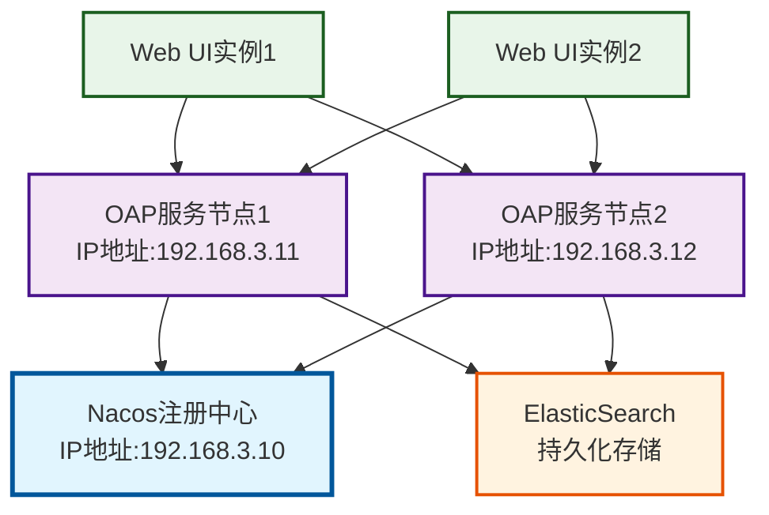

{: .no_toc }

<details close markdown="block">
  <summary>
    目录
  </summary>
  {: .text-delta }
- TOC
{:toc}
</details>

## 1. 介绍

### 1.1 内容概要

本文讲解 **SkyWalking 分布式链路追踪**的常用配置与实战应用，涵盖以下知识模块：

| 知识模块        | 说明                                                  |
| ----------- | --------------------------------------------------- |
| **原理与组成**   | SkyWalking 四大组件（Agent、OAP、Storage、UI）及数据流转过程        |
| **日志框架集成**  | 与 Logback、Log4j 等日志框架整合，实现 Trace ID 自动输出与 gRPC 日志上报 |
| **自定义链路追踪** | 使用 `@Trace` / `@Tag` 注解将业务方法纳入追踪链路                  |
| **报警通知**    | 配置报警规则，通过 **Webhook** 回调将告警转发至通知渠道                  |
| **数据持久化**   | 将存储从 H2 切换为 **ElasticSearch**，实现链路数据持久化             |
| **集群部署**    | 多 OAP 实例注册到 Nacos，实现故障转移与水平扩展                       |

本文从**环境搭建**、**常用配置**、**报警通知**、**持久化与集群部署**四个维度系统介绍 SkyWalking 的实战配置，帮助读者构建完整的**链路追踪**能力。建议先完成 SkyWalking 新手入门课程，建立基础认知后再学习本文。

### 1.2 配套资源

#### (1) 配套代码

| 资源类型     | 链接                                                                                                         |
| -------- | ---------------------------------------------------------------------------------------------------------- |
| **示例代码** | [spring-cloud-alibaba-2023-skywalking](https://github.com/fangkun119/spring-cloud-alibaba-2023-skywalking) |

#### (2) 前置知识

| 知识类型 | 链接 |
| --- | --- |
| **环境配置** | [Spring Cloud Alibaba上手 03：中间件环境]() |
| **快速上手** | [Spring Cloud Alibaba上手 09：SkyWalking]() |

#### (3) 应用版本

本文使用以下应用版本：

| 组件 | 版本 | 说明 | 下载链接 |
| --- | --- | --- | --- |
| **apache-skywalking-apm**        | 10.0.1 | OAP 服务 + Web UI | `apache-skywalking-apm-10.0.1.tar.gz`                 |
| **apache-skywalking-java-agent** | 9.3.0  | 微服务数据采集探针       | `apache-skywalking-java-agent-9.3.0.tgz`) |

## 2. 基础回顾

### 2.1 原理与组成

#### (1) 概述

**SkyWalking** 是 Apache 基金会下的**应用性能监控（APM）** 工具，适用于微服务、云原生及容器化（Docker、K8s、Mesos）环境，提供以下功能：

| 功能        | 说明                  |
| --------- | ------------------- |
| **分布式追踪** | 记录请求从入口到底层服务的完整调用链路 |
| **度量聚合**  | 收集并展示服务、实例、端点的性能指标  |
| **可视化**   | 将追踪数据与度量数据以仪表盘形式呈现  |

官网：[https://skywalking.apache.org/](https://skywalking.apache.org/)

#### (2) 为什么需要全链路追踪

在**微服务**场景中，一次用户请求往往经过**多个服务**，调用链路较长。当某个环节出现延迟或异常时，仅靠**日志**难以快速定位问题来源。


**全链路追踪**通过对请求经过的每一个环节进行记录，帮助开发者：

| 能力 | 说明 |
| --- | --- |
| **追踪调用关系** | 查看请求经过了哪些**服务**、每个服务的**耗时** |
| **定位问题节点** | 在**链路**中直接找到**延迟高**或**报错**的服务 |
| **分析性能瓶颈** | 发现**耗时较长**的调用，为优化提供依据 |

#### (3) SkyWalking 组成


如上图，SkyWalking 由四个部分组成：

| 部分          | 组件               | 职责      | 说明                                                     | 技术实现                                  |
| ----------- | ---------------- | ------- | ------------------------------------------------------ | ------------------------------------- |
| **Agent**   | SkyWalking Agent | 数据采集    | 从应用中收集追踪数据，发送给 **OAP** 服务器                             | Java Agent 探针或 Service Mesh 集成        |
| **OAP**     | SkyWalking OAP   | 数据处理与查询 | 接收 Agent 数据，经分析内核处理后存储，并对外提供查询接口                       | **gRPC** 协议，开放监听端口（默认是 11800）供微服务上报数据 |
| **Storage** | Storage          | 数据持久化   | 存储追踪与度量数据，支持 **ES**、**MySQL**、TiDB、H2 等（生产环境推荐 **ES**） | 默认使用 H2，可选 ElasticSearch、MySQL、TiDB   |
| **UI**      | SkyWalking UI    | 可视化界面   | 提供链路查询、服务监控等 Web 界面                                    | 调用 OAP 的查询端口（默认是 18180）生成监控报表         |

### 2.2 环境搭建

#### (1) 章节说明

本节简要回顾 **SkyWalking OAP** 与 **Web UI** 的环境搭建步骤。

详细内容请参见 [Spring Cloud Alibaba 上手 03：中间件环境](#7-skywalking-链路追踪) “**SkyWalking 链路追踪**” 章节。

#### (2) 下载 SkyWalking

SkyWalking 环境搭建需要下载两个组件：**OAP 服务**（可观测性分析平台）和 **Web UI**（可视化界面），两者打包在同一个发行包中，Agent 探针需要单独下载。

下载地址：[https://skywalking.apache.org/downloads/](https://skywalking.apache.org/downloads/)

> **版本信息**：参见[上文表格](#3-应用版本)

#### (3) 启动 SkyWalking OAP

##### ① 文件解压

解压`apache-skywalking-apm-10.0.1.tar.gz`，得到`apache-skywalking-apm-bin`目录

```bash
_______________________________________________________
$ /KendeMacBook-Air/ ken@KendeMacBook-Air.local:~/Code/mid-wares/
$ ls | grep apache-skywalking-apm
apache-skywalking-apm-10.0.1.tar.gz
apache-skywalking-apm-bin

_______________________________________________________
$ /KendeMacBook-Air/ ken@KendeMacBook-Air.local:~/Code/mid-wares/apache-skywalking-apm-bin/
$ find . -type f | grep -E "application.yml|webapp.yml"
./tools/data-generator/config/application.yml
./tools/profile-exporter/application.yml
./config/application.yml   # <- OAP服务配置
./webapp/application.yml   # <- Web UI配置
```

##### ② 配置调整

| 配置项      | 默认值     | 说明                                              |
| -------- | ------- | ----------------------------------------------- |
| OAP 配置   | H2 数据库  | 先使用默认存储，无需修改 `config/application.yml`           |
| WebUI 配置 | 8080 端口 | 如需修改（如改为 **18080**），编辑 `webapp/application.yml` |


##### ③ 启动应用

**启动脚本：**

在 `apache-skywalking-apm-bin/bin/` 目录下，Mac 使用 `startup.sh`：

```bash
_______________________________________________________
$ /KendeMacBook-Air/ ken@KendeMacBook-Air.local:~/Code/mid-wares/apache-skywalking-apm-bin/
$ ls bin/startup*  
bin/startup.bat bin/startup.sh
```

**启动服务：**

```bash
_______________________________________________________
$ /KendeMacBook-Air/ ken@KendeMacBook-Air.local:~/Code/mid-wares/apache-skywalking-apm-bin/
$ bash bin/startup.sh


```

命令参考：[start_all.sh](https://github.com/fangkun119/spring-cloud-alibaba-2023-demo/blob/main/midwares/dev/local/start_all.sh)

##### ④ 查看进程和日志

启动后会运行两个进程：

```bash
_______________________________________________________
$ /KendeMacBook-Air/ ken@KendeMacBook-Air.local:~/Code/mid-wares/apache-skywalking-apm-bin/
$ jps
16849 MainKt
22211 OAPServerStartUp
22228 Jps
715 Main
22223 ApplicationStartUp
```

对应关系如下

| 进程                 | 应用                        | 说明      | 端口                      |
| ------------------ | ------------------------- | ------- | ----------------------- |
| OAPServerStartUp   | **skywalking-oap-server** | 数据接收与分析 | 11800（数据采集）、12800（前端查询） |
| ApplicationStartUp | **skywalking-web-ui**     | 可视化界面   | 默认 8080                 |

日志文件

```bash
$ /KendeMacBook-Air/ ken@KendeMacBook-Air.local:~/Code/mid-wares/apache-skywalking-apm-bin/
$ ls -t /Users/ken/Code/mid-wares/apache-skywalking-apm-bin/logs/ | head -n4
skywalking-oap-server.log
skywalking-webapp.log
webapp-console.log
oap.log
```
##### ⑤ 访问UI

启动后访问 Web UI：`http://localhost:8080/`（如端口已改为 18080，则访问 `http://localhost:18080/`）


### 2.3 探针配置

#### (1) 章节说明

本节简要回顾微服务接入 **SkyWalking Agent** 探针的配置方式。

详细内容请参见 [Spring Cloud Alibaba 上手 10：SkyWalking]()。

#### (2) 微服务整合

##### ① 配置项介绍

微服务需要整合 **SkyWalking Agent** 探针，将采集的监控数据上报至 **SkyWalking OAP**。

具体通过 **JVM 启动参数** 配置，共需设置三项：

| 参数                                      | 说明                                                                                            |
| --------------------------------------- | --------------------------------------------------------------------------------------------- |
| `-javaagent`                            | 指定 Agent 探针包路径。示例：<br>`-javaagent:~/Code/mid-wares/skywalking-agent/skywalking-agent.jar`     |
| `-DSW_AGENT_NAME`                       | 指定服务名称，用于 UI 中标识微服务。示例：<br>`-DSW_AGENT_NAME=tlmall-user`                                      |
| `-DSW_AGENT_COLLECTOR_BACKEND_SERVICES` | 指定 **OAP** 服务地址。示例：<br>`-DSW_AGENT_COLLECTOR_BACKEND_SERVICES=tlmall-skywalking-server:11800` |

完整配置示例：

```bash
-javaagent:~/Code/mid-wares/skywalking-agent/skywalking-agent.jar
-DSW_AGENT_NAME=tlmall-user
-DSW_AGENT_COLLECTOR_BACKEND_SERVICES=tlmall-skywalking-server:11800
```

> **数据流转过程**：微服务启动后，**Agent** 采集链路数据并推送到 **OAP** 的 11800 端口 → **OAP** 将数据存储到持久层（默认 **H2**） → 用户通过 **Web UI** 查看监控数据。
##### ② 整合示例

详见 [3.1 整合 SkyWalking 探针](#31-整合-skywalking-探针)。

### 2.4 常见问题

#### (1) UI 中看不到网关服务的数据

**原因**：Gateway 插件默认未启用，需要将 **Agent** 包下的 `optional-plugins` 中对应插件手动拷贝到 `plugins` 目录。

```bash
cp optional-plugins/apm-spring-cloud-gateway-4.x-plugin-9.3.0.jar plugins/
```

#### (2) 网关服务不打印 traceId

网关服务整合日志框架后无法输出 **traceId**。

这是一个已知问题，详见：[#10509](https://github.com/apache/skywalking/issues/10509)。

## 3. 常用配置

### 3.1 整合 SkyWalking 探针

#### (1) 项目说明

以 [tlmall-user-skywalking-demo](https://github.com/fangkun119/spring-cloud-alibaba-2023-skywalking/tree/main/skywalking/tlmall-user-skywalking-demo) 为例，演示 **SkyWalking Agent** 的配置。项目提供 **UserController** 接口用于测试：

| 接口 | 说明 |
| --- | --- |
| `/users` | 获取用户列表 |
| `/users/{id}` | 根据用户 ID 获取用户信息 |

测试地址：`http://localhost:8000/users`

#### (2) 数据库准备

首先在 **MySQL** 中创建名为 `tlmall-user` 的 Schema，并使用脚本 [user.sql](https://github.com/fangkun119/spring-cloud-alibaba-2023-skywalking/blob/main/skywalking/tlmall-user-skywalking-demo/sql/user.sql) 建表和导入数据。

```bash
mysql -u root -p < skywalking/tlmall-user-skywalking-demo/sql/user.sql
```

通过 MySQL Workbench 确认数据表：


#### (3) 添加探针 JVM 参数

将 **SkyWalking Agent** 整合到 [spring-cloud-alibaba-2023-skywalking](https://github.com/fangkun119/spring-cloud-alibaba-2023-skywalking) 的用户服务（[tlmall-user-skywalking-demo](https://github.com/fangkun119/spring-cloud-alibaba-2023-skywalking/tree/main/skywalking/tlmall-user-skywalking-demo)）中，在服务的 **JVM 启动参数** 里添加探针配置。


#### (4) 验证

启动服务，触发一次用户请求：


在 **SkyWalking UI** 中确认链路数据已正常采集：


### 3.2 日志框架集成

#### (1) 介绍

SkyWalking 支持与主流日志框架集成，在日志中自动添加 **Trace ID**，实现日志与链路的关联查询。

在[官方文档](https://skywalking.apache.org/docs/skywalking-java/latest/en/setup/service-agent/java-agent/application-toolkit-logback-1.x/)可以看到`Log4j`，`Log4j2`和`LogBack`集成文档的链接


#### (2) 集成步骤（以 Logback 为例）

##### ① 功能概览

官方文档：[SkyWalking → Log & Trace Correction → Logback](https://skywalking.apache.org/docs/skywalking-java/latest/en/setup/service-agent/java-agent/application-toolkit-logback-1.x/)

该文档涵盖以下功能模块：

| 模块 | 作用 | 关键配置/用法 |
| --- | --- | --- |
| 基础依赖 | **SkyWalking Logback** 工具包（所有功能的前提） | Maven/Gradle 依赖：`apm-toolkit-logback-1.x` |
| 普通日志打印 traceId | 文本日志输出 traceId（未启用 tracer 时为 `TID: N/A`） | `TraceIdPatternLogbackLayout`，Pattern 中用 `%tid` |
| MDC 方式打印 traceId | 通过 MDC 输出 traceId（兼容 AsyncAppender） | `TraceIdMDCPatternLogbackLayout`，Pattern 中用 `%X{tid}` |
| 打印 SkyWalking 上下文 | 输出服务名、实例名、trace 等上下文（未启用时为 `SW_CTX: N/A`） | Pattern 中用 `%sw_ctx` 或 `%X{sw_ctx}` |
| logstash-logback 集成 | JSON 日志输出 trace/context，适合 ELK 场景 | `LogstashEncoder` + `TraceIdJsonProvider`、`SkyWalkingContextJsonProvider` |
| 自定义 JSON 格式 | 自定义 JSON 字段结构 | `LoggingEventCompositeJsonEncoder`，注册 `%tid`、`%sw_ctx` converter |
| gRPCLogClientAppender | 日志直接上报到 **OAP**/Satellite | `GRPCLogClientAppender`，可配 `log.max_message_size` |
| 传输未格式化日志 | 仅传输 pattern 与原始参数 | `plugin.toolkit.log.transmit_formatted=false` |

下面按步骤完成整合。

##### ② 步骤1：引入依赖

版本需与 [2.3 探针配置](#23-探针配置) 中使用的 **Agent** 探针保持一致（本项目为 `9.3.0`）。

推荐在 `pom.xml` 中通过属性统一管理版本：

```xml
<properties>
    <skywalking.version>9.3.0</skywalking.version>
</properties>

<dependencies>
    <dependency>
        <groupId>org.apache.skywalking</groupId>
        <artifactId>apm-toolkit-logback-1.x</artifactId>
        <version>${skywalking.version}</version>
    </dependency>
</dependencies>
```

完整代码：[pom.xml](https://github.com/fangkun119/spring-cloud-alibaba-2023-skywalking/blob/main/pom.xml)

##### ③ 步骤2：控制台输出配置

在微服务中添加 `logback-spring.xml` 文件，使用 `%tid` 占位符输出 Trace ID：

```xml
<?xml version="1.0" encoding="UTF-8"?>
<configuration>
    <appender name="console" class="ch.qos.logback.core.ConsoleAppender">
        <!-- 日志的格式化 -->
        <encoder class="ch.qos.logback.core.encoder.LayoutWrappingEncoder">
            <layout class="org.apache.SkyWalking.apm.toolkit.log.logback.v1.x.TraceIdPatternLogbackLayout">
                <Pattern>%d{yyyy-MM-dd HH:mm:ss.SSS} [%tid] [%thread] %-5level %logger{36} -%msg%n</Pattern>
            </layout>
        </encoder>
    </appender>

    <!-- 设置 Appender -->
    <root level="INFO">
        <appender-ref ref="console"/>
    </root>
</configuration>
```

完整代码：[logback-spring.xml](https://github.com/fangkun119/spring-cloud-alibaba-2023-skywalking/blob/main/skywalking/tlmall-user-skywalking-demo/src/main/resources/logback-spring.xml)

`%tid` 即 **Trace ID**，每条日志会自动携带当前请求的链路标识。

**Trace ID 的作用：**

| 作用 | 说明 |
| --- | --- |
| **日志关联** | 筛选同一请求经过的所有服务日志 |
| **问题定位** | 在 ElasticSearch 或 Kibana 中按 ID 聚合分析完整链路 |
| **异常诊断** | 链路出现异常时，快速定位具体出错环节 |

##### ④ 步骤3：gRPC 日志上报配置

SkyWalking（v8.4.0 及以上）支持通过 gRPC 将日志直接上报到 **OAP** 服务器，在 **Web UI** 中统一查看。

在 `logback-spring.xml` 中添加 `GRPCLogClientAppender`：

```xml
<appender name="grpc-log" class="org.apache.SkyWalking.apm.toolkit.log.logback.v1.x.log.GRPCLogClientAppender">
    <encoder class="ch.qos.logback.core.encoder.LayoutWrappingEncoder">
        <layout class="org.apache.SkyWalking.apm.toolkit.log.logback.v1.x.mdc.TraceIdMDCPatternLogbackLayout">
            <Pattern>%d{yyyy-MM-dd HH:mm:ss.SSS} [%X{tid}] [%thread] %-5level %logger{36} -%msg%n</Pattern>
        </layout>
    </encoder>
</appender>
```

完整代码：[logback-spring.xml](https://github.com/fangkun119/spring-cloud-alibaba-2023-skywalking/blob/main/skywalking/tlmall-user-skywalking-demo/src/main/resources/logback-spring.xml)

完成以上三步后，启动服务并触发一次请求，在 **SkyWalking UI** 中确认以下信息：

| 检查项 | 期望结果 |
| --- | --- |
| **服务名称** | `springboot-SkyWalking-demo` |
| **Trace ID** | 唯一标识本次请求的链路追踪 ID |
| **完整调用链** | 从 HTTP 接口到数据库操作的完整路径 |

可以看到TID打印在了SkyWalking的日志页面


### 3.3 集成方式说明

#### (1) 背景

SkyWalking 通过内置插件（如 **Dubbo**、**JDBC**、**Spring MVC**）自动采集**链路数据**，但对于 **Service 层、DAO 层**的**业务方法**，需要**手动集成**才能纳入追踪。

> SkyWalking 提供两种方式：通过 `TraceContext` API 获取 **Trace ID** 及关联数据，或通过 `@Trace` / `@Tag` 注解将业务方法标记为**链路节点**。

#### (2) 实现步骤

##### ① 步骤1：引入依赖

版本同样需与 [2.3 探针配置](#23-探针配置) 中使用的 **Agent** 探针保持一致（本项目为 `9.3.0`）。

推荐在 `pom.xml` 中通过属性统一管理版本：

```xml
<properties>
    <skywalking.version>9.3.0</skywalking.version>
</properties>

<dependencies>
	<!-- SkyWalking Toolkit -->  
	<dependency>  
	    <groupId>org.apache.skywalking</groupId>  
	    <artifactId>apm-toolkit-trace</artifactId>  
	    <version>${skywalking.version}</version>  
	</dependency>  
	  
	<dependency>  
	    <groupId>org.apache.skywalking</groupId>  
	    <artifactId>apm-toolkit-logback-1.x</artifactId>  
	    <version>${skywalking.version}</version>  
	</dependency>
</dependencies>
```

完整代码：[pom.xml](https://github.com/fangkun119/spring-cloud-alibaba-2023-skywalking/blob/main/pom.xml)

##### ② 步骤2：代码集成

###### 方法1：使用 TraceContext

`TraceContext` 用于在业务方法中获取当前请求的 **Trace ID**，以及绑定自定义的**关联数据**：

```java
@RestController  
@RequestMapping("/users")  
@Slf4j  
public class UserController {  
    @Autowired  
    private UserService userService;

	// …… 其它代码 ……

	@RequestMapping("")  
	public List<User> getUsers() {  
	    // TraceContext可以绑定key-value  
	    TraceContext.putCorrelation("name", "fox");  
	    Optional<String> op = TraceContext.getCorrelation("name");  
	    log.info("name = {} ", op.get());  
	  
	    // 获取跟踪的traceId  
	    String traceId = TraceContext.traceId();  
	    log.info("traceId = {} ", traceId);  
	  
	    // 返回用户列表  
	    return userService.getUsers();  
	}
}
```

**验证：** 调用 `http://localhost:8000/users`，控制台输出 **Trace ID**：


等几分钟，然后用该 **Trace ID** 在 **SkyWalking UI** 中查询，可以定位到对应的**请求链路**：


###### 方法2：使用 @Trace 和 @Tag 注解

注解用途：

| 注解 | 说明 |
| --- | --- |
| **`@Trace`** | 将方法标记为链路节点，使其出现在 **SkyWalking UI** 的调用链中 |
| **`@Tag`** | 为节点附加标签信息，如方法参数或返回值 |

在 Service 方法上添加注解：

```java
@Service  
public class UserServiceImpl implements UserService {  
    @Autowired  
    private UserMapper userMapper;  
  
    @Trace  
    @Tag(key = "users", value = "returnedObj")  
    @Override  
    public List<User> getUsers(){  
        return userMapper.list();  
    }  

	// 其它代码 …… 
}
```

完整代码：[UserServiceImpl.java](https://github.com/fangkun119/spring-cloud-alibaba-2023-demo/blob/main/microservices/tlmall-account/src/main/java/org/spcloudmvp/tlmallaccount/service/impl/AccountServiceImpl.java)

添加 `@Trace` 后，`getUsers()` 方法作为独立节点出现在调用链中：


当需要同时记录多个标签时，使用 **`@Tags`**（复数形式）包裹多个 `@Tag`：

```java
@Service  
public class UserServiceImpl implements UserService {  
    @Autowired  
    private UserMapper userMapper;  
  
    // …… 其它代码 ……
  
    @Trace  
    @Tags({  
        @Tag(key = "param", value = "arg[0]"),  
        @Tag(key = "user", value = "returnedObj")  
    })  
    @Override  
    public User getById(Integer id){  
        return userMapper.getById(id);  
    }  
}
```

完整代码：[UserServiceImpl.java](https://github.com/fangkun119/spring-cloud-alibaba-2023-demo/blob/main/microservices/tlmall-account/src/main/java/org/spcloudmvp/tlmallaccount/service/impl/AccountServiceImpl.java)

触发接口调用后，在 **SkyWalking UI** 中查看 Trace：


如上图所示，”标记”下的 `param` 和 `user` 即代码中 `@Tag` 注解配置的 key。

## 4. 报警通知配置

SkyWalking 支持基于度量指标的报警：当服务指标（响应时间、成功率等）超过预设阈值时，自动触发报警并推送到指定渠道。本节介绍**规则配置**与 **Webhook 通知**两部分。

> 官方文档：[Alarm Settings](https://github.com/apache/skywalking/blob/master/docs/en/setup/backend/backend-alarm.md)

### 4.1 功能概述

报警功能的处理流程：

| 步骤 | 说明 |
| ---- | ---- |
| **指标采集** | OAL 脚本或 MAL 聚合度量指标 |
| **阈值判断** | 按周期检查指标是否超过预设阈值 |
| **报警触发** | 满足条件时生成告警信息 |
| **渠道通知** | 通过 Webhook、gRPC 等方式推送到指定地址 |

### 4.2 报警规则配置

#### (1) 默认规则

SkyWalking 发行版自带 `alarm-settings.yml`，包含以下内置规则：

| 规则 | 条件 |
| ---- | ---- |
| **服务响应时间** | 最近 10 分钟中有 3 分钟，平均响应时间超过 1000ms |
| **服务成功率** | 最近 10 分钟中有 2 分钟，成功率低于 80% |
| **实例响应时间** | 最近 10 分钟中有 2 分钟，实例响应时间超过 1000ms |
| **数据库访问响应时间** | 最近 10 分钟中有 2 分钟，数据库访问响应时间超过 1000ms |

服务指标匹配任一规则即触发报警。

#### (2) 规则结构

`alarm-settings.yml` 主要由两部分组成：

| 配置项 | 说明 |
| ---- | ---- |
| **rules** | 定义触发报警的度量指标与判断条件（使用 MQE 表达式） |
| **hooks** | 报警回调配置，按类型分设子项（如 `webhook`、`wechat` 等），支持 HTTP 回调、企微通知等渠道 |

配置文件位于 **SkyWalking OAP** 的 `config/alarm-settings.yml` 中：


以下样例配置了一条**服务响应时间**规则：10 分钟窗口内，若有 3 次响应时间超过 1000ms，则触发报警。

```yaml
rules:
  service_resp_time_rule:
    expression: sum(service_resp_time > 1000) >= 3
    period: 10
    silence-period: 5
    message: Response time of service {name} is more than 1000ms in 3 minutes of last 10 minutes.
```

参数说明：

| 参数                              | 说明                                                                                                                           |
| ------------------------------- | ---------------------------------------------------------------------------------------------------------------------------- |
| **expression**                  | MQE（Metrics Query Expression）表达式，结果类型须为 `SINGLE_VALUE`，根操作须为比较运算（返回 `1` 触发报警，`0` 不触发），如 `sum(service_resp_time > 1000) >= 3` |
| **period**                      | 统计时间窗口（分钟），使用后端部署环境的时钟                                                                                                       |
| **silence-period**              | 报警触发后的静默期（分钟），期间不再重复告警，默认与 `period` 相同                                                                                       |
| **recovery-observation-period** | 报警恢复观察期（周期数），需连续多少个周期指标恢复正常后才判定为已恢复，默认为 `0`（即立即恢复）                                                                           |
| **message**                     | 通知消息模板，支持 `{name}` 等占位符                                                                                                      |

#### (3) 规则触发验证

###### 步骤1：模拟慢查询

```java
@RequestMapping("/info/{id}")
public User info(@PathVariable("id") Integer id) {

    try {
        Thread.sleep(2000);
    } catch (InterruptedException e) {
        e.printStackTrace();
    }

    return userService.getById(id);
}
```

###### 步骤2：触发报警

多次调用该接口，等待一段时间后在 SkyWalking UI 中查看报警信息：


### 4.3 报警通知实现

整体流程：SkyWalking 通过 **Webhook** 将报警数据 POST 到回调地址 → 回调接口接收后转发至邮件、短信、群通知等渠道。具体分为以下步骤。

#### (1) 实现回调接口

在微服务中编写一个接收报警数据的接口：

```java
@RestController  
@RequestMapping("/notify")  
public class NotifyController {  
    @RequestMapping("/alarm")  
    public String alarm(@RequestBody Object obj){  
        sendMessage();  
        return "notify successfully";  
    }  
  
    private void sendMessage(){  
        // 在这里实现报警信息发送（邮件、短信、监控处理群、……）  
        // ……  
    }  
}
```

完整代码：[NotifyController.java](https://github.com/fangkun119/spring-cloud-alibaba-2023-skywalking/blob/main/skywalking/tlmall-user-skywalking-demo/src/main/java/org/skywalkingdemo/usersvc/controller/NotifyController.java)

接口中的 `sendMessage()` 是自定义的消息分发逻辑，负责将报警信息推送到目标渠道。

#### (2) 配置 Webhook 地址

在 `config/alarm-settings.yml` 中配置回调地址，配置完成后**重启 SkyWalking** 使其生效：

```text
hooks:
  webhook:
    default:
      is-default: true
      urls:
        - http://127.0.0.1:8000/notify/alarm
```

#### (3) 验证报警推送

调用 API 触发报警后，在回调接口的日志中可以查看 SkyWalking 发送的报警数据，形如


确认日志中能收到上述数据后，再检查目标渠道（邮件、手机、群通知等）是否已收到通知。

#### (4) 版本注意事项

**10.0.1** 版本的 Webhook 报警推送存在已知 bug，生产环境建议升级到更稳定的版本。

## 5. 数据持久化（以 ElasticSearch 为例）

### 5.1 背景说明

SkyWalking 默认使用 **H2 内存数据库**存储链路数据，服务重启后数据即丢失。生产环境需要将存储切换为 **ElasticSearch** 以实现数据持久化。

> 切换存储后，OAP 启动时会在 ElasticSearch 中自动创建索引，所有链路数据写入 ElasticSearch，重启后数据不再丢失。

### 5.2 配置步骤

#### (1) 启动 ElasticSearch

安装配置好 ElasticSearch，确保 ElasticSearch 已启动并监听默认端口：

```
bin/elasticsearch -d
```

#### (2) 修改 OAP 存储配置

编辑 OAP 的 `config/application.yml`，将存储类型从 H2 切换为 ElasticSearch：

```yaml
storage:                                                    # <- 存储配置的父级键
  selector: ${SW_STORAGE:elasticsearch}                     # <- 指定ES存储数据
  elasticsearch:                                            # <- 指定ES存储数据
    namespace: ${SW_NAMESPACE:"mall"}
    clusterNodes: ${SW_STORAGE_ES_CLUSTER_NODES:localhost:9200} # <- ES配置
    protocol: ${SW_STORAGE_ES_HTTP_PROTOCOL:"http"}
    connectTimeout: ${SW_STORAGE_ES_CONNECT_TIMEOUT:30000}
    socketTimeout: ${SW_STORAGE_ES_SOCKET_TIMEOUT:30000}
    responseTimeout: ${SW_STORAGE_ES_RESPONSE_TIMEOUT:15000}
    numHttpClientThread: ${SW_STORAGE_ES_NUM_HTTP_CLIENT_THREAD:0}
    user: ${SW_ES_USER:"elastic"}                          # <- ES配置
    password: ${SW_ES_PASSWORD:"123456"}                   # <- ES配置
    trustStorePath: ${SW_STORAGE_ES_SSL_JKS_PATH:""}
    trustStorePass: ${SW_STORAGE_ES_JKS_PASS:""}
    # Secrets management file in the project
    secretsManagementFile: ${SW_ES_SECRETS_MANAGEMENT_FILE:""}
```

#### (3) 重启并验证

##### ① 重启 OAP 服务

重启后 OAP 会在 ElasticSearch 中自动创建索引。

##### ② 验证 UI 数据

访问微服务接口产生链路追踪数据，在 SkyWalking UI 中确认数据正常显示：


##### ③ 验证 ElasticSearch 索引

查看 ElasticSearch 索引，确认链路数据已写入：


再次重启 OAP 后链路数据仍保留，即说明持久化配置生效。

### 5.3 其他存储选项

除 ElasticSearch 外，SkyWalking 还支持多种存储后端：

| 存储类型 | 适用场景 | 优势 | 劣势 |
|---------|---------|------|------|
| **H2** | 开发测试 | 无需额外部署，开箱即用 | 数据存储在内存中，重启丢失 |
| **ElasticSearch** | 生产环境 | 检索性能好，支持全文搜索 | 需单独部署和维护 ES 集群 |
| **MySQL** | 中小规模 | 运维门槛低，团队熟悉 | 大数据量下查询性能受限 |
| **TiDB** | 大规模场景 | 分布式扩展，兼容 MySQL 协议 | 运维复杂度较高 |

## 6. 集群部署

### 6.1 部署概述

单节点 OAP 存在**单点故障**风险——一旦宕机，链路追踪数据将中断采集。

SkyWalking OAP 支持集群部署，将多个 OAP 实例注册到 Nacos，由注册中心完成服务发现。只要集群中仍有实例存活，追踪就不会中断。

搭建 OAP 集群需要以下组件：

| 组件 | 最低要求 | 职责 |
| --- | --- | --- |
| **Nacos** | 1 个（可搭建集群） | OAP 的服务注册与发现 |
| **ElasticSearch** | 1 个（可搭建集群） | 链路数据的持久化存储 |
| **OAP 服务** | ≥ 2 个 | 多实例共同承担数据采集与处理 |
| **Web UI** | 1 个（可多实例 + Nginx 代理） | 查询界面，连接任意 OAP 即可 |

各节点的拓扑关系如下图所示：



### 6.2 部署步骤

#### (1) 配置调整

##### ① OAP 服务配置

修改 OAP 的 `config/application.yml`，需要调整三项配置：**注册中心**、**监听端口**、**存储后端**。

###### 注册中心：指定 Nacos

```text
cluster:
  selector: ${SW_CLUSTER:nacos}
```

###### 注册中心：Nacos 连接参数

```text
nacos:
  serviceName: ${SW_SERVICE_NAME:"SkyWalking OAP Cluster"}
  hostPort: ${SW_CLUSTER_NACOS_HOST_PORT:192.168.3.10:8848}  # Nacos 地址端口
  # Nacos Configuration namespace
  namespace: ${SW_CLUSTER_NACOS_NAMESPACE:"public"}
  # Nacos auth username
  username: ${SW_CLUSTER_NACOS_USERNAME:""}
  password: ${SW_CLUSTER_NACOS_PASSWORD:""}
  # Nacos auth accessKey
  accessKey: ${SW_CLUSTER_NACOS_ACCESSKEY:""}
  secretKey: ${SW_CLUSTER_NACOS_SECRETKEY:""}
```

###### 监听端口：调整端口避免冲突（可选）

如果是在同一台机器上部署多个 OAP 实例，需要修改 `restPort` 和 `gRPCPort` 以避免端口冲突。

```text
core: 
  selector: ${SW_CORE:default}
  default:
    # Mixed: Receive agent data, Level 1 aggregate, Level 2 aggregate
    # Receiver: Receive agent data, Level 1 aggregate
    # Aggregator: Level 2 aggregate
    role: ${SW_CORE_ROLE:Mixed}  # Mixed/Receiver/Aggregator
    restHost: ${SW_CORE_REST_HOST:0.0.0.0}
    restPort: ${SW_CORE_REST_PORT:12800}  # REST 监听端口
    restContextPath: ${SW_CORE_REST_CONTEXT_PATH:/}
    restMinThreads: ${SW_CORE_REST_JETTY_MIN_THREADS:1}
    restMaxThreads: ${SW_CORE_REST_JETTY_MAX_THREADS:200}
    restIdleTimeOut: ${SW_CORE_REST_JETTY_IDLE_TIMEOUT:30000}
    restAcceptorPriorityDelta: ${SW_CORE_REST_JETTY_DELTA:0}
    restAcceptQueueSize: ${SW_CORE_REST_JETTY_QUEUE_SIZE:0}
    gRPCHost: ${SW_CORE_GRPC_HOST:0.0.0.0}
    gRPCPort: ${SW_CORE_GRPC_PORT:11800} # GRPC 端口
    maxConcurrentCallsPerConnection: ${SW_CORE_GRPC_MAX_CONCURRENT_CALL:0}
    maxMessageSize: ${SW_CORE_GRPC_MAX_MESSAGE_SIZE:0}
    gRPCThreadPoolQueueSize: ${SW_CORE_GRPC_POOL_QUEUE_SIZE:-1}
```

###### 存储后端：指定 ElasticSearch

使用 **ElasticSearch** 作为链路数据的持久化存储：

```text
storage:
  selector: ${SW_STORAGE:elasticsearch}  # 指定 ES 作为数据存储
  elasticsearch:  # ES 存储配置
    namespace: ${SW_NAMESPACE:"mall-"}  # 指定命名空间，用于生成索引
    clusterNodes: ${SW_STORAGE_ES_CLUSTER_NODES:localhost:9200}  # ES 节点地址
    protocol: ${SW_STORAGE_ES_HTTP_PROTOCOL:"http"}
    connectTimeout: ${SW_STORAGE_ES_CONNECT_TIMEOUT:30000}
    socketTimeout: ${SW_STORAGE_ES_SOCKET_TIMEOUT:30000}
    responseTimeout: ${SW_STORAGE_ES_RESPONSE_TIMEOUT:15000}
    numHttpClientThread: ${SW_STORAGE_ES_NUM_HTTP_CLIENT_THREAD:0}
    user: ${SW_ES_USER:"elastic"}
    password: ${SW_ES_PASSWORD:"123456"}  # ES 认证密码
    trustStorePath: ${SW_STORAGE_ES_SSL_JKS_PATH:""}  # SSL 证书路径
    trustStorePass: ${SW_ES_JKS_PASS:""}
    secretsManagementFile: ${SW_ES_SECRETS_MANAGEMENT_FILE:""}
```

##### ② Web UI 配置

修改 `webapp/application.yml`，在 `oapServices` 中填写多个 OAP 地址，UI 会自动轮询连接：

```text
serverPort: ${SW_SERVER_PORT:-18080}

# Comma seperated list of OAP addresses.
oapServices: ${SW_OAP_ADDRESS:-http://192.168.3.11:12800,http://192.168.3.12:12800}

zipkinServices: ${SW_ZIPKIN_ADDRESS:-http://localhost:9412}
```

端口`12800`是 SkyWalking OAP 提供的HTTP REST端口，用于Web UI查询

##### ③ 微服务 Agent 配置

微服务启动时，通过 JVM 参数指定多个 OAP 地址，即可实现**负载均衡**和**故障转移**，格式形如：

```
-DSW_AGENT_COLLECTOR_BACKEND_SERVICES=192.168.3.11:11800,192.168.3.12:11800
```

端口`11800`是 SkyWalking OAP 的 gRPC 端口，用于上报追踪数据

#### (2) 启动与验证

**节点 1**（IP地址：192.168.3.11）：

```bash
# IP地址：192.168.3.11
bash apache-skywalking-apm-bin/bin/startup.sh
```

**节点 2**（IP地址：192.168.3.12）：

```bash
# IP地址：192.168.3.12
bash apache-skywalking-apm-bin-02/bin/startup.sh
```

**验证方式**：

1. 登录 **Nacos 控制台**，确认两个 **OAP** 实例均已注册成功
2. 打开 **SkyWalking Web UI**，确认可以正常查询**链路数据**

**集群的收益**：

| 收益 | 说明 |
| --- | --- |
| **故障转移** | 单个 **OAP** 节点宕机后，**Agent** 自动切换到其他节点 |
| **负载分担** | 多个节点共同承担**数据采集**与**处理**压力 |
| **水平扩展** | 根据业务量动态增加 **OAP** 实例数量 |

## 7. 总结

本文围绕 **SkyWalking 分布式链路追踪**的实战配置，通过**基础环境搭建** + **日志框架集成** + **报警通知配置** + **数据持久化与集群部署**的完整闭环，帮助读者：

| 学习层次 | 核心收获 |
| ---- | ---- |
| **掌握链路追踪基础** | 理解 **SkyWalking** 的组成（**Agent**、**OAP**、**Storage**、**UI**）与数据流转过程，完成**微服务**接入与链路数据采集 |
| **实现日志关联与自定义追踪** | 集成 **Logback** 日志框架实现 **Trace ID** 自动输出，使用 `@Trace` / `@Tag` 注解将业务方法纳入追踪链路 |
| **配置报警与通知渠道** | 编写 `alarm-settings.yml` 报警规则，通过 **Webhook** 回调将告警转发至**邮件**、**短信**等通知渠道 |
| **完成生产级部署** | 将存储从 **H2** 切换为 **ElasticSearch** 实现数据持久化，搭建 **OAP 集群**实现**故障转移**与**水平扩展** |

