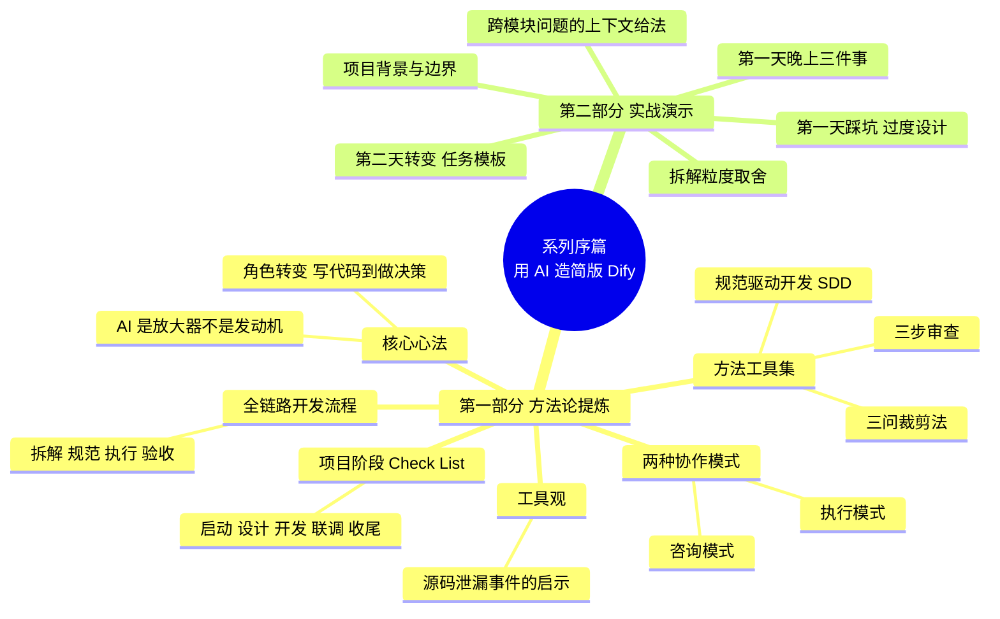

{: .no_toc }

<details close markdown="block">
  <summary>
    目录
  </summary>
  {: .text-delta }
- TOC
{:toc}
</details>

<!-- 
aicent-00-opening
AI编程方法 00：序言 - 用 AI 写简 Dify
-->

## 1. 系列序篇：用 AI 写简版 Dify

### 1.1 简版Dify


用 Claude Code，从零开始，搭建一个支持多模型管理、Agent 配置、对话交互、MCP 工具接入的 AI Agent 开发平台，叫它 **Hify**。

- **技术栈**：Spring Boot + Vue，前后端完整，本地可运行；
- **架构**：模块化单体（不引入服务注册、分布式配置等过重组件）；
- **交付标准**：覆盖核心功能链路，可对接工作中的真实场景。

本系列把过程摊开给你看——怎么做到的，哪些地方 AI 真的帮了大忙，哪些地方它帮倒忙，最后由你自己判断。

### 1.2 全文导读地图

这一篇是整个系列的序篇，也是一份**方法论速查手册的入口**。先用一张思维导图帮你快速定位：



**怎么读这一篇**：

- **想速查方法论的读者**：直接跳到 `## 2. 第一部分`，每个子节都是独立可参考的条目；
- **想理解为什么的读者**：直接跳到 `## 3. 第二部分`，跟随 Hify 项目走一遍踩坑与转变；
- **第一次接触的读者**：按顺序读完，先建立心法，再看实战。

### 1.3 谁该读这个系列


| 读者画像         | 核心诉求                      | 推荐读法                |
| ------------ | ------------------------- | ------------------- |
| 学习 AI 编程的工程师 | 系统掌握 AI 编程方法论，能独立用 AI 做项目 | 先读第一部分建框架，再读第二部分练手感 |
| 熟练的 AI 编程工程师 | 已掌握底层逻辑，快速回顾参考，Check List | 第一部分重点，第二部分按需查找     |

如果你期待的是"Claude Code 功能介绍"——教你怎么用 Hooks、怎么配 Skills、怎么写 Prompt——那这个系列可能不是十分匹配你的需求。那些内容我们会讲，但不是重点。

本系列是一套**方法论**：当你拿到一个复杂系统的需求，如何把它拆解成 AI 能准确执行的任务链，从零交付出来。所以叫做 **Claude Code 全链路开发框架**。

## 2. 第一部分 · 方法论提炼（参考手册）

> 这一部分是参考手册风：不深入技术栈，每个子节独立可查，给项目阶段速查与 Check List。
> 方法论表述必须具体可操作，不设虚泛口号。

### 2.1 核心心法：AI 是放大器，不是发动机


#### (1) 一句话心法

> **<span style="color: red; font-weight: bold;">AI 是放大器，不是发动机。你有方向它放大十倍，你没方向它放大的是零。</span>**

这句话贯穿整个系列。不是 AI 厉害，是动手之前就知道这个系统应该长什么样。

#### (2) 角色转变：从写代码到做决策

用 AI 做项目，你的角色会发生根本性转变：

| 维度       | 传统工程执行者 | AI 时代的架构师 |
| -------- | ------- | --------- |
| 主要产出     | 代码行     | 决策与规范     |
| 每天最多的事   | 写代码     | 拆解问题      |
| 衡量标准     | 写得多快    | 拆得有多准     |
| 与 AI 的关系 | 上级与补全工具 | 架构师与工程团队  |

**关键判断**：<span style="color: red; font-weight: bold;">Claude Code 就是你的工程团队，而你必须成为那个架构师</span>——决定做什么、不做什么、用什么方式做、达到什么标准。

#### (3) 判断永远在人，AI 只负责执行

哪些模块必须有、哪些功能可以砍、数据模型怎么设计——这些判断来自自身经验积累。AI 可以帮我们把判断高效地变成代码，但<span style="color: red; font-weight: bold;">判断本身是我们自己的</span>**。

| 必须由人决定                  | 可以交给 AI 执行          |
| ----------------------- | ------------------- |
| 你决定**产品边界（做什么 / 不做什么）** | 让AI**实现接口**         |
| 你决定**架构约束（单体 / 微服务）**   | 让A**I编写样板代码**       |
| 你决定**命名与错误处理规范**        | 让A**I实现和执行单元测试用例**  |
| 你决定**拆解粒度**             | 让A**I给出重构建议（需人复核）** |

### 2.2 两种协作模式：执行模式 vs 咨询模式


#### (1) 执行模式：你拆清楚让它做

**定义**：你拆清楚了让它做，你验收。

**输入特征**：

- 任务边界清晰；
- 引用规范文档（CLAUDE.md、接口规范）；
- 验收标准明确。

**典型句式**：

```text
按照 CLAUDE.md 中的接口规范，实现 X 接口，包含 Y 功能，异常按 Z 分类处理。
```

#### (2) 咨询模式：还没拆清楚先问它

**定义**：你还没拆清楚，先让它帮你梳理"这一步应该考虑什么"，你判断取舍后再让它执行。

**输入特征**：

- 开放式问题；
- 请求"考虑清单"而非"答案"；
- 多轮探讨后收敛。

**典型句式**：

```text
我准备做 X，但还没想清楚边界。请你列出在这一步我需要考虑的所有问题，不要给最终方案。
```

#### (3) 何时切换：模式选择决策表


<!--
flowchart LR
    A[接到</br/>需求] --/> B{能清晰</br/>描述验收</br/>标准吗？}
    B -- 能 --/> C[执行</br/>模式]
    B -- 不能 --/> D{知道要</br/>考虑哪些</br/>维度吗？}
    D -- 知道 --/> E[先拆解</br/>再进入</br/>执行模式]
    D -- 不知道 --/> F[咨询模式<br/>让AI列出</br/>考虑清单]
    F --/> G[你</br/>判断</br/>取舍]
    G --/> E
    E --/> C
    C --/> H[验收]
-->

| 场景 | 推荐模式 | 原因 |
|------|----------|------|
| 已有规范、需求明确 | 执行模式 | 直接出活，效率最高 |
| 新领域、不确定要考虑什么 | 咨询模式 | 避免遗漏关键维度 |
| 模块边界模糊 | 咨询模式 → 执行模式 | 先梳理再动手 |
| 跨模块联调问题 | 咨询模式 | 需要先定位根因 |

### 2.3 方法工具集

#### (1) 规范驱动开发（SDD）


##### ① SDD 的定义和载体

**定义**：用规范文档约束 AI 的所有产出，让 AI 永远在你定义的轨道上，不自由发挥。

**核心载体**（项目级规范文档）：SDD是一种理念，承载项目规范的文档

- 可以是 speckit、openspec 等 SDD 工具生成的文档
- 可以是写在本地的 project_define.md、spec.md、plan.md、task.md 等文档
- …… 可以有很多形式

SDD 的关键是如何让项目在规范的约束中进行开发，载体是它的形式，可根据项目特点和 AI Coding 工具的发展选择最合适的。

##### ② 使用 `CLAUDE.md` 作为 SDD 载体的原因

本系列**重在演示项目开发的方法论** —— 思维方法，是比SDD更加本质的内容，为了**避免被各种工具分散读者的注意力**，使用最简单的载体 —— **`CLAUDE.md`** 。

##### ③ 字段内容

根据项目和 SDD 开发工作流的不同，规范文档的内容也有差异。 Hify 项目包含的内容相对较少，主要在 CLAUDE.md 中写入以下内容：

| 字段                                    | 说明       | 示例                                            |
| ---- | -------- | --------------------------------------------- |
| 项目定位                                  | 一句话目标    | "团队内部数十人用的 Agent 平台"                          |
| 技术栈  | 语言、框架、版本 | Spring Boot 3.x、Vue 3                         |
| 架构约束 | 不可逾越的红线  | "模块化单体，禁止引入服务注册"                              |
| 命名规范 | 包/类/方法/表 | "Controller 后缀 Controller，Service 后缀 Service" |
| 接口规范 | 路径、入参、出参 | "RESTful，统一响应体 `{code, msg, data}`"           |
| 错误处理 | 异常分类与错误码 | "业务异常 / 系统异常 / 第三方异常三类"                       |
| 数据模型 | 核心表与字段   | "Provider、Agent、Conversation 等"               |

**使用要诀**：每次给 AI 下任务前，先引用 CLAUDE.md 中的相关章节，<span style="color: red; font-weight: bold;">不要让它"凭印象"发挥</span>。

##### ④ 进一步思考：从 CLAUDE.md 拆分

**拆分动机**：CLAUDE.md 一旦过于臃肿，会冲淡 AI 的注意力，需要把不同用途的内容拆分到更合适的位置。

**拆分示例**：

| 内容特征 | 归属位置 |
| --- | --- |
| 只有后端才会用到 | 后端目录的 CLAUDE.md |
| 个人专属内容（如调用笔记本上的小工具） | 个人 CLAUDE.md（非项目级） |
| 特定场景按需使用 | 封装为 SKILL 或 Shell 脚本 |
| 只关心执行结果、不需看到过程 | 封装为 Sub Agent |
| 单个项目的功能决策 | 该项目的项目文档 |
| 仅 SDD 框架相关 | 框架自身的文档 |
| …… | …… |

**判断依据**（三个问题）：

- 这些内容是给谁用的？
- 什么时候会被使用？
- 作用于代码库的哪些部分？
- ……

**核心原则**：派得上用场时会被 AI 加载；派不上用场时不会被 AI 加载。

#### (2) 三问裁剪法（拆解产品边界）


**适用阶段**：项目启动期、每个大功能开始前。

**三问公式**：

| 问题                                       | 目的           | 输出         |
| ---------------------------------------- | ------------ | ---------- |
| 做什么？    | 划定本轮必须交付的功能  | 必做清单       |
| 不做什么？   | 主动排除不属于本轮的范围 | 不做清单（同样重要） |
| 做到什么程度？ | 给每项功能定验收标准   | 验收标准清单     |

**为什么"不做什么"和"做什么"同等重要**：<span style="color: red; font-weight: bold;">AI 默认会按"通用最佳实践"补全你没说的部分，往往导致过度设计。明确"不做什么"，等于给 AI 划了红线。</span>

#### (3) 三步审查（审查 AI 输出）

**适用阶段**：每次 AI 产出代码后、合并前。

| 步骤      | 检查问题                        | 关键动作                             |
| ------- | --------------------------- | -------------------------------- |
| 第一步：查意图 | 它实现的是不是我想要的？                | 通读整体结构，对照任务描述                    |
| 第二步：查质量 | 实现得对不对？                     | 关键路径走一遍，看异常处理、边界条件               |
| 第三步：查边界 | 有没有越界？引入了不该有的依赖？扩展了不该扩展的范围？ | 对照 CLAUDE.md 红线，看是否引入服务注册、分布式配置等 |

**<span style="color: red; font-weight: bold;">三步缺一不可</span>**：只查意图会放过 bug；只查质量会漏掉架构越界；只查边界会忽略功能缺失。

### 2.4 全链路开发流程：拆解 → 规范 → 执行 → 验收

执行流程如下


拆解 （Decompose）→ 规范（Spec）→ 执行（Execution）→ 验收（Verify）

- “验收”通过：并入主线
- “验收”失败：回到“规范”

<!--
flowchart LR
    A[拆解<br/>Decompose] --/> B[规范<br/>Spec]
    B --/> C[执行<br/>Execute]
    C --/> D[验收<br/>Verify]
    D -- 不通过 --/> B
    D -- 通过 --/> E[并入</br/>主线]

    A1[三问<br/>裁剪法] -.-> A
    B1[CLAUDE.md<br/>SDD] -.-> B
    C1[执行模式 <br/> 咨询模式] -.-> C
    D1[三步<br/>审查] -.-> D
-->

每阶段关键产出如下

| 阶段  | 关键问题                    | 关键产出                  | 配套方法                                         |
| --- | ----------------------- | --------------------- | -------------------------------------------- |
| 拆解  | 这个需求分几步？每步交给 AI 的输入是什么？ | 任务清单（每个任务可独立验收）       | 三问裁剪法       |
| 规范  | AI 在哪条轨道上跑？             | CLAUDE.md 章节引用 + 接口规范 | SDD         |
| 执行  | 让 AI 一次做对               | AI 产出的代码 / 文档         | 执行模式 / 咨询模式 |
| 验收  | 它做对了吗？有没有越界？            | 通过 / 打回（带反馈）          | 三步审查        |

**核心心法**：<span style="color: red; font-weight: bold;">拆得好，AI 一次做对；拆得差，反复返工。瓶颈不在 AI 能力，在你的思考质量。</span>

### 2.5 项目阶段 Check List（可裁剪）


> 以下清单按项目阶段组织，每项可按项目实际裁剪。打印一份贴墙边，每完成一项打勾。

**启动期：定义边界与规范**

- [ ] 用三问裁剪法写一页纸产品边界（做什么 / 不做什么 / 做到什么程度）；
- [ ] 明确架构约束（单体 / 微服务，团队规模，交付周期）；
- [ ] 起草 CLAUDE.md 第一版（至少包含定位、技术栈、架构约束、命名规范、错误处理五项）；
- [ ] 列出本轮明确**不做**的功能清单（防止 AI 自由发挥）。

**设计期：让 AI 帮你梳理全景**

- [ ] 用咨询模式让 AI 列出"这一步需要考虑的所有维度"；
- [ ] 让 AI 给出 2~3 个候选方案，你来拍板（不要直接采纳第一版）；
- [ ] 设计核心数据模型（5~6 张表的 ER 图，不要过度设计）；
- [ ] 把设计决策追加到 CLAUDE.md。

**开发期：拆解粒度与拉回跑偏**

- [ ] 每个任务拆到"可独立验收的最小单元"；
- [ ] 任务描述引用 CLAUDE.md 章节号；
- [ ] 任务描述包含验收标准与异常分类；
- [ ] AI 跑偏时，先反馈"哪条规范被违反"，再让它改。

**联调测试期：跨模块问题的上下文给法**

- [ ] 跨模块问题，把相关模块的规范与边界一起喂给 AI；
- [ ] 提供"问题现象 + 复现步骤 + 已排除的可能"三件套；
- [ ] 用咨询模式让 AI 先列假设，再让你验证；
- [ ] 修复后回归测试覆盖到原失败场景。

**收尾期：复盘与抽象**

- [ ] 把本次踩坑抽象为可复用规则，追加到 CLAUDE.md；
- [ ] 检查是否有过度设计可以裁剪；
- [ ] 总结本次拆解粒度是否合适，调整下次的判据。

### 2.6 工具观：源码泄漏事件的启示


#### (1) 事件回顾：客户端泄漏，大脑未泄漏

系列上线前一天，Claude Code 出了个不大不小的新闻：

```text
- 版本：v2.1.88；
- 事故：npm 包意外带上了 60MB 的 source map 文件；
- 后果：约 51 万行 TypeScript 源码、1900 多个文件被暴露；GitHub 镜像几小时内被 fork 数万次；
- 原因：Bun 打包器默认生成 source map，发布时没在 .npmignore 里排除——一行配置的问题；
- 官方定性：人为错误导致的打包问题，不是安全漏洞，没有用户数据或密钥泄露。
```

**泄漏的是什么**：Agent 的客户端工程实现——工具调用逻辑、权限系统、上下文拼接策略、多 Agent 协作架构，以及藏在 feature flag 后面的未发布特性（如后台常驻的 KAIROS、远程规划的 ULTRAPLAN）。

**没泄漏的是什么**：Claude 模型本身的能力。这个能力来自模型训练、海量数据和算力投入，来自 Anthropic 在 AI 安全与对齐上的深层积累。**这些东西不在源码里**。

#### (2) 工具会变，方法论不会过时

这件事印证了本系列的核心判断：

| 维度 | 是否会变 | 是否可复制 |
|------|----------|------------|
| 客户端工程架构 | 会变（日更迭代） | 可复制 |
| 具体功能实现 | 会变（feature flag） | 可复制 |
| 模型能力 | 持续投入 | 不可复制 |
| **使用工具的人怎么思考** | **不变** | **不可复制** |

> 工程可以复制，模型能力不能。**<span style="color: red; font-weight: bold;">真正的壁垒不在工具怎么实现，而在模型能力，以及使用工具的人怎么思考。</span>**

51 万行源码摊开在所有人面前，Claude Code 的竞争力一点没少。恰恰相反：<span style="color: red; font-weight: bold;">工具迭代得越快，掌握底层方法的人越值钱</span>——因为只有他们能在工具更替中始终保持生产力。

这也是为什么本系列教方法论，而不是教工具使用方法。如果是教工具，源码泄漏确实会让它贬值；但教方法论，永远不会过时。

## 3. 第二部分 · 实战演示：Hify 项目从 0 到 1

> 这一部分是实战教材风：跟随 Hify 项目复现踩坑与转变，每节先复现 why，再给 how。
> 实战紧扣 Spring Boot + Vue、模块化单体、MCP、Agent 等技术栈，但不展开技术教程本身。

### 3.1 项目背景：为什么是简版 Dify

#### (1) 项目定位与技术选型

| 维度 | 选择 | 理由 |
|------|------|------|
| 项目名 | Hify | "H"+"Dify"，简版之意 |
| 目标 | AI Agent 开发平台 | 支持多模型管理、Agent 配置、对话交互、MCP 工具接入 |
| 后端 | Spring Boot | 团队熟悉、生态成熟 |
| 前端 | Vue | 与后端栈匹配，前后端完整可运行 |
| 架构 | 模块化单体 | 团队内部数十人使用，不需要微服务 |
| 部署 | 本地可运行 | 用于对接工作中的真实场景 |

#### (2) 交付的可行性来源

Hify 可以由一人短期快速交付，可行性来自三个判断：

1. **架构选对**：模块化单体，不引入服务注册、分布式配置、链路追踪等过重组件；
2. **边界画清**：覆盖核心功能链路，不追求 Dify 全部功能；
3. **方法用对**：用 Claude Code 全链路开发框架，拆解清晰、规范驱动。

要点：

> 这三点不是事后总结，而是动手前就必须想清楚的判断。**能快速交付，不是因为 Claude Code 厉害，是因为动手之前就知道这个系统应该长什么样。**

### 3.2 第一天踩坑：模糊需求导致过度设计


#### (1) 踩坑现场：一份"看起来很专业"的过度方案

第一天，我直接告诉 Claude Code：

```text
帮我设计一个 AI Agent 开发平台的后端架构，支持多模型、多 Agent、工具调用。
```

它很快给了我一个方案：

- 微服务划分清晰；
- 技术选型合理；
- 甚至画了架构图。

**看起来很专业。但我越看越觉得不对**：

- 上来就引入了**服务注册中心**；
- 引入了**分布式配置**；
- 引入了**链路追踪**；
- 整体方案像在做一个要服务百万用户的生产系统。

**而我只需要一个团队内部几十人用的平台，模块化单体就够了。**

#### (2) 复盘：三个"没有想清楚"


<!--
flowchart TD
    A[模糊大需求] --\> B[Claude Code 默认按通用最佳实践补全]
    B --\> C[过度设计的服务注册、分布式配置、链路追踪]
    C --\> D{问题出在哪？}
    D --\> E[不在 AI 身上]
    D --\> F[在我没想清楚就让它干活]
    F --\> G1[没定义产品边界]
    F --\> G2[没明确架构约束]
    F --\> G3[没给任何规范]
    G1 --\> H[AI 不知道什么不做]
    G2 --\> H
    G3 --\> H
    H --\> I[结果 过度设计]
-->

三个"没有想清楚"：

- **我没有定义清楚产品边界**：什么做、什么不做；
- **没有明确架构约束**：这是小型单人项目，不是一个要演进三年的团队项目；
- **没有给它任何规范**：命名怎么定、接口怎么设计、错误怎么处理。

**关键认知**：<span style="color: red; font-weight: bold;">它不是不能做好，是我没告诉它"好"的标准是什么</span>。AI 默认按"通用最佳实践"补全你没说的部分——而对一个单人项目，"通用最佳实践"恰恰是过度设计。

### 3.3 第一天晚上：三件事重塑协作根基


那一天我几乎没写一行代码。我花了整个晚上做三件事——这三件事成为后续整个项目的协作根基。

#### (1) 第一件：定义产品边界（一页纸）

**做法**：用三问裁剪法，一页纸写清楚：

| 三问 | Hify 的回答（示例） |
|------|---------------------|
| 做什么？ | 多模型管理、Agent 配置、对话交互、MCP 工具接入 |
| 不做什么？ | 不做多租户、不做计费、不做服务注册、不做分布式配置 |
| 做到什么程度？ | 团队内部数十人可用、本地可运行、覆盖核心链路 |

**为什么是"一页纸"**：边界必须能在一张纸上看到全貌。写多了说明还没想清楚；写少了说明细节没定。

#### (2) 第二件：设计核心数据模型（5~6 张表 ER）

**做法**：画出 5~6 张核心表的 ER 图，覆盖：

- **Provider**（模型提供商）；
- **Agent**（Agent 配置）；
- **Conversation**（会话）；
- **Message**（消息）；
- 其余几张支撑表。

**为什么是 5~6 张**：

- 太少 → 核心实体覆盖不全，开发到一半才发现要补表；
- 太多 → 又陷入过度设计的陷阱（第一天踩过的坑）。

5~6 张是"覆盖核心链路但不展开"的甜区。

#### (3) 第三件：写 CLAUDE.md（项目的全部上下文与规范）

**做法**：把项目的全部上下文与规范写进 CLAUDE.md，让 Claude Code 永远在你定义的轨道上跑。

第一版 CLAUDE.md 至少包含（参考 §2.3 字段清单）：

- 项目定位（一页纸边界）；
- 技术栈与版本；
- 架构约束（**显式禁止服务注册、分布式配置等过度设计组件**）；
- 命名规范；
- 接口规范；
- 错误处理规范；
- 核心数据模型（5~6 张表）。

**为什么这三件事是"协作根基"**：它们一起回答了 AI 最容易问错的三个问题——做什么、怎么做、做到什么标准。回答清楚了，AI 就不需要再"按通用最佳实践"猜。

### 3.4 第二天转变：清晰小任务带来质量飞跃


#### (1) 一个具体的任务下达示例

第二天，我给 Claude Code 下达的不再是模糊的大需求，而是清晰的小任务：

```text
按照 CLAUDE.md 中的接口规范，实现模型提供商（Provider）的 CRUD 接口，包含连通性测试功能，异常按错误码区分三种情况。
```

这个任务模板包含四个要素：

| 要素   | 示例中的对应                | 作用     |
| ---- | --------------------- | ------ |
| 规范引用 | "按照 CLAUDE.md 中的接口规范" | 防止自由发挥 |
| 任务边界 | "Provider 的 CRUD 接口"  | 限定范围   |
| 附加功能 | "包含连通性测试功能"           | 明确做什么  |
| 异常处理 | "异常按错误码区分三种情况"        | 给出验收标准 |

#### (2) 为什么输出质量发生了质的飞跃

它的输出质量发生了质的飞跃，**<span style="color: red; font-weight: bold;">不是因为它变聪明了，而是因为我给它的输入变清晰了</span>**。

| 维度 | 第一天（模糊大需求） | 第二天（清晰小任务） |
|------|----------------------|----------------------|
| 任务粒度 | 整个后端架构 | 一个 CRUD 接口 |
| 规范引用 | 无 | 显式引用 CLAUDE.md |
| 验收标准 | 隐式（"看起来专业"） | 显式（异常分三类） |
| 跑偏风险 | 高（自由发挥） | 低（轨道明确） |
| 返工次数 | 多 | 少 |

**核心认知**：用 Claude Code 做项目，<span style="color: red; font-weight: bold;">瓶颈从来不在 AI 的能力上，而在你的**思考质量**上</span>。你想得越清楚，它做得越准确；你越模糊，它越跑偏。

### 3.5 拆解粒度的取舍


#### (1) 粒度过大：AI 自由发挥

**症状**：一个任务覆盖多个模块、多个功能点。

**后果**：

- AI 按通用最佳实践补全你没说的部分；
- 引入过度设计；
- 验收时无法定位是哪个功能点出了问题。

**典型反例**：第一天的"设计整个后端架构"。

#### (2) 粒度过小：上下文割裂

**症状**：一个任务只覆盖一个方法、一行改动。

**后果**：

- AI 缺少整体上下文，产出支离破碎；
- 跨方法、跨类的关联被切断；
- 你需要花大量时间拼接碎片。

#### (3) 粒度判据：可独立验收的最小单元

**判据**：一个任务应该**可独立验收**——你能用一个明确的通过 / 不通过标准判断它做对了没有。

| 维度 | 判据 |
|------|------|
| 功能完整性 | 任务覆盖一个完整功能点（如一个 CRUD + 一个附加功能） |
| 验收清晰度 | 能用一句话描述验收标准（如"异常按错误码分三类"） |
| 规范可引用 | 任务能引用 CLAUDE.md 中明确的章节 |
| 跨模块性 | 任务尽量不跨模块；跨模块时按 §3.6 给上下文 |

**实操建议**：拿不准时，宁可拆细一点，但每个任务至少能引用一条 CLAUDE.md 规范。

### 3.6 跨模块问题的上下文给法


#### (1) 跨模块状态一致性：反复改不对的痛点

构建 Hify 的过程中，跨模块的状态一致性问题反复改了几轮都没改对——这是 AI 帮倒忙的典型场景之一。

**为什么 AI 在跨模块问题上容易跑偏**：

- 单模块任务时，AI 只看一个模块的代码，上下文自洽；
- 跨模块问题时，AI 默认只看"当前模块"，缺少其他模块的边界信息；
- 改了 A 模块的状态，B 模块的依赖没同步——于是改一轮错一轮。

#### (2) 上下文给法：把相关模块的规范与边界一起喂给它

**模板**（跨模块问题的上下文三件套）：

| 要素 | 内容 | 作用 |
|------|------|------|
| **相关模块的规范** | CLAUDE.md 中 A 模块和 B 模块的章节 | 告诉 AI 两个模块各自的边界 |
| **问题现象 + 复现步骤** | 在什么操作下、A 和 B 的状态如何不一致 | 让 AI 看到真实问题，而不是猜 |
| **已排除的可能** | 你已经验证过、可以排除的原因 | 避免 AI 重复走你已经走过的死路 |

**配套做法**：用咨询模式让 AI 先列出"可能的原因假设"，你逐个验证，而不是让 AI 直接给修复方案——直接给的方案往往只治标。

**核心认知**：<span style="color: red; font-weight: bold;">跨模块问题的根因往往不在“当前模块”，而在“模块之间的契约”</span>。把契约（规范）一起喂给 AI，它才能看到全局。

## 4. 收尾：成为不被工具绑定的人


### 4.1 这一系列会带你经历什么

这一系列会带你经历 Hify 从无到有的全过程。但在每个环节，我关注的不是"这个功能怎么实现"，而是**问题是怎么被拆解的**。

| 阶段   | 关注问题                                                        |
| ---- | ----------------------------------------------------------- |
| 动手之前 | 怎么让 AI 帮我梳理 Dify 的功能全景？怎么用三问裁剪法确定 Hify 的边界？怎么让它给架构方案然后我来拍板？ |
| 核心开发 | 怎么把一个大需求拆成 AI 能准确执行的小任务？拆的粒度怎么定？它跑偏了我怎么拉回来？                 |
| 基础设施 | 怎么用咨询模式让 AI 帮我发现遗漏的组件？                                      |
| 联调测试 | 当问题出在模块之间的交互而不是单个模块内部时，怎么给它足够的上下文让它定位问题？                    |

**系列全链路总览**：从认知到复盘，七大阶段一图概览。


<!--
图片：imgs/aicent-00-opening/ec1b48a79ea18a7211e1b5a38f987863_MD5.webp
用途：系列总览架构图，展示用 Claude Code 实现 Hify（简版 Dify）的七阶段全链路技术路径。
内容：垂直分层的架构图，共 7 个主要模块（从上到下），通过颜色区分层级与箭头连接：
- 第一部分 · 认知（紫色）：三层分工模型、视觉驱动开发（SDD）、CLAUDE.md 机制；
- 第二部分 · 顶层设计（绿色）：产品定义、架构设计、数据体系、实现展示；
- 第三部分 · 工程环境（蓝色）：后端容器、前端工程、基础组件、组件组合、实现展示；
- 第四部分 · 核心功能交付基础（橙色）：Provider 管理、领域模型、Agent 配置、对话引擎 SSE、上下文管理、新增模型逻辑、对话界面；
- 第五部分 · 核心功能交付准备（粉色）：RAG 知识库、工具调用引擎、MCP 接入、pgvector + Embedding、JSON + 执行引擎、Function Calling；
- 第六部分 · 测试与部署（浅粉色）：AI 测试用例与 bug、智能化 + K8s 部署、可用性监控；
- 第七部分 · 高阶与复盘（浅绿色）：Hooks + 子模型、Skills 优化应对、方法论复盘、团队落地。
整体表达"认知 → 顶层设计 → 工程环境 → 核心功能 → 测试部署 → 高阶复盘"的递进闭环，与本系列"拆解 → 规范 → 执行 → 验收"的方法论框架高度对应。
-->

贯穿全系列的6大方法论


**双轨内容设计**：每一篇以图文为主体，讲清楚方法论和思考过程；每个大章节结束后，配一个完整的演示视频，展示真实操作过程。图文让你理解方法，视频让你看到现场。

### 4.2 工具选择建议：Claude Code 优先，方法通用

**提示**：本系列以 Claude Code 为核心教学工具。

| 选择              | 建议                                                                  |
| --------------- | ------------------------------------------------------------------- |
| 已开通 Claude Code | 优先使用 Claude Code 跟随实践，学习体验更佳                                        |
| 未开通 Claude Code | 可选用其他 AI 编程工具 (比如 OpenCode + Oh My OpenCode 插件）—— 方法论是通用的，实现效果有差异而已 |

**为什么方法通用**：本系列教的是"如何拆解问题、如何定义边界、如何用规范驱动 AI、如何做那个下判断的人"。这些能力不绑定任何一个工具——

- 未来换了更好的 AI 编程工具，经验依然可复用；
- 工具迭代得越快，掌握底层方法的人越值钱；
- VibeCoding 时代，浪潮奔涌向前，工具迭代飞快，但**核心竞争力**不变。

> VibeCoding 时代，浪潮奔涌向前，工具迭代飞快。希望这一个系列能助你夯实核心竞争力，享受 AI 带来的乐趣。

**最后一句送给每一位读者**：你能收获的，不仅是怎么用好 Claude Code，更重要的是，**<span style="color: red; font-weight: bold;">怎么做好那个下判断的人</span>**。有了这个能力，就不会绑定任何一个工具。
