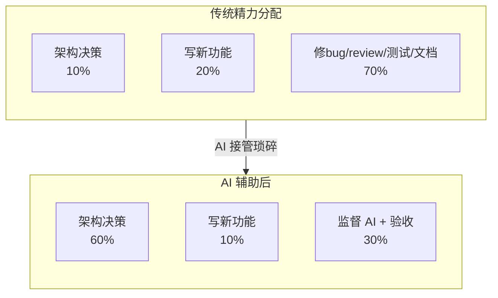

{: .no_toc }

  

    目录
  

  {: .text-delta }
- TOC
{:toc}

<!--
aicent-01-engr-and-claude
AI编程方法 01：认知构建 - 你是架构师AI是你的工程团队
-->

## 1. 全文导读地图

本篇是系列的认知篇开篇。在动手写任何代码之前，先把一个根本问题想清楚：**你和 Claude Code 到底应该是什么关系**？

围绕用 Claude Code 从零构建一个名为 Hify 的 AI Agent 开发平台，本篇不谈"怎么做"，只谈"谁来做、怎么验收"。读完你能拿到三样东西：① 一个能贯穿全流程的认知框架——**你是架构师，Claude Code 是你的工程团队**；② 一个可裁剪的任务分工决策模型——**三层分工**；③ 一套拿到 AI 输出后立刻能用的验收方法——**三步检查法**。

全文采用**双轨结构**：第一部分（章 2-4）是方法论提炼，第二部分（章 5）是实战印证。先看地图，再选路径。

### 1.1 全文地图

下面这张图把全文结构与阅读路径一次铺开。先看决策点（你的目标是什么），再决定进入哪条路径。

<!--
flowchart TD
    Reader([读者：初学者 / 熟练者]) --\> Decide{阅读目标?}

    Decide --\>|速查方法论| Part1[第一部分：方法论提炼]
    Decide --\>|复现实战| Part2[第二部分：实战印证]

    Part1 --\> Ch2[章 2：核心认知框架]
    Ch2 --\> Ch3[章 3：实操工具一 三层分工]
    Ch3 --\> Ch4[章 4：实操工具二 三步检查法]

    Ch4 -.可选深入.-> Part2

    Part2 --\> Ch5[章 5：Hify 两种指令对比]
    Ch5 --\> Ch6[章 6：总结、Check List、思考]

    Ch6 --\> Output([产出：认知框架 + 分工模型 + 验收方法])
-->

流向逻辑分三层：

- **速查型读者**（熟练者：快速回顾）：走 `章 2 → 章 3 → 章 4`，就能拿到完整方法论。
- **复现型读者**（初学者：系统掌握）：走 `章 5`，每节都带方法论锚点，需要时回查第一部分对应章节。
- **章 6（Check List）** 对两类读者都有价值——速查型直接裁剪走，复现型对照实战逐项验证。

### 1.2 阅读路径建议

| 路径 | 推荐顺序 / 跳转方式 | 预计耗时 | 适合场景 | 产出 |
| --- | --- | --- | --- | --- |
| **路径一：方法论速查**（快速回顾） | 章 2 → 章 3 → 章 4 → 章 6 | 15-20 分钟 | 项目启动前快速建立认知框架，或在某个阶段需要快速查阅"这个任务该谁来干、输出怎么验收" | 一份可直接裁剪的项目阶段 Check List |
| **路径二：实战复现**（系统学习） | 章 2 → 章 3 → 章 4 → 章 5 → 章 6 | 30-40 分钟 | 第一次接触 Claude Code 协作模式，需要"知其然也知其所以然" | 完整的方法论认知 + 一份可立即上手使用的分工与验收工具 |
| **路径三：项目即查即用**（项目开发中遇到问题） | 章 3（派任务前判断归属层）→ 章 4（拿到输出后执行验收）→ 章 6（Check List 兜底） | 即查即用 | 日常开发中"下一步该做什么"的快速决策 | 当下这个任务的处理方案 |

### 1.3 本篇的来源与定位

本篇源自一次踩坑复盘：作者在第一天直接让 Claude Code 设计架构，拿到一个**过度设计的微服务方案**。问题不在 AI，而在于他没给它足够的约束和上下文。后来他花一个晚上想清楚产品边界、架构约束、技术规范，写成 `CLAUDE.md` 喂给它，第二天输出质量完全不同。

由此凝练出一句话贯穿全篇：**用 Claude Code 做项目，瓶颈不在 AI，在你**。本篇要解决的就是这个"在你"——你该想清楚什么、你和 AI 怎么分工、拿到输出怎么判断能不能用。

## 2. 核心认知框架：你与 Claude Code 的关系

### 2.1 一句话定位

> 你是架构师，Claude Code 是你的工程团队。

这不是比喻。想想一个架构师每天干什么：

他不写具体的业务代码，但他决定了系统长什么样，具体来说就是

- **定方向**：做什么、不做什么
- **做取舍**：遇到矛盾选 A 还是选 B
- **立标准**：代码怎么写、接口怎么定、出了错怎么处理
- **验收成果**：团队交付的东西是不是他要的

工程团队在干什么？在按标准高效执行。

你给 Claude Code 下达的每一条指令，本质上就是架构师在给团队派任务。这条定位贯穿后续所有章节——三层分工是它派任务的具体方式，三步检查法是它验收的具体方式。

### 2.2 输入质量阶梯曲线：为什么"想得清楚"决定一切

作者踩坑后的一个本质发现：输入质量和输出质量之间不是线性关系，是阶梯式的。

你给 AI 的输入从 60 分提升到 80 分，输出不是从 60 涨到 80，而是可能从 40 直接跳到 85。因为当你的描述模糊时，AI 需要"猜"——猜你要什么架构、猜你的设计意图、猜你的质量标准。每猜一个就可能猜错，错误还会叠加。但当你给的上下文足够清晰时，它不用猜了，输出质量会有质的变化。

*X 轴是输入质量，Y 轴是输出质量*

<!--
图片内容说明
路径：imgs/aicent-01-engr-and-claude/a1c6b523d11de07f8d917e54418cb014_MD5.jpg
用途：可视化展示"输入质量 vs 输出质量"的阶梯式非线性关系
内容：X 轴为输入质量，Y 轴为输出质量，曲线呈阶梯状跳跃上升，而非线性增长
-->

输入质量分档与对应产出：

| 输入档位    | 描述特征                     | 输出特征     | 典型场景 |
| ------- | ------------------------ | -------- | ---- |
| L1 模糊   | "帮我做个 CRUD"              | 过度设计或不够用 | 踩坑期  |
| L2 半结构化 | "用 Spring Boot 做 CRUD"   | 能用但风格混乱  | 入门期  |
| L3 结构化  | "按规范做 CRUD，错误码、连通性测试都列清" | 结构完整可用   | 成熟期  |
| L4 全规范  | 配合 CLAUDE.md + 接口契约      | 可直接合入    | 复利期  |

**核心认知**：你想得越清楚，它做得越准确；你越模糊，它越跑偏。瓶颈不在 AI 的能力上，在你的思考质量上。

### 2.3 角色定位的本质：从"写代码"到"做决策"

建立"架构师"框架之后，你的核心工作不再是"写代码"，而是"做决策"：

- 决定做什么、不做什么
- 决定用什么方式做
- 决定做到什么标准
- 验收 Claude Code 做出来的结果

很多人讨论 AI 提效，关注的都是"写代码快了多少"。但作者体会最深的不是速度变化，而是**精力分配的变化**。做一个系统，大量时间其实不是花在写新功能上——修低级 bug、反复 review、写测试、写文档，这些又多又碎的活消耗了大部分精力。AI 把这些接过去之后，他可以把大部分精力集中在架构设计和核心决策上。这个改变是复利的。

*传统精力分配 vs AI 辅助后*

所以"你是架构师，它是工程团队"的深层含义是：AI 让你终于有条件把全部精力放在最该做的事上。

### 2.4 必须先建立的两个认知

在进入具体方法之前，必须先夯实两条认知，否则后面的工具用不起来：

| 认知编号 | 内容                                        | 反面表现             |
| ---- | ----------------------------------------- | ---------------- |
| 认知 1 | 你必须有足够的技术判断力来验证 AI 输出 | 看不懂代码 → 没法判断对错   |
| 认知 2 | 你必须能给出精确的任务描述           | 不了解技术细节 → 任务描述模糊 |

也就是说，"AI 帮我做事"不等于"我可以不懂技术"。技术能力是当好"架构师"的前提——你必须比工程团队更懂全局，才有资格验收它的成果。

## 3. 实操工具一：三层分工

认知框架解决了"我是谁"的问题，接下来解决"具体怎么派任务"。

三层分工就是一套可直接套用的任务派发模型，本章：

- 首先介绍分工模型，以及Hify项目中的分工占比（3.1、3.2节）
- 然后推广到不同类型的项目，如何根据项目类型灵活调整分工占比（3.3节上半部分）
- 最后回归第一性原理，归纳核心判断标注（3.3节下半部分）

全章内容图示如下：

### 3.1 三层分工总览

把所有任务按"决策权归属"分成三层，从上到下：你做 → AI 做你验收 → AI 全权处理。越往上越需要判断力。

| 层级 | 谁做 | 典型任务 | 验收方式 | 占比预期 |
|------|------|---------|---------|---------|
| 第一层 | 必须你做 | 产品边界、架构决策、技术取舍、跨模块一致性 | 自己拍板 | 视项目而定 |
| 第二层 | AI 做，你验收 | 业务代码、接口开发、前端页面、测试用例、文档 | 逐行能说清楚 | 应用层项目最大 |
| 第三层 | AI 全权处理 | 格式化、样板代码、简单重构、启动脚本、Makefile | 扫一眼没问题 | 琐碎任务 |

三层具体内容：

#### (1) 第一层：必须你做

拿 Hify 来说：做不做 RAG 知识库？用微服务还是模块化单体？线程池参数设多少？这些决策**只有你能做**。Claude Code 可以给你方案对比（系列第 04 篇会看到这个过程），但拍板的必须是你。

#### (2) 第二层：AI 做，你验收

业务代码、接口开发、前端页面、测试用例、文档——这是工作量的大头。有一条**硬标准**：你要能说清楚它在干什么。说不清楚，就不能用。

#### (3) 第三层：AI 全权处理

格式化、样板代码、简单重构、启动脚本、Makefile——这些扫一眼没问题就行，不必逐行 review。

### 3.2 决策树：如何判断任务归属哪一层

派任务前，先用决策树走一遍：

<!--
flowchart TD
    Start([接到一个任务]) --\> Q1{涉及产品边界 / 架构决策 / 技术取舍 / 跨模块一致性?}
    Q1 --\>|是| L1[第一层：必须你做]
    Q1 --\>|否| Q2{是业务代码 / 接口 / 页面 / 测试 / 文档?}
    Q2 --\>|是| L2[第二层：AI 做，你验收 硬标准：每行能说清楚]
    Q2 --\>|否| Q3{是格式化 / 样板代码 / 简单重构 / 脚本?}
    Q3 --\>|是| L3[第三层：AI 全权处理 扫一眼即可]
    Q3 --\>|否| Reflect[先想清楚任务性质 或让 AI 帮你梳理思路]

    L1 --\> End([派任务])
    L2 --\> End
    L3 --\> End
    Reflect --\> End
-->

### 3.3 边界是活的：项目类型决定层级比重

三层的边界不是死的。同样的"写代码"任务，在不同类型项目里归属可能不同：

| 项目类型 | 第一层占比 | 第二层占比 | 第三层占比 | 关键提醒 |
|---------|----------|----------|----------|---------|
| 应用层项目（如 Hify） | 较小 | 最大 | 中等 | AI 可以写更多代码 |
| 基础设施项目（分布式系统、存储引擎） | 最大 | 较小 | 较小 | 核心代码最好自己写 |
| 工具/脚本类项目 | 极小 | 较小 | 最大 | 几乎可以全权交给 AI |

关键不是死记比例，而是始终清楚哪些东西不能放手。

判断标准很简单：这个决策错了，会不会让整个项目偏离轨道？会，就是第一层。

<!--
图片内容说明
路径：imgs/aicent-01-engr-and-claude/eaf39ff62ef7d8149b97f6bac06a2bc9_MD5.jpg
用途：可视化展示三层分工的层级关系与判断力要求
内容：从上到下三层：你做 → AI 做你验收 → AI 全权处理，越往上越需要判断力
-->

*从上到下：你做 → AI 做你验收 → AI 全权处理；越往上面越需要判断力*

### 3.4 协作变体：让 AI 帮你想思路

有一种情况要提前说清楚：**有时候你还没完全想清楚要做什么**。比如"业务开发前需要准备哪些基础组件"这种问题。

这时候不是只有"想清楚再让它做"这一条路，你也可以先让 Claude Code 帮你梳理思路——它帮你想，你来判断取舍。这个协作模式在系列后续会专门讲，本篇先建立这个意识：三层分工不是僵化的派单流程，当任务还没成型时，可以让 AI 参与思考。

## 4. 实操工具二：三步检查法

分工定了，验收怎么做？这套方法解决"拿到 AI 输出后怎么判断能不能用"。按优先级走三步，顺序不能反。

### 4.1 三步检查法总览

首先图示整体过程如下，然后再展开介绍

<!--
flowchart LR
    Start([拿到 AI 输出]) --\> S1[第一步 查意图]
    S1 --\>|意图错了| Stop1[白查后面 直接打回]
    S1 --\>|意图对了| S2[第二步 查质量]
    S2 --\>|风格不一致| Fix1[修正命名 / 格式]
    S2 --\>|质量过关| S3[第三步 查边界]
    S3 --\>|发现风险| Fix2[补异常 / 并发处理]
    S3 --\>|边界清晰| Accept([验收通过])
-->

### 4.2 第一步：查意图

**核心问题**：它做的是不是你让它做的？

用 Hify 的一个具体场景说明。假设你让 Claude Code 实现"删除模型提供商"的接口，你的指令是：

> 实现 DELETE /api/v1/providers/{id}，删除前检查是否有 Agent 正在使用该提供商，如果有则拒绝删除。

<!--
图片内容说明
路径：imgs/aicent-01-engr-and-claude/9bf5fe4957056f3f7dd02214b7ac7885_MD5.jpg
用途：展示 Claude Code 对删除接口任务的代码输出
内容：删除接口实现代码，核心思路：查存在 → 查引用 → 删除，BizException 由 GlobalExceptionHandler 统一拦截返回对应错误码
-->

打开代码后会发现它**确实实现了**删除接口和关联检查，但它额外做了两件事：

1. **加了一个软删除机制**（不是真删，标记 `deleted=true`）
2. **加了一个操作日志记录**

这两个东西合不合理？也许合理。但**问题是你没要求**。它自作主张扩大了范围。这次看着还行，下次它可能就"顺手"加一些不合适的东西。

**第一步的判断**：功能多了，需要砍掉或确认后再保留。

| 检查动作      | 具体做法                      |
| --------- | ------------------------- |
| 对比指令清单    | 把你的指令拆成原子需求，逐项对照代码        |
| 识别"额外功能"  | 标出代码里你没要求的额外实现            |
| 决策保留 / 砍掉 | 每个额外功能都要明确：保留需要理由，砍掉不需要理由 |

### 4.3 第二步：查质量

**核心问题**：风格、规范、一致性。

继续看删除接口的代码。你会注意到几处不一致：

| 不一致点 | 代码中的写法 | 项目里其他写法 |
|---------|------------|--------------|
| 方法命名 | `checkProviderUsage` | `validateXxxBeforeDelete` |
| 返回格式 | 直接返回 `ResponseEntity` | 其他接口统一返回 `Result<Void>` |

这些**不是 bug**，功能没问题，但放在整个项目里风格不统一。时间一长，每个模块一种风格，维护起来很痛苦。

**第二步的判断**：风格不一致，必须对齐到项目规范。这一步暴露的往往是"CLAUDE.md 没写清楚"或"AI 没看到全局规范"，修复时要同时修代码和补规范。

### 4.4 第三步：查边界

**核心问题**：错误处理、异常、潜在风险。

继续看删除接口，你会发现两个边界问题：

| 边界问题   | 代码表现                         | 风险等级 | 应有处理                               |
| ------ | ---------------------------- | ---- | ---------------------------------- |
| 并发场景   | 检查通过后、删除前，刚好有新 Agent 绑定了该提供商 | 高    | 加锁或乐观锁，或事后校验                       |
| ID 不存在 | 传入不存在的 ID 抛 500              | 中    | 应抛 404，由 GlobalExceptionHandler 兜底 |

这些边界问题，你可以让 Claude Code 自己再检查一遍——它做细节排查很稳定，不会因为疲劳漏掉。这是把"AI 做你验收"这一层反向利用的好场景：让 AI 自己 review 自己。

**第三步的判断**：边界不清，列出风险点清单，让 AI 补齐。

### 4.5 顺序为什么不能反

三步的顺序是**意图 → 质量 → 边界**，不能反。原因很简单：

> 如果意图就错了，后面两步白查。

| 顺序 | 为什么是这个顺序 |
|------|---------------|
| 意图第一 | 错了的话，代码再漂亮也没用 |
| 质量第二 | 在意图正确的前提下，统一风格才有意义 |
| 边界第三 | 意图对、风格统一后，才值得花精力查细节风险 |

如果先查边界再发现意图错了，所有精力都白费了。

### 4.6 警惕"放松警惕"陷阱：用机制代替意志力

最后提醒一个**人的认知规律**：Claude Code 连续几次输出都没问题时，你会不自觉放松警惕。这不是意志力能对抗的。

解决办法不是"我要更小心"，而是**靠机制**：

| 机制                    | 适用场景         | 兜底效果          |
| --------------------- | ------------ | ------------- |
| 关键模块强制跑测试             | 任何被多个模块依赖的代码 | 不靠肉眼，靠测试用例把关  |
| CI 自动化检查              | 提交前          | 风格、依赖、安全检查自动化 |
| Code Review Checklist | 自己 review    | 避免漏项          |

**核心认知**：不要相信"我会更仔细"，要相信"机制会替我把关"。这是系列后续测试那一篇会详细展开的主题。

## 5. 实战印证：Hify 项目中的两种指令对比

理论讲完了，回到实战。本章用 Hify 项目里两个真实的指令对比，让你"眼见为实"地感受输入质量阶梯曲线。最后再用删除接口的案例串起三步检查法。

### 5.1 场景一：模糊指令的输出

任务："帮我用 Spring Boot 实现一个模型提供商管理的 CRUD 接口。"

<!--
图片内容说明
路径：imgs/aicent-01-engr-and-claude/a600f1c6e955195476a71f33e83442a4_MD5.jpg
用途：展示模糊指令下 Claude Code 的输出，对比后续结构化指令的输出
内容：模糊指令产出的 CRUD 代码，结构简单、缺少错误码、缺少连通性测试、缺少依赖管理
-->

这是典型的 L1-L2 输入档位。AI 没有约束，按"通用最佳实践"输出，结果是能跑但**不像成熟项目的代码**。

### 5.2 场景二：结构化指令的输出

任务："按照 CLAUDE.md 中的接口规范，实现模型提供商的 CRUD 接口，使用 MyBatis-Plus，错误码按规范定义，连通性测试的异常区分网络超时（2001）、认证失败（2002）、模型不存在（2003）三种情况。不需要工厂模式，用最简单的方式实现。"

<!--
图片内容说明
路径：imgs/aicent-01-engr-and-claude/91c29f549cd99feb6d705bf533f36094_MD5.jpg
用途：展示结构化指令下 Claude Code 的输出第一部分
内容：结构化指令产出的代码，包含错误码定义、依赖管理、连通性测试结构
-->

<!--
图片内容说明
路径：imgs/aicent-01-engr-and-claude/b3dd842f27d08f4f2721ca7246a63cee_MD5.jpg
用途：展示结构化指令下 Claude Code 的输出第二部分
内容：结构化指令产出的代码续篇，展示完整的连通性测试实现、异常处理、依赖管理
-->

这是 L3-L4 输入档位。约束清晰、规范明确、错误码具体到数字，AI 不用猜，直接照着做。

### 5.3 两种输出的对比分析

同一个 AI，两种指令拿到的输出质量完全是两回事。差异具体体现在：

| 维度      | 场景一（模糊指令）       | 场景二（结构化指令）               |
| ------- | --------------- | ------------------------ |
| 错误码     | 无 / 默认          | 2001 / 2002 / 2003 分场景定义 |
| 依赖管理    | 缺失              | 完整                       |
| 连通性测试   | 无               | 三类异常分别处理                 |
| 设计模式    | 可能过度（如不必要的工厂模式） | 显式说明"不需要工厂模式"            |
| 与项目规范对齐 | 不对齐             | 完全对齐 CLAUDE.md           |
| 成熟度     | 能跑，但不像生产代码      | 成熟项目该有的样子                |

**结论印证**：阶梯曲线成立。同样的 AI，输入从 L1 跳到 L3，输出从 40 分跳到 85 分。

### 5.4 删除接口的三步验收实操

把第 4 章的三步检查法套到删除接口的案例上，完整走一遍：

| 步骤      | 发现的问题                                                 | 处理方式                                                         |
| ------- | ----------------------------------------------------- | ------------------------------------------------------------ |
| 第一步 查意图 | 多了软删除机制 + 操作日志                                        | 砍掉或确认需求后再保留                                                  |
| 第二步 查质量 | 命名 `checkProviderUsage` 不统一；返回格式 `ResponseEntity` 不统一 | 改为 `validateXxxBeforeDelete`；改为 `Result<Void>`；同时补 CLAUDE.md |
| 第三步 查边界 | 并发场景未处理；ID 不存在抛 500 而非 404                            | 让 AI 补并发锁 + 改抛 404                                           |

每一步都有具体动作，每一步都有可验收的产出。这就是"三步检查法"在真实项目里的样子。

### 5.5 这两个对比的启示

从场景一到场景二，关键变化不是 AI 变聪明了，而是指令变具体了。这就是为什么本篇反复强调：

1. **瓶颈在你不在 AI**——同样的工具，指令质量决定输出质量
2. **三层分工是派任务的模型**——派之前先想清楚归属哪层
3. **三步检查法是验收的方法**——拿到输出后按顺序走三步

## 6. 总结、Check List 与思考

### 6.1 核心要点回顾

本篇建立了一个认知框架和两个实操工具：

| 类别    | 内容                        | 一句话记忆                 |
| ----- | ------------------------- | --------------------- |
| 认知框架  | 你是架构师，Claude Code 是你的工程团队 | 工作重心从写代码变成做决策         |
| 实操工具一 | 三层分工                      | 派任务前先想一秒：这个任务在哪一层     |
| 实操工具二 | 三步检查法                     | 拿到输出后按序走：意图 → 质量 → 边界 |

从下一篇开始，每次给 Claude Code 派任务前，先想一秒这个任务在哪一层；拿到输出后，按顺序走三步。这两件事做到了，你的 AI 编程效率会有质的变化。

### 6.2 AI 编程项目阶段 Check List

下面这份 Check List 可以直接裁剪走，贴在你的项目 README 或 CLAUDE.md 顶部，每次派任务前对照走一遍。

#### (1) 项目启动前（一次性）

- [ ] 是否想清楚**产品边界**：做什么、不做什么
- [ ] 是否想清楚**架构约束**：单体还是微服务、模块怎么分
- [ ] 是否想清楚**技术规范**：技术栈、命名约定、错误码体系
- [ ] 是否把以上内容写成 `CLAUDE.md` 喂给 AI
- [ ] 是否建立"三层分工"心智模型

#### (2) 任务下达前（每次派任务）

- [ ] 是否判断了任务归属：第一层 / 第二层 / 第三层
- [ ] 第一层任务：是否自己想清楚了再派
- [ ] 第二层任务：是否给出明确的接口契约、错误码、技术栈约束
- [ ] 第三层任务：是否明确了"扫一眼即可"的验收标准
- [ ] 是否避免使用模糊指令（"帮我做个 X"）

#### (3) 输出验收时（每次拿结果）

- [ ] **第一步 查意图**：是否做了你没要求的事
- [ ] **第二步 查质量**：命名、返回格式、风格是否对齐项目规范
- [ ] **第三步 查边界**：异常、并发、ID 不存在等边界场景是否处理
- [ ] 是否按"意图 → 质量 → 边界"的顺序走（顺序不能反）
- [ ] 关键模块是否跑了测试再接收（不靠肉眼）

#### (4) 长期协作（持续）

- [ ] 是否在每次发现风格不一致时**同时补 CLAUDE.md**
- [ ] 是否建立了关键模块的自动化测试机制
- [ ] 是否警惕"连续几次输出没问题就放松警惕"的陷阱
- [ ] 是否把"我必须懂技术"作为前提持续学习

### 6.3 思考

回想一下你现在用 AI 编码工具的方式。在今天说的三层分工里，有没有哪些**本该你拍板的事情，不知不觉交给了 AI**？

比如某个技术选型、某个架构决策，你是自己想清楚了再让 AI 执行，还是直接问 AI"你觉得该怎么做"然后就照着做了？

把答案写下来，对照本篇的三层分工表，看哪些决策权需要收回。

### 6.4 下一篇预告

下一篇我们解决一个具体问题：**怎么让 Claude Code 永远在你的轨道上跑，不自由发挥**。这就是贯穿整个系列的**核心方法论——规范驱动开发**。

如果你今天建立了"我是架构师"的认知框架，那么下一篇就教你如何把架构师的意图变成 AI 必须遵守的轨道——`CLAUDE.md` 怎么写、Skill 怎么定义、规范怎么喂入。我们下篇见。
