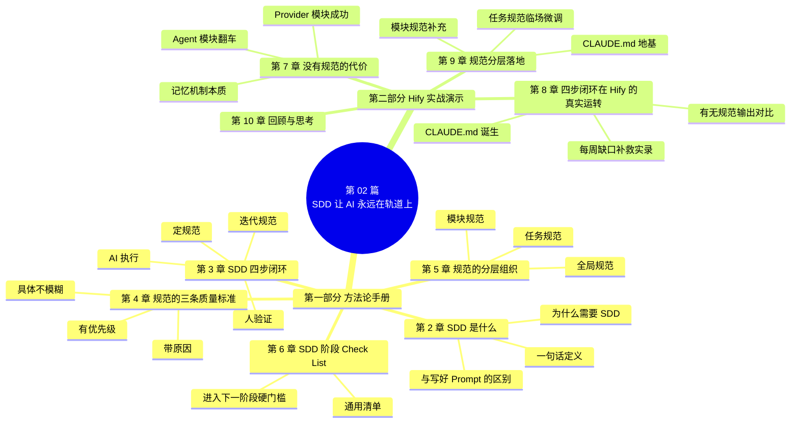
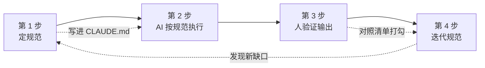
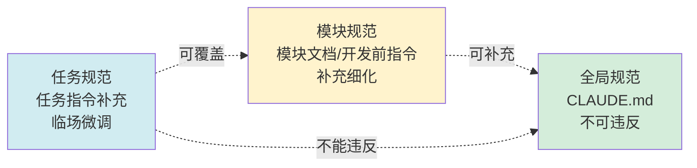
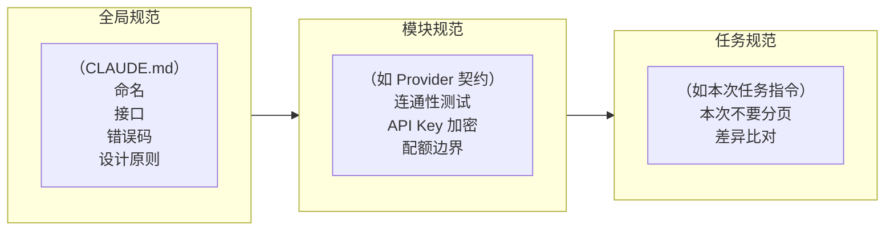

<!--
aicent-02-sdd-mind-set
AI编程思路 02：认知构建 - SDD思想
-->

## 1. 开篇导读


第 01 篇我们确立了一个核心认知：**你是架构师，Claude Code 是你的工程团队**。你负责做决策，它负责执行。

但这里立刻冒出一个问题：你怎么把决策传达给它？

带过团队或合作过外包的人都知道——脑子里想得再清楚，没落成文字，对方做出来的东西大概率和你想的不一样。口头说"帮我做个用户系统"，交回来哪哪都不满意。但如果你给了接口文档、数据模型、命名规范、错误码定义，交付质量会好一个档次。

Claude Code 也一样。它很强，但它不会读心。你不告诉它规矩，它就自己编一套——而且每次编的都不一样。

这一篇要讲的，是贯穿整个系列的核心方法论：**规范驱动开发（Specification-Driven Development，SDD）**。一句话概括：**先定规范，再让 AI 按规范执行，而不是直接让它写代码**。

这一篇是整个系列的根基。AI 既需要上下文，也需要规范——而规范的好坏，直接决定了项目的质量。

### 1.1 全文导读地图



**怎么读这篇**：第一部分（第 2-6 章）是参考手册，做完项目可以回来速查；第二部分（第 7-10 章）是实战教材，解释每个方法点的 why。两部分交叉引用，第二部分的每个翻车案例都会回扣到第一部分的某条准则。

> **第一部分 · SDD 方法论手册**
>
> 第 2-6 章是抽象的方法论提炼，不绑定具体技术栈。目标是给你一份"SDD 全流程"的参考手册——在项目对应阶段快速查阅，知道这一步做什么、怎么思考、有哪些 Check List。

## 2. SDD 是什么：规范驱动开发


### 2.1 一句话定义与核心立场

**SDD（Specification-Driven Development，规范驱动开发）** = 先把规范写下来、自动加载，再让 AI 在规范约束下执行。

核心立场只有一句：<span style="color: red; font-weight: bold;">你不告诉它规矩，它就自己编一套</span>。SDD 的全部价值，就是把"自己编"变成"按规矩来"。

### 2.2 为什么需要 SDD：单次指令失效的本质

#### (1) Claude Code 没有长期记忆

很多人误以为 Claude Code"上一轮对话学过，这一轮应该记得"。**这是错觉**。<span style="color: red; font-weight: bold;">它不是"忘了"，它根本没看到——每次新对话，对它来说都是从零开始。</span>

这意味着：你在 A 对话里写得很细的指令，对 B 对话完全无效。

#### (2) 一致性靠体系，不靠灵感

单次指令的清晰度，只能解决**单次输出**的质量。要保证整个项目几十次、几百次 AI 输出的一致性，你需要的不是"一条好指令"，而是**一套规范体系**——写下来、每次自动加载，让 Claude Code 不管在哪个模块、哪个阶段，都在同一套规矩下工作。

| 维度 | 单次好指令 | SDD 规范体系 |
| --- | --- | --- |
| 生效范围 | 仅当次对话 | 整个项目所有对话 |
| 一致性 | 依赖你每次重写 | 自动加载，无需重复 |
| 维护成本 | 每次重新构思 | 一次定稿，增量迭代 |
| 适用阶段 | 单点任务 | 项目全生命周期 |

### 2.3 SDD 与"写好 Prompt"的本质区别

<span style="color: red; font-weight: bold;">写好 Prompt 是一次性技巧，SDD 是贯穿项目生命周期的方法论。</span>两者的差距，本质上是"打一枪换一个地方"和"建一座工厂"的差距。


<!--
图片内容说明
路径：imgs/aicent-02-sdd-mind-set/3a4c2f92c67d15653e2b716e0d32e5a7_MD5.jpg
用途：直观对比"单次指令"与"规范体系"两种工作模式
内容：左侧呈现单次 Prompt 模式下每个模块风格各异、前端需逐一适配；右侧呈现 SDD 模式下所有模块共享同一套 CLAUDE.md 规范，输出统一、可复用
-->

### 2.4 对应案例

这一节定义了 SDD 的核心立场。第二部分第 7 章会用 Hify 的 Provider/Agent 两个模块，把"单次指令失效"的代价真实演示一遍。

## 3. SDD 四步闭环


### 3.1 闭环总览

SDD 不是"写个规范然后照着做"，它是一个**持续运转的闭环**。四步，循环往复。



一句话总结：<span style="color: red; font-weight: bold;">规范越磨越锋利，AI 越用越顺手</span>。

### 3.2 第一步：定规范

在写任何业务代码之前，先把基础规范定下来。第一版粗一点没关系，但**一定要有**。关键是覆盖 Claude Code 最容易跑偏的四个地方：

#### (1) 命名风格

如果不约束，每个模块命名都不一样——加不加前缀、驼峰还是下划线、路径单数还是复数，每次都"猜"，结果每次都不同。

**最小约束**：

- 实体类大驼峰，不加前缀后缀（如 `Provider`、`Agent`、`ChatMessage`）
- 字段小驼峰（如 `apiKey`、`baseUrl`、`modelName`）
- 接口路径：`/api/v1/{资源复数名}`

#### (2) 返回格式

如果不约束，有的接口返回 `{"code": 200, "data": {...}}`，有的返回 `{"error": "not found"}`，有的直接返回 `ResponseEntity`。前端适配会崩溃。

**最小约束**：

- 所有接口统一返回 `Result<T>`：`{ code, message, data }`
- 列表字段空时返回空数组 `[]`，不返回 `null`
- 分页参数：`page`（从 1 开始）、`pageSize`（默认 20）

#### (3) 错误码体系

不约束它，错误码满天飞——HTTP 状态码、自定义字符串、随机数字混用；更糟的是不同模块撞号，你分不清 2001 到底是 Provider 的"网络超时"还是 Agent 的"模型不存在"。

**最小约束（四位数字，按模块分段）**：

| 段位 | 模块 | 范围 |
| --- | --- | --- |
| 通用 | 全局 | 1000-1999 |
| Provider | 模型提供商管理 | 2000-2999 |
| Agent | 智能体管理 | 3000-3999 |
| Chat | 对话引擎 | 4000-4999 |
| MCP | 工具协议 | 5000-5999 |

#### (4) 设计原则

这是最关键的一条。Claude Code 训练数据里有大量"最佳实践"代码，它**天然倾向于过度设计**——工厂模式、策略模式、三层抽象、接口隔离。对几十人用的内部平台来说，大部分设计模式是负担不是资产。

**最小约束**：

- 不引入不必要的设计模式（工厂、策略、观察者等），除非明确要求
- 不做过度抽象，一层能解决的不要拆成两层
- 不引入技术栈以外的依赖，需要时先确认

> **技巧**：规范写不出来？先让 Claude Code 帮你梳理"这个项目需要定哪些规范"，它帮你想，你来判断取舍。这种"先问再做"的协作模式，第 09 篇会专门展开。

**放哪里**：项目根目录的 `CLAUDE.md` 文件。Claude Code 每次启动新对话时自动读取，你不需要每次手动喂。第 05 篇会手把手带你写完整版，这一篇先理解它的作用。

### 3.3 第二步：AI 按规范执行

下达任务时，明确引用规范。不是"帮我做个 Agent CRUD"，而是"按照 CLAUDE.md 中的规范，实现 Agent 的 CRUD 接口"。

重点不在"按照规范"这四个字——CLAUDE.md 已经在上下文里，Claude Code 看得到。**重点在于提醒它去关注那份规范，而不是按自己的"经验"来**。

### 3.4 第三步：人验证输出

用第 01 篇的三步检查法（**意图、质量、边界**），检查输出是否符合规范。

有了规范之后，review 效率会大幅提升——你不再是漫无目的地看代码，而是**对着清单打勾**：

- 命名是不是按规范来的？
- 返回格式统一不统一？
- 有没有引入明确说了"不要用"的设计模式？
- 错误码是不是在这个模块的分段范围内？

规范把 review 从**主观判断**变成了**客观核查**。这个转变对效率的提升是巨大的。

### 3.5 第四步：迭代规范

<span style="color: red; font-weight: bold;">这一步最关键，也最容易被忽略。</span>

你在验证输出时一定会发现规范没覆盖到的地方。这太正常了——你不可能第一次就想到所有情况。**关键是每次发现缺口，都要补上**。

规律：每次 AI 跑偏，不要只改代码——停下来问自己：

1. 它为什么跑偏？
2. 是不是规范没覆盖到？
3. 如果是，补上那条规范。

这条规范一旦写进 CLAUDE.md，后面所有对话都会受到约束。<span style="color: red; font-weight: bold;">它跑偏一次，你补一条，以后它在这个点上就不会再跑偏</span>。

坚持几周，你的规范会从最初的一页纸，长成一份覆盖命名规则、接口规范、错误码、异常处理、项目结构、分层原则、行为约束、前端组件规范的完整体系。

### 3.6 对应案例

四步闭环是 SDD 的骨架。第二部分第 8 章会用 Hify 的真实开发过程，把四步在项目里走一遍——尤其是第四步的缺口补救实录。

## 4. 规范的三条质量标准


不是所有规范都能约束住 AI。下面三条标准，用来判断你写的规范到底有没有用。

### 4.1 具体，不模糊

判断标准很简单：**Claude Code 看到这条规范后，是否还需要"猜"你的意思？** 还需要猜，就不够具体。

| 规范主题 | 没用的写法（模糊） | 有用的写法（具体） |
| --- | --- | --- |
| 代码风格 | "代码要简洁" | "不引入不必要的设计模式（工厂、策略、观察者等），除非明确要求。每个功能用最简单直接的方式实现" |
| 接口格式 | "接口要规范" | "所有接口统一返回 `Result<T>`，格式为 `{ code, message, data }`。错误码四位数字，按模块分段" |

模糊规范等于没写——Claude Code 对"简洁"的理解和你不一样，它可能觉得一个工厂模式 + 策略接口就是"简洁的抽象"。

### 4.2 有优先级，不贪多

规范不是越多越好。上下文窗口是有限的，塞太多规范反而会**稀释重要的那几条**。

判据：<span style="color: red; font-weight: bold;">AI 反复跑偏的地方写细，不跑偏的地方不写</span>。

| 该写 | 不该写 |
| --- | --- |
| "Controller 不写业务逻辑"（它经常犯） | "文件编码用 UTF-8"（它基本不会错） |
| "错误码按模块分段"（容易撞号） | "变量名要有意义"（它已经会了） |
| "不引入技术栈外依赖"（容易擅自加库） | "代码要可读"（太虚） |

你的注意力应该放在它**真正容易犯错**的地方。<span style="color: red; font-weight: bold;">一份好的 CLAUDE.md 大概两三页，每一条都是因为它在某个点上跑偏过才补上去的——没跑偏过的地方，一条都没有。</span>

### 4.3 带原因，不只规则

对于涉及**工程权衡**的规范，不能只告诉 Claude Code"不要这样做"，还要告诉它**为什么**。它需要理解约束的原因，才能在类似场景中举一反三。

| 规范类型 | 是否需要解释 why | 示例                                             |
| ---- | ---------- | ---------------------------------------------- |
| 纯约定  | 不需要        | "实体类不加前缀"——照做就行                                |
| 工程权衡 | **必须解释**   | "不要全量删除再插入"——必须说明"并发场景下会瞬间失去所有工具关联，对话读取会拿到空列表" |
| 接口契约 | **必须解释**   | "不破坏已有接口契约"——必须说明"前端已依赖现有签名，改动会触发连锁报错"         |

> **协作提示**：加上 why 之后，Claude Code 有时会跟你讨论——它可能发现你想的不对。这种讨论本身就是规范进化的机会。

## 5. 规范的分层组织


随着项目推进，规范会越来越多。一条扁平的清单很快会失控——需要**分层管理**。

### 5.1 三层模型：全局 / 模块 / 任务

把规范分成三层，各司其职：

| 层级 | 载体 | 覆盖范围 | 改动频率 | 角色 |
| --- | --- | --- | --- | --- |
| 全局规范 | `CLAUDE.md` | 整个项目 | 项目初期定好，很少改 | 地基 |
| 模块规范 | 模块目录文档 / 开发前指令 | 单个模块 | 模块开发前定 | 补充 |
| 任务规范 | 每次任务指令的补充说明 | 单次任务 | 临时性，不落档 | 临场微调 |

**全局规范**：命名规则、接口格式、错误码体系、设计原则、行为约束。

**模块规范**：某个模块开发前单独定义。比如 Provider 模块有自己的接口契约（第 05 篇详细展示），对话模块有自己的数据流定义，工作流模块有自己的节点类型规范。

**任务规范**：每次给 Claude Code 下达具体任务时的补充说明。比如"这次不需要分页"、"异常要区分这三种情况"、"用差异比对不要全量替换"。


<!--
图片内容说明
路径：imgs/aicent-02-sdd-mind-set/c8fefafb04113f47781325df7007b9a5_MD5.jpg
用途：可视化呈现规范三层（全局/模块/任务）的叠加关系
内容：三层金字塔或同心圆示意图——底层全局规范（CLAUDE.md）覆盖整个项目，中层模块规范补充各模块特性，顶层任务规范做单次任务微调；箭头表达"任务可覆盖模块、但不能违反全局"的优先级规则
-->

### 5.2 三层叠加规则与优先级

Claude Code 每次干活时看到的，是**三层叠加的完整约束**。优先级从上到下：



**核心规则**：<span style="color: red; font-weight: bold;">任务规范可以覆盖模块规范（"这次不需要分页"），但不能违反全局规范</span>（所有接口统一返回 `Result<T>`——任何任务都不能破坏这条）。

### 5.3 对应案例

三层模型是 SDD 的组织方式。第二部分第 9 章会用 Hify 的 CLAUDE.md / Provider 模块 / 单次任务指令，把三层在实战中的样子逐一展示。

## 6. SDD 阶段 Check List（可裁剪）


### 6.1 通用清单

下面这份清单覆盖 SDD 全流程的关键动作。项目越大越要全勾；小项目可以裁剪，但**标"硬门槛"的项不能省**。

| #   | 检查点                                    | 硬门槛 | 裁剪建议            |
| --- | -------------------------------------- | --- | --------------- |
| 1   | `CLAUDE.md` 文件已创建并放在项目根目录              | 是   | 不可省，AI 协作根      |
| 2   | 命名规范已定（实体类、字段、接口路径）                    | 是   | 至少定实体类与字段       |
| 3   | 返回格式规范已定（统一 `Result<T>`、空值处理）          | 是   | 不可省，前端适配依赖      |
| 4   | 错误码体系已定（按模块分段）                         | 是   | 至少定 2-3 个核心模块段位 |
| 5   | 设计原则已定（不过度设计、不引入技术栈外依赖）                | 是   | 不可省，AI 最易跑偏     |
| 6   | 下达任务时明确引用规范（"按照 CLAUDE.md…"）           | 是   | 不可省             |
| 7   | review 时对照规范清单打勾，而非主观判断                | 是   | 不可省             |
| 8   | 发现缺口后补规范（不只改代码）                        | 是   | 不可省，迭代核心        |
| 9   | 规范表述具体到 AI 不需要猜                        | 是   | 写完自检每一条         |
| 10  | 规范按优先级取舍（跑偏点写细，不跑偏点不写）                 | 否   | 小项目可宽松          |
| 11  | 工程权衡类规范附带 why 解释                       | 否   | 简单约定可省          |
| 12  | 模块规范已分层（全局 / 模块 / 任务三层分离）              | 否   | 单模块项目可合并        |
| 13  | 任务规范未违反全局规范                            | 是   | 不可省             |
| 14  | 涉及代码分层时明确 Controller/Service/Mapper 职责 | 是   | 后端项目必备          |

### 6.2 进入下一阶段的硬门槛

进入具体模块开发（或下一阶段）前，下面四件事必须完成：

1. **规范地基已铺**：Check List 第 1-5 项全勾
2. **协作模式已建立**：Check List 第 6-7 项勾上——下达任务必引用规范、review 必对照清单
3. **迭代机制已启动**：Check List 第 8 项勾上——发现缺口就补规范
4. **分层认知已建立**：Check List 第 12-13 项勾上——清楚三层边界

任何一项没完成就进入模块开发，都会在后续付出一致性代价（参见第 7 章 Agent 模块翻车案例）。

> **第二部分 · Hify 实战演示**
>
> 下面的章节用 Hify 这个真实项目，把第一部分的方法论全程复现一遍。重点不是"Hify 长什么样"，而是每个翻车案例的 **why**——为什么 Provider 模块成功、Agent 模块翻车、为什么每周都要补规范、为什么三层缺一不可。技术栈紧扣 Spring 风格 Controller/Service/Mapper 分层、`Result<T>` 统一返回、四位分段错误码、`CLAUDE.md` 自动加载。

## 7. 没有规范的代价：Provider 与 Agent 两种风格


### 7.1 场景还原：Provider 模块的成功

做 Provider 模块（模型提供商管理）时，我在指令里写得很细：

- 实体叫 `Provider`，不加前缀
- 返回格式用 `Result<T>`
- 错误码按模块分段（2000-2999）
- 不要设计模式

Claude Code 的输出很干净：命名统一、格式规范、结构简洁。第一关顺利通过——这让我产生了一个错觉：**它学会了**。

### 7.2 场景反转：Agent 模块的翻车

两天后做 Agent 模块，我写指令时没有重复那些规范（觉得它应该"记住"了），只说了"实现 Agent 的 CRUD 接口"。

伪代码对比：

```java
// Provider 模块：写细了规范
String instruction = "实现 Provider 的 CRUD，实体不加后缀，"
                   + "返回 Result<T>，错误码从 1000 段，直接 new";
generate(instruction);  // 输出干净

// Agent 模块：只下了简短指令
String instruction = "实现 Agent 的 CRUD";
generate(instruction);  // 翻车
```

拿到代码一看我皱眉了——四条规范全部被打破：

| 规范点 | Provider 模块（正确） | Agent 模块（跑偏） | 后果 |
| --- | --- | --- | --- |
| 实体命名 | `Provider` | `AgentConfig`（多了 Config 后缀） | 两模块风格不一致 |
| 返回格式 | 统一 `Result<T>` | 部分接口直接返回 `ResponseEntity` | 前端要适配两套 |
| 错误码段位 | 2000-2999 | 没按分段，和 Provider 撞号 | 2001 是谁的错分不清 |
| 创建方式 | 直接 `new` | 加了 Builder 模式 | 两模块创建方式不一 |

每一条单独看都不是 bug，功能完全正常。但放在一个项目里——<span style="color: red; font-weight: bold;">两个模块两种风格</span>。前端对接要适配两套格式；后面维护每个模块都要先搞清楚"这个模块的规矩是什么"。

### 7.3 为什么会这样：Claude Code 的记忆机制

问题出在哪？**Claude Code 没有长期记忆**。你上一轮对话给的规范，这一轮它完全不知道。它不是"忘了"，它根本没看到。每次新对话，对它来说都是从零开始。

我用一句直白的话总结这次教训：

> 单次指令的清晰度，只能解决单次输出的质量。要保证整个项目几十次、几百次 AI 输出的一致性，<span style="color: red; font-weight: bold;">你需要的不是"一条好指令"，是一套规范体系——写下来、每次自动加载，让 Claude Code 不管在哪个模块、哪个阶段，都在同一套规矩下工作。</span>

### 7.4 对应方法论

这一节对应第 2.2 节"单次指令失效的本质"。Provider 的成功是**单次指令有效**的证明；Agent 的翻车是**单次指令失效**的证明——同一个我、同一个 Claude Code、相隔两天，输出风格分裂。修复方式只有一种：把规范写进 `CLAUDE.md`，让 SDD 接管。

## 8. 四步闭环在 Hify 的真实运转

### 8.1 第一步落地：CLAUDE.md 的诞生


Provider 模块翻车后，我把所有规范落进了项目根目录的 `CLAUDE.md`：

```text
# 命名规范
- 实体类大驼峰，不加前缀后缀（Provider、Agent、ChatMessage）
- 字段小驼峰（apiKey、baseUrl、modelName）
- 接口路径：/api/v1/{资源复数名}

# 接口规范
- 所有接口统一返回 Result<T>：{ code, message, data }
- 列表字段空时返回空数组 []，不返回 null
- 分页参数：page（从 1 开始）、pageSize（默认 20）

# 错误码（四位数字，按模块分段）
- 1000-1999 通用
- 2000-2999 Provider
- 3000-3999 Agent
- 4000-4999 Chat
- 5000-5999 MCP

# 设计原则
- 不引入不必要的设计模式（工厂、策略、观察者等），除非明确要求
- 不做过度抽象，一层能解决的不要拆成两层
- 不引入技术栈以外的依赖，需要时先确认
```

Claude Code 每次启动新对话自动读取——我再也不用每次重复喂。

### 8.2 第二步落地：明确引用规范

回到做 Agent 模块那个场景，这次下达任务时我换了一种说法：

> 按照 CLAUDE.md 中的规范，实现 Agent 的 CRUD 接口。

同一个 AI，输出截然不同：

| 规范点 | 无 CLAUDE.md | 有 CLAUDE.md | 触发规范 |
| --- | --- | --- | --- |
| 实体类名 | `AgentConfig` | `Agent` | "实体类不加前缀后缀" |
| 返回格式 | 混用 `ResponseEntity` | 统一 `Result<T>` | "所有接口统一返回" |
| 错误码段位 | 撞号 2001 | 从 3000 开始 | "按模块分段" |
| 创建方式 | Builder 模式 | 直接 `new` | "不引入不必要的设计模式" |

CLAUDE.md 已经在上下文里了，Claude Code 本来就看得到。这句"按照 CLAUDE.md"的真正作用，是**提醒它去关注那份规范**，而不是按它自己的"经验"来。

### 8.3 第三步落地：review 从主观到客观

有了规范之后，review 的方式彻底变了。以前我是漫无目的地看代码——"这写得对吗？"；现在我是**对着清单打勾**：

- [ ] 命名按规范？实体是不是叫 `Agent`？
- [ ] 返回格式统一？是不是 `Result<T>`？
- [ ] 错误码在 3000-3999 段？
- [ ] 没引入 Builder / 工厂等模式？

规范把 review 从**主观判断**（"感觉不对"）变成了**客观核查**（"这条没勾"）。我不需要每次重新思考"这里应该怎么写"——标准已经定好了。

### 8.4 第四步落地：每周缺口补救实录


第四步是 SDD 闭环里**最关键也最容易被忽略**的一步。Hify 开发过程中，我每周都发现规范没覆盖到的地方，每次都补一条。

#### (1) 第1周缺口：空值处理

**现象**：Claude Code 处理空列表时返回了 `null`。前端拿到 `null`，页面直接白屏——它期望的是空数组 `[]`。

**根因**：规范里没定义"空值怎么处理"。

**补救**（写进 CLAUDE.md）：

```markdown
- 列表字段空时返回空数组 []，不返回 null
- 字符串字段空时返回空字符串 ""，不返回 null
```

#### (2) 第2周缺口：接口契约破坏

**现象**：做 Agent 模块时，让 Claude Code 改了一个 Provider 的接口签名。前端调 Provider 的代码全部报错——它"觉得"新签名更好，顺手改了。

**根因**：规范里缺少"改代码时的行为约束"。

**补救**：

```markdown
- 修改已有代码前，先理解相关模块的设计意图
- 不要为了实现新功能破坏已有模块的接口契约
```

#### (3) 第3周缺口：分层原则缺失

**现象**：做对话引擎时，Claude Code 把业务逻辑全写在了 Controller 里——事务管理、数据校验、外部调用塞在一个方法。能跑，但完全不符合分层原则。

**根因**：规范里缺少"代码放哪里"的约束。

**补救**（Spring 风格 Controller/Service/Mapper 分层）：

```markdown
- Controller 只做参数校验和调用 Service，不写业务逻辑
- 跨模块调用走 Service 接口，不直接引用其他模块的 Mapper
```

#### (4) 第4周缺口：技术栈边界

**现象**：做前端时，Claude Code 引入了一个没在技术栈里的 UI 库。能跑，但多了一个依赖要维护。

**根因**：规范里缺少"技术栈边界"的约束。

**补救**：

```markdown
- 不引入技术栈以外的依赖，需要时先问我
```

### 8.5 规范生长规律：从一页纸到完整体系


<!--
图片内容说明
路径：imgs/aicent-02-sdd-mind-set/a8c175b0707adc26dfdcf7d272d49767_MD5.jpg
用途：可视化"每次 AI 跑偏都是完善规范的机会"这一迭代规律
内容：呈现规范随时间生长的曲线或循环图——每个跑偏点（空值、接口契约、分层、技术栈边界）对应一条新增规范，规范库从一页纸逐步扩展为覆盖命名/接口/错误码/异常处理/项目结构/分层/行为约束/前端组件的完整体系
-->


你看到规律了吗？<span style="color: red; font-weight: bold;">每次 AI 跑偏，不要只改代码——停下来问自己：它为什么跑偏？是不是规范没覆盖到？然后补上那条规范</span>。

这条规范一旦写进 CLAUDE.md，后面所有对话都会受到约束——它跑偏一次，你补一条，以后它在这个点上就不会再跑偏。

Hify 的 CLAUDE.md 最终大概两三页。<span style="color: red; font-weight: bold;">没有一条是"提前想出来的"，全部是在开发过程中一条一条补上去的</span>。没跑偏过的地方，一条都没有。

## 9. 规范分层落地：CLAUDE.md / 模块 / 任务


### 9.1 全局规范：CLAUDE.md（地基）

写在项目根目录的 `CLAUDE.md`，整个项目通用。第 8.1 节已经展示了它的完整形态——命名规则、接口格式、错误码体系、设计原则、行为约束。

**特点**：项目初期定好，后面很少改动。它是地基，所有模块和任务都建立在它之上。

### 9.2 模块规范：Provider / 对话 / 工作流

某个模块开发前单独定义。Hify 的例子：

| 模块 | 模块规范内容 | 载体 |
| --- | --- | --- |
| Provider | 接口契约（连通性测试、API Key 加密存储、配额管理边界） | 模块目录文档（第 05 篇详细展示） |
| 对话引擎 | 数据流定义（流式 SSE、多轮上下文截断策略） | 开发前指令 |
| 工作流 | 节点类型规范（线性流程 + 条件分支，不支持可视化拖拽） | 开发前指令 |

模块规范是**全局规范的补充**——它不重复全局规范已经说过的，只定义这个模块独有的契约。

### 9.3 任务规范：临场微调

每次给 Claude Code 下达具体任务时的补充说明。例如：

- "这次不需要分页"
- "异常要区分这三种情况：网络超时 / 模型不存在 / 配额超限"
- "Agent 工具列表更新用差异比对，不要全量替换"（这条来自第 15 篇，涉及工程权衡——全量删除再插入会导致并发场景下 Agent 瞬间失去所有工具关联，对话读取会拿到空列表）

任务规范**临时性，不落档**——它只在当次任务有效。

### 9.4 三层叠加的实战效果

Claude Code 每次干活时看到的，是**三层叠加的完整约束**：



**优先级铁律**：任务规范可以覆盖模块规范（"这次不需要分页"覆盖了"分页参数 page/pageSize"），但**不能违反全局规范**——任何任务都不能让某个接口绕过 `Result<T>` 统一返回。

这一节对应第 5.2 节"三层叠加规则与优先级"。Hify 的实战证明：三层缺一不可——缺全局规范会两个模块两种风格（第 7 章）；缺模块规范会让全局规范过于宽泛；缺任务规范会让临场需求无处表达。

## 10. 回顾与思考

这一篇的核心就是 SDD 的四步闭环：**定规范 → AI 执行 → 人验证 → 迭代规范**。

规范不是额外负担，是节省时间的捷径。没有规范的 AI 是一匹没有缰绳的马——跑得快，方向不可控。有了规范，你就把它框在轨道上了，又快又稳。

### 10.1 三条实操要点

从实操角度，记住三件事：

1. **规范不需要一次写完**。第一版覆盖最容易跑偏的四个地方（命名、返回格式、错误码、设计原则）就够了，后面在开发中迭代补全（见第 3.2 节、第 8.4 节）。
2. **每次 AI 跑偏了，不要只改代码**，还要想想规范是不是该补一条。跑偏一次补一条，同样的问题不会再出现第二次（见第 3.5 节、第 8.5 节）。
3. **规范要具体到 AI 不需要猜你的意思**。如果它看到规范后还需要"猜"，那就不够具体（见第 4.1 节）。

### 10.2 复利效应


<span style="color: red; font-weight: bold;">规范的价值会随时间复利累积。</span>

第1周你可能觉得"写规范好麻烦，直接让它干不就行了"。但到第三周，你会发现 Claude Code 几乎不跑偏了——<span style="color: red; font-weight: bold;">不是它变聪明了，是你的规范把所有容易踩的坑都堵上了</span>。后面每做一个新模块，规范帮你省下的 review 时间和返工时间，远超当初写规范的投入。

### 10.3 下一篇预告

下一篇我们开始动手——定义 Hify 的产品边界，想清楚做什么和不做什么。这是"架构师"要做的第一件事，也是 `CLAUDE.md` 里最先要写的内容。
