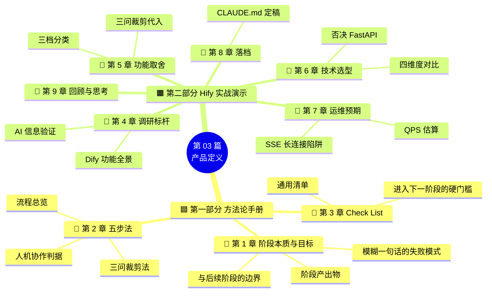
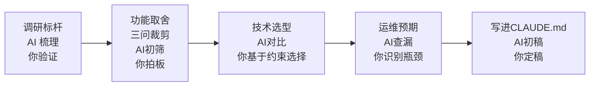

<!--
aicent-03-prod-define
AI编程思路 03：顶层设计 - 定义产品
-->

## 1. 开篇导读

从这一篇开始，我们正式动手做项目。<span style="color: red; font-weight: bold;">但"动手"不是"写代码"——动手做的第一件事，是想清楚要做什么</span>。

"做一个简版 Dify，叫 Hify"这句话其实非常模糊。Dify 有几十个功能模块，你做哪些？不做哪些？目标用户是谁？部署在哪里？要扛多大的量？这些问题不想清楚就开始写代码，要么范围膨胀收不住，要么做到一半推倒重来。用 Claude Code 更危险——你说"帮我做个 Agent 管理"，它可能顺手把权限体系、版本控制、审计日志全给你加上，因为 Dify 有这些。你没定边界，它就替你定了。

所以这一篇要做的事情就是：<span style="color: red; font-weight: bold;">在动第一行代码之前，把产品边界、技术选型、运维预期全部想清楚，写进 CLAUDE.md</span>。产品定义这一阶段就可以用 AI，不是只有写代码时才用。

### 1.1 全文导读地图



**怎么读这篇**：第一部分（第 1-3 章）是参考手册，做完项目可以回来速查；第二部分（第 4-9 章）是实战教材，解释每一步的 why。两部分交叉引用，第二部分的每个决策都会回扣到第一部分的某条准则。

> **第一部分 · 产品定义方法论手册**
>
> 第 1-3 章是抽象的方法论提炼，不绑定具体技术栈。目标是给你一份"产品定义阶段"的参考手册——在项目对应阶段快速查阅，知道这一步做什么、怎么思考、有哪些 Check List。

## 2. 产品定义阶段的本质与目标


### 2.1 为什么"动手"不是"写代码"

#### (1) 模糊一句话的两种失败模式

产品定义阶段的输入，通常是一句模糊的话，比如"做一个简版 Dify"。这句话之所以危险，是因为它会触发两种失败：

##### ① 范围膨胀 vs 推倒重来

| 失败模式 | 触发条件 | 代价 |
| --- | --- | --- |
| 范围膨胀 | 没有显式边界，边做边加 | 工期失控，永远做不完 |
| 推倒重来 | 做到一半才发现方向不对 | 沉没成本高，士气受挫 |

用 AI 编程时，这两种失败都会被放大：<span style="color: red; font-weight: bold;">AI 不会替你拒绝需求，它会"贴心地"把你没说的功能也补上</span>。

#### (2) 产品定义阶段的产出物

这一阶段结束时，你应该能回答下面五个问题，每个都有书面答案：

1. **做什么**：功能边界（含显式的"不做什么"清单）
2. **为谁做**：目标用户与使用规模
3. **用什么做**：技术栈与部署方式
4. **跑多快**：性能与运维预期（QPS、并发、瓶颈位置）
5. **怎么演进**：哪些决策留了扩展口，哪些是硬约束

这五个问题的答案，最终都要落进 `CLAUDE.md` 的"项目概述"部分——这是后续所有 AI 协作的上下文根。

### 2.2 与后续阶段的边界

产品定义阶段不解决"模块怎么分"（那是架构设计阶段的事），也不解决"代码怎么写"（那是实现阶段的事）。<span style="color: red; font-weight: bold;">它只解决一个问题：我们要做的到底是什么东西</span>。

判别边界的方法：如果你在产品定义阶段就开始画类图、写接口签名，说明你提前进入了架构设计；如果你还在纠结"要不要做这个功能"，说明你还没走出产品定义。

## 3. 五步法：从模糊一句话到可执行边界

### 3.1 流程总览


<!--
flowchart LR
    A[第 1 步<br/>调研标杆] --/> B[第 2 步<br/>功能取舍]
    B --/> C[第 3 步<br/>技术选型]
    C --/> D[第 4 步<br/>运维预期]
    D --/> E[第 5 步<br/>写进 CLAUDE.md]
    E --/> F{进入<br/>架构设计}

    A -.AI 梳理,你验证.-> B
    B -.AI 初筛,你拍板.-> C
    C -.AI 对比,你选择.-> D
    D -.AI 查漏,你定稿.-> E
-->

五步法的每一步都是"人机协作"：AI 负责扩展信息面和初筛，人负责基于自身约束做最终判断。

### 3.2 每步的目标与产出

| 步骤 | 目标和产出 | 人与AI分工 |
|------|-----------|-----------|
| **1. 调研标杆** | **目标**：理解领域全貌，辨识核心与边缘<br/>**产出**：标杆功能全景图 | **AI**：快速梳理标杆产品的功能模块<br/>**人**：拿着AI清单去比对官方文档/GitHub，修正过时描述、补上遗漏 |
| **2. 功能取舍** | **目标**：从标杆功能中圈出范围<br/>**产出**：三档功能清单+一句话产品定位 | **AI**：基于约束给出"必须做/降级简化/砍掉"三档初筛<br/>**人**：逐项决策，否决不合理建议 |
| **3. 技术选型** | **目标**：选匹配约束的技术栈<br/>**产出**：前后端+容器化技术栈定稿 | **AI**：多维度对比候选方案<br/>**人**：基于"熟、够用、不分裂"三准则做最终选择 |
| **4. 运维预期** | **目标**：提前想清楚怎么跑，反向影响架构<br/>**产出**：部署方式、QPS预期、缓存策略、监控方案 | **AI**：估算QPS、列缓存策略、查漏运维事项<br/>**人**：识别真正的瓶颈（往往不是并发），定下部署与监控方案 |
| **5. 写进 CLAUDE.md** | **目标**：将前面四步结论落成文字，作为后续AI协作的上下文根<br/>**产出**：CLAUDE.md项目概述部分 | **AI**：生成初稿<br/>**人**：检查修改后定稿，并在项目演进中持续更新 |

### 3.3 三问裁剪法

功能取舍是五步法里最难的一步。直接面对"做 / 不做"二选一容易拍脑袋，建议用下面三问逐层过滤。


<!--
flowchart TD
    Start[候选功能] --/> Q1{第一问<br/>没有它产品还成立吗}
    Q1 --/>|否| Core[核心:必须做满]
    Q1 --/>|是| Q2{第二问<br/>做到什么程度够用}
    Q2 --/>|价值大| Degrade[降级:做最简版]
    Q2 --/>|价值小| Q3{第三问<br/>能不能一句话说清楚它的位置}
    Q3 --/>|能| Keep[保留,纳入定位]
    Q3 --/>|不能| Cut[砍掉]

    style Core fill:#d4edda
    style Degrade fill:#fff3cd
    style Cut fill:#f8d7da
-->

#### (1) 第一问：没有它产品还成立吗

这一问区分核心和边缘。砍掉任何一个核心功能，产品就不成立。判别方法：**如果你把这个功能从清单里划掉，产品定位是否还站得住**。站不住的就是核心。

#### (2) 第二问：做到什么程度够用

<span style="color: red; font-weight: bold;">这一问防止核心功能做满。核心功能也要分级—— MVP 版本、可用版本、完整版本。</span>判别方法：**当前阶段用户能用就行，还是必须做得精美**。能用就行的，做最简版。

#### (3) 第三问：能不能一句话说清楚

这一问是兜底。一个功能如果连"它在产品里扮演什么角色"都说不清楚，往往是你还没想透。判别方法：**强迫自己用一句话写出这个功能在产品定位中的位置**。写不出来，砍掉。

### 3.4 人机协作判据：什么时候听 AI，什么时候否决

AI 在产品定义阶段能极大扩展信息面，但它的建议不能直接采纳。下面是四条判据：

| 场景   | AI 建议     | 你的判据             | 典型否决理由                      |
| ---- | --------- | ---------------- | --------------------------- |
| 功能取舍 | 建议保留某功能   | 它是否击中"为什么要自研"的核心 | 否决两级权限：50 人互相认识，权限在系统外约定    |
| 技术选型 | 推荐生态更强的方案 | 一人维护会不会技术栈分裂     | 否决 FastAPI：双栈通信部署复杂度翻倍      |
| 运维估算 | 给出保守上限    | 真正的瓶颈是不是它指的地方    | 识别"瓶颈在长连接不在并发"              |
| 落档   | 生成初稿      | 是否包含显式的"不做什么"    | 没写"不做什么"清单的 CLAUDE.md 是不合格的 |

通用原则：<span style="color: red; font-weight: bold;">AI 负责拓宽思路，你负责基于自身约束做取舍。每一步的最终判断必须是人做的</span>。

## 4. 产品定义 Check List（可裁剪）


### 4.1 通用检查清单

下面这份清单覆盖产品定义阶段的全部关键决策点。项目越大越要全勾；小项目可以裁剪，但**标"硬门槛"的项不能省**。

| #   | 检查点                                     | 硬门槛   | 裁剪建议              |
| --- | --------------------------------------- | ----- | ----------------- |
| 1   | 标杆产品功能全景已梳理并人工验证                        | **是** | 小项目可只梳理 3-5 个核心模块 |
| 2   | 功能分档完成（必须做 / 降级 / 砍掉）                   | **是** | 至少分"做 / 不做"两档     |
| 3   | "不做什么"清单已显式列出                           | **是** | 不可省，AI 协作必备边界     |
| 4   | 一句话产品定位已写出（能说清为谁、做什么、不做什么）              | **是** | 写不出说明范围还没定        |
| 5   | 技术栈已定稿（前后端 + 容器化 + 数据存储）                | **是** | 至少后端 + 数据库        |
| 6   | 技术选型否决理由已记录                             | 否     | 小项目可口头约定          |
| 7   | 目标用户规模与并发量已估算                           | **是** | 至少给人数区间           |
| 8   | QPS 峰值已估算（含放大系数）                        | 否     | 小项目可只给并发数         |
| 9   | 真正的瓶颈位置已识别（并发 vs 长连接 vs IO）             | **是** | 不可省，影响架构          |
| 10  | 缓存策略已定（缓存什么、不缓存什么）                      | 否     | 小项目可只缓存配置         |
| 11  | 数据持久化方案已定（volume 挂载、备份）                 | **是** | 不可省               |
| 12  | 部署方式已定（单机 / 集群 / 容器化）                   | **是** | 至少给一种             |
| 13  | 监控方案已定（起步 + 后期演进）                       | 否     | 小项目可只用日志          |
| 14  | 扩展口已识别（哪些决策留了拆分余地）                      | 否     | 小项目可忽略            |
| 15  | CLAUDE.md 项目概述部分已写入                     | **是** | 不可省，AI 协作根        |
| 16  | CLAUDE.md 包含"做什么 / 不做什么 / 技术栈 / 运维预期"四块 | **是** | 不可省               |

### 4.2 进入下一阶段的硬门槛

进入架构设计阶段前，下面四件事必须完成：

1. **范围已定**：Check List 第 1-4 项全勾
2. **技术栈已定**：Check List 第 5 项勾上
3. **瓶颈已识别**：Check List 第 9 项勾上——这一点尤其重要，它会直接决定架构设计阶段的模块划分和线程模型
4. **CLAUDE.md 已落档**：Check List 第 15-16 项全勾

<span style="color: red; font-weight: bold;">任何一项没完成就进入架构设计，都会在后续阶段付出返工代价</span>。

> **第二部分 · Hify 实战演示**
>
> 下面的章节用 Hify（简版 Dify）这个真实项目，把第一部分的方法论全程复现一遍。重点不是"Hify 长什么样"，而是每个决策的 **why**——为什么听 AI、为什么否决 AI、为什么这样取舍。技术栈紧扣 Spring Boot 3.x + Vue 3 + MySQL 8.x + Redis 7.x + Docker Compose。

## 5. 调研标杆：让 AI 梳理功能全景，你来验证


### 5.1 这一步要解决的问题

"做一个简版 Dify"这句话之所以模糊，是因为我连 Dify 到底有哪些功能都不完全清楚。Dify 的功能很多，自己一个个去翻文档和产品页面，效率很低。所以第一步不是想"我要做什么"，而是看"业界最好的在做什么"。

不是为了抄，而是要理解这个领域的全貌——你连全貌都没有，怎么知道哪些功能是核心、哪些是边缘？

### 5.2 给 Claude Code 的指令

```
帮我梳理 Dify（ https://dify.ai ）这个产品的核心功能模块，
按类别分组，每个模块用一两句话说明它做什么。
```

### 5.3 第一份功能清单

Claude Code 很快给出了一份结构化的功能清单。


<!-- 
图片内容说明
路径：imgs/aicent-03-prod-define/bfd10bfe31a2cda9bd2e612f7c31bb8d_MD5.jpg
用途：展示 Claude Code 首次产出的 Dify 功能模块清单
内容：按类别分组的 Dify 功能清单（模型管理、应用创建、工作流编排、RAG/知识库、工具集成、对话与调试、发布与 API、运营功能），每个模块配一两句说明；后续作者以官方文档/GitHub 比对修正过时描述、补上遗漏的 MCP 协议支持
-->

如果是了解 Dify 的人，就会知道这份清单比较完整。但如果我们不了解 Dify 呢？此时原则是：<span style="color: red; font-weight: bold;">AI 给的信息不能直接信，你要验证</span>。

### 5.4 验证原则：AI 信息不能直接信

我拿着这份清单和 Dify 的官方文档、GitHub README 对了一遍，修正了几个过时的描述，补上了它遗漏的 MCP 协议支持。

Dify 八大功能全景图


<!-- 
图片内容说明
路径：imgs/aicent-03-prod-define/79ed8fc14bc1d20ac5e7a09c8718eb54_MD5.jpg
用途：可视化呈现 Dify 的八大功能模块全景
内容：Dify 八大功能模块结构图——模型管理、应用创建、工作流编排、RAG/知识库、工具集成、对话与调试、发布与 API、运营功能，每个模块配简要说明
-->

最终梳理出的 Dify 功能全景（文字版）：

```markdown
- **模型管理**：接入多个 LLM 提供商（OpenAI、Claude、Gemini、本地模型等），统一管理 API Key、模型参数、调用配额
- **应用创建**：用户可以创建不同类型的 AI 应用——聊天助手、Agent、文本生成、工作流。每个应用可以配置模型、提示词、工具
- **工作流编排**：可视化拖拽界面，把多个节点（LLM 调用、条件判断、代码执行、HTTP 请求）串成一个工作流。这是 Dify 的招牌功能
- **RAG / 知识库**：上传文档，自动切片、向量化、存储。对话时自动检索相关内容作为上下文
- **工具集成**：内置和自定义工具，Agent 可以在对话中调用。支持 API 工具和 MCP 协议
- **对话与调试**：完整的对话界面，支持流式响应、多轮对话。有调试模式可以看到推理过程
- **发布与 API**：每个应用可以发布为独立页面或 API，供外部系统调用
- **运营功能**：用量统计、日志追踪、成员管理、API Key 管理、多租户隔离
```


看完这个清单，你就理解为什么"做一个简版 Dify"这句话很模糊了——随便拎出一块都能做几周。

### 5.5 回扣准则

这一步对应第 2.2.1 节五步法第 1 步：AI 梳理标杆功能，你拿着官方文档验证。关键动作是**验证**，不是**采纳**。

## 6. 功能取舍：三问裁剪法实操


### 6.1 给 Claude Code 的指令

功能全景有了，接下来是最关键的一步：做哪些、不做哪些。我先让 Claude Code 做一轮初步分析：

```
我要基于 Dify 做一个简化版的 AI Agent 平台，叫 Hify。
约束条件：一个人开发，面向团队内部 20-50 人使用，本地部署。
请从刚才梳理的功能列表中，帮我判断哪些是必须做的核心功能，
哪些可以砍掉，给出每个的理由。
```

### 6.2 三档分析结果

Claude Code 给了一份很有结构的分析：


<!-- 
图片内容说明
路径：imgs/aicent-03-prod-define/07a4bcca483ebe7a2e3e94285967b347_MD5.jpg
用途：展示 Claude Code 对 Hify 功能取舍的初步分析结果
内容：三档分类表（必须做 / 降级简化 / 砍掉），逐项列出 Dify 功能的取舍建议与理由，如建议保留知识库 RAG（团队接入私有文档的核心价值）、建议工作流降级、建议两级权限（被作者否决）等
-->

你会发现 Claude Code 的输出不是简单的"做 / 不做"二分法，而是分成了三档：**必须做、降级简化、砍掉**。<span style="color: red; font-weight: bold;">这个分档方式本身就有价值——我自己一开始想的是二分法</span>。

### 6.3 关键决策复盘

Claude Code 的分析里有几个判断让我重新思考了，也有我不同意的。

#### (1) 采纳：知识库 + RAG 降级做

我原本打算砍掉 RAG，整条链路太长，一个人做周期太长。但 Claude Code 指出："接入私有文档，这是团队用 Hify 而不是直接用 ChatGPT 的主要理由。"

它说得对。如果只能通用对话，团队直接用 ChatGPT 就行了。<span style="color: red; font-weight: bold;">私有知识的接入才是内部部署的核心价值</span>。采纳，但降级：一期只支持 TXT 文档，分块用最简单的固定长度。

#### (2) 采纳：工作流降级做

工作流也是类似思路。不做可视化拖拽，只支持 JSON 配置的线性流程 + 条件分支，覆盖"问题分类→走不同路径"这种最常见场景。

#### (3) 否决：两级权限

Claude Code 建议做两级权限（管理员 / 普通用户）。但 50 人内部团队大家互相认识，在系统外约定就行，不值得为此每个功能都多一层权限逻辑。**否决**。

Claude Code 的分析帮我拓宽了思路，但最终取舍还是我基于自己的约束来做。

### 6.4 三问裁剪法逐问代入

我总结了一个方法论——"三问裁剪法"（参见第 2.3 节），把它代入 Hify 的取舍过程。

#### (1) 第一问：没有它产品还成立吗

- **核心（必须做满）**：模型管理、Agent 配置、对话引擎、工具集成、管理控制台。砍掉任何一个产品都不成立。
- **边缘但有价值（降级做）**：知识库和工作流。砍掉产品能用但价值大打折扣。
- **边缘且非核心（砍掉）**：可视化拖拽、多租户、插件市场、计费。砍掉不影响核心链路。

#### (2) 第二问：做到什么程度够用

核心功能不做满，每一项都定义 MVP：

| 核心功能 | MVP 范围 | 不做的部分 |
| --- | --- | --- |
| 模型管理 | CRUD + 连通性测试 | 调用配额、模型参数高级调优 |
| Agent 配置 | 选模型、绑工具、设提示词 | Agent 版本控制 |
| 对话引擎 | 流式 + 多轮 | 推理过程可视化调试 |
| 知识库 | TXT + 固定分块 | 多格式、语义分块、重排 |
| 工作流 | JSON 配置 | 可视化拖拽 |
| 管理控制台 | 能用就行 | 不追求精美 UI |

#### (3) 第三问：能不能一句话说清楚

强迫自己写一句话定位：

> Hify：一个可本地部署的 AI Agent 开发平台，支持多模型管理、Agent 配置、知识库 RAG、简版工作流、对话交互和 MCP 工具接入，面向团队内部小规模使用。

写得出来，说明范围已经定清楚。

### 6.5 最终功能清单

整理出最终功能清单：


<!-- 
图片内容说明
路径：imgs/aicent-03-prod-define/bc669eec9764e566f8855b1df07b9661_MD5.jpg
用途：呈现 Hify 最终裁剪后的功能清单（分"必须做 / 降级简化 / 砍掉"三档）
内容：Hify 一期功能定稿表，含必须做项（模型管理、Agent 配置、对话引擎、工具集成、管理控制台）、降级简化项（知识库 RAG 仅 TXT + 固定分块、工作流仅 JSON 线性 + 条件分支）、砍掉项（可视化拖拽、多租户、插件市场、计费、文本生成应用、标注微调）
-->

文字版三档表：

| 档位 | 功能 | 说明 |
| --- | --- | --- |
| 必须做 | 模型管理、Agent 配置、对话引擎、工具集成、管理控制台 | 砍掉任何一个产品都不成立 |
| 降级简化 | 知识库 RAG（TXT + 固定分块）、简版工作流（JSON 线性 + 条件分支） | 价值大但周期长，做最简版 |
| 砍掉 | 可视化拖拽、多租户、权限体系、插件市场、计费、文本生成应用、WebApp 发布、嵌入组件、标注与微调 | 不影响核心链路 |

### 6.6 回扣准则

这一步对应第 2.3 节三问裁剪法。关键动作是**逐问过滤**，而不是直接面对"做 / 不做"二选一。Claude Code 的三档建议拓宽了思路（第 5.2 节），但每一档的最终归属是我拍的板（第 5.3-5.4 节）。

## 7. 技术选型：匹配约束，不追新


### 7.1 给 Claude Code 的指令

功能范围定了，接下来选技术栈。同样让 Claude Code 参与：

```
Hify 是一个 AI Agent 开发平台，一个人开发，本地部署，
目标 20-50 人使用。帮我对比以下技术方案的优劣：
1) Spring Boot + Vue
2) Go + React
3) Python FastAPI + React
重点考虑开发效率、生态成熟度、AI 领域 SDK 支持、运维复杂度。
```

### 7.2 四维度对比

Claude Code 给了一份四维度对比：


<!-- 
图片内容说明
路径：imgs/aicent-03-prod-define/8037bddde59adebc8ebf655ef11129f2_MD5.jpg
用途：展示三种技术栈方案（Spring Boot + Vue / Go + React / Python FastAPI + React）在四个维度上的横向对比
内容：一张四维度（开发效率、生态成熟度、AI 领域 SDK 支持、运维复杂度）三方案对比表，结论是 FastAPI 在 AI 生态上占优，并给出 Spring Boot + Python 小服务的折中方案
-->

结论很明确：**Python FastAPI 在 AI 生态上碾压其他两个**——LangChain、LlamaIndex、向量库客户端都是 Python 原生的，Java 和 Go 在这方面差距很大。它推荐 FastAPI，还给了一个折中方案：Spring Boot 做业务编排，AI 重逻辑（RAG、向量化）抽成一个 Python 小服务。

### 7.3 否决 FastAPI 的三个理由

这个折中方案思路不错，但我不同意。**一个人维护两套技术栈（Java + Python），两个服务之间还要做通信、部署、调试，复杂度翻倍**。<span style="color: red; font-weight: bold;">一个人开发最忌讳的就是技术栈分裂</span>。

我追问了一句：

```
一个人做企业级后端，Spring Boot 和 FastAPI 在工程化能力上差距有多大？
考虑异常处理体系、事务管理这些方面。
```

它的分析很诚实：FastAPI 在这些方面需要自己搭建更多基础设施，Spring 的生态已经把这些都解决了。

我的判断：**选 Spring Boot + Vue，不拆 Python 服务**。理由有三个：

1. **我最熟这个栈**，一个人开发效率第一
2. **AI SDK 用 Java 版本够用**——OpenAI、Claude 都有 Java SDK，RAG 的向量化调 API 就行，不依赖 LangChain
3. **一个人一套技术栈，不分裂**

AI 生态的劣势确实存在，但工程化能力和技术栈统一性的优势更大。<span style="color: red; font-weight: bold;">技术选型不是选最好的技术，是选最匹配当前约束的技术</span>。

### 7.4 最终技术栈

| 层 | 选型 | 理由 |
| --- | --- | --- |
| 后端框架 | Spring Boot 3.x | 工程化成熟，异常/事务/监控开箱即用 |
| ORM | MyBatis-Plus | Java 生态主流，CRUD 开箱即用 |
| 数据库 | MySQL 8.x | 关系型主存储 |
| 缓存 | Redis 7.x | 配置信息与会话上下文缓存 |
| 前端框架 | Vue 3 + TypeScript | 管理后台场景成熟度最高 |
| 前端 UI | Element Plus + Vite | 后台 UI 组件齐全，Vite 构建快 |
| 容器化 | Docker + Docker Compose | 最稳、最简，单机一键部署 |

### 7.5 回扣准则

这一步对应第 2.4 节人机协作判据中的"技术选型"行：AI 推荐生态更强的方案（FastAPI），我基于"一人维护会不会技术栈分裂"的判据否决。关键原则是**匹配约束 > 追新**。

## 8. 运维预期：从 QPS 到长连接


### 8.1 给 Claude Code 的指令

很多人做项目只想功能，不想运维。功能做完了往服务器上一扔，等出问题了才发现很多事没有提前想。这一步我先自己想一遍，然后让 Claude Code 帮我查漏补缺：

```
Hify 是一个 AI Agent 平台，Docker Compose 本地部署，
目标 20-50 人同时在线，主要压力在对话接口（流式 SSE）。
帮我估算 QPS、建议缓存策略、列出需要提前考虑的运维事项。
```

### 8.2 QPS 估算公式与数字代入

Claude Code 给的分析很实在，核心结论是：**QPS 极低，瓶颈不是并发**。

估算公式与代入：

```
峰值 QPS = 在线人数 × 活跃率 ÷ 60 × 每人每分钟消息数
         = 50 × 60% ÷ 60 × 2
         = 1 QPS

考虑 RAG 检索等内部调用放大 3 倍：
实际峰值 ≈ 3-5 QPS
```

Spring Boot 单实例轻松应对。<span style="color: red; font-weight: bold;">真正的瓶颈是 LLM 响应延迟（3-30 秒 / 次）占用连接——这不是 QPS 问题，是长连接管理问题</span>。

### 8.3 SSE 长连接陷阱表

SSE 长连接是唯一需要认真对待的压力点。50 个并发 SSE 连接，每个持续 10-30 秒，意味着 50 个线程被长期占用。Spring Boot 默认 200 线程够用，但下面三个坑必须避开：

| 陷阱       | 错误做法                    | 正确做法                     | 后果                                     |
| -------- | ----------------------- | ------------------------ | -------------------------------------- |
| 线程阻塞     | 用普通 `ResponseBody` 阻塞线程 | 用 `SseEmitter` 不阻塞       | 线程被占满，新请求拒绝                            |
| 僵尸连接     | 不设超时，连接挂死               | 设 60 秒超时                 | 连接累积，资源泄漏                              |
| Nginx 缓冲 | 默认 `proxy_buffering on` | 显式 `proxy_buffering off` | 流式数据被攒批，用户看不到打字机效果，要等 LLM 全部输出完才一次性吐出来 |

第三个坑我自己没全想到。Nginx 不关缓冲的话，用户看不到打字机效果——这种问题不到生产环境发现不了。

### 8.4 缓存策略表

| 数据类型 | 是否缓存 | 理由 |
| --- | --- | --- |
| 模型提供商配置 | 缓存（Redis Cache-Aside） | 变更频率极低 |
| Agent 配置 | 缓存（Redis Cache-Aside） | 变更频率极低 |
| LLM 响应 | 不缓存 | 同一问题不同时间答案可能不同 |
| 对话历史 | 直读数据库 | 50 人规模数据量小，缓存收益不大 |

### 8.5 数据持久化硬要求

数据持久化是硬性要求：**MySQL 数据目录、向量数据库数据目录、上传的文档文件——必须挂载 volume，容器内不存储任何数据**。

这条看起来是常识，但真有人忘了挂载，容器一重启数据全没了。

### 8.6 最终运维预期

| 维度 | 决策 |
| --- | --- |
| 部署方式 | Docker Compose 一键启动，JVM 内存设上限 `-Xmx512m`（防止容器被 OOM Kill） |
| 用户量 | 20-50 人同时在线，单机部署够用 |
| QPS | 峰值 3-5 QPS，瓶颈在 LLM 长连接不在并发 |
| 监控 | 起步用 Spring Boot Actuator + 日志，后期接 Prometheus + Grafana |
| 扩容 | 一期单机；架构上不堵死扩容的路（第 04 篇会做模块化设计，为后续拆分留口子） |

### 8.7 运维预期如何反向影响架构

这里有一个环节很重要：<span style="color: red; font-weight: bold;">你得看得懂上面这些建议。如果你看不懂，整个项目就会失控</span>。比如因为短期 QPS 不高，我放弃了做缓存，因为缓存会增加开发的复杂度。

更关键的是，运维预期会反向影响架构决策：

- "瓶颈在长连接不在并发" → 决定了第 04 篇 LLM 调用要用**独立线程池做隔离**
- "一期单机" → 决定了**不需要微服务**
- "配置变更频率低" → 决定了**配置走 Redis Cache-Aside 而非实时推送**

<span style="color: red; font-weight: bold;">运维预期不是项目最后才想的事，它从一开始就在影响你的每一个设计决策</span>。

### 8.8 回扣准则

这一步对应第 2.2.4 节五步法第 4 步。AI 帮你查漏补缺（列出了 SSE 三坑、缓存策略、持久化要求），你负责识别真正的瓶颈（长连接而非并发），并把它转化为架构决策。

## 9. 落档：写进 CLAUDE.md


### 9.1 给 Claude Code 的指令

前面想清楚的所有东西——产品定义、功能范围、技术选型、运维预期——都要落成文字，写进 CLAUDE.md。这一步也让 Claude Code 帮忙：

```
根据我们的讨论，帮我把 Hify 的项目概述写进 CLAUDE.md 的"项目概述"部分。
包括产品定位、做什么、不做什么、技术栈、部署与运维预期。
格式简洁明了。
```

### 9.2 最终定稿

它生成了一版初稿，我检查修改后定稿：

```text
## 项目概述

Hify 是一个简版的 AI Agent 开发平台（参考 Dify），可本地部署，
面向团队内部小规模使用（20-50 人同时在线）。

### 做什么
- 多模型提供商管理（OpenAI、Claude、Gemini、Ollama）
- Agent 创建与配置（选模型、绑工具、设系统提示词）
- 对话引擎（流式响应、多轮对话、上下文管理）
- 知识库 + RAG（一期只支持 TXT 文档，固定长度分块）
- 简版工作流（JSON 配置，线性 + 条件分支，不做可视化拖拽）
- MCP 工具接入（Agent 可通过 MCP 协议调用外部工具）
- 管理控制台（模型管理、Agent 配置、对话界面）

### 不做什么
- 不做可视化工作流拖拽编排
- 不做多租户 / 权限体系
- 不做插件市场、计费系统
- 不做文本生成应用、WebApp 发布、嵌入组件
- 不做标注与微调

### 技术栈
后端：Spring Boot 3.x + MyBatis-Plus + MySQL 8.x + Redis 7.x
前端：Vue 3 + TypeScript + Vite + Element Plus
容器化：Docker + Docker Compose

### 部署与运维预期
- Docker Compose 本地一键部署，JVM 内存设上限（-Xmx512m）
- **目标**：20-50 人同时在线，峰值 3-5 QPS，瓶颈在 LLM 长连接
- 缓存：Redis Cache-Aside（配置信息 + 会话上下文）
- 监控：起步 Actuator + 日志，后期 Prometheus + Grafana
```

### 9.3 CLAUDE.md 是活的

CLAUDE.md 不是一次性写好就不动了。随着项目推进，你对产品的理解会加深，可能会调整功能范围、改变技术决策。**每次有变化，回来更新**。这和第 02 篇的 SDD 闭环是一样的道理——规范是活的。

### 9.4 回扣准则

这一步对应第 3 章 Check List 第 15-16 项。合格的 CLAUDE.md 项目概述必须包含四块：<span style="color: red; font-weight: bold;">做什么 / 不做什么 / 技术栈 / 运维预期</span>。少任何一块，后续 AI 协作都会缺上下文。

## 10. 回顾与思考


### 10.1 五步闭环图

这一篇我们做了一件事：<span style="color: red; font-weight: bold;">在动第一行代码之前，把产品的边界想清楚了</span>。



你会发现，<span style="color: red; font-weight: bold;">这其实是一个问对问题、鉴别问题的过程。最难的就是这一步——怎么问对问题，怎么鉴别问题。这需要积累</span>。这一点，这个系列不能帮到你太多，只能尽量告诉你我是怎么想的。举一反三的过程，需要你不断地学习、积累和反思。

整个过程几个小时就能完成，但能帮你在后面几周的开发里避开大量弯路。

### 10.2 人机协作边界总结

整个过程中 Claude Code 都在协助你，但**没有一步是它替你做决策的**：

| 步骤 | AI 做的 | 你做的 |
| --- | --- | --- |
| 调研标杆 | 梳理 Dify 功能清单 | 验证修正 |
| 功能取舍 | 建议保留 RAG | 否决两级权限，定三档 |
| 技术选型 | 推荐 FastAPI | 选 Spring Boot |
| 运维预期 | 列出 SSE 三坑 | 识别瓶颈在长连接 |
| 落档 | 生成初稿 | 检查修改定稿 |

每一步的最终判断都是你做的。

### 10.3 通用性声明

Hify 的具体定义是我们这个项目的，你照搬没用。**但这五步的拆解思路是通用的**。你做任何项目，都可以按这五步走一遍——尤其是第二部的三问裁剪法，花 10 分钟列清单，能砍掉大量你以为"肯定要做"的功能。

### 10.4 下一篇预告

下一篇，我们进入架构设计——模块怎么分、数据怎么流转、外部调用怎么处理。产品定义阶段识别出的"瓶颈在长连接"会在那一篇转化为"LLM 调用独立线程池"的架构决策。

### 10.5 思考

如果你要做的不是 Agent 平台，而是你自己工作中真正需要的一个系统，试着用今天的五步走一遍。特别是第二步的三问裁剪法，花 10 分钟列出"做什么"和"不做什么"的清单。你会发现很多你以为"肯定要做"的功能，用第一个问题一过滤就可以砍掉。

如果你在某一步用了 Claude Code 辅助，把你的指令和它的输出也分享出来，我们一起看看它给的建议靠不靠谱。

