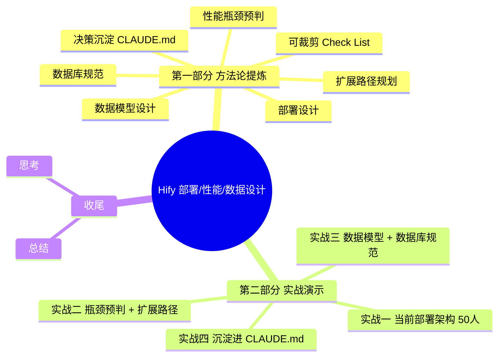
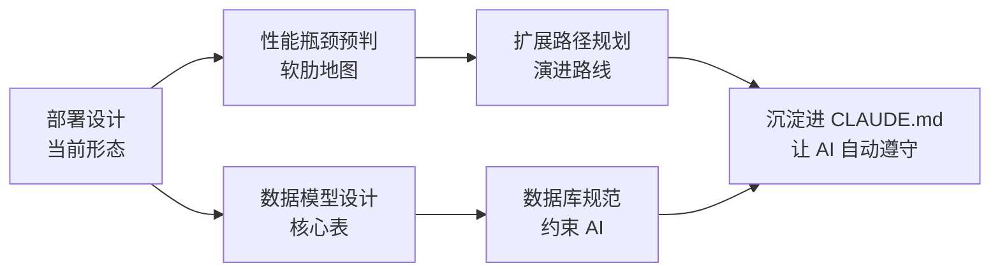
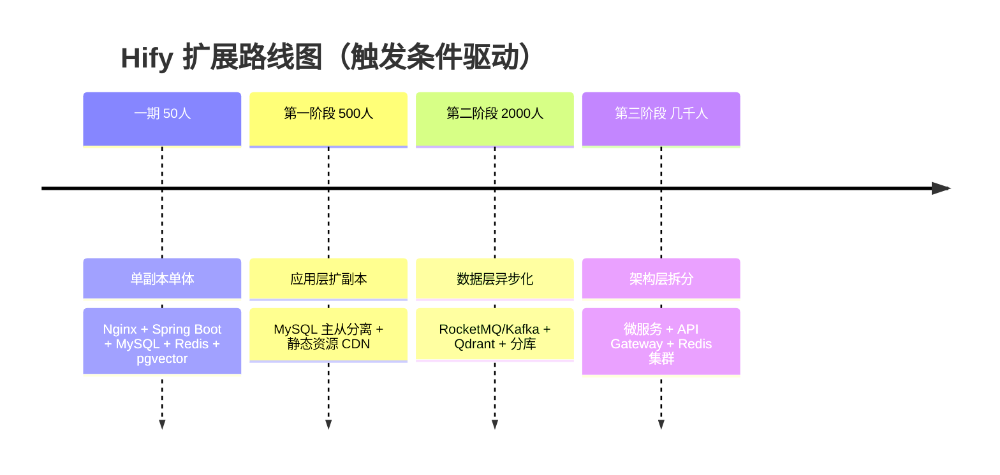

<!--
aicent-05-performance-and-data-design
AI编程方法 05：顶层设计 - 部署性能与数据设计
-->

**Hify 系统设计实战（第三篇）：部署、性能与数据设计**

本篇是系列的第三篇设计文章。前两篇分别定了项目背景与代码架构，本篇进入系统层面：当前怎么部署、瓶颈在哪、未来怎么扩展、数据怎么存。

<span style="color: red; font-weight: bold;">部署架构从第一天就在影响你的设计决策</span>——缓存放哪、数据库怎么连、服务之间怎么通信，全都取决于部署形态。提前想清楚，后面不返工。

**全文导读地图**



本篇分两部分：**第一部分**是方法论提炼（参考手册风，可速查、可裁剪）；**第二部分**是实战演示（教材风，紧扣 Hify 项目的技术栈，复现架构决策过程并解释 why）。

## 1. 部署、性能与数据设计方法论

### 1.1 方法论总览


系统层面的设计包含五个相互关联的子主题，它们构成一条完整的思考链：



五个子主题的共同目标：<span style="color: red; font-weight: bold;">用最低成本让系统跑起来、跑得稳、跑得久</span>。每个子主题都有明确的方法论结构，下面逐一展开。

### 1.2 部署设计方法论

#### (1) 目标与思考框架

**目标**：在项目早期就明确部署形态，让代码层面的设计决策（缓存位置、数据库连接方式、服务通信）有依据。

**思考框架**：从「规模 → 形态 → 组件 → 职责」四个维度逐层细化。

| 维度 | 关键问题 |
|---|---|
| 规模 | 当前用户量级？峰值并发？未来 1 年增长预期？ |
| 形态 | 单体/模块化单体/微服务？有状态服务有几个？ |
| 组件 | 接入层、应用层、数据层、外部服务各用什么？ |
| 职责 | 每个组件负责什么？请求怎么流转？ |

#### (2) 操作要领

1. **先把当前部署全貌画出来**：用图（架构图 + 请求流转图 + 职责清单）描述清楚，不要凭脑子想。
2. **明确"现在做"和"以后做"的边界**：每条"以后做"必须有触发条件（用户量、数据量），不是偷懒。
3. **让 AI 帮你出第一版**：把项目背景、技术栈、规模告诉 AI，让它给出架构总结，你再判断。
4. **AI 的输出要校验**：AI 适合模板化任务，但复杂架构需要你的积累和判断——<span style="color: red; font-weight: bold;">无脑让 AI 完全实现一个应用，当前阶段达不到</span>。

#### (3) 注意点

- <span style="color: red; font-weight: bold;">K8s 不等于复杂：早期可以只把 K8s 当部署壳</span>（单副本、不引入服务网格和多副本），等触发条件到了再加复杂机制。
- **静态资源与 API 要分流**：Nginx 同时托管静态文件 + 反向代理 API，避免后端被静态请求拖慢。
- **有状态服务独立部署**：数据库、缓存、向量库作为外部服务，不要和应用混在一起，便于扩展和替换。

### 1.3 性能瓶颈预判方法论

#### (1) 目标与思考框架

**目标**：在设计阶段就知道系统的"软肋"在哪，即使一期不处理，也要做到心里有数。

**思考框架**：按「瓶颈点 → 触发条件 → 严重程度 → 一期是否处理」四列分析，形成一张"软肋地图"。

#### (2) 操作要领

1. **按严重程度排序**：影响所有用户的 > 影响部分用户的 > 仅极端场景触发的。
2. **每个瓶颈给出触发条件**：用可量化的指标（用户量、数据量、P99 延迟），不要用"流量大"这种模糊词。
3. **明确一期处理决策**：处理 / 不处理 / 标记已知。处理的有方案，不处理的要记录"什么时候该动"。
4. **把架构图给 AI 让它分析**：这张地图不需要你从零画，AI 基于你的架构几分钟就能列出瓶颈清单，你判断它说得对不对就行。

#### (3) 注意点

- **性能问题 vs 稳定性/成本问题要分开**：例如外部 LLM API 超时不是性能问题，是稳定性问题；费用失控不是性能问题，是成本问题。但它们都可能在早期触发。
- **早期规模下，大多数瓶颈不会触发**：50 人规模下，真正能触发的瓶颈很少，不要被 AI 列的长清单吓到，只关注真实能触发的那一两个。
- <span style="color: red; font-weight: bold;">预判的价值在于"地图"而非"解决"</span>：这张表是未来出问题时的查询地图，不是一期必须落地的清单。

### 1.4 扩展路径规划方法论


#### (1) 目标与思考框架

**目标**：架构不能堵死未来的扩展路，但也不能提前演进（<span style="color: red; font-weight: bold;">过早优化比性能瓶颈本身的破坏力更大</span>）。

**思考框架**：分阶段演进，每阶段用「触发条件 → 改什么 → 不改什么 → 难点」四件套描述。

#### (2) 操作要领

1. **触发条件驱动，条件不到不动**：用可观测的指标（CPU/内存告警、P99 延迟、对话成功率）作为升级信号。
2. <span style="color: red; font-weight: bold;">每个阶段只动一个层</span>：要么动应用层（加副本），要么动数据层（主从分离/MQ），要么动架构层（微服务拆分），不要一次全动。
3. **明确"不改什么"**：和"改什么"同等重要，避免过度优化。例如单体不要轻易拆微服务，Redis 单节点不要轻易换集群。
4. **难点提前识别**：每个阶段的技术难点（如多副本的会话粘连、异步化的前端 breaking change、微服务的分布式事务）要在规划阶段就识别，留好接口设计。

#### (3) 注意点

- **当前架构的每个决策都在为扩展留口子**：模块化单体让微服务拆分成本可控、接口隔离让调用方式可平滑切换、会话存 Redis 让多副本不需要改代码——这些是架构功力的体现。
- <span style="color: red; font-weight: bold;">架构功力不在于现在做多复杂，在于不堵未来的路</span>。

### 1.5 数据模型设计方法论

#### (1) 目标与思考框架

**目标**：在设计阶段确定核心表的清单与关系，具体字段留到模块开发时再定（<span style="color: red; font-weight: bold;">现在定太细了后面一定会改</span>）。

**思考框架**：按功能域分组，每组识别"主表 → 子表 → 关联表"的层次结构。

#### (2) 操作要领

1. **按功能域分组**：避免一张大杂烩表，每组两三张表结构清晰。
2. **只定表名和关系，不展开字段**：字段细节等开发具体模块时再定。
3. **识别多对多关联表**：用户/工具/知识库和 Agent 之间往往是多对多，需要中间表。
4. **关注溯源表的设计价值**：例如 RAG 回复引用了哪些知识库片段，存下来既能给用户看依据（可信度），又能回溯分析检索质量（优化 RAG）——一张中间表，成本很低，价值不小。

#### (3) 注意点

- <span style="color: red; font-weight: bold;">配置型表 vs 流水型表要区分</span>：provider/agent/workflow 是配置数据，增长慢；message/document_chunk 是流水数据，增长快，需要差异化对待。
- <span style="color: red; font-weight: bold;">向量数据单独存储</span>：不要把向量塞进业务数据库，单独用向量库（pgvector / Qdrant），业务库只存元数据和指向向量库的 id。

### 1.6 数据库规范方法论


#### (1) 目标与思考框架

**目标**：把数据库层面的规范在设计阶段就定好，让 AI 后续每次建表、写查询都自动遵守。

**思考框架**：覆盖「通用字段 → 索引设计 → 大表预判 → 分页查询 → 向量库规范」五个维度，每条规则必须具体到 AI 能直接执行。

#### (2) 操作要领

1. **通用字段约定写死**：所有表共享主键、时间戳、逻辑删除字段，避免 AI 自由发挥。
2. **索引规则给出具体示例**：组合索引的列顺序、多对多关联表的双向索引、唯一约束的实现方式，都要有 SQL 示例。
3. **大表预判提前识别**：哪些表增长快？应对策略（建索引、归档、分离存储）要预先定。
4. **分页规范定游标优先**：早期 OFFSET 够用，但规范先定好游标分页，避免数据量上来后改代码。
5. **向量库的索引必须建**：HNSW 索引早期感知不到差异，但数据量上来后没索引会从毫秒级变秒级。

#### (3) 注意点

- <span style="color: red; font-weight: bold;">规范看起来是基础知识，但不写下来 AI 就不会遵守</span>：AI 不会自动给逻辑删除字段加索引、不会自动考虑分页性能、不会自动预判大表——这些必须显式写进规范。
- <span style="color: red; font-weight: bold;">数据库规范的价值在于"持续受益"</span>：现在花 10 分钟定好，后面每一次建表、每一次写查询都受益。
- **学会从 AI 的回答中学习**：问问题、辨别答案、学习答案——这是把 AI 融入工作的核心思路。

### 1.7 决策沉淀方法论（写进 CLAUDE.md）

设计阶段产出的所有决策（部署架构、数据库规范、扩展路径）必须结构化沉淀进 `CLAUDE.md`，让 Claude Code 在后续每次编码时自动遵守。

**沉淀结构建议**：
- 部署架构：组件清单 + 缓存策略
- 数据库规范：通用字段 + 索引规则 + 分页规则 + 大表预判 + 向量库规范
- 扩展路径：阶段化演进 + 触发条件

**沉淀的检验标准**：Claude Code 后续建表时会自动加 `deleted` 进索引、会自动用游标分页、会自动给 pgvector 建 HNSW 索引——如果不会，说明规范没写够细。

### 1.8 可裁剪 Check List

下表是设计阶段的可裁剪清单，按五个维度组织，每条都是可执行的最小动作：

| 维度   | 检查项                     | 完成标志                       |
| ---- | ----------------------- | -------------------------- |
| 部署设计 | 画出当前部署架构图（含组件与请求流转）     | 有架构图 + 职责清单                |
|      | 列出"现在做"与"以后做"对比表        | 每条"以后做"有触发条件               |
| 瓶颈预判 | 列出系统性能瓶颈，按严重程度排序        | 每条有触发条件 + 一期处理决策           |
|      | 识别早期就能触发的瓶颈（如外部 API 超时） | 有具体应对方案                    |
| 扩展路径 | 设计 3 阶段演进路径             | 每阶段有触发条件/改什么/不改什么/难点       |
|      | 验证当前架构决策为扩展留口子          | 接口隔离、会话共享、模块化等             |
| 数据模型 | 列出核心表，按功能域分组            | 表名 + 关系，不展开字段              |
|      | 识别流水型大表                 | message / document_chunk 等 |
|      | 识别需要溯源的关联（如 RAG 引用）     | 有中间表设计                     |
|      | 定义通用字段（主键/时间戳/逻辑删除）     | 有 SQL 模板                   |
|      | 定义索引规则（5 条以上）           | 每条有 SQL 示例                 |
|      | 定义分页规则（游标优先）            | 有正反示例                      |
|      | 定义向量库规范（HNSW + LIMIT）   | 有建表示例                      |
| 决策沉淀 | 把上述决策写进 CLAUDE.md       | 三大块结构化                     |
|      | 验证 AI 后续会自动遵守           | 抽查建表/查询                    |

## 2. 实战一：当前部署架构设计（50 人规模）

### 2.1 项目背景与部署目标


Hify 是一个模块化单体应用，技术栈为 Spring Boot + Vue + MySQL + Redis + pgvector。目标用户量是 50 人内部使用，生产环境用 Docker + K8s 部署。

50 人规模意味着什么？真实压力极小，峰值并发可能就几十个请求。这个规模下，部署架构的核心诉求是"<span style="color: red; font-weight: bold;">简单、可观测、留扩展口</span>"，而不是"高可用、高并发"。

### 2.2 用 Claude Code 梳理部署全貌

把项目背景、技术栈、规模一次性告诉 Claude Code，让它出第一版架构。提示词原文如下：

```text
Hify 是模块化单体，技术栈 Spring Boot + Vue + MySQL + Redis + pgvector。
目标 50 人内部使用，生产环境用 Docker + K8s 部署。
帮我设计当前阶段的部署架构：有哪些组件、请求怎么流转、每个组件的职责是什么。
```

### 2.3 架构组件与请求流转

#### (1) 部署架构总览

Claude Code 给的架构总结：


<!-- 
路径：imgs/aicent-05-performance-and-data-design/93a673a106ff86a2217a88f5c6cc3209_MD5.jpg
用途：推测为 Claude Code 给出的 50 人规模部署架构总览图
内容：推测展示 Nginx、Spring Boot、MySQL、Redis、pgvector 等组件的组合关系
-->

回答的核心是标准的单体 + 三个有状态服务的组合：

| 层 | 组件 | 职责 |
|---|---|---|
| 接入层 | Nginx | 静态资源托管 + API 反向代理 |
| 应用层 | Spring Boot（K8s Deployment，一期单副本） | 业务逻辑 |
| 数据层 | MySQL 8.x | 业务数据 |
| 缓存层 | Redis 7.x | 缓存与会话 |
| 向量层 | PostgreSQL + pgvector | 向量检索 |

K8s 在这里只作为部署壳，**不引入服务网格和多副本等复杂机制**。

#### (2) 请求流转链路


<!-- 
路径：imgs/aicent-05-performance-and-data-design/371d33ace2efb63e3634116914a339e4_MD5.jpg
用途：推测为请求流转链路图
内容：推测展示用户请求 → Nginx 分流 → 静态资源/API → Spring Boot → 各数据存储的路径
-->

用户请求经 Nginx 分流：

- 静态资源 → Nginx 直接返回
- API 请求 → 转发给 Spring Boot
- Spring Boot 按需读写 MySQL（业务数据）、Redis（缓存会话）、pgvector（向量检索）

#### (3) 各组件职责


<!-- 
路径：imgs/aicent-05-performance-and-data-design/4516a3d5325358d3998271b3e5bf9ae7_MD5.jpg
用途：推测为各组件职责清单图
内容：推测展示每个组件的具体职责和交互方式
-->

### 2.4 "现在做"与"以后做"的边界


Claude Code 给了一个最有价值的对比——当前阶段该做什么、暂时跳过什么：


<!-- 
路径：imgs/aicent-05-performance-and-data-design/0632ac4702796e5dce00d7472f3e9793_MD5.jpg
用途：推测为"当前做"与"以后做"对比表
内容：推测展示当前阶段实施项 vs 暂时跳过项（如多副本、服务网格、CDN 等）及其触发条件
-->

这张表是这次分析最有价值的部分——它不只告诉你"现在长什么样"，还帮你划了一条线：

- 每个"暂时跳过"都有**明确理由**，不是偷懒，是一期确实不需要
- 每个"暂时跳过"都有**触发条件**（用户量上来、数据量变大），等条件到了再逐步加

### 2.5 AI 给的架构要不要照单全收


<!-- 
路径：imgs/aicent-05-performance-and-data-design/b57230eb9f35d0a9d149740721f46d1e_MD5.jpg
用途：推测为对 Claude Code 架构输出的整体评价
内容：推测展示对当前架构的认可 + 局限性提示
-->

Claude Code 给的架构基本就是我们要的，没什么大问题。但是**还是需要你的积累和判断**：

- 这个部署架构较为简单，AI 能搞定
- 如果是更复杂的架构，就需要我们调整——也就是需要积累
- 无脑让 AI 完全实现一个应用，当前阶段还达不到

> **延伸思考**：以后程序员的价值在于思考、拆解、边界判断等架构层面的能力。这个要求比之前高多了，也呼应了系列第一篇——我们需要是一个架构师，不应该只是一个写代码的程序员。

## 3. 实战二：性能瓶颈预判与扩展路径规划

### 3.1 性能瓶颈预判


大部分工程师不会提前想性能瓶颈，等出了问题再救。但<span style="color: red; font-weight: bold;">你作为AI的架构师，应该在设计阶段就知道瓶颈可能在哪</span>。即使一期不处理，也要做到心里有数。

#### (1) 用 Claude Code 分析瓶颈

提示词原文：

```text
基于 Hify 当前的部署架构（Nginx + Spring Boot + MySQL + Redis + pgvector + 外部 LLM API），
帮我分析：这个系统的性能瓶颈可能在哪？按严重程度排序，每个瓶颈给出触发条件和一期是否需要处理。
```

Claude Code 的输出：


<!-- 
路径：imgs/aicent-05-performance-and-data-design/eb5afe26904c9d7d79b1a76382c4f2a8_MD5.jpg
用途：推测为 Claude Code 给出的性能瓶颈分析输出
内容：推测展示多个潜在瓶颈点及分析
-->

#### (2) 瓶颈排序与一期处理决策

Claude Code 按严重程度排序：


<!-- 
路径：imgs/aicent-05-performance-and-data-design/db061f0dcc47b60a90ef980599a9d011_MD5.jpg
用途：推测为瓶颈按严重程度排序表
内容：推测展示每个瓶颈的触发条件、严重程度、一期处理决策
-->

核心结论非常直接：<span style="color: red; font-weight: bold;">一期不需要处理任何性能瓶颈</span>。50 人规模的真实压力极小，所有瓶颈的触发条件都远超当前规模。

看这张表你会发现，真正在 50 人规模下能触发的只有第一行——**LLM 调用慢且占线程**。其他瓶颈的触发条件都是百万级数据或几百人并发，离我们很远。

> **关键区分**：<span style="color: red; font-weight: bold;">唯一需要提前防范的是外部 LLM API 的超时和费用失控——这不是性能问题，是稳定性和成本问题</span>。

#### (3) 一期落地两件事

一期只做两件事：

1. **LLM 调用设超时 + 线程隔离 + 熔断**
   - 这是唯一能在 50 人规模下真实触发、影响所有用户的问题
   - 系列第四篇已经设计好方案（独立线程池、Resilience4j、超时控制），实现时落地就行

2. **Nginx 开启 gzip**
   - 成本极低（一行配置），首屏加载速度直接可感知

其他瓶颈全部标记"已知但暂不处理"——不是忽略，是时机未到。等触发条件到了，你第一时间知道该动哪里——**因为这张表就是你的地图**。

> <span style="color: red; font-weight: bold;">本节价值：不在于解决了什么问题，在于你脑子里有了一张系统"软肋"地图</span>。后面出了性能问题，你不用猜，查表就行。

### 3.2 扩展路径：从 50 人到几千人


一期 50 人，但如果 Hify 做得好，可能要推广到更大范围。架构上不能堵死这条路。但**也不能提前演进**——过早优化比性能瓶颈本身的破坏力更大。

提示词原文：

```text
如果 Hify 要从 50 人扩展到几千人，当前架构需要怎么演进？
帮我设计一个分阶段的扩展路径，每一步的触发条件是什么、改什么、不改什么。
```

#### (1) 演进总览

Claude Code 给了三个阶段：


<!-- 
路径：imgs/aicent-05-performance-and-data-design/1695bd037aeaa8b692fd0dc765b557ec_MD5.jpg
用途：推测为三阶段扩展路径图
内容：推测展示 50→500、500→2000、2000→几千人 三个阶段的演进概要
-->

每个阶段有明确的触发条件，条件不到就不动。下面逐阶段拆解。

#### (2) 第一阶段：50 → 500 人

| 项 | 内容 |
|---|---|
| **触发条件** | 响应变慢，`docker stats` 显示 CPU / 内存持续告警 |
| **改什么** | Spring Boot 从 1 副本扩到 2-3 副本；MySQL 加读写分离（一主一从）；静态资源上 CDN |
| **不改什么** | 整体单体架构不动，pgvector 不换，Redis 单节点不动 |
| **难点** | Spring Boot 多副本要处理 SSE 的连接粘连——用户的流式对话不能被负载均衡随机分发到不同实例。解决方案是用 Redis 做会话共享 |

#### (3) 第二阶段：500 → 2000 人

| 项 | 内容 |
|---|---|
| **触发条件** | LLM 调用队列堆积，对话成功率下降；知识库检索 P99 > 2s |
| **改什么** | 引入消息队列（RocketMQ/Kafka）做 LLM 异步调用削峰；pgvector 迁移到独立 Qdrant；MySQL 按业务模块分库 |
| **不改什么** | Spring Boot 仍是单体不做微服务拆分，Redis 架构不动 |
| **难点** | LLM 异步化后，前端要从 SSE 改成轮询或 WebSocket，是 breaking change。改动成本不低，所以不到触发条件不做 |

#### (4) 第三阶段：2000 → 几千人

| 项 | 内容 |
|---|---|
| **触发条件** | 单个模块的发布频率互相干扰；某一模块（如 Agent 执行）资源消耗远超其他模块 |
| **改什么** | 按模块拆微服务（Agent 执行、知识库、对话历史各自独立）；引入 API Gateway 替代 Nginx 路由；Redis 换集群模式 |
| **不改什么** | MySQL 主从架构不动，Qdrant 不动，K8s 编排层不动 |
| **难点** | 微服务拆分带来分布式事务问题，需要引入 Saga 或 TCC 模式。系列第四篇定的"跨模块走 Service 接口"在这里发挥作用——拆分时只改调用方式，接口签名不变 |

#### (5) 三阶段对比与路线图价值

三阶段的对比总览：


<!-- 
路径：imgs/aicent-05-performance-and-data-design/13cf088b8b2fb4f81a0d66b11b140984_MD5.jpg
用途：推测为三阶段对比总览表
内容：推测展示三个阶段在触发条件、改动项、技术栈选择上的横向对比
-->

用一张时间线图总结扩展路线：



总结图：


<!-- 
路径：imgs/aicent-05-performance-and-data-design/6c6b0998b8585ac9f26361311c67490b_MD5.jpg
用途：推测为扩展路线图总结图
内容：推测展示三阶段演进的整体路线与决策依据
-->

> **关键观察**：系列第四篇的每个设计决策都在为这条路径留口子——
> - **模块化单体**让第三阶段的微服务拆分成本可控
> - **接口隔离**让调用方式可以平滑切换
> - **会话存 Redis**让第一阶段的多副本不需要改代码

<span style="color: red; font-weight: bold;">架构设计的功力不在于现在做多复杂，在于现在做的每个决策都不堵未来的路</span>。

## 4. 实战三：数据模型与数据库规范

### 4.1 核心数据模型概览


核心表有哪些、关系怎么样，先列出来。具体字段设计等后面每个模块开发时再定——**现在定太细了后面一定会改**。

提示词原文：

```text
基于 Hify 的功能范围（模型管理、Agent、对话、工作流、知识库、MCP 工具），
帮我梳理核心数据表和它们之间的关系。只要表名和关系，不展开字段。
```

#### (1) 用 Claude Code 梳理核心表

Claude Code 给了一份完整的梳理，确认后定稿。按功能域分组如下：

#### (2) 按功能域分组

| 功能域 | 表 | 关系 |
|---|---|---|
| 模型管理 | `model_provider` → `model` | 一对多（一个 OpenAI 下有 GPT-4o、GPT-3.5 多个模型） |
| 知识库 | `knowledge_base` → `document` → `document_chunk` | 一对多链；`document_chunk` 是向量化的最小单位，存在 pgvector |
| 工具 | `tool` | 独立表，存 MCP 工具定义 |
| Agent | `agent` | 关联最多的表：→ `model`（多对一）；↔ `knowledge_base`（多对多，通过 `agent_knowledge_base`）；↔ `tool`（多对多，通过 `agent_tool`） |
| 工作流 | `workflow` → `workflow_node` | 一对多；`workflow_node` 里的 LLM 节点也关联 `model` |
| 对话 | `conversation` → `message` | 一对多；`conversation` 关联 `agent` 或 `workflow`（对话绑定的执行对象） |
| 对话溯源 | `message` ↔ `document_chunk` | 多对多，通过 `message_reference`（做 RAG 溯源——回答引用了哪些知识库片段） |
| 用户 | `user`、`api_key` | `user` 发起 `conversation`；`api_key` 用于 API 发布调用 |

关系汇总：


<!-- 
路径：imgs/aicent-05-performance-and-data-design/1a730303271e394cecb1236efab3e6d2_MD5.jpg
用途：推测为数据表关系汇总图（ER 图）
内容：推测展示 16 张核心表及其关联关系，按功能域分组
-->

总共约 16 张表。看着多，但按功能域分组后每组就两三张，结构清晰。


<!-- 
路径：imgs/aicent-05-performance-and-data-design/8ac8b24babcef8d48a3aa5aaaca7e8b8_MD5.jpg
用途：推测为对 Claude Code 表结构输出的整体评价
内容：推测展示对表结构完整度的认可 + 协作思路提示
-->

> **协作思路**：Claude Code 设计的这个表结构比想象的完整得多，比手工设计更好、更快。AI 很适合这种模板化任务。要学会清晰知道 AI 能干什么、干得好什么，而你要做什么——我们和 AI 不是敌人，是合作伙伴。

#### (3) message_reference 的设计价值

`message_reference` 这张表值得专门说明：它记录的是"这条 AI 回复引用了知识库的哪些片段"。

很多人做 RAG 不存这个关系，回复完就丢掉了检索结果。但存下来有两个好处：

1. **可信度**：用户可以看到"AI 的回答依据是什么"
2. **优化回路**：后续优化 RAG 效果时，可以回溯分析检索质量

<span style="color: red; font-weight: bold;">一张中间表，成本很低，价值不小</span>。

### 4.2 数据库性能规范


表结构后面再定，但数据库层面的规范现在就要定——后面 Claude Code 每次建表、写查询都要遵守。

提示词原文：

```text
Hify 用 MySQL 8.x + pgvector。帮我定义数据库层面的性能规范，覆盖：
索引设计原则、大表预判和应对策略、分页查询注意事项、通用字段约定。
要求具体到 AI 建表时能直接执行。
```

#### (1) 通用字段约定

所有表必须包含四个公共字段：

```sql
id BIGINT NOT NULL AUTO_INCREMENT PRIMARY KEY,
created_at DATETIME(3) NOT NULL DEFAULT CURRENT_TIMESTAMP(3),
updated_at DATETIME(3) NOT NULL DEFAULT CURRENT_TIMESTAMP(3) ON UPDATE CURRENT_TIMESTAMP(3),
deleted TINYINT(1) NOT NULL DEFAULT 0
```

几条硬规矩：

| 规则 | 说明 |
|---|---|
| 主键用自增 BIGINT | 禁止 UUID（索引性能差） |
| 禁止用 NULL | 业务空值用空字符串或 0 代替 |
| 金额和 Token 用量用 BIGINT 存最小精度 | 不用 DECIMAL |
| 枚举字段用 VARCHAR(32) | 不用 MySQL ENUM 类型（ENUM 加值要改表结构） |

> 这就是进入团队要学习的团队规范——把它写下来，让 AI 也按团队规范来。

#### (2) 索引设计原则

Claude Code 给了五条具体规则，每条带示例。

**规则一：逻辑删除字段必须加进索引。** 几乎所有查询都带 `deleted = 0`，不加进索引等于索引白建。

```sql
INDEX idx_agent_user (user_id, deleted)
-- 而不是：
INDEX idx_agent_user (user_id)
```

**规则二：组合索引等值列在前，范围列在后。** 这是 MySQL 索引的基本原则，但不提醒 Claude Code，它自己写查询时经常不遵守。

```sql
INDEX idx_message_conv_time (conversation_id, created_at)
```

**规则三：多对多关联表两个方向都要索引。** `agent_tool` 表按 `agent_id` 查和按 `tool_id` 查都是高频操作，只建一个方向的索引，另一个方向就全表扫描。

```sql
PRIMARY KEY (agent_id, knowledge_base_id),
INDEX idx_kb_agent (knowledge_base_id)
```

**规则四：唯一约束用 UNIQUE INDEX，不要只在代码层校验。** 并发场景下代码校验有竞态问题，数据库约束才是最后防线。

**规则五：禁止在大文本字段建索引。** `content`、`prompt` 这类 TEXT 字段不能建索引，需要全文搜索的场景后续引入 ES。

#### (3) 大表预判与应对

Hify 中增长最快的两张表：

| 表 | 增长特征 | 应对策略 |
|---|---|---|
| `message` | 每次对话产生 2-N 条记录，50 人每天几百到上千条 | 建好时间范围索引（`conversation_id` + `created_at`），预留按时间归档的能力。一期建好索引够用半年 |
| `document_chunk` | 知识库分块数据，100 篇文档可能产生 5000+ 行 | 向量数据存 pgvector，MySQL 只存元数据和 `vector_id`（指向 pgvector 的记录），不在 MySQL 里存向量本身 |

其他表（`provider`、`agent`、`workflow`）都是配置数据，增长慢，不需要特别关注。

#### (4) 分页查询规范

```sql
-- 错误示例（大表深分页性能差）：
SELECT * FROM message ORDER BY id DESC LIMIT 20 OFFSET 100000;

-- 正确示例（游标分页）：
SELECT * FROM message
WHERE conversation_id = ?
AND id < #{lastId}
AND deleted = 0
ORDER BY id DESC
LIMIT 20;
```

一期数据量小，OFFSET 够用。但规范先定好，Claude Code 知道用游标分页，后面数据量上来了不用改代码。

**补充规则：**

- 管理后台必须用 OFFSET 的场景，限制最大页数（超过 10000 条直接提示缩小查询范围）
- COUNT 查询单独处理，列表页只在第一页返回 total，翻页不重复查——这个细节 Claude Code 不说你很容易忽略，但它对大表的查询性能影响很大

#### (5) pgvector 规范

向量数据单独存 PostgreSQL，和 MySQL 业务数据分离：

```sql
CREATE TABLE vector_chunk (
    id BIGSERIAL PRIMARY KEY,
    chunk_id BIGINT NOT NULL,
    embedding vector(1536) NOT NULL,
    created_at TIMESTAMPTZ NOT NULL DEFAULT NOW()
);

CREATE INDEX idx_embedding_hnsw
ON vector_chunk
USING hnsw (embedding vector_cosine_ops)
WITH (m = 16, ef_construction = 64);
```

两条硬规矩：

1. **必须建 HNSW 索引**——一期数据量小感知不到差异，但数据量上来后，没索引检索会从毫秒级变成秒级
2. **检索时必须加 LIMIT**——禁止不加 LIMIT 的向量查询（全量排序会拖垮数据库）

> **规范的价值**：这些规范看起来是数据库基础知识，但你不写进 CLAUDE.md，Claude Code 建表时就不会自动加 `deleted` 进索引、不会考虑分页性能、不会预判大表问题、不会给 pgvector 建 HNSW 索引。<span style="color: red; font-weight: bold;">写了，后面每一次建表、每一次写查询都自动遵守。</span>

## 5. 实战四：把架构决策沉淀进 CLAUDE.md


### 5.1 沉淀范围与结构

本篇的所有决策写进 CLAUDE.md，分三大块：部署架构、数据库规范、扩展路径。沉淀后，Claude Code 对 Hify 从代码怎么写到系统怎么跑都有了完整的认知。

### 5.2 部署架构片段

下面是写入 CLAUDE.md 的部署架构片段（保留原文格式）：

```text
## 部署架构

### (1) 生产环境：Docker + K8s

- 前端：Nginx 托管静态文件 + API 反向代理（proxy_buffering off）
- 后端：Spring Boot，K8s Deployment（一期单副本）
- 数据库：MySQL 8.x（外部服务）
- 缓存：Redis 7.x（外部服务）
- 向量库：PostgreSQL + pgvector（外部服务）

### (2) 本地开发：java -jar + npm run dev，start.sh 一键启动

### (3) 缓存策略
- Provider/Agent 配置：Redis Cache-Aside，TTL 30min
- 对话上下文：Redis，TTL 2h
- 对话消息、知识库文档：不缓存，走数据库
- LLM 响应：不缓存
```

### 5.3 数据库规范片段

下面是写入 CLAUDE.md 的数据库规范片段（保留原文格式）：

```text
## 数据库规范

### (4) 通用字段
- 主键 id BIGINT 自增，禁止 UUID
- 时间字段 created_at / updated_at，DATETIME(3)
- 逻辑删除 deleted TINYINT(1)
- 禁止 NULL，空值用空字符串或 0
- 枚举用 VARCHAR(32)，不用 MySQL ENUM

### (5) 索引规则
- 命名 idx_{表名}_{字段名}
- 逻辑删除字段必须加进组合索引
- 组合索引等值列在前，范围列在后
- 多对多关联表两个方向都要索引
- 唯一约束用 UNIQUE INDEX，不只在代码层校验
- 禁止在 TEXT/BLOB 字段建索引
- 不建数据库级外键约束，应用层维护

### (6) 分页规则
- 默认用游标分页（WHERE id < lastId ORDER BY id DESC LIMIT N）
- OFFSET 分页限制最大 10000 条
- COUNT 只在第一页查，翻页不重复查

### (7) 大表预判
- message：增长最快，必须建 (conversation_id, created_at) 索引
- document_chunk：MySQL 只存元数据，向量存 pgvector

### (8) pgvector 规范
- 向量表建在 PostgreSQL，维度固定 1536
- 必须建 HNSW 索引
- 检索必须加 LIMIT，禁止全量排序
```

### 5.4 扩展路径片段

下面是写入 CLAUDE.md 的扩展路径片段（保留原文格式）：

```text
## 扩展路径

一期单副本 → 多副本 + 主从分离（500人）
→ MQ 异步 + Qdrant（2000人）→ 微服务拆分 + Redis 集群（几千人）

触发条件驱动，条件不到不动。
```

到这里，CLAUDE.md 包含了项目概述（系列第三篇）、应用架构与代码组织（系列第四篇）、部署架构与数据库规范（本篇）。Claude Code 对 Hify 从代码怎么写到系统怎么跑都有了完整的认知。

## 6. 总结与思考


### 6.1 本篇核心收获

本篇做了四件事，对应四个实战章节：

| 实战 | 核心产出 | 价值定位 |
|---|---|---|
| 当前部署架构 | 50 人规模的部署全貌 + 现在做/以后做的边界 | 简单可跑、留扩展口 |
| 性能瓶颈预判 | 系统软肋地图（按严重程度排序） | **最有价值**：脑子里有地图，出问题不猜 |
| 扩展路径规划 | 三阶段演进路线（触发条件驱动） | 不堵未来的路 |
| 数据模型 + 数据库规范 | 16 张核心表 + 5 类数据库规范 | 一次定好，持续受益 |

**最有价值的是性能瓶颈预判。** 大部分工程师不会提前想这个，觉得一期先跑起来再说。但你作为AI的架构师，脑子里要有一张地图：瓶颈在哪、什么时候会触发、到时候改什么。有了这张地图，你对系统的掌控力完全不一样。**而且这张地图不需要你自己从零画**——让 Claude Code 基于你的架构分析，你判断它说得对不对就行。

**另一个值得强调的是数据库规范。** 这些内容（索引原则、分页注意事项、大表预判）对有经验的工程师来说是常识，但对 Claude Code 来说不是。你不写，它不会自动遵守。这些规范现在花 10 分钟定好，后面每一次建表、每一次写查询都受益。

> 系列第四篇解决了代码怎么组织，本篇解决了系统怎么跑。两篇合起来就是 Hify 的完整架构设计——从模块划分到部署形态到扩展路径到数据规范，一条线拉通。下一篇将进入规范体系搭建，手把手带你写完整的 CLAUDE.md，把前面所有决策结构化地沉淀下来。

### 6.2 思考

让 Claude Code 帮你分析你当前项目的性能瓶颈。把你的部署架构描述给它——用了什么数据库、什么缓存、多大用户量、主要压力在哪，然后问：

> "这个架构的性能瓶颈可能在哪？"

看看它指出的问题里有没有你之前没想到的。最后把它的分析和你的判断记录下来，作为你项目的"软肋地图"。

期待你的分享。如果本篇让你有所收获，也欢迎转发给有需要的朋友，邀请他来一起学习。
