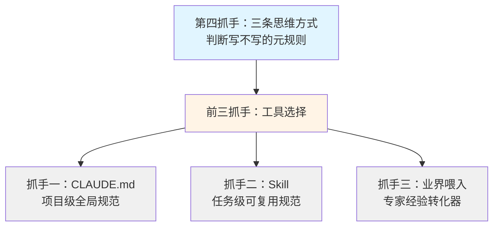

<!--
aicent-06-standard-claudeme-skill
AI编程方法 06：顶层设计 - 工程规范、CLAUDE.md和Skill
-->

## 1. 全文导读地图

本篇系统讲 Claude Code 的核心机制与实战技巧：CLAUDE.md、Skills、业界规范喂入。全文采用**双轨结构**——第一部分（章 2-5）是方法论提炼，第二部分（章 6）是实战演示。读完你能产出三样东西：① 一份结构完整的 CLAUDE.md；② 至少一个可用的 Skill；③ 一份"规范喂入 Prompt + review checklist"。先看地图，再选路径。

### 1.1 全文地图

下面这张图把全文结构与阅读路径一次铺开。你可以先看决策点（你的目标是什么），再决定进入哪条路径。


<!--
flowchart TD
    Reader([读者：初学者 / 熟练者]) --\> Decide{阅读目标?}
    
    Decide --\>|速查方法论| Part1[第一部分：方法论提炼]
    Decide --\>|复现实战| Part2[第二部分：实战演示]
    
    Part1 --\> Ch2[章 2：方法论四抓手]
    Ch2 --\> Ch3[章 3：CLAUDE.md 五层结构]
    Ch3 --\> Ch4[章 4：Skills 与业界喂入]
    Ch4 --\> Ch5[章 5：Check List 速查表]
    
    Ch5 -.可选深入.-> Part2
    
    Part2 --\> Ch6[章 6：Hify 落地全过程]
    Ch6 --\> Ch7[章 7：总结与思考]
    
    Ch7 --\> Output([产出：CLAUDE.md + Skill + Prompt])
-->

流向逻辑分三层：

- **速查型读者**（熟练者、快速回顾）：走 `章 2 → 章 3 / 章 4 → 章 5`，就能拿到完整方法论，不必进第二部分。
- **复现型读者**（初学者、系统学习）：走 `章 6`，每节都带方法论锚点，需要时回查第一部分对应章节。
- **章 5（Check List）** 是第一部分的压缩出口，对两类读者都有价值——速查型直接裁剪走，复现型对照实战逐项验证。

### 1.2 阅读路径建议

#### (1) 路径一：方法论速查（熟练者 / 快速回顾）

- **推荐顺序**：章 2 → 章 3 → 章 4 → 章 5
- **预计耗时**：30-40 分钟
- **适合**：项目某个阶段需要快速查阅"该写什么规范、怎么思考颗粒度"
- **产出**：一份可直接裁剪的项目阶段 Check List

#### (2) 路径二：实战复现（初学者 / 系统学习）

- **推荐顺序**：章 2 → 章 3 → 章 4 → 章 6 → 章 5 → 章 7
- **预计耗时**：1.5-2 小时
- **适合**：第一次接触 CLAUDE.md / Skills / 业界规范喂入，需要"知其然也知其所以然"
- **产出**：完整的方法论认知 + 一份可用的 CLAUDE.md 初稿

#### (3) 路径三：项目即查即用（项目开发中遇到问题）

- **推荐顺序**：直接跳到 **章 5（Check List）** 对应阶段，按图索骥回到 章 3 或 章 4
- **适合**：开发中遇到 AI 跑偏，需要快速查"这条规范该怎么写、放在哪一层"
- **产出**：解决当下问题的具体规范条目

### 1.3 本篇的来源与定位

本篇是系列的第 06 篇。前几篇已经往 CLAUDE.md 里写了东西 —— 03 篇写项目概述，04 篇写应用架构与代码组织，05 篇写部署架构与数据库规范。本篇补完第五层（接口规范 + 行为指令），并系统讲清楚 CLAUDE.md 本身的机制、Skills、业界规范喂入这三件事。这是顶层设计篇的收官：<span style="color: red; font-weight: bold;">CLAUDE.md 写完，Claude Code 对项目的全部认知就位</span>。

接下来，章 2 先给出方法论的四个抓手总览，让你在 5 分钟内看清"规范这件事，到底有哪几种钉法"。

## 2. 方法论：让 AI 持续产出合规代码的四个抓手

规范的真正难点从来不在"怎么写"，而在"什么时候写、写什么、写多细"。本质一句话——<span style="color: red; font-weight: bold;">把 AI 容易跑偏的地方用文字钉死</span>。这条本质贯穿所有工具：CLAUDE.md、Skill、业界喂入，乃至更上层的思维方式，都是把"AI 反复出错的地方"沉淀成可执行的指令。

本文把全部规范技巧抽象成 **4 个递进的抓手**：CLAUDE.md、Skil、业界规范喂入、三条思维方式。它们不是互斥的四选一，而是层层递进：




四抓手总览如下：

| 抓手            | 定位          | 适用场景                            | 何时建立         |
| ------------- | ----------- | ------------------------------- | ------------ |
| 抓手一：CLAUDE.md | 项目级全局规范     | 约束整个项目的代码与 AI 行为                | 项目启动时建立，渐进完善 |
| 抓手二：Skill     | 任务级可复用规范    | 一类任务的标准做法（如接口契约、单测、code review） | 发现指令在重复时创建   |
| 抓手三：业界规范喂入    | 专家经验转化器     | 业界已有成熟标准的领域（Java/MySQL/安全/API）  | 需要补充某领域规范时使用 |
| 抓手四：三条思维方式    | 判断"写不写"的元规则 | 决定一条规范该不该写、写多细                  | 写每一条规范时都用    |

下面四节分别展开这四个抓手，最后一节用一张优先级决策树把四者串起来。

### 2.1 抓手一：CLAUDE.md——项目级全局规范


#### (1) 一句话定位

CLAUDE.md 是你和 AI 的合作协议，放在项目根目录，Claude Code 每次启动新会话时自动加载，不需要手动喂。它对整个项目生效；你也可以在子目录放一份，子目录规范与根目录叠加，不会覆盖。

#### (2) 何时用

- **项目启动时建立**：哪怕只有半页纸，也先把项目范围边界"做什么、不做什"写下来
- **渐进式完善**：随着开发推进逐步补全（呼应抓手四的"规范是长出来的"）。从启动到稳定，CLAUDE.md 通常会经历数十次补充

#### (3) 边界

CLAUDE.md 不是"什么都往里塞"的杂物筐。三类规范的归属要分清：

- **全局规范放这里**：架构、代码组织、数据库、接口、AI 行为指令——所有任务共享的规矩
- **任务级规范不要放**：某一类任务（如写单测、设计接口契约）的标准流程，封装成 Skill，见 §2.2
- **一次性专家经验不要直接放全文**：业界几十页的标准手册原文塞进去会稀释重点，先用 §2.3 的喂入流程提炼，再放精华

#### (4) 速记要点

> **CLAUDE.md 速记**
> 
> - 放项目根目录，自动加载、全局生效
> - 项目启动时就建第一版，不要等"想清楚"再建
> - 只放全员规范，任务级流程交给 Skill
> - 业界手册先提炼再放，不要整段塞进去

### 2.2 抓手二：Skill——任务级可复用规范

#### (1) 一句话定位

Skill 是可复用的规范片段，放在 `.claude/skills/` 目录下，Claude Code 在执行任务时会自动匹配相关的 Skill 并按其流程走。

#### (2) 触发信号

**核心信号**：当你发现自己给 Claude Code 的指令有重复模式时，就该考虑创建 Skill 了。

举例：每次写新模块的接口契约，你都要重复"RESTful 风格、统一返回结构、分页用 PageResult、删除接口要标注是否做关联检查……"。这一段话重复了三遍，就是该沉淀成 Skill 的强信号。

#### (3) 与 CLAUDE.md 的分工

二者不是替代关系，是**分工关系**：

- **CLAUDE.md 定通用规矩**：路径风格（如统一前缀）、响应包装（如统一 Result 结构）、分页参数约定——这些是项目级、与具体任务无关的
- **Skill 定任务流程**：设计接口契约的步骤、写单测的步骤、做 code review 的步骤——这些是"执行某类任务时按这套流程走"

简言之：CLAUDE.md 是"项目的宪法"，Skill 是"某类任务的操作手册"。

#### (4) 速记要点

> **Skill 速记**
> 
> - 信号是"指令在重复"，重复两次以上就该 Skill 化
> - 一期不要建太多，跟着重复信号长出来
> - CLAUDE.md 管通用规矩，Skill 管任务流程
> - 创建后，下次说"帮我做 X"，AI 自动按标准流程走

### 2.3 抓手三：业界规范喂入——专家经验转化器

#### (1) 一句话定位

很多规范不需要从零发明，业界已有成熟标准。**把业界规范喂给 Claude Code，让它基于这些规范生成适合你项目的版本**——你 review 定稿后即可使用。

#### (2) 适用领域

任何"专家已沉淀成文"的领域都适用：

- Java 编码规范（如阿里巴巴 Java 开发手册、Google Java Style Guide）
- MySQL 设计规范（如阿里巴巴 MySQL 规范、互联网公司常见最佳实践）
- 安全规范、API 设计规范、日志规范……任何能找到成文标准的领域

#### (3) 一次喂入的标准动作

四步法（具体 Prompt 全文在第二部分实战演示）：

1. **选标准**：选定一份业界公认标准（如阿里巴巴 Java 开发手册）
2. **喂 Prompt**：把标准 + 你的项目语境（技术栈、关注点）一起给 Claude Code
3. **AI 提炼**：让它产出适合项目的精简版，**不是把整本手册塞进去**（那会稀释重点），而是提炼对 AI 写代码最关键的条目
4. <span style="color: red; font-weight: bold;">Review 定稿：人来判断哪些保留、哪些删、哪些调整措辞</span>

#### (4) 速记要点

> **业界喂入速记**
> 
> - 本质是"让 AI 把专家经验转化成你项目的规范"
> - 你不需要是每个领域的专家，但要会选标准、会 review
> - 关键是"精简"，不要把整本手册塞进 CLAUDE.md
> - 要知道最底层是什么，而不是直接用别人封装好的框架

### 2.4 抓手四：三条思维方式——判断"写不写"的元规则


前三个抓手解决"用什么封装"——CLAUDE.md、Skill、业界喂入各管一类。但还有一个更上层的判断：**这条规范该不该写、写多细、什么时候写**。这是本文的差异化价值，前三抓手是工具，第四抓手是判断工具怎么用的元规则。

#### (1) 从架构决策推导规范

- **规则**：每条规范必须能追溯到一个架构决策或一个具体问题，追溯不到就不写
- **why**：追溯不到的规范是凭空想出来的，没有依据，团队也不知道为什么这样定。空泛的口号（如"代码要优雅"）不是规范
- **举例**：架构选"模块化单体"（目的是以后能拆分微服务）→ 推导出"跨模块走 Service 接口，不直接引用其他模块的 Mapper"。这条规范不是凭空的，是架构决策的必然要求
- **应用**：写每条规范时问自己"这条规范追溯到哪个决策？"——追溯不到，就别写

#### (2) 颗粒度跟着问题走

- **规则**：AI 反复跑偏的地方写细，不跑偏的地方不写
- **why**：注意力是稀缺资源，篇幅爆炸会让 AI 抓不住重点。把篇幅集中在 AI 真正容易犯错的地方
- **应用**：写规范前先问"这条 AI 会不会跑偏？"——不会跑偏的就删掉，把注意力留给真会跑偏的地方

| 写不写    | 例子                | 理由        |
| ------ | ----------------- | --------- |
| 不值得占篇幅 | 文件编码用 UTF-8       | AI 基本不会搞错 |
| 必须写    | Controller 不写业务逻辑 | AI 经常犯    |
#### (3) 规范是长出来的，不是设计出来的

- **规则**：接受规范是渐进式完善的，不要追求一次写完
- **why**：没有任何项目的 CLAUDE.md 是提前想全的。所有规范都是在实际开发中遇到问题后补上去的
- <span style="color: red; font-weight: bold;">闭环：SDD（Spec-Driven Development）闭环驱动补全——每次 AI 跑偏，问自己"是不是规范没覆盖到"，然后补上</span>。一次跑偏补一条，规范就长出来了
- **应用**：项目启动时建立最小可用的 CLAUDE.md，迭代过程中逐步补全。不要试图在 Day 1 写出"完美版"

### 2.5 四抓手的优先级决策树


遇到一条规范要钉下来，该用哪个抓手？下图把"工具选择"（前三个抓手）和"质量校验"（第四个抓手）分成两阶段：先选对工具，再用三条思维方式校验。


<!--
flowchart TD
    Start[有一条规范要钉下来] --\> Q1{是项目级还是任务级?}
    Q1 --\>|项目级| Q2{业界有成熟标准吗?}
    Q1 --\>|任务级| Q3{指令在重复吗?}
    Q2 --\>|有| A1[业界规范喂入 → 提炼后入 CLAUDE.md]
    Q2 --\>|没有| A2[自己写进 CLAUDE.md]
    Q3 --\>|在重复| A3[创建 Skill]
    Q3 --\>|没重复| A4[临时描述即可]
    
    A1 --\> Q4{三条思维方式校验}
    A2 --\> Q4
    A3 --\> Q4
    Q4 --\> Q4a{能追溯到架构决策吗?}
    Q4a --\>|能| Q4b{颗粒度合适吗?}
    Q4a --\>|不能| Drop[不写]
    Q4b --\>|合适| Final[确定写入]
    Q4b --\>|太细/太粗| Adjust[调整颗粒度]
    Adjust --\> Final
-->

决策树的核心思路：**先选对工具，再用思维方式校验**。前三个抓手回答"装在哪里"，第四个抓手回答"值不值得装、装多细"。两阶段缺一不可——只用前三者会写出膨胀的规范，只用第四者会陷入空想没有落地工具。

### 2.6 总结：让业界标准为基准，逐步补充项目特点

全文方法论的最终归宿是这一句话：

> <span style="color: red; font-weight: bold;">让业界标准规范为基准，逐步补充满足项目自身特点的规范。</span>

你不需要从零发明每条规范——业界已经把 Java 怎么写、MySQL 怎么设计、API 怎么设计沉淀成文了，拿来用即可；但每条规范最终都要落到你项目的实际上，否则就是空文。

**四抓手的协作关系**可以用盖房子来类比：

- **CLAUDE.md 是地基**——项目级全局规范，所有任务都站在它上面
- **Skill 是构件**——任务级可复用，把重复的流程标准化
- **业界喂入是建材**——专家经验转化，省去你重新发明的力气
- **三条思维方式是施工准则**——判断每块砖该怎么放、放不放、放多稳

地基要先打、构件按需造、建材借外力、准则贯穿始终。这就是让 AI 持续产出合规代码的完整方法论。

## 3. CLAUDE.md 五层结构与撰写心法

CLAUDE.md 是你和 AI 的合作协议——项目是什么、代码怎么组织、有哪些规矩。它放在项目根目录，Claude Code 每次启动新会话时自动读取，你不需要手动喂。

| 维度 | 说明 |
|----|----|
| 文件位置 | 项目根目录（或子目录）下的 Markdown 文件 |
| 加载方式 | Claude Code 启动新会话时自动读取 |
| 生效范围 | 根目录 CLAUDE.md 对整个项目生效；子目录 CLAUDE.md 只对该目录生效，与根目录叠加（不覆盖） |

子目录规范的用法值得单独说明：你可以在某个子目录下放一份专属规范，它会与根目录的规范**叠加生效**，而不是覆盖。比如前端子目录放一份前端专属规范、对话引擎子目录放一份特殊约定，根目录的通用规矩依然适用，子目录只补充该模块特有的内容。

### 3.1 五层结构总览


前几篇已经实践了从宏观到微观的五层结构。这里不展开每层的具体内容（那是第二部分实战复现的事），只描述每层应该覆盖的维度，以及它对应项目的哪个阶段。

| 层级 | 写什么维度 | 项目哪个阶段写 |
|----|----|----|
| 第 1 层：项目上下文 | 项目是什么、做什么、不做什么 | 项目启动 |
| 第 2 层：架构规范 | 模块划分、依赖关系、跨模块调用 | 架构设计 |
| 第 3 层：代码组织规范 | 分层结构、各层职责（如 Controller/Service/Mapper） | 架构设计 |
| 第 4 层：部署与数据库规范 | 部署架构、索引规则、分页规范、向量数据库 | 数据库/部署设计 |
| 第 5 层：接口规范与行为指令 | 路径风格、响应结构、错误码、AI 行为模式 | 开发迭代 |

前四层是"约束代码与架构"——告诉 AI 代码长什么样、怎么组织。第五层多了一类特殊内容：**行为指令**，约束 AI 的行为模式，不只是约束代码风格。这是五层中最容易被忽略但最有用的一层。

### 3.2 撰写心法（贯穿五层）

在展开每一层之前，先把三条心法前置出来。这三条不是某一层独有的规则，而是**贯穿五层撰写过程**的元规则——判断"该不该写、写多细、什么时候写"。

#### (1) 心法一：从架构决策推导规范

每条规范必须能追溯到一个**架构决策**或一个**具体问题**。追溯不到，就没必要写。

举例：如果架构选了"模块化单体"（目的是以后能拆分微服务），那么"跨模块走 Service 接口、不直接引用其他模块的 Mapper"这条规范就是架构决策的必然要求——不这么写，未来拆分时会寸步难行。这条规范不是凭空想出来的，是从决策推导出来的。

反例：写了"代码要优雅"——这是空话，无法执行，也无法追溯。每写一条规范，问自己一句：**它对应哪个架构决策？** 答不上来就删掉。

#### (2) 心法二：颗粒度跟着问题走

AI 反复跑偏的地方写细，不跑偏的地方不写。你的注意力要放在 AI 真正容易犯错的地方。

举例对比：

- **文件编码 UTF-8**：AI 基本不会搞错，不值得占篇幅
- **Controller 不写业务逻辑**：AI 经常犯，必须写

颗粒度不是越细越好。把所有规则都写进去会让 CLAUDE.md 膨胀，AI 反而抓不住重点。**写多少，看 AI 实际跑偏了多少。**

#### (3) 心法三：规范是长出来的

CLAUDE.md 从半页纸到完整版，没有一条是提前想出来的，全部是在实际开发中遇到问题后补上去的。

这就是 SDD（Spec-Driven Development）的闭环：每次 AI 跑偏，问自己是不是规范没覆盖到，然后补上。**接受规范是渐进式完善的，不要追求一次写完。** 试图在项目启动时就把五层全部写满，只会写出大量用不上的空话。

这三条心法贯穿五层的撰写过程，是判断"该不该写、写多细、什么时候写"的元规则。接下来的 3.3-3.7，每层都会回扣这三条心法。

### 3.3 第 1 层：项目上下文


#### (1) 这一层写什么

- 项目是什么、做什么、不做什么
- 一句话的项目定位
- **边界清单**（"不做什么"列表）：明确列出项目不会涉及的功能

#### (2) 什么时候写

项目启动时——最初的产品定义阶段。这是五层中最早该动笔的一层。

#### (3) 撰写心法

**边界越明确，AI 越不会好心办坏事。**

"不做什么"要用具体动词短语写，不用"保持简洁""注重质量"这类虚泛口号。比如"不做多租户""不做计费""不做微调"——这种具体到功能名的边界，AI 才能照办。应用 §3.2.1 心法一：每条边界都要能追溯到产品决策（为什么不做？因为这一期不在这个范围内）。

#### (4) 3.3.4 反面案例

只写"做什么"不写"不做什么"。结果 AI 在生成代码时会自作主张加上多租户、计费、WebApp 发布等"看起来有用"的功能——它觉得自己在帮你，实际上把项目 scope 撑爆。

### 3.4 第 2 层：架构规范

#### (1) 这一层写什么

- **模块划分**：项目分哪些模块、每个模块的职责
- **依赖关系**：模块之间如何依赖（单向依赖？分层依赖？）
- **跨模块调用规则**：跨模块走 Service 接口，不直接引用其他模块的内部实现（如 Mapper、内部工具类）

#### (2) 什么时候写

架构设计阶段——在确定技术栈和整体架构之后、写具体代码之前。

#### (3) 撰写心法

**每条架构规范都要能追溯到具体的架构决策。**

应用 §3.2.1 心法一：架构规范不是凭空写出来的"最佳实践"，而是架构决策的下游产物。例如选了"模块化单体"，就推导出"跨模块走 Service 接口"；选了"事件驱动"，就推导出"模块间通过事件总线通信"。写之前先问：这条规范对应哪个架构决策？

#### (4) 反面案例

写了一堆架构规范但没有决策依据——比如写了"所有模块必须松耦合"但没说为什么、怎么算松。结果规范经不起推敲，团队也不知道该按什么标准判断，AI 生成的代码该耦合还是耦合。

### 3.5 第 3 层：代码组织规范

#### (1) 这一层写什么

- **分层结构**：如 Controller / Service / Mapper 三层
- **各层职责**：Controller 不写业务逻辑、Service 不直接操作数据库拼 SQL、Mapper 只负责持久化
- **命名约定**：包名、类名、方法名的规则（只写关键的，不写全部）

#### (2) 什么时候写

架构设计阶段——与第 2 层同步或紧随其后。架构定了模块划分后，紧接着就要定每个模块内部的代码组织。

#### (3) 撰写心法

**重点写 AI 容易跑偏的地方。**

应用 §3.2.2 心法二："Controller 不写业务逻辑"是 AI 最常犯的错——它生成 Controller 时顺手就把业务逻辑堆进去了，必须写。命名规则这种 AI 基本不会跑偏的，只写关键的（如包名约定），不展开全部规则。

#### (4) 反面案例

把所有命名规则、所有编码风格都写进去。篇幅爆炸，AI 反而抓不住重点，真正容易跑偏的"Controller 不写业务逻辑"被淹没在一堆 UTF-8 编码、缩进风格的细节里。

### 3.6 第 4 层：部署与数据库规范

#### (1) 这一层写什么

- **部署架构**：部署拓扑、外部依赖（数据库、缓存、消息队列）、环境变量管理
- **数据库索引规则**：高频查询字段建索引、组合索引的字段顺序
- **分页规范**：page 从 1 开始、pageSize 默认值与上限
- **向量数据库规范**（如适用）：向量维度、索引类型、相似度算法

#### (2) 什么时候写

数据库/部署设计阶段——在确定数据模型和部署方案之后。

#### (3) 撰写心法

**业界已有成熟标准的部分用业界喂入补充，项目特有的部分自己写。**

比如 MySQL 的索引规则、VARCHAR 长度上限、SELECT * 禁用——这些业界有公认标准（详见 §4.2 业界规范喂入），不需要从零发明。而向量数据库维度这种**项目特有**的内容，必须自己写清楚。应用 §3.2.2 心法二：分页参数（page 从 1 还是 0、pageSize 上限）是 AI 经常跑偏的地方，必须显式约束。

#### (4) 反面案例

不写分页规范。结果 AI 生成的代码分页参数混乱——这次 page 从 0 开始、下次从 1 开始，pageSize 没有上限，列表接口传 pageSize=10000 也照单全收，数据库直接被拉爆。

### 3.7 第 5 层：接口规范与行为指令


这是本讲补完的一层，是五层中**约束 AI 行为**最直接的一层。

#### (1) 接口规范（约束代码）

- **路径风格**：如 RESTful——`/api/v1/{资源复数名}`
- **响应结构**：如统一返回 `Result<T>`
- **分页参数**：如 page、pageSize 的命名与取值约定
- **错误码分段**：按模块分段（如四位数字按模块分段），便于排查定位

#### (2) 行为指令（约束 AI 行为模式）

这一部分不是约束代码风格，是约束 AI 的**行为模式**——遇到不同情况该怎么行事。三组核心行为指令：

**开发功能时**

- 简单实现，不引入非技术栈依赖（需要时先问）
- 不做过度抽象、不引入不必要的设计模式（除非明确要求）
- 所有外部调用必须有超时设置
- 配置项外化，不硬编码

**改代码时**

- 先理解相关模块的设计意图
- 不破坏已有接口契约
- 改完确保已有测试通过

**不确定时**

- 架构选择给 2-3 个方案对比，让用户拍板
- 规范没覆盖的情况先问，不要自己编规矩

#### (3) 撰写心法

**行为指令的措辞要具体强硬，不要用"建议"。**

AI 理解"建议"和"必须"的区别——"建议使用简单的实现方式"它当作可选参考，"每个功能用简单直接的方式实现"它才当作硬约束。应用 §3.2.2 心法二："改代码时"和"不确定时"是 AI 最容易跑偏的地方，**必须写**。

#### (4) 反面案例

- **不写"不确定时"指令**：AI 遇到规范没覆盖的情况会自己编一套规矩，每次编的还不一样——同一类问题这次这么处理，下次换个处理方式，你完全无法预测。
- **用"建议"措辞**：AI 把它当作可选建议，不严格遵守。你以为是硬约束，AI 觉得是参考。

### 3.8 接口契约：模块级蓝图（介于第 5 层与具体实现之间）

CLAUDE.md 里的接口规范定的是**通用规矩**（路径格式、响应结构、错误码分段）。但每个模块开始开发前，还需要一份**具体蓝图**——这个模块有哪些接口、每个接口的入参出参是什么。这就是接口契约。它比第 5 层更具体，但又还没到代码实现，介于两者之间。

#### (1) 接口契约的写法

每个接口定义：**HTTP 方法 + 路径 + 入参 + 出参 + 关联检查说明**。

- 标准 CRUD 用资源复数名路径
- 非 CRUD 操作用动词路径（如 `/test-connection` 表示测试连通性）
- 删除接口标注是否需要关联检查（如"删除前检查是否有其他模块在引用"）

#### (2) 什么时候写

**不需要**在项目开始时把所有模块的接口契约都写完。每个模块开发前，写那个模块的就行。这是 SDD 闭环的体现（呼应 §3.2.3 心法三）：规范是长出来的，接口契约也是长出来的。

#### (3) 给 AI 蓝图的价值

给 Claude Code 这份蓝图，它生成的 Controller 和 DTO 会**精确匹配你的设计**，不需要大面积返工。没有蓝图，AI 会自己猜接口长什么样——猜对了是运气，猜错了你要手动改一堆。

#### (4) 这一步真正要学的东西

> [!tip] 真正要学的不是"某个具体接口怎么定义"
> 在这一步我希望你学到的，不是某个具体模块的接口怎么定义。而是这两个更重要的能力：
>
> - **已有项目加功能时**，如何快速让 Claude Code 帮你提炼当前的规范，并沉淀为 CLAUDE.md——从而让接下来的开发顺起来。
> - **全新开发一个项目时**，如何快速有自己的规范——而不是从空白开始一砖一瓦地搭。
>
> 这两个问题比"某个具体接口怎么定义"重要得多。前者解决存量项目接入 AI 的痛点，后者解决新项目快速起跑的痛点。具体落地演示见第二部分章 6.3。


## 4. Skills 与业界规范喂入：可复用规范的两种封装

CLAUDE.md 解决的是"项目级全局规范"——写一次，整个项目自动加载。但有两类规范它装不下：

- **任务级规范**：怎么写单测、怎么做接口契约、怎么做代码 review——这类规范只在你执行某类任务时才需要，写进 CLAUDE.md 太细会稀释重点，不写每次又要重复描述。**Skill** 解决这类问题。
- **专家经验规范**：Java 编码规范、数据库设计规范、安全规范——这些业界已有成熟标准，你不需要从零发明。**业界规范喂入** 解决这类问题。

本章给出两种封装的使用边界、Skill 的通用骨架、业界喂入的四步法，最后用一张决策树把三种封装形态收敛起来。

**三种封装形态的边界对比**

| 封装形态 | 定位 | 生效范围 | 创建时机 |
|----|----|----|----|
| CLAUDE.md | 项目级全局规范 | 整个项目（根目录）/ 子目录（叠加生效） | 项目启动时建立，渐进完善 |
| Skill | 任务级可复用规范 | Claude Code 执行特定任务时自动匹配 | 发现指令在重复时创建 |
| 业界规范喂入 | 一次性专家经验转化 | 转化完并入 CLAUDE.md 或 Skill | 需要补充某领域规范时使用 |

### 4.1 Skill——可复用的规范片段


#### (1) Skill 是什么

一个放在 `.claude/skills/` 目录下的 Markdown 文件，描述一类任务的标准做法。Claude Code 在执行任务时会自动匹配相关的 Skill——你不需要手动喂，它按需触发。

#### (2) 什么时候该创建 Skill

**核心信号**：当你发现自己给 Claude Code 的指令有重复模式时，就该考虑 Skill 化了。

几个通用例子（不绑定任何具体模块）：

- 每次写新模块的接口契约，你都要说"RESTful 风格、Result 返回、分页用 PageResult..."
- 每次写单元测试，你都要说"测试方法命名、断言风格、Mock 范围..."
- 每次做代码 review，你都要说"关注点、review 步骤、产出格式..."

这些重复的指令，就是该沉淀成 Skill 的信号。

> [!note] 速记要点
> - 信号 = "指令在重复"，不是"我觉得将来会重复"
> - 重复 ≥ 2 次再考虑 Skill 化，过早抽象反而难维护
> - Skill 不替代 CLAUDE.md，而是补 CLAUDE.md 装不下的任务级规范

#### (3) Skill 的通用结构模板

一个 Skill 的通用骨架是三段式：**适用场景 / 步骤 / 输出格式**。

```text
# {任务名} Skill

## 1. 适用场景
当需要做 {某类任务} 时使用。

## 2. 步骤
1. 步骤一：...
2. 步骤二：...
3. 步骤三：...
...

## 3. 输出格式
{期望的产出格式说明}
```

这个骨架是通用的——具体内容根据你的任务类型填充。某个具体的 Skill（比如"接口契约设计 Skill"）的完整步骤和实战展开，留到第二部分章 6.4 演示。

#### (4) Skill 的创建节奏

- **一期不要创建太多 Skills**。开项目时手头一定有更紧迫的事。
- 随着开发推进，你会自然发现哪些指令在重复——那就是该创建 Skill 的信号。
- Skill 是**长出来的**，不是**设计出来的**——呼应 §2.4.3 的元规则"规范是长出来的"。预先设计一堆 Skill 等着复用，往往等来的是一堆没人用的过期文档。

> [!note] 速记要点
> - Skill 的节奏 = "发现一个、沉淀一个"
> - 不要为了"Skill 库齐全"而提前抽象
> - 高阶用法（把整个模块交付流程固化为 Skill）留到第 32 篇展开

### 4.2 业界规范喂入——专家经验转化器


#### (1) 适用领域

很多规范不需要从零发明——业界已经有成熟的标准，直接用就行。适用领域包括但不限于：

- **Java 编码规范**：阿里巴巴 Java 开发手册、Google Java Style Guide
- **数据库设计规范**：阿里巴巴 MySQL 规范、互联网公司常见的 MySQL 最佳实践
- **安全规范**：OWASP Top 10、企业安全编码规范
- **API 设计规范**：RESTful API 设计规范、GraphQL 最佳实践
- 任何一个**"专家已沉淀成文"**的领域

共性特征：这些领域已经有公认的成文标准，你重新发明一遍没有意义。

#### (2) 一次喂入的标准动作（四步法）

**核心方法论**：把业界规范喂给 Claude Code，让它基于这些规范生成适合你项目的版本——不是把整本手册原样塞进去。

四步法：

1. **选标准**：选定一份业界公认的标准（如阿里巴巴 Java 开发手册）。优先选最广为接受的那一份，不要为了小差异纠结。
2. **喂 Prompt**：告诉 Claude Code 项目背景 + 标准来源 + 期望覆盖的维度 + 期望精简程度。
3. **AI 提炼**：Claude Code 消化后帮你提炼出对 AI 写代码最关键的条目（不是把整本手册塞进去——那会稀释重点）。
4. **Review 定稿**：你 review 一遍，删掉不适用的、调整措辞，直接用。

**关键 Prompt 设计原则**（具体 Prompt 全文留第二部分章 6.5 演示）：

- 明确**项目类型**（如 Spring Boot 项目）——决定条目的相关性
- 指定**标准来源**（如阿里巴巴 Java 开发手册）——决定权威性
- 圈定**重点维度**（如命名、异常处理、日志、并发）——决定覆盖面
- 强调**精简**（"不要照搬原文，要精简到 AI 能直接执行"）——决定可执行性
- 把**已有规范**作为补充输入（"当前已有的规范是：[贴上]，帮我看看还有哪些遗漏"）——决定补全的针对性

> [!note] 速记要点
> - 四步法的关键不在"喂"，而在"AI 提炼 + 人 review"
> - 喂入的产出要落到**可执行**，不是落到"百科全书"
> - 已有规范作为输入，比从零生成更有针对性——AI 会主动补你没想到的条目

#### (3) 本质洞察

<span style="color: red; font-weight: bold;">你不需要是每个领域的专家，但你可以让 Claude Code 帮你把专家的经验转化成你项目的规范</span>。

喂入的标准动作可以概括成一条流水线：

```
业界标准 + 你的项目上下文 → 让 Claude Code 生成适配版本 → 你 review 定稿
```

一个比喻：你是项目经理，Claude Code 是专家顾问，业界标准是专家的"工作手册"。你不需要读完手册，但你需要知道项目要什么、哪些条目保留、哪些不适用——这是项目经理的本职。

> [!important] 工程师的基本素养
> 业界发展出了很多开发框架，会内置这些规范。但你要知道**最底层是什么**，而不是直接用别人封装好的。
>
> 框架会替你做大部分事，但当框架不够用、需要自定义、或者出问题要排查时，懂底层的人才能继续推进。

### 4.3 三种封装的决策树

一条规范要写下来时，先问它是项目级还是任务级，再问业界有没有成熟标准，最后问指令是否在重复。决策路径如下：


<!--
flowchart TD
    Q1[有一条规范要写下来] --\> Q2{是项目级还是任务级?}
    Q2 --\>|项目级| Q3{业界有成熟标准吗?}
    Q2 --\>|任务级| Q4{指令在重复吗?}
    Q3 --\>|有| Q5[业界规范喂入 → CLAUDE.md]
    Q3 --\>|没有| Q6[自己写进 CLAUDE.md]
    Q4 --\>|在重复| Q7[创建 Skill]
    Q4 --\>|没重复| Q8[临时描述即可]
-->

三种封装形态**不是互斥的**——一条规范可能从"临时描述"演进到"Skill"，再到"喂入业界标准"形成 CLAUDE.md 条目。典型演进路径：

- 第一次遇到 → 临时描述给 Claude Code
- 发现指令在重复 → 沉淀为 Skill
- 发现这个领域业界有标准 → 喂入业界规范，把 AI 提炼的版本并入 CLAUDE.md

关键是识别当下的最优封装形态——不要把任务级规范塞进 CLAUDE.md，也不要把项目级规范写成 Skill。

## 5. Check List：项目阶段速查表


这是一份**可裁剪资产**。前三章把方法论讲透了，本章把它们压成一张可勾选表，按项目阶段排列。读者可以直接复制走，对照自己的项目逐条勾选；不需要的条目删掉即可，不必纠结。

每条都是动词开头的动作，不解释 why（why 在前几章已说透），只列动作。

### 5.1 项目启动阶段

（写 CLAUDE.md 第 1 层「项目上下文」+ 第 2 层「架构规范」的边界清单）

- [ ] 用一句话写清楚"项目是什么、做什么"（项目定位）
- [ ] 用动词短语列"项目不做什么"边界清单（如：不做多租户、不做计费、不做模型微调、不做 WebApp 发布）
- [ ] 标注技术栈与版本（语言、框架、JDK/运行时版本）
- [ ] 标注部署形态（单体 / 模块化单体 / 微服务），作为后续规范的推导起点
- [ ] 每条边界能追溯到一个架构决策或具体问题，追溯不到的不写
- [ ] 删除"保持简洁""注重质量"这类虚泛口号，替换成可勾选的具体动作

### 5.2 架构设计阶段

（写第 2 层「架构规范」+ 第 3 层「代码组织规范」）

- [ ] 写模块划分（用文字或图表描述模块清单与职责）
- [ ] 写依赖方向规则（如单向依赖、禁止跨层反向调用）
- [ ] 写跨模块调用规则（如只通过 Service 接口、禁止直接依赖其他模块的 Mapper）
- [ ] 写分层职责（Controller / Service / Mapper 各自的边界）
- [ ] 明确写"Controller 不写业务逻辑"（AI 容易跑偏，必须显式约束）
- [ ] 明确写"Service 不直接拼 SQL"（SQL 全部走 Mapper）
- [ ] 不写 AI 不会犯的地方（如"文件编码 UTF-8"），把篇幅留给易跑偏处

### 5.3 数据库/部署阶段

（写第 4 层「部署与数据库规范」，含业界喂入的 MySQL 规范补充）

- [ ] 写部署架构（容器 / 编排 / 外部依赖：MySQL/Redis/向量库/MQ）
- [ ] 写索引规则：高频查询字段建索引、组合索引字段顺序遵循最左前缀
- [ ] 写分页规范：page 从 1 开始、pageSize 默认值与上限
- [ ] 写向量数据库规范（如用 RAG）：向量维度、索引类型、距离度量
- [ ] 补充业界 MySQL 规范遗漏：VARCHAR 长度 ≤ 5000、单表字段数 ≤ 30
- [ ] 补充业界 MySQL 规范遗漏：禁用 `SELECT *`、`UPDATE`/`DELETE` 必须带 `WHERE`
- [ ] 补充业界 MySQL 规范遗漏：表必须有主键、字段必须注释、禁止使用数据库外键

### 5.4 开发迭代阶段

（写第 5 层「接口规范与行为指令」+ 沉淀 Skill + 喂业界规范）

- [ ] 写接口规范 a：RESTful 路径风格（如 `/api/v1/{资源复数名}`）
- [ ] 写接口规范 b：统一响应结构（如 `Result<T>`，列表空返回 `[]` 不返回 `null`）
- [ ] 写接口规范 c：错误码按模块分段（如四位数字前两位表模块）
- [ ] 写行为指令——开发功能时：每个功能用简单直接的方式实现、不引入非技术栈依赖、外部调用设置超时、配置外化
- [ ] 写行为指令——改代码时：先理解原设计意图、不破坏既有接口契约、确保相关测试通过
- [ ] 写行为指令——不确定时：架构选型给 2-3 方案让用户拍板、规范未覆盖先问，不自行编规矩
- [ ] 每个模块开发前，先写该模块的接口契约（路径、入参、出参、错误码）
- [ ] 发现指令在重复 ≥ 2 次，沉淀为 Skill（如"接口契约设计 Skill"）
- [ ] 选定领域喂业界规范（如阿里巴巴 Java 开发手册、MySQL 最佳实践），让 AI 提炼后人工 review
- [ ] AI 生成 CLAUDE.md 初稿后人工 review：检查措辞强硬程度、删多余条目、补遗漏边界

### 5.5 裁剪提示

按项目类型决定哪些条目保留、哪些可删。

**单体项目可删**：

- 跨模块调用规则（如"只通过 Service 接口"）—— 单体内部调用本就在同进程
- 微服务相关的服务间通信、注册发现、链路追踪规范

**微服务项目必留**：

- 模块边界与依赖方向（防止服务间反向依赖）
- 跨服务调用规则（如统一走网关、统一错误码分段）
- 服务间通信契约（同步 RPC 还是异步消息、超时与重试策略）

**小项目 / 个人项目可简化**：

- 分页规范：数据量极小时可省略上限校验
- 向量数据库规范：项目不涉及 RAG 时整条删除
- 行为指令"改代码时"：单人开发无协作场景可酌情简化

**任何项目都不能删**：

- "项目不做什么"边界清单（核心，决定 AI 会不会好心办坏事）
- 行为指令三组：开发功能时 / 改代码时 / 不确定时
- "不确定时先问我"——不写 AI 会自己编规矩，每次编的还不一样

**团队协作场景必加**：

- Git 提交规范（commit message 格式、分支命名）
- Code Review checklist（接口契约是否一致、是否引入非技术栈依赖）
- 技术选型决策流程（新增依赖需评审，禁止 AI 自行引入）
- 业界规范喂入流程（选标准 → 喂 Prompt → AI 提炼 → review 定稿）

## 6. 实战复现：Hify 项目 CLAUDE.md 落地全过程


第一部分把方法论提炼成了四抓手和五层结构，但方法论如果不落到具体场景，就只是写在纸上的道理。本部分把方法论扣到 Hify 项目——一个 Spring Boot 应用，复现它的 CLAUDE.md 是怎么一步步长出来的：从接口规范、行为指令、模块级蓝图，到 Skill 沉淀、业界规范喂入，最终合并成完整版。

本篇是顶层设计篇的收官实战。前三讲（03 产品定义、04 架构设计上、05 架构设计下）已经把 CLAUDE.md 的前四层（项目上下文、架构规范、代码组织、部署与数据库）写完了，本讲补完第五层（接口规范 + 行为指令），再叠加 Skill 和业界喂入两步，最终把所有片段合并成一份完整可用的 CLAUDE.md。

本部分的阅读节奏是固定的三段式：每节先点方法论锚点（呼应第一部分的哪一章哪一节），再贴原文资产（代码块、Prompt、diff 原样保留），最后解释为什么这样做（紧扣 Hify + Spring Boot 栈）。读者可以顺着读完整复现，也可以只挑感兴趣的某一节，按方法论锚点回查第一部分。

**第二部分与第一部分的呼应关系**

第二部分的每一节都标注了方法论锚点，方便读者在"方法论"和"落地"之间双向跳转。下面这张表把第二部分六个小节和第一部分章节的对应关系一次性列清楚，读任何一节都可以先来这里定位锚点。

| 第二部分小节 | 呼应第一部分章节 | 演示的方法论要点 |
|----|----|----|
| 6.1 接口规范 | §3.5 第五层 | 五层结构的最后一层落地 |
| 6.2 行为指令 | §3.5 + §3.2 心法 | 行为模式约束 + 撰写心法 |
| 6.3 接口契约 | §3.5 + 第 02 篇模块规范 | 模块级蓝图的提炼价值 |
| 6.4 Skill | §4.1 | 重复信号 → Skill |
| 6.5 业界喂入 | §4.2 | 四步法 + 本质洞察 |
| 6.6 合并 CLAUDE.md | §3 全章 + §4.2.2 | 五层汇总 + review 准则 |

### 6.1 补完第五层：接口规范


**方法论锚点**：呼应 §3.5 第五层「接口规范与行为指令层」，这是 CLAUDE.md 五层结构从宏观到微观的最后一层落地。

CLAUDE.md 的五层结构里，前四层（项目上下文、架构、代码组织、部署与数据库）已经在前几讲写好了，第五层（接口规范 + 行为指令）还缺，本节先把接口规范补完。

因为接口规范和行为指令这两部分很通用——任何 Spring Boot 项目几乎拿来即用——所以我们直接给出 Hify 项目里我们在用的原文。你也可以照着和 Claude Code 一起生成自己项目的版本。

#### (1)  RESTful 路径风格

```yaml
# RESTful 风格：/api/v1/{资源复数名}

GET /api/v1/providers
POST /api/v1/providers
GET /api/v1/providers/{id}
PUT /api/v1/providers/{id}
DELETE /api/v1/providers/{id}
POST /api/v1/providers/{id}/test-connection
```

#### (2) 统一响应结构 `Result<T>`

```json
// 所有接口返回 Result\<T>
{
  "code": 200,
  "message": "success",
  "data": {...}
}
```

#### (3) 分页参数与错误码分段

```yaml
# 请求：page（从 1 开始）、pageSize（默认 20，最大 100）
# 响应：Result<PageResult\<T>>，PageResult 包含 list、total、page、pageSize

- 列表字段空时返回 []，不返回 null
- 字符串字段空时返回 ""，不返回 null
- 对象不存在时返回 null

# 四位数字，按模块分段：
1000-1999: 通用
2000-2999: Provider
3000-3999: Agent
4000-4999: Chat
5000-5999: MCP
6000-6999: Workflow
7000-7999: Knowledge
```

#### (4) 为什么这样设计

这几条规范看似琐碎，但每一条都对应一个真实的工程痛点：

- **错误码按模块分段**：便于排查定位。看到一个错误码 `3401`，光看前两位就知道是 Agent 模块（3000-3999 段），不用再去翻调用链。线上故障定位时这一条能省下大量时间。
- **列表字段空时返回 `[]` 不返回 `null`**：前端容错。前端拿到列表后可以直接 `forEach`，不用每次都先判空。
- **字符串字段空时返回 `""` 不返回 `null`**：同理，前端渲染时不用每个字段都加 `|| ''` 的兜底。

这些细节单看一条都微不足道，但写进 CLAUDE.md 之后，Claude Code 生成的 Controller 和 DTO 会自动遵守，省掉大量 review 时间——尤其是前后端联调阶段，不会再为"为什么这个字段有时是 null 有时是 []"这种问题反复扯皮。

### 6.2 补完第五层：行为指令


**方法论锚点**：呼应 §3.5 第五层「行为指令」部分 + §3.2/§3.6 的撰写心法。行为指令约束的不是代码风格，是 Claude Code 的"行为模式"。

行为指令是 CLAUDE.md 里最容易被忽略但最有用的部分。它不是约束代码风格（那是注释和 lint 的活），而是约束 Claude Code 的"行为模式"——遇到不同情况该怎么行事：开发新功能时该克制什么、改老代码时该敬畏什么、遇到不确定时该问还是该猜。

下面这段 yaml 是 Hify 项目里我们在用的完整版，分三种场景：开发功能时、改代码时、不确定时。

#### (1) 开发功能时

```yaml
# 开发功能时：
- 每个功能用最简单直接的方式实现
- 不引入不必要的设计模式，除非我明确要求
- 不做过度抽象
- 不引入技术栈以外的依赖，需要时先问我
- 所有外部调用必须有超时设置
- 配置项外化到 application.yml，不硬编码
```

#### (2) 改代码时

```yaml
# 改代码时：
- 先理解相关模块的设计意图
- 不要为了新功能破坏已有接口契约
- 改完确保已有测试通过
```

这三条不是凭空想出来的，是从实际踩坑中长出来的。

> [!warning] 踩坑案例：AI 顺手改别的模块
> 第 02 篇提过，Claude Code 在改一个模块时会顺手改别的模块，破坏已有接口。比如你让它给 Provider 加个字段，它可能顺手把 Agent 模块里调用 Provider 的地方也改了——而 Agent 那边的接口契约你不一定想动。
>
> 写了这三条之后，它在修改代码前会主动说"我理解这个模块的设计意图是……我打算改动……不会影响……"，给你确认的机会，而不是直接动手把别的模块也改了。

#### (3) 不确定时

```yaml
# 不确定时：
- 架构选择给我 2-3 个方案对比，我来拍板
- 规范没覆盖的情况，先问我，不要自己编规矩
```

这一条单独拎出来强调，是因为它非常关键。

> [!important] 关键约束：不要让 AI 自己编规矩
> 不写这条，Claude Code 遇到规范没覆盖的情况会自己编一套规矩，每次编的还不一样。这次让你用 `@Transactional`，下次可能就改成手动 `commit()`；这次命名用驼峰，下次可能给你来个下划线。
>
> 写了之后，它会主动问你，而不是自作主张。规范是项目一致性的根基，一致性一旦被破坏，后面所有人都要为它买单。

#### (5) 第五层补完

到这里，CLAUDE.md 的五层全部补完了——项目上下文、架构规范、代码组织、部署与数据库、接口规范与行为指令。从下一节起，第五层之外的两类辅助封装（Skill 和业界规范喂入）开始登场。

### 6.3 模块级蓝图：接口契约


**方法论锚点**：呼应 §3.5 第五层 + 第 02 篇的模块规范。CLAUDE.md 里的接口规范定的是通用规矩，但每个模块开发前还需要一份具体蓝图——这就是接口契约。

CLAUDE.md 里的接口规范（6.1 节那三段 yaml）定的是通用规矩：路径怎么命名、响应结构长什么样、错误码怎么分段。但通用规矩解决不了"这个具体模块有哪些接口、每个接口的入参出参是什么"——这是模块级的蓝图，每个模块都不一样。

接口契约就是这份蓝图。它不属于 CLAUDE.md 的五层结构（五层是项目级的），但属于第 02 篇讲的模块规范——每个模块开发前都要写一份。

#### (1) 以 Provider 模块为例

下面是 Hify 项目里 Provider 模块的接口契约，作为参考样例：

```yaml
GET /api/v1/providers
描述：分页查询提供商列表
参数：page, pageSize, name(可选，模糊搜索)
响应：Result<PageResult\<ProviderListResp>>

POST /api/v1/providers
描述：创建提供商
请求体：ProviderCreateReq { name, type, apiKey, baseUrl }
响应：Result\<Long>

DELETE /api/v1/providers/{id}
描述：删除提供商（需检查是否有 Agent 在使用）
响应：Result\<Void>

POST /api/v1/providers/{id}/test-connection
描述：测试连通性
响应：Result\<ConnectionTestResp> { success, latencyMs, errorCode, errorMessage }
```

#### (2) 何时写接口契约

不需要在项目开始时就把所有模块的接口契约都写完——那样做既费时间又容易过设计（你还没想清楚就要写死）。每个模块开发前写那个模块的就行，这就是第 02 篇说的模块规范。

给 Claude Code 这份蓝图，它生成的 Controller 和 DTO 会精确匹配你的设计——路径、参数名、响应结构、错误码分段全部对齐，不需要大面积返工。如果没有这份蓝图，它会按通用 RESTful 习惯生成，但具体字段命名（是 `providerName` 还是 `name`）、参数细节（`name` 是否支持模糊搜索）、关联检查（删除 Provider 是否要检查 Agent 引用）这些都会拍脑袋，每次拍得还不一样。

#### (3) 这一步真正要学的东西

> [!tip] 核心意图：要学的不是 Hify 接口怎么定义
> 在这一步希望学到的，不是 Hify 的接口怎么定义。而是：
>
> - **已有项目加功能时**，如何快速让 Claude Code 帮你提炼当前的规范，并沉淀为 CLAUDE.md，让接下来的开发顺起来；
> - **全新开发一个项目时**，如何快速有自己的规范。
>
> Hify 的 Provider 契约只是个例子，真正要带走的是这两条提炼路径。任何一个 Spring Boot 项目，只要照着这两条路径走，都能快速产出适配自己项目的接口规范。

6.1-6.3 完成了第五层（接口规范 + 行为指令 + 模块级蓝图）的补完。下一节起，我们把重复指令沉淀为 Skill（6.4），把业界规范喂入（6.5），最终合并成完整 CLAUDE.md（6.6）。


### 6.4 沉淀第一个 Skill：接口契约设计


> 方法论锚点：本节演示 §4.1「Skill——可复用的规范片段」的落地，呼应第一部分章 4。

Hify 项目里，我们每开始一个新模块（Agent、Chat、MCP、Workflow……），都要先写接口契约。每次都要重复说同一套话："RESTful 风格、Result 返回、分页用 PageResult、错误码分段……"。这就是 §4.1 说的**核心信号——发现自己给 AI 的指令在重复**。重复 2 次以上，就该把它沉淀成 Skill。下面这份 Skill 模板就是我们在 Hify 项目里沉淀出的第一个：

```text
# 接口契约设计 Skill

## 1. 适用场景
当需要为一个新模块设计接口契约时使用。

## 2. 步骤
1. 列出这个模块的核心业务操作（创建、查询、更新、删除、特殊操作）
2. 每个操作定义：HTTP 方法 + 路径 + 入参 + 出参
3. 路径遵循 /api/v1/{资源复数名} 格式
4. 所有接口返回 Result\<T>
5. 列表接口支持分页（page, pageSize）
6. 删除接口标注是否需要关联检查
7. 非 CRUD 操作用动词路径（如 /test-connection）
```

#### (1) 为什么这样做

沉淀成 Skill 之后，下次我们只需要说"帮我设计 Agent 模块的接口契约"，Claude Code 会自动按上面这 7 步标准流程走，不需要重复描述格式要求。这就是 §4.1 强调的"重复信号 → Skill"。

这里要特别看清楚 Skill 与 CLAUDE.md 的**分工边界**：

- **CLAUDE.md 定通用规矩**：路径风格用 `/api/v1/{资源复数名}`、所有接口返回 `Result<T>`、列表分页用 `PageResult<T>`、错误码按模块分段。这些是**项目级、全员共享**的规范。
- **Skill 定任务流程**：设计一个新模块的接口契约，要走"列业务操作 → 定义方法/路径/入参出参 → 套路径规范 → 套响应规范 → 标注关联检查 → 动词路径"这 7 步。这是**任务级、按需触发**的流程。

CLAUDE.md 是"什么算合规"，Skill 是"怎么做一件事"。前者是规则手册，后者是操作 SOP。

#### (2) Skill 的创建节奏

在 Hify 项目里，我们没有一次性把所有可能用到的 Skill 都建出来。两点心得：

- **一期不要建太多 Skill**。Skill 是抽象，过早抽象比没有抽象更危险——你可能为一个只用了 1 次的场景建了 Skill，后面发现思路不对又要拆掉。让 Skill 跟着重复信号长出来更稳。
- **随着开发推进，自然发现哪些指令在重复，那就是该创建 Skill 的信号**。比如我们写完 Agent 模块的接口契约后，发现又要写 Chat 模块的，两段指令高度重叠——这时候再沉淀成 Skill，时机最准。

> [!note] 前瞻
> 本篇只沉淀了"接口契约设计"这一个 Skill。第 32 篇会讲 Skills 的高阶用法，包括把整个模块交付流程（接口契约 → 数据库设计 → 代码骨架 → 单测）固化成一个 Skill。先把简单的吃透，再看复杂的。

### 6.5 业界规范喂入：Java 编码规范与数据库规范


> 方法论锚点：本节演示 §4.2「业界规范喂入——专家经验转化器」的落地，呼应第一部分章 4。

Hify 前几篇（03-05 讲）写进 CLAUDE.md 的规范，都是我们自己定的——项目上下文、架构规范、代码组织、部署与数据库规范。但很多规范业界已有成熟标准，不需要从零发明。**技巧是把业界规范喂给 Claude Code，让它基于这些规范生成适合 Hify 的版本**。这一节演示两个领域：Java 编码规范、MySQL 数据库规范。

#### (1) Java 编码规范喂入

Hify 是 Spring Boot 项目，编码规范业界最权威的就是阿里巴巴 Java 开发手册。我们没有自己读完几十页再手写，而是把要求喂给 Claude Code：

```text
我在做一个 Spring Boot 项目，请基于阿里巴巴 Java 开发手册，帮我提炼出最关键的 20 条编码规范，写成 CLAUDE.md 可以直接用的格式。重点覆盖命名、异常处理、日志、并发这几个方面。不要照搬原文，要精简到 AI 能直接执行。
```

Claude Code 会生成一份精简版——不是把整本手册塞进去（那太长了，会稀释 CLAUDE.md 的重点），而是提炼出对 AI 写代码最关键的条目。你 review 一遍，删掉不适用的、调整措辞，就能直接用。

关键在于 Prompt 里的那句 **"不要照搬原文，要精简到 AI 能直接执行"**。这一句决定了产出物的形态：

- 不写"详见阿里巴巴手册第 X 条"——AI 看不懂引用
- 不写"应注意代码可读性"——这是空话，AI 无法执行
- 写成"方法名用小驼峰，布尔类型方法名以 is/has/can 开头"——具体、可判断、可执行

#### (2) 数据库规范补充

05 讲我们已经写了一份 Hify 的数据库规范。但写完之后总觉得缺了点什么，又说不出来缺什么。这时候用同样的技巧——把已有规范喂给 Claude Code，让它**对着业界标准找遗漏**：

```text
基于业界 MySQL 设计规范（阿里巴巴 MySQL 规范、互联网公司常见的 MySQL 最佳实践），帮我补充 Hify 项目的数据库规范。当前已有的规范是：[贴上 05 讲写的数据库规范]。帮我看看还有哪些重要的规范遗漏了。
```

它可能补充下面这些条目——这些条目我们其实"知道但没写进规范"，Claude Code 不知道就不会遵守：

| 常见遗漏规范 | 业界标准 | 为什么重要 |
|----|----|----|
| VARCHAR 长度上限 | VARCHAR 不超过 5000，超了用 TEXT | 超长字段影响行存储与索引效率，AI 倾向于无脑给 VARCHAR(255) 甚至 VARCHAR(65535) |
| 单表字段数 | 单表字段不超过 30 个 | 字段过多往往是表设计未拆分，AI 加字段不分表 |
| 禁止 SELECT \* | 显式列出所需字段 | 加字段后旧查询会读到不该读的数据；AI 写代码默认 SELECT \* 图省事 |
| UPDATE/DELETE 必须带 WHERE | 禁止无条件 UPDATE/DELETE | 缺 WHERE 是生产事故常见来源，AI 漏写 WHERE 是高危风险 |
| 必备审计字段 | create_time / update_time / create_by / update_by | 业务追溯依赖审计字段，AI 建表经常漏掉 |
| 区分表/列注释 | 表和列必须有 COMMENT | 没注释的表无法维护，AI 默认不写 COMMENT |

这就是喂入的真正价值——**Claude Code 不知道就不会遵守**。你脑子里有的经验，没落到 CLAUDE.md 里，对 AI 就是黑盒。把业界规范喂进去，让它替你做一次"补漏 review"。

#### (3) 本质洞察

把这两个例子抽象出来，能看到一个通用的方法：

- **你不需要是每个领域的专家，但你可以让 Claude Code 帮你把专家的经验转化成你项目的规范**。
- Java 规范、MySQL 规范、安全规范、API 设计规范——任何一个领域都可以用这个方法。
- 标准动作始终是：**喂入业界标准 + 你的项目上下文，让 Claude Code 生成适配版本，你 review 定稿**。你的角色从"规范的发明者"变成"规范的审稿人"，门槛大幅降低。

> [!important] 知其然，更要知其所以然
> 现在业界发展出了很多开发框架，会内置这些规范。但是我希望你知道最底层是什么，而不是直接用别人封装好的。框架会变、会停更、会有 bug，**你和 AI 之间达成的规范共识才是稳定可控的**。


### 6.6 生成完整 CLAUDE.md：Prompt + 初稿 review + diff 调整


> 方法论锚点：本节演示 §3 全章「五层结构汇总」+ §4.2.2「四步法的 review 定稿」落地。这是全文的高潮——第一部分所有方法论在这一节里集中演示。

前面几讲我们逐步填充了 CLAUDE.md 的各个部分：03 讲的项目上下文、04 讲的架构规范和代码组织、05 讲的部署和数据库规范、本讲补完的接口规范和行为指令。加上 6.5 喂入的业界规范，所有素材都齐了。现在让 Claude Code 把它们合并成一份完整版。

#### (1) 合并 Prompt

把前期所有决策贴进去，让 Claude Code 做合并：

```text
我在做一个叫 Hify 的项目，以下是前期做的所有决策：[贴上 03-05 讲写进 CLAUDE.md 的所有片段]。另外请基于阿里巴巴 Java 开发手册，补充编码规范部分。请帮我合并生成一份完整的 CLAUDE.md。要求：结构清晰，从项目概述到行为指令，规范要具体到 AI 能直接执行。
```

Claude Code 会生成一份完整的初稿。<span style="color: red; font-weight: bold;">大概能覆盖 80% 的内容，剩下 20% 需要你修改</span>。

- **为什么 80% 能用**：因为前期 03-05 讲已经把核心决策（项目上下文、架构、代码组织、部署、数据库、接口规范、行为指令）都喂进去了，素材是齐的。Claude Code 做的是组织和整合。
- **为什么 20% 必须人来改**：<span style="color: red; font-weight: bold;">因为 AI 不懂团队偏好（我们喜欢简单直接的实现，不爱堆设计模式）和业务边界（哪些功能坚决不做）</span>。这两样 CLAUDE.md 里必须显式写出来，AI 不会自己脑补。

#### (2) 初稿 review：三处 diff 调整

拿到初稿后，我们做了几处调整。每一处都对应第一部分方法论的一条准则：

```diff
调整了行为指令的措辞：
- 它写的是：建议使用简单的实现方式
+ 我改成：<span style="color: red; font-weight: bold;">每个功能用简单直接的方式实现，不引入不必要的设计模式，除非我明确要求</span>

更具体、更强硬。AI 理解"建议"和"必须"的区别。

删掉了多余的内容：
- 它加了一段详细的 logback 配置
+ 删掉（这个不是 AI 容易跑偏的地方，不值得占篇幅）

补上了它遗漏的边界：
- 不做什么，它写得比较保守
+ 我补上了完整的列表：不做多租户、不做计费、不做微调、不做 WebApp 发布

边界越明确，Claude Code 越不会好心办坏事。
```

#### (3) 三处调整背后的方法论

这三处 diff 看似零散，其实是第一部分所有方法论的集中演练。一张表把对应关系钉死：

| diff 调整 | 体现的方法论 | 呼应章节 |
|----|----|----|
| 措辞："建议" → "每个功能用简单直接的方式实现，不引入不必要的设计模式，除非我明确要求" | 行为指令要约束行为模式，措辞要具体强硬；AI 理解"建议"和"必须"的区别——"建议"是软约束，AI 会自己判断要不要听；"必须"是硬约束，AI 会照做 | §3.5 接口规范与行为指令层 + §2.4.2 颗粒度跟着问题走 |
| 删掉详细的 logback 配置 | 颗粒度跟着问题走：不是 AI 容易跑偏的地方不值得占篇幅。logback 配置 AI 基本写不错，写在 CLAUDE.md 里只会稀释真正重要的规范 | §2.4.2 颗粒度跟着问题走 |
| 补全"不做什么"列表：不做多租户、不做计费、不做微调、不做 WebApp 发布 | 边界越明确，AI 越不会好心办坏事。"不做什么"列表必须显式写——AI 看到"看起来有用"的功能会自作主张加上，不写就给你偷偷塞进去 | §3.1 项目上下文层 + §2.4.1 从架构决策推导 |

这一段 review 操作，把第一部分的所有方法论——**五层结构、行为指令约束、三条思维方式（从架构决策推导 / 颗粒度跟着问题走 / 规范是长出来的）**——在 5 分钟的实际操作里集中演示了一遍。这正是双轨教程的价值：**方法论不是抽象的口号，是落到每一处 diff 里的具体决策**。当你能把每一处修改都追溯到一个方法论准则时，你的 CLAUDE.md 才算真正写到位。


## 7. 总结、思考实践与下一篇衔接


这篇文档分为两部分：第一部分给了"四个抓手 + 五层结构"的方法论，第二部分用 Hify + Spring Boot 把 CLAUDE.md 从半页纸补到完整版的全过程复现了一遍。结尾这里把全文压缩成几条命题，留几个思考，并把下一篇接上。

### 7.1 核心命题回顾

- **CLAUDE.md 是你和 AI 的合作协议**——五层结构从宏观到微观（项目上下文 → 架构 → 代码组织 → 数据库/部署 → 接口 + 行为指令），根目录放全局规范、子目录放模块规范，两者叠加生效。
- **Skills 是可复用的规范片段**——发现你给 AI 的指令在重复，就是该把它沉淀成 Skill 的信号；CLAUDE.md 写"全员规范"，Skill 写"专项流程"。
- **业界规范喂入是写 CLAUDE.md 的加速器**——阿里巴巴 Java 规范、MySQL 最佳实践、安全/API 规范这些专家已沉淀成文的标准，直接喂给 Claude Code 让它提炼适配版，你不需要是每个领域的专家。
- **三条思维方式比具体技巧更重要**——每条规范要能追溯到一个架构决策（追溯不到就不写）、颗粒度跟着问题走（AI 反复跑偏处写细，不跑偏处不写）、规范是长出来的（SDD 闭环驱动补全，接受渐进式完善）。
- **双轨呼应**——第一部分章 2-5 给的是"方法论 + Check List"，第二部分章 6 把这套方法论在一段 Prompt + diff 的 review 操作里集中演示了一遍；前者供你速查，后者供你复现。

### 7.2 思考和实践

下面四个实践，建议边读边做，做完你就拥有了一份贴合自己项目的 CLAUDE.md。

1. **业界规范喂入对比（基础题）**：找一份你熟悉的业界规范（阿里巴巴 Java 手册、Google Style Guide 或公司内部编码规范），让 Claude Code 基于它生成一份适合你当前项目的 CLAUDE.md 编码规范部分。
   - **做什么**：用本文 §4.2.2 的四步法跑一遍。
   - **怎么做**：选标准 → 喂 Prompt（带项目语境）→ AI 提炼 → 你 review。
   - **期待产出**：对比生成版与自写版两份差异——AI 补充了哪些你没想到的（如 VARCHAR ≤ 5000、禁 SELECT \*），哪些条目其实不适用于你的项目需要删掉。
2. **五层结构盘点（实践题）**：挑一个你正在做的项目，按本文 §3 的五层结构梳理当前 CLAUDE.md 缺哪几层。
   - **做什么**：列出已写、半写、缺失的层。
   - **怎么做**：每一层问一句"这条规范 AI 会反复跑偏吗"，跑偏就补，不跑偏就不补。
   - **期待产出**：一份补全顺序清单（例如：第 1-2 层先补边界，第 5 层最后补接口与行为指令）。
3. **行为指令复盘（复盘题）**：回忆一次 AI 改代码时"好心办坏事"的经历（顺手改了别的模块、自作主张加了多租户/计费等）。
   - **做什么**：写出对应的行为指令应该怎么补。
   - **怎么做**：套用本文 §6.2 的三段式（开发功能时 / 改代码时 / 不确定时），把那次踩坑翻译成一条具体指令。
   - **期待产出**：一条可直接写进 CLAUDE.md 的指令，措辞从"建议"改"必须"。
4. **三种"钉法"分工（思辨题）**：CLAUDE.md / Skill / 业界喂入这三种封装形态，在你项目中如何分工？
   - **做什么**：举一个具体例子说明三者各管什么。
   - **怎么做**：按"项目级静态规范 → CLAUDE.md、任务级动态规范 → Skill、专家已沉淀成文 → 业界喂入"三条边界切分。
   - **期待产出**：一个真实场景下的三栏分工说明，而不是抽象定义。

### 7.3 下一篇衔接

到这里，顶层设计篇就完成了：产品定义（第 03 篇）→ 架构设计上（第 04 篇）→ 架构设计下（第 05 篇）→ Claude Code 实战技巧（第 06 篇，本文）。<span style="color: red; font-weight: bold;">CLAUDE.md 五层全部补完，Claude Code 对 Hify 的全部认知也就位了——它知道项目做什么、模块怎么分、代码怎么分层、数据库怎么设计、接口长什么样、遇到不确定先问谁</span>。从下一篇（第 07 篇）开始，我们进入工程搭建：初始化项目工程，让 Claude Code 按这份 CLAUDE.md 搭建完整的脚手架，把"认知"落地成"能跑的代码"。
