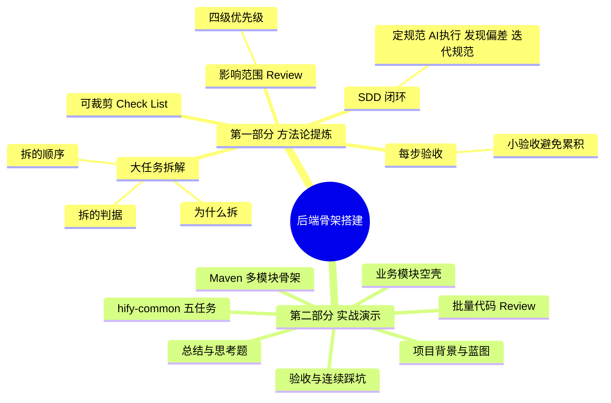
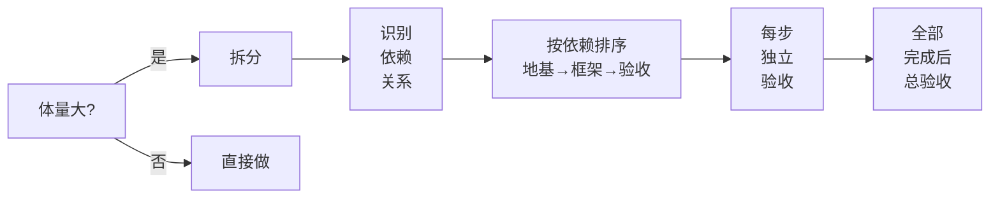
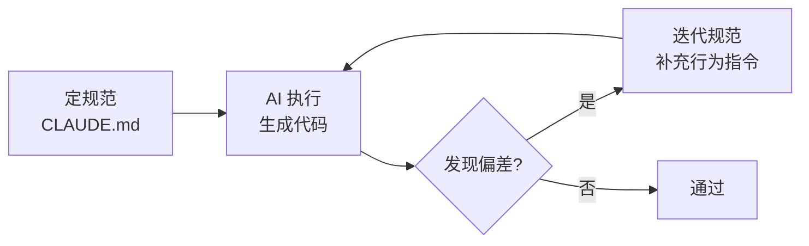
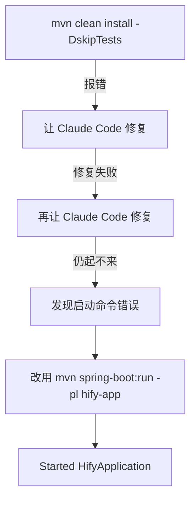

<!--
aicent-08-backend-foundation
AI编程方法 08：工程搭建 - 后端骨架和基础设施
-->

**全文导读地图**

本篇是系列的第八篇，正式进入工程部分。本篇要做的事：让 Claude Code 搭建 Hify 后端的工程骨架——Maven 多模块结构、公共基础设施（统一响应、全局异常处理、MyBatis-Plus 配置、Redis 配置）、业务模块空壳，全部就位；搭完后 `java -jar` 能跑、健康检查接口返回 200。

文章分两部分：第一部分提炼通用方法论，是可裁剪的参考手册；第二部分结合 Hify 后端初始化案例复现项目过程，讲清 why 与踩坑。建议初读按顺序通读，复习时直接跳第一部分的 Check List。



**第一部分　方法论提炼**　本部分聚焦"如何让 AI 编程可控、可复现、可迭代"，不深入具体技术栈，目标是为你在项目对应阶段提供一份可快速查阅的参考手册。

## 1. 方法论提炼

### 1.1 大任务拆解方法论

#### (1) 目标

把一次喂给 AI 的体量控制在"可 review、可验收、可定位错误"的范围内，避免几十个文件一次性生成、互相之间出现自洽性问题。

#### (2) 为什么必须拆

一次性让 AI 生成几十个文件，常见症状包括：父 pom 模块声明与实际目录不一致、依赖被写到错误的子模块 pom 里、版本号互相冲突、不同文件用了不一致的错误码格式。问题不在模型能力，而是一次性生成量太大，AI 没法保证所有细节自洽，你也 review 不过来。即便未来模型更强，"可持续迭代"的系统依然需要拆——拆的收益是错误可定位、规范可迭代，是"道"而非"术"。

#### (3) 拆的两条判据

满足任一即应拆：

| 判据 | 描述 | 典型场景 |
|------|------|---------|
| 生成量超出一次 review 范围 | 十几行可肉眼看，几十个文件/几百行配置看不过来 | 工程初始化、批量建表 |
| 步骤间存在依赖关系 | 第二步依赖第一步结果 | 业务模块 pom 依赖公共模块 pom |

#### (4) 拆的顺序

按依赖关系排，先地基、后框架、最后验收。这一顺序不只适用于工程初始化，后面做任何模块都通用。

<!-- 
图片内容说明
路径：imgs/aicent-08-backend-foundation/2948f829750fe60b55e6b3aa97be0301_MD5.jpg
用途：展示工程初始化的四步拆解顺序示意
内容：Maven 骨架→hify-common→业务模块空壳→验收 的拆解步骤示意
-->


处理步骤如下


#### (5) 操作要点

1. 一次指令只覆盖一个明确边界的小任务，并在指令末尾声明范围（如"只创建 pom 和目录结构，不需要写 Java 代码"）。
2. 拆出的子任务按依赖关系排序，前一步验收通过再做下一步。
3. 子任务粒度以"一个上下文、一份可 review 输出"为准。

#### (6) 常见陷阱

- 指令不加范围声明，AI 顺手生成 Application 类、配置文件、示例代码，与后续步骤冲突。
- 把"全部搭好"塞进一条指令，出问题要在几百行代码里大海捞针。

### 1.2 影响范围 Review 方法论

#### (1) 目标

面对 AI 批量生成的代码，用"按影响范围排优先级"的方式做 review，把时间花在最可能出大问题的地方。

#### (2) 四级优先级

| 优先级 | 对象 | 为什么 | 影响半径 |
|--------|------|--------|---------|
| P0 | 结构性问题 | 模块依赖、pom 声明、package 路径错了，后面全建在错误地基上 | 全盘 |
| P1 | 公共模块核心代码 | Result、全局异常处理、自动填充被所有业务模块依赖 | 所有业务模块 |
| P2 | 配置文件 | application.yml 配置项遗漏或硬编码 | 本服务 |
| P3 | 业务模块空壳 | 仅 package 结构与占位类 | 单文件 |

#### (3) 操作要点

1. 先扫结构性问题，再下沉到公共模块、配置、空壳。
2. 结构性 review 与 CLAUDE.md 架构定义逐项交叉对照，一个不多一个不少。
3. 影响范围越大的问题越先查；空壳几乎不会错，扫一眼确认结构一致即可。

### 1.3 每步验收方法论

#### (1) 目标

把验收前置到每一步，避免"全部搭完才发现起不来、不知道错在哪一步"。

#### (2) 操作要点

| 阶段 | 验收动作 |
|------|---------|
| Maven 骨架后 | `mvn install` 能通过 |
| 公共模块后 | 编译无错、关键类符合 CLAUDE.md 规范 |
| 业务模块后 | package 结构一致、占位类可编译 |
| 全部完成后 | `spring-boot:run` 能启动、健康检查接口返回预期 |

#### (3) 常见陷阱

- 不验证就往前冲，错误累积到结尾无法定位。
- 只做总验收、不做小验收，回溯成本高。

### 1.4 SDD 闭环方法论

#### (1) 目标

让规范（Spec）成为可持续迭代的资产，每次 AI 跑偏都把规范补上一条，堵住同类问题的口子。

#### (2) 闭环四步



#### (3) 操作要点

1. 每次 AI 输出与规范不符，不只是改当前代码，更要在 CLAUDE.md 行为指令里补一条。
2. 规范措辞要可执行（"必须使用 ErrorCode 枚举，禁止硬编码错误码"），不写虚泛口号。
3. 这是写代码过程中随手做的事，不是宏大流程。

### 1.5 可裁剪 Check List

按项目阶段裁剪使用，逐项打勾。

#### (1) 阶段一：工程初始化

- [ ] 是否已按生成量与依赖关系把任务拆成有序子任务？
- [ ] 每条指令是否声明了范围边界（只做什么、不做什么）？
- [ ] 子任务顺序是否按依赖关系（地基→框架→验收）排好？
- [ ] Maven 骨架：父 pom `<modules>` 与目录一致？版本号只在 `<dependencyManagement>` 出现？
- [ ] 公共模块：Result/异常处理/配置类是否符合 CLAUDE.md 规范？
- [ ] 业务模块空壳：package 结构一致、占位类可编译？
- [ ] 每步是否做了小验收？

#### (2) 阶段二：模块开发

- [ ] 公共依赖（Result、异常、配置）是否复用而非重写？
- [ ] AI 输出是否走了 ErrorCode 枚举、统一响应？
- [ ] 是否按 P0→P3 优先级做影响范围 review？

#### (3) 阶段三：批量代码生成后

- [ ] 结构性（依赖、声明、package）是否与架构定义一致？
- [ ] 公共模块核心代码是否被逐行核对？
- [ ] 配置项是否齐全、无不该硬编码的内容？
- [ ] 是否把本次发现的偏差回写进 CLAUDE.md？

**第二部分　实战演示**　本部分把第一部分的方法论放回 Hify 后端初始化的真实场景里，复现"按图施工"的每一步，讲清为什么这么拆、这么 review、踩到哪些坑又怎么修。Hify 的本地工作界面如下图所示，先看看我们即将完成的软件系统长什么样。

<!-- 
图片内容说明
路径：imgs/aicent-08-backend-foundation/6a5dd4a9922f3c9caf038c13ed66d05a_MD5.jpg
用途：展示 Hify 本地工作界面效果（六张连续界面截图之一）
内容：Hify 系统本地运行效果截图
-->

<!-- 
图片内容说明
路径：imgs/aicent-08-backend-foundation/eff1b8d459a26730fc2837f1ef848671_MD5.jpg
用途：展示 Hify 本地工作界面效果（六张连续界面截图之二）
内容：Hify 系统本地运行效果截图
-->

<!-- 
图片内容说明
路径：imgs/aicent-08-backend-foundation/500619c8f823f2959780e11824a31c32_MD5.jpg
用途：展示 Hify 本地工作界面效果（六张连续界面截图之三）
内容：Hify 系统本地运行效果截图
-->

<!-- 
图片内容说明
路径：imgs/aicent-08-backend-foundation/01f09d5857df8b3717e599d37fc05bc6_MD5.jpg
用途：展示 Hify 本地工作界面效果（六张连续界面截图之四）
内容：Hify 系统本地运行效果截图
-->

<!-- 
图片内容说明
路径：imgs/aicent-08-backend-foundation/f0ce59c6b5894b0528cceb88ac0a856a_MD5.jpg
用途：展示 Hify 本地工作界面效果（六张连续界面截图之五）
内容：Hify 系统本地运行效果截图
-->

<!-- 
图片内容说明
路径：imgs/aicent-08-backend-foundation/36a21619d3949ec453a9c049407df375_MD5.jpg
用途：展示 Hify 本地工作界面效果（六张连续界面截图之六）
内容：Hify 系统本地运行效果截图
-->


## 2. 实战演示

### 2.1 项目背景与目标

蓝图已经画完：本系列第 4 篇定了"模块化单体、Maven 9 个模块"的应用架构，第 5 篇定了"单机部署、线程池隔离、熔断策略"的运行架构，第 6 篇把这一切写进了 CLAUDE.md。现在按图施工。

本篇要做的事，按依赖关系拆成四步：

1. Maven 多模块骨架（父 pom + 子模块 pom + 目录结构）
2. hify-common 公共基础设施（Result、BizException、全局异常处理、配置类）
3. 业务模块空壳（每个模块的 package 结构和启动验证）
4. 验收，启动项目，确认一切正常

前端工程和启动脚本放到下一篇。本篇先把后端地基打扎实。

#### (1) 为什么是这个顺序

依赖关系决定顺序：Maven 骨架是所有东西的容器，必须先有；hify-common 被所有业务模块依赖，排第二；业务模块依赖 common，排第三；最后验收确认整体能跑。先地基，后框架，最后验收。

### 2.2 第一步：Maven 多模块骨架

#### (1) 指令设计

目标是创建父 pom 和所有子模块 pom，搭出目录结构，配对依赖关系。给 Claude Code 的指令思路如下：

> 按照 CLAUDE.md 中的项目结构和技术栈，创建 Hify 的 Maven 多模块工程骨架。父 pom 声明所有子模块，统一管理 Spring Boot、MyBatis-Plus、Redis 等版本号。子模块之间的依赖关系按 CLAUDE.md 中定义的架构来。只创建 pom 和目录结构，不需要写 Java 代码。

注意最后一句"只创建 pom 和目录结构，不需要写 Java 代码"——这是控制范围的关键。不说这句，Claude Code 会顺手生成 Application 类、配置文件、示例代码，和后面步骤冲突。

<!-- 
图片内容说明
路径：imgs/aicent-08-backend-foundation/f0dcaf815a4cebc710e7ae67e8a9d06f_MD5.jpg
用途：展示 Claude Code 生成的父 pom.xml 核心部分
内容：父 pom.xml 的模块声明、版本管理、Spring Boot 父依赖
-->


上图为 Claude Code 生成的父 pom.xml 核心部分（模块声明、版本管理、Spring Boot 父依赖）。

#### (2) Review 焦点（P0 结构性）

拿到输出后，重点检查三件事：

1. 模块声明与目录结构一致：父 pom `<modules>` 列表与实际目录完全对应，一个不多一个不少。
2. 依赖关系正确：hify-chat 的 pom 里应有对 hify-agent 和 hify-provider 的依赖，hify-agent 的 pom 里应有对 hify-mcp 的依赖；交叉检查，不多余、不遗漏。
3. 版本管理统一：Spring Boot、MyBatis-Plus、Redis 版本号只在父 pom `<dependencyManagement>` 里出现，子模块不重复声明。

有问题让 Claude Code 改，不要手动改，让它按规范输出。

### 2.3 第二步：hify-common 公共基础设施

这一步是重中之重。hify-common 里的东西会被所有业务模块依赖——Result 类、异常处理、MyBatis-Plus 配置。这里出问题，后面每个模块都跟着错。

把这一步进一步拆成五个小任务，前三个有依赖链（异常处理器依赖 Result 和 BizException），后两个相对独立，顺序仍按依赖关系排。

| 顺序 | 任务 | 依赖 | 复杂度 |
|------|------|------|--------|
| 1 | 统一响应 Result 和分页 PageResult | 无 | 低 |
| 2 | 错误码枚举 ErrorCode 和业务异常 BizException | 无 | 低 |
| 3 | 全局异常处理器 GlobalExceptionHandler | 任务 1、2 | 中（最易踩坑） |
| 4 | MyBatis-Plus 配置 | 无 | 低 |
| 5 | Redis 配置 | 无 | 低 |

#### (1) 任务一：统一响应 Result 和分页 PageResult

指令：

> 在 hify-common 中创建统一响应类。按照 CLAUDE.md 接口规范：`Result<T>` 包含 code、message、data 三个字段，提供 `ok()` 和 `fail()` 静态方法。`PageResult<T>` 继承 Result，额外包含 total、page、size。

<!-- 
图片内容说明
路径：imgs/aicent-08-backend-foundation/4552228b380f4670538439ecfcae0292_MD5.jpg
用途：展示 Claude Code 生成的 Result 与 PageResult 代码
内容：统一响应类的实现，该指令的 Claude Code 输出结果
-->


这个任务简单、边界清晰，Claude Code 基本不会出错。

#### (2) 任务二：错误码枚举和业务异常

指令：

> 在 hify-common 中创建错误码枚举 ErrorCode 和业务异常类 BizException。ErrorCode 包含 code 和 message，覆盖通用错误（参数错误、未授权、系统内部错误等）。BizException 持有 ErrorCode，支持自定义 message 覆盖。

<!-- 
图片内容说明
路径：imgs/aicent-08-backend-foundation/b2112b8a77503bce9a82350852cc5d61_MD5.jpg
用途：展示 Claude Code 生成的 ErrorCode 枚举与 BizException 类
内容：错误码枚举与业务异常的实现，该指令的 Claude Code 输出结果
-->


#### (3) 任务三：全局异常处理器（重点踩坑）

指令：

> 在 hify-common 中创建全局异常处理器 GlobalExceptionHandler，使用 `@RestControllerAdvice`。捕获 BizException 返回对应错误码，捕获 MethodArgumentNotValidException 返回参数校验错误，兜底捕获 Exception 返回系统内部错误。所有异常响应必须使用 `Result.fail()` 和 ErrorCode 枚举。

<!-- 
图片内容说明
路径：imgs/aicent-08-backend-foundation/f3dee5a7279e90aa5f5dd03d1e420378_MD5.jpg
用途：展示 Claude Code 生成的 GlobalExceptionHandler 全局异常处理器
内容：全局异常处理器的实现，该指令的 Claude Code 输出结果
-->


这个任务值得多说一点。第一次让 Claude Code 生成这个处理器时，它在兜底 Exception 处理里硬编码了 `code: 500, message: "系统繁忙"`，没有用 ErrorCode 枚举。功能上没问题，但违反了 CLAUDE.md 里定义的规范——所有错误响应必须走 ErrorCode。

<!-- 
图片内容说明
路径：imgs/aicent-08-backend-foundation/a0ed637bcb60d197eca337da2baba67c_MD5.jpg
用途：展示异常处理器初版中的硬编码错误码问题
内容：兜底 Exception 处理硬编码了 code:500 / message:系统繁忙，未使用 ErrorCode 枚举
-->


这就是 SDD 闭环起作用的时刻。让它改成 `Result.fail(ErrorCode.INTERNAL_ERROR)`，然后在 CLAUDE.md 行为指令里补一条："异常处理必须使用 ErrorCode 枚举，禁止硬编码错误码和错误信息。"下次再写类似代码，这个问题不会重复出现。

每次 AI 跑偏，不只是改掉当前的错，更要把规范补上，堵住同类问题的口子。这就是 SDD 闭环的日常运转——定规范、AI 执行、发现偏差、迭代规范。不是宏大流程，而是写代码过程中随手做的事。

#### (4) 任务四：MyBatis-Plus 配置

指令：

> 在 hify-common 中创建 MyBatis-Plus 配置类。包含：分页插件、自动填充（createTime、updateTime）、逻辑删除配置。

<!-- 
图片内容说明
路径：imgs/aicent-08-backend-foundation/69e9cd7569361f1429f1ab440ba9efdd_MD5.jpg
用途：展示 Claude Code 生成的 MyBatis-Plus 配置类
内容：分页插件、自动填充、逻辑删除配置，该指令的 Claude Code 输出结果
-->


这里只做配置层面的基础搭建。具体的业务封装——BaseEntity 基类、分页查询工具类——放到基础组件篇展开。Claude 生成这种模板代码非常快、基本不会出错，因为这类代码非常标准。

#### (5) 任务五：Redis 配置

指令：

> 在 hify-common 中创建 Redis 配置类。包含：RedisTemplate 序列化配置（key 用 String，value 用 JSON）、基础的 RedisUtil 工具类（get/set/delete/expire）。

<!-- 
图片内容说明
路径：imgs/aicent-08-backend-foundation/d0f7f08893e560a68fda6d72f47449de_MD5.jpg
用途：展示 Claude Code 生成的 Redis 配置类与 RedisUtil 工具类
内容：RedisTemplate 序列化配置与基础工具类，该指令的 Claude Code 输出结果
-->


同样，这里只做配置。Cache-Aside 模式的业务封装放到基础组件篇再做。

#### (6) 为什么拆成五个小任务

你可能注意到，hify-common 被拆成五个小任务，而不是一条指令"帮我把 hify-common 全部搭好"。原因和 1.1 节讲的一样：拆开做，每个任务的上下文更小、更聚焦，Claude Code 输出质量更高；出了问题容易定位，混在一起生成，一个地方有问题可能要在几百行代码里找。

### 2.4 第三步：业务模块空壳

前两步搞定后，后端地基打好。现在给每个业务模块创建基础 package 结构。

指令：

> 为 hify-provider、hify-agent、hify-chat、hify-mcp 等业务模块创建标准的 package 结构。按照 CLAUDE.md 代码组织规范，每个模块包含 controller/service/service-impl/mapper/entity/dto/config 目录。每个模块只创建 package 和一个空的占位类，不需要写业务代码。

<!-- 
图片内容说明
路径：imgs/aicent-08-backend-foundation/0a43e217008ccc33256c4eef48c2b300_MD5.jpg
用途：展示各业务模块的标准 package 结构与占位类
内容：业务模块 package 结构与空占位类，该指令的 Claude Code 输出结果
-->


这一步生成的东西很简单，review 也快——检查 package 路径对不对、各模块结构是否一致即可。

然后在 hify-app 模块里创建 Spring Boot 启动类和 application.yml：

> 在 hify-app 中创建 Spring Boot 启动类 HifyApplication，以及 application.yml 配置文件。配置项包括：数据库连接、Redis 连接、MyBatis-Plus 配置、服务端口 8080。

<!-- 
图片内容说明
路径：imgs/aicent-08-backend-foundation/5094f6adda14d8e511b843f10fa65a32_MD5.jpg
用途：展示 Claude Code 生成的 HifyApplication 启动类与 application.yml
内容：Spring Boot 启动类与配置文件，该指令的 Claude Code 输出结果
-->


### 2.5 第四步：验收（连续踩坑实录）

后端骨架应该搭好了，启动验证一下。先确保 MySQL 和 Redis 在本地跑着（如果本地没有，用 Docker 临时起一个，这只是本地开发环境，不是项目的 Docker 化）。

```bash
cd hify
mvn clean install -DskipTests
cd hify-app
mvn spring-boot:run
```

#### (1) 踩坑链路



然后 `mvn clean install` 就报错了：

<!-- 
图片内容说明
路径：imgs/aicent-08-backend-foundation/bb1f1d11b5a38b0a5522c56aa22bb3de_MD5.jpg
用途：展示 mvn clean install -DskipTests 第一次报错信息
内容：mvn 构建失败的错误堆栈，提示构建异常
-->


继续输入：

> mvn clean install -DskipTests 失败了，修复下

输出是：

<!-- 
图片内容说明
路径：imgs/aicent-08-backend-foundation/489d5fed7e5c8eb275f55691a74736ce_MD5.jpg
用途：展示 Claude Code 第一次修复 mvn 失败的输出
内容：Claude Code 修复构建错误的尝试结果
-->


修复这个问题又失败了：

<!-- 
图片内容说明
路径：imgs/aicent-08-backend-foundation/fc02d1678f79a7e01ad5ffd255e4cc1e_MD5.jpg
用途：展示第二轮修复仍失败
内容：第二轮修复后 mvn 仍报错
-->


继续让 Claude Code 修复。这个循环重复几次后，得到了一个能启动的应用。后来 Claude Code 发现前面给的启动命令错了（哈哈），正确的命令应该是：

```bash
mvn spring-boot:run -pl hify-app
```

<!-- 
图片内容说明
路径：imgs/aicent-08-backend-foundation/54e80c59d55c5fad608d8daae8e99e0b_MD5.jpg
用途：展示正确的启动命令与 Spring Boot 启动成功
内容：使用 mvn spring-boot:run -pl hify-app 成功启动，日志末尾显示 Started HifyApplication
-->


Spring Boot 启动日志最后一行应显示 `Started HifyApplication in X seconds`。

#### (2) 健康检查

为有一个可验证的端点，让 Claude Code 加一个健康检查接口：

> 在 hify-app 中创建 HealthController，路径 `GET /api/v1/health`，返回 `Result.ok("Hify is running")`。

启动后访问 `http://localhost:8080/api/v1/health`，预期返回：

```json
{
  "code": 200,
  "message": "success",
  "data": "Hify is running"
}
```

看到这个返回，说明后端骨架搭建成功：Maven 多模块结构正常、依赖关系正确、公共模块的 Result 和全局异常处理在工作、Spring Boot 配置没问题。

但实际输出却是：

<!-- 
图片内容说明
路径：imgs/aicent-08-backend-foundation/cc7420d245614456c7c3d7e50eca4165_MD5.jpg
用途：展示健康检查接口实际返回与预期不符
内容：访问 /api/v1/health 的实际响应，未返回预期 JSON
-->


接下来就交给你了——这正是下一篇的起点。

<!-- 
图片内容说明
路径：imgs/aicent-08-backend-foundation/d9bd69403100f678a6ae56af25b77fd8_MD5.jpg
用途：留给读者的悬念截图，引出下一篇前端工程
内容：承接健康检查问题，过渡到下一篇内容的提示
-->


### 2.6 大批量代码 Review 实战

本篇 Claude Code 生成了几十个文件、几百行配置和基础代码。逐行看不现实、也没必要，关键是按 1.2 节的优先级看。

#### (1) 第一优先级（P0 结构性）

模块依赖关系对不对？pom 里的依赖声明和 CLAUDE.md 定义的架构一致吗？package 路径对不对？这些错了，后面所有东西都建在错误地基上。

#### (2) 第二优先级（P1 公共模块核心代码）

Result 类的字段和方法对不对？全局异常处理器的捕获优先级对不对？MyBatis-Plus 自动填充逻辑对不对？这些代码所有业务模块都依赖，错了影响范围最大。

#### (3) 第三优先级（P2 配置文件）

application.yml 配置项对不对？有没有遗漏？有没有硬编码不该硬编码的东西？影响范围相对小，后面随时可调。

#### (4) 最后看（P3 业务模块空壳）

只是 package 结构和占位类，几乎不会出错，扫一眼确认结构一致即可。

<!-- 
图片内容说明
路径：imgs/aicent-08-backend-foundation/997f413fd5d03321c61aaaaf842d9328_MD5.jpg
用途：展示按优先级 review 批量代码的实操
内容：按 P0→P3 优先级对本篇生成代码进行 review 的过程示意
-->


这个优先级背后的逻辑很简单：影响范围越大的问题越先查。结构错了全盘皆输，公共模块错了所有业务模块跟着错，配置错了这个服务有问题，空壳错了只影响一个文件。这个思路不只适用于工程初始化，后面每次 AI 批量生成代码都可以复用。

### 2.7 实战总结与思考

#### (1) 做了什么

本篇做了两件事：用 Claude Code 搭建了 Hify 的后端骨架，并把过程提炼为 1.1~1.4 的四条方法论（任务拆解、影响范围 review、每步验收、SDD 闭环）。

#### (2) 三个可复用的方法论要点

1. 任务拆解标准：生成量是否超出一次 review 范围？步骤之间是否有依赖关系？满足其一就拆；拆的顺序按依赖关系，先地基后框架。
2. 影响范围 review：大批量代码不逐行看，按 P0→P3 优先级，时间花在影响范围最大的地方。
3. 每步验收：不是搭完全部才验收，而是每步做完就验证。骨架后 mvn install 能过吗？公共模块编译没问题吗？全部搭完能启动吗？每步验收给你"到这里为止是对的"的信心，不验证就往前冲，错误会累积到结尾无法定位。

#### (3) 0 代码完成初始化的反思

到这里我们依然 0 代码，就完成了一个 Web Service 的初始化，中间基本没遇到大问题、很顺。原因有三：模型本身厉害、前面基础搭得好、大任务拆成了多个小任务。在后续篇章里你会越来越感受到这个模式的优势。

如果手工做这些事，至少要一天；AI 辅助下可以又快又好地实现，节省下来的时间用于做其他事——这就是生产力的提升。

后端能跑了。下一篇补前端 Vue 工程、写启动脚本，让 Hify 前后端一键跑起来。

### 2.8 思考

回想一下你之前做项目时的工程初始化过程：是手动一个个文件创建，用脚手架工具，还是从别的项目复制？如果现在让你用 Claude Code 来做，你会怎么拆解？试着列出你的步骤和每步的验收标准。

期待你分享自己的使用体验。如果本篇让你有所收获，也欢迎转发给有需要的朋友，邀请他一起来学习，我们下一篇再见。
