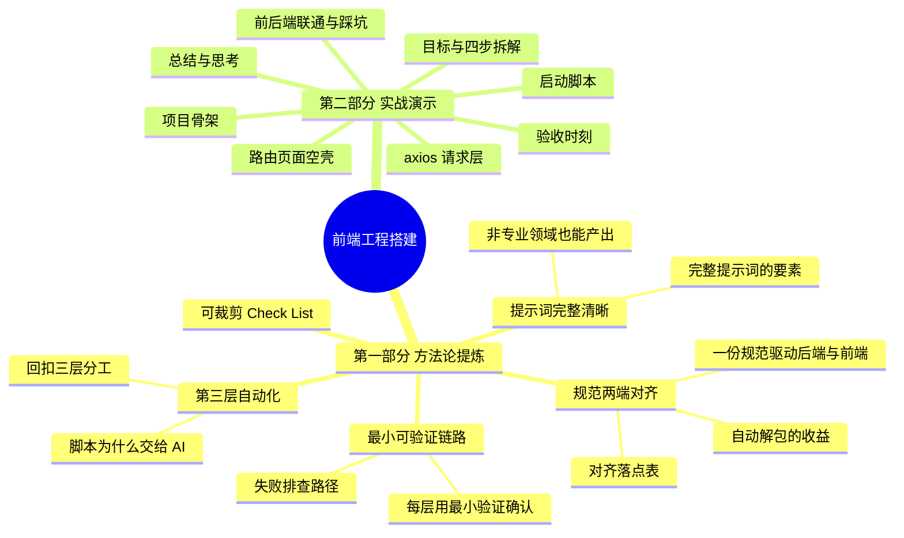
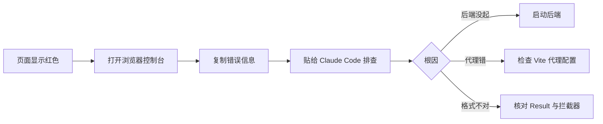

<!--
aicent-09-frontend-init
AI编程方法 09：工程搭建 - 前端工程初始化
-->

**全文导读地图**

本篇是系列第九篇，承接第八篇（后端骨架）继续工程初始化。本篇要交付三件事：前端 Vue 工程（hify-web）、前后端联通、一键启动脚本。做完之后，执行一个 `./start.sh`，前后端同时起来，浏览器打开就能看到 Hify 的页面——左侧菜单、右侧显示绿色的"后端已连接：Hify is running"。


文章分两部分：第一部分提炼通用方法论，是可裁剪的参考手册；第二部分结合 Hify 前端工程初始化案例复现项目过程，讲清 why 与踩坑。建议初读按顺序通读，复习时直接跳第一部分的 Check List。



**第一部分　方法论提炼**　本部分聚焦"前端工程初始化阶段如何让 AI 编程可控、可对齐、可验收"，不深入具体前端技术栈，目标是为你在项目对应阶段提供一份可快速查阅的参考手册。

## 1. 方法论提炼

### 1.1 规范两端对齐方法论


#### (1) 目标

让一份接口规范（写在 CLAUDE.md 里）同时驱动后端实现与前端封装，避免"后端按一套格式返回、前端按另一套格式解析"的割裂，从源头消除联调阶段的格式对不上的问题。

#### (2) 为什么必须对齐

后端定了统一响应格式 `Result<T>`，每个接口都返回 `{ code, message, data }`。如果前端的 axios 封装不主动适配这套格式，每个页面调接口都要手动判断 `code`、手动解包 `data`：

```typescript
const result = await providerApi.getList()
const list = result.data
```

封装到位后，业务代码直接拿到业务数据，判断与解包在拦截器里一次性完成：

```typescript
const list = await providerApi.getList()
```

单看一个接口是小事，几十个接口累积下来，代码干净很多。<span style="color: red; font-weight: bold;">而对齐的关键，是规范只有一份、两端照着同一份做。</span>

#### (3) 对齐什么、落在哪

| 规范项 | 后端落点 | 前端落点 |
|--------|---------|---------|
| 统一响应格式 `Result<T>` | Controller 返回 `Result.ok(data)` | 响应拦截器解包 `data` 字段 |
| 接口路径规则（如 `/api/v1/...`） | `@RequestMapping` 路径 | baseURL + api 文件里的相对路径 |
| 错误码 / message | `ErrorCode` 枚举 + 全局异常处理 | 非 200 用 `ElMessage.error(message)` 提示后 reject |

#### (4) 操作要点

1. 接口规范必须写进 CLAUDE.md，作为前后端共同的唯一事实来源。
2. <span style="color: red; font-weight: bold;">前端 axios 封装与后端 Result 实现在同一次工程初始化里完成，确保两端对得上。</span>
3. 用一个最小示例接口（如健康检查）验证整条链路通——封装、代理、路径规范三者一起验。

#### (5) 常见陷阱

- 后端先定规范、前端后写封装，中间版本漂移，联调时才发现字段名不一致。
- 前端封装不做自动解包，把 `code` 判断散落到每个页面，规范形同虚设。

### 1.2 提示词完整清晰方法论


#### (1) 目标

即便对某个领域（如前端）几乎不懂，也能通过一份完整、清晰的提示词，让 Claude Code 产出一个可用的工程。

#### (2) 为什么有效

作者实话实说："我一点不懂前端。"但仅凭一条交代清楚技术栈、目录结构来源、关键配置的指令，就有了能跑的前端服务。这说明对 AI 编程而言，<span style="color: red; font-weight: bold;">提示词的完整性与清晰度比你的领域熟练度更重要</span>——你不需要会写 Vue，只需要会把"要什么"讲明白。

#### (3) 完整提示词的四要素

| 要素 | 说明 | 本篇示例 |
|------|------|---------|
| 技术栈 | 明确框架与版本取向 | Vue 3 + TypeScript + Vite + Element Plus |
| 目录结构来源 | 指向已有的规范文件，而非临场发挥 | "按 CLAUDE.md 中定义的前端结构来" |
| 关键配置 | 跨进程/跨域等容易被忽略的细节 | Vite 代理：`/api` 转发到 `localhost:8080` |
| 范围边界 | 只做什么、不做什么 | （本例聚焦初始化，后续步骤分指令给） |

#### (4) 操作要点

1. <span style="color: red; font-weight: bold;">提示词中凡是能引用既有规范的，就引用，不要在指令里重复一遍规范细节。</span>
2. 关键配置（端口、代理、跨域）显式写出，不要假设 AI 自己想到。

#### (5) 常见陷阱

- 提示词只给"帮我建个前端项目"，技术栈、目录来源、代理配置全靠 AI 猜，结果与项目规范对不上。

### 1.3 第三层自动化方法论


#### (1) 目标

把启动脚本、Makefile 这类"逻辑不复杂但手写易漏细节"的工程化产物，整块交给 AI 全权处理，人只验收结果。

#### (2) 回扣三层分工

本系列第一篇把人机协作分为三层：第一层人主导设计、第二层人 AI 共创、第三层 AI 全权处理人验收。启动脚本、Makefile 就是典型的第三层。

#### (3) 为什么这类活适合交给 AI

脚本逻辑本身不难，但手写容易漏掉工程细节：进程管理（启动后能不能查到 PID）、日志输出（前后端日志分别落到哪）、端口检查（依赖的 MySQL/Redis 是否就绪）、优雅停止（先 SIGTERM 再等待，超时才 SIGKILL）。这些细节琐碎但关键，交给 Claude Code 特别合适。

#### (4) 验收标准

跑一下 `start.sh` 能起来、`stop.sh` 能干净停掉，就过了。<span style="color: red; font-weight: bold;">不需要逐行 review shell 语法——第三层的验收就是看结果。</span>

#### (5) 常见陷阱

- 事必躬亲地手写脚本，反而漏掉端口检查、优雅停止，启动/停止行为不可靠。

### 1.4 最小可验证链路方法论


#### (1) 目标

每搭完一层，就用一个最小的、端到端的验证确认这层通了，而不是全部搭完才联调。

#### (2) 什么算"最小可验证链路"

前端只要能发起请求、后端只要能返回 `Result`，就用一个健康检查接口把两者串起来：前端页面加载时调 `getHealth()`，成功显示绿色"后端已连接"，失败显示红色。一条链路同时验证四件事：axios 封装、Vite 代理、后端接口、Result 格式的前端解析。

#### (3) 失败排查路径



<span style="color: red; font-weight: bold;">最常见的根因往往最朴素——比如"后端服务被关了"</span>。先确认这类低级原因，再深入。

#### (4) 操作要点

1. 每一层就绪后立即用最小链路验证，不要累积到最后才联调。
2. <span style="color: red; font-weight: bold;">验证失败的输入直接给 Claude Code，让它按错误信息排查，而不是人去读源码。</span>

#### (5) 常见陷阱

- 把所有层都搭完才第一次联调，一旦失败无法定位是哪一层的问题。

### 1.5 可裁剪 Check List


按项目阶段裁剪使用，逐项打勾。

#### (1) 阶段一：前端工程初始化

- [ ] 提示词是否包含技术栈、目录结构来源（CLAUDE.md）、关键配置（代理/端口）？
- [ ] 目录结构是否与 CLAUDE.md 定义的前端结构一致？
- [ ] Vite 代理是否把 `/api` 正确转发到后端端口？
- [ ] axios 封装是否与后端 `Result<T>` 格式对齐（自动解包 `data`、非 200 提示并 reject）？
- [ ] 是否用一个最小示例接口（如 health）验证封装、代理、路径三者都通？
- [ ] 路由与页面空壳是否生成完整导航结构（菜单 + router-view）？

#### (2) 阶段二：前后端联通与启动验收

- [ ] 前端页面调接口是否显示绿色"已连接"，而非红色？
- [ ] 失败时是否检查了控制台错误并贴给 Claude Code 排查？
- [ ] 启动脚本是否做了依赖检查（MySQL/Redis 就绪）、健康轮询、错误中断？
- [ ] 停止脚本是否优雅停止（SIGTERM → 等待 → 超时 SIGKILL）？
- [ ] Makefile 是否覆盖 start/stop/restart/build/clean/package？
- [ ] 最终验收：`sh start.sh` 一键拉起，浏览器三菜单 + 绿色连接？

**第二部分　实战演示**　本部分把第一部分的方法论放回 Hify 前端工程初始化的真实场景里，复现"按图施工"的每一步，讲清为什么这么搭、踩到哪些坑又怎么修。上一篇（第八篇）已搭好后端骨架——Maven 多模块、公共基础设施、健康检查接口，`java -jar` 能跑、访问 `/api/v1/health` 返回 200。本篇把剩下的补齐。

## 2. 实战演示

### 2.1 目标与拆解


前端初始化也要分步做，和上一篇后端一样。直接复用上一篇建立的任务拆解方法论，不再解释为什么要拆——按依赖关系排序，每步验证后进入下一步。

前端工程拆成三步：

| 顺序 | 步骤 | 为什么排这个序 |
|------|------|---------------|
| 1 | 项目骨架 | 容器，必须先有，承接所有前端代码 |
| 2 | axios 统一请求层 | 前端与后端规范体系的接合点，是页面调接口的前提 |
| 3 | 路由和页面空壳 | 有了骨架和请求层，才能组织导航与页面 |

三步之外，还有前后端联通（验收链路）、启动脚本（工程化收尾）、最终验收。做完之后，执行一个 `./start.sh`，后端前端同时起来，浏览器打开就能看到 Hify 的页面。<span style="color: red; font-weight: bold;">从零到能跑的完整闭环，本篇交付完成。</span>

### 2.2 第一步：项目骨架

#### (1) 指令设计

给 Claude Code 的指令思路（一条完整、清晰的提示词，印证 1.2 节方法论）：

> 初始化 Hify 前端项目 hify-web。Vue 3 + TypeScript + Vite + Element Plus。目录结构按 CLAUDE.md 中定义的前端结构来。Vite 开发服务器配置代理：/api 请求转发到 localhost:8080。

#### (2) 输出

<!-- 
图片内容说明
路径：imgs/aicent-09-frontend-init/889885c144c3c53b1d665fcfe6f21b90_MD5.jpg
用途：展示第一步项目骨架的 Claude Code 输出
内容：Claude Code 初始化 hify-web 前端项目后的目录结构与关键文件
-->


这一步比较标准化，Claude Code 一般不会出大问题。

#### (3) 验收：两件事

拿到输出后检查两件事：

1. **目录结构**：和 CLAUDE.md 里定义的是否一致。
2. **Vite 代理配置**：是否正确。开发阶段前端跑在 5173 端口，通过 Vite 代理转发 `/api` 请求到后端 8080 端口，解决跨域问题。

<!-- 
图片内容说明
路径：imgs/aicent-09-frontend-init/b98cd51e2b3b9fae22e27be87ed2eeda_MD5.jpg
用途：展示 Vite 代理配置的验收结果
内容：前端开发服务器通过 Vite 代理将 /api 请求转发到后端 8080 端口的配置与运行效果
-->


#### (4) 小结

是不是很快。说实话，我一点不懂前端。但是通过上面的指令就有一个前端服务了。这里需要注意的是：<span style="color: red; font-weight: bold;">提示词要完整且清晰</span>。你可以参考一下上面的提示词。

### 2.3 第二步：axios 统一请求层


这一步值得多讲一下，因为它是前端和后端规范体系的接合点——也就是 1.1 节"规范两端对齐"的落点。

#### (1) 为什么要在拦截器里自动解包

后端定了统一响应格式 `Result<T>`，每个接口都返回 `{ code: 200, message: "success", data: {...} }`。前端的 axios 封装要和这套格式对接，让业务代码不需要每次都手动处理 `code` 判断和 `data` 解包。

如果不这么做，后面每个页面调接口都要写：

```typescript
const result = await providerApi.getList()
const list = result.data
```

封装之后直接就是：

```typescript
const list = await providerApi.getList()
```

看起来是个小事，但几十个接口累积下来，代码干净很多。

#### (2) 指令设计

> 在 hify-web/src/utils/ 下创建 request.ts，封装 axios 实例。baseURL 设为 /api。响应拦截器里判断 code：200 直接返回 data 字段（自动解包），非 200 用 Element Plus 的 ElMessage.error 提示 message，然后 reject。导出 get、post、put、del 四个方法。

#### (3) 生成的 request.ts

```typescript
import axios from 'axios'
import { ElMessage } from 'element-plus'

const instance = axios.create({
  baseURL: '/api',
  timeout: 60000,
})

instance.interceptors.response.use(
  (response) => {
    const { code, message, data } = response.data
    if (code !== 200) {
      ElMessage.error(message || '请求失败')
      return Promise.reject(new Error(message))
    }
    return data
  },
  (error) => {
    ElMessage.error(error.message || '网络异常')
    return Promise.reject(error)
  }
)

export const get = <T>(url: string, params?: object): Promise<T> =>
  instance.get(url, { params })

export const post = <T>(url: string, data?: object): Promise<T> =>
  instance.post(url, data)

export const put = <T>(url: string, data?: object): Promise<T> =>
  instance.put(url, data)

export const del = <T>(url: string): Promise<T> =>
  instance.delete(url)
```

#### (4) 示例 API 文件：验证整条链路

再让 Claude Code 基于这个封装写一个示例 API 文件：

> 在 hify-web/src/api/ 下创建 health.ts，用封装好的 request 调用 GET /api/v1/health。导出 getHealth 方法。

```typescript
import { get } from '@/utils/request'

export const getHealth = () => get<string>('/v1/health')
```

这个文件只有几行代码，但它验证了整条链路——axios 封装、代理配置、接口路径规范——是否都通。

#### (5) 点题：一份规范，两端对齐

回过头看，这就是为什么第六篇要把接口规范写进 CLAUDE.md：不只后端在用，前端 axios 封装也在对着同一份规范做。后端的 `Result<T>` 格式、接口路径规则、错误码定义，前端全部照着来。<span style="color: red; font-weight: bold;">一份规范，两端对齐</span>——这正是 1.1 节方法论的实战落地。

### 2.4 第三步：路由和页面空壳


#### (1) 指令设计

> 在 hify-web 中配置 Vue Router，创建以下路由和对应的空壳页面组件：模型管理、Agent 管理、对话。每个空壳页面只显示页面名称，比如 ProviderList.vue 里就一行"模型提供商管理"。再创建一个 App.vue 布局：左侧 Element Plus 菜单栏（三个菜单项对应三个路由），右侧内容区用 router-view。

#### (2) 输出

这一步生成的是一个有完整导航结构的空壳应用——左边菜单、右边内容，点菜单能切换页面，每个页面都是占位文字。后面往里填内容就行。

<!-- 
图片内容说明
路径：imgs/aicent-09-frontend-init/ee71c3e11e97d9c4d7a6c6028942f8d1_MD5.jpg
用途：展示第三步路由和页面空壳的运行效果
内容：Hify 前端空壳应用界面，左侧为三个菜单项（模型管理、Agent 管理、对话），右侧为对应占位文字
-->


### 2.5 前后端联通

前端搭好了，后端上一篇已经能跑了。现在把它们连起来。这一步验证的是 1.4 节的最小可验证链路：Vite 代理配置对不对、axios 封装能不能用、前后端的接口格式能不能对上。

#### (1) 改造页面调用健康检查

把前端的 `ProviderList.vue` 改一下，让它调用健康检查接口并显示结果：

> 修改 ProviderList.vue，在页面加载时调用 getHealth()，把返回结果显示在页面上。如果调用成功显示绿色的"后端已连接：Hify is running"，失败显示红色的"后端未连接"。

#### (2) 第一次：红色（后端没起）

启动后端、启动前端，打开浏览器 `http://localhost:5173`，你应该能看到左侧菜单、右侧显示绿色的"后端已连接"。但是，却是：

<!-- 
图片内容说明
路径：imgs/aicent-09-frontend-init/535f978f1950e9bd9b8843cbd7112090_MD5.jpg
用途：展示前后端联通首次失败的现象
内容：前端页面显示红色的"后端未连接"，原因是后端服务未启动
-->


看了一眼，发现 hify server 被关了，启动后：

<!-- 
图片内容说明
路径：imgs/aicent-09-frontend-init/65d8342f38afab00641cf2ed3b2b72de_MD5.jpg
用途：展示前后端联通成功
内容：前端页面显示绿色的"后端已连接：Hify is running"
-->


#### (3) 看到了，说明什么

看到绿色，说明前后端联通成功——axios 封装正常、Vite 代理正常、后端接口正常、Result 格式前端能正确解析。一条最小链路同时验证了四件事。

如果显示红色，就把浏览器控制台的错误信息贴给 Claude Code 让它排查：

<!-- 
图片内容说明
路径：imgs/aicent-09-frontend-init/f3fa5a30df4145de9adb4e91f2fabad3_MD5.jpg
用途：展示前端失败时浏览器控制台的错误信息，用于贴给 Claude Code 排查
内容：浏览器开发者工具控制台中显示的接口调用错误信息
-->


### 2.6 启动脚本


到这一步，前后端都能跑了，但每次启动要开两个终端、输两条命令。写个脚本让它一键搞定。

还记得本系列第一篇的三层分工吗？启动脚本、Makefile 这些就是典型的第三层——AI 全权处理，你验收结果就行。脚本逻辑不复杂，但手写容易漏细节（进程管理、日志输出、端口检查），交给 Claude Code 特别合适。不需要逐行 review shell 语法，跑一下 `start.sh` 能起来就过了。

#### (1) start.sh

> 写一个 start.sh 脚本，放在项目根目录。功能：检查 MySQL 和 Redis 是否可用，构建后端并后台启动，轮询等待后端健康检查通过，启动前端开发服务器。加上错误处理：任何一步失败就停止并提示。

#### (2) stop.sh

> 写一个 stop.sh 脚本，优雅停止后端和前端进程。按 PID 文件找进程，先 SIGTERM 再等待，超时 SIGKILL。

#### (3) Makefile

> 写一个 Makefile，包含以下 target：make start（启动）、make stop（停止）、make restart（重启）、make build（构建后端 + 前端）、make clean（清理构建产物）、make package（打包成可分发的 tar.gz）。

#### (4) 结果与价值

这里不展示输入和输出的细节了，实操课中会演示，直接展示结果。

<!-- 
图片内容说明
路径：imgs/aicent-09-frontend-init/88d605d4a3719dc9f2c550affe512c4f_MD5.jpg
用途：展示启动脚本与 Makefile 的最终效果
内容：start.sh / stop.sh / Makefile 三个工程化脚本文件及其一键启动效果
-->


这 3 个文件加起来可能就一两百行脚本，但它们让整个项目的使用体验提升了一个档次。拉下代码，`make start` 就跑起来了，`make package` 就能打包分发。

### 2.7 验收时刻

所有东西都就绪了。最终验收：

```bash
sh start.sh
```

你应该看到这样的输出：

```text
[INFO] 检查 MySQL localhost:3306...
[ERROR] MySQL 不可达（localhost:3306），请先启动 MySQL
```

这里是因为 MySQL 没配置。调整配置后，打开浏览器访问 `http://localhost:5173`：

1. 左侧看到三个菜单：模型管理、Agent 管理、对话
2. 点"模型管理"，右侧显示绿色的"后端已连接：Hify is running"
3. 点其他菜单，显示对应的占位文字

看到这些，工程初始化就完成了。你手上有了一个前后端都能跑的空项目，结构清晰、规范就绪、一键启动。后面的工作就是往这个骨架里填功能。

<!-- 
图片内容说明
路径：imgs/aicent-09-frontend-init/65d8342f38afab00641cf2ed3b2b72de_MD5.jpg
用途：展示最终验收通过的状态
内容：Hify 前端最终运行效果，左侧菜单 + 右侧绿色"后端已连接：Hify is running"
-->


### 2.8 实战总结与思考


#### (1) 做了什么

我们用两篇完成了 Hify 的工程初始化——后端能跑、前端能开、一键启动、前后端联通。最终，你手上有了一个前后端都能跑的空项目。

#### (2) 方法论回顾

| 方法论 | 要点 |
|--------|------|
| 任务拆解 | 体量大不能一条指令搞定。按依赖关系拆成有序步骤，每步验证后再进下一步。判据：生成量超出一次 review 范围、步骤间有依赖，满足其一就拆 |
| 基础设施先行 | 先搭 Maven 骨架、再公共模块、再业务空壳、再前端、最后脚本。顺序不能乱，后面每步都依赖前面 |
| 每步验收 | 不是搭完全部才验收，而是每步做完就验证。每个验收点给你信心：到这里是对的 |

不过，工程初始化完成不代表可以直接写业务了。现在的空项目还缺一层东西——基础组件。数据库怎么做分页、接口入参怎么校验、调外部 API 的客户端怎么封装、线程池怎么配、熔断怎么搞，这些是所有业务模块都会用到的底层能力。

不过下一篇我们要换一种协作模式，不是你告诉 Claude Code 做什么，而是先让它告诉你该做什么。

#### (3) 思考

这两篇工程初始化的过程中，Claude Code 做了大量"模板性"的工作，包括项目结构、配置文件、公共组件、脚本。回想一下你自己平时做项目，有哪些类似的不难但繁琐的工作？列出 3 个你觉得最适合交给 AI 做的，以及你会怎么给它描述需求。

