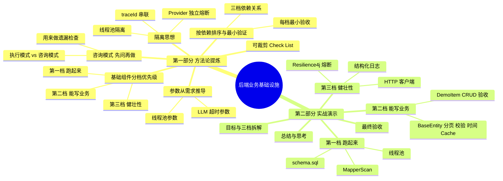
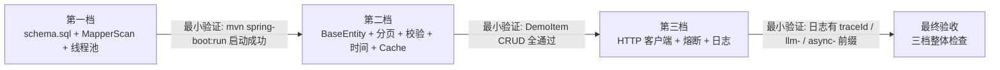

<!--
aicent-10-be-business-infra
AI编程方法 10：工程搭建 - 后端业务基础设施
-->

**全文导读地图**


本篇是系列的第十篇，承接第九篇（前端工程初始化）继续工程搭建。前两篇搭出了前后端都能跑的空项目，本篇要补齐"业务开发前必须就绪"的那一层东西：基础组件——数据库初始化、MapperScan、线程池、BaseEntity、分页封装、入参校验、时间序列化、Spring Cache、HTTP 客户端、熔断、结构化日志。本篇同时引入一个新的协作模式：咨询模式（先问再做）。做完之后，启动项目日志带 traceId 和 llm- / async- 线程名前缀，跑通 DemoItem 的完整 CRUD，三档基础组件全部就绪。

文章分两部分：第一部分提炼五条可复用方法论 + 一份可裁剪 Check List，是项目对应阶段的参考手册；第二部分把方法论放回 Hify 实战，按三档顺序复现"按图施工"全过程，讲清 why 与踩坑。建议初读按顺序通读，复习时直接跳第一部分的 Check List。



**第一部分　方法论提炼**　本部分聚焦"业务开发前如何用咨询模式补齐基础组件、按什么优先级搭、参数如何从需求推导、如何做隔离"，不深入具体技术栈细节，目标是为你在项目对应阶段提供一份可快速查阅的参考手册。

## 1. 方法论提炼

### 1.1 咨询模式方法论


#### (1) 目标

在"你知道大方向但不确定细节、不确定有没有遗漏"的阶段，换一种协作方式：先让 Claude Code 帮你梳理全景，你做判断和取舍，再进入执行。多一个前置思考环节，但能帮你发现遗漏。

#### (2) 为什么需要这个模式

前几篇的协作基本都是一种模式：你想清楚了，让它做。"按照规范实现这个接口""帮我生成 Maven 骨架"——你知道要做什么，它负责执行。这种模式适合你对任务很清楚的时候。

但"业务开发前需要准备哪些基础组件"这种问题不一样：你有大致想法（线程池、熔断），但不确定有没有遗漏、先后顺序对不对。脑子里想的都是有设计感的东西（BaseEntity、熔断），反而容易忘掉最基础的（表还没建、MapperScan 扫描路径不对）。这时候不是让它替你做决策，而是把它当成一个资深架构师来咨询。

#### (3) 执行模式 vs 咨询模式

| 维度 | 执行模式 | 咨询模式 |
|------|---------|---------|
| 适用情境 | 你对任务很清楚 | 你知道大方向但不确定细节 |
| 流程 | 你想清楚 → 给指令 → AI 做 → 你验收 | 你问"该考虑什么" → AI 梳理全景 → 你判断取舍 → 再给指令执行 |
| 你的角色 | 决策者 + 验收者 | 咨询方 + 决策者 + 验收者 |
| 核心价值 | 高效落地 | 遗漏检查（AI 见过的项目比你多） |
| 本篇典型用例 | "按规范生成 schema.sql" | "业务开发前还需要哪些基础组件？" |

<span style="color: red; font-weight: bold;">咨询模式的关键不是照搬 AI 的建议，而是用它查漏补缺——它的建议不能直接照搬，但用来对照自己的清单非常好。</span>

<!-- 
图片内容说明
路径：imgs/aicent-10-be-business-infra/c6da1baa997116540696cd194aa4c074_MD5.jpg
用途：展示执行模式与咨询模式的对比
内容：两种协作模式的对比图——执行模式（想清楚→给指令→AI 做→验收）与咨询模式（问该考虑什么→AI 梳理→你取舍→再执行）的流程与适用情境
-->


#### (4) 操作要点

1. <span style="color: red; font-weight: bold;">每次进入新阶段（新模块、测试、部署），先用咨询模式问一句“这个阶段我应该考虑什么”，确保不遗漏。</span>
2. 给 AI 充分的上下文（项目骨架现状、已搭好的东西、要进入的下一步），它才能给出贴合你项目的建议，而不是泛泛而谈。
3. AI 给清单后，自己判断哪些要做、哪些不做，按优先级分档——不是所有东西都要现在做。
4. 咨询模式的产出是"全景 + 取舍"，做完取舍后，对每个要做的组件再切回执行模式给具体指令。

#### (5) 常见陷阱

- 把咨询模式当执行模式用：问得太具体（"帮我写线程池"），错过梳理全景的机会。
- 反过来当甩手掌柜：AI 给什么就做什么，不做判断和取舍。
- 只在新项目开始时用一次：咨询模式应该在每个阶段切换时反复用。

### 1.2 基础组件分档优先级方法论


#### (1) 目标

把咨询模式产出的基础组件清单，按"不做会怎样"分档排优先级，决定哪些先做、哪些同步做、哪些后补，避免要么全堆在一起要么漏掉关键项。

#### (2) 为什么分档

咨询模式给的清单很全，但不是所有东西都要现在做。有些不做业务就跑不起来（schema.sql、MapperScan），有些可以写业务时同步补（BaseEntity、分页、校验），有些可以后补不影响功能（HTTP 客户端、熔断、日志）。<span style="color: red; font-weight: bold;">不分会陷入两种极端：要么想全做完再写业务（进度卡住），要么随手做随手漏（启动报错才发现）。</span>

#### (3) 三档清单

| 档位 | 判据 | 组件 | 不做的后果 |
|------|------|------|-----------|
| 第一档 必须先做 | 不做业务跑不起来 | 数据库初始化脚本（schema.sql）、@MapperScan 扫描路径、llmExecutor / asyncExecutor 线程池 | 启动报错、Mapper 注入失败、Chat 模块注入不到线程池 Bean |
| 第二档 同步补 | 第一个列表接口之前搞定 | BaseEntity、统一分页封装、入参校验、统一时间序列化、Spring Cache 集成、CRUD 标准流程 | 每个实体重复写字段、每个接口手动判断分页、时间格式前端解析不了 |
| 第三档 后补 | 不影响功能开发 | HTTP 客户端封装、Resilience4j 熔断配置、结构化日志配置 | 联调阶段才发现 LLM 调用没隔离、Provider 挂了全系统等超时、日志查不到链路 |

本篇的决定是三档全做（第三档提前搭好后面就不用回头），但实战中你可以按进度灵活裁剪。

#### (4) 操作要点

1. <span style="color: red; font-weight: bold;">每档判据用“不做会怎样”来问，而不是“重不重要”。</span>schema.sql 看起来平淡，但不做就是启动失败。
2. <span style="color: red; font-weight: bold;">咨询模式产出的清单里，看似有设计感的（BaseEntity、熔断）往往不是第一档，反而是容易被忽略的（schema.sql、MapperScan）才是第一档。</span>
3. 第三档"可以后补"不等于"可以不做"，提前搭好是培养从零搭系统的能力。

#### (5) 常见陷阱

- 把所有基础组件一股脑当第一档，进度卡在搭基础设施上迟迟进不了业务。
- 反过来把第二档、第三档都推到最后，第一个列表接口就开始踩分页 / 校验 / 时间格式的坑。
- 用直觉判断档位而非"不做会怎样"，结果漏掉 schema.sql 这种最基础的。

### 1.3 按依赖排序与最小验证方法论


#### (1) 目标

三档内部按依赖关系排序，每档做完用一个最小验证确认就绪，再进下一档。不积压到全部搭完才联调。

#### (2) 为什么

基础组件之间有依赖：没有 schema.sql，Mapper 跑不起来；没有 BaseEntity，CRUD 验证跑不全；没有线程池，LLM 客户端拿不到 Bean。乱序做会出现"搭完一半发现依赖没就绪"的返工。<span style="color: red; font-weight: bold;">每档用最小验证（启动成功 / 一个 DemoItem CRUD）能在进入下一档前确认本档可用。</span>

#### (3) 三档依赖与验证关系



#### (4) 操作要点

1. 先做第一档（跑起来），再做第二档（业务能写），最后补第三档（健壮性），DemoItem 验收放在第二档做完之后。
2. 每档验收点不要跳过：第一档跑一下确认无启动报错，第二档跑 DemoItem CRUD，第三档看日志格式。
3. 每个验收点给你信心：到这里是对的，可以进下一档。

#### (5) 常见陷阱

- 把三档混在一起做，验收时不知道是哪一档出了问题。
- 跳过最小验证直接堆下一档，到 DemoItem 跑不通时排查面太大。

### 1.4 参数从需求推导方法论


#### (1) 目标

线程池参数、超时参数这些不能拍脑袋、也不能全交给 AI，要从"实际需求场景"推导。这是程序员的核心价值所在。

#### (2) 为什么这是程序员的价值

<span style="color: red; font-weight: bold;">AI 不知道 GPT-4 一次响应可能 10-20 秒，这是物理世界的表现。它会按“普通 HTTP 调用”给超时（比如 5 秒），结果 LLM 调用全部超时失败。同样，AI 不会自己推断“目标 20-50 人同时在线”该开多大线程池。这些参数必须由理解需求的程序员来定。从宏观去思考参数应该是多少，是 AI 替代不了的能力。</span>

#### (3) 参数推导对照

| 参数 | 需求场景 | 推导 | 取值 |
|------|---------|------|------|
| llmExecutor 核心线程 | 20-50 人同时在线，一半同时对话 | 10-25 个并发 LLM 调用，核心线程 10 够用 | 10 |
| llmExecutor 最大线程 | 留余量应对突发 | 在线峰值 50 人，最大 50 留余量 | 50 |
| llmExecutor 队列 | 缓冲超核心的请求 | 100（一期先这样，后面根据监控调整） | 100 |
| llmExecutor 拒绝策略 | LLM 调用不能丢 | CallerRunsPolicy（回退到调用线程执行） | CallerRunsPolicy |
| asyncExecutor 参数 | 日志异步写入等非关键任务 | 比关键任务小，失败可接受 | 核心 5 / 最大 20 / 队列 200 / AbortPolicy |
| RestTemplate 读超时 | 普通同步 LLM 请求 | GPT-4 响应 10-20 秒，留余量 | 60s |
| OkHttpClient 读超时 | 流式 SSE 请求 | 流式可能持续一两分钟 | 120s |
| 熔断 failureRateThreshold | Provider 健康判定 | 50% 失败率即判定 Provider 异常 | 50% |
| 熔断 waitDurationInOpenState | Provider 恢复等待 | 30s 后半开试探 | 30s |

#### (4) 操作要点

1. 先写需求场景（多少人在线、响应多久、能否丢失），再推参数，不要先看参数再凑理由。
2. 关键参数（线程池、超时、熔断阈值）一定要自己定，不能全交给 AI 默认值。
3. 一期先按经验给值，后面根据监控调整——参数是迭代的，不是一次定死。

#### (5) 常见陷阱

- 直接用 AI 给的默认参数（线程池全用 200、超时全用 5s），结果生产环境要么资源浪费要么频繁超时。
- 凭感觉给参数（线程池开 100），没有需求场景支撑，无法解释为什么是这个值。
- 把所有超时设成一样，没有区分同步调用和流式调用的差异。

### 1.5 隔离思想方法论


#### (1) 目标

通过隔离让"一处出问题不拖垮全局"：LLM 调用慢不阻塞管理页面、某个 Provider 挂了不影响其他 Provider、一个请求的日志能被一个 ID 串起来。

#### (2) 为什么需要隔离

线程池解决了"一个 LLM 卡了不影响其他功能"的问题；熔断解决了"某个 Provider 挂了系统还在不停发请求白等超时"的问题；traceId 解决了"一个请求产生十几条日志排查要大海捞针"的问题。<span style="color: red; font-weight: bold;">这三者都是隔离的不同侧面——资源隔离、故障隔离、链路隔离。生产级项目必须有的底层能力。</span>

#### (3) 三个隔离点

| 隔离点 | 实现方式 | 隔离的是什么 |
|--------|---------|-------------|
| 线程池隔离 | llmExecutor 与 asyncExecutor 分开 | LLM 长耗时调用与日志异步写入互不影响；对话请求占满 LLM 线程时，管理页面（走 asyncExecutor 或主线程）不转圈 |
| Provider 独立熔断 | 按 providerName 创建独立 CircuitBreaker | OpenAI 挂了不拦住 Claude——共用熔断器会让一家失败拖垮所有正常的 Provider |
| traceId 链路隔离 | 请求进入时生成 traceId 放入 MDC | 一个对话请求从 Controller → Service → LLM → DB 的十几条日志被一个 ID 串起，排查时不用大海捞针 |

<span style="color: red; font-weight: bold;">重试也要按异常类型隔离：认证失败重试一百次也不会成功，只有“暂时性”的失败（网络超时、限流）才值得重试。</span>

#### (4) 操作要点

1. 线程池按"任务类型"分，不按"模块"分：LLM 调用一组、异步任务一组，命名前缀（llm-、async-）便于看日志时一眼区分。
2. 熔断器按"故障域"分：每个外部依赖（每个 Provider）独立，避免一家故障扩散。
3. traceId 在请求最外层（拦截器）生成与清理，确保整条链路都带上。

#### (5) 常见陷阱

- 所有异步任务共用一个线程池，LLM 调用占满后日志写入也被卡住。
- 所有 Provider 共用一个熔断器，一家失败触发熔断后全部 Provider 都被拦。
- 不设线程名前缀，日志里全是 pool-1-thread-3，排查时分不清是哪类任务。

### 1.6 可裁剪 Check List


按项目阶段裁剪使用，逐项打勾。

#### (1) 阶段一：第一档（让业务代码跑起来）

- [ ] 是否用咨询模式问过"业务开发前还需要哪些基础组件"，对照清单查漏？
- [ ] schema.sql 是否生成了所有业务表的建表 DDL（表名小写下划线、主键 bigint 自增、created_at/updated_at、deleted tinyint 默认 0、utf8mb4）？
- [ ] @MapperScan 是否覆盖了所有子模块的 mapper 包（`com.hify.**.mapper`），所有 Mapper 能注入？
- [ ] llmExecutor / asyncExecutor 线程池是否就绪，参数是否从"目标在线人数"推导？
- [ ] `mvn spring-boot:run` 是否能正常启动，无 Bean 注入报错？

#### (2) 阶段二：第二档（业务能写）

- [ ] BaseEntity 是否封装了 id / createdAt / updatedAt / deleted，所有业务实体继承它？
- [ ] PageHelper 是否提供了 toPage / toPageResult，前端参数能转成 MyBatis-Plus 的 Page 对象？
- [ ] 入参校验是否启用 @Valid + JSR 303，与全局异常处理器的 MethodArgumentNotValidException 串起来？
- [ ] Jackson 时间序列化是否统一格式（LocalDateTime → ISO 8601），关掉 WRITE_DATES_AS_TIMESTAMPS？
- [ ] Spring Cache 是否启用（@EnableCaching + RedisCacheManager），@Cacheable 能用，TTL 按 cacheName 区分？
- [ ] 是否用 DemoItem 跑通完整 CRUD，5 个 curl 验证全部通过？

#### (3) 阶段三：第三档（健壮性补齐）

- [ ] LlmHttpClient 是否封装了 RestTemplate（同步）+ OkHttp（SSE），超时参数是否按 LLM 响应特征（10-20s / 流式 1-2min）推导？
- [ ] Resilience4j 是否按 providerName 创建独立熔断器，重试是否按异常类型区分（认证失败不重试）？
- [ ] logback-spring.xml 是否区分环境（dev 控制台彩色 / prod JSON 滚动文件，保留 30 天）？
- [ ] RequestLogInterceptor 是否记录 method / path / status / 耗时，慢请求标 WARN，traceId 是否进入 MDC？
- [ ] 最终验收：日志是否有 traceId 和 llm- / async- 线程名前缀，DemoItem CRUD 请求日志是否被记录？

**第二部分　实战演示**　本部分把第一部分的方法论放回 Hify 后端基础组件搭建的真实场景里，复现"按图施工"的每一步，讲清为什么这么搭、参数为什么这么设。上一篇（第九篇）已搭好前后端能跑的空项目——Maven 多模块、hify-common 的 Result / 异常处理 / MyBatis-Plus 配置 / Redis 配置都就绪。本篇把"业务开发前必须就绪"的基础组件这一层补齐。

## 2. 实战演示

### 2.1 目标与拆解


承接 1.2、1.3 的方法论：先用咨询模式让 Claude Code 梳理基础组件清单，自己判断取舍并分档，再按依赖关系排序逐档执行。DemoItem 验收放在第二档做完之后。

#### (1) 咨询模式梳理清单

进入业务开发前，先用咨询模式问 Claude Code：

> Hify 项目工程骨架已经搭好（Maven 多模块、hify-common 的 Result / 异常处理 / MyBatis-Plus 配置 / Redis 配置、前端 Vue 工程）。现在要开始做业务功能了。在写业务代码之前，还需要准备哪些基础组件？从数据库层、接口层、外部调用、缓存、可观测性几个角度帮我梳理，每个组件说明它解决什么问题。

它给了一份很详细的清单，总结如下：

<!-- 
图片内容说明
路径：imgs/aicent-10-be-business-infra/1178313a265d5b0a9b0e2ddf70c4a75b_MD5.jpg
用途：展示 Claude Code 梳理的基础组件清单总结
内容：按数据库层 / 接口层 / 外部调用 / 缓存 / 可观测性分类的基础组件全景清单
-->


有些是预期到的（线程池、熔断），但有几个是自己列清单时会漏掉的。按"不做会怎样"分档（详见 1.2）：

| 档位 | 组件 |
|------|------|
| 第一档 | 数据库初始化脚本、@MapperScan 扫描路径、llmExecutor / asyncExecutor 线程池 |
| 第二档 | BaseEntity、统一分页封装、入参校验、统一时间序列化、Spring Cache 集成、CRUD 标准流程验证 |
| 第三档 | HTTP 客户端封装、Resilience4j 熔断配置、结构化日志配置 |

<span style="color: red; font-weight: bold;">Claude Code 帮我发现了两个自己会漏掉的：schema.sql 和 @MapperScan。不是什么高深的东西，但列基础组件清单时脑子里都是 BaseEntity、线程池这些有设计感的东西，反而忘了最基础的——表还没建、扫描路径不对。等到启动报错才发现，浪费的是排查时间。这正是 1.1 咨询模式的核心价值：用它做遗漏检查。</span>

#### (2) 三档排序与验收目标

| 顺序 | 步骤 | 为什么排这个序 |
|------|------|---------------|
| 1 | 第一档：schema.sql → @MapperScan → 线程池 | 不做启动就失败，是后续所有步骤的前提 |
| 2 | 第二档：BaseEntity → 分页 → 校验 → 时间 → Cache → DemoItem CRUD | 写业务的基础能力，CRUD 验证放在最后串起前面所有组件 |
| 3 | 第三档：HTTP 客户端 → 熔断 → 结构化日志 | 健壮性补齐，依赖第一档线程池与第一档启动成功 |

本篇决定三档全做。验收目标：启动项目无报错、DemoItem CRUD 五个 curl 全通过、日志带 traceId 和 llm- / async- 线程名前缀。

### 2.2 第一档：让业务代码跑起来


#### (1) 数据库初始化脚本

现在还没有建表 DDL。Spring Boot 启动时需要库和表已存在，否则 Mapper 跑不起来。这是差点被忽略的一项。

指令设计：

> 按照 CLAUDE.md 的数据库规范和数据模型，生成所有业务表的建表 DDL。放在 hify-app/src/main/resources/db/schema.sql。表名小写下划线、主键 id bigint 自增、时间字段 created_at/updated_at datetime、逻辑删除 deleted tinyint 默认 0、字符集 utf8mb4。包含：provider、model_config、agent、agent_tool、mcp_server、chat_session、chat_message。

输出效果：

<!-- 
图片内容说明
路径：imgs/aicent-10-be-business-infra/a8dbf72b7fc368aab3d73812f2379c18_MD5.jpg
用途：展示 schema.sql 的生成输出
内容：Claude Code 生成的各业务表建表 DDL（provider、model_config、agent、agent_tool、mcp_server、chat_session、chat_message）
-->


这个不展开说明，大家自己琢磨一下细节。

#### (2) @MapperScan 扫描路径

目前启动类的扫描路径只覆盖了 `com.hify.app`，但业务 Mapper 在各子模块里（`com.hify.provider.mapper` 等），Bean 注册不上。不改这个，所有 Mapper 注入都会报错。

这个改动就一行代码，但必须改。在 HifyApplication 启动类上加：

```java
@MapperScan("com.hify.**.mapper")
```

扫描所有子模块的 Mapper 包。输出效果：

<!-- 
图片内容说明
路径：imgs/aicent-10-be-business-infra/3b2b5b93c17cca5b1719095cdf1bee31_MD5.jpg
用途：展示 @MapperScan 修改后的效果
内容：HifyApplication 启动类加上 @MapperScan("com.hify.**.mapper") 后所有 Mapper 正确注入
-->


#### (3) 线程池配置

**场景**：用户在对话（调 LLM，卡了 30 秒），同时另一个用户打开管理页面看 Agent 配置。如果共用线程池，对话请求占满了所有线程，管理页面一直转圈。这正是 1.5 隔离思想要解决的问题。

**配置说明**：在 hify-common 中创建 `ThreadPoolConfig`（`com.hify.common.config`），定义两个线程池：
- `llmExecutor`：核心 10，最大 50，队列 100，线程名前缀 `llm-`，拒绝策略 `CallerRunsPolicy`，用于 LLM 调用。
- `asyncExecutor`：核心 5，最大 20，队列 200，线程名前缀 `async-`，拒绝策略 `AbortPolicy`，用于日志异步写入等非关键任务。

用 `@Bean + @Qualifier` 注册。完整代码：

```java
package com.hify.common.config;

import org.springframework.beans.factory.annotation.Qualifier;
import org.springframework.context.annotation.Bean;
import org.springframework.context.annotation.Configuration;

import java.util.concurrent.Executor;
import java.util.concurrent.LinkedBlockingQueue;
import java.util.concurrent.ThreadPoolExecutor;
import java.util.concurrent.TimeUnit;

@Configuration
public class ThreadPoolConfig {

    @Bean
    @Qualifier("llmExecutor")
    public Executor llmExecutor() {
        return new ThreadPoolExecutor(
                10, 50,
                60L, TimeUnit.SECONDS,
                new LinkedBlockingQueue<>(100),
                new NamedThreadFactory("llm-"),
                new ThreadPoolExecutor.CallerRunsPolicy()
        );
    }

    @Bean
    @Qualifier("asyncExecutor")
    public Executor asyncExecutor() {
        return new ThreadPoolExecutor(
                5, 20,
                60L, TimeUnit.SECONDS,
                new LinkedBlockingQueue<>(200),
                new NamedThreadFactory("async-"),
                new ThreadPoolExecutor.AbortPolicy()
        );
    }
}
```

**参数依据**（对应 1.4）：CLAUDE.md 要求 LLM 调用必须用 `@Qualifier("llmExecutor")`，Chat 模块注入时这个 Bean 必须存在。目标 20-50 人同时在线，一半的人同时对话就是 10-25 个并发 LLM 调用，核心线程 10 够用，最大 50 留余量。一期先这样，后面根据监控调整。

线程名前缀很重要：后面看日志时，`llm-3` 立刻知道是 LLM 调用线程，`async-1` 是异步任务线程。不设前缀全是 `pool-1-thread-3`，排查时分不清。

到这里，`mvn spring-boot:run` 应该能正常启动、Mapper 能注入、线程池 Bean 就绪。跑一下确认没有启动报错，再进入第二档——这是 1.3 的第一档最小验证。

### 2.3 第二档：业务开发的基础能力


接下来不展示每个指令的执行效果了，比较复杂的会展开说明。

#### (1) BaseEntity

每个数据库实体都有公共字段。不封装的话，每个 Entity 都要重复写 id、created_at、updated_at、deleted 和对应的注解。

在 hify-common 中创建 BaseEntity 类。字段：id（Long，`@TableId` 自增）、createdAt（LocalDateTime，插入时自动填充）、updatedAt（LocalDateTime，插入和更新时自动填充）、deleted（Integer，`@TableLogic`，默认 0）。后面所有业务实体继承这个类。

#### (2) 统一分页封装

上一档（08 篇）定义了分页的请求参数（page、pageSize）和响应格式（PageResult），也配好了分页插件，但还没有把它们串起来。

在 hify-common 中创建 PageHelper 工具类，提供两个静态方法：
- `toPage(page, pageSize)`：把前端参数转成 MyBatis-Plus 的 Page 对象（page 从 1 开始，pageSize 默认 20 最大 100）。
- `toPageResult(IPage)`：把查询结果转成我们的 PageResult。

#### (3) 入参校验

每个创建和更新接口都需要校验入参。Spring Boot 的 `@Valid + JSR 303` 注解就够用，关键是和 08 篇的 GlobalExceptionHandler 配合好。它已经捕获了 `MethodArgumentNotValidException`，会转成 `Result.fail(ErrorCode.PARAM_ERROR, 具体校验信息)`。

#### (4) 统一时间序列化

在 hify-common 中配置 Jackson 的全局时间序列化。LocalDateTime 统一用 ISO 8601 格式（`yyyy-MM-dd'T'HH:mm:ss`），LocalDate 用 `yyyy-MM-dd`。配置 JavaTimeModule，关掉 `WRITE_DATES_AS_TIMESTAMPS`。

不配的话 Jackson 序列化 LocalDateTime 默认输出数组格式 `[2025,3,16,10,30,0]`，前端解析不了。一个配置类十几行代码，省掉后面无数前端时间解析的坑。

#### (5) Spring Cache 集成

08 篇配好了 RedisTemplate 和 RedisUtil，但只是裸的 get/set 操作。业务层需要 `@Cacheable`、`@CacheEvict` 这些声明式缓存。Provider 配置读多写少，加个注解就自动缓存，不需要手动写 if-else。

在 hify-common 中启用 Spring Cache：`@EnableCaching`，配置 RedisCacheManager，默认 TTL 30 分钟，key 前缀 `hify:`。配置不同缓存名的 TTL：

| cacheName | TTL | 用途 |
|-----------|-----|------|
| provider-cache | 30 分钟 | Provider 配置（读多写少） |
| agent-cache | 30 分钟 | Agent 配置（读多写少） |
| session-cache | 2 小时 | 会话上下文 |

这样后面业务 Service 直接加 `@Cacheable(cacheNames = "provider-cache")` 就行，缓存的读写、过期、序列化全自动处理。写入时加 `@CacheEvict` 失效缓存，标准的 Cache-Aside 模式。

#### (6) CRUD 标准流程验证

第二档的所有组件搭好了，用一个 DemoItem 跑通完整 CRUD，验证它们协同工作（对应 1.3 第二档最小验证）。

实现一个最简单的 CRUD 演示。实体：DemoItem，只有 name（String）和 status（Integer）两个字段，继承 BaseEntity。完整实现 Controller → Service → ServiceImpl → Mapper → Entity → CreateReq/UpdateReq/Resp DTO。Controller 使用 RESTful 路径 `/api/v1/demo-items`，返回统一 Result，列表接口返回 PageResult，创建和更新接口使用 `@Valid` 校验，Service 层处理业务逻辑，Mapper 继承 BaseMapper。

验收用四个 curl：

```bash
curl -X POST http://localhost:8080/api/v1/demo-items \
  -H "Content-Type: application/json" \
  -d '{"name": "", "status": 1}'

curl -X POST http://localhost:8080/api/v1/demo-items \
  -H "Content-Type: application/json" \
  -d '{"name": "测试项", "status": 1}'

curl "http://localhost:8080/api/v1/demo-items?page=1&pageSize=10"

curl -X DELETE http://localhost:8080/api/v1/demo-items/1
```

每一个请求验证一个基础组件：

| curl | 验证的组件 |
|------|-----------|
| 空 name 的 POST | 入参校验 + 全局异常处理器（应返回 PARAM_ERROR） |
| 正常 POST 创建成功 | BaseEntity 自动填充 createdAt / updatedAt |
| GET 列表 | PageHelper + 分页插件（返回 PageResult） |
| 列表里的时间字段 | Jackson 配置（ISO 8601 而非数组） |
| DELETE | 逻辑删除（MyBatis-Plus 配置，deleted 置 1） |

全部通过，说明第二档组件就绪。DemoItem 留着不删，后面做 Provider 模块时，它是最好的参考模板。

### 2.4 第三档：健壮性补齐


这些不做也能写业务，但从架构和实现的角度，最好提前搭好，后面不用回头。这也是培养从零设计和实现系统的好习惯。

#### (1) HTTP 客户端封装

Hify 需要调用各种外部 LLM API。这里演示咨询模式 + 执行模式的串联使用（对应 1.1）。

**先用咨询模式确认方案**：

> 帮我分析普通请求用 RestTemplate、流式 SSE 请求用 OkHttp EventSource 这个方案，有没有问题？

Claude Code 确认方案合理，提醒了连接池要分开配、超时参数要区分。**确认后进入执行模式**：

> 在 hify-common 中创建 LlmHttpClient 类（com.hify.common.http）。内部持有 RestTemplate（连接超时 5s，读超时 60s）和 OkHttpClient（连接超时 5s，读超时 120s）。提供 post(url, headers, body) 方法返回 String，提供 stream(url, headers, body, callback) 方法通过回调逐行返回。所有请求记录日志（URL、耗时、状态码），异常统一转为 LlmApiException（区分 TIMEOUT、AUTH_FAILED、RATE_LIMITED）。

输出：

<!-- 
图片内容说明
路径：imgs/aicent-10-be-business-infra/9e314c0797e8bddfd4b7d264e990fb87_MD5.jpg
用途：展示 LlmHttpClient 生成的局部代码
内容：Claude Code 生成的 LlmHttpClient 封装代码，包含 RestTemplate 同步调用与 OkHttp SSE 流式回调
-->


上面是生成的局部代码，很完整，比我写的都好。

**点题：为什么超时设这么长**（对应 1.4 参数从需求推导）。LLM API 不是普通 HTTP 调用，GPT-4 一次响应可能 10-20 秒，流式可能持续一两分钟。60 秒和 120 秒是实际经验的平衡。<span style="color: red; font-weight: bold;">这就是我们作为程序员的价值所在——我们会去理解需求，从宏观去思考超时时间该是多久。AI 不知道 GPT-4 一次响应要 10-20 秒，这是物理世界的表现，所以这个参数必须程序员来定。</span>

#### (2) Resilience4j 熔断与重试

线程池解决了"一个 LLM 卡了不影响其他功能"的问题。熔断解决另一个问题：某个提供商整个挂了，系统还在不停发请求，每次等 60 秒超时——挂了就是挂了，等也白等。

在 hify-common 中配置 Resilience4j 熔断器（`com.hify.common.resilience`）。application.yml 配置：

```yaml
resilience4j:
  circuitbreaker:
    instances:
      default:
        slidingWindowSize: 10
        failureRateThreshold: 50
        waitDurationInOpenState: 30s
        permittedNumberOfCallsInHalfOpenState: 3
```

创建 CircuitBreakerService，按 providerName 获取或创建独立熔断器实例。重试逻辑：
- 网络超时：重试 2 次，间隔 1s。
- 限流：退避重试（2s、4s）。
- 认证失败：不重试（重试一百次也不会成功）。

输出：

<!-- 
图片内容说明
路径：imgs/aicent-10-be-business-infra/165d436ad12a3bb828cd122fa7710e2e_MD5.jpg
用途：展示 Resilience4j 熔断与重试的配置输出
内容：Claude Code 生成的 CircuitBreakerService 代码与 application.yml 熔断器配置
-->


下图是熔断器状态流转图，理解一下底层设计：

<!-- 
图片内容说明
路径：imgs/aicent-10-be-business-infra/4710ca62e64668e118de49d6dae42b1a_MD5.jpg
用途：展示熔断器状态流转图
内容：CLOSED → OPEN → HALF_OPEN 三态流转图，含失败率阈值触发、半开放试探、恢复回 CLOSED 的条件
-->


**点题：为什么每个 Provider 独立熔断器**（对应 1.5 隔离思想）。<span style="color: red; font-weight: bold;">OpenAI 挂了不代表 Claude 也挂了。共用熔断器的话，一家失败会触发熔断把其他正常的也拦住。</span>重试按异常类型区分，认证失败重试一百次也不会成功，只有"暂时性"的失败才值得重试。

#### (3) 结构化日志与请求追踪

在 hify-common 中配置统一日志（`com.hify.common.log`）。logback-spring.xml 区分环境：开发环境控制台彩色输出，生产环境 JSON 格式输出到文件（按天滚动，保留 30 天）。创建 RequestLogInterceptor（HandlerInterceptor），记录每个请求的 method、path、status、耗时，慢请求（>1s）标 WARN。请求进入时生成 traceId 放入 MDC，请求结束时清理。日志格式：

```text
%d{HH:mm:ss} [%thread] [%X{traceId}] %-5level %logger{20} - %msg%n
```

完整的 logback-spring.xml：

```xml
<?xml version="1.0" encoding="UTF-8"?>
<configuration>
    <property name="LOG_DIR" value="${LOG_DIR:-logs}"/>
    <property name="APP_NAME" value="hify"/>
    <property name="LOG_PATTERN" value="%d{HH:mm:ss} [%thread] [%X{traceId}] %-5level %logger{20} - %msg%n"/>

    <springProfile name="default,dev">
        <appender name="CONSOLE" class="ch.qos.logback.core.ConsoleAppender">
            <encoder class="ch.qos.logback.classic.encoder.PatternLayoutEncoder">
                <pattern>%clr(%d{HH:mm:ss}){faint} %clr([%thread]){magenta} %clr([%X{traceId}]){cyan} %clr(%-5level) %clr(%logger{20}){cyan} - %msg%n</pattern>
                <charset>UTF-8</charset>
            </encoder>
        </appender>
        <root level="INFO">
            <appender-ref ref="CONSOLE"/>
        </root>
    </springProfile>

    <springProfile name="prod">
        <appender name="FILE" class="ch.qos.logback.core.rolling.RollingFileAppender">
            <file>${LOG_DIR}/${APP_NAME}.log</file>
            <rollingPolicy class="ch.qos.logback.core.rolling.TimeBasedRollingPolicy">
                <fileNamePattern>${LOG_DIR}/${APP_NAME}.%d{yyyy-MM-dd}.log</fileNamePattern>
                <maxHistory>30</maxHistory>
                <totalSizeCap>5GB</totalSizeCap>
            </rollingPolicy>
            <encoder class="ch.qos.logback.classic.encoder.PatternLayoutEncoder">
                <pattern>{"time":"%d{yyyy-MM-dd HH:mm:ss.SSS}","thread":"%thread","traceId":"%X{traceId}","level":"%-5level","logger":"%logger{36}","message":"%replace(%msg){'\"','\\\"'}"}%n</pattern>
                <charset>UTF-8</charset>
            </encoder>
        </appender>
        <appender name="FILE_ASYNC" class="ch.qos.logback.classic.AsyncAppender">
            <discardingThreshold>0</discardingThreshold>
            <queueSize>512</queueSize>
            <appender-ref ref="FILE"/>
        </appender>
        <root level="INFO">
            <appender-ref ref="FILE_ASYNC"/>
        </root>
    </springProfile>
</configuration>
```

**traceId 的价值**（对应 1.5 链路隔离）：一个对话请求从 Controller 进来，经过 Service、调 LLM、写数据库，可能产生十几条日志。<span style="color: red; font-weight: bold;">一个 ID 串起整条链路，排查时不用大海捞针。</span>

### 2.5 最终验收


三档全部搭完，回过头做一个整体检查：

1. 启动项目，确认日志格式正确（有 traceId、有线程名）。
2. 跑一遍 DemoItem 的 CRUD，确认请求日志过滤器在记录每个请求的 method、path、耗时。
3. 检查日志里线程名是否有 `llm-` 和 `async-` 前缀的线程池就绪。

全部通过，Hify 后端基础组件全部就绪。

### 2.6 实战总结与思考

#### (1) 做了什么

这一篇把 Hify 后端的全部基础组件搭完了：
- 第一档（跑起来）：建表 DDL、MapperScan 扫描路径、LLM / 异步线程池。
- 第二档（能写业务）：BaseEntity、分页封装、入参校验、时间序列化、Spring Cache、CRUD 标准流程。
- 第三档（健壮性）：HTTP 客户端（普通 + SSE）、熔断器（每个 Provider 独立）+ 重试、结构化日志 + 请求追踪。

#### (2) 方法论回顾

| 方法论 | 要点 |
|--------|------|
| 咨询模式 | 还没完全想清楚时，先让 Claude Code 梳理全景，你做判断和取舍，再进入执行。每个阶段切换都可以用 |
| 分档优先级 | 按"不做会怎样"分档：跑起来 / 能写业务 / 健壮性。看似平淡的 schema.sql 往往才是第一档 |
| 按依赖排序 + 最小验证 | 三档按依赖排序，每档用最小验收（启动 / DemoItem CRUD / 日志格式）确认就绪 |
| 参数从需求推导 | 线程池从"在线人数"推、超时从"LLM 响应时长"推——这是程序员不可替代的价值 |
| 隔离思想 | 线程池隔离、Provider 独立熔断、traceId 链路串联——一处出问题不拖垮全局 |

#### (3) 为什么花这么大篇幅讲基础组件

本系列教的不只是 Claude Code 的使用。还想让你知道，一个标准项目的基础组件应该长什么样——线程池隔离、熔断重试、Cache-Aside、traceId 串联、入参校验链路、统一时间序列化。<span style="color: red; font-weight: bold;">这些不是课本上的概念，是每个生产级项目都要有的底层能力。</span>很多工程师工作三五年，做的项目里这些东西是别人搭好的，自己从来没从零搭过，知道名字但说不清为什么要这么做。

这一篇看完，你不只是用 Claude Code 搭好了 Hify 的基础组件，还积累了一份可复用的基础组件清单，掌握了每个组件的设计理由。<span style="color: red; font-weight: bold;">以后开新项目，不管用不用 Claude Code，这套东西基本照搬就行。三档优先级、每个组件解决什么问题、参数为什么这么设，你都心里有数。这才是真正的积累——不是只会问 AI 问题，而是自己也有经验、有判断。</span>

下一篇进入前端。程序员一般没有设计师的审美，没关系，让 Claude Code 来。我们会让它帮我们做 UI 设计、定色调、优化布局，把灰蒙蒙的空壳变成有品牌感的界面，同时把前端的基础组件封装好。

#### (4) 思考

试一下咨询模式。打开 Claude Code，描述你正在做的一个项目，然后问它：

> 在开始写业务代码之前，我应该准备哪些基础组件？

看看它的建议里有没有你没想到的，你的建议和判断（哪些采纳、哪些不需要、为什么）是什么？
