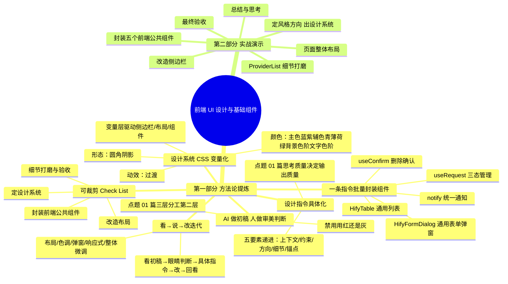
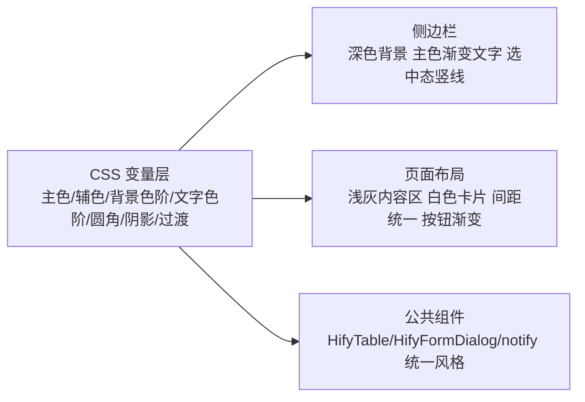
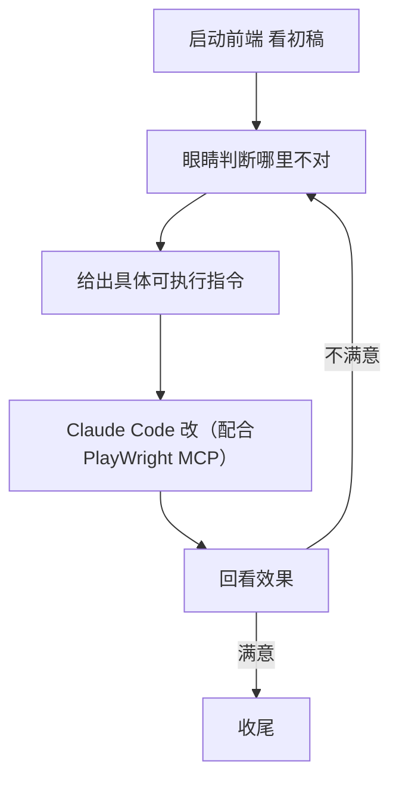

<!--
aicent-11-fe-base-ui
AI编程方法 11：工程搭建 - 前端UI设计和基础组件
-->

**全文导读地图**：本篇是系列第十一篇，承接第十篇后端业务基础设施就绪，继续工程搭建主线，补齐前端 UI 层与公共组件。


本篇交付三件事：

- 让 Claude Code 当设计师产出整套设计系统 CSS 变量
- 改造侧边栏与页面整体布局
- 用一条指令封装 HifyTable/HifyFormDialog/useConfirm/useRequest/notify 五个前端公共组件，并用一个 ProviderList 页面演示"看→说→改"的 UI 细节迭代

做完后前端基础设施就绪：一套设计系统 + 一组公共组件 + 一个看起来像产品的 Provider 列表页，下一篇进入 Provider 模块时只需把 mock 换成真实 API，界面不动。

阅读建议：初读按顺序通读方法论与实战，复习时直接跳到 1.6 Check List，按阶段复用即可。




**第一部分　方法论提炼**：本部分聚焦"前端 UI 阶段如何让 AI 当设计师、如何用设计系统统一风格、如何高效封装公共组件、如何迭代打磨细节"，不深入具体前端技术栈，目标是项目对应阶段的参考手册。

## 1. 方法论提炼

### 1.1 设计指令的具体化方法论（让 AI 当设计师）


#### (1) 目标

把"让 AI 当设计师"从一句空话变成可复用的指令结构。点题系列 01 篇的核心命题——思考质量决定输出质量，在 UI 设计这个场景同样适用：你的输入越具体，Claude Code 的产出越接近 80 分以上的设计师水准。

#### (2) 为什么

大多数后端工程师没有设计师的审美，不知道配色怎么选、间距怎么给、什么风格适合什么产品。以前这事只能找设计师或产品经理，现在 Claude Code 能帮你做到 80 分以上，但前提是输入要具体。说一句"帮我设计一个好看的界面"等于让 AI 猜，结果必然平庸；只有把产品定位、用户画像、风格方向、色调偏好、参考标杆逐层递进地交代清楚，AI 才不需要猜，输出才有方向。

#### (3) 设计指令要素递进表

| 要素 | 原文示例 | 缺失后果 |
|------|----------|----------|
| 上下文（产品是什么） | Hify 是一个 AI Agent 开发平台，面向技术团队内部使用 | AI 不知道要做管理后台还是营销页，风格基调无从定 |
| 约束（用户是谁） | 主要用户是开发者和技术管理者，界面以管理后台为主，大量表格表单配置页面 | 不知道信息密度该高还是低，可能误选花哨风格 |
| 方向（我要什么风格） | 浅底 + 科技感点缀，浅色背景保持信息可读性，侧边栏深色制造科技感 | 风格飘忽，深色浅色乱搭，长时间看眼累 |
| 细节（色调偏好） | 主色蓝紫系，辅色青色或薄荷绿，用于数据和状态指示 | 配色无体系，状态色与品牌色冲突 |
| 锚点（参考标杆） | 参考 Linear、Supabase——干净但不无聊，有设计感但不花哨 | AI 在通用审美里打转，产出平庸、缺乏识别度 |

#### (4) 操作要点

1. 先用咨询模式给足上下文，再下设计指令，不要一上来就让它生成。
2. 五要素按"上下文→约束→方向→细节→锚点"顺序递进，每层都给具体内容，不留空。
3. 明确要 AI 输出的产物形态：一套完整的设计系统（主色/辅色/背景色阶/文字色阶/圆角/阴影/过渡动效），用 CSS 变量交付。
4. 拿到结果后做一次快速 review：颜色搭配刺不刺眼、对比度够不够（文字能不能看清）、整体调性对不对，大方向对就行，细节留给后面调。
5. 第一版大概率需要调整，这是正常协作过程，不是 AI 能力不够。

#### (5) 常见陷阱

- 把"好看"当需求："帮我设计一个好看的界面"是最常见的废指令，等于没说。
- 缺少参考锚点：不指 Linear/Supabase 这类标杆，AI 会退回通用审美，产出千篇一律。
- 颜色描述太抽象："科技感的颜色""高级一点"——AI 无法翻译成具体色值，必须给蓝紫、青、薄荷绿这种可命名的方向。
- 一次性要求完美：UI 设计不是一条指令出完美稿，要预期来回调整，把第一版当初稿而不是终稿。

### 1.2 设计系统 CSS 变量化方法论


#### (1) 目标

把"设计系统"落成一整套 CSS 变量，作为侧边栏、布局、所有组件共享的单一事实来源，实现一次定义、处处引用、全局可调。

#### (2) 为什么

设计系统如果不变成 CSS 变量，就只是一份"配色说明书"，每个组件各写各的色值，改一处要全局搜索替换。变量化之后，整个项目的视觉风格集中在顶层一组变量里：要换主色、调整色阶、改圆角，只动这一处，侧边栏、布局、所有组件自动跟随。这也是后续"看→说→改"打磨能快速生效的前提——你的指令改的是变量，不是散落在各页面的硬编码。

#### (3) 设计系统要素清单表

| 维度 | 变量族 | 说明 |
|------|--------|------|
| 颜色-主色 | `--color-primary`（蓝紫系） | 按钮渐变、选中态竖线、品牌文字，科技感来源 |
| 颜色-辅色 | `--color-secondary`（青/薄荷绿） | 数据指示、状态点缀，与主色互补 |
| 颜色-背景色阶 | `--color-bg` / `--color-bg-secondary` / `--color-bg-dark` | 浅底主背景、浅灰内容区背景、深色侧边栏背景 |
| 颜色-文字色阶 | `--color-text` / `--color-text-secondary` / `--color-text-light` | 主文字、辅助文字、占位文字三级层次 |
| 形态-圆角 | `--radius-*` | 按钮、卡片、弹窗统一的圆角语言 |
| 形态-阴影 | `--shadow-*` | 卡片轻阴影、弹窗重阴影，制造层次感 |
| 动效-过渡 | `--transition-*` | hover、弹窗、折叠的统一过渡时长与曲线 |

CSS 变量层与下游的引用关系如下：



#### (4) 操作要点

1. 要求 AI 把整套设计系统全部用 CSS 变量输出，而不是直接写硬编码色值。
2. 变量按"颜色/形态/动效"三大族组织，颜色再分主色、辅色、背景色阶、文字色阶。
3. 侧边栏、布局、组件一律引用变量，禁止任何位置硬编码 `#xxxxxx`。
4. review 时聚焦三件事：搭配刺不刺眼、对比度够不够、调性对不对，不逐个色值较真。
5. 大方向通过就先用，细节留给"看→说→改"阶段微调。

#### (5) 常见陷阱

- 变量命名随意：`--c1` `--blue` 这类无语义命名，后期没人记得住，必须按主色/辅色/背景/文字族命名。
- 背景只有一档：管理后台需要主背景、浅灰内容区、深色侧边栏至少三档，单档背景会让层次塌掉。
- 文字对比度不足：浅底配浅灰文字、深色侧边栏配深灰文字都看不清，review 时务必验证可读性。
- 变量定义了却不用：组件里仍偷偷写硬编码色值，导致改变量全局不生效，要全项目禁用硬编码颜色。

### 1.3 一条指令批量封装基础组件方法论


#### (1) 目标

用一条完整指令让 Claude Code 一次性生成项目所需的全部前端公共组件，把后端工程师从重复的表格分页、弹窗开关、loading 状态、删除确认样板代码中解放出来，后续做业务页面就是填配置。

#### (2) 为什么

后端工程师做前端，最怕的不是写不出来，是写得慢。每个页面重复处理表格分页、弹窗打开关闭、loading 状态、删除确认，这些样板代码每个页面写一遍既慢又容易出错。把它们封装成公共组件后，业务页面只关心"展示什么、调什么接口"，公共能力由组件统一提供。一条指令批量生成而不是逐个写，是因为这五个组件的接口和行为可以一次性描述清楚，让 AI 一次产出再统一验收，效率远高于来回五次。

#### (3) 组件接口契约表

| 组件 | 类型 | 关键 Props 或暴露方法 | 解决什么 |
|------|------|----------------------|----------|
| `HifyTable.vue` | 通用列表表格 | Props: `columns`（label/prop/width/slot）、`api`（返回 PageResult）、是否分页；暴露 `refresh()` | 自动管理 loading、分页参数、数据请求，业务页只配列和接口 |
| `HifyFormDialog.vue` | 通用表单弹窗 | Props: `title`/`width`/表单 `rules`；`v-model` 控制显隐；暴露 `open(data?)`，传 data 为编辑、不传为新增；提交触发 `submit` 事件 | 统一弹窗显隐、提交 loading、关闭重置，新增编辑同一套 |
| `useConfirm.ts` | 删除确认 composable | 接收确认文案和 API 方法，弹 ElMessageBox，确认后调 API，成功后 ElMessage 提示，返回 Promise | 一行代码完成"确认删除→调接口→提示成功"全流程 |
| `useRequest.ts` | 请求状态 composable | 接收 API 方法，返回 `{ data, loading, error, execute }` | 自动管理三态，免去每页写 try-catch-finally 样板 |
| `notify.ts` | 统一通知封装 | 导出 `notifySuccess`/`notifyError`/`notifyWarning`，底层 ElMessage，统一 duration 和样式 | 全项目通知风格一致，改一处全局生效 |

#### (4) 操作要点

1. 一条指令写全五个组件的接口与行为，明确技术栈（Vue 3 Composition API + TypeScript + Element Plus）。
2. 每个组件都要求 TypeScript 类型定义 + 泛型支持，保证不同数据类型可复用。
3. 明确组件风格要与设计系统一致（引用 CSS 变量，不硬编码）。
4. 生成后快速过一遍三件事：TypeScript 类型对不对、接口设计合不合理、和 Element Plus 集成有没有问题。
5. 不逐行 review 实现细节，能用就行，有问题后面调——把精力放在"好不好用"的验收上。

#### (5) 常见陷阱

- 逐个组件分多次生成：丢失上下文，组件之间风格不统一、类型不互通，应该一条指令批量产出。
- 接口描述含糊：只说"一个表格组件"，AI 不知道要不要分页、要不要暴露刷新，Props 契约必须写清。
- 忘记要求泛型：组件写死某一数据类型，复用到第二个页面就要重写。
- 强行深究实现细节：前端组件封装不是后端工程师的核心能力区，过度 review 浪费时间，验证能用即可。

### 1.4 看→说→改的 UI 细节迭代方法论


#### (1) 目标

建立一套以人眼判断为驱动、以具体指令为执行手段的 UI 打磨闭环，让 UI 从"能用的初稿"迭代到"像产品的成品"。

#### (2) 为什么

UI 设计和组件都有之后，实际用起来一定有不满意的地方：间距不对、对齐有问题、颜色偏了、表格太挤、弹窗太宽。这是最花时间的环节，也是最能体现人机协作价值的环节。第一版永远不完美，这不是 Claude Code 能力不够，而是 UI 细节本就需要人来判断。真正的价值不在于你会不会写 CSS，而在于你能不能看着屏幕说清"哪里不对、应该怎样"，然后把判断交给 Claude Code 翻译成代码。

#### (3) 迭代流程图与打磨维度对照表



| 维度 | 具体调整项 |
|------|-----------|
| 布局 | 表格与顶部标题区间距 24px→16px；表格行高改为 52px；操作列两按钮加 8px margin-left |
| 色调 | 启用状态用 success 绿；禁用状态用 info 灰，不要 danger 红——禁用不是错误 |
| 表单弹窗 | 宽度 600px→520px；API Key 改 password 类型加显示切换；label 宽度 100px 左对齐改右对齐 |
| 响应式 | 浏览器宽度小于 1200px 时侧边栏自动折叠为窄模式；窄屏表格隐藏 Base URL 和创建时间两列 |
| 整体微调 | 表头背景换 `--color-bg-secondary` 浅灰；分页器居右上方加分割线；新增按钮加 Plus 图标；行 hover 微变色；编辑按钮 text 蓝色、删除按钮 text 红色 |

#### (4) 操作要点

1. 先让 AI 生成完整页面，启动前端实际看效果，不要只看代码猜。
2. 每次只针对一类问题（布局/色调/弹窗/响应式/整体）给指令，不要一条指令塞五件事。
3. 指令要具体到数值：间距 16px、宽度 520px、行高 52px，而不是"小一点""紧凑一些"。
4. 调完立即回看，满意就进下一类，不满意继续给指令，直到收尾。
5. 这一轮练好的手感，后面做每个前端页面都能复用——Provider 页练好了，Agent 页、对话页照着来。

#### (5) 常见陷阱

- 指令太抽象："调一下间距""让它好看点"——AI 无从下手，必须给具体数值和位置。
- 一次塞太多：一条指令要求同时改布局、色调、弹窗、响应式，AI 容易漏改或改错对象，应该分类分轮。
- 不实际看效果：只在代码层面 review，不启动前端，很多 UI 问题（间距、对齐、hover）只有眼睛能发现。
- 追求一次到位：UI 打磨本质上就是来回五六次的过程，期望初稿完美只会让自己和 AI 都挫败。

### 1.5 AI 做初稿、人做审美判断的分工方法论


#### (1) 目标

明确前端 UI 阶段的人机分工边界：AI 负责把判断翻译成代码并产出初稿，人负责审美判断和方向把控。点题系列 01 篇三层分工里的第二层——AI 做，你验收。

#### (2) 为什么

以"禁用状态用红还是灰"为例：Claude Code 第一版可能把"禁用"设成红色，因为它在语义层面判断禁用是负面状态。但在管理后台里，禁用是一个正常的状态——某个 Provider 暂时下线，用红色 danger 会让人误以为出错了，用灰色 info 才符合"这是个中性状态"。这种判断 AI 给不了，只有看着实际场景的人能给。这说明 UI 设计不是 AI 一条龙包办，而是 AI 出初稿、人做审美判断、再让 AI 改的协作循环。

#### (3) AI vs 人分工对照表

| 职责 | AI 负责 | 人 负责 |
|------|---------|---------|
| 设计系统初稿 | 根据上下文与参考标杆输出主色/辅色/色阶/圆角/阴影/动效 | review 搭配是否刺眼、对比度够不够、调性对不对 |
| 组件实现 | 按接口契约生成 TypeScript 类型与 Element Plus 集成 | 验证类型对不对、接口合不合理、能不能用 |
| UI 细节 | 把"间距改 16px、禁用用灰"翻译成具体 CSS | 看着屏幕判断"哪里不对、应该怎样" |
| 翻译 | 把人的自然语言判断转成代码改 | 用人话描述判断，不需要懂 CSS 写法 |

#### (4) 操作要点

1. 把 UI 工作拆成"初稿"和"判断"两段：初稿全交给 AI，判断全留给人。
2. 审美判断要敢下结论：禁用就是灰不是红、间距就是 16 不是 24，不要含糊。
3. 判断用人话表达即可，不需要写 CSS——"弹窗太宽改成 520px"就够，AI 负责翻译。
4. 每一轮"看→说→改"都在训练你的判断力，做几个页面下来对 UI 的感觉会明显变好。
5. AI 做初稿、你验收，这套分工同样适用于后端组件、前端组件，是系列 01 篇三层分工第二层的具体落地。

#### (5) 常见陷阱

- 全权交给 AI 不验收：把 AI 的初稿当终稿，审美问题（红色禁用、间距过大）全部带入成品。
- 反向越界自己写 CSS：后端工程师不擅长 CSS，自己上手改反而慢且乱，应该用自然语言指挥 AI。
- 判断含糊不敢拍板："好像不太对又说不上哪里不对"——要逼自己说具体：哪个元素、什么问题、改成什么。
- 把分工当成 AI 偷懒：分工不是不干活，而是把人的精力放在高价值的判断上，把翻译交给 AI。

### 1.6 可裁剪 Check List


> 以下四阶段 Check List 可直接裁剪到项目对应阶段使用，每项打勾即完成。

#### (1) 阶段一：定设计系统

- [ ] 用咨询模式给 AI 五要素上下文：产品是什么、用户是谁、风格方向、色调偏好、参考标杆
- [ ] 要求 AI 输出完整设计系统：主色/辅色/背景色阶/文字色阶/圆角/阴影/过渡动效
- [ ] 全部以 CSS 变量交付，禁止硬编码色值
- [ ] review 三件事：搭配刺不刺眼、对比度够不够、调性对不对
- [ ] 第一版有问题就调整，大方向通过即收尾，细节留给后面

#### (2) 阶段二：改造布局

- [ ] 改造侧边栏：深色背景、品牌渐变 Logo、菜单图标、hover 与选中态、折叠展开
- [ ] 优化页面整体布局：面包屑顶栏、浅灰内容区、白色卡片、统一间距（页面 24px/卡片 20px/元素 16px）
- [ ] 按钮样式分层：主操作主色渐变、次操作白边框、危险操作红色
- [ ] 侧边栏、布局、卡片全部引用 CSS 变量
- [ ] 改造前后做效果对比，确认视觉感受明显提升且功能代码未动

#### (3) 阶段三：封装前端公共组件

- [ ] 一条指令批量生成五个组件：HifyTable / HifyFormDialog / useConfirm / useRequest / notify
- [ ] 统一技术栈：Vue 3 Composition API + TypeScript + Element Plus
- [ ] 每个组件 TypeScript 类型定义 + 泛型支持
- [ ] 组件风格引用设计系统 CSS 变量
- [ ] 验收三件事：类型对不对、接口合不合理、和 Element Plus 集成有没有问题

#### (4) 阶段四：细节打磨与验收

- [ ] 用一个真实业务页面（如 ProviderList）跑通"看→说→改"五轮：布局、色调、表单弹窗、响应式、整体微调
- [ ] 每轮指令具体到数值与元素，不抽象、不堆叠
- [ ] 审美判断落地：启用 success 绿、禁用 info 灰、弹窗宽度 520、label 右对齐等
- [ ] 最终验收清单：侧边栏深色+渐变 Logo、列表 5 条 mock+分页、新增弹窗校验生效、删除确认+成功提示+列表刷新、整体色调干净有科技感
- [ ] 确认 UI 交互完整、数据可后续替换为真实 API，界面不动

**第二部分　实战演示**

本部分把方法论放回 Hify 前端 UI 搭建的真实场景，复现"让 AI 当设计师→改造布局→封装组件→打磨细节"全过程，讲清 why。

## 2. 实战演示

### 2.1 目标与拆解


#### (1) 承接

第九篇搭了前端空壳：Vue 骨架、axios 封装、三个菜单页面的占位文字。能跑，但说实话，看起来就是 Element Plus 的默认灰蓝，像一个课程作业，不像一个产品。后端三档组件在第十篇已经就绪，本篇该补上前端这块拼图——做两件事：让 Claude Code 当设计师，把界面从"能用"变成"好看"；把前端业务开发需要的公共组件一次性封装好。做完之后，前端和后端一样基础设施就绪，下一篇章开始直接往里填业务功能。

#### (2) 本篇拆解表

| 模块 | 目标 |
|------|------|
| 设计系统 | 用文字描述风格方向，让 AI 产出一整套 CSS 变量（主色/辅色/背景色阶/文字色阶/圆角/阴影/过渡动效） |
| 布局 | 改造侧边栏 + 优化页面整体布局，不改动功能代码、只换设计系统就让视觉焕新 |
| 公共组件 | 一条指令封装五个前端公共组件（Table/FormDialog/useConfirm/useRequest/notify），业务页变填配置 |
| 细节打磨 | 用 ProviderList 页面演示"看→说→改"的 UI 迭代过程，训练审美判断力 |

#### (3) 验收目标

- 前端基础设施就绪：设计系统 CSS 变量 + 侧边栏 + 页面布局 + 五个公共组件全部落地
- 一个像产品的 Provider 列表页：深色侧边栏 + 蓝紫主色按钮 + 表格/弹窗/删除确认跑通
- 不改动功能代码、只换设计系统就能让视觉完全不同（呼应 1.1、1.3）

### 2.2 第一步：定风格方向，产出设计系统


#### (1) 场景

大多数后端工程师没有设计师的审美，不知道配色怎么选、间距怎么给、什么风格适合什么产品。以前这事只能找设计师或产品经理，现在 Claude Code 能帮你做到 80 分以上。前提和写代码一样：输入越具体，输出越好。不是说"帮我设计一个好看的界面"，而是要告诉它产品是什么、用户是谁、想要什么风格。先用咨询模式给 Claude Code 足够的上下文。

#### (2) 完整设计指令

```text
Hify 是一个 AI Agent 开发平台，面向技术团队内部使用，主要用户是开发者和技术管理者。界面以管理后台为主——大量的表格、表单、配置页面，加上一个对话交互页面。

我想要的视觉风格：浅底 + 科技感点缀。整体用浅色背景保持信息可读性（管理后台表格多，深色底长时间看眼睛累）。但不要太素——侧边栏用深色底，按钮和关键交互元素用亮色，制造科技感和品牌感。

色调方向：主色用蓝紫系（科技感强），辅色用青色或薄荷绿（数据 / 状态指示）。参考 Linear、Supabase 的视觉风格——干净但不无聊，有设计感但不花哨。

帮我设计一套完整的设计系统：主色 / 辅色 / 背景色阶 / 文字色阶 / 圆角 / 阴影 / 过渡动效，用 CSS 变量输出。
```

#### (3) 指令结构拆解

这条指令是 1.1"设计指令五段递进"的典型样本：

| 段落 | 作用 | 对应 1.1 哪一段 |
|------|------|----------------|
| 产品是什么（AI Agent 平台/技术团队内部用） | 给上下文 | 第一段：产品定位 |
| 用户是谁（开发者/技术管理者） | 给约束 | 第二段：目标用户 |
| 风格方向（浅底+科技感点缀，侧边栏深色） | 给方向 | 第三段：整体风格 |
| 色调偏好（蓝紫主色/青色辅色/参考 Linear Supabase） | 给细节+锚点 | 第四、五段：色调偏好与参考 |

层层递进，Claude Code 不需要猜。01 篇说的"思考质量决定输出质量"，在 UI 设计这个场景同样适用。

#### (4) 首次执行踩坑

命令执行后遇到一个问题：

<!-- 
图片内容说明
路径：imgs/aicent-11-fe-base-ui/e6ea37814e9c2ccca69b656d1fcbe9d0_MD5.jpg
用途：说明 Claude Code 无法一次性完成 UI 设计任务，需要多轮调试的真实案例截图
内容：Claude Code 工具调用过程截图。用户反馈"重启后样式没有改"，Claude Code 排查发现 App.vue 仍使用 Element UI 默认的 el-container/el-aside/el-menu 布局组件，未应用 global.css 中自定义的布局类，导致侧边栏深色样式未生效。随后执行 Write App.vue 重写为自定义 hify-layout 布局类
-->


点题：Claude Code 不是一次完成的，需要调整——AI 出初稿，人发现"哪里没改对"，再给具体指令修正，这正是 1.5"AI 做初稿、人做审美判断"分工的起点。

#### (5) 调整后产出设计系统

经过调整后，Claude Code 输出完整 CSS 变量：

<!-- 
图片内容说明
路径：imgs/aicent-11-fe-base-ui/f5e334336881a0de0ecbb1d46f0c8b79_MD5.jpg
用途：展示经过调整后导出的完整设计系统 CSS 变量清单
内容：一整套 CSS 自定义变量（:root 变量）代码截图，覆盖主色、辅色、背景色阶、文字色阶、圆角、阴影、过渡动效等设计 token
-->


拿到这套变量后，快速 review 三点（呼应 1.2）：

- 颜色搭配：刺不刺眼、主辅色是否冲突
- 对比度：文字和背景之间是否够清楚可读
- 整体调性：是否符合"浅底科技感、蓝紫主色、参考 Linear"

不需要逐个色值较真，大方向对就行，细节后面调。

### 2.3 第二步：改造侧边栏


#### (1) 为什么先改侧边栏

侧边栏是用户打开页面第一眼看到的东西，改造效果最立竿见影。先拿下"第一印象"，后续页面布局改动都有信心参照。

#### (2) 侧边栏改造指令

```text
改造 Hify 的侧边栏。要求：

背景用深色（接近纯黑但不是纯黑，用 --color-bg-dark），和浅色内容区形成对比

顶部 Logo 区域：显示"Hify"品牌名，用主色渐变文字，下面一行小字 "AI Agent Platform"

菜单项：默认白色文字 + 透明背景，hover 时背景微亮（rgba 白色 10% 透明度），选中态左边一条 3px 的主色竖线 + 背景微亮

菜单图标：每个菜单项前加 Element Plus 图标（模型管理用 Setting，Agent 管理用 User，对话用 ChatDotRound）

底部：折叠 / 展开按钮，版本号

整体要炫酷，有科技感，但不能花哨到影响使用
```

#### (3) 输出效果

<!-- 
图片内容说明
路径：imgs/aicent-11-fe-base-ui/0a451d494f4dd87294525bef6c70901e_MD5.jpg
用途：展示侧边栏 UI 改造后的视觉效果
内容：改造后的侧边栏——深色背景；顶部「Hify」logo 主色渐变文字；菜单项搭配 Element Plus 图标，呈现 hover 与选中态；底部折叠按钮及版本号
-->


### 2.4 第三步：页面整体布局

#### (1) 布局优化指令

```text
优化 Hify 的页面整体布局：

顶栏：左侧面包屑导航（显示当前页面路径），右侧用户信息区域（头像 + 用户名 placeholder）

内容区：背景用 --color-bg-secondary（浅灰），内容卡片用白色背景 + 轻阴影 + 圆角，和背景有层次感

页面标题区域：每个页面顶部有标题 + 描述文字 + 操作按钮区（右侧）

间距统一：页面边距 24px，卡片内边距 20px，元素间距 16px

按钮样式：主要操作用主色渐变按钮（蓝紫渐变），次要操作用白色边框按钮，危险操作用红色
```

#### (2) 输出效果

<!-- 
图片内容说明
路径：imgs/aicent-11-fe-base-ui/b2e61e38893426804fb1b9d6067340cc_MD5.jpg
用途：展示页面整体布局优化效果
内容：优化后的管理后台页面——顶部面包屑导航与用户信息区；浅灰背景配白底内容卡片，卡片带轻阴影和圆角；标题区右侧配主色渐变操作按钮；间距统一规整
-->


#### (3) 效果对比点题

同一个页面结构，只是换了设计系统——CSS 变量 + 侧边栏 + 布局优化，没有改任何功能代码，但视觉感受完全不同。

这就是让 AI 当设计师的价值（呼应 1.2）：你不需要懂设计理论，只需要能描述想要什么。"浅底科技感、侧边栏深色、蓝紫主色、参考 Linear"，这些描述任何一个后端工程师都能给出来，Claude Code 会把它翻译成具体的 CSS。

### 2.5 第四步：一条指令封装五个前端公共组件


#### (1) 场景

后端工程师做前端，最怕的不是写不出来，是写得慢。每个页面重复处理表格分页、弹窗打开关闭、loading 状态、删除确认，把这些封装成公共组件，后面做业务页面就是填配置。后端工程师不需要在前端组件的实现细节上花太多时间——这正是三层分工的第二层：AI 做、人验收。

#### (2) 完整组件封装指令

```text
在 hify-web 中创建以下前端公共组件，放在 src/components/ 目录下。所有组件使用 Vue 3 Composition API + TypeScript + Element Plus：

HifyTable.vue：通用列表页表格组件。Props 接收 columns 配置（label/prop/width/slot）、api 方法（返回 PageResult 格式）、是否显示分页。内部自动管理 loading 状态、分页参数、数据请求。暴露 refresh() 方法供外部调用刷新。空状态显 Element Plus 的 el-empty。

HifyFormDialog.vue：通用表单弹窗组件。Props 接收 title、width、表单 rules。v-model 控制显示隐藏。内部管理提交 loading、关闭时自动重置表单。暴露 open(data?) 方法，传 data 为编辑模式，不传为新增模式。提交时触发 submit 事件，由父组件处理 API 调用。

src/composables/useConfirm.ts：删除确认 composable。接收确认文案和 API 方法，弹出 ElMessageBox 确认框，确认后调用 API，成功后显示 ElMessage 成功提示，返回 Promise。一行代码完成 "确认删除→调接口→提示成功" 全流程。

src/composables/useRequest.ts：请求状态管理 composable。接收 API 方法，返回 { data, loading, error, execute }。自动管理三态，避免每个页面写 try-catch-finally 样板代码。

src/utils/notify.ts：统一通知封装。导出 notifySuccess/notifyError/notifyWarning 三个方法，底层调用 ElMessage，统一配置 duration 和样式。

每个组件要有 TypeScript 类型定义，用泛型支持不同数据类型。组件风格和第一步定的设计系统一致。
```

#### (3) 生成后验收

一条指令，五个组件。Claude Code 生成后，快速过三点，不逐行 review：

- TypeScript 类型：泛型定义是否覆盖不同数据类型
- 接口合理性：Props/暴露方法是否符合业务调用习惯
- Element Plus 集成：loading/ElMessage/ElMessageBox/样式是否对齐设计系统

这就是 1.3、1.5 的落地——前端组件封装不是后端工程师的核心能力区，让 AI 高效产出，精力放在验证好不好用上。这块就不展开了，有兴趣你可以去深究一下细节。

### 2.6 第五步：细节打磨——和 Claude Code 来回调


UI 设计系统有了、公共组件有了，但实际跑起来一定有不满意的地方：间距不对、对齐歪了、颜色偏了、表格太挤、弹窗太宽。这是最花时间的环节，也是最能体现人机协作价值的环节。

下面用 ProviderList 页面演示完整的来回打磨过程，这是本篇最该细看的部分。

#### (1) 先生成 ProviderList 页面

先把页面骨架一次性生成出来，再启动前端看第一版效果。完整指令如下：

```text
用 HifyTable 和 HifyFormDialog 实现 Provider 列表页面 src/views/provider/ProviderList.vue，
用 mock 数据，不调真实 API。

列表展示：名称、类型（OpenAI/Claude/Gemini/Ollama）、Base URL、
状态（启用/禁用，用 el-tag 显示）、创建时间、操作（编辑/删除）。

页面顶部：标题"模型提供商管理"+ 描述文字 + 右侧"新增提供商"按钮。

点新增弹出 HifyFormDialog，表单字段：名称、类型（下拉）、API Key、Base URL。
删除用 useConfirm。
mock 数据写 5 条，类型分布开。
```

启动前端看效果，大概率第一版有问题。这是正常的，不是 Claude Code 能力不够，而是 UI 细节需要人来判断。接下来五轮来回调。

#### (2) 五轮打磨

每一轮都按同一节奏走：眼睛看到不对 → 用具体可执行的指令描述 → Claude Code 翻译成代码。

##### ① 调布局

**场景**：表格和顶部标题区间距太大，行高偏高，操作列两按钮挤在一起。

```text
ProviderList 页面三处布局微调：
1. 表格和顶部标题区之间的间距从 24px 改成 16px；
2. el-table 的 row-style 行高从默认改成 52px；
3. 操作列"删除"按钮相对"编辑"按钮加 8px 的 margin-left。
```

**改了什么**：间距收紧、行高降下来不再空旷、两个按钮之间留出呼吸感。

**呼应方法论**：对应 1.4「看→说→改」。微调最忌讳"帮我优化下布局"这种空泛指令，必须落到具体像素和具体元素。

##### ② 调色调

**场景**：状态列 el-tag 的颜色不对——AI 第一版可能把"禁用"设成红色，因为它把禁用理解成"负面状态"。

```text
状态列 el-tag 颜色调整：
- 启用状态 type="success"（绿色）；
- 禁用状态 type="info"（灰色）；
- 不要用 danger（红色），禁用是正常状态不是错误。
```

**改了什么**：禁用从刺眼的红变成克制的灰，状态语义准确。

**呼应方法论**：这是典型的人做审美判断（对应 1.5）。在管理后台里，禁用是日常运营的正常状态，红色应留给真正的危险操作（删除、报错）。AI 做初稿、人定调性，再让它改。

##### ③ 调表单弹窗

**场景**：新增提供商弹窗太宽，API Key 明文显示不安全，Base URL 输入框空着没引导。

```text
新增提供商表单弹窗四处优化：
1. 弹窗宽度从 600px 改成 520px；
2. API Key 输入框改成 password 类型，加"显示/隐藏"切换按钮；
3. Base URL 输入框加 placeholder："https://api.openai.com/v1"；
4. 表单 label 宽度统一 100px，从左对齐改成右对齐。
```

**改了什么**：弹窗尺寸更紧凑，敏感字段得到保护，输入有示例可循，表单标签统一整齐。

##### ④ 调响应式细节

**场景**：窄屏下侧边栏占太多空间，表格列太多挤成一团。

```text
窄屏响应式两处调整：
1. 浏览器宽度小于 1200px 时，侧边栏自动折叠成只显示图标的窄模式；
2. 窄屏表格隐藏 Base URL 和创建时间两列，只保留关键信息（名称/类型/状态/操作）。
```

**改了什么**：窄屏也能用，关键信息优先级排序清晰。

##### ⑤ 整体微调

**场景**：整体把 ProviderList 页面从头到尾扫一遍，找零碎的视觉问题。

```text
整体微调 ProviderList 页面：
1. 表格头部背景色太深，换成 --color-bg-secondary（浅灰）；
2. 分页器居右对齐，上方加一条细分割线；
3. "新增提供商"按钮加一个 Plus 图标；
4. 鼠标悬停表格行时背景微微变色（hover 效果）；
5. 操作列"编辑"按钮用 text 类型蓝色、"删除"用 text 类型红色，
   不要默认的 primary 按钮样式。
```

**改了什么**：表头不再压视觉、分页区有层次、主操作有图标、行可交互、操作按钮语义化。

**点题**：这一轮来回调了五六次，每次都是具体可执行的指令。这才是 UI 打磨的真实过程——不是一条指令出完美设计，而是先出初稿，再用自己的眼睛和判断指导 Claude Code 一轮轮迭代。

#### (3) 关键认知

呼应 1.5「AI 做初稿、人做审美判断」的分工：

你不需要会写 CSS，但需要能说清"哪里不对"和"应该怎样"。间距太大改成 16px、禁用不该用红色用灰色、弹窗太宽改成 520px——这些描述不需要任何前端技能，只需要看着屏幕说出判断，Claude Code 负责翻译成代码。

这种判断力是可训练的。Provider 页面练好了手，后面 Agent 页面、对话页面照着同样的节奏来，越调越快。

### 2.7 最终验收


启动前端，打开浏览器，按清单逐项检查：

| 检查项 | 预期效果 |
|--------|----------|
| 侧边栏 | 深色背景、Hify logo 渐变文字、菜单项有图标和 hover 效果 |
| 点"模型管理" | 看到 Provider 列表页，表格展示 5 条 mock 数据，分页器在底部 |
| 点"新增提供商" | 弹出表单弹窗，字段完整，校验生效（name 为空提交会报错） |
| 点某条数据"删除" | 弹出确认框，确认后提示成功，列表刷新 |
| 整体色调 | 浅底 + 深色侧边栏 + 蓝紫主色，干净有科技感 |

<!-- 
图片内容说明
路径：imgs/aicent-11-fe-base-ui/850fa75fb370cc2965728f21c6fb58ad_MD5.jpg
用途：验收阶段成果展示，呈现 Provider 列表页最终视觉效果
内容：Provider 列表页最终效果图，浅色底搭配蓝紫主色的科技感配色。左侧深色侧边栏；主内容区展示含 5 条 mock 数据的表格；表格下方配分页器
-->


数据虽然是 mock 的，但 UI 交互已经完整。下一篇做 Provider 模块时，只需要把 mock 数据换成真实 API 调用——界面不动，只改数据源。

### 2.8 实战总结与思考

#### (1) 做了什么

本篇围绕前端基础设施，用 Claude Code 做了三件事：

1. **让 Claude Code 当设计师**：一条结构化设计指令产出完整设计系统（CSS 变量 + 侧边栏 + 布局），把界面从"能用"变"好看"。
2. **一条指令封装前端基础组件**：HifyTable、HifyFormDialog、useConfirm、useRequest、notify 五个公共组件一次生成，后面业务页面填配置即可。
3. **来回打磨 UI 细节**：用 ProviderList 页面演示了五轮"看→说→改"，把判断力沉淀成可复用的打磨节奏。

#### (2) 方法论要点回顾

呼应第一部分的五条方法论，各用一句话收口：

| 方法论 | 一句话要点 |
|--------|------------|
| 1.1 设计指令的具体化 | 产品是什么、用户是谁、要什么风格、有什么参考，层层递进给上下文，不让 AI 猜 |
| 1.2 设计系统 CSS 变量化 | 主色/辅色/背景色阶/文字色阶/圆角/阴影/过渡动效全部用 CSS 变量输出，统一管理 |
| 1.3 一条指令批量封装基础组件 | 描述清每个组件的 Props、行为、暴露方法，让 AI 一次性生成，你验收好不好用 |
| 1.4 看→说→改的 UI 细节迭代 | 不发空泛指令，每轮落到具体像素和具体元素，眼睛看到不对就说出来 |
| 1.5 AI 做初稿、人做审美判断 | AI 负责生成，你负责定调性（如禁用用灰不用红），判断力可训练 |

#### (3) 为什么花篇幅讲 UI

本系列的目标是让后端工程师也能交付像产品的界面。UI 细节打磨能力不是一次性的，后面每一个前端页面（Agent 管理、对话页、配置页）都用得到同一套节奏：生成初稿 → 看效果 → 说判断 → 让 Claude Code 改。把这个能力练熟，比写一次漂亮的 CSS 更有价值。

#### (4) 收尾承接

到这里，Hify 的全部基础设施就绪：

- 后端三档组件（上一篇完成）
- 前端设计系统与五个公共组件（本篇完成）
- 一个看起来像产品的 Provider 列表页（本篇完成）

从下一篇开始，正式进入核心功能开发。下一篇是模型提供商管理——把 mock 数据换成真实 CRUD，对接后端 API，是用 Claude Code 交付的第一个完整业务模块。

#### (5) 思考

找一个你觉得丑的管理后台（可以是自己项目的，也可以是开源项目的），截图，然后用本篇的方法改造它：

1. 先描述产品定位和目标风格（浅底/深色侧边栏/主色方向/参考产品）；
2. 再让 Claude Code 给出一套设计系统（CSS 变量 + 侧边栏 + 布局）；
3. 最后用"看→说→改"的节奏一步步打磨。

看看能不能用纯文字描述把它改好看，对比改造前后的截图变化。这一步做完，你对"用自然语言指挥 AI 做 UI"的感觉会真正建立起来。
