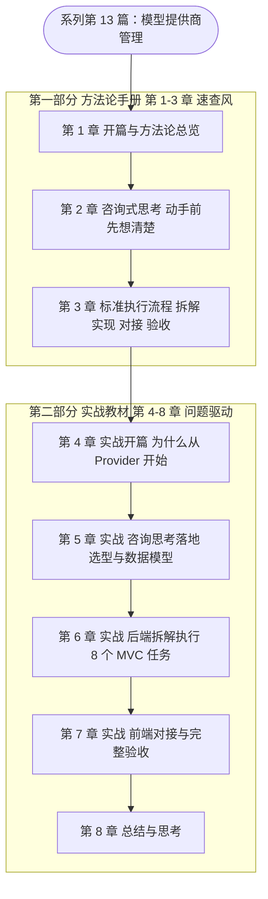
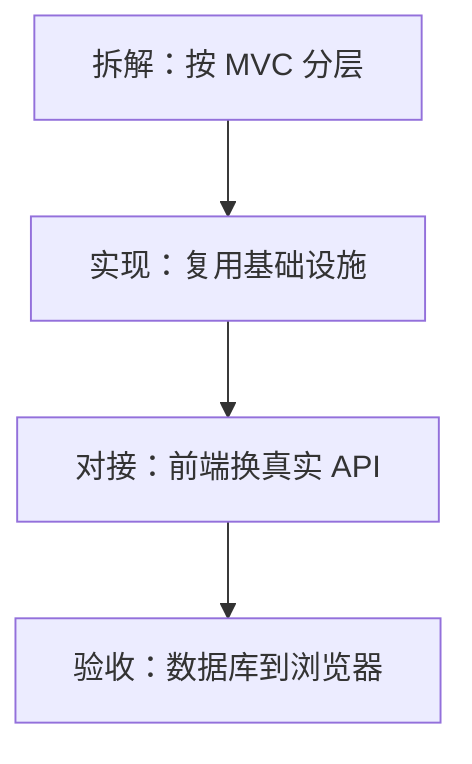
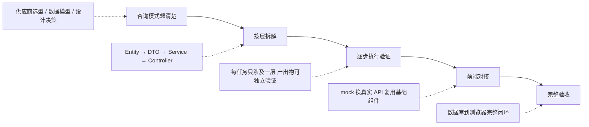

<!--
aicent-13-fea-model-provider-mgr
AI编程方法 13：核心功能 - 模型管理
-->

## 1. 开篇与方法论总览：进入核心功能开发


本篇是系列第 13 篇，也是核心功能开发的起点。前 12 篇做的是"准备"——认知框架（系列第 1–4 篇）、产品定义、架构设计、工程骨架、基础组件（系列第 10 篇的 BaseEntity/PageHelper/Spring Cache/LlmHttpClient）、前端 UI（系列第 11 篇的 HifyTable/HifyFormDialog/useConfirm/useRequest）。准备阶段已经足够扎实，从本篇起正式进入核心功能开发，第一个模块是**模型提供商管理（Provider）**，后续的 Agent、对话引擎、MCP 接入都会复用本篇沉淀下来的标准交付流程。

### 1.1 结论先行：标准交付流程一句话全貌

一个 AI 编程业务模块的完整交付，可以用一句话讲清：

> **咨询式思考想清楚要做什么 → 按 MVC 分层拆解任务并从底层往上搭 → 前端复用基础组件对接 → 数据库到浏览器的完整验收闭环。**

这句话拆开是四个阶段，每个阶段都有方法论支撑：

#### (1) 四个阶段拆解

##### ① 想清楚（咨询式思考）

动手写代码之前，先用咨询模式向 AI 做需求/选型/架构分析。把模块涉及的领域知识、供应商选型、数据模型设计等不确定问题全部澄清，输出可执行的设计决策。这是系列第 10 篇"咨询模式"在新模块上的落地。

##### ② 拆解（按 MVC 分层）

把后端拆成 Entity+Mapper、DTO、Service、Controller 等任务，每个任务只涉及一层，产出物可独立验证，从底层往上层依次搭建。这是系列第 8 篇任务拆解方法论的直接复用。

##### ③ 对接（复用基础组件）

前端把 mock 数据换成真实 API，依赖系列第 11 篇封装的 HifyTable/HifyFormDialog/useConfirm/useRequest 等基础组件，业务页面只关心"调哪个 API、显示哪些字段"。

##### ④ 验收（完整闭环）

启动前后端，在浏览器走一遍真实操作，验证一条数据从数据库流转到浏览器的完整链路。这是唯一的"交付完成"判据，curl 跑通不算。

### 1.2 全文导读地图

本篇按"方法论手册 + 实战教材"两部分组织，共 8 章。第一部分（第 1–3 章）提炼方法论，不绑定具体技术栈，可独立速查；第二部分（第 4–8 章）结合 Hify 项目、Spring Boot + MyBatis-Plus + Vue 技术栈、Provider 模块复现实战过程，解释每个方法论的 why。



每章定位与读法：

#### (2) 各章定位与读法

##### ① 第 1 章 全文导读与方法论总览（本章）

开篇定位、标准交付流程全貌、全文导读地图、可裁剪的业务模块交付 Check List。读完本章即可对本篇建立全局认知。

##### ② 第 2 章 咨询式思考：动手前先想清楚

抽象提炼咨询模式方法论：为什么做新模块要先咨询而不是先写代码；咨询式提问的维度框架（按接口兼容性/认证方式/消息格式等维度分类提问）；判断决策的追问技巧（"不是有轮子就要用""一对一关系建表有什么收益"）。给出提问框架表与速查 Check List。

##### ③ 第 3 章 标准执行流程：拆解、实现、对接、验收

抽象提炼"按 MVC 分层拆任务，每个任务只涉及一层，从底层往上层搭；前端对接复用基础组件；完整验收闭环"的方法论。给出拆解维度表、基础设施复用清单、验收 Check List。

##### ④ 第 4 章 实战开篇——为什么从 Provider 开始

实战部分开篇。讲 Provider 模块定位（Hify 平台地基）、为什么从这里讲起（地基依赖 + 复杂度适中：CRUD、外部调用、鉴权、健康检查四类问题齐全）、它如何成为后续模块的标准模板。

##### ⑤ 第 5 章 实战·咨询思考落地——供应商选型与数据模型设计

把第 2 章方法论落到 Provider 三个具体问题：支持哪些供应商（三维度分类、一期四类型、Gemini 放二期、"OpenAI 兼容"阵营洞察）；有没有现成库（Spring AI/LangChain4j 分析、一期不引入自己封装的判断）；数据模型设计（auth_config JSON 存储、model name vs model_id、健康状态独立成表避免锁竞争、三张表 SQL 与 ER 关系）。

##### ⑥ 第 6 章 实战·后端拆解执行

复现 8 个 MVC 任务（Entity+Mapper、Service CRUD、连通性测试、健康检查定时任务、Controller），每个任务给出提示词示例 + 实现要点 + 复用点（BaseEntity/PageHelper/Spring Cache/LlmHttpClient）。连通性测试用 if-else 先跑通，留待系列第 14 篇用设计模式重构。保留 curl 联调命令与联调报错处理。

##### ⑦ 第 7 章 实战·前端对接与完整验收

前端 mock 换真实 API（7 个改动点提示词、说明前端改动小的原因 = 基础组件封装回报）；完整验收 9 步清单；强调"数据库到浏览器完整闭环"与半天交付速度。

##### ⑧ 第 8 章 总结与思考

双段对照回顾——"想清楚"的价值（五个设计决策）+ "执行"的回报（五个基础设施复用）；标准交付流程总结；保留 3 个思考（缓存一致性、DOWN 时正在进行的对话、API Key 加密）；结尾承接系列第 14 篇（设计模式重构 if-else）。

### 1.3 业务模块交付 Check List（可裁剪速查）

下面这份 Check List 提炼自标准交付流程，供项目每个新模块阶段快速查阅。按四个阶段组织，条目精炼、可裁剪：做简单模块时跳过不适用的条目，做复杂模块时补全团队规范条目。

#### (3) 四阶段 Check List

##### ① 阶段一：想清楚（咨询式思考）

- [ ] 列出模块要解决的业务问题，明确边界（做什么、不做什么）
- [ ] 用咨询模式向 AI 提问：领域现状、主流方案、共性与差异
- [ ] 提问按维度分类（如接口兼容性 / 认证方式 / 消息格式），不要笼统问
- [ ] 对每个候选方案做判断：是否引入第三方库？性价比如何？是否匹配当前场景？
- [ ] 设计数据模型：字段是否统一存储？是否需要独立表避免高频写锁竞争？
- [ ] 追问每个模糊决策（"一对一关系建表有什么收益"），不放过架构师层面的细节
- [ ] 输出可执行的设计决策清单（一期做什么、二期做什么、明确放弃什么）

##### ② 阶段二：拆解（按 MVC 分层）

- [ ] 按分层拆任务：Entity + Mapper → DTO → Service → Controller（每任务只涉及一层）
- [ ] 每个任务的产出物可独立验证（Entity 能映射、Service 能跑通、Controller 能 curl）
- [ ] 从底层往上层搭建（先 Entity 再 Service，不跳跃）
- [ ] 复用基础设施：BaseEntity、PageHelper、Spring Cache、入参校验、统一返回 Result
- [ ] 缓存策略明确：哪些表加 @Cacheable、哪些表直接读库（高频写表不缓存）
- [ ] 外部调用统一走封装好的 HTTP Client（如 LlmHttpClient），不裸调
- [ ] 定时任务用线程池异步执行，不阻塞主线程

##### ③ 阶段三：对接（前端复用基础组件）

- [ ] 在 API 文件中创建对应方法（list/create/update/delete/自定义动作）
- [ ] 表格组件的 api prop 从 mock 函数换成真实 API 函数
- [ ] 表单弹窗的 submit 事件从 mock 换成 create/update API
- [ ] 删除按钮的确认逻辑从 mock 换成 delete API
- [ ] 业务页面只关心"调哪个 API、显示哪些字段"，不重复写交互逻辑
- [ ] 新增业务专属列（如状态 Tag、关联数据展开），复用基础组件的渲染能力

##### ④ 阶段四：验收（完整闭环）

- [ ] 启动前后端，在浏览器走一遍真实操作（不是 curl 跑通就算完成）
- [ ] 验证一条数据从数据库流转到浏览器的完整链路（增、查、改、删）
- [ ] 验证关联数据（如供应商下的模型列表、健康状态）正确展示
- [ ] 验证外部依赖（如连通性测试、定时健康检查）真实生效
- [ ] 验证异常路径（API Key 无效、供应商 DOWN）的提示与状态更新
- [ ] 验证基础设施行为：缓存命中、定时任务 last_check_at 更新、分页/筛选
- [ ] 记录交付速度（想清楚 / 后端 / 前端各耗时），沉淀本模块的基础设施复用回报

这份 Check List 不是教条，而是"最小可交付"的提醒清单。把它贴在每个模块的任务列表上方，对照执行即可避免最常见的遗漏：想不清楚就写代码、任务跨多层耦合、前端重复造轮子、用 curl 替代真实验收。

## 2. 咨询式思考：动手前先想清楚


**本章目标**：把"动手前先咨询 AI"这件事从一句口号，变成一套可复用的提问与追问方法论。读完本章，读者面对任意陌生业务模块，都能用结构化提问快速建立认知，并在 AI 的建议面前做出有依据的判断决策，而不是被动接受。

### 2.1 为什么不能上来就写代码

#### (1) 最常见的反模式：把"开始写代码"当成开始

接到一个新业务模块，最常见的动作是立刻打开 Claude Code，告诉它"帮我写一个 XX 模块"。这恰恰是 AI 编程中最容易翻车的反模式。原因不是 AI 写不出来，而是**提问者自己都没想清楚要考虑哪些东西**。

##### ① "没想清楚"会被代码放大成"代码遗漏"

一个业务模块牵涉的范围，远比"实现增删改查"要多：要兼容哪些外部形态？认证方式有几种差异？数据怎么存？哪些字段会被后续模块复用？高频写和低频读的表是否要分离？这些问题如果在写代码前没有结论，AI 只能按它对"标准模板"的理解往下写，最终交付的代码一定在某些维度上有遗漏——而这些遗漏往往要到联调甚至上线后才暴露，返工成本极高。

##### ② 咨询模式：把"未知领域"变成"已知输入"

咨询模式的核心动作是：**动手前先把不确定的部分问出来，让 AI 帮自己做一次需求/选型/架构的盘点**。这不是因为提问者不懂技术，而是因为任何新业务模块都会牵涉一些提问者不熟悉的领域知识（业界有多少供应商、各家的接口差异、有没有现成的轮子）。先用提问把这部分知识补齐，再让 AI 写代码，AI 拿到的就是一份"输入完整、约束明确"的需求，输出质量自然高一个台阶。

##### ③ 咨询模式的真实回报：认知积累

咨询模式有一个常被低估的副产品——**提问者本人也在借这次提问学习一个新领域**。一次有结构的咨询下来，提问者从"对领域一无所知"变成"知道这个领域有哪些主流玩家、它们的关键差异在哪、未来扩展时要考虑什么"。这种认知积累是后续做架构决策、做技术选型、指导团队的基础。所以咨询模式不仅是"为了写好这一段代码"，更是"为了把这块领域知识内化到自己脑子里"。

#### (2) 咨询模式在标准交付流程中的位置

咨询模式不是可有可无的前置步骤，而是整个交付流程的第一环。它的产出物——一份带着判断结论的设计决策清单——直接决定了后面"按层拆解、逐步实现、前端对接、完整验收"这四步能不能跑得顺。

```
咨询模式想清楚（选型 / 数据模型 / 设计决策）
    ↓
按层拆解任务（Entity → DTO → Service → Controller）
    ↓
逐步实现验证
    ↓
前端对接
    ↓
完整验收
```

第一环没做好，后面四环每一步都会被前面的遗漏拖累。这也是为什么本系列把"咨询式思考"单独列为一章方法论的缘故。

### 2.2 咨询式提问的维度框架

咨询不是漫无边际地聊天，而是**用维度把零散信息结构化**。本节给出从实战中提炼出来的提问方法论，可以直接套用到任意陌生业务模块。

#### (1) 核心动作：按维度分类把零散信息结构化

##### ① 为什么"按维度分类"比"列清单"更有价值

面对一个陌生领域，最朴素的提问是"帮我列出业界有哪些 XX"。这种问题 AI 也能答，但答案的信息密度很低——一长串名单，看完之后提问者依然不知道该怎么设计架构。

真正高信息密度的提问，是让 AI **把零散的对象按几个有判别力的维度做分类**。一旦按维度分类，原本散乱的信息立刻呈现出结构性规律：哪些可以归到同一阵营、哪些必须独立处理、哪些差异会影响存储设计、哪些差异会影响适配层。这些结构性规律，正是后续架构决策的直接依据。

##### ② 三个维度的示范（以"LLM 供应商分析"为例）

原文在分析 LLM 供应商时，示范了一次教科书级的维度化提问。它没有停留在"有哪些供应商"这一层，而是按三个维度做了交叉分类：

| 提问维度 | 分类依据 | 直接影响的架构决策 |
|---|---|---|
| 接口兼容性 | 不同供应商的 API 格式是否一致 | 能否复用同一套适配代码、是否要为某一类单独适配 |
| 认证方式 | 鉴权信息放在 Header / URL / Body / 不需要 | 鉴权字段如何统一存储、要不要为每种类型定独立结构 |
| 消息格式 | 请求体/响应体的字段差异 | 适配层怎么设计、消息转换逻辑放在哪一层 |

注意这张表的右列——**每一个维度的分类结果，都直接对应一个架构决策**。这才是维度化提问的真正价值：它不是为了让答案更好看，而是为了让答案能被翻译成设计依据。

##### ③ 维度化提问的可复用模板

把上面的示范抽象成模板，面对任意陌生业务模块，咨询式提问都可以走这三步：

```
第 1 步：先问"业界有哪些主流玩家"（广度盘点）
第 2 步：追问"它们按哪些维度可以做分类"（找判别力强的维度）
第 3 步：再追问"每个维度的差异，会影响后续哪些设计决策"（翻译成依据）
```

三步走下来，提问者对陌生领域的认知从"知道有谁"升级到"知道为什么这样设计"。这种提问方式，是 AI 编程时代每个工程师都该刻意练习的基本功。

#### (2) 让 AI 给出"带依据"的答案

##### ① 提问时显式要求"理由"

维度化提问的下一步，是让 AI 不仅给分类，还要给"为什么这样分"的理由。一个实用的提问补充语是：

```
请按 N 个维度对 XX 做分类，并说明每个维度下，不同分类会直接影响哪些后续设计决策。
```

加这一句，AI 的答案会从"名词罗列"变成"因果链"。例如它会主动指出"这一类只需要改配置就能接入、不需要写代码"——而这类洞察往往就是后续最聪明的架构决策的源头。

##### ② 区分"信息"与"洞察"

咨询过程中要刻意区分两类产出：

- **信息**：供应商有哪些、认证方式有几种、字段叫什么名字
- **洞察**：某个分类是一个"巨大的兼容阵营"、某个差异决定了存储方案、某个字段未来会被另一个模块复用

信息可以查文档补，洞察只能通过提问激发。咨询模式真正在挖的，是后者。

### 2.3 判断决策的追问技巧

咨询模式不等于"AI 说什么就照做"。AI 给出建议后，提问者还要做一轮判断与追问，把"AI 的建议"变成"自己的决策"。这一节给出两种最高频、也最有价值的追问技巧。

#### (1) 追问技巧一：不是有轮子就一定要用

##### ① 现成库 / 框架要不要引入，要看匹配度

AI 在分析时几乎一定会提到"业界有没有现成的轮子"——这是它的强项。但"有轮子"和"该用这个轮子"是两回事。引入一个大型框架，要看它和当前场景的匹配度，而不是看它名声有多大。

匹配度的判断可以从三个角度切入：

| 判断角度 | 具体问题 |
|---|---|
| 功能覆盖面 | 框架提供的功能，当前用得到多少？引入它只为用一小块是否划算 |
| 概念负担 | 框架自带的概念体系有多重？团队学习成本和代码复杂度是否上升 |
| 迭代稳定性 | 框架 API 是否还在快速变动？升级会不会反过来绑架业务代码 |

##### ② 一个典型判断：自己封装 vs 引入大框架

原文示范了一次完整的判断过程：面对一个"封装了多家供应商调用"的成熟框架，最终选择**不引入，而是基于已有能力自己封装**。判断依据是：

- 大部分目标对象已经兼容同一套接口格式，自己封装的工作量并不大
- 引入大型框架只为用到其中一小块，性价比不高
- 框架自带的概念负担和未来升级成本，超过自己封装的维护成本

这个判断过程本身比结论更值得学习。它示范的是一种思维方式：**看到轮子先别急着用，先算一笔"引入成本 vs 自己造的成本"的账**。这笔账算清了，决策自然就出来了。（具体技术细节留到第二部分实战章节展开。）

##### ③ 追问话术

当 AI 推荐"有一个现成的库可以做这件事"时，标准追问话术是：

```
这个库的成熟度、功能覆盖面、概念负担、API 稳定性如何？
当前场景如果不用它、基于已有能力自己实现，工作量大概多少？
两相比较，引入它的性价比是否成立？
```

三连问下来，AI 自己就会把"是否真的该用"分析清楚，而不是停留在"有这个库你可以试试"。

#### (2) 追问技巧二：细节层面的"收益追问"

##### ① 什么是收益追问

第二种追问更细节，也更体现架构师价值。当 AI 给出一个"看起来更规范"的设计建议时，追问一句"这样做有什么具体收益"。如果 AI 答不上来或者收益很虚，这个"规范"很可能就是过度设计。

##### ② 典型场景：一对一关系是否值得独立建表

原文示范了一个经典案例：AI 一开始建议为某个属性单独建一张表，而这张表和主表是一对一关系。这时追问一句——

```
这种一对一关系单独建表，相比直接放在主表里，有什么具体收益？
```

AI 在追问下承认没有实际收益，于是设计回归到"用一个灵活字段存储"的方案。这次追问直接避免了一次不必要的表拆分，也避免了未来跨表查询带来的复杂度。

##### ③ 收益追问的判断标准

收益追问的关键，是把"看起来规范"翻译成"可验证的收益"。可以套用以下三个判断标准：

- **性能收益**：拆分后读写性能是否真的更好？有没有可量化的指标？
- **扩展收益**：未来加新类型时，这种设计是否真的"零改"？
- **语义收益**：字段含义是否更清晰？还是会反而引入冗余？

三个标准都答不上来的"规范设计"，基本可以判定为过度设计，应当果断简化。

#### (3) 追问技巧三：对"AI 没想到的好设计"也要追问依据

##### ① 不只质疑，也要吸收

追问不等于挑刺。有时候 AI 会给出提问者没想到的好设计，这时同样要追问依据——不是为了质疑，而是为了**把这份设计智慧内化成自己的判断力**。

##### ② 追问方式

遇到 AI 提出的"出乎意料但听起来合理"的设计，标准追问是：

```
为什么这样设计？解决了什么具体问题？如果不这样做会有什么后果？
```

把这条因果链问清楚，下次自己设计时就能主动想到。原文就示范了这样一个案例：AI 提出把某个高频更新的状态独立成表，追问之后才明白这是为了避免高频写和业务读争抢锁——这个"读写分离到不同表"的模式，一旦问清楚就变成了自己工具箱里的一件常备武器。

### 2.4 咨询式提问框架表与本章 Check List

#### (1) 咨询式提问框架表

把本章方法论浓缩成一张速查表，做新业务模块时可以直接对照执行：

| 阶段 | 关键动作 | 可复用提问模板 |
|---|---|---|
| 广度盘点 | 先问业界有哪些玩家、有哪些可选方案 | "XX 领域有哪些主流方案？各自的共性和差异是什么？" |
| 维度分类 | 让 AI 按有判别力的维度做分类 | "请按 N 个维度对上述方案做分类，并说明每个维度的差异会直接影响哪些后续设计决策" |
| 轮子评估 | 对 AI 推荐的现成库做匹配度判断 | "这个库的成熟度、覆盖面、概念负担、API 稳定性如何？不用它自己实现工作量多少？性价比是否成立？" |
| 设计追问 | 对每一个设计建议追问具体收益 | "这样设计有什么具体收益（性能 / 扩展 / 语义）？不这样做会有什么后果？" |
| 决策固化 | 把所有结论沉淀成一份带依据的决策清单 | "汇总以上分析，列出本模块的最终设计决策及每条决策的依据" |

#### (2) 本章 Check List

做新业务模块前，对照以下清单逐项确认。任何一项没做完，都不要急着让 AI 写代码：

##### ① 认知层

- [ ] 已对目标领域做过一次广度盘点，知道主流玩家有哪些
- [ ] 已让 AI 按至少两个有判别力的维度做分类
- [ ] 每个维度的分类结果都已翻译成"会影响哪个后续设计决策"
- [ ] 已区分"信息"与"洞察"，并刻意记下了几条洞察

##### ② 选型层

- [ ] 对 AI 推荐的每一个现成库 / 框架，都做过"匹配度三连问"
- [ ] "自己实现 vs 引入框架"的账已经算清，并有明确结论

##### ③ 设计层

- [ ] 对每一个设计建议，都追问过"具体收益是什么"
- [ ] 没有留下"看起来规范但答不出收益"的过度设计
- [ ] 对 AI 提出的"出乎意料的好设计"，已问清因果链并内化
- [ ] 所有结论已汇总成一份带依据的设计决策清单

##### ④ 流程层

- [ ] 咨询模式的产出物（决策清单）已作为后续"按层拆解"的输入
- [ ] 还没有让 AI 写一行业务代码——这一步留给下一章的执行流程

清单全部打勾之后，再进入第 3 章的标准执行流程。咨询式思考的回报，会在后面"按层拆解、逐步实现"时一次性兑现：因为输入完整、约束明确，AI 写出来的代码几乎不用大改。

## 3. 标准执行流程：拆解、实现、对接、验收


系列第 2 篇解决了"动手前先想清楚"的问题。想清楚之后，就进入"怎么做"——这就是本篇要交付的内容：一套可复用的标准执行流程，把"咨询阶段产出的设计决策"一步步变成"用户在浏览器里能点开的完整功能"。

本篇是方法论速查手册，不绑定任何具体业务模块。读者做新模块时，按本篇四阶段对照即可。具体的 Provider 实战任务（提示词、SQL、curl、组件细节）留给系列第 6、7 篇展开。

### 3.1 本阶段目标与全流程

标准执行流程的最终目标只有一句话：**让一条数据从数据库一路流转到浏览器，并被完整验收**。任何环节缺位都不算交付——只跑通后端 curl 不算、前端能用但没验收边界场景不算。

整条流程分四个递进阶段：



四个阶段背后有一条贯穿始终的工程假设：**前期已经把基础设施搭好了**（公共字段基类、分页工具、缓存注解、HTTP 客户端、前端基础组件等）。这是本流程能够"半天交付一个模块"的前提，也是为什么每个阶段都能保持高速度的根本原因。如果基础设施尚未沉淀，应当先补齐基础设施，再套用本流程。

### 3.2 拆解阶段：按 MVC 分层，从底层往上搭

#### (1) 拆解的核心原则

把一个业务模块拆成若干个可独立交付的任务，必须同时满足三条硬性原则：

##### ① 一个任务只涉及一层

每个任务严格落在 MVC 的某一层（Entity/Mapper、DTO、Service、Controller）。不允许出现"一个任务同时写 Entity 和 Controller"这种跨层任务。跨层任务会让 Claude Code 的输出难以 review，也难以独立验证。

##### ② 产出物可独立验证

每个任务完成后，必须能用一种明确的方式验证它有没有做好。验证手段包括：编译通过、单元测试、curl 调通、日志输出符合预期。无法独立验证的任务要继续往下拆。

##### ③ 从底层往上层搭

任务执行顺序遵循依赖方向：先 Entity/Mapper（数据模型层）→ 再 DTO（传输层）→ 再 Service（业务层）→ 最后 Controller（接口层）。底层是上层的依赖，底层没搭好就写上层，等于在沙地上盖楼。

#### (2) 任务拆解维度表

下表给出标准 MVC 分层拆解的维度参考。做新模块时，按表逐层对照，确认每层都有明确的任务边界：

| 层次 | 任务边界 | 典型产出 | 可独立验证手段 | 复用基础设施 |
|---|---|---|---|---|
| Entity / Mapper | 表结构映射、JSON 字段处理 | 实体类、Mapper 接口 | 编译通过、字段类型对齐表结构 | 公共字段基类、JSON TypeHandler |
| DTO | 入参/出参对象、字段校验注解 | 请求 DTO、响应 DTO | 校验注解触发符合预期 | 入参校验框架、统一返回包装 |
| Service | 业务规则、缓存、外部调用、定时任务 | Service 实现类 | 单元测试、缓存命中日志、定时任务触发 | 缓存注解、HTTP 客户端、线程池 |
| Controller | 接口编排、参数校验、调用 Service | REST 接口 | curl 调通、统一返回结构 | 分页工具、统一返回类 |

> 表中"复用基础设施"一栏只列类别，具体类名见 3.3 节复用清单。

#### (3) 拆解阶段的执行要点

##### ① 拆完先估时，再动手

拆完任务清单后先做时间预估。一个有基础设施支撑的模块，后端分层任务通常两三个小时可全部交付。如果估时远超这个量级，要么是基础设施缺位，要么是拆解粒度过粗——两种情况都要回头处理，而不是硬写。

##### ② 任务可以合并或跳号，但要记录原因

实际拆解时，部分层次的任务可以合并（例如 DTO 与 Service 一起写），也可能出现任务编号跳号。这是正常的，但必须在任务清单中注明合并/省略的原因，避免后续读者误以为是遗漏。

### 3.3 实现阶段：基础设施搭好后，每个任务只剩业务逻辑

#### (1) 基础设施复用清单

拆解阶段的"复用基础设施"一栏之所以能让任务提速，是因为前期已经沉淀了若干类别的基础设施。下表是清单参考，做新模块前先逐项确认这些类别是否就位：

| 基础设施类别 | 解决的问题 | 典型代表（仅作举例） |
|---|---|---|
| 公共字段 | id、创建时间、更新时间等字段重复定义 | BaseEntity |
| 分页工具 | 每个列表接口重复写分页逻辑 | PageHelper |
| 缓存注解 | 手写 if-else 查缓存、清缓存 | Spring Cache（@Cacheable / @CacheEvict） |
| 入参校验 | 重复写非空、长度、格式校验 | Bean Validation（@Valid） |
| HTTP 客户端 | 调外部 API 时重复处理超时、序列化、异常 | LlmHttpClient |
| 统一返回 | 每个接口自己拼响应结构 | Result 包装类 |

> 清单只列类别与典型代表，不展开具体类名细节——保持手册的抽象度。具体类名是否在当前项目存在，需对照项目自身的基础设施文档。

#### (2) 实现阶段的复用回报

基础设施就位后，每个分层任务的代码量会显著下降：

##### ① Entity 层只需对齐字段

继承公共字段基类后，Entity 只写业务字段，公共字段（id、时间戳等）由基类提供。review 重点只剩字段类型与表结构是否一致、包路径是否正确。

##### ② Service 层业务规则与基础设施分离

缓存只需加注解，不需要手写查缓存逻辑；外部调用只需调 HTTP 客户端，不需要处理超时和序列化；定时任务只需加调度注解和线程池配置。Service 类里几乎只剩纯业务规则。

##### ③ Controller 层几乎零业务

Controller 只做三件事：参数校验、调 Service、包装返回。分页交给分页工具，返回结构交给统一返回类。只要前面层次搭好，Controller 是最薄的一层。

#### (3) 实现阶段的两条纪律

##### ① 先跑通，再优化

遇到复杂分支逻辑（例如不同子类型走不同处理路径），第一遍允许用 if-else 先跑通。跑通之后再回头用设计模式重构。不要在第一遍实现时就追求完美结构——那会让任务迟迟无法进入验收阶段。

##### ② 联调报错交给 AI 修复，但必须能复现

实现完成后用 curl 或类似工具快速过一遍核心接口。联调过程中出现的报错（字段不匹配、序列化异常、参数缺失等），交给 Claude Code 修复，但前提是报错必须可复现、有明确日志。无法复现的问题不要盲目让 AI 改。

### 3.4 对接阶段：基础组件封装后，业务页面只关心两件事

#### (1) 前端对接的前提

前端对接阶段的前提是：交互完整但数据 mock 的页面已经存在。也就是说，分页、loading、空状态、确认弹窗、表单弹窗、loading/error 三态等交互逻辑，都已经在前期由前端基础组件封装好了。

如果交互骨架尚未搭好，应当先做基础组件封装，而不是直接对接 API。

#### (2) 业务页面只需关心两件事

基础组件封装到位后，业务页面在对接阶段只剩两件事要做：

##### ① 调哪个 API

把页面上每个交互（列表加载、新增、编辑、删除、自定义操作）绑定到对应的后端接口。这通常只是一个 API 文件加几个函数，再把组件的数据源从 mock 函数换成 API 函数。

##### ② 显示哪些字段

把后端返回的字段映射到表格列、表单项、状态标签上。涉及状态展示的（如健康状态、启用/禁用），用颜色标签区分。

除了这两件事，其余交互逻辑都不需要业务页面重复处理。下表是典型的复用回报对照：

| 交互场景 | 不用业务页面处理的原因 |
|---|---|
| 分页 | 列表组件已封装分页参数与请求触发 |
| 加载中 loading | 列表组件 + 请求 hook 已处理 |
| 空列表状态 | 列表组件已处理 |
| 删除二次确认 | 确认弹窗 hook 已封装 |
| 表单提交 loading / error 三态 | 请求 hook 已处理 |
| 成功/失败提示 | 提示组件已统一 |

#### (3) 对接阶段的执行要点

##### ① 一条指令可以覆盖多个改动点

如果改动点都是"把 mock 换成真实 API"这一类同质化改动，可以在一条指令里枚举全部改动点（例如新建 API 文件、换数据源、加操作列、加状态列、加模型数列）。Claude Code 生成后业务页面改动量通常很小。

##### ② 组件结构不动，只换数据源

只要基础组件抽象到位，业务页面的组件结构在对接阶段几乎不变。如果对接时发现要大改组件结构，说明基础组件的抽象不到位——这是回头补基础组件的信号，而不是在业务页面里临时打补丁。

### 3.5 验收阶段：从数据库到浏览器的完整闭环

#### (1) 验收的核心标准

验收不是"接口能调通"，而是"一条数据从数据库流转到浏览器，全程可见、边界场景都覆盖"。这个标准高于"curl 能返回结果"，也高于"前端能看到列表"。

#### (2) 验收清单的两类覆盖

完整的验收清单必须覆盖两类场景：

##### ① 核心路径

核心路径指模块的主流程，必须端到端跑通。典型核心路径包括：空列表 → 新增 → 列表出现新记录 → 详情查看 → 编辑 → 删除。每一步都要在前端可见、后端可查。

##### ② 边界场景

边界场景指模块的特殊分支或外部依赖触发的场景。常见的边界场景类别如下表：

| 边界场景类别 | 验证目的 | 典型例子 |
|---|---|---|
| 外部依赖连通 | 模块调外部服务时的真实反馈 | 连通性测试、延迟显示、成功/失败提示 |
| 异步任务触发 | 后台定时任务是否按预期更新数据 | 定时任务自动刷新状态、时间戳更新 |
| 多类型覆盖 | 同一模块支持多种子类型时的兼容性 | 不同供应商类型、不同认证方式 |
| 关联数据展示 | 主记录与关联子记录的联合展示 | 详情含子列表、展开查看明细 |
| 常规 CRUD | 列表常规操作完整性 | 分页、编辑、删除 |

#### (3) 验收阶段的执行纪律

##### ① 边界场景必须显式列入清单

边界场景不能"想到哪验到哪"，必须事先列入清单逐项打钩。否则很容易出现"核心路径跑通了就交付，结果线上遇到外部依赖异常直接挂"的情况。

##### ② 验收要看数据库，不能只看浏览器

有些状态（如定时任务更新时间、健康状态字段）在前端不一定立刻可见，必须直接查数据库表确认。验收清单里要包含"查数据库某字段"这类后端侧验证项。

### 3.6 本章 Check List

下表是标准执行流程的速查 Check List，做新模块时按阶段对照打钩：

| 阶段 | 检查项 | 达成标准 |
|---|---|---|
| 拆解 | 任务按 MVC 分层 | 每个任务只落在一层，不跨层 |
| 拆解 | 任务可独立验证 | 每个任务有明确的验证手段 |
| 拆解 | 任务按依赖顺序排列 | 从 Entity 往 Controller 方向搭 |
| 拆解 | 任务清单注明合并/跳号原因 | 编号不连续时有说明 |
| 实现 | 基础设施类别已就位 | 公共字段、分页、缓存、校验、HTTP 客户端、统一返回六类齐备 |
| 实现 | 分层任务只写业务逻辑 | 不重复处理基础设施 |
| 实现 | 复杂分支先 if-else 跑通 | 不在第一遍追求完美结构 |
| 实现 | 联调报错可复现 | 报错有明确日志，再交 AI 修复 |
| 对接 | 交互骨架已存在 | 列表/表单/确认/三态均已由基础组件封装 |
| 对接 | 业务页面只换数据源 | 组件结构基本不变 |
| 对接 | 改动点集中在 API 与字段映射 | 不在业务页面重写交互逻辑 |
| 验收 | 核心路径端到端跑通 | 从空列表到删除全流程可见 |
| 验收 | 边界场景显式列入清单 | 外部依赖、异步任务、多类型、关联数据、CRUD 五类覆盖 |
| 验收 | 同时查数据库与浏览器 | 后端字段直接查表确认 |

## 4. 实战开篇：为什么从 Provider 开始


**本章定位**：第二部分（实战教材）的开篇。第一部分用三章把方法论讲透了，从本章起进入 Hify 项目实战，把方法论落到一个具体模块上。第一个被选中的模块是**模型提供商管理（Provider）**。本章不展开实现细节，只回答一个问题：**为什么核心功能开发要从 Provider 开始**。读完本章，读者会清楚 Provider 在 Hify 平台中的地基定位、它的复杂度为什么"刚好适合打头阵"，以及它将作为后续模块标准模板的全部理由。

### 4.1 结论先行：Provider 是实战部分的标准模板

本篇实战部分之所以选 Provider 作为第一个完整交付的模块，可以浓缩成三句结论：

> **Provider 是 Hify 平台的地基模块，所有上层能力都依赖它；它的复杂度刚好覆盖"一个完整业务模块该有的全部形态"，又不至于把读者淹没在业务细节里；它交付过程中沉淀下来的标准流程，会原样复用到后续的 Agent、对话引擎、MCP 接入等每一个模块。**

这三句结论背后是三层论证：地基依赖、复杂度适中、流程可复用。下面逐层展开。

### 4.2 地基定位：为什么 Provider 必须先做

#### (1) Hify 平台的"模型提供商管理"是什么

模型提供商管理（Provider）模块，解决的是"**平台该用哪些 LLM、怎么接进去、怎么知道它们还活着**"这件事。具体来说，它让用户完成四类操作：

##### ① 配置 LLM 提供商

用户可以在平台里登记 OpenAI、Claude、Gemini、Ollama 这类 LLM 提供商，填入各自的 baseUrl、API Key、鉴权方式等接入信息。一份配置就是一条"可调用的供应商记录"。

##### ② 管理 API Key 与鉴权信息

不同供应商的鉴权方式差异极大：OpenAI 用 Bearer Token、Anthropic 用 `x-api-key` 加 `anthropic-version` Header、Gemini 用 URL 参数、Ollama 完全无需认证。Provider 模块要统一存储和管理这些异构的鉴权信息。

##### ③ 查看每个供应商支持的模型

接入一家供应商后，平台需要拉取并展示这家供应商下有哪些模型可用（如 OpenAI 下的 `gpt-4o`、`gpt-3.5-turbo`），并允许用户选择启用其中哪些模型开放给上层使用。

##### ④ 监控供应商健康状态

供应商不是配置完就高枕无忧——API Key 可能失效、服务可能波动、网络可能中断。Provider 模块通过定时连通性探测，维护每家供应商的实时健康状态（UP / DOWN / DEGRADED / UNKNOWN），供上层调用时做路由决策。

#### (2) 为什么它是平台地基

Provider 之所以被放在核心功能开发的第一位，不是因为它简单，而是因为**没有它，后面的模块全都没法开工**。Hify 平台上层的几大核心能力，无一例外都建立在"平台已经接入了可用的 LLM"这一前提之上：

| 上层模块 | 对 Provider 的依赖 |
|---|---|
| Agent | Agent 在执行任务时需要选择调用哪个模型，选模型的范围就是 Provider 配置出来的供应商与模型清单 |
| 对话引擎 | 对话的每一轮回复都要实际发起一次 LLM 调用，调用走的就是 Provider 注册的 baseUrl 和鉴权信息 |
| MCP 接入 | MCP 工具触发的模型调用同样要落到 Provider 这一层 |
| 健康路由 | 当某家供应商 DOWN 时，上层需要切换到备用供应商，切换依据正是 Provider 维护的健康状态 |

这四条依赖关系决定了 Provider 是**整个平台依赖树的根节点**。先做 Provider，后续模块才有"模型可调"的现实基础；如果反着来先做 Agent 或对话引擎，每一步都会卡在"模型从哪来、怎么调"这个未解问题上。地基先于上层建筑，这是架构上的必然顺序。

### 4.3 复杂度论证：为什么 Provider 适合做"打头阵"的模块

地基模块不止 Provider 一个（用户管理、权限、配置中心也都算地基），为什么实战部分偏偏选它作为第一个完整演示的模块？答案在于它的**复杂度刚好卡在一个甜点区间**——既不会简单到学不到东西，也不会复杂到让读者迷失。

#### (1) 四类典型问题齐全，足够展示完整交付流程

一个有教学价值的"打头阵"模块，必须把一个完整业务模块会遇到的典型问题形态都覆盖到。Provider 恰好同时包含以下四类问题：

##### ① 标准 CRUD（增删改查）

供应商记录的创建、查询、更新、删除，是任何一个业务模块都绕不开的基础形态。Provider 的 CRUD 部分可以直接复用系列第 10 篇搭好的 `BaseEntity`、`PageHelper`、统一返回 `Result`、入参校验等基础设施，把"标准业务接口怎么写"这一层完整示范一遍。

##### ② 外部 API 调用

Provider 不仅要管自己的数据库表，还要去调外部 LLM 的 API——连通性测试要请求 OpenAI、Anthropic、Ollama 的真实接口拉模型列表。这一层示范的是"如何通过封装好的 `LlmHttpClient` 与外部服务打交道"，后续 Agent、对话引擎发起模型调用时，模式与此完全一致。

##### ③ 异构鉴权处理

如前所述，不同供应商的鉴权方式五花八门（Bearer Token、自定义 Header、URL 参数、无认证、JWT 自签名）。Provider 必须用一种统一存储又能区分处理的方案把这种异构性吸收掉。这一层示范的是"如何用 JSON 字段灵活存储异构结构"，这种模式在后续遇到任何"同一概念有多种形态"的场景时都能复用。

##### ④ 定时健康检查

健康状态不是配置时一次性确定的，而是要靠定时任务持续探测、动态更新。这一层示范的是"`@Scheduled` 定时任务 + 异步线程池 + 状态表读写分离"的组合打法，后续任何需要持续监控的场景都套这个模式。

#### (2) 复杂度又不至于淹没读者

Provider 虽然四类问题齐全，但每一类的深度都"刚刚好"：

- **CRUD 部分**：字段清晰、规则简单（名称不重复、按类型筛选），不像订单或权限模块那样牵涉复杂状态机和跨表事务
- **外部调用部分**：每个供应商只需一次 GET 请求拉模型列表，不像对话引擎要处理流式响应、上下文拼接、Token 计费
- **鉴权处理部分**：一期用 `if-else` 按 type 分发就能跑通（连通性测试的核心代码就是按 type 走不同分支），复杂的设计模式重构留到系列第 14 篇再做
- **健康检查部分**：一分钟一次的轮询 + 简单的连续失败计数，不涉及复杂的熔断算法和服务降级编排

这种"形态齐全但深度可控"的复杂度分布，让 Provider 成为最理想的"教学样本"——读者跟着做完一遍，能在一个模块里把标准交付流程的每一个环节都演练到，又不会因为某一处过于复杂而中断学习节奏。用一个对比来感受这种甜点位置：

```text
太简单：纯 CRUD 配置表（如系统参数管理）
        —— 只覆盖 CRUD，学不到外部调用 / 鉴权 / 健康检查
        ↓
刚刚好：Provider（CRUD + 外部调用 + 异构鉴权 + 定时检查）
        —— 四类问题齐全，每一类又不过深
        ↓
太复杂：对话引擎（流式响应 + 上下文管理 + 多模型路由 + Token 计费）
        —— 适合作为后续模块，不适合打头阵
```

### 4.4 模板价值：Provider 交付流程会被原样复用

Provider 被选为第一个实战模块，还有一层更长期的理由：**它交付过程中走通的标准流程，会成为后续每一个模块的执行模板**。

#### (1) 标准交付流程在 Provider 上完成首次"端到端验证"

第一部分三章讲的方法论（咨询式思考、按 MVC 分层拆解、复用基础组件对接、完整验收闭环），在此之前还只是抽象框架。Provider 是第一个把这些方法论**完整跑一遍**的模块——从咨询供应商选型，到拆成 8 个 MVC 任务，到前端 mock 换真实 API，到浏览器走 9 步验收。跑通一遍之后，这套流程就不再是纸上的方法论，而是一份被实战验证过的可执行 SOP。

#### (2) 后续模块的差异只在"业务复杂度"，不在"交付流程"

Provider 跑通之后，后面做 Agent、对话引擎、MCP 接入时，**交付流程本身不会再变**，每次变的只是业务复杂度：

| 模块 | 复用的标准流程 | 新增的业务复杂度 |
|---|---|---|
| Agent | 咨询 → 拆解 → 对接 → 验收 | Agent 的工具调用编排、多步推理 |
| 对话引擎 | 咨询 → 拆解 → 对接 → 验收 | 流式响应、上下文管理、多模型路由 |
| MCP 接入 | 咨询 → 拆解 → 对接 → 验收 | MCP 协议适配、工具注册与发现 |

这张表的意思是：把 Provider 这一模块的交付流程吃透，后续模块的"怎么交付"就不再是问题，团队只需要集中精力解决每个模块特有的"业务怎么设计"。这正是把 Provider 放在第一位的长期价值——**它不是在做一个模块，而是在沉淀一套模板**。

#### (3) 基础设施的回报在 Provider 上集中兑现

Provider 还是系列第 10、11 篇搭好的基础设施第一次"集中兑现回报"的模块。BaseEntity 省掉公共字段、PageHelper 省掉分页逻辑、Spring Cache 用一行 `@Cacheable` 搞定缓存、`LlmHttpClient` 直接调外部 API、HifyTable 和 HifyFormDialog 让前端对接只改数据源——这些基础设施的回报，都会在 Provider 的交付速度上一次性体现出来（一个完整模块从零到前后端跑通，半天完成）。这个速度一旦在 Provider 上验证，后续模块就有了稳定的交付节奏预期。

### 4.5 本篇实战部分的结构：四段式承接标准流程

讲清了"为什么是 Provider"，本篇第二部分（第 4–8 章）将严格按标准交付流程的四段式展开实战演示。Provider 模块从零到上线的过程，会被拆成下面四个章节，每一章对应流程的一个阶段：


#### (1) 四章对应的流程阶段

##### ① 第 5 章 咨询思考落地——供应商选型与数据模型设计

把第 2 章的咨询式方法论落到 Provider 的三个具体问题：支持哪些供应商（按三维度分类、一期四类型、Gemini 放二期、"OpenAI 兼容"阵营洞察）、有没有现成库（Spring AI / LangChain4j 分析、一期不引入自己封装的判断）、数据模型怎么设计（`auth_config` JSON 存储、模型 name vs model_id、健康状态独立成表避免锁竞争、三张表 SQL 与 ER 关系）。

##### ② 第 6 章 后端拆解执行——8 个 MVC 任务

把第 3 章的拆解方法论落到 Provider 的后端实现：按 Entity+Mapper → Service → 连通性测试 → 健康检查定时任务 → Controller 的顺序拆成 8 个任务，每个任务给出可直接使用的提示词、实现要点、基础设施复用点。连通性测试里的供应商差异先用 `if-else` 跑通，留到系列第 14 篇用设计模式重构。后端跑通后用 curl 联调验证。

##### ③ 第 7 章 前端对接与完整验收

把第 3 章的对接与验收方法论落到 Provider 的前端：用一条指令、7 个改动点把第 11 篇做好的 ProviderList 页面从 mock 换成真实 API，说明为什么前端改动这么小（基础组件封装的回报）；随后走完整的 9 步浏览器验收清单，验证一条数据从数据库流转到浏览器的完整闭环。

##### ④ 第 8 章 总结与思考

双段对照回顾"想清楚"的价值与"执行"的回报，给出可复用的标准交付流程总结，并保留3个思考（缓存一致性、DOWN 时正在进行的对话、API Key 加密），结尾承接系列第 14 篇。

这四章合在一起，就是把第 1–3 章方法论在 Provider 模块上完整复现一遍的实战记录。读者既能把它当作"跟着做一遍"的教材，也能把它当作后续做其他模块时的对照参考——因为流程是一样的，只是业务复杂度不同。

## 5. 实战·咨询思考落地：供应商选型与数据模型设计


**本章定位**：把第 2 章的咨询式方法论落到 Provider 模块实战。第 2 章给出了"按维度提问、在 AI 建议面前追问"的抽象框架，本章用三个真实问题把这个框架完整跑一遍，让读者看到方法论在实战中如何产出一份带着判断结论的设计决策清单。

本章按三个问题逐个展开，每个问题都遵循同一个因果链条：**遇到什么问题 → 怎么咨询 → 得到什么分析 → 为什么这样决策 → 带来什么回报**。三个问题的产出合在一起，就是 Provider 模块动手写代码前的全部输入。

### 5.1 支持哪些供应商

第一个问题看起来最朴素，其实信息密度最高。Provider 模块要接 LLM，第一件事当然是搞清楚业界有哪些 LLM 供应商。但直接列清单价值很低——真正有价值的是搞清楚这些供应商**按什么维度分类、分类之后哪些可以合并处理、哪些必须独立适配**。这正是第 2 章咨询式提问"按维度把零散信息结构化"的典型应用。

#### (1) 咨询过程：用一条提示词把领域知识结构化

面对"业界有多少 LLM 供应商"这种提问者多半答不全的问题，咨询式做法是让 Claude Code 做一次带维度的盘点。原始提示词如下：

```text
Hify 要支持 LLM 模型提供商管理。帮我分析：主流的 LLM 供应商有哪些？
它们的 API 有什么共性和差异？哪些是一期必须支持的？
```

Claude Code 给出的分析，价值最大的部分不是供应商列表本身，而是它按**三个维度**做的分类。这三个维度直接决定了 Provider 模块后面三个层次的架构决策。下面逐个维度展开。

#### (2) 维度一：按接口兼容性分类

第一个维度是接口兼容性——不同供应商的 API 格式是否一致。这一维度的分类结果如下图所示。


<!-- 路径：imgs/aicent-13-fea-model-provider-mgr/6a1f4601f6ad20ebd8380b0070b3e93e_MD5.jpg -->
<!-- 用途：按接口兼容性维度对主流 LLM 供应商做的分类图 -->
<!-- 内容：揭示"OpenAI 兼容"是一个巨大的阵营，DeepSeek、Moonshot、Azure OpenAI 等接口格式与 OpenAI 一致，只需改 baseUrl 和 API Key 即可接入 -->

这张图暴露出一个关键洞察：**"OpenAI 兼容"是一个巨大的阵营**。DeepSeek、Moonshot、Azure OpenAI 这些供应商，接口格式和 OpenAI 一模一样，只需要改 `baseUrl` 和 API Key 就能接入，不需要写一行适配代码。这个洞察直接决定了后面"OpenAI 兼容"这个供应商类型的诞生——它把一整批供应商用同一个类型吸收掉了。

#### (3) 维度二：按认证方式分类

第二个维度是认证方式——鉴权信息放在哪里。这个维度上的差异比接口格式还要碎，但每一类都对应一种清晰的存储形态：

| 认证方式 | 代表供应商 | 鉴权信息位置 |
|---|---|---|
| Bearer Token | OpenAI、DeepSeek | HTTP Header，`Authorization: Bearer xxx` |
| 自定义 Header | Anthropic | HTTP Header，`x-api-key` + `anthropic-version` |
| URL 参数 | Gemini | 请求 URL 上的 query 参数 |
| 无认证 | Ollama | 本地部署，完全不鉴权 |
| JWT 自签名 | 智谱 GLM | 按约定生成 JWT 放入 Header |

这个维度的差异直接影响了后面 `auth_config` 用 JSON 字段存储的决策——既然鉴权信息形态差异这么大，给每种方式定固定列显然行不通，必须按 type 存不同结构。

#### (4) 维度三：按消息格式分类

第三个维度是消息格式——请求体的结构差异。这个维度决定了后面适配层要怎么设计：

| 消息格式 | 代表供应商 | 格式特征 |
|---|---|---|
| OpenAI 格式 | OpenAI 及大多数兼容供应商 | `messages` 数组，`role` + `content` |
| Anthropic 格式 | Claude | 独立的 `system` 字段，与 `messages` 分离 |
| Gemini 格式 | Gemini | 完全不同的 `contents` + `parts` 结构 |

Gemini 在这一维度上的差异最大，几乎是一套独立的消息体系，适配成本明显高于其他供应商。这一观察直接影响了后面"一期是否支持 Gemini"的决策。

#### (5) 决策结果：一期支持四种类型

基于三个维度的分析，一期支持的供应商类型定为三种独立类型加一个通用兼容类型：


<!-- 路径：imgs/aicent-13-fea-model-provider-mgr/9c8dccdd67c7b0868aae447693812ca2_MD5.jpg -->
<!-- 用途：一期支持的四种供应商类型示意图 -->
<!-- 内容：OpenAI、Anthropic、Ollama 三种独立类型 + OpenAI 兼容一个通用类型，覆盖约 90% 使用场景 -->

具体的类型对照表如下：

| 类型 | 覆盖供应商 | 理由 |
|---|---|---|
| OpenAI | OpenAI | 行业标准 |
| Anthropic | Claude | 主流大模型，需独立适配 |
| Ollama | Ollama | 本地部署必备 |
| OpenAI 兼容 | DeepSeek、Moonshot、Azure 等 | 用户只需填 baseUrl 和 Key，无需写代码 |

这四个类型合起来覆盖约 **90% 的使用场景**。Gemini 因为消息格式差异最大、适配成本最高，放到二期再支持。

#### (6) 最聪明的设计：把"OpenAI 兼容"做成一个类型

四种类型里最聪明的设计是"OpenAI 兼容"这个类型。它的价值在于**把适配成本从"写代码"降到了"填配置"**。如果没有这个类型，每接入一家 OpenAI 兼容的供应商（DeepSeek、Moonshot、Azure……）都要写一套适配代码；有了这个类型之后，用户只要在新增供应商时把 type 选成"OpenAI 兼容"、填上 `baseUrl` 和 API Key，立刻就能用，平台侧零行代码改动。这种"用配置代替代码"的思路，是供应商管理这一层最划算的设计。

#### (7) 回报：咨询过程本身就是领域知识的积累

这个小节之所以值得写得这么详细，是因为它示范了咨询模式的真实回报。经过这一次提问，提问者从一个"答不全业界有多少 LLM 供应商"的状态，一下子建立起对业界主流供应商、它们接口形态、关键差异的完整认知。这就是第 2 章强调的——**"会问"本身就是一种学习能力，通过问来补齐一个自己不熟悉的领域**。

三个维度的分类结论，后面都会被直接复用：接口兼容性的分类决定了适配层如何设计、认证方式的分类决定了 `auth_config` 如何存储、消息格式的分类决定了一期支持范围。本篇先用 `if-else` 把连通性测试跑通，下一篇用设计模式重构那些 `if-else` 分支。

### 5.2 有没有现成的依赖库

第二个问题是选型层面的——Java 生态里有没有现成的轮子可以省掉自己封装的工作。这个问题同样用咨询模式回答，原始提示词如下：

```text
Java 生态里有没有封装了多 LLM 供应商调用的库？
Spring AI、LangChain4j 等，分析成熟度和优缺点。
```

#### (1) 候选库分析

Claude Code 给出的两个候选库，各有优缺点：

| 候选库 | 优点 | 不足 |
|---|---|---|
| Spring AI | 与本项目技术栈最匹配（Spring Boot 原生） | API 还在快速迭代，稳定性不足 |
| LangChain4j | 功能齐全 | 概念太重，引入后心智负担大 |

两个库的共同问题是——都不完全匹配本项目的场景。本项目只需要"调外部 LLM 的 HTTP 客户端"这一层能力，并不需要 LangChain 那套 Agent / Memory / Chain 的完整生态。

#### (2) 决策结果：一期不引入，基于 LlmHttpClient 自己封装

最终的决策是：**一期不引入这些框架，基于系列第 10 篇封装好的 `LlmHttpClient` 自己做**。判断依据有三条：

##### ① 工作量本身不大

因为前面接口兼容性分析已经发现，大部分供应商兼容 OpenAI 格式，自己封装的工作量并不大。OpenAI 兼容这一阵营用一个统一的处理路径就能覆盖，只有 Anthropic、Ollama 这少数几家需要单独适配。

##### ② 引入大框架的性价比不高

引入 Spring AI 或 LangChain4j 这种大框架，却只为用其中"模型调用"这一小部分功能，相当于为了借一把锤子把整个工具箱搬回家。框架自带的迭代风险、概念负担、版本耦合都会一并进来，得不偿失。

##### ③ 已有基础设施够用

系列第 10 篇已经封装好了 `LlmHttpClient`，它直接处理了超时、重试、响应解析这些底层细节，作为外部 API 调用的统一入口已经够用。在它之上再加一层针对不同供应商的连通性测试和模型调用分发，就是全部需要自己做的事。

#### (3) 回报：判断决策的方法论

这个决策过程本身值得单独拎出来强调，因为它示范了第 2 章的另一个追问技巧——**不是有轮子就一定要用，要看轮子和自己场景的匹配度**。在面对"业界已有成熟框架"时，常见的两种极端反应都不可取：一种是"既然有框架那就用它"，把决策外包给轮子的知名度；另一种是"什么都自己造轮子"，无视已有的基础设施。正确的做法是回到自己的场景：真正需要的能力是什么、候选库提供的范围有多大、引入它的耦合成本有多高。本项目这次回到场景之后，结论是"自己封装"更划算，但下一次面对不同的场景，结论可能完全相反——关键在于回到场景做判断这个动作本身。

### 5.3 数据模型设计

第三个问题是三个问题里最关键的——**数据怎么存，决定了接口怎么设计，也决定了前端怎么展示**。数据模型一旦定下来，后面所有层都要围着它转。所以这一步的设计决策，值得花最多的咨询时间。原始提示词如下：

```text
基于上面的分析，设计 Provider 模块的数据模型。需要考虑：
多种供应商鉴权方式的差异怎么统一存储；
一个供应商下有多个模型怎么管理；
供应商健康状态怎么表示。
```

Claude Code 围绕这三个子问题给出了完整方案。下面分别看每个子问题的设计决策与判断依据。

#### (1) 鉴权信息怎么存：用 auth_config JSON 字段

不同供应商的鉴权差异极大：OpenAI 用 API Key，Anthropic 额外需要 `anthropicVersion` Header，Azure 需要 `resourceName` 和 `apiVersion`，Ollama 完全不需要认证。给每种鉴权方式都定一列显然行不通——列数会爆炸，而且每加一种新供应商就要改一次表结构。

最终采用的方案是：**用 `auth_config` 这一个 JSON 字段，按 type 存不同结构**。具体的结构示例如下：

```text
// OPENAI / OPENAI_COMPATIBLE
{ "apiKey": "sk-xxx" }

// ANTHROPIC
{ "apiKey": "sk-ant-xxx", "anthropicVersion": "2023-06-01" }

// OLLAMA
{}
```

这种设计的好处是：**未来加新供应商零改表**。JSON 让每种 type 按自己的 schema 存，新增一种鉴权方式只是多一种 JSON 结构，表结构完全不动。

##### ① 一个值得单独讲的追问：一对一关系要不要建表

这个子问题上还有一个值得单独讲的细节。Claude Code 一开始给出的方案是单独建一张 `auth` 表来存鉴权信息。面对这个建议，正确的反应不是照单全收，而是追问：**"一对一关系建表有什么收益"**。Claude Code 在追问之下承认——没有实际收益。鉴权信息和 provider 是严格的一对一关系，单独建表既不会减少冗余（一对一本来就不冗余），也不会提升查询性能（多一次 join 反而更慢），更不会带来任何扩展性优势。既然没有收益，就合并到 `provider` 表里用 JSON 字段存。这种细节层面的追问，正是第 2 章强调的"架构师的价值"——不是 AI 给什么就接什么，而是每一处设计都要问出它的收益。

#### (2) 模型列表怎么管理：model_config 表的两个关键字段

一个供应商下会有多个模型（OpenAI 下就有 `gpt-4o`、`gpt-3.5-turbo` 等一堆），所以需要 `model_config` 表来管理。这张表上有两个特别容易混淆的字段，必须从一开始就设计清楚：

| 字段 | 含义 | 示例 |
|---|---|---|
| `name` | 展示名，给用户看的 | GPT-4o |
| `model_id` | 调用时实际传给 API 的值 | gpt-4o |

`name` 和 `model_id` 在 OpenAI 场景下看起来差不多，但在 Azure 场景下两者完全不一样——Azure 的 `model_id` 实际是 deployment name，和展示名没有任何关系。所以这两个字段必须分开存，不能合并。

除了这两个关键字段，`model_config` 表还加了两个有用的字段：

##### ① context_size 字段

`context_size` 存的是模型的上下文窗口大小（token 数）。这个字段现在看起来不起眼，但后面对话引擎做上下文管理（截断、压缩、滑窗）时要直接用到。提前存下来，对话引擎就不用每次再去查一次模型信息，避免一次额外的 IO。

##### ② enabled 字段

`enabled` 字段让用户选择启用哪些模型开放给 Agent。一个供应商下可能挂着几十个模型，但业务上只想用其中几个，这个字段就是开关。

#### (3) 健康状态为什么独立成表：避免高频写与业务读锁竞争

健康状态是这个数据模型里最容易被低估的设计。最朴素的方案是把健康状态作为 `provider` 表的一个字段（比如 `status` 列），但这会埋下一个严重的隐患。

##### ① 问题：高频写和业务读锁竞争

健康状态是一个**写极其频繁**的字段。定时探测每分钟更新一次状态，每次 LLM 调用也可能更新状态。如果这个字段放在 `provider` 表里，那么这些高频的写操作就会和业务侧对 `provider` 表的读操作竞争同一份行锁——读 `provider` 列表时可能被写阻塞，写健康状态时又可能被批量读阻塞。

##### ② 决策：拆出独立的 provider_health 表

解决方案是把健康状态拆出来，独立成 `provider_health` 表。拆开之后，读写路径彻底分离：

- `provider` 表变成**写少读多**，可以放心加 `@Cacheable` 缓存，业务读几乎不命中数据库
- `provider_health` 表**不缓存，直接读库**，高频写不会污染 `provider` 的缓存

这种"按读写特征拆表"的思路，是数据库设计里非常实用的一种模式，后续任何"主体信息低频写、附属状态高频写"的场景都可以套用。

##### ③ provider_health 的字段比 status 丰富得多

独立成表的另一个回报是——健康状态不再只能是一个单薄的 `status` 字段，而是可以承载一组真正有用的运维信息：

- **fail_count**：连续失败次数，配合熔断器使用，达到阈值自动熔断
- **latency_ms**：最近一次延迟（毫秒），用于性能监控和路由决策
- **last_success_at**：最后成功时间，用于判断供应商是否长时间不可用
- **error_message**：最近失败原因，方便排查

这些字段在管理控制台展示时非常有用，用户一眼就能看出哪家供应商慢、哪家在报错、报的什么错。

#### (4) 最终表结构：三张表的完整 SQL

三个子问题合在一起，Provider 模块的完整数据模型由三张表组成。完整的建表 SQL 如下，所有字段、注释、索引都按生产规范保留：

```sql
-- 模型提供商
CREATE TABLE provider (
    id BIGINT AUTO_INCREMENT PRIMARY KEY,
    name VARCHAR(100) NOT NULL COMMENT '供应商名称，唯一',
    type VARCHAR(30) NOT NULL COMMENT 'OPENAI/ANTHROPIC/OLLAMA/OPENAI_COMPATIBLE',
    base_url VARCHAR(500) NOT NULL COMMENT 'API 基础地址',
    auth_config JSON COMMENT '鉴权配置，结构按 type 不同',
    enabled TINYINT DEFAULT 1 COMMENT '0=禁用 1=启用',
    created_at DATETIME NOT NULL,
    updated_at DATETIME NOT NULL,
    deleted TINYINT DEFAULT 0
) COMMENT '模型提供商';

-- 模型配置
CREATE TABLE model_config (
    id BIGINT AUTO_INCREMENT PRIMARY KEY,
    provider_id BIGINT NOT NULL COMMENT '所属供应商 ID',
    name VARCHAR(100) NOT NULL COMMENT '展示名，如 GPT-4o',
    model_id VARCHAR(100) NOT NULL COMMENT '调用时传给 API 的值',
    context_size INT COMMENT '上下文窗口大小（token 数）',
    extra_params JSON COMMENT '模型级别扩展参数',
    enabled TINYINT DEFAULT 1 COMMENT '0=禁用 1=启用',
    created_at DATETIME NOT NULL,
    updated_at DATETIME NOT NULL,
    deleted TINYINT DEFAULT 0
) COMMENT '模型配置';

-- 供应商健康状态（独立表，高频写不影响 provider 缓存）
CREATE TABLE provider_health (
    id BIGINT AUTO_INCREMENT PRIMARY KEY,
    provider_id BIGINT NOT NULL COMMENT '供应商 ID，唯一索引',
    status VARCHAR(20) DEFAULT 'UNKNOWN' COMMENT 'UP/DOWN/DEGRADED/UNKNOWN',
    last_check_at DATETIME COMMENT '最后探测时间',
    last_success_at DATETIME COMMENT '最后成功时间',
    fail_count INT DEFAULT 0 COMMENT '连续失败次数',
    latency_ms INT COMMENT '最近一次延迟 ms',
    error_message VARCHAR(500) COMMENT '最近失败原因',
    updated_at DATETIME NOT NULL,
    UNIQUE INDEX idx_provider_health_provider_id (provider_id)
) COMMENT '供应商健康状态';
```

三张表里，`provider` 是主体表，`model_config` 与它是**一对多**关系（一个供应商下有多个模型），`provider_health` 与它是**一对一**关系（每家供应商一条健康记录，用 `UNIQUE INDEX` 约束）。

#### (5) 实体关系：一张图看清三张表的关联

三张表的实体关系用 ASCII 图表示如下：

```text
provider (1)
  ├── auth_config: JSON         鉴权，结构随 type 变化
  ├── model_config (N)          该供应商下的所有模型
  │     └── extra_params: JSON  模型级别扩展
  └── provider_health (1)       健康状态，高频更新独立
```

对应的实体关系图如下：


<!-- 路径：imgs/aicent-13-fea-model-provider-mgr/e08934012d9e5b6a9e180ebd83370658_MD5.jpg -->
<!-- 用途：Provider 模块三张表的 ER 实体关系图 -->
<!-- 内容：provider 为主体表，auth_config 为内嵌 JSON 字段，model_config 为一对多关联，provider_health 为一对一独立表 -->

这张关系图传达了三个关键设计：`auth_config` 作为 JSON 内嵌在 `provider` 里（不再单独建表）、`model_config` 与 `provider` 是一对多（用 `provider_id` 外键关联）、`provider_health` 虽然是严格一对一关系但独立成表（为了读写分离）。三个设计合在一起，构成了 Provider 模块数据模型的全部骨架。

### 5.4 三个问题的产出：一份带着判断的设计决策清单

三个问题问完，Provider 模块动手写代码前的所有输入就齐了。汇总成一份设计决策清单，作为本章的产出，也作为下一篇后端拆解执行的输入：

```text
供应商类型：一期支持 OpenAI / Anthropic / Ollama / OpenAI 兼容四种类型，
           覆盖约 90% 场景，Gemini 放二期
依赖库选型：一期不引入 Spring AI / LangChain4j，基于 LlmHttpClient 自己封装
鉴权存储：  auth_config 用 JSON 字段，按 type 存不同结构，未来加供应商零改表
模型管理：  model_config 表分 name（展示名）和 model_id（调用 ID），
           额外加 context_size 和 enabled 字段
健康状态：  独立成 provider_health 表，避免高频写与业务读锁竞争，
           provider 表加 @Cacheable 缓存，provider_health 表不缓存直接读库
表结构：    provider / model_config / provider_health 三张表，
           外键用 provider_id 关联
```

这份清单的每一个决策背后都有完整的分析过程和判断依据，不是拍脑袋定的。这正是第 2 章咨询式方法论在实战中的完整兑现——**动手前先想清楚，后面写代码才不会反复返工**。下一篇就拿着这份清单，按标准执行流程把 Provider 模块的后端一层一层搭起来。

## 6. 实战·后端拆解执行：8 个 MVC 任务两三个小时跑通

想清楚了，开始做。系列第 3 篇介绍的任务拆解方法论在这里直接复用——按 MVC 分层拆任务，每个任务只涉及一层，产出物可独立验证，从底层往上层搭。


> 图片注释：8 个任务 MVC 分层拆解图。横向按 Entity/Mapper → DTO → Service → Controller 分层，纵向按业务（Provider、ModelConfig、ProviderHealth）拆条，每个格子是一个独立任务，颜色深浅代表执行先后，注释中标明了每层产出的可验证产物（建表 SQL、Mapper 单测、Service 接口、Controller 接口）。

**8 个任务，两三个小时全部交付。** 这就是基础设施搭好之后的速度——系列前面几篇沉淀的 BaseEntity、PageHelper、Spring Cache、入参校验全部直接复用，每个任务只需要写业务逻辑，不需要重复处理基础设施。

### 6.1 任务清单与跳号说明


本篇按原文的任务编号复现，依次呈现任务 1、3、4、5、7 共 5 个核心任务。原文的编号是不连续的（缺 2、6），原因是：DTO、请求/响应对象、配置类等中间任务在原文复盘中被合并到 Service/Controller 任务里，没有单独列出。本篇如实保留这个跳号，以便读者与原文及后续源码目录对照。

每个任务按"提示词 → 实现要点 → 复用点"的统一结构展开。

### 6.2 任务 1：Entity + Mapper

#### (1) 提示词

```text
按照 CLAUDE.md 规范和上面的表结构，在 hify-provider 中创建 Provider、ModelConfig、ProviderHealth 的 Entity 和 Mapper。Entity 继承 BaseEntity（ProviderHealth 除外，它有自己的字段结构），Mapper 继承 BaseMapper。auth_config 和 extra_params 字段用 MyBatis-Plus 的 JSON TypeHandler。
```

#### (2) 实现要点

##### ① Entity 继承关系

Provider 和 ModelConfig 继承 BaseEntity，复用统一的 id、createTime、updateTime、deleted 等公共字段；ProviderHealth 例外，因为它有自己的字段结构（fail_count、latency_ms 等监控字段），不继承 BaseEntity。

##### ② Mapper 继承 BaseMapper

三个 Mapper 都继承 BaseMapper，单表 CRUD 不用写任何 SQL。

##### ③ JSON 字段映射

auth_config（鉴权配置）和 extra_params（扩展参数）两个字段用 MyBatis-Plus 的 JSON TypeHandler，自动在 Java 对象与数据库 JSON 字符串之间转换，不需要手写序列化代码。

#### (3) 复用点

| 复用基础设施 | 作用 |
|---|---|
| BaseEntity | 公共字段（id、时间戳、逻辑删除） |
| BaseMapper | 单表 CRUD 零 SQL |
| MyBatis-Plus JSON TypeHandler | JSON 字段映射 |

这个任务很简单，Claude Code 的输出基本不用改。review 重点：字段类型和表结构一致，包路径正确。

### 6.3 任务 3：Service — CRUD

#### (1) 提示词

```text
在 hify-provider 中实现 ProviderService。CRUD 基础逻辑：创建时校验名称不重复，列表支持按 type 和 enabled 筛选，详情接口返回关联的 modelConfig 列表和 providerHealth 信息。缓存：列表和详情加 `@Cacheable(cacheNames = "provider-cache")`，更新和删除加 `@CacheEvict`。
```

#### (2) 实现要点

##### ① 创建校验

创建时校验 provider 名称不重复，避免同名的供应商配置。

##### ② 列表筛选

列表支持按 type（供应商类型）和 enabled（启用状态）两个维度筛选，便于前端按类型分组展示或按启用状态过滤。

##### ③ 详情聚合

详情接口不止返回 Provider 自身字段，还要返回关联的 modelConfig 列表（该供应商下挂哪些模型）和 providerHealth 信息（当前健康状态、延迟、失败次数）。

##### ④ 缓存策略

列表和详情加 `@Cacheable(cacheNames = "provider-cache")`，更新和删除加 `@CacheEvict`。provider_health 表不走缓存，直接读库——因为健康状态每分钟都在变，缓存反而会读到过期数据。

#### (3) 复用点

| 复用基础设施 | 作用 |
|---|---|
| Spring Cache（@Cacheable / @CacheEvict） | 注解式缓存，不写 if-else 查缓存逻辑 |

注意缓存。前面几篇已经配好了 Spring Cache，这里直接加注解就行，不需要手写 if-else 查缓存逻辑。

### 6.4 任务 4：连通性测试


这个任务稍微复杂，因为不同供应商的 API 不一样。

#### (1) 提示词

```text
在 hify-provider 中实现连通性测试。根据 provider.type 分发到不同的测试方法：openai 和 openai_compatible 调 GET /v1/models（Bearer Token），anthropic 调 GET /v1/models（Header 带  x-api-key + anthropic-version），ollama 调 GET /api/tags（无认证）。统一返回 ConnectionTestResult（success、latencyMs、modelCount、errorMessage）。使用 10 讲封装的 LlmHttpClient，超时 10 秒。
```

#### (2) 实现要点

##### ① 按 type 分发

根据 provider.type 分发到不同的测试方法，不同供应商调用不同的接口和鉴权方式：

| 供应商类型 | 接口 | 鉴权方式 |
|---|---|---|
| openai / openai_compatible | `GET /v1/models` | Bearer Token |
| anthropic | `GET /v1/models` | Header 带 `x-api-key` + `anthropic-version` |
| ollama | `GET /api/tags` | 无认证 |

##### ② 统一返回

所有分支统一返回 ConnectionTestResult（success、latencyMs、modelCount、errorMessage），上层调用方不需要关心底层差异。

##### ③ HTTP 调用

使用前面几篇封装的 LlmHttpClient，统一超时 10 秒，复用连接池和错误处理。

##### ④ 先跑通再重构

这里不同供应商的差异用 **if-else 处理**。一期先把功能跑通，**系列下一篇专门用设计模式重构这段 if-else**，这里刻意保留朴素的实现是为了把"为什么需要重构"讲透。

#### (3) 产出展示

下面是 Claude Code 的产出，主要完成了 Client 的封装。代码很多不一一展开，有兴趣可以对照源码目录。


> 图片注释：连通性测试 Client 封装图。把每种供应商的调用差异封装在各自的 Client 类里（OpenAiClient、AnthropicClient、OllamaClient），公共逻辑（超时、异常处理、结果拼装）抽到父类或工具方法，对外暴露统一的 test() 方法返回 ConnectionTestResult。

下面是测试 Service 的核心逻辑——根据 type 分发到不同测试方法：


> 图片注释：连通性测试 Service 核心逻辑图。switch(type) 分发到不同 Client 的 test()，统一捕获异常填充 ConnectionTestResult，注释标出了每个分支的鉴权差异和接口路径。

#### (4) 复用点

| 复用基础设施 | 作用 |
|---|---|
| LlmHttpClient | 统一 HTTP 调用、超时、连接池 |

### 6.5 任务 5：健康检查定时任务

#### (1) 提示词

```text
在 hify-provider 中实现供应商健康检查定时任务。@Scheduled 每分钟执行一次，遍历所有 enabled 的 provider，调连通性测试方法。成功则更新 provider_health：status=UP、latency_ms、last_success_at、fail_count 归零。失败则 fail_count+1，连续失败 3 次标记 DOWN。使用 asyncExecutor 线程池异步执行，不阻塞主线程。
```

#### (2) 实现要点

##### ① 调度频率

`@Scheduled` 每分钟执行一次，遍历所有 enabled 的 provider，调用任务 4 的连通性测试方法。

##### ② 成功更新规则

连通成功时更新 provider_health：status=UP、latency_ms=本次延迟、last_success_at=当前时间、fail_count 归零。

##### ③ 失败更新规则

失败时 fail_count+1，连续失败 3 次标记 status=DOWN。用连续 3 次而不是一次，避免单次网络抖动误报。

##### ④ 异步执行

使用 asyncExecutor 线程池异步执行，不阻塞主线程，避免影响其他定时任务。

#### (3) 产出展示

输出的核心逻辑：


> 图片注释：健康检查核心逻辑图。定时任务入口遍历 enabled provider → 提交到 asyncExecutor 异步线程池 → 每个任务调连通性测试 → 按成功/失败分支更新 provider_health 字段（status、latency_ms、last_success_at、fail_count），注释标出了"连续失败 3 次 DOWN"的判断位置。

#### (4) 复用点

| 复用基础设施 | 作用 |
|---|---|
| 连通性测试（任务 4） | 健康检查复用任务 4 的测试逻辑 |
| asyncExecutor 线程池 | 异步执行不阻塞主线程 |

### 6.6 任务 7：Controller

#### (1) 提示词

```text
在 hify-provider 中创建 ProviderController，按照 CLAUDE.md 接口规范实现所有接口：POST 创建、GET 列表（分页）、GET 详情（含 modelConfig 和 health）、PUT 更新、DELETE 删除、POST /{id}/test-connection 连通性测试。所有接口返回 Result，入参加 @Valid 校验。
```

#### (2) 实现要点

##### ① 接口列表

| 方法 | 路径 | 说明 |
|---|---|---|
| POST | `/api/v1/providers` | 创建 |
| GET | `/api/v1/providers` | 分页列表 |
| GET | `/api/v1/providers/{id}` | 详情（含 modelConfig 和 health） |
| PUT | `/api/v1/providers/{id}` | 更新 |
| DELETE | `/api/v1/providers/{id}` | 删除 |
| POST | `/api/v1/providers/{id}/test-connection` | 连通性测试 |

##### ② 统一返回

所有接口返回 Result，入参加 @Valid 校验。

##### ③ 分页

分页用 PageHelper，与系列前面几篇的标准流程一致。

#### (3) 产出展示

输出是：


> 图片注释：Provider Controller 图。Controller 层只做参数校验和调 Service，不写业务逻辑；每个接口都返回 Result 包装，分页接口用 PageHelper 拼装，注释标出了 6 个接口的对应方法和入参校验注解。

#### (4) 复用点

| 复用基础设施 | 作用 |
|---|---|
| DemoItem 标准流程模板 | Controller 只做参数校验 + 调 Service，模式一模一样 |
| Result | 统一返回包装 |
| @Valid | 入参校验注解 |
| PageHelper | 分页 |

前面几篇跑通的 DemoItem 标准流程在这里完全复用——Controller 只做参数校验和调 Service，返回 Result，分页用 PageHelper。DemoItem 就是 Provider 的模板，模式一模一样，只是字段和业务规则不同。

### 6.7 curl 联调：让 Claude Code 自己修 bug

后端 8 个任务全部完成后，用 curl 快速过一遍：

```text
# 创建 OpenAI 供应商
curl -X POST http://localhost:8080/api/v1/providers \
  -H "Content-Type: application/json" \
  -d '{"name":"OpenAI","type":"OPENAI","baseUrl":"https://api.openai.com","authConfig":{"apiKey":"sk-xxx"}}'

# 连通性测试
curl -X POST http://localhost:8080/api/v1/providers/1/test-connection

# 查看详情（包含模型列表和健康状态）
curl http://localhost:8080/api/v1/providers/1

# 分页列表
curl "http://localhost:8080/api/v1/providers?page=1&pageSize=10"
```

#### (1) 联调报错与自愈

在运行这几个 curl 命令的过程中，发生了多个错误：


> 图片注释：curl 联调报错截图。控制台输出展示了一连串报错（字段映射、JSON 解析、参数校验等），每种错误都附了堆栈，注释标出了每个错误的类型与触发的接口。

不过这些问题都是让 Claude Code 自己修复的——把报错堆栈贴给它，它定位、改代码、重新跑，最后后端跑通。

#### (2) 客观地看"时代变了"

从时间维度看一个现象：类似规模的后端联调报错，按传统手工排查方式往往需要一到两天；在 AI 辅助下，这一轮基本在半小时内就闭环了。AI 大幅缩短了"报错—定位—修复"这一循环的周期，已经是可以观察到的事实，而不是夸张——研发个体如何与这种新工具节奏配合，是值得每个团队认真探索的问题。

但到这里还不是交付闭环——用户不是在终端里用 curl 的，他们在浏览器里操作。下一篇进入前端对接。

## 7. 实战·前端对接与完整验收


后端 8 个任务完成后，后端逻辑已经跑通，但这还不是交付闭环——用户不在终端里敲 curl，而是在浏览器里点界面。第 7 章完成最后一步：把前端页面的 mock 数据换成真实 API，然后做一次从前到后的完整验收，让一条数据真正从数据库流转到浏览器。

### 7.1 前端对接：把 mock 换成真实 API

#### (1) 起点：交互已就绪，只差数据源

系列第 11 篇已实现交互完整的 ProviderList 页面——HifyTable 展示列表、HifyFormDialog 弹出新增/编辑表单、useConfirm 处理删除确认。当时数据是 mock 的，现在要做的事情只有一件：把 mock 换成真实 API。

#### (2) 一条指令覆盖七个改动点

提示词如下，把整页对接需要的所有改动一次性说清：

```text
把 ProviderList.vue 的 mock 数据换成真实 API 调用。具体改动：
1. 在 src/api/provider.ts 中创建 API 方法：getProviderList（分页）、createProvider、updateProvider、deleteProvider、testConnection；
2. HifyTable 的 api prop 从 mock 函数换成 getProviderList；
3. HifyFormDialog 的 submit 事件处理从 console.log 换成 createProvider/updateProvider；
4. 删除按钮的 useConfirm 从 mock 换成 deleteProvider；
5. 列表加一列“操作”：连通性测试按钮，点击调 testConnection，结果用 ElMessage 提示
6. 加一列“健康状态”：从 provider_health 关联查询，UP 绿色 tag、DOWN 红色 tag、DEGRADED 黄色 tag、UNKNOWN 灰色 tag，显示最近延迟 ms；
7. 加一列“模型数”：显示该供应商下已启用的模型数量，点击可展开模型列表
```

指令拆解对应七个改动点：

##### ① API 文件新建

`src/api/provider.ts` 创建五个方法：`getProviderList`（分页）、`createProvider`、`updateProvider`、`deleteProvider`、`testConnection`。这是本次唯一真正新增的文件。

##### ② HifyTable 数据源替换

把 HifyTable 的 `api` prop 从 mock 函数换成 `getProviderList`。

##### ③ HifyFormDialog 提交替换

表单的 `submit` 事件从 `console.log` 换成 `createProvider`（新增）/`updateProvider`（编辑）。

##### ④ 删除确认替换

删除按钮的 `useConfirm` 从 mock 换成 `deleteProvider`。

##### ⑤ 新增“操作”列

加一列“操作”，放连通性测试按钮，点击调 `testConnection`，结果用 `ElMessage` 提示。

##### ⑥ 新增“健康状态”列

从 `provider_health` 关联查询，UP 绿色 tag、DOWN 红色 tag、DEGRADED 黄色 tag、UNKNOWN 灰色 tag，并显示最近延迟 ms。

##### ⑦ 新增“模型数”列

显示该供应商下已启用的模型数量，点击可展开模型列表。

#### (3) 为什么改动量这么小：基础组件封装的回报

一条指令、七个改动点，听起来工作量不小，但 Claude Code 生成后实际改动很小：API 文件是新增的，`ProviderList.vue` 基本只是把数据源从 mock 函数换成 API 函数，组件结构不变。

这不是巧合，而是系列第 11 篇封装前端基础组件的直接回报：

| 基础组件 | 已经处理好的脏活 | 业务页面只需关心 |
|---|---|---|
| HifyTable | 分页、loading、空状态 | 哪个 API、哪些列 |
| useRequest | loading/error/success 三态 | 调用时机与结果展示 |
| useConfirm | 确认弹窗 + 调接口 + 成功提示 | 删除走哪个 API |
| HifyFormDialog | 表单渲染、校验、提交事件回调 | 字段定义与提交目标 |

把脏活下沉到基础组件后，业务页面就只剩两件事：**调哪个 API、显示哪些字段**。交互逻辑不用重复写，这也是 ProviderList 对接半小时就能完成的原因。

### 7.2 完整验收

前端对接完，进入验收。启动后端和前端，打开浏览器访问 http://localhost:5173，按九步清单逐项验证：

#### (1) 九步验收清单

##### ① 看空列表

点“模型管理”，看到空列表（还没有数据），确认页面正常加载、接口能通。

##### ② 新增 OpenAI 提供商

点“新增提供商”，弹出表单，填入 OpenAI 的信息（名称、类型选 OpenAI、baseUrl、API Key），提交。

##### ③ 列表刷新出记录

列表刷新，出现一条记录，健康状态显示灰色 “UNKNOWN”——因为还没做过连通性测试。

##### ④ 连通性测试成功

点“连通性测试”，几秒后返回结果：如果 API Key 有效，提示成功并显示延迟和模型数量；健康状态变成绿色 “UP”，延迟列显示具体毫秒数。

##### ⑤ 展开模型列表

点模型数展开，看到从 OpenAI 拉取的模型列表（gpt-4o、gpt-3.5-turbo 等）。

##### ⑥ 验证定时任务

等一分钟，检查健康状态是否被定时任务自动更新——直接看 `provider_health` 表的 `last_check_at` 字段是否前进。

##### ⑦ 添加 Ollama 验证本地部署

再添加一个 Ollama 供应商（类型选 Ollama，baseUrl 填 http://localhost:11434），测试连通。

##### ⑧ 添加 DeepSeek 验证“OpenAI 兼容”

再添加一个 DeepSeek（类型选 OpenAI 兼容，baseUrl 填 https://api.deepseek.com），验证“OpenAI 兼容”类型开箱即用——这正是第 5 章选型阶段“让用户填 baseUrl 即可用”的设计落地。

##### ⑨ 常规 CRUD 验证

分页、编辑、删除的常规操作逐项验证。

#### (2) 验收结果页

九步走完，列表里能看到 OpenAI、Ollama、DeepSeek 三种类型的供应商共存，健康状态、延迟、模型数等字段都正确展示：


> 图片注释：Provider 管理控制台验收页。列表展示了已配置的多个供应商（OpenAI、Ollama、DeepSeek 等），每行包含名称、类型、baseUrl、健康状态 tag（UP 绿/DOWN 红/DEGRADED 黄/UNKNOWN 灰）、最近延迟 ms、模型数；操作列提供连通性测试、编辑、删除按钮；模型数单元格可展开查看拉取到的具体模型列表，体现了一期“三种类型加一个通用兼容”选型的实际效果。

#### (3) 交付闭环的意义

**从表结构设计到接口实现到前端展示，一条数据从数据库流转到浏览器，这才是完整的交付闭环。**

后端 curl 联调只验证了接口本身，九步验收验证的是用户真实操作路径——点按钮、填表单、看列表、查状态。只有走完这一步，这个模块才算真正交付。

### 7.3 交付速度回顾

回头看整个 Provider 模块的耗时：

| 阶段 | 内容 | 耗时 |
|---|---|---|
| 想清楚 | 供应商选型、数据模型设计、三个关键决策 | 约 1 小时 |
| 后端拆解 | 8 个 MVC 任务、curl 联调 | 约 1 小时 |
| 前端对接 | mock 换真实 API、7 个改动点 | 半小时 |

一个完整的业务模块，从零到前后端全部跑通，**半天时间**。

这就是基础设施搭好之后的开发节奏：

#### (1) 半天交付速度的三个支撑

##### ① 基础组件全部复用

BaseEntity、PageHelper、Spring Cache、LlmHttpClient、HifyTable、HifyFormDialog、useConfirm——后端和前端的基础设施全在第 10、11 篇沉淀完毕，本模块直接拿来用，不重复造轮子。

##### ② CLAUDE.md 规范保证质量

约定接口返回 `Result`、入参加 `@Valid`、分页用 PageHelper、字段类型与表结构一致等规范写进 CLAUDE.md，Claude Code 按规范输出，review 成本显著降低。

##### ③ 精力集中在业务决策

脏活交给基础组件、规范交给 CLAUDE.md，人的精力集中在本模块真正的业务决策上：支持哪些供应商、鉴权怎么存、健康状态是否独立成表。这才是 AI 编程时代开发者该做的事。

后面做 Agent、对话引擎、MCP 接入，每个模块都是这个节奏，区别只在业务复杂度。

## 8. 总结与思考


本篇做了两件事：和 Claude Code 一起想清楚 Provider 模块的设计决策，然后按标准流程从后端到前端完整交付。后半段看似工程量大，真正的价值却集中在前半段的"想清楚"——五个设计决策与五个基础设施复用，构成了本篇最值得沉淀的两条主线。

### 8.1 "想清楚"的价值：五个设计决策

前半段的咨询式思考，产出了五个带有分析过程与判断依据的设计决策。每个决策都不是拍脑袋，而是经过"问题 → 分析 → 追问 → 取舍"的完整链路。

#### (1) 决策清单

##### ① 一期支持三种类型加一个通用兼容

通过按接口兼容性 / 认证方式 / 消息格式三个维度向 Claude Code 提问，得到业界 LLM 供应商的完整分类视图。基于"OpenAI 兼容是一个巨大的阵营"这一洞察，一期落地四种类型：OpenAI、Anthropic、Ollama、OpenAI 兼容。四种类型覆盖 90% 的使用场景；消息格式差异最大、适配成本最高的 Gemini 放到二期；"OpenAI 兼容"类型让用户填 baseUrl 即可接入，免去为每个供应商写适配代码。

##### ② 不引入大框架自己封装

Spring AI 与当前技术栈最匹配但 API 仍在快速迭代，LangChain4j 功能全但概念过重。判断依据：大部分供应商兼容 OpenAI 格式，基于系列第 10 篇封装的 LlmHttpClient 自己实现工作量不大；引入大框架只为用其中的模型调用部分，性价比不高。这一决策体现了"不是有轮子就一定要用，要看轮子和当前场景的匹配度"的追问方法。

##### ③ 鉴权信息用 JSON 灵活存储

不同供应商鉴权差异极大：OpenAI 用 API Key、Anthropic 额外需要 anthropicVersion、Azure 需要 resourceName 和 apiVersion、Ollama 无需认证。给每种方式定固定列行不通，改用 auth_config JSON 字段，按 type 存不同结构。未来加新供应商零改表。Claude Code 最初建议单独建 auth 表，追问"一对一关系建表有什么收益"后承认没有实际收益——这种细节层面的追问正是架构师的价值所在。

##### ④ 模型列表分展示名和调用 ID

model_config 表设计了 name 与 model_id 两个容易混淆的字段：name 是展示名（如 GPT-4o），model_id 是调用时实际传给 API 的值（如 gpt-4o）。Azure 场景下 model_id 即 deployment name，与展示名不一致。同时引入 context_size 存上下文窗口大小，供后面对话引擎做上下文管理时直接使用，不必再二次查询；enabled 字段让用户选择哪些模型开放给 Agent。

##### ⑤ 健康状态独立成表避免锁竞争

这是咨询过程中 Claude Code 给出的一个超出预期的设计。健康状态写频繁——定时探测每分钟更新一次，每次 LLM 调用也可能更新状态。如果放在 provider 表里，高频写操作会和业务读竞争锁。分离之后：provider 表写少读多，可放心加 @Cacheable 缓存；provider_health 表不缓存，直接读库。provider_health 的字段也比简单 status 丰富得多，包括 fail_count（连续失败次数，配合熔断器）、latency_ms（最近延迟）、last_success_at（最后成功时间）、error_message（最近失败原因），在管理控制台展示时非常有用。

### 8.2 "执行"的回报：五个基础设施复用

后半段的工程量之所以能在半天内完成，关键不在于代码写得快，而在于系列前 12 篇积累的基础设施在本篇集中兑现了回报。每个复用点都直接对应一段被省略的样板代码。

#### (1) 复用清单

##### ① BaseEntity 省了公共字段

Provider、ModelConfig 实体继承 BaseEntity，公共字段（id、created_at、updated_at、deleted）自动继承，无需在每个实体重复声明。ProviderHealth 因字段结构特殊不继承，单独定义。

##### ② PageHelper 省了分页逻辑

分页查询直接复用 PageHelper，Controller 层不需要手写 limit/offset 计算与总数统计，Service 层不需要拼接分页 SQL。

##### ③ @Cacheable 一行注解搞定缓存

Spring Cache 在系列第 10 篇已经配好。Provider 的列表与详情查询加 @Cacheable(cacheNames = "provider-cache")，更新与删除加 @CacheEvict，缓存逻辑完全交给注解，不必手写 if-else 查缓存。provider_health 表不缓存，直接读库，避免高频写场景下的脏读。

##### ④ LlmHttpClient 直接调外部 API

连通性测试针对不同供应商调不同端点（OpenAI/兼容走 GET /v1/models、Anthropic 带 x-api-key + anthropic-version、Ollama 走 GET /api/tags），统一通过 LlmHttpClient 发起请求，超时 10 秒，外部调用的连接管理、序列化、异常处理都不必重复实现。

##### ⑤ HifyTable 和 HifyFormDialog 让前端对接只改数据源

前端 ProviderList.vue 的 API 文件是新增的，页面本身基本只是把数据源从 mock 函数换成真实 API 函数，组件结构不变。HifyTable 已经处理了分页、loading、空状态，useRequest 已经处理了 loading/error 三态，useConfirm 已经处理了确认弹窗 + 调接口 + 成功提示。业务页面只需关心"调哪个 API、显示哪些字段"。

#### (2) 交付速度

想清楚大约一个小时（供应商分析、数据模型设计），后端 8 个任务一个小时，前端对接半小时。一个完整的业务模块，从零到前后端全部跑通，半天时间。这正是基础设施搭好之后的开发节奏——基础组件全部复用，CLAUDE.md 规范保证输出质量，精力全部集中在业务决策上。

### 8.3 标准交付流程

本篇交付过程可以抽象为一条贯穿始终的标准流程。后面做 Agent、对话引擎、MCP 接入，每个模块都是这条流程，区别只是业务复杂度不同。



对应的文字流程如下：

```text
咨询模式想清楚（供应商选型、数据模型、设计决策）
    ↓
按层拆解（Entity → DTO → Service → Controller）
    ↓
逐步执行验证（每任务只涉及一层，产出物可独立验证）
    ↓
前端对接（mock 换真实 API，复用 HifyTable/HifyFormDialog 等基础组件）
    ↓
完整验收（数据库到浏览器的完整闭环，curl 跑通不算）
```

这条流程的每个环节都有方法论支撑：第一步是系列第 10 篇咨询模式的落地，第二步是系列第 8 篇任务拆解方法论的复用，第四步是系列第 11 篇前端基础组件封装的兑现，第五步是"交付完成"的唯一判据。把这条流程贴在每个新模块的任务列表上方，对照执行，即可避免最常见的遗漏——想不清楚就写代码、任务跨多层耦合、前端重复造轮子、用 curl 替代真实验收。

### 8.4 思考

本篇的 Provider 模块有几个刻意没有展开的边界问题。这些问题在真实生产环境中迟早会遇到，留作练习。建议借助 Claude Code 用咨询模式逐一分析，对照本篇的咨询式提问框架（按维度分类提问、追问每一个模糊决策）展开思考。

#### (1) 思考

##### ① 缓存一致性问题

如果用户修改了 API Key，@Cacheable 的缓存还没过期，对话服务用的还是旧 Key，这个缓存一致性问题怎么处理？提示：思考 @CacheEvict 的触发时机、缓存失效窗口期内对话服务的兜底策略、是否需要在更新接口上主动清除关联缓存。

##### ② DOWN 状态下正在进行的对话

健康检查发现供应商 DOWN，但有正在进行的对话还在用它，应该中断还是让它继续？提示：思考用户体验与系统稳定性的权衡、熔断器的半开状态、长连接对话的优雅降级方案。

##### ③ API Key 加密存储

API Key 明文存在数据库里有安全风险，生产环境怎么做加密存储？提示：思考应用层加解密与数据库原生加密的取舍、密钥管理服务（KMS）的引入时机、审计日志与脱敏展示的配套设计。

它们没有标准答案，重点不在结论，而在于用咨询模式把问题拆解清楚的过程本身。把每个问题当作一个新模块来对待：先想清楚边界、再设计数据模型、最后给出方案与取舍依据。

### 8.5 承接下一篇

本篇连通性测试里不同供应商的 API 差异用了 if-else 处理。这是刻意的——**先跑通再优化**。在基础设施尚未稳定的阶段过早抽象，往往会让设计模式绑定到尚未成型的业务流程上，后续重构成本反而更高。

系列下一篇将回过头来看本篇积累了哪些可复用的流程，把它们沉淀成可复用的资产；同时讲清楚怎么用设计模式重构那些 if-else，让连通性测试从硬编码分支演进为可扩展的策略结构。本篇建立的"想清楚 → 拆解 → 对接 → 验收"流程，会在下一篇继续复用，并叠加"重构与沉淀"这一新的环节。

