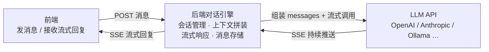

<!--
aicent-16-chat-engine-1
AI编程方法 16：核心功能 - 对话引擎（上）链路和流式技术
-->

## 1. 本篇导读与对话引擎阶段方法论


### 1.1 阶段定位与产出物（结论先行）

把一份配置好的智能体驱动成能开口说话、能记住上下文的对话系统——这就是对话引擎阶段的目标，产出物是「会话 + 消息」的完整链路与流式响应方案。

本篇是系列第 16 篇，落在「核心功能」主线里对话引擎子阶段的上半场：上篇只做两件事，一是把对话链路在工程层面拆成可裁剪的六步流水线，二是敲定流式推送的技术选型；下篇（系列第 17 篇）再展开上下文缓存与会话状态管理。读完本篇，读者应能回答三个问题：对话引擎到底在管什么、完整链路长什么样、流式推送为什么默认选单向方案。

前置依赖：系列第 14 篇的供应商适配层、第 15 篇的智能体配置、第 10 篇的独立线程池设计，本篇都会用到。如果还没读过，建议先补齐再回来。

### 1.2 全文导读地图（Mermaid）

下图把全篇骨架一次性摊开。第一部分只谈方法论动作，只字不提具体技术栈，可以照抄进任意项目的工程手册；第二部分把方法论逐条落到具体技术选型，回答 why。两部分用不同填色区分。


<!--
flowchart LR
    Root(["对话引擎（上）<br/>对话链路与流式技术选型"])

    Root --> A["第一部分 · 方法论"]
    Root --> B["第二部分 · 实战"]

    A --> A1["1、导读 + 阶段方法论"]
    A --> A2["2、工程 Check List"]

    A1 --> A1a["阶段目标 / 产出物"]
    A1 --> A1b["六步方法论骨架"]

    A2 --> A2a["概念建模"]
    A2 --> A2b["数据模型"]
    A2 --> A2c["流式选型"]
    A2 --> A2d["适配层"]
    A2 --> A2e["接口 / 验证 / 运维"]

    B --> B3["3、背景：为什么需要对话引擎"]
    B --> B4["4、数据模型 + 完整链路"]
    B --> B5["5、SSE 选型 + 线程模型"]
    B --> B6["6、适配层 + 接口 + 自验证"]

    B3 --> B3a["三个直连 LLM 的问题"]
    B3 --> B3b["后端集中处理"]

    B4 --> B4a["表字段决策"]
    B4 --> B4b["六步链路落到组件"]

    B5 --> B5a["原理 / vs 双向方案"]
    B5 --> B5b["线程切换 / 三个坑 / 事务边界"]

    B6 --> B6a["回调 / 四种格式差异"]
    B6 --> B6b["有状态接口 / 让 AI 解释代码"]

    classDef method fill:#e8f0fe,stroke:#1a73e8,stroke-width:1.5px,color:#0b3d91
    classDef practice fill:#fef7e0,stroke:#f9ab00,stroke-width:1.5px,color:#7a5a00
    classDef root fill:#e6f4ea,stroke:#188038,stroke-width:2px,color:#0d652d

    class Root root
    class A,A1,A2,A1a,A1b,A2a,A2b,A2c,A2d,A2e method
    class B,B3,B4,B5,B6,B3a,B3b,B4a,B4b,B5a,B5b,B6a,B6b practice
-->


阅读建议：第一部分适合直接抄进团队 Wiki，作为对话引擎阶段的通用 Checklist；第二部分按章顺序读，每章都会回头指认它对应第一部分哪条方法论动作，方便对照。

### 1.3 对话引擎阶段方法论六步骨架

下面六步是后续四章的纲领，也是「对话引擎 / 流式响应选型」阶段在任何技术栈里都成立的通用动作序列。每步用「方法论动作 + 可观测产物」表述，动词开头，能落到具体产物上才算闭环。

#### (1) 概念建模：对话引擎不是转发器，是处理管道

##### ① 动作

把对话引擎从「请求转发器」重新定义为「处理管道」：它要同时承担会话管理（哪些消息同属一次对话、何时创建何时归档）、上下文拼装（系统指令 + 历史 + 当前消息合成完整请求）、流式响应（边生成边推送，避免用户盯空等）、消息存储（用户消息与回复都要落库可回溯）四件事，缺一不可。

##### ② 可观测产物

一份能用一句话说清的四职责定义文档，以及一组对外承诺：调用方只需发一条消息、收一串流式回复，上下文与会话完全由引擎内部托管。

##### ③ 必须挂住的事实

管道不是「普通请求 - 响应接口」的升级版。普通接口一来一回就结束，对话引擎是「长连接 + 流式推送」，可能持续几十秒到一两分钟，由此派生三类绕不开的挑战：服务端线程不能一直被占着、客户端连接不能被提前掐断、前端必须边收边渲染。后续每一步设计都在回应这三类挑战。

#### (2) 数据模型：先定地基再画链路

##### ① 动作

在画链路之前，先把「会话表 + 消息表」的字段敲定：会话表要能记录运行状态（活动 / 归档），消息表要能解释「为什么停」与「耗了多久」。

##### ② 可观测产物

两张表 schema，其中消息表至少包含角色（与主流消息格式三值对齐，降低适配层复杂度）、内容（用最大容量字段，避免代码生成场景被截断）、停止原因（正常结束 / 超长截断 / 调用失败）、响应耗时（毫秒）、token 计数（上下文管理用）。会话标题由首条用户消息前若干字自动生成，不额外消耗 token。

##### ③ 必须挂住的事实

消息表是整条链路里增长最快的表。这点要在设计阶段就预判，留给后续分库归档空间；别等数据涨起来再补字段。

#### (3) 链路编排：六步可裁剪流水线

##### ① 动作

把一次对话拆成六步可裁剪的流水线：查配置 → 取历史 → 写用户消息 → 拼装请求 → 流式调用 → 存回复。每一步都标清读的是哪张表、写的是哪张表、能否独立替换。

##### ② 可观测产物

一张链路图，标注每一步的输入产物与输出产物，以及哪几步是本阶段焦点、哪几步留给下一篇展开。本篇聚焦第 5 步（流式调用与推送），取历史与存回复两步对应的上下文缓存管理留到下篇。

##### ③ 必须挂住的事实

链路里调用外部大模型的那一步必须与请求线程隔离执行，并套上熔断与超时，否则几十秒一次的慢调用会把请求线程池占满，连累管理页面等其他接口。这一步是整条链路的稳定性命门。

#### (4) 流式选型：单向推送场景的工程默认

##### ① 动作

从方向、协议、断线重连、实现复杂度四个维度评估「单向推送方案」与「双向通信方案」，得出单向推送在 AI 对话场景下的工程默认地位，并核对主流产品的事实选型。

##### ② 可观测产物

一份四维度对比表，加上「主流产品都选了谁」的事实清单。结论是：用户发消息走普通请求即可，服务端流式回复走单向推送方案，前端用浏览器原生 API 接收，不引额外依赖。数据格式统一成 `data: {json}\n\n`、最后一条带 done 事件。

##### ③ 必须挂住的事实

双向通信的双向能力在「客户端发一条、服务端流式回一段」的对话场景里完全用不上；断线重连又是浏览器原生 vs 自行实现的差距。这是工程默认，不是偏好选择。

#### (5) 适配层扩展：让引擎与供应商解耦

##### ① 动作

把供应商适配层从「只测连接、只列模型」扩展出两个对话能力：一次性的同步调用，以及带回调的流式调用。流式调用以「每收到一段增量文本就触发一次回调」的方式暴露，让推送层与适配层彻底解耦。

##### ② 可观测产物

一套请求 / 响应数据契约，加上一个流式回调签名。其中响应必须带回「停止原因」与「生成 token 数」，供链路第 6 步落库。

##### ③ 必须挂住的事实

各供应商的流式格式差异巨大：有的是单向推送格式、有的是逐行 JSON；字段命名各不相同；结束标志有的是特殊标记、有的是 JSON 字段。这是适配层最容易出 bug 的地方，必须逐一对照原始响应格式做 review，别靠想象写。

#### (6) 接口与验证：有状态 vs 无状态 + 让 AI 解释代码

##### ① 动作

在「无状态接口（每次传完整上下文，甩给调用方）」与「有状态接口（服务端管会话与历史，前端只传当前消息）」之间做一次明确取舍，并定出对外契约：发消息请求体尽量极简，流式响应在最后一条 done 事件回带停止原因与耗时。

##### ② 可观测产物

一组 RESTful 风格的对话接口（创建会话 / 发消息 / 列表 / 历史 / 删除），以及一份极简的请求体样例。多线程与回调代码无法靠逐行硬读验证，改用「让写代码的 AI 解释它自己生成的代码」的方法：专问线程怎么切换、外部调用中途异常如何、客户端断开如何，听逻辑找矛盾。

##### ③ 必须挂住的事实

有状态接口换来的是前端简单、后端要管会话，这是一笔明确的工程权衡，不是免费午餐。验证流式代码时，听 AI 自述逻辑、再对照代码找自相矛盾之处（比如「异常时调错误收尾」但代码里没有对应的异常捕获），比自己硬读不熟悉的异步代码高效得多——这是本阶段方法论上的新收获。

## 2. 对话引擎阶段工程 Check List


### 2.1 使用说明

本清单可裁剪、可直接粘到项目 Wiki，按项目阶段逐项勾选；组件名仅作为可操作检查项出现，不展开原理。落标时以"动作 + why"为最小单位，任何一项未勾都意味着对应环节存在已知风险。

### 2.2 概念建模类

- [ ] 明确对话引擎不是"转发器"，而是会话管理 + 上下文拼装 + 流式推送 + 消息存储的处理管道 —— 决定后续每一处设计。
- [ ] 定义"会话"边界：哪些消息归属同一会话、何时创建、何时归档 —— 决定数据模型与接口。
- [ ] 确认 LLM 无状态、上下文由引擎拼装注入 —— 决定历史消息存储与 Redis 缓存策略。

### 2.3 数据模型类

- [ ] 消息表预留 finish_reason（stop/length/error）与 latency_ms —— 调试与计费依赖。
- [ ] 长文本字段直接用 LONGTEXT —— 避免代码生成场景被截断。
- [ ] role 对齐 OpenAI messages 三值（user/assistant/system）—— 降低适配层复杂度。
- [ ] 预判该表是增长最快的表 —— 影响后续分库归档设计。

### 2.4 流式技术选型类

- [ ] 评估 SSE vs WebSocket 四维度（方向/协议/断线重连/实现复杂度）—— 单向推送场景必选 SSE。
- [ ] 参考业界事实标准（OpenAI / Anthropic / Dify 都用 SSE）—— 降低团队决策风险。
- [ ] SSE 数据格式统一为 `data: {json}\n\n`、最后一条带 done 事件 —— 前端可统一处理。

### 2.5 异步线程模型类

- [ ] LLM 调用放在独立线程池（如 llmExecutor），与 Tomcat 请求线程隔离 —— 避免线程池被几十秒调用占满。
- [ ] SseEmitter 超时设到 ≥120s —— 默认 30s 会截断长回复。
- [ ] 客户端断开时 catch IOException 并停止 LLM 调用 —— 否则线程白跑到输出完。
- [ ] @Transactional 避免跨 SseEmitter —— 事务提交时机与流结束时机不一致。

### 2.6 运维配置类

- [ ] 反向代理（Nginx）关掉 proxy_buffering / proxy_cache —— 否则流式效果失效，变成"等十几秒一次性出现"。
- [ ] proxy_read_timeout ≥ SseEmitter 超时 —— 否则 Nginx 先于应用断连。

### 2.7 适配层扩展类

- [ ] ProviderAdapter 提供 chat（同步）与 streamChat（流式）两个能力 —— 对话引擎最小依赖。
- [ ] streamChat 以 `Consumer<String> onChunk` 回调方式暴露增量 —— 解耦适配层与推送层。
- [ ] 各供应商流式格式差异（SSE vs 每行 JSON、字段命名、结束标志）逐一 review —— 最容易出 bug 的地方。
- [ ] 先实现一个 Adapter 跑通再批量复制 —— 控制风险。

### 2.8 接口设计类

- [ ] 在"无状态（甩给调用方）"与"有状态（服务端管会话）"之间做过取舍 —— 决定前端复杂度。
- [ ] 发消息请求体做到极简（只含 content + stream）—— session 已关联 agentId 就不要再传。
- [ ] 流式响应在 done 事件回带 finishReason 与 latencyMs —— 前端停止 loading 与性能展示依赖。

### 2.9 验证方法类

- [ ] 多线程/回调代码用"让 AI 解释自己代码"的方式验证 —— 比硬读不熟悉的异步代码高效。
- [ ] 验证时专门追问三类边界：线程切换、LLM 中途异常、客户端断开 —— 这三处是流式代码 bug 高发区。

## 3. 实战背景：Hify 对话引擎要解决什么


### 3.1 起点：Agent 配好了，但还是"哑"的

系列第 15 篇里，Hify 平台的智能客服 Agent 已经配置完成——名字、Prompt、模型、参数都齐了。但此刻它仍然不能说话。Agent 在 Hify 里只是一份配置，配置本身不会响应任何用户消息，必须有对话引擎去驱动它。

对话引擎是 Hify 最核心的模块。没有它，前面几篇做的模型管理、适配层、Agent 配置都只是准备工作。本篇和下一篇的任务，就是把这套驱动管道搭起来。

和系列第 15 篇研究 Agent 时的思路一致，动手之前先建立对"对话引擎到底是什么"的认知。

### 3.2 对话引擎到底是什么

用下面的提示词向 AI 提问，先建立基础认知：

```text
在 AI 应用平台里，对话引擎是什么？它的职责是什么？和普通的 HTTP 接口调用有什么区别？
```

AI 给出的回答指出一个关键认知：对话引擎不是简单的"转发器"，不是把用户的话原封不动发给 LLM、再把回复原封不动传回来。它是连接用户和 LLM 的一条处理管道，中间要做很多事。具体可以拆成四项职责：

#### (1) 会话管理

用户和智能客服聊了十轮，这十轮属于同一次对话。对话引擎要维护"会话"这个概念——哪些消息归属同一次对话、会话什么时候创建、什么时候结束。

#### (2) 上下文拼装

LLM 本身没有记忆。用户先问"Hify 怎么创建 Agent"，再问"那怎么配置模型"，LLM 并不知道"那"指什么。对话引擎要把 System Prompt、历史消息、当前消息拼成一个完整的 messages 数组，每次调用都带上上下文，让 LLM"看起来"有记忆。

#### (3) 流式响应

LLM 生成一个完整回复可能要十几秒。如果等全部生成完再返回，用户要盯着空白页面干等。对话引擎要做流式推送，LLM 生成一个字就推一个字给前端，用户看到的是像人打字一样一个字一个字冒出来——这就是 ChatGPT 的打字机效果。

#### (4) 消息存储

对话结束后，用户消息和 AI 回复要持久化到数据库。用户下次打开能看到历史记录，管理员能基于这些数据做分析。

与普通 HTTP 接口的核心区别如下：

| 维度 | 普通 HTTP 接口 | 对话引擎 |
| --- | --- | --- |
| 通信模式 | 请求 - 响应，一来一回就结束 | 长连接 + 流式，响应持续推送 |
| 响应时长 | 通常毫秒到秒级 | 几十秒到一两分钟 |
| 数据形态 | 一次性返回完整结果 | 一个字一个字持续推送 |

长连接 + 流式带来三类和普通 HTTP 完全不同的技术挑战：线程不能一直占着、连接不能提前断、前端要实时渲染。这三类挑战是后续几篇要逐一解决的核心问题。

### 3.3 为什么不直接让前端调 LLM API

既然 LLM 本身无状态，前端能不能绕过后端，直接调用 LLM API？用下面的提示词追问 AI：

```text
对话引擎和 LLM API 的关系是什么？为什么不直接让前端调 LLM API？
```

AI 的解释帮助建立认知：直接让前端调 LLM API 会带来三个问题。

#### (1) API Key 暴露风险

LLM 供应商的 API Key 是按调用计费的敏感凭证。前端代码会暴露在浏览器里，Key 一旦写在前端，任何人都能在开发者工具或网络请求里拿到，盗刷只是时间问题。这条路线在安全层面直接不可行。

#### (2) 多家供应商 API 格式不统一，前端要适配多套

不同 LLM 供应商的 API 格式各不相同——OpenAI、Anthropic、Ollama 的请求结构、字段命名、流式数据格式都不一样。如果前端直连，每接入一家供应商，前端都要改一套调用逻辑、解析一套流式协议。供应商一多，前端的适配代码会迅速膨胀，且每次更换模型都要重新发版。

#### (3) 无上下文管理 / 无会话状态，前端要自己拼历史、管会话

LLM 是无状态的，它不记得上一轮说了什么。如果前端直连，前端每次都要自己把历史消息拼进 messages 数组，还要自己维护"这次对话包含哪些消息""会话什么时候开始和结束"。会话管理、上下文拼装、消息存储这些职责全部被甩到前端，前端代码复杂度骤增，且无法做服务端的数据分析与历史回看。

### 3.4 结论：后端集中处理管道

把上面的三类问题汇成一张总览图，就得到了对话引擎在架构中的位置：



对话引擎把这些"脏活"集中到后端处理：会话管理、上下文拼装、流式响应、消息存储四项职责统一在服务端完成，对外屏蔽 LLM 供应商的差异与 API Key。前端只需要做两件事——发一条消息、接收一串流式回复。

至此，"要解决什么"已经交代清楚。接下来三章分别落地：第 4 章定数据模型并把完整链路逐段落到 Spring Boot + Redis + MySQL 技术栈，第 5 章聚焦流式响应技术选型与 SseEmitter 线程模型，第 6 章扩展适配层、定接口格式并介绍多线程代码的自验证方法。

## 4. 实战其一：数据模型与完整链路设计


第 3 章把"为什么需要对话引擎"讲透了——它是处理管道，不是转发器。但要让这条管道真正跑起来，得先回答两个工程问题：数据落在哪几张表、整条链路每一步落在哪个组件上。本章就按因果递进的顺序解决这两件事：先把数据地基定下来，再画出六步链路在 Spring Boot + Redis + MySQL 上的落点。

### 4.1 先定数据地基：chat_session 与 chat_message

在深入流式技术之前，先把数据模型定下来。可以用下面的提示词向 AI 提问：

```text
对话引擎需要哪些表？会话和消息怎么存？消息表需要哪些字段？
```

Hify 现有的 schema.sql 里已经有了 chat_session 和 chat_message 的基础结构。AI 分析后建议在已有字段基础上补几个关键字段。下面分别看两张表的决策。

#### (1) chat_session 字段决策

第一处是补 status。流式响应中途可能出错（LLM 超时、客户端断开、熔断触发），这时需要有一个地方记录会话当前是什么状态，ACTIVE / ARCHIVED 两个值就够用——活跃中或已归档。

第二处是 title。会话标题不单独消耗一次 LLM 调用来生成，而是取第一条 user 消息的前 20 字自动截取，既够辨识又零成本。

最终 chat_session 的 SQL schema 如下（字段与注释逐字保留自原文）：

```text
chat_session
  id          bigint PK
  agent_id    bigint          -- 关联 agent
  title       varchar(200)    -- 首条消息前 20 字自动生成
  status      varchar(20)     -- ACTIVE / ARCHIVED
  deleted / created_at / updated_at
```

#### (2) chat_message 字段决策

chat_message 是真正承载对话内容、也是后续要重点保护的表，AI 分析后给出三处关键补强。

第一处是补 finish_reason。这个字段记录 LLM 为什么停止生成，取值有三类：stop（正常结束）、length（超过 max_tokens 被截断）、error（调用失败）。这个字段不只是调试用——后续按 token 计费、按失败重试的策略都依赖它来区分正常停止和异常停止。

第二处是补 latency_ms。记录这条 assistant 消息从发起到流结束的总耗时，单位毫秒。性能分析、慢响应排查、模型横向对比都靠它。

第三处是把 content 从 TEXT 改成 LONGTEXT。代码生成场景一条 assistant 消息可能几千字甚至更长，TEXT 在某些 MySQL 配置下会触发截断，LONGTEXT 彻底避免这个隐患。此外保留 tokens 字段记录 token 数，供上下文管理使用。

最终 chat_message 的 SQL schema 如下（字段与注释逐字保留自原文）：

```text
chat_message
  id            bigint PK
  session_id    bigint         -- 关联 chat_session
  role          varchar(20)    -- user / assistant / system
  content       longtext
  tokens        int            -- token 数（上下文管理用）
  finish_reason varchar(20)    -- stop / length / error
  latency_ms    int            -- 响应耗时 ms
  deleted / created_at / updated_at
```

#### (3) 几个设计决策

字段补完之后，还有几条贯穿性的设计决策需要明确。

role 只有 user / assistant / system 三个值，直接对齐 OpenAI messages 格式，这样适配层把库里的消息翻译成 LLM 请求时几乎零成本。

system 消息一般不入库。每条会话的 system prompt 来自 Agent.systemPrompt 这个配置项，每次构造请求时动态注入。这样做的好处是 Agent 的 prompt 修改后立刻对历史会话生效，不会因为旧的 system 消息存库而"锁死"在旧版本。

token 数的写入时机有讲究——不是在拼装请求时写，而是在流式响应结束后，由 LLM 返回的 usage 字段里拿到实际 token 数再写入。请求前的预估值和实际生成值可能差很多，只有流结束后的 usage 才是准确值。

会话 title 取第一条 user 消息前 20 字，不额外消耗 token，与 4.1 (1) 的决策呼应。

#### (4) 增长最快的表

这里要提前打个预防针：chat_message 是整个 Hify 平台增长最快的表。一次对话就是两条消息（user + assistant），十个用户每天聊十轮就是每天两千行，加上长文本 content，数据膨胀速度远超 agent / model_config / provider 这些配置表。这一点在系列第 5 篇（数据库规范）里已经做过预判——后续的归档、分表、冷热分离策略都是围绕这张表展开的。本篇先把字段定对，增长问题留给数据库规范那篇解决。

### 4.2 再画完整链路：六步落到 Spring Boot + Redis + MySQL

数据模型定好之后，下一步是把对话引擎的完整链路画出来，看每一步分别落在哪个组件上。可以用下面的提示词让 AI 产出链路图（提示词逐字保留自原文）：

```text
用户和一个 Agent 对话，从前端发消息到收到流式回复，中间每一步技术上发生了什么？从前端到 Controller 到 Service 到 LLM 再回来，逐步梳理。
```

AI 给出了一张非常完整的链路图，把六步链路、每步对应的表与组件一次性画清楚（ASCII 图逐字保留自原文，放进 code block）：

```text
用户输入 "Hify 怎么创建 Agent？"
    │
    ▼
[前端] POST /api/v1/chat/sessions/{sessionId}/messages
       接收: SSE 流式响应
    │
    ▼
[ChatService] ── 组装上下文 ──
    │  1. 查 session → 拿到 agentId
    │  2. 查 Agent → 拿到 systemPrompt、modelConfigId、参数
    │  3. 查 ModelConfig → 拿到 modelId、providerId
    │  4. 查 Provider → 拿到 baseUrl、authConfig
    │  5. 从 Redis 取最近 N 轮历史消息
    │
    ▼
[ChatService] ── 写入用户消息 ──
    │  INSERT chat_message(role='user', content)
    │
    ▼
[ChatService] ── 构造 LLM 请求 ──
    │  messages = [
    │    { role: "system",    content: agent.systemPrompt },
    │    { role: "user",      content: "上上轮问题" },
    │    { role: "assistant", content: "上上轮回复" },
    │    { role: "user",      content: "Hify 怎么创建 Agent？" }
    │  ]
    │
    ▼
[LlmHttpClient] ── 流式调用 LLM ──
    │  llmExecutor 线程池（和业务线程隔离）
    │  Resilience4j 熔断器包裹
    │
    ▼
[LLM API] 返回 SSE 流 → 边收边推给前端
    │
    ▼
[ChatService] ── 流结束后 ──
    │  INSERT chat_message(role='assistant', content=完整回复)
    │  更新 Redis 历史消息
```

下面把六步逐一拆开，对应到 Spring Boot + Redis + MySQL 技术栈上的具体落点。

#### (1) 查配置

这一步是整条链路的"准备弹药"阶段，由 ChatService 负责。拿到前端传来的 sessionId 之后，要依次把后续调用 LLM 所需的所有配置都查出来：

- 查 chat_session → 拿到 agentId（这条会话绑定的是哪个 Agent）；
- 查 Agent → 拿到 systemPrompt、modelConfigId 以及 temperature 等推理参数；
- 查 ModelConfig → 拿到 modelId、providerId；
- 查 Provider → 拿到 baseUrl、authConfig（API Key 等鉴权信息）；
- 从 Redis 取最近 N 轮历史消息（对应链路图里的第 5 小步，TTL 通常设 2 小时左右）。

这一串查询基本都落 MySQL（配置类表）+ Redis（历史消息缓存）。配置类数据访问频率高但变更少，后续可以再叠一层本地缓存，本篇不展开。

#### (2) 写用户消息

配置查完、上下文也取齐之后，先把用户的这条消息落库——执行 `INSERT chat_message(role='user', content=...)`。这一步落在 MySQL。

为什么要在调 LLM 之前先写 user 消息，而不是等整轮对话结束再一起写？因为一旦 LLM 调用中途失败，至少用户问了什么这条记录是保住的，重试或排查时不会丢失上下文。这是流式场景下"先持久化、再调用"的常规做法。

#### (3) 构造 LLM 请求

上下文齐了，user 消息也存了，接下来由 ChatService 把它们拼成符合 OpenAI messages 格式的数组：

- 第 1 条永远是 system，content 来自 Agent.systemPrompt（动态注入，不查库）；
- 中间若干条是历史轮次，从 Redis 取出后按 user / assistant 交替排列；
- 最后一条是当前 user 消息。

拼装时严格遵循 role 三值规则，与 4.1 (3) 的决策对齐。这一步纯内存操作，不落任何存储。

#### (4) 流式调用 LLM

拼好 messages 之后，请求交给 LlmHttpClient 发起流式调用。这一步有两个工程细节必须在架构层面定下来：

- 调用跑在独立的 llmExecutor 线程池里，和 Tomcat 业务线程隔离。LLM 一次调用可能几十秒，如果占着 Tomcat 线程，几个并发请求就能把请求线程池占满，整个后端包括管理页面都卡死。llmExecutor 的设计在系列第 10 篇已经讲过，本篇直接复用。
- 调用被 Resilience4j 熔断器包裹。LLM 供应商抖动是常态，熔断器在错误率达到阈值时主动断开，避免雪崩把 llmExecutor 也拖垮。

这一步是整条链路技术含量最高的一段，也是本篇第 5 章要展开的焦点。

#### (5) SSE 边收边推给前端

LLM 返回的是 SSE 流，LlmHttpClient 每收到一段 delta 文本，就通过回调把这段 delta 推给前端（具体推送机制是 SseEmitter）。用户看到的就是 ChatGPT 那种打字机效果——边生成边显示，而不是等十几秒后一次性蹦出来。

这一步是本篇的技术焦点，SSE 原理、SseEmitter 生命周期、线程切换、三个坑（超时 / 客户端断开 / Nginx 缓冲）全部留给第 5 章深入展开。

#### (6) 流结束后存回复

流正常结束后，回到 ChatService 做收尾——这一步落 MySQL + Redis：

- 执行 `INSERT chat_message(role='assistant', content=完整回复)`，把拼起来的完整 assistant 回复、finish_reason、latency_ms、tokens 一次性写入（其中 tokens 来自 LLM 返回的 usage，呼应 4.1 (3) 的写入时机决策）；
- 更新 Redis 历史消息缓存，把这条 assistant 消息追加进最近 N 轮历史，供下一轮请求的第 (1) 步读取。

第 (6) 步和第 (1) 步里的 Redis 读写一起，构成完整的上下文管理闭环。这两步是下一篇的展开重点——本篇只先把它们在链路里的位置标清楚。

### 4.3 本章焦点声明

把上面六步压缩成一句话：查配置 → 取历史 → 写用户消息 → 拼装请求 → 流式调用 → 存回复。

其中第 5 步（流式调用与 SSE 推送）是本篇的技术焦点，第 5 章会把 SSE 原理、SseEmitter 线程模型和三个坑全部讲透。第 2 步（从 Redis 取历史）和第 6 步（写回 Redis）是上下文管理的核心，涉及历史轮次截断、TTL 策略、token 预算控制，本篇不展开，留给下一篇专门讲。

数据模型定好了、链路每一步的落点也标清楚了，下一章就可以心无旁骛地钻进流式响应这个技术深水区。

## 5. 实战其二：流式响应技术选型与 SseEmitter 线程模型


这是对话引擎技术含量最高的部分。大部分后端工程师写过无数请求-响应接口，但没写过流式推送。普通接口是"一来一回"，发完请求等几十毫秒拿完整响应；而流式接口要"发完请求后保持连接几十秒、持续推送字符"，处理模型完全不同。本篇把这一层从原理到落地一次讲透。

### 5.1 SSE 是什么

先用下面这个提示词建立基础认知：

```text
SSE（Server-Sent Events）的工作原理是什么？和普通 HTTP 请求有什么区别？数据格式是什么样的？
```

AI 给出的解释可以归纳为一句话：SSE 是"一来持续回"。普通 HTTP 请求是"一来一回"——客户端发请求，服务端返回完整响应，连接关闭；SSE 是"一来持续回"——客户端发请求，服务端保持连接不关闭，持续往客户端推数据，直到主动关闭。底层仍然跑在普通 HTTP 协议上，不需要独立的协议栈。

数据格式非常简单，每条消息以 `data:` 开头，用两个换行分隔：

```json
data: {"type":"delta","content":"在"}
data: {"type":"delta","content":"Hify"}
data: {"type":"delta","content":"中"}
data: {"type":"done","finishReason":"stop"}
```

前端用 EventSource API 接收，浏览器原生支持，不需要额外依赖：

```typescript
const es = new EventSource('/api/v1/chat/sessions/1/messages/stream')
es.onmessage = e => appendToken(JSON.parse(e.data).content)
es.onerror = () => es.close()
```

三行代码就完成了"打开连接-收 delta-渲染到页面-出错关闭"的全流程，这是 SSE 相对于其他流式方案最大的工程优势。

### 5.2 为什么选 SSE 而不是 WebSocket

SSE 之外，另一个常被提到的流式技术是 WebSocket。哪一个更适合 AI 对话场景？提示词如下：

```text
AI 对话的流式响应，用 SSE 还是 WebSocket？
```

#### (1) 四维度对比

| 维度 | SSE | WebSocket |
| --- | --- | --- |
| 方向 | 单向（服务端 → 客户端） | 双向 |
| 协议 | 普通 HTTP | 独立 ws:// 协议 |
| 断线重连 | 浏览器原生自动重连 | 需自行实现 |
| 实现复杂度 | SseEmitter 约 20 行 | 需连接池 + 心跳 + 重连，3-5 倍工作量 |

结论很直接：AI 对话就是"客户端发一条消息，服务端流式回复"，典型的单向推送。用户发消息走普通 POST 请求即可，回复阶段才进入 SSE 长连接；WebSocket 的双向能力在这里完全用不上，反而凭空增加了协议复杂度、心跳维护和重连逻辑。

#### (2) 业界事实标准

判断技术选型是否合理，最快的办法是看头部产品怎么做。OpenAI、Anthropic、Dify——所有主流 AI 对话产品的流式接口都选 SSE。团队跟着事实标准走，决策风险最低，前端代码也能复用成熟模式。

### 5.3 Spring 怎么实现：SseEmitter 生命周期与线程切换

确定了 SSE，接下来是 Spring 生态怎么实现。提示词如下：

```text
Spring MVC 的 SseEmitter 怎么工作？生命周期是什么样的？
```

#### (1) SseEmitter 是长连接容器

SseEmitter 本质是一个长连接容器。Controller 方法返回 SseEmitter 对象后，Spring 不会关闭 HTTP 连接，而是持有它；后续代码通过 `emitter.send()` 往这个连接里推数据，最后 `emitter.complete()` 关闭连接。整个生命周期分三步：创建 → 多次 send → 一次 complete。

#### (2) 线程切换：Tomcat 线程 vs llmExecutor 线程池

关键在于线程切换。Tomcat 的请求线程创建 SseEmitter 后必须立刻返回，不能让 Tomcat 线程等 LLM 响应——那要等几十秒，Tomcat 线程池（默认 200 个）很快就被占满，整个应用不可用。实际的 LLM 调用在独立的 llmExecutor 线程池里异步执行，线程切换过程如下：

```text
Tomcat 线程:
  创建 SseEmitter(120s) → 提交任务给 llmExecutor → return emitter
  （线程释放，可以处理其他请求）

llmExecutor 线程:
  调用 LLM stream API → 收到 delta → emitter.send(delta)
                       → 收到 delta → emitter.send(delta)
                       → 收到 [DONE] → 存消息 → emitter.complete()
```

把这个流程画出来更直观：


<!--
上图的内容
sequenceDiagram
    participant Front as 前端 EventSource
    participant Tomcat as Tomcat 线程
    participant Pool as llmExecutor 线程池
    participant LLM as LLM API

    Front->>Tomcat: POST /chat/sessions/1/messages
    Tomcat->>Tomcat: 创建 SseEmitter(120s)
    Tomcat->>Pool: 提交流式调用任务
    Tomcat-->>Front: return emitter（连接保持）
    Note over Tomcat: Tomcat 线程释放

    Pool->>LLM: stream chat 请求
    loop 边收边推
        LLM-->>Pool: delta {"content":"在"}
        Pool->>Front: emitter.send(delta)
    end
    LLM-->>Pool: [DONE]
    Pool->>Pool: 存 assistant 消息
    Pool->>Front: emitter.complete()
-->

#### (3) 为什么用独立 llmExecutor

这就是为什么系列第 10 篇要单独配一个 llmExecutor 线程池。LLM 调用在自己的池子里跑，和 Tomcat 请求线程物理隔离——即使 LLM 调用因供应商抖动堆积、把 llmExecutor 占满，也只影响对话功能本身，后台管理页面、配置接口依然能正常响应。线程池隔离是流式响应稳定性保障的基石，和 Resilience4j 熔断器一起构成 LLM 调用的两道防线。

### 5.4 SseEmitter 的三个坑

需要特别注意的是，AI 在解释 SseEmitter 时强调了三个必须处理的问题，新手几乎都会踩。

#### (1) 超时

SseEmitter 默认超时 30 秒。LLM 生成一个长回复（尤其是代码生成场景）可能要一两分钟，30 秒一到连接直接断，用户看到的是半截回复。必须手动设长：

```java
new SseEmitter(120_000L)  // 120 秒
```

#### (2) 客户端断开

用户对话到一半关了浏览器标签页，HTTP 连接断了，但 llmExecutor 线程并不知道这件事，它还在调 LLM，每收到一个 delta 就 `emitter.send()`，直到抛出 IOException。如果不在 send 的 catch 块里捕获异常、停止 LLM 调用并释放线程，线程会白跑到 LLM 把整段输出跑完，白白浪费 llmExecutor 的线程资源。必须在 send 的 catch 里停止 LLM 调用并释放线程。

#### (3) Nginx 缓冲

这是最容易被忽略的一个坑。Nginx 默认会缓冲上游响应，收集一批数据后才一次性发给客户端。结果用户看到的是"等了十几秒突然全部内容一起出现"，流式效果完全失效。必须在 Nginx 配置里关掉缓冲：

```typescript
location /api/ {
    proxy_pass http://backend;
    proxy_buffering off;
    proxy_cache off;
    proxy_read_timeout 120s;
}
```

三行缺一不可：`proxy_buffering off` 关掉响应缓冲、`proxy_cache off` 关掉缓存、`proxy_read_timeout 120s` 保证 Nginx 不会先于应用把连接断掉（要大于等于 SseEmitter 的超时时间）。

### 5.5 一个反直觉的事务边界细节

最后是一个很细的细节：事务不要跨 SseEmitter。`@Transactional` 方法里不要直接返回 SseEmitter 对象。

原因是事务提交时机和流结束时机完全不同。`@Transactional` 方法返回时事务就要提交，但此时流才刚刚开始——LLM 还没调、delta 还没推、消息还没存。强行把 SseEmitter 放在事务方法里，要么导致事务提前提交（流还没跑完，数据库已经写了一半状态），要么让连接长时间持有事务资源直到超时。

正确做法是把写消息的操作拆成独立方法调用：流式调用的主流程不套事务，每一段需要落库的操作（写用户消息、写 assistant 消息、更新 Redis）各自用独立的 `@Transactional` 方法包裹，事务边界和数据库写入一一对应，和流的边界解耦。

## 6. 实战其三：适配层扩展、接口设计与代码自验证


数据模型、链路、流式方案都定了，对话引擎还差最后一块拼图：适配层要扩出对话能力、对外的接口要定格式、生成出来的多线程代码要能被验证。这一章把这三件事收尾，并给出本篇交付物与下篇预告。

### 6.1 适配层要扩出两个能力：chat 与 streamChat

系列第 14 篇做 ProviderAdapter 接口时，只覆盖了 `testConnection` 和 `listModels`——那是为了跑通"配置 → 选模型 → 测连通"链路。对话引擎要做的事比这多两件：同步调用（chat）和流式调用（streamChat）。前者用于一次性取完整回复，后者用于打字机效果推送。

先用一个提示词把扩展点和 DTO 一起定下来：

```text
给 ProviderAdapter 接口扩展 chat 和 streamChat 方法。设计 ChatRequest 和 ChatResponse DTO。
```

#### (1) ProviderAdapter 接口扩展：chat + streamChat

接口上新增两个方法。chat 同步返回 ChatResponse，适合调试或非流式场景；streamChat 走流式，靠回调把增量推出去，流结束后同样返回 ChatResponse 作为汇总。

#### (2) DTO 设计：ChatRequest / ChatResponse

两个 DTO 的字段对齐主流 LLM API 的语义，不发明新概念：

| DTO | 字段 | 说明 |
| --- | --- | --- |
| ChatRequest | modelId | 模型 ID |
| ChatRequest | messages | List，每条含 role 和 content |
| ChatRequest | temperature | 温度参数 |
| ChatRequest | maxTokens | 最大 token 数 |
| ChatResponse | content | 完整回复文本 |
| ChatResponse | finishReason | stop/length/error |
| ChatResponse | completionTokens | 生成的 token 数 |

finishReason 三值沿用上一篇数据模型里的约定——stop 正常结束、length 超过 maxTokens 截断、error 调用失败，调试和后续计费都依赖它。

#### (3) streamChat 的 `Consumer<String> onChunk` 回调

streamChat 的核心设计是接收一个 `Consumer<String> onChunk` 回调。适配层每收到 LLM 的一段 delta 文本就调一次 onChunk，ChatService 在 onChunk 里调 emitter.send() 推给前端；流结束后返回完整的 ChatResponse（含 content、finishReason、completionTokens）。

这个设计的关键在于解耦：适配层只管"解析各家格式、把纯文本增量丢出去"，不关心推送方式是 SseEmitter 还是别的；ChatService 只管"接到增量就推前端、流结束就存库"，不关心是哪家 LLM。两层之间靠 `Consumer<String>` 这个最简单的函数式接口咬合。

### 6.2 四个 Adapter 的流式格式差异（review 重点）

接口扩出来后，真正的硬骨头是四个 Adapter 的 streamChat 实现。各家的流式格式差异很大——SSE 还是逐行 JSON、字段叫什么、怎么判断结束，全不一样。这是整个适配层最需要仔细 review 的部分。

| Adapter | 流式数据格式 | 结束标志 |
| --- | --- | --- |
| OpenAiAdapter | SSE，`data: {"choices":[{"delta":{"content":"..."}}]}` | `data: [DONE]` |
| OpenAiCompatibleAdapter | 继承 OpenAiAdapter，零改动 | 继承，`data: [DONE]` |
| AnthropicAdapter | SSE，`event: content_block_delta` + `data: {"delta":{"text":"..."}}` | `event: message_stop` |
| OllamaAdapter | 每行完整 JSON，`{"message":{"content":"..."}}` | JSON 内 `"done":true` |

#### (1) OpenAiAdapter 详解

最规范的一种：标准 SSE，每条以 `data:` 开头，增量在 `choices[0].delta.content`，结束标志是单独一行 `data: [DONE]`。解析时按行读、按 `data:` 前缀剥离、判断 [DONE] 即可。

#### (2) OpenAiCompatibleAdapter（继承零改动）

国内大量供应商（DeepSeek、通义千问、Kimi 等）都兼容 OpenAI 协议。OpenAiCompatibleAdapter 直接继承 OpenAiAdapter，streamChat 一行都不用改——这是系列第 14 篇把 OpenAI 适配单独抽成基类的回报。

#### (3) AnthropicAdapter 详解

也是 SSE，但比 OpenAI 复杂：增量包在 `event: content_block_delta` 事件里，文本在 `delta.text` 而不是 `delta.content`，结束标志是 `event: message_stop` 而不是 [DONE]。字段名和事件类型都要单独处理。

#### (4) OllamaAdapter 详解

最不一样的一种：根本不是 SSE，而是每行返回一个完整 JSON 对象，文本在 `message.content`，结束靠 JSON 里的 `"done":true` 字段判断。没有 `data:` 前缀，没有事件类型，解析逻辑要完全独立写。

实现顺序沿用系列第 14 篇的同款模式：先实现 OpenAiAdapter 的 streamChat，review 通过后其他三个批量生成。先把最规范的一种跑通、把回调机制和异常处理验证稳，再复制到其余三家，风险可控。

### 6.3 接口设计：抄谁、为什么 Hify 选有状态 RESTful

适配层对内的事完了，对外还要定接口格式。先看业界怎么做：

```text
ChatGPT API 和 Dify 的对话接口怎么设计的？
```

#### (1) OpenAI 无状态 vs Dify 有状态

两条路线，两种取舍：

| 维度 | OpenAI 无状态 | Dify 有状态 |
| --- | --- | --- |
| 会话关联 | 无，每次传完整 messages 数组 | 用 conversation_id 关联 |
| 历史管理 | 甩给调用方 | 服务端维护 |
| 前端复杂度 | 简单（但前端要管历史） | 简单（只传当前消息） |
| 后端复杂度 | 简单 | 要管会话、存历史 |
| 适合场景 | 直接调 API 的开发者 | 面向终端用户的产品 |

OpenAI 走无状态路线：每次传完整 messages 数组，不管会话。好处是协议简单，坏处是历史管理全甩给调用方。Dify 走有状态路线：用 conversation_id 关联，服务端维护历史，前端只传当前消息。好处是前端简单，坏处是后端要管会话。

#### (2) Hify 有状态 RESTful 五个接口

Hify 是面向终端用户的产品，前端越简单越好，所以选有状态。接口走 RESTful 风格，会话（session）作为资源，消息（message）作为子资源：

```text
POST /api/v1/chat/sessions                    # 创建会话
POST /api/v1/chat/sessions/{id}/messages      # 发消息
GET  /api/v1/chat/sessions                    # 会话列表
GET  /api/v1/chat/sessions/{id}/messages      # 历史消息
DELETE /api/v1/chat/sessions/{id}             # 删除会话
```

#### (3) 发消息请求体极简

因为 session 已经关联了 agentId，会话上下文都在服务端，发消息时前端只需要传最少的字段：

```json
{
  "content": "Hify 怎么创建 Agent？",
  "stream": true
}
```

比 Dify 还简单：不需要 user 字段（Hify 没有多租户），不需要 inputs（没有变量注入），session 已经关联了 agentId 不用再传。能不传的字段一律不传，是接口设计的基本修养。

#### (4) done 事件回带 finishReason 与 latencyMs

流式响应的格式上一篇已经定过，这里收口：

```json
data: {"type":"delta","content":"在"}
data: {"type":"delta","content":"Hify"}
data: {"type":"delta","content":"中..."}
data: {"type":"done","finishReason":"stop","latencyMs":1240}
```

最后一条 done 事件带 finishReason 和 latencyMs，前端据此停止 loading 并显示完整消息。finishReason 决定要不要给用户额外的提示（比如 length 截断可以提示"回复被截断"），latencyMs 用于性能展示和后续优化。

#### (5) 消息存储选同步写 MySQL

消息存储的时机选在流结束后同步写 MySQL。Hify 的目标规模是 20-50 人同时在线，同步写数据库完全没有压力，不引入消息队列——多一个组件就多一份运维成本，能省则省。等规模真到了需要异步的程度再引入 MQ 也来得及。

### 6.4 代码自验证：让 AI 解释自己生成的多线程代码

streamChat 生成出来后怎么验证？这是整个适配层最棘手的一环。

#### (1) 方法：让 AI 解释 streamChat 代码

流式代码涉及多线程和回调，不好直接读——线程在哪切换、异常往哪冒、连接断开时谁来收尾，这些靠逐行读很容易漏掉。一个高效得多的方法：让写代码的 AI 解释它自己的代码，并且专门追问三类边界：

```text
逐步解释你刚才生成的 streamChat 代码。特别说明：线程是怎么切换的、如果 LLM 中途抛异常会怎样、如果客户端断开会怎样。
```

#### (2) 听逻辑找矛盾

AI 解释一遍，听逻辑。重点不是听它夸自己的代码写得多好，而是听它解释里有没有自相矛盾的地方。比如解释说"异常时会调 completeWithError 关闭连接"，但代码里根本没有 catch 这个异常——这就说明代码有 bug，异常其实会直接冒上去把线程打爆。

三类边界（线程切换、LLM 中途异常、客户端断开）正是流式代码 bug 的高发区，也是上一篇 SseEmitter 三个坑的同一组问题。让 AI 把这三处的处理逻辑讲清楚，比自己硬读一段不熟悉的异步代码高效得多。

### 6.5 本篇交付物与下篇预告

#### (1) 本篇交付物

本篇围绕对话引擎做了四件事：

理解对话引擎。它不是转发器，是处理管道——会话管理、上下文拼装、流式推送、消息存储四件大事。

设计数据模型。在已有表基础上补了 status、finish_reason、latency_ms，content 由 TEXT 改 LONGTEXT，对齐 OpenAI 的 role 三值。

搞懂流式响应。SSE 的原理、和 WebSocket 的四维度对比与业界验证、SseEmitter 的线程模型（Tomcat 线程切到 llmExecutor）和三个坑（超时、客户端断开、Nginx 缓冲），以及事务不跨 SseEmitter 这个反直觉的边界。

扩展适配层和定接口。ProviderAdapter 加 chat / streamChat，ChatRequest / ChatResponse DTO 定好，Consumer<String> onChunk 回调解耦适配层与推送层；四个 Adapter 的流式格式差异梳理清楚；RESTful 有状态接口五个路径 + 极简请求体 + done 事件字段全部定稿。

到这里，对话引擎的概念清楚了、表设计好了、流式方案定了、适配层扩展完了、接口格式定了——地基全部打完。

#### (2) 下篇预告

下一篇直接执行：CRUD 实现、上下文管理（链路里的第 2/6 步，Redis 取历史与更新历史）、跑通完整链路，让智能客服真正开口说话。本篇留下的 ProviderAdapter 扩展和接口定义，下一篇会填上具体实现。

#### (3) 方法论新收获

验证不熟悉的代码：让 AI 解释它自己写的代码，听逻辑找矛盾。流式响应、回调、多线程这些日常写得少、读起来又费劲的代码，用这个方法比自己硬读高效得多。关键是专问边界——线程切换、中途异常、连接断开，这三处听明白了，代码基本就稳了。

### 6.6 思考

SseEmitter 超时设了 120 秒，但有些复杂问题 LLM 可能需要更长时间。超时应该固定还是动态？固定值简单但可能截断长回复，动态值又要怎么估——按 maxTokens 算理论时长，还是按首 token 延迟自适应？

如果要支持"停止生成"（用户中途打断 AI 回复），技术上怎么实现？需要改适配层吗？前端发一个取消请求、后端中断 llmExecutor 任务、再通知 LLM 停止输出，这条链路里适配层的 streamChat 要不要暴露一个 cancel 钩子？

四个 Adapter 的流式格式都不同，如果以后有新供应商用了第五种格式，现在的架构能不能低成本扩展？新增一个 Adapter 类、实现 streamChat、在 onChunk 里解析新格式——这套扩展点够不够用，还是会动到 ChatService 或 DTO？
