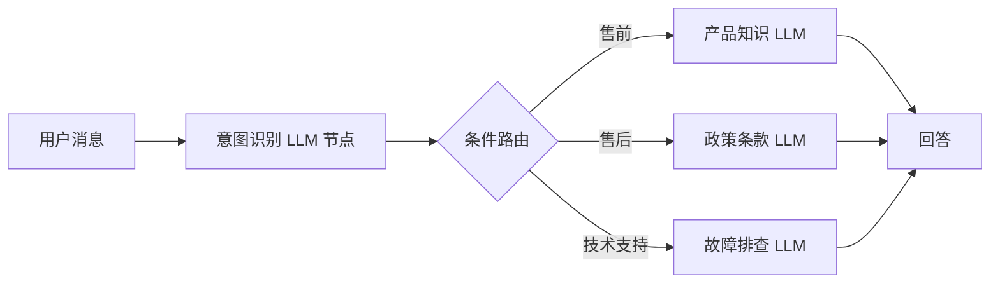
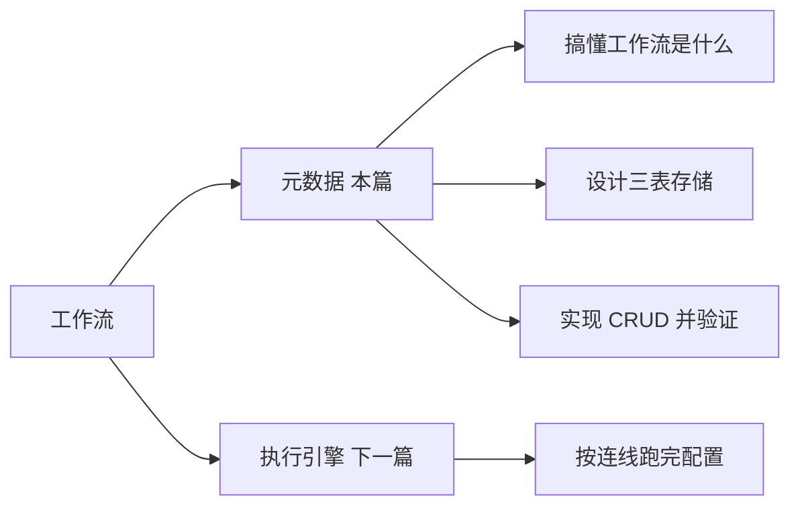
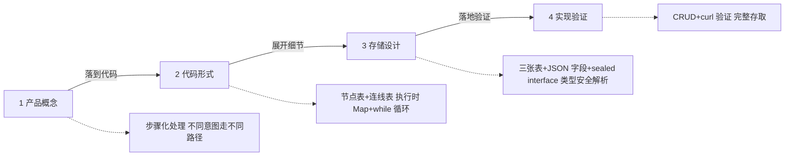

<!--
aicent-22-fea-workflow-1
AI编程方法 22：高级功能 - 工作流（上）元数据梳理
-->

> 第22和第23篇：专注于工作流编排
> 配套：本篇讲元数据（工作流长什么样、怎么存），第23篇讲执行引擎（让它跑起来）。

## 1. 全文导读地图


本篇分两部分：第一部分是方法论提炼（参考手册风，速查用，不深入具体技术栈），第二部分是实战演示（教材风，结合智能客服项目复现过程，深入解释 why）。先用一张地图定位各章，按需跳读。


<!--
graph TD
    Start([本篇：工作流编排 上 理清元数据]) --\> P1[第一部分 方法论提炼]
    Start --\> P2[第二部分 实战演示]

    P1 --\> C1["1、先把元数据理清 导引"]
    P1 --\> C2["2、用 Claude Code 想清楚陌生子系统"]
    P1 --\> C3["3、做一份能扩展的数据模型设计"]
    P1 --\> C4["4、项目 Check List 可裁剪"]

    P2 --\> C5["5、实战场景与项目背景"]
    P2 --\> C6["6、让 Claude Code 解释工作流是什么"]
    P2 --\> C7["7、把概念压成代码数据结构"]
    P2 --\> C8["8、三张表的存储设计"]
    P2 --\> C9["9、实现 CRUD"]
    P2 --\> C10["10、用 curl 串起来验证"]
    P2 --\> C11["11、回顾与思考"]

    C4 -.速查.-> End([下一篇 执行引擎])
    C11 --\> End
-->

阅读建议：只想快速套用到自己项目的读者，看第一部分（尤其第 4 章 Check List）；想搞懂每一步为什么这么做的读者，看第二部分。

## 2. 工作流编排：先把元数据理清


工作流由两部分组成：元数据和执行引擎。元数据是工作流的配置——它有哪些节点、节点之间怎么连接、每个节点做什么。执行引擎是让这份配置真正跑起来的逻辑——从起始节点开始，一步步往下走，直到结束。

为什么"理清元数据"要先于"写执行逻辑"？原因很直接：配置没定好，引擎无处可跑。元数据决定工作流的形态（有哪些节点、怎么连），引擎只是按连线把它走完。先做元数据，相当于先把轨道铺好；轨道没定，谈"跑得快不快"没有意义。

本篇只做一件事：搞懂工作流是什么，然后把它存起来——设计存储结构，实现 CRUD，并用真实配置验证能完整存取。至于工作流跑不跑得起来，是下一篇执行引擎的事。

第二部分会用一个智能客服项目把整个过程复现出来；第一部分先把方法论抽出来，供读者在自己项目里速查。

## 3. 方法论：面对陌生子系统，如何用 Claude Code 把它想清楚


工作流是大多数团队没从零做过的子系统。本篇原文作者遇到这类陌生方向时，遵循一个固定节奏：先让 Claude Code 解释清楚，再动手写代码。这个节奏可以提炼成可复用的方法。

### 3.1 先建立概念，再写代码

因果递进地看：陌生概念之所以危险，是因为人脑会自动用已有经验去"硬套"——看到"工作流"就联想到 if-else 或函数调用，方向从一开始就可能跑偏。先让 Claude Code 用一个具体场景把概念讲清楚（它是什么、为什么需要它、不用它会怎样），就是在给后续所有设计和代码划定正确方向。

操作要领：

| 核心动作 | 说明 |
| --- | --- |
| **用具体业务场景提问，不要让 AI 讲理论** | 让 AI 用读者自己项目里的场景解释概念，而不是抽象定义。场景化的解释天然能对应到代码 |
| **先问"是什么、为什么需要"，再问"怎么做"** | 顺序不能反。没搞清"为什么需要"就直接问"怎么做"，得到的方案往往方向错 |
| **概念没建立前，一行代码都不要写** | 这是底线。写下去的每一行都在固化错误方向，返工成本远高于多问两轮 |

### 3.2 从概念落到代码形式

概念清楚后，下一步是把它压成最小的、能直接对应到代码的数据结构。这里有一个关键提问技巧：用约束词主动屏蔽学术术语。

原文作者让 Claude Code 解释"工作流在代码里长什么样"时，特意加了约束：

```
帮我用最直白的方式解释——不要说 DAG、不要说图论，
就告诉我它在代码里是什么数据结构。
```

为什么要这么问？因为 DAG、图论这些概念先行会把人绕进去。读者要的是"能直接对应到代码的解释"（比如两张表、节点 + 连线），而不是学术定义。用约束词把术语挡在门外，AI 的回答会更贴近实现。

结论先行：陌生概念落代码，先压成"最小数据结构"（几个对象、几张表、几个字段），再展开细节。

### 3.3 提问框架速查表

把向 Claude Code 提问的常见场景分成三类，每类配一句提示词骨架，项目里可直接套用。

| 提问类型  | 目的         | 提示词骨架（示例）                                                       |
| ----- | ---------- | --------------------------------------------------------------- |
| **概念解释类** | 建立对陌生事物的认知 | "X 是什么概念？和 Y 有什么区别？用 [我的业务场景] 帮我解释，不要讲理论，给我具体的例子。"              |
| **代码落地类** | 把概念压成数据结构  | "X 在代码层面怎么表示？帮我用最直白的方式解释——不要说 [学术术语]，就告诉我它在代码里是什么数据结构。"         |
| **设计权衡类** | 在多个方案间做决策  | "基于上面的结构，帮我设计数据模型，要考虑：[约束 A]、[约束 B]、[约束 C]。Java 代码里如何做类型安全的解析？" |

骨架放在 code block 里是为了方便复制。实际使用时把方括号内容替换成项目里的真实场景和约束。

### 3.4 反模式提醒

以下是常见的错误做法，遇到时立即停一下：

| 反模式 | 问题描述/影响 |
| --- | --- |
| **概念没搞清就写代码** | 上来就动手，方向错了往往要返工到设计层 |
| **术语先行，把自己绕晕** | 先抛 DAG、图论、状态机这些大词，反而遮住了"节点 + 连线"这样朴素的本质 |
| **一上来就要"完整方案"，不分阶段** | 把"理解概念、定数据结构、写 CRUD、写执行引擎"挤在一次提问里。复杂需求必须拆阶段，每阶段一个聚焦问题 |

## 4. 方法论：如何做一份"能扩展"的数据模型设计

工作流的存储设计背后，是一组适用于所有"配置类系统"的通用原则。本篇原文做出的每个设计决策，都能抽象成可复用的判断标准。

### 4.1 先识别"整体—部分—关系"三层


结论先行：一份复杂配置拆表前，先按"整体—部分—关系"三层识别。工作流天然是这样：工作流本体（整体）、节点（部分）、连线（关系）——三层各一张表。这和"订单—订单明细—明细关联商品"是同构的拆分视角。

识别出三层后，表的数量基本就定了：整体一张主表，部分一张从表（多行），关系一张连接表。不要把三层挤进一张宽表，也不要拆成七八张过度细碎的表。

### 4.2 配置字段：结构稳定用列，结构多变用 JSON

这是最常踩坑的决策点。判断标准如下表：

| 判断维度 | 适合拆成列 | 适合用 JSON 字段 |
| --- | --- | --- |
| 字段是否可枚举、结构固定 | 是，字段稳定 | 否，不同记录字段差异大 |
| 是否需要按该字段查询/索引 | 需要，要 SQL 过滤聚合 | 不需要，整体存整体取 |
| 新增字段的频率 | 低，偶发改动 | 高，频繁加新类型 |
| 不同子类型的字段差异 | 几乎一致 | 差异巨大（如不同节点类型配置完全不同） |

工作流节点配置属于典型"结构多变"场景：LLM 节点要 prompt 和 modelConfigId，CONDITION 节点要 expression，API 节点要 url 和 method。字段结构差异这么大，强行拆列会让表结构难看，而且每加一种节点类型就要改表结构。所以用 JSON 字段存。

### 4.3 用业务标识做关联，不要依赖自增主键

因果递进地看：连线如果要引用节点，有两种选择——数据库自增主键 id，或业务标识（如 node_key）。选主键 id 的问题是：节点还没存库，id 就不知道是多少，前端拖拽生成的临时标识要先入库拿到 id 才能建连线，前后端协调很麻烦。选业务标识则没有这个问题——node_key 由业务逻辑决定（classify、router），入库前就确定。

两条判断标准：

| 关联对象特征 | 处理方式 |
| --- | --- |
| **在入库前就能确定唯一标识** | → 用业务标识做关联 |
| **必须入库后才有标识**<br>（如自增 id） | → 才考虑用主键关联，但要接受协调成本 |

工作流选了第一条：连线引用 node_key 字符串，不引用 id。

### 4.4 类型安全解析：用"封闭类型 + 分发"模式


配置用 JSON 存了，代码里怎么安全地解析成对象？方法论层的答案是"封闭类型 + 分发"模式（在 Java 里是 sealed interface + record，在别的语言里是判别联合 / ADT）：

#### (1) 模式的三步骨架

##### ① 定义一个封闭的父类型，列举所有子类型

所有可能的配置种类在父类型上一次性声明，编译器知道全集。

##### ② 每个子类型一个不可变对象（record）

每种配置一个独立类型，字段固定，不可变。

##### ③ 按类型标记分发解析，用 exhaustive 检查

按 type 字段分发到对应子类型；编译器帮你检查穷举，漏写任何一个分支就报错。

收益：新增一种类型只需要加一个子类型 + 解析分发里加一行，不改其他代码；编译期就能发现遗漏。这个模式的收益在"类型会持续增加"的系统里尤其明显。

### 4.5 增删改的策略：写入即替换，不做 diff

结论先行：复杂配置的更新，先逻辑删除旧数据再批量插入新数据，不要做 diff。判断标准：

| 判断场景 | 判断标准/做法 |
| --- | --- |
| **配置改动牵连多处**<br>（多个节点 + 多条边一起改） | → 用整体替换<br>diff 逻辑复杂且容易出错，省下的几条 SQL 不值得冒一致性风险 |
| **多表同事务** | → 整体替换必须在同一事务里<br>任何一张表写失败全部回滚，保证三表始终一致 |
| **改动是"单点、原子、低频"**<br>（比如只改一个节点名） | → 才考虑 diff<br>但工作流编辑通常是结构性改动，所以默认走替换 |

## 5. 项目 Check List（可裁剪）


本清单供项目阶段速查，不解释 why（why 在第二部分）。按阶段分组，每条都是具体可操作的动作。读者可按自己项目裁剪。


**概念澄清阶段（陌生子系统开工前）**

- [ ] 用具体业务场景让 AI 解释"它是什么、为什么需要它、不用它会怎样"
- [ ] 概念建立前，一行代码都不写
- [ ] 让 AI 用场景对比"旧做法 vs 新做法"，确认新做法解决了真实问题
- [ ] 把概念压成最小数据结构（几个对象 / 几张表），用约束词屏蔽学术术语

**数据模型设计阶段（节点 / 连线 / 配置类系统）**

- [ ] 按"整体—部分—关系"三层识别，每层一张表
- [ ] 字段结构固定、需按字段查询 → 拆列；结构多变、按整体存取 → JSON 字段
- [ ] 关联引用业务标识（key）而非自增主键，前提是 key 入库前就确定
- [ ] 多子类型配置用"封闭类型 + 分发"模式做类型安全解析，保证编译期穷举
- [ ] 列出所有子类型，确认新增一个子类型的改动范围（只加一个类型 + 一行分发）
- [ ] 状态字段（如 DRAFT / PUBLISHED / DISABLED）用枚举，不要用魔法字符串

**CRUD 实现阶段**

- [ ] 创建接口接收完整请求体（整体 + 部分 + 关系），拆分写入多张表
- [ ] 多表写入放在同一事务，任一失败全部回滚
- [ ] 查询详情接口从多张表组装还原，结构和创建时完全一致
- [ ] 更新采用"先逻辑删除旧数据、再批量插入新数据"，不做 diff
- [ ] 删除主记录时，关联的部分和关系一起逻辑删除
- [ ] 提示词里逐条写清约束（路径、事务、组装、替换策略），不要让 AI 自由发挥

**验收阶段**

- [ ] 用一份真实业务配置（多个节点 + 多条件分支）做端到端验证
- [ ] 验收标准：创建后查询出来，节点对齐、边对齐、配置 JSON 字段不丢失
- [ ] 检查更新后是否残留旧数据（验证替换策略真的生效）
- [ ] 检查删除后关联数据是否一起清理

## 6. 实战场景与项目背景


从本章起进入第二部分实战演示，结合一个智能客服项目把第一部分的方法论复现出来。技术栈：Java / Spring Boot、sealed interface + record 做类型安全解析、配置字段用 JSON 存储、MySQL 三张表（workflow / workflow_node / workflow_edge）。模块名：hify-workflow。

### 6.1 问题：一个 Prompt 回答所有问题，不够精准

智能客服已经能对话、能记住上下文、能引用知识库，但所有问题都走同一个 Prompt。用户问退换货政策和问产品功能，客服用同样的方式回答——这就导致每条回答都"什么都沾一点，什么都不精"。

更好的做法是：先判断用户问的是什么类型，然后走不同的处理路径。售前走产品知识 Prompt，售后走政策条款 Prompt，技术支持走故障排查 Prompt。每条路径更聚焦，回答更精准。

### 6.2 方案：按意图分流，走不同处理路径

这就是工作流要解决的问题。把"回答用户"拆成有序步骤：意图识别 → 条件路由 → 各分支独立处理。不同意图走完全不同的路径，调用不同的工具和数据源。



### 6.3 两篇分工：本篇做元数据，下一篇做执行引擎

工作流由元数据和执行引擎两部分组成，本系列用两篇分别讲清楚：



元数据是工作流的配置（有哪些节点、节点之间怎么连接、每个节点做什么）；执行引擎是让这份配置真正跑起来的逻辑。本篇做元数据：搞懂工作流是什么，设计存储结构，实现 CRUD。下一篇做执行引擎：让存进去的工作流真正跑起来。

## 7. 实战：让 Claude Code 解释清楚"工作流是什么"


假设开发者之前没有做过工作流。遇到不熟悉的概念怎么办？按第一部分的方法——先让 Claude Code 解释清楚再动手。

### 7.1 提问

按"概念解释类"骨架，用智能客服场景提问，明确不要理论：

```
在 AI 应用平台中，工作流是什么概念？
和直接让 Agent 用一个 Prompt 回答有什么区别？
用智能客服的场景帮我解释，不要讲理论，给我具体的例子。
```

### 7.2 Claude Code 的回答：单 Prompt Agent vs 工作流

Claude Code 从一个具体场景切入。用户发来一条消息："我昨天下的订单还没到，帮我查一下。"

单 Prompt Agent 的处理方式：把这句话扔给 LLM，LLM 凭训练知识编一个回答："您好，物流一般 3-5 天……"。问题是它根本没有查你的订单，不知道订单号、收货地址、快递状态。答案听起来合理，但是编的。

工作流的处理方式：把这件事拆成有序的步骤，每步做一件具体的事。


<!--
图片内容说明
路径：imgs/aicent-22-fea-workflow-1/738cedecbed23c9d55b6fca4ff45ef2c_MD5.jpg
用途：用智能客服场景对比"单 Prompt Agent"与"工作流"两种处理方式，直观说明工作流的价值（按意图分流走不同路径）。
内容：横向流程图，展示用户请求 → 意图识别（LLM 节点）→ 条件路由（CONDITION 节点）→ 多分支处理（售前/售后/技术支持等不同 LLM 节点）→ 回答输出。强调不同问题类型走不同处理路径，每条路径调用不同工具与数据源。
-->

### 7.3 一句话判断标准

Claude Code 的一句话总结很准：问"退货政策是什么"，单 Prompt 够用；问"我的订单到哪了"，必须走工作流，因为答案在数据库里，不在 LLM 的脑子里。

同一个智能客服，用户问"退货政策是什么"走另一条路：意图识别 → 知识库检索 → 生成回答。根据意图走完全不同的路径，调用不同的工具和数据源。

### 7.4 关键判断：答案在 LLM 脑子里 vs 在数据库里

为什么要做这个区分？因为两种问题的答案来源完全不同，处理方式也必须不同。"退货政策"这类问题，答案在 LLM 的训练知识里，直接问就能答；"订单到哪了"这类问题，答案在外部系统（数据库、API）里，LLM 不知道，硬答就是编。工作流的本质，就是把"答案在外部系统"的事，拆成有序步骤去外部取，再交给 LLM 组织语言。判断用不用工作流，就看答案在哪。

概念清楚了，下一步看它在代码里长什么样。

## 8. 实战：把概念压成代码数据结构


概念懂了，但作为程序员，需要知道它在代码里是什么形式。

### 8.1 提问技巧：用约束词屏蔽术语

按第一部分 2.2 节的方法，用约束词主动屏蔽学术术语：

```
工作流在代码层面怎么表示？
帮我用最直白的方式解释——不要说 DAG、不要说图论，
就告诉我它在代码里是什么数据结构。
```

为什么要加"不要说 DAG、不要说图论"？因为这些概念先行会把人绕进去。开发者要的是能直接对应到代码的解释，不是学术定义。用约束词把术语挡在门外，AI 的回答会贴近实现而不是概念堆砌。

这里有一个现实问题：如果开发者不知道要问这个问题怎么办？没有好办法，只能靠实际经验积累。本系列本身就是项目经验，跟着走完一遍，下次遇到同类问题就知道该问什么了。

### 8.2 Claude Code 的回答：两张表 + 两个概念
Claude Code 的回答很直白：两张表，两个概念——节点 + 连线。

节点是做什么，每个节点就是一条数据库记录：

```
WorkflowNode {
  workflowId = 1
  type = "LLM"
  name = "意图识别"
  config = {"prompt": "判断用户意图，返回 ORDER_QUERY 或 POLICY_QUERY"}
}

WorkflowNode {
  workflowId = 1
  type = "CONDITION"
  name = "有没有订单号"
  config = {"expression": "{{intent}} == 'ORDER_QUERY'"}
}
```

连线是做完去哪，记录节点之间的跳转关系：

```
WorkflowEdge {
  sourceNodeKey = "classify"
  targetNodeKey = "router"
  condition = null
}

WorkflowEdge {
  sourceNodeKey = "router"
  targetNodeKey = "order_api"
  condition = "true"
}
```

### 8.3 存库平铺两张表，执行时加载成 Map + while 循环
存库时是平铺的两张表，执行时加载进内存变成 Map + while 循环。


<!--
图片内容说明
路径：imgs/aicent-22-fea-workflow-1/5e1a34381f4ef9e1ebe6ee1e7ce6e763_MD5.jpg
用途：说明工作流在"持久化存储（数据库两张表）"与"运行时（内存 Map）"之间的转换，以及执行引擎用 while 循环逐节点执行的机制。
内容：分三层。数据库层：workflow_node 表（紫色，字段 node_key/type/name/config，如 classify→LLM、router→CONDITION）和 workflow_edge 表（绿色，字段 source/target/condition，如 classify→router、router→presale）。内存层：nodeMap（节点类型→节点实例）和 edgeMap（源节点→目标节点列表）。执行层：while 循环逐节点执行——从 classify 开始，按 edgeMap 走到 router，再分流到 presale/aftersale 等。
-->

### 8.4 小结

Claude Code 的总结一句话：节点存"做什么"，连线存"做完去哪"，执行引擎按连线一步一步走完。

理解了这些，工作流就不神秘了——本质就是两张表加一个循环。下一步把它映射成完整的存储设计。

## 9. 实战：三张表的存储设计


结构清楚了，让 Claude Code 把代码设计做完整。

### 9.1 设计任务与 Claude Code 的工作方式

设计提示词要列出所有要考虑的约束：

```
基于上面的工作流结构，帮我设计数据模型。要考虑：
如何存储工作流基本信息
如何存储节点，不同类型节点配置格式不同怎么处理
如何存储节点之间的连接关系
Java 代码里如何做类型安全的解析
```

Claude Code 的工作方式值得注意：它没有直接给方案，而是先读了现有项目的代码风格——BaseEntity、Agent.java、已有的 schema，然后才给出设计。这保证设计出来的表结构和项目里既有代码风格一致，不会突兀。

Claude Code 给出的总体方案：一份 JSON 拆成三张表，创建时拆分写入，查询时组装还原。

### 9.2 三表结构总览：一份 JSON 拆三表


<!--
图片内容说明
路径：imgs/aicent-22-fea-workflow-1/a4ede8185b21ba348db5c9109dd39098_MD5.jpg
用途：说明工作流的 JSON 请求体如何拆分写入三张数据库表，是"整体—部分—关系"三层映射的可视化。
内容：左侧请求体 JSON，含外层字段（name 工作流名称、status 状态、startNodeKey 起始节点 key）、nodes 数组（每个节点含 nodeKey/type/config）、edges 数组（每条边含 source/target/condition）。箭头指向右侧三张表：workflow 表（整体，一条记录存外层字段）、workflow_node 表（部分，每个节点一行，config 用 JSON 存）、workflow_edge 表（关系，每条边一行，含 source/target/condition）。
-->
### 9.3 表结构逐表说明

三张表各司其职：

| 表名 | 存储内容 | 关键字段说明 |
| --- | --- | --- |
| **workflow** | 工作流基本信息 | 名称、描述、状态（DRAFT / PUBLISHED / DISABLED） |
| **workflow_node** | 节点信息 | **node_key**：节点在工作流内的唯一标识（如 classify、router）<br>**type**：节点类型<br>**config**：JSON 字段存各类型节点的配置 |
| **workflow_edge** | 连线关系 | **source_node_key → target_node_key**：节点间连接关系<br>**condition**：条件表达式，NULL 表示无条件直接走 |


### 9.4 设计决策①：连线引用 node_key 而非主键 id

这里有一个设计细节值得展开。连线引用的是 node_key 字符串，不是数据库主键 id。原因是 node_key 由业务逻辑决定（比如 classify、router），前端拖拽时生成的临时标识可以直接存，不依赖数据库自增顺序。

如果用主键 id 做关联，会陷入一个尴尬：节点还没存库，id 是多少就不知道，前端要先生成节点、入库拿到 id、再建连线，前后端协调成本高。用业务标识 node_key 则没有这个问题——它在入库前就确定。

这正是第一部分 3.3 节的判断标准：关联对象在入库前就能确定唯一标识，就用业务标识做关联。

### 9.5 设计决策②：节点配置用 JSON 字段

节点配置用 JSON 字段存，不拆多张表。原因是不同节点类型的配置格式完全不同：

```json
{"modelConfigId": 5, "prompt": "判断用户意图：{{userMessage}}", "outputVariable": "intent"}

{"expression": "{{intent}} == 'ORDER_QUERY'", "outputVariable": "conditionResult"}

{"url": "http://order-service/orders/{{orderId}}", "method": "GET", "outputVariable": "orderInfo"}

{"knowledgeBaseId": 3, "query": "{{userMessage}}", "topK": 5, "outputVariable": "retrievedDocs"}
```

字段结构差异这么大，强行拆列会让表结构很难看，而且每加一种节点类型就要改表结构。这正是第一部分 3.2 节的标准：字段结构不确定、不同记录格式差异大的时候用 JSON 存；字段结构固定、需要按字段查询的时候才拆列。这个原则和本系列第 12 篇 auth_config 的处理方式一样。

### 9.6 设计决策③：sealed interface + record 类型安全解析

Java 层的类型安全解析，Claude Code 给的方案是 sealed interface + record。这正是第一部分 3.4 节"封闭类型 + 分发"模式在 Java 里的落地。定义 NodeConfig 作为父类型，每种节点类型一个 record，用 NodeConfigParser 按 type 字段分发解析。

```java
public sealed interface NodeConfig
permits StartNodeConfig, LlmNodeConfig, ConditionNodeConfig,
ApiCallNodeConfig, KnowledgeNodeConfig, EndNodeConfig {}

public record LlmNodeConfig(Long modelConfigId, String prompt, String outputVariable)
implements NodeConfig {}

NodeConfig config = switch (type) {
case "LLM" -> objectMapper.readValue(configJson, LlmNodeConfig.class);
case "CONDITION" -> objectMapper.readValue(configJson, ConditionNodeConfig.class);
};
```

执行引擎里用 switch 模式匹配处理不同类型，编译器帮你检查穷举，漏写任何一个 case 就报错。

```java
switch (config) {
case LlmNodeConfig llm -> executeLlm(llm, context);
case ConditionNodeConfig cond -> evaluateCondition(cond, context);
case ApiCallNodeConfig api -> callApi(api, context);
case KnowledgeNodeConfig kb -> retrieveKnowledge(kb, context);
case StartNodeConfig start -> initContext(start, context);
case EndNodeConfig end -> buildOutput(end, context);
}
```

收益：新增节点类型只需要加一个 record，在 NodeConfigParser 加一行 case，不改其他代码。类型系统替开发者把了"穷举"这一关。

## 10. 实战：实现 CRUD


设计确认了，开始实现。

### 10.1 提示词：CRUD 接口与约束

在 hify-workflow 模块中实现工作流的 CRUD。提示词如下：

```
在 hify-workflow 模块中实现工作流的 CRUD。

接口列表：
POST /api/v1/workflows — 创建工作流
GET /api/v1/workflows — 分页查询工作流列表
GET /api/v1/workflows/{id} — 查询工作流详情（含完整节点和边）
PUT /api/v1/workflows/{id} — 更新工作流
DELETE /api/v1/workflows/{id} — 逻辑删除工作流

约束：
- 创建接口接收完整请求体（包含 nodes 和 edges），拆分写入三张表
  workflow 写一条，nodes 批量插入 workflow_node，edges 批量插入 workflow_edge
  三张表在同一个事务里，任何一张写失败全部回滚
- 查询详情接口从三张表组装回完整结构返回
  nodes 数组和 edges 数组都要还原，结构和创建时一致
- 更新工作流时，先逻辑删除原有的 nodes 和 edges，再批量插入新的
  不要做 diff 更新，直接替换
- 删除工作流时，关联的 nodes 和 edges 一起逻辑删除
- 节点配置用 NodeConfigParser 解析，NodeConfig sealed interface + record 体系
- 代码放在 hify-workflow 模块，遵循 CLAUDE.md 的代码组织规范
```

### 10.2 关键约束讲 why：更新先删再插、不做 diff

一个关键约束是"更新时直接替换，不做 diff"。原因是：工作流改动往往涉及多个节点和边，diff 逻辑复杂且容易出错——要判断哪些节点新增、哪些删除、哪些改了配置，每种情况都要单独处理。先删再插则把所有情况统一成一种处理方式，三张表始终保持一致。多几条 SQL 完全值得，换来的是实现简单和一致性保证。

这正是第一部分 3.5 节的标准：复杂配置的更新，整体替换优于 diff。

### 10.3 三表同事务

"三张表在同一个事务里，任何一张写失败全部回滚"——这是三表一致性的最后保障。没有事务，就会出现 workflow 写成功但 nodes 写一半失败的脏数据，查询时拿到的就是残缺工作流。事务把三张表的写入绑成一个原子操作。

### 10.4 提示词演进心得

读者会发现，本篇的提示词越来越细致了。为什么？

因为本系列已经讲到一半，开发者（读者）应该已经慢慢积累了经验、融入了协作节奏。给 Claude Code 提示词的过程，本质上是掌握"如何把一个复杂需求拆清楚"的过程——每一项约束都是对系统行为的一次精确约束。提示词越细，说明开发者对需求拆得越透。这不是给 AI 凑字数，而是借着写提示词，把"自己到底要什么"想明白。这也是与 Claude Code 深度协作的核心训练。

## 11. 实战：用 curl 串起来验证


CRUD 实现完，用一份真实的工作流配置验证数据模型能正确存储和还原。

### 11.1 验证目标

验收标准只有一个：创建进去的配置，查询出来能完整还原。不多不少，节点对齐，边对齐，config JSON 字段不丢失。

### 11.2 验证用例：智能客服分类工作流

用 POST 创建一份智能客服分类工作流，用 GET 查询验证还原，用 PUT 把它挂到一个 Agent 上：

```bash
curl -X POST http://localhost:8080/api/v1/workflows \
-H "Content-Type: application/json" \
-d '{
  "name": "智能客服分类工作流",
  "nodes": [
    {"nodeKey": "classify", "type": "LLM", "name": "问题分类",
     "config": {"prompt": "判断问题类型，返回：售前/售后/技术支持", "outputVariable": "intent"}},
    {"nodeKey": "router", "type": "CONDITION", "name": "路由分发",
     "config": {"expression": "{{intent}}", "outputVariable": "route"}},
    {"nodeKey": "presale", "type": "LLM", "name": "售前咨询",
     "config": {"prompt": "你是产品顾问，介绍产品功能和优势", "outputVariable": "answer"}},
    {"nodeKey": "aftersale", "type": "LLM", "name": "售后服务",
     "config": {"prompt": "你是售后客服，回答退换货和保修问题", "outputVariable": "answer"}},
    {"nodeKey": "techsupport", "type": "LLM", "name": "技术支持",
     "config": {"prompt": "你是技术工程师，帮用户排查使用问题", "outputVariable": "answer"}}
  ],
  "edges": [
    {"sourceNodeKey": "classify", "targetNodeKey": "router", "condition": null},
    {"sourceNodeKey": "router", "targetNodeKey": "presale", "condition": "售前"},
    {"sourceNodeKey": "router", "targetNodeKey": "aftersale", "condition": "售后"},
    {"sourceNodeKey": "router", "targetNodeKey": "techsupport", "condition": "技术支持"}
  ]
}'
```

```bash
curl http://localhost:8080/api/v1/workflows/1
```

```bash
curl -X PUT http://localhost:8080/api/v1/agents/1 \
-H "Content-Type: application/json" \
-d '{"workflowId": 1}'
```

### 11.3 验收标准

验收点聚焦三处：节点对齐（5 个节点全部还原，type/name/config 都在）、边对齐（4 条边全部还原，condition 字段不丢，包括 null 值）、config JSON 字段不丢失（每个节点的 prompt、outputVariable 等结构完整）。任何一处少了，都说明拆分写入或组装还原有 bug。

本篇到此，数据模型能完整存储和还原工作流配置。至于工作流跑不跑得起来，是下一篇执行引擎的事。

## 12. 回顾与思考


### 12.1 本篇做了什么

本篇做了一件事：搞懂工作流是什么，然后把它存起来。

### 12.2 四步递进回顾

整个过程是四步递进，每一步都建立在前一步之上：



### 12.3 两条可带走的原则
#### (1) 不懂就先问清楚再动手

工作流是开发者还没做过的子系统，上来就写代码大概率方向会错。先让 Claude Code 帮开发者建立概念，再看代码形式，再设计，顺序不能乱。这个方法适用于任何第一次接触的技术方向。

#### (2) 字段结构不确定时用 JSON 存

不同节点类型配置格式差异大，强行拆列会让表结构难以维护。JSON 字段 + sealed interface 解析，扩展新节点类型只加一个 record，不改表结构，不改其他代码。

### 12.4 思考
#### (1) 条件分支健壮性

当前的条件分支用关键词匹配。如果分类结果是一段话而不是单词（比如"这个问题属于售后范畴"），关键词匹配会失效，怎么改进？可以让 Claude Code 设计一个更健壮的匹配方案。

#### (2) 新增节点类型的数据模型调整

如果要加一种新的节点类型——知识库检索节点，在工作流里先检索知识库再把结果传给 LLM 节点，数据模型需要怎么调整？节点配置的 JSON 长什么样？可以先自己设计，再让 Claude Code 实现。

#### (3) 可视化编排界面

当前工作流用接口手动配置。如果要做一个简单的可视化编排界面，可以试着用本系列第 18 篇的方法写一段需求描述，然后让 Claude Code 生成前端页面。

### 12.5 下一篇预告

下一篇让这份配置真正跑起来——实现执行引擎，按连线把节点一步一步走完。
