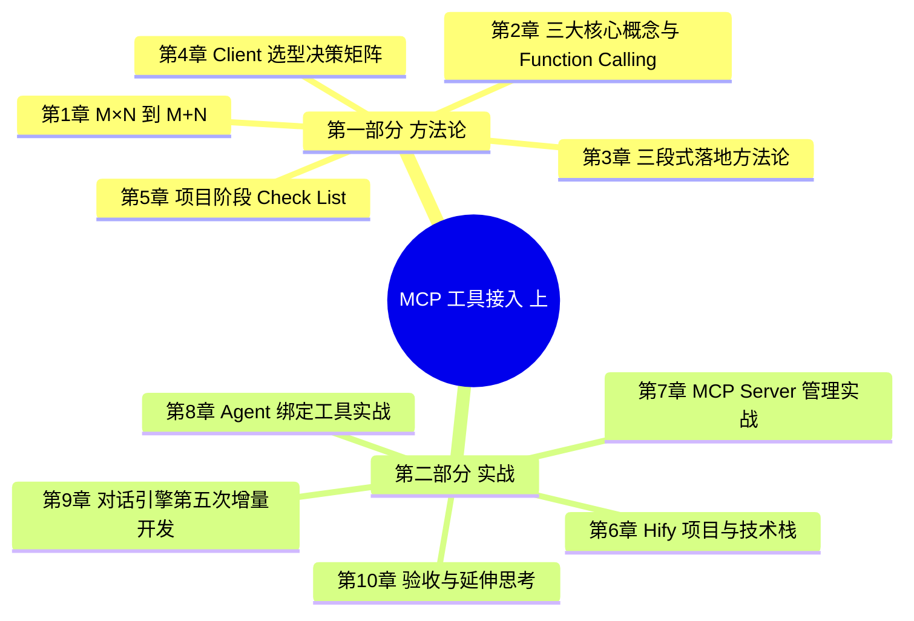
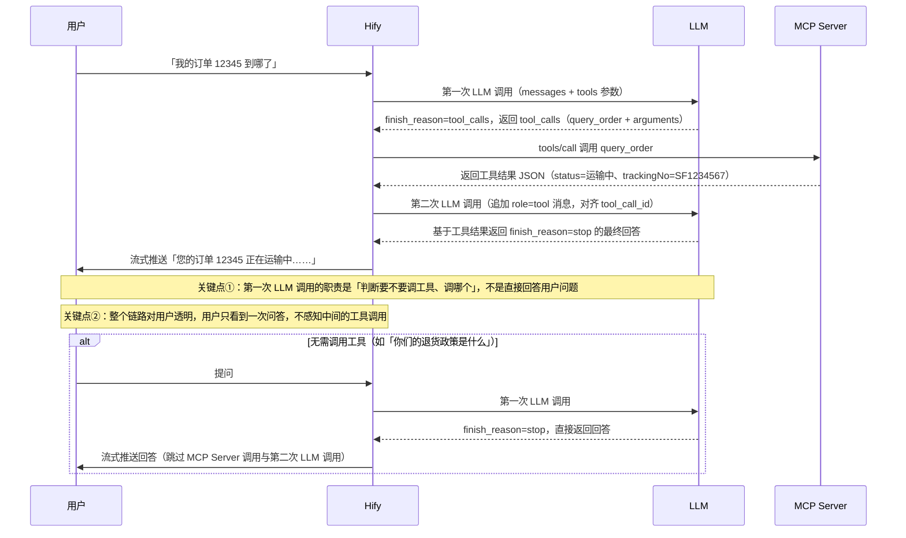

<!--
aicent-24-fea-mcp-1
AI编程方法 24：高级功能 - MCP接入（上）协议和客户端
-->

## 导读

智能客服从「能说」到「能做」，是 Agent 落地的最后一道墙：用户问「订单 12345 到哪了」只会得到一段让用户找人工的回复，用户要提换货也只能被告知拨打热线——能说话的客服不等于能办事的客服。

本系列分两篇拆解这道墙：

- 本篇聚焦 MCP 协议理解与 Client 实现，把 Hify 的 MCP 工具调用链路跑通。
- 下一篇开发真实的 MCP Server，让工具真正可调。

本篇承接前序篇章建立的 Agent、RAG、工作流能力，属于对话引擎的第五次增量开发——既不是推倒重来，也不是孤立的新功能，而是沿着已有链路再加一块拼图。

### 全文导读地图



### 阅读指南

| 读者类型    | 推荐阅读路径                     | 预期收获                             |
| ------- | -------------------------- | -------------------------------- |
| 熟练者开发速查 | 第 1~3 章 + 第 5 章 Check List | MCP 核心概念、三段式落地骨架、可勾选的 Check List |
| 熟练者做决策  | 第 1、4、5 章 + 第 9 章 9.4、9.6  | Client 选型决策矩阵、五条工程约束、增量三步走       |
| 新手系统学习  | 顺序阅读第 1~10 章               | 从协议原理到 Hify 实战完整链路               |

## 第一部分 方法论提炼

## 1. MCP 要解决的根本问题


### 1.1 「能说不能做」是 Agent 落地的最后一道墙

智能客服在前期建设里已经积累了三项能力：能聊天、能引用知识库、能走工作流做意图分类。这三项能力本质上都在「说」——基于文本生成文本，无法触达真实业务系统。

具体场景最能暴露这道墙。用户问「我的订单 12345 到哪了」，客服只会回「请联系人工客服查询」，因为它没有能力访问订单系统；用户问「帮我提交一个换货申请」，客服只会回「请拨打客服热线」，因为它没有能力操作工单系统。用户已经把意图和关键信息（订单号、诉求）都给出来了，Agent 却停在最关键的「做事」一步。

由此可以提炼一条方法论：

#### (1) Agent 落地的最后一道墙是「做事能力」
- 做什么：在对话流里加入对真实业务系统的调用能力（查订单、提工单、查库存等）。
- 怎么判断：当 Agent 的回复开始频繁出现「请联系人工」「请拨打热线」「请前往 App 操作」时，说明它停在「说」这一步、缺少「做」的链路。
- 关注什么：识别业务里哪些场景是「用户给了意图和参数、却仍需要人工兜底」的，这些就是工具接入的优先目标。
- 为什么：「能聊天」是 Agent 从「不可用」到「可用」的门槛，「能做事」才是从「能用」到「好用」的最后一道墙。

### 1.2 直接调 API 的 M×N 困境

开发者可能会想：让 Agent 直接调订单系统的 REST API 不就行了？在只对接一个系统时这是成立的，但智能客服要对接的系统远不止一个——订单、库存、工单、物流，每个系统的 API 风格都不一样：

```text
订单系统：POST /orders/query，JSON，Bearer Token
物流系统：GET /tracking?waybillNo=SF123，XML，签名验证
工单系统：GraphQL，OAuth2
库存系统：gRPC，proto 文件
```

直接对接每个系统，就要为每个系统写一套适配代码，处理不同的参数格式、认证方式、返回结构。这个困境可以拆成三个痛点：

#### (1) 适配代码爆炸
- 做什么：接一个系统写一套适配，接十个系统写十套，每次系统升级都要改调用方代码。
- 怎么判断：统计当前为对接外部系统写的适配层数量；若每接一个新系统都要新增一段「认证 + 请求构造 + 响应解析」的定制代码，就是典型的 M×N 适配。
- 关注什么：每套适配的认证方式（Bearer Token / 签名 / OAuth2）、参数格式（JSON / XML / proto）、返回结构的差异点。
- 为什么：没有标准协议时，M 个调用方 × N 个工具提供方 = M×N 套适配代码，随系统数量平方级膨胀。

#### (2) Prompt 硬编码工具清单
- 做什么：为了让 LLM 知道有哪些工具可用，开发者只能把工具清单手写进 Prompt（「你可以查订单，API 是这个，参数是那个」）。
- 怎么判断：每接一个新系统就要改 Prompt 文本，且 Prompt 里出现与具体 API 路径、参数名耦合的描述。
- 关注什么：工具清单是否随代码一起硬编码、新工具上线是否必须改 Prompt。
- 为什么：LLM 没有持久记忆，工具清单必须随每次请求下发，若没有标准化的「工具自我描述」机制，就只能由调用方人工维护，极易过期。

#### (3) 系统升级连带改 Agent
- 做什么：对方系统一升级（字段改名、接口下线、认证方式调整），调用方代码必须跟着改。
- 怎么判断：观察外部系统升级时，需要改动几个调用方的代码、改动是否扩散到对话逻辑层。
- 关注什么：升级通知机制、接口的向后兼容承诺、调用方对单一系统 API 的耦合程度。
- 为什么：在「直接调 API」模式下，工具提供方与调用方是紧耦合的，一方变动必然波及另一方。

这不是 Hify 独有的问题，所有 AI 应用都面临同样的困境。Anthropic 在 2024 年底提出了 MCP（Model Context Protocol）协议来系统性地解决它。

### 1.3 标准化协议：从 M×N 到 M+N

MCP 的解法可以一句话概括：工具提供方按 MCP 标准描述自己，调用方通过统一方式发现和调用，不需要关心每个系统的 API 细节。

这和 USB 解决的问题一样——USB 出现之前，每个外设一根专用线（鼠标用 PS/2、打印机用并口、相机用 IEEE 1394），外设与主机是 M×N 的连接关系；USB 出现之后，所有外设走同一个口。MCP 之于工具调用，就是 USB 之于外设。M 个 AI 平台 × N 个工具的 M×N 套适配代码，被压缩成 M+N 次标准接入。

| 维度 | 直接调 API（M×N） | MCP 标准化协议（M+N） |
|---|---|---|
| 平台与工具的连线数 | M×N：每个平台对每个工具写一套适配 | M+N：平台与工具各自只接协议层 |
| 工具升级影响面 | 所有调用方平台都要改 | 只改 Server，调用方平台零改动 |
| 平台升级影响面 | 改 Prompt / 适配代码影响所有工具 | 平台只动协议层接入，工具无感知 |
| 新增工具成本 | 调用方写新适配 + 改 Prompt | 配置一个 Server 地址即可 |

由此可以提炼一条方法论：

#### (1) 「多系统对接」场景优先评估标准化协议
- 做什么：当 Agent 需要对接的系统数量 ≥ 3，或工具清单需要随业务动态变化时，优先评估是否引入 MCP 这类标准化协议，而不是继续堆适配代码。
- 怎么判断：对照上表的四个维度，若每一项当前都落在「直接调 API」列，说明已经处于 M×N 失控状态。
- 关注什么：协议成熟度、生态内既有 Server 的丰富度、与现有抽象层的兼容性（这部分在第 4 章 Client 选型展开）。
- 为什么：协议层的标准化收益是数量级的（M×N → M+N），越早切换、越能避免后续适配代码的沉没成本。

## 2. MCP 三大核心概念与 Function Calling 机制

第 1 章从问题侧说明「为什么需要 MCP」，本章从概念侧讲清楚「MCP 协议由什么构成」以及「LLM 如何据此调用工具」。两个问题一次性回答完整：协议侧三大概念（Server / Client / Tool Schema）回答「谁提供、谁调用、怎么描述」；LLM 侧的 Function Calling 机制回答「LLM 怎么知道有哪些工具、怎么决定调哪个、一次对话的完整时序」。

### 2.1 三大核心概念：Server / Client / Tool Schema


MCP 协议由三个核心概念构成：MCP Server（工具提供方）、MCP Client（工具调用方）、Tool Schema（工具的标准描述）。三者关系如下表。

| 概念 | 角色 | 职责 | 示例 |
|---|---|---|---|
| MCP Server | 工具提供方 | 声明自己能做什么、需要什么参数；一个 Server 可提供多个工具 | 订单服务 MCP Server 提供 query_order 与 cancel_order 两个工具 |
| MCP Client | 工具调用方 | 发现 Server 有哪些工具（tools/list）、调用具体工具（tools/call）、处理返回结果 | Hify 即 Client |
| Tool Schema | 工具的标准描述 | 名称、说明、参数类型等，供 LLM 决定何时调哪个 | name / description / inputSchema |

#### (1) MCP Server：工具提供方

MCP Server 是工具的提供方，按 MCP 标准暴露自己的能力。一个 Server 可以提供多个工具——例如订单服务 MCP Server 同时提供 `query_order` 与 `cancel_order` 两个工具。Server 自己声明「能干什么、需要什么参数」，调用方不需要关心 Server 内部用什么语言、什么协议、什么认证方式实现。

#### (2) MCP Client：工具调用方

MCP Client 是工具的调用方，在 Hify 项目中就是 Hify 自身。Client 的职责有三条：通过 `tools/list` 发现 Server 暴露了哪些工具、通过 `tools/call` 调用具体工具、处理工具返回的结果。Client 不需要为每个 Server 写一套适配代码，所有 Server 都走统一的三条操作。

#### (3) Tool Schema：工具的标准描述

Tool Schema 是每个工具的标准描述，包含 name（名称）、description（说明）、inputSchema（参数类型结构）三个字段。LLM 通过 schema 知道有哪些工具可用、判断何时调哪个。下面是 `query_order` 工具的 schema 示例：

```json
{
  "name": "query_order",
  "description": "根据用户ID和订单号查询订单状态，当用户询问订单、物流、快递相关问题时使用",
  "inputSchema": {
    "type": "object",
    "properties": {
      "userId": {"type": "string", "description": "用户ID"},
      "orderId": {"type": "string", "description": "订单号，不知道时传空字符串"}
    },
    "required": ["userId"]
  }
}
```

##### ① 工具自描述是标准化的关键

Tool Schema 的本质是「工具自描述」：调用方不需要关心提供方的内部细节（语言、框架、认证方式），只需要按 schema 调用即可。这正是 MCP 把 M×N 适配降为 M+N 接入的根本机制——所有差异化都被 Server 自己消化在标准描述里，对调用方呈现的是统一接口。

##### ② 与直接调 API 的核心区别

直接调 API 是调用方去适配对方；用 MCP 是对方按标准描述自己、调用方用统一方式调用。Hify 不需要知道订单系统用什么格式，只需要知道有一个 `query_order` 工具、需要什么参数。


<!--
图片内容说明
路径：imgs/aicent-24-fea-mcp-1.md/bb4b6ce4a93d2fa5dbd95ffb188bb48b_MD5.jpg
用途：用前后对比图（Before / After）直观说明 MCP 协议如何把「M 个 AI 平台 × N 个工具 = M×N 套适配代码」的集成复杂度降为「M+N」，类比 USB 标准化解决的价值。
内容：图分左右两半。
- 左半（Before MCP / 无标准协议）：左侧 M 个 AI 平台（Claude、Cursor、Hify、ChatGPT、Cline 等）与右侧 N 个工具（订单系统、库存系统、工单系统、Stripe、GitHub、数据库等）两两连线，形成密集的网状交叉（M×N 条线），线条混乱拥挤，标注「每个平台 × 每个工具 = 一套适配代码」。
- 右半（After MCP / 引入标准协议）：左侧同样的 M 个平台与右侧同样的 N 个工具，中间多了一个「MCP 协议」枢纽（标准化的工具描述与调用层）。平台只需接 MCP 协议（M 条线进枢纽），工具只需按 MCP 标准暴露（N 条线出枢纽），总连线数 = M + N，标注「工具开发者写一个 Server，任何支持 MCP 的平台都能接」。
- 底部对比标注：左图「M × N 套适配代码，每次工具升级所有平台都要改」；右图「M + N 次接入，工具升级只改 Server，平台零改动」。
类比说明：这和 USB 标准化解决的问题一样——之前每个外设一根专用线，之后所有外设走同一个 USB 口。
-->

### 2.2 业界真实案例：Stripe MCP Server

MCP 不是新概念，业界已经有大量真实在用的 MCP Server。以智能客服场景直接相关的 Stripe 为例：Stripe 官方发布了 Stripe MCP Server，提供了一系列工具。

```text
stripe_retrieve_payment_intent  根据支付ID查询支付详情
stripe_create_refund            发起退款
stripe_list_customers           查询客户列表
stripe_retrieve_invoice         查询账单详情
stripe_cancel_subscription      取消订阅
```

任何一个 AI 应用接入了 Stripe MCP Server，Agent 就能直接查支付记录、发起退款——不需要写一行对接 Stripe API 的代码，不需要处理 Stripe 的认证和参数格式，只需要在配置里加一个 Server 地址。用户问「上周的那笔支付是多少钱」，Agent 调 `stripe_retrieve_payment_intent` 拿到数据、直接回答；Stripe 升级接口，改 MCP Server 即可，Hify 不用动。

#### (1) 接入新 Server 不改 Agent 代码

给 Agent 接一个新的 MCP Server，不需要改 Agent 代码，Agent 自动发现新工具——这是标准化协议最核心的价值，即「工具和平台解耦」。对智能客服而言，这个价值最大：客服要对接的系统最多（订单、库存、工单、物流），每个都可以有 MCP Server，接入只需配置 Server 地址。

### 2.3 Function Calling：LLM 如何选工具与调工具


三大概念讲清了「工具怎么提供、怎么调用」，剩下的核心问题是：LLM 本质上只能输入文本、输出文本，它怎么知道有哪些工具可用？怎么决定什么时候调工具、调哪个、传什么参数？答案就是 Function Calling。

Function Calling 是一种约定：LLM 的输出文本里，有时候不是给用户看的回答，而是一个结构化的「我要调这个函数、传这些参数」的指令。LLM 自己不执行任何函数，它只是「说」想调什么——真正的函数执行由 Agent 框架（即 Hify）通过 MCP Client 完成。

#### (1) 工具定义随每次请求下发

LLM 怎么知道有哪些工具可用？答案是工具定义随每次请求一起发过去——不是持久记忆，是每次都告知。每次对话请求都会带上 `tools` 参数，列出当前 Agent 可调用的全部工具及其 schema：

```json
{
  "messages": [{"role": "user", "content": "我昨天下的订单还没到"}],
  "tools": [
    {
      "type": "function",
      "function": {
        "name": "query_order",
        "description": "查询订单状态，当用户询问订单、物流、快递相关问题时使用",
        "parameters": {... }
      }
    }
  ]
}
```

#### (2) description 决定工具选择准确率

LLM 怎么决定调哪个工具？靠 description 字段。LLM 读到「我昨天下的订单还没到」，判断这是订单问题；`query_order` 的 description 写着「用户询问订单相关问题时使用」，场景匹配，调它。

##### ① description 是 MCP 工具开发最重要的地方

description 写得好不好，直接决定 LLM 选工具的准确率。这是 MCP 工具开发里最重要的地方，没有之一。开发一个 MCP 工具时，最该花时间打磨的不是参数结构，而是 description——要写清楚「这个工具做什么、什么场景下应该选它」，让 LLM 能精准匹配用户意图，避免误调或漏调。

#### (3) 两次 LLM 调用完成一次工具问答

一次用户对话如果需要调工具，完整流程涉及两次 LLM 调用。第一次 LLM 调用，LLM 判断需要调工具，返回的不是回答，而是工具调用指令：

```json
{
  "finish_reason": "tool_calls",
  "message": {
    "tool_calls": [{
      "id": "call_abc123",
      "function": {
        "name": "query_order",
        "arguments": "{\"userId\": \"u001\", \"orderId\": \"12345\"}"
      }
    }]
  }
}
```

Hify 拿到指令，通过 MCP Client 调订单服务，拿到真实数据，把结果作为 `role=tool` 消息追加进对话历史（注意 `tool_call_id` 必须与第一次 LLM 返回的 id 对齐）：

```json
{"role": "tool", "tool_call_id": "call_abc123",
 "content": "{\"status\":\"运输中\",\"trackingNo\":\"SF1234567\",\"estimatedDate\":\"明天\"}"}
```

第二次 LLM 调用，LLM 基于工具结果生成最终回答，`finish_reason` 变成 `stop`，这次输出才是真正给用户看的回答。

##### ① 无工具场景直接 finish_reason=stop

如果用户问的是不需要查数据的问题（例如「你们的退货政策是什么」），LLM 第一次调用直接返回 `finish_reason=stop`，没有工具调用，没有第二次 LLM 调用。LLM 自己判断要不要调工具，不是硬编码逻辑。

### 2.4 完整调用时序

下面用 Mermaid 时序图重绘图 2，把「用户 / Hify / LLM / MCP Server」四个角色的完整交互一次讲清楚。



#### (1) 工具调用循环次数由 LLM 决定

原文提到一个重要边界：循环次数由 LLM 决定，不是固定的。理论上 LLM 可以连续调多个工具（先查订单再查物流），Agent 框架一般设置最大轮次（如 10 次）防止死循环。这是落地时必须考虑的安全网——既给 LLM 留足多步推理的空间，又避免异常情况下工具调用失控。


<!--
图片内容说明
路径：imgs/aicent-24-fea-mcp-1.md/d61d94592dddc61a7832cbb2e7508cdc_MD5.jpg
用途：用时序图（Sequence Diagram）展示 Function Calling 完整交互流程——一次用户对话涉及两次 LLM 调用 + 一次 MCP 工具调用，帮助读者建立全局视角。
内容：时序图含 4 条垂直泳道，从左到右依次为：用户、Hify（智能客服平台）、LLM、MCP Server（工具提供方）。按时间从上到下的消息流：
1. 用户 → Hify：「我的订单 12345 到哪了」（用户提问）。
2. Hify → LLM：第一次 LLM 调用，请求体含 messages（对话历史）+ tools（query_order 工具 schema）。
3. LLM → Hify：返回 finish_reason=tool_calls，附 tool_calls（name=query_order、arguments={userId, orderId}）——这是「LLM 想调什么」，不是给用户的回答。
4. Hify → MCP Server：通过 MCP Client 调用 query_order 工具（tools/call）。
5. MCP Server → Hify：返回工具结果 JSON（status=运输中、trackingNo=SF1234567）。
6. Hify → LLM：第二次 LLM 调用，把工具结果作为 role=tool 消息追加进对话历史（对应 tool_call_id）。
7. LLM → Hify：基于工具结果生成最终回答（finish_reason=stop）。
8. Hify → 用户：流式推送最终回答「您的订单 12345 正在运输中……」。
时序图右侧标注两个关键点：① 第一次 LLM 调用的职责是「判断要不要调工具、调哪个」，不是直接回答；② 整个链路对用户透明，用户只看到一次问答。底部注释：若 LLM 判断不需要调工具，第一次调用直接 finish_reason=stop，跳过 4-6 步，没有第二次 LLM 调用。
-->

## 3. MCP 工具接入项目落地方法论

协议与选型确定后，落地一个 MCP 工具接入能力可以拆成三段递进的工作。本章把原文「动手实现」一节抽象为与具体技术栈无关的方法论，让读者在自己的项目里能照搬这套骨架——技术细节（URL、SQL、Java 代码）留到第二部分再下沉。

### 3.1 三段式落地骨架


一句话总览：**Server 管理 → Agent 绑定工具 → 接入对话引擎**。三段依次推进，前一段是后一段的依赖：先有 Server 与工具清单，Agent 才有可绑的对象；Agent 绑好工具，对话引擎才能在运行时加载并调用。

| 阶段 | 核心动作 | 产出物 | 与既有模式的复用关系 |
|---|---|---|---|
| Server 管理 | CRUD + 连通性测试（`tools/list`）+ 启用禁用 | `mcp_server` 表 + `mcp_tool` 表（工具清单落库） | 与「Provider 管理」同模式（第 12 篇） |
| Agent 绑定工具 | 多对多绑定 + 全量替换语义 + 校验 | `agent_tool` 关联表 | 全新表，但绑定接口模式可参照既有资源绑定 |
| 接入对话引擎 | 加载工具 → 注入 `tools` 参数 → 两次 LLM 调用 | ChatService 第五次增量改动 | 第 16 篇以来基础链路、上下文、RAG、工作流的延续 |

这张表的第四列是关键：MCP 工具接入并非推倒重来，而是沿着一贯的增量开发节奏再叠一层。Server 管理复用第 12 篇 Provider 管理的整套模式；对话引擎的改动收敛在第 16 篇以来已搭好的基础链路之上，只是第五次增量。

### 3.2 第一段：MCP Server 管理（CRUD + 连通性 + 启用禁用）

MCP Server 管理与 Provider 管理是同一套模式：CRUD + 连通性测试 + 启用禁用。两者的唯一区别在于连通性测试调的是 MCP 的 `tools/list`，而非 Provider 的 `/v1/models`——CRUD 逻辑、关联校验、启用禁用完全一样。因此这一段的工作量几乎都花在「拉工具清单并落库」这一步上。

#### (1) 管理接口的标准化清单

Server 管理对外暴露 6 个标准接口，职责如下（URL 与表结构留到第二部分第 7 章下沉）：

- **创建**：登记一个 MCP Server，含名称、endpoint、启用状态。
- **分页查询列表**：供管理界面渲染 Server 列表。
- **查询详情（含工具列表）**：详情接口必须把该 Server 下的工具清单一并返回，因为管理界面要直接看到「这个 Server 提供了哪些工具」。
- **更新**：修改名称、endpoint、启用状态。
- **逻辑删除**：软删除，保留审计。
- **连通性测试**：实际连一次 MCP Server，拉工具清单。

前 5 个接口与 Provider 管理一一对应，最后一个接口是 MCP 特有的增量。

#### (2) 连通性测试 = 拉工具清单 + 持久化

连通性测试不是简单地 ping 一下，而是要完成「拉 + 存」两件事：

- **拉**：用 MCP Client 调一次 `tools/list`，拿到 Server 当前提供的所有工具。
- **存**：成功则把每个工具的 `name`、`description`、`inputSchema` 写入 `mcp_tool` 表；失败则返回错误信息。

为什么一定要把工具清单落库？因为 `description` 与 `inputSchema` 是 LLM 选工具的依据（见第 2 章 Function Calling 一节），如果每次对话都远程拉一遍工具清单，既慢又不稳定。落库之后，对话引擎直接从本地表读工具 Schema，不再依赖 Server 实时可用。

#### (3) 删除前的关联校验

删除 Server 之前必须做关联校验：**只要还有 Agent 绑定了该 Server 提供的工具，就拒绝删除**。这一步防止「悬空引用」——Server 删了但 `agent_tool` 关联表里还指向已不存在的工具，对话引擎加载时会报错。

### 3.3 第二段：Agent 与工具的绑定关系

工具落到 `mcp_tool` 表后，下一步是建立 Agent 与工具的绑定关系。这是一张全新的多对多关联表，但绑定接口的语义可以参照既有的资源绑定模式。

#### (1) 多对多绑定表设计三要点

##### ① agent_id + tool_id 联合唯一约束

关联表上必须有 `UNIQUE KEY (agent_id, tool_id)`，从数据层防止同一个工具被同一个 Agent 重复绑定。唯一约束是最后一道闸——即使上层接口逻辑出错，重复数据也写不进库。

##### ② 全量替换语义

绑定接口每次传入完整的 `toolId` 数组，后端按「全量替换」处理：先清掉该 Agent 既有绑定，再按新数组整体写入。全量替换带来两个好处：一是接口幂等，重复调用结果一致；二是前端不需要做「新增哪些、删除哪些」的 diff，传最新期望即可。

##### ③ 绑定时校验工具存在且对应 Server 启用

写入绑定前要校验两点：工具在 `mcp_tool` 表里真实存在；该工具所属的 MCP Server 处于启用状态。校验不过则拒绝绑定并返回明确错误。这避免了「绑了一个已被禁用的 Server 的工具」这类配置错误。

#### (2) 工具数量上限

单个 Agent 绑定的工具数必须有上限（原文取值为 10）。原因在于工具 Schema 会随每次请求拼进 `tools` 参数发给 LLM，工具越多、`description` 越长，`tools` 参数就越膨胀，既推高 token 成本，也可能稀释 LLM 的注意力、降低选工具的准确率。设一个硬上限是给「越多越好」的本能踩一脚刹车。

### 3.4 第三段：接入对话引擎（两次 LLM 调用闭环）

这是对话引擎的第五次增量开发。改动范围收敛在两处：拼接上下文（把 Tool Schema 拼进去）和 LLM 调用（判断 `finish_reason`、处理 `tool_calls`）。下面的流程图还原了加进 MCP 工具调用之后，一次对话的完整执行路径与分支决策。


<!--
flowchart TD
    A[用户消息进入 ChatService] --\> B{workflowId 不为空?}
    B -- 是 --\> C[走既有工作流分支，不进入工具逻辑]
    B -- 否 --\> D[拼接上下文<br/>system + 历史 + RAG 结果 + Tool Schema ★]
    D --\> E[第一次 LLM 调用]
    E --\> F{finish_reason = tool_calls?}
    F -- 是 --\> G[MCP 工具调用]
    G --\> H[结果注入：role=tool 消息对应 tool_call_id]
    H --\> I[第二次 LLM 调用]
    F -- 否 --\> J[原有流式推送]
    I --\> J
    J --\> K[流式推给用户 SseEmitter]
    C --\> K
-->

图中的 ★ 标记 `Tool Schema` 是本次新增的一块上下文。把流程图拆成六步逻辑要点：

#### (1) 加载 Agent 绑定的工具

从 `agent_tool` 关联 `mcp_tool` 表，拿到该 Agent 绑定的所有工具的 `name`、`description`、`inputSchema`。

#### (2) 工具列表不为空才注入 tools 参数

只有上一步加载到的工具列表非空，才把 Tool Schema 拼进上下文、并在第一次 LLM 调用里带上 `tools` 参数；列表为空则整段逻辑短路，与原有流程完全一致。

#### (3) 第一次 LLM 调用后判断 finish_reason

拿到第一次 LLM 的返回后，按 `finish_reason` 分流：`tool_calls` 走工具调用分支，`stop` 走原有流式推送。

#### (4) 解析 tool_calls

从第一次返回里解析出工具名与 `arguments` JSON，再从 `mcp_tool` 表查出该工具所属的 `mcpServerId`，交给 MCP Client 执行实际调用。

#### (5) 追加 role=tool 消息（对齐 tool_call_id）

工具结果作为一条 `role=tool` 的消息追加进对话历史，且必须对齐第一次 LLM 返回的 `tool_call_id`——这是 LLM 把「调用—结果」配对识别的依据。

#### (6) 第二次 LLM 调用流式推送

带着工具结果发起第二次 LLM 调用（流式），把基于工具结果生成的最终回答推给用户。

### 3.5 五条不可破的工程约束


接入对话引擎时，有五条约束必须在代码评审阶段逐条核对。它们不是为了限制功能，而是为了把增量改动控制在「只增不改、不伤原有路径」的安全边界内。

#### (1) 工具列表为空时与原逻辑一行不改

如果 Agent 没绑任何工具，对话流程必须和接入 MCP 之前**完全一致、一行不改**。这是增量开发的铁律——新功能不能以破坏已有路径为代价。落到代码上，工具加载与 `tools` 参数注入必须用「列表不为空」做前置判断，空列表直接走老路。

#### (2) RAG 与工具调用共存

同一个 Agent 既可以绑知识库（走 RAG），也可以绑工具（走 Function Calling），两套机制不冲突。为什么必须共存？因为实际业务里一个 Agent 往往既需要查内部文档、又需要调外部系统，强行二选一会逼着业务方拆 Agent。落到实现上，`system prompt` 里 RAG 检索结果和 Tool Schema 是两块独立内容，各拼各的。

#### (3) 工作流分支不进入工具逻辑

当 `workflowId` 不为空时，对话引擎在入口处就 `return` 走既有工作流分支，整段工具逻辑都不进入。工作流模式与工具调用模式互斥——工作流是「编排好的固定流程」，工具调用是「LLM 自主决策」，两者混在一起会让行为不可预测。

#### (4) 工具调用失败把错误回传给 LLM 而非抛异常

工具调用抛错时（网络超时、Server 不可用、参数非法），不要把异常往上抛中断对话，而是把错误信息包成一条 `role=tool` 的消息回传给 LLM，让 LLM 用自然语言告诉用户「这个工具暂时用不了 / 换个问法」。这样做的原因是：对话场景下「软失败 + 自然语言兜底」的体验，远好于「硬失败 + 报错中断」。

#### (5) Controller 与 SseEmitter 管理不动

所有改动收敛在 Service 层的上下文拼接与 LLM 调用两处，Controller 层、SseEmitter 的创建与推送管理一行不动。改动面越小、回归风险越低——SseEmitter 的生命周期管理一旦动了，流式推送、超时、断连重连这些既已稳定的逻辑都要重测。

## 4. MCP Client 选型方法论


协议层清楚了，下一个问题是 Client SDK 怎么选。本节把这次选型的思考过程抽象成一套可复用的方法论：先列评估维度，再用 Java 生态三个候选项做决策矩阵示范，最后给出三条决策原则。

### 4.1 选型评估的五个维度

选型不是看 GitHub Star 数，而是按固定维度逐项打分。以下五个维度适用于任何协议层 SDK 的选型：

- **成熟度**：是否经过生产验证、版本号是否稳定。Beta 阶段迭代快但 API 可能随时变，1.x 稳定版更适合长期项目。
- **文档质量**：是否有完整 API 文档与可运行示例。只有 README 没有 Javadoc 的 SDK，接入阶段会反复踩坑。
- **与现有技术栈兼容性**：是否强绑定某个框架。强绑定意味着要么接受整套抽象，要么做适配层，两者都有成本。
- **维护方**：官方还是社区、迭代活跃度。官方维护通常跟着协议演进，社区维护可能随时停更。
- **已知坑**：调研时必问「有没有已知问题」。知道坑在哪，比知道怎么用更重要——很多坑不会写在 README 里，只在 Issue 列表和源码注释里。本次选型的最大收获不是选了哪个 SDK，而是提前发现了 HttpClientSseClientTransport 的资源泄漏 issue。

### 4.2 Java 生态三选项决策矩阵

Java 生态主流的 MCP Client SDK 有三个实质选项。


<!--
图片内容说明
路径：imgs/aicent-24-fea-mcp-1.md/8353fa0fa13acec0b370cfa04880bc9c_MD5.jpg
用途：用对比表横向比较 Java 生态三款主流 MCP Client SDK（官方 SDK / Spring AI MCP / Quarkus MCP），作为 Hify 选型决策的依据。
内容：表格 6 行 × 3 列（数据行），头从左到右为「SDK / 成熟度 / 文档质量 / 与 Spring 生态兼容性 / 维护方 / 备注」。
① 官方 Java SDK（io.modelcontextprotocol.sdk:mcp:1.1.1，Anthropic 维护）：成熟度「稳定但偏底层」；文档质量「中等，偏协议层」；兼容性「不绑定框架，最灵活」；备注「只做协议序列化/反序列化，连接管理自己写」——✅ 本次推荐项。
② Spring AI MCP（spring-ai-mcp）：成熟度「Beta，迭代快」；文档质量「较好，Spring 官方背书」；兼容性「强绑定 Spring AI 全家桶（ChatClient/ChatModel/ToolCallback）」；备注「适合全新 Spring AI 项目，不适合已有自研 LLM 体系」。
③ Quarkus MCP（quarkus-mcp-server）：成熟度「较新」；文档质量「中等」；兼容性「绑定 Quarkus，非 Spring 友好」；备注「面向 Quarkus 生态，与 Hify（Spring Boot 3.2.3）技术栈不匹配」。
表格下方结论：Hify 已有自研 ProviderAdapter/LlmHttpClient/ChatServiceImpl，引入 Spring AI MCP 会形成两套抽象摩擦；官方 SDK 最轻量、最贴合 Hify 现有风格，故选用官方 SDK。
-->

下表按五个维度横向对比（结论列标出本次选型结果）：

| SDK | 成熟度 | 文档质量 | 与 Spring 生态兼容性 | 维护方 | 备注 | 结论 |
|---|---|---|---|---|---|---|
| 官方 Java SDK（io.modelcontextprotocol.sdk:mcp:1.1.1） | 稳定但偏底层 | 中等，偏协议层 | 不绑定框架，最灵活 | Anthropic | 只做协议序列化/反序列化，连接管理自己写 | **推荐项** |
| Spring AI MCP（spring-ai-mcp） | Beta，迭代快 | 较好，Spring 官方背书 | 强绑定 Spring AI 全家桶（ChatClient/ChatModel/ToolCallback） | Spring | 适合全新 Spring AI 项目，不适合已有自研 LLM 体系 | 不采用 |
| Quarkus MCP（quarkus-mcp-server） | 较新 | 中等 | 绑定 Quarkus，非 Spring 友好 | 社区 | 面向 Quarkus 生态，与 Hify（Spring Boot 3.2.3）技术栈不匹配 | 不采用 |

结论：选用官方 Java SDK。

### 4.3 决策原则：避免两套抽象互相摩擦

决策矩阵给出了对比，但真正的判断标准藏在三条原则里。

#### (1) 已有自研抽象时，警惕「全家桶」

Hify 已经有自己的一套 LLM 抽象层：ProviderAdapter 适配各 LLM、LlmHttpClient 做 HTTP 通信、ChatServiceImpl 管对话流程。引入 Spring AI MCP 会形成两套抽象互相摩擦，具体代价有三条：

1. **引入整个 spring-ai-bom**：依赖体积急剧膨胀，后续升级被 Spring AI 的发布节奏绑架。
2. **工具调用结果要适配 ToolCallback 接口**：和现有 ProviderAdapter 产生摩擦，需要在两套接口之间做转换层。
3. **Spring AI 1.1 → 2.0 API 变化剧烈**：升级成本高，Beta 阶段的 SDK 不适合写进长期项目的核心链路。

两套抽象互相摩擦，不值得。「全家桶」式 SDK 只适合从零起步的项目，不适合已有自研体系的存量项目。

#### (2) 优先选只做协议层的轻量 SDK

官方 Java SDK 只做一件事：实现 MCP 协议的序列化/反序列化和请求响应。它不绑定任何 AI 框架，剩下的连接管理、异常处理、工具结果转换全部按 Hify 现有风格写。这种「薄」SDK 是存量项目接入新协议的最佳形态——它只负责协议层，不入侵业务层。

依赖坐标如下：

```xml
<dependency>
    <groupId>io.modelcontextprotocol.sdk</groupId>
    <artifactId>mcp</artifactId>
    <version>1.1.1</version>
</dependency>
```

#### (3) 已知坑与规避

官方 SDK 有一个已知的资源泄漏 issue：HttpClientSseClientTransport 每次 build 一个新的 HttpClient 实例，没有正确关闭。如果长期持有 client 对象或在循环里反复 build，文件描述符和连接会泄漏，最终拖垮进程。

规避方式有三条：

1. **按调用创建**：每次工具调用新建 client，不复用单例。
2. **用完关闭**：用 try-with-resources 包裹，确保退出时自动 close。
3. **不长期持有 client 对象**：禁止把 client 放进静态字段或 Spring 单例 Bean 的成员变量长期缓存。

推荐的写法是用 try-with-resources 短生命周期持有：

```java
try (McpSyncClient client = buildClient(server.getEndpoint())) {
    client.initialize();
    return client.callTool(new CallToolRequest(toolName, arguments));
}
```

这种写法保证每次调用结束 client 就被关闭，HttpClient 资源随之释放，从根上规避泄漏 issue。

## 5. MCP 工具接入项目阶段 Check List


### 5.1 使用说明

本章把前三章的方法论拆成一张可勾选、可裁剪的 Check List，覆盖从协议选型到上线验收的完整生命周期。使用方式有两条：一是**按阶段裁剪**——团队处在选型期就只勾 5.2，进入开发期再补 5.3~5.5，验收期用 5.6 收尾，横切关注点 5.7 全程对照；二是**逐条验证**——每条都是一个可执行的动作或可观测的决策结果，不写「重视质量」「加强管理」这类虚词，验收时要么拿出产物（矩阵表、issue 链接、SQL DDL、curl 输出），要么给出明确的「是/否」结论。下面 6 张表格各可独立裁剪，团队可按实际进度摘取对应小节。

### 5.2 协议与选型阶段

| 序号 | 检查项 | 验证方式 |
|---|---|---|
| 1 | 已识别项目中的 M×N 集成痛点（多系统 API 格式差异导致 N 个 Agent × M 套 SDK 的维护爆炸） | 列出待对接系统及其 API 风格清单（REST / GraphQL / gRPC / 私有协议），标注每个系统原本需要单独写的对接代码量 |
| 2 | 能用一句话向团队解释 MCP 三大核心概念（Server / Client / Tool Schema）的职责边界 | 在团队 Wiki 或 RFC 文档中写下三句话定义，且明确「Server 暴露工具、Client 负责协议通信、Tool Schema 是 LLM 选工具的契约」 |
| 3 | 已完成 Client 选型决策矩阵，覆盖 5 个评估维度（成熟度 / 文档质量 / 技术栈兼容性 / 维护方 / 已知坑）且至少 3 个候选 SDK | 输出选型矩阵表，每行一个 SDK，每列一个维度，最后一列标注推荐项与一句话理由 |
| 4 | 已记录所选 SDK 的已知坑（issue 链接 / 资源泄漏点 / API 不稳定点）并给出规避方案 | 每个 SDK 至少附 1 条 issue 链接或坑描述，并写出规避写法（如「HttpClient 按调用创建、用完关闭、不长期持有」） |
| 5 | 已确认所选 SDK 与既有自研抽象无「两套抽象互相摩擦」 | 给出书面说明：SDK 只做协议层（序列化/反序列化），连接管理、重试、超时沿用现有 LlmHttpClient / ChatServiceImpl 风格，不引入 SDK 的全家桶 |
| 6 | 选型结论已写入架构决策记录（ADR）并由 Tech Lead 评审签字 | ADR 文档存在，含选型矩阵截图、推荐结论、替代方案对比，有评审记录 |

### 5.3 Server 管理阶段

| 序号 | 检查项 | 验证方式 |
|---|---|---|
| 1 | Server 管理 CRUD 6 个接口齐全：创建 / 列表 / 详情（含工具列表）/ 更新 / 逻辑删除 / 连通性测试 | 用 Postman 或 curl 逐一调通 6 个接口，响应码与返回体符合接口契约 |
| 2 | 连通性测试接口真实调用 MCP `tools/list`，并把返回的 `name` / `description` / `inputSchema` 三字段落库 | 连通性测试成功后查 `mcp_tool` 表，能看到对应的工具记录，三字段非空且与 Server 返回一致 |
| 3 | 删除 Server 前做关联校验：被任何 Agent 绑定的 Server 不可删（或先解绑再删） | 对一个已被 Agent 绑定的 Server 调删除接口，返回 409 或业务错误码，提示「存在关联工具，请先解绑」 |
| 4 | Server 表存在启用 / 禁用状态字段（`status` 或 `enabled`），且禁用状态的 Server 在对话时不加载其工具 | 把某 Server 置为禁用后，触发一次对话，抓 LLM 请求体确认其下工具未出现在 `tools` 数组中 |
| 5 | 失败路径（Server 不可达 / `tools/list` 返回异常 / 入参非法）返回结构化错误信息，不吞异常 | 构造一个地址错误的 Server 调连通性测试，返回体含错误码 + 错误描述 + 时间戳，且服务端日志有完整堆栈 |
| 6 | Server 管理操作有审计日志（谁在何时创建 / 修改 / 删除了哪个 Server） | 查审计表或日志，能看到操作人、时间、Server ID、操作类型四要素 |

### 5.4 Agent 绑定阶段

| 序号 | 检查项 | 验证方式 |
|---|---|---|
| 1 | `agent_tool` 关联表存在 `UNIQUE KEY (agent_id, tool_id)`，防止同一 Agent 重复绑定同一工具 | 查 DDL 文件确认唯一索引存在；用 SQL 故意插入重复行，数据库抛唯一约束异常 |
| 2 | 绑定接口采用「全量替换」语义：传入新工具 ID 列表后，旧绑定全量覆盖，接口幂等 | 对同一 Agent 连续两次传入相同工具列表，绑定表行数不变；传入更短的列表后，被移除的工具绑定记录消失 |
| 3 | 单 Agent 绑定的工具数有上限（默认 10），超过上限拒绝绑定并给出明确提示 | 尝试给一个 Agent 绑定 11 个工具，接口返回错误码，提示「单 Agent 工具数上限为 10」 |
| 4 | 绑定时校验 `toolId` 存在且其所属 Server 处于启用状态，否则拒绝绑定 | 传入一个被逻辑删除或 Server 已禁用的 toolId，接口返回 400 或业务错误码 |

### 5.5 对话引擎接入阶段

| 序号 | 检查项 | 验证方式 |
|---|---|---|
| 1 | 对话开始时按 `agentId` 加载其绑定的工具列表（从 `agent_tool` 关联 `mcp_tool` 取） | 打断点或加日志，确认进入对话流程时工具列表已查到，且字段含 `name` / `description` / `inputSchema` |
| 2 | 仅当工具列表不为空时才向 LLM 请求体注入 `tools` 数组；为空时走原有纯对话路径，请求体无 `tools` 字段 | 抓无工具 Agent 的 LLM 请求体，确认无 `tools` 字段；抓有工具 Agent 的请求体，确认 `tools` 数组存在 |
| 3 | 正确判断 `finish_reason`：值为 `tool_calls` 时进入工具调用分支，值为 `stop` 时直接返回最终回答 | 对同一 Agent 分别问「需要调工具」和「不需要调工具」的问题，日志显示分支走向正确 |
| 4 | 能正确解析 LLM 返回的 `tool_calls` 数组，提取 `id` / `function.name` / `function.arguments` | 日志打印解析结果，三字段非空且 `arguments` 能被 JSON 反序列化为对应工具的入参对象 |
| 5 | 工具执行结果以 `role=tool` 消息追加回 messages，且 `tool_call_id` 与 LLM 返回的 `id` 严格对齐 | 抓第二次 LLM 调用的请求体，messages 数组末尾存在 `role=tool` 消息，其 `tool_call_id` 与上一步解析的 `id` 相等 |
| 6 | 第二次 LLM 调用走流式推送（SSE / SseEmitter），最终回答逐 token 返回前端 | 前端 EventSource 能收到多次 data 事件，最终拼接出完整回答；Network 面板显示 chunked transfer |
| 7 | 五条工程约束全部满足：(a) 工具列表为空时与原逻辑完全一致；(b) RAG 场景下 RAG 与工具共存不冲突；(c) 走工作流的 `workflowId` 分支不进入工具调用逻辑；(d) 工具执行失败时把错误回传 LLM 由其自行决策，不抛异常中断流程；(e) Controller 与 SseEmitter 代码未改动 | 逐一构造对应场景回归测试，五条全部通过；diff 对比确认 Controller 与 SseEmitter 类无改动 |

### 5.6 验收与回归阶段

| 序号 | 检查项 | 验证方式 |
|---|---|---|
| 1 | 不绑工具的 Agent 原有逻辑（RAG 检索、工作流编排）全部回归通过，无回归缺陷 | 跑原有 Agent 的回归用例集，通过率 100%，无新增 failed 用例 |
| 2 | 绑工具的 Agent 面对「需要调工具的问题」（如「查订单 A001 的状态」）能正确触发 Function Calling 并返回含真实数据的回答 | 对话测试，回答中包含来自工具的真实订单数据，日志显示完整的「LLM 调工具 → 执行 → 二次调用」链路 |
| 3 | 绑工具的 Agent 面对「不需要调工具的问题」（如「解释一下订单状态字段的含义」）LLM 正确判断不调工具，无误调 | 对话测试，日志显示 `finish_reason=stop`，全程无 `tool_calls`；回答基于 LLM 自身知识或 RAG 上下文 |
| 4 | 纯问候（如「你好」「在吗」）走原有最短路径，不进入工具加载与 Function Calling 分支 | 对话测试，响应延迟与改造前持平，日志显示未触发工具加载查询 |
| 5 | curl 闭环验收通过：创建 Server → 连通性测试 → 绑定工具 → 三种对话场景（需调工具 / 不需调工具 / 纯问候）全链路跑通 | 一份 curl 脚本按顺序执行上述步骤，每步返回符合预期，可作为上线前的冒烟测试脚本 |

### 5.7 横切关注点

| 序号 | 检查项 | 验证方式 |
|---|---|---|
| 1 | 每个工具的 `description` 写得足够清晰（含用途、适用场景、参数语义），是 LLM 选工具准确率的关键 | 抽查至少 5 个工具的 description，能用一句话说清「这个工具做什么、什么时候该选它」；对模糊 description 的工具做 LLM 选工具准确率测试，准确率应随 description 优化而提升 |
| 2 | 工具调用循环设有轮次上限（默认 10），防止 LLM 反复调工具形成死循环 | 代码中存在轮次计数器与上限判断；构造一个会诱导 LLM 反复调工具的场景，达到 10 轮后流程强制终止并返回兜底回答 |
| 3 | 安全：已评估提示词注入风险（用户输入诱导 LLM 调用不该调的工具，如「帮我删除所有订单」诱导调用删除工具），并在应用层做权限控制（工具级鉴权 / 敏感工具白名单 / 危险操作二次确认） | 列出敏感工具清单及其对应的权限控制策略；用诱导性 prompt 攻击测试，敏感工具被正确拦截或要求二次确认（此条呼应第 10 章延伸思考题第三题） |


## 第二部分 实战演示

## 6. 实战背景：Hify 项目与技术栈


### 6.1 业务场景

第一部分讲清楚了「为什么需要 MCP、协议长什么样、Client 怎么选」，第二部分回到 Hify 自身——把这套能力长到现有的工程骨架里。Hify 的定位是智能客服平台，核心痛点不是「让 LLM 会说话」，而是「让 LLM 会做事」。

具体到业务，用户在客服窗口里最常问的三类问题都跳不开外部系统：查订单到哪了、查某款商品还有多少库存、把一次失败的售后申请提单流转给人工。纯对话模式（第 1 章 1.1 节所讲的「能说不能做」）答不了这三类问题——LLM 没有 API 调用能力，只能泛泛而谈。本篇要解决的就是这个断层：让 Hify 里的 Agent 通过 MCP 协议拿到「查订单、查库存、提工单」这些真实动作的能力。

### 6.2 项目与技术栈一览

Hify 是一个 Java 后端项目，已有的 LLM 体系、模块骨架和数据表都在持续演进中。本篇实战不会凭空引入新框架，而是在既有技术栈上「补一块、接一块」。下表把本篇涉及的全部技术决策列齐，作为后续章节落地实现的前置约束。

| 层级 | 选型 | 版本 | 说明 |
|---|---|---|---|
| JDK | Java | 17 | 长期支持版本，Spring Boot 3.x 的基线 |
| 应用框架 | Spring Boot | 3.2.3 | 主流稳定版，Hify 全后端统一栈 |
| MCP 协议 SDK | io.modelcontextprotocol.sdk:mcp | 1.1.1 | Anthropic 官方 Java SDK，只做协议层（序列化/反序列化、请求响应），不绑定任何 AI 框架 |
| 业务模块 | hify-mcp | — | 承载 MCP Server 管理，骨架已存在、本篇落地实现 |
| LLM 抽象层 | ProviderAdapter / LlmHttpClient / ChatServiceImpl | — | 既有自研体系：ProviderAdapter 适配各 LLM、LlmHttpClient 管 HTTP、ChatServiceImpl 管对话流程 |
| 既有数据表 | mcp_server | 第 04 篇已建 | Server 元信息（name、endpoint、enabled 等） |
| 本篇新增表 | agent_tool | — | Agent 与工具的多对多关联 |
| 复用模式 | Provider 管理模式 | 第 12 篇 | CRUD + 连通性测试 + 启用禁用，已成型的工程范式 |

上表里有两条线要特别说明。第一，**SDK 选型的口径**：Hify 已经有自研的 ProviderAdapter/LlmHttpClient/ChatServiceImpl，引入 Spring AI MCP 会带来两套抽象互相摩擦（ChatClient/ChatModel/ToolCallback 与既有体系冲突），所以坚持用官方 SDK——它只管协议层，连接管理、异常处理、工具结果转换全部按 Hify 现有风格写。第二，**数据表的演进**：mcp_server 表第 04 篇已建好，本篇不重建；新增的只有 agent_tool 一张关联表，用来表达「哪个 Agent 绑定了哪些工具」。

### 6.3 本篇实战范围

把第二部分拆成三段递进的工作，对应后续三章：

- **Server 管理（hify-mcp 模块）**。在 hify-mcp 模块里落地 MCP Server 的 CRUD + 连通性测试 + 启用禁用，完全复用第 12 篇 Provider 管理的工程范式，只有连通性测试端点不同——调 MCP 的 tools/list 而不是 LLM 的 /v1/models。
- **Agent 绑定工具**。新增 agent_tool 关联表（Agent 与工具多对多），并提供绑定接口，让一个 Agent 能挂载一组工具。
- **对话引擎第五次增量开发**。改动集中在 ChatServiceImpl 的两处：buildMessages（把工具定义拼进请求）和 LLM 调用（处理 tool_calls 循环）。这是对既有对话引擎的最小侵入式增强。

需要明确边界：**真实业务 Server 留到下一篇**。本篇用模拟 Server（比如返回固定订单状态的工具）跑通 MCP Client、对话引擎、Function Calling 三层链路，验证的是「协议通了、逻辑通了、循环通了」，不验证真实业务的查订单/查库存/提工单能不能真的调通。真实业务 Server 的接入——鉴权、限流、异常补偿——是下一篇的主题。

## 7. MCP Server 管理实战


MCP Server 管理与第 12 篇 Provider 管理是同一套模式：CRUD + 连通性测试 + 启用禁用。第 04 篇已经把 `mcp_server` 表建好，本节直接在 hify-mcp 模块里把接口落地，不需要再设计数据模型。整个管理面唯一的差异点在连通性测试——它调的不是 LLM 的 `/v1/models`，而是 MCP 协议的 `tools/list`，这个差异决定了 7.2 的落库动作和 7.3 的 Service 契约。

### 7.1 接口清单

在 hify-mcp 模块里实现 MCP Server 管理，参照第 12 篇 Provider 管理的 Controller/Service/Mapper 三层结构。接口列表如下：

```text
POST   /api/v1/mcp-servers        创建 MCP Server（name、endpoint、enabled）
GET    /api/v1/mcp-servers        分页查询列表
GET    /api/v1/mcp-servers/{id}   查询详情（含工具列表）
PUT    /api/v1/mcp-servers/{id}   更新
DELETE /api/v1/mcp-servers/{id}   逻辑删除
POST   /api/v1/mcp-servers/{id}/test  测试连通性
```

每条接口的职责对应一个管理动作：

- **POST 创建**：登记一个 MCP Server，必填字段为 `name`、`endpoint`、`enabled`，其中 `endpoint` 是 SSE 通道地址，后续 McpSyncClient 用它建连。
- **GET 列表**：分页返回所有 Server，运维侧用来浏览和检索，字段与 `mcp_server` 表一致。
- **GET 详情**：查单条 Server，且**连带返回其工具列表**（关联 `mcp_tool` 表），因为详情页通常要同时展示「这个 Server 提供了哪些工具」。
- **PUT 更新**：修改 name、endpoint、enabled 等字段；注意 endpoint 变更后需要重新做连通性测试，否则已落库的工具清单可能失效。
- **DELETE 逻辑删**：软删除一条 Server，不物理删表，保留审计痕迹。
- **POST 连通性测试**：触发一次 `tools/list` 调用，既验证 Server 是否在线，又顺带把工具清单同步到 `mcp_tool` 表（详见 7.2）。

### 7.2 连通性测试逻辑

连通性测试是 MCP Server 管理的关键动作，逻辑如下：

```text
- 用 io.modelcontextprotocol.sdk:mcp:1.1.1 的 McpSyncClient
- 调 tools/list 接口，成功则把返回的工具列表存入 mcp_tool 表
  （name、description、inputSchema JSON 字段）
- 失败返回错误信息
- 删除时检查：是否有 Agent 绑定了该 Server 的工具，有则拒绝删除
```

#### (1) 为什么调 tools/list 而不是 /v1/models

第 12 篇 Provider 管理的连通性测试调的是 LLM 的 `/v1/models`，因为 Provider 暴露的是「模型」。MCP Server 不一样，它暴露的是「工具」——按 MCP 协议规定，Server 的能力声明在 `tools/list` 这个方法上。如果照搬 `/v1/models`，MCP Server 根本没有这个端点，请求会直接 404。所以连通性测试必须改成调 `tools/list`：一次调用同时完成两件事——确认通道可达、拉到 Server 真正对外提供的工具清单。

#### (2) 为什么把工具清单落库

`tools/list` 返回的每一个工具都带三个字段：`name`（工具名，唯一标识）、`description`（自然语言描述，告诉 LLM 这个工具是干什么的）、`inputSchema`（JSON Schema 参数定义，告诉 LLM 这个工具要传什么参数）。这三个字段不是给运维看的，而是给 LLM 看的——LLM 在对话时正是依据 `description` 判断要不要调这个工具，依据 `inputSchema` 决定怎么构造参数。

所以必须把这份清单落库到 `mcp_tool` 表。如果不落库，每次对话开始前都要远程 `tools/list` 拉一遍，既增加首字延迟、又把对话链路和网络抖动耦合在一起；落库之后，对话引擎直接从本地表读，远程拉取只在连通性测试或主动同步时发生一次。本质上这是把「工具元数据」和「工具运行时」解耦——元数据静态、可缓存、可审计；运行时才需要去 Server 真实调用。

#### (3) 为什么删除要做关联校验

删除 Server 前必须检查：**有没有 Agent 正在绑定这个 Server 提供的工具**。如果有，直接拒绝删除。原因是 Agent 的工具配置存在 `agent_tool` 关联表里（见第 8 章），它引用的是 `mcp_tool` 表的 `tool_id`；而 `mcp_tool` 又归属某个 `mcp_server`。如果允许直接删除一个还被 Agent 引用着的 Server，等于让 Agent 指向一个不存在的工具——下次对话时 LLM 选了这个工具、调用时却找不到 Server，直接报错。

关联校验是防止悬空引用的最后一道闸门。它在删除入口处把这种风险拦下来，强制运维先解绑 Agent 再删 Server，保证 Agent 配置的完整性。

### 7.3 McpClientService 两个核心方法

McpClientService 封装了对 MCP Server 的真实调用，对外暴露两个核心方法：

```text
callTool(mcpServerId, toolName, arguments) → String
- 按调用创建 McpSyncClient，用完关闭（try-with-resources）
- 工具调用失败 catch 住，抛 BizException(MCP_TOOL_CALL_FAILED)
- 结果取 TextContent，多条用换行拼接

listTools(mcpServerId) → List<String>
- 同样 try-with-resources，失败抛 BizException(MCP_SERVER_NOT_FOUND)

代码放在 hify-mcp 模块，遵循 CLAUDE.md 规范
```

需要说明：原文只给了契约，没有展开 Java 实现源码，本篇也不补——契约本身已经把关键约束说清楚，实现就是按约束填代码。下面三个小节解释契约里这三条约束为什么这么定。

#### (1) try-with-resources 的必要性

第 4 章在 Client SDK 选型时已经提到一个已知坑：官方 SDK 的 `HttpClientSseClientTransport` 每次会 build 一个新的 HttpClient 实例，**而且没有正确关闭**，存在资源泄漏的 issue。如果 McpSyncClient 对象长期持有、跨调用复用，泄漏会累积，最终拖垮连接池。

所以契约要求**按调用创建、用完关闭**——每一次 `callTool` 或 `listTools` 都新 build 一个 McpSyncClient，放进 try-with-resources 里，方法返回时自动 `close()`，把底层的 HttpClient 和 SSE 连接一起释放。这种「短生命周期、即用即关」的模式虽然每次都要重新建连，但 SSE 本身就是长会话协议、单次工具调用时间很短，建连开销可以接受；换来的是彻底规避泄漏坑，工程上划算。这也是第 4 章选型结论「知道坑在哪比知道怎么用更重要」在代码层的直接体现。

#### (2) 失败转 BizException 而非抛原始异常

契约规定：工具调用失败时 catch 住原始异常，转抛 `BizException(MCP_TOOL_CALL_FAILED)`；Server 找不到时抛 `BizException(MCP_SERVER_NOT_FOUND)`。为什么不让原始异常直接往上冒？

原因是上层对话引擎有统一的异常处理约定（第 3 章五条约束的第④条：工具失败时把失败信息回传给 LLM、让 LLM 自己决定下一步，而不是抛异常打断对话）。如果 McpClientService 抛的是 SDK 原始异常（比如 `McpTransportException`、`IOException`），对话引擎就得针对每一种异常类型写 catch 分支，调用链一长就乱。转成统一的 `BizException` + 错误码之后，对话引擎只需要 catch 一个类型、根据错误码决定是回传 LLM 还是告警退出，异常处理路径干净统一。`MCP_SERVER_NOT_FOUND` 和 `MCP_TOOL_CALL_FAILED` 两个码区分了「配置问题」和「运行时问题」，也方便日志定位。

#### (3) 多条 TextContent 换行拼接

MCP 协议规定，工具调用的返回结果 `CallToolResult` 内部是一个 `content` 数组，数组里的元素可以是 `TextContent`、`ImageContent` 等多种类型。一次工具调用返回多条 `TextContent` 是合法的——比如一个查订单工具可能先返回一段文字说明、再返回一段结构化文本。

契约要求：**取 TextContent，多条用换行拼接**，最后返回单个 String。这是为了对齐 LLM 的输入格式——LLM 接收 tool 角色消息时，content 字段期望就是一段可读文本。把多条 TextContent 用 `\n` 拼起来，LLM 读到的就是一段连贯的多行文本，而不是一个需要它再解析的数组结构。ImageContent 等非文本类型这里不处理，因为本篇的对话场景（智能客服）不需要把图片塞回 LLM。

### 7.4 与 Provider 管理的差异

收束一下整章：MCP Server 管理与第 12 篇 Provider 管理唯一的差异，就是**连通性测试端点不同**——这边调 `tools/list`，那边调 `/v1/models`。其余的 CRUD 三层结构、逻辑删除、关联校验（删除前查引用）、启用禁用开关，**完全复用**第 12 篇 Provider 管理的实现范式。这也是为什么这一章看起来短——因为模式都是现成的，本篇只是把它套到 MCP Server 这个新对象上，再补一个 McpClientService 处理协议层的真实调用。

## 8. Agent 绑定工具实战


前面两章把 MCP Server 和工具元数据沉淀进了 `mcp_tool` 表，但工具只有被 Agent 拿去用才有意义。Agent 与工具是**多对多**关系——一个 Agent 可以组合多个工具（查订单 + 发优惠券），一个工具也可以被多个 Agent 复用（同一个订单查询工具，售前售后 Agent 都能用）。所以这里新建一张 `agent_tool` 关联表来承载绑定关系，而不是在 Agent 表里加一个 tool_id 字段。

```sql
CREATE TABLE agent_tool (
    id BIGINT AUTO_INCREMENT PRIMARY KEY,
    agent_id BIGINT NOT NULL,
    tool_id BIGINT NOT NULL,
    created_at DATETIME NOT NULL,
    UNIQUE KEY uk_agent_tool (agent_id, tool_id)
);
```

### 8.1 agent_tool 关联表设计

#### (1) 唯一约束 uk_agent_tool

表上加了 `UNIQUE KEY uk_agent_tool (agent_id, tool_id)`，即同一个 Agent 对同一个工具只能绑定一次。这是绑定语义的最小保障：如果没这个约束，重复调用绑定接口就会在表里写出两条 `(agent_id=1, tool_id=5)`，下游加载 Agent 工具列表时就会出现重复 schema，既浪费 token 又会让 LLM 困惑。唯一约束把这条规则下沉到数据库层，应用层即便并发调用也不会写出脏数据。

#### (2) 不设外键的取舍

这张表只声明了 `agent_id` 和 `tool_id` 两个 BIGINT 字段，**没有建指向 agent 表和 mcp_tool 表的外键**。这是工程上的通用取舍——逻辑关联校验放在应用层做：删除 MCP Server 或工具时由代码检查 `agent_tool` 是否还有引用（参考第 7 章「删除前查引用」的范式），而不是依赖数据库的外键级联。这样做的动机是避免外键带来的锁竞争和级联删除不可控，在微服务拆分后也更容易把不同表拆到不同库。

### 8.2 绑定接口

绑定的入口是一个全量替换接口：

```text
PUT /api/v1/agents/{id}/tools  绑定工具列表（传 toolId 数组，全量替换）
```

配套两条约束：

```text
- 绑定时校验 toolId 是否存在且对应 MCP Server 处于启用状态
- 一个 Agent 最多绑定 10 个工具（防止 tools 参数过长影响 LLM 效果）
```

#### (1) 全量替换语义

接口用 PUT 而不是 POST，语义是**全量替换**——客户端每次传完整的 toolId 数组，服务端把 Agent 当前的绑定集合整体覆盖成这个数组，而不是做增量 add/remove。这样设计的好处是**幂等**：客户端不需要先查当前绑定了什么再做 diff，直接传期望的最终状态即可。同一个数组调十次，数据库里的结果都一样。代价是即便只新增一个工具，也要把完整列表传上来，但 Agent 绑定的工具数量本来就有上限（见下文），这点传输开销可以忽略。

#### (2) 绑定校验

绑定时要校验**每个 toolId 都存在，且其所属的 MCP Server 处于启用状态**。这两条缺一不可：

- toolId 存在，防止前端传了错误的 ID 或工具已被删除后还往关联表里塞脏数据；
- MCP Server 启用，防止把一个**已下线**的工具绑定给 Agent——否则运行时调用 `tools/list` 会拿不到这个工具，或 `callTool` 直接报错，Agent 表面上有这个工具实际却用不起来。

这条校验和第 7 章「删除 Server 前查 agent_tool 引用」是同一组约束的两侧：一个管出口（删 Server 前看有没有 Agent 在用），一个管入口（绑定时看 Server 还活着没）。

#### (3) 数量上限 10

一个 Agent 最多绑定 10 个工具。这个上限不是数据库的容量约束，而是**LLM 效果约束**：每次对话都会把 Agent 绑定的全部工具 schema 塞进 `tools` 参数，每个 schema 包含 name、description、inputSchema（JSON Schema 字段），单个工具的 schema 轻松占几百到上千 token。绑得越多：

- **tools 参数占用的 token 越多**，挤压用户 query 和对话历史的有效上下文，长对话更容易触发上下文窗口截断；
- **LLM 选工具的准确率下降**——候选工具越多，工具之间的语义边界越容易被混淆（比如「查订单」和「查物流」），LLM 选错工具的概率随之上升。

10 这个数字是工程上常用的折中：够覆盖一个 Agent 的核心职责（客服 Agent 大概率需要查订单、查物流、改地址、发优惠券等几个动作），又不至于让 tools 参数膨胀到影响主对话。如果某个场景确实需要更多工具，更合理的做法是**拆分 Agent**而不是突破上限。

## 9. 接入对话引擎实战（第五次增量开发）


### 9.1 增量开发的历史脉络

本篇是 Hify 对话引擎的**第五次增量开发**。从第 16 篇铺下「ChatService + Controller + SseEmitter」的基础链路开始，对话引擎的每一次能力扩展（上下文管理、RAG 注入、工作流分支、MCP 工具调用）都遵循同一个节奏：**不改骨架，只在既定位置插入新分支**。每一次改动都跑一遍既有回归，确保旧场景一行不变；每一次扩展都把改动范围收敛到最小。这种「小步快跑、不破坏既有功能」的节奏，已经从一种开发技巧沉淀成 Hify 团队的工程习惯——增量开发本身，就是工程纪律。

下表梳理了五次增量开发的主题、篇号与关键改动，便于读者建立整体的时间线认知：

| 第几次 | 主题 | 篇号 | 关键改动 |
|---|---|---|---|
| 第一次 | 基础链路 | 第 16 篇 | ChatService + Controller + SseEmitter 流式推送 |
| 第二次 | 上下文管理 | — | 历史消息拼接、system prompt 规范化 |
| 第三次 | RAG | — | 知识库检索结果注入 system prompt |
| 第四次 | 工作流 | — | workflowId 分支走工作流引擎 |
| 第五次（本次） | MCP 工具调用 | 本篇 | tools 参数 + 两次 LLM 调用闭环 |

表中的「—」表示对应增量分布在若干前序篇章中、并非由单篇集中承载，本篇不强行编造具体篇号；读者只需把握一条主线：**每一次增量都在前一次的基础上只新增一个分支，已有的分支一行不改**。

### 9.2 改动范围：只动两处

第五次增量开发的改动范围被严格收敛到 `ChatService` 内部的**两处**：

- **`buildMessages`**：拼接对话上下文时，根据 Agent 是否绑定了工具，决定是否把 tool schema 加入 messages；
- **LLM 调用**：第一次调用后根据 `finish_reason` 分流，必要时发起第二次流式调用。

**Controller 层不动**、**SseEmitter 管理不动**、**会话与消息持久化不动**。这是增量开发的核心纪律：把新能力封装在既有调用链的内部，对上下游保持接口语义不变。这样做的好处显而易见——前四次增量开发沉淀下来的回归用例（纯聊天、RAG 问答、工作流）可以原封不动地继续跑，只要这些用例仍然通过，就证明本次改动没有破坏既有功能。

### 9.3 六步逻辑逐条详解

整体逻辑分为六步，原文给出的 text code block 如下：

```text
1. 加载 Agent 绑定的工具列表
   - 从 agent_tool 关联 mcp_tool 表，拿到所有工具的 name、description、inputSchema
2. 工具列表不为空时，把 tool schema 加入第一次 LLM 调用的 tools 参数
3. 第一次 LLM 调用后判断返回：
   - finish_reason = "tool_calls"：解析 tool_calls，执行第 4 步
   - finish_reason = "stop"：直接走原有流式推送逻辑
4. 解析 tool_calls，拿工具名和 arguments JSON
   - 从 mcp_tool 表找到对应的 mcpServerId
   - 调 McpClientService.callTool(mcpServerId, toolName, arguments)
5. 把工具结果作为 role=tool 的消息追加进对话历史
   - 对应上 tool_call_id（LLM 第一次返回的那个 id）
6. 发起第二次 LLM 调用（流式），结果推给用户
```

下面分六个小节展开每一步的 why 与实战细节，与第 3 章 3.4 节的方法论相呼应，但聚焦于 Hify 代码里的具体体现。

#### (1) 加载 Agent 绑定的工具

对话开始时，从 `agent_tool` 关联 `mcp_tool` 表，取出当前 Agent 绑定的全部工具的 `name`、`description`、`inputSchema` 三元组。`name` 和 `description` 给 LLM 做意图识别（LLM 根据这两段文字判断要不要调工具、调哪一个）；`inputSchema` 是 JSON Schema，告诉 LLM 调这个工具要填哪些参数、参数是什么类型。

这一步是整个工具调用链路的**数据地基**：三元组里任何一个字段缺失或不准确，都会直接传导到 LLM 的决策质量。比如 `description` 写得模糊，LLM 就容易在「需要工具」和「不需要工具」之间摇摆；`inputSchema` 漏了一个必填字段，LLM 生成的 arguments 就会缺参，工具调用直接失败。这也是为什么第 8 章强调 `mcp_tool.description` 要写得「动词开头、说清输入输出」——它不是给人看的注释，而是给 LLM 看的决策依据。

#### (2) 工具列表不为空才注入 tools 参数

工具列表为空时，**走原路径，与原逻辑一行不改**。这是一条强约束（对应 9.4 节约束①）：没有绑定工具的 Agent，对话链路必须和本次改动之前**逐字符一致**。

为什么如此强调「一致」？因为这是增量开发的**回归基准**。如果一个没绑工具的 Agent 在改动前后行为有任何差异（哪怕只是多了一次无意义的条件判断），就无法用「原有用例仍然通过」来证明本次改动是安全的。工程上的实现通常是：在 `buildMessages` 里先查工具列表，列表非空才向 LLM 请求参数中追加 `tools` 字段；列表为空就直接跳过整段工具逻辑，回到原有的 messages 拼接路径。这样「没绑工具的 Agent」和「绑了工具但本次对话不需要调」的 Agent 走的是两条不同的代码路径，前者完全不受本次改动影响。

#### (3) 第一次 LLM 调用后看 finish_reason

第一次 LLM 调用之后，判断返回的 `finish_reason`：

- `finish_reason = "tool_calls"`：LLM 决定要调工具，解析 `tool_calls` 字段，进入第 4 步；
- `finish_reason = "stop"`：LLM 直接给出了回答，走原有流式推送逻辑，本次对话不涉及工具调用。

`finish_reason` 是 LLM 协议层面的「意图信号」：LLM 自己判断当前对话是否需要调用外部工具。把分流点放在 `finish_reason` 而不是放在「用户问题里有没有工具关键词」之类的启发式规则上，是因为 LLM 的语义判断远比正则规则准确——它能区分「我的订单 12345 到哪了」（需要查物流工具）和「你们的退换货政策是什么」（不需要工具，用 RAG 回答即可）。把决策权交给 LLM，是 Function Calling 范式相对传统规则引擎的根本优势。

#### (4) 解析 tool_calls 找到 mcpServerId

拿到 `tool_calls` 后，解析出工具名和 `arguments` JSON。工具名是 LLM 根据 description 选出来的（对应「调哪个工具」），`arguments` 是 LLM 根据 `inputSchema` 生成的参数（对应「怎么调这个工具」）。

下一步是**反查 `mcpServerId`**：根据工具名从 `mcp_tool` 表找到这个工具挂在哪个 MCP Server 上，再调 `McpClientService.callTool(mcpServerId, toolName, arguments)` 真正发起工具调用。为什么要反查而不是在 `tool_calls` 里直接带上 `mcpServerId`？因为 LLM 只知道工具的 `name`（这是它在 tools 参数里看到的信息），它不知道也不应该知道「这个工具由哪个 MCP Server 提供」这种后端部署细节。把工具名映射到 Server 的责任，由 Hify 的应用层承担——这正是第 8 章建的 `mcp_tool` 表的核心用途：它是工具名到 Server 的路由表。

#### (5) 工具结果作为 role=tool 消息追加

工具调用返回结果后，把结果作为 `role=tool` 的消息追加进对话历史。这里有一个**必须严格对齐**的字段：`tool_call_id`。追加的 tool 消息，其 `tool_call_id` 必须等于第一次 LLM 调用返回的那个 id。

为什么必须对齐？因为 LLM 是靠 `tool_call_id` 把「我发出的工具调用」和「框架回传的工具结果」关联起来的。如果 id 对不上，LLM 就会把这条 tool 消息当作无主数据，要么忽略它（工具白调了）、要么报协议错误（对话直接中断）。在 Hify 的实现里，这个 id 通常来自第一次 LLM 响应的 `tool_calls[i].id` 字段，回传时原样写回 tool 消息的 `tool_call_id`，不做任何改写。

#### (6) 第二次 LLM 调用流式推送

工具结果回传后，发起**第二次 LLM 调用**（流式），结果直接推给用户。这一次调用，LLM 拿到的上下文是：原对话历史 + 第一次 LLM 的 tool_calls 消息 + 工具结果（role=tool）。LLM 基于工具结果生成最终的自然语言回答，通过 SseEmitter 流式推给前端。

**用户只看到这一次输出**——第一次 LLM 调用对用户是不可见的，它只是一个内部决策步骤（决定调哪个工具、怎么调）。用户感知到的体验是：发了一条消息，等了一小会儿（工具调用耗时），然后开始收到流式回答。这种「内部两次调用、外部一次回答」的设计，把工具调用的复杂度完全封装在对话引擎内部，对前端零侵入。

### 9.4 五条工程约束的 why

围绕上述六步逻辑，原文给出了五条工程约束的 text code block：

```text
- 工具列表为空时，和原有逻辑完全一致，一行不改
- RAG 和工具调用不冲突：system prompt 里既可以有 RAG 检索结果，
  也可以有工具 schema，一个 Agent 可以同时绑知识库和工具
- workflowId 不为空时已经 return，不进入这段逻辑
- 工具调用失败：把错误信息作为 tool 消息返回给 LLM，
  让 LLM 告知用户，不要直接抛异常中断对话
- 不改 Controller 层，不改 SseEmitter 管理逻辑
```

这五条约束不是抽象的方法论（那是第 3 章 3.5 节的任务），而是 Hify 代码里**具体落地时的五条红线**。下面对照实战场景解释每一条的 why。

**约束①：工具列表为空时和原有逻辑完全一致**。这是回归基准，保证前四次增量开发积累的所有测试用例可以原封不动地继续跑。只要这些用例仍然通过，就证明本次改动没有破坏既有功能。实现上的体现是：`buildMessages` 里先查工具列表，列表非空才追加 `tools` 参数；列表为空就完全跳过工具逻辑，回到原路径。

**约束②：RAG 和工具调用不冲突**。system prompt 里既可以有 RAG 检索结果，也可以有工具 schema，一个 Agent 可以同时绑知识库和工具。为什么允许共存？因为 RAG 回答的是「静态知识」（退换货政策、产品说明），工具回答的是「动态数据」（订单状态、账户余额），两类信息在客服场景里天然互补。如果强制二选一，就会逼用户为同一个业务域建两个 Agent，增加管理成本。Hify 的做法是：system prompt 里先拼 RAG 检索结果，再拼 tool schema，LLM 在同一次调用里既能看到知识库内容，也能看到可用工具，自主决定走哪条路。

**约束③：workflowId 不为空时已经 return**。工作流分支在进入这段逻辑之前就已经 return，不进入工具调用链路。这是因为工作流引擎本身有自己的工具编排能力（第 23 篇实现的工作流引擎可以串行/并行调用节点），再叠加 MCP 工具调用会造成两套工具语义冲突。让工作流和工具调用**互斥**而不是叠加，是简化心智模型的必要取舍。

**约束④：工具调用失败时把错误信息作为 tool 消息返回给 LLM**。工具调用失败（比如 MCP Server 不可用、arguments 参数不合法）时，不直接抛异常中断对话，而是把错误信息包装成 `role=tool` 的消息回传给 LLM，让 LLM 告知用户「工具暂时不可用，请稍后再试」或「我需要更多信息才能帮你查」。为什么不直接抛异常？因为用户面对的是一个对话界面，他期待的是对话式的回应（哪怕是告知失败），而不是一个 HTTP 500 错误。让 LLM 来「翻译」错误，比直接把异常抛出体验更好。

**约束⑤：不改 Controller 层，不改 SseEmitter 管理逻辑**。这条约束锁定了本次改动的**外延边界**。Controller 只负责接收 HTTP 请求、SseEmitter 只负责把流式 token 推给前端，这两层对「对话引擎内部加了几次 LLM 调用」是完全无感的。保持这两层不变，意味着前端协议、会话协议、流式推送协议全部不变——这是增量开发能做到「上下游零侵入」的根本原因。

### 9.5 对话引擎执行流程图

下面的 Mermaid flowchart 还原了 ChatService 加入 MCP 工具调用后的完整执行路径，标注了第五次增量改动涉及的关键节点（★ 标记本次新增的 Tool Schema 拼接）：


<!--
flowchart TD
    A[用户消息进入 ChatService] --\> B{有 workflowId?}
    B --\>|是| W[跳转既有工作流分支<br/>第五次增量改动不涉及]
    B --\>|否| C[拼接上下文]
    C --\> C1[system prompt]
    C --\> C2[历史消息]
    C --\> C3[RAG 检索结果]
    C --\> C4[Tool Schema ★ 本次新增]
    C1 --\> D[第一次 LLM 调用]
    C2 --\> D
    C3 --\> D
    C4 --\> D
    D --\> E{finish_reason = tool_calls?}
    E --\>|是| F[解析 tool_calls<br/>反查 mcpServerId]
    F --\> G[MCP 工具调用<br/>McpClientService.callTool]
    G --\> H[结果注入对话<br/>role=tool 消息对应 tool_call_id]
    H --\> I[第二次 LLM 调用 流式]
    E --\>|否| J[原有流式推送逻辑]
    I --\> K[流式推给用户 SseEmitter]
    J --\> K
-->

图中的两个决策菱形（`有 workflowId?` 和 `finish_reason = tool_calls?`）是整条链路的两个分流点：前者把工作流和普通对话分流（约束③），后者把「需要工具」和「不需要工具」的对话分流（第 9.3 节第 3 步）。所有的第五次增量改动都收敛在 `C4`（Tool Schema 拼接）和 `F → G → H → I`（工具调用闭环）这两段，原有路径（`B → 是 → W` 和 `E → 否 → J`）一行不改。

### 9.6 增量开发三步走

原文给出的增量开发三步走 text code block 如下：

```text
1. 先跑不绑工具的 Agent，确认原有逻辑没坏（RAG、工作流都测）
2. 再跑绑了工具的 Agent，问需要调工具的问题，确认 Function Calling 触发
3. 问不需要调工具的问题，确认 LLM 正确判断不调，没有发起多余的工具调用
```

这三步是本次增量开发的最小回归集：第 1 步守住「不破坏既有功能」的底线，第 2、3 步验证「新功能正确生效」。下表把三步拆成可执行的测试矩阵：

| 步 | 测试内容 | 通过判据 | 失败排查方向 |
|---|---|---|---|
| 第 1 步 | 不绑工具的 Agent，原有逻辑（RAG、工作流） | 与改动前行为一致 | 检查 `buildMessages` 是否被误改 |
| 第 2 步 | 绑工具的 Agent，问需要调工具的问题 | Function Calling 触发，工具结果进入第二次 LLM | 检查工具 description、tools 参数、tool_call_id 对齐 |
| 第 3 步 | 问不需要调工具的问题 | LLM 正确判断不调，无误调用 | 检查 description 是否过度匹配、finish_reason 分支 |

三步的顺序不能乱：必须先跑第 1 步确认**没有回归**，才能跑第 2、3 步验证**新功能**。如果跳过第 1 步直接测新功能，一旦第 2 步失败，就无法判断是「新功能本身有 bug」还是「改动破坏了既有逻辑连带影响新功能」——排查路径会指数级发散。这正是「小步快跑、每步可验证」这种工程习惯在测试环节的具体体现。

## 10. 验收与延伸思考


本篇用 curl 把整条链路跑通，再用三个延伸问题把读者推向下一篇与更深的安全/体验/并发维度。验收命令是结论先行的——能跑通就是对的；延伸思考是问题驱动的——不给完整方案，留给读者或下一篇。

### 10.1 curl 验收闭环

用一个模拟的 MCP Server 跑通。目的是验证 Hify 的 MCP Client 和对话引擎逻辑正确，不验证真实业务（真实 Server 留到下一篇）。下面六条 curl 覆盖了从「注册 Server」到「三种对话场景」的完整闭环，分三组分别验证 Server 管理链路、Agent 工具绑定接口与对话引擎的 Function Calling 分支。

```bash
curl -X POST http://localhost:8080/api/v1/mcp-servers \
  -H "Content-Type: application/json" \
  -d '{"name": "订单服务（模拟）", "endpoint": "http://localhost:9001/mcp"}'

curl -X POST http://localhost:8080/api/v1/mcp-servers/1/test

curl -X PUT http://localhost:8080/api/v1/agents/1/tools \
  -H "Content-Type: application/json" \
  -d '{"toolIds": [1]}'

curl -N -X POST http://localhost:8080/api/v1/chat/sessions/2/messages \
  -H "Content-Type: application/json" \
  -H "Accept: text/event-stream" \
  -d '{"content": "我的订单12345到哪了"}'

curl -N -X POST http://localhost:8080/api/v1/chat/sessions/3/messages \
  -H "Content-Type: application/json" \
  -H "Accept: text/event-stream" \
  -d '{"content": "你们的退换货政策是什么"}'

curl -N -X POST http://localhost:8080/api/v1/chat/sessions/4/messages \
  -H "Content-Type: application/json" \
  -H "Accept: text/event-stream" \
  -d '{"content": "你好"}'
```

#### (1) 创建与连通性测试

前两条 curl 验证 Server 管理链路：第一条 `POST /api/v1/mcp-servers` 走完整 CRUD，确认 Server 表写入成功、`tools/list` 通过初始化拉回的工具元数据也落到了 `mcp_tool` 表；第二条 `POST /api/v1/mcp-servers/1/test` 触发连通性测试，验证 Client 能在「按需创建 → 调用 → 释放」的短生命周期内完成 JSON-RPC 握手与工具列表拉取。这两步跑通，意味着 MCP Server 的注册、初始化、工具元数据落库整条链路是通的，后续的 Agent 绑定才有数据可用。

#### (2) Agent 绑定工具

第三条 curl `PUT /api/v1/agents/1/tools` 验证绑定接口：PUT 是全量替换语义（传什么就替换成什么）、参数校验（toolIds 必须是已落库的有效工具 ID）、上限约束（第 8 章 8.6 节的 10 个工具上限）。绑定接口跑通，意味着 Agent 与工具的多对多关联表 `agent_tool` 写入正确，下一次对话进入 ChatService 时能从这张表加载到工具 schema。

#### (3) 三种对话场景

后三条 curl 验证对话引擎的三个分支，是整篇最关键的验收点：

- **「我的订单 12345 到哪了」——需要工具**：用户意图明确指向「查订单」这个动作。验证两件事——一是第一次 LLM 调用后 `finish_reason = "tool_calls"`，Function Calling 正确触发；二是 Hify 走完整闭环：解析 `tool_calls` → 反查 `mcpServerId` → 调 `McpClientService.callTool` → 把结果作为 `role=tool` 消息追加（`tool_call_id` 对齐）→ 发起第二次 LLM 调用流式推送。用户最终看到的就是第二次 LLM 基于工具结果生成的自然语言回答。
- **「你们的退换货政策是什么」——不需要工具**：这是 RAG/知识库的主场，意图是「问知识」而不是「做动作」。验证 LLM 正确判断**不调**工具（`finish_reason = "stop"`），从 system prompt 里的 RAG 检索结果直接生成回答，没有发起任何误调。这条验证的是工具与 RAG 共存场景下的「克制」——LLM 不会因为 tools 参数里有工具就乱调。
- **「你好」——纯问候**：没有任何业务意图，既不需要工具也不需要 RAG。验证原有流式路径没有被本篇改动破坏——对话引擎第五次增量开发的铁律就是「不绑工具的 Agent 与原有逻辑一行不差」。

### 10.2 管理界面落地效果


<!--
图片内容说明
路径：imgs/aicent-24-fea-mcp-1.md/160879aef7bc7793ee56f847549ccc0e_MD5.jpg
用途：展示 Hify 智能客服平台中 MCP 工具服务管理界面的实现效果，验证 MCP Server 管理功能（CRUD + 连通性测试）已完成落地。
内容：界面采用左侧深色导航栏 + 右侧主内容区的经典布局。左侧导航包含「模型管理、Agent、知识库、工作流、MCP 工具、对话」等模块，当前高亮选中「MCP 工具」。右侧顶部为面包屑「首页 / MCP 工具」，页面标题为「MCP 工具服务」，副标题说明用途为「管理 MCP Server，让 Agent 能调用外部系统（订单、物流、工单等）」。主区域含一张列表表格（列：名称、状态、操作，当前为「暂无数据」），右上角有紫色「新增 Server」按钮。图中弹出一个「MCP Server 信息」模态框，表单字段包括：名称（必填，占位「如：订单服务」）、Endpoint（必填，占位「http://localhost:9001/mcp」）、描述（可选），底部有「取消 / 确认」按钮。整体印证了 MCP Server 的标准化接入入口与可视化管理能力。
-->

MCP 工具服务管理界面在 Hify 中落地为一个标准的 CRUD 模块：左侧导航高亮「MCP 工具」，右侧主区给出**标准化接入入口**（顶部「新增 Server」按钮唤出模态框，表单字段是名称 + Endpoint + 描述三件套，对应 Server 表的核心列）、**可视化列表**（名称/状态/操作三列，让运维一眼看到所有已接入的 Server）、**连通性测试按钮**（操作列里直接对单个 Server 发起 JSON-RPC 握手，无需写命令）。这个界面印证的是 MCP Server 的「标准化接入与可视化管理」能力——任何符合协议的 Server，填个 Endpoint 就能接入，运维不需要懂代码。

### 10.3 本篇小结

本篇从需求出发：Agent 要能做事，就需要调外部系统。直接调 API 维护成本高（每接一个新系统都要在 Hify 里写一遍鉴权、超时、错误处理），MCP 用标准化协议把这件事收敛——工具提供方描述自己，调用方统一调用，**M×N 套适配代码变成 M+N 次接入**。Function Calling 是核心机制：第一次 LLM 调用判断要不要调工具、调哪个，Hify 执行工具调用，第二次 LLM 调用基于结果生成回答，而 `description` 写得好不好直接决定 LLM 选工具的准确率。Client 选型上避开 Spring AI MCP 这种「全家桶」——Hify 已有自己的 LLM 调用体系，引进去只会产生两套抽象互相摩擦，官方 Java SDK 1.1.1 刚好够用，只做协议层。对话引擎这是第五次增量开发，从基础链路、上下文、RAG、工作流到 MCP 工具，每次都沿用同样的三步走，每次都不破坏已有功能——增量开发是一种工程习惯。

| 主题 | 核心结论 |
|---|---|
| 协议价值 | M×N 套适配代码 → M+N 次接入；工具与平台解耦 |
| 调用机制 | Function Calling 两次 LLM 调用：第一次判工具，第二次基于结果生成回答 |
| 工具描述 | description 写得好不好直接决定 LLM 选工具准确率，是 MCP 工具开发最重要的地方 |
| Client 选型 | 避开「全家桶」，优先选只做协议层的轻量 SDK；官方 Java SDK 1.1.1 最贴合 Hify 自研体系 |
| 增量开发 | 第五次增量沿用三步走，每次都不破坏已有功能，是一种工程习惯 |
| 工程约束 | 工具空列表走原路径、RAG 与工具共存、工具失败回传 LLM、改动收敛在 Service 层 |

### 10.4 三个延伸思考题

下面三题本篇都不展开实现，留给读者自己思考或留给下一篇。每题只点思考方向。

#### (1) 中间状态提示

当前的工具调用是同步的——用户发了消息，要等工具执行完才能看到回复。如果工具很慢（比如查一个复杂报表要 10 秒），这 10 秒里用户面对的是一个空白的等待界面，体验会很差。思考方向：如何在工具执行期间给用户一个「正在查询订单信息…」的中间状态提示？可以从几个角度切入——对话引擎在工具调用前后能不能多推一种 SSE 事件类型（区别于最终的 `data:` 文本块）；前端如何在消息流中间插入一条临时状态消息、工具返回后再替换或删除；ChatService 里能不能挂一个「工具执行钩子」在调用前后触发回调。完整方案留给读者设计。

#### (2) parallel tool calls

如果 LLM 在一次回复中需要调用多个工具（比如先查订单状态再查物流信息），当前的实现支持吗？本篇讲的 Function Calling 是一次 `tool_calls` 返回一个工具、执行完再走第二次 LLM 调用。思考方向：查阅 OpenAI 文档理解 **parallel tool calls** 的消息结构——一次 `tool_calls` 字段里可以返回多个工具调用，每个都有独立的 `tool_call_id`。在这种结构下，Agent 框架需要并行执行多个工具、收集所有结果、再把多条 `role=tool` 消息追加进对话历史，最后发起第二次 LLM 调用。Hify 当前的实现是否支持、需要改哪些地方，留给读者分析。

#### (3) 工具调用安全与权限控制

工具调用有安全风险——如果 LLM 被提示词注入攻击，可能会调用不该调的工具。比如用户伪造消息让客服「帮我把别人的订单号 12345 查一下」，LLM 一旦被诱导，工具层是无感的（工具本身只认 `arguments` 不认调用者身份）。思考方向：在 Hify 应用层做工具调用权限控制——工具级 ACL（某个 Agent 只能调某几个工具）、参数级鉴权（查订单工具校验 `orderId` 是否归属当前登录用户）、敏感操作审批流（改地址、退款这类工具调用先挂起、等人工确认）。这块是生产环境必须补上的，本篇不动，留给读者思考。

