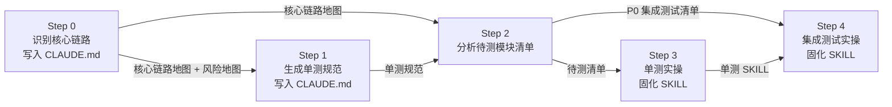

<!--
aicent-27-quality-assurance
AI编程方法 27：测试部署 - 质量保证体系
-->

## 1. 全文导读地图

质量靠体系，不靠 AI——本篇解决如何用一套可复用的质量保障体系，让 AI 在工程师划定的边界里高效执行测试与 Review。

Anthropic 公开提过：Claude Code 自身的代码全部由 AI 编写，工程师只负责 review。这句话有一个没说出来的前提：他们敢这么做，不是因为 AI 不会出错，而是因为背后有一套完整的质量保障体系在托底。换句话说，真正保证质量的不是 AI，而是体系；AI 只是体系的执行者。

现实中常见的"写好 SDD，扔给 AI 跑一晚搞定整个项目"，是对上述逻辑的偷换概念：它把"体系保证质量，AI 协助执行"误读成了"AI 帮你保证质量"。这两件事的区别很大——前者是工程师先建立体系，识别核心链路、划定测试边界、制定 Review 策略，再让 AI 在边界里高效执行；后者则幻想把代码交给 AI，它就能自动发现所有问题、写出正确的测试、保证系统稳定。AI 写代码时专注于功能实现，它不会主动质疑自己的安全模型，不会想到接口的权限校验是否有漏洞，也不会考虑并发场景下的数据一致性。本篇要讲的，就是前者那套可复用的体系。

### 1.1 全文结构总览


本篇分两部分：第一部分是方法论手册，讲清楚怎么想、怎么判断；第二部分是 Hify 项目实战演示，给出能直接复用的提示词、流程和 SKILL。两部分相互呼应，方法论提供判断框架，实战演示验证框架可操作。


<!--
\`\`\`mermaid
graph TD
    A[本篇总论:质量靠体系,不靠 AI] --/> B[第一部分 · 方法论手册]
    A --/> C[第二部分 · Hify 实战演示]
    A --/> D[总结与思考题]

    B --/> B1[2.1 核心判断:质量靠体系,不靠 AI]
    B --/> B2[2.2 代码分工判断:哪些给 AI,哪些自己把关]
    B --/> B3[2.3 Review:按核心链路看 + 双模型互补]
    B --/> B4[2.4 单元测试边界:先问该不该测,再问怎么测]
    B --/> B5[2.5 集成测试与混沌测试定位]
    B --/> B6[2.6 项目阶段 Check List]

    C --/> C0[3.2 Step 0 识别核心链路,写入 CLAUDE.md]
    C --/> C1[3.3 Step 1 生成单测规范,写入 CLAUDE.md]
    C --/> C2[3.4 Step 2 分析待测模块清单]
    C --/> C3[3.5 Step 3 单元测试实操 + 固化为 SKILL]
    C --/> C4[3.6 Step 4 集成测试实操 + 固化为 SKILL]
    C0 --/> C1 --/> C2 --/> C3 --/> C4

    D --/> D1[4. 总结与延伸:四样产出物]
    D --/> D2[5. 思考题:三个深化练习]
\`\`\`
-->

### 1.2 两类读者阅读路径


本篇同时服务两类读者，建议按下表选择阅读路径。

| 读者类型 | 阅读目标 | 推荐路径 |
| --- | --- | --- |
| 熟练 AI 编程工程师 | 快速回顾方法论 + 速查 Check List | 直奔 2.6 项目阶段 Check List 速查；需要回顾判断框架时读 2.1~2.5；遇到具体问题（某段代码该不该测、Review 维度怎么定）再查第二部分对应 Step |
| 初学 AI 编程工程师 | 系统全面掌握，能复现完整流程 | 第一部分 2.1 → 2.6 顺读，先建立判断框架 → 第二部分 Step 0 → Step 4 跟着 Hify 实操复现一遍 → 回到第 4 章总结回顾 → 第 5 章思考题练习巩固 |

熟练读者的核心入口是 2.6 Check List：它把五个方法论点（核心判断、代码分工、Review、单测边界、集成与混沌测试）压成可裁剪的速查表，能直接复制进 CLAUDE.md。当 Check List 某一条拿不准时，再回查对应的 2.1~2.5 小节。

初学读者的关键是不要跳过第一部分直奔实战。第二部分的每一步都回扣第一部分的方法论条目，没有判断框架打底，照抄提示词很容易陷入"知其然不知其所以然"。建议至少把 2.1 核心判断和 2.4 单元测试边界读懂，再进入第二部分。

### 1.3 本篇的核心立场

本篇不讨论"AI 能不能取代工程师写测试"这种空泛话题，只回答一个具体问题：在真实项目里，工程师怎样用一套体系让 AI 在边界里高效完成测试与 Review。所有方法论都配 Hify 项目实例，所有提示词、执行路径树、SKILL 模板都在第二部分完整给出，可以直接复制使用。
## 2. 第一部分 · 方法论手册

第一部分不讲具体技术栈，只回答一个问题：**当 AI 能写大部分代码时，工程师要怎么想、怎么判断、怎么把关**。所有方法论条目都配 Hify 项目的实例或可复用的判断框架，供两类读者快速定位——初学者通读建立判断框架，熟练工程师直接跳到 2.6 取 Check List。

### 2.1 核心判断：质量靠体系，不靠 AI


#### (1) 结论先行：两个命题的对立

Anthropic 公开表示过：Claude Code 自身的代码全部由 AI 编写，工程师只负责 review。这个说法有一个没说出来的前提——他们敢这么做，不是因为 AI 不会出错，而是因为背后有一套完整的质量保障体系。

很多新闻传递出另一种印象：写好 SDD，直接扔给 AI 跑一个晚上，整个项目就搞定了。从实践来看，这件事现在做不到。不是 AI 能力不够，而是这种说法偷换了一个概念：**保证代码质量的不是 AI，是体系，AI 只是体系的执行者**。

下面两个命题的差异需要先讲清楚：

| 命题 | 含义 | 现实性 |
|------|------|--------|
| AI 帮你保证质量 | 把代码交给 AI，它会自动发现所有问题、自动写对测试、自动保证系统稳定 | 不现实。AI 写代码时专注功能实现，不会主动质疑自己的安全模型，不会想到"这个接口权限校验是不是有漏洞"，不会考虑并发场景下的数据一致性 |
| 体系保证质量，AI 协助执行 | 工程师先建立质量保障体系——识别核心链路、划定测试边界、制定 review 策略——然后让 AI 在这个体系里高效执行 | 现实且是当前阶段的正确姿势。体系是人建的，AI 是执行者 |

正确的工作方式不是告诉 AI"给我写测试用例，保证代码不出问题"然后等它跑完，而是工程师拆解项目、划定边界，AI 在划定的边界里执行。

#### (2) 质量四层模型

一个项目的质量由四个层次组成。这四层不是并列关系，而是从"方向判断"到"韧性验证"的递进——前一层做错了，后一层再努力都是在错误的地方使劲。

| 层次 | 目标 | 谁主导 | AI 角色 | 何时介入 |
|------|------|--------|---------|----------|
| 核心链路识别 | 判断哪些是系统核心路径、风险集中在哪里 | 必须 由工程师判断，AI 辅助分析 | AI 读完代码输出清单和风险地图，工程师对照业务理解确认 | 架构期，且要写进 CLAUDE.md 影响后续所有步骤 |
| 单元测试 | 覆盖纯逻辑，不依赖外部系统 | 工程师划定边界，AI 大比例执行 | AI 规划用例并写代码；注意 AI 偏逻辑完备，用例容易过多，工程师要砍掉不必要的 | 编码期，每个 Service 方法落地时 |
| 集成测试 | 端到端验证功能维度，从 Controller 到数据库的完整链路 | 工程师定 mock 策略，AI 执行 | 一个场景跑通再写下一个，AI 按 P0/P1/P2 顺序推进 | 编码后期至联调期 |
| 混沌测试 | 故障注入验证韧性，验证"出问题时垮不垮" | 工程师设计场景，AI 辅助执行 | 典型故障：节点宕机、网络分区、磁盘打满、慢消费者积压 | 维护阶段才有意义，但架构阶段就要知道它在哪 |

这四层对应到 2.2~2.5 的四节方法论：2.2 讲哪些代码交给 AI、哪些自己把关（判断的起点）；2.3 讲 review 怎么按核心链路做、怎么用双模型互补；2.4 讲单元测试"先问该不该测再问怎么测"；2.5 把集成测试和混沌测试的定位一次讲清。

#### (3) 一个关键比例

80-90% 的代码可以放手给 AI 写，**前提是工程师知道剩下的 10-20% 在哪里、哪些地方要自己把关**。这个前提不是 AI 给的，是体系给的——核心链路识别做得对，10-20% 的关键位置就清楚；做错了，AI 写得再快也是在错方向上累加代码。

### 2.2 代码分工判断：哪些给 AI，哪些自己把关


质量保障的起点不是测试，是判断。有经验的工程师看一眼系统，基本能知道哪里容易出问题——核心链路、核心功能、核心模块就是要把关的地方，也是 review 和测试的重心。判断做对了，精力分配就对了。

#### (1) 对比表：适合 AI vs 不适合 AI

| 维度 | 适合给 AI 写 | 不适合给 AI 写 |
|------|--------------|----------------|
| 特征 | 有规范、有模式、有标准答案，逻辑清晰套路可循 | 需要深度判断、没有标准答案，方向可能错且表面看不出 |
| 典型类型 | CRUD 接口、适配器、DTO 转换、工具类、配置类、测试代码 | 架构设计、核心数据模型的取舍、安全边界的划定、性能瓶颈处的核心逻辑 |
| Hify 实例 | Provider 的 CRUD、适配层的格式转换、前端的管理页面 | 04 篇的数据模型设计、13 篇的领域理解、整套架构的模块拆分 |
| AI 产出质量 | 与有经验的程序员写的差不多，而且更快 | AI 能写出也能跑，但方向可能是错的，且代码本身看不出问题 |

#### (2) 一句话原则

**错方向比错代码危险得多**，因为错代码会报错、会被测试发现，错方向表面上没问题，会一路带着团队在错误的地方堆代码。所以判断的核心不在"AI 写得对不对"，而在"这段代码该不该交给 AI 写"。

Hify 整个系列 80% 以上的代码属于第一类（适合给 AI），全部放手给 AI；剩下的 20% 是第二类（不适合给 AI），自己做，AI 只做辅助分析。

### 2.3 Review：按核心链路看 + 双模型互补


#### (1) 为什么按核心链路 review

代码量大，逐行 review 不现实，**核心链路 review 才是正确姿势**。这里有一个前提：结构组织要合理，review 才有抓手。模块清晰、分层合理、CLAUDE.md 写清楚规范——结构好了，工程师就知道核心链路在哪几个文件里，review 变成有目的的阅读，而不是大海捞针。

这其实就是前面系列里沉淀那么多内容到 CLAUDE.md 的作用：CLAUDE.md 不只是给 AI 读的，也是给人 review 用的导航地图。Hify 的核心链路是对话链路，`ChatServiceImpl` 里从用户发消息到 LLM 返回的完整流程就是 review 的重心。

#### (2) 双模型互补原理

Claude Code 写完核心模块后，把代码喂给 ChatGPT review——两个模型训练方式不同，盲点不同，互补效果很好。Claude Code 写代码时专注功能实现，不会主动质疑自己的安全模型；ChatGPT 扮演 reviewer 时视角完全不同，它在找问题，不是在完成功能。

因此对工具的选择建议是：不一定非要买 Claude Code，**Cursor 也可以**——Cursor 集成了 ChatGPT、Claude Code、Kimi 等多个模型，很适合多模型 review。

#### (3) 双模型 review 提示词

提示词原文如下，可直接复用，**注意最后一句"不需要夸代码写得好"是必须保留的**——模型有讨好倾向，不说这句会先说一堆好话再说问题，浪费一轮交互：

```
你是一位有十年经验的 Java 后端工程师，正在做代码 review。

以下是 Hify 对话链路的核心代码，请从这几个维度给出意见：

1. 安全性：权限校验是否完整，有没有越权访问的可能
2. 静默失败：有没有 catch 块吞掉了异常，调用方感知不到失败
3. 边界条件：null 处理、空列表、并发场景有没有遗漏
4. 性能隐患：N+1 查询、不必要的阻塞调用、大对象

不需要夸代码写得好。直接说问题，每个问题给出具体位置和修复建议。

代码如下：

[粘贴核心链路代码]
```

#### (4) ChatGPT 找出的 4 个高危问题

把 Hify 的 `ChatServiceImpl` 喂给 ChatGPT，它发现了 12 个问题，其中 4 个高危。这 4 个问题正好覆盖了提示词里的"安全性 / 静默失败 / 边界条件 / 性能隐患"四个维度，也说明了双模型 review 的实际效果：

| 问题 | 风险类型 | 影响 |
|------|----------|------|
| 越权访问他人会话 | 安全性 | `ChatController` 所有带 sessionId 的接口只验证 session 存在，不验证 session 属于谁。用户 A 知道用户 B 的 sessionId（连续自增 ID，极易枚举），可以读取 B 的全部对话历史、向 B 的会话发消息、删除 B 的会话 |
| 对话历史取的是最旧的消息 | 边界条件 / 性能隐患 | `ChatMessageMapper` 的 SQL 是 `ORDER BY created_at ASC LIMIT #{limit}`。对话有 100 条时，取的是最早的 20 条不是最近的 20 条；长对话用户发新消息，LLM 看到的是几十轮之前的历史 |
| MCP 工具调用失败静默返回 mock 数据 | 静默失败 | `executeToolCall` 里 catch 所有异常后返回硬编码的 mock 数据。MCP Server 超时、认证失败、工具不存在，全都返回一样的假数据，调用方完全感知不到失败 |
| Redis read-modify-write 无锁 | 并发 / 数据一致性 | `updateContext` 是 `get → add → set` 的操作序列，没有任何锁。两个并发请求同时读到旧的 context，各自追加后写回，后写的覆盖前写的，一条对话记录永久丢失 |

这 4 个问题恰恰是单看 Claude Code 写的代码本身看不出来的——代码能跑、功能正常，但安全模型有漏洞、并发场景会丢数据。这正是双模型 review 的价值所在。

### 2.4 单元测试边界：先问该不该测，再问怎么测


#### (1) 原则：让 AI 决定测什么是错的起点

让 AI 决定"测什么"是错的起点。AI 偏逻辑完备，倾向覆盖所有路径，包括 mock 掉外部依赖之后意义不大的场景。正确的顺序是**先问该不该测，再问怎么测**——这个"该不该"由工程师基于核心链路判断，AI 在已经划定的范围内规划用例。

#### (2) 值得测 vs 不值得测（Hify 实例）

| 类别 | 特征 | Hify 实例 | 替代方案 |
|------|------|-----------|----------|
| 值得测 · 纯函数逻辑 | 输入固定输出就固定，不依赖任何外部系统 | `buildMessages()` 上下文拼装、`ConditionNodeExecutor.execute()` 条件判断、`ExecutionContext.resolve()` 模板替换 | 直接写单测 |
| 值得测 · 边界清晰的工具类 | 输入输出明确，无副作用 | `NodeConfigParser.parse()`、`Result.ok() / Result.fail()` | 直接写单测 |
| 不值得测 · 核心是外部调用 | 真正的逻辑在 HTTP/SSE 协议层 | `OpenAiAdapter`（核心是 HTTP 构造和 SSE 流解析，与网络协议深度耦合） | 用 MockWebServer 做 HTTP 级集成测试 |
| 不值得测 · 逻辑在 SQL 里 | 真正的逻辑在数据库排序/聚合 | `selectRecentBySessionId`（排序 bug 只有跑真实 SQL 才能发现） | H2 集成测试 |
| 不值得测 · 深度依赖 Spring 容器 | mock 完依赖后剩下的只是调用顺序 | `ChatServiceImpl`（12 个外部依赖，mock 完之后测的是假数据流转） | 集成测试或重构 |

#### (3) 判断三问

具体的"该不该测"判断框架，用下面三问逐条对照。这三问是工程师在写每个测试前要过的清单，AI 写测试前也要让它先回答这三问：

```
1. 有没有 IO（DB/HTTP/Redis/文件）？
   有 → 考虑集成测试

2. 去掉外部依赖，剩下的逻辑有复杂度吗？
   没有 → 不值得测
   有 → 可以单测

3. 改动频率高？出错影响大？
   是 → 值得做
   否 → 优先级放低
```

第一问过滤掉所有外部调用类代码（这类该走集成测试）；第二问过滤掉"mock 完之后没东西可测"的代码；第三问把剩余的候选按优先级排序，精力优先投到改动频繁、出错影响大的逻辑上。

### 2.5 集成测试与混沌测试定位


#### (1) 集成测试定位

集成测试是端到端的功能维度验证：从 Controller 一路打到数据库的完整链路。它的特征是——**mock 掉外部 API，但保留真实 DB**。以 Hify 为例，集成测试的技术配置是 Spring Boot Test 完整启动 + MockMvc 打真实 HTTP 请求 + H2 内存库替换 MySQL + MockProviderAdapter 替换真实 LLM 调用。

集成测试的 mock 策略必须由工程师来定（mock 什么、不 mock 什么），执行可以让 AI 来做。关键纪律是**一个场景跑通再写下一个**，不要批量生成——批量生成的测试经常互相耦合，跑起来一片红，调起来比写还慢。

集成测试最适合发现的问题恰恰是单测发现不了的：SQL 的排序逻辑（`ORDER BY created_at ASC` 取最旧消息的 bug 只有 H2 集成测试能暴露）、Spring 容器装配问题、跨模块调用顺序。

#### (2) 混沌测试定位

混沌测试是质量体系的天花板。单测和集成测试验证的是"正常情况下对不对"，混沌测试验证的是"出问题时垮不垮"。它通过故障注入来验证系统韧性，典型故障场景包括：

- 节点宕机
- 网络分区
- 磁盘打满
- 慢消费者积压

混沌测试在项目**维护阶段才有意义**——有了真实用户负载之后才能验证韧性；但**架构阶段就要知道它在哪**，因为架构决策（有没有冗余、有没有熔断、有没有限流）决定了混沌测试能不能通过。架构期不预留韧性设计，维护期再做混沌测试只会发现一堆无法修复的问题。

#### (3) 集成测试 vs 混沌测试对比

| 维度 | 集成测试（第三层） | 混沌测试（第四层） |
|------|--------------------|--------------------|
| 验证什么 | 功能正确性，端到端链路是否走通 | 韧性，故障条件下系统是否还能撑住 |
| 何时介入 | 编码后期至联调期，每个核心场景一条 | 维护阶段，有真实负载之后 |
| 谁主导 | 工程师定 mock 策略和优先级，AI 执行 | 工程师设计故障场景，AI 辅助执行 |
| 典型问题 | SQL 排序 bug、跨模块调用顺序、Spring 装配 | 节点宕机、网络分区、磁盘打满、慢消费者积压 |
| 失败成本 | 修代码或修测试 | 可能需要回到架构层补熔断/限流/冗余 |

### 2.6 项目阶段 Check List（可裁剪速查表）


下面这份清单按项目阶段组织，每条都紧扣"判断 / Review / 单测边界 / 集成测试 / 混沌测试"五个方法论点，**每条都可勾选、可执行**。供打印贴墙或整段复制进 CLAUDE.md，作为每个阶段的退出准则。

#### (1) 架构期

- [ ] 识别 3-5 条核心链路，每条标注涉及的模块、类和"为什么是核心"
- [ ] 标注风险集中区域，每个风险点写明类型（安全 / 并发 / 性能 / 数据一致性）和失败场景
- [ ] 把核心链路地图和风险地图写入 CLAUDE.md，作为后续所有测试的依据
- [ ] 划定混沌测试要预留的韧性设计点（熔断、限流、冗余、降级），即便不立即实现也要在架构里留位置
- [ ] 做代码分工判断：哪些模块适合 AI 写（CRUD / 适配器 / DTO / 工具类 / 配置 / 测试），哪些自己把关（架构 / 数据模型 / 安全边界 / 性能瓶颈核心逻辑）

#### (2) 编码期

- [ ] 每写一个 Service 方法前，先过"判断三问"：有没有 IO、去掉依赖还有复杂度吗、改动频率和影响
- [ ] 该走集成测试的不写单测（外部调用类、SQL 逻辑类、深度依赖容器类）
- [ ] 适合 AI 写的代码（CRUD / 适配层 / 前端管理页）放手给 AI，但生成后立即对照 CLAUDE.md 的规范检查
- [ ] 把单测规范（命名、结构、mock 使用、断言、禁止事项）写入 CLAUDE.md，让 AI 后续自动遵守

#### (3) Review 期

- [ ] review 范围限定在核心链路文件，不做逐行大海捞针
- [ ] 至少用两个不同模型 review 核心链路代码（如 Claude Code 写、ChatGPT review）
- [ ] review 提示词明确列出维度（安全性 / 静默失败 / 边界条件 / 性能隐患）
- [ ] review 提示词末尾保留"不需要夸代码写得好"，避免模型讨好倾向
- [ ] 对模型找出的问题做复核，确认是真问题后写入修复清单

#### (4) 测试期

- [ ] 单测只覆盖纯函数和边界清晰的工具类，砍掉 mock 完之后无意义的场景
- [ ] 单测禁止在测试里重写被测逻辑、禁止用 `assertTrue`、禁止 mock 标准库和被测类自身
- [ ] 集成测试按 P0/P1/P2 分档，P0 必须覆盖核心链路，一个场景跑通再写下一个
- [ ] 集成测试每个测试类用 `@Sql` 独立数据 + `@Transactional` 回滚，不共享全局种子数据
- [ ] 对已知 bug，先写一条会失败的测试（红），再修 bug 让测试变绿，而不是修完再补测试
- [ ] 把单测流程和集成测试流程分别固化为 SKILL，后续对任何模块一键触发

#### (5) 维护期

- [ ] 系统有真实负载后，启动混沌测试，验证架构期预留的韧性设计是否有效
- [ ] 优先验证"出问题影响最大"的故障场景：节点宕机、网络分区、磁盘打满、慢消费者积压
- [ ] 每次发现新的风险类型（线上故障、用户反馈），回写到 CLAUDE.md 的风险地图，更新 review 维度
- [ ] 定期复核核心链路地图：业务变化后核心链路是否漂移，测试重心是否需要重新分配
## 3. 第二部分 · Hify 实战演示

### 3.1 实战全景：五步流水线


第二部分用 Hify 项目（一个支持 RAG、Function Calling、MCP、工作流的 AI 对话平台）完整复现第一部分的方法论。基于已识别的核心链路（流式对话链路 / Function Calling 两轮 / 消息上下文管理 / 工作流执行 / MCP 工具接入），实战分五步：Step 0 先识别核心链路，得到的风险地图是后续所有步骤的输入；Step 1 基于地图生成项目专属单测规范；Step 2 对照规范输出待测模块清单；Step 3 单测实操并固化为 SKILL；Step 4 集成测试实操并固化 SKILL。



| 步骤名 | 核心动作 | 产出物 | 回扣方法论 |
|--------|----------|--------|------------|
| Step 0 | 让 AI 读完整个项目，输出核心链路清单与风险地图，人确认后写入 CLAUDE.md | 核心链路地图 + 风险地图（含 2 个高危点） | 2.1 核心链路识别、2.2 判断 |
| Step 1 | 基于核心链路地图生成 Hify 专属单测规范 | 单测规范（依赖配置 / 命名 / mock / 断言 / 禁止事项） | 2.4 单测边界 |
| Step 2 | 让 AI 读代码后对照规范输出"值得写/不值得写"清单 | 27 个模块判断清单（17 值得 / 10 不值得） | 2.4 单测边界、2.2 判断 |
| Step 3 | Provider 单测实操，跑通后固化为 SKILL | 单测 SKILL（unit-test.md） | 2.4 单测边界 |
| Step 4 | 集成测试三场景递进，跑通后固化为 SKILL | 集成测试 SKILL（integration-test.md） | 2.5 集成测试 |

### 3.2 Step 0：识别核心链路，写入 CLAUDE.md


#### (1) 目标与产出物

所有测试的起点不是写代码，而是知道测什么。让 AI 读完整个项目，输出核心链路清单和风险地图，人确认后写进 CLAUDE.md，作为后续所有测试的依据。产出物是一份写入 CLAUDE.md 的"核心链路地图 + 风险地图"，单测规范、集成测试的 P0 优先级、混沌测试的场景设计都从它派生。

#### (2) 提示词

```
帮我分析这个系统，输出三个清单：

1. 核心链路清单（3-5条）
   每条链路：名称、涉及的模块和类、为什么是核心链路

2. 风险集中区域
   哪些模块/方法最容易出问题、出了问题影响最大
   每个风险点说明：风险类型（安全/并发/性能/数据一致性）、可能的失败场景

3. 测试重心建议
   基于前两条，测试精力应该往哪放
   哪些地方必须有测试覆盖，哪些可以先跳过

输出格式：结构化的 CLAUDE.md 片段，我直接复制进去。
```

#### (3) Claude Code 的关键输出

Claude Code 读完代码后，输出的核心链路清单和风险地图相当准确。以 Hify 为例，它识别出了 5 条核心链路：

**流式对话链路（最高优先级）**：`ChatServiceImpl.doStreamChat()` 串联了 12 个外部依赖，RAG 检索、Function Calling 两轮 LLM、Redis/MySQL 双写全部在一个方法里。

**Function Calling 两轮链路**：`tool_calls` 分支是 Hify 区别于普通聊天的核心能力，失败时静默 fallback mock 数据，调用方无法感知。

**消息上下文管理链路**：`loadContext() + updateContext() + SQL`，多轮对话的正确性依赖它，有已知 bug（SQL 取最旧而非最新消息）。

**工作流执行链路**：`WorkflowEngine.pickNext()` 有 fallback-to-first-edge 兜底逻辑会掩盖配置错误，CONDITION 节点走错分支时静默终止无报错。

**MCP 工具接入链路**：每次对话同步串行探测所有绑定的 MCP Server（5s 超时 × Server 数量），3 个 Server = 15s 阻塞。

风险地图识别出了 7 个风险点，其中 2 个高危：

- **ChatServiceImpl.doStreamChat()**：工作流路径抛 RuntimeException 时 user 消息落库但 assistant 消息缺失，对话历史出现孤儿消息；MCP 工具调用任何异常均 fallback mock 数据，LLM 基于假数据生成回答，用户无感知。
- **ChatMessageMapper.selectRecentBySessionId()**：SQL 是 `ORDER BY created_at ASC LIMIT #{limit}`，长对话时取的是最早的消息而非最近的，LLM 拿到过时上下文，对话质量急剧下降。短对话时完全无症状，只在用户深度使用时暴露。

#### (4) 人的决策点

拿到结果后要做的关键动作是：对照自己对系统的理解，检查 AI 有没有遗漏或判断错的地方。AI 的分析基于代码结构，人的判断来自业务理解，两者对比才能确认这份地图是准确的。确认后写进 CLAUDE.md，这份地图会影响后面每一步：单测规范基于它生成，集成测试的 P0 优先级基于它划定，混沌测试的场景设计也基于它。

#### (5) 回扣方法论

呼应 2.1 质量四层模型中的"核心链路识别"层（核心链路识别必须由人来做、AI 辅助分析，做错了后面所有测试都是在错误的地方使劲），以及 2.2 判断（核心链路、核心功能、核心模块是 review 和测试的重心，判断做对了精力分配就对了）。

### 3.3 Step 1：生成单测规范，写入 CLAUDE.md


#### (1) 目标与产出物

有了核心链路地图，单测规范就有了依据。让 AI 基于 Step 0 的结果生成 Hify 项目专属的单测规范（不是泛泛的通用规范），写入 CLAUDE.md 的"测试规范"节，此后 Claude Code 写任何测试代码都会自动遵守。

#### (2) 提示词

基于 CLAUDE.md 中的核心链路和风险地图，帮我生成 Hify 项目的单元测试规范。

规范需要覆盖：

```
1. 哪些代码必须写单测（结合核心链路判断）
2. 哪些代码不写单测、用集成测试替代（结合 Hify 的外部依赖特点）
3. 测试命名规范：should_[期望结果]_when_[输入条件]
4. 测试结构：Given-When-Then
5. mock 使用规范：什么时候 mock，什么时候不 mock
6. 断言规范：用 AssertJ，断言要有意义
7. 禁止事项：哪些写法不允许出现
```

输出格式：直接输出 CLAUDE.md 片段，我复制进去就能用。

#### (3) Claude Code 的关键判断

规范中有几个值得关注的判断：

##### ① 先检查测试依赖，不是泛泛说"用 JUnit 5"

Claude Code 先检查了项目的测试依赖，发现根 pom 里没有任何测试框架：零测试基础设施。所以它的规范里第一节就是依赖配置。这个细节很重要：不是泛泛说"用 JUnit 5"，而是先看现在有什么，再告诉缺什么。

##### ② "不写单测"范围给具体理由

关于"不写单测"的范围，规范给出了具体理由而不是笼统结论：

- **ChatServiceImpl 整体不写**：有 12 个外部依赖，mock 掉之后测的是假数据流转。
- **OpenAiAdapter 不写单测**：核心是 HTTP 构造和 SSE 流解析，与网络协议深度耦合，用 MockWebServer 做 HTTP 级集成测试更有价值。

##### ③ mock 规范原则：只 mock 跨越本类边界的依赖

关于 mock 使用规范，它强调一个原则：只 mock 跨越本类边界的依赖，不 mock 标准库、不 mock 被测类自身。举了一个反例，`@Mock ObjectMapper objectMapper`，直接 new 即可，不需要 mock。

##### ④ 禁止事项亮点：不要在测试里重复计算期望值

禁止事项里有一条特别有用：禁止在测试里写业务逻辑，不要重复计算期望值，直接写字符串字面量。这是 AI 写测试时最常见的坏味道——它会把被测的计算逻辑在测试里再实现一遍，测试通过只能说明两段逻辑一样错。

#### (4) 人的决策点

生成后加进 CLAUDE.md 的"测试规范"节，此后 Claude Code 写任何测试代码都会自动遵守。

#### (5) 回扣方法论

呼应 2.4 单元测试边界。单测边界的第一性原理是"先问该不该测，再问怎么测"——AI 偏逻辑完备、倾向覆盖所有路径（包括 mock 掉外部依赖之后意义不大的场景），所以必须用规范把"不值得写单测"的范围和理由写死，避免 AI 在错误的地方写大量无价值测试。

### 3.4 Step 2：分析哪些模块需要单测，给出清单

#### (1) 目标与产出物

规范写好后，让 AI 读完所有相关代码，对照规范输出"值得写单测 / 不值得写单测"的清单。提示词里要求 AI 先读代码再分析，不是凭感觉判断。产出物是一份按模块分组的清单，标明每个类/方法是否值得写单测、理由一句话、值得测的列出 2-3 个最重要的场景。

#### (2) 提示词

基于 CLAUDE.md 中的单测规范和核心链路地图，分析 Hify 以下模块，

给出"值得写单测/不值得写单测"的清单。

对每个类/方法，输出：

```
1. 是否值得写单测（是/否）
2. 理由（一句话）
3. 如果值得测，列出 2-3 个最重要的测试场景
```

用表格输出，按模块分组。不要写测试代码，先给清单。

#### (3) Claude Code 的关键输出

Claude Code 读完代码后给出了 27 个判断目标，结论是 17 个值得写、10 个不值得写。

#### (4) 人的决策点

拿到清单后要做的关键动作是做最终取舍。清单告诉你重心在哪，但优先级由人来定。Claude Code 建议的写测试顺序如下，这个顺序是合理的——先堵已知漏洞，再建体系：

1. **先修复已知 bug（SQL 问题），同步写回归测试锁住正确行为**；
2. **再给纯函数写单测**；
3. **最后做集成测试链路**。

#### (5) 回扣方法论

呼应 2.4 单测边界（清单的核心价值是把"值得测/不值得测"的判断显式化，而不是让 AI 凭逻辑完备倾向去覆盖所有路径）和 2.2 判断（清单只是输入，最终取舍仍由人来做：清单告诉你重心在哪，但优先级你来定，先堵已知漏洞再建体系的顺序体现了"判断决定精力分配"）。
### 3.5 Step 3：单元测试实操 + 固化为 SKILL


有了清单开始做。先手动走一遍 Provider 的单测，跑通后把流程固化成 Skill。本节完整展示与 Claude Code 的交互过程，包括它主动纠正的三个技术问题——这才是真实的节奏。

#### (1) 先规划，不直接写代码

让 Claude Code 深度分析 `ProviderService.createProvider` 方法的执行路径，先给计划，不写代码。提示词如下：

```
深度分析 ProviderService 的 createProvider 方法。

告诉我：

1. 这个方法有哪些执行路径（正常路径 + 异常路径）
2. 每条路径的关键变量是什么
3. 哪些边界条件最容易出错

基于分析，给我一份测试计划：测哪些场景、每个场景验证什么断言。

先给计划，不要写代码。Claude Code
```

Claude Code 读完代码，画出了完整的执行路径树：

```
create(request)
│
├─ checkNameUnique(name, null)
│   ├─ 路径 A：DB 查到同名 → 抛 BizException(PROVIDER_NAME_DUPLICATE) ✗
│   └─ 路径 B：name 不重复 → 继续
│
├─ new Provider()，逐字段赋值
│   └─ description == null → 写入 ""（空字符串兜底）
│
├─ provider.setEnabled(1)（硬编码，调用方无法控制）
│
└─ providerMapper.insert(provider)
    ├─ 路径 C：insert 成功 → id/时间戳由 MyBatis-Plus 回填 ✓
    └─ 路径 D：insert 失败 → RuntimeException 穿透到 GlobalExceptionHandler ✗
```

执行路径树覆盖了四条路径：路径 A 名称重复抛 `BizException(PROVIDER_NAME_DUPLICATE)`、路径 B 名称不重复继续、路径 C `insert` 成功由 MyBatis-Plus 回填 id 和时间戳、路径 D `insert` 失败由 `RuntimeException` 穿透到 `GlobalExceptionHandler`。

同时发现了三个边界条件值得关注：`checkNameUnique` 里没有显式过滤软删除记录（依赖 MyBatis-Plus `@TableLogic` 自动追加）；`description` 传全空格 `" "` 时原样入库没有 trim；`@CacheEvict(allEntries=true)` 的范围过宽，清空了整个 provider-cache 而不只是 list 缓存。

测试计划给出了 11 个场景，分 P0/P1/P2 三档，还有两条标注了“只能用集成测试验证”。

#### (2) Review 测试计划，做筛选

拿到计划，砍掉 P2 的场景，留下核心的四条，然后发给 Claude Code 让它写代码。提示词如下：

```
测试计划确认如下：

- 正常创建：provider name 唯一，验证返回 id 且数据库有记录
- 重复名称：抛出 BizException，错误码 PROVIDER_NAME_DUPLICATE
- 必填字段为空：name 为 null，抛出 ConstraintViolationException
- apiKey 格式校验：不符合格式，抛出 BizException

按这个计划写单元测试。

技术约束：

- ProviderService 依赖 ProviderMapper，用 @MockBean mock 掉
- 用 AssertJ 做断言，不用 assertTrue
- 每个场景一个独立测试方法，方法名遵循 CLAUDE.md 规范
- 不要写集成测试，只写单元测试
```

#### (3) Claude Code 主动纠正的三个技术问题

这是本节最值得关注的地方。Claude Code 没有照着计划直接生成代码，而是先指出了三个问题。三个纠正如表所示：

| 原计划的问题 | Claude Code 的纠正 | 正确做法 |
| --- | --- | --- |
| “验证返回 id 且数据库有记录”在单元测试里做不到后半句 | `providerMapper.insert()` 被 mock 掉后，数据不会真正写库，“数据库有记录”只能在集成测试里验证 | 单测能验证的是：`insert()` 被调用了一次，且传入的 provider 对象字段正确 |
| “apiKey 格式校验”在代码里根本不存在 | `authConfig` 是 `Map<String, Object>`，只有 `@NotNull` 约束，没有任何格式校验逻辑 | 应改成“`authConfig` 为 null 时 Bean Validation 拦截” |
| `@MockBean` 和“只写单元测试”冲突 | `@MockBean` 需要启动 Spring Context，属于集成测试范畴 | 真正的单元测试应该用 `@Mock` + `@InjectMocks` + `@ExtendWith(MockitoExtension.class)`，毫秒级启动 |

这三个点看起来太细节，但重点要看 Claude Code 输出的是什么样的思维提示，而不是它具体输出了什么。应该学的是它的思维——拿到计划先做技术确认，发现不可验证的断言、不存在的被测对象、互相冲突的约束，主动提出再执行。

#### (4) 单测流程固化为 SKILL

流程跑通后，把它固化为 `SKILL.md`，放在 `.claude/skills/unit-test.md`，以后对任何 Service 方法用 `/单测` 命令触发自动走完整流程。第一段提示词如下：

```
我刚才做了 ProviderService 的单元测试，完整流程是：

1. 读代码，分析执行路径和边界条件
2. 输出测试计划（不写代码）
3. 我确认计划，CC 主动指出计划里的技术问题，调整后再执行
4. Service 业务逻辑和 DTO 约束规则分两个测试文件
5. 跑测试，失败了分析是测试写错还是实现有 bug

请把这个流程固化成一个 SKILL.md 文件。

让我以后对任何 Service 方法用 /单测 命令触发，CC 自动按这个流程走。

SKILL.md 要包含：

- 触发方式
- 读代码的步骤（先读被测类，再读依赖的 DTO 和 ErrorCode）
- 测试计划的输出格式（执行路径树 + 边界条件 + 分优先级的场景表）
- 写代码前的技术确认清单（mock 方式、断言库、是否有 Bean Validation 相关场景）
- 测试文件拆分原则（Service 逻辑和 DTO 约束分开）
- 跑测试和处理失败的步骤
```

第二段提示词：

```
固化后放在.claude/skills/unit-test.md
```

固化后，下次对任何方法直接 `/单测AgentService.createAgent`，Claude Code 自动走完整流程，包括主动检查计划里的技术问题。
### 3.6 Step 4：集成测试实操 + 固化为 SKILL


集成测试是 Hify 的主力。Spring Boot Test 完整启动，mock 掉外部 API，打真实 HTTP 请求，走完从 Controller 到数据库的完整链路。还是先规划集成测试清单。

#### (1) 规划集成测试清单（P0/P1/P2）

集成测试清单的规划起点仍然是 CLAUDE.md 里沉淀下来的核心链路地图和风险地图，而不是凭直觉拍脑袋。把这两份地图交给 Claude Code，让它据此输出有优先级分档的清单。

提示词：

```
基于 CLAUDE.md 中的核心链路和风险地图，帮我规划 Hify 的集成测试清单。

测试范围：Spring Boot Test + MockMvc，mock 掉 LLM API 和 MCP Server，

测试 Hify 自身从 Controller 到数据库的完整链路。

按优先级分三档：

P0，核心链路，必须覆盖
P1，主要功能，应该覆盖
P2，边缘场景，有余力再做

每条给出：测什么、验证什么、为什么这个优先级。

不要写代码，先给清单。
```

Claude Code 接到指令后没有直接出清单，而是先检查了项目的配置文件。它发现工程里已经有 `application-mock.yml`，H2 内存库 + `MockProviderAdapter` 替换了真实的 LLM 调用，且这套 mock profile 不依赖 Redis。也就是说，集成测试的技术基础已经就位，不需要额外搭建测试基础设施。先确认地基，再画蓝图，这个顺序值得注意。

确认完配置，Claude Code 给出了 13 条集成测试清单。其中 P0 的五条是核心，需要逐条说清楚：

**完整对话链路**：普通问答场景，验证 SSE 流包含 `type=delta` 事件且 content 非空，最后一个事件是 `type=done`，MySQL 里有 user 和 assistant 两条记录，且 assistant 消息内容与 delta 事件拼接结果一致。一条测试覆盖从 Controller 到 DB 的完整落库链路。

**Function Calling 两轮链路**：`MockProviderAdapter` 第一轮返回 `finish_reason=tool_calls`，mock `McpService` 返回工具结果，第二轮返回最终回答。验证 SSE 流正常结束，MySQL 只落一条 assistant 消息（不是两条），`McpService.callTool()` 被调用一次。这条测试的重点不是 happy path，而是工具调用失败时不影响 SSE 流正常结束——对应 review 环节发现的高危问题：工具失败静默 fallback mock 数据。

**对话上下文多轮正确性**：同一 session 发 3 条消息，验证第 3 条调用时传给 LLM 的 messages 数组包含前两轮历史，且顺序正确。这条直接对应 Step 0 识别出的已知 bug（SQL 取最旧消息而非最新）。Claude Code 建议先写这条测试，再去修 bug，修完后测试从红变绿——这是测试驱动修复，不是修完再补测试。

**Provider CRUD 完整链路**：创建→查详情→更新→删除，每一步都验证数据库状态，包括软删除后 list 接口不再返回该记录。

**会话隔离**：跨 session 越权访问，这条设计上有点反直觉。当前代码没有 userId 隔离，测试会通过，但通过恰恰意味着越权访问是可行的。Claude Code 的建议是先记录现状，等加了权限校验之后这条测试会变红，变红才是对的——先用测试锁住现状，再推动修复。

测试数据策略上，每个测试类用 `@Sql` 插入独立数据，用 `@Transactional` 回滚，不依赖全局种子数据。SQL 文件按场景分文件放在 `src/test/resources/sql/` 下，不要把所有测试数据堆进一个文件。

#### (2) Provider CRUD 集成测试

清单确认后，从最简单的模块开始写。Provider CRUD 是前置依赖，后面所有对话链路测试都需要先有 Provider 数据，先把这块跑通。

发给 Claude Code 的指令：

```
按 P0 清单，先写1～4：Provider CRUD 完整链路的集成测试。

技术基础：用现有的 mock profile（H2 内存库 + application-mock.yml），

不需要新建 application-test.yml。

测试场景（6 个，先写完跑通再继续）：

1. POST /api/v1/providers 创建：合法请求，验证 body.code=200 且 body.data.id 有值
2. POST /api/v1/providers 重复名称：验证 body.code=2001（PROVIDER_NAME_DUPLICATE）
3. GET /api/v1/providers/{id} 查询存在的记录：验证返回完整字段
4. GET /api/v1/providers/{id} 查询不存在的记录：验证 body.code=2000
5. PUT /api/v1/providers/{id} 更新：验证数据库里的 name 确实变了
6. DELETE /api/v1/providers/{id} 删除：验证数据库里 deleted=1

约束：

- @SpringBootTest(webEnvironment = RANDOM_PORT) + MockMvc
- 每个测试方法用 @Sql 插入独立数据，用 @Transactional + @Rollback 回滚
- Hify 所有接口 HTTP 状态码都返回 200，错误码在 body.code 里
- 用 AssertJ 做断言
```

这段提示词里有一个关键的提示词工程点：明确写了"Hify 所有接口 HTTP 状态码都返回 200"。如果不说这句话，Claude Code 会默认按通用 RESTful 约定去断言 HTTP 400/404，而 Hify 的错误响应格式不是这样——错误码统一放在 `body.code` 里，HTTP 层始终是 200。这类项目约定属于 AI 无法从代码结构直接推断的隐性知识，必须在指令里明确说清楚，不能靠 Claude Code 猜。

#### (3) 对话链路三场景递进

Provider CRUD 跑通后，开始写对话链路。这部分分三个场景递进，一个跑通再写下一个。下面的提示词细节比较多，重点看提示词背后的工程思路：复用前置测试基类、分阶段验证、把已知 bug 转成测试驱动修复。

##### ① 场景一：纯对话

写完整对话链路，从普通问答起步。提示词：

```
写 01：完整对话链路，普通问答。

前置：复用 Provider CRUD 测试里的测试基类和 @Sql 数据准备方式。

测试步骤：

1. @Sql 插入 provider + model_config + agent + chat_session 数据
2. POST /api/v1/chat/sessions/{sessionId}/messages，body: {content: "你好"}
3. 收集 SSE 事件流（text/event-stream）

验证：

① SSE 流包含至少一个 type=delta 的事件，content 非空
② 最后一个事件是 type=done
③ 查询 chat_message 表，role=user 和 role=assistant 各有一条记录
④ assistant 消息的 content 与所有 delta 事件的 content 拼接结果一致
```

`MockProviderAdapter` 已经在 mock profile 里替换了真实 LLM，不需要额外 mock。场景一跑通之后再写场景二。

##### ② 场景二：Function Calling 两轮链路

在场景一基础上，让 Agent 绑定一个 mock MCP Server，验证两轮 LLM 调用加上工具调用的完整闭环。提示词：

```
写02：Function Calling 两轮链路。

在场景一基础上，Agent 绑定一个 mock MCP Server：

- @Sql 数据里加入 mcp_server + agent_tool 关联
- @MockBean McpService，配置 listToolsDetail() 返回一个工具 schema
- MockProviderAdapter 第一轮返回 finish_reason=tool_calls 的响应
- McpService.callTool() mock 返回工具执行结果
- MockProviderAdapter 第二轮收到 tool_result 后返回最终回答

验证：

① SSE 流正常结束，最后事件是 type=done
② MySQL 只有一条 assistant 消息（两轮 LLM 只落一次）
③ verify(mcpService).callTool(any(), eq("check_refund_eligibility"), any())
```

这条测试的真正价值在于失败分支：把 `mcpService.callTool()` 改成抛 `RuntimeException`，验证 SSE 流仍然正常结束、不挂起。这正是 review 环节发现的高危问题——工具失败静默 fallback mock 数据，调用方感知不到。用测试把这个分支锁住，未来谁改坏兜底逻辑，这条测试就会变红。

##### ③ 场景三：对话上下文多轮正确性（先写测试，再修 bug）

这条测试对应一个已知 bug，因此工作流是反过来的：先写测试，测试应该是红的，然后再去修 bug，让测试从红变绿。提示词：

```
写03：对话上下文多轮正确性。

这条测试对应一个已知 bug，先写测试，测试应该是红的，然后再修 bug。

测试步骤：

1. 同一 session 依次发 3 条消息（"第一条"、"第二条"、"第三条"）
2. 在第 3 条发送时，拦截 MockProviderAdapter 收到的 ChatRequest

验证 MockProviderAdapter 第 3 次收到的 messages 数组：

① 包含"第一条"和"第二条"的历史消息（验证多轮上下文传递）
② 历史消息按时间升序排列（先旧后新，符合 LLM 期望）
③ 最后一条是"第三条"（当前用户输入）
```

这条测试刚写出来时应该失败，因为 `selectRecentBySessionId` 的 SQL 是：

```sql
ORDER BY created_at ASC LIMIT
```

取的是最旧的消息而非最新的。测试变红之后，再去修 SQL，修完测试变绿。这就是测试驱动修复的节奏：用一条失败测试锚定 bug，再通过修复让它转绿，而不是修完之后再补一条永远会通过的测试——那样的测试锁不住任何东西。

#### (4) 集成测试流程固化为 SKILL

Provider CRUD 和对话链路三场景跑通后，把整套流程沉淀成可复用的 SKILL，供后续任何模块一键触发。提示词：

```
我刚才做了 Provider CRUD 和对话链路的集成测试，完整流程是：

1. 先规划测试清单（不写代码），基于 CLAUDE.md 的核心链路地图分 P0/P1/P2
2. CC 先读配置文件确认技术基础（H2/mock profile）再给清单
3. 从最简单的场景开始，跑通后再写下一个，不批量生成
4. 每个测试类用 @Sql 独立数据 + @Transactional 回滚，不共享数据
5. mock 策略：外部 API mock 掉，DB 用真实 H2
6. 对于已知 bug，先写失败的测试，再修 bug，让测试从红变绿
```

请把这个流程固化成 SKILL.md 文件。

以后对任何模块用 /集成测试 命令触发，CC 自动按这个流程走。

SKILL.md 要包含：

```
- 触发方式
- 读配置文件的步骤（先确认 mock profile / H2 配置）
- 测试清单规划的输出格式（表格含 IT 编号/场景/验证点/优先级）
- 标准的 mock 策略决策表
- 测试基类模板（@SpringBootTest + mock profile + MockMvc 标准配置）
- 场景递进原则（从最简单开始）
- 已知 bug 的处理方式（先写红测试，再修 bug）
```

固化后放在 `.claude/skills/integration-test.md`。下次写 Agent 模块的集成测试，直接执行：

```
./integration-test agent模块
```

流程自动复用，包括先读配置、分优先级规划、递进执行这些步骤，无需每次重新交代。
## 4. 总结与延伸


### 4.1 四样产出物

本篇走完之后，手里应该留下四样可以长期复用的产出物。它们的关系是层层递进：方法论给出判断框架，CLAUDE.md 沉淀项目级共识，两个 SKILL 把流程一键自动化。

| 序号 | 产出物 | 内容 | 作用 |
| --- | --- | --- | --- |
| 1 | 方法论 | 质量保证是一个体系，不是 AI 能直接闭环的 | 提供判断框架，决定后续每一步的精力分配 |
| 2 | CLAUDE.md 里的核心链路地图和单测规范 | 所有模块共享的核心链路清单、风险地图、测试规范 | 后续所有测试都从这里出发，是团队共识的载体 |
| 3 | 单测 SKILL | 任何 Service 方法一键触发的单测流程 | Claude Code 自动走完整流程，包括主动检查计划里的技术问题 |
| 4 | 集成测试 SKILL | 任何模块一键触发的集成测试流程 | 流程自动复用，含先读配置、分优先级规划、递进执行 |

### 4.2 混沌测试的定位（第四层）

本篇建立的体系解决的是质量四层模型里的前三层：核心链路识别、单元测试、集成测试。这三层覆盖的是"正常情况下系统对不对"。

第四层是混沌测试——通过故障注入验证系统在真实混乱条件下能不能撑住，典型场景包括节点宕机、网络分区、磁盘打满、慢消费者积压。本篇没有展开，但它在质量体系里是存在的，对应 2.5 节"集成测试与混沌测试定位"中的第四层定位。

混沌测试的介入时机通常是系统进入维护阶段、有了真实用户负载之后。本篇之所以在架构阶段就把它写进质量四层模型，是为了让团队从第一天就知道它在哪、为什么需要它，而不是等到线上出事才补。从这个意义上讲，混沌测试是本篇体系的下一个自然延伸，前三层做得越扎实，第四层的推进就越顺。

### 4.3 核心判断回顾

回到本篇开篇的核心判断：质量靠体系，不靠 AI。

具体的比例感是这样的：80-90% 的代码可以放心给 AI 写，前提是知道剩下的 10-20% 在哪里、哪些地方要自己把关。这 10-20% 通常是架构设计、核心数据模型取舍、安全边界、性能瓶颈处的核心逻辑——错方向比错代码危险，因为它表面上没问题。

**体系是工具，判断力才是核心。**

## 5. 思考


### 5.1 用判断框架审视手上的项目

按照本篇的判断框架，审视你现在工作中的一个项目：哪些代码适合给 AI 写，哪些需要自己把关？核心链路是哪几条？用 `Step 0` 的提示词让 Claude Code 帮忙识别，再对比自己的判断，看两者有没有差异。

**考察点**：代码分工判断 + 核心链路识别 + 人机判断对比。

### 5.2 写一个安全 review 专用提示词

双模型 review 的提示词可以针对场景调整。如果要 review 的是安全敏感的代码，比如 Hify 的鉴权逻辑，review 维度应该怎么变？试着写一个专门针对安全 review 的提示词。

**考察点**：提示词工程 + 安全维度 review。

### 5.3 从风险地图推导混沌场景

混沌测试的场景设计依赖对系统风险的理解。基于 `Step 0` 生成的风险地图，Hify 最应该优先验证哪三个混沌场景？为什么？

**考察点**：混沌测试设计 + 风险地图应用。
