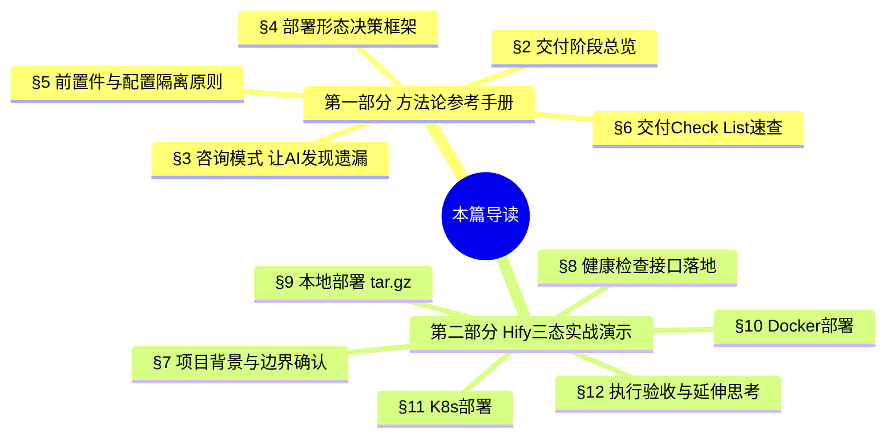

<!--
aicent-28-containerize
AI编程方法 28：测试部署 - 容器化
-->

## 1. 全文导读


本篇是系列中关于**交付阶段**的一篇。它把一个只在开发机上跑得起来的 Spring Boot + Vue AI 应用（Hify），一步步做成可在任意环境部署的交付物，覆盖本地 tar.gz、Docker、Kubernetes 三种形态。

文档分为两部分，服务两类读者：



**阅读路径建议**：

- **初学 AI 编程的工程师**：按顺序通读。先建立方法论框架（第一部分），再在第二部分的实战中看每条方法论如何落地、为什么要这样做，做到"知其然也知其所以然"。
- **熟练 AI 编程工程师 / 项目快速复习**：直接查阅第一部分。其中 §6 是可裁剪的交付阶段 Check List，可在项目对应阶段速查；需要某形态的实操细节时再跳到第二部分对应章节。

**贯穿全篇的一条主线**：AI 不是代码生成器，而是协作者。用对方法，它能在交付阶段帮工程师发现遗漏、对齐上下文、基于实际情况做决策，而不是套模板输出。

**第一部分 · AI 编程交付方法论（参考手册）**

## 2. 把"能跑"变成"可交付"：交付阶段总览


### 2.1 交付阶段要解决的问题

功能开发完、测试补齐之后，应用通常只能在开发机上运行。换一台机器就要重装 JDK、Node.js、配置环境变量，折腾半天。**交付阶段的核心目标是把"只能在开发机上跑"变成"任何环境都能部署"**。

这个阶段不要求工程师精通 Dockerfile 和 K8s YAML 的语法细节，而是借助 AI 编程助手用自然语言描述需求，由助手生成配置、工程师审查并执行命令即可。

### 2.2 三种主流交付形态

面向不同运维能力的目标环境，交付通常准备三种形态：

| 形态 | 适用环境 | 运维要求 | 典型产物 |
|---|---|---|---|
| tar.gz 本地部署 | 客户内网、无 Docker、纯 Linux | 低（弱运维） | jar + dist + 启停脚本 + 配置模板 |
| Docker 部署 | 有 Docker 环境的技术型团队 | 中 | 前后端 Dockerfile + docker-compose.yml + .env |
| K8s 部署 | 有集群、追求高可用 | 高 | Deployment/Service/ConfigMap/Secret/Ingress |

### 2.3 形态选型决策


<!--
\`\`\`mermaid
flowchart TD
    A[开始交付] --\> B{目标环境运维能力?}
    B -- 弱运维/纯Linux/无Docker --\> C[tar.gz 本地部署]
    B -- 有Docker环境 --\> D[Docker 部署]
    B -- 有K8s集群/追求高可用 --\> E[K8s 部署]
    D --\> F{是否复用 Docker 镜像?}
    F -- 是 --\> E
    C -.传统企业必备.-> G[覆盖最广]
    D -.投入产出比最高.-> H[建议优先做]
    E -.复用Docker镜像.-> I[成本最低增量]
\`\`\`
-->

投入产出比上 **Docker 最高**（一次构建到处运行），因此推进顺序建议为：**Docker → tar.gz → K8s**（K8s 可直接复用 Docker 镜像）。本篇为讲解清晰，按从简到繁的顺序展开。

### 2.4 交付阶段的 AI 协作心法

交付阶段真正想让 AI 发挥的价值，不是"帮我写个 Dockerfile"，而是：

- **咨询先行**：动手前先讨论部署形态与边界，让 AI 帮忙发现遗漏。
- **执行前读上下文**：让 AI 先扫描现有项目，避免重复创建、对齐命名风格、发现不一致。
- **基于实际决策**：每一步让 AI 基于项目真实情况做判断，而不是套通用模板。

## 3. 咨询模式：让 AI 帮你发现遗漏


### 3.1 什么是咨询模式

咨询模式指：**在让 AI 执行任何文件改动之前，先用"讨论"的方式把目标、边界、约束聊清楚**。它把 AI 从"代码生成器"切换成"架构副手"——帮工程师想清楚要做什么、还缺什么，再动手。

### 3.2 咨询模式三段式

| 阶段 | 做什么 | 为什么 |
|---|---|---|
| ① 讨论形态 | 让 AI 分析应支持哪些部署形态、每种需要准备什么 | 在写代码前对齐目标，避免返工 |
| ② 发现遗漏 | 让 AI 主动提出确认问题，暴露工程师没想到的前置工作 | AI 见过大量项目，能补盲区 |
| ③ 动手执行 | 边界确定后再让 AI 生成脚本/配置 | 基于明确上下文，输出更准 |

### 3.3 咨询模式的操作要领

#### (1) 明确禁止"边问边写"

讨论阶段要明确告诉 AI"不要写任何代码，先给我分析"。否则 AI 容易在分析途中直接生成文件，跳过边界确认。

#### (2) 让 AI 主动提问，而不只是回答

工程师描述完需求后，应要求 AI "提出你需要确认的问题"。本篇案例中，AI 主动提出了四个确认问题，其中**第四个（是否有健康检查接口）是工程师原本没想到的遗漏**——它直接催生了后续的前置工作。这是咨询模式的核心价值：**让 AI 当镜子，照出工程师的盲区**。

#### (3) 边界问题优先确认

典型的部署边界确认项包括：

- 依赖的中间件（数据库、缓存、向量库）是一起部署，还是连接外部已有实例？
- 目标机器是否已有运行时环境（如 JDK），是否需要打包进交付物？
- 容器化部署是否把数据库一并打包？
- 是否已有可被三种部署形态共用的健康检查接口？

前三个问题确定**部署边界**，第四个常常是**被忽略的前置件**。

### 3.4 咨询模式的判断标准

一次成功的咨询，标志是：**AI 至少提出了一个工程师原本没想到、但确实必要的确认项**。如果 AI 只是顺着工程师的话执行，没有追问和补充，说明咨询没有真正展开——可能需要更明确地要求它"基于你的经验，指出我可能遗漏的地方"。

## 4. 部署形态决策框架


### 4.1 三种形态横向对比

| 维度 | tar.gz 本地部署 | Docker 部署 | K8s 部署 |
|---|---|---|---|
| 适用客户 | 传统企业、内网无 Docker | 技术型中小团队 | 追求高可用的企业 |
| 运维能力要求 | 低 | 中 | 高 |
| 环境一致性 | 弱（依赖目标机自装运行时） | 强（镜像封装） | 强（镜像 + 编排） |
| 高可用/弹性 | 无 | 弱 | 强（水平扩容、自愈） |
| 投入产出比 | 中 | 最高 | 增量成本低（复用镜像） |
| 关键产物 | 启停脚本 + 配置模板 | Dockerfile + compose | Deployment/Service/ConfigMap/Secret |

### 4.2 选型与推进顺序

建议按"投入产出比"排序：**先做 Docker（一次构建、到处运行），再做 tar.gz（覆盖传统企业），最后做 K8s（直接复用 Docker 镜像，增量成本最低）**。

如果是从零教学或按难度推进，则按 **tar.gz → Docker → K8s** 由简到繁展开。两种顺序不矛盾：前者是投产优先级，后者是学习路径。

### 4.3 中间件处理原则

应用常依赖 MySQL、Redis、pgvector 等中间件。决策原则：

- **优先连接外部已有实例**，不打包进交付物。客户企业通常已有 DB/缓存实例，重复部署反而增加维护负担。
- 容器内连接外部服务时，**不能用 localhost**——容器内的 localhost 指容器自身，需用宿主机真实 IP 或服务名。
- pgvector 这类较新组件，Docker 形态可直接用官方镜像（如 `pgvector/pgvector:pg16`），比本地安装友好。

## 5. 通用前置件与配置隔离原则


### 5.1 通用前置件意识

某些组件会被多种部署形态共用，应**优先识别并补齐**，避免在各形态里重复踩坑。最典型的就是**健康检查接口**：

| 部署形态 | 健康检查接口的用途 |
|---|---|
| tar.gz 本地部署 | 启动后 curl 确认服务已就绪 |
| Docker | `HEALTHCHECK` 指令 |
| K8s | livenessProbe / readinessProbe |

一个 `GET /health` 接口同时服务三态，是典型的"高杠杆前置件"。这类共用件如果在咨询阶段被识别出来，能省去后续大量返工。

### 5.2 配置隔离原则

交付物的配置管理遵循"**占位符 + 外部注入**"：

| 配置类型 | 处理方式 | 原因 |
|---|---|---|
| 连接地址/端口 | 占位符 `${ENV_VAR:default}` + 环境变量注入 | 不同环境地址不同 |
| 密码 / API Key | `.env` 文件（不入 git）/ K8s Secret | 敏感信息不能进镜像 |
| 业务配置 | 外部 application.yml 优先级高于内置 | 不重新打包即可调参 |

#### (1) 三条铁律

- 敏感配置（密码、API Key）**不写进代码、不写进镜像、不提交 git**。
- 外部服务连接信息**用环境变量注入**，不硬编码。
- 镜像保持**环境无关**，同一镜像能跑开发、测试、生产。

## 6. 交付阶段 Check List（可裁剪速查）

以下清单供熟练工程师在项目交付阶段快速核对，可按需裁剪。

### 6.1 咨询与边界确认

- [ ] 已与 AI 讨论应支持的部署形态及各自产物
- [ ] 已确认中间件是一起部署还是连接外部实例
- [ ] 已确认目标机器是否自带运行时（JDK 等）
- [ ] 已确认容器化是否打包数据库
- [ ] 已让 AI 主动提出确认问题，并处理了它指出的遗漏

### 6.2 通用前置件

- [ ] 健康检查接口已就绪（三态共用）
- [ ] 接口返回稳定、可供探针使用
- [ ] 已确认是否需要为该接口调整全局响应格式（优先最小改动）

### 6.3 tar.gz 本地部署

- [ ] 生产模式启停脚本（不跑 mvn/npm dev）
- [ ] 配置模板 application.yml + env.template（占位符）
- [ ] 启动脚本轮询健康检查接口确认就绪
- [ ] Makefile 一键打包命令
- [ ] 目标机部署流程文档化（解压→填配置→start）

### 6.4 Docker 部署

- [ ] 前后端 Dockerfile（多阶段构建）
- [ ] 层缓存优化（先 copy pom/package.json 再 copy 源码）
- [ ] 非 root 用户运行
- [ ] 健康检查指令（优先用镜像内置工具如 wget）
- [ ] docker-compose.yml（前后端 + depends_on 健康检查）
- [ ] .env 模板（敏感配置隔离、端口可配置）
- [ ] Nginx 反代配置（SSE 关闭 buffering、超时足够长）

### 6.5 K8s 部署

- [ ] 前后端 Deployment + Service
- [ ] ConfigMap（非敏感配置）+ Secret（敏感配置）
- [ ] livenessProbe / readinessProbe（用健康检查接口）
- [ ] 资源 requests/limits（前后端按实际负载分级）
- [ ] 副本数与扩容方式
- [ ] Secret 通过 CI/CD 幂等注入（不入库）

### 6.6 验收与安全

- [ ] 统一业务链路验收（连通性→流式→检索→工作流→工具）
- [ ] 敏感信息未泄露到镜像/仓库
- [ ] 考虑 CI/CD 自动化（GitHub Actions 等）
- [ ] 评估 Secret 加密方案（sealed-secrets / 云 KMS）

**第二部分 · Hify 三态交付实战演示**

> 本部分结合 Hify 项目（Spring Boot + Vue 的 AI 应用）的真实推进过程，复现第一部分方法论如何落地，并深入解释每一步的 why。读者将看到：咨询模式如何发现遗漏、前置件为何要先行、三态如何共用同一健康检查接口、以及交付物如何组织。

## 7. 项目背景与部署边界确认


### 7.1 Hify 项目画像

Hify 是一个 Spring Boot + Vue 的 AI 应用：

- 后端调用外部 LLM API，依赖 MySQL、Redis、pgvector。
- 目标用户是企业内部团队，规模从几人到几十人不等。
- 交付目标：做成可交付形态，方便部署到不同环境。

### 7.2 用咨询模式讨论部署形态

按照第一部分 §3 的咨询模式三段式，工程师先不急着生成任何文件，而是用咨询模式和 Claude Code 讨论清楚要支持哪些部署形态、有什么需要提前准备。提示词如下：

```text
Hify 是一个 Spring Boot + Vue 的 AI应用，
- 后端调用外部 LLM API，依赖 MySQL、Redis、pgvector
- 目标用户是企业内部团队，规模从几人到几十人不等

我想把它做成可交付的形态，方便部署到不同环境。

帮我分析应该支持哪些部署形态，以及每种形态需要提前准备什么。

不要写任何代码，先给我分析。
```

注意最后一句"不要写任何代码，先给我分析"——这正是 §3.3 中"明确禁止边问边写"的体现，强制 AI 进入分析模式而非执行模式。

### 7.3 AI 给出的三态分析与建议

Claude Code 给出三种部署形态及每种需要准备的内容。

**形态一：tar.gz 本地部署**——适合客户内网无 Docker、纯 Linux、运维能力弱的场景。需要准备：

```text
fat jar + 前端 dist
application.yml 配置模板
start.sh / stop.sh / status.sh
Nginx 配置模板（含 SSE 配置）
数据库初始化 schema.sql
```

目标机器需自行安装 JRE 17+、MySQL、Redis、PostgreSQL + pgvector。

**形态二：Docker 部署**——适合有 Docker 环境的技术型中小团队。需要准备：

```text
前后端各自的 Dockerfile（多阶段构建）
docker-compose.yml
.env 模板
```

pgvector 有官方镜像 `pgvector/pgvector:pg16`，比本地部署友好很多。

**形态三：K8s 部署**——适合有 K8s 集群、追求高可用的企业。需要准备：

```yaml
Deployment
Service
ConfigMap
Secret
Ingress
```

MySQL/Redis 通常复用客户已有实例，pgvector 需要单独处理。

Claude Code 还给出了横向对比和建议优先级：**先做 Docker（投入产出比最高）、再做 tar.gz（面向传统企业）、最后做 K8s（复用 Docker 镜像）**。本篇按从简到繁的顺序展开。

### 7.4 咨询模式的关键时刻：AI 主动提出四个确认问题

分析之后，Claude Code 主动提出了四个确认问题：

```text
1. MySQL、Redis、pgvector 是跟 Hify 一起部署，还是连接已有的外部服务？
答：外部服务，通过配置连接

2. 目标机器有没有 Java 环境？
答：有，不需要打包 JDK

3. Docker 部署是否把数据库也包进去？
答：不包含，只部署 Hify 自身

4. 当前 Hify 有没有 HTTP 健康检查接口？
答：三种部署形态都需要它，本地部署用来确认服务起来了，Docker 用来做 healthcheck 指令，K8s 用来做存活和就绪探针。如果没有，需要先补。
```

前三个问题确定了部署边界（外部服务、不打包 JDK、不打包数据库），第四个则是**工程师原本没想到的遗漏**——Claude Code 主动提醒了一个前置工作：健康检查接口。

这正是 §3.4 所说的"一次成功的咨询"标志：AI 提出了一个工程师没想全、但确实必要的确认项。这个遗漏直接催生了下一章的前置件落地。

## 8. 前置件落地：健康检查接口


### 8.1 为什么要先补健康检查

按照第一部分 §5.1 的"通用前置件意识"，既然健康检查接口要被三种部署形态共用，就应**在做任何部署形态之前先补齐**。否则每种形态做到一半才发现没有可探的接口，会反复返工。

工程师据此给 Claude Code 下达任务：

```text
帮 Hify 加一个健康检查接口 GET /api/v1/health，
返回 HTTP 200 和 {"code":0,"data":"ok"}。
```

并说明它的三个用途：本地部署 curl 确认服务起来、Docker healthcheck 指令、K8s liveness 和 readiness 探针；接口本身只返回 ok，不需要检查数据库连接。

### 8.2 执行前先读上下文：避免重复创建

Claude Code 没有直接生成代码，而是**先扫描了项目**，发现 `HealthController.java` 已经存在、接口也有。这是 §2.4 "执行前读上下文"的体现：让 AI 基于项目真实情况做决策，而不是无脑新建。

但扫描中发现了一个**格式不一致**的问题：现有接口返回的是 `{"code":200,"message":"success","data":"ok"}`，和要求的 `{"code":0,"data":"ok"}` 有差异——code 值不同，多了 message 字段。

### 8.3 发现不一致后主动问，不擅自改全局

Claude Code 没有自作主张，而是给出了两个选项：

- **选项 1（保持现状思路）**：健康检查场景里 curl/Docker/K8s 只看 HTTP 状态码，不解析 body，code 值无所谓。
- **选项 2（改成 code:0）**：需要改动，但会影响所有接口的响应格式。

Claude Code 的建议是选最小改动方案——不为健康检查改全局响应格式。

### 8.4 最小改动落地

确认选 1 之后，Claude Code 直接修改 `HealthController.java`，让这个接口单独返回 `Map.of("code", 0, "data", "ok")`，**不动全局 Result 类**，改动最小。这是一个典型的工程权衡：在"格式纯粹"和"影响面可控"之间，选择后者。

### 8.5 三态如何使用这个接口

健康检查接口补好后，三种部署形态各自的使用方式如下（这些配置在后续章节会落地）。

**tar.gz 形态**——启动后用 curl 确认：

```bash
curl -f http://localhost:8080/api/v1/health
```

**Docker 形态**——作为容器 healthcheck 指令：

```dockerfile
HEALTHCHECK --interval=30s --timeout=5s --retries=3 \
  CMD curl -f http://localhost:8080/api/v1/health || exit 1
```

**K8s 形态**——作为存活和就绪探针：

```yaml
livenessProbe:
  httpGet:
    path: /api/v1/health
    port: 8080
  initialDelaySeconds: 30
  periodSeconds: 10

readinessProbe:
  httpGet:
    path: /api/v1/health
    port: 8080
  initialDelaySeconds: 10
  periodSeconds: 5
```

### 8.6 方法论点睛

这一步交互有两个值得回味的点，正好印证第一部分的方法论：

- **第一，Claude Code 没有盲目执行**，而是先查项目里有没有，避免重复创建——对应 §2.4 "执行前读上下文"。
- **第二，发现格式不一致后主动问**，没有自作主张改全局格式——对应 §3 咨询模式中"让 AI 当镜子、暴露选择而非替你决策"。

这是咨询模式和执行模式结合的正确节奏：**先讨论、再扫描、发现分歧、提供选项、确认后最小改动**。

## 9. 本地部署：打成 tar 包


### 9.1 目标与要求

本地部署的目标：**一个 tar 包，解压、填配置、执行 start.sh，服务就能跑起来**。目标机器只需要有 Java 环境。工程师给 Claude Code 的需求如下：

```text
- 产物是一个 tar 包，包含：后端 jar、前端 dist 目录、start.sh、stop.sh、配置模板 application.yml
- 目标机器已有 Java 环境，不需要打包 JDK
- start.sh 支持通过环境变量或配置文件注入 MySQL、Redis、pgvector 的连接信息
- stop.sh 优雅停止，等待进程退出
- Makefile 加 package 命令，一键打包
```

并明确：不需要包含 MySQL、Redis、pgvector，它们是外部服务——这与 §7.4 第一问确定的边界一致。

### 9.2 执行前读上下文：发现旧脚本是开发模式

Claude Code 没有直接生成脚本，而是先读了现有的 start.sh、stop.sh、Makefile 和 application.yml，发现：**现有 start.sh 是开发模式**，跑的是 `mvn build + npm dev server`，不适合生产部署，需要完全重写。这一步再次体现了 §2.4 的原则——执行前读上下文，避免在过时的脚本上叠加。

### 9.3 五个产物逐一落地

确认情况后，Claude Code 生成了五个文件。

#### (1) start.sh（完全重写）

生产模式直接运行 jar，不再跑 mvn/npm。关键逻辑：

```text
- 启动前检查 Java 版本是否 17+，jar 文件是否存在
- 自动加载同目录的.env 文件，再接受环境变量覆盖
- 外部 application.yml 优先级高于 jar 内置配置
- 启动后轮询 /api/v1/health 确认就绪，最多等 90s；进程异常退出会立即打印最后 30 行日志
```

这里有两个值得注意的设计：**外部 application.yml 优先级高于内置配置**（对应 §5.2 不重新打包即可调参），以及**轮询 §8 补好的健康检查接口确认就绪**（前置件的复用）。失败时立即打印日志，是为了让运维人员快速定位问题。

#### (2) stop.sh（精简）

去掉了前端进程管理，只管后端。发 SIGTERM，等最多 30s，超时强制 SIGKILL——标准的优雅停止模式：先礼后兵。

#### (3) deploy/application.yml.template

打包时复制为 application.yml，所有连接信息用 `${ENV_VAR:default}` 占位符，用户只需要填实际的地址和密码。这是 §5.2 "占位符 + 外部注入"的落地。

#### (4) deploy/env.template

```bash
DB_HOST=127.0.0.1
DB_PORT=3306
DB_NAME=hify
DB_USERNAME=hify
DB_PASSWORD=your_mysql_password

REDIS_HOST=127.0.0.1
REDIS_PORT=6379
REDIS_PASSWORD=

JVM_OPTS=-Xms256m -Xmx512m
```

用户解压后 `cp env.template .env`，填好密码就可以启动。

#### (5) Makefile 的 package 命令

`make package` 先触发 build（编译后端 + 打包前端），再把产物打成 tar 包：

```text
hify-0.0.1-SNAPSHOT/
├── hify-app.jar
├── web/
├── start.sh
├── stop.sh
├── application.yml
└── env.template
```

### 9.4 目标机器的部署流程

```bash
tar -xzf hify-0.0.1-SNAPSHOT.tar.gz
cd hify-0.0.1-SNAPSHOT
cp env.template .env && vi .env
bash start.sh
```

start.sh 启动后会自动轮询健康检查接口，就绪了打印"Hify 启动成功"，失败了打印日志告诉运维哪里出了问题。整个流程对运维人员的要求降到最低：解压、填密码、一条命令启动。

## 10. Docker 部署：Dockerfile + docker-compose

Docker 部署的目标：**两个 Dockerfile 分别打包前后端镜像，一条命令启动**。

### 10.1 后端 Dockerfile


#### (1) 情况与要求

工程师先说明项目情况与要求：

```text
情况说明：
- Maven 多模块项目，主模块是 hify-app
- JDK 17
- 不需要打包 MySQL、Redis、pgvector，它们是外部服务

要求：
- 多阶段构建，减小镜像体积
- 非 root 用户运行（安全最佳实践）
- 健康检查用 /api/v1/health 接口
```

#### (2) 四个值得关注的设计细节

Claude Code 生成的后端 Dockerfile 有四个值得讲清 why 的细节：

**层缓存优化**：先单独 copy 所有 pom 文件执行 `dependency:go-offline`，再 copy 源码编译。依赖没变时直接命中缓存，省去 3-5 分钟下载时间。运行阶段还用了 Spring Boot layertools 把 jar 拆成四层（dependencies → loader → snapshot-dependencies → application），每次只改业务代码时只有最后一层失效。这是 Docker 镜像构建的标准优化：**把变化频率低的放前面、变化频率高的放后面**，最大化缓存命中。

**安全与体积**：构建用 JDK alpine，运行只用 JRE alpine，镜像体积差约 200MB；`addgroup/adduser` 创建无 home 目录、无 shell 的系统用户，进程以非 root 运行。加 `-Djava.security.egd=file:/dev/./urandom`，避免容器内熵不足导致启动慢——这是容器化 JVM 的一个经典坑。

**健康检查用 wget 而非 curl**：alpine 内置 wget，curl 需额外安装。用 wget 减少了一个镜像层，镜像更小。`--start-period=60s` 给 Spring Boot 足够的初始化时间，这段时间内失败不计入重试——避免慢启动被误判为不健康。

**外部配置注入**：挂载 `/app/config/application.yml` 覆盖内置配置，用 `optional:` 前缀保证没挂载时也能启动。这与 §5.2 的"外部 application.yml 优先级高于内置"一脉相承。

### 10.2 前端 Dockerfile


#### (1) 情况与要求

```text
情况说明：
- Vue 3 项目，npm run build 打包
- 用 Nginx 托管静态文件
- 前端需要把 /api 请求反向代理到后端

特别注意：
- Hify 有流式响应（SSE），Nginx 需要关闭缓冲
- LLM 调用可能很慢，超时时间要够长
```

#### (2) 执行前读上下文

Claude Code 先读了 `package.json` 和 `vite.config.ts` 确认项目结构，然后生成了两个文件。这一步确保生成的 Dockerfile 和 Nginx 配置与项目实际构建方式一致。

#### (3) 两阶段构建

前端 Dockerfile 同样两阶段：Node 镜像打包出 dist，只把 dist 复制进 Nginx 镜像，最终运行镜像约 40MB，**不含 Node.js**。这与后端"构建用 JDK、运行用 JRE"是同一个思路：构建工具不进运行镜像。

#### (4) Nginx 配置的关键：SSE 与超时

Nginx 配置是这一节的关键，Claude Code 给出了几个针对 Hify 的特殊处理：

```nginx
location /api/ {
    proxy_pass http://backend:8080;
    proxy_read_timeout 120s;
    proxy_buffering off;
    proxy_cache off;
    proxy_set_header Connection "";
}
```

`proxy_buffering off` 是 SSE 的关键。**如果不关，Nginx 会把事件攒批后一次性发出**，用户看不到打字机效果，要等 LLM 全部输出完才能看到内容——这对 AI 应用的体验是毁灭性的。`proxy_read_timeout 120s` 比后端超时稍长，避免 Nginx 先断连。

`proxy_pass http://backend:8080` 用的是 Docker 网络服务名，和后面 docker-compose 里的服务名 `backend` 直接对应——这是容器间通信的标准做法，靠服务名而非 IP。

### 10.3 生成 docker-compose.yml

#### (1) 要求

```text
- 包含前端和后端两个服务
- MySQL、Redis、pgvector 是外部服务，通过环境变量配置连接地址
- 后端健康检查用 /api/v1/health 接口
- 前端依赖后端健康检查通过后才启动
- 敏感配置（密码、API Key）从 .env 文件读取
```

Claude Code 先读了 env.template 确认变量名，再生成 docker-compose.yml，同步更新了 .env 模板加入 Docker 特有的端口映射变量——又是"执行前读上下文"的体现。

#### (2) 四个值得注意的设计

**`depends_on: condition: service_healthy`**：前端容器等后端健康检查通过后才启动，避免 Nginx 上线时后端还没就绪就开始接流量，出现 502。这把 §8 的健康检查接口用到了编排层。

**敏感配置隔离**：docker-compose.yml 里只写变量名，所有密码和地址从 .env 读取，.env 不进 git——直接落地 §5.2 的铁律。

**外部服务不能用 localhost**：MySQL/Redis/pgvector 完全不在 compose 里定义，只传连接地址。Claude Code 在注释里特别提醒：目标机器上的外部服务要用真实 IP，不能用 localhost——**容器内的 localhost 是容器自身，不是宿主机**。这是容器化部署最容易踩的坑之一。

**端口映射可配置**：宿主机 80/8080 被占时，只改 .env 里的 `FRONTEND_EXPOSE_PORT / BACKEND_EXPOSE_PORT`，不需要动 compose 文件——配置与编排分离。

#### (3) 启动方式

```bash
cp deploy/env.template .env
vi .env
docker compose up -d --build
docker compose ps
docker compose logs -f backend
```

## 11. K8s 部署

K8s 部署的目标：**前后端各自的 Deployment 和 Service，加上 Secret 和 ConfigMap 管理配置，共六个文件**。

### 11.1 后端 Deployment 和 Service


#### (1) 要求

```text
- 初始 2 个副本，支持水平扩容
- 配置和密码从 ConfigMap 和 Secret 读取，不硬编码在镜像里
- liveness 和 readiness 探针都用 /api/v1/health 接口
- 设置资源限制，防止单个 Pod 占用过多资源
- Service 类型 ClusterIP，不对外暴露，只在集群内访问
```

这里直接复用了 §8 补好的健康检查接口做 liveness/readiness 探针，配置与密码走 ConfigMap/Secret（落地 §5.2），Service 用 ClusterIP 只在集群内暴露——后端不直接对外，由前端 Service 统一入口。

### 11.2 前端 Deployment 和 Service


#### (1) 要求

```text
- 初始 2 个副本
- 资源需求比后端小（Nginx 托管静态文件）
- Service 类型 NodePort，对外暴露访问
```

Claude Code 生成前端文件前**先读了已有的后端 Service**，确认命名风格和 namespace 保持一致——再次体现"执行前读上下文"，保证前后端文件风格统一、可维护。

#### (2) 前后端资源配置对比

<!--
图片内容说明
路径：imgs/aicent-28-containerize/013c4842cd36da5a0cc10d6fb2790d2a_MD5.jpg
用途：直观对比 Hify 在 K8s 中前端（Nginx）与后端（JVM）两类 Pod 的资源配置差异，论证"前端资源需求比后端低一个数量级"这一结论
内容：表格/对比图，列出前端与后端 Deployment 的 resources.requests 与 resources.limits（CPU、Memory）。后端（跑 JVM 的 Spring Boot）资源配额显著高于前端（仅 Nginx 托管静态文件 + 反向代理），同时展示了 livenessProbe/readinessProbe 的 initialDelaySeconds 差异——后端因 JVM 启动较慢延迟更长，前端 Nginx 秒级启动延迟很短。
-->


**Nginx 只做静态文件托管 + 反向代理，不跑 JVM，资源需求低一个数量级**。前端探针的 `initialDelaySeconds` 也比后端短很多——Nginx 秒级启动，不需要像 Spring Boot 那样等 60s。资源配置的分级体现了"按实际负载分配"的工程意识，而不是前后端一刀切。

#### (3) 探针路径用 /api/v1/health 而不是 /

前端健康检查**通过 Nginx 代理探后端接口**，同时验证了静态托管和 API 代理两条路径都通，比只探 `/` 更有价值。这是一个巧妙的设计：用一个探针覆盖两条关键链路。

#### (4) Service 暴露方式

前端 Service 用 `NodePort: 30080`，访问方式是 `http://<任意节点IP>:30080`。端口冲突时只改这一个字段，配置集中、好维护。

### 11.3 Secret 和 ConfigMap

#### (1) 存储分工

- **Secret 存储**：数据库密码、Redis 密码、pgvector 密码、OpenAI API Key。
- **ConfigMap 存储**：数据库地址端口、Redis 地址端口、pgvector 地址端口。

敏感与非敏感分离，对应 §5.2 的两条铁律。

#### (2) 执行前读上下文：发现 Secret 缺字段

Claude Code 先读了已有文件，发现 Secret 里缺少 `OPENAI_API_KEY`，直接在原文件上更新，同时修改了 `backend-deployment.yml` 把新增的 key 注入进去。如果不读已有文件、直接覆盖生成，就会丢掉已注入的 key——这再次说明执行前读上下文的必要性。

#### (3) ConfigMap 直接 apply

```bash
vi deploy/k8s/backend-configmap.yml
kubectl apply -f deploy/k8s/backend-configmap.yml
```

#### (4) Secret 通过 CI/CD 环境变量注入

不把密码写进文件，而是通过环境变量注入：

```bash
kubectl create secret generic hify-backend-secret \
  --from-literal=DB_PASSWORD=$DB_PASSWORD \
  --from-literal=REDIS_PASSWORD=$REDIS_PASSWORD \
  --from-literal=PGVECTOR_PASSWORD=$PGVECTOR_PASSWORD \
  --from-literal=OPENAI_API_KEY=$OPENAI_API_KEY \
  -n hify --dry-run=client -o yaml | kubectl apply -f -
```

`--dry-run=client -o yaml | kubectl apply -f -` 这个写法支持**幂等更新**：Secret 已存在时会覆盖而不报错，适合 CI/CD 每次部署时执行。如果不加这个技巧，第二次部署会因为 Secret 已存在而报错，CI/CD 流水线就会断。

#### (5) 文件组织

所有文件放在 `deploy/k8s/` 下：

```text
deploy/k8s/
├── backend-deployment.yml
├── backend-service.yml
├── frontend-deployment.yml
├── frontend-service.yml
├── backend-configmap.yml
└── backend-secret.yml
```

## 12. 执行验收与延伸思考


### 12.1 三种形态的执行命令

**本地部署：**

```bash
make package
scp hify-*.tar.gz user@target-server:~
ssh user@target-server
tar -xzf hify-*.tar.gz && cd hify-*
cp env.template .env && vi .env
bash start.sh
```

**Docker 部署：**

```bash
docker compose build
cp deploy/env.template .env && vi .env
docker compose up -d
docker compose ps
docker compose logs -f backend
```

**K8s 部署：**

```bash
kubectl create namespace hify
vi deploy/k8s/backend-configmap.yml
kubectl apply -f deploy/k8s/backend-configmap.yml
kubectl create secret generic hify-backend-secret \
  --from-literal=DB_PASSWORD=$DB_PASSWORD \
  --from-literal=PGVECTOR_PASSWORD=$PGVECTOR_PASSWORD \
  --from-literal=OPENAI_API_KEY=$OPENAI_API_KEY \
  -n hify --dry-run=client -o yaml | kubectl apply -f -
kubectl apply -f deploy/k8s/
kubectl get pods -n hify
kubectl scale deployment hify-backend --replicas=4 -n hify
```

### 12.2 统一验收流程（三种形态通用）

无论哪种部署形态，服务起来后都走一遍完整链路，验证 AI 应用的核心能力都正常：

```text
服务起来后，走一遍完整链路
- 创建 Provider，测试 LLM 连通性
- 创建 Agent，发消息确认流式响应正常（打字机效果）
- 上传知识库文档，提问验证 RAG 检索注入
- 配置工作流，测试 CONDITION 分支路由
- 绑定 MCP 工具，查询订单
```

全部通过，Hify 就从"只能在你机器上跑"变成了"任何环境都能部署"。

### 12.3 交付产物总览

这一篇做完，deploy 目录下多了这些内容（具体源码可查看项目仓库）：

```text
.
├── Dockerfile (后端镜像)
├── docker-compose.yml
├── Makefile (含 package / docker-build 命令)
├── start.sh / stop.sh (本地部署脚本，完全重写为生产模式)
├── hify-*/ (各业务模块)
├── hify-web/
│   └── Dockerfile (前端镜像)
└── deploy/
    ├── application.yml.template (本地部署配置模板)
    ├── env.template (环境变量模板，本地 + Docker 通用)
    ├── docker/
    │   └── nginx.conf (前端 Nginx 配置)
    └── k8s/
        ├── backend-configmap.yml
        ├── backend-secret.yml
        ├── backend-deployment.yml
        ├── backend-service.yml
        ├── frontend-deployment.yml
        └── frontend-service.yml
```

### 12.4 方法论回顾：AI 是协作者，不是代码生成器

零基础手写配置文件，工程师实际只做了三件事：**用自然语言描述需求、检查 AI 生成结果的关键点、按顺序执行命令**。

有一个细节值得回味：健康检查接口不是工程师一开始就想到的，是 Claude Code 在讨论部署形态时主动提出来的；补接口时，Claude Code 没有直接生成新文件，而是先扫了项目发现接口已存在，发现格式不一致后问了再改；生成 Dockerfile 时读了 `package.json` 和 `vite.config.ts`；生成 docker-compose 时读了 env.template 确认变量名。

这正是本篇真正想传达的：**AI 不只是代码生成器，用对了是协作者**。咨询模式让它帮忙发现遗漏，执行前让它先读项目了解上下文，每一步它都基于实际情况做决策，而不是套模板输出。

### 12.5 延伸思考

#### (1) 自动化 CI/CD

当前的部署流程是手动的，每次更新代码要手动 build、push、apply。可以让 Claude Code 帮忙写一个 GitHub Actions workflow，推送到 main 分支后自动构建镜像并部署到 K8s。描述需求后，看它生成的 YAML 是否可以直接用、有哪些地方需要人工判断和调整。

#### (2) K8s Secret 的安全加固

K8s Secret 默认只是 base64 编码，**不是加密**。可以让 Claude Code 帮忙了解更安全的方案，比如 sealed-secrets 或云厂商的密钥管理服务（KMS），对比各自的成本和适用场景，看哪种适合 Hify 的目标用户。这是交付阶段安全清单（§6.6）中需要持续评估的一项。
