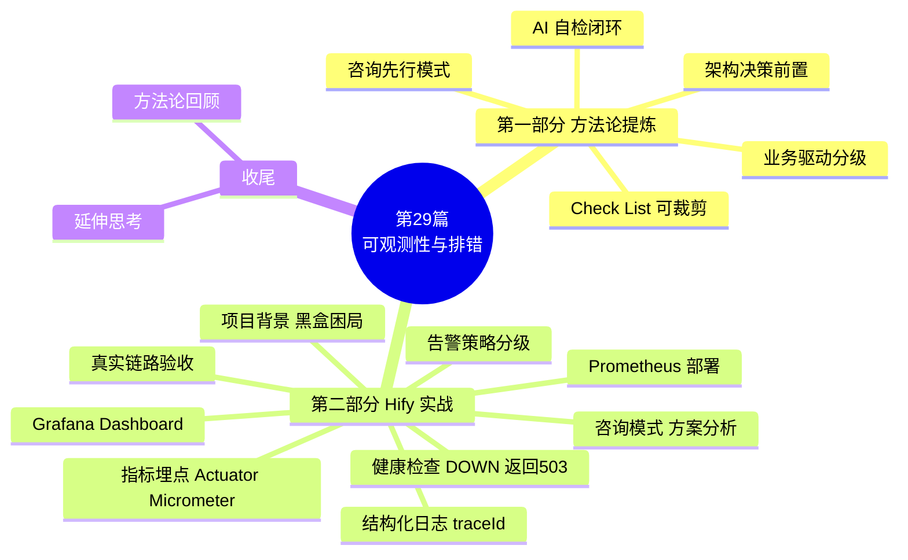

<!--
aicent-29-observability
AI编程方法 29：测试部署 - 监控设施和排错
-->

## 1. 全文导读


本篇围绕「为已上线的 AI 应用建设可观测性」这一典型场景，提炼 AI 编程方法论并配合 Hify 项目实战演示。文中方法不仅适用于可观测性，对任何"先咨询再动手"的工程任务同样适用。



读者定位建议：

- **初学 AI 编程工程师**：按顺序通读，第一部分建立方法论框架，第二部分结合 Hify（Spring Boot + Vue + K8s 的 AI 客服应用）的实操把方法论落地。
- **熟练 AI 编程工程师**：直接看 `### 2.1` 下的可观测性建设 Check List 速查；遇到具体场景再回到第二部分对应章节查 why。

## 2. 第一部分　方法论提炼

### 2.1 可观测性建设的 AI 编程方法论


可观测性建设的难点不在写代码，而在"动手之前想清楚做什么、不做什么、提前定哪些决策"。这一章把原文实战中反复出现的模式抽象成四条可操作的方法论，并附一份可裁剪的 Check List。

#### (1) 咨询先行：先讨论方案再动手

写代码之前先用咨询模式让 AI 分析「该做什么、不该做什么、需要提前考虑哪些架构决策」，禁止 AI 直接生成代码。

价值在于两点：

- <span style="color: red; font-weight: bold;">AI 主动读代码发现提示词里没说的问题</span>。例如原文中 AI 读 `CircuitBreakerService` 后发现熔断器用的是 `ConcurrentHashMap` 自建实例，不走 Resilience4j 的 `CircuitBreakerRegistry`，导致 Micrometer 自动集成无法采集熔断器状态，必须手动注册 Gauge。这种细节开发者不主动提，AI 自己读出来。
- **AI 提出开发者不一定想到的架构决策**。咨询的产出里最有价值的不是"做什么"，而是"哪些决策要提前定"，详见 `(2) 架构决策前置`。

操作要点：咨询提示词里明确列出三类问题——「应该做哪些及为什么」「哪些一期不做及理由」「需要提前考虑的架构决策」，并显式禁止 AI 写代码。

#### (2) 架构决策前置

<span style="color: red; font-weight: bold;">凡是"现在成本低、未来改起来贵"的决策，必须在动手前定下来。</span>原文提炼出三类典型决策：

| 决策 | 一期成本 | 未来若不前置的代价 |
| --- | --- | --- |
| Actuator 端口隔离（业务 8080、Actuator 8081） | 加一行配置 | 后续要改 K8s Service 和 Nginx，牵涉面大 |
| traceId 提前放进 MDC | 加一段打点代码 | 将来接 OpenTelemetry/SkyWalking 时要改所有日志打点 |
| 日志字段规范写进 CLAUDE.md | 写一份字段名表 | 字段一旦进生产，所有 grep 和告警规则都依赖它，改名代价极高 |

<span style="color: red; font-weight: bold;">判断标准：如果某个决策"今天加一行、明天改一片"，就归到架构决策里，写进项目的 CLAUDE.md，让所有相关代码统一遵守。</span>

#### (3) AI 自检闭环模式

不要把 AI 当成"告诉它写什么就写什么"的执行器。原文反复出现的模式是「提示 → AI 读码发现 → 执行 → AI 自检发现 → 修正」的闭环，两个典型时机：

- **执行前主动发现矛盾**。原文生成 Grafana Dashboard 前，<span style="color: red; font-weight: bold;">AI 主动指出提示词里的指标名 `hify_chat_request_duration_seconds` 与实际埋点 `hify_chat_duration_ms`（毫秒、DistributionSummary）不符，按实际埋点生成，否则面板会空白。</span>
- **执行后自检发现遗漏**。Dashboard 生成完成后，<span style="color: red; font-weight: bold;">AI 自己检查发现 `DistributionSummary` 默认只生成 `_count/_sum/_max`、不生成 `_bucket`，导致 `histogram_quantile()` 查询空白</span>，需要加 `.publishPercentileHistogram(true)`。

<span style="color: red; font-weight: bold;">这两个问题提示词里都没提，AI 一个在执行前发现、一个在执行后发现。没有这两步，导入的 Dashboard 面板全是空白。</span>

操作要点：每次让 AI 产出后，明确要求它对照需求逐条自检，并鼓励它主动指出"提示词里没说但读码后发现的问题"。

#### (4) 业务驱动的分级策略

可观测性不只是"埋点 + 告警"，而是"基于业务场景做分级"。原文 Hify 的业务背景是企业内部智能客服、工作时间使用、几十人并发，这三个条件决定了：

- <span style="color: red; font-weight: bold;">阈值要比 C 端产品宽松</span>。对话 P95 延迟 15 秒在 C 端是事故，在 Hify 是"次日评估"的 P2。
- **非工作时间不需要 on-call**。内部工具夜间无人使用，P1/P2 不触发通知。
- <span style="color: red; font-weight: bold;">"不建议告警"清单与正面清单同等重要</span>。例如熔断器 `HALF_OPEN` 看起来像异常，实际是正常恢复流程，告警只会让人误判；告警太多会产生疲劳，让人忽略真正重要的告警。

操作要点：让 AI 在给告警策略前先分析"业务背景对告警的影响"，再按 P0/P1/P2 给出阈值；同时强制要求 AI 列出"不建议告警的指标"。

#### (5) 可观测性建设 Check List


下表是可裁剪的项目速查表，工程师在新项目对应阶段直接对照执行。每一行都来自原文实战。

| 阶段 | 要做的事 | 注意点 | 可向 AI 提问 / AI 会主动发现 |
| --- | --- | --- | --- |
| 方案讨论 | 先咨询再动手，禁止直接写代码 | 让 AI 主动指出架构决策 | "哪些一期不做，理由是什么""有哪些提前要定的决策" |
| 日志规范 | JSON 格式 + traceId 贯穿请求链路 | 字段名一旦进生产就难改，写进 CLAUDE.md | "字段规范要不要写进 CLAUDE.md 统一遵守" |
| 日志跨线程 | 子线程（如线程池）要恢复父线程 MDC | 否则 traceId 在异步链路丢失 | （AI 读 `llmExecutor` 自建线程池代码后发现） |
| 指标埋点 | 命名前缀统一（如 `hify_`），用 Actuator + Micrometer | 自建实例（非 Registry 管理的）需手动注册 Gauge | （AI 读 `CircuitBreakerService` 发现自建 CB） |
| 指标暴露 | Actuator 独立端口（如 8081），不绕 Nginx | 抓取配置端口要和实际配置一致 | （AI 读 application.yml 发现端口写错） |
| 健康检查 | DOWN 时返回 HTTP 503，不是 200 | K8s readinessProbe 看状态码，200 会让流量继续打进故障 Pod | "skipped 算不算 DOWN""503 还是 200" |
| Dashboard | 直接给指标列表让 AI 生成 JSON，导入即用 | 指标名以实际埋点为准；DistributionSummary 要开 percentiles | "导入后面板会不会空白"（AI 自检） |
| 告警策略 | 按 P0/P1/P2 分级，附"不建议告警"清单 | 阈值由业务场景定，不套通用标准 | "基于业务背景，哪些指标不该告警" |
| 验收 | 真实产生数据（多轮对话、RAG、MCP 工具）后看大盘 | 用 traceId 在 `kubectl logs` 里验日志链 | （跑通后回看开篇问题是否两分钟内定位） |

## 3. Hify 项目背景：从黑盒到透明


### 3.1 背景

> 以下进入第二部分「Hify 实战演示」。这部分结合原文中的提示词、AI 读码发现、文件改动、命令与配置，把第一部分的方法论在 Hify（Spring Boot + Vue + K8s 的 AI 客服应用）项目里落地，重点解释为什么这么做。

Hify 已部署上线、用户开始使用。第一个反馈是"客服回复好慢"。开发者打开服务器，却不知道慢在哪里：是 LLM 调用慢？是数据库查询慢？是某个 Provider 触发了熔断？还是 Redis 连接耗尽？什么都看不到，系统是个黑盒。

### 3.2 黑盒困局与目标态

<span style="color: red; font-weight: bold;">黑盒的问题不是"不能解决"，而是"连从哪里开始都不知道"——只能靠猜，或把每个可能的原因挨个排查，花上半天。</span>

本篇做完后，同样的问题，处理路径变成两分钟：

1. 看 Grafana 大盘，确认 LLM P95 延迟最近一小时的趋势。
2. 找到对应时间段的日志，用 traceId 过滤出这条请求的完整链路：`llm_call_done durationMs=3768 providerId=2`。
3. 结论：LLM 调用花了 3.7 秒，问题在 Provider 2，不是 Hify 的问题。

Hify 的技术背景：Spring Boot + Vue 的 AI 应用，模块化单体架构，部署在 K8s 上；核心功能是 LLM 对话，依赖 MySQL、Redis、pgvector，调用外部 LLM API 和 MCP Server。

## 4. 咨询模式：让 AI 先做方案分析

不急着加代码。先用咨询模式搞清楚 Hify 需要做什么、不需要做什么。提示词如下：

```text
Hify 是一个 Spring Boot + Vue 的 AI 应用，模块化单体架构，部署在 K8s 上。
核心功能是 LLM 对话，依赖 MySQL、Redis、pgvector，调用外部 LLM API 和 MCP Server。

我想加可观测性，帮我分析：
1. 应该做哪些，为什么
2. 哪些一期不需要做，理由是什么
3. 有没有什么需要提前考虑的架构决策

不要写代码，先给分析。
```

### 4.1 咨询产出：必做项与不做项

AI 给出了系统性的分析，关键判断如下。

**必须做的：**

- 结构化日志（每条日志带 `sessionId`、`agentId`、`providerId`，格式用 JSON）。
- Actuator 健康端点细化到各依赖。
- LLM 调用耗时和熔断指标（Resilience4j 有 Micrometer 集成，加一个依赖就能暴露熔断器状态）。
- 慢请求 WARN 日志（超过阈值打 WARN，最低成本的性能感知）。

**一期不需要做的：**

- 分布式链路追踪：Hify 是单体，一次请求不跨进程，Zipkin/Jaeger 用不上。
- 前端监控：内部工具，投入产出比不够。
- 日志平台 ELK：先落磁盘，用 `kubectl logs` 看，有聚合需求再接平台，不要一开始就引入 ELK 的运维复杂度。

### 4.2 三个关键架构决策


这是这次咨询最有价值的部分——AI 提出三个需要提前考虑的架构决策，开发者不一定自己想得到，但它们决定了后续扩展的成本。

**决策一：Actuator 端口隔离。** Spring Boot 支持把 Actuator 单独跑在另一个端口（如 8081），业务 API 走 8080 对外，Actuator 走 8081 只在集群内供 Prometheus 抓取。不提前规划，后续要改 K8s Service 和 Nginx 配置，代价较高。

**决策二：traceId 现在就要放进 MDC。** 虽然一期不做分布式追踪，但要提前在 MDC 里放 traceId 和 sessionId。原因是将来接 OpenTelemetry 或 SkyWalking 时，traceId 的字段名和注入位置需要对齐，提前占位可以平滑迁移，否则要改所有日志打点代码。

**决策三：日志字段规范要趁早定。** 日志字段一旦进了生产，改名代价极高，所有 grep 和告警规则都要跟着改。现在就定好字段名：`sessionId`、`agentId`、`providerId`、`modelName`、`action`、`durationMs`、`success`、`errorCode`，写进 CLAUDE.md，所有 LLM 调用处统一遵守。

<span style="color: red; font-weight: bold;">咨询模式的价值就在这里：讨论清楚再动手，比做完了再回头改省力得多。</span>这部分回答基本涵盖了一个应用主要的可观测模块组成。

## 5. 结构化日志与 traceId 贯穿


基于第一步的分析，日志要同时落地两件事：JSON 格式 + traceId 贯穿请求链路。提示词如下：

```text
帮 Hify 配置结构化日志，同时引入 OpenTelemetry 生成 traceId。

要求：
1. 日志格式是 JSON，包含 timestamp、level、traceId、thread、logger、message
2. 同一次请求的所有日志共享同一个 traceId，可以用 traceId 过滤出完整链路
3. traceId 通过 OpenTelemetry 生成，为后续链路追踪预留扩展点
4. 对话链路的关键节点要有日志：请求进入、LLM 调用开始/结束、工具调用、异常
5. 日志输出到 stdout，由 K8s 采集

不需要接 Jaeger 或 Zipkin，一期只用 traceId 串联日志。
```

### 5.1 AI 读码发现的三个问题

AI 没有直接生成代码，而是先读了项目中的相关文件，读完后给出三个发现——这三个问题提示词里都没说，是 AI 自己读代码发现的：

- `RequestLogInterceptor` 已存在且有 traceId 逻辑，但新线程（`llmExecutor`）里 MDC 会丢失。
- `logback-spring.xml` 生产环境是手拼 JSON 字符串（有转义风险），输出到文件而非 stdout。
- `ChatServiceImpl` 日志稀疏，缺少 LLM 调用开始/结束的结构化节点。

这三个发现决定了 AI 要做什么：引入 `logstash-logback-encoder`、修复 MDC 跨线程丢失、重写 logback 配置、补结构化日志埋点、用 OpenTelemetry API 替换 UUID 生成 traceId。

### 5.2 三处改动落地

改动涉及三个文件：

- **RequestLogInterceptor**：用 `Span.current()` 获取 traceId，当前无 OTel Span 时 fallback 到 UUID 16 位 hex，保持格式一致。公开了 MDC key 常量（`MDC_TRACE_ID`、`MDC_SESSION_ID`），其他地方写 MDC 时用常量不用字符串字面量。
- **MdcTaskWrapper（新建）**：解决 `llmExecutor` 跨线程 MDC 丢失问题。父线程的 MDC 快照在提交任务时捕获，子线程执行前恢复，执行后清理。`ChatServiceImpl` 里所有提交到 `llmExecutor` 的任务都用它包一层。
- **logback-spring.xml（重写）**：生产环境改用 `LogstashEncoder`，MDC 字段（traceId、sessionId、agentId）自动提升为顶层 JSON 字段，不再手拼字符串。加异步 Appender，避免 I/O 阻塞业务线程。开发环境保持可读格式。

发完第一条提示词后，开发者又补了一条，把 CLAUDE.md 的字段规范加进约束。AI 回复说第一条已经实现，逐条对照了要求，发现只有 `providerId` 和 `success` 字段没有对齐，直接补了这两个字段，没有重新生成所有文件，只改了缺失的部分。

### 5.3 验证与 OpenTelemetry 扩展路径

做完后，一条完整的对话请求，日志链长这样：

```json
{"timestamp":"2026-04-17T10:23:01.123Z","level":"INFO","traceId":"a3f1b2c4d5e6f708","sessionId":"42","agentId":"7","thread":"llm-3","logger":"ChatServiceImpl","message":"action=llm_call_start sessionId=42 agentId=7 providerId=2 modelName=gpt-4o tools=3"}
```

```json
{"timestamp":"2026-04-17T10:23:04.891Z","level":"INFO","traceId":"a3f1b2c4d5e6f708","sessionId":"42","agentId":"7","thread":"llm-3","logger":"ChatServiceImpl","message":"action=llm_call_done sessionId=42 agentId=7 providerId=2 modelName=gpt-4o durationMs=3768 success=true finishReason=stop tokens=245"}
```

用 `traceId=a3f1b2c4d5e6f708` 过滤，整条链路一目了然。回到开篇的问题：用户说"客服回复慢"，拿时间段搜日志，找到 traceId，一看 LLM 调用花了 3.7 秒，`providerId=2`，问题在这个 Provider 端，不是 Hify 的问题。

**OpenTelemetry 的扩展路径：** 一期 `Span.current()` 返回 noop span，自动 fallback 到 UUID。后续接入完整链路追踪时，只需在 pom 里加一行 `opentelemetry-spring-boot-starter` 依赖，traceId 自动变成真实的 OTel trace ID，所有日志和埋点代码零改动。这就是第 3 章提到的"traceId 提前放进 MDC"这个架构决策在代码层面的落地。

## 6. 指标埋点：Actuator + Micrometer


<span style="color: red; font-weight: bold;">日志告诉开发者"某次请求发生了什么"；指标告诉开发者"系统整体状况如何"</span>——过去一小时平均响应时间多少、LLM 调用成功率多少、哪个 Provider 报错最多、熔断触发了几次。提示词如下：

```text
帮 Hify 加 Prometheus 指标监控。

需要埋点的位置：
1. 对话请求：请求总数（按 agentId 分组）、请求延迟分布
2. LLM 调用：调用总数（按 provider、model 分组）、调用延迟、成功/失败计数
3. 熔断器：各 Provider 熔断状态（CLOSED/OPEN/HALF_OPEN）
4. MCP 工具调用：调用次数、成功/失败

技术要求：
- 用 Spring Boot Actuator + Micrometer
- 指标通过 /actuator/prometheus 暴露
- 指标命名前缀统一用 hify_
```

### 6.1 AI 读码发现：自建熔断器实例

AI 先检查了 pom 和 application.yml，确认没有任何 Actuator/Micrometer 依赖，然后读了 `CircuitBreakerService` 发现一个问题：熔断器用的是 `ConcurrentHashMap` 自建实例，不走 Resilience4j 的 `CircuitBreakerRegistry`，所以 Micrometer 自动集成无法采集到熔断器状态，需要手动注册 Gauge。<span style="color: red; font-weight: bold;">这个细节提示词里没提，AI 读代码后自己发现并处理。</span>

### 6.2 五处改动落地

- **pom 文件**：根 pom 加版本管理，`hify-app` 引入 `spring-boot-starter-actuator` + `micrometer-registry-prometheus`，`hify-common` 引入 `micrometer-core`（埋点用）。
- **application.yml**：Actuator 独立跑在 8081 端口（和第一步讨论的架构决策一致），只暴露 health 和 prometheus 端点，不通过 Nginx 对外。
- **HifyMetrics.java（新建）**：统一管理所有指标定义，命名规范 `hify_{模块}_{动作}_{单位}`。熔断器状态用 Gauge + ConcurrentHashMap 组合解决手动注册问题：状态变更时更新 Map，Gauge 读取 Map 的值，避免重复注册。
- **CircuitBreakerService**：熔断器状态变更时调用 `metrics.circuitBreakerState()`，把 CLOSED/OPEN/HALF_OPEN 编码为 0/1/2 写入 Gauge。
- **ChatServiceImpl**：LLM 调用开始/结束、工具调用、对话完成各埋点，记录计数和耗时。

### 6.3 验证与抓取端口

做完后验证：

```bash
curl http://localhost:8081/actuator/prometheus | grep hify_
```

最终暴露的指标：


<!--
图片内容说明
路径：imgs/aicent-29-observability/9d5cfe0cee2afd2028ac7cada7811e07_MD5.jpg
用途：展示 Hify 应用通过 Actuator 暴露的 hify_ 前缀 Prometheus 指标清单及含义。
内容：图中以表格形式列出 7 个 hify_ 指标及其类型、标签和含义，仅含元数据无具体数值。
- hify_chat_requests_total (Counter，标签 agent_id)：对话总请求数
- hify_chat_duration_ms (DistributionSummary，标签 agent_id)：对话端到端耗时 P50/P95/P99
- hify_llm_calls_total (Counter，标签 provider/model/success)：LLM 调用总次数
- hify_llm_duration_ms (DistributionSummary，标签 provider/model)：LLM 调用耗时 P50/P95/P99
- hify_circuit_breaker_state (Gauge，标签 provider)：熔断器状态 0=CLOSED/1=OPEN/2=HALF_OPEN
- hify_mcp_tool_calls_total (Counter，标签 tool/success)：MCP 工具调用次数
- hify_mcp_tool_duration_ms (DistributionSummary，标签 tool)：MCP 工具调用耗时
-->

注意访问端口是 8081，不是 8080。Prometheus 抓取配置也要指向 8081：

```yaml
scrape_configs:
  - job_name: hify
    static_configs:
      - targets: ['hify-backend:8081']
```

## 7. 完善健康检查：DOWN 返回 503


前一篇的 `/health` 只返回 ok，现在完善成能反映各依赖的真实状态。提示词如下：

```text
完善 Hify 的 /api/v1/health 接口。

当前只返回 {"code":0,"data":"ok"}，需要改成：
- 检查 MySQL、Redis、pgvector 连通性
- 返回各依赖的状态和错误信息
- 整体状态：所有依赖 UP 才返回 UP，任何一个 DOWN 则整体 DOWN

格式参考：
{
  "status": "UP",
  "components": {
    "mysql": "UP",
    "redis": "UP",
    "pgvector": "UP"
  }
}
```

### 7.1 AI 读码发现与设计决策

AI 先读了现有的 `HealthController`、`MockCacheConfig`、`KnowledgeServiceImpl` 和 application.yml，发现三个需要处理的情况：

- mock profile 没有 Redis，直接检测会报错，需要跳过。
- pgvector 是外部 PostgreSQL，当前 application.yml 里没有单独的连接配置，需要新增。
- 知识库模块目前是 mock 实现，pgvector 配置为空时也要能正常启动。

基于这些发现，AI 确定了设计方案：MySQL 用已有 DataSource 执行 `SELECT 1`，Redis 用 `Optional<RedisTemplate>` 注入（没有 Bean 时显示 skipped），pgvector 用独立 JDBC URL（配置为空时显示 skipped）。<span style="color: red; font-weight: bold;">DOWN 时返回 HTTP 503，而不是 200——这是关键</span>，K8s readinessProbe 看的是 HTTP 状态码，只有收到非 2xx 才会把 Pod 标记为 NotReady。

### 7.2 三种场景响应

全部 UP（HTTP 200）：

```json
{"status":"UP","components":{"mysql":"UP","redis":"UP","pgvector":"UP"}}
```

Redis 故障（HTTP 503）：

```json
{"status":"DOWN","components":{"mysql":"UP","redis":{"status":"DOWN","error":"Connection refused: localhost:6379"},"pgvector":"UP"}}
```

mock 开发环境（HTTP 200，Redis 和 pgvector 未配置）：

```json
{"status":"UP","components":{"mysql":"UP","redis":"skipped","pgvector":"skipped"}}
```

skipped 不算 DOWN，开发环境下 K8s 探针不会误报。error 字段只给运维看，不会通过 Nginx 暴露到公网。

**为什么 DOWN 要返回 503？** 前一篇把 `/health` 配成了 K8s 的 readinessProbe。readiness 决定 K8s 要不要把流量导进这个 Pod。如果 MySQL 挂了但接口还返回 HTTP 200，K8s 认为 Pod 健康，流量照常进来，所有查库的请求全报错。<span style="color: red; font-weight: bold;">返回 503，K8s 发现 readiness 失败，把这个 Pod 从 Service Endpoints 里摘掉，流量自动切到其他正常 Pod，用户不受影响。</span>

## 8. 部署 Prometheus


部署 Prometheus 的提示词如下：

```text
帮我生成 Prometheus 的 K8s 部署文件。

要求：
- 从 hify-backend 的 /actuator/prometheus 抓取指标，每 15 秒一次
- 数据持久化用 PVC
- Service 类型 ClusterIP，只在集群内访问
```

### 8.1 AI 自动处理隐蔽坑

AI 先读了 application.yml 确认端口，发现 Actuator 在 8081 而不是 8080——提示词里写的端口是错的，AI 按实际配置写，不是按提示词写。

生成了四个文件：ConfigMap（抓取配置）、PVC（10Gi 持久化存储）、Deployment、Service。几个值得注意的设计：

- **抓取地址是 `hify-backend:8081`，不是 8080**：Actuator 独立端口，不绕 Nginx。
- **strategy: Recreate**：PVC 的 `accessModes: ReadWriteOnce` 只允许单节点挂载。RollingUpdate 会短暂存在两个 Pod 同时运行，新 Pod 挂载 PVC 会失败。Recreate 先删旧 Pod 再起新 Pod，是单实例 Prometheus 的正确策略。
- **initContainer 修正权限**：Prometheus 官方镜像以 UID 65534（nobody）运行，PVC 新建时目录权限是 root，直接挂载会写入失败。initContainer 提前 `chown`，避免启动报错。这个坑很隐蔽，开发者不一定想得到，AI 自动处理了。

### 8.2 部署顺序与验收

部署顺序：

```bash
kubectl apply -f deploy/k8s/prometheus-pvc.yml
```

```bash
kubectl apply -f deploy/k8s/prometheus-configmap.yml
```

```bash
kubectl apply -f deploy/k8s/prometheus-deployment.yml
```

```bash
kubectl apply -f deploy/k8s/prometheus-service.yml
```

结果验收，执行 `curl localhost:8081/actuator/prometheus` 即可看到下面的输出：


<!--
图片内容说明
路径：imgs/aicent-29-observability/4f38af09da8292e6df5e00f29841ecf9_MD5.jpg
用途：展示 curl localhost:8081/actuator/prometheus 后返回的 Prometheus 格式指标文本。
内容：以纯文本形式输出 Spring Boot Actuator 暴露的 Prometheus 指标，每条含 # TYPE / # HELP 注释及指标值，标签 application="hfy"。
可见指标覆盖 JVM（jvm_threads_daemon_threads、jvm_memory_used_bytes、jvm_gc_pause_seconds、jvm_info 版本 25.272-b10）、HikariCP 连接池（pool="HikariPool-1"，min/idle 均为 5.0）、HTTP 请求（http_server_requests_*，method=GET、status=200、outcome=SUCCESS）、Tomcat 会话等。证明 Hify 已正确接入 micrometer-registry-prometheus，/actuator/prometheus 端点可被抓取。
-->

## 9. 生成 Grafana Dashboard


这一步的核心技巧：不需要自己手动在 Grafana 里拖拽配置面板，直接把指标列表给 AI，让它生成 Dashboard JSON，导入就能用。提示词如下：

```text
帮我生成 Hify 的 Grafana Dashboard JSON。

Hify 暴露了以下指标：
- hify_chat_requests_total（label: agent_id）
- hify_chat_duration_ms（DistributionSummary，label: agent_id）
- hify_llm_calls_total（label: provider, model, success）
- hify_llm_duration_ms（DistributionSummary，label: provider, model）
- hify_circuit_breaker_state（label: provider，0=CLOSED 1=OPEN 2=HALF_OPEN）
- hify_mcp_tool_calls_total（label: tool, success）

Dashboard 需要包含以下面板：
1. 对话量（QPS 曲线，按 agent_id 分组）
2. 对话延迟（P50/P95/P99）
3. LLM 调用成功率（按 provider 分组）
4. LLM 调用延迟（P95，按 provider 分组）
5. 熔断器状态（各 Provider 当前状态）
6. MCP 工具调用成功率

输出完整的 Grafana Dashboard JSON，我直接导入使用。
```

### 9.1 AI 自检发现两个问题

AI 生成了 247 行 Dashboard JSON，但在输出之前先主动指出了一个问题：

> 指标名和实际埋点有出入。根据 HifyMetrics.java 里的定义，实际指标名是 `hify_chat_duration_ms`（不是 `hify_chat_request_duration_seconds`），单位是毫秒，类型是 DistributionSummary。以实际埋点的指标名生成 Dashboard，否则面板会空白。

然后在生成完成后又指出了第二个问题：

> HifyMetrics.java 用的是 DistributionSummary，Micrometer 对 DistributionSummary 默认生成 `_count`、`_sum`、`_max`，不生成 `_bucket`。Dashboard 里 `histogram_quantile()` 的查询会空白。如果要 P95/P99 精确分位数，需要在每个 `DistributionSummary.builder()` 里加 `.publishPercentileHistogram(true)`，才能生成 `_bucket`。要不要现在改？

确认后，AI 读了 `HifyMetrics.java`，在所有 DistributionSummary 上加了这一行配置。这两个问题提示词里都没提到，AI 一个是在执行前主动发现，一个是执行后自己检查发现——没有这两步，生成的 Dashboard 导入进去面板全是空白。

### 9.2 六面板设计与导入

六个面板的设计：


<!--
图片内容说明
路径：imgs/aicent-29-observability/ab2d2537f81563b8fc04086fa16a3392_MD5.jpg
用途：展示 Claude Code 生成的 247 行 Dashboard JSON 导入 Grafana 后的六面板设计。
内容：Grafana Dashboard 共 6 个面板（以面板/类型/关键设计三列表格形式呈现）。
1）对话量 QPS — 折线图，使用 rate()[2m] 突变敏感；
2）对话延迟 P50/P95/P99 — 折线图，聚合所有 agent 看整体分布；
3）LLM 成功率 — 折线图，success=true 除以总量按 provider 分组；
4）LLM P95 延迟 — 折线图，按 provider 分组定位慢节点；
5）熔断器状态 — 表格，颜色映射 CLOSED/OPEN/HALF_OPEN；
6）MCP 成功率 — 水平条形图，阈值着色 ≥99% 绿/≥90% 黄/<90% 红。
-->

导入方式：Grafana → Dashboards → Import → Upload JSON file → 选 `deploy/grafana-dashboard.json`。

## 10. 让 AI 梳理告警策略


有了指标，下一步是告警。告警的关键点是：不是所有异常都需要叫醒人，分级处理才能避免告警疲劳。提示词如下：

```text
基于 Hify 当前暴露的指标，帮我梳理告警策略。

Hify 的业务背景：企业内部智能客服，工作时间使用，非 24 小时高可用场景。
用户规模：几十人并发。

帮我整理：
1. 哪些指标需要告警
2. 每条告警的阈值建议和触发条件
3. 告警级别（P0 立即响应 / P1 30 分钟内 / P2 次日处理）
4. 理由

不要写 Grafana 配置，先给策略清单。
```

### 10.1 分级告警清单

AI 给出的清单分四个部分：P0、P1、P2，以及不建议告警的指标。

**P0：立即响应（服务不可用）**

- 后端 scrape 失败：`up{job="hify-backend"} == 0` 持续 1 分钟。后端进程挂了或网络断了，所有用户无法使用。
- health 接口返回 503：持续 2 分钟。MySQL 断开后所有对话写入失败，服务完全不可用。
- 所有 provider 熔断器全部 OPEN：`min(hify_circuit_breaker_state) == 1` 持续 5 分钟。所有 LLM provider 都熔断意味着完全无法对话。

**P1：30 分钟内响应（功能降级）**

- LLM 调用错误率 > 30%，持续 5 分钟：每 3 次对话就有 1 次失败，用户体验已明显受损；低于这个值可能是偶发网络抖动。
- 单个 provider 熔断器持续 OPEN 超过 10 分钟：10 分钟是给 provider 自动恢复的宽限时间，超过说明需要人工介入。
- 对话 P95 延迟 > 30 秒，持续 10 分钟：LLM 正常响应 5-15s，30s 是明显异常，不是 LLM 本身慢而是系统级问题。
- Redis DOWN 持续 3 分钟：Redis 断开后上下文缓存失效，每次对话回落到 MySQL 加载历史，性能下降但不完全不可用；3 分钟给 Redis 自动重连的时间。

**P2：次日处理（潜在风险）**

- LLM P95 延迟 > 15 秒，持续 30 分钟：15s 慢但在用户接受范围内，可能是 provider 侧负载高，次日评估是否要切换模型。
- MCP 工具调用失败率 > 20%，持续 15 分钟：工具失败不影响基础对话，但持续失败说明外部系统有问题。
- 工作时间对话量骤降 80%，持续 20 分钟：工作时间（9-18 点）对话量骤降往往是前端不可达或 Nginx 挂了，后端看起来正常，容易漏报。

汇总表如下：


<!--
图片内容说明
路径：imgs/aicent-29-observability/38963015ccb67db6f5a3d002c73ebe9d_MD5.jpg
用途：Hify 可观测性告警策略汇总表，按 P0/P1/P2 划分响应优先级。
内容：表格含 4 列——告警编号 / 级别 / 触发条件 / 响应时限。
P0（立即响应）：P0-1 scrape 失败 1min；P0-2 health 503 持续 2min；P0-3 所有 provider 熔断 5min。
P1（30 分钟内）：P1-1 LLM 错误率 >30% 持续 5min；P1-2 单 provider 熔断 10min；P1-3 对话 P95 >30s 持续 10min；P1-4 Redis DOWN 3min。
P2（次日）：P2-1 LLM P95 >15s 持续 30min；P2-2 MCP 失败率 >20% 持续 15min；P2-3 工作时间对话量骤降 80%。
-->

### 10.2 不建议告警的指标与业务驱动阈值

**不建议告警的指标：**

- 单次 LLM 调用延迟（LLM 本身就慢，偶发 20s 属正常）。
- MCP 工具调用次数（业务量指标，不代表故障）。
- 非工作时间的任何 P1/P2（内部工具，夜间无人使用无需 on-call）。
- 熔断器 HALF_OPEN 状态（是正常恢复流程，不需要打扰人）。

这份清单有两点值得注意。

第一，AI 一开始就分析了"业务背景对告警的影响"——内部工具、工作时间使用、几十人并发，这三个条件决定了阈值要比 C 端产品宽松，非工作时间的 P1/P2 不需要 on-call。阈值是根据业务场景定的，不是套通用标准。

第二，"不建议告警"这部分和正面清单同样重要。告警太多会产生疲劳，让人忽略真正重要的告警。HALF_OPEN 状态是一个典型例子：看起来像异常，实际上是熔断器正常恢复流程，加了告警只会让人误判。

策略确认后，让 AI 生成对应的 Grafana Alert 规则 JSON，导入配置即可。

## 11. 验收：真实链路全跑通


部署完整可观测性栈：

```bash
kubectl apply -f deploy/k8s/prometheus-pvc.yml
```

```bash
kubectl apply -f deploy/k8s/prometheus-configmap.yml
```

```bash
kubectl apply -f deploy/k8s/prometheus-deployment.yml
```

```bash
kubectl apply -f deploy/k8s/prometheus-service.yml
```

```bash
kubectl apply -f deploy/k8s/grafana.yaml
```

```bash
kubectl get pods -n hify
```

产生真实数据：和 Hify 对话几轮，触发 RAG 检索，绑定 MCP 工具查询订单。


<!--
图片内容说明
路径：imgs/aicent-29-observability/9ec0cb4fb8f086c9ebcc210d52a1a49a_MD5.jpg
用途：展示与 Hify 对话几轮后，Grafana 大盘（节点 IP:30030）上看到的真实数据验收结果。
内容：大盘标题为 "Hify - AI Agent Platform"，时间范围为 Last 5 minutes，共 6 个面板。
- 对话量 QPS（按 Agent 分组）：有 agent=1 / agent=unknown 等基线数据。
- 对话延迟 P50/P95/P99：有毫秒级分布。
- LLM 调用成功率（按 Provider）：OPENAI 为 100%，证明真实产生了 LLM 调用。
- LLM 调用延迟 P95（按 Provider）：OPENAI 有可观测的 P95 延迟。
- 熔断器状态表格：OPENAI 对应 hify_circuit_breaker_state=0（CLOSED 健康态，绿色）。
- MCP 工具调用成功率面板：有调用数据。
-->

打开 Grafana 大盘（节点 IP:30030），确认：

- 对话量 QPS 曲线有数据。
- 对话延迟 P50/P95/P99 有分布。
- LLM 调用成功率按 provider 分组显示。
- 熔断器状态表格显示 CLOSED（绿色）。

验证日志链：找一条刚才的对话，搜它的 traceId。

```bash
kubectl logs -n hify deploy/hify-backend | grep "traceId=<你的traceId>"
```

模拟依赖故障，验证健康检查 + K8s 自动摘流量：

```bash
curl http://hify-backend:8080/api/v1/health
```

```bash
kubectl get pods -n hify
```

Redis 恢复后，健康检查重新返回 UP，Pod 变回 1/1 Ready，流量自动恢复。

## 12. 方法论回顾

本篇做完，"客服回复慢"这个问题有了完整的排查路径，背后是四条反复出现的方法论模式（与第一部分呼应）：

- **traceId 定位单次请求**：拿时间段搜日志，找到 traceId，`llm_call_done durationMs=3768 providerId=2` 告诉开发者 LLM 调用花了 3.7 秒，是哪个 Provider 的问题。
- **Grafana 大盘看趋势**：不是偶发就是系统性问题，LLM P95 延迟面板一眼看出。Dashboard JSON 是 AI 生成的，不需要手动拖拽配置，而且 AI 在生成前主动发现了指标名不对，生成后发现 DistributionSummary 缺 `_bucket` 会导致面板空白——这两步开发者不一定想得到。
- **健康检查自动摘流量**：MySQL 或 Redis 故障时，readinessProbe 检测到 503，K8s 自动把 Pod 从负载均衡里摘掉，用户请求不会打到故障实例。
- **分级告警不吵人**：10 条告警，3 条 P0 立即响应，其余按级别处理。不建议告警的清单和正面清单同样重要，AI 是结合 Hify 的业务背景（内部工具、工作时间使用）给出的阈值，不是套通用标准。

整个过程的几个反复出现模式值得记住：AI 先读代码再动手，提示词里没说的问题它自己发现；执行后主动做自检，发现 DistributionSummary 的问题是执行后检查到的；端口写错了按实际配置生成，不是按提示词盲目执行。<span style="color: red; font-weight: bold;">这些加在一起，和"告诉 AI 写什么就写什么"是两种完全不同的工作方式。</span>

## 13. 延伸思考

下面三个方向留作延伸，可与 AI 进一步讨论：

**日志平台选型。** 当前日志输出到 stdout，由 K8s 采集，用 `kubectl logs` 看。如果要加按 traceId 全文搜索的能力，需要引入日志平台。让 AI 对比 Loki 和 EFK 两个方案，结合 Hify 的规模给出建议，重点问运维复杂度和资源消耗的差异。

**告警规则落地。** 告警策略清单确认后，下一步是把它变成 Grafana Alert 规则。P0-3"所有 provider 熔断器全部 OPEN"对应的 PromQL 是 `min(hify_circuit_breaker_state) == 1`，让 AI 生成这条告警的 Grafana Alert JSON，测试能否正确触发。

**完整链路追踪。** OpenTelemetry 现在只用了 traceId 串联日志，`Span.current()` 返回 noop。如果要开启完整链路追踪——每个 LLM 调用、每次数据库查询都记录成 Span，发到 Jaeger 可视化——需要做哪些改动？让 AI 评估改动范围，重点看是否需要修改业务代码。
