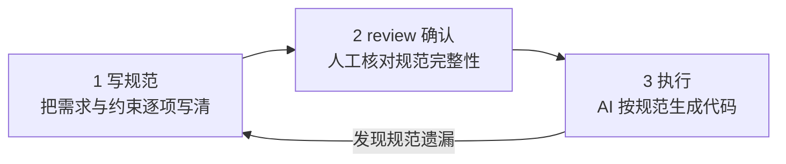
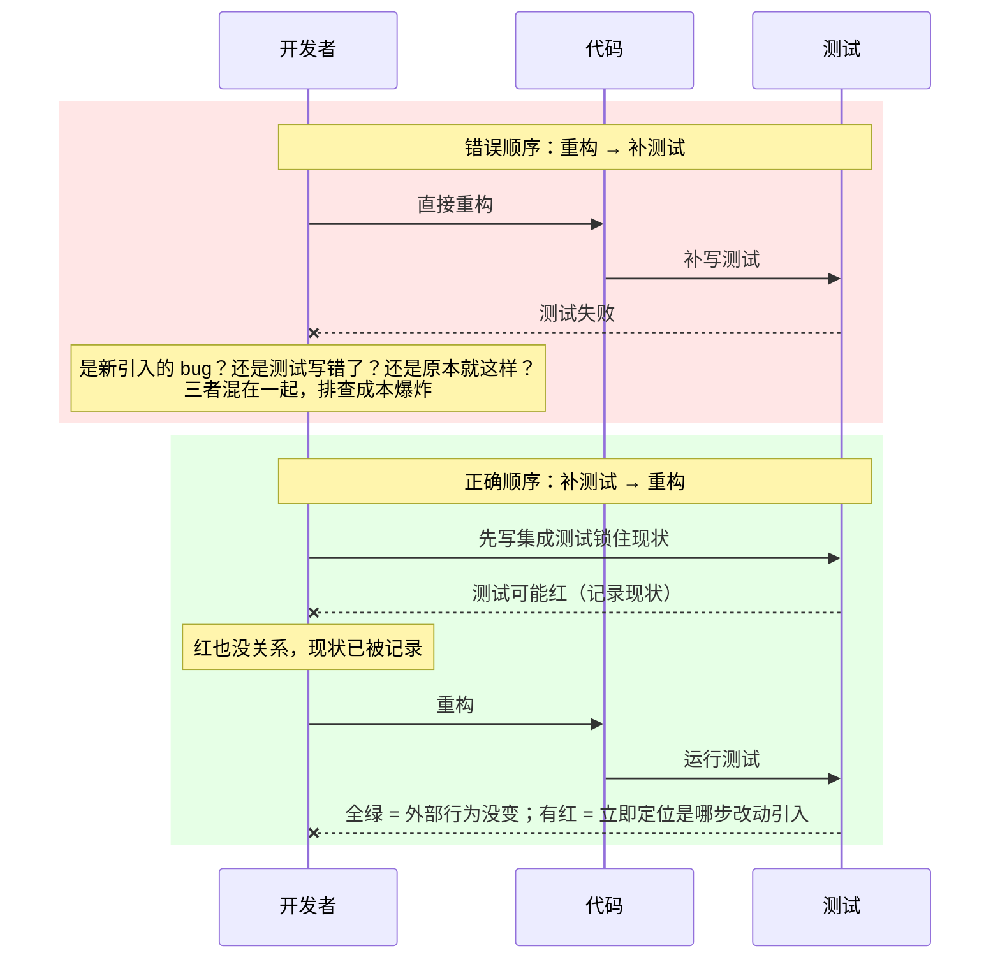

<!--
aicent-31-project-retro-advanced
AI编程方法 31：复盘进阶 - 项目回顾
-->

## 1. 导读：这篇文章怎么读


本文是本系列第 31 篇，聚焦一个具体问题：**规范驱动开发（Spec-Driven Development，SDD）在真实项目里到底怎么落地**。市面上谈"用 AI 写代码"的资料很多，但大多数停留在"怎么写好一句提示词"的层面。真正卡住团队的，不是提示词技巧，而是规范在哪儿写、写到什么粒度、用什么工具承载、谁负责维护。这篇把方法论的四个层次、三档工具选型、一种新的工作方式讲清楚，再配上一篇实战复盘。

### 1.1 本文解决什么问题

一句话：**把"先写规范、再让 AI 执行"这件事，从口号变成可操作的标准动作**。展开成三个子问题：

- 规范应该写在哪里？CLAUDE.md、Skills、Spec-Kit、Kiro 各自管什么，边界在哪。
- 不同规模的团队该选哪一档工具？零配置能用还是要上结构化规范平台。
- 什么时候必须先写规范再动手，什么时候可以直接让 AI 执行？

读完本文，开发者应该能拿着一张判断表，对自己的项目做出选型决策，而不是被工具营销牵着走。

### 1.2 两条阅读路径

本文设计了两条路径，按熟练程度分流，避免读者在不适合自己的章节上浪费时间。


<!--
\`\`\`mermaid
flowchart TD
    Start([开始阅读]) --\> Intro[第1章 导读]

    subgraph FastPath["熟练工程师 速查路径"]
        F1[第2章 方法论手册、只看结论与判断表]
        F2[第2章末 Check List]
        F3[第4章 收尾观点]
    end

    subgraph SlowPath["初学工程师 精读路径"]
        S1[第2章 方法论手册、建立完整框架]
        S2[第3章 实战复盘、看真实决策与踩坑]
        S3[第4章末 思考、对照自己项目]
    end

    Intro --\> F1
    F1 --\> F2
    F2 --\> F3
    F3 --\> Done1([约 15 分钟])
    Intro --\> S1
    S1 --\> S2
    S2 --\> S3
    S3 --\> Done2([约 40 分钟])
\`\`\`
-->

**速查路径**适合已经用过 Claude Code、对 SDD 有概念的读者。直接跳到第 2 章看方法论结论和判断表，对照 Check List 自查，最后读收尾观点即可。**精读路径**适合第一次接触规范驱动开发的读者，需要先建立"四层模型"的框架，再通过第 3 章实战复盘看到这些原则在真实决策里如何取舍。

### 1.3 阅读约定

为避免歧义，先约定本文的几条写作规则：

- **第三人称叙事**。正文用"作者/开发者/团队"指代，不出现"我/我们"。唯一例外是 Code Block 里的提示词示例——那是用户向 AI 下指令的口吻，保留"我/帮我"原样，不做改写。
- **代码块承载一切技术内容**。命令、配置、提示词、流程图、结构图统一放 Markdown Code Block，正文不夹带裸代码。流程图用 Mermaid。
- **四级标题编号**。从 `# 1` 到 `#### 1.1.1.1`，严格递进，方便引用和跳转。
- **不使用水平线**。章节之间靠标题层级区分，不用 `---`。
- **系列表述**。本文属于本系列第 31 篇，不使用"课程/第n讲"这类说法。

## 2. 第一部分 方法论手册

本部分把规范驱动开发的方法论拆成五块加一份可裁剪清单：规范工具分几层、各管什么（2.1）→ 不同规模团队怎么选工具（2.2）→ 选完工具后怎么用，即 Spec Coding 的工作方式（2.3）→ 老项目怎么改造（2.4）→ 工具选型的通用判断原则（2.5）→ 可裁剪的方法论 Check List（2.6）。2.1 到 2.3 建立选型与用法的骨架，2.4 补足存量代码的改造方法，2.5 给出工具决策的通用框架，2.6 把前五节浓缩成可勾选的清单。读完这一部分，开发者手里应该有一套可以直接落到项目里的判断标准，而不是一句模糊的"要重视规范"。

### 2.1 规范工具的四个层次：分层原则


**原则陈述**：规范不是一个文件能装下的，必须按"作用域"分层，让每一层只回答一个问题。把所有规范堆进一个文件，是后续一切混乱的根源。

#### (1) 为什么必须分层

规范混在一起的代价是具体的、可观测的：

- **加载机制冲突**。CLAUDE.md 在每次会话启动时被 Claude Code 全量读入上下文，它必须精简、稳定。把单次任务的执行步骤塞进去，等于让全局上下文不断膨胀，挤压有效信息。
- **读者错位**。CLAUDE.md 的读者是 Claude Code 本身，写法要像"项目宪法"；而任务流程的读者是"在做这件事的人 + 协作的 AI"，需要的是可按需触发的操作手册。两者混写，两类读者都读不清楚。
- **衰减加速**。一个文件越长、内容越杂，维护者越不敢改，规范就会和实际代码偏离得越远。

#### (2) 四个层次一览

下表把四层工具的职责、读者、加载方式一次说清。理解这张表，比记住任何一个具体工具的名字更重要。


<!--
路径：imgs/aicent-31-project-retro-advanced.md/697e7ffddc9bb0de45ee3ed3df0c6589_MD5.jpg
用途：用于"规范工具的四个层次"小节，把容易混淆的 CLAUDE.md / Skills / Spec-Kit / Kiro 四类规范工具放在同一张图里对比，帮读者理解"为什么 CLAUDE.md 会越写越长"的根因——把不同性质的内容混在了一起。
内容：垂直分层列表，从上到下四个层次，从"轻/个人小团队"到"重/大团队"递进。
- 第一层 CLAUDE.md：项目级规范、全局生效、每次启动都读，适合个人/小团队。
- 第二层 Skills：任务级规范、按需触发/命令加载（单测、集成测试、文档生成…），标记为"轻"。
- 第三层 Spec-Kit / Kiro：工程级规范、结构化、跨项目复用，用于团队协作/企业合规。
- 第四层 Harness / CI：交付级保障、流水线自动执行，适合 20+ 人团队，标记为"重"。
核心信息：四层解决的是不同性质的问题（全局规则 vs 任务流程 vs 工程协作 vs 交付保障），分层而非替代，按团队规模逐级引入。
-->

下表与上图互为补充：图体现"从轻到重的规模递进"，表给出"每层的可操作判据"。

| 层次 | 解决什么问题 | 读者 | 加载方式 | 越界症状 |
|---|---|---|---|---|
| CLAUDE.md | 项目全局规则：技术栈约束、代码风格、命名约定、禁止事项、模块职责 | Claude Code（每次启动） | 全量自动读入上下文 | 文件超过 200 行；出现"步骤1/2/3"；不同模块规范混杂；Claude Code 开始忽略靠后的内容 |
| Skills | 某类任务怎么做：单测、集成测试、API 文档生成、代码审查、数据库迁移 | 开发者主动触发 | `/命令` 按需加载，不全量占用上下文 | 任务流程被塞回 CLAUDE.md；Skill 描述模糊导致触发不准 |
| Spec-Kit | 结构化规范 + 版本管理：把"做什么"写成可追溯的 spec 文档 | 团队协作（人与 AI 共读） | 开源工具，与 Claude Code Skill 对接 | 把"怎么做"也写进 spec，和 CLAUDE.md 职责重叠 |
| Kiro | 强制流程：spec → design → tasks → implement 四步，全链路追溯 | 合规要求高的大型团队 | AWS 出品的 IDE，内置强制约束 | 小团队被流程拖慢；需求-开发-测试之间的审批成本超过收益 |

#### (3) 核心判断动作

落地这张表时，开发者手上只需要一个判别问题，就能决定一句话规范该放哪一层：

> **这句话是"全局规范"，还是"任务流程"？**

- 全局规范的特征：**项目里所有相关代码都要遵守，且长期不变**。典型例子是"断言库用某个固定框架"——它约束的是风格与依赖，不随任务变化。这类内容放 CLAUDE.md。
- 任务流程的特征：**只在做某类任务时才用得上，且有先后步骤**。典型例子是"写单测的完整流程：先读被测代码 → 输出路径分析 → 给测试计划 → 确认后写代码"——它约束的是动作顺序，只在触发单测任务时才需要。这类内容放 Skills。

一个快速自检：把这句话里的任务名词去掉，它还成立吗？成立的是全局规范，不成立的是任务流程。"使用 AssertJ 做断言"去掉"单测"依然成立，是全局规范；"先读被测代码再写测试"去掉"单测"就不成立，是任务流程。

#### (4) 常见误区对比

| 误区 | 表现 | 修复动作 |
|---|---|---|
| CLAUDE.md 当垃圾桶 | 什么都往里塞，超过 200 行 | 用 2.1.3 的判别问题逐句过一遍，任务流程迁出到 Skills |
| Skills 描述写不清 | 描述太泛（如"辅助开发"），触发不准 | 描述写成"在 X 场景下做 Y"，明确触发条件 |
| Spec-Kit 管太多 | 把"怎么做"也写进 spec，和 CLAUDE.md 打架 | Spec-Kit 只管"做什么"（需求），"怎么做"留给 CLAUDE.md |
| Kiro 强行下沉 | 小团队用四步强制流程，审批拖垮节奏 | 团队 ≤15 人且无合规要求时，不要上 Kiro |

### 2.2 SDD 工具选型：按团队规模分层


**原则陈述**：工具选型不是"越强越好"，而是"够用就好"。判断标准不是工具的功能列表，而是团队规模和规范变化频率这两个可量化指标。

#### (1) 三档工具与适用场景

SDD 工具按承载能力大致分三档，对应不同的团队规模和协作复杂度：

- **第一档：CLAUDE.md + Skills**。零配置，开箱即用。适合个人开发者或 ≤3 人的小团队，且项目规范变化不频繁。这一档只回答"AI 怎么遵守项目规则"。
- **第二档：Spec-Kit**。引入结构化规范与版本管理。适合 3–15 人、需要协作的团队。它管的是"做什么"（需求层面的 spec），而 CLAUDE.md 继续管"怎么做"——两者互补，不替代。
- **第三档：Kiro**。强制 spec → design → tasks → implement 全链路流程。适合 >15 人、有合规要求、需要需求-开发-测试全链路追溯的团队。强制流程带来审批代价，小团队用了反而拖慢节奏。
- **补充档：Harness**。当团队超过 20 人、且每日部署超过 5 次时，再考虑平台级编排工具，处理多团队、多环境的规范同步与流水线集成。

#### (2) 决策树

下面这张决策树把"够用就好"具体化成人数阈值。顺着团队实际情况走一遍，停在第一个满足条件的档位即可，不要往上越级。


<!--
flowchart TD
    Q1[团队人数？] --\>|≤ 3 人| A1[CLAUDE.md + Skills<br/>第一档 零配置]
    Q1 --\>|3 - 15 人| Q2{规范是否需要<br/>结构化与版本管理？}
    Q1 --\>|> 15 人| Q3{是否有合规或<br/>全链路追溯要求？}

    Q2 --\>|否| A1
    Q2 --\>|是| A2[Spec-Kit<br/>第二档 互补 CLAUDE.md]

    Q3 --\>|否| A2
    Q3 --\>|是| Q4{团队 > 20 人<br/>且日部署 > 5 次？}

    Q4 --\>|否| A3[Kiro<br/>第三档 强制流程]
    Q4 --\>|是| A4[Harness<br/>补充档 平台编排]

    A1 --\> R[原则：停在最小够用档<br/>不主动越级]
    A2 --\> R
    A3 --\> R
    A4 --\> R
-->

#### (3) 选型要避免的两种倾向

| 倾向 | 表现 | 代价 |
|---|---|---|
| 过度选型 | 3 人小团队上 Kiro，给每个改动走四步审批 | 流程成本远超收益，团队放弃维护 spec，规范形同虚设 |
| 选型不足 | 15 人团队还靠口头同步规范，没有版本管理 | 规范随人员流动而丢失，AI 和新成员都拿不到一致信息 |

一句话收口：**工具的档次要匹配团队的协作复杂度，而不是匹配团队对"先进性"的偏好**。

### 2.3 Spec Coding 工作方式：先规范后执行


**原则陈述**：Spec Coding 不是一款工具，而是一种工作方式——**先把规范写清楚，再让 AI 执行**。规范是输入，代码是输出。这个顺序一旦颠倒，AI 就只能靠假设填空，而假设会全部变成后期的返工成本。

#### (1) 为什么"直接执行"会出问题

当开发者把一个模糊需求直接丢给 AI 时，AI 不会停下来追问，而是默默做一堆假设：导出哪些字段、用什么样式、同步还是异步、接口放在哪一层、错误怎么处理。这些假设不会写在输出里，开发者只能从生成的代码里反向猜。等发现假设错了，改的往往不是一处，而是牵动多个文件。**返工的轮数，和最初没说清的假设数量成正比**。

#### (2) 两种工作方式对比

| 维度 | 直接执行 | Spec Coding |
|---|---|---|
| 假设透明度 | 低：AI 默默假设，开发者事后才发现 | 高：规范里逐项写清，review 阶段就能发现遗漏 |
| 修改轮次 | 多：每发现一个错假设就返工一次 | 少：在规范阶段一次性对齐 |
| 适用场景 | 简单、确定性高、单文件改动 | 复杂、不确定、跨文件或跨系统 |
| 风险 | 错误藏在代码里，测试通过也不代表理解对 | 前期多花时间写规范，但错误前置 |

#### (3) Spec Coding 的三步流程



关键在第二步：**review 的是规范，不是代码**。很多团队把 review 留到代码生成之后，这等于放弃了 Spec Coding 最大的好处。规范阶段的 review 成本最低——改一行规范，比改十行代码便宜得多。

#### (4) 什么时候用、什么时候不用

Spec Coding 有明确的适用判据，不是所有任务都需要。三条触发条件，满足任一即建议先写规范：

- **改动范围 > 3 个文件**。跨文件改动意味着涉及多个模块的协作，假设空间大，必须先对齐。
- **需求不确定性高**。第一次做某类功能、或需求方表述模糊时，规范能逼着把模糊点提前暴露。
- **涉及外部系统集成**。跨系统边界的数据格式、协议、错误处理一旦错配，调试成本极高，必须在规范阶段敲定。

反之，**简单 CRUD 不需要 Spec Coding**。一个字段增删改查、单文件、逻辑明确，直接让 AI 执行更快。给简单任务套规范流程，是用 Spec Coding 的形式主义拖慢自己。

判断口诀：**任务越复杂、越不确定、越跨界，越要前置规范；任务越简单、越确定、越内聚，越要直接执行**。

### 2.4 老项目改造三原则


老项目改造的本质是**降低风险，不是追求完美**。企业里多年存量的代码普遍没有单测、命名混乱、模块边界模糊，而"推倒重来"几乎从不是正确答案。本节给出三条必须遵守的原则，核心是一句话：**顺序不能反**。

#### (1) 为什么"大重构"思维是敌人

专门开一个"大重构项目"、暂停新功能三个月做全量重写，在企业环境里几乎不可能成功。失败有三个根因：

- **中途被叫停**：业务方不会等。三个月内只要有一次高优需求插队，重构就会被压缩、延期、最终烂尾。
- **引入大量新 bug**：重写时丢失了对原有隐式行为的理解（下游依赖了某个 bug 行为、某个边界条件靠副作用兜底），新版上线后问题集中爆发。
- **团队士气崩溃**：长时间看不到产出、反复返工、代码评审变成对抗，工程师会用脚投票。

正确的心智模型是**渐进改造**：每次改动让文件比改之前稍微好一点，两条线（新功能交付 + 规范对齐）并行推进。

#### (2) 原则一：摸底先于动手

> **不凭经验猜，让 AI 先给出客观的代码现状报告。**

**为什么**：人对老项目的记忆是模糊且乐观的（"大概就那几个地方有问题"）。没有基线，"改好了"就无从衡量。

**怎么做**：

1. 让 Claude Code 通读目标模块，输出**具体到文件行号**的问题清单，而不是泛泛的"代码质量不高"。
2. 报告必须可量化（如"拼接 SQL 的位置有 N 处""超过 300 行的 God Class 有 M 个"）。
3. 建立**月度重跑机制**：每月用同一份提示词重跑一次报告，对比数字衡量进展，避免"感觉在改、实际没动"。

**反例**：

```text
错误做法：凭印象说"OrderServiceImpl 逻辑挺乱的，这次顺手重写一下"。
后果：重写过程中发现牵连 12 个下游调用方，进退两难。
```

#### (3) 原则二：先补安全网再做改造（最重要）

> **先写集成测试锁住现有行为，再做任何重构。顺序不能反。**

这是三条原则里**最重要**的一条。老项目的致命之处在于：你不知道现有代码的"正确行为"到底是什么——很多下游已经依赖了某个 bug 行为，那个 bug 在事实上就是契约。

**为什么顺序不能反**：



**怎么做**：

1. 改造前，针对要动的模块**先补集成测试**（不是单测——老项目单测几乎写不动），测试通过即代表"现状已被记录"。
2. 测试一开始是红的也没关系，先把现状锁住。
3. 重构后跑同一套测试：全绿说明外部行为没变，有红就能立即定位到具体改动。

**反例**：先重构再补测试，测试一红，无法区分是新 bug、测试错、还是原本就有问题，三人天耗在一个函数上。

#### (4) 原则三：童子军规则渐进改造

> **不专门开大重构项目；每次动到哪个文件，顺手让 AI 把这个文件的规范对齐。**

**为什么**：专门的大重构违背 2.4.1 的所有失败根因。童子军规则（"离开时比来时更干净"）把改造成本摊到日常迭代里，团队无感、业务无感、风险分散。

**怎么做**：

1. 每次因新功能或修 bug 触碰某文件时，追加一个规范对齐的小任务（由 Claude Code 执行：命名、分层、注释、异常处理统一）。
2. 每修复一类**新发现**的问题，立即更新 `CLAUDE.md` 的"遗留问题处理规范"一节，下次同类问题由 AI 自动处理，不再依赖人记。
3. 不追求一次到位，追求"这个文件比改之前好一点"。

#### (5) 节奏预期

渐进改造不是无限期拖延，要给管理层和团队明确的预期数字：

| 指标 | 参考值 |
|---|---|
| 5 年历史中型项目 → 规范覆盖率 80% | 约 **3–6 个月** |
| 期间新功能交付 | **正常进行，不暂停** |
| 专项改造 session | **每周固定 1 个**，只做规范对齐、不做新功能 |
| 童子军修复 | 其余迭代时间里**顺手做** |
| 进展衡量 | **月度**重跑摸底报告对比 |

两条线并行：一条是每周一个的专项 session（集中火力对齐规范），一条是日常迭代里的童子军修复（零散但持续）。两者叠加，3–6 个月见到系统性变化。

### 2.5 工具选型通用判断原则


工具是**手段不是目的**，选型永远从实际痛点出发，而不是从"最近哪个工具火"出发。

#### (1) 通用判断原则

**第一原则**：觉得需要新工具时，先问一句——

> **是"现有工具解决不了"，还是"现有工具用得不够好"？**

大多数时候，问题不是缺工具，而是规范没建好。新工具带有学习成本、维护成本、推广成本，引入前必须确认现有工具已经用到极限。

**第二原则**：**不追工具，追问题**。工具生态半年一变，但问题类型是稳定的，无非三类：

1. 代码生成质量
2. 团队规范同步
3. 交付质量保障

把问题定义清楚，工具自然浮现；反过来（先选工具再找用处）必然踩坑。

#### (2) 决策流程


<!--
flowchart TD
    A[识别到一个痛点] --\> B{现有工具是否已用到位？}
    B --\>|没有| C[先把现有工具用好<br/>查 CLAUDE.md / Skills / 规范]
    B --\>|已到位仍解决不了| D{是否有成熟工具直接对应此痛点？}
    D --\>|有| E[小范围试点 → 衡量 → 推广]
    D --\>|没有| F[自建最小方案或暂缓]
    C --\> G[再观察痛点是否缓解]
    G --\>|缓解| H[结束]
    G --\>|未缓解| D
    E --\> H
    F --\> H
-->

#### (3) 痛点 → 工具对应表

| 痛点 | 首选动作 | 避免的误区 |
|---|---|---|
| 代码生成质量不够好 | **先查规范**（90% 是 `CLAUDE.md` 不清晰，或该放 Skills 的塞进了 `CLAUDE.md`） | 直接换模型 / 换工具 |
| Claude vs Cursor 选哪个 | **都买**（Claude 啃复杂任务 / Cursor 做日常编辑）；只能选一个先 **Cursor** | 反复对比测评浪费时间 |
| 团队规范不一致 | **Spec-Kit** | 靠口头约定 / wiki |
| 企业合规与可追溯 | **Kiro** | 自己搭台账 |
| CI/CD 质量保障 | **先上 GitHub Actions** | 等"完美方案"再动 |
| 多团队 LLM 调用失控 | **AI Gateway** 统一管控 | 各团队各自接各家 API |
| AI 应用上线后难排查 | **LangSmith / Langfuse** 可观测性 | 等出问题再找 |

#### (4) 两个标志性判断

- **Claude Code + Cursor 组合**是目前投入产出比最高的搭配，约 **40 美元/月**即可覆盖绝大多数个人与小组场景。
- **AI Gateway 是企业 AI 基础设施成熟度的标志**：当组织内有 10 个以上团队各自调用各种模型、还没有统一管理时，迟早要出合规或成本问题，此时引入 Gateway 不是可选项。

#### (5) 可观测性常被忽视

AI 应用（尤其是生产环境的 Agent / RAG）**上线的同时**就应接入 LangSmith 或 Langfuse，不要等出问题再补。事后补可观测性意味着问题发生时没有任何现场可查，排查只能靠猜。

### 2.6 方法论 Check List（可裁剪）

> 本节可整段裁剪到 Notion、issue 模板或团队周会看板，按组勾选推进。

#### (1) 规范建设

```markdown
- [ ] 已建立项目级 CLAUDE.md，且区分"全局规范"与"Skills 局部规范"
- [ ] CLAUDE.md 每条规范都可在代码中客观验证（无"尽量""注意"等模糊词）
- [ ] 长流程 / 多步骤任务已从 CLAUDE.md 抽出为独立 Skills
- [ ] 规范有明确 owner 与更新机制，不是"写完就冻结"
- [ ] 新人 onboard 能仅凭 CLAUDE.md + Skills 产出符合规范的代码
```

#### (2) Spec Coding

```markdown
- [ ] 复杂功能在动手前先写 Spec（背景 / 目标 / 验收标准）
- [ ] Spec 与 CLAUDE.md 共同作为 AI 上下文输入，而非只给一句需求
- [ ] 验收标准可量化、可测试，不依赖主观判断
- [ ] 每次需求变更同步更新 Spec，保持 Spec 与代码一致
- [ ] 团队对"先 Spec 后编码"达成共识，不再直接喊 AI 写代码
```

#### (3) 老项目改造

```markdown
- [ ] 已用 AI 生成具体到文件行号的代码现状报告作为基线
- [ ] 摸底报告每月重跑一次，用数字衡量改造进展
- [ ] 任何重构前，先补集成测试锁住现有行为（顺序不可反）
- [ ] 已建立每周固定 1 个的规范对齐专项 session
- [ ] 日常迭代执行童子军规则：触碰文件即顺手对齐规范
- [ ] 新发现的问题类型已沉淀进 CLAUDE.md"遗留问题处理规范"
- [ ] 给管理层明确了 3–6 个月、覆盖率 80% 的节奏预期
```

#### (4) 工具选型

```markdown
- [ ] 引入新工具前已确认现有工具用到极限
- [ ] 选型从"痛点"出发，而非从"工具热度"出发
- [ ] 已配备 Claude Code + Cursor（约 40 美元/月）作为基础组合
- [ ] 团队规模 ≥10 个且模型调用分散时，已评估 AI Gateway
- [ ] AI 应用上线同时已接入 LangSmith / Langfuse 可观测性
- [ ] 工具决策记录在案（解决的痛点 / 替代的旧方案 / 衡量指标）
```

## 3. 第二部分 实战演示

第一部分建立了方法论框架，这一部分把它落到真实项目里。所有实战都围绕一个叫 **Hify** 的多模块后端项目展开：它有 Chat、Provider、Knowledge 等模块，用 Spring Boot + Tomcat，目标用户规模 20–50 人。每节的结构一致——先抛场景与问题，再给关键提示词 / 配置 / spec（Code Block 内逐字保留，不改写），然后展示 AI 的真实输出，最后深入解释**为什么这样做、为什么 AI 会这样输出**。这部分的价值不在"看 AI 写了什么代码"，而在理解"AI 读完项目上下文后做出的判断从何而来"。

### 3.1 CLAUDE.md 与 Skills 拆分实战（Hify 例子）


#### (1) 场景与问题：CLAUDE.md 越写越胖

Hify 是一个典型的多模块后端项目，开发者在引入 Claude Code 后，第一反应是把所有规范都塞进 `CLAUDE.md`：代码风格、单测流程、模块约束、Provider 适配规则……几十条规则堆在一起，文件很快就突破 200 行。问题随之而来——Claude Code 开始"看不全"，靠后的规范被忽略，生成的代码反复返工。

根子不在内容本身，而在**性质没分清**。Hify 团队最终采用的做法是：CLAUDE.md 只保留全局规范，任务流程下沉到 `.claude/skills/` 目录按任务类型分文件。

实际目录结构如下：

```bash
➜ hify git:(main) tree .claude
.claude
└── skills
    ├── module-delivery.md
    └── provider-adapter.md

2 directories, 2 files
```

这个结构本身就在传递一个信号：CLAUDE.md 保持精简，Skills 按任务类型分文件，各司其职。

#### (2) 关键判别：全局规范 vs 任务流程

拆分的第一步不是动手删内容，而是逐句过一遍现有 CLAUDE.md，回答一个问题：**这句话是全局规范，还是某个任务的具体流程？** 下面是 Hify 项目中的两个典型实例。

##### ① 实例 A：AssertJ 断言（全局规范，留在 CLAUDE.md）

"使用 AssertJ 做断言"——这是一条贯穿整个项目的统一约定。无论是哪个模块、哪个开发者、写哪种测试，断言库都只能是 AssertJ。它不依赖具体任务，是默认前提。这类内容属于全局规范，留在 CLAUDE.md。

##### ② 实例 B：单测完整流程（任务流程，迁到 Skills）

单测不是一条规则，而是一套动作链：先读代码、输出路径分析、给出测试计划、开发者确认后再写代码。这套流程只有在"执行单测任务"时才会触发，写业务代码时根本用不上。这类内容属于任务流程，迁到 `.claude/skills/` 下对应的 Skill 文件。

判别清楚了，CLAUDE.md 自然就瘦下来了——因为绝大多数膨胀内容，本质上都是被错放进全局配置的任务流程。

#### (3) CLAUDE.md 塞太多的症状清单

如果项目中招了以下任何一条，基本可以判定 CLAUDE.md 需要拆分：

- 文件超过 200 行；
- 里面出现大量"步骤 1 / 步骤 2 / 步骤 3"式的操作流程；
- 不同模块的规范（Chat 模块、Provider 模块、Knowledge 模块……）混在同一份文件里；
- Claude Code 开始忽略靠后的内容——比如明明白纸黑字写了"禁止直接调用 OpenAI SDK"，它生成的代码里还是出现了直连。

#### (4) 为什么混在一起会让 Claude Code 忽略靠后内容

这并非 Claude Code"偷懒"，而是上下文机制的客观结果，可以从两个角度理解。

**第一，上下文膨胀导致有效信息被稀释。** CLAUDE.md 会被注入到每一次对话的系统上下文中。当文件里堆满了某个具体任务的操作步骤、某个模块的细节约束时，真正全局适用的规范（代码风格、断言库选择、错误处理范式）反而被淹没在长文本里。模型在长上下文中存在"中段/后段注意力衰减"现象——位置越靠后、且与当前任务相关性越低的内容，被准确遵循的概率越低。

**第二，性质混杂让模型难以建立稳定的优先级。** 全局规范应该是"任何时候都成立"的硬约束，任务流程应该是"特定场景才执行"的条件指令。两者混排时，模型无法可靠地判断当前哪一类规则该激活。结果就是：该遵守的全局规范被当成可选项，不该触发的任务流程又在不相干的对话里冒头。

把任务流程迁出、CLAUDE.md 只留全局规范后，模型每次拿到的都是"精炼且恒定"的硬约束，注意力分布更均匀，靠后内容被忽略的情况显著减少。

#### (5) 瘦身动作清单

按以下三步执行，可以把一份臃肿的 CLAUDE.md 拆成"精简全局规范 + 按任务分文件 Skills"的结构：

1. **逐句过判别问题**：对现有 CLAUDE.md 的每一行，问"这是全局规范还是任务流程"。拿不准的，倾向于按任务流程处理——它更容易误入全局配置。
2. **任务流程迁出**：把所有"先……再……最后……"式的操作流程，迁移到 `.claude/skills/` 下，按任务类型命名文件（如 `module-delivery.md`、`provider-adapter.md`）。一个 Skill 文件只承担一类任务。
3. **模块规范按模块拆 Skills**：不同模块的约束（Chat 模块的接口范式、Provider 模块的适配规则）不要挤在同一份 CLAUDE.md 里，分别落到对应模块的 Skill 文件中。CLAUDE.md 只保留跨模块通用的部分。

#### (6) 复盘要点

- CLAUDE.md 的职责是**全局规范**，不是任务手册；混入任务流程是膨胀的根因。
- 判别金句："这句话是全局规范还是任务流程"——一句话分清两类内容。
- AssertJ 断言是全局规范，单测的"读代码→分析→计划→确认→写代码"链路是任务流程。
- Skills 按任务类型分文件，一个文件一类任务，模块约束归模块。
- 瘦身后模型注意力更集中，靠后规范被忽略的问题会大幅缓解。

### 3.2 Spec-Kit 实战：把规范结构化（chat.spec.md 实例）


#### (1) 场景与问题：自由 Markdown 规范的局限

CLAUDE.md 解决了"怎么做"的问题——代码风格、工具选择、断言库。但当项目进入多模块协作阶段，"做什么"的问题浮现出来：Chat 模块到底负责什么、不负责什么？流式接口的事件格式长什么样？sessionId 用什么类型、对外如何暴露？这些是模块级的**职责边界与接口规范**。

把这类规范写成自由 Markdown 散落在各处，会出现两个问题：一是 Claude Code 在不同对话里对同一规范的理解可能漂移；二是规范没有版本管理，需求迭代后旧规范和新代码对不上。Hify 团队引入 **Spec-Kit** 来解决这一问题。

Spec-Kit 是一个开源工具，核心思路是把"规范"从 Markdown 自由文本升级为**有结构的规范文件**，Claude Code 能更精确地解读和执行。它支持版本管理，并能与 Claude Code 的 Skill 体系对接。

#### (2) 安装与初始化

```bash
npm install -g spec-kit
spec-kit init
```

初始化后，项目根目录会生成 `spec/` 目录，结构如下：

```text
spec/
├── project.spec.md
├── modules/
│   ├── chat.spec.md
│   └── provider.spec.md
└── tasks/
    ├── unit-test.task.md
    └── api-doc.task.md
```

目录划分清晰：`project.spec.md` 是项目级总规范；`modules/` 下每个文件对应一个模块的职责与约束；`tasks/` 下每个文件描述一类任务。这种结构让规范天然带上了"作用域"——查 Chat 模块的约束只看 `chat.spec.md`，不会被其他模块的内容干扰。

#### (3) 一个实际的规范文件：chat.spec.md

下面是 Hify 项目中 `spec/modules/chat.spec.md` 的完整内容，逐字保留：

```yaml
- 负责：对话会话管理、消息收发、上下文管理、SSE 流式输出
- 不负责：LLM 调用细节（由 Provider 模块处理）、知识库检索（由 Knowledge 模块处理）
- 所有接口返回 Result<T>，HTTP 状态码统一 200
- 流式接口使用 SSE，Content-Type: text/event-stream
- 事件格式：{"type":"delta"|"done"|"error","content":"..."}
- sessionId：Long 类型，不对外暴露自增规律（前端用 UUID 映射）
- 消息内容：最大 4096 字符，超出截断并返回 CONTENT_TOO_LONG 错误码
- 上下文窗口：最近 N 轮，N 由 Agent 配置决定，默认 10
- 禁止在 ChatServiceImpl 直接调用 OpenAI SDK，必须通过 ProviderAdapter 接口
- 禁止在 Service 层直接写 SQL，必须通过 Mapper
- 禁止吞掉 LLM 调用异常，必须传播到调用方
- 核心链路必须有集成测试覆盖
- LLM 调用使用 MockProviderAdapter 替代真实调用
```

这份规范文件的密度很高，可以按功能归类看：

- **职责边界**（前两条）：明确 Chat 模块"管什么、不管什么"，把 LLM 调用划给 Provider、把知识库检索划给 Knowledge。
- **接口契约**（第 3–5 条）：统一返回类型 `Result<T>`、SSE 流式的 Content-Type 与事件 JSON 格式，前后端据此就能直接对齐。
- **数据约束**（第 6–8 条）：sessionId 的类型与暴露策略、消息长度上限与错误码、上下文窗口轮数与默认值。
- **禁止事项**（第 9–11 条）：禁止 Service 直连 OpenAI SDK、禁止 Service 层写 SQL、禁止吞异常——这三条是 Hify 架构的硬约束。
- **测试要求**（第 12–13 条）：核心链路必须有集成测试，LLM 调用必须 Mock。

#### (4) 与 Claude Code 协作的提示词

有了规范文件后，与 Claude Code 协作的标准提示词如下，逐字保留：

```text
读取 spec/modules/chat.spec.md，
基于这份规范，帮我实现 ChatService 的 createSession 方法。

输出前先确认：你理解的职责边界和禁止事项是什么？
```

Claude Code 收到后会先复述它理解的规范——会回答"Chat 模块负责会话管理、不直接调用 OpenAI SDK、sessionId 是 Long 且不暴露自增规律"等内容。开发者确认无误后，它再写代码。

#### (5) 为什么"先复述规范再写代码"质量更高

这套"确认再写"的流程，看起来多了一轮对话，实际收益远超这点成本，原因有三。

**第一，假设前置。** 模型写代码时必然基于一系列默认假设——sessionId 用 Long 还是 String、是否自增、对外是否暴露。如果直接写，这些假设被埋进代码里，开发者要逐行 review 才能发现分歧。"先复述"把这些假设一次性暴露在文字层面，分歧在写代码之前就被消除。

**第二，review 成本更低。** 改一段"对规范的理解"是几秒钟的事；改一段"已经写完的方法实现"可能要重读上下文、调整多个调用方。把分歧拦截在更早的阶段，单位修复成本显著下降。

**第三，规范被锚定到上下文中。** 模型复述规范的过程，也是它把这份规范固化到当前对话上下文的过程。后续写代码时，规范作为强约束持续在场，违反禁止事项的概率大幅降低。和"不给规范直接写代码"相比，规范先行的输出需要返工的次数明显更少。

#### (6) Spec-Kit 与 CLAUDE.md 的互补关系

需要强调的是，Spec-Kit 不是 CLAUDE.md 的替代品，而是互补关系，两者各管一摊：

- **CLAUDE.md 管"怎么做"**：代码风格、工具选择（用 AssertJ）、命名约定等**跨模块的工程规范**。
- **Spec-Kit 管"做什么"**：模块职责、接口契约、数据约束、禁止事项等**模块级的业务规范**。

两者合在一起，Claude Code 才有完整的上下文：知道全局怎么写代码，也知道每个模块要做什么、不能做什么。如果只有 CLAUDE.md，模型知道风格却不知道职责；如果只有 Spec-Kit，模型知道职责却不知道工程约定。实战中两者缺一不可。

#### (7) 复盘要点

- Spec-Kit 把自由 Markdown 规范升级为结构化规范文件，配合版本管理，解决规范漂移与解读不一致问题。
- `spec/modules/` 按模块拆分规范文件，作用域天然清晰；`spec/tasks/` 按任务拆分任务说明。
- `chat.spec.md` 这类规范文件应覆盖：职责边界、接口契约、数据约束、禁止事项、测试要求。
- 协作提示词的核心是"输出前先确认你理解的规范"——让模型把假设前置、把规范锚定到上下文。
- Spec-Kit（管"做什么"）与 CLAUDE.md（管"怎么做"）互补，共同给 Claude Code 完整上下文。

### 3.3 Spec Coding 完整复盘：Hify 对话导出 PDF


Spec Coding 不是一种工具，而是一种工作方式：先写规范，再让 AI 执行。规范是输入，代码是输出。这一节用 Hify 的"对话导出 PDF"功能完整复盘三步流程，并把"Claude Code 读完项目上下文后自己做出的判断"讲透——这正是 Spec Coding 配合 AI 的核心价值。

#### (1) 方式一 vs 方式二：为什么要 Spec Coding

##### ① 方式一：直接执行提示词

```text
帮我给 Hify 加一个对话导出为 PDF 的功能。
```

问题在于：Claude Code 会生成代码，但开发者完全不知道它做了哪些假设——导出哪些字段？PDF 样式如何？同步还是异步？接口挂在哪个 Controller？这些假设可能都不符合预期，改起来比写还费时间。一句话提示词把所有决策都外包给 AI，而每个决策都可能是返工的起点。

##### ② 方式二：Spec Coding 三步流程

Spec Coding 把"决策"从代码生成阶段前置到规范编写阶段：先用一份结构化提示词让 AI 写规范，开发者 review 规范、确认或修改，最后才让 AI 按规范写代码。两相对比，方式一赌的是 AI 的猜测和开发者预期一致，方式二赌的是规范本身——后者的可控性高出一个量级。

#### (2) 第一步：写规范提示词

```text
我要给 Hify 加"对话导出为 PDF"功能，在写代码之前，
帮我把这个功能的规范写清楚。

需要包含：

1. 功能边界：导出什么内容，不导出什么
2. 接口设计：请求/响应格式，同步还是异步
3. 数据约束：对话长度限制，文件大小限制
4. 错误处理：哪些情况返回错误，错误码是什么
5. 对现有模块的影响

输出 spec 格式，不要写代码。
```

这份提示词的关键在于"输出 spec 格式，不要写代码"——把 AI 锁在规范层，避免它跳过决策直接进入实现。Claude Code 生成的规范如下，完整保留：

```text
## 导出内容
对话标题、导出时间戳、Agent 名称、按时间升序排列的所有消息
（role、内容、发送时间）、RAG 引用来源（附在对应消息下方）。

不导出：System Prompt（内部配置不对用户暴露）、token 数等调试字段、
工具调用中间过程（tool_call / tool_result 类型消息跳过）、附件图片（当前不支持多模态）。

## 接口设计
GET /api/v1/chat/sessions/{sessionId}/export/pdf

同步接口。理由：目标规模 20-50 人，单次导出不会并发爆炸；消息上限可控，
生成时间 < 3s；异步需要轮询，增加前端复杂度不值得。

成功：HTTP 200，Content-Type: application/pdf，
Content-Disposition: attachment; filename="chat_{sessionId}_{yyyyMMdd}.pdf"

失败：HTTP 4xx/5xx，统一 Result<Void> 格式

## 数据约束
- 消息条数上限 500 条（超出返回 4001，拒绝导出）
- 单条消息内容长度 10000 字符（超出截断，末尾加"…内容过长已截断"）
- 生成文件大小软限 10MB（超出返回 4002）
- 接口超时 10s（返回 1003）

## 错误处理
| 错误码 | 场景 | HTTP 状态 |
|--------|------|---------|
| 4001 | session 不存在 | 404 |
| 4002 | 消息条数超过 500 条 | 422 |
| 4003 | PDF 文件超过 10MB | 422 |
| 4004 | session 内无有效消息（全是 tool 类型） | 422 |
| 1003 | 生成超时（>10s） | 503 |

## 对现有模块的影响
hify-chat：新增导出接口和 PdfExportService，消息查询全量拉取绕过分页。
hify-common：ErrorCode 枚举新增 4002/4003/4004。
hify-app：pom.xml 引入 flying-saucer-pdf-openpdf（无 iText 商业授权问题），
确认中文字体打包。

前端：新增下载按钮，window.open 触发 GET 请求即可。

PDF 生成为 CPU 密集操作，建议在 asyncExecutor 线程池中执行，不占 Tomcat 业务线程。
```

#### (3) 为什么这份规范是 Spec Coding 的灵魂

如果开发者自己写这份规范，多半会写出一个"通用 PDF 导出"的模板：异步队列、轮询接口、iText 生成。但 Claude Code 给出的不是通用模板，而是读了 Hify 项目结构和现有代码后做出的针对性判断。三个关键决策，提示词里一个字都没提：

##### ① 为什么选同步接口

规范里明确写"同步接口"，并给出理由："目标规模 20-50 人，单次导出不会并发爆炸；消息上限可控，生成时间 < 3s；异步需要轮询，增加前端复杂度不值得。" 这个判断来自 Claude Code 读到的 Hify 部署规模——这是一个内部 20-50 人使用的系统，不是面向公网的高并发产品。同步接口省掉了前端的轮询逻辑、后端的任务状态机和 Redis 队列，工程复杂度直接降一个量级。如果开发者自己拍，往往会下意识选"更通用"的异步方案，结果为一个低并发场景过度设计。

##### ② 为什么推荐 flying-saucer-pdf-openpdf 而非 iText

规范里特意标注"无 iText 商业授权问题"。iText 从 7.x 起 AGPL 授权，企业商用要么开源全部衍生代码要么付商业 license，这是 Java 圈的老坑。Claude Code 读 Hify 的 pom.xml 和项目性质（企业内部系统）后，主动避开了这个法律风险点，推荐 flying-saucer-pdf-openpdf 这个基于 LGPL 的组合。这种"读依赖树判断授权风险"的细节，是一句话提示词根本问不出来的。

##### ③ 为什么建议 asyncExecutor 线程池

规范最后一句："PDF 生成为 CPU 密集操作，建议在 asyncExecutor 线程池中执行，不占 Tomcat 业务线程。" 注意这里和"同步接口"并不矛盾——接口对外是同步的（前端一次请求拿到 PDF），但内部生成可以丢到独立线程池执行，避免长时间 CPU 计算占满 Tomcat 的 NIO 工作线程把其他接口拖垮。Claude Code 读到 Hify 是 Spring Boot 架构、用 Tomcat 容器，才给出这个建议。

##### ④ 为什么这是 Spec Coding + AI 的核心价值

这三处细节（同步 vs 异步、flying-saucer vs iText、asyncExecutor vs Tomcat 线程）有一个共同特征：提示词里都没提，是 Claude Code 读完项目上下文后自己判断的。一句话提示词的输出是"通用模板"，结构化规范提示词 + 项目上下文的输出是"贴合这个项目的规范"。Spec Coding 的真正价值不在"先写规范"这个动作本身，而在于规范阶段就让 AI 把项目上下文吃进去，所有决策都带着上下文做，到写代码阶段零假设。

#### (4) 第二步：review 规范

拿到规范后，开发者花 5 分钟 review，确认或修改。例如发现文件大小软限 10MB 可能偏小（带 RAG 引用的长对话容易超）、超时 10s 在弱网下偏紧，改成 30s。这 5 分钟的成本，远低于代码写完再返工。review 通过后把规范锁定，进入第三步。

注意真实输出和手写示例的差异：Claude Code 给的是同步接口并附明确理由、错误码直接对应 HTTP 状态码、主动提示 PDF 生成用 asyncExecutor 线程池、推荐 flying-saucer-pdf-openpdf 而非 iText。这些都不是模板能写出来的。

#### (5) 第三步：按规范执行

```text
规范已确认（见上方）。现在按这份规范实现导出功能。

技术约束：
- 使用 iText 生成 PDF
- 异步任务用 Spring @Async + llmExecutor 线程池
- 任务状态存 Redis，key: export:task:{taskId}，TTL 1 小时
```

注意这里的"技术约束"是开发者在 review 阶段做的二次决策——比如出于团队既有基建考虑，这里指定了 iText 和 llmExecutor 线程池、Redis 任务状态，覆盖了规范阶段的 flying-saucer/asyncExecutor 建议。这恰恰说明 Spec Coding 不是一次性的：规范阶段 AI 给建议，执行阶段开发者根据实际情况调整，调整后的约束写进提示词，AI 严格按约束实现。输出和预期高度吻合，因为所有假设都已在规范里明确。

#### (6) 三步流程复盘

- 第一步让 AI 写规范，强制把决策前置、把 AI 锁在规范层不写代码。
- 第二步人工 review，5 分钟成本换掉潜在的几小时返工。
- 第三步带着锁定的规范和补充的技术约束执行，AI 零假设实现。

#### (7) 适用场景判据

Spec Coding 不是所有功能都要走，判据有三条：

- 复杂功能：预计超过 3 个文件改动的功能。
- 不确定性需求：第一次做这类功能，没有现成模式可抄。
- 涉及外部系统集成：PDF 生成、第三方 API、消息队列等。

满足任一条就值得走 Spec Coding。简单 CRUD（一两个文件、模式清晰）不需要，走 Spec Coding 反而增加流程开销。

### 3.4 老项目改造关键提示词实战


企业里的真实情况是：多数代码是多年历史存量，没单测、命名混乱、模块边界模糊。推倒重来几乎从不是对的答案——历史代码里沉淀了无数边界 case 和隐式契约，重写一定会丢。改造的本质是降低风险，不是追求完美；敌人是"大重构"思维，渐进改造才可持续。这一节给出三原则对应的三个关键提示词，并解释每条提示词为什么这么写。

#### (1) 三原则总览

- 摸底先于动手：不凭经验猜，让 AI 读完代码给客观报告。
- 先补安全网再做改造：顺序不能反，这是最重要的一条。
- 童子军规则渐进改造：每次动到哪个文件，顺手对齐规范。

#### (2) 原则一：摸底先于动手

##### ① 为什么不能凭感觉

开发者对老项目的直觉是"这个系统很乱"，但"乱"无法指导改造。Claude Code 给的是"OrderServiceImpl.java:234 直接拼接 SQL，UserController 包含大量业务逻辑"——具体到文件和行号，可定位、可量化、可追踪。从"感觉很乱"到"具体到行号"，是改造能否启动的关键一步。

##### ② 摸底报告提示词

```text
读完这个项目的所有代码，给我一份现状报告。

包含：

1. 模块职责是否清晰，哪些地方存在职责混乱
2. 命名风格是否统一，有哪些不一致的模式
3. 高风险代码：圈复杂度高的方法、没有超时处理的外部调用、可能的 SQL 注入点
4. 测试覆盖情况：哪些核心链路没有测试保护

每个问题给出具体的类名/方法名，不要泛泛而谈。
```

##### ③ 为什么要求"具体到类名/方法名不泛泛而谈"

最后一句"每个问题给出具体的类名/方法名，不要泛泛而谈"是整段提示词的钉子。AI 默认输出倾向是"概括性总结"（"该项目存在一定的职责混乱"），这种总结对改造毫无用处——无法定位、无法量化、无法追踪进展。强制要求具体到类名方法名，把 AI 的输出从"评论"逼成"清单"，每一项都能直接作为改造任务卡的标题。

##### ④ 报告的两个用途

- 改造起点：拿到报告后对照自己的理解确认，把确认过的问题写进 CLAUDE.md 作为改造的输入。
- 月度对比：每月重跑一遍这份提示词，对比上个月的报告，量化改造进展（高风险方法减少多少、职责混乱点收敛多少）。没有这份报告，"改造有没有效果"就只能靠感觉。

#### (3) 原则二：先补安全网再做改造

##### ① 为什么顺序不能反

这是三条原则里最重要的一条，必须单独讲透。老项目常有这样一种情况：下游代码依赖了上游的 bug 行为（某个接口返回了错误的数据，下游按错误数据写了补偿逻辑）。如果直接改上游"修 bug"，下游补偿逻辑反而崩了——"修好"等于"搞崩"。开发者事先不知道这些隐式契约，因为没有测试记录"现有行为是什么"。

错误的顺序是：重构 → 补测试 → 测试失败 → 不知道是新引入的 bug 还是测试本身写错了 → 大量排查时间耗费在"这个红到底怪谁"上。

正确的顺序是：先写集成测试锁住现有行为（测试通过 = 现状已被记录成可执行文档）→ 重构 → 跑测试全绿 = 外部行为没变；一旦变红，定位就是"重构改坏了外部行为"，确定性极高。

##### ② 集成测试清单提示词

```text
基于现状报告，帮我规划 [模块名] 的集成测试清单。

目标是锁住现有行为，不是验证"正确行为"。

如果代码有明显的 bug，先把现有行为记录下来，
修复放在测试通过之后。

每条测试给出：测试场景、输入数据、期望输出（基于现有代码的实际行为）。

先给清单，不要写代码。

优先级：先覆盖核心业务链路，再覆盖高风险代码，最后覆盖辅助功能。一个月做完前两类，就有足够的安全网了。
```

##### ③ 为什么"锁现状"而不是"验证正确行为"

提示词第二句"目标是锁住现有行为，不是验证'正确行为'"是这段的灵魂。"正确行为"在老项目里是未知的——没人说得清十年前的某个分支逻辑到底该返回 A 还是 B。如果测试写"我认为应该返回 B"，但代码实际返回 A，测试一跑就红，而开发者无法判断是代码错还是自己记错。锁现状的意思是：代码现在返回 A，测试就断言 A，哪怕 A 是 bug。先有安全网，再谈修 bug——第三句"修复放在测试通过之后"把这个顺序钉死。

##### ④ 为什么"先给清单不写代码"

"先给清单，不要写代码"控制的是 review 成本。一份测试清单十几条，开发者扫一眼就知道覆盖到位没有、优先级排得对不对，5 分钟 review 完；如果 AI 直接写了几百行测试代码，review 成本翻几十倍，而且很容易"看起来都对"就放过去。先对齐意图，再生成代码，这是 Spec Coding 思想在测试规划上的复用。

##### ⑤ 优先级排序的逻辑

提示词最后给出三层优先级：核心业务链路 → 高风险代码 → 辅助功能。核心业务链路一旦改坏直接影响生产，必须最先有测试保护；高风险代码（圈复杂度高、无超时、SQL 注入点）是后续改造的重点区域，提前补测试能让改造有兜底；辅助功能优先级最低。最后一句"一个月做完前两类，就有足够的安全网了"给出了可执行的里程碑——不是要把整个项目测到 100% 覆盖率，而是用一个月拿到能支撑后续改造的最小安全网。

#### (4) 原则三：童子军规则渐进改造

##### ① 童子军规则是什么

童子军规则的原文是"离开营地时比来时更干净"。映射到代码：每次因为开发新功能动到某个文件，顺手把这个文件的规范对齐一下——命名统一、SQL 移到 Mapper、异常补日志、长方法拆分。不专门开"大重构"项目，改造寄生在日常迭代里。

##### ② 童子军对齐提示词

```text
在实现这个功能的同时，对我们正在修改的文件做以下对齐：

1. 命名风格统一为 CLAUDE.md 里的规范
2. 把 Service 层里的 SQL 拼接移到 Mapper 的 XML 里
3. 裸露的 catch(Exception e) {} 改成打 WARN 日志
4. 方法超过 50 行的，如果逻辑清晰可拆分，顺手拆一下

不要改这个文件之外的代码，不要引入新依赖。
```

##### ③ 为什么"只改当前文件不引新依赖"

最后一句"不要改这个文件之外的代码，不要引入新依赖"是童子军规则的防爆阀。童子军规则之所以可持续，是因为每次改动的爆炸半径被严格限制在当前文件——改动可控、review 可控、回滚可控。一旦放开"可以改相关文件"、允许引入新工具库，童子军就退化成大重构：一次改动扩散到 N 个文件、引入 M 个新依赖、review 不过来、回滚不知道回到哪。两条禁令把 AI 的"顺手优化"冲动锁死在单文件内。

##### ④ 为什么更新 CLAUDE.md 的遗留问题节

每修完一类新问题（比如这次发现 Service 层有大量 SQL 拼接），就把这类问题的处理规范写进 CLAUDE.md 的"遗留问题处理规范"一节。下次 Claude Code 在别的文件遇到同类问题，会自动按规范处理，不需要开发者重复提醒。这就形成了闭环：童子军修复 → 沉淀规范 → AI 下次自动应用 → 持续收敛。CLAUDE.md 在这个流程里不是静态文档，而是不断生长的改造知识库。

#### (5) 改造节奏预期

对 5 年历史的中型项目，渐进改造到"规范覆盖率 80%"大约需要 3-6 个月，期间正常交付新功能不停。节奏上两条线并行：

- 改造线：每周固定一个 session 专门做规范对齐，不做新功能，纯童子军修复。
- 业务线：剩余时间正常迭代，每次动文件顺手做童子军对齐。

配合原则一的月度报告做进展对比，三个月后就能从报告里看到高风险方法数下降、职责混乱点收敛——这种可量化的进展是渐进改造能持续下去的心理燃料，也是"推倒重来"思维最缺的东西。

### 3.5 AI 编码工具全景与选型实战


学完前面的实战内容，开发者需要知道 Claude Code 在整个 AI 编程工具生态中的位置。工具虽多，但只要分清每一层解决的是什么问题，选型并不困难。整个工具全景按职责分为四层：编码助手层、规范流程层、交付流水线层、基础设施层（原文配有一张分层图，直观呈现这四层之间的关系与覆盖范围）。下面逐层点评。


<!--
路径：imgs/aicent-31-project-retro-advanced.md/cc1a570a94198442d132c098f287f0c1_MD5.jpg
用途：用于"AI 编码工具全景"小节，直观展示 AI 编码工具生态的四层划分，帮助读者建立工具选型的整体坐标系。
内容：自上而下的分层图，共四层。
- 第一层「编码助手层 / 代码生成工具」：Claude Code、Cursor、GitHub Copilot、Windsurf，解决日常编码效率。
- 第二层「规范 / 流程层（技能库）」：CLAUDE.md + Skills、Spec-Kit、Kiro（原图标注为规范/技能库类），解决团队规范同步与流程强制。
- 第三层「交付流水线层」：GitHub Actions + AI、Harness，把 AI 嵌入 CI/CD 与代码审查。
- 第四层「基础设施层」：MCP 生态、AI Gateway（LiteLLM/Portkey）、可观测性（LangSmith/Langfuse），是企业 AI 应用的底座。
核心信息：每一层解决不同维度的问题，选型应按"层"判断，而不是按单个工具比较。
-->

#### (1) 编码助手层：日常怎么用

编码助手层是开发者每天都会接触的一层，解决的是"怎么把 AI 嵌入到日常编码动作里"。这一层的关键差异在于 IDE 集成度与 Agent 能力的取舍。

| 工具 | 定位 | 适用场景 | 代价 |
|---|---|---|---|
| Claude Code | Terminal 原生，最强 Agent 能力，能读写整个代码库 | 跨多文件的复杂任务：搭骨架、重构、生成测试、分析依赖关系 | 没有 IDE 集成，Tab 补全体验比 Cursor 差 |
| Cursor | IDE 集成，多模型支持（Claude Code + GPT + Kimi + Claude） | 日常编码：改 bug、加字段、调接口；内置多模型切换让双模型 review 很自然（Claude Code 写完，切到 GPT 做 review） | 复杂跨文件任务能力弱于 Claude Code |
| GitHub Copilot | 与 GitHub 生态深度集成 | 企业 SSO、审计日志、策略管理成熟；团队已在用 GitHub Enterprise 时管理成本最低 | 多模型灵活性弱于 Cursor，Agent 能力弱于 Claude Code |
| Windsurf | 轻量 IDE | 快速原型或不想折腾工具链的个人项目 | 功能深度不及 Cursor 与 Claude Code |

作者的实战组合是 Claude Code + Cursor 两个一起用，并且认为两者其实买一个就够——Claude Code 能力更全，Cursor 编码够用且 Tab 补全体验好，强推点是 Cursor 内置的多模型切换让双模型 review 非常自然。

#### (2) 规范流程层：选轻还是选重

规范流程层解决的是"团队怎么把 AI 用法对齐成一致规范"。这一层最重要的变量是团队人数。

| 团队规模 | 首选工具 | 适用场景 | 代价 |
|---|---|---|---|
| ≤3 人 | CLAUDE.md + Skills | 个人或小团队的轻量规范 | 能力上限有限，跨团队协作时不够 |
| 3–15 人 | Spec-Kit | 规范文档结构化，与 Claude Code 的 SKILL 体系对接，支持版本管理 | 需要团队投入学习与维护 |
| >15 人 | Kiro | 强制流程，需求-开发-测试全链路可追溯 | 流程开销大，小团队使用反而拖慢节奏 |

为什么团队人数是规范层的关键变量？因为规范工具的本质是用流程开销换取协作一致性。人少时规范同步的收益远低于走流程的耗时，用 CLAUDE.md + Skills 这种轻量配置就够；人多了之后，规范不一致带来的返工成本会迅速超过引入工具的流程开销，这时候 Spec-Kit 甚至 Kiro 才划算。很多团队 5 个人就开始搭复杂的规范体系，结果大量时间消耗在走流程上，得不偿失。

#### (3) 交付流水线层：GitHub Actions vs Harness

交付流水线层解决的是"AI 怎么嵌入到测试、部署、代码审查这条链路里"。

| 方案 | 定位 | 适用场景 | 代价 |
|---|---|---|---|
| GitHub Actions + AI | 自己搭，用 Claude Code 生成测试、用 AI 做 PR review | 20 人以内的团队，灵活、成本低 | 需要自己维护 workflow，AI 能力需要手动集成 |
| Harness | 开箱即用的 AI 原生 CI/CD 平台，把测试、部署、安全扫描、AI 辅助代码审查整合在一起 | 较大团队；不只是帮写代码，而是把 AI 嵌入整个交付流水线（自动识别高风险变更、自动触发额外测试、生产问题自动关联到代码变更） | 一定的学习成本与平台费用 |

什么时候从 GitHub Actions 切换到 Harness？给出三条明确的切换判据：团队超过 20 人、每天部署频率超过 5 次、开始需要精细的变更风险管控。在这条线以下，GitHub Actions 完全够用，不要为了用工具而用工具。

#### (4) 基础设施层：AI 应用的底座

基础设施层解决的是"AI 应用跑起来之后，连接、管控、可观测这三件事怎么做"。它不是编码工具，而是支撑整个 AI 体系运转的底座。

| 工具 | 定位 | 适用场景 | 代价 |
|---|---|---|---|
| MCP 生态 | AI 连接外部系统的标准协议（连接层） | 让 AI 能访问数据库、调用 API、操作文件系统，而不用每次写自定义集成代码 | 协议学习与 Server 维护 |
| AI Gateway（LiteLLM / Portkey） | 解决企业多团队用 LLM 的管控问题：模型路由、限流、审计、成本分摊 | 公司有 10 个团队都在调 OpenAI、Claude 等各种模型时，统一管理 API Key、用量、成本 | LiteLLM 开源可自部署需运维，Portkey 托管版本有平台费 |
| AI 应用可观测性（LangSmith / Langfuse） | 专为 AI 应用设计的可观测性，记录每次 LLM 调用的输入输出、延迟、Token 消耗、工具调用链路 | AI 应用上线后排查 Prompt 效果变差、工具调用失败率升高 | 接入与存储成本 |

这里要特别澄清两件事。第一，MCP 不是编码工具，是连接层，其价值在于让 AI 能访问数据库、调用 API、操作文件系统，而不用每次写自定义集成代码，本系列第 24 篇有完整介绍。第二，可观测性工具与传统监控的区别：Grafana 看的是系统指标（CPU、内存、QPS），LangSmith 和 Langfuse 看的是 AI 行为（Prompt 效果、工具调用成功率、Token 消耗），两者互补而非替代。

AI Gateway 是企业 AI 基础设施从"各自为战"走向"统一管理"的标志。如果只有一个人在用 LLM，不需要；如果公司有 10 个团队都在调各种模型且还没有统一管理，API Key 泄露、用量暴增、成本失控迟早会发生，这时候上 AI Gateway 不是锦上添花，是亡羊补牢。

### 3.6 工具选型决策实战：从痛点出发


工具是手段，不是目的。这一节给一个从实际痛点出发的判断框架，避免开发者在工具泛滥的生态里盲目切换。

#### (1) 痛点到工具的决策矩阵

下面这张矩阵覆盖 7 个最常见的痛点，给出首选动作与需要避免的误区。

| 痛点 | 首选动作 | 避免的误区 |
|---|---|---|
| 代码生成质量不够好 | 先别换工具，先检查规范。90% 的情况是 CLAUDE.md 写得不够清晰，或该放进 Skills 的流程塞在了 CLAUDE.md 里 | 工具没问题，规范有问题，盲目换工具治标不治本 |
| Claude Code vs Cursor 不知道选哪个 | 两个都用：Claude Code 订阅做复杂任务（跨文件、重构、测试），Cursor 订阅做日常迭代（单文件修改、小功能） | 只能选一个时，先从 Cursor 开始（IDE 集成上手更平滑），等开始做复杂任务再加 Claude Code |
| 团队规范不一致，各写各的 | Spec-Kit，把规范文档结构化，与 Claude Code 的 SKILL 体系对接，支持版本管理 | 不要直接上 Kiro，Spec-Kit 能解决大多数团队协作的规范问题 |
| 企业有合规要求，需求-开发-测试全链路可追溯 | Kiro，接受流程带来的额外时间成本，换取每个代码变更都有完整的需求 spec 与技术方案追溯 | 试图用轻量工具硬扛合规场景，留下追溯盲区 |
| CI/CD 质量保障 | 先用 GitHub Actions，自己写 workflow，Claude Code 帮生成测试脚本；团队超过 20 人、部署频率高之后再评估 Harness | 规模没到就上 Harness，被平台学习成本拖累 |
| 公司多团队用 LLM，成本和安全开始失控 | AI Gateway：LiteLLM 开源可自部署，Portkey 有托管版本 | 继续让各团队各自管理 API Key，等到泄露或超支再补救 |
| AI 应用上线后出问题不知道怎么排查 | LangSmith 或 Langfuse，每次 LLM 调用都有完整记录 | 在日志里翻 JSON 字符串，效率极低且难以关联 |

#### (2) 通用判断原则：先问"用得够不够好"

当开发者觉得需要一个新工具的时候，先问自己：这个问题是现有工具解决不了，还是现有工具用得不够好？大多数时候，问题不是缺工具，是现有工具没用到位。新工具引入有三类隐性成本：

- 学习成本：团队需要时间理解工具模型与最佳实践
- 维护成本：版本升级、配置漂移、与现有链路对齐
- 推广成本：让每个成员都按一致方式使用，避免回退到旧习惯

在确认现有工具真的解决不了之前，不要轻易引入新工具。

#### (3) Claude Code + Cursor 的组合建议

作者的实战组合是 Claude Code 做复杂任务，Cursor 做日常迭代。两者订阅加起来一个月大概 40 美元，相当于一个实习生一天的成本，但产出远不止这些，是目前投入产出比最高的组合。

如果预算只能选一个，先从 Cursor 开始，IDE 集成让上手更平滑；等开始做更复杂的任务（重构、搭骨架、生成测试）再加 Claude Code。

#### (4) 不追工具，追问题

工具生态变化很快，但问题是稳定的。每隔一两个月就有新工具出来，开发者常问"用过 xxx 吗，值得切换吗"。回答的套路是：先问现在最痛的问题是什么，再看这个工具解不解决。下面三类问题不会因为出了新工具而消失：

- 代码生成质量
- 规范同步
- 交付保障

盯住这三类稳定问题，工具选型就有了锚点，不会被新工具带着跑。

#### (5) 几条实战复盘要点

- 规范工具的选择，团队人数是最重要的变量：3 人以内 CLAUDE.md + Skills 完全够，不要过度引入工具；3–15 人考虑 Spec-Kit；超过 15 人才需要 Kiro。
- AI Gateway 是企业 AI 基础设施成熟度的一个标志：公司只有一个人用 LLM 不需要；10 个团队都在调各种模型且没统一管理，迟早出问题，这时候上 AI Gateway 是亡羊补牢。
- 可观测性这块很多人忽视：AI 应用上线后 Prompt 效果变差、工具调用成功率下降，如果只能靠看日志定位，说明可观测性还没建起来。LangSmith 和 Langfuse 接入成本不高，建议在 AI 应用上线的同时就接上，不要等出了问题再找。

工具是手段，解决问题才是目的。用最简单的工具解决问题，不要为了用工具而用工具。本系列里用的 CLAUDE.md + Skills，在大多数场景下已经够了。

## 4. 收尾：观点沉淀与思考


本系列的核心立场只有一句：规范驱动开发在真实项目里怎么落地，工具只是手段，解决问题才是目的。

### 4.1 六点核心观点

#### (1) 规范工具分四层，团队人数是关键判据

四层工具从轻到重依次为 CLAUDE.md、Skills、Spec-Kit、Kiro，越往上越重、越适合大团队；选层时第一判断变量不是功能强弱，而是团队人数。

#### (2) CLAUDE.md 膨胀的根因是任务流程与全局规范混淆

把本应放进 Skills 的任务流程塞进了 CLAUDE.md，全局规范被任务细节淹没；分清这两类内容，CLAUDE.md 自然瘦下来。

#### (3) Spec Coding 的价值是"先规范后执行"的工作习惯

Spec Coding 的本质不是某个工具，而是先把规范写清楚再让模型执行的习惯；规范写得好，代码少改，比让 Claude Code 反复猜测意图效率更高。

#### (4) 老项目改造三原则：摸底、安全网、童子军规则

老项目改造不要推倒重来，也不要单开大重构项目；三个原则的顺序不能反——摸底先于动手、先补安全网再做改造、按童子军规则渐进改造，这是可持续的方式。

#### (5) 工具四层是组合使用，不是竞争关系

Claude Code 解决编码效率，Harness 解决交付质量，AI Gateway 解决企业 LLM 管控，LangSmith/Langfuse 解决 AI 应用可观测性；四层各有职责，组合使用而非相互替代。

#### (6) 选工具从痛点出发，先查现有工具是否用到位

选工具要从实际痛点出发，先确认现有工具是否没用到位，再考虑引入新工具；大多数时候问题不是缺工具，而是规范没建好。

### 4.2 三个思考

#### (1) 老项目自评三步走

开发者可用本篇的三步流程对当前项目做一次快速评估：判断项目属于绿地项目还是老项目；若是老项目，依次回答三个问题——值不值得改造、改造目标是什么、从哪个模块开始。思考方向：优先挑边界清晰、有测试覆盖、收益可见的模块作为起点，避免一上来就动核心链路。

#### (2) CLAUDE.md 瘦身扫描

开发者可统计当前 CLAUDE.md 的行数，逐段标注每段属于"全局规范"还是"任务流程"，把任务流程类内容拆到 Skills 里。思考方向：拆完后 CLAUDE.md 应只保留对所有任务都成立的不变约束；若某段只在特定任务下生效，它就属于 Skills。

#### (3) 双模型 review 工作流

若开发者已在用 Cursor，可尝试建立双模型 review 工作流：让 Claude Code 写完核心模块，切到另一个模型做 review，对比两个模型发现的问题差异。思考方向：关注两类模型在"逻辑漏洞""边界条件""风格建议"上的侧重点差异，逐步形成稳定的交叉 review 习惯。提示词原文如下：

```text
Claude Code 写完核心模块，切到 ChatGPT/Kimi 做 review，对比两个模型发现的问题有什么差异。
```

工具是手段，解决问题才是目的；一个人开发时，最简单的工具往往最好用。
