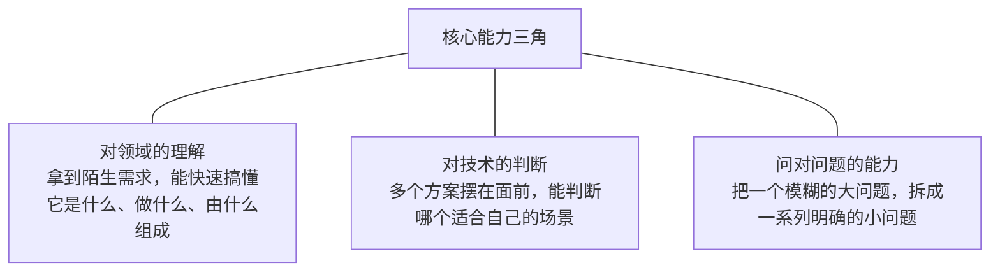

<!--
aicent-32-core-capability
AI编程方法 32：核心能力聚焦
-->

> 本篇是 AI 编程系列文章的方法论复盘与提炼。它不绑定具体技术栈，也不深入实战演示，而是把贯穿整个项目的方法论沉淀为一份可速查、可操作、可裁剪的参考手册，供工程师在 AI 编程项目的各个阶段对照、复查与裁剪使用。

## 1. 开篇与全文导读

本手册把"提示词质量、积累与驾驭、核心能力、能力边界、项目主干法、复盘带走的能力"等方法论，整理为 9 个章节，每章都可独立速查。下图是全文导读地图，帮助快速定位章节与章节之间的逻辑关系。

<!--
flowchart TD
    A["1、开篇与全文导读"] --\> B["2、核心命题 提示词质量 = 认知深度 × 经验"]
    B --\> C["3、核心能力三角 领域理解 / 技术判断 / 问对问题"]
    C --\> D["4、Vibe Coding 的本质 是驾驭，不是依赖"]
    D --\> E["5、本系列的能力边界 给了什么 / 没给什么"]
    E --\> F["6、方法：项目当主干，向外展开"]
    F --\> G["7、复盘四问（Check List）"]
    G --\> H["8、可裁剪的 Check List（速查）"]
    H --\> I["9、结语：快时代里的慢积累"]

    B -.命题支撑.-> C
    C -.能力映射.-> D
    D -.前提条件.-> E
    E -.边界声明.-> F
    F -.实践方法.-> G
    G -.自检结果.-> H
-->

阅读建议：

- 第一次阅读：按章节顺序通读，建立方法论全貌。
- 项目中速查：直接跳到第 8 章（可裁剪的 Check List），按场景裁剪条目。
- 复盘时使用：聚焦第 7 章（复盘四问）。

## 2. 核心命题：提示词质量是认知深度的外化

### 2.1 三个具体例子

"怎么写出一个好的提示词"本身没有通用答案。判断提示词质量的依据，是看问题背后站着什么样的认知与经验：

| 提示词中能问出的问题 | 背后站着的认知与经验 |
| --- | --- |
| "用 Redis 还是 MySQL 做上下文缓存" | 对两种存储特性的理解 |
| "可观测性怎么做" | 做过生产系统、踩过"出了问题什么都看不到"的坑 |
| "同步导出还是异步导出" | 对并发场景和用户体验的判断 |

### 2.2 抽象命题与可操作推论

把上面的例子抽象出来，得到贯穿本篇的核心命题：

> 提示词的质量，是认知深度的外化。

可操作推论：

- 决定问出什么层次问题的，不是提示词技巧，而是经验积累。
- 系列文章中讲解的咨询模式、SDD、任务拆解、Skills、CLAUDE.md 等方法，本质都是为了把已有经验更好地"外化"为问题；如果底层经验缺失，再好的方法也只是空壳。
- 这条命题也是贯穿整个系列的主线：方法的另一面是积累。

## 3. 核心能力三角

### 3.1 能力三角

贯穿一个 AI 编程项目，工程师真正带走的不应是某个工具的操作技巧（工具会迭代、会被替代），而是工具背后三种核心能力。这三种能力构成一个三角：

每种能力的可操作描述：

- **对领域的理解**：拿到一个陌生的需求，知道怎么快速搞懂它是什么、做什么、由什么组成。这个能力不依赖任何工具。
- **对技术的判断**：多个方案摆在面前，能判断哪个适合当前场景。这个判断靠的是积累的工程经验和对约束的理解，不是 AI 替你做的。
- **问对问题的能力**：把一个模糊的大问题拆成一系列明确的小问题。问题越明确，不管是 AI 还是人，给出的答案越有用。

### 3.2 工具是放大器

工具是放大器，放大的是工程师已有的东西：

| 工程师状态 | 工具放大的结果 |
| --- | --- |
| 有能力（领域理解、技术判断、问对问题） | 工具放大能力，一个人做一个团队的事 |
| 无能力（基础薄弱、判断缺失、问题模糊） | 工具放大缺陷，更快地把错误的决策变成错误的代码 |

由此得到一条重要的可操作判断：

> 瓶颈不在 AI，而在思考质量。

走完整个项目后，这句话应该不再是一个概念，而是切身体会。

## 4. Vibe Coding 的本质：是驾驭，不是依赖

### 4.1 有积累 vs 无积累

Vibe Coding 听起来是"跟着感觉走"，但真正能跑通的人，背后都有积累在支撑。有无积累的差异，可以用"谁在驾驶谁"来衡量。

#### (1) 无积累的 Vibe Coding：AI 在驾驶你

无积累时，会出现三种典型表现：

- AI 给出多个方案，不知道选哪个。
- AI 生成了代码，看不出哪里有隐患。
- AI 问"用 Redis 还是 MySQL"，没有判断依据，只能说"你觉得哪个好就哪个"。

结果：AI 在驾驶你，而不是你在驾驭 AI。

#### (2) 有积累的 Vibe Coding：你在驾驶 AI

有积累时，会呈现三种相反的表现：

- 知道这个场景的约束条件，所以能给出有意义的限定。
- 见过类似的问题，所以知道 AI 给的方案哪里可能踩坑。
- 对这个领域有基本认知，所以能在 AI 偏离方向时把它拉回来。

结果：真正坐在驾驶位上的是你。

### 4.2 积累的不可替代性

积累是 AI 无法替代的东西，它由以下要素组成：

- 计算机基础（数据结构、操作系统、网络协议等）
- 项目经验（真实有上下文的项目，而非纯教程）
- 踩过的坑（生产事故、边界问题、性能陷阱）
- 做过的技术决策（在多个约束间权衡与取舍的过程）

判断标准：是否具备足够的积累，让自己真正坐在驾驶位上。这正是 Vibe Coding 的本质——是驾驭，不是依赖。

## 5. 本系列的能力边界

### 5.1 能力边界表

说清"给了什么"和"没给什么"，是为了让读者知道接下来该往哪里走。

| 维度 | 给了的 | 没给的 |
| --- | --- | --- |
| 项目经验 | 一个完整的项目经验：从产品定义、架构设计、核心开发、测试、部署到可观测性，走完一个 AI 应用的全链路（比看 10 篇教程更有价值） | 大规模系统的经验（面向几十人，不是百万用户；高并发、极致性能优化、超大规模工程化需要另外的项目积累） |
| 工作方式 | 一套可复用的工作方式：咨询模式、SDD、任务拆解、Skills、CLAUDE.md（不绑定具体项目，换任何项目都能用） | 垂直领域的深度（RAG 往深走是重排序、混合检索、评估体系；Agent 往深走是多步规划、多 Agent 协作；分布式系统往深走是一致性协议、故障恢复，每个方向都是独立大领域） |
| 认知方法 | 一个认知建立的方法：领域四问法，遇到陌生技术时知道怎么快速建立判断依据（可迁移到任何领域，比任何具体知识点都有价值） | 计算机基础的厚度（数据结构、操作系统、网络协议，这些是问出好问题的底层） |

### 5.2 边界声明

说清楚这个边界，目的是给出明确的方向指引：

- 项目经验（Hify 全链路）= 起点，不是终点。
- 工作方式 + 认知方法 = 可迁移的资产。
- 基础厚度、垂直深度、大规模经验 = 接下来需要主动补足的方向。

## 6. 方法：把项目当主干，向外展开

### 6.1 主干价值与挂载

系列文章的真正价值不只是"学会了一套工具和方法"，而是给了工程师一个完整的、有上下文的项目主干。主干的价值是：它提供了一个锚点，让每个知识点都知道"长在哪里"。

知识点挂载到主干上的示例：

| 知识点 | 在主干上的挂载位置 |
| --- | --- |
| 数据库事务 | 解决项目里 Redis `read-modify-write` 那个并发问题 |
| HTTP 协议 | 与 SSE 流式响应直接相关 |
| K8s 健康检查 | `readinessProbe` 那几行配置背后的逻辑 |
| 向量数据库 | RAG 管线里分块向量化那个环节用到的东西 |

有了主干，零散的知识点有地方挂，学了能消化，不会"读完就忘"。没有主干，学了也是浮的，停留在"看懂了"而不是"理解了"。

### 6.2 往下一层的习惯

主干法的关键操作是"往下看一层"。做项目的过程中，一定会遇到很多没完全想透的东西，例如：

- 为什么 SSE 比 `WebSocket` 更适合这个场景？
- `pgvector` 的索引是怎么工作的？
- K8s 的 readiness 和 liveness 有什么本质区别？

每一个没想透的地方，都是可以展开的线索。不需要立刻把每个方向都走透，但每次遇到一个疑问，养成"往下看一层"的习惯。

### 6.3 用 AI 加速学习的闭环

"往下看一层"的过程，可以用 AI（如 Claude Code）加速，形成一个学习闭环：

| 闭环环节 | AI 的用法 |
| --- | --- |
| 解释概念 | 让 AI 帮你解释不熟悉的术语、原理、机制 |
| 最小 Demo | 让 AI 帮你做一个最小可运行的 Demo，验证理解 |
| 出题测试 | 让 AI 出题考你，检验是否真正掌握 |

AI 不仅是写代码的工具，更是很好的学习伙伴。这个闭环会形成正向循环，而且会加速：

> 今天多理解了一个知识点 → 下次问 AI 的问题质量就高一点 → AI 给的输出质量就高一点 → 推动更深一层的理解。

## 7. 复盘四问

复盘时，停下来对照下面四个问题，逐一检查。

| 自查维度           | 核心问题                              | 判断标准                                                                         |
| -------------- | --------------------------------- | ---------------------------------------------------------------------------- |
| **(1) 决策理解度**  | 哪些决策是真正理解了，哪些只是看懂了？               | 能否说清楚"为什么这么做，不那么做"。能说清楚的地方，是真正理解的地方；说不清楚的地方，知识还没落地。                          |
| **(2) AI 依赖度** | 哪些环节最依赖 AI，几乎没有自己的判断？             | 那些几乎没有自己判断的环节，就是知识盲区。这不是坏事，而是方向——接下来值得在那里多投入。                                |
| **(3) 选型理解度**  | 有没有哪个技术选型，当时完全跟着 AI 走，现在也说不清楚为什么？ | 能否把"接受了 AI 的建议"变成"理解了为什么这是对的"。理解之后，下次遇到类似场景就能自己判断。不是要否定当时的选型，而是要补上"为什么对"的理解。 |
| **(4) 盲区清单**   | 做完项目，知识盲区清单是什么？                   | 把盲区列出来。这个清单比任何教程内容都更有价值——它是专属于自己的学习路线图，是接下来系统补基础的方向。                         |

## 8. 可裁剪的 Check List（项目阶段速查）

本节把前 7 章的方法论沉淀为可裁剪的条目，供工程师在项目阶段直接复制、裁剪、对照执行。

### 8.1 核心命题自查

参考章节：第 2 章。

- [ ] 这次问 AI 的问题，背后是否对应着具体的认知或经验？
- [ ] 我是否在用"技巧"掩盖"经验缺失"？
- [ ] 如果 AI 给的回答质量不高，问题是否出在我问得不够好？

### 8.2 能力三角自查

参考章节：第 3 章。

- [ ] **领域理解**：对当前需求，能否说清它是什么、做什么、由什么组成？
- [ ] **技术判断**：多个方案摆在面前，能否判断哪个适合当前场景？
- [ ] **问对问题**：能否把模糊的大问题，拆成一系列明确的小问题？

### 8.3 驾驶位自查

参考章节：第 4 章。

- [ ] AI 给出多个方案时，能否选出适合场景的那一个？
- [ ] AI 生成的代码，能否看出潜在的隐患？
- [ ] AI 问技术选型时，能否给出有意义的限定，而不是"你觉得哪个好就哪个"？
- [ ] AI 偏离方向时，能否把它拉回来？

### 8.4 能力边界自查

参考章节：第 5 章。

- [ ] 项目经验：是否拥有一个完整的、有上下文的项目主干？
- [ ] 工作方式：咨询模式 / SDD / 任务拆解 / Skills / CLAUDE.md 是否已成为可复用习惯？
- [ ] 认知方法：遇到陌生技术，是否掌握快速建立判断依据的方法（如领域四问法）？
- [ ] 待补方向：是否清楚自己在"基础厚度 / 垂直深度 / 大规模经验"上的缺口？

### 8.5 主干挂载自查

参考章节：第 6 章。

- [ ] 新学的知识点，是否挂载到项目主干上的某个具体位置？
- [ ] 是否对每个"没想透"的点，养成了"往下看一层"的习惯？
- [ ] 是否在用 AI 形成学习闭环（解释概念 / 最小 Demo / 出题测试）？
- [ ] 是否进入了"理解多一点 → 问题质量高一点 → 输出质量高一点"的正向循环？

### 8.6 复盘四问速查

参考章节：第 7 章。

- [ ] 哪些决策是真正理解了，哪些只是看懂了？（判断标准：能否说清为什么这么做、不那么做）
- [ ] 哪些环节最依赖 AI，几乎没有自己的判断？（判断标准：那些地方就是知识盲区）
- [ ] 有没有哪个技术选型，当时完全跟着 AI 走，现在也说不清原因？（判断标准：能否把"接受建议"变成"理解为什么对"）
- [ ] 做完项目，知识盲区清单是什么？（判断标准：列出来，作为专属学习路线图）

## 9. 结语：快时代里的慢积累

### 9.1 快与慢

AI 的时代，一切都很快：新工具每周都在出，新框架每月都在更新，新概念每天都在刷屏。很容易焦虑——学不完、跟不上、怕被淘汰。

把快和慢拆开来看，会清楚很多：

| 类型 | 内容 | 是否可由 AI 加速 |
| --- | --- | --- |
| 快 | 工具的执行速度 | AI 可以给你 |
| 慢 | 对一个领域的理解、对一个架构的判断、对一套方法论的内化 | 只有自己能积累 |

真正有价值的东西，都是慢慢长出来的：产品定义想了多久、架构设计讨论了多少轮、CLAUDE.md 写了又改了多少版、每一篇方法论是怎么一步步磨合出来的。前者 AI 可以给，后者只有自己能积累。

### 9.2 行动指引

不必焦虑。努力不会过时。

在一个什么都很快的时代，能慢下来、能坚持、能在一件事上持续积累的人，反而越来越稀缺。AI 替代不了坚持，替代不了对一个领域年复一年的深耕，替代不了在无数个细节里磨出来的判断力。

行动指引：

- 去做真正想做的项目——不一定是一个简版 Dify，可能是工作中真正需要的系统，可能是一直想做但觉得太复杂的东西。
- 系列文章给了方法，AI 给了加速，但最终推动走完全程的，是自己。
- 把项目当作主干，旁征博引、保持好奇心、沿着每一根线索往外展开——这个项目就不仅是一份练习，而是真正的项目经验、真正的积累、能问出更好问题的基础。
