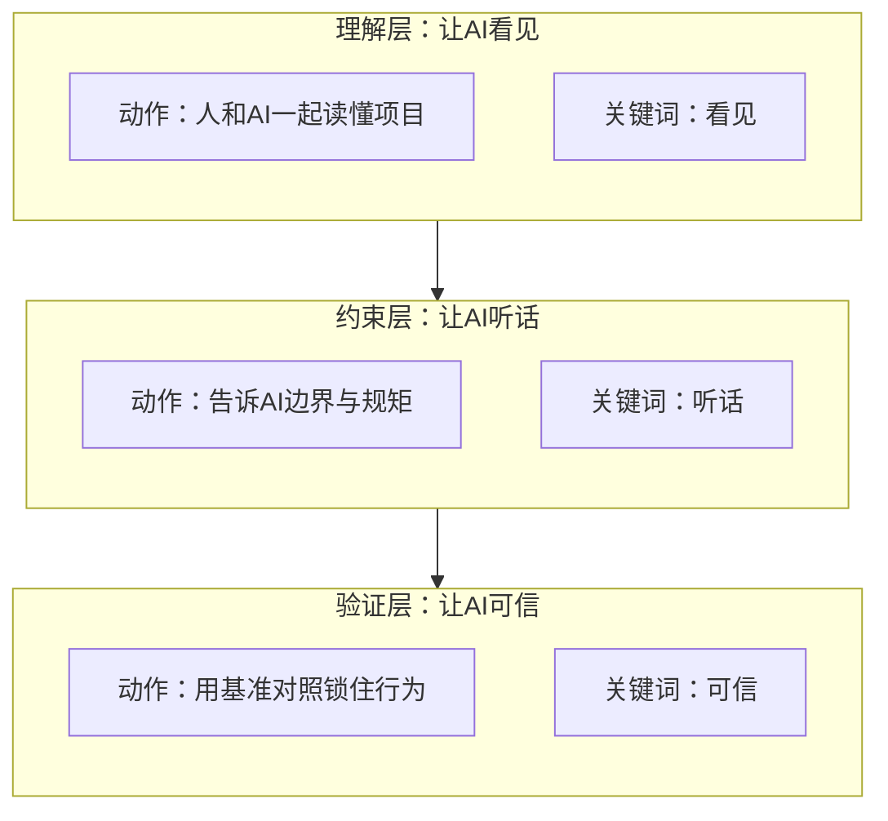
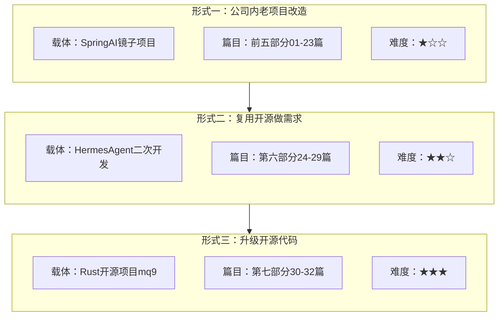
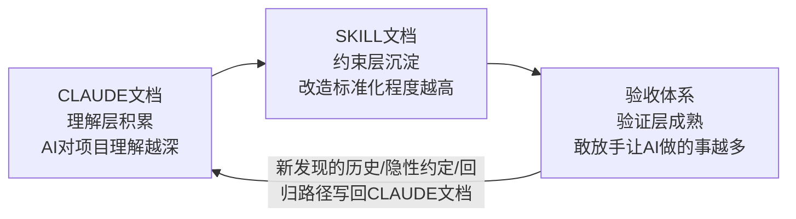

{: .no_toc }

  

    目录
  

  {: .text-delta }
- TOC
{:toc}

<!--
aicmigr-00-opening-00-migration-intro
传统项目迁AI 00：开篇序言 - 如何用AI开发老项目
-->

## 1. 同一个工具，结果差得很远

### 1.1 一个普遍现象

Claude Code 出来这两年，越来越多工程师拿它去动那些跑了几年的老系统：加功能、修 bug、补测试、改业务逻辑。但很快一个普遍现象浮现出来——**同一个工具、同样在改老代码，不同人的结果差得很远**。

这件事并不新鲜。传统软件工程里也是同一个套路：同一套设计模式，有人用得稳，有人用得出事；同一套 Git 工作流，有人协作顺畅，有人天天解冲突。工具本身从来决定不了结果，真正决定结果的是用法。AI 改老代码只是把这条老规律在新场景里又演了一遍。

把这种差距拆成几个可观察的维度，就是下面这张表。

| 对比维度 | 又稳又快的一类 | 改完就出事的一类 |
|---------|--------------|---------------|
| 上线表现 | 改动稳，业务无回归 | 一上线就爆雷，常炸在看似不相关的地方 |
| 对 AI 的体感 | "AI 真的帮到我" | "AI 比我还能添乱" |
| 推进节奏 | 第三个任务时已摸出门道 | 改了三个月心里还没底 |
| 决定性因素 | 用法对，体系跑起来了 | 用法错，靠感觉硬上 |

### 1.2 差距来自哪里

结论已经很明显：差的不是 AI，差的是用法。又稳又快的那一类，不是工具更聪明，也不是提示词更花哨，而是用法背后跑着一套体系；改完出事的那一类，也不是工具不行，而是靠感觉硬上，体系压根没跑起来。

那这套"对的用法"到底是什么？回答它之前，得先退一步，回答一个更基本的问题：为什么"改老项目"和"写新项目"是两件事——差距到底来自哪里。

## 2. 我踩过的一次典型翻车

讲抽象概念之前，先讲一个作者自己踩过的坑。这个坑的典型之处在于：表面是"教科书式"的成功，真正的炸点藏在六年前的一行老代码里。读完这个案例，三种债就不是论文里的概念，而是工程师每天都在踩的雷。

### 2.1 任务与表面结果

半年多前，作者带着 Claude Code 去改一个公司内部老系统——跑了五六年、业务逻辑盘根错节那种。任务不复杂：**加一个字段，调整几处相关业务逻辑**。

任务丢给 Claude Code 后，它给的方案很专业：

- 改动点定位准确，相关业务逻辑的调用链都梳理到了；
- 代码干净，风格和老系统保持一致；
- 测试也写了，本地跑全绿。

作者 review 一遍没发现问题，上线。从表面看，这是一次"教科书式"的成功改造——快、干净、有测试。

### 2.2 真正的炸点：六年前的隐性约定

当天晚上，监控告警来了。

炸的不是作者让它改的部分，而是另一个**看似毫不相关的接口**。翻代码才发现：那个字段在六年前被一个早已下线的对接方用过，当时存在一个隐性约定——这个字段一旦改动格式或语义，那条对接链路就会失效。

这条隐性约定有三个致命特征：

| 特征 | 具体表现 |
|-----|---------|
| AI 不知道 | 代码里没有注释、没有文档，AI 的上下文里完全没有这条信息 |
| 代码里没写 | 字段定义、调用处都看不出"被六年前的对接方依赖过" |
| 只有当年做对接的同事知道 | 而他半年前已经离职 |

这正是 Brownfield Tax 里说的"AI 不知道老代码为什么这样写"——它不是不够聪明，而是它根本看不见这些代码之外的历史。

### 2.3 复盘：问题不在 AI，在我自己

作者一边回滚一边反思，得出一个关键结论：

> 问题不在 AI，而在我自己。不是 AI 不够聪明，而是我把它当成了"能自动理解项目的开发者"。

但它不可能自动理解。那些代码之外的历史、隐性约定、踩过的坑，作者不告诉它，它就是瞎的。

那次之后，作者换了做法。动手之前，先花时间告诉 AI 三件事：

1. **项目是什么**——业务背景、整体架构、改造目标；
2. **哪些地方有雷**——历史遗留问题、隐性约定、已知不能动的逻辑；
3. **哪些接口不能碰**——对外契约、跨系统约定、敏感字段。

一开始作者觉得这是额外成本，但跑通几次后发现一条重要原则：

> 这些时间不是成本，是投资。前期传递得越充分，后面 AI 帮做的事越多、越稳。

把这条原则再往前推一步，就是贯穿整篇文章的命题：

> 老项目改造用 AI，真正的瓶颈不是 AI 能做什么，而是你能向它传递多少上下文。

### 2.4 翻车背后是三笔账

这次翻车同时印证了业界在讲的三种债：团队自己都没人记得那条六年前的隐性约定，是理解债；测试和 review 都覆盖不到那条已下线的对接链路，是验证债；跨 session、跨年的老代码历史 AI 完全感知不到，是棕地税。三笔账一起算，才有了当晚的告警。

三种债业界已经各自给出了量化数据，下面这张表把它们并列起来：

| 债的名称 | 提出者 | 关键数据 | 日常表现（一句话翻译） |
|---------|-------|---------|-------------------|
| Comprehension Debt（理解债） | Google 的 Addy Osmani | Anthropic 52 人实验：AI 辅助组代码理解测试比对照组低 17%，debugging 差距最大 | AI 帮你写得越多，团队真正看懂代码的速度越跟不上 |
| Verification Debt（验证债） | Sonar 开发者调研 | 42% 代码 AI 辅助生成 / 96% 开发者不完全信任 / 仅 48% 每次都 review | 跑通测试、看 diff 没问题就敢上，到生产才发现坏了 |
| Brownfield Tax（棕地税） | Florida International University | context 超过 40% 后模型质量下降 | AI 不知道老代码为什么这样写，提的"现代方案"和现有架构不兼容 |

这三种债不是论文里的概念，而是工程师日常都遇到过的事。Claude Code 写新代码用得越多，越能感觉到"改老代码"这件事和"写新代码"不一样——它要多交一笔棕地税，还要补上理解和验证两笔欠账。下一章正面拆解：到底该怎么做，才能在老项目里把 AI 用得稳。

## 3. 让 AI 可信的三层控制

### 3.1 先立视角：AI 是"上下文缺失的实习生"

讲方法论之前，先把视角立住。作者踩过几次类似坑之后，总结出第一个判断：AI 在老项目里不是"更强的开发者"，更像一个"上下文缺失的实习生"。

这个实习生有一个让人意外的特征——**他的技术能力可能比开发者还强**。

- 代码写得比开发者快；
- 算法比开发者熟；
- 开源项目看得比开发者多。

但他有一个致命短板：他对开发者公司这个项目一无所知。代码之外的历史、隐性约定、踩过的坑，开发者不告诉他，他就是瞎的。

面对这样一个实习生，开发者不会直接把复杂任务扔给他自己搞。正确的姿势是一套"带新人"的标准动作：

1. 先带他熟悉项目；
2. 告诉他哪些地方不能动；
3. 给他明确的小任务；
4. 让他做完给开发者看；
5. review 完才让他继续。

视角立住之后，这件事的瓶颈就清楚了。这里给出贯穿全章的关键命题：

> 老项目改造用 AI，真正的瓶颈不是 AI 能做什么，而是开发者能向它传递多少上下文。

围绕"传递"这件事，作者总结出的打法分三层：理解层、约束层、验证层。每一层都对应一笔债，也对应一个"带新人"的标准动作。

### 3.2 三层控制总览

#### (1) 三层是并列的三道控制

三层不是串行的三步走，而是并列的三道控制——任何一层缺位，AI 都不可信。下面这张 Mermaid 图把三层并列关系、每层的关键词与对应动作一次画清。

```mermaid
flowchart TB
    subgraph L1["理解层：让AI看见"]
        direction TB
        A1["动作：人和AI一起读懂项目"]
        A2["关键词：看见"]
    end
    subgraph L2["约束层：让AI听话"]
        direction TB
        B1["动作：告诉AI边界与规矩"]
        B2["关键词：听话"]
    end
    subgraph L3["验证层：让AI可信"]
        direction TB
        C1["动作：用基准对照锁住行为"]
        C2["关键词：可信"]
    end
    L1 --> L2 --> L3
```

三层做到位，最终得到的是一句话：让 AI 看见、让 AI 听话、让 AI 可信。

#### (2) 三层与 AI 状态的映射

三层各自把 AI 从一种"不可用状态"推进到一种"可用状态"。下面这张表把这种状态变迁列清楚：

| 层 | 把 AI 从什么状态带出来 | 带到什么状态 | 关键词 |
|----|---------------------|------------|------|
| 理解层 | 盲（对项目一无所知） | 看见（读懂项目来龙去脉） | 看见 |
| 约束层 | 失控（顺手重构、改风格） | 可控（按规矩在边界内产出） | 听话 |
| 验证层 | 存疑（感觉没问题） | 可信（靠基准对照证明没问题） | 可信 |

理解层解决"看见"，约束层解决"听话"，验证层把前两层的成果锁成"可信"——三层是同一套打法不可拆分的三个面，不是先做完一层再做下一层，而是在改造全过程中同时维护。

#### (3) 三层各对应一笔债

三层不是凭空设计，每一层都对应第 2 章讲过的一笔债。这种对应关系是后面 3.3 / 3.4 / 3.5 每层开篇的动机来源：

| 层 | 对应的债 | 这笔债的核心症状 |
|----|---------|----------------|
| 理解层 | Comprehension Debt（理解债） | 团队对代码的掌控力跟不上代码产出速度 |
| 约束层 | Brownfield Tax（棕地税） | AI 不知道老代码为什么这样写，提的"现代方案"和现有架构不兼容 |
| 验证层 | Verification Debt（验证债） | 验证能力跟不上 AI 产出速度，"看着没问题"不等于"真的没问题" |

接下来三节，每层都用"动机（对应那笔债）→ 目标 → 动作工具 → 误区"的四段式展开。

### 3.3 理解层：让 AI 看见

#### (1) 动机：理解债

Anthropic 自己做过一项 52 人的对照实验：AI 辅助开发者在代码理解测试上比对照组低 17%，debugging 方面差距最大。这就是 Google 的 Addy Osmani 命名的 Comprehension Debt（理解债）——代码产出速度与团队真正理解代码的速度之间的差距。

为什么会欠下这笔债？老项目里的关键信息大多不在代码里：隐性约定、历史踩坑、当年为什么这么写，只活在老员工的脑子里。AI 加进来之后，这种差距被放大——AI 帮你写得越多，团队真正看懂代码的速度越跟不上。理解债是后面所有坑的源头——看不懂，就约束不了，更验证不准。理解层就是从源头堵住这笔债。

你可能会问：为什么不直接让 AI 扫一遍代码库？因为扫代码只解决"AI 读了文件"，不解决"AI 读懂了项目来龙去脉"，更不解决"人也看懂了"。理解层要做的，是把代码之外的上下文显式传递给 AI，同时让人自己也下场读懂。

#### (2) 目标：人和 AI 一起读懂项目

理解层的目标是：**人和 AI 一起读懂这个项目**。

注意是"一起"——人的理解和 AI 的理解是两件事，都要做。开发者自己读懂项目，不等于 AI 也读懂了；反过来，让 AI 扫一遍代码库，也不等于开发者真的掌握了关键脉络。理解层要同时把这两件事做完。

> 人的理解和 AI 的理解是两件事，都要做。

#### (3) 关键动作与工具

理解层的每一招都对应具体工具，不空谈"要理解项目"。下面这张表把动作和工具一一对应：

| 动作 | 工具 | 做什么 |
|-----|------|------|
| 扫债务地图 | SonarQube | 用 SonarQube 扫出项目的技术债分布，看清哪里是雷区 |
| 看历史脉络 | git log | 用 git log 追代码改动的历史脉络，搞清"为什么这样写" |
| 找改造关键入口 | Seam 识别方法 | 用 Seam 识别方法定位改造时的关键入口，知道从哪里下手 |
| 装上下文 | CLAUDE.md | 用 CLAUDE.md 把项目背景、架构、隐性约定装进 AI 的上下文 |
| 装专项技能 | SKILL.md | 用 SKILL.md 把"怎么做某类改造"的专项技能教给 AI |
| 扩展感知能力 | MCP | 用 MCP 扩展 AI 的感知能力，让它能读到原本读不到的系统信息 |

这六招不是选做题，而是理解层的标配组合：前三招（SonarQube / git log / Seam）帮人和 AI 共同把项目"读进来"，后三招（CLAUDE.md / SKILL.md / MCP）把这些理解"装进 AI"，让 AI 在后续改造里随时调得出来。

#### (4) 两个常见误区

理解层最容易踩的两个坑，本质都是"只做了一半"：

| 误区 | 具体表现 | 本质 |
|-----|---------|------|
| 把 AI 当作能自动理解项目的开发者 | 任务一丢就等结果，AI 对代码之外的历史、隐性约定、踩过的坑完全看不见——开发者不告诉它，它就是瞎的 | 棕地税里说的"AI 不知道老代码为什么这样写"，正是 2.2 节翻车案例的原型 |
| 只让 AI 理解、人不下场 | 把"理解项目"整件事外包给 AI，AI 扫了一遍代码库，开发者却仍说不清"这段逻辑为什么这么写、改它会影响谁" | 理解债悄悄欠下——代码 commit 进去得很快，但团队对这块代码的掌控力在下降，人的理解没人能替代 |

### 3.4 约束层：让 AI 听话

#### (1) 动机：棕地税

Florida International University 把 AI 在已有项目（brownfield）里失效的几种典型方式命名为 Brownfield Tax（棕地税），关键数据是：context 超过 40% 后模型质量下降。这笔税不是单一症状，而是三种典型失效方式叠在一起：

| 失效类型 | 具体表现 |
|---------|---------|
| 跨 session 失忆 | 跨 session 后 AI 记不住昨天的决策，今天和昨天的口径对不上 |
| 不知道老代码为什么这样写 | 它提的"现代方案"跟现有架构不兼容，一改就伤筋动骨 |
| 上下文超载 | context 一旦超过阈值，模型质量明显下滑，给出看起来对、实则危险的改动 |

其中最容易被工程师单独记住的是"不知道老代码为什么这样写"——提的"现代方案"和现有架构不兼容，一改就伤筋动骨。但另外两条同样要命：跨 session 失忆让 AI 前后口径对不上，上下文超载让它在 context 超阈值后给出看似正确、实则危险的改动。约束层就是为这整笔税设的关卡。AI 读懂了项目还不够，它一旦动手就可能在边界之外搞事：顺手重构、改风格、引入项目刻意避开的设计模式。这些都不是 AI 犯错，而是它在没有约束的情况下"尽力做到了它认为的好"——问题在于它认为的好，未必是项目需要的好。

你可能会问：AI 代码写得这么快，为什么要先花时间立规矩？因为不立规矩的代价是 review 爆炸——改动范围从一个字段扩大到整个类、diff 被风格改动淹没，回归风险和 review 成本同时飙升。约束层的投入，换的是 AI 产出的可控。

#### (2) 目标：看见 ≠ 听话

约束层的目标可以用一句话立住：**看见 ≠ 听话**。

AI 读懂了项目，不代表它会在开发者划定的边界内动手。它代码写得快、重构能力强，一旦没有约束，这种能力就会变成破坏力。约束层就是把这些破坏力关进笼子。

#### (3) 关键动作与工具

约束层不靠新工具，靠的是把"规矩"明确写下来交给 AI。开发者要告诉 AI 三件事：

| 约束类型 | 要明确告诉 AI 的内容 |
|---------|-------------------|
| 哪些地方不能动 | 对外契约、跨系统约定、敏感字段、历史遗留逻辑 |
| 哪些规矩必须守 | 编码风格、命名规范、提交规范 |
| 哪些设计模式这个项目不用 | 项目刻意避开的做法，避免 AI 自作主张引入"现代方案" |

约束写清楚之后，效果是直接可观察的——**AI 的产出自然可控**。开发者不需要逐行盯着 AI 写代码，而是事先把边界立好，AI 在边界内自己跑。

#### (4) 两个常见误区

约束层最常见的失败，不是"没写约束"，而是"约束没写清"，结果 AI 的"聪明"用错了方向：

| 误区 | 具体表现 | 本质 |
|-----|---------|------|
| 加字段时顺手重构整个类 | 开发者只是让 AI 加一个字段，AI 觉得"这个类结构可以更优雅"，顺手把整个类重构了一遍——改动范围瞬间从一个字段扩大到整个类 | review 难度爆炸，回归风险也爆炸 |
| 修 bug 时把项目编码风格全改了 | AI 顺手把项目的编码风格、命名规范全"统一"了一遍——diff 里绝大部分改动都和 bug 无关 | 真正的修复被淹没在风格改动里，review 几乎没法做 |

这两个案例的共同点是：AI 没有错，它只是在没有约束的情况下尽力做到了"它认为的好"。约束层的价值，就是把"AI 认为的好"对齐到"项目需要的好"。

### 3.5 验证层：让 AI 可信

#### (1) 动机：验证债

Sonar 的开发者调研给出了验证债（Verification Debt）的三组数据：42% 的代码是 AI 辅助生成的，但 96% 的开发者不完全信任 AI 的输出，只有 48% 每次都 review。产出速度远超验证速度，这就是验证债。

这笔债的直接后果是：改完跑通了测试、看着 diff 没问题，于是直接上线——结果到生产环境才发现坏了。原因是老项目的测试覆盖本来就不全、人肉 review 本来就看不到所有路径，"看着没问题"不等于"真的没问题"。验证层就是为了堵住这个口子。

你可能会问：AI 跑通了测试还不够吗？不够。AI 写的测试往往只测了"AI 自己改的部分"，而不是"项目真正会被影响的路径"——2.2 节那个六年前的隐性约定就是活例子，AI 写的测试根本不知道那条对接链路存在。跑通测试只给"信心"，验证层要的是"可信"。

#### (2) 目标：不靠"感觉没问题"，靠基准对照

验证层的目标是一句话：**不靠"感觉没问题"，靠基准对照**。

AI 改完跑通了测试，开发者 review 觉得没问题——但这不够。原因是验证债早已指出：测试覆盖本来就不全、人肉 review 本来就看不到所有路径。"看着没问题"不等于"真的没问题"。

> 不是靠信心，是靠基准。

AI 跑通测试、开发者 review 通过，都只是"信心"；只有基准对照通过，才是"可信"。

#### (3) 关键动作与工具

验证层的打法是"先锁后对"——改造之前先把现有行为锁住，改造之后用基准对照。

| 阶段 | 动作 | 工具 / 做法 |
|-----|------|----------|
| 改造之前 | 把现有行为锁住 | Characterization Tests（特征化测试）：把项目当前的输入输出固化成基准 |
| 改造之后 | 用基准对照 | 重跑 Characterization Tests，任何行为变化都会在基准上显形 |

Characterization Tests 不测"代码应该怎么写"，只测"代码现在实际怎么跑"——把项目当前的真实输入输出固化成基准，AI 之后的任何改动，都要对得上这份基准才算数。

#### (4) 两个常见误区

验证层的误区，是把"信心"误当成"可信"：

| 误区                          | 具体表现                                                                          | 本质                                                   |
| --------------------------- | ----------------------------------------------------------------------------- | ---------------------------------------------------- |
| 测试覆盖本来就不全、review 本来就看不到所有路径 | 老项目测试覆盖率往往很低，很多关键路径（尤其是跨系统的隐性约定）根本没有测试覆盖；review 也只能看 diff，看不到那些没被改、却会被间接影响的路径 | 在这种情况下靠"感觉没问题"判断改动安全性，等于在验证债上继续加码                    |
| 靠"AI 跑通了测试"判断改动安全           | AI 写的测试往往只测了"AI 自己改的部分"，本地跑全绿，不代表生产不出事——2.2 节那个六年前的隐性约定，AI 写的测试根本不知道那条对接链路存在  | Characterization Tests 在改造之前就把"项目真实行为"固化下来，堵住的正是这个口子 |

### 3.6 三层方法论 Check List

这一节把前三节的方法论拆成可裁剪的项目阶段速查条目，供读者在项目里直接对照执行。表格按"理解层 / 约束层 / 验证层"三个阶段分组，每个检查项都配一个**可观测的完成标志**——不写"已理解项目"这类虚话，要写"CLAUDE.md 已沉淀项目概览/关键模块/隐性约定三节"这种能直接核对的产物。

#### (1) 理解层 Check List

| 阶段 | 检查项 | 完成标志 |
|-----|-------|---------|
| 理解层 | 用 SonarQube 扫债务地图 | SonarQube 已产出项目的债务分布报告，标出雷区模块 |
| 理解层 | 用 git log 看历史脉络 | 关键代码路径的"为什么这样写"已有可追溯的提交历史记录 |
| 理解层 | 用 Seam 识别方法找改造入口 | 已输出一份改造关键入口清单，明确从哪里下手 |
| 理解层 | 用 CLAUDE.md 装上下文 | CLAUDE.md 已沉淀项目概览 / 关键模块 / 隐性约定三节 |
| 理解层 | 用 SKILL.md 装专项技能 | 本次改造涉及的专项技能已写成 SKILL.md，AI 可调用 |
| 理解层 | 用 MCP 扩展感知能力 | AI 通过 MCP 能读到原本读不到的系统信息（如外部依赖、运行时状态） |

#### (2) 约束层 Check List

| 阶段 | 检查项 | 完成标志 |
|-----|-------|---------|
| 约束层 | 明确哪些地方不能动 | 已列出不可改动清单（对外契约 / 跨系统约定 / 敏感字段 / 历史遗留逻辑） |
| 约束层 | 明确哪些规矩必须守 | 编码风格、命名规范、提交规范已写成 AI 可读的约束 |
| 约束层 | 明确哪些设计模式这个项目不用 | 已列出项目刻意避开的模式清单，AI 不会自作主张引入 |
| 约束层 | 约束写进 AI 上下文 | 上述约束已写入 CLAUDE.md 或 SKILL.md，AI 改造时自动遵守 |
| 约束层 | 任务边界明确 | 每次给 AI 的任务都是明确小任务，不让 AI 自行扩大改动范围 |

#### (3) 验证层 Check List

| 阶段 | 检查项 | 完成标志 |
|-----|-------|---------|
| 验证层 | 改造前用 Characterization Tests 锁住现有行为 | 改造前的输入输出基准已固化，Characterization Tests 已跑通并留存 |
| 验证层 | 改造后用基准对照 | 改造后重跑 Characterization Tests，行为变化全部在基准上显形并可解释 |
| 验证层 | 测试覆盖关键路径 | 已核对测试覆盖到改造会影响的路径，含跨系统隐性约定 |
| 验证层 | 不靠"感觉没问题"判断 | 上线判断依据是基准对照结果，而不是 review 的主观感觉 |
| 验证层 | review 覆盖 diff 之外的影响路径 | review 不只看 diff，还核对被间接影响的路径是否安全 |

#### (4) 三层做到位之后的人机分工

三层 Check List 全部做完，意味着开发者已经把方法论落到了可观测的产物上。这时人机分工的数字很清晰：

> AI 完成 80% 到 90% 的工作；剩下 10% 到 20%——质量把关、流程正确、最终决策——必须由人来做。

这 10%-20% 是开发者不可让渡的责任：三层方法论不是把人踢出局，而是把人从"写代码"里解放出来，集中到真正需要人判断的环节上。

#### (5) 这套方法论在业界的位置

业界其实也在分别讨论这三层，只是分散在不同来源里：

| 业界概念 | 对应本系列的哪一层 |
|---------|----------------|
| Strangler Fig（绞杀者模式） | 理解层——识别改造关键入口，逐步替换而非推倒重来 |
| Characterization Tests（特征化测试） | 验证层——改造前锁住现有行为作为基准 |
| SDD Brownfield（棕地规格驱动开发） | 理解层 + 约束层——在已有系统上做规格驱动的改造 |
| Harness Engineering（测试骨架工程） | 验证层——为老项目搭建可依赖的验证骨架 |

每一块单独看都有价值，但拼起来是散的——尤其是中文社区，几乎没人系统讲过怎么把它们连成一套可执行的方法论。本系列要做的，就是把这些碎片拼成一个完整的、可执行的方法论：理解层管"看见"、约束层管"听话"、验证层管"可信"，三层合起来，让 AI 在老项目里真正可信。

## 4. 实战载体：三种老项目改造形式

第 3 章把方法论立了起来，接下来要回答的是：拿什么把这套方法论跑通？这件事不止一种形式——本系列会沿着老项目改造的三种形式展开，难度依次递进。三种形式背后是同一套方法论，但载体、归属和挑战度各不相同。

### 4.1 三种形式总览

#### (1) 三种形式的并列关系

下面这张 Mermaid 图把三种形式放在同一张图里对照：每种形式各自的载体项目、对应的系列篇目范围、难度梯度一眼可见。

```mermaid
flowchart TB
    subgraph S1["形式一：公司内老项目改造"]
        direction TB
        A1["载体：SpringAI镜子项目"]
        A2["篇目：前五部分01-23篇"]
        A3["难度：★☆☆"]
    end
    subgraph S2["形式二：复用开源做需求"]
        direction TB
        B1["载体：HermesAgent二次开发"]
        B2["篇目：第六部分24-29篇"]
        B3["难度：★★☆"]
    end
    subgraph S3["形式三：升级开源代码"]
        direction TB
        C1["载体：Rust开源项目mq9"]
        C2["篇目：第七部分30-32篇"]
        C3["难度：★★★"]
    end
    S1 --> S2 --> S3
```

三种形式不是并列三选一，而是一条由易到难的训练路径：第一种让读者把方法论套到自己公司的老系统上，第二种让读者在别人代码上做出自己的需求，第三种让读者把贡献写进别人的项目。

#### (2) 三种形式对比表

| 形式 | 场景 | 代码归属 | 难度 | 系列篇目 | 项目地址 |
| --- | --- | --- | --- | --- | --- |
| 第一种：公司内的老项目改造 | 代码、bug、方向都归公司，多数工程师日常 | 公司代码库 | ★☆☆ | 前五部分 01-23 篇 | https://github.com/socutes/robustmq-spring-ai-alibaba-admin |
| 第二种：复用开源实现自己需求 | 基于开源做需求，代码不是你的但用法是你的 | 开源代码 + 自研增量 | ★★☆ | 第六部分 24-29 篇 | https://github.com/robustmq/robustmq/tree/main/chaos-test |
| 第三种：升级开源代码 | 挑战开源，代码、bug 都不是你的，做贡献让名字进入别人项目 | 完全归属开源社区 | ★★★ | 第七部分 30-32 篇 | https://github.com/robustmq/mq9 |

读者可以按自己当下的工作场景对号入座：日常在公司老系统里打转的，重点看第一种；需要拿开源搭东西的，重点看第二种；想攒开源 contributor 履历的，重点看第三种。

#### (3) 整体路线图

<!-- 
图片内容说明
路径：imgs/aicmigr-00-opening-00-migration-intro/fe03612327135b242b4eea6af208e3af_MD5.jpg
用途：承上启下，把第 3 章三层方法论（理解层 / 约束层 / 验证层）与第 4 章三种实战形式串成一张整体路线图
内容：本系列整体设计示意——以三层方法论为基础，沿着老项目改造三种形式（公司内老项目改造 / 复用开源做需求 / 升级开源代码）逐层展开、难度依次递进
-->

### 4.2 第一种：公司内的老项目改造

#### (1) 场景特征

第一种形式面对的是公司内的老项目：代码是公司的、bug 是公司的、方向是业务定的。这是大多数工程师日常面对的真实场景——没有机会重写、必须在线上系统上动手、改坏了要负责。它的核心矛盾不是"代码不熟"，而是"在陌生且有约束的代码上把事情做对"。

#### (2) 实战载体与代码地址

本系列前五部分（01-23 篇）以 Spring AI 这个真实活跃的开源项目作为"镜子"，带读者完整走过老项目改造的全流程。镜子是别人的代码，但学到的方法论是套到读者自己公司那个老系统上用的——所以读者看完前五部分，真正要带走的是"在陌生公司老系统上跑通改造"的姿势，而不是 Spring AI 本身。

项目代码地址： https://github.com/socutes/robustmq-spring-ai-alibaba-admin

#### (3) 走过的全流程

第一种形式跑通的是一条标准老项目改造流水线：

- **摸项目**：用理解层的工具让 AI 看见陌生代码的来龙去脉；
- **建护栏**：在动任何代码之前，先把约束层和验证层的"安全网"搭好；
- **拆需求**：把业务方向拆成一条条可以独立交付的小需求；
- **跑通改造**：在护栏保护下，让 AI 高效产出并保住质量。

这条流水线正是第 3 章三层方法论（理解层 / 约束层 / 验证层）在真实项目上的落地顺序，也是后面两种形式共用的骨架。

#### (4) 形式示意

<!-- 
图片内容说明
路径：imgs/aicmigr-00-opening-00-migration-intro/4d6d954b4c3e1be630547b63f714517b_MD5.jpg
用途：图示第一种形式——以 Spring AI 真实开源项目为镜子，完整走过"摸项目 → 建护栏 → 拆需求 → 跑通改造"全流程的学习路径
内容：第一种老项目改造形式示意，对应"公司内的老项目"场景（代码、bug、方向均归属公司），以及前五部分（01-23 篇）以 Spring AI 为镜子、把方法论套到读者自己公司老系统上的实战内容（https://github.com/socutes/robustmq-spring-ai-alibaba-admin）
-->

### 4.3 第二种：复用开源实现自己需求

#### (1) 场景特征

第二种形式是"基于开源做需求"：代码不是你的，但用法是你的。运维做内部巡检平台先看 Prometheus 生态；后端接工作流引擎先看 Temporal；算法做 RAG 先看 LlamaIndex——先看开源里有没有现成的，再基于它二次开发，是工程师的标准动作。这种形式的挑战在于：你既要读懂别人的开源代码，又要在上面长出自己的需求，最后还要让自研增量不破坏开源底座的升级路径。

#### (2) 实战载体与代码地址

本系列第六部分（24-29 篇）以开源 Hermes Agent 控制平面为底座做二次开发，演示从一句话需求到完整跑通的全流程。最终产出一个 7×24 不间断运行的真实自动化测试系统——不是 toy demo，而是真的会持续跑、持续出报告的系统。

项目代码地址： https://github.com/robustmq/robustmq/tree/main/chaos-test

#### (3) 走过的全流程

第二种形式在全流程上和第一种一致，但重心后移：

- **摸项目**：重点摸清楚开源底座的设计意图与扩展点；
- **建护栏**：重点建在"自己的增量代码 vs 开源底座"的边界上，确保二次开发不会污染底座；
- **拆需求**：把一句话需求拆成"能用开源的就用开源、必须自研的才自研"的最小自研面；
- **跑通改造**：让自研增量真正长在开源底座上，并跑成 7×24 不间断的真实系统。

读者看完第二种形式，带走的是"在别人开源代码上做出自己需求"的姿势。

#### (4) 形式示意

<!-- 
图片内容说明
路径：imgs/aicmigr-00-opening-00-migration-intro/e98362b155f9229590d84df4a03ccc96_MD5.jpg
用途：图示第二种形式——以成熟开源项目为底座二次开发，满足自身业务需求的学习路径
内容：第二种老项目改造形式示意，对应 Prometheus / Temporal / LlamaIndex 等开源生态选型思路，以及第六部分（24-29 篇）基于开源 Hermes Agent 控制平面二次开发、产出 7×24 不间断自动化测试系统的实战内容（https://github.com/robustmq/robustmq/tree/main/chaos-test）
-->

### 4.4 第三种：升级开源代码

#### (1) 场景特征

第三种形式是"挑战开源"：代码不是你的、bug 也不是你的，你做贡献让自己的名字进入别人的项目。这同样是老项目改造，只是改造的对象是别人的老项目——而且这个"老项目"是活跃维护的、有 maintainer 把关的、有社区规范的。难度最高，因为它要求你既要读懂陌生代码，又要按别人的代码规范和协作流程产出能被合并的高质量改动。

#### (2) 实战载体与代码地址

本系列第七部分（30-32 篇）基于一个真实活跃的 Rust 开源项目 RobustMQ/mq9，带读者完整跑通一次开源贡献流程。

项目代码地址： https://github.com/robustmq/mq9

#### (3) 走过的全流程

第三种形式跑通的不是一个系统，而是一个"贡献者身份"：

- **跑通两个 PR**：从读懂陌生 Rust 代码、定位可改之处，到产出能被 maintainer 合并的高质量改动；
- **跑通一个 issue**：从发现问题、定位根因，到把问题描述清楚让社区能接得住；
- **收获一个真实可点击验证的开源 contributor 身份**：贡献会真的合进 mq9 的主干，读者可以在 GitHub 上点开自己的头像看到自己的 commit。

简历上多这一行，在 AI 时代尤其值钱——因为它是"能读懂陌生代码 + 能按规范交付 + 能和社区协作"这套能力的可验证证据，而这套能力正是 AI 时代对工程师最稀缺的要求。

#### (4) 形式示意

<!-- 
图片内容说明
路径：imgs/aicmigr-00-opening-00-migration-intro/59e6446a68bd29b64e2e73e9cc668489_MD5.jpg
用途：图示第三种形式——以真实活跃的 Rust 开源项目为载体，跑通 PR + issue、获得可验证的开源 contributor 身份这一学习路径
内容：第三种老项目改造形式示意，对应 RobustMQ/mq9 项目（https://github.com/robustmq/mq9）与第七部分（30-32 篇）的实战内容，展示通过提交 PR 与 issue 让自己的贡献进入他人项目的路径
-->

### 4.5 三种形式背后的同一套方法论

三种形式看上去载体、归属、难度都不一样，但背后是同一套方法论：

- **读懂陌生代码**：不管这代码是公司的、是开源的、还是要贡献回去的，第一步永远是让 AI 看见它；
- **找到改造点**：在陌生代码里定位"哪里能改、哪里不能碰、改哪里收益最大"；
- **用 Claude Code 高效产出**：在约束层的护栏保护下，让 AI 帮你把改动落到代码上；
- **保住质量**：用验证层确保改动不破坏既有行为，能交付、能合并、能上线。

本系列所有的动作都在训练这套姿势，并把它放进三种不同的项目载体上去强化——公司老系统、开源底座、活跃开源项目——最终把方法论内化为读者自己的专业能力。

## 5. 节奏与心态：推满载大卡车的飞轮

### 5.1 冷启动：为什么老项目改造不会"丝滑"

#### (1) 满载大卡车类比

任何一次老项目改造，都像推动一辆满载的大卡车：**冷启动特别慢**。

新项目像一辆空车，一脚油门就起步；老项目是满载大卡车，起步阶段要花大力气让引擎、变速箱、负载一起进入工作状态。开发者要花时间让 AI 读懂上下文、建立约束、锁定基准——感觉进展缓慢是正常现象，不是姿势错了。一旦卡车跑起来，后面换挡、加速就顺了。

#### (2) 冷启动要做的三件事

冷启动慢，是因为下面三件事必须在第一个任务里先做完——它们正好呼应第 3 章三层方法论：

| 事项 | 对应层 | 在第一个任务里做什么 |
|-----|-------|-------------------|
| 读懂上下文 | 理解层 | 把项目业务背景、整体架构、改造目标、历史遗留问题和隐性约定告诉 AI，沉淀到 CLAUDE.md |
| 建立约束 | 约束层 | 在动任何代码之前先把 SKILL.md 里的护栏建好：哪些地方不能动、哪些约定要遵守、哪些契约不能破坏 |
| 锁定基准 | 验证层 | 改造开始前用验收体系锁住现有行为——Characterization Tests、回归测试、SonarQube 基线、git log 里能查到的历史决策先归位 |

理解层欠下的债，后面约束层和验证层都补不回来——这一步最容易被跳过，也最不能跳。约束层建得越扎实，AI 产出就越能直接用，回炉返工越少。基准锁住之后，AI 的任何改动都能立刻被验证"有没有破坏既有行为"，才敢真正放手让它做。

这三件事在第一个任务上最重、最慢——但跑完第一个任务之后，第二、第三个任务就只需要在已经搭好的三层上做增量，不再从头搭一遍。这正是下一节要讲的飞轮效应。

### 5.2 飞轮效应：三层积累的复利

冷启动慢，只是第一段。只要推动起来，飞轮就开始转——三层积累越完整，AI 帮做的事越多、越稳。这种复利机制是老项目改造区别于新项目开发的关键节奏。

#### (1) 飞轮三要素

飞轮由三个要素组成，分别对应第 3 章三层方法论的工程化产物：

| 要素 | 对应层 | 沉淀动作 | 积累效果 |
|-----|-------|---------|---------|
| CLAUDE.md | 理解层 | 每做完一个任务、每发现一条隐性约定、每摸清一段历史决策，都写回 CLAUDE.md | 积累越完整，AI 在下一个任务里对项目理解越深，冷启动需要重新传递的上下文越少 |
| SKILL.md | 约束层 | 每跑通一种改造模式，就把"该检查什么、该遵守什么、该避开什么"沉淀成可执行条目 | 写得越好，AI 产出越标准化、越能直接进入验收环节 |
| 验收体系 | 验证层 | 每发现一类回归路径、每补一条 Characterization Test、每加一条 review 检查项，都纳入验收体系 | 越成熟，开发者敢放手让 AI 做的事越多——因为任何一个改动都能被立刻验证 |

#### (2) 三要素的循环关系

三个要素不是并列堆叠，而是一个会自我强化的循环——每转一圈，下一圈就更轻松：

```mermaid
flowchart LR
    A["CLAUDE文档<br/>理解层积累<br/>AI对项目理解越深"] --> B["SKILL文档<br/>约束层沉淀<br/>改造标准化程度越高"]
    B --> C["验收体系<br/>验证层成熟<br/>敢放手让AI做的事越多"]
    C -->|新发现的历史/隐性约定/回归路径写回CLAUDE文档| A
```

冷启动阶段推动飞轮最费力——三件事都要从零搭起。但只要飞轮转起来，**每完成一个任务，三层都会同步增厚一层**，下一个任务的启动成本就更低。

#### (3) 关键转折：推到第三个任务

飞轮效应有一个**可观察的转折点**：推到第三个任务时，开发者会发现自己已经不再需要手把手带 AI。

这是因为：

- CLAUDE.md 已经积累到 AI 能自行理解项目语境的程度；
- SKILL.md 已经沉淀到 AI 能按既定模式产出的程度；
- 验收体系已经成熟到任何改动都能被立刻验证的程度。

此时开发者的角色从"教练 AI 每一步"切换成"提需求 + 看验收结果"——冷启动过去了，飞轮越转越快、越转越轻松。这就是本系列要帮读者建立起来的节奏。

### 5.3 怎么用这个系列

#### (1) 一篇一篇走，不要跳

方法论是层层递进的，跳读会断档。本系列沿着老项目改造这条主线，**一篇一篇走下来**，每一篇都在前一篇的基础上加一层。

#### (2) 系列篇目的三段划分

整个系列在结构上分三段，对应方法论从"建立"到"铺开"再到"收回"的完整闭环：

| 段落 | 篇目范围 | 这一段做的事 |
| --- | --- | --- |
| 前五部分 | 01-23 篇 | 把方法论建起来（以 Spring AI 为镜子，在公司内老项目上跑通全流程） |
| 中间两部分 | 24-32 篇 | 把方法论铺到不同形式上（复用开源做需求 / 升级开源代码） |
| 最后一部分 | 总结复盘 | 把方法论带回开发者自己的项目 |

读者按这三段顺序走，方法论会从"听懂的道理"变成"自己的专业能力"。

#### (3) 每一篇都给出三类可执行物

本系列不是观点集，而是实战手册。**每一篇都给出三类可执行物**：

- **具体提示词**：可以直接复制到 Claude Code 里跑；
- **具体工作流**：把方法论拆成一步步可复现的操作；
- **具体 review 重点**：每一篇对应的三层方法论（理解层 / 约束层 / 验证层）该怎么检查。

#### (4) 收尾心态

老项目改造做久了，读者会发现：**它不容易，但也不像很多人说的那样难到碰不得**。

难在它有历史、有包袱、有看不见的约束——这是 Brownfield Tax 的本质。但只要按本系列这套三层控制体系来，CLAUDE.md / SKILL.md / 验收体系三者一起转，AI 就会越做越熟，飞轮就会越转越轻松。

改得好老项目的人，是真的在长能力——这种能力在 AI 时代尤其稀缺：既能读懂陌生代码、又能按规范交付、还能和团队协作。

