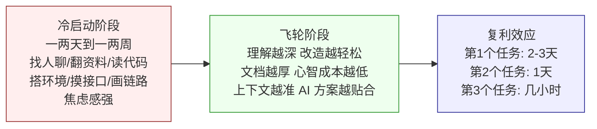

{: .no_toc }

<details close markdown="block">
  <summary>
    目录
  </summary>
  {: .text-delta }
- TOC
{:toc}
</details>

<!--
aicmigr-01-approach-01-migration-proc
传统项目迁AI 01：学习方法 - 迁移过程
-->

## 1. 本文导读

本文是「企业级老项目改造」系列的第 1 篇，属于方法论基础部分。它要回答一个起点问题：面对公司里那个跑了几年的老项目，怎么用好 AI 编程工具去改造它？

回答这个问题的第一步，不是讲工具、也不是讲提示词，而是先把一件容易被忽略的事讲清楚——**在 AI 出现之前，人是怎么接手一个老项目的**。这条原始链路 AI 并没有推翻，只是改变了每一步里人与 AI 的分工。链路清楚了，后面讲 AI 怎么进来、哪些步骤变了、哪些没变，才有参照系。

下面这张导读地图，帮两类读者快速定位：


<!--
flowchart TD
    START([读者入口]) --\> Q{阅读目的?}
    Q --\>|快速查阅方法论<br/>项目阶段速查| P1[第一部分 方法论提炼]
    Q --\>|理解 why 与实操细节<br/>系统学习| P2[第二部分 实战演示]
    P1 --\> CL[第一部分末尾 Check List]
    P2 --\> END2([结合实践深入理解])
    P1 -.推荐也读.-> P2
    P2 -.推荐先看.-> P1
-->

- **熟练工程师 / 项目阶段速查**：直接读第一部分，结尾附可裁剪 Check List
- **初学工程师 / 系统学习**：先读第一部分建立框架，再读第二部分结合实战理解 why

### 1.1 系列位置与本文目标


本文位于系列方法论基础的开篇，目标是把后续所有实战内容都建立其上的"认知底座"打好。读完本文，读者应获得三件东西：

#### (1) 一条可复用的链路

老项目改造的九步原始链路，AI 时代依然适用，只是分工变了。

#### (2) 一个反直觉的比例

70% 的时间花在了解项目上，只有 30% 的时间才是动手改造。

#### (3) 一个心态锚点

冷启动慢是正常的，熬过起步阶段，飞轮会越转越快。

## 2. 第一部分：方法论提炼

本部分是把"老项目改造"这件事抽象成一份速查手册。它不深入具体技术栈，目的是让读者在项目对应阶段能够快速参考：要达成什么目标、做什么事情、思考哪些问题、注意什么。

### 2.1 老项目改造的真实链路


老项目改造不是从写代码开始的，而是从了解开始的。完整链路包含九个步骤，前六步是了解、后三步是改造。

| 序号 | 步骤 | 阶段 | 目标 | 关键产物 | 是否可由 AI 主导 |
|------|------|------|------|----------|------------------|
| 1 | 找人聊 | 了解 | 收集代码之外的隐性信息 | 疑点清单 + 部分答案 | 低（人脉与口述历史） |
| 2 | 翻资料 | 了解 | 扫清所有线索建立整体感 | 资料索引 | 中（AI 可摘要） |
| 3 | 读代码（看结构） | 了解 | 建立项目骨架地图 | 模块结构脑图 | 高（AI 可出结构） |
| 4 | 搭环境、跑起来 | 了解 | 让项目可观测、可调试 | 可运行的开发环境 | 低（环境问题复杂） |
| 5 | 用 curl 摸核心接口 | 了解 | 验证项目跑通、可见输入输出 | 接口调用结果 | 中 |
| 6 | 带疑点深挖代码 | 了解 | 把"未知"标记逐个消化 | 业务分支调用链 | 高（AI 可梳理） |
| 7 | 画核心链路 | 改造 | 让项目在脑子里立起来 | 主流程图 + 数据关系图 | 高（AI 出 Mermaid） |
| 8 | 动手改（小步） | 改造 | 完成改造任务 | 增量代码 + 跑通记录 | 高（AI 主写） |
| 9 | 验收 | 改造 | 确认主流程未破坏 | review 记录 + 上线 | 低（人决策） |

顺序可能微调，但**九件事一件都少不了**。这条链路不是谁发明的——工作几年、接过几个老项目的工程师，或多或少都会走到这条链路上。区别只在于有没有把它写下来、有没有意识到它是一个可以复用的模式。AI 没有推翻这条链路，它只是改变了每一步里人和 AI 的分工。

### 2.2 70/30 时间分布原则


九步链路里藏着一个反直觉的比例。

| 比例项 | 时间占比 | 对应步骤 | 直觉 vs 现实 |
|--------|----------|----------|--------------|
| 了解项目 | 约 70% | 第 1–6 步 | 直觉：恨不得第一天就改代码 |
| 动手改造 | 约 30% | 第 7–9 步 | 现实：稳的工程师在了解上花更多时间 |

大部分人接手新项目时，会高估自己"看一眼就懂"的能力，低估代码之外信息的复杂度。这种认知偏差导致前六步被压缩，进而让 AI 协作失效（详见第二部分反面案例）。扎扎实实把前六步做满，把了解到的东西整理成文档交给 AI，AI 给的方案才会贴合项目实际、才知道哪些地方要绕开。**前六步是地基，跳过它，AI 就是瞎的。**

### 2.3 AI 时代的人机分工原则


#### (1) 人机分工

九步链路在 AI 来了之后，每一步的人机分工都被重新分配。下表给出原则性分工。

| 步骤 | 人 | AI | 协作模式 |
|------|----|----|---------|
| 1. 找人聊 | 主导，列出疑点清单 | 辅助整理清单 | 人主导 |
| 2. 翻资料 | 决定扫哪些资料 | 一次出漂亮摘要 | AI 主导、人审核 |
| 3. 看代码结构 | 判断核心与边缘 | 扫整个仓库出结构脑图 | AI 主导、人校准 |
| 4. 搭环境跑起来 | 处理依赖与 VPN 等环境问题 | 辅助诊断报错 | 人主导 |
| 5. curl 核心接口 | 设计验证用例 | 辅助生成 curl 命令 | 人机协作 |
| 6. 带疑点深挖 | 提出具体问题 | 比人快十倍梳理调用链 | AI 主导、人带着上下文读 |
| 7. 画核心链路 | 校准业务边界 | 出 Mermaid 架构图 | AI 主导、人修正 |
| 8. 动手改 | 拆任务、守边界 | 主写代码 | AI 主写、人小步验收 |
| 9. 验收 | 决策上线 | 辅助跑场景、找副作用 | 人决策 |

#### (2) AI 帮不上的三类事

- **代码里没写的事**：「某某对接方是谁」、「2021-11 为什么回滚」——代码里没写，AI 说不出来。
- **承担不了后果的事**：「这段逻辑删了会出什么事」——AI 只能猜，不能承担责任。
- **代替不了的决策**：「最终这个改造要不要上线」——这是人的业务决策，不是 AI 的。

用得好的工程师，知道每一步让人还是 AI 冲在前面、自己必须守住哪一步、需要和 AI 来回确认哪一步。这种分工不是 AI 天生就会的，需要磨合。本系列的目标，就是帮读者把这段磨合时间压缩到最短。

### 2.4 冷启动与飞轮心态


老项目改造像推动一辆满载的大卡车，冷启动永远慢。



冷启动期间可能要一两天甚至一两周，这段时间感觉什么都没产出。这种焦虑很正常，但**这不是浪费时间，是投资**。心法一句话：**熬过冷启动**——老项目改造不存在一口吃成胖子，但只要熬过起步阶段，后面全是复利。

### 2.5 第一部分 Check List

把第一部分凝练为一份可在项目阶段快速裁剪、勾选的 Check List。读者可在每个老项目改造启动时复制一份使用。

#### (1) 了解阶段（前六步，目标：让 AI 不瞎）

**① 找人聊**

- [ ] 列出代码中看到的疑点清单
- [ ] 找产品 / 隔壁组架构师 / 运维分别确认
- [ ] 把问不到答案的疑点标记"未知"搁置

**② 翻资料**

- [ ] README、仓库 docs 目录、wiki、Confluence 旧设计文档
- [ ] 企微历史群聊记录、Jira 相关 epic
- [ ] 不求全部搞懂，求整体感觉

**③ 看代码结构**

- [ ] 有哪些模块？哪些是核心？哪些是工具类？
- [ ] 哪些是长期没人动的老代码？哪些最近还在改？
- [ ] 脑子里画一张粗糙地图

**④ 搭环境、跑起来**

- [ ] 依赖版本对齐（MySQL、Redis、内部服务 VPN 等）
- [ ] 能用 debug 模式断点
- [ ] 能看到真实数据流向

**⑤ curl 核心接口**

- [ ] 验证项目跑通、能看到输入输出
- [ ] 能复现问题
- [ ] 才敢说"初步了解"

**⑥ 带疑点深挖代码**

- [ ] 把"未知"标记逐个带着具体问题去翻代码
- [ ] 每一处都带着上下文在读

#### (2) 改造阶段（后三步，目标：把改造做稳）

**⑦ 画核心链路**

- [ ] 主流程从入口到出口的图
- [ ] 核心数据表之间的关系
- [ ] 依赖的外部服务

**⑧ 动手改**

- [ ] 小步改：一处 → 跑通 → 看结果 → 确认无副作用 → 下一处
- [ ] 每一步都带着前面建立的地图

**⑨ 验收**

- [ ] curl 主流程没被破坏
- [ ] 跑了几个相关业务场景
- [ ] 找人 review
- [ ] 人的决策：是否上线

#### (3) AI 协作自检：是否跳过了前六步

- [ ] 是否在没做前六步的情况下，直接贴代码问 AI「这项目是做什么的」？
- [ ] 是否拿着浅层认知直接让 AI 改代码？
- [ ] 是否把跑不通 / 上线就炸归咎于 AI？

任何一项打勾，都意味着前六步被跳过，AI 协作已失效。

## 3. 第二部分：实战演示

第一部分给出了方法论速查。本部分结合一个具体的老项目场景，把方法论还原到实操里，回答"为什么这步必要"、"怎么实操"、"AI 来了之后这步怎么变"。

### 3.1 场景导入：xxx-scheduler 接手案例


#### (1) 任务下达

某天 leader 走过来，指着一个 GitLab 仓库说：

> 老张走之前维护的 xxx-scheduler，你接一下，下周一上线一个批处理任务。

#### (2) 项目背景的复杂性

- **维护者已离职**：老张是上个季度离职的，文档没有，历史背景他应该清楚，但他已入职新公司，不方便联系。
- **项目地位关键**：部门里几个核心业务都靠它跑。
- **历史包袱重**：公司早期几位资深工程师好多年前写的，后来换了几拨维护者，没人完整梳理过技术资料。

打开 README，几行部署命令加一张架构图，看两遍感觉像懂了又没懂。接着翻代码：Java + Spring Boot + MyBatis，每个类都很长，散落着各种注释。这些注释正是老项目最难的地方。

### 3.2 代码之外的隐性信息：AI 推不出来的东西

老项目最难的不是代码本身，而是代码之外的那些东西。

| 类型 | 原文示例 | 为什么 AI 推不出 |
|------|----------|------------------|
| 临时方案的注释 | `// 2020-08 临时方案，等下个版本重构`（没说下个版本是哪个） | AI 不知道"下个版本"指什么 |
| 对接方约束的注释 | `// 不要删，某某对接方需要`（没说某某是谁、删了会怎样） | 代码里没写对接方信息 |
| 回滚记录的注释 | `// 2021-11 回滚原因: 影响某个对接方的 PR 流程` | 影响了什么、为什么影响没写 |
| 早已离职的前辈 | 老张应该清楚但他走了 | AI 没有口述历史 |

这些东西代码里不会写——写它们的人觉得"这都是常识"。离职时也不会留下来，因为谁也说不清。**这才是老项目改造的真实起点**——也是 AI 协作的天花板：AI 只能基于代码里有的东西推理，代码之外的部分必须由人补上。

不止 xxx-scheduler——这个故事可能很熟悉。不一定是 xxx-scheduler，可能是公司里那个跑了三五年的订单系统、那个谁也说不清历史的交易中台、那个每次发版都要提前拉全部门开评审会的核心服务。

### 3.3 九步链路每一步的 why 与实操要点


回到第一部分的九步链路，这一节展开每一步的 why、怎么实操、AI 来了之后怎么变。为节省篇幅，每一步用「为什么必要 / 怎么实操 / AI 来了之后」三段式呈现。

#### (1) 第 1 步：找人聊

- **为什么必要**：代码之外的信息（对接方、回滚原因、隐性约定）只有人知道。AI 推不出，文档里也没有。
- **怎么实操**：把项目里看到的疑点列一个清单；去问身边还在这个项目周边工作过的同事（产品、隔壁组的架构师、运维）；每个人知道一点，拼起来至少能搞清楚"某某对接方"是谁、"2021-11 回滚"背后发生了什么；有些问题问不到答案，标记"未知"，先搁置。
- **AI 来了之后**：AI 帮你把疑点清单整理得更结构化，但**问谁、怎么问、问到的答案怎么过滤**，依然是人的事。

#### (2) 第 2 步：翻资料

- **为什么必要**：不是要全部搞懂，是要把手头所有线索都扫一遍，建立整体感觉。
- **怎么实操**：README、仓库里的 docs 目录、wiki、Confluence 里的旧设计文档、企微里的历史群聊记录、Jira 里相关的 epic。
- **AI 来了之后**：读 README 这种事，AI 一次能给你出个漂亮的摘要。但**哪些资料值得信、哪些已经过时**，需要人判断。

#### (3) 第 3 步：clone 项目，浏览代码

- **为什么必要**：不是从第一行读到最后一行，是看结构，在脑子里画一张粗糙的地图。
- **怎么实操**：有哪些模块？哪些是核心？哪些是工具类？哪些看起来是很久没人动过的老代码？哪些看起来是最近还在改的？
- **AI 来了之后**：Claude Code 可以扫完整个仓库，给你出一份模块结构总结。但**核心 vs 边缘的判断**，依然要人来校准。

#### (4) 第 4 步：搭起开发环境，把项目跑起来

- **为什么必要**：跑起来的那一刻心里才有底——能用 debug 模式断点、能看到真实的数据流向、能观察请求进来之后的完整链路。
- **怎么实操（也是出奇地难的一步）**：依赖 MySQL 版本有要求；Redis 的 key 格式需要特定配置；有一个对接的内部服务需要 VPN；可能要折腾一整天。
- **AI 来了之后**：AI 可以辅助诊断报错，但环境问题的复杂度（公司内部 VPN、特定版本依赖）让它依然主要由人扛。

#### (5) 第 5 步：用 curl 访问几个核心接口

- **为什么必要**：不是为了测业务，是为了验证项目确实跑通了、能看到输入输出、能复现问题。
- **怎么实操**：挑几个核心接口；curl 看输入输出；接口通了之后，才敢说"初步了解这个项目了"。
- **AI 来了之后**：AI 可以辅助生成 curl 命令、解读响应，但**验证用例的设计**依然是人决定的。

#### (6) 第 6 步：带着疑点深挖代码

- **为什么必要**：前面梳理时留下的"未知"标记，现在带着具体的问题去翻代码，每一处都带着上下文在读。
- **怎么实操**：某个业务分支是什么时候加的？谁在调用这段逻辑？有没有类似功能的调用链路？
- **AI 来了之后**：Claude Code 比手动翻快十倍。梳理接口清单、追踪调用链，AI 都能高效完成。但**带着上下文去读**这件事，依然要人来主导——AI 给的链路需要人来判断哪些是关键路径。

#### (7) 第 7 步：画出核心链路

- **为什么必要**：画完之后，整个项目才算在脑子里立起来。
- **怎么实操**：几张粗糙的手绘图；主流程从入口到出口；核心数据表之间的关系；依赖的外部服务。
- **AI 来了之后**：AI 可以扫完整个仓库给你出一份 Mermaid 架构图。但**业务边界、隐性约定的标注**，需要人来修正。

#### (8) 第 8 步：开始动手改那个批处理任务

- **为什么必要**：到了这一步，前六步建立的地图才派上用场。
- **怎么实操（小步快走）**：不是一口气改完；先小改一处、跑通、看结果、确认没有副作用，再改下一处；每一步都带着前面建立的那份地图。
- **AI 来了之后**：AI 可以主写代码，但**拆任务、守边界、每一步小步验收**，依然由人主导。

#### (9) 第 9 步：改完了做验收

- **为什么必要**：curl 接口看主流程没有被破坏、跑了几个相关的业务场景、找人 review——然后才敢说"这个改造做完了"。
- **AI 来了之后**：AI 可以辅助跑场景、找潜在副作用，但**最终上线与否的决策**，是人的，不是 AI 的。

### 3.4 反面案例：跳过前六步会怎样


第一部分 2.5 节的 Check List 提到了"跳过前六步"是 AI 协作失效的红线。这一节展开这个反面模式。

#### (1) 共同的反模式

接触过不少在老项目上用 Claude Code 用得不顺的工程师，共同的问题是同一个：**他们跳过了前六步**。

#### (2) 典型表现与失败链条

项目刚拿到手，第一件事就是打开 Claude Code，贴一段代码问：

```
这个项目是做什么的
```

Claude Code 当然能回答，但回答得浅——因为它没有项目上下文。然后工程师拿着这个浅层的认知，直接让 Claude Code 开始改代码。改完后跑不通，或者跑通了但没达到预期，或者看起来达到了但上线就炸了。然后他们回过头来怪 Claude Code：

```
这玩意真没法用
```

#### (3) 根因：没前六步，AI 就是瞎的

问题不在 Claude Code，问题在于没有前六步打底，AI 就是瞎的。它不知道这个项目有什么坑、哪段代码动不得、哪些历史约定存在。**这些东西读者不告诉它，它就永远看不见**。

反过来，如果扎扎实实把前六步做完——

- 把了解到的东西整理成文档；
- 把这些文档交给 Claude Code。

它的表现会完全不同：

- 它会基于提供的上下文做判断；
- 它给的方案会贴合项目的实际情况；
- 它改的代码会知道哪些地方要绕开。

这就是为什么本篇要花大篇幅讲"人原本是怎么做的"。AI 时代，这些步骤一步不能少，只是每一步人和 AI 的分工变了。具体怎么变，系列的下一篇展开。

### 3.5 冷启动飞轮的实战体感


第一部分 2.4 节给出了冷启动飞轮的概念。这一节给出实战中的真实体感。

#### (1) 冷启动期的体感

这一篇讲的九步链路，就是冷启动那一段。要先找人聊、翻资料、读代码、搭环境、跑起来、摸接口、画链路。这一通操作下来可能要一两天甚至一两周。这段时间感觉什么都没产出，心里容易焦虑。这种焦虑很正常，但**这不是浪费时间，是投资**。

#### (2) 飞轮转起来之后的体感

- **第一个改造任务**：可能要磨两三天。
- **第二个改造任务**：可能一天。
- **第三个改造任务**：几小时就搞定。

#### (3) 复利的三个来源

- 对项目的理解越深，后续的改造越轻松；
- 积累的文档越厚，下次打开代码时的心智成本越低；
- 和 AI 协作时提供的上下文越准，AI 给的方案越贴合。

## 4. 思考


### 4.1 回顾上一次接手

回想上一次接手一个老项目，大致是怎么做的？和本文讲的九步相比，跳过了哪几步？跳过的那几步，事后带来了什么问题？

### 4.2 写下"代码之外的东西"

现在手里正在维护或改造的那个项目，如果让读者把"代码之外的那些东西"（隐性约定、历史原因、对接方细节）写下来，能写多少？这些东西有没有写进项目的文档？如果没有，它们目前存在哪儿？


<!--
图片内容说明
路径：imgs/01_了解方法_01：老项目改造的真实链路/c0df9f27ec79b4a88c14e964e729ea4f_MD5.jpg
用途：可视化"老项目改造九步链路"全貌及 70/30 时间分布
内容：一张九步流程图——前六步（找人聊、翻资料、读代码、搭环境、摸接口、深挖代码）归入"了解阶段（≈70% 时间）"区域，后三步（画核心链路、动手改造、验收）归入"改造阶段（≈30% 时间）"区域。强调前六步是地基，跳过会导致 AI 协作失效
-->


<!--
图片内容说明
路径：imgs/01_了解方法_01：老项目改造的真实链路/318992ed45e378c0f92d00b3dadac1ab_MD5.jpg
用途：对比传统流程与 AI 协作流程下，九步链路中人与 AI 的分工差异
内容：将九步链路映射到一张分工对照图——左侧为"传统流程（全人执行）"，右侧为"AI 协作流程（人机分工）"。在 AI 协作列中标注各步骤的分工倾向：读 README/梳理接口/画架构图等由 AI 主导（80% AI），找人聊/确认历史约定/最终上线决策由人主导（人守住），带着疑点读代码、画链路等为人机协作（来回确认）
-->


<!--
图片内容说明
路径：imgs/01_了解方法_01：老项目改造的真实链路/5a9c47738156644e45d5f550b95591de_MD5.jpg
用途：可视化"冷启动慢、飞轮转起来就快"的概念
内容：展示老项目改造从冷启动到飞轮阶段的曲线——前期投入大量时间做了解、文档积累、上下文构建（冷启动，产出低、焦虑感强），中后期随着对项目理解的加深、文档复利、AI 协作上下文准确度提升，单个改造任务的耗时快速递减（从两三天 → 一天 → 几小时），呈现飞轮加速效应
-->
