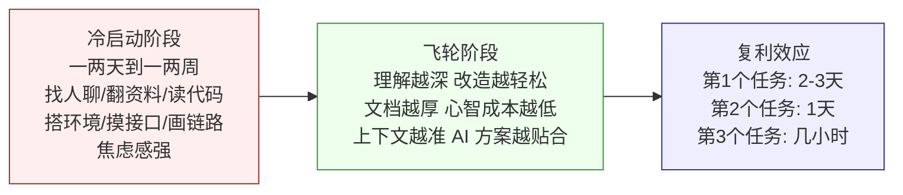

{: .no_toc }

<details close markdown="block">
  <summary>
    目录
  </summary>
  {: .text-delta }
- TOC
{:toc}
</details>

<!--
aicmigr-01-approach-01-migration-proc
传统项目迁AI 01：学习方法 - 迁移过程
-->

## 1. 开篇：一个真实的接手场景


### 1.1 接手时的真实场景

某天 leader 走过来，指着一个 GitLab 仓库说："老张走之前维护的 xxx-scheduler，你接一下，下周一上线一个批处理任务。"

一句话，一个仓库，一个 deadline。这就是大多数工程师接手老项目的真实开局——没有交接会，没有技术文档，只有一段别人留下的代码和一句"你接一下"。

xxx-scheduler 这个项目，情况典型到几乎可以当作老项目的标本：

- **维护者已离职**：老张上个季度走的，没留下文档；历史背景他最清楚，但已入职新公司，不方便联系。
- **项目地位关键**：部门里几个核心业务都靠它跑，出不得岔子。
- **历史包袱重**：公司早期几位资深工程师好多年前写的，后来换了几拨维护者，没人完整梳理过技术资料。

打开 README，几行部署命令加一张架构图，看两遍感觉像懂了又没懂。接着翻代码：Java + Spring Boot + MyBatis，每个类都很长，散落着各种注释。这些注释没有上下文，新人读起来像密码本——至于它们到底藏了什么、为什么 AI 也推不出来，第 3 章会展开。

这时候一个很自然的问题会冒出来：**既然有 Claude Code，为什么不直接让它读代码？** 把仓库一股脑喂进去，让它给我讲清楚这个项目在干嘛，岂不是省了所有摸索的功夫？

这个问题，我们在第 3 章回答。

### 1.2 读完本文你将获得

在回答上面那个问题之前，先把本文要交付的东西说清楚。读完这一篇，你应拿到三件东西：

#### (1) 一条可复用的链路

老项目改造的九步原始链路。这条链路在 AI 时代依然适用，<span style="color: red; font-weight: bold;">AI 没有推翻它，只是改变了每一步里人与 AI 的分工。</span>

#### (2) 一个反直觉的比例

<span style="color: red; font-weight: bold;">70% 的时间花在了解项目上，只有 30% 的时间才是动手改造。</span>这个比例和直觉相反——多数人接手老项目时，总想尽快动手改代码。

#### (3) 一个心态锚点

冷启动慢是正常的。熬过起步阶段，飞轮会越转越快。这个锚点能在你前两周觉得"什么都没产出"时，帮你稳住。

## 2. 九步链路：从了解到改造的完整路径

<span style="color: red; font-weight: bold;">老项目改造不是从写代码开始的，而是从了解开始的。完整链路包含九个步骤：前六步是了解，后三步才是改造。</span>

可以把这条链路想象成盖房子——前六步是勘测地基、摸清土质、画施工图，后三步才是动土浇筑。地基没勘测清楚就动工，楼盖到一半必塌。

### 2.1 九步链路总览


先用一张表把全貌立起来：

| 序号 | 步骤 | 目标 | 关键产物 |
|------|------|------|----------|
| 1 | 找人聊 | <span style="color: red; font-weight: bold;">收集代码之外的隐性信息</span> | 疑点清单 + 部分答案 |
| 2 | 翻资料 | <span style="color: red; font-weight: bold;">扫清所有线索建立整体感</span> | 资料索引 |
| 3 | 读代码（看结构） | <span style="color: red; font-weight: bold;">建立项目骨架地图</span> | 模块结构脑图 |
| 4 | 搭环境、跑起来 | <span style="color: red; font-weight: bold;">让项目可观测、可调试</span> | 可运行的开发环境 |
| 5 | 用 curl 摸核心接口 | <span style="color: red; font-weight: bold;">验证项目跑通、可见输入输出</span> | 接口调用结果 |
| 6 | 带疑点深挖代码 | <span style="color: red; font-weight: bold;">把"未知"标记逐个消化</span> | 业务分支调用链 |
| 7 | 画核心链路 | <span style="color: red; font-weight: bold;">让项目在脑子里立起来</span> | 主流程图 + 数据关系图 |
| 8 | 动手改（小步） | <span style="color: red; font-weight: bold;">完成改造任务</span> | 增量代码 + 跑通记录 |
| 9 | 验收 | <span style="color: red; font-weight: bold;">确认主流程未破坏</span> | review 记录 + 上线 |

顺序允许微调，但**九件事一件都少不了**。这条链路不是谁发明的——接过几个老项目的工程师，或多或少都会走到这条路上，区别只在于有没有把它写下来、有没有意识到它是一个可复用的模式。<span style="color: red; font-weight: bold;">AI 没有推翻这条链路，它改变的只是每一步里人和 AI 的分工。</span>


<!--
图片内容说明
路径：imgs/aicmigr-01-approach-01-migration-proc/c0df9f27ec79b4a88c14e964e729ea4f_MD5.jpg
用途：可视化"老项目改造九步链路"全貌及 70/30 时间分布
内容：标题"老项目改造的真实链路"，副标题"九个步骤，前六步了解，后三步改造"。前六步（1.找人聊、2.翻资料、3.浏览代码、4.跑起来、5.摸接口、6.深挖代码）归入左侧"了解阶段（前 6 步）"区域，后三步（7.画核心链路、8.动手改造、9.验收）归入右侧"改造阶段（后 3 步）"区域，两区域间用箭头连接。底部"时间分配"横条标注"了解 · 70%"（蓝色）与"改造 · 30%"（橙色），脚注为"真正做得稳的工程师，在了解上花的时间比改造多得多"
-->

九步里哪一步最容易被跳过？答案藏在下一步那个反直觉的比例里。

### 2.2 70/30：反直觉的时间分布

九步链路里藏着一个和直觉相反的比例：

| 比例项 | 时间占比 | 对应步骤 | 直觉 vs 现实 |
|--------|----------|----------|--------------|
| 了解项目 | 约 70% | 第 1–6 步 | 直觉：恨不得第一天就改代码 |
| 动手改造 | 约 30% | 第 7–9 步 | 现实：稳的工程师在了解上花更多时间 |

<span style="color: red; font-weight: bold;">大部分人接手新项目时，会高估自己"看一眼就懂"的能力，低估代码之外信息的复杂度。</span>这种认知偏差直接压缩前六步，进而让 AI 协作失效——没有了解到的东西整理成文档喂进去，AI 给的方案就不贴合项目实际，更不知道哪些地方要绕开。**前六步是地基，跳过它，AI 就是瞎的。**

为什么前六步这么吃时间？因为每一步都在解决一类"AI 推不出"的问题。下面把九步逐个展开，看每一步到底在挖什么、又该怎么挖。

### 2.3 每一步的 why 与实操

#### (1) 第 1 步：找人聊


- **为什么必要**：代码之外的信息——对接方是谁、某次回滚背后发生了什么、哪段逻辑是<span style="color: red; font-weight: bold;">绕不开的隐性约定——只有人知道</span>。文档里没写，AI 更推不出来。这一步挖的是"口述历史"。
- **怎么实操**：把<span style="color: red; font-weight: bold;">代码里看到的疑点列成清单</span>，去问还在这个项目周边工作过的同事（产品、隔壁组的架构师、运维）；每个人知道一点，拼起来至少能搞清"某某对接方"是谁、"2021-11 回滚"背后发生了什么；问不到答案的疑点标记"未知"，先搁置。
- **AI 来了之后**：AI 帮你把疑点清单整理得更结构化，但<span style="color: red; font-weight: bold;">问谁、怎么问、问到的答案怎么去伪存真</span>，依然是人的事——AI 连人都见不到。

#### (2) 第 2 步：翻资料

- **为什么必要**：不是要全部搞懂，而是把手头所有线索扫一遍，建立整体感觉。这一步产出的是<span style="color: red; font-weight: bold;">"资料地图"，知道哪些地方能查、哪些地方已经过时</span>。
- **怎么实操**：README、仓库里的 docs 目录、wiki、Confluence 里的旧设计文档、企微里的历史群聊记录、Jira 里相关的 epic——一份份翻过去，不求读懂，只求知道它们存在、各自讲什么。
- **AI 来了之后**：读 README 这种事，AI 一次就能出一份漂亮的摘要。<span style="color: red; font-weight: bold;">哪些资料值得信、哪些早已过时和现状冲突，需要人判断</span>——AI 看不出"这份 wiki 是三年前重构前的版本"。

#### (3) 第 3 步：clone 项目，浏览代码

- **为什么必要**：不是从第一行读到最后一行，而是看结构——在脑子里画一张粗糙的地图。这一步不求精，求有<span style="color: red; font-weight: bold;">"整体感"</span>。
- **怎么实操**：有哪些模块？哪些是核心？哪些是工具类？哪些看起来是很久没人动过的老代码？哪些最近还在频繁改？<span style="color: red; font-weight: bold;">带着这些问题在目录树里穿梭一遍</span>。
- **AI 来了之后**：Claude Code 可以扫完整个仓库，给你出一份模块结构总结。但**核心 vs 边缘的判断**依然要人来校准——<span style="color: red; font-weight: bold;">AI 看不出"这个模块虽然代码量大，但业务上早就边缘化了"</span>。

#### (4) 第 4 步：搭起开发环境，把项目跑起来

- **为什么必要**：项目跑起来的那一刻，心里才有底——能用 debug 模式断点、能看到<span style="color: red; font-weight: bold;">真实的数据流向、能观察一个请求进来之后的完整链路</span>。这一步把"纸上的项目"变成"活的项目"。
- **怎么实操（也是出奇地难的一步）**：依赖 MySQL 版本有要求；Redis 的 key 格式需要特定配置；有一个对接的内部服务需要 VPN；光是把这些凑齐，可能就要折腾一整天。
- **AI 来了之后**：AI 可以辅助诊断报错信息，<span style="color: red; font-weight: bold;">但环境问题的复杂度（公司内部 VPN、特定版本的内部依赖）让它依然主要由人扛</span>——AI 连你公司的内网都进不去。

#### (5) 第 5 步：用 curl 访问几个核心接口

- **为什么必要**：不是为了测业务，而是为了<span style="color: red; font-weight: bold;">验证项目确实跑通了、能看到输入输出、能复现问题</span>。这一步是"初步了解"的及格线。
- **怎么实操**：挑几个核心接口，用 curl 打一遍，看输入输出对不对；接口通了之后，才敢说"这个项目我初步了解了"。
- **AI 来了之后**：AI 可以辅助生成 curl 命令、解读响应字段，但**挑哪些接口、设计什么验证用例**，依然是人决定的——<span style="color: red; font-weight: bold;">AI 不知道哪个接口是这个项目的业务命门</span>。

#### (6) 第 6 步：带着疑点深挖代码

- **为什么必要**：<span style="color: red; font-weight: bold;">前几步梳理时留下的"未知"标记</span>，现在带着具体问题去翻代码，每一处都带着上下文在读。这一步把"未知"逐个消化成"已知"。
- **怎么实操**：某个业务分支是什么时候加的？谁在调用这段逻辑？有没有类似功能的调用链路可以参照？带着这些具体问题在代码里穿梭。
- **AI 来了之后**：Claude Code 比手动翻快十倍，梳理接口清单、追踪调用链它都能高效完成。但**带着上下文去读**这件事，依然要人主导——<span style="color: red; font-weight: bold;">AI 给的链路里，哪些是关键路径、哪些是噪音分支，需要人来判断</span>。

了解阶段到此结束。前六步建立的地图，接下来才派上用场。

#### (7) 第 7 步：画出核心链路


- **为什么必要**：画完之后，整个项目才算在脑子里立起来——从入口到出口、从数据表到外部依赖，一张图把骨架钉死。这一步是"改造"的前置作业。
- **怎么实操**：几张粗糙的手绘图就够——主流程从入口到出口；核心数据表之间的关系；依赖了哪些外部服务。画得丑没关系，画对就行。
- **AI 来了之后**：AI 可以扫完整个仓库给你出一份 Mermaid 架构图。<span style="color: red; font-weight: bold;">业务边界、隐性约定的标注需要人来修正</span>——AI 画的图往往技术边界准确、业务边界含糊。

画完链路就能改了吗？还不能，得先小步改、跑通、再下一步。

#### (8) 第 8 步：开始动手改那个批处理任务

- **为什么必要**：到了这一步，前六步建立的地图才真正派上用场——每一处改动都知道动的是哪根神经、会不会牵连别处。
- **怎么实操（小步快走）**：不是一口气改完；先小改一处、跑通、看结果、确认没有副作用，再改下一处；每一步都带着前面建立的那份地图。
- **AI 来了之后**：AI 可以主写代码，但<span style="color: red; font-weight: bold;">拆任务、守边界、每一步小步验收</span>，<span style="color: red; font-weight: bold;">依然由人主导</span>——AI 一次改一大片，人得把它拉回来一口一口吃。

#### (9) 第 9 步：改完了做验收

- **为什么必要**：curl 接口看主流程没有被破坏、跑几个相关的<span style="color: red; font-weight: bold;">业务场景、找人 review</span>——做完这些，才敢说"这个改造做完了"。
- **AI 来了之后**：AI 可以辅助跑场景、找潜在副作用，但**最终上线与否的决策**，是人的，不是 AI 的——AI 不为线上事故负责。

哪一步最容易被跳过？跳过会怎样？见第 3 章。

## 3. AI 帮不上什么：人必须守住的三件事

第 1 章留了一个问题：**既然有 Claude Code，为什么不直接让它读代码？** 第 2 章又留了一个：**九步链路里，哪一步最容易被跳过？**

两个问题，同一个答案——前六步。本章先从代码之外的隐性信息切入，看 AI 到底帮不上什么（3.1）；再上升到一般原则，把"帮不上"归成三类（3.2）；接着用一张分工表把九步的人机分工摆开（3.3）；最后用一个失败样例，回答开篇的两个问题（3.4）。

### 3.1 代码之外的隐性信息

回到 xxx-scheduler。README 只有几行部署命令和一张架构图；代码是 Java + Spring Boot + MyBatis，类很长，散落着各种注释。<span style="color: red; font-weight: bold;">老项目最难的地方不在代码本身，而在代码之外——那些注释像密码本</span>，记录的是某次紧急修复、某个被绕过的设计、某个不能改的魔法值，但没有上下文。

把这些散落在代码里的隐性信息归成四类：

| 类型 | 原文示例 | 为什么 AI 推不出 |
|------|----------|------------------|
| 临时方案的注释 | `// 2020-08 临时方案，等下个版本重构`（没说下个版本是哪个） | AI 不知道"下个版本"指什么 |
| 对接方约束的注释 | `// 不要删，某某对接方需要`（没说某某是谁、删了会怎样） | 代码里没写对接方信息 |
| 回滚记录的注释 | `// 2021-11 回滚原因: 影响某个对接方的 PR 流程` | 影响了什么、为什么影响没写 |
| 早已离职的前辈 | 老张应该清楚但他走了 | AI 没有口述历史 |

写这些代码的人觉得"这都是常识"，不会写进代码；离职时也带不走，因为谁也说不清。**这才是老项目改造的真实起点，也是 AI 协作的天花板**：<span style="color: red; font-weight: bold;">AI 只能基于代码里有的东西推理，代码之外的部分必须由人补上。</span>

传统接手老项目时，这些隐性信息靠口口相传——问老张、问隔壁组、问运维。AI 时代这条路断了：AI 读不到离职前辈的记忆，也读不到企微里三年前的群聊。人必须先把它们挖出来、整理成文字，AI 才能用得上。

不止 xxx-scheduler。可能是公司里那个跑了三五年的订单系统、那个谁也说不清历史的交易中台、那个每次发版都要提前拉全部门开评审会的核心服务——故事都一样。

### 3.2 AI 帮不上的三件事

把 3.1 的具体案例上升到一般原则，AI 帮不上的事一共三类，层层递进：

- **代码里没写的事**：「某某对接方是谁」、「2021-11 为什么回滚」——代码里没写，AI 说不出来。
- **承担不了后果的事**：「这段逻辑删了会出什么事」——AI 只能猜，不能承担责任。
- **代替不了的决策**：「最终这个改造要不要上线」——这是人的业务决策，不是 AI 的。

<span style="color: red; font-weight: bold;">第一类是信息差，第二类是责任归属，第三类是决策权。每一层都把人往更核心的位置推。</span>

**用得好的工程师，知道每一步让人还是 AI 冲在前面、自己必须守住哪一步、需要和 AI 来回确认哪一步**。这种分工不是 AI 天生就会的，需要磨合。

### 3.3 人机分工对照


AI 来了之后，九步链路每一步的人机分工都被重新分配。原则性分工如下：

| 步骤           | 人                                                                   | AI                                                                | 协作模式          |
| ------------ | ------------------------------------------------------------------- | ----------------------------------------------------------------- | ------------- |
| 1. 找人聊       | 主导，列出疑点清单       | 辅助整理清单        | 人主导           |
| 2. 翻资料       | 决定扫哪些资料         | 一次出漂亮摘要       | AI 主导、人审核     |
| 3. 看代码结构     | 判断核心与边缘         | 扫整个仓库出结构脑图    | AI 主导、人校准     |
| 4. 搭环境跑起来    | 处理依赖与 VPN 等环境问题 | 辅助诊断报错        | 人主导           |
| 5. curl 核心接口 | 设计验证用例          | 辅助生成 curl 命令  | 人机协作          |
| 6. 带疑点深挖     | 提出具体问题          | 比人快十倍梳理调用链    | AI 主导、人带着上下文读 |
| 7. 画核心链路     | 校准业务边界          | 出 Mermaid 架构图 | AI 主导、人修正     |
| 8. 动手改       | 拆任务、守边界         | 主写代码          | AI 主写、人小步验收   |
| 9. 验收        | 决策上线            | 辅助跑场景、找副作用    | 人决策           |

读这张表看的是分工的倾斜方向：前六步里，人主导三步（找人聊、搭环境、带疑点深挖的提问），AI 主导三步（翻资料、看结构、画链路）；到了改造阶段，AI 主写代码但人守边界；最后一步验收，永远是人决策。**AI 冲在前面的步骤，不等于 AI 拍板的步骤——拍板始终在人手里。**

下图把这张分工表可视化，对照传统流程与 AI 协作流程下每一步的分工差异。


<!--
图片内容说明
路径：imgs/aicmigr-01-approach-01-migration-proc/318992ed45e378c0f92d00b3dadac1ab_MD5.jpg
用途：用条形图把九步链路里人与 AI 的工作量占比可视化，对照每一步的分工差异
内容：标题为"九步链路里，人和 AI 怎么分工"，副标题注明"条形长度 = 这一步的工作量占比"。九个步骤逐行排列（找人聊、翻资料、浏览代码、跑起来、摸接口、深挖代码、画核心链路、动手改造、验收），每行左侧蓝色条代表人、右侧红色条代表 AI，条形越长表示工作量占比越高。图例标明人的角色是"判断、决策、对接"，AI 的角色是"读、画、写、查"。两端第 1 步（找人聊）和第 9 步（验收）以人为主，中间七步以 AI 为主；底部注释点题——"两端纯人，第 1 步找人聊、第 9 步验收 AI 替代不了；中间七步 AI 大量参与，但每一步的判断和决策始终是人在做"
-->

### 3.4 反面案例：跳过前六步会怎样

<span style="color: red; font-weight: bold;">前六步被跳过，是 AI 协作失效的红线。</span>用一个失败样例佐证。

我在不少老项目上见过用 Claude Code 用得不顺的工程师，问题都是同一个：**跳过了前六步**。项目刚拿到手，第一件事就是打开 Claude Code，贴一段代码问：

```
这个项目是做什么的
```

Claude Code 当然能回答，但回答得浅——它没有项目上下文。工程师拿着这层浅认知，直接让 Claude Code 改代码。改完跑不通，或跑通了没达到预期，或看起来达到了一上线就炸。然后回头怪 Claude Code：

```
这玩意真没法用
```

**问题不在 Claude Code，在于没有前六步打底，AI 就是瞎的**。它不知道这个项目有什么坑、哪段代码动不得、哪些历史约定存在。**这些东西你不告诉它，它就永远看不见。**

反过来，扎扎实实把前六步做完——把了解到的东西整理成文档，交给 Claude Code——它的表现完全不同：

- 它会基于提供的上下文做判断；
- 它给的方案会贴合项目的实际情况；
- 它改的代码会知道哪些地方要绕开。

<span style="color: red; font-weight: bold;">差别不在 AI，差别在前六步有没有做。前六步做满，AI 是放大器；前六步跳过，AI 就是瞎的。</span>

## 4. 冷启动飞轮：慢起步与复利


**冷启动这么慢，值得吗？**

值得。<span style="color: red; font-weight: bold;">老项目改造像推动一辆满载的大卡车，冷启动永远慢——不是方法不对，是物理规律。</span>想通这一点，前两周"什么都没交付"才不会让人怀疑方法本身。

### 4.1 冷启动：慢起步是投资

第 2 章那条九步链路，前六步全是了解阶段——找人聊、翻资料、读代码、搭环境、跑起来、摸接口、画链路。少则一两天，多则一两周。这段时间没有可交付的产出，只有越积越厚的笔记、跑通的环境、和一张越画越清楚的链路图。

回到大卡车的类比：起步推车最费力，车轮纹丝不动像是白费力气；可一旦推起来，惯性就接管了，越推越省力。冷启动阶段就是在推那辆静止的车。

**这段慢不是浪费，是投资**——你在打地基：摸清业务边界、固化代码理解、沉淀可复用的文档。地基打得越扎实，后续每一层都更稳。复利如何兑现，4.2 展开。


```mermaid
flowchart LR
    A[冷启动阶段<br/>一两天到一两周<br/>找人聊/翻资料/读代码<br/>搭环境/摸接口/画链路<br/>焦虑感强] --> B[飞轮阶段<br/>理解越深 改造越轻松<br/>文档越厚 心智成本越低<br/>上下文越准 AI 方案越贴合]
    B --> C[复利效应<br/>第1个任务: 2-3天<br/>第2个任务: 1天<br/>第3个任务: 几小时]

    classDef cold fill:#fee,stroke:#933
    classDef fly fill:#efe,stroke:#393
    classDef comp fill:#eef,stroke:#339
    class A cold
    class B fly
    class C comp
```


<!--
图片内容说明
路径：imgs/aicmigr-01-approach-01-migration-proc/5a9c47738156644e45d5f550b95591de_MD5.jpg
用途：可视化"冷启动慢、飞轮转起来就快"的概念
内容：一张"时间（横轴）- 效率（纵轴）"折线图，用紫色曲线展示老项目改造效率随时间的变化。曲线前段平缓（冷启动阶段），经过一个标"熬过拐点"的红色圆点（带垂直虚线）后急速上扬。左上灰色框标"冷启动：读代码、搭环境、建文档"，右上粉色框标"飞轮转起来：上下文越准越省力"。底部三个色块依次标注连续任务的耗时递减——"第一个任务：两三天"、"第二个：一天"、"第三个：几小时"，直观呈现从冷启动慢起步到飞轮加速、复利兑现的过程
-->

### 4.2 飞轮：复利从哪里来

熬过冷启动，飞轮开始转，节奏肉眼可见地变快：同一个改造动作，第一个任务要磨两三天，第二个一天，第三个几小时就能收尾（图中曲线越过拐点后的那段急升）。耗时之所以递减，是因为每次改造都在给飞轮蓄力，复利来自三处：

- **理解越深**：对项目业务和代码结构吃得越透，后续改造的判断越准、返工越少；
- **文档越厚**：链路图、决策记录、踩坑笔记积累越多，下次重访同一块代码的心智成本越低；
- **上下文越准**：和 AI 协作时喂进去的背景信息越精确，AI 给出的方案越贴合真实场景。

传统老项目上手也慢，飞轮也在转，但 AI 时代转得更猛。差别就在第三条——传统项目里，文档只服务下一次打开代码的人；AI 时代，文档直接喂给 AI，"积累的文档"当场就变成"AI 方案的准确度"。同一个复利来源，被 AI 放大了一档杠杆。这也是为什么前六步值得花时间：你写下的每一行笔记、每一条链路标注，都不只是给自己看，也是在持续校准 AI 这个协作者。

## 5. 速查 Check List


每个老项目改造启动时复制一份，按阶段勾选。<span style="color: red; font-weight: bold;">前六步是地基——做满它，AI 才不瞎；跳过它，后面处处踩坑。</span>

### 5.1 了解阶段（前六步，目标：让 AI 不瞎）

| 步骤               | 关键勾选项                                                                    |
| ---------------- | ------------------------------------------------------------------------ |
| **1. 找人聊**       | 列出代码中看到的疑点清单；找产品 / 隔壁组架构师 / 运维分别确认；问不到答案的疑点标记"未知"搁置                      |
| **2. 翻资料**       | README、仓库 docs 目录、wiki、Confluence 旧设计文档；企微历史群聊记录、Jira 相关 epic；不求全懂，求整体感觉 |
| **3. 看代码结构**     | 有哪些模块？哪些是核心？哪些是工具类？哪些是长期没人动的老代码？哪些最近还在改？脑子里画一张粗糙地图                       |
| **4. 搭环境、跑起来**   | 依赖版本对齐（MySQL、Redis、内部服务 VPN 等）；能用 debug 模式断点；能看到真实数据流向                   |
| **5. curl 核心接口** | 验证项目跑通、能看到输入输出；能复现问题；这一步过了才敢说"初步了解"                                      |
| **6. 带疑点深挖代码**   | 把"未知"标记逐个带着具体问题去翻代码；每一处都带着上下文读                                           |

### 5.2 改造阶段（后三步，目标：把改造做稳）

| 步骤       | 关键勾选项                                          |
| -------- | ---------------------------------------------- |
| **7. 画核心链路** | 主流程从入口到出口的图；核心数据表之间的关系；依赖的外部服务                 |
| **8. 动手改**   | 小步改：一处 → 跑通 → 看结果 → 确认无副作用 → 下一处；每一步都带着前面建立的地图 |
| **9. 验收**    | curl 主流程没被破坏；跑了几个相关业务场景；找人 review；上线与否由人决策     |

### 5.3 AI 协作自检：是否跳过了前六步

- [ ] 是否没做前六步，就直接贴代码问 AI「这项目是做什么的」？
- [ ] 是否拿着浅层认知直接让 AI 改代码？
- [ ] 是否把跑不通 / 上线就炸归咎于 AI？

任何一项打勾，都意味着前六步被跳过——AI 协作已失效。

