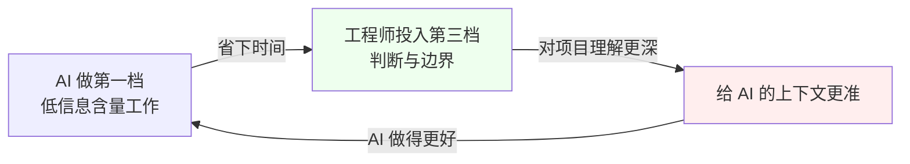
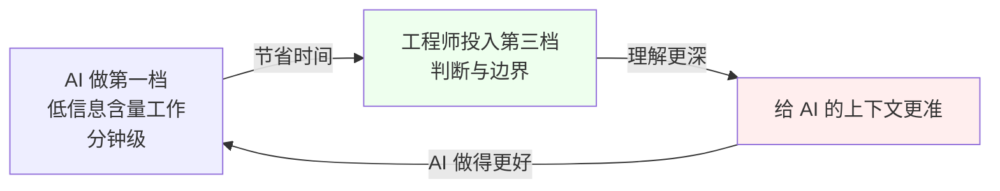

{: .no_toc }

<details close markdown="block">
  <summary>
    目录
  </summary>
  {: .text-delta }
- TOC
{:toc}
</details>

<!--
aicmigr-02-approach-02-change-and-unchange
传统项目迁AI 02：学习方法 - 迁移后的变与不变
-->

**全文导读**


本篇接续系列第 01 篇《老项目改造的真实链路》。上一篇把了解老项目的九步真实链路讲清楚了；本篇回答紧随而来的下一个问题：AI（以 Claude Code 为代表）介入之后，这九步里的每一步，到底应该让 AI 做多少、工程师自己守多少。读完本篇，工程师会获得一张可复用的人机分工图——面对任何一个陌生老项目的任何一步，都能快速判断这一步该让 AI 冲在前面，还是自己在前头、AI 辅助。


<!--
flowchart TD
    START([系列第 02 篇入口]) --\> MAP{读者类型?}

    MAP --\>|想速查方法论| P1[第一部分 方法论提炼]
    MAP --\>|想看实战推演| P2[第二部分 实战演示]
    MAP --\>|项目前快速过一遍| CL[Check List 速查]

    P1 --\> C1[第 1 章 核心命题与三档框架]
    C1 --\> C2[第 2 章 三档逐档展开]
    C2 --\> C3[第 3 章 陷阱警示与节奏观]
    C3 --\> C4[第 4 章 项目阶段 Check List]

    P2 --\> C5[第 5 章 案例背景与 AI 80% 复盘]
    C5 --\> C6[第 6 章 爆炸点回放与 20% 盲区拆解]
    C6 --\> C7[第 7 章 三档衔接节奏与正循环]

    C4 --\> C5
    C7 --\> C8[第 8 章 小结与思考]
    CL --\> C8
-->

第一部分是方法论参考手册（第 1-4 章），不深入具体技术栈，目标是让工程师在任何老项目阶段都能快速查阅"这一步该怎么思考、做什么、守什么边界"。第二部分用 xxx-scheduler 案例做实战推演（第 5-7 章），让方法论"不仅知其然、也知其所以然"。

## 1. 核心命题与三档分工框架

### 1.1 核心命题：分工不是会不会用 AI，是每一步用多少


很多工程师用 Claude Code 用得不顺，并不是不会用，而是分工搞错了。典型错误有两种，列在下面的对比表里。

| 错误类型 | 典型表现 | 本质问题 |
|---------|---------|---------|
| 过度依赖 | 把 AI 当成什么都能干的外包；项目拿到手第一件事就让 AI 改代码；出了问题再怪 AI 不靠谱 | 把 AI 当成"能自动理解项目的开发者"。但 AI 是上下文缺失的实习生，工程师不传递，它就是瞎的 |
| 过度保守 | AI 能做的事也不让它做；还在一行一行手动读 README、手动画架构图、手动数接口 | 速度慢到没有优势，等于白用了工具；改得稳但完全没拿到 AI 的红利 |

真正稳的工程师在这两端之间找平衡。他们对九步链路里的每一步都有清晰的认知：哪一步 AI 冲在前面，哪一步自己在前头、AI 辅助。本篇要给出的，就是这张人机分工图。

### 1.2 三档分工框架


把上一篇的九步拿出来，按 AI 能承担的工作比例归并成三档。三档的概览见下表。

| 档位 | 共同特征 | AI 承担比例 | 包含的步骤 |
|------|---------|------------|-----------|
| 第一档 | 内容写在代码或公开文档里，AI 能直接读到 | 80% | 翻资料（第 2 步）、浏览代码结构（第 3 步）、访接口（第 5 步） |
| 第二档 | AI 能做一半，另一半需要人的判断或人脉 | 50% | 找人聊（第 1 步）、搭环境跑起来（第 4 步）、带疑点深挖（第 6 步）、画核心链路（第 7 步）、动手改（第 8 步） |
| 第三档 | 答案不在代码里，在人的脑子里或工程判断里 | 20% 或更少 | 判断不可动代码、判断对接方诉求、最终验收（第 9 步）、上线风险判断 |

判断一个步骤属于哪一档，可以套用下面这三条第一性准则——它们足够具体可操作，拿到任何一步都能立刻归类。

#### (1) 答案写在代码或公开文档里——属于第一档

如果这一步要找的信息（接口签名、模块依赖、数据表结构、对外文档）都能被 AI 直接读到，那就放手让 AI 做初稿。这一档的关键动作是"放手 + 校一眼"。

#### (2) 一半能读到、另一半需要人的判断或人脉——属于第二档

如果这一步 AI 能产出初稿，但最终质量取决于人的判断（去问谁、怎么问、方案 A 还是 B）或人对环境/业务的掌握（公司 VPN、业务约定、历史坑点），那就是第二档。这一档的关键动作是"人机对半、各做擅长的事"。

#### (3) 答案只在人脑里或工程判断里——属于第三档

如果这一步的答案根本不在代码里——某段代码为什么不能删、对接方的诉求最近有没有变、按下上线按钮的时机——这些 AI 都给不了承担责任的答案。这一档的关键动作是"工程师主动补、AI 替代不了"。


<!--
图片内容说明
路径：imgs/02_了解方法_02：换到AI编程后的变与不变/bd3c338e6befe966406fb08ebdd30cd3_MD5.jpg
用途：将上一篇的九步真实链路，按 AI 能承担的工作比例归并成三档（AI 主导 80% / 人机对半 50% / 人主导 20%），形成一张"人机分工图"，作为本篇核心论点的可视化总览
内容：横轴为 9 个步骤（1.找人聊 2.翻资料 3.浏览代码结构 4.搭环境跑起来 5.访接口 6.带疑点深挖 7.画核心链路 8.动手改 9.最终验收），按三档归并：第一档 AI 主导（步骤 2、3、5）；第二档人机对半（步骤 1、4、6、7、8）；第三档人主导（步骤 9 + 不可动代码判断 + 对接方诉求判断 + 上线风险判断）。配色区分三档，强调分工不是会不会用 AI，而是每一步该让 AI 做多少、自己守多少
-->

## 2. 三档逐档展开

第 1 章给出了三档框架和第一性判定准则，本章逐档展开每一档里 AI 能做什么、人要做什么。读完本章，工程师拿到任何一个步骤都能照着表格定档、定动作。

### 2.1 第一档：AI 主导，做 80%


这一档的共同点是：内容都写在代码或公开文档里，AI 能直接读到。这一档的核心动作是"放手让 AI 做初稿 + 工程师花几分钟校一眼"。

| 步骤 | AI 能做什么 | 工程师要做什么 |
|------|-----------|--------------|
| 翻资料（第 2 步） | 读 README、wiki、Confluence、jira，速度比人快十倍 | 花几分钟校一眼摘要；有问题就让 AI"把这个地方再细化一下"；没问题就往下走 |
| 浏览代码结构（第 3 步） | 扫一遍仓库，生成模块图、数据流图 | 校一眼图是否符合实际；漏的关键依赖补回去 |
| 访接口（第 5 步） | 从代码里梳理出所有接口清单 + curl 示例 | 校一眼接口清单是否完整；漏的接口指给 AI |

### 2.2 第二档：人机对半，AI 做 50%


这一档的共同点是：AI 能做一半，但另一半需要人的判断或人脉。这一档是工程师日常最常遇到的情况——因为老项目里很少有一点信息都读不到的情况——所以整个系列大部分内容会围绕这一档展开：讲工程师和 AI 怎么配合、提示词怎么写、什么时候该打断它、什么时候该让它继续。

| 步骤 | AI 能做什么 | 工程师要做什么 |
|------|-----------|--------------|
| 找人聊（第 1 步） | 整理疑点清单、草拟要问的问题 | 决定去问谁、怎么问、怎么把答案串起来——这是人的事 |
| 搭环境跑起来（第 4 步） | 帮忙写启动脚本、调依赖版本 | 公司内部的 VPN、数据库授权、服务调通，多数情况下 AI 不知道 |
| 带疑点深挖（第 6 步） | 扫描代码给工程师找调用链路 | "这段逻辑为什么这样写"的答案经常只有问到人才能得到 |
| 画核心链路（第 7 步） | 出一张不错的 Mermaid 图 | 关键的业务约定、历史坑点要靠工程师补进去 |
| 动手改（第 8 步） | 把工程师描述的改造写成代码、写测试 | "方案 A 还是 B"、"这段要不要重构"、"边界条件怎么处理"这些决策是工程师要做的 |

### 2.3 第三档：人主导，AI 做 20% 或更少


这一档的共同点是：答案不在代码里，在人的脑子里或工程判断里。AI 在这一档做不了核心动作，只能做辅助（比如列 checklist、给参考）。

| 步骤 / 场景 | 为什么 AI 做不了 | 谁能做 |
|------------|----------------|-------|
| 判断哪些代码不能动 | 像下面这段注释，AI 看不出它背后意味着什么 | 只有经历过那次 incident 的人知道 |
| 判断对接方是谁、对接方诉求变了没有 | AI 可能猜得到对接方叫什么，但猜不到最近有没有人改动他们的调用 | 工程师要主动去问、去确认 |
| 最终验收（第 9 步） | 跑业务场景、看主流程、找人 review，AI 能帮列 checklist | 但"按下上线按钮"这个动作必须是工程师来做 |
| 上线前的风险判断 | 对回滚成本、灰度方案、影响面的判断，AI 能给参考 | 决策权在工程师 |

第三档里 AI 看不出背后含义的典型代码长这样：

```java
// 不要删，某某对接方需要
```

> 这一句注释背后是一段历史逻辑。AI 读得到这句话，但读不到这句话背后的 incident——只有亲历过那次事故的人知道。

这一档要的不是更强的 AI，是更清醒的工程师。

## 3. 陷阱警示与节奏观


### 3.1 最危险的陷阱：80% 完成度 ≠ 100% 完成度

在三档之中，最危险的情况是：AI 做了 80% 之后，工程师却把剩下的 20% 当成 0，当个甩手掌柜。这种心智模式有四种典型表现，每一种都会让 20% 的盲区变成 100% 的事故。

#### (1) AI 读完 README，工程师就以为项目懂了

但 README 里没写的那些事，AI 也不知道。

#### (2) AI 画完架构图，工程师就以为全貌都在手里了

但那几个"曾经踩过的坑"不会出现在架构图上。

#### (3) AI 写完代码，工程师就以为改造做完了

但"这段上线后会不会影响另一个对接方"这件事，AI 给不了答案。

#### (4) AI 覆盖不了的那 20%，工程师不主动去补，它就是 0

20% 的盲区，经常就是 100% 的事故。

> 用 AI 用得不好的工程师最常见的错误，就是把 80% 的完成度当成 100% 的完成度。这一句话值得贴在显示器上。

### 3.2 AI 改变的是节奏，不是链路

AI 没有改变九步链路本身——该找人聊还得找人聊，该搭环境还得搭环境，该判断风险还得工程师判断。但 AI 改变了节奏。下面的对比表把"没有 AI"和"有 AI"两种情况下、各步骤的耗时摆在一起。

| 步骤 | 没有 AI 的耗时 | 有 AI 的耗时 |
|------|--------------|------------|
| 读 README | 一小时 | 分钟级 |
| 梳理接口 | 一下午 | 分钟级 |
| 画架构图 | 一整天 | 分钟级 |
| 整个了解阶段 | 一到两周 | 半天即可进入改造阶段 |

AI 真正的价值不是替代人，是把人从低信息含量工作里解放出来，去做那些真正需要人的事——也就是第二档里要做的判断、第三档里要守的边界。AI 能做的事交出去，节省下来的时间就能用在第三档上：工程师对项目理解更深、对边界更清醒、给 AI 的上下文更准。这是一个正循环。



用 AI 的三种工程师画像，决定了能不能跑通上面这个正循环：

| 工程师类型 | 行为模式 | 结果 |
|-----------|---------|------|
| 不会用 AI 的工程师 | 把所有时间都花在第一档那些事上 | 累死累活也谈不上效率 |
| 用错 AI 的工程师 | 让 AI 把第一、第二、第三档都一起做了 | 出事再回头 |
| 用对 AI 的工程师 | 把第一档的速度和第三档的稳当都兼顾住 | 跑出正循环 |

本系列的目标，是把工程师训练成用对 AI 的工程师。

## 4. 项目阶段 Check List


本章把前三章的方法论浓缩成一份可裁剪的速查清单。工程师在接手任何一个老项目的了解阶段，可以照着这份清单逐项打勾。条目按三档组织，每档末尾给出档位切换提示。

### 4.1 第一档 Check List（放手让 AI 做）

判定准则：信息写在代码或公开文档里，AI 能直接读到。

#### (1) 翻资料（第 2 步）

让 AI 读完 README、wiki、Confluence、jira，产出一份项目摘要。工程师花几分钟校一眼，漏的关键信息让 AI 补。

#### (2) 浏览代码结构（第 3 步）

让 AI 扫描仓库，产出模块图、数据流图。工程师校一眼图是否符合实际。

#### (3) 访接口（第 5 步）

让 AI 从代码里梳理出所有接口清单 + curl 示例。工程师校一眼接口是否完整。

> 档位切换提示：以上三步做完后，进入第二档的"找人聊"和"搭环境"——这两步需要人的判断或人脉，不能让 AI 单飞。

### 4.2 第二档 Check List（人机对半）

判定准则：AI 能做一半，另一半需要人的判断或人脉。

#### (1) 找人聊（第 1 步）

让 AI 整理疑点清单、草拟要问的问题；工程师决定问谁、怎么问、怎么把答案串起来。

#### (2) 搭环境跑起来（第 4 步）

让 AI 写启动脚本、调依赖版本；公司内部的 VPN、数据库授权、服务调通由工程师负责。

#### (3) 带疑点深挖（第 6 步）

让 AI 扫描代码找出调用链路；"这段逻辑为什么这样写"的答案去问亲历者。

#### (4) 画核心链路（第 7 步）

让 AI 出一张 Mermaid 图作为底稿；关键的业务约定、历史坑点由工程师补进去。

#### (5) 动手改（第 8 步）

让 AI 把工程师描述的改造写成代码、写测试；"方案 A 还是 B"、"要不要重构"、"边界条件怎么处理"由工程师决策。

> 档位切换提示：动手改之前和上线之前，必须切到第三档——这两件事 AI 替代不了。

### 4.3 第三档 Check List（必须人做）

判定准则：答案只在人脑里或工程判断里。

#### (1) 不可动代码判断

那段 `// 不要删，某某对接方需要` 背后的 incident，AI 看不出。要找到亲历过那次事故的人，确认依赖关系。

#### (2) 对接方诉求判断

AI 可能猜得到对接方叫什么，但猜不到最近有没有人改动他们的调用。要主动去问、去确认。

#### (3) 最终验收（第 9 步）

跑业务场景、看主流程、找人 review——AI 能帮列 checklist，但"按下上线按钮"必须由工程师来做。

#### (4) 上线前风险判断

对回滚成本、灰度方案、影响面的判断，AI 能给参考，但决策权在工程师。

> 这四件事 AI 替代不了。20% 的盲区，经常就是 100% 的事故。AI 做不到的那 20%，工程师不主动补，它就是 0。

### 4.4 档位切换节奏 Check List

第三档之外的"切换节奏"也要盯，否则三档之间会断层：

#### (1) AI 做完初稿后是否明确接手验证

不要让 AI 自评自验，要由工程师花几分钟校。

#### (2) 验证通过后是否明确再交给 AI 继续

校完之后明确告诉 AI"OK，继续"，避免它停在原地等。

#### (3) 第三档的判断是否都做了

不可动代码、对接方诉求、上线风险——这三项任何一项漏了，都可能让 20% 的盲区变成事故。

第二部分用 xxx-scheduler 案例做实战推演，把第一部分的三档方法论对应到实际项目过程。案例将完整复现"AI 把第一档做得又快又好 → 工程师误以为项目已经懂了 → 上线炸了 → 回到三档找根因"的全过程，让方法论"不仅知其然、也知其所以然"。

## 5. 案例背景与 AI 80% 复盘


### 5.1 案例背景

回到上一篇那个接手 xxx-scheduler 老批处理项目的场景。这次假设不是纯人干，而是有 AI 辅助的版本：把仓库交给 Claude Code，让它帮忙读 README、梳理代码结构、数接口、列数据表。

### 5.2 AI 在第一档步骤上的表现

AI 在第一档（步骤 2、3、5）上的表现都很好。下表把每一步 AI 做了什么、产出什么、耗时多少、评价如何列在一起。

| 步骤 | AI 做了什么 | 产出 | 耗时 | 评价 |
|------|-----------|------|------|------|
| 翻资料（第 2 步） | 读完 README、wiki | 项目摘要 | 分钟级 | 又快又好 |
| 浏览代码结构（第 3 步） | 扫描仓库 | 模块图、数据流图 | 分钟级 | 相当完整 |
| 访接口（第 5 步） | 从代码梳理接口 | 接口清单 + curl 示例 | 分钟级 | 干净 |

整套第一档做下来不到半小时，工程师手里就有了一份相当完整的项目摘要：模块结构清楚、接口清单齐全、数据表罗列到位。从第一档的标准看，这是一份高质量的工作产出。

### 5.3 "懂了"的错觉从何而来

看着那份摘要，工程师很容易产生一个错觉：自己已经懂这个项目了。

这个错觉就是第一部分 3.1 节警告的"80% 完成度被当成 100% 完成度"的开始。第一档的产出确实完整、确实干净——但完整和干净，不等于覆盖了项目的全部风险面。下一步要做的"改那个批处理任务"，会把这份错觉推到顶点，然后在上线那一刻炸开。

## 6. 爆炸点回放与 20% 盲区拆解


### 6.1 爆炸点回放

接续第 5 章：看着那份摘要，工程师让 AI 去改那个批处理任务。AI 基于它读到的那份上下文，给了一个看起来合理的方案。改完跑通了，测试也过了。

然后上线，炸了。

炸的根因，就在仓库里那段看似无害的注释背后：

```java
// 不要删，某某对接方需要
```

这段注释背后是一段历史逻辑——某次 incident 之后留下的一行备忘，记录了这段代码不能删的真实原因。AI 读得到这句话，但读不到这句话背后的 incident。

### 6.2 根因：不在 AI 的 80%，在那被忘掉的 20%

问题出在哪里？不在 AI 的 80%。AI 在第一档那些步骤上做得都挺好，摘要完整、代码干净。问题出在工程师忘了还有 20% 没被覆盖。

那 20% 是 AI 根本读不到的东西：项目的演进历史、团队之间的默契、没有写在任何文档里的隐性约定。这些东西在第一档的"完整摘要"里不存在，但它们恰恰决定了改造上线之后会不会出事。

### 6.3 20% 盲区逐项拆解

把第一部分 3.1 节列出的四类"心智模式盲区"对应到 xxx-scheduler 案例，每一类都有具体的表现。

| 盲区类型 | 案例中的具体表现 | AI 为什么读不到 |
|---------|----------------|---------------|
| README 没写的事 | 某某对接方的存在和那段 incident | README 不记录这种历史事故 |
| 架构图不显示的坑 | 那段 `// 不要删` 背后的依赖关系 | 架构图不画这种隐性依赖 |
| AI 写不出的影响判断 | 改这段批处理会不会影响另一个对接方 | AI 不知道调用方的真实诉求 |
| 默契与隐性约定 | 哪些代码绝对不能动、对接方诉求变了没 | 这些信息只在亲历者的脑子里 |

> 20% 的盲区，经常就是 100% 的事故。xxx-scheduler 这一次的爆炸，不是 AI 的失败，是工程师用错了 AI：让 AI 完成了它的 80%，却没有自己去补那 20%。

## 7. 三档衔接节奏与正循环

### 7.1 三档衔接节奏（用 xxx-scheduler 案例回放正确做法）


如果工程师按三档分工图来跑 xxx-scheduler，节奏应该是下面这张时序图：第一档放手让 AI 做、第二档人机对半、第三档主动补 20%，三档之间衔接清晰。


<!--
sequenceDiagram
    participant AI as Claude Code
    participant Eng as 工程师
    participant Human as 亲历者/对接方

    Note over AI,Eng: 第一档（放手）
    AI->>Eng: 翻资料摘要（第 2 步）
    Eng->>Eng: 花几分钟校摘要
    AI->>Eng: 模块图、接口清单（第 3、5 步）
    Eng->>Eng: 校完整性

    Note over AI、Eng、Human: 第二档（人机对半）
    AI->>Eng: 整理疑点清单（第 1 步）
    Eng->>Human: 去问亲历者
    Human--\>>Eng: 那段代码不能删的 incident
    AI->>Eng: Mermaid 链路图（第 7 步）
    Eng->>Eng: 把历史坑点补进图

    Note over Eng,Human: 第三档（人主导）
    Eng->>Human: 确认对接方诉求变了没
    Eng->>Eng: 判断哪些代码不能动
    Eng->>Eng: 上线风险判断

    Note over AI,Eng: 回到第二档
    Eng->>AI: 描述改造（第 8 步）
    AI->>Eng: 写代码、写测试
    Eng->>Eng: 方案决策 + 最终验收
    Eng->>Eng: 按下上线按钮（第 9 步）
-->

把这张时序图抽象成节奏要求，就是三句话：

#### (1) 第一档、第二档要快

AI 能做的事就让它做，别慢吞吞。不放手，AI 就没有价值。很多工程师用 Claude Code 用不出效率，就是卡在这一档不肯放手。

#### (2) 第三档要稳

该人判断的时候别想偷懒，别问 AI"你觉得呢"。问 AI 它一定有答案，但那个答案不承担责任，最后出事还是工程师的事。

#### (3) 档位之间的衔接要清晰

AI 做完初稿，什么时候工程师接过来验？验完之后，什么时候再让 AI 继续？这个节奏是整个系列最想教会工程师的事，后面的篇章都在讲这件事。

### 7.2 正循环演示


把节奏跑对了，就能跑出第一部分 3.2 节描述的那个正循环。这个正循环的本质是：AI 把低信息含量的工作压缩到分钟级，工程师把节省下来的时间用在第三档的判断上——对项目理解更深、对边界更清醒，给 AI 的上下文就更准，AI 在第一档第二档就做得更好。



工程师最终落在哪一种画像上，决定了正循环能不能跑通：

| 工程师类型 | 行为模式 | 是否跑通正循环 |
|-----------|---------|--------------|
| 不会用 AI 的工程师 | 把所有时间花在第一档 | 跑不通——累死累活也谈不上效率 |
| 用错 AI 的工程师 | 让 AI 把一二三档全做了 | 跑不通——出事再回头，正循环被打断 |
| 用对 AI 的工程师 | 第一档速度 + 第三档稳当 | 跑通——节省的时间反哺第三档，越跑越快 |

本系列的目标，是把工程师训练成用对 AI 的工程师。

## 8. 小结与思考


### 8.1 小结

本篇给出了一张人机分工图：把上一篇的九步链路按 AI 承担比例归并成三档。

#### (1) 三档框架

9 步骤按 AI 承担比例分三档，判定准则是信息存在哪里：写在代码或公开文档里 → 第一档；一半能读到、一半需要人的判断 → 第二档；只在人脑或工程判断里 → 第三档。

#### (2) 第一档：AI 主导，做 80%

翻资料、浏览代码结构、访接口——放手让 AI 做。这一档的关键动作是"放手 + 校一眼"。

#### (3) 第二档：人机对半，AI 做 50%

找人聊、搭环境、带疑点深挖、画核心链路、动手改——本系列大部分功夫花在这一档。这一档的关键动作是"人机各做擅长的事"。

#### (4) 第三档：人主导，AI 做 20% 或更少

不可动代码判断、对接方诉求判断、最终验收、上线风险识别——AI 替代不了。这一档要的不是更强的 AI，是更清醒的工程师。

#### (5) 金句

20% 的盲区，经常就是 100% 的事故。AI 做不到的那 20%，工程师不主动补，它就是 0。

下一篇会展开三层控制：理解、约束、验证。光有分工图还不够，要让 AI 在第一档和第二档里真正可信地帮工程师干活，还需要一套让它不乱来的框架。

### 8.2 思考

#### (1) 思考一

拿手头正在维护的那个项目，按九步走一遍。对照每一步写一写：如果现在让 Claude Code 做，它能做多少？剩下的是什么？剩下的那部分目前存在哪儿？（脑子里？文档里？某个同事的脑子里？）

#### (2) 思考二

回想最近一次用 Claude Code 改老项目的经历。如果改造结果有问题，问题发生在九步里的哪一步？那一步被归为哪一档？归错档了吗？
