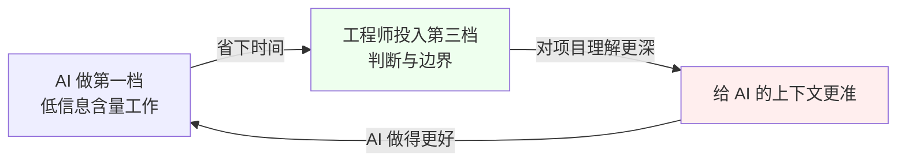

{: .no_toc }

<details close markdown="block">
  <summary>
    目录
  </summary>
  {: .text-delta }
- TOC
{:toc}
</details>

<!--
aicmigr-02-approach-02-change-and-unchange
传统项目迁AI 02：学习方法 - 迁移后的变与不变
-->

## 1. 核心命题：<span style="color: red; font-weight: bold;">分工不是会不会用 AI，是每一步用多少</span>

### 1.1 为什么工程师用 AI 总用不顺


为什么很多工程师用 Claude Code 总用不顺？<span style="color: red; font-weight: bold;">不是不会用，是分工搞错了</span>。典型错误有两端，列在下面这张对比表里。

| 错误类型 | 典型表现                                        | 本质问题                                        |
| ---- | ------------------------------------------- | ------------------------------------------- |
| 过度依赖 | 把 AI 当成什么都能干的外包，项目到手第一件事就让它改代码，出问题再怪 AI 不靠谱 | 误以为 AI 能自动理解项目。但 AI 是上下文缺失的实习生，工程师不传递，它就是瞎的 |
| 过度保守 | AI 能做的事也不让它做，还在一行行手读 README、手画架构图、手数接口      | 速度慢到没有优势，稳是稳了，但完全没拿到 AI 的红利                 |

一个把 AI 捧上天，一个把 AI 摆一边，结果都不顺——原因一样：把"要不要用 AI"当成了非黑即白的问题。<span style="color: red; font-weight: bold;">真正要回答的不是"用不用"，而是"每一步用多少"</span>。

稳的工程师在这两端之间找平衡：每一步都清楚，哪一步让 AI 冲在前面，哪一步自己站前头、AI 只做辅助。本篇要给的，就是这张人机分工图。

### 1.2 三档分工框架


借用一个传统软件工程里的类比来铺垫：三档分工 ≈ 项目派单。

- 能写死在文档里的活，派给实习生——查接口签名、读模块依赖、数对外接口。需求清、产出可校验，放手让他做。
- 需要判断的活，派给自己——找谁聊、方案 A 还是 B、环境为什么跑不起来。实习生可出初稿，但拍板得你来。
- 需要担责的活，派给负责人——某段代码能不能删、上线按钮什么时候按、对接方诉求有没有变。这些事出了事要有人背，实习生给不了答案。

AI 在这套派单里扮演的就是那个"上下文缺失的实习生"——<span style="color: red; font-weight: bold;">能力很强，但你不传递上下文，它就是瞎的</span>。把上面的派单逻辑翻译成 AI 语言，就是本篇的核心框架：三档分工。

上一篇讲过了解老项目的九步真实链路。把九步按 AI 能承担的工作比例归并，正好得到三档：

| 档位  | 共同特征                                                                      | AI 承担比例 | 包含的步骤                                                         |
| --- | ------------------------------------------------------------------------- | ------- | ------------------------------------------------------------- |
| 第一档 | 内容写在代码或公开文档里，<span style="color: red; font-weight: bold;">AI 能直接读到</span> | 80%     | 翻资料（第 2 步）、浏览代码结构（第 3 步）、访接口（第 5 步）                           |
| 第二档 | AI 能做一半，另一半<span style="color: red; font-weight: bold;">需要人的判断或人脉</span>  | 50%     | 找人聊（第 1 步）、搭环境跑起来（第 4 步）、带疑点深挖（第 6 步）、画核心链路（第 7 步）、动手改（第 8 步） |
| 第三档 | 答案不在代码里，<span style="color: red; font-weight: bold;">答案在人的脑子里或工程判断里</span>                                                    | 20% 或更少 | 判断不可动代码、判断对接方诉求、最终验收（第 9 步）、上线风险判断                            |

这张表的关键不是"哪一步属于哪一档"——那只是结论。关键是背后那把尺子：怎么判定一个步骤该归哪一档？这把尺子，就是下一节的三条准则。

把这张分工图画成图，就是下面的可视化总览。


<!--
图片内容说明
路径：imgs/aicmigr-02-approach-02-change-and-unchange/bd3c338e6befe966406fb08ebdd30cd3_MD5.jpg
用途：把上一篇给出的九步真实链路，按 AI 能承担的工作比例归并成三档（AI 主导 80% / 人机对半 50% / 人主导 20%），形成一张"人机分工图"，作为本篇核心论点的可视化总览，承接第 1.1 节判定准则、引出第 2 章逐档展开
内容：横轴为 9 个步骤（1.找人聊 2.翻资料 3.浏览代码结构 4.搭环境跑起来 5.访接口 6.带疑点深挖 7.画核心链路 8.动手改 9.最终验收），按 AI 承担比例归并为三档并用配色区分：第一档 AI 主导（步骤 2 翻资料、3 浏览代码结构、5 访接口）；第二档人机对半（步骤 1 找人聊、4 搭环境跑起来、6 带疑点深挖、7 画核心链路、8 动手改）；第三档人主导（步骤 9 最终验收，外加不可动代码判断、对接方诉求判断、上线风险判断等工程专属责任）。整图传达核心论点：分工不是会不会用 AI，而是每一步该让 AI 做多少、自己守多少
-->

### 1.3 三条第一性判定准则

拿到一个步骤，怎么快速归到三档里的某一档？<span style="color: red; font-weight: bold;">关键是看执行任务所需的信息在哪里</span>。具体执行套这三条就够了——足够具体、可操作，任何一步都能立刻归类。

#### (1) 答案写在代码或公开文档里——属于第一档（AI为主）

- 判定信号：要找的信息——接口签名、模块依赖、数据表结构、对外文档——都能被 AI 直接读到。
- 应对动作：放手让 AI 出初稿，工程师只花几分钟校一眼。校的不是对错，是 AI 有没有读错文件、漏读关键模块。
- 案例：**梳理一个老项目的对外接口清单**，让 AI 扫一遍 controller 目录和 OpenAPI 文档，几分钟产出初稿。工程师抽样校验几个签名对不对得上即可——典型的第一档。

#### (2) 一半能读到、另一半需要人的判断或人脉——属于第二档（对半分）

- 判定信号：AI 能出初稿，但最终质量取决于人的判断（问谁、怎么问、方案 A 还是 B）或人对环境/业务的掌握（公司 VPN、业务约定、历史坑点）。
- 应对动作：人机对半，各做擅长的。AI 负责信息收集和初稿，人负责判断、决策、对外沟通。
- 案例：搭环境跑起来，AI 照 README 写出启动命令，**但跑不通时多半卡在公司内网权限、密钥配置、历史遗留的环境变量这些 AI 看不见的因素。这时候得人介入**，AI 辅助排查——典型的第二档。

#### (3) 答案只在人脑里或工程判断里——属于第三档（人为主）

- 判定信号：答案根本不在代码里——某段代码为什么不能删、对接方诉求最近有没有变、按下上线按钮的时机。
- 应对动作：工程师主动补，AI 替代不了。
- 案例：代码里一段看似无用的逻辑，AI 会建议删掉。但它可能是某个对接方赖以工作的兼容代码，删了就炸。这种**答案只在跟对接方聊过的人脑子里，AI 读代码读不出来**——这就是第三档。

## 2. 三档逐档展开

第 1 章给了三档框架和判定准则。本章逐档拆开：每一档 AI 做什么、工程师做什么，每档配一张能照着打勾的速查表。读完本章，拿到任何一步都能照表定档、定动作。

### 2.1 第一档：AI 主导，做 80%


第一档的共同点：信息都写在代码或公开文档里，AI 能直接读到。这一档像把一段资料整理派给实习生写初稿——导师不必陪坐，扫一眼摘要挑出漏项即可。

| 步骤                                                                | AI 能做什么                               | 工程师要做什么                |
| ------------| ------------------------------------- | ---------------------- |
| <span style="color: red; font-weight: bold;">翻资料（第 2 步）</span>    | 读 README、wiki、Confluence、jira，速度比人快十倍 | 花几分钟校一眼摘要；漏的关键信息让 AI 补 |
| <span style="color: red; font-weight: bold;">浏览代码结构（第 3 步）</span> | 扫一遍仓库，生成模块图、数据流图                      | 校一眼图是否符合实际；漏的关键依赖补回去   |
| <span style="color: red; font-weight: bold;">访接口（第 5 步）</span>    | 从代码里梳理出所有接口清单 + curl 示例               | 校一眼接口清单是否完整；漏的接口指给 AI  |

判定准则：信息写在代码或公开文档里，AI 能直接读到。

配合的关键在三步都一样：AI 出初稿，工程师只校"有没有漏"——不校对错。漏掉的关键信息指回去让 AI 补一句"把这块再细化一下"即可，不必逐条重写。

档位切换提示：以上三步做完，进入第二档的"找人聊"和"搭环境"——这两步需要人的判断或人脉，AI 不能单飞。

### 2.2 第二档：人机对半，AI 做 50%


第二档的共同点：AI 能做一半，另一半需要人的判断或人脉。这一档像师徒结对——徒弟出力、师傅拿主意，各做自己擅长的那一半。它是工程师日常最常遇到的情况：老项目里极少有信息完全读不到的步骤，也极少有完全不需要人判断的步骤。本系列大部分内容会围绕这一档展开：怎么配合、提示词怎么写、什么时候打断 AI、什么时候让它继续。

| 步骤                                                                | AI 能做什么           | 工程师要做什么                          |
| ----------------------------------------------------------------- | ----------------- | -------------------------------- |
| <span style="color: red; font-weight: bold;">找人聊（第 1 步）</span>    | 整理疑点清单、草拟要问的问题    | 决定问谁、怎么问、怎么把答案串起来                |
| <span style="color: red; font-weight: bold;">搭环境跑起来（第 4 步）</span> | 写启动脚本、调依赖版本       | 公司内部的 VPN、数据库授权、服务调通             |
| <span style="color: red; font-weight: bold;">带疑点深挖（第 6 步）</span>  | 扫描代码给工程师找调用链路     | "这段逻辑为什么这样写"的答案去问亲历者             |
| <span style="color: red; font-weight: bold;">画核心链路（第 7 步）</span>  | 出一张不错的 Mermaid 图  | 关键的业务约定、历史坑点补进去                  |
| <span style="color: red; font-weight: bold;">动手改（第 8 步）</span>    | 把工程师描述的改造写成代码、写测试 | "方案 A 还是 B"、"要不要重构"、"边界条件怎么处理"决策 |

判定准则：AI 能做一半，另一半需要人的判断或人脉。

配合的关键：AI 出力，人拿主意。凡是要问人、要动用公司内部资源、要做方案选择的环节，都落在工程师这一侧——AI 能做的是把这些环节的前置信息备齐、把初稿铺好。

档位切换提示：动手改之前和上线之前，必须切到第三档——这两件事 AI 替代不了。

### 2.3 第三档：人主导，AI 做 20% 或更少


第三档的共同点：答案不在代码里，在人的脑子里或工程判断里。<span style="color: red; font-weight: bold;">AI 在这一档做不了核心动作，只能辅助（列 checklist、给参考）</span>。这一档像负责人亲自拍板——担责的事不能委托给助手，哪怕那个助手很强。

下表同时是本档的速查清单，每一行都是一条需要工程师亲自打勾的项：

| 步骤 / 场景                                                         | 为什么 AI 做不了                             | 谁能做                   |
| --------------------------------------------------------------- | -------------------------------------- | --------------------- |
| <span style="color: red; font-weight: bold;">不可动代码判断</span>     | 像 `// 不要删，某某对接方需要` 这种注释，AI 看不出它背后意味着什么 | 只有经历过那次 incident 的人知道 |
| <span style="color: red; font-weight: bold;">对接方诉求判断</span>     | AI 可能猜得到对接方叫什么，但猜不到最近有没有人改动他们的调用       | 工程师要主动去问、去确认          |
| <span style="color: red; font-weight: bold;">最终验收（第 9 步）</span> | 跑业务场景、看主流程、找人 review，AI 能帮列 checklist  | 但"按下上线按钮"这个动作必须是工程师来做 |
| <span style="color: red; font-weight: bold;">上线前风险判断</span>     | 对回滚成本、灰度方案、影响面的判断，AI 能给参考              | 决策权在工程师               |

判定准则：答案只在人脑里或工程判断里。

第三档里 AI 看不出背后含义的典型代码长这样：

```java
// 不要删，某某对接方需要
```

> 这一句注释背后是一段历史逻辑。<span style="color: red; font-weight: bold;">AI 读得到这句话，但读不到这句话背后的 incident——只有亲历过那次事故的人知道</span>。

**这一档要的不是更强的 AI，是更清醒的工程师。**

### 2.4 档位切换节奏


每档做对还不够，三档之间的衔接节奏也要盯，否则会断层。节奏要求集中在四个切换点上，照表自查：

| 切换点        | 节奏要求                                      |
| ---------- | ----------------------------------------- |
| AI 做完初稿后   | 工程师明确接手验证——不要让 AI 自评自验，要由工程师花几分钟校         |
| 验证通过后      | 明确再交给 AI 继续——校完之后明确告诉 AI "OK，继续"，避免它停在原地等 |
| 动手改之前和上线之前 | 必须切到第三档（人主导）——这两件事 AI 替代不了                |
| 第三档判断是否都做了 | 不可动代码、对接方诉求、上线风险——任何一项漏了，都可能让 20% 的盲区变成事故 |

## 3. 最危险的陷阱：80% 完成度 ≠ 100% 完成度

### 3.1 错觉从何而来


回到上一篇接手 xxx-scheduler 老批处理项目的场景。这次不是纯人干，而是把仓库交给 Claude Code，让它读 README、梳理代码结构、数接口、列数据表。

AI 在第一档（步骤 2、3、5）上的表现相当好，整套做下来不到半小时：

| 步骤 | AI 做了什么 | 产出 | 耗时 | 评价 |
|------|-----------|------|------|------|
| 翻资料（第 2 步） | 读完 README、wiki | 项目摘要 | 分钟级 | 又快又好 |
| 浏览代码结构（第 3 步） | 扫描仓库 | 模块图、数据流图 | 分钟级 | 相当完整 |
| 访接口（第 5 步） | 从代码梳理接口 | 接口清单 + curl 示例 | 分钟级 | 干净 |

模块结构清楚、接口清单齐全、数据表罗列到位——从第一档的标准看，这是一份高质量产出。<span style="color: red; font-weight: bold;">看着它，工程师很容易产生一个错觉：自己已经懂这个项目了</span>。

错觉会推着人往前走。让 AI 去改那个批处理任务，它基于读到的上下文给出一个看起来合理的方案，改完跑通，测试也过。

然后上线，炸了。

你可能会问：AI 第一档做得这么好，为什么会炸？

因为炸点不在第一档，在<span style="color: red; font-weight: bold;">仓库里那段看似无害的</span> `// 不要删，某某对接方需要` <span style="color: red; font-weight: bold;">注释背后</span>。那是一次 incident 之后留下的一行备忘，记录这段代码不能删的真实原因。<span style="color: red; font-weight: bold;">AI 读得到这句话，但读不到这句话背后的 incident——只有亲历过那次事故的人知道</span>。

问题不在 AI 的 80%，那部分它做得挺好。问题在<span style="color: red; font-weight: bold;">工程师忘了还有 20% 没被覆盖</span>。那 20% 是 AI 根本读不到的东西：项目演进历史、团队默契、没有任何文档记录的隐性约定。它们不在第一档的"完整摘要"里，<span style="color: red; font-weight: bold;">但恰恰决定了改造上线之后会不会出事</span>。

类比传统项目里的"隐性需求"——需求文档不写、但客户会提的需求，只有跟客户聊过的人知道。AI 不会去"跟客户聊"，所以这 20% 永远在它的视野之外。

### 3.2 盲区逐项拆解

把那 20% 对应到 xxx-scheduler 案例，每一类盲区都有具体表现：

| 盲区类型 | 案例中的具体表现 | AI 为什么读不到 |
|---------|----------------|---------------|
| README 没写的事 | 某某对接方的存在和那次 incident | README 不记录这种历史事故 |
| 架构图不显示的坑 | 那段 `// 不要删` 背后的依赖关系 | 架构图不画这种隐性依赖 |
| AI 写不出的影响判断 | 改这段批处理会不会影响另一个对接方 | AI 不知道调用方的真实诉求 |
| 默契与隐性约定 | 哪些代码绝对不能动、对接方诉求变了没 | 这些信息只在亲历者脑子里 |

四类盲区有个共同点：<span style="color: red; font-weight: bold;">都活在人脑里，不活在仓库里。AI 能扫到的只有仓库</span>。所以这 20% 不是 AI 不努力，是它努力也够不着。

### 3.3 错觉的四种典型表现


把上面的机制拉回工程师这一侧，最危险的心智模式有四种：

| 错误模式 | 典型表现 | 后果 |
|---------|---------|------|
| 读完 README 就以为项目懂了 | AI 读完 README，工程师就以为项目懂了 | README 里没写的那些事，AI 也不知道 |
| 画完架构图就以为全貌都在手 | AI 画完架构图，工程师就以为全貌都在手 | 那几个"曾经踩过的坑"不会出现在架构图上 |
| 写完代码就以为改造做完 | AI 写完代码，工程师就以为改造做完了 | "这段上线后会不会影响另一个对接方"，AI 给不了答案 |
| 20% 不主动补就是 0 | <span style="color: red; font-weight: bold;">AI 覆盖不了的那 20%，工程师不主动补，它就是 0</span> | <span style="color: red; font-weight: bold;">20% 的盲区，经常就是 100% 的事故</span> |

> 20% 的盲区，经常就是 100% 的事故。AI 做不到的那 20%，工程师不主动补，它就是 0。

> 用 AI 用得不好的工程师最常见的错误，就是<span style="color: red; font-weight: bold;">把 80% 的完成度当成 100% 的完成度</span>。这一句话值得贴在显示器上。

## 4. 节奏观：<span style="color: red; font-weight: bold;">AI 改变的是节奏，不是链路</span>

### 4.1 有 AI 与无 AI 的耗时对比


九步链路本身没变——该找人聊还得找人聊，该搭环境还得搭环境，该判断风险还得工程师判断。<span style="color: red; font-weight: bold;">但 AI 改变了节奏</span>。下表把"没有 AI"和"有 AI"两种情况下各步骤的耗时摆在一起。

| 步骤       | 没有 AI 的耗时 | 有 AI 的耗时   |
| -------- | --------- | ---------- |
| 读 README | 一小时       | 分钟级        |
| 梳理接口     | 一下午       | 分钟级        |
| 画架构图     | 一整天       | 分钟级        |
| 整个了解阶段   | 一到两周      | 半天即可进入改造阶段 |

你可能会问：AI 既然把了解阶段从两周压到半天，是不是意味着了解阶段不再重要？不是。AI 的价值不在替代人，<span style="color: red; font-weight: bold;">是把人从低信息含量工作里解放出来</span>——去做第二档里需要人的判断、守第三档里需要人担责的边界。

### 4.2 正循环

传统项目里有个常见现象：团队花时间做 code review，单看像是拖慢了进度，但 code review 把线上事故拦下来了，整个迭代反而更快。表面上的"慢"，反哺成了整体上的"快"。

用 AI 是同一个道理。AI 能做的事交出去，省下的时间不是用来摸鱼，而是反哺到第三档的判断上：工程师对项目理解更深、对边界更清醒、给 AI 的上下文更准。AI 拿到更准的上下文，在第一档第二档做得更好，又省下更多时间。<span style="color: red; font-weight: bold;">这是一个正循环</span>。


```mermaid
flowchart LR
    A[AI 做第一档<br/>低信息含量工作] -->|省下时间| B[工程师投入第三档<br/>判断与边界]
    B -->|对项目理解更深| C[给 AI 的上下文更准]
    C -->|AI 做得更好| A

    style A fill:#eef
    style B fill:#efe
    style C fill:#fee
```

正循环能不能跑通，取决于工程师落在哪一种画像上：

| 工程师类型       | 行为模式                 | 结果         |
| ----------- | -------------------- | ---------- |
| 不会用 AI 的工程师 | 把所有时间都花在第一档那些事上      | 累死累活也谈不上效率 |
| 用错 AI 的工程师  | 让 AI 把第一、第二、第三档都一起做了 | 出事再回头      |
| 用对 AI 的工程师  | 把第一档的速度和第三档的稳当都兼顾住   | 跑出正循环      |

<span style="color: red; font-weight: bold;">本系列的目标，是把工程师训练成用对 AI 的工程师</span>。

### 4.3 三档衔接节奏


回到 xxx-scheduler 案例。工程师按三档分工图来跑，节奏应该如下方时序图：第一档放手让 AI 做、第二档人机对半、第三档主动补 20%，三档之间衔接清晰。


<!--
图片内容说明
路径：imgs/aicmigr-02-approach-02-change-and-unchange/871fc561a8c7ebc31f95c4b1c1c9c0f8_MD5.jpg
用途：用 xxx-scheduler 案例回放三档衔接的正确节奏，把第一档（放手）/ 第二档（人机对半）/ 第三档（人主导）之间的协作时序拆给工程师看，作为本节"三档衔接节奏"的可视化主线
内容：一张三方时序图，参与者为 AI（Claude Code）/ 工程师 / 亲历者或对接方，按四个阶段展开。第一档（放手，AI 主导）：AI 翻资料摘要（第 2 步）交工程师花几分钟校、AI 出模块图与接口清单（第 3、5 步）由工程师校完整性。第二档（人机对半）：AI 整理疑点清单（第 1 步），工程师去问亲历者拿到"那段代码不能删的 incident"，AI 画 Mermaid 链路图（第 7 步），工程师把历史坑点补进图。第三档（人主导，工程师独占）：工程师确认对接方诉求变了没、判断哪些代码不能动、做上线风险判断。回到第二档：工程师向 AI 描述改造（第 8 步），AI 写代码写测试，工程师做方案决策 + 最终验收并按下上线按钮（第 9 步）。三档之间衔接清晰，强调放手段、对半段、人主导段各做什么、什么时候切档
-->

把时序图抽象成节奏要求，三档各有硬约束：

| 节奏点 | 要求 |
|--------|------|
| 第一档、第二档要快 | AI 能做的事就让它做，别慢吞吞。不放手，AI 就没有价值。很多工程师用 Claude Code 用不出效率，就是卡在这一档不肯放手 |
| 第三档要稳 | 该人判断的时候别想偷懒，别问 AI"你觉得呢"。问 AI 它一定有答案，但那个答案不承担责任，最后出事还是工程师的事 |
| 档位之间的衔接要清晰 | AI 做完初稿，什么时候工程师接过来验？验完之后，什么时候再让 AI 继续？这个节奏是整个系列最想教会工程师的事 |

## 5. 小结与思考

### 5.1 核心命题回顾

整篇压成一句话：<span style="color: red; font-weight: bold;">分工的判定只看一件事——信息在哪里</span>。

| 信息位置 | 档位 | 谁主导 |
|---------|------|--------|
| 写在代码或公开文档里，AI 能直接读到 | 第一档 | AI 主导，工程师只校一眼 |
| 一半能读到、另一半需要人的判断或人脉 | 第二档 | 人机对半 |
| 只在人脑里或工程判断里 | 第三档 | 人主导，AI 替代不了 |

<span style="color: red; font-weight: bold;">信息在哪里，活儿就派给谁能读到它的一方</span>。

分工对了还不够，最容易翻车的位置是第一档：别把那 80% 的完成度当成 100%。剩下 20% 的盲区不会因为 AI 看不见就消失，它只是从"清单上没写的需求"变成"线上炸出来的坑"。这是全文最该贴在显示器上的一句。

### 5.2 下一篇钩子


分工图回答了"每一步谁干"。下一篇回答下一个问题：AI 在第一档、第二档里干活时，怎么让它不乱来——理解、约束、验证三层控制。

### 5.3 两个思考

#### (1) 思考一

> 拿手头正在维护的项目，按九步走一遍。对照每一步写一写：让 Claude Code 做，它能做多少？剩下的是什么？那部分目前存在哪儿——脑子里、文档里、还是某个同事的脑子里？

#### (2) 思考二

> 回想最近一次用 Claude Code 改老项目的经历。如果改造结果有问题，问题出在九步里的哪一步？那一步归为哪一档？归对了吗？