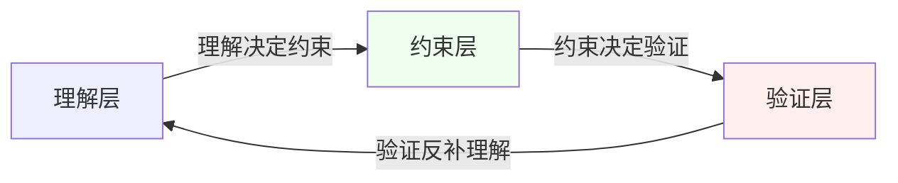
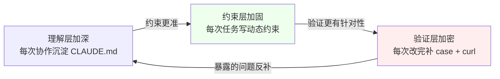

{: .no_toc }

  

    目录
  

  {: .text-delta }
- TOC
{:toc}

<!--
aicmigr-03-approach-03-trust-three-layers
传统项目迁AI 03：学习方法 - 让AI可信的三层控制
-->

本篇接续系列第 02 篇《换到 AI 编程后的变与不变》。上一篇把"九步链路里每一步 AI 该做多少"讲清楚，给出了人机三档分工图；本篇回答紧随而来的下一个问题：分工图画完了，怎么让 AI 在第一档和第二档里真正可信地帮工程师干活，而不是一不留神就乱来。读完本篇，工程师会拿到一套贯穿整个系列的骨架——"三层控制"：理解、约束、验证，对应三个动作：让 AI 看见、让 AI 听话、让 AI 可信。面对任何一个老项目改造任务，这套骨架时刻在背后运转。

<!--
flowchart TD
    START([系列第 03 篇入口]) --\> MAP{读者类型?}

    MAP --\>|想速查方法论| P1[第一部分 方法论提炼]
    MAP --\>|想看实战演示| P2[第二部分 实战演示]
    MAP --\>|项目前快速过一遍| CL[Check List 速查]

    P1 --\> C1[第 1 章 导读地图与系列定位]
    C1 --\> C2[第 2 章 核心命题：为什么光有分工图不够]
    C2 --\> C3[第 3 章 三层控制逐层展开]
    C3 --\> C4[第 4 章 骨架观与项目阶段 Check List]

    P2 --\> C5[第 5 章 骨架在日常协作中的实战]
    C5 --\> C6[第 6 章 三层映射到九步]
    C6 --\> C7[第 7 章 正循环与工程师画像]

    C4 --\> C5
    C7 --\> C8[第 8 章 小结与思考]
    CL --\> C8
-->

第一部分是方法论参考手册（第 1-4 章），不深入具体技术栈，目标是让工程师在任何老项目阶段都能快速查阅"这一层在做什么、写哪些规则、建哪些基准"。第二部分把骨架放回真实协作场景和九步链路里做实战演示（第 5-7 章），让方法论"不仅知其然、也知其所以然"。

## 1. 导读地图与系列定位

### 1.1 系列位置与本文目标

本文位于系列方法论基础的第三篇，紧接第 01 篇的"九步链路"和第 02 篇的"三档分工图"。九步链路回答"做什么"，三档分工图回答"AI 做多少"，本篇回答最后一个底层问题："怎么让 AI 在被允许的范围内不乱来、产出敢用"。读完本篇，工程师应获得三件东西：

#### (1) 一套贯穿全系列的方法论骨架

理解、约束、验证三层，是后面所有实战篇章的根。

#### (2) 一组可立即落地的工程动作

每层都有具体产物：架构全景、CLAUDE.md、约束规则、集成测试、Characterization Test、独立 review、curl 核对。

#### (3) 一个区分稳定与混乱的判断锚点

稳定用 AI 的工程师都在三层上持续投资；混乱用 AI 的工程师每次都从零开始。

### 1.2 三层控制一览

下面这张总览表把三层控制的核心动作、关键产物、典型问题摆在一起，是全篇的速查入口。

| 层 | 一句话定义 | 核心动作 | 关键产物 | 解决的典型问题 |
|----|----------|---------|---------|--------------|
| 理解层 | 让 AI 看见完整项目 | 整理上下文喂给 AI | ARCHITECTURE.md、CLAUDE.md、docs 骨架 | AI 不知道某个老接口的存在 |
| 约束层 | 让 AI 听话不乱来 | 写清"不要改什么、该怎么改" | 静态约束 + 动态约束 | AI 顺手重构了核心业务代码 |
| 验证层 | 让 AI 产出敢用 | 建立 AI 之外的独立基准 | 集成测试、Characterization Test、独立 review、curl 核对 | AI 给的架构图画错了，没人发现 |

## 2. 核心命题：为什么光有分工图不够

第 02 篇那张三档分工图是对的，但光有它不够。真做起来工程师会遇到三类典型问题，每一类都对应一层控制要解决的事。

### 2.1 三类典型问题

#### (1) 第一类：AI 看不见完整项目

工程师让 AI 读 README、梳理接口清单，AI 很认真地干了。但它只看到工程师给它的那些文件，不知道某个对接方在生产环境上调用了一个没写在文档里的老接口——AI 连这个接口存在都不知道。这是最根本的问题：**AI 得先能看见完整的项目**。

#### (2) 第二类：AI 顺手改了不该改的地方

第二档里有"让 AI 动手改代码"这一步。工程师提一个需求，AI 给一个方案，工程师说 OK，AI 开始改。改着改着工程师会发现，AI 顺手把一段老代码重构了，因为它觉得那段代码"写得不规范"。但工程师根本没让它动那段代码，那段代码还是核心业务逻辑。**AI 得知道哪些地方不能动**。

#### (3) 第三类：AI 的产出没法验证

AI 给工程师一张架构图，画得挺漂亮。但它可能把一个已经废弃的模块画成了核心模块；可能把一个关键的异步通道漏掉了；可能把三个表的 JOIN 关系画反了。工程师凭什么相信这张图？**AI 的产出得有办法验**。

### 2.2 三类问题对应三层控制

把上面三类问题归并，正好对应三层控制。下表把"问题 → 对应层 → 该层提供什么"摆在一起。

| 问题类型 | 根因 | 对应的控制层 | 该层提供的东西 |
|---------|------|------------|--------------|
| AI 看不见老接口 | 上下文缺失 | 理解层 | 完整的项目上下文 |
| AI 顺手重构核心代码 | 缺乏边界 | 约束层 | 清晰的"不要改什么、该怎么改" |
| AI 的架构图没法验证 | 缺乏独立基准 | 验证层 | AI 之外的校验基准 |

## 3. 三层控制逐层展开

第 2 章给出了三层控制的命题。本章逐层展开每一层里工程师要做什么、写什么、产出什么。读完本章，工程师拿到任何一个改造任务，都能照着表格定层、定动作。

### 3.1 理解层：让 AI 看见

#### (1) 心智模型：AI 是上下文缺失的实习生

理解层要解决的是 AI 的上下文。AI 不是一个自带知识库的工程师，它是上下文缺失的实习生——它来的时候是空的。工程师给它什么，它就能看见什么；没给的，它看不见。对老项目来说，上下文不只是代码本身，还包括下面五类信息。

| 信息类别 | 内容 | 存在位置 |
|---------|------|---------|
| 业务场景 | 项目是干什么的、核心业务场景有哪些 | 部分 README、部分人脑 |
| 架构组织 | 架构怎么组织、关键模块是什么 | 部分代码、部分 wiki |
| 接口边界 | 哪些接口对外暴露、哪些是内部的 | 部分代码、部分文档 |
| 数据模型 | 数据表之间的关系、核心业务表的字段含义 | 部分代码、部分 wiki |
| 隐性约定 | "这段不要删"、"这个接口对接方 A 在用" | 绝大多数只在人脑 |

这些东西，一部分在代码里，一部分在 README 和 wiki 里，还有一部分只在人的脑子里。理解层要做的事，就是把这些东西整理出来，让 AI 能看见。

#### (2) 理解层对应的具体动作

在这门系列里，理解层对应四个动作。

| 动作 | 产物 | 后续篇章展开 |
|------|------|------------|
| 让 AI 先画一份架构全景 | ARCHITECTURE.md | 第二部分具体展开 |
| 让 AI 识别出风险地带 | 风险清单（哪些地方动了可能出事） | 第二部分具体展开 |
| 把以上两份东西翻译成给 AI 看的指令 | CLAUDE.md | 第二部分具体展开 |
| 为项目搭起文档骨架 | docs 目录，后续逐步填 | 第二部分具体展开 |

> 理解层没做扎实，后面两层都是空中楼阁。AI 都没看见完整的项目，怎么让它听话？怎么验证它的产出？

### 3.2 约束层：让 AI 听话

#### (1) AI 自作主张的典型表现

理解层让 AI 看见项目，但看见不等于听话。下面这张表列了 AI 自作主张的两种典型场景。

| 场景 | AI 的做法 | 工程师的真实意图 |
|------|---------|----------------|
| 改一个小功能 | 改完顺手把五个不相关的文件也重构了 | 只改这个小功能 |
| 加一个字段 | 加完之后还贴心地"优化"了同一个类的几个老方法 | 只加这一个字段 |

AI 的本能是按它理解的"最佳实践"去写代码。但老项目里很多东西不是按最佳实践写的，是有历史原因的。AI 不知道这些原因，就按它的判断改，改出来的东西工程师不想要。

#### (2) 约束分两种：静态约束和动态约束

约束层要做的，就是把"不要改什么、该怎么改、改成什么样"写清楚，让 AI 在工程师画的框里干活。约束分两种。

| 约束类型 | 载体 | 复用频率 | 典型内容 |
|---------|------|---------|---------|
| 静态约束 | CLAUDE.md、SKILL.md | 一次写、长期复用 | "这个类是兼容旧版本的，任何改动都要保持方法签名"；"改代码时只动要改的文件，不要顺手重构其他文件"；"命名用下划线风格，不用驼峰" |
| 动态约束 | 每次提示词里的即时指令 | 每次都要给 | "只改这三个文件，其他一律不动"；"改之前先跟我确认方案，不要直接动代码"；"有任何不确定的地方停下来问我，不要猜" |

> 静态约束是长期投资，写一次后面复用。动态约束是每次的具体引导，不能省。两种加起来，AI 才会真的听话。

#### (3) 术语锚点：Harness Engineering

Anthropic 官方把这套给 AI 搭约束的工程工作叫 Harness Engineering。Harness 原意是马具，套在马身上让马听话干活，意思很形象。工程师不需要记这个术语，知道有这么个东西就行。

### 3.3 验证层：让 AI 可信

#### (1) 为什么"看起来没问题"不算通过

AI 看见了、也听话了，是不是就能直接用了？还不行。还差一层：验证。AI 给工程师的产出，不能靠"看起来没问题"来决定它能不能用。工程师必须有一套独立于 AI 的基准，对 AI 的产出做独立验证。原因很简单：**AI 生成代码的能力很强，但 AI 对代码正确性的判断能力没那么强**。

AI 在正确性上的三类典型盲区见下表。

| 盲区类型 | AI 的表现 |
|---------|---------|
| 边界条件 | 写出一段 10 行的函数看起来完美契合需求，但没考虑某个边界条件 |
| 并发场景 | 算对了主流程，但忽略了并发场景 |
| 测试自评 | 看起来测试都过了，但测试本身就是 AI 自己写的，覆盖不到它没意识到的情况 |

#### (2) 验证层的四件具体事

验证层要做的，是建立一套 AI 产出之外的基准，用基准来校验 AI。具体有四件事。

| 验证手段 | 何时做 | 目的 |
|---------|-------|------|
| 集成测试 | 动手改之前 | 让 AI 先写一套覆盖核心链路的集成测试，锁住现在的行为；改造之后跑一遍，看有没有什么被破坏 |
| Characterization Test | 针对说不清逻辑、也没文档的老代码 | 让 AI 根据当前实际行为写测试；不保证代码是"对"的，但要保证改之前改之后行为一致 |
| 独立 review | 改完之后 | 除了工程师自己看，再让 AI 用另一个角度（比如从攻击者视角看这段代码有什么漏洞）审一遍自己的产出 |
| curl 核对 | 接口改造后 | 用 curl 跑几个场景对比改造前后的响应 |

> 验证不是事后补票，是动手前就建好的安全网。这张网越密，工程师越敢放手让 AI 做事。

### 3.4 三层闭环：不是一个孤立的三件套

讲完三层，强调一件事：它们不是三件独立的事，是一个链条。下面这张图把三层之间的因果闭环画出来。

闭环上三段因果关系的具体含义如下表。

| 因果关系 | 含义 |
|---------|------|
| 理解决定约束 | 对项目理解到什么程度，约束才能写到什么程度。连模块关系都没理清，写不出"这个模块不能依赖那个模块"这种约束 |
| 约束决定验证 | 约束里明确"核心接口的响应格式不能变"，验证里才会去校验响应格式。约束里没写这一条，验证就不会关注 |
| 验证反补理解 | 验证跑完暴露一个问题——"这段代码改了之后有个很边角的场景炸了"——这个发现会回补到理解层：原来这段代码还管着那个场景，以后的 CLAUDE.md 要加一条 |

> 三层转起来之后，是一个正循环：理解越深，约束越准；约束越准，验证越有针对性；验证越扎实，对项目的理解又加深一层。这个循环转几圈，AI 就从"看起来能用"变成"真的可信"。

## 4. 骨架观与项目阶段 Check List

### 4.1 三层不是流程，是时刻在工作的骨架

可能有工程师读到这儿心里想：三层控制听起来挺正式的，是不是每次改造前都要先做理解、再做约束、再做验证，走完一整个流程？不是。三层不是一个按顺序走的流程，是一个时刻在工作的骨架。

#### (1) 骨架观的三个例子

下面这张表把"每次协作都在同时给三层添砖加瓦"这件事用三个微场景说清楚。

| 协作中的微场景 | 进入哪一层 | 沉淀到哪里 |
|--------------|----------|-----------|
| AI 问"这个字段是什么含义"，工程师回答了一句 | 理解层 | 沉淀到 CLAUDE.md |
| 工程师在提示词里加了一句"不要改测试文件" | 约束层 | 未来这个约束可能反复用得上 |
| 工程师改完跑了一遍测试，发现两个场景没覆盖，补了两个 case | 验证层 | 安全网又密了一点 |

> 理解、约束、验证，不是三件要专门花时间去"建立"的事，而是每次工程师和 AI 协作的时候，都在同时做的三件事。稳定用 AI 的工程师和混乱用 AI 的工程师，差别就在这里：前者每次协作都在给三层添砖加瓦；后者每次都是从零开始，一次性用完就扔。

本系列后面 30 篇，本质上都在练这三层。第二部分建理解层的骨架，第三部分搭约束层的规则，实战部分每一次改造都在同时走三层。

### 4.2 项目阶段 Check List

本节把前三章的方法论浓缩成一份可裁剪的速查清单。工程师在接手任何一个老项目的改造任务时，可以照着这份清单逐项打勾。条目按三层组织，每层末尾给出层间切换提示。

#### (1) 理解层 Check List

判定准则：上下文是否完整喂给了 AI。

##### ① 架构全景

让 AI 画一份 ARCHITECTURE.md，覆盖业务场景、模块关系、接口边界。

##### ② 风险地带清单

让 AI 识别出"动了可能出事"的地方（核心业务逻辑、对接方依赖、隐性约定）。

##### ③ CLAUDE.md 指令

把架构全景和风险地带翻译成给 AI 看的指令，写进 CLAUDE.md。

##### ④ docs 骨架

为项目搭起 docs 目录的骨架，后续逐步填。

> 层间切换提示：理解层做扎实之前，不要急着让 AI 动手改代码——AI 都没看见完整的项目，改出来的东西没法约束、也没法验证。

#### (2) 约束层 Check List

判定准则：是否写清了"不要改什么、该怎么改、改成什么样"。

##### ① 静态约束

把长期规则写进 CLAUDE.md / SKILL.md：方法签名约束、命名风格、不能动的文件、不能重构的范围。

##### ② 动态约束

每次提示词里明确：本次只改哪几个文件、改之前要不要确认方案、不确定时停下来问。

##### ③ 防止 AI 自作主张

每次让 AI 改之前，先想清楚：它会不会顺手重构？它的"最佳实践"和老项目的"历史原因"会不会冲突？

> 层间切换提示：约束写得再清楚，AI 也有可能跑偏。约束到位之后，必须靠验证层来兜底。

#### (3) 验证层 Check List

判定准则：是否有独立于 AI 的基准来校验产出。

##### ① 集成测试

动手改之前，让 AI 先写一套覆盖核心链路的集成测试，锁住现在的行为。

##### ② Characterization Test

针对说不清逻辑、也没文档的老代码，让 AI 根据当前实际行为写测试，保证改前改后行为一致。

##### ③ 独立 review

改完之后，让 AI 用另一个角度（比如攻击者视角）审一遍自己的产出。

##### ④ curl 核对

接口改造，最后用 curl 跑几个场景对比改造前后的响应。

> 层间切换提示：验证不是事后补票。验证层暴露的问题，要回补到理解层（CLAUDE.md 加一条），形成正循环。

#### (4) 三层闭环 Check List

判定准则：三层之间是否在互相补强。

##### ① 理解 → 约束

理解层新发现的模块关系，是否沉淀进了约束层的"不要改什么"。

##### ② 约束 → 验证

约束层新增的"响应格式不能变"，是否在验证层加了对应的 curl 核对。

##### ③ 验证 → 理解

验证层暴露的边角场景，是否回补到了理解层的 CLAUDE.md。

第二部分把骨架放回真实协作场景和九步链路里做实战演示，让方法论"不仅知其然、也知其所以然"。

## 5. 骨架在日常协作中的实战

### 5.1 三层骨架不是流水线，是协作时的同时动作

第 4 章给出了"骨架观"。本章把骨架放回真实协作场景里，看每一层在日常协作中具体长什么样。核心结论是：理解、约束、验证不是按顺序走的流水线，而是工程师和 AI 每一次协作时都在同时动作的三件事。

下表把一次典型协作拆成五个时刻，标出每个时刻上三层分别在做什么。

| 协作时刻 | 理解层在做什么 | 约束层在做什么 | 验证层在做什么 |
|---------|-------------|-------------|-------------|
| 工程师回答 AI 的一个上下文问题 | 沉淀新的项目知识到 CLAUDE.md | — | — |
| 工程师写提示词下达改造任务 | — | 写明"只改这几个文件、不确定停下来问" | — |
| AI 写完代码、跑通测试 | — | — | 工程师校一眼测试覆盖到了哪些场景 |
| 工程师发现漏了 case，补两个测试 | — | — | 安全网加密，新 case 沉淀进验证层 |
| 改造上线后某个边角场景炸了 | 把"这段代码还管着那个场景"加进 CLAUDE.md | 把"这类场景必须 curl 核对"加进约束 | 把"这类边角必须加测试"加进验证基准 |

### 5.2 一次协作的完整骨架视图

把上表的五个时刻串起来，就是一次完整协作里三层骨架的同时运转。下面这张时序图画出工程师、AI、三层骨架之间的互动。

<!--
sequenceDiagram
    participant Eng as 工程师
    participant AI as Claude Code
    participant Skel as 三层骨架

    Note over Eng,AI: 时刻 1：上下文问答
    AI->>Eng: 这个字段是什么含义？
    Eng->>Skel: 沉淀到理解层（CLAUDE.md）

    Note over Eng,AI: 时刻 2：下达任务
    Eng->>Skel: 写动态约束（只改这几个文件）
    Eng->>AI: 描述改造任务

    Note over AI,Eng: 时刻 3：AI 写代码
    AI->>Eng: 改造代码 + 测试
    Eng->>Skel: 校测试覆盖（验证层）

    Note over Eng,Skel: 时刻 4：补 case
    Eng->>Skel: 补两个 case 进验证层

    Note over Eng,Skel: 时刻 5：上线后反补
    Eng->>Skel: 边角场景炸了 → 理解层加一条
    Eng->>Skel: 约束层加一条、验证层加一条
-->

> 骨架不是工程师专门花时间去"建立"的东西，是每次协作的副产品。会用的工程师把副产品沉淀下来；不会用的工程师让副产品白白流失。

## 6. 三层映射到九步

### 6.1 映射总览图

把第 01 篇的九步链路和本篇的三层控制放在一起看，会看到一张清晰的映射图。

<!--
图片内容说明
路径：imgs/03_了解方法_03：让AI可信的三层控制/37b6a50585f5b364df3e61852dc5a007_MD5.jpg
用途：把三层控制（理解/约束/验证）与系列第 01 篇的九步链路做映射，作为本篇核心论点"三层在九步每一步里都或多或少涉及、只是比重不同"的可视化总览
内容：横轴为九步链路（1.找人聊 2.翻资料 3.浏览代码结构 4.搭环境跑起来 5.访接口 6.带疑点深挖 7.画核心链路 8.动手改 9.最终验收），纵轴为三层控制（理解/约束/验证），用色块或标记标出每一步在哪一层上做工最多、哪一层只是顺带——前六步主要在建理解层，第四、五步开始带入约束层的影子，第八步三层同时在工，第九步验证层唱主角
-->

### 6.2 映射关系逐段解读

下面这张表把映射图里九步和三层的对应关系具体化。

| 九步阶段 | 主要在哪一层做工 | 三层的比重分布 |
|---------|----------------|-------------|
| 前六步（了解项目：找人聊、翻资料、浏览代码结构、搭环境、访接口、带疑点深挖） | 理解层为主 | 理解层 ★★★、约束层 ★、验证层 ☆ |
| 第四、五步（搭环境、访接口） | 开始带入约束层影子 | 理解层 ★★、约束层 ★★、验证层 ★ |
| 第八步（动手改） | 三层同时在工 | 理解层 ★★、约束层 ★★★、验证层 ★★★ |
| 第九步（验收） | 验证层唱主角 | 理解层 ★、约束层 ★★、验证层 ★★★ |

#### (1) 关键认知：三层不是时间顺序，是比重不同

> 三层不是"先理解、再约束、再验证"这种时间顺序。是九步里每一步都或多或少涉及这三层，只是比重不同。这张图记在心里，后面讲每一步、每一个动作的时候，工程师都可以对着这张图问自己：这一步主要在做哪一层？这一层做扎实了没？

## 7. 正循环与工程师画像

### 7.1 三层骨架驱动的正循环

第 3.4 节画过三层之间的闭环。这个闭环转起来之后，会形成一个跨层的正循环。下面这张图把跨层正循环展开。

正循环的本质是：每一次协作的副产品都被沉淀下来，下一轮协作的起点就比这一轮高。

### 7.2 三类工程师画像

工程师最终落在哪一种画像上，决定了正循环能不能跑通。

| 工程师类型 | 对三层骨架的态度 | 是否跑通正循环 |
|-----------|---------------|--------------|
| 稳定用 AI 的工程师 | 每次协作都在三层上添砖加瓦，副产品沉淀进 CLAUDE.md / 约束 / 验证基准 | 跑通——三层越用越厚，AI 越来越可信 |
| 混乱用 AI 的工程师 | 三层都没建，或只建了一两层 | 跑不通——每次都从零开始，一次性用完就扔 |
| 半建半扔的工程师 | 建了理解层但忽略验证层，或建了约束层但不回补理解层 | 跑不通——闭环断了一截，正循环转不起来 |

> 本系列的目标，是把工程师训练成稳定用 AI 的工程师——在三层上持续投资。

## 8. 小结与思考

### 8.1 小结

本篇给出了整门系列最核心的方法论骨架：三层控制。

#### (1) 三层骨架

理解、约束、验证三层，对应三个动作：让 AI 看见、让 AI 听话、让 AI 可信。三层不是三件独立的事，是一个时刻在工作的骨架。

#### (2) 理解层：让 AI 看见

上下文越准、越完整，AI 表现越稳。关键产物：ARCHITECTURE.md、CLAUDE.md、docs 骨架、风险地带清单。

#### (3) 约束层：让 AI 听话

规则越清晰、越具体，AI 越不会乱改。约束分静态约束（CLAUDE.md/SKILL.md，长期复用）和动态约束（每次提示词的即时指令，不能省）。

#### (4) 验证层：让 AI 可信

基准越密、越独立，AI 产出越敢用。四件具体事：集成测试、Characterization Test、独立 review、curl 核对。

#### (5) 三层闭环与正循环

理解决定约束，约束决定验证，验证反补理解。三层转起来是正循环：理解越深，约束越准，验证越有针对性，对项目的理解又加深一层。

#### (6) 骨架观

三层不是按顺序走的流程，是每次和 AI 协作时同时做的三件事。稳定用 AI 的工程师都在三层上持续投资；混乱用 AI 的工程师要么三层都没建，要么只建了一两层。

读到这儿，工程师可能会觉得 01-03 这三篇讲得有点虚，没怎么动代码。但当真正进入老项目改造的时候，会发现后面 30 篇所有的具体动作，根都在这三篇里。九步链路、三档分工、三层控制，是整门系列方法论的骨架。把 01-03 这三篇记在心里，带回到改造任务中——内化之后会发现：老项目改造没那么复杂，其实都是这套骨架在重复转。

### 8.2 思考

#### (1) 思考一

回想最近一次用 Claude Code 改老项目的经历，三层里哪一层做得最扎实、哪一层最薄弱？薄弱那层给工程师造成了什么问题？

#### (2) 思考二

工程师现在手上维护的项目，如果要补理解层，会先补什么？约束层呢？验证层呢？各写 2-3 条具体的、能马上动手做的事。
