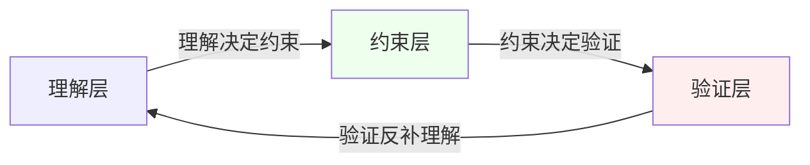
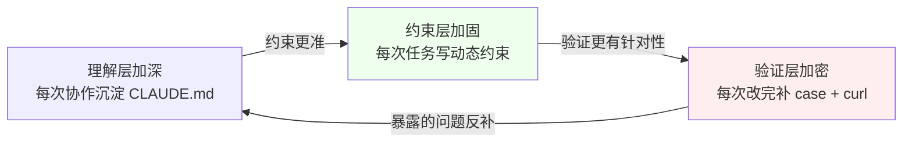
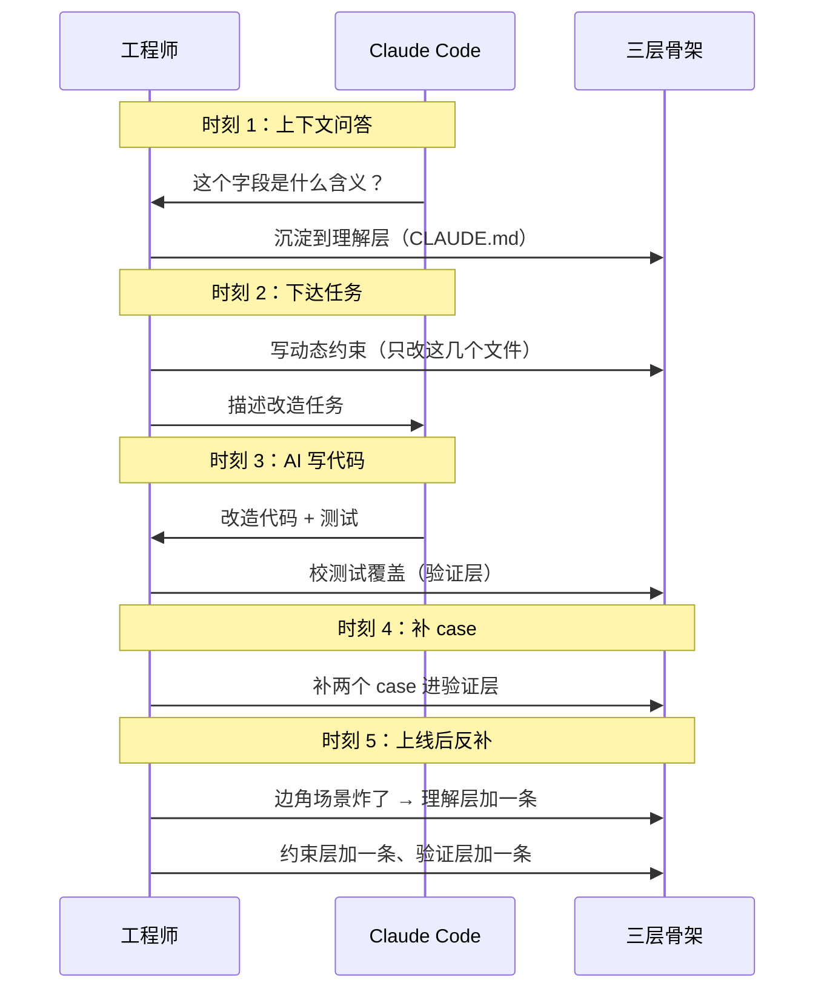

{: .no_toc }

  

    目录
  

  {: .text-delta }
- TOC
{:toc}

<!--
aicmigr-03-approach-03-trust-three-layers
传统项目迁AI 03：学习方法 - 让AI可信的三层控制
-->

分工图回答的是「AI 做多少」，本篇回答的是「AI 做得对不对、敢不敢用」。分工图画完不等于事情就稳——真做起来，AI 一不留神就乱来：看不见关键的老接口、顺手重构核心代码、架构图漏洞百出。本文给出一套贯穿整个改造工作的骨架——「三层控制」：**理解、约束、验证**，对应三个动作：**让 AI 看见、让 AI 听话、让 AI 可信**。面对任何一个老项目改造任务，这套骨架时刻在背后运转。

## 1. 为什么光有分工图，AI 还是会乱来

分工图画完，AI 开始干活，事情就稳了？并没有。真做起来会遇到三类典型问题，每一类都对应一层控制要解决的事。

### 1.1 三类典型问题

#### (1) AI 看不见完整项目

你让 AI 读 README、梳理接口清单，它很认真地干了。但它只看到你给它的文件——生产环境上对接方调用的、没写在文档里的老接口，AI 连它存在都不知道。这是最根本的问题：AI 得先能看见完整的项目。

#### (2) AI 顺手改了不该改的地方

AI 改着改着，顺手把一段老代码重构了，因为它觉得那段代码「写得不规范」。你根本没让它动，那段代码是核心业务逻辑。AI 得知道哪些地方不能动。

#### (3) AI 的产出没法验证

AI 给你一张架构图，画得挺漂亮。但它可能把废弃模块画成了核心模块、漏掉一个关键的异步通道、把三个表的 JOIN 关系画反了。AI 的产出得有办法验。

### 1.2 三类问题对应三层控制

把上面三类问题归并，正好对应三层控制。

| 问题类型        | 根因     | 对应的控制层 | 该层提供的东西                       |
| ----------- | ------ | ------ | ------------------------------ |
| AI 看不见老接口   | 上下文缺失  | 理解层    | 完整的项目上下文           |
| AI 顺手重构核心代码 | 缺乏边界   | 约束层    | 清晰的"不要改什么、该怎么改" |
| AI 的架构图没法验证 | 缺乏独立基准 | 验证层    | AI 之外的校验基准         |

### 1.3 三层控制一览

这张总览表是全篇的速查入口。

| 层 | 一句话定义                      | 核心动作 | 关键产物                                                      | 解决的典型问题 |
|----|------------------------------|---------|-------------------------------------------------------------|--------------|
| 理解层 | 让 AI 看见完整项目 | 整理上下文喂给 AI | ARCHITECTURE.md、CLAUDE.md、docs 骨架 | AI 不知道某个老接口的存在 |
| 约束层 | 让 AI 听话不乱来 | 写清"不要改什么、该怎么改" | 静态约束 + 动态约束 | AI 顺手重构了核心业务代码 |
| 验证层 | 让 AI 产出敢用 | 建立 AI 之外的独立基准 | 集成测试、Characterization Test、独立 review、curl 核对 | AI 给的架构图画错了，没人发现 |

后面三章逐层展开，每层讲清楚是什么、做什么、产出什么。

## 2. 理解层：让 AI 看见完整项目

### 2.1 心智模型：AI 是上下文缺失的实习生

让 AI 读个 README 就够了？不够。AI 不是「自带知识库的工程师」，而是**上下文缺失的实习生**——它来的时候是空的。你给它什么，它就看见什么；没给的，它看不见。

类比传统软件开发：实习生第一天上班，你不会让他直接改核心代码，会先做 onboarding——讲业务、讲架构、讲规范、讲隐性约定。CLAUDE.md 就是给 AI 的 onboarding 文档。

老项目的上下文不只是代码本身，还包括下面五类信息。

| 信息类别     | 内容                     | 存在位置           |
| -------- | ---------------------- | -------------- |
| 业务场景 | 项目是干什么的、核心业务场景有哪些      | 部分 README、部分人脑 |
| 架构组织 | 架构怎么组织、关键模块是什么         | 部分代码、部分 wiki   |
| 接口边界 | 哪些接口对外暴露、哪些是内部的        | 部分代码、部分文档      |
| 数据模型 | 数据表之间的关系、核心业务表的字段含义    | 部分代码、部分 wiki   |
| 隐性约定 | "这段不要删"、"这个接口对接方 A 在用" | 绝大多数只在人脑       |

这些信息散落在代码、README、wiki 和人脑里。理解层要做的，就是把它们整理出来，让 AI 能看见。

### 2.2 理解层对应的具体动作

理解层对应四个动作。

| 动作                                                                  | 产物                                                                   |
| ------------------------------------------------------------------- | -------------------------------------------------------------------- |
| ① 让 AI 先画一份架构全景 | ARCHITECTURE.md                                                      |
| ② 让 AI 识别出风险地带                                                      | 风险清单（哪些地方动了可能出事） |
| ③ 把以上两份东西翻译成给 AI 看的指令                                               | CLAUDE.md                                                            |
| ④ 为项目搭起文档骨架                                                         | docs 目录，后续逐步填                                                        |

> 我的判断是：理解层没做扎实，后面两层都是空中楼阁。AI 都没看见完整的项目，怎么让它听话？怎么验证它的产出？

## 3. 约束层：让 AI 听话不乱来

上下文喂全了，AI 就会乖乖干活？不会。看见不等于听话——你把项目背景讲全了，AI 写代码时还是会按它理解的「最佳实践」动手，你项目里那些有历史原因的老代码，它一上手就给你重构了。

### 3.1 AI 自作主张的两类典型场景

| 场景 | AI 的做法 | 你的真实意图 |
|------|---------|----------------|
| 改一个小功能 | 改完顺手把五个不相关的文件也重构了 | 只改这个小功能 |
| 加一个字段 | 加完之后还贴心地"优化"了同一个类的几个老方法 | 只加这一个字段 |

AI 的本能是按它理解的「最佳实践」写代码，但老项目里的代码多是有历史原因的。AI 不知道这些原因，就按自己的判断改，改出来的东西你不要。

### 3.2 静态约束和动态约束

约束层要做的，就是把「不要改什么、该怎么改、改成什么样」写清楚，让 AI 在你画的框里干活。

类比传统软件工程：静态约束 ≈ 架构约束文档 / 编码规范，一次写、长期复用；动态约束 ≈ 传统编程每次 PR 评审时给的 review 意见，每次都要给。

| 约束类型 | 载体                                                                     | 复用频率     | 典型内容                                                                             |
| ---- | ---------------------------------------------------------------------- | -------- | -------------------------------------------------------------------------------- |
| 静态约束 | CLAUDE.md、SKILL.md | 一次写、长期复用 | ① "这个类是兼容旧版本的，任何改动都要保持方法签名"； ② "改代码时只动要改的文件，不要顺手重构其他文件"； ③ "命名用下划线风格，不用驼峰" |
| 动态约束 | 每次提示词里的即时指令        | 每次都要给    | ① "只改这三个文件，其他一律不动"； ② "改之前先跟我确认方案，不要直接动代码"； ③ "有任何不确定的地方停下来问我，不要猜"         |

**术语锚点：Harness Engineering。** Anthropic 官方把这套给 AI 搭约束的工程工作叫 Harness Engineering——Harness 原意是马具，套在马身上让马听话干活，意思很形象。术语记不住没关系，知道有这么个东西就行。

> 我的看法是：静态约束是长期投资，写一次后面复用。动态约束是每次的具体引导，不能省。两种加起来，AI 才会真的听话。

## 4. 验证层：让 AI 产出敢用

AI 看见了、也听话了，是不是就能直接用？还不行——还差一层验证。那你自己 review 一遍是不是就行了？也不行。AI 生成代码的能力很强，但对代码正确性的判断能力没那么强，靠「看起来没问题」就放行，迟早出事。

### 4.1 为什么「看起来没问题」不算通过

AI 给你的产出，不能靠「看起来没问题」来决定它能不能用。你必须有一套独立于 AI 的基准，对 AI 的产出做独立验证。

类比传统：你不会只靠开发自测就发布版本，你需要 QA 的独立测试。对 AI 也是一样。原因很简单：**AI 生成代码的能力很强，但 AI 对代码正确性的判断能力没那么强**。

AI 在正确性上的三类典型盲区见下表。

| 盲区类型 | AI 的表现                                |
| ---- | ------------------------------------- |
| 边界条件 | 写出一段 10 行的函数看起来完美契合需求，但没考虑某个边界条件      |
| 并发场景 | 算对了主流程，但忽略了并发场景                       |
| 测试自评 | 看起来测试都过了，但测试本身就是 AI 自己写的，覆盖不到它没意识到的情况 |

### 4.2 验证层的四件具体事

验证层要做的，是建立一套 AI 产出之外的基准，用基准来校验 AI。类比传统软件工程，这四件事你大多熟悉：集成测试你早就用过；Characterization Test ≈ 锁住老代码行为的回归测试；独立 review ≈ 让另一个工程师用攻击者视角 review PR；curl 核对 ≈ 接口发布前的 Postman 回归。

| 验证手段                  | 何时做              | 目的                                                                                                  |
| --------------------- | ---------------- | --------------------------------------------------------------------------------------------------- |
| 集成测试                  | 动手改之前            | 让 AI 先写一套覆盖核心链路的集成测试，锁住现在的行为；改造之后跑一遍，看有没有什么被破坏                                                      |
| Characterization Test | 针对说不清逻辑、也没文档的老代码 | 让 AI 根据当前实际行为写测试；不保证代码是"对"的，但要保证改之前改之后行为一致                                                          |
| 独立 review             | 改完之后             | 除了你自己看，再让 AI 用另一个角度（比如从攻击者视角看这段代码有什么漏洞）审一遍自己的产出 |
| curl 核对               | 接口改造后            | 用 curl 跑几个场景对比改造前后的响应                                                                               |

> 我的判断是：验证不是事后补票，是动手前就建好的安全网。这张网越密，你越敢放手让 AI 做事。

## 5. 三层是同时动作的骨架，不是流水线

你可能以为：理解、约束、验证是三件独立的事，做完一件再做下一件。

不是。它们是一个链条，也是一个时刻在工作的骨架。这一章讲清楚三层之间怎么协同。

### 5.1 三层闭环与正循环

三层不是三件独立的事，是一个链条。

类比传统软件工程：你的架构理解决定了你的架构约束文档，你的约束文档决定了你的 CI 检查项，CI 暴露的问题反过来帮你更新架构约束。对 AI 也是一样。

```mermaid
flowchart LR
    A[理解层] -->|理解决定约束| B[约束层]
    B -->|约束决定验证| C[验证层]
    C -->|验证反补理解| A

    style A fill:#eef
    style B fill:#efe
    style C fill:#fee
```

链条上三段因果关系的具体含义如下表。

| 因果关系   | 含义                                                                             |
| ------ | ------------------------------------------------------------------------------ |
| 理解决定约束 | 对项目理解到什么程度，约束才能写到什么程度。连模块关系都没理清，写不出"这个模块不能依赖那个模块"这种约束                          |
| 约束决定验证 | 约束里明确"核心接口的响应格式不能变"，验证里才会去校验响应格式。约束里没写这一条，验证就不会关注                              |
| 验证反补理解 | 验证跑完暴露一个问题——"这段代码改了之后有个很边角的场景炸了"——这个发现会回补到理解层：原来这段代码还管着那个场景，以后的 CLAUDE.md 要加一条 |

链条一旦转起来，就形成一个跨层的正循环：理解越深，约束越准；约束越准，验证越有针对性；验证越扎实，对项目的理解又加深一层。转几圈，AI 就从"看起来能用"变成"真的可信"。

```mermaid
flowchart LR
    A[理解层加深<br/>每次协作沉淀 CLAUDE.md] -->|约束更准| B[约束层加固<br/>每次任务写动态约束]
    B -->|验证更有针对性| C[验证层加密<br/>每次改完补 case + curl]
    C -->|暴露的问题反补| A

    style A fill:#eef
    style B fill:#efe
    style C fill:#fee
```

正循环的本质：每一次协作的副产品都被沉淀下来，下一轮协作的起点比这一轮高。你最终落在哪一种画像上，决定了正循环能不能跑通。

| 工程师类型       | 对三层骨架的态度                                   | 是否跑通正循环              |
| ----------- | ------------------------------------------ | -------------------- |
| 稳定用 AI 的工程师 | 每次协作都在三层上添砖加瓦，副产品沉淀进 CLAUDE.md / 约束 / 验证基准 | 跑通——三层越用越厚，AI 越来越可信  |
| 混乱用 AI 的工程师 | 三层都没建，或只建了一两层                              | 跑不通——每次都从零开始，一次性用完就扔 |
| 半建半扔的工程师    | 建了理解层但忽略验证层，或建了约束层但不回补理解层                  | 跑不通——闭环断了一截，正循环转不起来  |

> 我的立场是：稳定用 AI 和混乱用 AI，差距不在工具、不在天赋，就在「是否在三层上持续投资」。

### 5.2 骨架观：三层不是流程，是同时动作

三层控制听起来挺正式，但三层不是一个按顺序走的流程，是一个时刻在工作的骨架。

类比传统：你写代码时不会先做完所有设计再动手，也不会只动手不设计。设计和实现是同时演进的。对 AI 也是一样。下面这张表用三个微场景说清楚「每次协作都在同时给三层添砖加瓦」。

| 协作中的微场景                       | 进入哪一层 | 沉淀到哪里         |
| ----------------------------- | ----- | ------------- |
| AI 问"这个字段是什么含义"，你回答了一句        | 理解层   | 沉淀到 CLAUDE.md |
| 你在提示词里加了一句"不要改测试文件"           | 约束层   | 未来这个约束可能反复用得上 |
| 你改完跑了一遍测试，发现两个场景没覆盖，补了两个 case | 验证层   | 安全网又密了一点      |

把视角放大到一次完整协作，可以拆成五个时刻，每个时刻三层都在同时做工。

<!-- 
图片内容说明
路径：imgs/aicmigr-03-approach-03-trust-three-layers/b34de2eb42ed8ec06a4f42812b688f60_MD5.jpg
用途：用 sequenceDiagram 时序图展示一次完整协作里工程师、AI、三层骨架之间的互动，佐证"三层不是流水线而是同时动作"这一观点
内容：5 个时刻依次推进——时刻1上下文问答（AI 提问、工程师沉淀到理解层）、时刻2下达任务（工程师写动态约束并描述任务）、时刻3 AI 写代码（工程师校验测试覆盖进入验证层）、时刻4工程师补 case、时刻5上线后反补（边角场景炸了，三层各加一条）
-->

| 协作时刻             | 理解层在做什么                               | 约束层在做什么                   | 验证层在做什么                 |
| ---------------- | ------------------------------------- | ------------------------- | ----------------------- |
| 你回答 AI 的一个上下文问题  | **沉淀新的项目知识到 CLAUDE.md**               | —                         | —                       |
| 你写提示词下达改造任务      | —                                     | **写明"只改这几个文件、不确定停下来问"**   | —                       |
| AI 写完代码、跑通测试     | —                                     | —                         | **你校一眼测试覆盖到了哪些场景**      |
| 你发现漏了 case，补两个测试 | —                                     | —                         | **安全网加密，新 case 沉淀进验证层** |
| 改造上线后某个边角场景炸了    | **把"这段代码还管着那个场景"加进代码所在目录的 CLAUDE.md** | **把"这类场景必须 curl 核对"加进约束** | **把"这类边角必须加测试"加进验证基准**  |

### 5.3 一次协作的完整时序图

把上表的五个时刻串起来，就是一次完整协作里三层骨架的同时运转。下面这张时序图画出你、AI、三层骨架之间的互动。

时序图对应的 sequenceDiagram 源码如下，可直接渲染：

```mermaid
sequenceDiagram
    participant Eng as 工程师
    participant AI as Claude Code
    participant Skel as 三层骨架

    Note over Eng,AI: 时刻 1：上下文问答
    AI->>Eng: 这个字段是什么含义？
    Eng->>Skel: 沉淀到理解层（CLAUDE.md）

    Note over Eng,AI: 时刻 2：下达任务
    Eng->>Skel: 写动态约束（只改这几个文件）
    Eng->>AI: 描述改造任务

    Note over AI,Eng: 时刻 3：AI 写代码
    AI->>Eng: 改造代码 + 测试
    Eng->>Skel: 校测试覆盖（验证层）

    Note over Eng,Skel: 时刻 4：补 case
    Eng->>Skel: 补两个 case 进验证层

    Note over Eng,Skel: 时刻 5：上线后反补
    Eng->>Skel: 边角场景炸了 → 理解层加一条
    Eng->>Skel: 约束层加一条、验证层加一条
```

> 骨架不是你专门花时间去「建立」的东西，是每次协作的副产品。会用的工程师把副产品沉淀下来；不会用的工程师让副产品白白流失。

### 5.4 三层映射到九步链路

系列前文给出的「九步链路」——找人聊 → 翻资料 → 浏览代码结构 → 搭环境 → 访接口 → 带疑点深挖 → 画核心链路 → 动手改 → 最终验收——和本篇的三层控制放在一起看，会看到一张清晰的映射图。

下面这张表把映射图里九步和三层的对应关系具体化。

| 九步阶段 | 主要在哪一层做工 | 三层的比重分布 |
|---------|----------------|-------------|
| 前六步（了解项目：找人聊、翻资料、浏览代码结构、搭环境、访接口、带疑点深挖） | 理解层为主 | 理解层 ★★★、约束层 ★、验证层 ☆ |
| 第四、五步（搭环境、访接口） | 开始带入约束层影子 | 理解层 ★★、约束层 ★★、验证层 ★ |
| 第八步（动手改） | 三层同时在工 | 理解层 ★★、约束层 ★★★、验证层 ★★★ |
| 第九步（验收） | 验证层唱主角 | 理解层 ★、约束层 ★★、验证层 ★★★ |

这里的关键认知是：三层不是「先理解、再约束、再验证」这种时间顺序，而是九步里每一步都或多或少涉及这三层，只是比重不同。这张图记在心里，后面讲每一步、每一个动作的时候，都可以对着这张图问自己：这一步主要在做哪一层？这一层做扎实了没？

## 6. 落地与自检

这套方法论怎么落地？这一章给两件东西：一份可裁剪的 Check List + 两道思考题。Check List 不是死规矩，是起跑线——接手任何一个老项目改造任务时，照着逐项打勾，缺什么先补什么。

### 6.1 项目阶段 Check List

Check List 按三层组织，每层一张表，表末给出层间切换提示。每一层都做到位，缺一不可。

#### (1) 理解层 Check List

判定准则：上下文是否完整喂给 AI。

| 条目           | 具体动作                                 |
| ------------ | ------------------------------------ |
| 架构全景         | 画一份 ARCHITECTURE.md，覆盖业务场景、模块关系、接口边界 |
| 风险地带清单       | 识别"动了可能出事"的地方（核心业务逻辑、对接方依赖、隐性约定）     |
| CLAUDE.md 指令 | 把架构全景和风险地带翻译成给 AI 看的指令，写进 CLAUDE.md  |
| docs 骨架      | 搭起 docs 目录骨架，后续逐步填                   |

> 层间切换提示：理解层做扎实之前，不要急着让 AI 动手改代码——AI 没看见完整的项目，改出来的东西没法约束、也没法验证。

#### (2) 约束层 Check List

判定准则：是否写清了「不要改什么、该怎么改、改成什么样」。

| 条目 | 具体动作 |
|------|---------|
| 静态约束 | 把长期规则写进 CLAUDE.md / SKILL.md：方法签名约束、命名风格、不能动的文件、不能重构的范围 |
| 动态约束 | 提示词里明确：本次只改哪几个文件、改之前要不要确认方案、不确定时停下来问 |
| 防止 AI 自作主张 | 让 AI 改之前，先想清楚：它会不会顺手重构？它的"最佳实践"和老项目的"历史原因"会不会冲突？ |

> 层间切换提示：约束写得再清楚，AI 也有可能跑偏。约束到位之后，必须靠验证层来兜底。

#### (3) 验证层 Check List

判定准则：是否有独立于 AI 的基准来校验产出。

| 条目 | 具体动作 |
|------|---------|
| 集成测试 | 改之前让 AI 先写一套覆盖核心链路的集成测试，锁住现在的行为 |
| Characterization Test | 针对说不清逻辑、也没文档的老代码，让 AI 按当前实际行为写测试，保证改前改后行为一致 |
| 独立 review | 改完之后，让 AI 换一个角度（比如攻击者视角）审一遍自己的产出 |
| curl 核对 | 接口改造，用 curl 跑几个场景对比改造前后的响应 |

> 层间切换提示：验证不是事后补票。验证层暴露的问题，要回补到理解层（CLAUDE.md 加一条），形成正循环。

#### (4) 三层闭环 Check List

判定准则：三层之间是否在互相补强。

| 条目 | 具体动作 |
|------|---------|
| 理解 → 约束 | 理解层新发现的模块关系，是否沉淀进约束层的"不要改什么" |
| 约束 → 验证 | 约束层新增的"响应格式不能变"，是否在验证层加了对应的 curl 核对 |
| 验证 → 理解 | 验证层暴露的边角场景，是否回补进理解层的 CLAUDE.md |

### 6.2 把骨架刻进肌肉记忆

这套方法论听起来有点虚，但进入真实改造时，所有具体动作的根都在三层控制里。

九步链路回答「做什么」、三档分工回答「做多少」、三层控制回答「做得对不对、敢不敢用」。把这套骨架记在心里，带回到你的改造任务中——内化之后你会发现：老项目改造没那么复杂，都是这套骨架在重复转。

### 6.3 思考

#### (1) 思考一

回想你最近一次用 Claude Code 改老项目的经历，三层里哪一层做得最扎实、哪一层最薄弱？薄弱那层给你造成了什么问题？

#### (2) 思考二

你现在手上维护的项目，如果要补理解层，会先补什么？约束层呢？验证层呢？各写 2-3 条具体的、能马上动手做的事。
