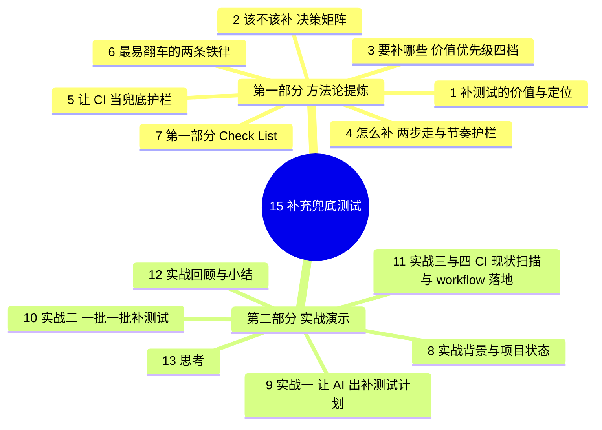

{: .no_toc }

<details close markdown="block">
  <summary>
    目录
  </summary>
  {: .text-delta }
- TOC
{:toc}
</details>

<!--
aicmigr-15-safeguard-03-fallback-tests
传统项目迁AI 15：构建护栏 - 补充兜底测试
-->

本篇是「企业级老项目改造」系列第 15 篇，承接 14 篇产出的测试缺口清单（`docs/test-gaps.md`），回答三个问题：**该不该补测试、要补哪些、怎么补**。

如果项目原本就有测试，本篇的内容会很轻——按 14 篇的缺口清单一项一项交给 AI 补即可。但如果项目几乎没测试、或 14 篇跑出来发现现有测试根本不能跑，"补"的工作量大到让人退缩。本篇正是为这种情况写的：把"补测试 + 配 CI"这件过去性价比极低的事，拆成一套 AI 时代可控、可批量、可守护的标准流程。

**全文导读地图与阅读路径**



两类读者的推荐阅读路径：

| 阅读路径 | 适合读者 | 推荐章节 |
|---------|---------|---------|
| 方法论速查路径 | 熟练 AI 编程工程师 | 第 1-7 章（重点是第 7 章 Check List） |
| 实战演示路径 | 初学 AI 编程工程师 | 第 8-12 章（结合项目背景与提示词复现） |

## 1. 补测试的价值与定位


### 1.1 老项目测试缺失的根因

老项目里"该补测试但没补"是行业常态。这件事过去性价比极低，原因有四：

#### (1) 业务价值感弱
测试不直接产出业务功能，老板不催、自己也不想干。

#### (2) 单点成本高
一个 controller 写一组测试要半天，整个项目补完一个月都不够。

#### (3) 反馈周期长
写完测试要等下一次改造才能验证它的价值，远期收益难以变现。

#### (4) 风险偏好错位
不补测试短期看不出问题，补测试却要立即付出成本，人天然倾向拖延。

最终状态就是"知道应该有但永远没有"。

### 1.2 AI 重构了补测试的成本结构

AI 把"写一组测试"从半天压缩到分钟级，并能基于现有代码反推预期行为、自动跑测试看失败、自动调整。这是这件事第一次真正有解。

| 维度 | AI 出现前 | AI 出现后 |
|------|----------|----------|
| 单组测试编写时间 | 半天起步 | 分钟级 |
| 反推预期行为 | 靠人读代码 + 文档 | AI 基于代码反推，能跑测验证 |
| 调整失败用例 | 人工 debug | AI 自动迭代调整 |
| 全项目补完可行性 | 一个月都不够 | 几天内可完成 P0 缺口 |

但 AI 也有它的问题：**默认会"大而全"地补一堆不必要的测试**（这是 14 篇反复强调的事）。所以光有 AI 还不够，还要控制 AI 补的范围和节奏。本篇教的就是这个控制。

### 1.3 本篇要回答的三个问题

学完本篇，开发者会清楚三件事：

#### (1) 该不该补
按改造路径判断，而不是按覆盖率指标判断。

#### (2) 要补哪些
按价值排四档优先级，简单 CRUD 可以不补。

#### (3) 怎么补
两步走（AI 出计划 + 一批一批补）加一道 CI 护栏，让测试持续自动跑。

## 2. 该不该补：决策矩阵


不是所有项目都需要立刻补测试。先回答这个决策问题。

### 2.1 两类情况对照

| 必须补的情况 | 判断依据 |
|-------------|---------|
| 即将动手改造的接口或链路目前没测试 | 改造完之后没办法验证有没有改坏 |
| 改造涉及核心业务逻辑（计费、权限、数据写入） | 出错代价大，不补就是裸奔 |
| AI 改了什么、改没改坏全凭运气 | 缺少客观验证手段 |

| 可暂时不补的情况 | 判断依据 |
|-----------------|---------|
| 改造范围非常小（改一个 log 输出、改一个文案） | 出错影响有限 |
| 改造涉及的代码已被高质量集成测试覆盖 | 已有兜底，无需重复 |
| 项目即将下线或重写，改造只是临时维持 | 投入换不回长期价值 |

### 2.2 决策流程图


<!--
flowchart TD
    A[改造任务] --\> B{是否即将改<br/>且无测试?}
    B -- 否 --\> Z[可暂时不补]
    B -- 是 --\> C{是否核心业务逻辑?<br/>计费/权限/数据写入}
    C -- 是 --\> Y[必须补]
    C -- 否 --\> D{改造范围是否极小?<br/>log/文案}
    D -- 是 --\> Z
    D -- 否 --\> E{代码是否已被<br/>高质量集成测试覆盖?}
    E -- 是 --\> Z
    E -- 否 --\> Y
-->

### 2.3 核心心法：够用就停

判断的核心是 04 篇的「够用就停」心法。

#### (1) 老项目改造的目标不是 80% 测试覆盖率
覆盖率指标会导致"补到死、补不完"。

#### (2) 真正目标是改造路径上的关键节点都有兜底
聚焦、可控、能让改造启动。

#### (3) 两个目标差别巨大
前者是无限工程，后者是有限投入。

回到 14 篇的 `test-gaps.md`：里面的 P0 项就是必须补的，P1 项可以暂时放着。先按 P0 走。

## 3. 要补哪些：价值优先级四档


决策完该补，下一步是排顺序。同样的工作量补不同类型的测试，价值差几倍。

### 3.1 四档优先级总览表

| 优先级 | 测试类型 | 典型场景 | 性价比 |
|--------|---------|---------|--------|
| 第一档 | 改造路径上的 Characterization Test | 即将改的接口 / 链路 | 极高 |
| 第二档 | 核心数据写入的集成测试 | 登录、创建、写入等数据进库链路 | 高 |
| 第三档 | 业务逻辑复杂的单元测试 | 算分、状态流转、权限校验 | 中 |
| 第四档 | 简单 CRUD 的单元测试 | getter/setter、简单 SELECT | 低（可不补） |

### 3.2 第一档：改造路径上的 Characterization Test

如果接下来要改 `PromptService.create()`，先给它加一个 Characterization Test 锁住当前行为。

Characterization Test 是 Michael Feathers 在 *Working Effectively with Legacy Code* 里提的方法（05 篇业界综述讲过）。它的核心思想反直觉：不是测代码"应该做什么"，而是锁住代码"现在实际做什么"。

#### (1) 具体做法
先让代码跑一遍，记录它实际的输入输出。

#### (2) 转成断言
把这个实际行为转成测试断言。

#### (3) 前后对比
改造前跑一次记录基线，改造后跑一次看有没有偏移。

这种测试在老项目里特别有用——老项目的"应该做什么"经常没人说得清，但"现在实际做什么"是确定的。锁住"现在"，改造后只要行为没变就放心。

### 3.3 第二档：核心数据写入的集成测试

登录、Prompt 创建、Dataset 写入这种"数据进库"的核心链路，集成测试比单元测试值钱。

集成测试覆盖一条完整链路（HTTP → Service → DB）。改造时一条集成测试比十个单元测试更能兜底——AI 改了 Service 层但 DAO 层挂了，集成测试一跑就发现；单元测试可能各自都过，但合起来挂。

### 3.4 第三档：业务逻辑复杂的单元测试

算分、状态流转、权限校验这种纯逻辑代码值得加单元测试。逻辑分支多，集成测试不好覆盖所有分支，单元测试能精准命中边界。

### 3.5 第四档：简单 CRUD 的单元测试（可不补）

getter/setter、简单 SELECT 这种放最后甚至不补。AI 改这种代码出错的概率本来就低，加测试是性价比最差的。

### 3.6 一句话口诀

> 改造路径上的 Characterization > 核心链路集成 > 复杂逻辑单元 > 简单 CRUD（可不补）

## 4. 怎么补：两步走与节奏护栏


实操核心。两步走 + 一道节奏护栏。

### 4.1 整体流程图


<!---
flowchart LR
    A[14篇<br/>test-gaps.md] --\> B[Step 1<br/>AI 出补测试计划]
    B --\> C[docs/test-plan.md]
    C --\> D[Step 2<br/>第 1 批 1-3 个]
    D --\> E{跑通 + review}
    E -- 通过 --\> F[第 2 批<br/>参考前一批风格]
    E -- 失败 --\> G[修代码/修测试/标记]
    G --\> D
    F --\> E
    E -- 全部 P0 完成 --\> H[配 CI 护栏<br/>进入第 5 章]
-->

### 4.2 Step 1：让 AI 出补测试计划

把 14 篇的 `test-gaps.md` 拆成可执行的批次。

提示词：

```
基于 docs/test-gaps.md，把 P0 缺口拆成多批，每批 1-3 个（最好 1 个），
给我一份补测试计划。每批写：批次号、测试类型（Characterization
Test / 集成测试 / 单元测试）、覆盖的核心链路、预期工作量。

按"改造路径上的 Characterization > 核心链路集成 > 复杂逻辑单元"的顺序排批次。
简单 CRUD 不进计划。

输出用表格总结。保存到 docs/test-plan.md。
```

产物：`docs/test-plan.md`。实际产出效果与解读详见第 9 章。

review 重点：

#### (1) 每批严格 1-3 个，不能更多
最好就 1 个一批。批次越小越可控。

#### (2) 批次顺序按价值优先级
必须符合第 3 章的四档顺序。

#### (3) 简单 CRUD 真的没进计划
AI 容易"贴心"地把 CRUD 也补上，要在计划阶段就剔除。

### 4.3 Step 2：让 AI 一批一批补

不要让 AI 一口气把所有批次补完。一批补完跑通、人 review 通过，再开下一批。

第 1 批提示词：

```
按 docs/test-plan.md 的第 1 批，给项目补出对应的测试。

对 Characterization Test 类型：先跑一次现有代码记录实际行为，
再把行为转成断言。不要凭"应该是什么"写断言，凭"实际是什么"写。

对集成测试类型：需要真实启动应用 + 数据库。
用 SpringBootTest 的方式起完整 context 跑。

补完跑一遍 mvn test 确保都通过。

输出用表格总结每个测试覆盖的场景、预期结果、实际跑出来的状态。
```

review 重点（这一步最关键）：

#### (1) 测试是不是测了"现在实际做什么"
这是 Characterization Test 的灵魂。如果看到 AI 写的测试断言"amount 应该等于 100"这种基于"应该"的断言，要追问"100 是从哪来的？是跑代码跑出来的，还是猜的？"。AI 经常会贴心地用业务直觉补断言，这反而是最危险的。

#### (2) 测试覆盖的场景对不对
AI 容易补一堆 happy path、忽略 edge case。如果 14 篇的 `test-gaps.md` 里某条说"测试空入参的处理"，要确认这条真的有对应的测试，不是被 AI 默认 skip 掉了。

#### (3) 测试都能跑通吗
失败的测试不能进下一批。要么修代码、要么修测试、要么承认这条暂时跑不了先标记，三选一。

review 通过后再开第 2 批。第 2 批的提示词稍微调整一下：让 AI 参考第 1 批的风格继续写——这样整套测试一致性强，方便后续维护。

```
按 docs/test-plan.md 的第 2 批补测试，
参考第 1 批已经跑通的测试风格，保持一致。
其他要求同前。
```

## 5. 让 CI 当兜底护栏


测试补完了，但还差最关键的一步：让这套测试真正持续跑起来。

### 5.1 为什么测试必须持续跑

很多团队的悲剧故事是这样的：花两周辛苦补了一套测试，跑通了，commit 进仓库，结束。三个月后某次改造把代码改坏了，测试明明能发现，但没人主动跑测试，bug 就这么进了生产。

**测试不持续跑等于白补。**

让测试持续跑的标准做法是 CI（Continuous Integration）：每次 push 代码、每次提 PR，CI 系统自动跑全部测试，失败就拦着不让 merge。

### 5.2 为什么 AI 时代 CI 特别值得做

#### (1) CI 配置高度标准化
无论 GitHub Actions 还是 GitLab CI，配置文件就那么几样东西：触发条件（哪些分支 push 触发）、运行环境（什么镜像、什么 JDK 版本）、跑什么命令（mvn test）、产物存哪（测试报告、覆盖率）。AI 写这种标准化配置文件特别准，因为它见过无数个类似的项目。开发者自己写要查文档查半天，AI 30 秒搞定。

#### (2) CI 是改造的长期复利
今天花 30 分钟让 AI 写好 CI 配置，未来每一次 push、每一次同事 PR、每一次自己 merge，都自动跑一遍测试。一年下来这件事运行了上千次。前期一次性投入 30 分钟，换长期上千次自动检查，性价比之王。

#### (3) CI 让测试从自觉变强制
靠自觉跑测试在团队里是不可持续的——deadline 紧的时候第一个被砍的就是测试。但 CI 失败 block merge，没人能跳过。强制比自觉可靠十倍。

### 5.3 CI 落地三步法

| 步骤 | 目标 | 关键产物 |
|------|------|---------|
| 分析现状 | 扫描项目当前的 CI 配置（如有） | 现状分析表 |
| 写 workflow | 基于现状生成完整 CI 配置 | `.github/workflows/test.yml` 或 `.gitlab-ci.yml` |
| 跑通 CI | push 触发，定位并修复环境问题 | CI 通过的绿色徽章 |

### 5.4 CI 现状三种典型情况对照

| 现状 | 处理方式 |
|------|---------|
| 项目有 CI 但没跑测试 | 补 test job 即可 |
| 项目完全没 CI | 从零建一份 |
| 项目有 CI 也跑了测试，但配置过期 | 升级配置 |

## 6. 最易翻车的两条铁律


### 6.1 铁律一：不大而全

老项目补测试最大的风险之一，是让 AI 一次性补一二十个测试。这违反 14 篇反复强调的"不大而全"。

#### (1) 数量上限是硬约束
每批 1-3 个，最好 1 个。

#### (2) 范围由 test-plan.md 限制
计划阶段就把简单 CRUD 剔除，执行阶段不再放宽。

### 6.2 铁律二：不一口气

让 AI 一口气补完一批测试，跑下来一半失败一半通过，问题来了：开发者没法判断哪些测试是对的、哪些是 AI 瞎写的。整批不可信，等于白做。

#### (1) 慢，但每一批都是可信资产
跑通一批 review 一批，review 通过再下一批。

#### (2) 一次看一两个能仔细看
一次看十个就只能扫一眼放过。

### 6.3 Characterization Test 的灵魂：测"实际是什么"而非"应该是什么"

review 时要重点看一件事：**测试是不是测了"现在实际做什么"，不是测了"AI 觉得应该做什么"**。

为什么这条这么重要？因为 AI 写测试有一个隐性偏差：它会用业务直觉补断言。它读了代码，猜业务意图，然后按"应该"写断言。但老项目的代码经常和"应该"不一致——那些不一致的地方往往是历史包袱、是对接方依赖、是禁区（10 篇 CLAUDE.md 的灵魂两节）。

AI 按"应该"写出来的测试一跑代码就失败，让开发者以为代码有 bug，实际上是测试错了。

防止这个偏差的唯一办法：**强制 AI 先跑代码记录实际行为，再把实际行为转成断言**。提示词里那句——

> 不要凭"应该是什么"写断言，凭"实际是什么"写。

是最关键的一句。

### 6.4 失败率高时的排查路径

如果跑出来一批测试发现失败率高，AI 又改了好几轮还是失败，先停下来检查：**是不是 AI 写的断言基于"应该"而不是"实际"？**

多数时候问题在这里。识别之后，重新提示 AI 走"先跑代码 → 记录实际行为 → 再转断言"的流程。

## 7. 第一部分 Check List：补测试与 CI 落地速查


以下清单可裁剪，供项目阶段快速查阅。每条都是祈使句，可逐项勾选。

### 7.1 决策与优先级

#### (1) 该不该补（决策）

- [ ] 列出本次改造涉及的所有接口与链路
- [ ] 标注哪些链路目前没有任何测试覆盖
- [ ] 确认改造是否触及核心业务（计费/权限/数据写入）
- [ ] 改造范围极小（log/文案）的，明确允许不补
- [ ] 项目即将下线的，整体允许不补

#### (2) 补哪些（优先级）

- [ ] 即将改的接口先补 Characterization Test
- [ ] 核心数据写入链路补集成测试（HTTP → Service → DB）
- [ ] 复杂业务逻辑（算分/状态流转/权限）补单元测试
- [ ] 简单 CRUD 默认不进计划
- [ ] 按 14 篇 test-gaps.md 的 P0 优先级排序

### 7.2 节奏与 CI 护栏

#### (1) 怎么补（节奏）

- [ ] 让 AI 基于 test-gaps.md 出 test-plan.md，每批 1-3 个
- [ ] 计划阶段剔除简单 CRUD 与"贴心"的多余项
- [ ] 一批一批补，跑通一批 review 一批
- [ ] review 时强制追问：断言来自"实际跑出来"还是"AI 猜的"
- [ ] review 时核对 edge case 是否真的被覆盖
- [ ] 失败的测试不进下一批（修代码/修测试/标记三选一）
- [ ] 第 2 批起让 AI 参考前一批风格，保持一致性

#### (2) CI 护栏：配置生成

- [ ] 扫描项目当前 CI 现状（有/无/过期）
- [ ] 让 AI 生成 `.github/workflows/test.yml` 或对应平台配置
- [ ] 触发条件：push 任何分支 + PR
- [ ] 中间件用 services 字段配齐（MySQL/Nacos 等）
- [ ] JDK 版本严格对齐 pom.xml 的 `<java.version>`
- [ ] 配 Maven 依赖 cache 加速

#### (3) CI 护栏：跑通与守护

- [ ] push 触发一次 CI，定位并修复环境问题
- [ ] CI 跑通后，确认 PR 失败时 block merge
- [ ] 失败常见原因：中间件起不来 / Maven 镜像源慢 / 本地与 CI 环境差异
- [ ] 让 AI 自行 debug 并迭代修复，跑通即收尾

裁剪建议：项目较小时可合并决策与优先级两组；时间紧张时可先完成 7.1 与 7.2 的 (1)(2)，剩余项分批补齐。

## 8. 实战背景与项目状态


### 8.1 项目背景：Spring AI Alibaba Admin

本系列实战所用的项目是 Spring AI Alibaba Admin。这个项目有两个典型特征：

#### (1) 老项目常态
几乎没有测试、没有 CI 配置，反映了不少公司内部老项目的真实状态——这也是本系列选择它作为实战样本的原因。

#### (2) 业务可承载
具备完整的 Spring Boot + Spring AI 链路（Prompt、Dataset、Service、DAO），足以演示补测试与 CI 落地的全过程。

### 8.2 起点资产：14 篇产出的 test-gaps.md

14 篇跑完之后，项目根目录有一份 `docs/test-gaps.md`，记录了改造前必须补的测试缺口清单，并按 P0 / P1 两档分级：

#### (1) P0 缺口
必须补，对应核心链路与即将改造的接口。

#### (2) P1 缺口
可以暂时放着，等 P0 补完后再回头处理。

本篇实战只针对 P0 缺口。

### 8.3 实战目标

把 P0 缺口补完、CI 跑通，让 14 篇的 `test-gaps.md` + 15 篇的测试 + CI 形成自动守护闭环。完成后，后续每一次改造都有客观的验证手段，不再依赖人的自觉。

## 9. 实战一：让 AI 出补测试计划

### 9.1 提示词与执行

把第 4 章 Step 1 的提示词交给 AI（基于 Spring AI Alibaba Admin 项目与 `docs/test-gaps.md`）：

```
基于 docs/test-gaps.md，把 P0 缺口拆成多批，每批 1-3 个（最好 1 个），
给我一份补测试计划。每批写：批次号、测试类型（Characterization
Test / 集成测试 / 单元测试）、覆盖的核心链路、预期工作量。

按"改造路径上的 Characterization > 核心链路集成 > 复杂逻辑单元"的顺序排批次。
简单 CRUD 不进计划。

输出用表格总结。保存到 docs/test-plan.md。
```

### 9.2 实际产出：docs/test-plan.md


<!--
图片内容说明
路径：imgs/15_构建护栏_03：补充兜底测试/f4c8dd7d3a6e172f75c67ef668cbe185_MD5.jpg
用途：展示 AI 基于 test-gaps.md 拆出的补测试计划（docs/test-plan.md）的实际输出效果
内容：补测试计划表格截图，每行包含批次号、测试类型（Characterization Test / 集成测试 / 单元测试）、覆盖的核心链路、预期工作量等字段，按"改造路径上的 Characterization > 核心链路集成 > 复杂逻辑单元"顺序排列
-->

从表格的第二列（测试类型）就能读出很多信息：哪些批次锁的是"现在行为"、哪些是端到端集成、哪些是纯逻辑分支。这一列是后续 review 时最重要的判断依据。

### 9.3 review 重点

#### (1) 每批严格 1-3 个，最好 1 个
查看每批的实际数量，超出范围的让 AI 重新拆。

#### (2) 批次顺序按价值优先级
检查 Characterization Test 是否排在前面，简单 CRUD 是否已经被剔除。

#### (3) 简单 CRUD 真的没进计划
重点扫一遍核心链路列，确认没有"GET /xxx"这类纯查询接口混进来。

### 9.4 实战心得：方法论比一句话指令更重要

在 AI 与开发者不断来回的过程中，项目的信息越来越完整，AI 持有的项目上下文也越来越完整——这就是从 60 分到 80 分的过程。本系列希望传达的不是"一句话让 AI 搞定"的幻想，而是一套固定的方法论与可复用的步骤。重点在于让开发者能"抄作业"：拿着提示词就能干活。

## 10. 实战二：一批一批补测试


### 10.1 第 1 批补测试

#### (1) 提示词

把第 4 章 Step 2 的提示词交给 AI，针对 `docs/test-plan.md` 的第 1 批执行：

```
按 docs/test-plan.md 的第 1 批，给项目补出对应的测试。

对 Characterization Test 类型：先跑一次现有代码记录实际行为，
再把行为转成断言。不要凭"应该是什么"写断言，凭"实际是什么"写。

对集成测试类型：需要真实启动应用 + 数据库。
用 SpringBootTest 的方式起完整 context 跑。

补完跑一遍 mvn test 确保都通过。

输出用表格总结每个测试覆盖的场景、预期结果、实际跑出来的状态。
```

#### (2) review 重点

##### ① 测试是不是测了"现在实际做什么"
这是 Characterization Test 的灵魂。如果看到 AI 写的测试断言"amount 应该等于 100"，要追问"100 是从哪来的？是跑代码跑出来的，还是猜的？"。AI 经常用业务直觉补断言，这反而最危险。

##### ② 测试覆盖的场景对不对
AI 容易补一堆 happy path、忽略 edge case。要核对 `test-gaps.md` 中标记的边界条件是否真的有对应测试。

##### ③ 测试都能跑通吗
失败的测试不能进下一批。要么修代码、要么修测试、要么承认这条暂时跑不了先标记，三选一。

实际跑出的测试结果汇总建议开发者自行执行提示词验证——本篇不再一一贴出。

### 10.2 第 2 批补测试

#### (1) 提示词调整：参考第 1 批风格

```
按 docs/test-plan.md 的第 2 批补测试，
参考第 1 批已经跑通的测试风格，保持一致。
其他要求同前。
```

#### (2) 一致性维护要点

##### ① 命名风格统一
测试类、测试方法的命名规则与第 1 批保持一致。

##### ② 断言风格统一
Characterization Test 仍走"先跑代码 → 记录实际 → 再转断言"流程，不退回"应该"。

##### ③ 工具类复用
第 1 批用到的测试辅助类、Setup、TearDown 在第 2 批优先复用，避免重复造轮子。

## 11. 实战三与实战四：CI 现状扫描与 workflow 落地


### 11.1 实战三：CI 现状扫描

#### (1) 提示词

```
扫一下项目里有没有现成的 CI 配置
（看 .github/workflows/、.gitlab-ci.yml、Jenkinsfile、circle.yml 之类）。

如果有，告诉我现在跑了什么、什么时候触发、有没有跑测试。
如果没有，告诉我项目代码托管在哪个平台，建议用哪种 CI。

输出用表格总结。
```

#### (2) 实际产出：项目无 CI 的发现


<!--
图片内容说明
路径：imgs/15_构建护栏_03：补充兜底测试/fcfeac377c99861b30379f54e33fba8d_MD5.jpg
用途：展示 AI 扫描项目 CI 状态后的分析结论，证明该项目尚未配置 CI
内容：AI 输出的扫描结果表格或文字说明，列出 .github/workflows/、.gitlab-ci.yml、Jenkinsfile、circle.yml 等位置均未发现 CI 配置，并给出推荐方案（建议使用 GitHub Actions 等）
-->

#### (3) 解读：从"项目无 CI"看出老项目常态

这个项目根本没配置 Git CI，这从某个角度说明了项目成熟度的不足——这正是不少公司内部老项目的常态。这也是本系列选择这个项目作为讲解样本的原因之一。

### 11.2 实战四：写完整 CI workflow

#### (1) 提示词

```
基于上一步的分析，给我写一份完整的 CI workflow。要求：
- 触发条件：push 到任何分支 + 提 PR 时
- 运行环境：用项目对应的 JDK 版本（看 pom.xml 里 java.version）
- 启动需要的中间件（参考 docker-compose.dev.yml）
- 跑 mvn clean test，失败就 block merge
- 输出测试报告到 CI artifact 区方便 review
- 加合理的 cache（Maven 依赖缓存）让跑得快一点

输出完整的 .github/workflows/test.yml（或对应平台的配置文件），
我直接 commit 进仓库就能跑。
```

#### (2) 实际产出：.github/workflows/test.yml


<!--
图片内容说明
路径：imgs/15_构建护栏_03：补充兜底测试/1431b27d9bfee26a85a293fc1b9ddadc_MD5.jpg
用途：展示 AI 生成的 GitHub Actions CI workflow 配置文件的前半部分（触发条件、运行环境、JDK 版本设置）
内容：.github/workflows/test.yml 配置文件截图，包含 on.push/pull_request 触发条件、jobs 定义、runs-on 运行环境、actions/setup-java 步骤、JDK 版本配置等 YAML 内容
-->


<!--
图片内容说明
路径：imgs/15_构建护栏_03：补充兜底测试/a3a91dd631c8a123411aaa60dc4b40bb_MD5.jpg
用途：展示 AI 生成的 GitHub Actions CI workflow 配置文件的后半部分（services 中间件、Maven 缓存、mvn test 执行、产物上传）
内容：.github/workflows/test.yml 配置文件续图，包含 services 中间件配置（如 MySQL 等）、actions/cache 缓存 Maven 依赖、运行 mvn clean test 命令、上传测试报告 artifact 等内容
-->

建议开发者深入学习 GitHub Actions Workflow——它是项目工程化的"神器"，配置一次长期受益。

#### (3) review 重点

##### ① 触发条件对不对
push 任何分支 + PR 是基础配置。如果团队规定"只有 develop 和 master 分支跑 CI 节省额度"，让 AI 调整。

##### ② 中间件配置完整
CI 跑集成测试需要 MySQL、Nacos 这些中间件起来。AI 应该用 `services` 字段把这些中间件配进去（GitHub Actions 支持这种），不是默认期待中间件已经存在。

##### ③ JDK 版本对齐
项目要 17 别给写成 21。AI 容易用最新版本，要让它读 `pom.xml` 里 `<java.version>` 严格对齐。

### 11.3 跑通 CI 与常见失败排查

push 代码触发一次 CI，看是不是真的跑过了。常见失败与处理方式：

| 常见失败 | 可能原因 | 处理方式 |
|---------|---------|---------|
| 中间件起不来 | CI 环境网络问题、版本不匹配 | 让 AI 核对 services 字段镜像版本 |
| Maven 镜像源访问不到 | 国内项目访问 maven central 慢 | 在 workflow 里配置国内镜像源 |
| 本地通过但 CI 上失败 | 环境差异（本地有缓存、CI 没有） | 让 AI 比对本地与 CI 的环境差异，必要时补 cache |

每个失败让 AI 自己 debug、自己改。**CI 跑通的那一刻，这套测试从"个人资产"变成了"团队级护栏"**——后续谁不小心改坏了什么，CI 立刻报错、PR 被 block。这是改造前能给自己最值钱的东西。

跑通之后，14 篇列出的 P0 缺口、15 篇补出的测试，全部进入"自动守护"状态。

## 12. 实战回顾与小结


### 12.1 三个问题的回答

| 问题 | 答案 |
|------|------|
| 该不该补？ | 按改造路径判断。即将改的、改完没法验证的、涉及核心业务逻辑的，必须补；改 log 输出这种小改动可以不补，够用就停。 |
| 要补哪些？ | 按价值排优先级：改造路径上的 Characterization Test > 核心链路集成测试 > 复杂逻辑单元测试 > 简单 CRUD（可不补）。 |
| 怎么补？ | 两步走 + 一道护栏：AI 出计划 → 一批一批补（每批 1-3 个，跑通 review 通过再下一批）→ 配 CI 让测试持续自动跑。 |

### 12.2 两条核心约束

#### (1) 不大而全（14 篇）
靠数量上限——每批 1-3 个，简单 CRUD 不进计划。

#### (2) 不一口气（15 篇）
靠分批 review——一批跑通 review 通过再开下一批。

### 12.3 老项目补测试的范式转变

这两条加起来，老项目补测试这件事第一次从"知道应该做但永远做不完"，变成"几天就能做完，且做完就有可信的护栏"。

AI 写测试 = 不再有借口拖延。以前不补是因为成本太高，现在 AI 把成本降到零。从今天起，改造前没护栏，不能再怪工作量——只能怪自己的判断。

### 12.4 第三部分收尾与下一篇预告

跑完本篇，第三部分（构建护栏）的方法论全部讲完：`docs/` 里的资产、`scripts/` 下的脚本、CI 里的护栏全部到位，改造前的所有准备工作都搞定了。

下一篇是第三部分的实操课：会把 13-15 篇的提示词全部串起来，在 Spring AI Alibaba Admin 上跑一遍完整流程。跑完 16 篇，第三部分收尾，第四部分就要开始真正动手做需求改造了。

## 13. 思考

### 13.1 思考一

开发者手上项目最近一次改造，有没有出现过"AI 改了什么悄悄改坏"的事？如果当时有 Characterization Test 锁住改造路径，会不会发现得更早？

### 13.2 思考二

"AI 写测试 = 不再有借口拖延"这句话是否认同？

#### (1) 如果认同
打算从哪个项目、哪条核心链路开始补？

#### (2) 如果不认同
还有什么因素让团队拖着不补测试？是管理层认知、是 deadline 压力、还是测试基础设施本身缺失？
