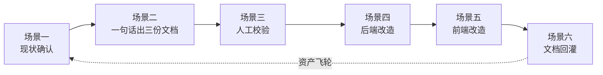

{: .no_toc }

<details close markdown="block">
  <summary>
    目录
  </summary>
  {: .text-delta }
- TOC
{:toc}
</details>

<!--
aicmigr-23-mid-recap-02-workflow-reuse-practice
传统项目迁AI 23：阶段复盘 - 流程复用实战
-->

## 1. 导读地图


本篇是系列第 23 篇，承接第 22 篇的"核心五问"，回答一个新问题：同一套 AI 编程工作流，换一个功能还能跑通吗？跑通的过程长什么样？提示词会变多还是变少？

结论先行：**积累在前、轻松在后**。第二次跑同样的工作流，提示词从 9 条压缩到 1 条，但功能反而更复杂（29 个改造点 vs 12 个改造点）。这一现象的根因，是前若干篇攒下的三类资产在第二次跑时被一次性兑现。


<!--
flowchart TD
    A["第 23 篇导读"] --\> P1["第一部分 方法论提炼<br/>速查"]
    A --\> P2["第二部分 实战演示<br/>精读"]
    A --\> P3["第三部分 小结与思考"]

    P1 --\> P1A["1.1 核心理念<br/>资产飞轮"]
    P1 --\> P1B["1.2 资产三件套"]
    P1 --\> P1C["1.3 流程复用四标志"]
    P1 --\> P1D["1.4 Check List<br/>可裁剪"]
    P1 --\> P1E["1.5 两次改造对照"]

    P2 --\> P2A["2.1 案例背景"]
    P2 --\> P2B["2.2 六大场景总览"]
    P2 --\> P2C["2.3 现状确认"]
    P2 --\> P2D["2.4 一句话出三份文档"]
    P2 --\> P2E["2.5 人工校验"]
    P2 --\> P2F["2.6 后端改造"]
    P2 --\> P2G["2.7 前端改造"]
    P2 --/> P2H["2.8 文档回灌"]

    P1D -.可裁剪.-> CL["Check List 速查"]
    P2 -.落到具体.-> P1
-->

**两条阅读路径**：

| 读者类型 | 建议路径 |
|---------|---------|
| 熟练 AI 编程工程师（快速回顾方法论） | 0 → 1.1 → 1.2 → 1.3 → 1.4 → 1.5 → 3 |
| 初学 AI 编程工程师（系统掌握） | 顺序通读，重点啃第二部分六大场景 |

## 2. 方法论提炼

### 2.1 核心理念：资产飞轮


老项目改造的核心命题不是"这次功能有多复杂"，而是"上一次跑得有多扎实"。

第二次改造（本篇 Overview）和第一次改造（第 17–21 篇 Prompt 版本对比）使用的是**同一套工作流**：现状确认 → 拆需求 → 拆方案 → 人工校验 → 后端 → 前端 → 文档回灌。但两次的体感完全不同——第二次跑得明显轻。轻不是来自功能变简单（功能反而更重），而是来自前几次跑留下的资产被一次性兑现。

这就是资产飞轮：**前面跑得越扎实，后面越轻松；慢就是快**。

### 2.2 资产三件套

第二次跑之所以轻，可以直接归因到三类资产。

| 资产 | 文件位置 | 作用 | 何时攒下 |
|------|---------|------|---------|
| 项目脑图 | `docs/`（架构图 / 模块依赖 / API 清单 / 数据模型） | AI 拆需求时直接读，不需要重新扫代码 | 第 8–9 篇（绘图 + 接口与数据模型） |
| 项目级约束 | `CLAUDE.md`（禁区 / 历史包袱 / 代码风格） | AI 写方案时自动遵守，不需要每次重申 | 第 10 篇（提炼 CLAUDE.md） |
| 改造模板 | 第一次改造的提示词序列 | 同工序直接复用，不需要重新设计提示词 | 第 17–21 篇（第一次完整改造） |

三类资产叠加之后，AI 对项目的熟悉度接近一个新入职两周的工程师，再让它做一次类似的功能，自然顺。

> 即视感提示：到这一步可以感受到——这正是 Skill 出场的时机。当一套提示词序列在一个项目里被反复复用、且只在结尾做参数化差异时，它就已经具备被沉淀为 Skill 的形态。

### 2.3 流程复用的四个标志


把第二次改造和第一次改造放在一起对照，可以提炼出"流程是否进入复用态"的四个标志。

#### (1) 现状确认从"必做"变成"快做"

改造前自己点一遍产品这一步保留（这是第 20 篇翻车后留下的硬约束），但因为没有 AI 介入，提示词为空。

#### (2) 提示词从"九条"变成"一条"

第一次拆需求 + 拆方案跑 9 个提示词（第 17 篇 + 第 18 篇），第二次合并成 1 个简短提示词就能产出需求、改造影响、技术方案三份完整文档。

#### (3) 人工校验从"可省"变成"绝不省"

AI 出文档的速度越来越快，但人工校验三份文档的关键内容这一步**绝对不能省**。AI 压缩的是工作量，不是思考量。

#### (4) 资产从"只读"变成"回灌"

第一次改造是单向读取 `docs/` 和 `CLAUDE.md`，第二次改造还要把新发现的项目级约束回灌回去，让下一次类似功能（运营 Dashboard、成本概览、健康度报表）直接受益。

### 2.4 项目阶段 Check List


下表是流程复用态下的可裁剪 Check List。读者可以按项目阶段对照勾选。

| 阶段 | 检查项 | 通过标准 |
|------|--------|---------|
| 现状确认 | 自己点一遍产品，确认要做的是新功能而不是重复功能 | 菜单逐项点过，无重复入口 |
| 拆需求 + 拆方案 | 一个提示词产出三份文档（需求 / 影响分析 / 技术方案） | 三份文档齐备，决策点拍板 |
| 人工校验 | 反馈问题清单 + 5 个决策最终拍板 | 所有"待审核"标识清零 |
| 后端改造 | 按 solution.md 小步分批（DTO / Service / Controller / Mapper） | 每批 `mvn test` 通过 |
| 前端改造 | 不引入新依赖（如 echarts），用现有组件库实现 | 前端构建无报错 |
| 文档回灌 | `api-list.md` / `data-model.md` / `CLAUDE.md` 同步更新 | 项目级约束写入 CLAUDE.md |

裁剪建议：熟练工程师在已经攒下资产的项目上可以跳过"现状确认"和"人工校验"以外的所有细化提示词；初学工程师建议完整勾选，避免遗漏。

### 2.5 第一次 vs 第二次改造对照


| 维度 | 第一次（第 17–21 篇 Prompt 版本对比） | 第二次（本篇 Overview） |
|------|--------------------------------------|----------------------|
| 功能范围 | 单模块 | 7 个模块，跨 Admin + AgentScope 两个数据库 |
| 改造点数量 | 12 个 | 29 个（17 后端 + 10 前端 + 2 文档） |
| 后端技术难点 | null 处理、复用判断 | 跨库 Mapper 注入、Redis 缓存、SQL 聚合性能 |
| 前端改造类型 | 改现有组件 | 新建页面 |
| 提示词数量 | 9 条（拆需求 + 拆方案） | 1 条 |
| 资产交互 | 单向读取 `docs/` 与 `CLAUDE.md` | 读取 + 回灌新约束到 `CLAUDE.md` |

最后一行是最关键的对照：功能更复杂、改造点翻倍、工作量翻倍，但提示词反而少了 8 条。这看似矛盾，其实完全合理——**第一次跑是在搭脚手架，第二次跑是在用脚手架**。

## 3. 实战演示

### 3.1 案例背景：给 SAA Admin 加 Overview 页面


SAA Admin 当前已经具备 Application 管理、Prompt 工程、评测、可观测、MCP 等模块，但没有一个全局首页。用户登录后默认跳进 Application Management，要看其他模块的状态得一个一个点过去。

为它补一个 Overview 页面，几乎是所有 Admin 系统都该有的标准功能。改造复杂度并不低：

| 维度 | 数值 |
|------|------|
| 涉及模块数 | 7 个 |
| 跨库数量 | 2 个（Admin + AgentScope） |
| 缓存依赖 | Redis |
| 改造点总数 | 29 个（17 后端 + 10 前端 + 2 文档） |

让 Claude Code 帮忙画 PRD，可以使用如下提示词：

```text
顶部 6 张指标卡：Prompt / Version / 实验 / 数据集 / 知识库 / 模型
中部左：实验状态饼图（DRAFT / RUNNING / COMPLETED / FAILED / STOPPED）
中部右：Top 10 Prompt 版本柱图（pre / release 对比）
底部左：最近活动 Timeline（UNION 三张表，最近 20 条）
底部右：文档索引状态（按知识库分组，进度条 + 数量）
```

Overview 页面长这样：


<!--
图片内容说明
路径：imgs/23_阶段复盘_02：流程复用实战/60dfa03265c736c1c00975562de9e393_MD5.jpg
用途：展示 Overview 仪表盘页面的整体布局
内容：SAA Admin Overview 页面设计稿或实现稿，包含顶部 6 张指标卡、中部实验状态饼图与 Top 10 Prompt 版本柱图、底部 Timeline 与文档索引状态四个主要区域
-->

### 3.2 六大场景总览

Overview 改造完整跑下来分六个场景，对应工作流的六个关键节点。所有场景都遵循"提示词 / 产出 / 点评"三段式。



### 3.3 场景一：现状确认


为了不踩坑、不做重复功能，第一步先打开浏览器、登录账号 `saa/123456`，点一遍左侧菜单：Agent Builder（Application / MCP / Component / Knowledge）、Prompt 工程、评测、可观测。确认所有模块都没有"全局概览"入口，默认登录跳 Application Management。


<!--
图片内容说明
路径：imgs/23_阶段复盘_02：流程复用实战/613ecd5b237762f9514d49b4eb31e1a0_MD5.jpg
用途：展示改造前对 SAA Admin 现状的逐菜单确认结果
内容：SAA Admin 左侧菜单展开后的浏览器截图，覆盖 Agent Builder / Prompt 工程 / 评测 / 可观测等模块，用以确认现有功能没有"全局概览"入口
-->

这一步的提示词省了——确认就是确认，不需要 AI。这正是第 20 篇翻车后留下的硬约束：**改造前必须自己点一遍产品**。

### 3.4 场景二：一个提示词出三份文档

原本第 17 篇拆需求 + 第 18 篇拆方案要跑九个提示词，这次合并成一个简短的提示词：

```text
我加一个 overview 页面。你规划一下 overview 放什么、有什么、
数据怎么统计、接口怎么定义、前端页面怎么展示。全流程。
然后根据之前的流程 docs 里面出需求文档、技术方案、改造点文档。能做到吗？
```

就这一个提示词，AI 跑出来三份完整文档：

- `docs/requirements/overview-dashboard.md`（需求）
- `docs/requirements/overview-dashboard-impact.md`（改造影响分析）
- `docs/requirements/overview-dashboard-solution.md`（技术方案）

三份文档加起来超过 800 行，覆盖：6 维需求拆解、29 个改造点列表、跨库查询风险分析、5 个关键决策、详细 SQL、目录结构、实施顺序、关键 SQL 片段、mock 方案。

5 个关键决策列在下表，便于快速回顾：

| 决策项 | 最终选择 |
|--------|---------|
| 是否引入图表库 | 不引（用 antd 现有组件） |
| 缓存粒度 | 整体缓存 5 分钟 |
| 跨库查询是否引 ES | 不引（MySQL UNION） |
| 是否做实时刷新 | 不做 |
| 是否做时间筛选 | 不做 |

为什么这么简单的一句提示词就能产出三份高质量文档？因为前面已经把上下文跑了一遍，也跑了一遍完整的改造流程。这些在最后都做了文档自动更新。**慢就是快**——只要项目改造的齿轮跑起来，就会越来越快。

链路图：


<!--
图片内容说明
路径：imgs/23_阶段复盘_02：流程复用实战/19e8945fffd7ab6f5ed27abb6d06e1ee_MD5.jpg
用途：展示一个提示词产出三份文档（需求 / 改造影响 / 技术方案）的链路图
内容：从单条提示词出发，AI 同时产出 docs/requirements/overview-dashboard.md、overview-dashboard-impact.md、overview-dashboard-solution.md 三份文档的流程链路图
-->

**点评**：跟上次改造比，这次拆需求、拆方案的提示词从 9 条压缩到 1 条，这就是积累的力量。AI 之所以能凭一句话产出三份高质量文档，是因为它已经从 `docs/`、`CLAUDE.md`、第一次改造模板里拿到了所有它需要的上下文。如果是新项目第一次跑，这一步还是要拆成 9 个提示词。**积累在前、轻松在后**。

### 3.5 场景三：人工校验三份文档


到这一步必须刹车停下来。

虽然会越来越快，Claude Code 的改造效果会很好甚至可能完美，不需要做任何更改，但这一步**绝对不能省**。AI 一次出三份文档很爽，但不能直接进下一步动代码。必须人工校验三份文档的关键内容：


<!--
图片内容说明
路径：imgs/23_阶段复盘_02：流程复用实战/0bfb918805a6b0181dbd8fd1e90501d5_MD5.jpg
用途：展示人工校验三份文档（需求 / 改造影响 / 技术方案）的关键检查点
内容：人工审核三份文档的清单或检查流程示意，强调审核环节不可省略
-->

校验完发现需要调整的，反馈给 AI 让它更新文档，格式如下：

```text
我审核了三份文档，以下需要调整：
- [问题 1]
- [问题 2]
- 5 个决策全部拍板：[逐条最终决策]

按上面更新文档。所有"待审核"标识改成最终决策。
```

**点评**：这一步是必须凸显的关键。第 22 篇讲过的"工作量下来 ≠ 思考量下来"在这里有最直接的落地。AI 帮忙压缩了 90% 的工作量，省下来的时间必须用在校验上。如果偷懒、直接用 AI 出的文档进入开发，就把"快"变成了"快错"。**这一步的校验质量决定了后面三天的代码方向。**

> 关键 Tips：这一步千万别偷懒，不能偷懒。

### 3.6 场景四：执行后端改造


提示词也是一句：

```text
按 docs/requirements/overview-dashboard-solution.md 完成后端改造。

按 19 讲的小步执行原则跑：分批做（DTO 一批、Service 一批、Controller
一批、Mapper 新增 COUNT 方法一批）、每批跑通 mvn test 才进下一批、
不重构现有 Mapper、跨库 Mapper 注入参考 ModelConfigBridgeServiceImpl。
跑通后告诉我总测试数 + 失败数。
```

为什么这么短？因为所有具体约束（字段对齐、Redis 缓存、跨库注入、SQL 写法）都已经在 `solution.md` 里了，AI 读这份文档就能拿到所有信息。重复说一遍是浪费 token，更是浪费注意力。

后端代码长什么样、SQL 怎么拼，跟上次的工作流一致，这一篇不展开（第 19 篇已经讲透）。

**点评**：跟上次比，这次后端改造的核心难点变了。上次是 null 处理、复用判断；这次是跨库 Mapper 注入、Redis 缓存、SQL 聚合性能。同样的工作流，落到具体代码上的关注点完全不同——这就是**工作流可迁移**的真实含义。如果今天在自己项目上做类似的聚合首页，技术细节会和这次不一样（可能用 ehcache 不是 Redisson、可能不需要跨库），但工作流的关键节点完全一样：先确定决策点、再小步实现、再补测试、最后回灌资产。

### 3.7 场景五：执行前端改造

```text
按 docs/requirements/overview-dashboard-solution.md 完成前端改造。

不引入 echarts，全用 antd 现有组件。改完跑前端构建确认无报错。
```

**点评**：跟上次比，这次是新建页面、不是改现有组件，所以前端改造的整体节奏比上次更顺。没有 props 破坏性变更、没有现有调用方需要同步更新，直接按设计稿建组件即可。


<!--
图片内容说明
路径：imgs/23_阶段复盘_02：流程复用实战/200d4e5e12c4f8c6a5cc9ad2694bf991_MD5.jpg
用途：展示前端改造完成后的 Overview 页面效果
内容：前端 Overview 页面的运行截图，包含指标卡、饼图、柱图、Timeline、文档索引状态等区域，体现 antd 组件实现效果
-->

但有一处需要特别注意：**菜单配置文件位置不是凭直觉能猜对的**，必须自己点一遍产品 + 让 AI 扫代码确认。Overview 入口加在哪、用什么 icon，这些是第 17 篇老项目约束的具体形态。AI 默认会"建一个新菜单组件"，但项目里可能用配置数组管菜单，那就改配置数组即可。

### 3.8 场景六：文档自动更新


Overview 改造跑完了。把这一轮新发现回灌到 `docs/`：

```text
1. api-list.md：加 GET /api/dashboard/overview
2. data-model.md：加 DashboardOverviewResult 顶层 + 10 个子 DTO
3. overview-dashboard.md：补审核中新发现的边界
4. CLAUDE.md：加项目级新约束。候选：
   - "聚合多模块的接口默认整体缓存（Redis），按卡片细粒度缓存需要明确理由"
   - "跨 admin / agentscope 库查询的 Service 必须放在 server-start 模块，参考 ModelConfigBridgeServiceImpl 先例"

判断哪些是项目级 → 写进 CLAUDE.md，哪些是这一次特殊处理 → 留在 solution.md。
输出每份文件的改动 diff。
```

**点评**：跟上次比，这次回灌到 `CLAUDE.md` 的新约束更通用。"跨库 Service 放 server-start" 这条是项目级的：下次再有类似 Overview 的功能（比如运营 Dashboard、成本概览、健康度报表），AI 会主动提醒"跨库查询走 server-start，参考 `ModelConfigBridgeServiceImpl`"。`docs/` 资产越改造越厚，方法论才会真正长在项目里。

## 4. 小结


### 4.1 三句话压缩

第 23 篇的核心可以压缩成三句话。

#### (1) 工作流的本质不变

变的是这次改造的具体技术细节（跨库查询、Redis 缓存、5 个 Section 组件、29 个改造点），不变的是"理解 + 开发"的工作流本质。这些新复杂度没有一个让工作流偏离原本的节奏——这套流程不依赖于具体功能、只依赖于改造类型，而且**越用越省事**。

#### (2) 资产飞轮第一次显形

前面攒下的资产在这一篇真正发挥了作用：`docs/` 让 AI 不用重新扫代码、`CLAUDE.md` 让 AI 自动遵守项目约束、第一次改造的模板让这次的提示词从繁到简。这些不是花哨的功能，是踏踏实实的工程积累。

#### (3) 跨技术栈迁移预告

系列第六部分开始，会换一个语言（Python / Hermes Agent）跑同样的工作流，验证一次跨技术栈的可迁移性。Java 项目能跑通的工作流，换到 Python 项目还能不能稳？等到第六部分跑完，心里会有答案。

## 5. 思考

### 5.1 两个问题

#### (1) 最有感的一点是什么

是"一个提示词出三份文档"的轻快，还是"必须人工校验三份文档"的提醒？

#### (2) 能否在自己的项目上复现

假设今天在自己的项目上做一个类似 Overview 的功能，能否像这一篇一样用一个提示词搞定拆需求 + 拆方案？如果不能，差在哪？是 `docs/` 资产不够全，还是 `CLAUDE.md` 没攒够，还是没做过类似的改造、没留下模板？
