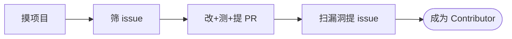

{: .no_toc }

<details close markdown="block">
  <summary>
    目录
  </summary>
  {: .text-delta }
- TOC
{:toc}
</details>

<!--
aicmigr-31-opensource-02-second-pr-rust-tutor
传统项目迁AI 31：挑战开源 - AI Rust助教搞定第二个PR
-->

## 1. 开篇: AI 当 Rust 助教的工作姿势


### 1.1 核心思想: AI 解释机制，工程师做判断

上一篇里第一个 PR（改的是 Markdown 文档）合并进 RobustMQ，名字进了贡献者列表。<span style="color: red; font-weight: bold;">但那只算心理胜利——它没证明你能在不熟的栈上做出真正的工程贡献</span>。本篇在这个 Rust 项目上跑两件事: 第二个 PR（REST 端点从 POST 改 GET）加第一个 issue（O(n²) 算法），两件事跑完，你正式成为 Contributor。

你可能会问: 没学过 Rust 怎么动它的代码？

Rust 在 AI 时代仍有学习门槛: 所有权、生命周期、async 这些机制不是看一眼就能上手。但这恰恰是本篇要立的工作姿势——与传统软件工程里接手一份老代码一样，你不需要先精通那门语言，靠的是一份 codebase walkthrough 把架构和约束摸清。这里 AI 充当"会解释每一段 Rust 的助教": 逐段解释关键改动、提醒所有权和 async 细节、推荐项目风格 idiom，把不熟悉栈的门槛压下去。

**AI 解释机制，工程师做判断——不熟的栈，不再是 blocker。** 这就是 Rust 助教这个说法的具体形态，也是本篇想留下的最重要的一句话。

### 1.2 四阶段工作流总览

<span style="color: red; font-weight: bold;">第二个 PR 不是闷头写代码，它由四个阶段组成。每个阶段都有一句话目标和明确的产出物。</span>



| 阶段 | 目标 | 关键产出 |
|------|------|---------|
| 摸项目 | 在不属于自己的代码上动手前，建立"对当前任务有用"的项目认知地图 | 模块划分 / 测试组织 / 贡献热点 / 适合新人的入口四维度（带任务过滤） |
| 筛 issue | 从 issue 列表挑一个能上手、能合并、能 review 的目标 | 5 个候选 + 优先级排序 + 最终选定的那一个 |
| 改测提 PR | 在不熟悉的栈上由 AI 跑完全流程，工程师审核 | 一个可合并的 PR（带 issue 链接 / 高层描述 / 实现要点 / 测试覆盖 / trade-off） |
| 扫漏洞提 issue | 让 AI 找一个不复杂的漏洞，工程师写成高质量 issue | 一份带"我可以跟 PR"信号的高质量 issue，价值不低于一个 PR |

这套工作流一旦在一个项目上跑通，任何项目都能复刻——本篇用 RobustMQ 做演示，但载体可以换。下面四节按这个顺序展开，第 6 章给出速查 Check List。


## 2. 准备阶段: 摸项目与筛 issue

第二个 PR 动手写代码前有两件事要做: 摸项目、筛 issue。摸项目是建立一份"对找 issue 有用"的项目地图; 筛 issue 是用三条标准从 issue 列表里挑出能上手的目标。这两步合在一起讲完, 读完本章你就能在陌生项目上快速锁定第二个 PR 的目标。

### 2.1 摸项目: 带任务问的项目地图


传统软件工程里接手老代码, 通常会做一次 codebase walkthrough: 让熟悉项目的人带着你走一遍目录结构、核心模块、测试怎么跑。AI 时代这一步同样省不掉, 只是"带路的人"换成了 AI, 而且你要把任务告诉 AI, 否则它给的就是一份干巴巴的架构介绍。

#### (1) 为什么"摸项目"不能省

在不属于你的代码上动手前, 必须先有一份对当前任务有用的项目认知地图。盲选 issue 是新人翻车的主要原因: 要么改动范围远超预期, 要么踩了 CONTRIBUTING.md 的硬约束被维护者打回。

这里有个关键区别: 本篇的"摸项目"和做新系统时的"摸项目"不是一回事。

| 对比维度 | 做新系统时 | 本篇(找 issue) |
|---------|-----------|---------------|
| 任务 | 做一个新系统 | 找一个能上手的 issue |
| 问 AI 的角度 | 它是什么 / 能做什么 / 怎么扩展 / 内部怎么跑 | 这四维度里"对找 issue 有帮助的那部分" |
| AI 输出 | 一份完整架构文档 | 一份带任务过滤的项目地图 |

任务变了, 问 AI 的角度也要变。AI 不知道你的目的时, 会给一份完整架构文档; 告诉 AI 目的, 它会过滤出对你有用的部分。

#### (2) 四维度框架(针对找 issue 任务)

把做新系统的四维度框架套到"找 issue"任务上, 每个维度关注什么、落点在哪:

| 维度 | 关注问题 | 在"找 issue"任务下的具体落点 |
|------|---------|-----------------------------|
| 模块划分 | 代码大致分成几块? 每块负责什么? | 知道改一个 issue 大概落在哪个模块, 方便判断改动范围 |
| 测试组织 | 单测在哪、集成测试在哪、怎么跑? | 知道补测试往哪写、用什么命令跑 |
| 贡献热点 | 最近三个月哪几个模块改动最多? 活跃 contributor 主要在哪些模块? | 找活跃模块更容易被维护者 review 通过, 避开冷门死区 |
| 适合新人的入口 | good first issue / help wanted 标签下有没有方向? CONTRIBUTING.md 有什么硬约束? | 直接定位到待领的小活, 知道新增代码必须满足哪些硬约束 |

第三条"贡献热点"容易被忽略但很关键: 扫 `git log` 看最近三个月哪几个模块最活跃。活跃模块的维护者响应快, 冷门模块的 PR 可能挂几个月没人理。

#### (3) 提示词全文与关键设计

在项目仓库目录下打开 Claude Code, 丢下面这段提示词:

```
我在项目仓库目录下。我已经成功提了第一个 PR(SignYourName),
现在要做第二个 PR,目标是给这个项目提交一个有真实工程价值的小贡献。

请你按这四个维度给我一份针对"找 issue"任务的项目地图:

1. 模块划分。这个项目的代码大致分成几块?每块负责什么?
2. 测试组织。单测放在哪、集成测试放在哪、怎么跑?
3. 贡献热点。最近三个月哪几个模块改动最多?活跃 contributor 主要在
   哪些模块?(扫 git log 看)
4. 适合新人的入口。看 issues 里 good first issue / help wanted 标签下,
   有没有可以上手的方向?CONTRIBUTING.md 有什么对新人的硬约束?

不要给我一份完整架构文档,只给我对找 issue 有帮助的那部分。
```

提示词的关键是第一句"针对找 issue 任务的项目地图"。这一句话把任务上下文塞给 AI, 让 AI 知道要过滤什么、忽略什么。整段提示词的骨架只有三条:

- 显式声明目的: 做第二个 PR, 目标是提交一个有真实工程价值的小贡献
- 显式声明维度: 按四维度给"针对找 issue 任务"的项目地图
- 显式声明约束: 不要完整架构文档, 只给对找 issue 有帮助的那部分

#### (4) 实战产出: RobustMQ 的项目地图

跑完上面这段提示词, 对 RobustMQ 的心里有了底:

- 协议层、存储层、metadata、CLI 工具, 大概四块
- 最近活跃的是协议层和 CLI
- good first issue 标签下有几个待领的小活
- CONTRIBUTING.md 要求所有新增代码必须带测试

地图有了, 接下来就是从这张地图上挑一个能干的 issue。操作上有三条要点:

- 必须在仓库目录下的 Claude Code session 里跑, AI 在仓库里有完整代码访问能力, 提示词才能驱动完整的项目分析
- 跑完后心里要有一张地图(活跃模块 + 待领小活 + 硬约束)
- CONTRIBUTING.md 的硬约束要在摸底阶段就掌握, 它是后续 PR 能否合并的硬门槛

### 2.2 筛 issue: 三条标准


#### (1) 三条筛选标准

挑 issue 不是凭直觉, 是按标准。第二个 PR 不是搞大型重构, 目标是做完一件能合并的小事。

| 标准编号 | 标准内容 | 为什么这条重要 | 量化指标 |
|---------|---------|---------------|---------|
| 标准一 | 改动量不大 | 第二个 PR 不是搞大型重构 | 代码 + 测试加起来 50-200 行 |
| 标准二 | AI 能自己改 | AI 看完上下文就能写出来 | issue 描述清楚 + 改动局部(单文件或单模块) |
| 标准三 | 工程师能 review | AI 写完工程师能看懂、能判断对错、能跟维护者讨论 | 工程师看完知道在改什么 |

三条必须同时满足, 缺一不可。**第三条最关键: 签字提 PR 的是工程师, 简历上挂这条 commit 的也是工程师, 出问题就是工程师的责任。超出工程师能 review 范围的 issue, 不管多有价值都不能选。**

#### (2) 让 AI 出候选清单

复用同一个 Claude Code session, 前面那份项目地图 AI 还记得。把三条标准丢给 AI, 要求每个候选给出五项信息(编号和标题 / 所在模块 / 要干什么 / 为什么符合标准 / 风险点), 最后要求 5 个候选排优先级(从最稳到最有挑战)。

```
基于刚才那份项目地图,帮我从这个项目的 issue 列表里筛 5 个候选,
作为我的第二个 PR 目标。

筛选标准:

1. 改动量不大,代码 + 测试加起来 50-200 行
2. 描述清楚,改动是局部的(单文件或单模块内)
3. 不需要深度业务理解,我能 review 得了 AI 写的代码

每个候选告诉我:

- issue 编号和标题
- 它在哪个模块
- 我做这个 PR 大概要干什么(一两句话)
- 为什么它符合上面三条标准
- 风险点在哪(比如有没有可能改完发现规模超出预期)

5 个候选给我排个优先级,从最稳到最有挑战。
```

提示词的设计要点是把三条标准的硬约束显式告诉 AI, 让 AI 从最稳的开始排, 工程师从最稳的开始看。

#### (3) 实战拍板: Issue #1605

Claude Code 跑完给了一份候选清单。看完挑了一个改动量合适的: **Issue #1605: 把 admin-server 里 shard/list 和 segment/list 两个查询类 API 从 POST 改为 GET**。改 4 个文件, 逻辑不变, 语义对齐 REST。

AI 推荐的顺序是从最稳到最有挑战, 为什么不挑最简单的? 因为 AI 推荐的 5 个里有几个是"多余的 collect""多余的 clone"那种 1 行就能改的代码风格问题, 维护者反应通常是"直接 PR 删一行就行, 提 issue 干嘛"。<span style="color: red; font-weight: bold;">真本事 PR 要有真实工程价值。</span>最终拍板按四个维度判断:

| 判断维度 | 具体内容 |
|---------|---------|
| 真实工程价值 | 查询类接口本来就该用 GET, 这是 REST 语义的回归。改动满足 REST 语义对齐这个真实用户需求, 不是凭空改造 |
| 改动是局部的 | 只在 admin-server 模块, 涉及 4 个文件(router、handler、client 调用方、对应测试)。模块和影响范围清晰, 没有跨模块扩散 |
| Rust 经验要求适中 | 用到 axum 的 Query extractor、axum-extra 的 multi-value 扩展这些 Rust 特性, 但不至于硬到看不懂。AI 在写代码时能边写边解释清楚 |
| 工程师能 review | 工程师虽然对 Rust 不熟, 但相关模式(POST/GET 路由切换、handler 签名变更、测试同步更新)能看懂, 能判断对错, 能跟维护者讨论 |

## 3. 改测提 PR: 长提示词驱动十步流程

issue 选好之后，剩下的事交给一段长提示词。fork + clone 之后，这段提示词驱动 AI 跑完读 issue、建 branch、写代码、补测试、跑测试、lint、commit、push、提 PR 全流程，工程师只做两件事: 审核与拍板。读者读完应能照着在自己不熟悉的栈上复现一个可合并的 PR。

### 3.1 长提示词的五个关键设计


你可能会问: 为什么要写这么长一段提示词，不能分十步每次现问吗？可以，但分步现问会让上下文来回漂移，AI 容易在某一步忘掉前面给过的约束。<span style="color: red; font-weight: bold;">长提示词相当于传统开发里的详细任务说明书 + 验收标准，一次给清，避免反复对齐。</span>它的关键设计只有五条。

| 关键设计 | 设计内容 | 为什么这样设计 |
|---------|---------|---------------|
| 先 plan 后改 | AI 拿到 issue 不能闷头写，先把 plan 给工程师审核，同意才动 | AI 自作主张写完再被驳回，浪费时间和上下文 |
| 关键改动逐段解释 | AI 边写边教，逐段说"这里在做什么、为什么这么写" | 让工程师 review 时真正理解代码，而不是签字画押 |
| 所有权 / 生命周期 / async 简短解释 | 涉及这三者的关键改动处简短解释 Rust 机制 | 压低不熟悉栈的门槛，这是 AI 当 Rust 助教的具体形态 |
| 不用复杂 idiom | 选最直白的写法；多种合理写法中选项目现有代码最常用的风格 | 防止 AI 写出 Rust 高手风格代码，导致工程师看不懂、review 不了 |
| warning 必清不留 allow 绕过 | 所有 warning 都要清掉，不要留 `#[allow(...)]` 绕过 | 开源项目的硬要求，不能用 `#[allow(...)]` 偷懒 |

<span style="color: red; font-weight: bold;">这五条的本质，是把"工程师审核"和"AI 执行"的边界写死在提示词里: AI 该停在哪一步等人、该解释到什么程度、代码风格往哪边收，都不是临时商量，而是开头一次定清。</span>

### 3.2 长提示词全文

下面是完整提示词，可直接复用。这段提示词比改 Markdown 那次长，因为这次是真改代码。在 fork + clone 好的本地仓库目录下打开 Claude Code，丢进去即可。

```
我要给这个项目提一个 PR,实现 issue
`shard/list` 和 `segment/list` 两个查询类端点,从 POST 改为 GET。

查询类接口本来就该用 GET,这是 REST 语义的一次回归。

请你帮我把整套流程跑完。每一步执行前告诉我你要做什么,执行后告诉我结果。任何报错或不确定的地方立刻停下来问我,不要自己瞎修。

具体步骤:

1. 先读 issue
   模块当前实现长什么样、它依赖哪些 API、上下游有哪些关键调用。
   读完给我一份"我要改什么"的简短 plan(3-5 条)。我审核 plan 之后才能进下一步。

2. plan 我同意之后,建一个新 branch,命名跟项目风格对齐
   (feature/<跟 issue 主题对应的简短描述>)。

3. 按 plan 写代码。Rust 我不熟,所以你写完之后:
   - 关键改动逐段告诉我"这里在做什么、为什么这么写"
   - 任何用到所有权 / 生命周期 / async 的地方,简短解释
   - 不要为了炫技用复杂的 idiom,选最直白的写法
   - 如果有多种合理写法,选项目现有代码里最常用的那种风格

4. 补测试。看项目现有测试在哪、怎么组织,跟着同样的风格写。
   测试要覆盖:正常 watch 行为、Ctrl-C 退出、间隔参数边界值。

5. 跑测试。如果不知道怎么跑,先看 Makefile / CI 配置 / cargo 配置自己摸清楚。跑通为止。

6. 跑项目的 lint:cargo fmt + cargo clippy。所有 warning 都要清掉,不要留 #[allow(...)] 绕过。

7. 写一条 commit message,Conventional Commits 规范。然后 git add + commit。

8. push 到我的 fork。

9. 写一个 PR 描述,包括:
   - 这个 PR 解决的 issue
   - 改动的高层描述(2-3 句)
   - 实现要点(3-5 条 bullet)
   - 测试覆盖了哪些场景
   - 有任何 trade-off 或后续可改进的点,显式说出来

10. 如果装了 gh CLI,直接 gh pr create 提交。没装就把 PR 描述输出给我,我自己去 GitHub 提。
```

接下来用 RobustMQ Issue #1605（把 `shard/list` 和 `segment/list` 两个查询类端点从 POST 改为 GET）复现这十步流程。

### 3.3 十步流程实战复现


#### (1) Step 1: 读 issue + 给 plan

Claude Code 先读了 issue 和相关代码，给了一份 4 条 plan:

| 序号 | 改动内容 |
|------|---------|
| 1 | router 改造: 在 admin-server 的 router 文件里把两个端点的 `.post(...)` 改成 `.get(...)` |
| 2 | handler 签名改造: handler 函数签名从 `Json(req)` 改成 `Query(req)` |
| 3 | client 调用方改造: client 端调用方对应改 `.post()` 为 `.get()`，且把请求 body 改成 query string |
| 4 | 跑测试 + 补测试更新: 跑现有测试，有失败再补对应的测试更新 |

工程师看完同意，AI 开始写代码。

#### (2) Step 2-3: 建 branch + 写代码，AI 边写边教

这一步最能看出"Rust 助教"的形态。AI 写到 handler 那段，停下来解释 axum 的类型驱动 idiom:

- **Json extractor**: 把请求 body 反序列化成 struct，只能配 POST/PUT
- **Query extractor**: 把 URL query string 反序列化，配 GET
- 这是 axum 的类型驱动 Web 框架 idiom，不是 Rust 语言层面的事，但工程师不知道这一点会卡半天

<span style="color: red; font-weight: bold;">工程师自己写不会想到这个细节，AI 写出来还告诉你为什么这么写——这就是"边写边教"的价值。</span>

写到 `ShardListReq` 那段，AI 又停下来提醒: 这个 struct 里有一个 `Vec<String>` 字段，axum 默认的 Query extractor 不支持多值参数（同名 query string 出现多次会被覆盖）。工程师问 AI"那怎么办，要不要把 Vec 改成逗号分隔的 String 然后手动 split"。AI 解释:

- 项目已经引入了 `axum-extra` 这个 crate
- 它的 Query 扩展支持 multi-value
- 直接用 `axum_extra::extract::Query` 替换 `axum::extract::Query` 就行
- 不用动业务代码

工程师学到一个 idiom，而且确认了它符合项目风格——既没动业务代码，又没引入新依赖。

#### (3) Step 4-5: 补测试 + 跑测试

AI 跑现有的集成测试，用 `cargo nextest run --package admin-server`（项目用 nextest 不是默认 cargo test，这是 Makefile 里发现的项目惯例），有 2 个 case 失败。

AI 停下来给工程师看错误信息，问要不要让它修。工程师看了一眼，是测试还在用 `.post()` 调端点，因为路由改成 GET 了，这两个 case 拿到的是 `405 Method Not Allowed`。AI 把测试里的 `.post(body)` 改成 `.get().query(...)`，重跑，绿了。

#### (4) Step 6: lint

`cargo fmt` + `cargo clippy` 各跑一遍，clippy 报了一个 `needless_borrow` warning，在 client 改造的地方多了一个引用符号。AI 没用 `#[allow]` 绕过，直接改代码消掉。

#### (5) Step 7-10: commit + push + PR

最后 commit + push + 用 `gh pr create` 提了 PR。整个过程大概 50 分钟，大部分时间在等 `cargo build` 和 `cargo nextest`。

### 3.4 两个硬性 review 节点

十步流程里，工程师不是每步都盯着，而是强制在两个点停下来。

#### (1) 步骤 5 与 6 之间必须停一下

在跑测试和跑 lint 之间，工程师必须 review AI 写完的代码。**给开源项目提交的代码一定需要 review，这是对开源负责任的体现。没有"信任 AI 跳过 review"这种选项。**

#### (2) 任何报错或不确定，AI 必须停下来问

不要让 AI 自己瞎修。任何报错或不确定的地方，AI 立刻停下来问工程师，由工程师判断怎么处理。

这两个节点是工程师真正发力的地方: 第一个守住代码质量的底线，第二个守住"AI 不越界"的边界。

### 3.5 Rust 助教的工作姿势总结

这一章跑下来，"AI 解释机制，工程师做判断"不再是一句口号，而是十步流程里每个 review 节点的具体动作——AI 逐段解释关键改动、提醒所有权和 async 细节、推荐项目风格 idiom，工程师在两个硬节点上守住判断。


## 4. 扫漏洞提 issue: 成为 Contributor

PR 提完不算结束。另一条独立的贡献路径是: 让 AI 扫一个不复杂的漏洞、工程师把它写成高质量 issue。价值不低于一个 PR。读者读完这一章，能照着扫漏洞提示词和写 issue 提示词，独立产出一份带"我可以跟 PR"信号的高质量 issue。

### 4.1 为什么 issue 也是 Contributor 行为


你可能会问: 我又不打算改这个漏洞，提 issue 算什么贡献？

<span style="color: red; font-weight: bold;">很多核心维护者会直接告诉你: 一个写得清楚、可复现、有定位价值的 bug 报告，价值不比一个 PR 小。</span>PR 可能因为方向不对被砍，但 issue 是输入信息，几乎不会被拒。很多 Maintainer 反而更欢迎高质量 issue——PR 代码质量良莠不齐，issue 至少不污染代码库。

**Contributor 的真实定义不是"改代码的人"，而是"给项目带来价值的人"。** 一份清晰的 bug 报告，就是价值。在 PR 之外主动提 issue，本身就是 Contributor 行为。

类比一下传统开发: 高质量 issue ≈ 一份好的 bug 报告 + 复现路径 + 修复方向。<span style="color: red; font-weight: bold;">维护者最缺的从来不是"愿意改代码的人"，而是"愿意把问题查清楚的人"。</span>

### 4.2 扫漏洞: 五个方向 + 关键过滤

AI 扫静态代码最擅长找性能问题。工程师倾向找性能问题，这是正确选择。重点扫五个方向:

| 方向 | 问题机制 |
|------|---------|
| 不必要的 .clone() / .to_owned() | 特别是热路径上（协议处理、存储读写）的克隆，是性能流失高发地 |
| async 函数里持有 std::sync::Mutex | 应该用 `tokio::sync::Mutex` 或重构掉。在 async 上下文持有 `std::sync::Mutex` 是潜在死锁源 |
| 锁粒度太粗 | 把不该锁住的代码包进去了。粗粒度锁在热路径上显著压低吞吐 |
| 循环里反复分配 Vec/String/HashMap | 可以预分配的场景在循环里反复分配会制造大量短命对象 |
| Stream / iterator 用法低效 | 比如 collect 之后又遍历的，可以直接 chain。这种低效编译器看不出来 |

**关键过滤: 不要找 clippy 已经查出来的。** 那些是项目自己跑 CI 就能消灭的，提了也没价值。**要找需要上下文判断的真问题——这是高质量 issue 和低质量 issue 的分水岭。**

### 4.3 扫漏洞提示词全文

还在仓库目录下的 Claude Code 里继续跑。同一个 session 跑完最稳，AI 对项目代码的上下文还在。

```
帮我扫一遍这个项目的代码,找潜在的性能问题。重点看:

1. 不必要的 .clone() 或 .to_owned(),特别是热路径上(协议处理、存储读写)。

2. async 函数里持有 std::sync::Mutex(应该用 tokio::sync::Mutex 或者重构掉)。

3. 锁的粒度太粗,把不该锁住的代码包进去了。

4. 在循环里反复分配 Vec/String/HashMap 这种可以预分配的场景。

5. Stream / iterator 用法低效,比如 collect 之后又遍历的可以直接 chain。

不要找编译器和 clippy 已经能查出来的(那些项目自己会跑)。

找那种需要看上下文才能发现的真问题。

给我 5 个候选,每个说清楚:

- 文件路径和行号
- 问题描述(具体哪段代码 + 为什么是问题)
- 影响范围(只有 corner case 才会触发,还是日常路径上)
- 修复思路(不要写代码,讲清楚改动方向就行)
```

候选清单的每个候选必须四项信息齐全: 文件路径和行号、问题描述（要写清问题机制而不是只贴代码）、影响范围（corner case 还是日常路径）、修复思路（讲清改动方向，不写代码）。

### 4.4 高质量 issue 的判断标准


拿到 5 个候选之后，先按下面的标准筛: 哪些值得写成 issue，哪些不值得。

#### (1) 什么样的 issue 值得提

| 标准 | 具体要求 |
|------|---------|
| 在日常路径上 | 不是 corner case 才触发，而是规则重算、协议处理、存储读写这种生产环境高频路径上的问题 |
| 影响清晰 | 算法复杂度可量化，例如 O(topics × rules) 在 topic 几万的场景下能算出具体延迟量级 |
| 有具体定位 | 文件 + 行号 + 函数名齐全，维护者拿到 issue 就能复现 |
| 修复方向明确 | 讲清思路即可（例如"循环外按 tenant 建分组 map，内层 O(1) 查表"），不用给代码 |

#### (2) 什么样的 issue 不值得提

"多余的 collect"、"多余的 clone"那种 1 行就能改的代码风格问题不算高质量 issue——维护者的反应通常是"直接 PR 删一行就行，提 issue 干嘛"。

算法层面有改进、修复需要讨论方向、需要测试验证的问题，才值得走 issue 流程。

### 4.5 实战: 选定 topic_rewrite 的 O(n²) 算法问题

AI 跑完给了 5 个候选，工程师看完挑了最有算法价值的那一个:

| 字段 | 内容 |
|------|------|
| 文件 | `mqtt-broker/src/core/topic_rewrite.rs:54-70` |
| 函数 | `convert_rewrite_topic` |
| 问题 | 在外层遍历所有 topic 的循环里，每个 topic 都重新过滤一次全量 rules，生成一个临时 `Vec<&MqttTopicRewriteRule>` |
| 算法复杂度 | 生产环境 topic 几万的场景下，算法复杂度是 O(topics × rules)，应该降到 O(topics + rules) |

拿 4.4 的四条标准逐条核对，确认这个候选够格:

| 标准 | 是否满足 | 核对结果 |
|------|---------|---------|
| 在日常路径上 | ✓ | 规则重算时遍历全量 topic，不是 corner case 才触发 |
| 影响清晰 | ✓ | 算法复杂度 O(topics × rules) 可量化，topic 几万、rules 几十的场景下延迟量级可直接算出来 |
| 有具体定位 | ✓ | 文件 + 行号（54-70）+ 函数名（`convert_rewrite_topic`）齐全 |
| 修复方向明确 | ✓ | 循环外按 tenant 建分组 map，内层 O(1) 查表——讲清思路，不用给代码 |

四条全中，这是一个高质量 issue 的底子。

### 4.6 让 AI 写高质量 issue

底子有了，下一步是把字段表里的信息组织成一份维护者一眼能看懂的 issue。把"写 issue"这件事也交给 AI，用一个写 issue 提示词框定产出。

#### (1) 提示词全文

```
基于上面那个 topic_rewrite O(n²) 过滤的性能问题,帮我写一个
GitHub issue。

要求:

1. 标题简洁,一句话概括问题(<80 字符)

2. 正文按这几节:

   - Description:问题是什么,3-5 句话,讲清楚 O(topics × rules) 这个
     复杂度问题
   - Reproduction:怎么复现(rules 数量 + topics 数量足够大,触发规则
     重算路径就能观察到延迟)
   - Impact:影响什么场景、严重程度,生产环境 topic 数量级是几万的话
     量化一下延迟
   - Suggested fix:可能的修复方向(不要写代码,讲思路:循环外按
     tenant 把 rules 分组成 HashMap,内层改成查表)
   - Environment:项目版本、Rust 版本、OS

3. 语气是普通工程师,不是 LinkedIn 帖子,不是问问题,是报告问题

4. 显式说"我可以在确认方向后跟一个 PR",给维护者一个信号:
   我不只是路过的伸手党
```

#### (2) 关键信号: 显式说"我可以跟 PR"

提示词最后那一条很关键。**"显式说我可以跟 PR"是高质量 issue 的标志。** 它告诉 Maintainer: 工程师不是只想刷 contribution 数字，愿意接着把这件事做完。

很多时候 Maintainer 看到这一句就会主动来 review 和讨论，因为他们知道这个 issue 不是石沉大海。<span style="color: red; font-weight: bold;">这是一个"我可以跟 PR"的信号——给维护者吃定心丸，也是区分"伸手党"和"准 Contributor"的分界线。</span>

#### (3) 算法改进类问题优先走 issue 先讨论

你可能会问: 既然修复方向都清楚了，为什么不直接开 PR？

<span style="color: red; font-weight: bold;">算法改进类问题的修复方向（分组 map vs 索引化 vs 缓存化）有几种合理选择。先在 issue 里对齐方向，再开 PR，效率比直接提 PR 让 Maintainer 选方向高得多——直接提 PR 让 Maintainer 在评审时被迫做架构决策，往往会被打回重做。</span><span style="color: red; font-weight: bold;">issue 是讨论方向的场合，PR 是落地讨论结果的场合。</span>

issue 正文按 5 节组织，让维护者一眼看清问题、复现路径、影响和修复方向:

| 节名 | 写什么 |
|------|-------|
| Description | 问题是什么，3-5 句话。讲清楚复杂度问题（如 O(topics × rules)）的机制 |
| Reproduction | 怎么复现。写清触发条件（如 rules 数量 + topics 数量足够大，触发规则重算路径就能观察到延迟） |
| Impact | 影响什么场景、严重程度。生产环境 topic 数量级是几万的话量化一下延迟 |
| Suggested fix | 可能的修复方向。不要写代码，讲思路（如循环外按 tenant 把 rules 分组成 HashMap，内层改成查表） |
| Environment | 项目版本、Rust 版本、OS |

#### (4) 最终产出

AI 写完一份 issue，工程师审核一遍，提到了项目仓库。

### 4.7 成为 Contributor 的那一刻

第二个 PR 合并，第一个 issue 提了。打开工程师的 GitHub 个人页面，那个项目的仓库下，工程师的贡献从一条 SignYourName commit 变成了: 1 个有功能价值的 PR + 1 个有定位价值的 issue + 1 条 SignYourName commit。

这是 Contributor 身份的真实开始。简历上工程师可以写: X 项目 contributor，贡献了一个 Y 功能 + 一个性能 issue 报告。<span style="color: red; font-weight: bold;">这一行简历的分量，远大于"熟练使用 Rust 5 年"。因为它公开可点击验证、不可伪造、AI 写不出来。</span>

更重要的是，这套流程在一个项目上跑通了，以后任何项目都能复刻，接下来就是选下一个项目继续做。

**第一个 PR 是心理胜利，第二个 PR 是真本事。真本事一旦做成第一次，后面就是肌肉记忆。**


## 5. 收束：从一次跑通到任意项目复刻


<span style="color: red; font-weight: bold;">这套四阶段流程（摸项目 → 筛 issue → 改测提 PR → 扫漏洞提 issue）跑通一次，关键不是记住 RobustMQ 的某个函数，而是建立"在陌生栈上让 AI 跑完 PR + issue 全流程"的肌肉记忆。</span>换一个项目，不论语言、不论领域，同样的长提示词结构、同样的两个 review 节点、同样的"我可以跟 PR"信号都能直接复用——<span style="color: red; font-weight: bold;">变的只是 AI 解释的具体技术细节，不变的是"AI 解释机制，工程师做判断"的工作姿势。</span>

**第一个 PR 是心理胜利，第二个 PR 是真本事。** 第一个 PR（上一篇）证明你敢动手，第二个 PR（这一篇）证明你能复刻。能复刻，才意味着这套工作流真正变成了你的能力，而不是一次运气。


## 6. 四阶段工作流 Check List

本 Check List 按四阶段工作流组织，按需查阅、按需裁剪。每条对应正文第 2~4 章的展开内容，需要细节时回到对应章节。

### 6.1 通用约束

- 所有动作在 fork 后的本地仓库目录下打开 Claude Code 跑，AI 在仓库里有完整代码访问能力
- 同一 session 跑完最稳，AI 对项目代码的上下文还在
- 第三人称视角：AI 解释机制，工程师做判断。AI 是助教，工程师是决策者
- 代码必须 review，对开源负责，没有"信任 AI 跳过 review"这种选项

### 6.2 摸项目阶段

- 在仓库目录下打开 Claude Code session，AI 在仓库里有完整代码访问能力
- 带任务问（如"针对找 issue 任务的项目地图"），要求 AI 过滤，不要让 AI 给一份干巴巴的架构介绍
- 四维度：模块划分 / 测试组织 / 贡献热点（git log）/ 适合新人的入口（good first issue + CONTRIBUTING.md），每个维度都要回答"对找 issue 有帮助的那部分"
- 跑完心里要有地图：活跃模块 + 待领小活 + 硬约束，地图有了才能挑 issue

### 6.3 筛 issue 阶段

- 三条标准：改动量 50-200 行 / AI 能自己改 / 工程师能 review，三条必须同时满足，缺一不可
- 让 AI 出 5 个候选（带 issue 编号、模块、要干什么、为什么符合、风险点），每个候选五项信息齐全
- 5 个候选排优先级（最稳到最有挑战），工程师从最稳的开始看
- 最终拍板四维度：真实工程价值 / 改动局部 / 经验要求适中 / 工程师能 review，工程师按这四维度做最终判断
- 不选自己看不懂的 issue，签字提 PR 的是工程师，简历上挂的也是工程师

### 6.4 改测提 PR 阶段

- 长提示词驱动，10 步流程：先 plan 到 branch 到代码到测试到 fmt/clippy 到 commit 到 push 到 PR 描述到提 PR
- 5 个关键设计：先 plan 后改 / 关键改动逐段解释 / 不用复杂 idiom / warning 必清 / Rust 助教姿势
- 步骤 5 与 6 之间必须 review AI 写完的代码，这是对开源负责任的体现，不是可选
- 任何报错 AI 必须停下来问，不要瞎修，不要让 AI 自作主张修复
- PR 描述含：issue 链接、高层描述、实现要点、测试覆盖、trade-off，5 项信息缺一不可

### 6.5 扫漏洞提 issue 阶段

- 5 个重点扫方向：clone / async Mutex / 锁粒度 / 循环内分配 / Stream 低效
- 不要找 clippy 已查的，找需要上下文判断的真问题，这是高质量和低质量 issue 的分水岭
- 候选要含：文件 + 行号、问题描述、影响范围、修复思路，四项信息齐全，缺一不可
- 4 条高质量标准：日常路径 / 影响清晰可量化 / 具体定位 / 修复方向明确
- issue 5 节模板：Description / Reproduction / Impact / Suggested fix / Environment
- 显式说"我可以跟 PR"，这是高质量 issue 的标志
- 算法改进类问题优先走 issue 讨论方向，修复方向有几种合理选择时，先讨论再开 PR

### 思考

回想工程师的技术栈里，有没有一个想学但一直没真正用过的语言或框架？如果用本篇的"AI 当助教"姿势重新来一次，工程师会选哪个项目作为切入点？

记得改动量不大、AI 能自己改、工程师能 review 这三条筛选标准，把它套到那个项目上，看看能筛出几个候选 issue。


