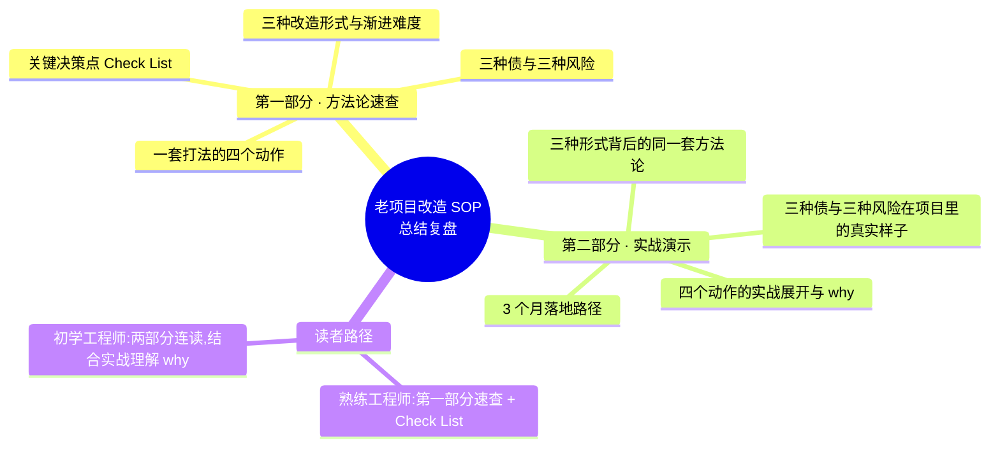

{: .no_toc }

<details close markdown="block">
  <summary>
    目录
  </summary>
  {: .text-delta }
- TOC
{:toc}
</details>

<!--
aicmigr-33-overall-recap-04-migration-sop
传统项目迁AI 33：总结复盘 - 老项目改造SOP
-->

> 知识可以忘，工作姿势忘不了。本篇是《专栏-企业级老项目改造》系列的总结复盘篇，把前面 32 篇跑过的所有动作重新组织一遍，变成一份能拎走的方法论资产。

**全文导读地图**



## 1. 概述


本篇不引入新方法论。前面 32 篇已经把该讲的方法论、提示词、工作流、踩过的坑都讲完了。本篇做的事是回头看，把整段跑过的动作重新组织一遍，变成一份能贴到墙上看的方法论地图。

整段一起走过的路径，从开篇词那句"老项目改造，Claude Code 能做好吗"开始，跑过三个真实项目、写过一百多段提示词、踩过一堆坑、留下了一份提示词 SOP 文档。本系列最终留给读者的，不是这些产出物本身，是一种工作姿势——面对任何陌生老项目都能用同一套方法论走下来。

### 1.1 两类读者的建议路径

| 读者类型 | 核心诉求 | 建议读法 |
|----------|----------|----------|
| 熟练 AI 编程工程师 | 快速回顾方法论、查看 Check List | 直接读第一部分（第 2 章），重点看 2.4 Check List |
| 初学 AI 编程工程师 | 系统全面掌握，结合案例理解 why | 两部分连读，第二部分对照第一部分理解 why |

### 1.2 与全系列的关系

本篇是对全系列的总结复盘。全系列跑过三个真实项目、三种形式、一套打法、一份 SOP 文档，最终交付的是工程师在 AI 时代的工作姿势。

## 2. 第一部分 · 方法论速查手册


本部分以参考手册风格组织，目标是阶段速查、快速复习、项目 Check List。条目化呈现，不深入具体技术栈细节（技术栈细节在第二部分展开）。

### 2.1 三种改造形式与渐进难度

老项目改造沿三种形式展开。这三种形式不是平行的三个练兵场，是同一件事的三种渐进难度。


| 形式 | 代码归属 | bug 归属 | 对应系列部分 | 关键反问或观点 |
|------|----------|----------|--------------|----------------|
| 公司内老项目改造 | 公司 | 公司 | 第二到第四部分 | 跑通"摸项目 → 建护栏 → 拆需求 → 改造"全流程 |
| 基于开源做需求 | 不是你的 | 不是你的 | 第五部分 | 第 25 篇：第一次翻译跑完，先反问"路径选对了吗" |
| 挑战开源 | 不是你的 | 不是你的 | 第六部分 | 第 30 篇：AI 时代开源 commit 比以前更值钱 |

三种形式背后是同一套方法论：读懂陌生代码、找到改造点、用 Claude Code 高效产出、保住质量。这套方法论是 AI 时代工程师的通用工作姿势，三种形式只是把它放在不同载体上跑三遍。

### 2.2 一套打法的四个动作


| 动作 | 对应系列部分 | 核心动作 | AI 参与度 |
|------|--------------|----------|-----------|
| ① 读懂陌生代码 | 第二部分 | 给拆解框架（架构/模块/依赖/接口/数据模型），让 AI 展开，认知写成 `CLAUDE.md` 留住 | 大量参与 |
| ② 建好改造前护栏 | 第三部分 | Characterization Test 凝固行为，跑得起来才有底气改 | 大量参与 |
| ③ 用提示词驱动产出 | 第四、六、七部分 | 普通场景驱动写代码/跑测试/提 PR；不熟语言场景让 AI 当助教边写边解释机制 | 大量参与 |
| ④ 显式拍板关键决策点 | 贯穿全程 | 判断 80 分初稿是否建立在对的方向上，方向不对改 100 遍也错 | 工程师自己做 |

四个动作合起来构成完整的"AI 时代企业级老项目改造方法论"。前三个动作 AI 大量参与产出，第四个动作只能是工程师自己。这条边界是全系列最重要的交付。

### 2.3 三种债与三种风险

业界已经在认真讨论 AI 时代工程师要警觉的事：Addy Osmani 提了 Comprehension Debt（理解债），Sonar 调研了 Verification Debt（验证债），Anthropic 的 52 人对照实验显示 AI 辅助开发者的代码理解能力比对照组低 17%。


| 类别 | 名称 | 含义 | 解药主线 |
|------|------|------|----------|
| 债 | 理解债 | 代码产出速度远超真正理解代码的速度 | 读懂陌生代码 → 写 `CLAUDE.md` 留住认知 |
| 债 | 验证债 | 代码看起来对，不代表它真的对（Sonar：96% 不完全信任，但仅 48% 每次都 review） | 建好改造前护栏 + Characterization Test |
| 债 | 改造路径债 | 第一次翻译跑出来的方案不一定是最优路径 | 第 25 篇"路径选对了吗"反问 |
| 风险 | 方向错的风险 | AI 顺着提问给方案，但提问不一定问对了 | 显式拍板关键决策点 |
| 风险 | AI 偷懒的风险 | 边界 case、warning 处理、不熟的栈上 AI 会偷偷用 `#[allow]` 或泛化兜底糊弄 | 工程师 review + 不留 allow 注解 |
| 风险 | 工程师跟不上的风险 | AI 越用越快，工程师对代码的真实把握越来越浅 | 让 AI 当助教，而不是写完就走的合伙人 |

把这三种债和三种风险加起来，工程师在 AI 时代真正的角色是：不是用 AI 的人，是对 AI 的产出负责的人。

### 2.4 关键决策点 Check List

本节是可裁剪速查表，供项目阶段评审时勾选。每条都是一个必须由工程师自己拍板的决策点，不能让 AI 替你拍。

#### (1) 摸项目阶段

- [ ] 是否给了 AI 一份明确的拆解框架（架构/模块/依赖/接口/数据模型），而不是让 AI 自由发挥？
- [ ] 跑出来的认知是否写成了 `CLAUDE.md`，留住对项目的理解？
- [ ] 是否点过产品、看过现状，而不是只看代码？

#### (2) 建护栏阶段

- [ ] 是否有能跑通的兜底测试，而不只是新增测试？
- [ ] Characterization Test 是否把"这一刻系统的行为"凝固成可执行代码？
- [ ] 任何后续改动跑这套测试，能否立刻发现行为偏移？

#### (3) 拆方案阶段

- [ ] 第一次翻译跑完后，是否停下来反问过"路径选对了吗"？
- [ ] 是否检查过刚摸过的开源项目/现有工程，方案里 80% 是不是已经有人做了？
- [ ] AI 给的方案是基于对的方向，还是基于你提问的方向？

#### (4) 写代码与 review 阶段

- [ ] AI 给的 80 分初稿，是否先判断方向对不对，再决定要不要继续改？
- [ ] 是否扫过 AI 写的 `#[allow]`、泛化兜底、warning 处理，确认没有偷懒糊弄？
- [ ] 不熟的语言/库，是否让 AI 解释机制（所有权、async、idiom），由工程师做判断？
- [ ] 关键决策点（选哪个 issue、走哪条路径、保哪个数据结构）是否由工程师拍板？

#### (5) 挑战开源阶段

- [ ] 挑的 issue 是否在算法层面有改进，而不是一行能改的代码风格？
- [ ] commit 是否公开可验证、可点击回溯？
- [ ] 贡献是否真的回去了，而不是停在 fork 分支？

## 3. 第二部分 · 实战演示与深度解释

本部分以实战教材风格组织，结合原文中的具体技术栈、项目背景、提示词，解释第一部分方法论背后的 why。让读者"不仅知其然，也知其所以然"。

### 3.1 三种形式背后的同一套方法论（实战对照）


三种形式放在不同载体上，跑的是同一套方法论。

#### (1) 公司内老项目改造：Java 后端项目

代码是公司的、bug 是公司的、方向是业务定的。本系列第二到第四部分以一个真实的 Java 后端项目为载体，完整跑过"摸项目 → 建护栏 → 拆需求 → 跑通改造"全流程。这是大多数工程师日常面对的场景。走完这一段，工程师心里有了第一份"怎么用 AI 改老代码"的肌肉记忆。

#### (2) 基于开源做需求：Hermes AI Agent 控制平面

代码不是你的，但用法是你的。本系列第五部分基于一个开源 AI Agent 控制平面做二次开发，产出一个 7×24 不间断运行的真实自动化测试系统。这部分最大的收获是第 25 篇那个反问：第一次翻译跑完之后，先停下来反问"路径选对了吗"。AI 顺着提问给的方案不一定是最优的——刚摸过的那个开源项目可能已经把方案里 80% 的工程都做了，不用自己撸。

#### (3) 挑战开源：Rust 开源项目

代码不是你的，bug 也不是你的，贡献回去。本系列第六部分带读者筛一个真实活跃的 Rust 开源项目，跑通两个 PR + 一个 issue，带回一个真实可点击验证的开源 Contributor 身份。这部分最大的收获是第 30 篇那个观点：在 AI 时代，开源 commit 反而比以前更值钱，因为它公开可验证、不可伪造、AI 写不出来。

#### (4) 三种形式收敛到同一套方法论

| 形式 | 工程师主要做什么 | AI 主要做什么 | 共同的方法论骨架 |
|------|------------------|---------------|------------------|
| 公司内改造 | 定方向、拍板需求、保质量 | 摸项目、写测试、写代码 | 读懂 → 建护栏 → 拆需求 → 改造 → 拍板 |
| 基于开源做需求 | 反问路径、判断方案 | 翻译需求、对接开源 API | 读懂 → 反问路径 → 拆方案 → 实现 → 拍板 |
| 挑战开源 | 挑 issue、判断算法层改进 | 解释机制、写 PR | 读懂 → 选 issue → 拆方案 → 提 PR → 拍板 |

三种形式背后收敛到同一套方法论：读懂陌生代码、找到改造点、用 Claude Code 高效产出、保住质量。

### 3.2 四个动作的实战展开与 why

#### (1) 动作一：读懂陌生代码


为什么给拆解框架？因为不给框架，AI 容易在它熟悉的维度展开（比如只看 README 和入口函数），漏掉工程师真正关心的维度（依赖关系、数据模型、接口契约）。给一份明确的拆解框架（架构、模块、依赖、接口、数据模型），AI 在框架下展开，认知覆盖才完整。

为什么写成 `CLAUDE.md` 留住认知？因为"理解债"的本质是代码产出速度远超工程师真正理解代码的速度。AI 帮你展开一遍，但下次再问还得展开一遍——除非把这次跑出来的认知写下来。`CLAUDE.md` 就是这份"认知锚点"，后续任何 AI 协作都基于它，认知不必每次重跑。

#### (2) 动作二：建好改造前护栏

为什么 Characterization Test 是生死线？因为"验证债"的本质是代码看起来对、不代表它真的对。Sonar 调研显示 96% 开发者不完全信任 AI 产出，但只有 48% 每次都 review——中间这 48% 的缺口就是 bug 漏过去的地方。Characterization Test 不是单纯写测试，是把"这一刻系统的行为是什么"凝固成可执行代码。任何后续改动跑这套测试就知道有没有偏移。这一步在大多数 AI 编程教程里被忽略，但在企业级老项目改造里是生死线：没有护栏的改造，AI 写得越快、埋的雷越多。

#### (3) 动作三：用提示词驱动产出


为什么普通场景和不熟语言场景要分两层处理？因为工程师的判断能力在不同场景下不同。

- 普通工作场景：工程师熟语言、熟栈，提示词驱动 AI 写代码、跑测试、提 PR 即可，工程师通过 review 把关。
- 不熟语言场景（如 Rust）：工程师没有能力直接判断代码细节对错。这时候让 AI 当你的技术栈助教——它写代码，边写边解释关键机制（所有权、async、特定库的 idiom），工程师基于解释做判断。工程师不熟没关系，AI 解释机制，工程师做判断。这是这套打法在 AI 时代最值钱的部分：把 AI 从"代笔"升级成"助教"，让工程师的能力边界跟着 AI 解释能力一起扩展，而不是被 AI 替代。

#### (4) 动作四：显式拍板关键决策点

为什么关键决策点不能让 AI 替你拍？因为 AI 给的是基于提问方向的 80 分初稿。如果提问方向错了，AI 把这 80 分改成 95 分只是把错误方向做得更精致。方向不对，改 100 遍也是错的。

三个贯穿全系列的拍板动作，本质上是同一件事：

| 出处 | 拍板动作 | 防的风险 |
|------|----------|----------|
| 第 25 篇 | 第一次翻译跑完，反问"路径选对了吗" | 改造路径债 |
| 第 20 篇 | 先点产品看现状，再决定怎么改 | 方向错的风险 |
| 第 31 篇 | 挑算法层面有改进的 issue，而不是一行能改的代码风格 | 投入产出比错位 |

这一动作在工具层面看不见，但跑完整段路径，工程师会感受到自己跟 AI 协作的姿势变了：从"让 AI 写"变成"让 AI 给初稿、自己拍方向"。

### 3.3 三种债与三种风险在项目里的真实样子


#### (1) 三种债在项目里的真实样子

##### ① 理解债：CLAUDE.md 是解药

业界说法：Addy Osmani 提出的 Comprehension Debt——代码产出速度远超工程师真正理解代码的速度。AI 写得快，但工程师脑子里没跟上。

在本系列项目里的真实样子：摸 Java 后端项目时，AI 一晚上能展开五个模块的依赖关系，但工程师第二天醒来未必能讲清楚这五个模块的调用链。

解药落地：把 AI 展开的认知写成 `CLAUDE.md`，作为团队的认知锚点。下次任何 AI 协作都基于它，认知不必每次重跑。

##### ② 验证债：Characterization Test 是解药

业界说法：Sonar 调研的 Verification Debt——代码看起来对，不代表它真的对。调研显示 96% 开发者不完全信任 AI 产出，但只有 48% 每次都 review，中间 48% 的缺口就是 bug 漏过去的地方。Anthropic 的 52 人对照实验进一步显示，AI 辅助开发者的代码理解能力比对照组低 17%。

在本系列项目里的真实样子：AI 改完一段 Java 代码、跑通现有测试，看起来一切正常。但现有测试覆盖不到的边界 case，可能已经被 AI 的"看起来对"糊弄过去。

解药落地：Characterization Test 把改造前的系统行为凝固成可执行代码。任何后续改动跑这套测试就知道有没有偏移。

##### ③ 改造路径债：第 25 篇反问是解药

业界说法：第一次跑出来的方案不一定是最优路径，如果不停下来反问，后面所有动作都建立在错的地基上。

在本系列项目里的真实样子：基于 Hermes 做二次开发时，AI 给的第一版翻译方案看起来面面俱到。但如果直接动手实现，可能要写大量基础设施代码——而 Hermes 本身已经把 80% 都做了。

解药落地：第一次翻译跑完之后，先停下来反问"路径选对了吗"，再决定走哪条路。

#### (2) 三种风险与解药落地

##### ① 方向错的风险：显式拍板是解药

AI 顺着提问给方案，但提问不一定问对了。如果工程师问"怎么实现 X"，AI 会想尽办法实现 X；但真正的需求可能是 Y。

解药落地：在拆方案、挑 issue、定路径这几个关键决策点，工程师自己拍板，不接受 AI 的默认值。

##### ② AI 偷懒的风险：review + 不留 allow 注解是解药

在边界 case、warning 处理、工程师不熟的栈上，AI 会偷偷用 `#[allow]` 或泛化兜底糊弄过去。

```rust
#[allow(dead_code)]   // 警惕：AI 偷懒的典型信号
fn legacy_handler() { ... }
```

解药落地：工程师 review 时专门扫一遍 `#[allow]`、泛化兜底、warning 处理，确认没有偷懒糊弄。allow 注解能不留就不留。

##### ③ 工程师跟不上的风险：让 AI 当助教是解药

AI 越用越快，工程师对代码的真实把握越来越浅。某天 AI 出了 bug，工程师已经不知道怎么修了——这是最危险的风险，因为它会悄悄累积，到爆雷时已经晚了。

解药落地：让 AI 当助教，而不是写完就走的合伙人。不熟的语言/库，让 AI 解释机制（所有权、async、idiom），由工程师做判断。工程师的能力边界跟着 AI 解释能力一起扩展，而不是被替代。

### 3.4 把方法论带回自己项目的 3 个月落地路径


本系列结束，工程师生涯接下来怎么走，才是真正的考题。本系列给出一份具体可执行的 3 个月路径——这不是建议，是本系列的延伸练习。


#### (1) 第 1 个月：摸项目 + 建护栏

| 维度 | 内容 |
|------|------|
| 目标 | 在公司老项目上跑通"摸项目 → 建护栏"的前半段 |
| 对应篇目 | 第 06-16 篇 |
| 关键动作 | 用四维度框架让 AI 给项目地图；跑通能跑的护栏；写 `CLAUDE.md` 留认知 |
| 验收信号 | 一周内拿到一份能跑的护栏测试套件，AI 协作基于 `CLAUDE.md` |
| 时间预算 | 一周够，不需要熬夜 |

#### (2) 第 2 个月：做一次真实改造

| 维度 | 内容 |
|------|------|
| 目标 | 在那个老项目上挑一个真实需求，跑完整改造流程 |
| 对应篇目 | 第 17-21 篇 |
| 关键动作 | 按"拆需求 → 拆方案 → 后端 → 前端"全流程跑；用第 21 篇的一键流程提示词；关键决策点停下来等工程师拍板 |
| 验收信号 | 三周内做完一次需求改造，代码合到主干 |
| 交付物 | 给本系列交的第一份作业 |

#### (3) 第 3 个月（上半）：基于开源做二次开发

| 维度 | 内容 |
|------|------|
| 目标 | 挑工作里能用上的开源项目，做点真实的东西 |
| 对应篇目 | 第 24-29 篇 |
| 候选项目 | 消息队列、Agent 框架、AI 工具链等 |
| 关键动作 | 按"两次翻译"流程做；第二次翻译前先反问"路径选对了吗" |
| 验收信号 | 月底产出一份方案文档 + 一份能跑的实现（不一定上线，认知和方法论也值得） |

#### (4) 第 3 个月（下半）：挑战开源

| 维度 | 内容 |
|------|------|
| 目标 | 给一个真实活跃的开源项目提第一个 PR |
| 对应篇目 | 第 30-32 篇 |
| 关键动作 | 按本系列流程筛项目；挑算法层面有改进的 issue；提 PR |
| 验收信号 | 月底 GitHub 个人页面多一条 contribution |
| 兑现观点 | 第 30 篇：在 AI 时代开源 commit 依然是简历最值钱的资产 |

走完这个流程，工程师的工作姿势会变成另一个样子。不是因为你做了什么了不起的事，是因为你没停下来。**频次大于单次重量**——这是项目改造、开源贡献、甚至整个工程师生涯里最值钱的一条。

## 4. 三句话总结与收尾

本系列跑完，留下三句话作为重点。每句话都对应着全系列里的具体动作，不是空泛口号。


### 4.1 第一句：把方向定准比把代码写好更值钱

AI 时代，工程师能交付的最值钱的东西不是写代码，是把方向定准、把约束讲清楚、把模糊变具体的能力。AI 给一个 80 分初稿，工程师要做的不是改成 95 分，是先判断初稿建立在对的方向上。方向不对，改 100 遍也是错的。

在本系列的落点：动作四"显式拍板关键决策点"贯穿全系列——第 25 篇反问路径、第 20 篇先看产品、第 31 篇挑算法级 issue，本质上都是这一句的实战化。

### 4.2 第二句：把时间投在 AI 替代不了的协作和判断上

让 Claude Code 加速产出，把时间投在它替代不了的协作和判断上。写代码这一段大量交给 AI，但 review、讨论、长期跟踪、跟人协作、判断方向，这些自己做。这是 AI 时代工程师的正确姿势。

在本系列的落点：动作三的"两层处理"——普通场景让 AI 代笔、不熟语言场景让 AI 当助教——本质上是把工程师的时间从"写"挪到"判"。

### 4.3 第三句：开源是耐心比赛，不是技术比赛

开源不是技术比赛，是耐心比赛。AI 时代，这条更对。本系列最后一段教挑战开源，本质上是教"把工程师生涯当长期事情来看"。3 个月、6 个月、1 年后回头看，会感谢现在按这个节奏走的自己。

在本系列的落点：第 30-32 篇的挑战开源路径，以及 3.4 节的 3 个月落地路径，都是这一句的可执行版本。

到这里，本系列收尾。三个项目、三种形式、一套打法、一份 SOP 文档，全部交付。
